**Chapter**

# **4 Plotting Data using Matplotlib**

"Human visual perception is the "most powerful of data interfaces between computers and Humans"

— M. McIntyre


## *In this chapter*

- » *Introduction*
- » *Plotting using Matplotlib*
- » *Customisation of Plots*
- » *The Pandas Plot Function (Pandas Visualisation)*

### **4.1 Introduction**

We have learned how to organise and analyse data and perform various statistical operations on Pandas DataFrames. Likewise, in Class XI, we have learned how to analyse numerical data using NumPy. The results obtained after analysis is used to make inferences or draw conclusions about data as well as to make important business decisions. Sometimes, it is not easy to infer by merely looking at the results. In such cases, visualisation helps in better understanding of results of the analysis.

Data visualisation means graphical or pictorial representation of the data using graph, chart, etc. The purpose of plotting data is to visualise variation or show relationships between variables.

Chapter 4.indd 105 10/9/2020 12:35:31 PM

**Notes**

Visualisation also helps to effectively communicate information to intended users. Traffic symbols, ultrasound reports, Atlas book of maps, speedometer of a vehicle, tuners of instruments are few examples of visualisation that we come across in our daily lives. Visualisation of data is effectively used in fields like health, finance, science, mathematics, engineering, etc. In this chapter, we will learn how to visualise data using Matplotlib library of Python by plotting charts such as line, bar, scatter with respect to the various types of data.

#### **4.2 Plotting using Matplotlib**

Matplotlib library is used for creating static, animated, and interactive 2D- plots or figures in Python. It can be installed using the following pip command from the command prompt:

pip install matplotlib

For plotting using Matplotlib, we need to import its Pyplot module using the following command:

import matplotlib.pyplot as plt

Here, plt is an alias or an alternative name for matplotlib.pyplot. We can use any other alias also.

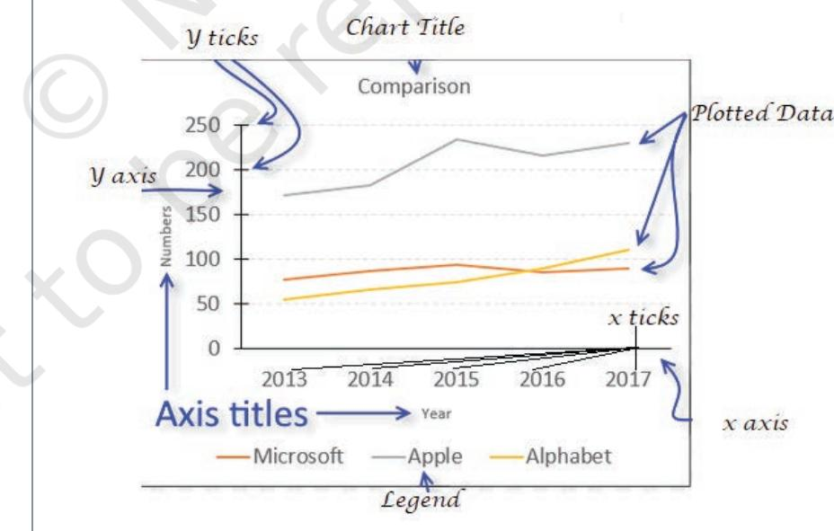

#### *Figure 4.1: Components of a plot*

The pyplot module of matplotlib contains a collection of functions that can be used to work on a plot. The plot() function of the pyplot module is used to create a figure. A figure is the overall window where the outputs of pyplot functions are plotted. A figure contains a

Chapter 4.indd 106 10/9/2020 12:35:31 PM

plotting area, legend, axis labels, ticks, title, etc. (Figure 4.1). Each function makes some change to a figure: example, creates a figure, creates a plotting area in a figure, plots some lines in a plotting area, decorates the plot with labels, etc.

It is always expected that the data presented through charts easily understood. Hence, while presenting data we should always give a chart title, label the axis of the chart and provide legend in case we have more than one plotted data.

To plot x versus y, we can write plt.plot(x,y). The show() function is used to display the figure created using the plot() function.

Let us consider that in a city, the maximum temperature of a day is recorded for three consecutive days. Program 4-1 demonstrates how to plot temperature values for the given dates. The output generated is a line chart.

Program 4-1 Plotting Temperature against Height

```
import matplotlib.pyplot as plt 
#list storing date in string format
date=["25/12","26/12","27/12"]
#list storing temperature values
temp=[8.5,10.5,6.8]
#create a figure plotting temp versus date
plt.plot(date, temp)
#show the figure
plt.show()
```
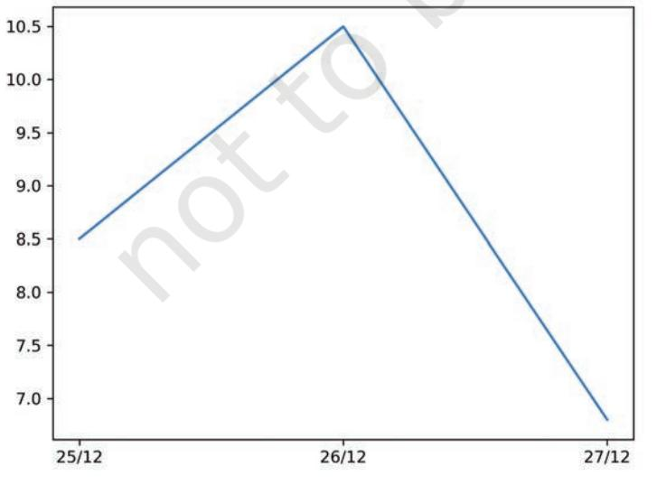

*Figure 4.2: Line chart as output of Program 4-1*

**Notes**

Chapter 4.indd 107 10/9/2020 12:35:32 PM

In program 4-1, plot() is provided with two parameters, which indicates values for x-axis and y-axis, respectively. The x and y ticks are displayed accordingly. As shown in Figure 4.2, the plot() function by default plots a line chart. We can click on the save button on the output window and save the plot as an image. A figure can also be saved by using savefig() function. The name of the figure is passed to the function as parameter.

For example: plt.savefig('x.png').

In the previous example, we used plot() function to plot a line graph. There are different types of data available for analysis. The plotting methods allow for a handful of plot types other than the default line plot, as listed in Table 4.1. Choice of plot is determined by the type of data we have.

#### **Table 4.1 List of Pyplot functions to plot different charts**

| plot(\*args[, scalex, scaley, data]) | Plot x versus y as lines and/or markers. |
| --- | --- |
| bar(x, height[, width, bottom, align, data]) | Make a bar plot. |
| boxplot(x[, notch, sym, vert, whis, ...]) | Make a box and whisker plot. |
| hist(x[, bins, range, density, weights, ...]) | Plot a histogram. |
| pie(x[, explode, labels, colors, autopct, ...]) | Plot a pie chart. |
| scatter(x, y[, s, c, marker, cmap, norm, ...]) | A scatter plot of x versus y. |

#### **4.3 Customisation of Plots**

Pyplot library gives us numerous functions, which can be used to customise charts such as adding titles or legends. Some of the customisation options are listed in Table 4.2:

#### **Table 4.2 List of Pyplot functions to customise plots**

| grid([b, which, axis]) | Configure the grid lines. |
| --- | --- |
| legend(\*args, \*\*kwargs) | Place a legend on the axes. |
| savefig(\*args, \*\*kwargs) | Save the current figure. |
| show(\*args, \*\*kw) | Display all figures. |
| title(label[, fontdict, loc, pad]) | Set a title for the axes. |
| xlabel(xlabel[, fontdict, labelpad]) | Set the label for the x-axis. |
| xticks([ticks, labels]) | Get or set the current tick locations and labels of the x-axis. |
| ylabel(ylabel[, fontdict, labelpad]) | Set the label for the y-axis. |
| yticks([ticks, labels]) | Get or set the current tick locations and labels of the y-axis. |

Chapter 4.indd 108 10/9/2020 12:35:32 PM

Program 4-2 Plotting a line chart of date versus temperature by adding Label on X and Y axis, and adding a Title and Grids to the chart.

> import matplotlib.pyplot as plt date=["25/12","26/12","27/12"] temp=[8.5,10.5,6.8] plt.plot(date, temp) plt.xlabel("Date") #add the Label on x-axis plt.ylabel("Temperature") #add the Label on y-axis plt.title("Date wise Temperature") #add the title to the chart plt.grid(True) #add gridlines to the background plt.yticks(temp) plt.show()

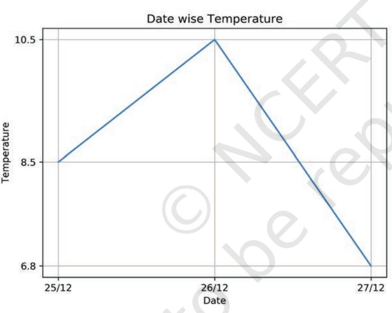

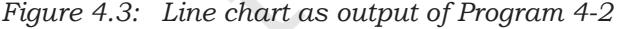

In the above example, we have used the xlabel, ylabel, title and yticks functions. We can see that compared to Figure 4.2, the Figure 4.3 conveys more meaning, easily. We will learn about customisation of other plots in later sections.

#### **4.3.1 Marker**

We can make certain other changes to plots by passing various parameters to the plot() function. In Figure 4.3, we plot temperatures day-wise. It is also possible to specify each point in the line through a marker.

#### **Think and Reflect**

On providing a single list or array to the plot() function, can matplotlib generate values for both the x and y axis?

Chapter 4.indd 109 10/9/2020 12:35:34 PM

A marker is any symbol that represents a data value in a line chart or a scatter plot. Table 4.3 shows a list of markers along with their corresponding symbol and description. These markers can be used in program codes:

| Marker | Symbol | Description | Marker | Symbol | Description |
| --- | --- | --- | --- | --- | --- |
| "." |  | Point | "8" |  | octagon |
| "," |  | Pixel | "s" |  | square |
| "o" |  | Circle | "p" |  | pentagon |
| "v" |  | triangle_down | "P" |  | plus (filled) |
| "^" |  | triangle_up | "*" |  | star |
| "<" |  | triangle_left | "h" |  | hexagon1 |
| ">" |  | triangle_right | "H" |  | hexagon2 |
| "1" |  | tri_down | "+" |  | plus |
| "2" |  | tri_up | "x" |  | x |
| "3" |  | tri_left | "X" |  | x (filled) |
| "4" |  | tri_right | "D" |  | diamond |

**Table 4.3 Some of the Matplotlib Markers**

#### **4.3.2 Colour**

It is also possible to format the plot further by changing the colour of the plotted data. Table 4.4 shows the list of colours that are supported. We can either use character codes or the color names as values to the parameter color in the plot().

| Character | Colour |
| --- | --- |
| 'b' | blue |
| 'g' | green |
| 'r' | red |
| 'c' | cyan |
| 'm' | magenta |
| 'y' | yellow |
| 'k' | black |
| 'w' | white |

#### **Table 4.4 Colour abbreviations for plotting**

2024-25

Chapter 4.indd 110 10/9/2020 12:35:34 PM

#### **4.3.3 Linewidth and Line Style**

The linewidth and linestyle property can be used to change the width and the style of the line chart. Linewidth is specified in pixels. The default line width is 1 pixel showing a thin line. Thus, a number greater than 1 will output a thicker line depending on the value provided.

We can also set the line style of a line chart using the linestyle parameter. It can take a string such as "solid", "dotted", "dashed" or "dashdot". Let us write the Program 4-3 applying some of the customisations.

- Program 4-3 Consider the average heights and weights of persons aged 8 to 16 stored in the following two lists:
height = [121.9,124.5,129.5,134.6,139.7,147.3, 152.4, 157.5,162.6] weight= [19.7,21.3,23.5,25.9,28.5,32.1,35.7,39.6, 43.2]

Let us plot a line chart where:

- i. x axis will represent weight
- ii. y axis will represent height
- iii. x axis label should be "Weight in kg"
- iv. y axis label should be "Height in cm"
- v. colour of the line should be green
- vi. use * as marker
- vii. Marker size as10
- viii. The title of the chart should be "Average weight with respect to average height".
- ix. Line style should be dashed
- x. Linewidth should be 2.
- import matplotlib.pyplot as plt

```
import pandas as pd
```

```
height=[121.9,124.5,129.5,134.6,139.7,147.3,152.4,157.5,162.6]
```
weight=[19.7,21.3,23.5,25.9,28.5,32.1,35.7,39.6,43.2]

df=pd.DataFrame({"height":height,"weight":weight})

#Set xlabel for the plot

plt.xlabel('Weight in kg')

#Set ylabel for the plot

Chapter 4.indd 111 10/9/2020 12:35:34 PM

```
plt.ylabel('Height in cm')
#Set chart title:
plt.title('Average weight with respect to average height')
#plot using marker'-*' and line colour as green
plt.plot(df.weight,df.height,marker='*',markersize=10,color='green
',linewidth=2, linestyle='dashdot')
plt.show()
```
In the above we created the DataFrame using 2 lists, and in the plot function we have passed the height and weight columns of the DataFrame. The output is shown in Figure 4.4.

Continuous data are measured while discrete data are obtained by counting. Height, weight are examples of continuous data. It can be in decimals. Total number of students in a class is discrete. It can never be in decimals.

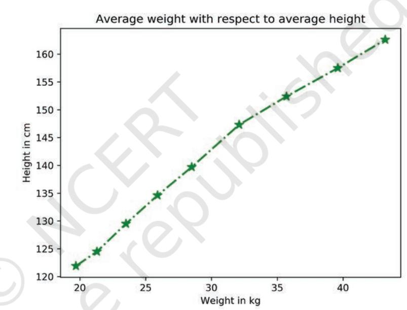

*Figure 4.4: Line chart showing average weight against average height*

#### **4.4 The Pandas Plot function (Pandas Visualisation)**

In Programs 4-1 and 4-2, we learnt that the plot() function of the pyplot module of matplotlib can be used to plot a chart. However, starting from version 0.17.0, Pandas objects Series and DataFrame come equipped with their own .plot() methods. This plot() method is just a simple wrapper around the plot() function of pyplot. Thus, if we have a Series or DataFrame type object (let's say 's' or 'df') we can call the plot method by writing:

```
s.plot() or df.plot()
```
Chapter 4.indd 112 10/9/2020 12:35:35 PM

The plot() method of Pandas accepts a considerable number of arguments that can be used to plot a variety of graphs. It allows customising different plot types by supplying the kind keyword arguments. The general syntax is: plt.plot(kind),where kind accepts a string indicating the type of .plot, as listed in Table 4.5. In addition, we can use the matplotlib.pyplot methods and functions also along with the plt() method of Pandas objects.

| kind = | Plot type |
| --- | --- |
| line | Line plot (default) |
| bar | Vertical bar plot |
| barh | Horizontal bar plot |
| hist | Histogram |
| box | Boxplot |
| area | Area plot |
| pie | Pie plot |
| scatter | Scatter plot |

|
|  |

In the previous chapters, we have learned to store different types of data in a two dimensional format using DataFrame. In the subsequent sections we will learn to use plot() function to create various types of charts with respect to the type of data stored in DataFrames.

#### **4.4.1 Plotting a Line chart**

A line plot is a graph that shows the frequency of data along a number line. It is used to show continuous dataset. A line plot is used to visualise growth or decline in data over a time interval. We have already plotted line charts through Programs 4-1 and 4-2. In this section, we will learn to plot a line chart for data stored in a DataFrame.

Program 4-4Smile NGO has participated in a three week cultural mela. Using Pandas, they have stored the sales (in Rs) made day wise for every week in a CSV file named "MelaSales.csv", as shown in Table 4.6.


Create the MelaSale. csv using Python Pandas containing data as shown in Table 4.6.

Chapter 4.indd 113 10/9/2020 12:35:36 PM

| Week 1 | Week 2 | Week 3 |
| --- | --- | --- |
| 5000 | 4000 | 4000 |
| 5900 | 3000 | 5800 |
| 6500 | 5000 | 3500 |
| 3500 | 5500 | 2500 |
| 4000 | 3000 | 3000 |
| 5300 | 4300 | 5300 |
| 7900 | 5900 | 6000 |

**Table 4.6 Day-wise mela sales data**

Depict the sales for the three weeks using a Line chart. It should have the following:

i. Chart title as "Mela Sales Report".

- ii. axis label as Days.
- iii. axis label as "Sales in Rs".

Line colours are red for week 1, blue for week 2 and brown for week 3.

```
import pandas as pd
import matplotlib.pyplot as plt
# reads "MelaSales.csv" to df by giving path to the file
df=pd.read_csv("MelaSales.csv") 
#create a line plot of different color for each week
df.plot(kind='line', color=['red','blue','brown'])
# Set title to "Mela Sales Report"
plt.title('Mela Sales Report')
# Label x axis as "Days"
plt.xlabel('Days') 
# Label y axis as "Sales in Rs"
plt.ylabel('Sales in Rs')
#Display the figure
plt.show()
```
The Figure 4.5 displays a line plot as output for Program 4-4. Note that the legend is displayed by default associating the colours with the plotted data.

Chapter 4.indd 114 10/9/2020 12:35:36 PM

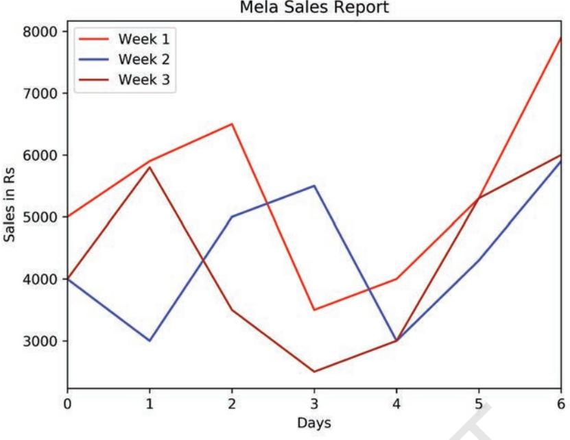

*Figure 4.5: Line plot showing mela sales figures*

The line plot takes a numeric value to display on the x axis and hence uses the index (row labels) of the DataFrame in the above example. Thus, x tick values are the index of the DataFramedf that contains data stored in MelaSales.CSV.

#### *Customising Line Plot*

We can substitute the ticks at x axis with a list of values of our choice by using plt.xticks(ticks,label) where ticks is a list of locations(locs) on x axis at which ticks should be placed, label is a list of items to place at the given ticks.

- Program 4-5 Assuming the same CSV file, i.e., MelaSales. CSV, plot the line chart with following customisations:

```
Maker ="*"
Marker size=10
linestyle="--" 
Linewidth =3
import pandas as pd
import matplotlib.pyplot as plt
df=pd.read_csv("MelaSales.csv") 
#creates plot of different color for each week
df.plot(kind='line', color=['red','blue','brown'],marker="*",marke
rsize=10,linewidth=3,linestyle="--")
```
Chapter 4.indd 115 10/9/2020 12:35:37 PM

```
plt.title('Mela Sales Report')
plt.xlabel('Days') 
plt.ylabel('Sales in Rs')
#store converted index of DataFrame to a list
ticks = df.index.tolist()
#displays corresponding day on x axis
plt.xticks(ticks,df.Day)
plt.show()
```
Figure 4.6 is generated as output of Program 4-5 with xticks as Day names.

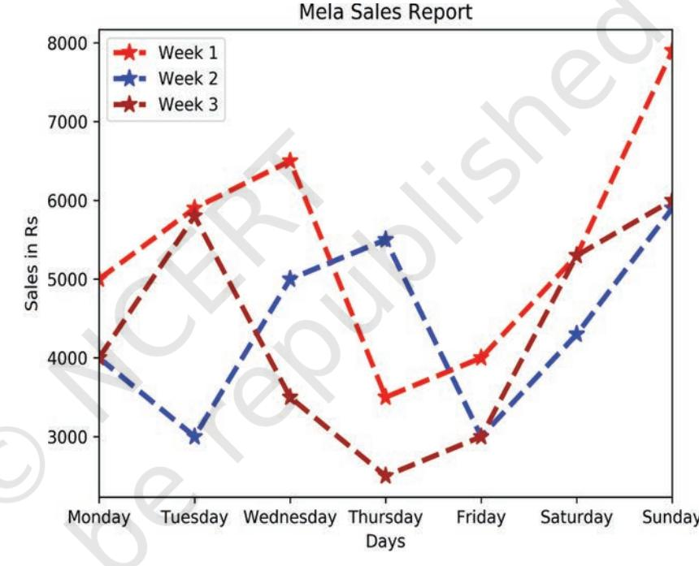

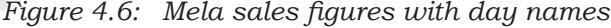

#### **4.4.2 Plotting Bar Chart**

The line plot in Figure 4.6 shows that the sales for all the weeks increased during the weekend. Other than weekends, it also shows that the sales increased on Wednesday for Week 1, on Thursday for Week 2 and on Tuesday for Week 3.

But, the lines are unable to efficiently depict comparison between the weeks for which the sales data is plotted. In order to show comparisons, we prefer Bar charts. Unlike line plots, bar charts can plot strings on the x axis. To plot a bar chart, we will specify kind='bar'. We can also specify the DataFrame columns to be used as x and y axes.

Chapter 4.indd 116 10/9/2020 12:35:39 PM

Let us now add a column "Days" consisting of day names to "MelaSales.csv" as shown in Table 4.7.

| Table 4.7 |  | Day-wise sales data along with Day's names |  |
| --- | --- | --- | --- |
| Week 1 | Week 2 | Week 3 | Day |
| 5000 | 4000 | 4000 | Monday |
| 5900 | 3000 | 5800 | Tuesday |
| 6500 | 5000 | 3500 | Wednesday |
| 3500 | 5500 | 2500 | Thursday |
| 4000 | 3000 | 3000 | Friday |
| 5300 | 4300 | 5300 | Saturday |
| 7900 | 5900 | 6000 | Sunday |

If we do not specify the column name for the x parameter in the plot(), the bar plot will plot all the columns of the DataFrame with the index (row label) of DataFrame at x axis which is a numeric starting from 0.

- Program 4-6 This program displays the Python script to display Bar plot for the "MelaSales.csv" file with column Day on x axis as shown below in Figure 4.7

```
import pandas as pd
```
df= pd.read_csv('MelaSales.csv')

```
import matplotlib.pyplot as plt
```
# plots a bar chart with the column "Days" as x axis df.plot(kind='bar',x='Day',title='Mela Sales Report')

```
#set title and set ylabel
```

```
plt.ylabel('Sales in Rs')
```

```
plt.show()
```
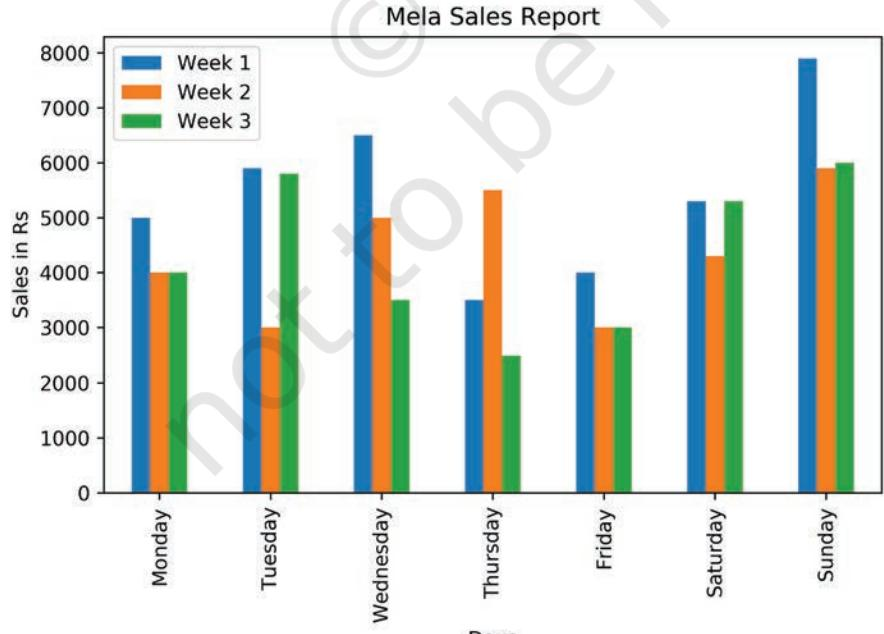

*Figure 4.7: A bar chart as output of Program 4-6*

Chapter 4.indd 117 10/9/2020 12:35:41 PM

#### *Customising Bar Chart*

We can also customise the bar chart by adding certain parameters to the plot function. We can control the edgecolor of the bar, linestyle and linewidth. We can also control the color of the lines. The following example shows various customisations on the bar chart of Figure 4.8

Program 4-7 Let us write a Python script to display Bar plot for the "MelaSales.csv" file with column Day on x axis, and having the following customisation:

- Changing the color of each bar to red, yellow and purple.
- Edgecolor to green
- Linewidth as 2
- Line style as "--"

```
import pandas as pd
```

```
import matplotlib.pyplot as plt
df= pd.read_csv('MelaSales.csv')
# plots a bar chart with the column "Days" as x axis
df.plot(kind='bar',x='Day',title='Mela Sales Report',color=['red',
'yellow','purple'],edgecolor='Green',linewidth=2,linestyle='--')
#set title and set ylabel
plt.ylabel('Sales in Rs')
plt.show()
```
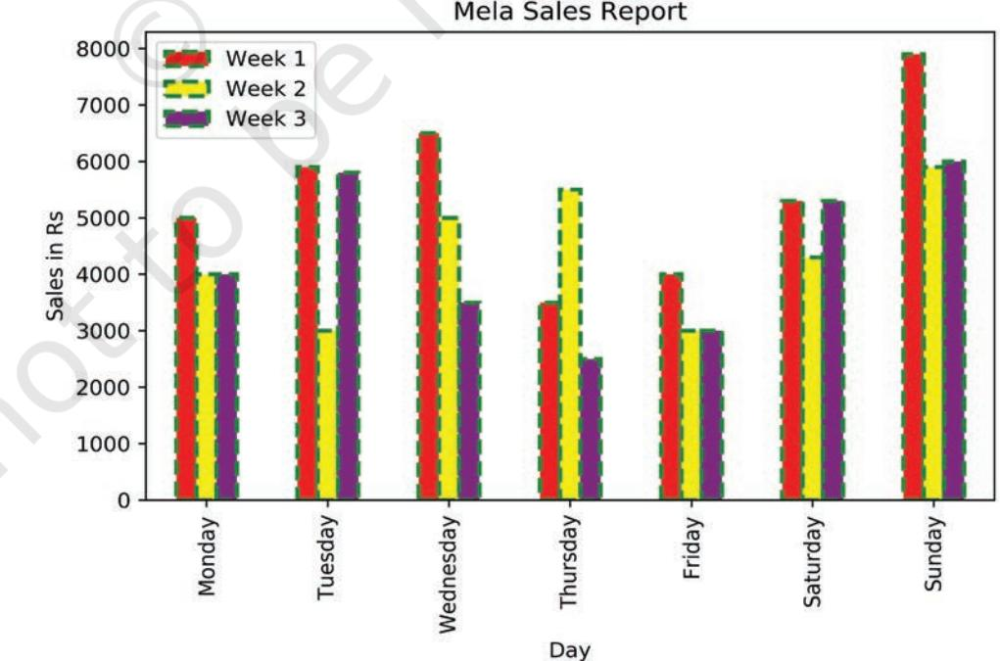

*Figure 4.8: A bar chart as output of Program 4-7*

Chapter 4.indd 118 10/9/2020 12:35:42 PM

#### **4.4.3 Plotting Histogram**

Histograms are column-charts, where each column represents a range of values, and the height of a column corresponds to how many values are in that range.

To make a histogram, the data is sorted into "bins" and the number of data points in each bin is counted. The height of each column in the histogram is then proportional to the number of data points its bin contains.

The df.plot(kind='hist') function automatically selects the size of the bins based on the spread of values in the data.

Program 4-8

```
import pandas as pd
import matplotlib.pyplot as plt
data = {'Name':['Arnav', 'Sheela', 'Azhar', 'Bincy', 'Yash', 
'Nazar'], 
'Height' : [60,61,63,65,61,60], 
'Weight' : [47,89,52,58,50,47]}
     }
df=pd.DataFrame(data)
df.plot(kind='hist')
plt.show()
```
The Program 4-9 displays the histogram corresponding to all attributes having numeric values, i.e., 'Height' and 'Weight' attributes as shown in Figure 4.9. On the basis of the height and weight values provided in the DataFrame, the plot() calculated the bin values.

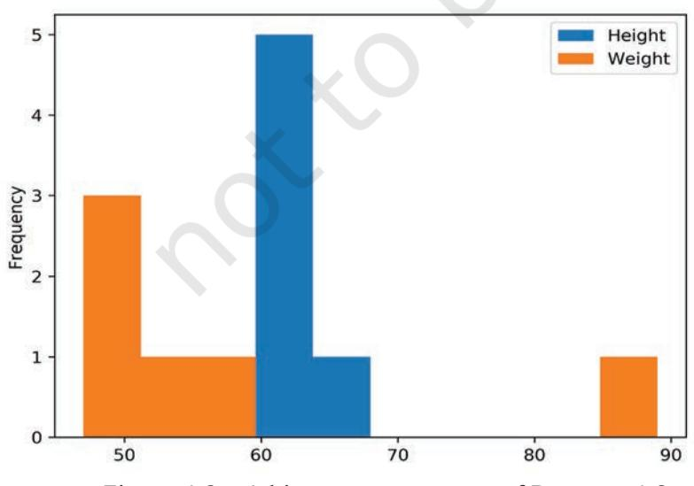

*Figure 4.9: A histogram as output of Program 4-8*

If we do not specify Bins are the number of intervals you want to divide all of your data into, such that it can be displayed as bars on a histogram.

**Think and Reflect**

How can we make the bar chart of Figure 4.8 horizontal?

Chapter 4.indd 119 10/9/2020 12:35:44 PM

It is also possible to set value for the bins parameter, for example,

```
df.plot(kind='hist',bins=20) 
df.plot(kind='hist',bins=[18,19,20,21,22])
df.plot(kind='hist',bins=range(18,25))
```
#### *Customising Histogram*

Taking the same data as above, now let see how the histogram can be customised. Let us change the edgecolor, which is the border of each hist, to green. Also, let us change the line style to ":" and line width to 2. Let us try another property called fill, which takes boolean values. The default True means each hist will be filled with color and False means each hist will be empty. Another property called hatch can be used to fill to each hist with pattern ( '-', '+', 'x', '\\', '*', 'o', 'O', '.'). In the Program 4-10, we have used the hatch value as "o".

#### Program 4-9

```
import pandas as pd
import matplotlib.pyplot as plt
data = {'Name':['Arnav', 'Sheela', 'Azhar','Bincy','Yash', 
'Nazar'], 
'Height' : [60,61,63,65,61,60], 
'Weight' : [47,89,52,58,50,47]}
df=pd.DataFrame(data)
df.plot(kind='hist',edgecolor='Green',linewidth=2,linestyle=':',fil
l=False,hatch='o')
```

```
plt.show()
```
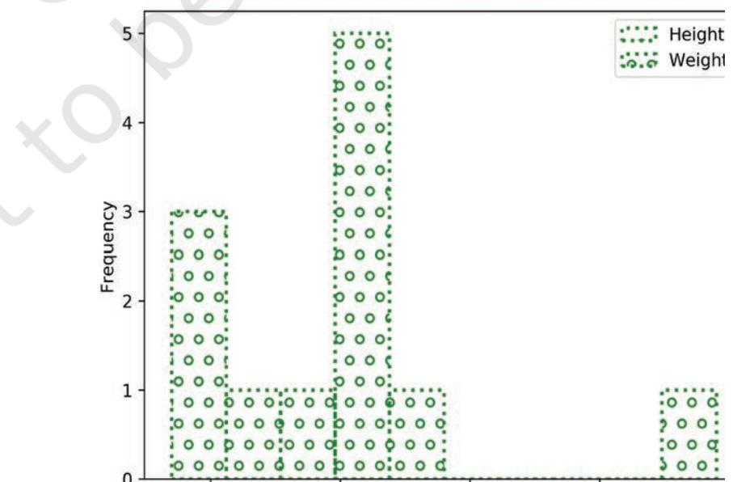

*Figure 4.10: Customised histogram as output of Program 4-9*

2024-25

Chapter 4.indd 120 10/9/2020 12:35:45 PM

#### *Using Open Data*

There are many websites that provide data freely for anyone to download and do analysis, primarily for educational purposes. These are called Open Data as the data source is open to the public. Availability of data for access and use promotes further analysis and innovation. A lot of emphasis is being given to open data to ensure transparency, accessibility and innovation. "Open Government Data (OGD) Platform India" (data. gov.in) is a platform for supporting the Open Data initiative of the Government of India. Large datasets on different projects and parameters are available on the platform.

Let us consider a dataset called "Seasonal and Annual Min/Max Temp Series - India from 1901 to 2017" from the URL https://data.gov.in/resources/seasonal-andannual-minmax-temp-series-india-1901-2017.

Our aim is to plot the minimum and maximum temperature and observe the number of times (frequency) a particular temperature has occurred. We only need to extract the 'ANNUAL - MIN' and 'ANNUAL - MAX' columns from the file. Also, let us aim to display two Histogram plots:

i) Only for 'ANNUAL - MIN'

ii) For both 'ANNUAL - MIN' and 'ANNUAL - MAX'

#### Program 4-10

```
import pandas as pd
import matplotlib.pyplot as plt
#read the CSV file with specified columns
#usecols parameter to extract only two required columns
data=pd.read_csv("Min_Max_Seasonal_IMD_2017.csv",
     usecols=['ANNUAL - MIN','ANNUAL - MAX'])
df=pd.DataFrame(data)
#plot histogram for 'ANNUAL - MIN'
df.plot(kind='hist',y='ANNUAL - MIN',title='Annual Minimum 
Temperature (1901-2017)')
plt.xlabel('Temperature')
plt.ylabel('Number of times')
#plot histogram for both 'ANNUAL - MIN' and 'ANNUAL - MAX'
df.plot(kind='hist',
```
Chapter 4.indd 121 10/9/2020 12:35:45 PM

```
title='Annual Min and Max Temperature (1901-2017)',color=['b
lue','red'])
plt.xlabel('Temperature')
plt.ylabel('Number of times')
plt.show()
```
The Figures 4.11 and 4.12 are produced as output of Program 4-10.

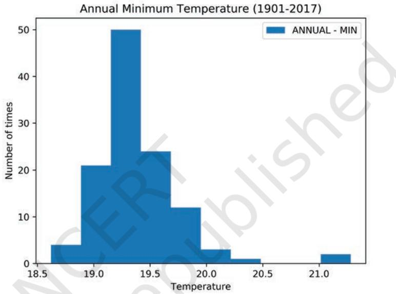

*Figure 4.11: Histogram for 'ANNUAL – MIN' and 'ANNUAL – MAX'*


*Figure 4.12: Histogram for 'ANNUAL – MIN'*

```
2024-25
```
Chapter 4.indd 122 10/9/2020 12:35:48 PM

```
Program 4-11 Plot a frequency polygon for the 'ANNUAL –
            MIN' column of the "Min/Max Temp" data 
            over the histogram depicting it.
import numpy as np
import pandas as pd
import matplotlib.pyplot as plt
data=pd.read_csv("Min_Max_Seasonal_IMD_2017.csv",
     usecols=['ANNUAL - MIN'])
     df=pd.DataFrame(data)
     #convert the 'ANNUAL - MIN' column into a numpy 1D array
     minarray=np.array([df['ANNUAL - MIN']])
     # Extract y (frequency) and edges (bins)
     y,edges = np.histogram(minarray)
     #calculate the midpoint for each bar on the histogram
     mid = 0.5*(edges[1:]+ edges[:-1])
     df.plot(kind='hist',y='ANNUAL - MIN'
```

```
plt.plot(mid,y,'-^')
```

```
plt.title('Annual Min Temperature plot(1901 - 2017)')
```

```
plt.xlabel('Temperature')
```

```
plt.show()
```
Annual Min Temperature plot (1901 – 2017)

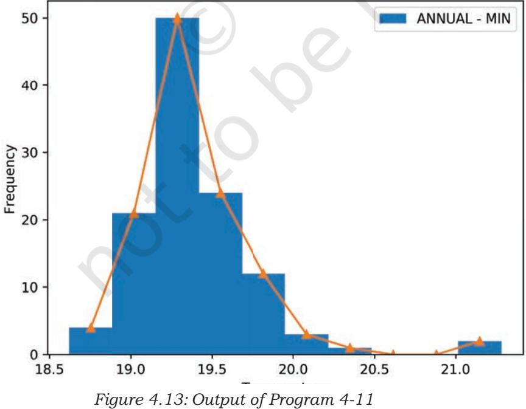

Chapter 4.indd 123 10/9/2020 12:35:49 PM

#### **4.4.4 Plotting Scatter Chart**

A scatter chart is a two-dimensional data visualisation method that uses dots to represent the values obtained for two different variables —one plotted along the x-axis and the other plotted along the y-axis.

Scatter plots are used when you want to show the relationship between two variables. Scatter plots are sometimes called correlation plots because they show how two variables are correlated. Additionally, the size, shape or color of the dot could represent a third (or even fourth variable).

- Program 4-12 Prayatna sells designer bags and wallets. During the sales season, he gave discounts ranging from 10% to 50% over a period of 5 weeks. He recorded his sales for each type of discount in an array. Draw a scatter plot to show a relationship between the discount offered and sales made.

```
import numpy as np
```

```
import matplotlib.pyplot as plt
```

```
discount= np.array([10,20,30,40,50])
```
saleInRs=np.array([40000,45000,48000,50000,100000])

```
plt.scatter(x=discount,y=saleInRs)
```

```
plt.title('Sales Vs Discount')
```

```
plt.xlabel('Discount offered')
```

```
plt.ylabel('Sales in Rs')
```

```
plt.show()
```
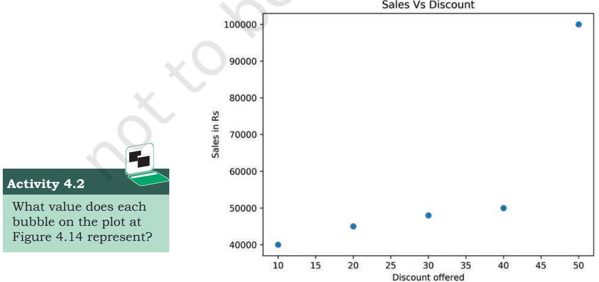

*Figure 4.14: Output of Program 4-12*

Chapter 4.indd 124 10/9/2020 12:35:51 PM

#### *Customising Scatter chart*

The size of the bubble can also be used to reflect a value. For example, in program 4-14, we have opted for displaying the size of the bubble as 10 times the discount, as shown in Figure 4.15. The colour and markers can also be changed in the above plot by adding the following statements:

Program 4-13

```
What would 
                                                   happen if we use 
                                                   df.plot(kind='scatter') 
                                                   instead of plt.scatter() 
                                                  Think and Reflect
import numpy as np
import matplotlib.pyplot as plt
discount= np.array([10,20,30,40,50])
saleInRs=np.array([40000,45000,48000,50000,100000])
size=discount*10
plt.scatter(x=discount,y=saleInRs,s=size,color='red',linewidth=3,m
arker='*',edgecolor='blue')
plt.title('Sales Vs Discount')
plt.xlabel('Discount offered')
plt.ylabel('Sales in Rs')
plt.show()
```
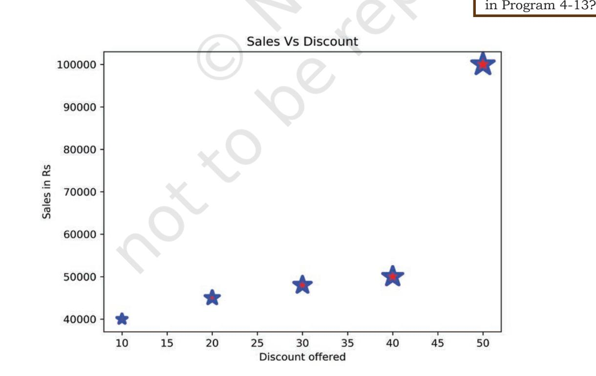

*Figure 4.15: Scatter plot based on modified Program 4-13*

Chapter 4.indd 125 10/9/2020 12:35:53 PM

**Notes**

#### **4.4.5 Plotting Quartiles and Box plot**

Suppose an entrance examination of 200 marks is conducted at the national level, and Mahi has topped the exam by scoring 120 marks. The result shows 100 percentile against Mahi's name, which means all the candidates excluding Mahi have scored less than Mahi. To visualise this kind of data, we use quartiles.

Quartiles are the measures which divide the data into four equal parts, and each part contains an equal number of observations. Calculating quartiles requires calculation of median. Quartiles are often used in educational achievement data, sales and survey data to divide populations into groups. For example, you can use Quartile to find the top 25 percent of students in that examination.

A Box Plot is the visual representation of the statistical summary of a given data set. The summary includes Minimum value, Quartile 1, Quartile 2, Median, Quartile 4 and Maximum value. The whiskers are the two lines outside the box that extend to the highest and lowest values. It also helps in identifying the outliers. An outlier is an observation that is numerically distant from the rest of the data, as shown in Figure 4.16:

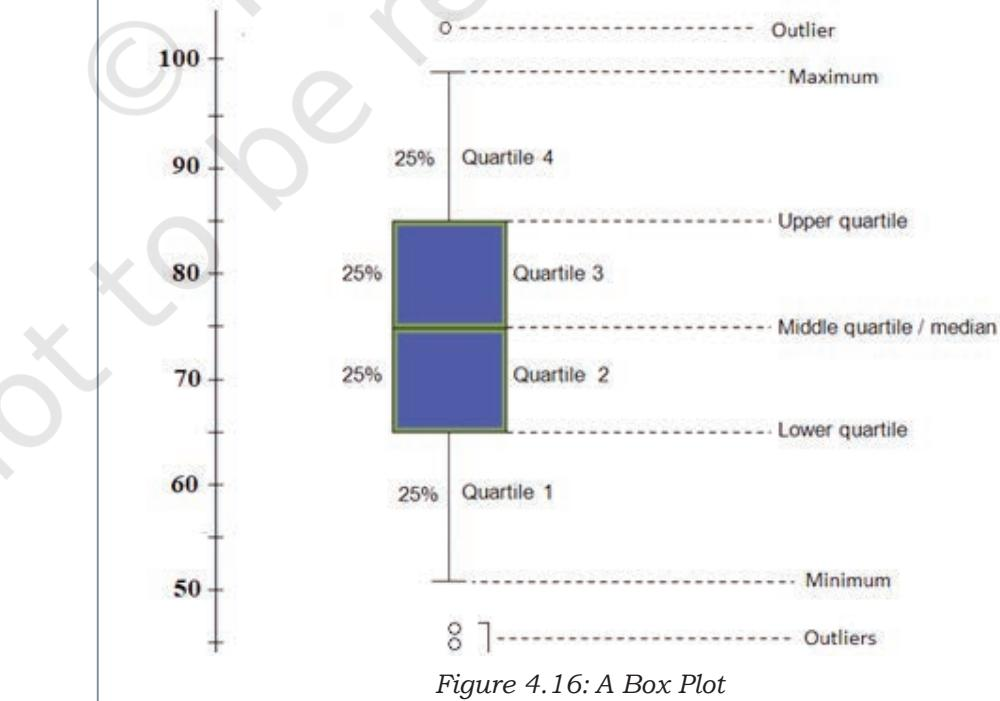

Chapter 4.indd 126 10/9/2020 12:35:53 PM

- Program 4-14 In order to assess the performance of students of a class in the annual examination, the class teacher stored marks of the students in all the 5 subjects in a CSV "Marks.csv" file as shown in Table 4.8. Plot the data using boxplot and perform a comparative analysis of performance in each subject.

| Name | English | Maths | Hindi | Science | Social_Studies |
| --- | --- | --- | --- | --- | --- |
| Rishika Batra | 95 | 95 | 90 | 94 | 95 |
| Waseem Ali | 95 | 76 | 79 | 77 | 89 |
| Kulpreet Singh | 78 | 81 | 75 | 76 | 88 |
| Annie Mathews | 88 | 63 | 67 | 77 | 80 |
| Shiksha | 95 | 55 | 51 | 59 | 80 |
| Naveen Gupta | 82 | 55 | 63 | 56 | 74 |
| Taleem Ahmed | 73 | 49 | 54 | 60 | 77 |
| Pragati Nigam | 80 | 50 | 51 | 54 | 76 |
| Usman Abbas | 92 | 43 | 51 | 48 | 69 |
| Gurpreet Kaur | 60 | 43 | 55 | 52 | 71 |
| Sameer Murthy | 60 | 43 | 55 | 52 | 71 |
| Angelina | 78 | 33 | 39 | 48 | 68 |
| Angad Bedi | 62 | 43 | 51 | 48 | 54 |

#### **Table 4.8 Marks obtained by students in five subjects**

```
Program 4-14
     import numpy as np
     import pandas as pd
     import matplotlib.pyplot as plt
     data= pd.read_csv('Marks.csv')
     df= pd.DataFrame(data)
     df.plot(kind='box')
     #set title,xlabel,ylabel
     plt.title('Performance Analysis')
     plt.xlabel('Subjects')
     plt.ylabel('Marks')
     plt.show()
```
#### **Think and Reflect**

What would happen if the label or row index passed is not present in the DataFrame?

Chapter 4.indd 127 10/9/2020 12:35:53 PM

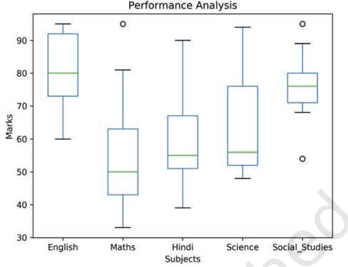

*Figure 4.17: A boxplot of "Marks.csv"*

The distance between the box and lower or upper whiskers in some boxplots are more, and in some less. Shorter distance indicates small variation in data, and longer distance indicates spread in data to mean larger variation.

Program 4-15 To keep improving their services, XYZ group of hotels have asked all the three hotels to get feedback form filled by their customers at the time of checkout. After getting ratings on a scale of (1–5) on factors such as Food, Service, Ambience, Activities, Distance from tourist spots they calculate the average rating and store it in a CSV file. The data are given in Table 4.9.

| Year | Sunny Bunny Resort | Happy Lucky Resort | Breezy WIndy Resort |
| --- | --- | --- | --- |
| 2014 | 4.75 | 3 | 4.5 |
| 2015 | 2.5 | 4 | 2 |
| 2016 | 3.5 | 2.5 | 3 |
| 2017 | 4 | 2 | 3.5 |
| 2018 | 1.5 | 4.5 | 1 |

**Table 4.9 Year-wise average ratings on five parameters**

This year, to award the best hotel they have decided to analyse the ratings of the past 5 years for each of the hotels. Plot the data using Boxplot.

Chapter 4.indd 128 10/9/2020 12:35:55 PM

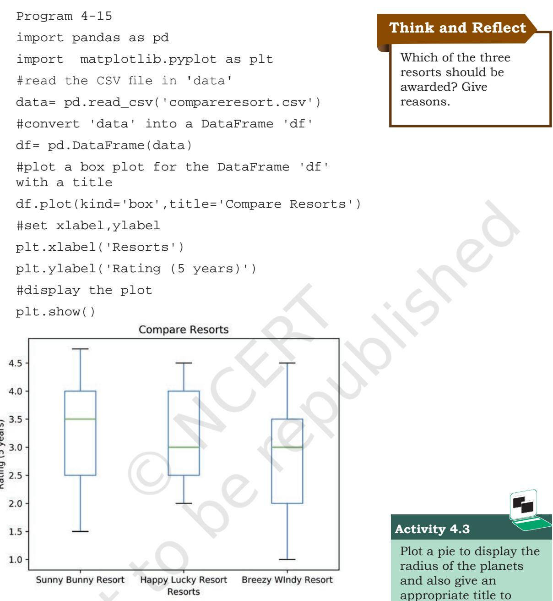

*Figure 4.18: A boxplot as output of Program 4.15.*

#### *Customising Box plot*

We can display the whisker in horizontal direction by adding a parameter vert=False in the Program 4-15, as shown in the following line of code. We can change the color of the whisker as well. The output of the modified Program is shown in Figure 4.19.

```
df.plot(kind='box',title='Compare Resorts', 
color='red', vert=False)
```
appropriate title to the plot.

Chapter 4.indd 129 10/9/2020 12:35:56 PM

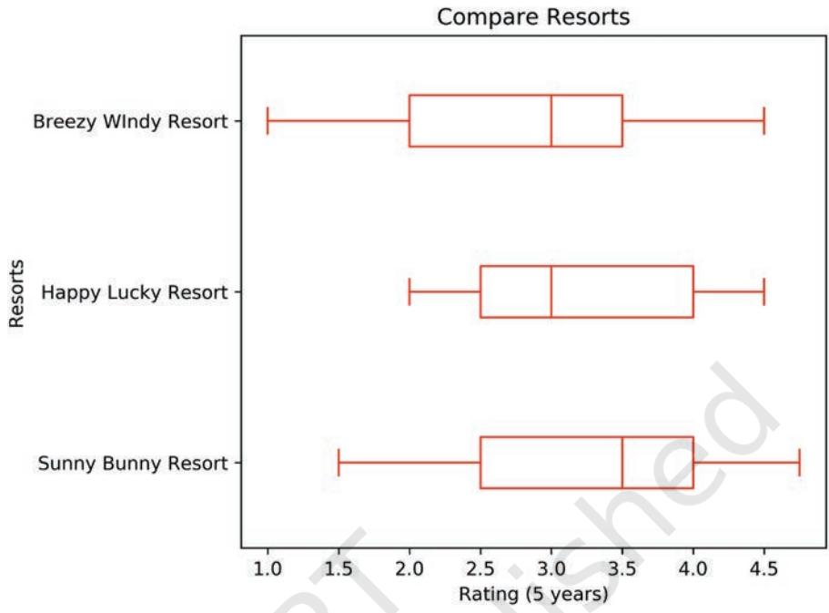

*Figure 4.19: The horizontal boxplot after modifying Program 4.15.*

#### **4.4.6 Plotting Pie Chart**

Pie is a type of graph in which a circle is divided into different sectors and each sector represents a part of the whole. A pie plot is used to represent numerical data proportionally. To plot a pie chart, either column label y or 'subplots=True' should be set while using df.plot(kind='pie') . If no column reference is passed and subplots=True, a 'pie' plot is drawn for each numerical column independently.

In the Program 4.16, we have a DataFrame with information about the planet's mass and radius. The 'mass' column is passed to the plot() function to get a pie plot as shown in Figure 4.20.

#### Program 4-16

```
import pandas as pd
import matplotlib.pyplot as plt
df = pd.DataFrame({'mass': [0.330, 4.87 , 5.97],
      'radius': [2439.7, 6051.8, 6378.1]},
     index=['Mercury', 'Venus', 'Earth'])
df.plot(kind='pie',y='mass')
plt.show()
```
Chapter 4.indd 130 10/9/2020 12:35:58 PM

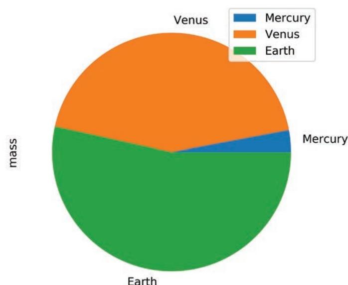

*Figure 4.20: Pie chart as output of Program 4-16.*

It is important to note that the default label names are the index value of the DataFrame. The labels as shown in Figure 4.20 are the names of the planet which are the index values as shown in Program 4.16.

Program 4-17 Let us consider the dataset of Table 4.10 showing the forest cover of north eastern states that contains geographical area and corresponding forest cover in sq km along with the names of the corresponding states.

| State | GeoArea | ForestCover |
| --- | --- | --- |
| Arunachal Pradesh | 83743 | 67353 |
| Assam | 78438 | 27692 |
| Manipur | 22327 | 17280 |
| Meghalaya | 22429 | 17321 |
| Mizoram | 21081 | 19240 |
| Nagaland | 16579 | 13464 |
| Tripura | 10486 | 8073 |

#### **Table 4.10 Forest cover of north eastern states**

Program 4-17 import pandas as pd import matplotlib.pyplot as plt df=pd.DataFrame({'GeoArea':[83743,78438,22327,22429,21081,16579,10 486],'ForestCover':[67353,27692,17280,17321,19240,13464,8073]}, index=['Arunachal Pradesh','Assam','Manipur','Meghalaya', 'Mizoram','Nagaland','Tripura'])

Chapter 4.indd 131 10/9/2020 12:36:00 PM

df.plot(kind='pie',y='ForestCover',

title='Forest cover of North Eastern states',legend=False) plt.show()

#### **Think and Reflect**

What effect did 'legend= False' in Program 4.17 have on the output?

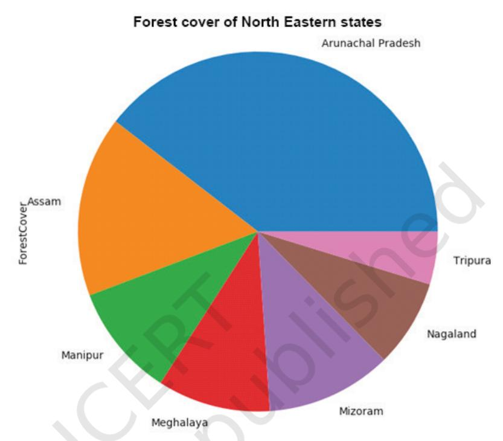

*Figure 4.21: Pie chart as output of Program 4.17*

#### *Customisation of pie chart*

To customise the pie plot of Figure 4.21, we have added the following two properties of pie chart in program 4-18:

- Explode—it specifies the fraction of the radius with which to explode or expand each slot.
- Autopct—to display the percentage of that part as a label.

#### Program 4-18

import pandas as pd

```
import matplotlib.pyplot as plt
```

```
df=pd.DataFrame({'GeoArea':[83743,78438,22327,22429,21081,16579,1
0486],'ForestCover':[67353,27692,17280,17321,19240,13464,8073]}, 
index=['Arunachal Pradesh','Assam','Manipur','Meghalaya', 'Mizoram
','Nagaland','Tripura'])
exp=[0.1,0,0,0,0.2,0,0] 
#explode the first wedge to .1 level and fifth to level 2. 
c=['r','g','m','c','brown','pink','purple']
```
Chapter 4.indd 132 10/9/2020 12:36:00 PM

```
#change the color of each wedge
df.plot(kind='pie',y='ForestCover',title='Forest cover of North 
Eastern states', legend=False, explode=exp, autopct="%.2f", 
colors=c)
```

```
plt.show()
```
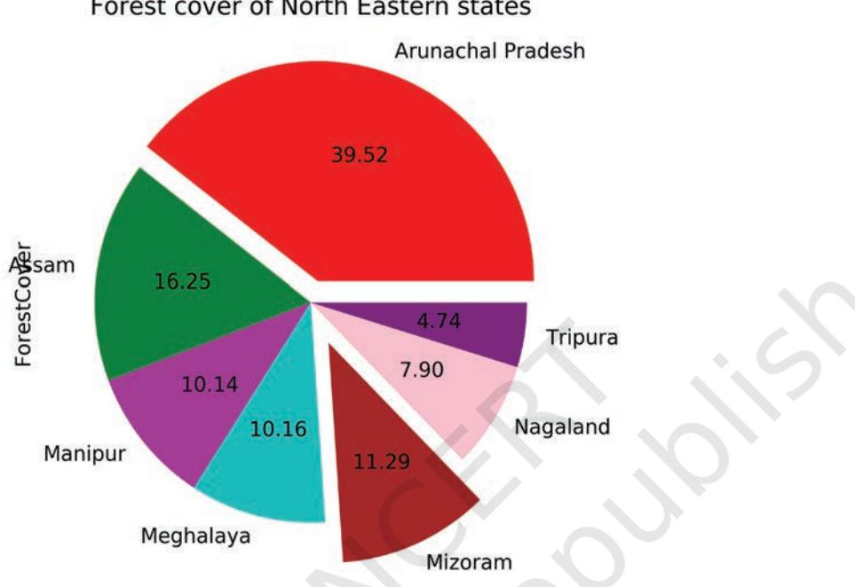

*Figure 4.22: Pie chart as output of Program 4.18*

# **Summary**

- A plot is a graphical representation of a data set which is also interchangeably known as a graph or chart. It is used to show the relationship between two or more variables.
- In order to be able to use Python's Data Visualisation library, we need to import the pyplot module from Matplotlib library using the following statement: import matplotlib.pyplot as plt, where plt is an alias or an alternative name for matplotlib.pyplot. You can keep any alias of your choice.
- The pyplot module houses functions to create a figure(plot), create a plotting area in a figure, plot lines, bars, hist. etc., in a plotting area, decorate the plot with labels, etc.

Chapter 4.indd 133 10/9/2020 12:36:01 PM

| Notes • | The various components of a plot are: Title, |
| --- | --- |
|  | Legend, Ticks, x label, ylabel |

- plt.plot() is used to build a plot, where plt is an alias.
- plt.show() is used to display the figure, where plt is an alias.
- plt.xlabel() and plt.ylabel() are used to set the x and y label of the plot.
- plt.title() can be used to display the title of a plot.
- It is possible to plot data directly from the DataFrame.
- Pandas has a built-in .plot() function as part of the DataFrame class.
- The general format of plotting a DataFrame is df.plot(kind = ' ') where df is the name of the DataFrame and kind can be line, bar, hist, scatter, box depending upon the type of plot to be displayed.

## Exercise

- 1. What is the purpose of the Matplotlib library?
- 2. What are some of the major components of any graphs or plot?
- 3. Name the function which is used to save the plot.
- 4. Write short notes on different customisation options available with any plot.
- 5. What is the purpose of a legend?
- 6. Define Pandas visualisation.
- 7. What is open data? Name any two websites from which we can download open data.
- 8. Give an example of data comparison where we can use the scatter plot.
- 9. Name the plot which displays the statistical summary. *Note:* Give appropriate title, set xlabel and ylabel while attempting the following questions.

Chapter 4.indd 134 10/9/2020 12:36:01 PM

10. Plot the following data using a line plot: **Notes**

| Day | 1 | 2 | 3 | 4 | 5 | 6 | 7 |
| --- | --- | --- | --- | --- | --- | --- | --- |
| Tickets | 2000 | 2800 | 3000 | 2500 | 2300 | 2500 | 1000 |
| sold |  |  |  |  |  |  |  |

- Before displaying the plot display "Monday, Tuesday, Wednesday, Thursday, Friday, Saturday, Sunday" in place of Day 1, 2, 3, 4, 5, 6, 7
- Change the color of the line to 'Magenta'.
- 11. Collect data about colleges in Delhi University or any other university of your choice and number of courses they run for Science, Commerce and Humanities, store it in a CSV file and present it using a bar plot.
- 12. Collect and store data related to the screen time of students in your class separately for boys and girls and present it using a boxplot.
- 13. Explain the findings of the boxplot of Figure 4.18 by filling the following blanks:
	- a) The median for the five subjects is _____ , ______,

_______, ______, ______

______, _______, ______, ______

______, _______, ______, ______

- b) The highest value for the five subjects is : _____ ,
- c) The lowest value for the five subjects is : _____ ,
- d) ______________ subject has two outliers with the value ________ and ________
- e) ______________ subject shows minimum variation
- 14. Collect the minimum and maximum temperature of your city for a month and present it using a histogram plot.
- 15. Conduct a class census by preparing a questionnaire. The questionnaire should contain a minimum of five questions. Questions should relate to students, their family members, their class performance, their health etc. Each student is required to fill up the questionnaire. Compile the information in numerical terms (in terms of percentage). Present the information through a bar, scatter–diagram. (NCERT Geography class IX, Page 60)

Chapter 4.indd 135 10/9/2020 12:36:01 PM

- **Notes** 16. Visit data.gov.in , search for the following in "catalogs" option of the website:
	- Final population Totals, India and states
	- State Wise literacy rate

Download them and create a CSV file containing population data and literacy rate of the respective state. Also add a column Region to the CSV file that should contain the values East, West, North and South. Plot a scatter plot for each region where X axis should be population and Y axis should be Literacy rate. Change the marker to a diamond and size as the square root of the literacy rate.

Group the data on the column region and display a bar chart depicting average literacy rate for each region.

Chapter 4.indd 136 10/9/2020 12:36:01 PM

