**Chapter**

# **5 Internet and Web**

"The internet could be a very positive step towards education, organisation and participation in a meaningful society."

— Noam Chomsky

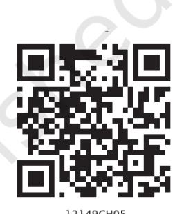

## *In this chapter*

- » *Introduction to Computer Networks*
	- » *Types of Networks*
	- » *Network Devices*
	- » *Networking Topologies*
	- » *The Internet*
	- » *Applications of Internet*
	- » *Website*
	- » *Web Page*
	- » *Web Server*
	- » *Hosting of a website*
	- » *Browser*

## **5.1 Introduction to Computer Networks**

We are living in a connected world. Information is being produced, exchanged, and traced across the globe in real time. It's possible as almost everyone and everything in the digital world is interconnected through one way or the other.

A group of two or more similar things or people interconnected with each other is called network (Figure 5.1). Some of the examples of network in our everyday life include:

- • Social network
- • Mobile network
- • Network of computers
- • Airlines, railway, banks, hospitals networks.

Chapter 5.indd 137 10/9/2020 12:57:50 PM

*Figure 5.1: Interconnection forming a social network*

**Activity 5.1**

Identify some other networks in the real world.

A computer network (Figure 5.2) is an interconnection among two or more computers or computing devices. Such interconnection allows computers to share data and resources among each other. A basic network may connect a few computers placed in a room.

The network size may vary from small

to large depending on the number of computers it connects. A computer network can include different types of hosts (also called nodes) like server, desktop, laptop, cellular phones.

A computer network (Figure 5.2) is an interconnection among two or more computers or computing devices. Such interconnection allows computers to share data and resources among each other. A basic network may connect a few computers placed in a room.

The network size may vary from small to large depending on the number of computers it connects. A computer network can include different types of hosts (also called nodes) like server, desktop, laptop, cellular phones.

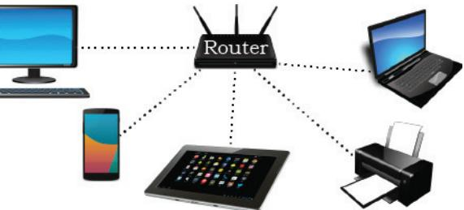

*Figure 5.2: A computer network*

Apart from computers, networks include networking devices like switch, router, modem, etc. Networking devices are used to connect multiple computers in different settings. For communication, data in a network is divided into smaller chunks called packets. These

Chapter 5.indd 138 10/9/2020 12:57:50 PM

packets are then carried over a network. Devices in a network can be connected either through wired media like cables or wireless media like air.

In a communication network, each device that is a part of a network and that can receive, create, store or send data to different network routes is called a node. In the context of data communication, a node can be a device such as a modem, hub, bridge, switch, router, digital telephone handset, a printer, a computer or a server.

Interconnectivity of computing devices in a network allows us to exchange information simultaneously with many parties through email, websites, audio/video calls, etc. Network allows sharing of resources. For example, a printer can be made available to multiple computers through a network; a networked storage can be accessed by multiple computers. People often connect their devices through hotspot, thus forming a small personal network.

## **5.2 Types of Networks**

There are various types of computer networks ranging from network of handheld devices (like mobile phones or tablets) connected through Wi-Fi or Bluetooth within a single room to the millions of computers spread across the globe. Some are connected wireless while others are connected through wires.

Based on the geographical area covered and data transfer rate, computer networks are broadly categorised as:

- • LAN (Local Area Network)
- • MAN (Metropolitan Area Network)
- • WAN (Wide Area Network)

## **5.2.1 Local Area Network (LAN)**

It is a network that connects computers, mobile phones, tablet, mouse, printer, etc., placed at a limited distance. The geographical area covered by a LAN can range from a single room, a floor, an office having one or more buildings in the same premise, laboratory, a school, college, or university campus. The connectivity is done by means of wires, Ethernet cables, fibre optics, or Wi-Fi. A Local Area Network (LAN) is shown in Figure 5.3.

**Activity 5.2**

Create a hotspot using a smartphone and connect other devices to it.

Chapter 5.indd 139 10/9/2020 12:57:50 PM

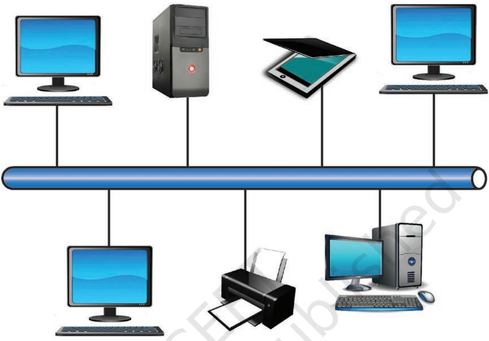

*Figure 5.3: A Local Area Network*

LAN is comparatively secure as only authentic users in the network can access other computers or shared resources. Users can print documents using a connected printer, upload or download documents and software to and from the local server. Such LANs provide the short range communication with the high speed data transfer rates. These types of networks can be extended up to 1 km. Data transfer in LAN is quite high, and usually varies from 10 Mbps (called Ethernet) to 1000 Mbps (called Gigabit Ethernet), where Mbps stands for Megabits per second. Ethernet is a set of rules that decides how computers and other devices connect with each other through cables in a local area network or LAN.

## **5.2.2 Metropolitan Area Network (MAN)**

Metropolitan Area Network (MAN) is an extended form of LAN which covers a larger geographical area like a city or a town. Data transfer rate in MAN also ranges in Mbps, but it is considerably less as compared to LAN. Cable TV network or cable based broadband internet services are examples of MAN. This kind of network

#### **Think and Reflect**

Explore and find out the minimum internet speed required to make a video call.

Chapter 5.indd 140 10/9/2020 12:57:51 PM

can be extended up to 30–40 km. Sometimes, many LANs are connected together to form MAN, as shown in Figure 5.4.

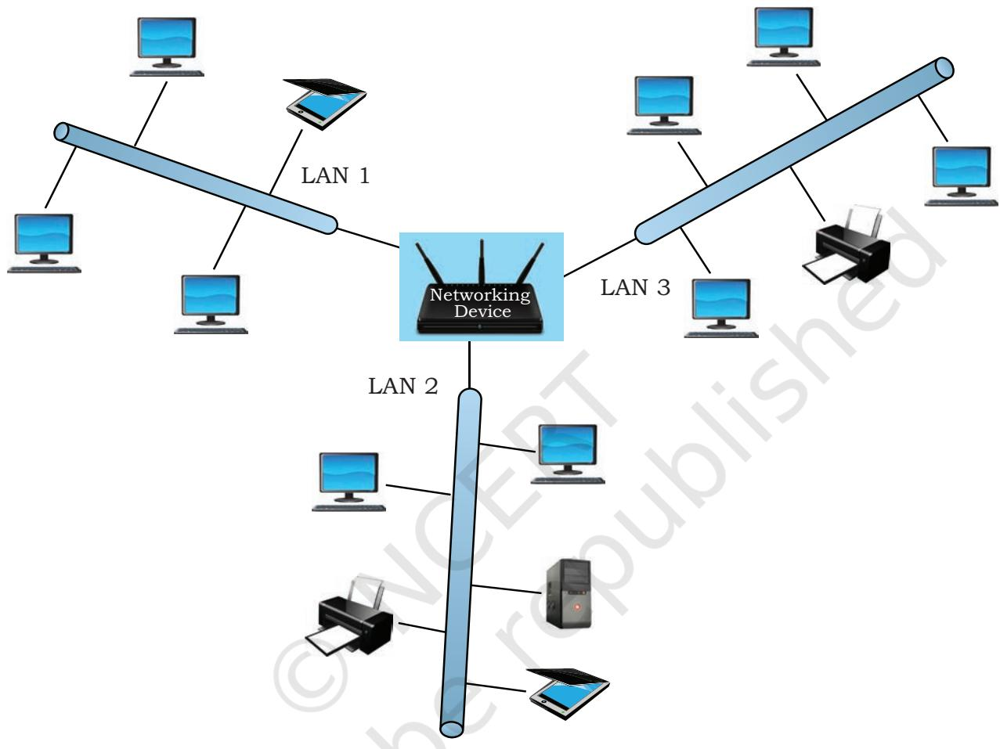

*Figure 5.4: A Metropolitan Area Network*

## **5.2.3 Wide Area Network (WAN)**

Wide Area Network (WAN) connects computers and others LANs and MANs, which are spread across different geographical locations of a country or in different countries or continents. A WAN could be formed by connecting a LAN to other LANs (Figure 5.5) via wired or wireless media. Large business, educational and government organisations connect their different branches in different locations across the world through WAN. The Internet is the largest WAN that connects billions of computers, smartphones and millions of LANs from different continents.

Chapter 5.indd 141 10/9/2020 12:57:51 PM

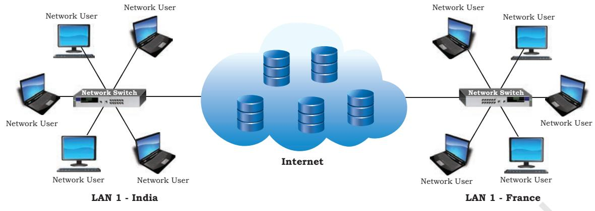

*Figure 5.5: A Wide Area Network*

## **5.3 Network Devices**

To communicate data through different transmission media and to configure networks with different functionality, we require different devices like Modem, Hub, Switch, Repeater, Router, Gateway, etc. Let us explore them in detail.

## **5.3.1 Modem**

Modem stands for 'MOdulator DEMolulator'. It refers to a device used for conversion between analog signals and digital bits. We know computers store and process data in terms of 0s and 1s. However, to transmit data from a sender to a receiver, or while browsing the internet, digital data are converted to an analog signal and the medium (be it free-space or a physical media) carries the signal to the receiver. There are modems connected to both the source and destination nodes. The modem at the sender's end acts as a modulator that converts the digital data into analog signals. The modem at the receiver's end acts as a demodulator that converts the analog signals into digital data for the destination node to understand. Figure 5.6 shows connectivity using a modem.

*Figure 5.6: Use of modem*

## **Think and Reflect**

It is possible to access your bank account from any part of the world. Find if the bank's network is a LAN, MAN, WAN or any other type.

Chapter 5.indd 142 10/9/2020 12:57:52 PM

## **5.3.2 Ethernet Card**

Ethernet card, also known as Network Interface Card (NIC card in short) is a network adaptor used to set up a wired network. It acts as an interface between computer and the network. It is a circuit board mounted on the motherboard of a computer as shown in Figure 5.7. The Ethernet cable connects the computer to the network through NIC. Ethernet cards can support data transfer between 10 Mbps and 1 Gbps (1000 Mbps). Each NIC has a MAC address, which helps in uniquely identifying the computer on the network.

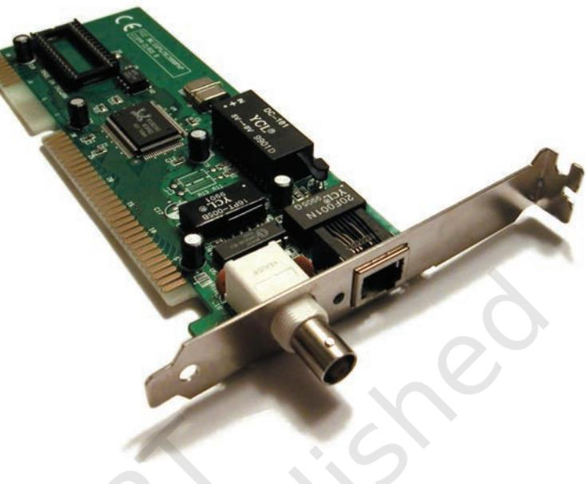

*Figure 5.7: A Network Interface Card* 

## **5.3.3 Repeater**

Data are carried in the form of signals over the cable. These signals can travel a specified distance (usually about 100 m). Signals lose their strength beyond this limit and become weak. In such conditions, original signals need to be regenerated.

A repeater is an analog device that works with signals on the cables to which it is connected. The weakened signal appearing on the cable is regenerated and put back on the cable by a repeater.

## **5.3.4 Hub**

An Ethernet hub (Figure 5.8) is a network device used to connect different devices through wires. Data arriving

on any of the lines are sent out on all the others. The limitation of hub is that if data from two devices come at the same time, they will collide.

*Figure 5.8: A network hub with 8 ports*

Chapter 5.indd 143 10/9/2020 12:57:52 PM

## **Notes**

## **5.3.5 Switch**

A switch is a networking device (Figure 5.9) that plays a central role in a Local Area Network (LAN). Like a hub, a network switch is used to connect multiple computers or communicating devices. When data arrives, the switch extracts the destination address from the data packet and looks it up in a table to see where to send the packet. Thus it sends signals to only selected devices instead of sending to all. It can forward multiple packets at the same time. A switch does not forward the signals which are noisy or corrupted. It drops such signals and asks the sender to resend it.

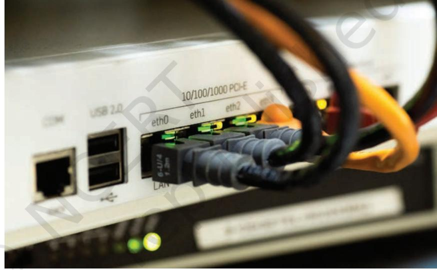

*Figure 5.9: Cables connected to a network switch*

Ethernet switches are common in homes and offices to connect multiple devices, thus creating LANs or to access the Internet.

## **5.3.6 Router**

A router (Figure 5.10) is a network device that can receive the data, analyse it and transmit it to other networks. A router connects a local area network to the internet. Compared to a hub or a switch, a router has advanced capabilities as it can analyse the data being carried over a network, decide or alter how it is packaged, and send it to another network of a different type. For example, data has been divided into packets of a certain size. Suppose, these packets are to be carried over a different type of network which cannot handle bigger packets, in such a case, the data is to be repackaged as smaller packets and then sent over the network by a router.

Chapter 5.indd 144 10/9/2020 12:57:53 PM

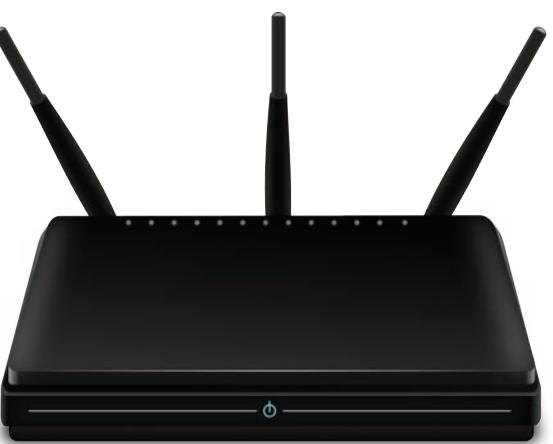

*Figure 5.10: A Router*

A router can be wired or wireless. A wireless router can provide Wi-Fi access to smartphones and other devices. Usually, such routers also contain some ports to provide wired Internet access. These days, home Wi-Fi routers perform the dual task of a router and a modem or switch. These routers connect to incoming broadband lines, from ISP (Internet Service Provider), and convert them to digital data for computing devices to process.

## **5.3.7 Gateway**

As the term "Gateway" suggests, it is a key access point that acts as a "gate" between an organisation's network and the outside world of the Internet (Figure 5.11). Gateway serves as the entry and exit point of a network, as all data coming in or going out of a network must first pass through the gateway in order to use routing paths. Besides routing data packets, gateways also maintain information about the host network's internal connection paths and the identified paths of other remote networks. If a node from one network wants to communicate with a node of a foreign network, it will pass the data packet to the gateway, which then routes it to the destination using the best possible route.

For simple Internet connectivity at homes, the gateway is usually the Internet Service Provider that provides access to the entire Internet. Generally, a router is configured to work as a gateway device in computer networks. A gateway can be implemented as software, hardware, or a combination of both. This is because a

An Internet service provider (ISP) is any organisation that provides services for accessing the Internet.

Find and list a few ISPs in your region.

Chapter 5.indd 145 10/9/2020 12:57:53 PM

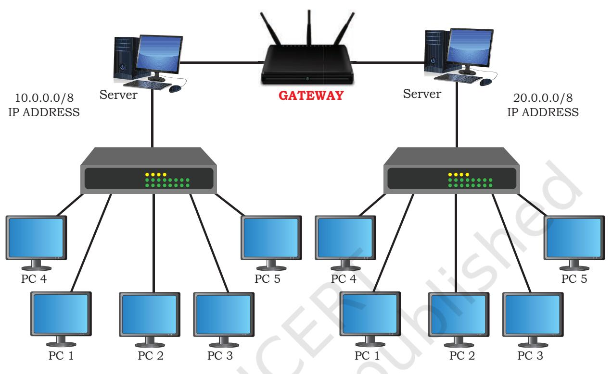

network gateway is placed at the edge of a network and the firewall is usually integrated with it.

*Figure 5.11: A network gateway*

## **5.4 Networking Topologies**

We have already discussed that a number of computing devices are connected together to form a Local Area Network (LAN), and interconnections among millions of LANs forms the Internet. The arrangement of computers and other peripherals in a network is called its topology. Common network topologies are mesh, ring, bus, star and tree.

## **5.4.1 Mesh Topology**

In this networking topology, each communicating device is connected with every other device in the network as shown in Figure 5.12. Such a network can handle large amounts of traffic since multiple nodes can transmit data simultaneously. Also, such networks are more reliable in the sense that even if a node gets down, it does not cause any break in the transmission of data between other nodes. This topology is also more secure as compared to other topologies because each cable between two nodes carries different data. However,

Chapter 5.indd 146 10/9/2020 12:57:54 PM

wiring is complex and cabling cost is high in creating such networks, and there are many redundant or unutilised connections.

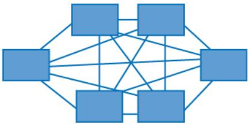

*Figure 5.12: A mesh topology*

## **5.4.2 Ring Topology**

In ring topology, each node is connected to two other devices, one each on either side, as shown in Figure 5.13. The nodes connected with each other thus form a ring. The link in a ring topology is unidirectional. Thus, data can be transmitted in one direction only (clockwise or counterclockwise).

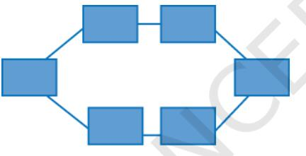

*Figure 5.13: A ring topology*

## **5.4.3 Bus Topology**

In bus topology (Figure 5.14), each communicating device connects to a transmission medium, known as bus. Data sent from a node are passed on to the bus and hence are transmitted to the length of the bus in both directions. That means data can be received by any of the nodes connected to the bus.

*Figure 5.14: A bus topology*

In this topology, a single backbone wire called bus is shared among the nodes, which makes it cheaper and easy to maintain. Both ring and bus topologies are considered to be less secure and less reliable.

Chapter 5.indd 147 10/9/2020 12:57:54 PM

To build a fullyconnected mesh topology of n nodes, it requires n(n-1)/2 wires.

#### **Think and Reflect**

How will a bus and ring topology behave in case a node is down?

## **5.4.4 Star Topology**

In star topology, each communicating device is connected to a central node, which is a networking device like a hub or a switch, as shown in Figure 5.15.

Star topology is considered very effective, efficient and fast as each device is directly connected with the central device. Although disturbance in one device will not affect the rest of the network, any failure in the central networking device may lead to the failure of complete network.

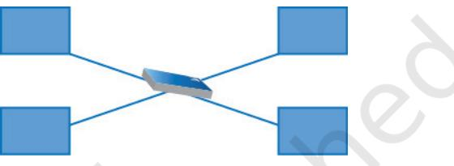

*Figure 5.15: A star topology*

The central node can be either a broadcasting device means data will be transmitted to all the nodes in the network, or a unicast device means the node can identify the destination and forward data to that node only.

#### **5.4.5 Tree or Hybrid Topology**

It is a hierarchical topology, in which there are multiple branches and each branch can have one or more basic topologies like star, ring and bus. Such topologies are

in bus.

usually realised in WANs where multiple LANs are connected. Those LANs may be in the form of ring, bus or star. In Figure 5.16, a hybrid topology is shown connecting 4 star topologies

In this type of network, data transmitted from source first reaches the centralised device and from there the data passes through every branch where each branch

can have link for more nodes.

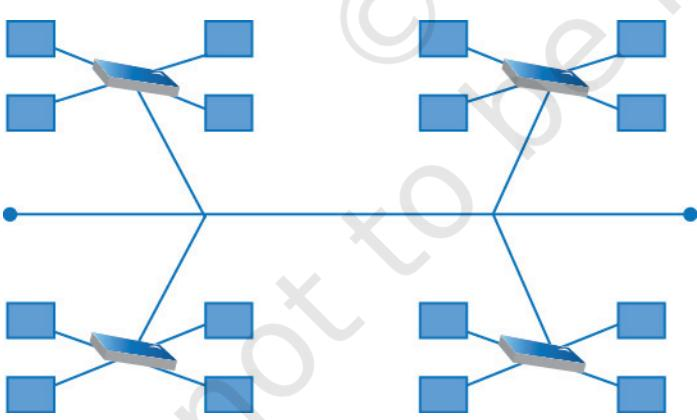

*Figure 5.16: A hybrid topology*

## **5.5 The Internet**

The Internet is the global network of computing devices including desktop, laptop, servers, tablets, mobile phones, other handheld devices as well as peripheral devices such as printers, scanners, etc. In addition, it

Chapter 5.indd 148 10/9/2020 12:57:54 PM

also consists of networking devices such as routers, switches, gateways, etc. Today, smart electronic appliances like TV, AC, refrigerator, fan, light, etc., can also communicate through the Internet. The list of such smart devices are always increasing e.g., drones, vehicles, door lock, security camera, etc.

The Internet is evolving everyday. Computers are either connected to a modem through a cable or wirelessly (Wi-Fi). A modem, be it wired or wireless, is connected to a local Internet Service Provider (ISP) who then connects to a national network. Many such ISPs connect together forming a regional network and regional networks connect together forming a national network, and such country-wise networks form the Internet backbone.

The Internet today is a widespread network, and its influence is no longer limited to the technical fields of computer communications. It is being used by everyone in the society as is evident from the increasing use of online tools for education, creativity, entertainment, socialisation and e-commerce.

## **5.6 Applications of Internet**

Following are some of the broad areas or services provided through Internet:

- • The World Wide Web (WWW)
- • Electronic mail (Email)
- • Chat
- • Voice Over Internet Protocol (VoIP)

## **5.6.1 The World Wide Web (WWW)**

The World Wide Web (WWW) or web in short, is an ocean of information, stored in the form of trillions of interlinked web pages and web resources. The resources on the web can be shared or accessed through the Internet.

Earlier, to access files residing in different computers, one had to login individually to each computer through the Internet. Besides, files in different computers were sometimes in different formats, and it was difficult to understand each other's files and documents. Sir Tim Berners-Lee — a British computer scientist invented the revolutionary World Wide Web in 1990 by defining three fundamental technologies that lead to creation of web:

**Notes**

Chapter 5.indd 149 10/9/2020 12:57:54 PM

- • HTML HyperText Markup Language or HTML is a language which is used to design standardised Web Pages so that the Web contents can be read and understood from any computer across the globe. It uses tags to define the way page content should be displayed by the web browser. Basic structure of every webpage is designed using HTML.
- • URI Uniform Resource Identifier or URI is a unique identifier to identify a resource located on the web. URI identifies a resource (hardware or software) either by its location or by its name or by both.

URL is Uniform Resource Locator and provides the location and mechanism (protocol) to access the resource. Examples of URI identifying resources using location (i.e., URL) are: https://www.mhrd.gov. in, http://www.ncert.nic.in, http://www.airindia. in, etc. URL is sometimes also called a web address. However, it is not only the domain name, but contains other information that completes a web address, as depicted below:

## **Domain Name**

**http://www.ncert.nic.in/textbook/textbook.htm**

**URL**

In the above URL, http is the protocol name, it can be https, http, FTP, Telnet, etc. www is a subdomain. ncert.nic.in is the domain name.

Note: These days it is not mandatory to mention protocol and subdomain while entering a URL. The browser automatically prefixes it.

• HTTP — The HyperText Transfer Protocol is a set of rules which is used to retrieve linked web pages across the web. It's more secure and advanced version is HTTPS.

Many people confuse the web with the Internet. The Internet as we know is the huge global network of interconnected computers, which may or may not have any file or webpage to share with the world. The web on the other hand is the interlinking of a collection of WebPages on these computers which are accessible over the Internet. WWW today gives users access to a vast collection of information created and

Search Engine(s) like google. co.in, bing.com, duckduckgo.com, in.yahoo.com, etc., can be used to search and retrieve information when the address of the web page is not known.

Chapter 5.indd 150 10/9/2020 12:57:54 PM

shared by people across the world. It is today the most popular information retrieval system.

## **5.6.2 Electronic Mail (Email)**

Email is the short form of electronic mail. It is one of the ways of sending and receiving message(s) using the Internet. An email can be sent anytime to any number of recipients at anywhere. The message can be either text entered directly onto the email application or an attached file (text, image audio, video, etc.) stored on a secondary storage. An existing file can be sent as an attachment with the email, so no need to type it again.

To use email service, one needs to register with an email service provider by creating a mail account. These services may be free or paid. Some of the popular email service providers are Google (gmail), Yahoo (yahoo mail), Microsoft (outlook), etc. However, many organisations nowadays get customised business email addresses for their staff using their own domain name. For example, username@companyname.com.

Following are some of the common facilities available for an email user:

- 1. Creating an email, attaching files with an email, saving an email as draft for mailing later. Creating email is also termed as composing.
- 2. Sending and receiving mail. Same email can be sent to multiple email addresses, simultaneously.
- 3. Sending the copy of mail, as carbon copy (cc) or blind carbon copy (bcc).
- 4. Forwarding a received email to other user(s)
- 5. Filtering spam emails
- 6. Organising email in folders and sub folders
- 7. Creating and managing email ids of the people you know.
- 8. Setting signature/footer to be inserted automatically at the end of each email
- 9. Printing emails using a printer or saving as files.
- 10. Searching emails using email address or email subject text

## **5.6.3 Chat**

Chatting or Instant Messaging (IM) over the Internet means communicating to people at different geographic locations in real time through text message(s). It is a **Notes**

Chapter 5.indd 151 10/9/2020 12:57:54 PM

forum where multiple people connect to each other, to discuss their common interests. Two individuals can also send messages instantly. The sender types a message and sends it; the receiver immediately receives the message and can read and revert through text message. All this happens in real time, as if the sender and receiver were sitting in the same place. For a successful chat session, the communicating parties should be online simultaneously, and use the same chat application.

With ever increasing internet speed, it is now possible to send image, document, audio, video as well through instant messengers. It means, the communicating parties can talk to each other through an audio call or through a video call. Moreover, it is also possible to chat through text, audio and video in a group. Thus, we can have group chat or group calls.

Applications such as WhatsApp, Slack, Skype, Yahoo Messenger, Google Talk, Facebook Messenger, Google Hangout, etc., are examples of instant messengers. Some of these applications support instant messaging through all the modes — text, audio and video.

## **5.6.4 VoIP**

Voice over Internet Protocol or VoIP, allows us to have voice call (telephone service) over the Internet, i.e., the voice transmission over a computer network rather than through the regular telephone network. It is also known as Internet Telephony or Broadband Telephony. But to avail the phone service over the Internet, we need to have an Internet connection with reasonably good speed.

VoIP works on the simple principle of converting the analogue voice signals into digital and then transmitting them over the broadband line. There are two major advantages of a VoIP—

- • These services are either free or very economical, so people use them to save on cost. That is why these days even international calls are being made using VoIP.
- • VoIP call(s) can be received and made using IP phones from any place having Internet access. Hence, VoIP has increased the portability and functionality of the voice calling system. Incoming phone calls can be

**Notes**

Chapter 5.indd 152 10/9/2020 12:57:54 PM

automatically routed to the VoIP phone as soon as it is connected to the Internet.

The only disadvantage of VoIP is that its call quality is dependent on Internet connection speed. Slow Internet connection will lead to poor quality voice calls.

## **5.7 Website**

Each one of us might have visited one or the other website. A website in general contains information organised in multiple pages about an organisation. A website can also be created for a particular purpose, theme or to provide a service.

A website (usually referred to as a site in short) is a collection of web pages related through hyperlinks, and saved on a web server. A visitor navigates from one page to another by clicking on hyperlinks. Also, all the pages of a website are integrated under one domain name and have a common theme and template. For example, the website of NCERT will have all the pages related to NCERT, viz., textbooks, syllabus, events, resource materials, etc., under one domain name and having a common design theme. To access a website, one has to type the address of the website (URL) in the address bar of a browser, and press enter. The home page of the website will be displayed.

## **5.7.1 Purpose of a Website**

We are living in an Internet era where the whole world is connected. A website's purpose is to make the information available to people at large. For example, a company might like to advertise or sell its products, a government organisation may like to publish circulars, float tenders, invite applications or get feedback from various stakeholders. A website is a means that helps to communicate with people in a specific, transparent and user friendly manner. Therefore, while developing a website, the first question to ask is why the website is being created, and what should be its pages so that it serves the required purpose.

Basically, a website should be user friendly and provide information to users with minimum efforts. A website should be designed keeping in mind different categories of people that will be visiting the site. Some of the common purposes for which websites are designed are listed below:

**Notes**

Chapter 5.indd 153 10/9/2020 12:57:54 PM

- • Posting and finding information on the internet
- • Communicating with each other
- • Entertainment purposes
- • Disseminating contents and software

## **5.8 Web Page**

A web page (also referred to as a page) is a document on the WWW that is viewed in a web browser. Basic structure of a web page is created using HTML (HyperText Markup Language) and CSS (Cascaded Style Sheet). A web page is usually a part of a website and may contain information in different forms, such as:

- ● text in the form of paragraphs, lists, tables, etc.
- ● images
- ● audio
- ● video
- ● software application
- ● other interactive contents

Additionally, various styling and formatting are applied on a web page to make it attractive and organised. Further, program codes called scripts are used to define the manner in which the page will behave on different actions. Scripts make a web page interactive. JavaScript is the most popular and commonly used scripting language. However, Python and PHP are also used to apply scripting on a web page.

The first page of the website is called a home page. It generally contains information and links to all the related web pages. Each web page has a unique address that is visible on the address bar. Hence if we want to view a particular web page, its address has to be typed in the address bar of the browser. The web pages that are linked to form a website share a unique domain name. For example, https://swayam.gov.in/ is a website by the Government of India to deliver online courses for School, College and University students and teachers. It is a collection of multiple web pages that link to different courses related information.

## **5.8.1 Static and Dynamic Web Pages**

A web page can be static or dynamic. A static webpage is one whose content always remains static, i.e., does not change for person to person. When a web server

**Activity 5.4**

Visit NCERT, SWAYAM or any other website and note down URLs of some of the specific pages of that website.

Chapter 5.indd 154 10/9/2020 12:57:54 PM

receives a request (from browser) for a static web page, it just locates the page on its storage media and sends it to the browser of the client. No additional processing is performed on the page. Hence, a static web page remains the same for all users until someone changes its code manually.

Static web pages are generally written in HTML, JavaScript and/or CSS and have the extension .htm or .html.

*Figure 5.17: Working of a static web page*

On the other hand, a dynamic web page is one in which the content of the web page can be different for different users. The difference in content may be because of different choices made by the user. When a request for a dynamic web page is made to the web server, it does not simply retrieve the page and send. Before sending the requested web page, the server may perform some additional processes like getting information from the database, updating date and time, updating weather information, etc. The content of such pages changes frequently. They are more complex and thus take more time to load than static web pages.

Dynamic web pages can be created using various languages such as JavaScript, PHP, ASP.NET, Python, Java, Ruby, etc. These are complex to construct and design, as the code to perform the additional operations has to be added. Such server side code allows the server to change its content each time the page is loaded. Further, most dynamic pages are linked to databases so that each time the page is uploaded, the required information from the databases is retrieved to update the web page. Few common examples of dynamic web pages are those web pages displaying the date, time, and weather report or having e-commerce applications.

Chapter 5.indd 155 10/9/2020 12:57:55 PM

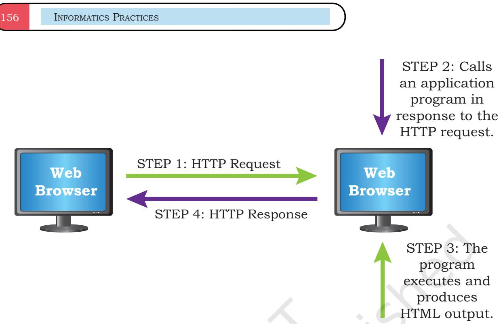

*Figure 5.18: Working of a dynamic web page*

## **5.9 Web Server**

A web server is used to store and deliver the contents of a website to clients such as a browser that request it. A web server can be software or hardware.

When talking about a web server as computer hardware, it stores web server software and a website's contents (HTML pages, images, CSS stylesheets, and JavaScript files). The server needs to be connected to the Internet so that its contents can be made accessible to others.

When talking about a web server as a software, it is a specialised program that understands URLs or web addresses coming as requests from browsers, and responds to those requests. The server is assigned a unique domain name so that it can be accessed from anywhere using the domain name. To develop and test a website using a personal computer, we need to first install a web server on that computer.

The web browser from the client computer sends a request (HTTP request) for a page containing the desired data or service. The web server then accepts, interprets, searches and responds (HTTP response) to the request made by the web browser. The requested web page is then displayed in the browser of the client. If the server is not able to locate the page, it sends a page containing

Chapter 5.indd 156 10/9/2020 12:57:55 PM

the error message (Error 404 – page not found) to the client's browser.

## **5.10 Hosting of a Website**

Web hosting is a service that allows us to put a website or a web page onto the Internet, and make it a part of the World Wide Web. Once a website is created using a hardware server, we need to connect it to the Internet so that users across the globe can access. On the other hand, we can rent server resources (CPU, RAM, and storage) from a cloud service provider and host our locally created website there. This is done by uploading the files constituting the website (HTML, CSS, JavaScript, images, databases, etc.) from the local computer onto the space allocated on the server. For this, we have to avail the services of a web hosting service provider. These services for using the server's resources such as RAM, hard disk, bandwidth, etc., are usually paid and these resources can be increased or decreased as per the loads on the website.

A web server whether it is a local server or a cloud server when connected to the Internet is assigned a unique numeric address on the Internet called IP address. This IP address needs to be mapped to a textual name called domain name of the website. This is because it is not convenient for users to remember a numeric IP address. Thus, for accessing a website, the user enters the domain through a browser (URL). The domain name has to be registered (purchased) with an authorised agency.

## **5.10.1 How to host a website?**

To host a website, follow the steps given below:

- Select the web hosting service provider that will provide the web server space as well as related technologies and services such as database, bandwidth, data backup, firewall support, email service, etc. This has to be done keeping in mind the features and services that we want to offer through our website.
- Identify a domain name, which best suits our requirement, and get it registered through domain name Registrar.
- Once we get web space, create logins with appropriate rights and note down IP address to manage web space.

**Activity 5.5**

Find out some of the Web hosting service providers from both categories — free and paid.

Chapter 5.indd 157 11/12/2020 12:14:06 PM

- Upload the files in properly organised folders on the allocated space.
- Get domain name mapped to the IP address of the web server.

The domain name system (DNS) is a service that does the mapping between domain name and IP address. When the address of a website is entered in a browser, the DNS finds out the IP address of the server corresponding to the requested domain name and sends the request to that server.

## **5.11 Browser**

A browser is a software application that helps us to view the web page(s). In other words, it helps us to view the data or information that is retrieved from various web servers on the Internet. Some of the commonly used web browsers are Google Chrome, Internet Explorer, Mozilla Firefox, Opera, etc. A web browser essentially displays the HTML documents which may include text, images, audio, video and hyperlinks that help to navigate from one web page to another.

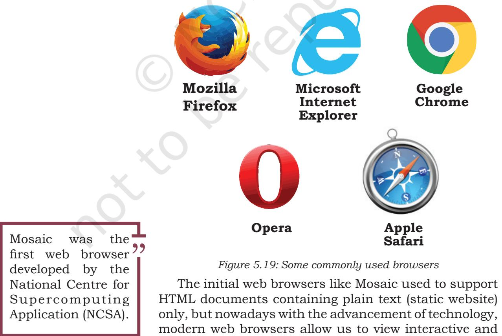

Chapter 5.indd 158 11/12/2020 10:58:28 AM

dynamic websites. In addition to this, most modern browsers allow a wide range of visual effects, use encryption for advanced security and also have cookies that can store the browser settings and data.

## **5.11.1 Browser Settings**

Every web browser has got certain settings that define the manner in which the browser will behave. These settings may be with respect to privacy, search engine preferences, download options, auto signature, autofill and autocomplete feature, theme and much more. Each browser application allows us to change or customise its settings in a user friendly manner. Let's learn how to change the browser settings using the open source browser, Mozilla Firefox.

Open Mozilla Firefox, and on the top right corner of the browser window, click the Menu button.

*Figure 5.20: Mozilla Firefox Menu button* 

From the drop down button, select Options. The preferences and Options window will be displayed in the browser.

Chapter 5.indd 159 10/9/2020 12:57:55 PM

Mozilla Firefox is an open source web browser which is available free of cost and can be easily downloaded from the Internet.

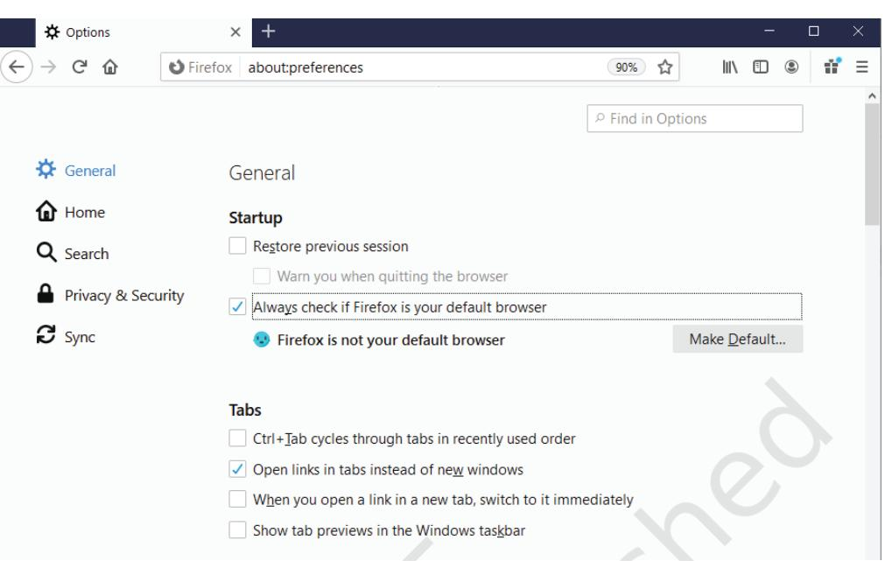

*Figure 5.21: Preference and options page*

On the left side, there are multiple Panels to choose from: General, Home, Search, Privacy and Security and Sync.

**General Panel:** Some of the options that the panel contains are as follows:

- • setting the default browser
- • language and appearance of text
- • downloading files and applications
- • firefox update settings
- • browsing and network settings

**Home Panel:** This panel contains options to set the home page of the browser, browser window and tab settings.

**Search Panel:** This panel contains options to edit the settings of the search engine used by Firefox.

**Privacy and Security Panel:** This panel contains options to secure the browser and data. It includes the following:

- • enhanced tracking protection
- • forms and passwords
- • history and address bar
- • cookies and site data
- • permission to view pop ups windows and install addons

Chapter 5.indd 160 10/9/2020 12:57:55 PM

**Sync Panel:** This panel contains options to set up and manage a Firefox account which is needed to access all services given by Mozilla.

Make the desired settings and close the browser settings window. The changes made in the browser settings will be applied.

## **5.11.2 Add-Ons and Plug-ins**

Add-ons and plug-ins are the tools that help to extend and modify the functionality of the browser. Both the tools boost the performance of the browser, but are different from each other.

A plug-in is a complete program or may be a third-party software. For example, Flash and Java are plug-ins. A Flash player is required to play a video in the browser. A plug-in is a software that is installed on the host computer and can be used by the browser for multiple functionalities and can even be used by other applications as well.

On the other hand, an add-on is not a complete program and so is used to add only a particular functionality to the browser. An add-on is also referred to as extension in some browsers. Adding the functionality of a sound and graphics card is an example of an add-on.

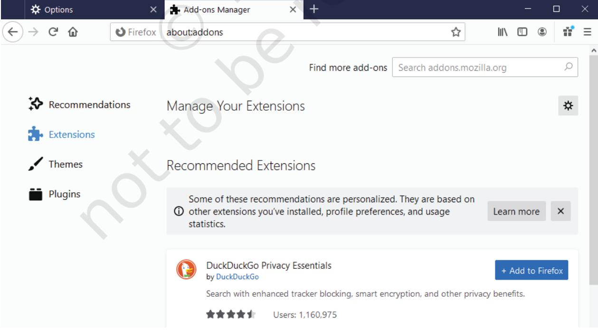

*Figure 5.22: Add-ons and plug-ins*

Chapter 5.indd 161 10/9/2020 12:57:55 PM

## **Think and Reflect**

Can we compare Addons and Plug-ins with utility software?

> First cookie software was created in 1994 at Netscape, for determining whether the person is a first time visitor or a re-visitor of their site.

To add an extension, click the Options button on the top right corner of the browser and select the Addons option. Click the Extensions Panel option on the left. On the right, options to Manage your Extensions will appear. There will be a list of enabled, disabled and recommended extensions. Make the desired selections and close the add-ons window.

Similarly, to add plug-ins, click Plug-ins options on the left side of the browser window. Make the desired selections to enable or disable the required plug-ins.

## **5.11.3 Cookies**

A cookie is a text file, containing a string of information, which is transferred by the website to the browser when we browse it. This string of information gets stored in the form of a text file in the browser. The information stored is retransmitted to the server to recognise the user, by identifying pages that were visited, choices that were made while browsing various menu(s) on a particular website. It helps in customising the information that will be displayed, for example the choice of language for browsing, allowing the user to auto login, remembering the shopping preference, displaying advertisements of one's interest, etc.

Cookies are usually harmless and they can't access information from the hard disk of a user or transmit virus or malware. It is the browser on our computer which stores and manages the cookies. However, viruses can also be tricked as cookies and cause harm to a computer. One can disable cookies by changing the Privacy and Security settings of our browser.

## **Summary**

- • A group of two or more similar things or people interconnected with each other is called network
- • A computer network is an interconnection among two or more computers to share data and resources.
- • Devices in a network can be connected either through wired or wireless media.

Chapter 5.indd 162 10/9/2020 12:57:55 PM

- • Based on the geographical area covered and data transfer rate, computer networks are broadly categorised as LAN, MAN and WAN.
- • The protocol or the set of rules that decide functioning of a LAN is called Ethernet.
- • Local Area Network (LAN) is a network that connects digital devices placed at a limited distance of upto 1 km.
- • Metropolitan Area Network (MAN) is an extended form of LAN which covers a larger geographical area like a city or a town.
- • Wide Area Network (WAN) connects computers and other LANs and MANs, which are spread across different geographical locations of a country or in different countries or continents.
- • A repeater is an electronic device that receives a weak signal and regenerates it.
- • Modem (MOdulator DEMolulator) refers to any such device used for conversion between analog signals and digital bits.
- • A hub is a network device used to connect multiple devices to form a network or to connect segment(s) of LAN.
- • A switch is a networking device that filters network traffic while connecting multiple computers or communicating devices.
- • A router is a network device that can receive the data, analyse it and transmit to other networks.
- • A gateway is a device that connects the organisation's network with the outside world of the Internet.
- • The physical organisation of computers, cables and other peripherals in a network is called its topology. Common network topologies are Bus, Star, Tree, Mesh, etc.
- • In bus topology, each communicating device connects to a common central transmission medium, known as bus.
- • In star topology, each communicating device is connected to a central node, which is a networking device like a hub or a switch, through separate cables.

Chapter 5.indd 163 10/9/2020 12:57:55 PM

## **Notes**

| • | In tree topology, multiple star and bus topologies |
| --- | --- |
|  | are connected to a central cable, also called the |
|  | backbone of the network. |

- • In mesh topology, each communicating device is connected with every other device in the network.
- • The Internet is the largest WAN that connects millions of computers across the globe.
- • Some of the services provided through the Internet are information sharing, communication, data transfer, social networking, e-commerce, etc.
- • A Uniform Resource Locator (URL) is a standard naming convention used for accessing resources over the Internet.
- • Electronic mail is a means of sending and receiving message(s) through the Internet.
- • Chatting is communicating in real time using text message(s).
- • Voice over Internet Protocol (VoIP) allows you to have voice calls over digital networks.
- • A website is a collection of related web pages.
- • A web page is a document that is viewed in a web browser such as Google Chrome, Mozilla Firefox, Opera, Internet Explorer, etc. It can be static or dynamic.
- • A static web page is one whose content does not change for requests made by different people.
- • A dynamic web page is one in which the content of the web page displayed is different for different users.
- • A web server is a program or a computer that provides services to other programs or computers called clients.
- • Web hosting is a service that allows you to post the website created locally so that it is available for all internet users across the globe.
- • Every browser has got certain settings that define the manner in which the browser will behave. These settings may be with respect to privacy, search engine preferences, download options, auto signature, autofill and autocomplete feature and much more.

Chapter 5.indd 164 10/9/2020 12:57:55 PM

- • Add-ons and plug-ins are the tools that help to extend and modify the functionality of the browser.
- • A cookie is a text file containing a string of information which stores browsing information on the hard disk of your computer.

## Exercise

- 1. Fill in the blanks:
______________________.

- a) To transmit data for sharing on a network, it has to be divided into smaller chunks called
- b) The set of rules that decide the functioning of a network is called _______________.
- c) A LAN can be extended up to a distance of __________ km.
- d) The ___________________ connects a local area network to the internet.
- e) The _____________ topology is of hierarchical nature.
- f) ____________________ is a standard naming convention used for accessing resources over the Internet.
- g) ______________ is a collection of related web pages.
- h) A _____________ is a computer that provides services to other programs or computers.
- 2. Expand the following:
	- a) ARPANET
	- b) ISP
	- c) URL
- 3. Name the device for the following:
	- a) It stands for Modulator Demodulator
	- b) It regenerates the signals.
- 4. Differentiate between:
	- a) MAN and WAN
	- b) Website and web page
	- c) Router and Gateway

Chapter 5.indd 165 10/9/2020 12:57:55 PM

**Notes**

- d) Bus and Star topology
- e) Static and Dynamic web pages
- 5. Define a network. What is the need of forming a network?
- 6. Give any two examples of networks.
- 7. Give any three applications on the Internet.
- 8. Name any two mail service providers.
- 9. Explain VoIP.
- 10. What is DNS?
- 11. Identify the type of topology from the following:
	- a) Each node is connected with the help of a single cable.
	- b) Each node is connected with central switching through independent cables.
- 12. Sahil, a Class X student, has just started understanding the basics of Internet and web technologies. He is a bit confused in between the terms "World Wide Web" and "Internet". Help him in understanding both the terms with the help of suitable examples of each.
- 13. Murugan wants to send a report on his trip to the North East to his mentor. The report contains images and videos. How can he accomplish his task through the Internet?
- 14. Mampi is planning to open a company that deals with rural handicrafts. She wants to advertise about handicrafts on a social platform. Which Internet service she should use and why?
- 15. Ruhani wants to edit some privacy settings of her browser. How can she accomplish her task?
- 16. Shubham wants to play a video in his browser but he is not able to do so. A message on the screen instructs him to install the Adobe Flash Player plugin. Help him to add it in his browser.
- 17. When Joe typed a URL in the address bar of his browser, Error 404 was displayed? Why did this happen? What can be done to avoid it?

Chapter 5.indd 166 10/9/2020 12:57:55 PM

