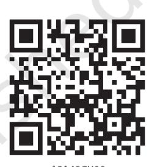
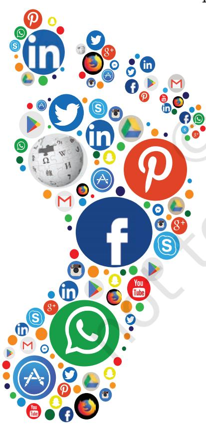
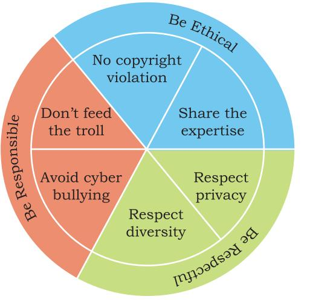
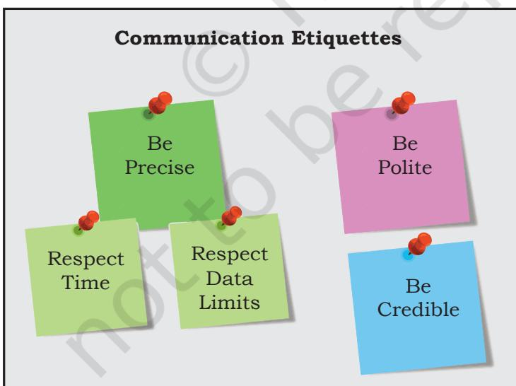
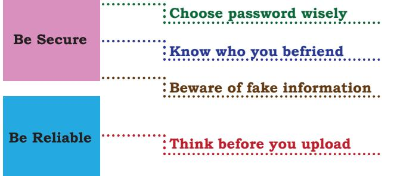
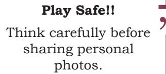
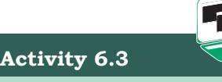
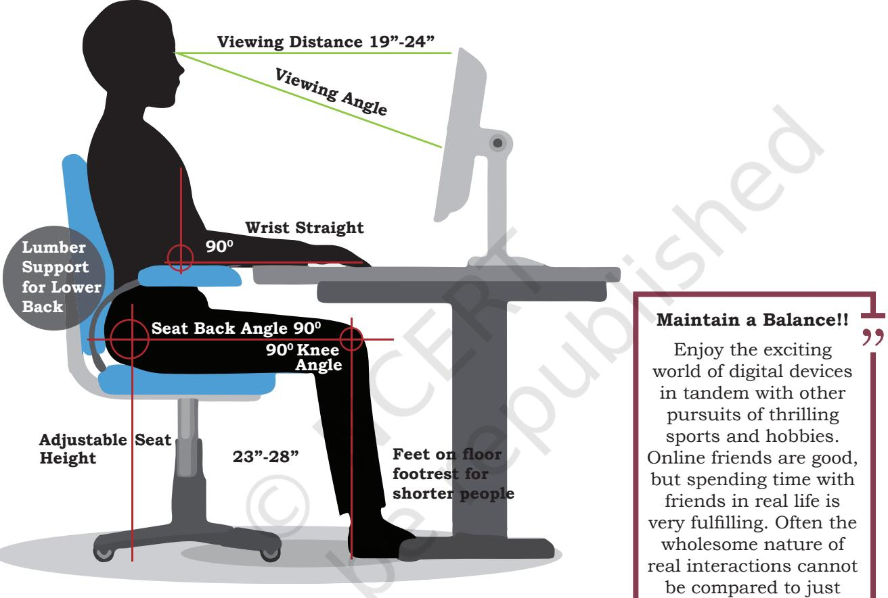
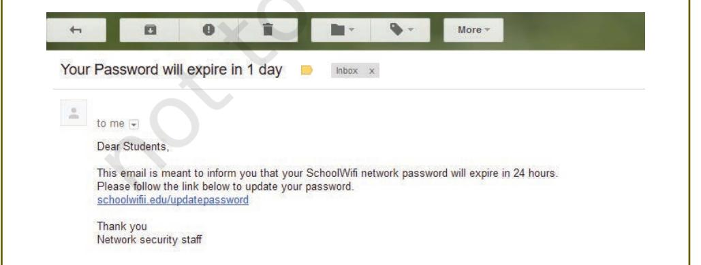
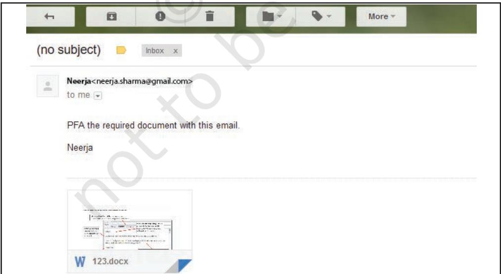

**Chapter**

# **6 Societal Impacts**

"I think computer viruses should count as life. I think it says something about human nature that the only form of life we have created so far is purely destructive. We've created life in our own image."

— Stephen Hawking

### *In this chapter*

- » *Introduction*
- » *Digital Footprints*
- » *Digital Society and Netizen*
- » *Data Protection*
- » *Creative Commons*
- » *Cyber Crime*
- » *Indian Information Technology Act (IT Act)*
- » *E-waste: Hazards and Management*
- » *Impact on Health*

#### **6.1 Introduction**

In recent years, the world around us has seen a lot of changes due to use of 'Digital Technologies'. These changes have made a dramatic impact on our lives, making things more convenient, faster, and easier to handle. In the past, a letter would take days to reach, and every recipient would get his or her own copy and respond separately. Today, one can send and receive emails to more than one person at a time. The instantaneous nature of electronic communications has made us more efficient and productive.

From the banking industry to aviation, industrial production to e-commerce, especially with regard to the delivery of their

Chapter 6.indd 167 10/9/2020 12:36:45 PM

goods and services, all are now dependent on the use of computers and digital technologies. Applications of digital technologies have redefined and evolved all spheres of human activities. Today more and more people are using digital technologies through smartphones, computers, etc., with the help of high speed Internet.

Why did the digital technologies become so widespread? The introduction of personal computers (PCs) and Internet followed by smartphones has brought these technologies to the common man.

While we reap the benefits of digital technologies, these technologies can also be misused. Let's look at the impact of these technologies on our society and the best practices that can ensure a productive and safe digital environment for us.

#### **6.2 Digital Footprints**

Have you ever searched online for any information? Have you ever purchased an online ticket, or responded

> to your friend's email, or checked the score of a game online? Whenever we surf the Internet using smartphones, tablets, computers, etc., we leave a trail of data reflecting the activities performed by us online, which is our *digital footprint*.

> Our digital footprint can be created and used with or without our knowledge. It includes websites we visit, emails we send, and any information we submit online, etc., along with the computer's IP address, location, and other device specific details. Such data could be used for targeted advertisement or could also be misused or exploited. Thus, it is good to be aware of the data trail we might be leaving behind. This awareness should make us cautious about what we write, upload or download or even browse online.

> There are two kinds of digital footprints we leave behind. Active digital footprints which includes data that we intentionally submit online. This would include emails we write, or responses or posts we make on different websites or mobile Apps, etc. The digital data trail we leave online unintentionally is called passive digital footprints. This includes the data generated when we visit a website, use a mobile App, browse Internet, etc. as shown in Figure 6.1

*Figure 6.1: Exemplar web applications that result in digital footprints*

Chapter 6.indd 168 10/9/2020 12:36:54 PM

Everyone who is connected to the Internet may have a digital footprint. With more usage, the trail grows. On examining the browser settings, we can find out how it stores our browsing history, cookies, passwords, auto fills, and many other types of data.

Besides browser, most of our digital footprints are stored in servers where the applications are hosted. We may not have access to remove or erase that data, neither do we have any control on how that data will be used. Therefore, once a data trail is generated, even if we later try to erase data about our online activities, the digital footprints still remain. There is no guarantee that digital footprints will be fully eliminated from the Internet. Therefore, we need to be more cautious while being online! All our online activities leave a data trace on the Internet as well as on the computing device that we use. This can be used to trace the user, their location, device and other usage details.

#### **6.3 Digital Society and Netizen**

As our society is inclined towards using more and more digital technologies, we end up managing most of our tasks digitally. In this era of digital society, our daily activities like communication, social networking, banking, shopping, entertainment, education, transportation, etc., are increasingly being driven by online transactions.

Digital society thus reflects the growing trend of using digital technologies in all spheres of human activities. But while online, all of us need to be aware of how to conduct ourselves, how best to relate with others and what ethics, morals and values to maintain. Anyone who uses digital technology along with Internet is a digital citizen or a netizen. Being a good netizen means practicing safe, ethical and legal use of digital technology. A responsible netizen must abide by net etiquettes, communication etiquettes and social media etiquettes.

#### **6.3.1 Net Etiquettes**

We follow certain etiquettes during our social interactions. Similarly, we need to exhibit proper manners and etiquettes while being online as shown in Figure 6.2. One should be ethical, respectful and responsible while surfing the Internet.

#### **Think and Reflect**

Can your digital footprints be used to judge your attitude and work ethics?

As a digital citizen, list various services that you avail online.

Chapter 6.indd 169 10/9/2020 12:36:54 PM

*Figure 6.2: Net etiquettes*

#### *(A) Be Ethical*

- No copyright violation: we should not use copyrighted materials without the permission of the creator or owner. As an ethical digital citizen, we need to be careful while streaming audio or video or downloading images and files from the Internet. We will learn more about copyright in Section 6.4.
- Share the expertise: it is good to share information and knowledge on Internet so that others can access it. However, prior to sharing information, we need to be sure that we have sufficient knowledge on that topic. The information shared should be true and unambiguous. Also, in order to avoid redundant information, we should verify that the information is not available already on Internet.

#### *(B) Be Respectful*

- Respect privacy: as good digital citizens we have the right to privacy and the freedom of personal expression. At the same time, we have to understand that other digital citizens also have the same rights and freedoms. Our personal communication with a digital citizen may include images, documents, files, etc., that are private to both. We should respect this privacy and should not share those images, documents, files, etc., with any other digital citizen without each others' consent.
- Respect diversity: in a group or public forum, we should respect the diversity of the people in terms of knowledge, experience, culture and other aspects.

#### *(C) Be Responsible*

- Avoid cyber bullying: any insulting, degrading or intimidating online behaviour like repeated posting of rumours, giving threats online, posting the victim's personal information, sexual harassment or comments aimed to publicly ridicule a victim is termed as cyber bullying. It implies repeatedly targeting someone with
While surfing the Internet, we should be cautious about our personal and confidential data.

- *√* Think before sharing credentials with others on an online platform.
- *√* Keep personal information safe and protected through passwords.

Chapter 6.indd 170 10/9/2020 12:36:54 PM

intentions to hurt or embarrass. Perhaps new or non-frequent users of the Internet feel that things done online have no effect in the real world. We need to realise that bullying online can have very serious implications on the other person (victim). Also, remember our actions can be traced back using our digital footprints.

- Don't feed the troll: an Internet troll is a person who deliberately sows discord on the Internet by starting quarrels or upsetting people, by posting inflammatory or off topic messages in an online community, just for amusement. Since trolls thrive on attention, the best way to discourage trolls is not to pay any attention to their comments.
#### **6.3.2 Communication Etiquettes**

Digital communication includes email, texting, instant messaging, talking on the cell phone, audio or video conferencing, posting on forums, social networking sites, etc. All these are great ways to connect with people in order to exchange ideas, share data and knowledge. Good communication over email, chat room and other such forums require a digital citizen to abide by the communication etiquettes as shown in Figure 6.3.

*Figure 6.3: Communication etiquettes*

#### *(A) Be Precise*

- Respect time: we should not waste precious time in responding to unnecessary emails or comments
**Activity 6.2**

Find out how to report about an abusive or inappropriate post or about a sender in a social network.

> **Avoid Spam!!** On receiving junk email (called Spam), neither reply nor open any attachment in such email.

Chapter 6.indd 171 10/9/2020 12:36:54 PM

#### **No Permanent Deletion!!**

We can post or comment anything on Internet, and delete it later.

- *√* But remember, it cannot be permanently deleted. It is recorded in our Digital Footprint.
- *√* This is how many culprits who spread hate, bully others or engage in criminal activities are traced and apprehended.

unless they have some relevance for us. Also, we should not always expect an instant response as the recipient may have other priorities.

- Respect data limits: For concerns related to data and bandwidth, very large attachments may be avoided. Rather send compressed files or link of the files through cloud shared storage like Google Drive, Microsoft OneDrive, Yahoo Dropbox, etc.
#### *(B) Be Polite*

Whether the communication is synchronous (happening in real time like chat, audio/video calls) or asynchronous (like email, forum post or comments), we should be polite and non-aggressive in our communication. We should avoid being abusive even if we don't agree with others' point of view.

#### *(C) Be Credible*

We should be cautious while making a comment, replying or writing an email or forum post as such acts decide our credibility over a period of time. That is how we decide to follow some particular person's forum posts while ignoring posts of other members of the forum. On various discussion forums, we usually try to go through the previous comments of a person and judge their credibility before relying on that person's comments.

#### **6.3.3 Social Media Etiquettes**

In the current digital era, we are familiar with different kinds *social media* and we may have an account on Facebook, Google+, Twitter, Instagram, Pinterest, or YouTube channel. Social media are websites or applications that enable their users to participate in social networking by creating and sharing content with others in the community. These platforms encourage users to share their thoughts and experiences through posts or pictures. In this way users can interact with other online users of those social media apps or channels. This is why the impact and outreach of social media has grown exponentially. It has begun to shape the outcome of politics, business, culture, education and more. In social media too, there are certain etiquettes we need to follow as shown in Figure 6.4.

Chapter 6.indd 172 10/9/2020 12:36:54 PM

*Figure 6.4: Social media etiquettes*

#### *(A) Be Secure*

- Choose password wisely: it is vital for social network users. News of breaching or leakage of user data from social network often attracts headlines. Users should be wary of such possibilities and must know how to safeguard themselves and their accounts. The minimum one can do is to have strong and frequently changed password. Never share personal credentials like username and password with others.
- Know who you befriend: social networks usually encourage connecting with users (making friends), sometime even those whom we don't know or have not met. However, we need to be careful while befriending unknown people as their intentions possibly could be malicious and unsafe.
- Beware of fake information: fake news, messages and posts are common in social networks. As a user, we should be aware of them. With experience, we should be able to figure out whether a news, message or post is genuine or fake. Thus, we should not blindly believe in everything that we come across on such platforms, we should apply our knowledge and experience to validate such news, message or post.

#### *(B) Be Reliable*

- Think before uploading: we can upload almost anything on social network. However, remember that once uploaded, it is always there in the remote server even if we delete the files. Hence we need to be cautious while uploading or sending sensitive or confidential files which have a bearing on our privacy.

- *√* Never arrange to meet an online friend because it may not be safe.
- *√* No matter how genuine someone is appearing online, they might be pretending and hiding their real identity.

#### **Think and Reflect**

Is having the same password for all your accounts on different websites safe?

Chapter 6.indd 173 10/9/2020 12:36:54 PM

Suppose someone's email password is 'technology', which is weak. Can you suggest a stronger password?

#### **Think and Reflect**

Why should we always mention the source from which we got an idea or used resources (text, image, audio, video, etc.) to prepare a project or a writeup?

#### **Executing IPR: say for a software**

- *√* Code of the software will be protected by a copyright
- *√* Functional expression of the idea will be protected by a patent
- *√* The name and logo of the software will come under a registered trademark

#### **6.4 Data Protection**

In this digital age, data or information protection is mainly about the privacy of data stored digitally. Elements of data that can cause substantial harm, embarrassment, inconvenience and unfairness to an individual, if breached or compromised, is called sensitive data. Examples of sensitive data include biometric information, health information, financial information, or other personal documents, images or audios or videos. Privacy of sensitive data can be implemented by encryption, authentication, and other secure methods to ensure that such data is accessible only to the authorised user and is for a legitimate purpose.

All over the world, each country has its own data protection policies (laws). These policies are legal documents that provide guidelines to the user on processing, storage and transmission of sensitive information. The motive behind implementation of these policies is to ensure that sensitive information is appropriately protected from modification or disclosure.

#### **6.4.1 Intellectual Property Right (IPR)**

When someone owns a house or a motorcycle, we say that the person owns that property. Similarly, if someone comes out with a new idea, this original idea is that person's intellectual property. Intellectual Property refers to the inventions, literary and artistic expressions, designs and symbols, names and logos. The ownership of such concepts lies with the creator, or the holder of the intellectual property. This enables the creator or copyright owner to earn recognition or financial benefit by using their creation or invention. Intellectual Property is legally protected through copyrights, patents, trademarks,etc.

#### *(A) Copyright*

Copyright grants legal rights to creators for their original works like writing, photograph, audio recordings, video, sculptures, architectural works, computer software, and other creative works like literary and artistic work. Copyrights are automatically granted to creators and authors. Copyright law gives the copyright holder a set of rights that they alone can avail legally. The rights include right to copy (reproduce) a work, right to create

Chapter 6.indd 174 10/9/2020 12:36:54 PM

derivative works based upon it, right to distribute copies of the work to the public, and right to publicly display or perform the work. It prevents others from copying, using or selling the work. For example, writer Rudyard Kipling holds the copyright to his novel, 'The Jungle Book', which tells the story of Mowgli, the jungle boy. It would be an infringement of the writer's copyright if someone used parts of the novel without permission. To use other's copyrighted material, one needs to obtain a license from them.

#### *(B) Patent*

A patent is usually granted for inventions. Unlike copyright, the inventor needs to apply (file) for patenting the invention. When a patent is granted, the owner gets an exclusive right to prevent others from using, selling, or distributing the protected invention. Patent gives full control to the patentee to decide whether or how the invention can be used by others. Thus it encourages inventors to share their scientific or technological findings with others. A patent protects an invention for 20 years, after which it can be freely used. Recognition and/or financial benefit foster the right environment, and provide motivation for more creativity and innovation.

#### *(C) Trademark*

Trademark includes any visual symbol, word, name, design, slogan, label, etc., that distinguishes the brand or commercial enterprise, from other brands or commercial enterprises. For example, no company other than Nike can use the Nike brand to sell shoes or clothes. It also prevents others from using a confusingly similar mark, including words or phrases. For example, confusing brands like "Nikke" cannot be used. However, it may be possible to apply for the Nike trademark for unrelated goods like notebooks.

#### **6.4.2 Licensing**

We have studied about copyright in the previous section. Licensing and copyrights are two sides of the same coin. A license is a type of contract or a permission agreement between the creator of an original work permitting someone to use their work, generally for some price; whereas copyright is the legal rights of the creator for the protection of original work of different types. Licensing

Explore the following websites to know about open/public licensing:

- (i) creativecommons. org for CC, and
- (ii) gnu.org for GNU GPL.

Only the copyright owner of a work can enter into a license agreement.

End User License Agreement (EULA) contains the dos and don'ts with respect to the software being purchased. It covers all clauses of software purchase, viz., how many copies can be installed, whether source is available, whether it can be modified and redistributed and so on.

Chapter 6.indd 175 10/9/2020 12:36:55 PM

#### **Beware!!**

- *√* Plagiarism means using other's work and not giving adequate citation for use.
- *√* Copyright infringement means using another person's work, without permission or without paying for it, if it is being sold.

is the legal term used to describe the terms under which people are allowed to use the copyrighted material. We will limit our study to software licensing in this chapter.

A software license is an agreement that provides legally binding guidelines pertaining to the authorised use of digital material. The digital material may include any software or any form of art, literature, photos, etc., in digital form. Any such resource posted on the Internet constitutes intellectual property and must be downloaded, used or distributed according to the guidelines given in the license agreement. Failure to follow such guidelines is considered as an infringement of Intellectual Property Rights (IPR), and is a criminal offence.

#### **6.4.3 Violation of IPR**

Violation of intellectual property right may happen in one of the following ways:

#### *(A) Plagiarism*

With the availability of Internet, we can instantly copy or share text, pictures and videos. Presenting someone else's idea or work as one's own idea or work is called plagiarism. If we copy some contents from Internet, but do not mention the source or the original creator, then it is considered as an act of plagiarism. Further, if someone derives an idea or a product from an already existing idea or product, but instead presents it as a new idea, then also it is plagiarism. It is a serious ethical offense and sometimes considered as an act of fraud. Even if we take contents that are open for public use, we should cite the author or source to avoid plagiarism.

#### *(B) Copyright Infringement*

Copyright infringement is when we use other person's work without obtaining their permission to use or we have not paid for it, if it is being sold. Suppose we download an image from the Internet and use it in our project. But if the owner of the copyright of the image does not permit its free usage, then using such an image even after giving reference of the image in our project is a violation of copyright. Just because it is on the Internet, does not mean that it is free for use. Hence, check the copyright status of writer's work before using it to avoid copyright infringement.

Chapter 6.indd 176 10/9/2020 12:36:55 PM

Chapter 6.indd 177 10/9/2020 12:36:55 PM

2024-25

#### *(C) Trademark Infringement*

Trademark Infringement means unauthorised use of other's trademark on products and services. An owner of a trademark may commence legal proceedings against someone who infringes its registered trademark.

#### **6.4.4 Public Access and Open Source Software**

Copyright sometimes put restriction on the usage of the copyrighted works by anyone else. If others are allowed to use and built upon the existing work, it will encourage collaboration and would result in new innovations in the same direction. Licenses provide rules and guidelines for others to use the existing work. When authors share their copyrighted works with others under public license, it allows others to use and even modify the content. Open source licenses help others to contribute to existing work or project without seeking special individual permission to do so.

The GNU General Public License (GPL) and the Creative Commons (CC) are two popular categories of public licenses. CC is used for all kind of creative works like websites, music, film, literature, etc. CC enables the free distribution of an otherwise copyrighted work. It is used when an author wants to give people the right to share, use and build upon a work that they have created. GPL is primarily designed for providing public licence to a software. GNU GPL is another free software license, which provides end users the freedom to run, study, share and modify the software, besides getting regular updates.

Users or companies who distribute GPL licensed works may charge a fee for copies or give them free of charge. This distinguishes the GPL license from freeware software licenses like Skype, Adobe Acrobat reader, etc. that allow copying for personal use but prohibit commercial distribution, or proprietary licenses where copying is prohibited by copyright law.

Many of the proprietary software that we use are sold commercially and their program code (source code) are not shared or distributed. However, there are certain software available freely for anyone and their source code is also open for anyone to access, modify, correct and improve. Free and open source software (FOSS) has a large community of users and developers who are

#### **Remember**

- *√* CC licenses are a set of copyright licenses that give the recipients, rights to copy, modify and redistribute the creative material, but giving the authors, the liberty to decide the conditions of licensing.
- *√* GPL is the most widely used free software license which grants the recipients, rights to copy, modify and redistribute the software and that the same rights are preserved in all derivative works.

contributing continuously towards adding new features or improving the existing features. For example, Linux kernel-based operating systems like Ubuntu and Fedora come under FOSS. Some of the popular FOSS tools are office packages, like Libre Office, browser like Mozilla Firefox, etc.

Software piracy is the unauthorised use or distribution of software. Those who purchase a license for a copy of the software do not have the rights to make additional copies without the permission of the copyright owner. It amounts to copyright infringement regardless of whether it is done for sale, for free distribution or for copier's own use. One should avoid software piracy. Using a pirated software not only degrades the performance of a computer system, but also affects the software industry which in turn affects the economy of a country.

#### **6.5 Creative Commons**

Creative Commons is a non-profit organisation (https:// creativecommons.org/) that aims to build a publically accessible global platform where a range of creative and academic works are shared freely. Any one across the globe can access them, share them, and even use them for creating their own work out of it without infringing the copyright or Intellectual Property rights of the owners. In fact, it gives proper attribution to the owners.

The Creative Commons organisation provides Creative Commons (CC) licenses free of charge. It allows owners of a work to grant copyright permissions for their creative and/or academic works in a free, simple and standardised way. A CC license is a type of copyright license that enables the free distribution of anybody's copyrighted work. This license is used when an author wants to give others the right to share, use and extend the work done by them. The work licensed under CC is governed by the Copyright law and so applies to all types of work including art, music, literature, dramatics, movies, images, educational resources, photographs and software. The CC Search feature of the online platform makes the licensed material easier to find. The author of the content is given full freedom to set up conditions to use their work. The owner of a work can combine these conditions to create six different types of CC licenses, as listed in Table 6.1.

Chapter 6.indd 178 10/9/2020 12:36:55 PM

| License Name | Symbolic | License icon | Description |
| --- | --- | --- | --- |
|  | name |  |  |
| Attribution | CC BY |  | This license lets others distribute, remix, |
|  |  |  | tweak, and build upon your work, even |
|  |  |  | commercially, as long as they credit you for |
|  |  |  | the original creation. |
| Attribution | CC BY-SA |  | This license lets others remix, tweak, and |
| ShareAlike |  |  | build upon your work even for commercial |
|  |  |  | purposes, as long as they credit you and |
|  |  |  | license their new creations under the identical |
|  |  |  | terms. |
| Attribution | CC BY-ND |  | This license lets others reuse the work for any |
| NoDerivs |  |  | purpose, including commercially; however, it |
|  |  |  | cannot be shared with others in adapted form, |
|  |  |  | and credit must be provided to you. |
| Attribution | CC BY-NC |  | This license lets others remix, tweak, and |
| NonCommercial |  |  | build upon your work non-commercially, |
|  |  |  | and although their new works must also |
|  |  |  | acknowledge you and be non-commercial. |
| Attribution | CC BY-NC-SA |  | This license lets others remix, tweak, and |
| NonCommercial |  |  | build upon your work non-commercially, as |
| ShareAlike |  |  | long as they credit you and license their new |
|  |  |  | creations under the identical terms. |
| Attribution | CC BY-NC-ND |  | This license is the most restrictive of our |
| NonCommercial |  |  | six main licenses, only allowing others to |
| NoDerivs |  |  | download your works and share them with |
|  |  |  | others as long as they credit you, but they |
|  |  |  | can't change them in any way or use them |
|  |  |  | commercially. |

#### **Table 6.1 Creative Commons (CC) Licenses**

#### **6.6 Cyber Crime**

Criminal activities or offences carried out in a digital environment can be considered as cyber crime. In such crimes, either the computer itself is the target or the computer is used as a tool to commit a crime. Cyber crimes are carried out against either an individual, or a group, or an organisation or even against a country, with the intent to directly or indirectly cause physical harm, financial loss or mental harassment. A cyber criminal attacks a computer or a network to reach other computers in order to disable or damage data or services. Apart from this, a cyber criminal may spread viruses and other malwares in order to steal private and confidential data for blackmailing and extortion. A computer virus is some lines of malicious code that can copy itself and can have detrimental effect on the computers, by destroying data or corrupting the system. Similarly, malware is

#### **Remember!!**

Cyber crime is defined as a crime in which computer is the medium of crime (hacking, phishing, spamming), or the computer is used as a tool to commit crimes (extortion, data breaches, theft).

Chapter 6.indd 179 10/9/2020 12:36:55 PM

How can you unsubscribe from a mail group or block an email sender?

#### **Beware !!**

Accepting links from untrusted emails can be hazardous, as they may potentially contain a virus or link to malicious website. We should ensure to open any email link or attachment only when it is from a trusted source and doesn't look doubtful.

a software designed to specifically gain unauthorised access to computer systems. The nature of criminal activities are alarmingly increasing day-by-day, with frequent reports of hacking, ransomware attacks, denial-of-service, phishing, email fraud, banking fraud and identity theft.

#### **6.6.1 Hacking**

Hacking is the act of unauthorised access to a computer, computer network or any digital system. Hackers usually have technical expertise of the hardware and software. They look for bugs to exploit and break into the system.

Hacking, when done with a positive intent, is called ethical hacking. Such ethical hackers are known as white hat hackers. They are specialists in exploring any vulnerability or loophole by during testing of the software. Thus, they help in improving the security of a software. An ethical hacker may exploit a website in order to discover its security loopholes or vulnerabilities. He then reports his findings to the website owner. Thus, ethical hacking is actually preparing the owner against any cyber attack.

A non-ethical hacker is the one who tries to gain unauthorised access to computers or networks in order to steal sensitive data with the intent to damage or bring down systems. They are called black hat hackers or crackers. Their primary focus is on security cracking and data stealing. They use their skill for illegal or malicious purposes. Such hackers try to break through system securities for identity theft, monetary gain, to bring a competitor or rival site down, to leak sensitive information, etc.

#### **6.6.2 Phishing and Fraud Emails**

Phishing is an unlawful activity where fake websites or emails that look original or authentic are presented to the user to fraudulently collect sensitive and personal details, particularly usernames, passwords, banking and credit card details. The most common phishing method is through email spoofing where a fake or forged email address is used and the user presumes it to be from an authentic source. So you might get an email from an address that looks similar to your bank or educational institution, asking for your information,

Chapter 6.indd 180 10/9/2020 12:36:55 PM

but if you look carefully you will see their URL address is fake. They will often use logo's of the original, making them difficult to detect from the real! Phishing attempts through phone calls or text messages are also common these days.

#### *(A) Identity Theft*

Identity thieves increasingly use personal information stolen from computers or computer networks, to commit fraud by using the data gained unlawfully. A user's identifiable personal data like demographic details, email ID, banking credentials, passport, PAN, Aadhaar number and various such personal data are stolen and misused by the hacker on behalf of the victim. This is one type of phishing attack where the intention is largely for monetary gain. There can be many ways in which the criminal takes advantage of an individual's stolen identity. Given below are a few examples:

- Financial identity theft: when the stolen identity is used for financial gain.
- Criminal identity theft: criminals use a victim's stolen identity to avoid detection of their true identity.
- Medical identity theft: criminals can seek medical drugs or treatment using a stolen identity.

#### **6.6.3 Ransomware**

This is another kind of cyber crime where the attacker gains access to the computer and blocks the user from accessing, usually by encrypting the data. The attacker blackmails the victim to pay for getting access to the data, or sometimes threatens to publish personal and sensitive information or photographs unless a ransom is paid.

Ransomware can get downloaded when the users visit any malicious or unsecure websites or download software from doubtful repositories. Some ransomware are sent as email attachments in spam mails. It can also reach our system when we click on a malicious advertisement on the Internet.

#### **6.6.4 Combatting and Preventing Cyber Crime**

The challenges of cyber crime can be mitigated with the twin approach of being alert and taking legal help. **Activity 6.6**

Explore and find out how to file a complaint with the cyber cell in your area.

Chapter 6.indd 181 10/9/2020 12:36:55 PM

Digital signatures are the digital equivalent of a paper certificate. Digital signatures work on a unique digital ID issued by an Certificate Authority (CA) to the user. Signing a document digitally means attaching that user's identify, which can be used to authenticate.

A licensed Certifying Authority (CA) who has been granted a license to issue it under Section 24 of the Indian IT-Act 2000, can issue the digital signature.

Following points can be considered as safety measures to reduce the risk of cyber crime:

- Take regular backup of important data.
- Use an antivirus software and keep it updated always.
- Avoid installing pirated software. Always download software from known and secure (HTTPS) sites.
- Always update the system software which include the Internet browser and other application software
- Do not visit or download anything from untrusted websites.
- Usually the browser alerts users about doubtful websites whose security certificate could not be verified; avoid visiting such sites.
- Use strong password for web login, and change it periodically. Do not use same password for all the websites. Use different combinations of alphanumeric characters including special characters. Ignore common words or names in password.
- While using someone else's computer, don't allow browser to save password or auto fill data, and try to browse in your private browser window.
- For an unknown site, do not agree to use cookies when asked for through a Yes/No option.
- Perform online transaction like shopping, ticketing, and other such services only through well-known and secure sites.
- Always secure wireless network at home with strong password and regularly change it.

#### **6.7 Indian Information Technology Act (IT Act)**

With the growth of Internet, many cases of cyber crimes, frauds, cyber attacks and cyber bullying are reported. The nature of fraudulent activities and crimes keeps changing. To deal with such menaces, many countries have come up with legal measures for protection of sensitive personal data and to safeguard the rights of Internet users. The Government of India's The Information Technology Act, 2000 (also known as IT Act), amended in 2008, provides guidelines to the user on the processing, storage and transmission of sensitive

Chapter 6.indd 182 10/9/2020 12:36:55 PM

cells in police stations where one can report any cyber crime. The act provides legal framework for electronic governance by giving recognition to electronic records and digital signatures. The act outlines cyber crimes and penalties for them.

Cyber Appellate Tribunal has been established to resolve disputes arising from cyber crime, such as tampering with computer source documents, hacking the computer system, using password of another person, publishing sensitive personal data of others without their consent, etc. The act is needed so that people can perform transactions over the Internet through credit cards without fear of misuse. Not only people, the act empowers government departments also to accept filing, creation and storage of official documents in the digital format.

#### **6.8 E-waste: Hazards and Management**

E-waste or Electronic waste includes electric or electronic gadgets and devices that are no longer in use. Hence, discarded computers, laptops, mobile phones, televisions, tablets, music systems, speakers, printers, scanners etc. constitute e-waste when they are near or end of their useful life.

E-waste is becoming one of the fastest growing environmental hazards in the world today. The increased use of electronic equipment has also caused an exponential increase in the number of discarded products. Lack of awareness and appropriate skill to manage it has further worsened the problem. So, Waste Electrical and Electronic Equipment (WEEE) is becoming a major concern for all countries across the world. Globally, e-waste constitutes more than 5 per cent of the municipal solid waste. Therefore, it is very important that e-waste is disposed of in such a manner that it causes minimum damage to the environment and society.

#### **6.8.1 Impact of e-waste on environment**

To some extent, e-waste is responsible for the degradation of our environment. Whether it is emission of gases and fumes into the atmosphere, discharge of liquid waste into drains or disposal of solid e-waste materials, all of California Law University has identified nonfunctioning cathode ray tubes (CRTs) from televisions and computer monitors as hazardous.

Leaching is the process of removing a substance from another substance by passing water through it.

Chapter 6.indd 183 10/9/2020 12:36:55 PM

this contributes to environmental pollution in some way or the other.

When e-waste is carelessly thrown or dumped in landfills or dumping grounds, certain elements or metals used in production of electronic products cause air, water and soil pollution. This is because when these products come in contact with air and moisture, they tend to leach. As a result, the harmful chemicals seep into the soil, causing soil pollution. Further, when these chemicals reach and contaminate the natural ground water, it causes water pollution as the water becomes unfit for humans, animals and even for agricultural use. When dust particles loaded with heavy metals enters the atmosphere, it causes air pollution as well.

#### **6.8.2 Impact of e-waste on humans**

As mentioned before, the electrical or electronic devices are manufactured using certain metals and elements like lead, beryllium, cadmium, plastics, etc. Most of these materials are difficult to recycle and are considered to be toxic and carcinogenic. If e-waste is not disposed of in proper manner, it can be extremely harmful to humans, plants, animals and the environment as discussed below:

- One of the most widely used metals in electronic devices (such as monitors and batteries) is lead. When lead enters the human body through contaminated food, water, air or soil, it causes lead poisoning which affects the kidneys, brain and central nervous system. Children are particularly vulnerable to lead poisoning.
- When e-waste such as electronic circuit boards are burnt for disposal, the elements contained in them create a harmful chemical called beryllium which causes skin diseases, allergies and an increased risk of lung cancer. Burning of insulated wires to extract copper can cause neurological disorders.
- Some of the electronic devices contain mercury which causes respiratory disorders and brain damage.
- The cadmium found in semiconductors and resistors can damage kidneys, liver and bones.
- None of the electronic devices are manufactured without using plastics. When this plastic reacts

Carcinogenic: May cause cancer

Chapter 6.indd 184 10/9/2020 12:36:55 PM

with air and moisture, it passes harmful chemicals into the soil and water resources. When consumed, it damages the immune system of the body and also causes various psychological problems like stress and anxiety.

#### **6.8.3 Management of e-waste**

E-waste management is the efficient disposal of e-waste. Although we cannot completely destroy e-waste, still certain steps and measures have to be taken to reduce harm to the humans and environment. Some of the feasible methods of e-waste management are reduce, reuse and recycle.

- **• Reduce:** We should try to reduce the generation of e-waste by purchasing the electronic or electrical devices only according to our need. Also, they should be used to their maximum capacity and discarded only after their useful life has ended. Good maintenance of electronics devices also increases the life of the devices.
- **• Reuse:** It is the process of re-using the electronic or electric waste after slight modification. The electronic equipment that is still functioning should be donated or sold to someone who is still willing to use it. The process of re-selling old electronic goods at lower prices is called refurbishing.
- **• Recycle:** Recycling is the process of conversion of electronic devices into something that can be used again and again in some or the other manner. Only those products should be recycled that cannot be repaired, refurbished or re-used. To promote recycling of e-waste many companies and NGOs are providing door-to-door pick up facilities for collecting the e-waste from homes and offices.

#### **6.8.4 E-waste Management in India**

In India, the Environmental Protection Act, 1986, has been enacted to punish people responsible for causing any form of pollution by paying for the damage done to the natural environment. According to this act, "Polluter pays Principle", any one causing any form of pollution will pay for the damage caused. Any violation of the provisions of this act is liable for punishment.

#### **Think and Reflect**

Do you follow precautions to stay healthy - physically, mentally as well as emotionally while using digital technologies?

Chapter 6.indd 185 10/9/2020 12:36:55 PM

#### **Device Safety: Ensures Good Health of a Computer System**

- *√* Regularly clean it to keep the dust off. Use a liquid solution specifically formulated for the cleaning of electronic screens.
- *√* Wipe monitor's screen often using the regular microfibre soft cloth (the one used for spectacles).
- *√* Keep it away from direct heat, sunlight and put it in a room with enough ventilation for air circulation.
- *√* Do not eat food or drink over the keyboard. Food crumbs that fall into the gaps between the keys or spilled over liquid can cause issues to the devices.

The Central Pollution Control Board (CPCB) has issued a formal set of guidelines for proper handling and disposal of e-waste. According to these guidelines, the manufacturer of any electronic equipment will be "personally" responsible for the final safe disposal of the product when it becomes an e-waste.

The Department of Information Technology (DIT), Ministry of Communication and Information Technology, has also issued a comprehensive technical guide on "Environmental Management for Information Technology Industry in India." The industries have to follow these guidelines for recycling and reuse of e-waste. In order to make the consumers aware of the recycling of e-waste, prominent smartphone and computer manufacturing companies have started various recycling programs.

#### **6.9 Impact on Health**

As digital technologies have penetrated into different fields, we are spending more time in front of screens, be it mobile, laptop, desktop, television, gaming console, music or sound device. But interacting in an improper posture can be bad for us — both physically, and mentally. Besides, spending too much time on Internet can be addictive and can have a negative impact on our physical and psychological well being.

However, these health concerns can be addressed to some extent by taking care of the way we position such devices and the way we position our posture. Ergonomics is a branch of science that deals with designing or arranging workplaces including the furniture, equipments and systems so that it becomes safe and comfortable for the user. Ergonomics helps us in reducing the strain on our bodies — including the fatigue and injuries due to prolonged use.

When we continuously look at the screen for watching, typing, chatting or playing games, our eyes are continuously exposed to the glare coming from the screens. Looking at small handheld devices makes it worse. Eye strain is a symptom commonly complained by users of digital devices. Ergonomically maintaining the viewing distance and angle, along with the position

Chapter 6.indd 186 10/9/2020 12:36:55 PM

online social networking.

can be of some help. Figure 6.5 shows the posture to be maintained in order to avoid fatigue caused due to prolonged use of computer system and other digital devices. However, to get rid of dry, watering, or itchy eyes, it is better to periodically focus on distant objects, and take a break for outdoor activities.

*Figure 6.5: Correct posture while sitting in front of a computer*

Bad posture, backaches, neck and shoulder pains can be prevented by arranging the workspace as recommended by ergonomics. Overuse of keyboards (be it physical keyboard or touchscreen-based virtual keyboard) not aligned ergonomically, can give rise to a painful condition of wrists and fingers, and may require medical help in the long run.

Stress, physical fatigue and obesity are the other related impacts the body may face if one spends too much time using digital devices.

Chapter 6.indd 187 10/9/2020 12:36:55 PM

## **Notes Summary**

- Digital footprint is the trail of data we leave behind when we visit any website (or use any online application or portal) to fill-in data or perform any transaction.
- A user of digital technology needs to follow certain etiquettes like net-etiquettes, communicationetiquettes and social media-etiquettes.
- Net-etiquette includes avoiding copyright violations, respecting privacy and diversity of users, and avoiding cyber bullies and cyber trolls, besides sharing of expertise.
- Communication-etiquette requires us to be precise and polite in our conversation so that we remain credible through our remarks and comments.
- While using social media, one needs to take care of security through password, be aware of fake information and be careful while befriending unknowns. Care must be taken while sharing anything on social media as it may create havoc if being mishandled, particularly our personal, sensitive information.
- Intellectual Property Rights (IPR) help in data protection through copyrights, patents and trademarks. There are both ethical and legal aspects of violating IPR. A good digital citizen should avoid plagiarism, copyright infringement and trademark infringement.
- Certain software are made available for free public access. Free and Open Source Software (FOSS) allow users to not only access but also to modify (or improve) them.
- Cyber crimes include various criminal activities carried out to steal data or to break down important services. These include hacking, spreading viruses or malware, sending phishing or fraudulent emails, ransomware, etc.
- Excessive usage of digital devices has a negative impact on our physical as well as psychological well-being. Ergonomic positioning of devices as well as our posture are important.

Chapter 6.indd 188 10/9/2020 12:36:55 PM

## Exercise **Notes**

- 1. After practicals, Atharv left the computer laboratory but forgot to sign off from his email account. Later, his classmate Revaan started using the same computer. He is now logged in as Atharv. He sends inflammatory email messages to few of his classmates using Atharv's email account. Revaan's activity is an example of which of the following cyber crime? Justify your answer.
	- a) Hacking
	- b) Identity theft
	- c) Cyber bullying
	- d) Plagiarism
- 2. Rishika found a crumpled paper under her desk. She picked it up and opened it. It contained some text which was struck off thrice. But she could still figure out easily that the struck off text was the email ID and password of Garvit, her classmate. What is ethically correct for Rishika to do?
	- a) Inform Garvit so that he may change his password.
	- b) Give the password of Garvit's email ID to all other classmates.
	- c) Use Garvit's password to access his account.
- 3. Suhana is down with fever. So, she decided not to go to school tomorrow. Next day, in the evening she called up her classmate, Shaurya and enquired about the computer class. She also requested him to explain the concept. Shaurya said, "Mam taught us how to use tuples in python". Further, he generously said, "Give me some time, I will email you the material which will help you to understand tuples in python". Shaurya quickly downloaded a 2-minute clip from the Internet explaining the concept of tuples in python. Using video editor, he added the text "Prepared by Shaurya" in the downloaded video clip. Then, he emailed the modified video clip to Suhana. This act of Shaurya is an example of
	- a) Fair use
	- b) Hacking
	- c) Copyright infringement
	- d) Cyber crime
- 4. After a fight with your friend, you did the following activities. Which of these activities is not an example of cyber bullying?

Chapter 6.indd 189 10/9/2020 12:36:55 PM

| Notes | a) | You sent an email to your friend with a message |
| --- | --- | --- |
|  |  | saying that "I am sorry". |
|  | b) | You sent a threatening message to your friend |
|  |  | saying "Do not try to call or talk to me". |
|  | c) | You created an embarrassing picture of your |
|  |  | friend and uploaded on your account on a social |
|  |  | networking site. |
|  | 5. | Sourabh has to prepare a project on "Digital India |
|  |  | Initiatives". He decides to get information from the |
|  |  | Internet. He downloads three web pages (webpage |
|  |  | 1, webpage 2, webpage 3) containing information on |
|  |  | Digital India Initiatives. Which of the following steps |
|  |  | taken by Sourabh is an example of plagiarism or |
|  |  | copyright infringement? Give justification in support |
|  |  | of your answer. |
|  | a) | He read a paragraph on " Digital India Initiatives" |
|  |  | from webpage 1 and rephrased it in his own |
|  |  | words. He finally pasted the rephrased paragraph |
|  |  | in his project. |
|  | b) | He downloaded three images of " Digital India |
|  |  | Initiatives" from webpage 2. He made a collage for |
|  |  | his project using these images. |
|  | c) | He downloaded "Digital India Initiative" icon from |
|  |  | web page 3 and pasted it on the front page of his |
|  |  | project report. |
|  | 6. | Match the following: |
|  | Column A | Column B |
|  | Plagiarism | Fakers, by offering special rewards or money |
|  |  | prize asked for personal information, such as |
|  |  | bank account information |
|  | Hacking | Copy and paste information from the Internet |
|  |  | into your report and then organise it |
|  | Credit card fraud | The trail that is created when a person uses |
|  |  | the Internet. |
|  | Digital Foot Print | Breaking into computers to read private emails |
|  |  | and other files |
|  | 7. | You got the below shown SMS from your bank querying |
|  |  | a recent transaction. Answer the following — |
|  | a) | Will you SMS your pin number to the given |
|  |  | contact number? |
|  | b) | Will you call the bank helpline number to recheck |
|  |  | the validity of the SMS received? |
|  | 8. | Preeti celebrated her birthday with her family. She |

- was excited to share the moments with her friend Himanshu. She uploaded selected images of her
Chapter 6.indd 190 10/9/2020 12:36:55 PM

birthday party on a social networking site so that Himanshu can see them. After few days, Preeti had a fight with Himanshu. Next morning, she deleted her birthday photographs from that social networking site, so that Himanshu cannot access them. Later in the evening, to her surprise, she saw that one of the images which she had already deleted from the social networking site was available with their common friend Gayatri. She hurriedly enquired Gayatri "Where did you get this picture from?". Gayatri replied "Himanshu forwarded this image few minutes back".

 Help Preeti to get answers for the following questions. Give justification for your answers so that Preeti can understand it clearly.

- a) How could Himanshu access an image which I had already deleted?
- b) Can anybody else also access these deleted images?
- c) Had these images not been deleted from my digital footprint?
- 9. The school offers wireless facility (wifi) to the Computer Science students of Class XI. For communication, the network security staff of the school have a registered URL schoolwifi.edu. On 17 September 2017, the following email was mass distributed to all the Computer Science students of Class XI. The email claimed that the password of the students was about to expire. Instructions were given to go to URL to renew their password within 24 hours.

- a) Do you find any discrepancy in this email?
- b) What will happen if the student will click on the given URL?

Chapter 6.indd 191 10/9/2020 12:36:55 PM

| Notes |  | c) Is the email an example of cyber crime? If yes, |
| --- | --- | --- |
|  |  | then specify which type of cyber crime is it. Justify |
|  |  | your answer. |
|  | 10. | You are planning to go for a vacation. You surfed the |
|  |  | Internet to get answers for the following queries — |
|  |  | a) Weather conditions |
|  |  | b) Availability of air tickets and fares |
|  |  | c) Places to visit |
|  |  | d) Best hotel deals |
|  |  | Which of your above mentioned actions might have |
|  |  | created a digital footprint? |
|  | 11. | How would you recognise if one of your friends is |
|  |  | being cyber bullied? |
|  |  | a) Cite the online activities which would help you |
|  |  | detect that your friend is being cyber bullied? |
|  |  | b) What provisions are in IT Act 2000, (amended in |
|  |  | 2008) to combact such situations. |
|  | 12. | Write the differences between the following — |
|  |  | a) Copyrights and Patents |
|  |  | b) Plagiarism and Copyright infringement |
|  |  | c) Non-ethical hacking and Ethical hacking |
|  |  | d) Active and Passive footprints |
|  |  | e) Free software and Free and open source software |
|  | 13. | If you plan to use a short text from an article on the |
|  |  | web, what steps must you take in order to credit the |
|  |  | sources used? |
|  | 14. | When you search online for pictures, how will you |
|  |  | find pictures that are available in the free public |
|  |  | domain. How can those pictures be used in your |
|  |  | project without copyright violations? |
|  | 15. | Describe why it is important to secure your wireless |
|  |  | router at home. Search the Internet to find the rules |
|  |  | to create a reasonably secure password. Create an |
|  |  | imaginary password for your home router. Will you |
|  |  | share your password for home router with following |
|  |  | people. Justify your answer. |
|  |  | a) Parents |
|  |  | b) Friends |
|  |  | c) Neighbours |

- d) Home tutors
- 16. List down the steps you need to take in order to ensure —

Chapter 6.indd 192 10/9/2020 12:36:55 PM

- a) your computer is in good working condition for a longer time.
- b) smart and safe Internet surfing.
- 17. What is data privacy? Websites that you visit collect what type of information about you?
- 18. In the computer science class, Sunil and Jagdish were assigned the following task by their teacher.
	- a) Sunil was asked to find information about "India, a Nuclear power". He was asked to use Google Chrome browser and prepare his report using Google Docs.
	- b) Jagdish was asked to find information about "Digital India". He was asked to use Mozilla Firefox browser and prepare his report using Libre Office Writer.

What is the difference between technologies used by Sunil and Jagdish?

- 19. Cite examples depicting that you were a victim of following cyber crime. Also, cite provisions in IT Act to deal with such a cyber crime.
	- a) Identity theft
	- b) Credit card account theft
- 20. Neerja is a student of Class XI. She has opted for Computer Science. Neerja prepared the project assigned to her. She mailed it to her teacher. The snapshot of that email is shown below.

 Find out which of the following email etiquettes are missing in it. Justify your answer.

Chapter 6.indd 193 10/9/2020 12:36:55 PM

#### **Notes**

- a) Subject of the mail
	- b) Formal greeting
	- c) Self-explanatory terms
	- d) Identity of the sender
	- e) Regards
- 21. Sumit got good marks in all the subjects. His father gifted him a laptop. He would like to make Sumit aware of health hazards associated with inappropriate and excessive use of laptop. Help his father to list the points which he should discuss with Sumit.

Chapter 6.indd 194 10/9/2020 12:36:55 PM

