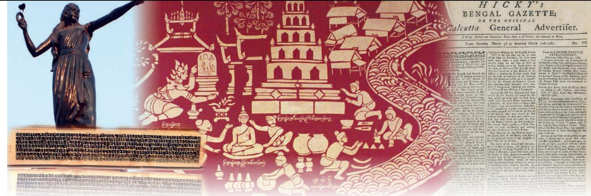

# Language and Literature of India **1**

Language is one of the most beautiful and intriguing phenomenon in the world. It is closest to all living beings, carving the rhythm of their life.

It is language that fulfills our wish to be understood by others in life time and remembered ever after. The most creative minds have always adored language as their muse.

Interestingly there are many languages without a script but they fulfill the urge of expression of creative thoughts, ideas and mutual interactions. They connect the speaker with listener reliving the experiences, for example, we have beautiful, rich oral traditions of presenting time and space in the form of storytelling, *Kavaad Banchana*1 (story telling). *Phad* singers2, folktales, dialects, historical narrations, paintings, dance, etc. These were the most reliable and popular medium before the advent of writing systems and are accessible even today to people. All major forms of literature: *śruti, smṛti, purāṇa*, epics, poetry, folk tales, and myths are preserved and are still alive in oral traditions of the country.

- 1. *Kavaad Banchana*: is a traditional form of oral storytelling, *Kavaad* means panel of a door and *Banchana* means to narrate and show the illustrated story on the panel.
- 2. *Phad* singers: *Phad* is a scroll that depicts the narratives of folk deity. The *Bhopas* of Rajasthan are the *phad* singers who are invited to villages to sing to appease the deity.

1-Language and Literature of India.indd 1 15-10-2020 12:33:54

# **Language and Human Life**

The question why do we need language has inspired linguists and people in general to unravel the mysteries which surround it. In Sanskrit the word for 'Language' is Bhāṣā, which is derived from the root *Bhāṣ*, which literally means 'to speak', 'to say'. Perhaps this testifies that language originated from the need of expression and communication, hence it manifests in our thoughts and actions. This draws our attention to the fact that language is an integral part of social and cultural lives of human beings. It is the primary means by which culture is expressed, and maintained too. The overwhelming amount of knowledge created and owned by human beings is passed on from generation to generation in language.

Language mediates our relationships and it is instrumental in the process of evolution of human civilisation. If we turn the leaves of history, language had always played a significant role in making as well as destruction of kingdoms, rulers and eras. Kings, rulers and other dominant people/classes have always been identified with a language spoken and used solely by them. There have been attempts to curb the use of certain languages. The fury of territorial invasions among the invaded in the past subsided when the invaders had adapted to the culture as well as language of the territory, for example the birth of Urdu and Hindustani in India is a result of intermingling of Mughals with the natives.

The creation of human experiences, thoughts, feelings and history is not about layering one experience on another according to time and dates, it is a narrative in language of understanding and reflection. Perhaps that is why it is said that language gives distinctive meaning to experiences.

## **Language Promotes Co-existence**

Ethics are shared rules of living in a culture. Source of conflict in societies lies in misunderstanding and lack of awareness about each other's cultural practices and ethical norms. People can live in harmony with each other only if they know,

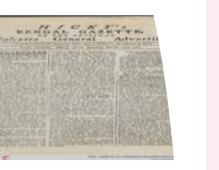

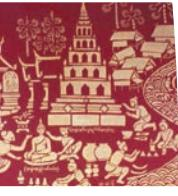

1-Language and Literature of India.indd 2 16-10-2020 16:24:39

understand and respect the ethical and moral norms of society to which they belong. Exposure to other cultures adds to our awareness about human life and issues of existence. Opinions and concerns about socio-ethical issues, social justice and human rights issues of a community are also voiced through their shared language. It is in the process of learning language that these values embedded in culture are absorbed. Language becomes an intrinsic aspect of our human inheritance.

Journey of ideas from printing press to people, India's first newspaper *Udant Martand* was published form Kolkata in 1826. This was a weekly newspaper published by Pt. Jugal Kishore Shukla.

Literature in different languages sustained the spirit of struggle for freedom from British rule. It became the social responsibility of the writers to write with a purpose of awakening people to ideas of justice, and freedom from slavery. Bankimchandra Chattopadhyaya (1838–94) brought out a magazine *Bangadarshan* to educate people on social and political issues of the time. *Kavivachansudha* by Bharatendu Harish Chandra (1850–85) became the voice against the atrocities of prevailing authority. Bharatendu's songs for *Prabhat Pheris* and songs were sung with fervour. Another important development was *Bengal Gazette*, the first newspaper in India and Asia as well. It was founded by James Augustus Hicky, who visualised the newspaper as a forum for people to voice their opinion. He was sarcastic and critical of the events and policies of the British rulers. It was said that *Bengal Gazette* made people's lives easier; instead of writing long letters to their friends and relatives, they sent copies of the newspaper.

- 
- 
- 

*Front page of Hicky's Bengal Gazette, 10 March 1781, from the University of Heidelberg's archives*

1-Language and Literature of India.indd 3 15-10-2020 12:33:59

# **Language and its Science**

We do not remember how we started using the language but certainly it was much before we were taught either at home or school. However, scientific study of language is another insightful dimension about language. The study of science of language began when the minds of people were troubled by the universality and diversity in language. Interestingly the diversity in language was explained as a punishment for man. The earliest masters in linguistics were ancient Indian grammarians. The works of Panini and other Sanskrit grammarians had profoundly influenced the linguistic science. The interpretations of ancient poetry also aroused interest in the study of language. The nineteenth century saw an enormous development in the science of language; the horizon was widened and many languages as well as the use of language in poetry and drama was also studied with keen interest.

This led to some significant shifts in language study. Diversity in language was accepted. It was recognised that the greater the range of registers a speaker has at his disposal, the more effective will be social interactions with the world at large.

Another important development was the realisation that languages are not static, they are always in state of flux. Languages keep on changing as long as they are spoken. It is users of the language who nurture languages to keep them alive, hence, language has no independent existence apart from its users.

# **India's Language Diversity**

Languages represent multitude of people and their lived experiences. Our country is very rich in linguistic diversity. This diversity is an outcome of many factors that shape life on the subcontinent. Its territorial space is marked by mountains, river basins, coastlines, dense forests and deserts. This wide topographical range harbours a variety of

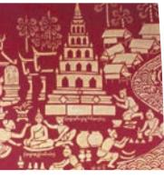

1-Language and Literature of India.indd 4 15-10-2020 12:33:59

environmental conditions which influence the language and culture of people living in these regions. Thus, India houses maximum number of written and orally alive languages in the world. The diversity of languages, cultures and traditions makes India one of the most tolerant and harmonious country.

India is home to five major language families. These language families are: Indo-Aryan, Dravidian, Austro-Asiatic, Tibeto-Burmese and Semito-Hamitic. India's rich linguistic and cultural heritage is mirrored in her literatures, both oral and written.

Sanskrit belongs to Indo-European group of languages. Sanskrit was gradually standardised and given a highly scientific grammar by Panini, the great grammarian, in about fifth century B.C. Sanskrit was the language of religion, philosophy and learning. The people spoke a number of dialects which are called *Prakrits*. Buddha preached in the language of the people. Buddhist literature was written in *Pali*, one of the *Prakrits*. Among the Dravidian languages, Tamil is the most ancient. The others developed during the first millennium of the Christian era. Though Sanskrit again became the predominant language of learning in the period of the Guptas, the *Prakrits* continued to develop. The various spoken languages that developed are called *Apabhramshas*. These formed the basis of the modern Indian languages which developed in various regions of India during the medieval period.

# **Literature and Cultural Expression**

Literature presents the panorama of the history of mankind; the social institutions, religious beliefs, scientific achievements and philosophical ideas. The objective is to present the journey of thoughts from the earliest times to the present times. The literature in a variety of forms appeals to the readers because it relates to the questions of human life. There is a unique linguistic variety in literature but it keeps pace with the cultural evolutions in the society and the common thread runs across the literatures creating a continuum of the progress of human civilisation. It was the advent of British era that marked the change in the course of language and literature. The tradition of nurturing plurality of languages strengthened in the modern era, enriching almost all the regional languages with a rich oral and written body of literature. The establishment of printing press by 1800 brought remarkable changes in the field of communication. The author could communicate directly with the reader in the languages of the people. The rise of journalism with the introduction of newspapers and magazines helped the development of prose writing which was so far a neglected

Language and Literature of India 5

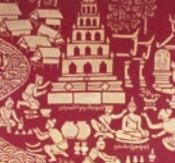

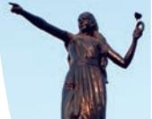

1-Language and Literature of India.indd 5 15-10-2020 12:34:00

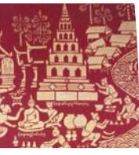

field. Earlier the British felt that for expansion of their power learning local Indian languages would be of great benefit but by 1835, Macaulay's Minute on Education changed their thinking and English began making its presence felt in the political and social life of the people of India by the end of 19th century English. The contact with West opened new avenues in the realm of socio-political thought, themes and forms such as free verse. In the recent years, more Publications in English by Indian writers are being seen on bookshelves. Many Indians started writing in English as well. Henry Derozio and Michael Madhusudan Dutt are the pioneers in this field.

There is however, no complete departure from the tradition, in that many modern writers, including those who wrote in English, continue to draw their inspiration and themes from the classical epics and other texts. Several Indian writers have written par excellence not only in traditional Indian languages but also in English. India's Nobel laureate in literature was the Bengali writer Rabindranath Tagore, who wrote some of his work originally in English, and did some of his own English translations from Bengali. Writers like Vikram Seth, Raja Rao, Anita Desai, Shashi Deshpande, R.K. Narayan, Ruskin Bond, derived inspiration from Indian themes.

Here is the translation of a Tamil poem in English. Translation, as a creative genre, is the characteristic of modern literature.

*Poetry: Kuruntokai Poem 312 Poet: Kapilar*

#### **What He Said**

My love is a two-faced thief. In the dead of night she comes like the fragrance of the Red-Speared Chieftain's forest hills, to be one with me.

And then, she sheds the petals of night's several flowers, and does her hair again with new perfumes and oils, to be one with her family at dawn with a stranger's different face.

Translated by A.K. Ramanujan

- 
- 
- 
- 

6 Knowledge Traditions and Practices of India— Class XI

1-Language and Literature of India.indd 6 15-10-2020 12:34:00

- 
- 
- 
- 
- 

# **A Mosaic of Language and Literature in India**

The history of Indian literature is ancient and vast. It had been an instrument of instruction since antiquity. *Śruti* and *Smṛti* literature, *Sūtra literature, Jātaka tales*, *Pancatantra, Kathasaritsāgara*, *Thirukural, Athichudi and Vachanas* are examples of traditions of literature which have enriched human life encouraging them to follow human values, and living in harmony with nature. In India, in the sixth and seventh century, A.D., there were great literary skills in epic poetry and drama. Indian intellectuals explored the field of medicine, astronomy, geometry, law and many others. The Indian thinkers explored religion and philosophy with vigour and originality in the interest of the people.

Ancient period falls roughly between 2000 B.C. to A.D. 1000. Sanskrit, Tamil, Pali and Prakrit were the main languages used for writing in ancient times. Other languages of antiquity include Kannada, Ardhamagadhi and Apabhramsa. Sanskrit literature from ancient period can be divided into the following.

#### **Vedic Age**

From this pristine antiquity, we receive two types of literatures namely 'Śruti' (heard and revealed) literature and 'Smṛti' (remembered and later recorded) literature. The four *Vedas—Ṛgveda, Yajurveda, Atharvaveda* and *Sāmveda* along with eleven *Brāhmaṇas*, three *Araṇyakas* and more than 100 *Upaniṣads* belong to the *Shruti* form. *Smṛti* texts are ascribed to human authorship and contain six *Vedāṅgas* (adjuncts to the *Vedas*), the epics—the *Rāmāyaṇa*, the *Mahābhārata*  and the *Purāṇas*. The *Vedas* describe procedures for *yajñas*, sacrifice and prescribe rituals and mantras to invoke powers of various gods to attain success in human efforts. All human effort in *vedic* way of life is put into four *puruṣārthas* ('purpose of life on earth')—*Dharma*, *Artha*, *Kāma* and *Mokṣa*. *Upaniṣads* are contemplative enquiries into the mysteries of

Language and Literature of India 7

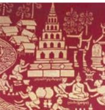

1-Language and Literature of India.indd 7 15-10-2020 12:34:00

*Ṛgveda (padapāṭha) manuscript in Devanagari, early 19th century* Source: *Vedparijat*, (August, 2014), NCERT

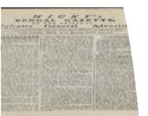

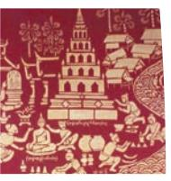

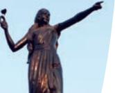

adopted their subject from the epics of the *Rāmāyaṇa* and the *Mahābhārata*. Thirteen of his plays are extant and some of them are: *Svapanavāsavadattam, Cārudattam, Abhiṣekanāṭakam, Pratimānāṭakam, Karṇabhāram* and *Madhyamavyāyogam*. Kālidasa is considered as the greatest Sanskrit poet and playwright. His poem *Meghadūtam* and his play, *Abhijñānaśākuntalam* are world renowned. Here are some classic expressions from ancient Sanskrit literatures.

# **From the** *Ṛgveda*

#### **Devi Sūktam**

स�च्छध्वं संव दध्वं संवो मनां िस जानताम।

देवा भागं यथा पर्ूवे सञ्जानाना उपासते।।

*Saṅgacchadhvaṁ saṁvadadhvaṁ saṁ vo manāṁsi jānatām devā bhāgaṁ yathā pūrve sañjānānā upāsate*

्

May you move in harmony, speak in one voice, let your minds be in agreement just as the ancient gods shared their portions of sacrifice.

# *From Taittiriˉya Upaniṣad*

वेदम अन ् चू्य आचार्य: अन्तेवािसनम अन ् शािस ु ्त सत्यं वद, धर्मं चर, स्वाध्यायात मा प्रमद:,आचा ् र्याय िप्रयं धनम आ�त ् ्य प्रजातन्तुं मा व ्तुं ्यवच्छेत्सी:, सत्यात न् प्रमदितव्यं, धर्मात न प्र ् मिदतव्यम, क् ुशलात न प्रम ् दितव्यम् भत ू्यै न प्रमिदतव्यम, स् ् वाध्यायात न प्रम ् दितव्यम। ्

*vedam anūcya ācāryaḥ antevāsinam anuśāsti—satyam vada, dharmaṁ cara, svādhyāyāt mā pramadaḥ, ācāryāya priyaṁ dhanaṁ āhṛtya prajātantuṁ mā vyavacchetsiḥ, satyāt na pramaditavyaṁ, dharmāt na pramaditavyaṁ, kuśalāt na pramaditavayaṁ, bhūtyai na pramaditavyaṁ, svādhyāyat na prmaditavyam.*

8 Knowledge Traditions and Practices of India— Class XI

life. The two epics are narratives on the legendary life of Rāma and Kṛṣṇa—the famous avatāras of Lord Viṣṇu.

#### **Post Vedic age**

In the post Vedic period, Sanskrit literature evolved in the form of drama, verse and prose. Significant playwrights of the period were Bhāsa, Kālidāsa, Śūdraka and Bhavabhuti. Bhāsa's plays largely

1-Language and Literature of India.indd 8 15-10-2020 12:34:01

This is the advice of teacher to his pupils at the end of their stay in Gurukul. The Guru urges them to follow the path of truthfulness and work for the welfare of others.

# *From Raghuvaṁśam by Kalidas*

शशै वेऽभ्यस्तवदियाना ् ं यौवने विषयैषिणाम। ् वार्धके मनिव ु त्ृ तीनां योगेनान्ते तनत्यु जाम।। ्

*śaiśavebhyastavidyānāṁ yauvane viṣayaiṣiṇāṁ vārdhake munivṛtti nāṁ yogenānte tanutyajām*

# *Prākṛt***,** *Pāliˉ* **and** *Apabhraṁsa*

'Prākṛt' ('natural' or 'common') was an important colloquial language which was used in Sanskrit drama for dialogues of women and minor characters. *Gāthā Sattasai* is a third century work in Prākṛt. Ashoka's inscriptions have also used Prākṛt along with Pali. Buddhist philosophical work like *Dhammapada* and educational stories like Jātaka Tales are in Pali. Lord Mahavira Jain used *Apabhraṁsa* to disseminate his teachings.

# **Ancient Tamil Literature**

Ancient Tamil literature is known as Saṅgama Literature. The earliest known work in the ancient Tamil is *Agastyam*. Another seminal work Tholkapiayam (300 B.C.) is a treatise on Tamil grammar. 'Akam' ('interior landscape') and 'Puram' ('exterior landscape') forms of poetry also come from Sangam period. It conceptualised five landscapes, known as 'tinai' which denotes a literary category named after a flower native to that natural setting. The tinais are:

- • *Kurinchi* (mountain and mountain related landscape),
- • *Mullai* (forest and forest related landscapes),
- • *Marutam* (cultivable field and field related landscapes), *Neytal* (sea and Sea related landscapes), *Palai* (dry, a kind of arid desert and desert related landscapes).

The two epics found in Tamil are *Cilapathikaram* and *Manimekalai*.

Regarded as one of the great works of Tamil literature, the *Silappadikaram* is a poetic rendition with details of Tamil culture; its varied religions; its town plans and city types; the mingling of different people; and the arts of dance and music.

*Manimekalai* is composed by the poet Chithalai Chathanar. *Manimekalai* is a poem in 30 cantos. It is a story of Kovalan and Mādhavi who became Buddhist Bhikkhuṇi.

Language and Literature of India 9

- 
- 
- 

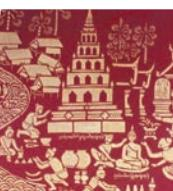

1-Language and Literature of India.indd 9 15-10-2020 12:34:02

# **Ancient Kannada literature**

Earliest work extant in Kannada literature is *Kavirājamārgam*  from ninth century. Kannada language is known to exist since the third century B.C. Pampa, Sri Ponna and Ranna are three major Jaina poets who wrote in classical Kannada in the tenth century A.D. Ādikavi Pampa's *Rāmāyaṇa* in Kananda is the most significant source text for the poets of the succeeding generations.

- 
- 

#### **The Epics**

The two epics of India *Mahābhārata* and *Rāmāyaṇa* are the representations of cultural, religious and political lives of the people of Indian subcontinent. The epics are written in

> the literary tradition of *Kāvya.* The epics are the reflection of heroic age embedded with value and moral teachings for human beings. These epics have been an enduring part of visual and oral traditions of transmitting knowledge in India hence have a profound influence on the lives of people. The epics have been translated into many languages and dialects across the world.

> The *Rāmāyaṇa* is considered as the foremost literature in classical Sanskrit and its author Vālmiki is known as the 'Ādikavi'. The *Rāmāyaṇa*  is a saga of life of Lord Rama which is composed in 24000 verses. The epic is the source of inspiration for many poets in ancient, medieval and even the modern times. The *Mahābhārata* is written by *Vedavyāsa* who enriched our literature with significant literary and *shastric* treatises like the *Purāṇas* and *Brahmasūtras*, and perhaps the first to write *Vedas*. The *Mahābhārata* consists of one lakh verses which are supposed to be the largest work of literature in any time and in any language. Indian tradition treasures a legend

saying that any knowledge related to humankind has a place in the *Mahābhārata*. The world famous *Bhagavad-Gi ˉta*, consisting of 700 verses forms a part of the *Mahābhārata* in the 6th *Parva* (chapter) out of its 18 *parvas*. *Bhagavad-Gi ˉta* is a complete philosophical doctrine which answers our personal emotional dilemmas. It shows threefold paths to seeking and attainment of salvation (*mokṣa*) which are the paths of *Karma*, *Jñāna* and *Bhakti*.

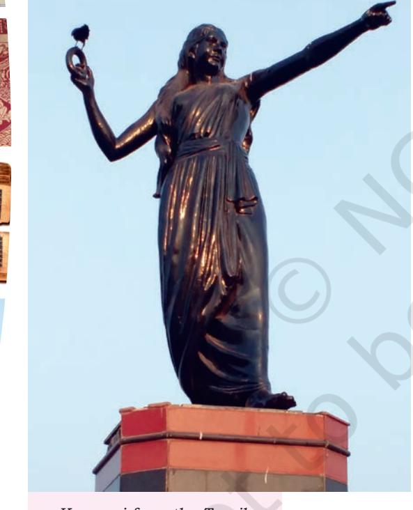

*Kannagi from the Tamil Epic Silapathikaram*

1-Language and Literature of India.indd 10 15-10-2020 12:34:03

- 
- 
- 
- 

#### *The Rāmāyaṇa*

As the story goes, the aged king Daśaratha chooses one of his four sons, Rāma, to succeed him as the ruler of Ayodhyā, but is finally persuaded by one of his wives to name Rāma's brother Bharata as his successor. Bowing to his father's decision, Rāma prepares to leave the capital and his wife. Si tā refuses to accept this separation and insists on accompanying Rāma and his brother Lakṣmaṇa into exile.

Language and Literature of India 11

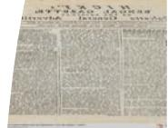

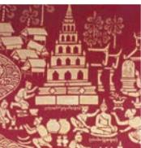

1-Language and Literature of India.indd 11 15-10-2020 12:34:05

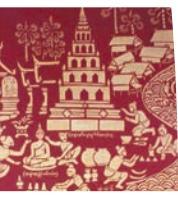

*The city was distressed and citizens were dazed And crowds unending followed as he went. Rāma arrived where Jānaki was. Startled, she rose, for she did not understand Why the crowd did weep or why they came Thus dazed and covered with dust. Nor why her prince was strangely clad. Her fright increased As the women about embraced her; They would not speak but smothered her in tears. She turned her large eyes then to Rāma: "My prince, tell me now, Is the king well Or has some illness stricken him?" And Rāma quietly spoke: "My peerless brother beloved will rule the realm By the command of them that gave me being. I go today to see the hills From where the rains are sent. And till I come again abstain from grief." She sobbed but not for his dread exile Or for the kingdom's sake: She sobbed for the cruel words that scalded her ears: "Grieve not the time I shall be away!" For how could Sita bear the thought Of separation? Were they not An eternal pair together in the sea of milk Together again on earth when he chose to be born…*

Ayodhyā Canto of the *Rāmāyaṇa* by Kamban, one of the greatest classic Tamil poets of the ninth century. Translated from Tamil by Sri Chakravarti Rajagopalachari.

# **Fables in Ancient Literature**

#### *Pañcatantra*

The *Pañcatantra* is a collection of ancient India fables. It is believed that Vishnu Sharma composed them in first century C.E. It has influenced the composition of literature in other parts of the world, for example the writing of Aesop Fables. *Pañcatantra* fables are marked by a moral. The idea that an action has consequences is well portrayed in these fables. The fables are widely popular even today because of their simplicity, logic and human desire to follow morals and values in life.

#### **Here is a sample of its style**

A donkey was employed in pulling a washerman's cart and after the day's labour, at nightfall, he liked to have a good feed off the neighbour's cucumber field. A jackal once joined him,

1-Language and Literature of India.indd 12 15-10-2020 12:34:05

and when the two had feasted on the cool and delicious fruit, the donkey exclaimed: "Isn't it a glorious night, old fellow? I feel so jolly, I must sing a song." The wise jackal thought that they should leave the field stealthily keeping quiet, but the silly ass brayed merrily, until the farmer then woke up and gave him a sound thrashing.

# **Jātaka Tales**

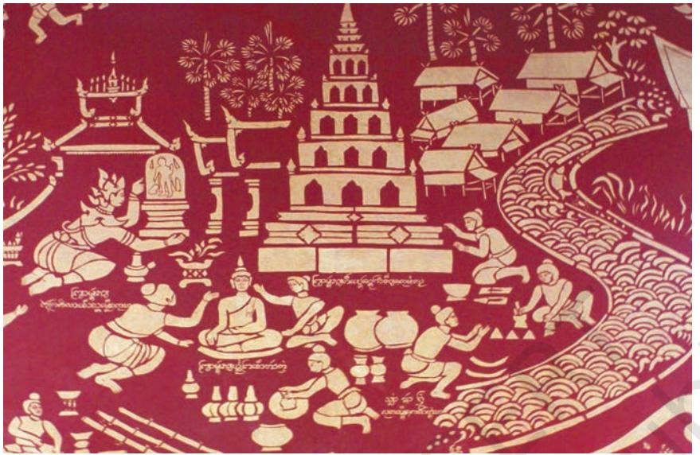

*Jātaka Tales*

Source: https://search.creativecommons.org/photos/fdf30c26-6fee-467b-8fc5 fce66cf89229

Jātaka stories emphasise Buddha's great abilities as a visionary and storyteller. The stories are marked by moral lessons. The stories are important to know the culture of the people, and also inspire literature, theatre opera and other art forms. Jātakas are the birth stories of Buddha. Jātaka tales are said to be one of the most authentic account of life in ancient India. The stories capture the various incarnations of Buddha, practical wisdom, lives of people in frames of hope, happiness and despair. The stories present life in bazaar, caravan, field barracks and life lived in quiet and thought mediations.

# **Here is a sample of its style**

#### *Prince Suvaṇṇa Sāma (the devoted prince) — Act of benevolence*

Sāma's parents lost their sight when he was 16 years old. From then on he was their only help. He took care of his parents. Every day he went to the Migasammata River to gather fruit and fetch water in a pot. At that time King Piliyakkha of Benares in his great desire for venison, also

Language and Literature of India 13

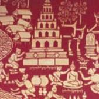

1-Language and Literature of India.indd 13 15-10-2020 12:34:06

came to the river and at last reached the spot where Sāma stood. Seeing Sāma taming the wild animals, the King was wondering whether the creature was a god or a Nāga? To find out, he decided to wound and disable him, and then ask. The King shot a poisoned arrow and wounded Sāma, who fell to the ground. Sāma spoke: "I have no enmity against anyone. Who has wounded me?" The King went to Sāma and asked him his name. Sāma then told the King the story of fostering his blind parents. The King thought to himself, "I have done evil to such a holy being; how can I comfort him?" He decided to bring the blind parents to their son. In the meantime the goddess Bahusodari decided to help Sāma and his parents. In the end Sāma recovered from his wound and both of his parents' sight was restored.

#### *Hitopadeśa*

*Hitopadeśa* is a book of worldly wisdom presented through the characters of birds, animals and humans. The purpose of the book appears to encourage proficiency in Sanskrit expression and the knowledge of wise behaviour (*ni ti-vidya*). The stories are elaborate, ending with moral messages. However, very peculiar to its style, it has condensed and crisp verses in between the stories to illustrate the points made by the characters.

*Hitopadeśa* is structured in four books with a preface (*prāstāvika*). The four books are as follows:

- • *Mitralābha*
- • *Suhṛdbheda*
- • *Vigraha*
- • *Sandhi*

#### **Here is a sample of a story from the book** *Suhṛdbheda*

#### *The Story of the Black Snake and the Golden Chain*

"A pair of crows had their abode in a certain tree, the hollow of which was occupied by a black snake, who had often devoured their young. The hen-bird, finding herself breeding again, thus addressed her mate: 'Husband, we must leave this tree; we shall never rear young ones while this black snake lives here! You know they say—

'From false friends that breed thee strife,

From a house with serpents rife,

Saucy slaves and brawling wife—

Get thee out, to save thy life.'

'My dear,' replied the crow, 'you need not fear; I have put up with him till I am tired. Now I will put an end to him.'

'How can you fight with a great black snake like that?' said the hen-bird.

'The Lion proud died by the hare so meek.'

'How came that about?' asked the hen-crow.

1-Language and Literature of India.indd 14 15-10-2020 12:34:06

Doubt nothing,' answered the other— 'He that hath sense hath strength; the fool is weak…'

*The Book of Good Counsels: From the Sanskrit of the Hitopadesa*, by Sir Edwin Arnold, M.A. 1861

- 
- 

# **Medieval Period**

#### **Emergence of the** *Bhakti* **Movement**

In the A.D. sixth century, *Bhakti* emerged in the Tamil land and there was an upsurge of *bhakti* poetry. Compositions of *Alvars* (the word literally means immersed in God) and *Nayanmars* are expressions of *Vishnu* and *Shiva bhakti*. In Kannada region *Basavanna* (1105–68) in the twelfth century began the movement in response to the prevailing caste hierarchy. The bhakti literature is known as *Vacanasāhitya*. *Akkamahadevi -* , *Allama Prabhuare* the proponents of *Bhakti*  movement. Jñānadeva, Nāmadeva and Tukārām contributed profusely to this movement connecting to people in their language in Marathi.

In northern India Kabir emerged as a great force in lending support to Bhakti movement. His verses were like a mirror to the hierarchy ridden society of that time. He spoke with all humility and faith in God. Another believer in *Bhakti* was Guru Nanak who tried to synthesise the different religious faiths to serve as a guide for humanity. He preached devotion to God than rituals.

Poet-saints who produced literary masterpieces include Chaitanyadeva in Bengali, Surdas in Hindi, Mira Bai in Rajasthani, Jnaneshwar in Marathi and Narsinha Mehta in Gujarati. The contribution of women writers needs special mention. The Kashmiri compositions of Lal Ded and Habba Khatoon are known for their mystical flavour and intense agony of expression, Mirabai's compositions in Rajasthani is known for a unique devotional quality, Andal's mysticism in Tamil and Akka Mahadevi's vachanas in Kannnada are testimonies to the great contribution of women to literature of the time. Besides this, medieval times were characterised by religious and cultural synthesis that integrated the Islamic and Sufi elements into the culture and literature of Northern and Western India.

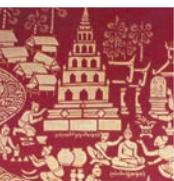

Language and Literature of India 15

1-Language and Literature of India.indd 15 15-10-2020 12:34:06

# **Renderings of Bhakti Poets**

#### *Guru Nanak*

Guru Nanak was a spiritual Guru whose teachings were expressed in devotional hymns. He was a *Nirguna Bhakti* saint and a social reformer. He was an opponent of caste and religious distinctions. Guru Nanak firmly believed and preached that the most important form of worship is *bhakti* loving devotion to God. He was the first Sikh Guru and the founder of Sikhism.

*Gaganmahthāl, rav-cān˙ ddi pakbaney tārkaman˙ daljanakmoti dhūpmaliān˙ lopavancāvarokarey sagalbanraiphūlantjyoti.*

**Translation—**The Sky is your platter, The sun and moon are the dipakas [lamps or lights], The stars in the sky are the pearls, The dhūp [incense] is the fragrance That the wind propels, The whole forest is your flowers.

#### *Kabir*

Kabir was a mystic poet and saint. He represented *Nirgun*  stream of Bhakti movement. Kabir is revered for his verses which expressed his philosophy with simplicity and honesty. There is no evidence that he received any formal education. Kabir wrote from his experiences which he gained through his travels and *satsangs*. He opposed distinctions of caste and creed and propagated harmony among people.

*Aisi vāni boliye, mana ka āpā khoye*

*Apnā tan śital kare, auran ko sukh hoye.*

**Translation—**Speak such words, sans ego's ploy Body remains composed, giving the listener joy.

#### *Lal Ded*

Lalleshwari, locally known mostly as Lal Ded, was a Kashmiri mystic of the Kashmir Shaivism school of Philosophy in the Indian subcontinent. She was the creator of the style of mystic poetry called vatsun or Vakhs, literally 'speech'.

Another feature of this period is the emergence of Urdu as a language of confluence of Persian and Hindustani that marked the beginning of poetry forms like *qasida, marsiya*  and *masnavi,* which found ready acceptance in Urdu and Kashmiri. It is interesting to note that when the Christian Missionaries came to India and wanted to compose on biblical themes, some of them adopted indigenous forms like *puran*  and *pana*.

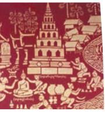

1-Language and Literature of India.indd 16 15-10-2020 12:34:07

You are the heaven and you are the earth, You are the day and you are the night, You are all pervading air, You are the sacred offering of rice and flowers and of water; You are yourself all in all, What can I offer you?

*—*Translated by R.C. Temple

#### *Mirza Ghalib*

Mirza Ghalib was a prominent Urdu and Persian poet during the last years of the Mughal Empire. His honorific was Dabir-ul-Mulk and Najm-ud-Daula. Most notably, he wrote several ghazals during his life, which have since been interpreted and sung in many different ways by great artists. Today Ghalib remains popular not only in India and Pakistan but also among the Hindustani diaspora around the world.

*apni hasti hi se ho jo kuchh ho āgahi gar nahi ñ ġhaflat hi sahi -*

- 
- 

# **Let us Do**

- 1. There are many categories of languages—classical languages, modern Indian languages, tribal and minor languages. Why are they called so? Find what this categorisation mean.
- 2. What makes a language a classical language? Define it.
- 3. Select poem from one language and translate it into as many languages as possible with your friend.

## **Project Work**

- 1. In groups of four select five poets from five different Indian languages and collect information about their work, time, life and philosophy to carry out the project.
- 2. The *Rāmāyaṇa* and the *Mahābhārata* have been written in almost all Indian languages. Pick any three or four languages and collect information on the origin and writing of the two epics. Compare and contrast the commonalities and difference in different languages.

As said earlier, *Hitopadeśa* was written to exemplify a pious life through stories with moral teachings.

Language and Literature of India 17

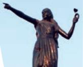

1-Language and Literature of India.indd 17 15-10-2020 12:34:09

#### *The following are two proverbs from Hitopadeśa. Read and collect more proverbs to understand the idea of the book.*

- • Sentences of studied wisdom naught avail if unapplied; though the blind man holds a lantern, yet his footsteps stray aside.
- • Fellow be with kindly foeman rather than with friends unkind; friends and foeman are distinguished not by title but by mind —Translated by Sir Edwin Arnold

# **Organise an activity**

Organise a school literary festival in your school and present poems and other literary works to other students and parents. Have talks and discussions on Indian Literatures and their richness. You may invite writers, and poets to the event.

#### **Further Reading**

- 1. *India What Can It Teach Us?* A Course of Lectures Delivered Before the University of Cambridge by Friedrich Max Müller Available at http://gretil.sub.uni-goettingen.de/gretil_elib/ Mue883__MuellerFM_IndiaWhat.pdf
- 2. The Epics, History, Tradition and Myth and Life and Work in Ancient India in *The Discovery of India* by Jawaharlal Nehru.

#### **Bibliography**

- George, K.M. Ed. 1997. *Masterpieces of Indian Literature.* National Book Trust, New Delhi. Vol. 1, pp. 59–591.
- Nehru, Jawaharlal. 2004. *The Discovery of India*. Penguin Book, New Delhi. pp. 98–119.
- Panicker, Ayyappa. Ed. Returning from the Pilgrimage, Abhangas (13–14 century). *Medieval Indian Literature*, Vol. 3, p. 496.
- Puri, J.R. 1982. *Guru Nanak. Radha Somi Satsang Beas*, Punjab, India. p. 122.
- Ramanujan, A.K. 1994. *The Interior Landscape: Love Poems from a Classical Tamil Anthology*. Oxford Indian Paperbacks. Oxford University Press.
- Sharma, T.R.S. 2001. *Ancient Indian Literature An Anthology*. Tamil and Kannada. Vol. 3.

1-Language and Literature of India.indd 18 15-10-2020 12:34:09

