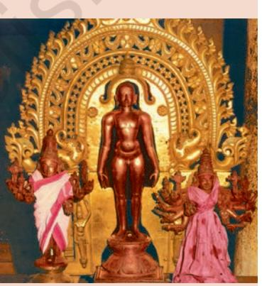
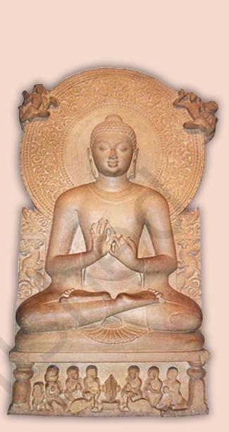

# Indian Philosophical Systems **2**

We see the earth, the moon, the sun, and millions and billions of stars in the sky. We have big mountains, long rivers and unending oceans on our planet. We witness various climates like hot summer, heavy rain, and chilling winter. We observe human beings born, grow and die. Have you ever wondered about who has created these and who controls them? Certainly not us.

Human beings have been trying to find the answer since time immemorial. We can also have questions like what are the sources or means of our knowledge and how can we validate our knowledge.

Basically, these questions and answer to these questions are the subject matter of the study which is called *Darśana* or Philosophy in English.

*Prameya* (objects of knowledge) and *Pramāṇa* (means of knowledge or the source of knowledge), are the two major components of Philosophy in general. Different philosophical systems while defining their *prameyas* also define the *pramāṇas*.

2--Indian Philosophical System.indd 19 15-10-2020 11:09:56

A flawed means of knowledge will lead us to an unauthentic or invalid knowledge. In philosophical discourse, to determine the valid knowledge, we have two ways, i.e., direct and indirect. Here direct means the knowledge which can be perceived through the senses, i.e., *pratyakṣa*. And indirect means the knowledge which is not taken directly through senses like *anumāna, upamāna,* etc. The significant *pramāṇas* are as follows:

- 1. *Pratyakṣa* (Direct perception through sense organs)
- 2. *Anumāna* (Inference or syllogistic argument)
- 3. *Upamāna* (analogy)
- 4. *Śabda* (verbal testimony)
- 5. *Anupalabdhi* (non-perception)
- 6. *Arthāpatti* (implication)

Based upon these sources of knowledge, various Indian Philosophical schools discuss their subject matters which are metaphysical in nature like *ātmān (soul), Sṛṣṭi* (universe), *Īsvara* (god), *Mokṣa* (liberation), *Punarjanma* (rebirth), *manas*  (mind), *buddhi* (intellect), so on and so forth.

Origin of Indian philosophical thoughts can be traced back to the first available literature of the world, i.e., *Ṛgveda*. Many hymns like *Nāsadi ya sūkta, Puruṣa sūkta, Vāk sūkta, Jñāna sūkta,* etc., symbolically narrate about the creation of the universe, nature of self, etc. Philosophical discourse flourishes in the *Upaniṣads*, the last major part of the Vedic literature.

In the Post Vedic period, philosophical thoughts turned into independent schools, such as, *Sāṅkhya, Yoga, Nyāya, Vaiśeṣika, Mi māṁsā, Vedānta, Cārvāka, Jaina* and *Bauddha*. Many schools carried forward the Vedic thoughts and elaborated upon them, whereas some schools developed their thoughts opposing the validity of the *Vedas*. Thus Indian philosophical thoughts are divided into two categories, viz., *Āstika* (that which accepts the validity of the *Vedas* as source of knowledge) and *Nāstika* (that which denies the validity of the *Vedas* as source of knowledge).

*Cārvaka, Bauddha* and *Jaina* are considered *Nāstika*  schools as they don't take the *Vedas* as valid source of knowledge. Rest of the six schools come under the *āstika* 

2--Indian Philosophical System.indd 20 15-10-2020 11:09:57

category which have agreement in taking the *Vedas* as valid source of knowledge, though, they have differences among each other.

It is observed by our seers that the entire humanity is battered by the three-fold sufferings, viz., *ādhidaivika* (sufferings caused by nature), *ādhibhautika* (sufferings caused by creatures) and *ādhyātmika* (sufferings pertaining to mind and spirit). The ordinary means of eradicating human sufferings does help in it but it cannot cause complete (*aikāntika*), and everlasting (*ātyantika*) cessation of sufferings. Our seers always yearned for this kind of full and final freedom from sufferings where there is eternal bliss. This state is termed as *mokṣa* in Indian philosophy. The seers found that ignorance is the root cause of human sufferings and it can be dispelled only by the supreme knowledge.

In India, we find three main intellectual traditions, viz., *Nigama* tradition, *Āgama* tradition and *Śramaṇa* tradition. The tradition of *Nigama* (also known as Veda) believes that the Vedas are either eternal or the teachings of God. Hence, their authority is unchallengeable. This tradition is the base of the six prime systems of Indian philosophy. Apart from the *Nigama* tradition, there has been a parallel tradition of *Āgama*. In this tradition, the followers have their own scriptures either in Sanskrit or in other languages as well.

The followers consider there scriptures as divine revelation taught by God himself to different sages and spread through the chain of scholars. *Vaiśn*�*ava Āgama, Śaiva Āgama* and *Śākta Tantra* are main representatives of the *Āgama* tradition. These too have several sub-sects.

The *Śraman*�*as* were the monks who led a rigorous life. Around the sixth century B.C., different *Śraman*�*ic* groups appeared in opposition of the *Vedic* ritualistic culture and laid emphasis on leading a moral life. Their arguments were based on sound logic than mere faith and hence they appealed to the masses. Though many such groups are mentioned in the old literature of the Buddhism and Jainism, only a few of them sustained as philosophies for a long time.

Though there are many different philosophical thought systems developed in India, three *nāstika* and six *āstika*  schools feature prominently in the history.

# *Nāstika* **Philosophical Systems**

## *Cārvāka*

It is the first and foremost *nāstika darśana*. Tradition names it as *lokāyata*, meaning, 'which appeals to the mass'. This philosophy is attributed to *Bṛhaspati* or his disciple as it has got another name as *Bārhaspatya darśana*.

Indian Philosophical Systems 21

2--Indian Philosophical System.indd 21 15-10-2020 11:09:57

*Cāṇakya* in his *Arthaśāstra*, a treatise on public administration and finance, has called Bṛhaspati as the foremost teacher of *Arthaśhāstra*. This philosophy is believed to be as old as Vedic tradition.

It is an extreme *nastika darśana* which believes only one means of valid knowledge, i.e., direct perception or *pratyakṣa* and all other sources of knowledge are not trustworthy or misleading. Since only *pratyakṣa* is the valid means of knowledge, whatever is not there in its purview is not a true knowledge at all. So according to *Cārvāka*, not any supernatural power is god, but the king who possesses the power of punishing or rewarding over the people should be considered as god, since we get to know him through direct perception. Similarly, *mokṣa* (liberation) means death, bodily pleasure is *svarga* (heaven) and pain is *naraka* (hell). Forget about rebirths and which we don't perceive through our sense organs. Even this philosophy discards the fifth fundamental element of the universe, i.e., the *ākāśa* (the space) as it is not perceived to us. So, for him, only four fundamental elements are there, viz., earth, water, fire and air, which our sense organs can perceive.

As *Cārvāka* is a fully materialistic philosophy, one question may be asked, i.e., if only body is the reality where does mind or consciousness come from which cannot be perceived by any of our sense organs, like eyes, ears, nose, tongue or skin. For this, *Carvāka* has answered with an analogy. According to *Cārvāka,* consciousness is not a different entity, but a byproduct of matter, just like we observe the living objects coming out of decomposing things.

Original text of *Cārvāka* is not available to us, which perhaps has been lost in the tradition. Whatever narratives are known to us, are found scattered in various literatures in Sanskrit. Views of *Cārvāka* had been compiled by a philosopher, viz., *Mādhava Vidyāraṇya* (A.D. 1296 to 1386). In that text, it is mentioned that for well-being of all creatures

2--Indian Philosophical System.indd 22 15-10-2020 11:09:58

in the world, *Cārvāka* philosophy has to be adopted. It firmly criticises the practice of sacrifices in various rituals in the pretext of *dharma*.

The salient features of this philosophy are—

- (i) World is made up of four elements: air (*vāyu*), fire (*agni*), water (*ap*), earth (*pṛthvi -* ). *Cārvāka* rejects ether (*ākāśa*).
- (ii) There is no soul.
- (iii) There is no God.
- (iv) Rejection of two of the four *puruṣārthas* i.e., *dharma* and *mokṣa*.
- (v) Enjoyment is the ultimate end.

From a bird's-eye view, though we can point out many flaws in this philosophy, particularly from the viewpoint of logical accuracy, this philosophy is adored across the mankind for its simplicity and practicality.

## **Jaina**

The Jaina philosophy is primarily based on the teachings of twenty four *ti rthan*˙*karas,* i.e., preachers. *R*�*s*�*abhadeva* is the first *ti rthan*˙*kara* as the tradition of Jainism maintains. Out of these twenty four *ti rthan*˙*karas*, the last two, i.e., *Pārśvanātha*  and *Mahāvi ra* (sixth century B.C.) are historical personalities. The word Jaina is derived from a Sanskrit word *jina*, meaning the 'conqueror', i.e., conqueror of passion and desire. The last *ti rthan*˙*kara*, *Mahāvi ra* is called *Jina* as he conquered his passion after the attainment of the supreme realisation.

The earlier Jaina literature is found in Prakrit. *Mahāvi ra*  himself used the same in his sermons. Sanskrit was introduced at a later stage for philosophical discourse. The first book of Jaina philosophy, i.e., *Tattvārthādhigamasūtra* was written by *Umāsvāmi -* or *Umāsvāti* around second century A.D. The book deals with almost all philosophical doctrines of Jainism.

## *The distinct features of Jaina philosophy are—*

- • Independent existence of consciousness and matter;
- • No existence of supreme divine authority for creation, preservation or destruction of the universe;
- • karma, the basic principle of one's creation and destruction;
- • Relativity and multiple facets of truth;
- • Morality and ethics for liberation.

The Jaina philosophy revolves around two main doctrines, i.e., *Anekāntavāda* and *Syādvāda*. Both are extremely connected doctrines. According to *anekāntavāda*, every being has numerous properties. The permanent property that constitutes the nature of a thing is called attribute (*gun*�*a*).

Indian Philosophical Systems 23

*Mahavira Jaina* Source: *An Introduction to Indian Art*, Part–I (February, 2018), NCERT

2--Indian Philosophical System.indd 23 15-10-2020 11:09:58

The accidental property is called mode (*paryāya*). According to *syādvāda*, our knowledge is partial and relative because passion, anger, greed, etc., obstruct our knowledge. But, we deem our partial and relative knowledge as complete and absolute. Only a liberated soul can know the reality in totality.

Jaina philosophy admits that all souls (*ji vas*) are potentially equal because all of them are naturally endowed with four infinites (*anantacatus*�*t*�*aya*), viz., infinite knowledge, infinite faith, infinite power and infinite bliss. But, in the stage of bondage, these four infinites are not manifested properly.

Jaina mentions the different stages that a soul (*ji va*) undergoes. These are as follows:

- 1. *Āsrava* (influx): Due to passion, anger, greed, etc., present in the soul (*jiva*); the karmic matter (*karmapudgala*) moves towards the soul (*jiva*).
- 2. *Bandha* (bondage): The karmic matter (*karmapudgala*) infests the soul (*jiva*) and obstructs the manifestation of the four infinites (*anantacatus*�*t*�*aya*) just as dust particles settle on moistened leather reduces the shine of it.
- 3. *Samvara* (pause): A Jaina *sādhaka* stops the influx of the karmic matter (*karma pudgala*) through his virtuous conduct prescribed in Jainism.
- 4. *Nirjarā* (removal): Through the rigorous practice of the same, a Jaina sādhaka removes the karmic matter (*karma pudgala*) already present in the soul (*jiva*).
- 5. *Moksha* (liberation): After the complete removal of the karmic matter (*karma pudgala*), four infinites (*anantacatus*�*t*�*aya*) of the soul (*jiva*) are revealed.

The right faith (*samyakdarśana*), the right knowledge (*samyakjñāna*) and the right conduct (*samyakcaritra*) are called the path of liberation. They are also known as three gems (*triratna*) of Jainism. The five great vows (*pañcamahāvrata*) are subsumed under the right conduct (*samyakcaritra*) in Jaina ethics. These are as follows:

- 1. *Ahim*˙ *sā* (observing non-violence in thought, speech and action and compassion for all beings).
- 2. *Satya* (truthfulness in thought, speech and action)
- 3. *Asteya* (non-stealing)
- 4. *Aparigraha* (non-possession of things more than one's requirement)
- 5. *Brahmacarya* (renouncing of all passions).

These five great vows (*pañca mahāvrata*) are meant for the Jaina monks and the same has been prescribed for other people with a liberal approach and are known as *an*�*uvrata*.

Jainism has a major influence on the general philosophy, culture and ethics of India. The Jaina philosophy has a great

2--Indian Philosophical System.indd 24 15-10-2020 11:09:58

impact on the typical Indian concepts like *ahim*˙ *sā, karma, mokṣa* or renunciation of *sam*˙ *sāra,* etc. M.K. Gandhi was immensely influenced by the Jaina concept of *ahim*˙ *sā* and had developed his unique concept of practical *ahim*˙ *sā*. The idea of Jainism is capable to bring harmony in the society in all respects.

## **Buddha**

The seed of Buddhist philosophy is traced in the teachings of Gautama Buddha (earlier name was Siddhartha) itself. Buddha always emphasised on leading a moral life for the emancipation of human sufferings rather than indulging into philosophical problems. But, the later scholars of Buddhism developed a profound philosophy on the platform of the teachings of Gautama Buddha.

Buddha wanted to lead humanity to emancipation. Thus, to reach the masses, he used Pāli language in his teachings. These teachings have been compiled in *Tipiṭaka* (*Tripiṭaka* in Sanskrit), literally means three baskets. It is the most revered text of Buddhism. This canonical literature has three parts, viz., *Suttapiṭaka, Vinayapiṭaka* and *Abhidhammapiṭaka*.

The central theme of Buddha's teaching is inherent in the four noble truths or the truths of the nobles (*Cattāri ariyasaccani* in P*ā*li). These are as follows:

- 1. *Dukkham*: It means that there is suffering and the entire world is inflicted by it.
- 2. *Dukkhasamuppāda*: It means that there is a cause for suffering. It is not one entity, but a cycle of twelve links (i.e., *dvādaśa nidānacakra* or *bhāvacakra*). These are *avidyā* (ignorance), *sam*˙ *skāra* (impression of previous births), *vijñāna* (initial consciousness of the foetus), *nāmarūpa* (name and form), *s*�*ad*�*āyatana* (six senses including mind), *sparśa* (sense-object contact), *vedanā* (sense experience), *tr*�*s*�*n*�*ā* (thirst for the objects of enjoyment), *upādāna* (clinging to attachment), *bhava*  (desire to take birth), *jāti* (birth), *jarā-maran*�*a* (suffering in the form of old age and death). Each link is dependent on the previous link for its existence and gives birth to the next link. *Avidyā* (ignorance) is the root cause.
- 3. *Dukkhassa atikkama*: It means there is cessation of suffering. If the root cause of suffering, i.e., ignorance is dispelled, the dependent links are ceased one by one and ultimately human suffering also ceases.
- 4. *Ariyam Aṭṭhaṅgikaṁ Maggaṁ Dukkhupasamagāminaṁ*: It means, there is a path of cessation of suffering. The path is known as the eight-fold path. It is explained in

*Gautama Buddha, Sarnath*

Source: *An Introduction to Indian Art*, Part–I (February, 2018), NCERT

2--Indian Philosophical System.indd 25 15-10-2020 11:09:59

*mahāparinibbāṇasutta* of *di ghanikāya* of *Suttapiṭaka.*  These paths are as follows:

 (a) *Sammā diṭṭhi* (right views), (b) *Sammā saṁkappo* (right aspiration), (c) *Sammā* vāk (right speech), (d) *Sammā kammo*  (right action), (e) *Sammā āji vo* (right livelihood), (f) *Sammā vāyāmo* (right effort), (g) *Sammā sati* (right mindfulness), and (h) *Sammā samādhi* (right concentration).

One attains the supreme realisation by following the eight-fold path and the realisation annihilates the suffering by dispelling ignorance, the first link.

Buddha always preached that all beings are non-eternal and perishable so that one could be detached from the mundane pleasures. But, his doctrine of impermanence was developed as the doctrine of momentariness (*ks*�*an*�*abhan*˙*gavāda*). Unlike the orthodox schools of Indian philosophy, the Buddhist philosophers refute even the permanence of self. This doctrine is known as *anātmavāda*.

The Buddhist ethics is the expansion of the fourth noble truth. Buddhism prescribes the three gems (*triratna*), viz., *prajñā* (knowledge), *śi la* (conduct) and *samādhi* (meditation) as the means of liberation. The five conducts (*pañcaśi la*) are very important for a Buddhist monk. These are:

- 1. non-violence
- 2. non-stealing
- 3. celibacy
- 4. truthfulness
- 5. not taking any intoxicating things like liquor.

Buddhism started from a social reform to a religion and turned into a fully grown philosophy. The early Buddhist literature was in *Pali* language and in later Buddhist era the philosophical discourses were carried out in Sanskrit language.

Buddhist religion was bifurcated later on as *Hi nayāna* and *Mahāyāna*. *Hi nayāna* is spread in south and south-east Asia. *Vaibhāsika* and *Sautrāntika* are the philosophical sects of *Hi nayāna. Mahāyāna* is prevalent in north and north-east Asia. *Yogācāra* and *Mādhyamika* are the philosophical sects of *Mahāyāna*. These four sects of Buddhist philosophy along with Cārvaka and Jainism constitute six schools of heterodox philosophies (*nāstika darśana*).

Buddhism has a massive impact on Indian philosophy and culture. Due to the constant dialogue and debate between these non-Vedic schools and other schools, Indian philosophy got developed. Buddhist logic is a unique contribution of the Buddhists. Along with the spread of Buddhism, Indian culture reached different countries in the world. Today, the term *pañcaśi la* used in the foreign policy of India has been coined from Buddhism.

26 Knowledge Traditions and Practices of India— Class XI

2--Indian Philosophical System.indd 26 15-10-2020 11:09:59

# *Āstika* **Philosophical Systems**

The Sanskrit word *Ṣaḍ-Darśana* refers to the six systems of Indian Philosophy. They are *Sāṅkhya, Yoga, Pūrva-Mimāṁsā, Uttara-Mimāṁsā* (Vedānta), *Nyāya* and *Vaiśeṣika*. Each of these systems differs in one way or the other in terms of its concepts, phenomena, laws and dogmas. It is important to know that these *Āstika Darśanas* believe in the authority of the Vedas. Due to the mutual complementarity with each other, the six systems constitute the three pairs. These pairs are *Sāṅkhya-Yoga, Pūrva Mimāṁsā-Uttara Mimāṁsā* and *Nyāya-Vaiśeṣika*. *Sāṅkhya* and Yoga are complementary to each other in terms of theory and practice. *Pūrva Mimāṁsā*  and *Uttara Mimāṁsā* are complementary to each other since the former is based on the ritualistic portion of the Vedas, i.e., *karmakāṇḍa* and the latter is based on the *Upaniṣads*, *Geeta*  and *Brahmasūtra*, i.e., *jñānakāṇḍa*. Similarly, *Nyāya* and *Vaiśeṣika* are complementary to each other since the former is rich in epistemology and the latter is rich in metaphysics. All of these systems have been brought to the fore by a seer; often called *sūtrakāra,* i.e., the composer of aphorisms. The seers and their works are as follows:

| Philosophical Systems | Seers | Works |
| --- | --- | --- |
| Sāṁkhya | Kapila | Sāṁkhyasūtra |
| Yoga | Patañjali | Yogasūtra |
| - Pūrva Mi māṁsā | Jaimini | - Mi māṁsāsūtra |
| - Uttara Mi māṁsā | Bādarāyaṇa | Vedāntasūtra |
| (Vedānta) | (Vedavyāsa) | (Brahmasūtra) |
| Nyāya | Gautama | Nyāyasūtra |
| Vaiśeṣika | Kaṇāda | Vaiśeṣikasūtra |

## *Sāṁkhya*

The *Sāṅkhya* or *Sāṁkhya* philosophy enjoys a unique and prime position in the history of evolution and development of almost all the philosophical trends in India. Maharṣi Kapila is unanimously regarded as the founder of *Sāṅkhya* system. He is traditionally believed to be the composer of *sūtras* of *Sāṅkhya* based upon which the system was built up. However, most of the modern scholars believe that the original *Sāṅkhya sūtras* have been lost and the *sūtras* that are available by the name of it were composed very late, i.e., in the fifteenth century.

After Kapila, the tradition is subsequently taken further by the writings of the scholars like Āsuri, Pañcaśikhā, Īśvara

2--Indian Philosophical System.indd 27 15-10-2020 11:09:59

Kṛṣṇa, etc., Among them Īśvara kṛṣṇa is the most famous exponent of the system, whose *Sāṅkhya kārikā* is the first available textbook to present the philosophy of *Sāṅkhya* in an orderly and systematic way.

It is important to mention that though the tradition attributes Kapila to be the founder of the philosophy, seeds of *Sāṅkhya* thoughts are found in the scriptural and other literatures of the pre-philosophical era. One often comes across the innumerable references of *Sāṅkhya* doctrines in the *Upaniṣads* and *Mahābhārata* which were written many centuries before the time when Kapila presented it as a fulllength philosophical system.

The term *Sāṅkhya* is interpreted by its exponents in various ways. Some suggest that the term is derived from the word 'Saṅkhyā' meaning 'number' and thus it signifies a system of thought that describes itself in the systematic and analytic enumeration of the principles consisting of the reality, the existence. Some scholars derive the term from the verbal root *khyā* (to see) with the prefix *sam*, which denotes an idea of philosophical reflection and ultimately it signifies a system of thought dedicated to the reflection on the distinctness of pure consciousness and matter from each other.

Like all other systems, *Sāṅkhya* also considers ignorance to be the fundamental cause of human bondage and sufferings, and it's only through the emergence of right knowledge that one can free oneself from them. And the right knowledge can be gained only by adopting the valid means of knowing.

According to *Sāṅkhya* there can be only three valid means (pramāṇas) of acquiring the right cognition which are—direct sense perception (*Dṛṣṭa/Pratyakṣa*), inference (*Anumāna*) and verbal testimony (*Āptavacana*). *Sāṅkhya* doesn't accept *Upamāna* or analogy to be a valid source of knowledge.

*Sāṅkhya* accepts two ultimate realities, namely, the Prakṛti or the insentient nature and the *Puruṣa* or the 'soul'. These two are eternal according to Kapila. According to the *Sāṅkhya* system of philosophy, something can never be produced out of nothing. One can see the influence of the *Nyāya* system on the *Sāṅkhya* system when it comes to the process of creation. Pleasure, pain and indifference are derived by the three 'guṇas' or 'qualities', namely, *Sattva, Rajas* and *Tamas*. *Sattva guṇa* gives rise to happiness or pleasure, *Rajas* produces pain and suffering whereas *Tamas* gives rise to inactivity.

The three qualities mentioned above reside in the *Prakṛti*, a state of perfect balance. *Sāṅkhya* says that the entire universe is born out of the *Prakṛti*. *Puruṣa* on the other

2--Indian Philosophical System.indd 28 15-10-2020 11:09:59

hand is as innumerable as there are living beings. *Puruṣa* is all-pervading and eternal, that is conscious in its very essence. *Sāṅkhya* believes in the creation of the universe as a result of the union between *Prakṛti* and *Puruṣa*. The very first evolute that issues forth from the *Prakṛti* by the combination of the three *guṇas* is the *Mahat* or the cosmic intellect. Cosmic ego is born out of the cosmic intellect. There are various evolutes issuing forth from different parts of the cosmic ego characterised by the guṇas. There are a total of 25 cosmic principles of which the *Puncha Mahabhutās* are mostly referred to in modern texts. It comprises air, water, fire, earth and ether.

## **Yoga**

*Sāṅkhya* and Yoga are often described as two allied systems of philosophy. Many a times these two systems are referred to as the theoretical and practical aspects of one and the same philosophy. This is well known that the Yoga system builds up its base on the pre-supposition of the metaphysics and the epistemology propounded by the Sāṇkhya school.

Patañjali (second century B.C.) is known to be the founder of Yoga system. He is the author of the *Yogasūtra*, the oldest textbook of Yoga philosophy wherein he describes the composition, nature and functions of human mind. Patañjali has outlined the scientific ways and methods of controlling the mental modifications which according to him is the only means of liberation, the ultimate goal of human life.

*Aṣṭāṅga* Yoga aims at the final state of spiritual absorption through eight folds, the eight limbs of Yoga. These aṅgas are *Yama, Niyama, Āsana, Prāṇāyāma, Pratyāhāra, Dhāraṇā, Dhyāna and Samādhi*. Yama aims at internal purification, *Niyāma* aims at external purity. *Āsana* consists of the performance of the postures of Yoga, *Prāṇāyāma* is breath control, *Pratyāhāra* results from the withdrawal of sense organs from the corresponding sense objects, *Dhāraṇā* is concentration, *Dhyāna* is meditation and *Samādhi* is the final state of spiritual absorption. These eight limbs of Yoga can be divided into three sets. Initial two are moral disciplines, middle three are external disciplines and the last three are internal disciplines.

The Yoga system accepts three fundamental realities, namely, *Īśvara, Puruṣa* and *Prakṛti* or the primordial matter. Patañjali says that scriptures are the sources of the existence of *Īśvara*. *Īśvara* is omniscient and is free from the qualities inherent in *Prakṛti*.

Indian Philosophical Systems 29

2--Indian Philosophical System.indd 29 15-10-2020 11:09:59

Patanjali defines Yoga as 'Chitta-vṛtti-nirodha', i.e., Yoga is the restraint of the mental operations. Patañjali names some obstacles to the path of Yoga. They are called 'Antarāyas' and they include *Vyādhi* (illness), *styāna* (apathy), *Saṁśaya*  (doubt), *Pramāda* (inadvertence), *Ālasya* (laziness), *Avirati*  (incontinence), *Bhrāntidarśana* (wrong understanding), *Alabdha Bhūmikatva* (non-attainment of mental plane) and *Anavasthitatva* (instability). In addition to the obstacles mentioned above, Patañjali accepts five more obstacles called *Duhkha* (pain), *Daurmanasya* (frustration), *Aṅgamejayatva*  (fickle limbs), *Śvāsa* (spasmodic breathing in) and *Praśvāsa*  (spasmodic breathing out).

## *Nyāya*

The term 'nyāya' means logic. The *nyāya* system of philosophy is the pioneer in establishing the Indian logic. It is formally established by Akṣapāda Gautama (A.D. 150) though the history of the tradition goes back to sixth century B.C. Vātsyāyana (A.D. 450) is another important scholar who wrote *Nyāya bhāṣya*, a commentary on *Nyāya sūtra* of Gautama. These two texts are the building blocks of the *nyāya* system.

The *nyāya* system believes that the world is real and our experience of the same is true. It admits sixteen categories viz., *Pramāṇa* (means of valid knowledge), *Prameya* (object of valid knowledge), *saṁśaya* (doubt), *Prayojana* (purpose), *dṛṣṭānta* (illustration), *Siddhānta* (tenet), *Avayava* (components of an argument), *Tarka* (hypothetical reasoning), *Nirṇaya* (ascertainment), *Vāda* (debate), *Jalpa* (wrangling), *Vitaṇḍā* (cavil), *Hetvābhāsa* (logical fallacy), *Cala* (quibble), *Jāti* (wrong analogy) and *Nigrahasthāna* (point of defeat).

Since the attainment of liberation (*apavarga*) is the highest goal of human life, the *nyāya* philosophy shows the path for the same. The right knowledge of the twelve *prameyas* i.e., self, mind, senses, body, etc., are directly helpful to attain the liberation. But, the right knowledge of fifteen more categories is indirectly helpful for the same. Basically, all the sixteen categories are connected with logic and art of debate.

The *nyāya* accepts four means of valid knowledge viz., *pratyakṣa* (perception), *anumāna* (inference), *upamāna* (comparison) and *śabda* (verbal testimony).

The *nyāya* philosophy accepts the existence of God '*Īśvara*'. The cycle of creation and dissolution is without any beginning and the universe is created by *Īśvara* with the help of the eternal atoms, time, individual minds, space and individual selves (*jivas*) and ether, in accordance with the past deeds of the individual selves (*jivas*).

2--Indian Philosophical System.indd 30 15-10-2020 11:09:59

This system gives an ultimate model of philosophical analysis in which any school of philosophy can be understood. In the model, all beings are subsumed under the framework of valid knowledge (*pramā*), means valid knowledge (*pramāṇa*), object of valid knowledge (*prameya*) and subject of valid knowledge (*pramātā*).

The exposition of *nyāya* would be incomplete if we do not mention the contribution of Gaṅgeśa Upādhyāya (A.D. 1320) of Mithila. He was the founder of neo-logic (*Navya-Nyāya*). For the first time, he developed an artificial language of logic for expressing the philosophical jargons with utter accuracy leaving behind even the minor possibility of ambiguity. He used the same language in his magnum opus *Tattvacintāmaṇi*. The importance of *nyāya* is evident by the fact that different philosophical schools and other disciplines too have used their logic, art of debate and the *navya-nyāya* language in their respective fields to a great extent.

#### *Vaiśe***ṣ***ika*

The founder of the *Vaiśeṣika* system of Indian philosophy is Kaṇāda (A.D. 100). It is also called *Aulukya Darśana*. The tradition believes it as one of the oldest philosophies like *Sāṅkhya* in India. Praśastapāda (A.D. 400) is another important philosopher; who wrote *Padārtha dharma saṅgraha*, a commentary on the *Vaiśeṣika sūtra* of Kaṇāda. The later scholars of the *Vaiśeṣika* School have developed their ideas merely on these two texts.

The *Vaiśeṣika* system believes in the reality of the world and recognises seven 'Padārthas' or categories, which are: substance (*dravya*), quality (*guṇa*), action (*karma*), generality (*sāmānya*), particularity (*viśeṣa*), relation of inherence (*samavāya*) and non-existence (*abhāva*). In fact, the name *Vaiśeṣika* is kept because it is the one that introduced particularity (*viśeṣa*) as category. The system also believes that liberation is the supreme goal of human life. One can attain liberation through the knowledge of the similarities and the dissimilarities of these categories.

The followers of this system of philosophy also accept the existence of God and they say that the god created, sustained and destroyed the universe. According to the *Vaiśeṣika* School, the will of God is the cause for creation. He causes the combination of the moving atoms and thus is instrumental in the creation of the world. At the time of the dissolution of the universe the entire world is reduced to the primary state of the seven categories.

2--Indian Philosophical System.indd 31 15-10-2020 11:09:59

The *Nyāya* and *Vaiśeṣika* have been independent systems till tenth century. But, after that a combined stream known as *Nyāya-Vaiśesika* is found. The *Vaiśesika* system is given credit to discover the atomic theory of creation for the first time. It has also influenced the Indian medicine, i.e., Āyurveda.

#### *Pūrva Mi mā***ṁ***sā*

The philosophical system of *Pūrva Mi māṁsā* was founded by Jaimini. Mi māṁsā believes firmly in the performance of rituals and supports the view that the body is perishable but the soul survives even after the death and it reserves the right to enjoy the results of the rituals in heaven. The school firmly believes in the preservation of the effect or the fruits of the rituals by a remarkable power. It believes that the Vedas are impeccable in what they say. It does not talk about the Brahman or the 'Supreme Entity' but says that the world is real. *Mimamsa* strictly is of the opinion that whatever we do in our life are not dreams or illusion but are real.

Jaimini accepts the two types of knowledge, namely, *Pratyakṣa* (immediate knowledge) and *Parokṣa* (mediate knowledge). Source of *Parokṣa Jñāna* is of five kinds, namely *Anumāna* (inference), *Upamāna* (comparison), *Śabda* (verbal testimony), *Arthāpatti* (postulation) and *Anupalabdhi* (nonperception). *Jaimini* accepts the plurality of soul. He says that the souls are eternal but they definitely undergo transmigration as per the actions performed by the bodies. Liberation is considered to be the highest good for humanity. Liberation puts an end to the transmigration of the soul. Performance of the daily duties brings about liberation. On the other hand the non-performance of actions or daily duties causes disruption in the path of liberation.

One of the most important observations made by the *Pūrva Mimāṁsā* system of philosophy is that there is no need for the existence of God to create the world as well as rewarding or punishing human actions. This is because of the fact that all the material needed for the formation and the creation of the world is available eternally. Also actions have innate potency of bringing their fruits to the performer of those actions. Hence, *Mimāṁsā* does not speak about the existence of God.

One of the major contributions of *Mimāṁsā* has been its emphasis on the study of language hermeneutics. The system has developed a superb science of sentence interpretation. The impact of the principles of sentence interpretation can also be seen in the making and functioning of the present day judiciary system as well as other walks of modern life. This

2--Indian Philosophical System.indd 32 15-10-2020 11:09:59

philosophy has a unique belief system that the *Vedas* are not human made, but self-originated.

#### *Uttara Mi mā***ṁ***sā*

The philosophical system of *Uttara Mimāṁsā* does not have a specific founder since it is a conglomeration of three different schools of thought, namely *Advaita*, *Viśiṣṭādvaita* and *Dvaita*. The philosophical system of *Utttara Mimāṁsā* is otherwise called Vedānta. All the three schools of Vedānta have different teachers. Ādi Śaṅkara is the head of the *Advaita*  system of Vedānta philosophy. Rāmānuja is the architect of the *Viśiṣṭādvaita* system of Vedānta and Mādhva is the head of the *Dvaita* system of Vedānta philosophy.

Ādi Śaṅkara is the first philosopher who identified the philosophical truths expounded in the Upaniṣads attached to the *Vedas*. *Jaimini* gave importance to the *Karma Kāṇḍa*  portion of the *Vedas* whereas Śaṅkara saw the Supreme Truth that lay firm in the message of the Upaniṣads. Śaṅkara called the world illusory as a result of Māyā or delusion. Māyā causes the illusion akin to the cognition of serpent on the rope. A person gripped by ignorance fails to see the substratum of the universe. Brahman is the substratum of the universe. It is not seen due to delusion or Māyā. Śaṅkara calls the universe an illusion and the Brahman or the Supreme Entity as Truth. Everything around us is adventitious of the Brahman. Into Brahman all creation goes. Deluge is the ultimate condition during which the Brahman withdraws all its creation unto itself.

Ramanuja advocated the *Viśiṣṭādvaita* school of *Vedāntic*  thought. It is a qualified version of monism and hence is called qualified monism. Ramanuja differs from Sankara only a little in the sense that he considers the *ji va* or the individual soul as the entity different from the body and is infinite in number and cannot be one with the Supreme as long as it is confined in a body. *Mādhva,* the founder of the *Dvaita* school of *Vedāntic* thought says that the *ji vas* or the souls can attain liberation through *bhakti* and the grace of God. It is important to note that all the three teachers accepted Vedas as a valid means of knowledge.

Baring the *Cārvākas*, we observe the following salient features of Indian Philosophy:

- (a) Indian philosophy is usually spiritual in its nature
- (b) Indian philosophy is emanated from the experience of sufferings
- (c) Religion and philosophy are intertwined and sometimes they are inseparable
- (d) It is a complete and comprehensive system

Indian Philosophical Systems 33

2--Indian Philosophical System.indd 33 15-10-2020 11:09:59

- (e) It usually believes in the doctrine of karma and rebirth
- (f) It is not person-centric, but a tradition-oriented system
- (g) Liberation is the *summum bonum* of Indian philosophical tradition
- (h) Ignorance is the root cause of sufferings
- (i) The practical aspect of the Yoga philosophy is acceptable to all the schools

Indian culture is a cornucopia of different philosophical and religious sects. Following different faiths, the Indians have been living together with peace and harmony for around three thousand years. There is an inherent harmony among most of the schools of Indian philosophy. Swami Vivekanand has often quoted the verse from *Śiva mahima stotra* of *Puṣpadanta* in support of Universalist approach of Indian culture. It says — "Different paths to realisation are enjoined by the three *Vedās*, by *Sāṅkhya*, Yoga, *Pāśupata* doctrine and *Vaiṣṇava Śāstras*. People follow different paths, straight or crooked, according to their temperament, depending on which they consider best or most appropriate and reach You, alone, just as rivers enter the ocean."

त्रयी सां ख्यं योग: पशपतिम ु तं वैष्णवमिति प्रभिन्ने प्रस्थाने परमिदमद: पथ्यमिति चI रुचीनां वैचित्र्याद ऋज ् कुुटिलनानापथजषा ु ंनणृ ामको गम े ्यस्त्वमसि पयसामर्णव इवII *Śiva mahima stotra* of Pus�padanta; 7

## **Exercise**

### **1. Answer in one sentence**

- (a) Name any three orthodox schools of Indian philosophy.
- (b) Who is the propounder of *Advaita Vedānta*?
- (c) What is the meaning of *Darśana*?
- (d) Name any five major *Pramāṇa*s of Indian philosophy.
- (e) Who is the author of *Tattvārthādhigama Sūtra*?

## **2. Write answers briefly**

- (a) What do you mean by Indian philosophy?
- (b) Define *Mokṣa* according to *Jaina* philosophy?
- (c) Explain the belief of *Mi māṁsā*.
- (d) What is the aim of *Viśiṣṭādvaita*?
- (e) Write any major characteristic of Indian philosophy.

## **3. Write short notes on the following**

- (a) *Aṣṭāṅga Yoga*
- (b) *Pañcaśi la*
- (c) *Puruṣa* of *Sāṅkhya*

2--Indian Philosophical System.indd 34 15-10-2020 11:09:59

- (d) *Padārtha* in *Nyāya-Vaiśeṣika* system
- (e) *Ārya Satya*

## **4. Answer in 200 words**

- (a) What do you mean by Indian philosophy? Give some salient features of Indian philosophy.
- (b) Do you think the *Cārvāka* philosophy is more relevant to the modern world as it propagates worldly pleasure only? Comment.
- (c) 'Buddha emancipates the entire humanity from suffering' comment on the basis of Buddhist philosophy.
- (d) Give a brief sketch of categories, propounded by *Vaiśeṣika*
- (e) Write an essay on valid knowledge of *Nyāya*.

## **5. Match the columns**

| (A) | (B) |
| --- | --- |
| Śaṅkara | Yoga |
| Yama | Mādhava |
| Sarvadarśansaṅgraha | Sāṅkhya |
| Prakṛti | Jaina |
| Anekāntavāda | Vedānta |

## **Project**

- 1. You must have witnessed some fights or quarrels with your friends or family members or surroundings. Try to analyse the root cause of that and write a diary note explaining the philosophical principles working behind it.
- 2. Read carefully the *Bhagavad Gi ta* and write an essay on what qualities need to be developed to become a mature person.

2--Indian Philosophical System.indd 35 15-10-2020 11:09:59

## **Glossary**

**Aphorism—**a short phrase that says something true or wise.

**Celibacy—**the state of not being married and never having sex, especially for religious reasons.

**Cessation—**the stopping of something; a pause in something.

**Conglomeration—**a mixture of different things that are found all together.

**Cornucopia—**a decorative object shaped like an animal's horn, shown in art as full of fruit and flowers.

**Dogmas—**a belief or set of beliefs held by a group or organization, which others are expected to accept without argument.

**Epistemology—**the part of philosophy that deals with knowledge.

**Incontinence—**the lack of ability to control the bladder and bowels.

**Hermeneutics—**the area of study that analyses and explains written texts.

**Metaphysical—**connected with the branch of philosophy that deals with the nature of existence, truth and knowledge.

**Mundane—**not interesting or exciting.

**Doctrine—**a belief or set of beliefs held and taught by a Church, a political party, etc.

**Renouncing—**to state publicly that you no longer have a particular belief or that you will no longer behave in a particular way.

**Rigorous—**done carefully and with a lot of attention to detail.

**Seers—**a person who claims that they can see what is going to happen in the future.

**Spasmodic—**happening suddenly for short periods of time; not regular or continuous.

**Sect—**a small group of people who belong to a particular religion but who have some beliefs or practices which separate them from the rest of the group.

**Treatise—**a long and serious piece of writing on a particular subject.

2--Indian Philosophical System.indd 36 15-10-2020 11:10:00

