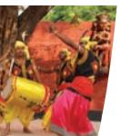
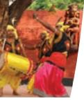

# Performing Art Traditions in India

Arts have always been very important in human life. Basic need of human beings to express gets communicated to others through various arts. Recent researches throw light on how during the prehistoric period people used to express through art forms. Art is a diverse range of human activities resulting out of creative skills and imagination. *Vātsyāyana* has described sixty four arts. Interestingly, in that list, the first four are performing arts—vocal music, instrumental music, dance and theatre. This also indicates that a strong tradition of Performing Arts can be traced back to the old civilisation of India. In broader sense, performing arts require skills in which the artistic expression is conveyed to the audience through performer's voice, body gestures or through sound objects or musical instruments. In everyday life, it is done through folk music, folk dance, folk theatre such as *Jātrā, Nauṭaṁki,* etc., by the common people. To practice the art in a specific specialised manner, it is referred to as the classical art forms such as, music, dance and theatre which has evolved over the centuries having a strong tradition with laid down rules and regulations.

Performing arts occupy a significant place in the Indian society. There can be no doubt about the fact that art forms, be it performing or visual, reflect the thinking process of

Source: *Pragetihasik Bhartiya Chitrakalaa Mein Sangeet*

3--Performing Art Traditions in India.indd 37 15-10-2020 14:26:09

Source: *Pragetihasik Bhartiya Chitrakalaa Mein Sangeet*

*Dancing Shiva* Source: https://nroer.gov.in/

the society which comprises its people, their habitat, ethos, emotions, and uniqueness of communities and surroundings.

## **Music in India**

Indian music, i.e., *Bhārati ya Sangi ta* has built a strong background over different occasions simultaneously enriching our culture. It has a rich treasure of classical, regional and folk forms expressed through vocal music and instrumental music. Music comprises three art forms, i.e., *Gi ta, Vādya* and *Nṛtya* as referred in *Sangi ta Ratnākara* written by Pt*.* Sharangdev "गीतं , वाद्यं त्रयं सं गीतमचु्यते" In *Saṅgi ta Pārijāta*;, Pt. Ahobal has said: "गीतावादित्रनतृ्यानां रक्ति साधारण गणः अतो ु रिक्तविहीनं यत्न तत् सं गीतमचु्यते ".

Indian Music has been continuously affected by the social and religious conditions. It has gradually evolved through different periods and stages. The development of Indian music can be classified into three main periods:

- 1. Ancient Period
- 2. Medieval Period, and
- 3. Modern Period

## **Ancient Period (2500 B.C. –A.D. 1200)**

The origin of Indian music can be traced back to evidences from the Indus Valley Civilisation. This period is also known as Vedic period. During this period, the Vedic hymns were chanted and some of them were also set to tune and rhythm. The rhythmic recitations of *Ṛgveda* were known as *Ṛcās* (ऋचायें)*. Sāmaveda* is the compilation of these selected *Ṛcās* set to *Svaras* keeping their proposed *Chanda* (छं द) or rhythmic meters. Only three *Svaras — Udātta* (उदात्त), *Anudātta* (अनदुात्त) and *Svarita* (स्वरित) were used in *Sāmagāna*. *Udātta* was the sharp pitch, *Anudātta* was grave pitch and *Svarita* combined in itself the characteristics of both the pitches.

*In Pāṇiniya Śikṣā, Pāṇini* has mentioned two additional *Svaras* — 1. Uccaistara, higher than the *Udātta* and 2. *Sannatara* lower than the *Anudātta*. Further, seven notes evolved from these three Vedic *Svaras*. According to *Pāṇini ya Śikṣā*:

> "उदात्तेनिषाद-गां धारौ, अनदुात्ते ऋषभ-धैवतौ शेषास्तु स ्तु ्वरिता: गेया: षड्ज-मध्यम-पं चमाः"

which means *Niṣāda (Ni,* the seventh *svara)* and *Gāndhāra (ga,* the third *svara)* arise from *Udātta; Ṛṣabha (Re,* the second *svara)* and *Dhaivata* (*Dha,* the sixth *svara*) arise from *Anudātta;* and *Ṣaḍja (Sa,* the first *svara*), *Madhyama (Ma,*  the fourth *svara)* and *Pañcama (Pa,* the fifth *svara)* originate from *Svarita*.

3--Performing Art Traditions in India.indd 38 15-10-2020 14:26:15

- 
- 
- 
- 

There are two streams of music known as *Mārgi*  and *Deśi -* .

- 1. *Mārgi -* or *Gāndharva Saṅgi ta* was practiced for salvation. *- -*
- 2. *Deśi Saṅgi ta* which was further divided into classical, semi-classical, folk music, etc.

Gradually *Sāmagāna* developed into *Gāndharva* which was further developed during the *Rāmāyaṇa,* the *Mahābhārata* and *Purāṇas.*

The epic *Rāmāyaṇa* composed by *Vālmi ki* has the reference of terms like *Saṅgi ta, Svara, Laya, Tāla, Mātrā, Mūrchanā, Jāti, Mārg Saṅgi ta* and *Gāndharva*. The reference of musical instruments is also available in the epic, such as, *Vipañci, Vallaki - ,* etc. *Mahābhārata* written by *Kṛṣṇadvaipāyana Vyāsa,* has musical terms such as *Grāma, Mūrchanā* and the names of seven basic *Svaras* such as *Ṣaḍja, Ṛṣabha,* etc. It also has the reference of musical instruments used during this period, such as *Bheri - , Jharjhari - , Tūrya, Vi ṇā,* etc.

- 
- 

*Bharat's Nāṭyaśāstra* is the most important and pioneer work of music, dance and drama. It has 36 chapters, out of which six chapters (28th–33rd) are related to music. *Śruti, Grāma, Grāmarāgas, Jāti, Mūrchanā, Gi ti, Alaṅkāra,* etc., have been discussed in depth in the book. *Dhruva Gi ta* had a special place in *Nāṭya*. These were used in between different scenes called *Nāṭya Sandhis.* Concept of *Rasa* for aesthetic experience has also been discussed elaborately in *Nāṭyaśāstra*. This is the first text available on the classification of Indian Instruments.

*Raag Mala Chitra: Bhairvi* Source: Centre for Cultural Resources and Training (CCRT)

3--Performing Art Traditions in India.indd 39 15-10-2020 14:26:19

*Loka Vādya*

## *Classification of Indian instruments*

- 1. *Tat* (string instruments)
- 2. *Suśi rā* (wind instruments)
- 3. *Avanādha* (percussion instruments)
- 4. *Ghana* (instruments made of brass or wood)

- 
- 
- 
- 

#### *Guru-Śiṣya Paramparā or the Oral Tradition*

Music in India has been passed on in a tradition described as *Guru-Śiṣya Paramparā* (teacher-disciple tradition). In the *gurukula* system of education (from the Vedic Era to the medieval era), a pupil or *śiṣya*, after his initiation (sacred thread ceremony), lived in the house of his guru, or teacher, and studied the *Vedas* and other subjects under his guidance, for a period of 12 years. Gurus were expected to teach everything they knew to the disciple. The *Gurukula* was the precedent of the concept of *gharāna* in Hindustani music from the eighteenth to twentieth century, the difference being, in a *gharāna,* the learning was strictly in music and dance in a particular style or *śaili -* . Knowledge in dance and music was passed on from one generation to the other through this oral tradition, there was no written word or process of documentation in earlier times. It evolved through successive generations. Even in the present times, music and dance classical traditions are learnt in the *guru-śiṣya paramparā*.

3--Performing Art Traditions in India.indd 40 15-10-2020 14:26:20

## **Medieval Period (A.D. 1201 – A.D. 1800)**

The medieval period is known for the development of musical forms, musical instruments and documentation of music in a vast number of authentic texts which are available in the shape of *Grantha* (ग्रन्थ) to understand the growth of classical music.

Śāraṅgadeva (A.D. 1210–1247) was the author of the important musicological text *Saṅgi ta Ratnākara.* In this text, the author describes *Saṅgi ta* (music) as a composite art consisting of *Gi ta* (melodic forms), *Vādya* (forms for drumming) and *Nṛtya* (dance, literally movements of the limbs of the body). *Sańgi ta* is of two kinds—*Mārga-sańgi ta* and *Deśi - -sańgi ta*. The music for the mass was *Deśi - Saṅgi ta*. The construction and techniques of playing musical instruments like 14 kinds of drums and other rhythm-instruments have been vividly discussed.

In the medieval period, with the advent of Muslims, classical music in India began to evolve as two distinct traditions — (i) Hindustani Music and (ii) Carnatic Music. Hindustani Music spread to northern, eastern and western parts of India and Carnatic Music to the whole of Southern or Deccan Plateau region. There was a difference in the language, singing style, *svarsthānas,* rhythmic (*Tāla*) patterns and melodic structures owing to regional contexts and political changes. Both temple music and *Darbāri - Saṅgi ta* came into being in the northern region. The classical tradition of Southern India maintained its purity and tradition restoring it in the sanctity of the temples. Many Indian and non-Indian cultures took an active part in this transformation. The advent of Islam at the end of the twelfth century brought Persian music and culture in the northern, eastern and western parts of the country. Personalities such as Amir Khusro, Raja Man Singh Tomar, Mian Tansen, Swami Haridas, Baiju Bavra, Gopal Nayak contributed in the development of Hindustani Classical Music during this period.

In the *Bhakti* movement, literature and music played a major role in propagating philosophies of human life. The works of composers like Jayadeva (eleventh century), Vidyapati (A.D. 1375), Chandidas (fourteenth to fifteenth century), Bhakta Narasimha (A.D. 1416–1475) and Meerabai (A.D. 1555–1603), Kabir and Tulsidas (fourteenth and fifteenth century), Surdas, Vallabhacharya and Chaitanya (seventeenth century) had a very strong impact on music traditions and practices during this period.

*Musician: Mughal Painting of 17th Century* Source: CCRT

3--Performing Art Traditions in India.indd 41 15-10-2020 14:26:21

*Rāgiṇi - Basant* Source: CCRT

## *Development of musical forms*

In ancient period, *Jāti Gāyana* developed into *Prabandha gāyana*. Later in medieval period musical forms like, *Dhrupada, Dhamāra, Khayāl, Tarānā,* etc., evolved from *Prabandha*. Music which was accompanying drama had evolved now as an autonomous art form. New styles in instrumental music such as *Masi tkhāni*  and *Rāzkhani*  were developed in the medieval period. Pt. Somnath in his text *Rāga Vivodha,* described two fold description of *Rāga,*  i.e., *Devamāyā svarūpa* (describing ethos of the *Rāga*) and *Nādamaya svarūpa*—tonal structure of the *Rāga*. *Rāga's*  poetic description for better understanding of the ethos of a *Rāga*, lead to the creation of *Dhyāna Mantras.* These *dhyānas* were later depicted through *Rāga-mālā* paintings.

Many new instruments like *Sitār, and Tablā* were developed. Amir Khusro, a very famous musician, is believed to have evolved many musical forms like *Qawwāli - , Qual, Kalbana,* etc., *Rāgas* like *Yaman*, *Sāzgiri - , Tālas* such as *Chapaka, Fartost,* etc. Under the patronage of kings, artists were encouraged to practice the intricacies of musical forms to refine their skills to higher levels of perfection. Gradually, musical forms started developing their traditions and styles by the efforts of practicing artists. This resulted into establishing *'Gharānā System'. Gharānā* is a term used to explain the belonging to a legacy of musical traditions either by lineage or by practicing a particular musical style. Every *Gharānā* has its own distinct features which emerge from mannerism and application. The concept of *Guru-Śiṣya* (Teacher-Pupil) leads to the sustainability of *Gharānā*.

3--Performing Art Traditions in India.indd 42 15-10-2020 14:26:22

## **Modern Period (A.D. 1800 – Till date)**

In this period, Indian music flourished in the courts of kings. Few foreign scholars such as Sir William Jones, Sir W. Ouseley and Captain C.R. Day, Captain N.A. Willard showed a great aptitude for Hindustani Music and they wrote many valuable books on music. During this period Muhammad Raza (1813) wrote an important treatise *Naghmat-e-Asafi*. He is believed to be the first to adopt the *Bilawal Scale* as is *Shuddha Scale*.

Pt. V.N. Bhatkhande and Pt. V.D. Paluskar worked hard for the upliftment of music and musicians by organising music conferences, establishing music institutions and writing books. Efforts were made by Pt. V.N. Bhatkhande and Pt. V.D. Paluskar for documentation of music by evolving systematised Notation System.

This period is known for a revolutionary change in field of music introducing it in formal education system. Many scholars of this period have worked hard to get recognised as a discipline parallel to other disciplines.

## **Theatre**

As a child all of us have played ghar-ghar (playing house). This way we playfully observed, imitated, became any character of choice, and had great fun. This is often referred as dramatic instinct in human beings. Drama is derived from a Greek word 'drama' meaning 'to do', 'to act'. Aristotle defined it as 'imitated human life'. Drama is also often called 'play' (*khel* or *natak khelna* in Hindi). Adults also play drama albeit in different ways. All of us play multiple roles in day-to-day life: one single person playing the role of a mother at home, teacher at school, passenger in a bus, etc. This may be called role play in real life. In formal theatre, drama is enacted on stage and there are two groups who participate—(i) actors and (ii) audience.

Dramatic enactments have been part of communities from prehistoric times, and each civilisation had developed

Performing Art Traditions in India 43

3--Performing Art Traditions in India.indd 43 15-10-2020 14:26:23

its own norms of theatre. "The origin of Indian drama, as of significant drama anywhere else in the world, probably lies in the tribal ritual dances and celebration of antiquity. What began as community participation would gradually break down into two groups—those who perform and those who watch, that is the actors and the audience".—Som Benegal1

In India, there developed a rich tradition in theatre, particularly the classical Sanskrit drama. *Natyaśāstra*2, ascribed to Sage Bharata, the oldest treatise on dramaturgy, gives an interesting account of the origin of Indian *Nāṭya* tradition in the opening chapter.

## **Mythological Story on the Origin of Indian Theatre**

It is said that the four *Vedas*—as repository of knowledge and wisdom were accessible to upper castes and classes (*Varṇas*), and not to women and lower caste or class. Dissatisfied with this situation, the Gods went to Brahmā, the creator, for a solution. The creator suggested the creation of the Fifth *veda*  (*Pañcamaveda*) as *Nāṭyaveda.* This task was accomplished

by Sage Bharata by way of extracting the wisdom of *Rigveda*, performative rituals of *Sāmaveda*, musicality of *Yajurveda* and emotive representations of *Atharvaveda.* The voluminous work, thus created, embodied all physical, theoretical and conceptual ideas behind traditional Indian drama. *Nāṭyaśāstra*, thus, speaks about the thought process and behaviour of people, their temperament, problems in society, needs, sorrow, etc., paving the way and promise for a better life.3 It is recommended to go through important texts written by Shaktibhadra, Neelakantha Kalidasa, Bhattanarayana, Viswanatha and Kaviraja, who incorporated elements of *Nāṭyaśāstra* in their original writing.

44 Knowledge Traditions and Practices of India— Class XI

3--Performing Art Traditions in India.indd 44 15-10-2020 14:26:27

- 
- 

The early drama was a combination of mime, poetry, prose, dialogue, humour, songs and dance. This made theatre as an all inclusive art form. Gradually it became an important medium for entertainment, learning, communication and reflexive thinking on human conditions.

The tradition of theatre in India certainly developed much before *Nāṭyaśāstra*; but systematic thinking or theorising about theatre arts started taking shape with *Nāṭyaśāstra*. It is believed that *Nāṭyaśāstra* had developed by compiling and conceptualising the prevailing folk traditions. The dramatic representations were conceived in three distinct forms; *Nāṭya* or the verbal act inclusive of singing; *Nṛtya* the non-verbal mimetic language, and *Nṛtta* or the language of body or dancing. For Bharata, the composite term *Abhinaya* would mean—*Abhi,* meaning learning from the play and *ni,* meaning to carry it forward. It intends to entertain and educate people simultaneously. When we talk of arts intervention in education today, we must critically judge its implications in the present times.

Ancient drama tradition can be categorised in two ways— *Nataka* which is *lokadharmi* or popular, and *nāṭyadharmi* or conventional. Sanskrit plays had a *Sūtradhāra* who created a link of events in a play through commentary, musical interlude or interpretative extempore.

*Nāṭyaśāstra* was written in Sanskrit. Kalidasa, the most celebrated poet of the Gupta era, wrote plays in Sanskrit and followed the *Nāṭyaśāstra* tradition. This establishes the fact that *Nāṭyaśāstra* was a pre-Gupta text. Another important point to be noted is the aspect of dependence of Sanskrit theatre on royal patronage. Necessarily, the audience of this theatre was social elite.

Performing Art Traditions in India 45

3--Performing Art Traditions in India.indd 45 15-10-2020 14:26:27

*Ashvaghosha*

*Sanskrit Play*

One can count about 35 plays from the classical Sanskrit genre but there are many more mentioned by others that are yet to be discovered. All the available ones are not classics.

#### *Ashvaghosha*

Palm-leaf fragments found in Central Asia take us back to the Kushan period of the A.D. first century. The earliest Sanskrit play, an unfinished one, comes in the form of a nine-act Buddhist play by Ashvaghosha, the court poet of the Kushan King Kanishka. This earliest Sanskrit play is called *Sāriputra Prakaraṇa*. Kalidasa, the most recognised poet-playwright who lived sometime in the fifth century in the glorious Gupta period of Indian history penned such classics as *Mālavikāgnimitram*, and *Abhijñāna-Śākuntalam* which are performed even today. Shudraka wrote *Mṛcchakatikam,* which is undoubtedly a masterpiece. Vishakhadatta's *Mudrārākṣasam* was written two hundred years later in the A.D. ninth century. One must remember Bhavabhuti, a scholarly Brahmin, proficient in rhetoric and logic, has left three works: two of which may be called historical-mythological—*Mahāvi ra-caritam* and *Uttararāma-caritam*—both dealing with the Ramayana, and the third with a romance titled *Mālati-Mādhavam*. The Sanskrit plays of Bhasha, Kalidasa, Shudraka, Harsha and Bhavabhuti complete a representative cross-section of Sanskrit drama.

The glory of Sanskrit drama declined through ninth to twelfth centuries, in the face of political turmoil. The language was also a big factor of its losing popularity.

The decline of Sanskrit drama did not mean the decline of drama of Indian theatre. The growth of the *Prakṛts* made Sanskrit rather irrelevant and these popular languages threw up their own literatures and with it came a trend of powerful folk theatre tradition which survived the varied time and periods of history. This trend of theatre survives right down to this day in many parts of the country.

We find a few references of Urdu theatre in the court of Wazid Ali Shah who was a great patron

3--Performing Art Traditions in India.indd 46 15-10-2020 14:26:29

of all performing arts. Although the ancient literature of the South, notably Tamil literature, has many references to drama and dramatic performances, there is little evidence of written plays with authorship. A form known as *Kuttu* meaning play or entertainment is found in Tamil literature. The *Kuttu* persists to this day in many forms of folk. There is the *therukuttu* form which appears to

*Sanskrit Play*

be a wholly rural artistic tradition. The most splendid and enduring contribution of the South to Indian theatre is storytelling traditions through dance and dance-drama. Notable among these are: *Bharatanatyam*, *Kathakali*, *Bhāgavata Mela Nāṭakam*, *Yakṣagaṇa* and *Kuchipudi*. The *Bhāgavata Mela Nāṭakam, Yakṣagaṇa* and *Kuchipudi* are said to be the regional variations of Indian Classical Theatrical tradition and they are sturdily dramatic in form employing special dazzling elaborate costumes and make-up. Although the *Bhāgavata Mela Nāṭakam* originally came from Tamil Nadu, its greatest manifestation is found in Andhra Pradesh which is also the home of *Kuchipudi*. On the contrary, *Kathakali* is a product of Kerala and perhaps the most vigorous and dramatic of all Indian dance-drama forms. The essence of all these dramatic forms is in the intersection of drama, dance, mime, gesture and music. In that sense, it may be considered as excellent examples of theatre *in toto*.

#### **Modern Developments**

With the coming of the colonial rule, we find a strong influence of western, particularly English theatre tradition in the making of modern Indian theatre. It had interesting features: though essentially urban, it incorporated many classical and folk features and it simultaneously helped in the rise of commercial theatre and played a crucial role in raising nationalist sentiments. One may mention the names of Girish Chandra Ghosh and Bharatendu Harishchandra

3--Performing Art Traditions in India.indd 47 15-10-2020 14:26:30

*Yakshagana performance*

in this context. What followed was a good mixture of entertainment, nationalism and social reform.

One interesting development was Bombay Parsi theatre. Its initiator was a shrewd and resourceful man named Pestonji Framji who started the 'Original Theatrical Company' around 1870. His success led to the establishment of as many as six other flourishing companies, some of them breakaways from earlier groups. Although Bombay was their base, these companies travelled widely over North Indian and one of them, the Victoria Theatrical Company of Khurshidji Balliwala, even ventured as far as Britain.

We find simultaneous development of Bengali, Marathi, Kannad and other regional theatres together with the revival of many classical forms particularly in dance drama theatre. From 1930s to post independence period saw the rise of innovative forays theatre, music and dance. Uday Shankar's ballet, Rukmini Devi Arundale's Kalashetra attracted international attention and the rise of Indian People's Theatre Association (IPTA) changed the face of modern theatre forever.

Drawing upon the classical, folk and world theatre practices, IPTA paved the way for experimentations in developing new form and content in tackling emerging realities of post independent India. IPTA had inspired an enormous body of talents who subsequently enriched all the art fields including dance, music, literature, theatre and even cinema.

Mention may be made of some post independent personalities who shaped the contemporary Indian theatre: Sombhu Mitra, Chandrashekhar Kambar, Utpal Dutt, Habib Tanvir, Badal Sarkar, Mohan Rakesh, K.N. Panikkar, Vijay Tendulkar, Ibrahim Alkazi, Ratan Thyam, Girish Karnad,

to name only a few. To understand the very recent developments in Indian theatre, one needs to study and understand the specific contributions of these people. We also need to look into the way Saṅgi ta Nātaka Akademi and National School of Drama — two Government institutions, have played their roles in shaping contemporary Indian theatre. In recent years, theatre is playing interesting role in connecting education and social action.

3--Performing Art Traditions in India.indd 48 15-10-2020 14:26:31

We also need to appreciate the role played by folk theatre in shaping our Indian sensitivities—*Bhavai* from Gujarat, *Tamasha* from Maharashtra, *Bhand Pather* of Kashmir, *Jātrā* of Bengal, *Nautanki* of North India, *Yakṣagaṇa* of Karnataka, to name only a few. These are adding to the meaning of Indian theatre.

## **Dance in India**

Dance is perhaps the oldest of all the living art forms of the human race. In fact cave paintings of prehistoric times display stylised movements or dance, conveying daily activities such as hunting, food gathering, enjoyment, etc. Images excavated from the remains of ancient civilisations give us valuable information about the history of our dance, such as the figurine of a bronze dancing girl which has been found in the Indus Valley civilisation relics.

Dance in India has been an integral part of every social and cultural event. In a country such as ours, in which people of different races, languages and culture reside, there is a wide variety of forms in dance. Dances performed in India are believed to have their origins in dances and rituals of the period of the *Vedas*, which date back to around 5000 B.C.E. Bhimbetka Caves in the Vindhya Hill region of Madhya Pradesh are filled with images made by hunter-gatherers of dancers in various poses and group choreographies. Rather, as with most other branches of knowledge, its origin is ascribed to divinity. *Naṭarāja* or *Śiva* in the image of the Lord of Dance is revered as the supreme dancer. Some of the ancient treatise on dance and drama is the *Nāṭyaśāstra*, *Abhinaya Darpana*, *Nartana Sarvaswam*, *Rāmāyaṇa*, *Mahābhārata* and *Harivaṁśa*. Recorded evidences of dance have been found from the study of Anthropology, Archaeology, Sculpture, Paintings, Inscriptions, Religious and Secular Treatises and Literary Works.

Paintings of Ancient and Medieval India are also a storehouse of knowledge for the dance historian.

Gestures, body postures, expressions, etc., are the basic elements of Indian dance. The use of the hands and fingers (hand gestures called *mudrās*), eyes, head movement, formation or creation of different forms and shapes to the body are of primary importance in any dance form. The costume is of extreme importance where the clothes, jewellery and make-up showcase the identity of a particular place or region of India, e.g., in Bihu dance we see the men and women wearing typical Assamese dresses like *mekhola chaddar*, dhoti, whereas in the state of Rajasthan we find dancers wearing *lehenga* and *chunri*.

Performing Art Traditions in India 49

*Dancing Girl figure made of bronze* Source: https://nroer.gov.in

3--Performing Art Traditions in India.indd 49 15-10-2020 14:26:31

The essential elements of Indian dance are:

- • the technique of movement, which includes facial expressions, head movements and body movements.
- • all types of vocal and musical instruments and literature from Hindu mythological and ancient texts linked with dance.
- • costumes, make-up and sets.

(pure dance) or abstract,

- 
- 
- 
- 

The oldest evidence of Indian dance are descriptions of dance found in Barhut, Sanchi and Amaravati, which dates back to the second century B.C.E. Sculptures from all over India illustrates the importance of dance in Indian history and the richness of its traditions. It is said that Gautam Buddha, while being a king, had dancers, singers

3--Performing Art Traditions in India.indd 50 15-10-2020 14:26:32

and instrument players in his court. In the case of Ajanta and Ellora, the paintings depict various mudrās of dances. During the classical Gupta age from the A.D. fourth to sixth century many sculptures give evidence of dance. The plain outer walls were decorated with narrative panels as well as dancing divinities. This was the beginning of a development that was to lead to the flourishing of dance images in Hindu temple architecture. During the so called 'medieval' period, approximately from the seventh to the sixteenth century, the most abundant representations of dance images can be seen in the Hindu temples of South India, in the Bhubaneshwar temples in East India, and in the temples of Khajuraho in central India. The West Indian Jain temples of Mt. Abu are also famous for their dance imagery.

Many classical forms of dances are based on ancient sculptures. India has a very rich tradition of classical, tribal regional and folk dance forms. Our community life vibrates with singing and dancing. The birth of a child, weddings, festivals, the harvest, different seasons, or just the leisure that a field-worker enjoys at the end of the day, are occasions that call for dance as a celebration.

## **Living dance traditions**

## *Tribal Dance*

The dance of primitive and tribal groups generally performed by nomads who are close to nature fall in this category. Primitive ritualistic dance forms such as those of the Santhals, the Theyyam of Kerala in which masks of tigers and lions are used, the dance of the *Kalbelia* people who are the snake charmers of Rajasthan, the fire dance of Rajasthan and Gujarat, etc.

Performing Art Traditions in India 51

3--Performing Art Traditions in India.indd 51 15-10-2020 14:26:33

2024-25

#### *Folk dances*

These originated when humans started cultivating crops, and hence had to stay in fixed area and settlements. The dances centered around the agricultural calendar, especially the harvest and also around social events such as marriages, child birth and death. Dances of this category are the *Bihu* of Assam, the *Dandiya Raas* and *Garba* of Gujarat, the *Bhangra* of Punjab, the *Chari* of Rajasthan, etc.

The tribal and folk dance forms are basically participative dance forms in which everyone takes part and there is no distinction between the artist and the audience.

#### *Classical Dances*

Classical dances are sophisticated dance form polished by the intellect of accomplished artists and teachers who belong to intellectual or knowledgeable society.

#### *Modern Dance*

There are new styles of dance being evolved by accomplished dancers who are trained in the forms and aesthetics of the classical styles. This has also been termed as Creative, Innovative and Modern Dance.

#### **Classical or Traditional Dance Forms of India**

It is believed that these dances originated around the time when Janapadas were founded in India. They convey refined techniques of dance, story or message. Each classical dance form varies according to regional differences, social conditions, language, music, costumes, and of course, the individual contribution of artistes and teachers. The major classical or traditional dances of India, as accepted today, are:

- 1. Bharatanāṭyam 2. Kathak 3. Kathakali
	-
- 
- 
- 
- 4. Manipuri 5. Odissi 6. Kuchipudi
- 7. Mohiniattam 8. Sattriya
- 
- 

#### *Kathak*

A dance form with its roots in the northern part of India, it derives its name from the word *Katha*, or story. The journey from the rustic, wandering minstrel, to the storyteller of

3--Performing Art Traditions in India.indd 52 15-10-2020 14:26:34

the temples of North India, through the courts of emperors and kings to the modern proscenium stage—the journey of Kathak is long and diversified. Lucknow Gharana, Jaipur Gharana, Banaras Gharana and Raigarh Gharana are the main gharanas or styles of Kathak.

## *Bharatanāṭyam*

This dance form originated in southern part of India in the state of Tamil Nadu. It started as a temple dance tradition called Dasiyattam (the dance of the maid-servants) 2000 years ago. The

name Bharatanāṭyam is a simple derivation from the four most important aspects of dance (in Sanskrit). These are: *Bha* from *Bhāva* meaning emotion, *Ra* from *Rāga* meaning music or melody, *Ta* from *Tāla* meaning rhythm and *Nāṭyam* meaning dance.

#### *Odissi*

This dance form takes its name from the state of its origin, Odisha. It is approximately 60 years ago that Odissi, took its present form as seen today. Today's Odissi has evolved from the endless sculptures in various motifs carved on the temple walls of Orissa. Tribhangi, a unique posture in the form, literally meaning three bends in the body is inspired by temple sculptures creating an illusion of sculpture coming to life.

### *Kathakali*

This is a dance form of Kerala which dates to around the seventeenth century and has become the most recognised icon of Kerala. The word Kathakali literally means 'storyplay'. Kathakali is known for its heavy, elaborate make-up and costumes. This dance form presents themes derived from the Hindu epics, mythologies and legends. Initially Kathakali was thought to be the sole domain of men but now women also perform the dance.

#### *Mohiniattam*

*Mohiniattam,* the female dance form of kerala with its origin in the temples of Kerala was shaped to its present form by the Travancore Maharaja Kartika Thirunal and Swati Thirunal around nineteenth century. The dance form which was lost, was revived in through the dedicated efforts of Vallatol in twentieth century. *Lāsya* (languid grace) and Śṛṇgāra (beauty and love) are the essence and the basic mood of Mohiniattam. In Mohiniattam, it is compulsory to wear white costumes.

Performing Art Traditions in India 53

*Kathak Dance*

*Bharatanatyam* Source: https://nroer.gov.in

*Odissi*

3--Performing Art Traditions in India.indd 53 15-10-2020 14:26:36

*Kuchipudi*

- 
- 
- 
- 

#### *Kuchipudi*

This is a dance style adapted from the dance dramas enacted by Brahmin priests or *Bhagavutulus* whose dance was again influenced by the style of the Rājanartaki s or women court dancers of the time. The dance style is named after the place of its origin—Kuchipudi, a quiet village, about 65 kilometers from Vijayawada in Andhra Pradesh.

#### *Manipuri*

The classical dance of Manipur—the Jeweled City, is associated with Pre-Vaishnavite and Vaishnavite tradition. This dance form is a unique blend of Saṅki rtana and Rāsali lā. The dance with the drum called *Pung,* is one of the most vibrant and exciting presentations in Manipuri dance.

*Sattriya*

#### *Sattriya*

*Sattriya* or *Sattriya Nṛtya*, originated in the eastern state of Assam. It is a dancedrama performance art with origins in the Krishna centred Vaishnavism monasteries of Assam, and attributed to the fifteenth century Bhakti movement scholar and saint Mahapurush Srimanta Sankardev. One-act plays of *Sattriya* are called *Aṅki ya Nat*, which combine the aesthetic and the religious through a ballad, dance and drama. The plays are usually performed in the dance

community halls (*namghar*) of monastery temples (*sattras*). The themes played relate to Krishna and Radha, sometimes other Vishnu *avatāras* such as Rama and Sita.

New styles of dance are being evolved by accomplished dancers who are trained in the forms and aesthetics of the classical styles. These have variously been termed as Creative, Innovative and Modern Dance. Creative genius like Uday Shankar, Chitralekha, Narendra Sharma, etc., evolved their own dance style taking the best from classical and folk dances and blending mythological and modern themes to suit the tastes of the modern audience.

3--Performing Art Traditions in India.indd 54 15-10-2020 14:26:42

## **Some Folk forms (Performing Arts) of India**

#### *Kalbelia: Folk form of Rajasthan*

*Kalbelia* is a community of snake charmers living in Thar Desert Region of India. *Kalbelias* are now found predominantly in the districts of Jodhpur, Jaisalmer, Jalore and Barmer in western Rajasthan and in the cities of Jaipur and Pushkar in eastern Rajasthan. The women in flowing skirts dance to the beat of the *khanjari*, a percussion instrument, and the *poongi*, a wind instrument.

#### *Cheraw*

*Kuchipudi*

*Manipuri*

This is a dance style adapted from the dance dramas enacted by Brahmin priests or *Bhagavutulus* whose dance was again

dancers of the time. The dance style is named after the place of its origin—Kuchipudi, a quiet village, about 65 kilometers

The classical dance of Manipur—the Jeweled City, is associated with Pre-Vaishnavite and Vaishnavite tradition. This dance

-

with the drum called *Pung,* is one of the most vibrant and

plays of *Sattriya* are called *Aṅki*

community halls (*namghar*) of monastery temples (*sattras*). The themes played relate to Krishna and Radha, sometimes

New styles of dance are being evolved by accomplished dancers who are trained in the forms and aesthetics of the classical styles. These have variously been termed as Creative, Innovative and Modern Dance. Creative genius like Uday Shankar, Chitralekha, Narendra Sharma, etc., evolved their own dance style taking the best from classical and folk dances and blending mythological and modern themes to

other Vishnu *avatāras* such as Rama and Sita.

suit the tastes of the modern audience.

-

rtana and Rāsali

*Sattriya* or *Sattriya Nṛtya*, originated in the eastern state of Assam. It is a dancedrama performance art with origins in the Krishna centred Vaishnavism monasteries of Assam, and attributed to the fifteenth century Bhakti movement scholar and saint Mahapurush Srimanta Sankardev. One-act

combine the aesthetic and the religious through a ballad, dance and drama. The plays are usually performed in the dance

-

*-*

s or women court

lā. The dance

*ya Nat*, which

influenced by the style of the Rājanartaki

from Vijayawada in Andhra Pradesh.

exciting presentations in Manipuri dance. *Sattriya*

form is a unique blend of Saṅki

This dance form performed in Mizoram is recognised as one of the oldest forms of folk arts. It is characterised by the use of bamboo staves which are kept in cross and horizontal forms on the ground. While the male dancers move these bamboo staves in rhythmic beats, the female dancers perform by stepping in and out of the bamboo blocks.

#### *Lama Music and Dances of Sikkim*

*Lama* dances are masked dances performed with beats of varied types of rhythm by the Buddhist monks of Sikkim as a part of their religious practices. The practices are codified in the religious texts of Sikkim in accordance with the teachings of Guru Padmashambhava, the legendary saint of the Mahayana school of Buddhism. Based on these, Lamas conduct prayers for the benefit of Buddhism and the state of Sikkim. Gorgeous attire and colourful masks made according to the scriptures are used with traditional musical instruments like cymbals and big horns rendering the codified religious music and chanting.

#### *Rouf*

One of the most popular traditional music and dances of Kashmir is *Rouf*. It graces all the festive occasions, especially

3--Performing Art Traditions in India.indd 55 15-10-2020 14:26:45

Eid and *Ramzan* days. The music and dance is performed by a group of women facing each other. The song that is sung during the performance is in the form of question and answer where one group questions and the other responds to it in a rhythmic way.

## **Shadow Puppet Theatre Traditions of India**

The communities which are distinctively associated with it are:

- 1. *Chamadyacha Bahulya Thakar,* Maharashtra
- 2. *Tolu Bommalatta Killekyata or Are Kapu,* Andhra Pradesh
- 3. *Togalu Gombeyatta Killekyata or Dayat,* Karnataka
- 4. *Tolu Bommalattam Killekyata,* Tamil Nadu
- 5. *Tolpava Kuthu Vellalachetti, Nair,* Kerala
- 6. *Ravanachhaya Bhat,* Orissa

Though these forms have distinct regional identities, languages and dialects in which they are performed, they share a common worldview, aesthetics and themes. The narratives are mainly based on the epics of *Rāmāyaṇa*  and *Mahābhārata*, *Purāṇas*, local myths and tales. They communicate significant messages to the rural community besides entertainment.

#### **Some examples of folk or living traditions of theatre**

#### *Bhavai*

*Bhavai* is a traditional theatre form of Gujarat and Rajasthan with its deep roots in Kutch and Kathiawar in Gujarat. Bhavai originated as a prayer to the Goddess *Amba*, during the Navaratra festival.

#### *Tamasha*

Tamasha is a traditional folk theatre form of Maharashtra. The term 'Tamasha' is derived from Persian.

#### *Bhagawatmela and Kuchipudi*

Many dance drama forms in Andhra Pradesh and Tamil Nadu are prevalent which are called by different names— *Bhāgavatamela*, *Kuchipudi, Bhamakalapam, Yakṣagaṇa,*  etc. Others, such as *Vi thināṭakam* of Andhra Pradesh and *Terukoothu* in Tamil Nadu are street theatre forms. Besides, there are several *Kurvanji* forms.

#### *Bhand Pather*

*Bhand* theatre is popular in Northern India, specially in Kashmir and Punjab. *Bhand Pather* of Kashmir, is a unique combination of dance, music and drama where satire, wit and parody are preferred for inducing laughter.

3--Performing Art Traditions in India.indd 56 15-10-2020 14:26:45

## *Nautanki*

As the term *Nautanki* itself suggests, the basis of this form of entertainment is *Natak* (play). *Nautanki* presentation of Kanpur, Lucknow, Hathras and a few places in Haryana are famous because of their distinctive styles. Parsi theatre also influenced this traditional theatre form. The most important role of narrator is played by the *Ranga*, who begins the story to be presented. The *Ranga* connects the various episodes of the play. The most important instruments of *Nautanki* are the *Nagaara* and *Tikaari*.

#### *Swang*

*Swang* is a folk-theatre form of Haryana and Punjab. It is similar to *Nautanki*, traditional theatre form of Uttar Pradesh. *Bahurupias* also practised *Swang* to earn their livelihood. On the occasion of Holi festival, *Swang* artists move around in small groups displaying their art and during Dussehra festival, they are part of various tableaux.

#### *Rāsli lā*

Based exclusively on the legendary stories of Radha and Krishna, *Rāsli lā* is a highly musical traditional theatre form of Uttar Pradesh.

#### *Jātrā*

*Jatra* is one of the most popular traditional theatre forms of Bengal and Orissa. They travel from one place to another to perform hence the name *Jātrā*. Over the centuries, faith and religious fervour has been replaced in this folk theatre form with contemporary themes of social and historical significance.

### *Kutiyattam*

In Kerala, the tradition of *Kutiyattam* is easily the most prominent survivor among the forms containing some essential elements of content and structural features of

Sanskrit theatre. While scholars are correct in often calling *Kutiyattam* the only surviving tradition in Sanskrit theatre, *Kutiyattam* has also incorporated local traditions, culture and themes.

#### *Bhāgavatamela and Kuchipudi*

Many dance drama forms in Andhra Pradesh and Tamil Nadu are prevalent which are called by different names—*Bhagawatmela*, *Kuchipudi*, *Bhamakalapam*, Yakshagana, etc. Others, such as *Veethinatakam* of Andhra Pradesh and *Terukoothu* in Tamil Nadu are street theatre forms.

Performing Art Traditions in India 57

3--Performing Art Traditions in India.indd 57 15-10-2020 14:26:46

- 1. Define performing arts. What is the role of music in performing arts?
- 2. Define *Sāmagāna*. How many streams of Music are there in Vedic Era?
- 3. Write short notes on *Nāṭyaśāshtra, Bṛhaddeshi* and *Saṅgita Ratnākara*.
- 4. How many forms of Classical Music are there in India? Describe them.
- 5. Explain *Śruti, Rāgas, Svara, Laya, Tāla, Mātrā, Mūrchana, Jāti and Grāma*.
- 6. How many types of instruments are there in music? Explain them.
- 7. Write short notes on Pandit Vishnu Narayan Bhatkhande and Pandit Vishnu Digambar Paluskar.
- 8. Attend any regional theatre performance in your area and make a detailed report on style, character, customs, make-up and props.
- 9. Recreate any regional theatre performance with your classmates.
- 10. What is the role of dance in Indian music? Explain.
- 11. Write and explain the different forms of dances.
- 12. You studied about *Rouf* in Kashmir, find out other folk music and dances in Jammu and Kashmir.
- 13. Have you seen *Jātra, Kutiyattam* or any such tradition folk play? Narrate any one in the class.
- 14. Find out one folk dance and song from each State of India. Make a folder with pictures in digital or print form. What are your views and observation about the people of India? Share on NROER for enriching others.

#### **Endnotes**

- 1. Som Benegal, *Panorama of Theatre in India*, Popular Prakashan for ICCR, 1968
- 2. There are many translations of *Natyasastra* in English and Indian languages. We have referred to two translations mainly—Manomohan Ghosh's *The Natyasastra,* Calcutta, Asiatic Society, 1951, and Kapila Vatsayan's *Bharata: The Natyasastra*, Sahitya Akademi, 2003. It is recommended to go through their Introductions.
- 3. Malyaban Chattopadhyay, "A Historical Study of Ancient Indian Theatre-Communication in the Light of *Natyasastra*", Global Media Journal-Indian Edition, Sponsored by the University of Calcutta, December 2013, Vol. 4. No. 2
- 4. *Natyasastra*, Chapter Eighteen

#### **Suggested Readings and Viewings**

- 1. Adya Rangacharya, *Indian Theatre*, N.B.T.
- 2. Balwant Gargi, *Folk Theatre of India*, South Asia Books.

3--Performing Art Traditions in India.indd 58 15-10-2020 14:26:46

- 3. Govind Chatak, *Rangmanch: Kala aur Drishty*, Takshshila Prakashan
- 4. Sitaram Chaturvedi, *Bhartiya Tatha Paschatya Rangmanch*, Hindi Samiti, Suchna Vibhag, Uttar Pradesh
- 5. Virendra Narayan, *Rangkarm*, Alekh Prakashan
- 6. Kapila Vatsyayan, *Traditional Indian Theatre*, Multiple Streams, N.B.T.

### **Some suggestions for exploring**

- 7. Texts on our music tradition—*Natyashastra, Brihaddesi, Sangeet Ratnakar, Sangeet Parijat, Raag Tarangini,* etc.
- 8. Let's find out about the lives of our musicians— Tansen, Baiju Bavra, Gopal Nayak, Pandit Vishnu Narayan Bhatkhande and Pandit Vishnu Digambar Paluskar, Pandit Omkarnath Thakur, etc.
	- 9. Listen to *Ragas* like *Yaman, Bhairav, Bhairavi, Kafi, Bilawal, Khamaj*, etc.
- 10. How is the *Gharana* system important in music and dance? Explore.
- 11. Musical instruments are so interesting to know about—let's know them.
- 12. Watch these videos—
	- https://www.youtube.com/watch?v=ulIuuirC-vI (define Naad and Dhwani)
	- https://www.youtube.com/watch?v=UYT-IHNg9AM (Zakir Husain | Birju Maharaj performance)
	- https://www.youtube.com/watch?v=skkSuyQHsus (online project activity in Music)
	- https://www.youtube.com/watch?v=Hqpxk4QG1RQ (chal mere dhol- audio story from Kumaun lok katha)
- 13. https://nroer.gov.in/55ab34ff81fccb4f1d806025/ page/5b5968e616b51c01f04a2b42 ( KATHAK- Origin and development and activity )\
- 14. https://nroer.gov.in/55ab34ff81fccb4f1d806025/ page/58738c54472d4a7117b13ff8 (bharat natyam video )
- 15. https://nroer.gov.in/55ab34ff81fccb4f1d806025/ page/58e4808f472d4aca81adce6d (This video is a documentation of Gurkul traditions of Kathakali in Kerala.)
- 16. https://nroer.gov.in/55ab34ff81fccb4f1d806025/ page/5874700c472d4a6b7076eacf (The video was recorded during the National Role Play and Folk Dance Competition in 2012.)
- 17. https://www.youtube.com/watch?v=2ORe29IRGQU (odissi dance video from ncert youtube chennal)
- 18. https://www.youtube.com/watch?v=P6f0MinVE_E (mohiniattam dance video)
- 19. https://www.youtube.com/watch?v=q9AT8l9NttU (folk dance video )
- 20. https://www.youtube.com/watch?v=rw2zmaV0xOU (kathakali dance video)

Performing Art Traditions in India 59

3--Performing Art Traditions in India.indd 59 15-10-2020 14:26:46

- 

- 21. https://www.youtube.com/watch?v=Tvx8zmV4HJo (kathak dance video)
- 22. https://www.youtube.com/watch?v=KyFVrJK0WEM (Manipuri dance video)
- 23. https://www.youtube.com/watch?v=TJb26K2X104 (kathakali dance video)
- 24. https://www.youtube.com/watch?v=eWJdP_TTrfw (mohiniattam dance video)
- 25. https://www.youtube.com/watch?v=shsZ7JpNAUo (raas leela dance video)
- 26. https://www.indianetzone.com/1/tamasha.htm (Tamasha folk art form)
- 27. http://www.indiaprofile.com/religion-culture/jatras.htm (Jatra Theatre form)
- 28. https://ich.unesco.org/en/RL/kutiyattam-sanskrittheatre-00010 (Kutiyattam)

#### **Bibliography**

- Benham, Martin and James Brandon. Eds. 1995. *Cambridge Guide to Theatre*, Cambridge University Press.
- Chandorkar, Vijaya. 2012. *Compositional Forms of Hindustani Music—A Journey*, Munshiram Manoharlal Publishers Pvt. Ltd., New Delhi.
- Chaudhary, Subhadra. 1997. *Time Measure and Compositional Types in Indian Music*, Aditya Prakashan, New Delhi.
- Datta, Ketari. 2014. *Dramaturgy in Indian Theatre: A Closer View*, (Chapter 14 of The Routledge Companion to Dramaturgy, edited by Magda Romanska), Routledge.
- Deva, B.C. 1997. *Musical Instruments*, National Book Trust, New Delhi.
- Lal, Ananda. 2004. *The Oxford Companion to Indian Theatre*, OUP India.
- Prajnanananda, Swami. 1973. *Historical Development of Indian Music*, Firma K.L. Mukhopadhayay 257B, Calcutta.
- Ratanjankar, Acharya S.N. 1992. *Aesthetic Aspects of India's Musical Heritage.*

Ranade, Ashok B. 1984. *On Music and Musicians of Hindostan*, Promilla & Co. Publishers, New Delhi.

- Shankar, Chitra. 2017. *Pragatiharsikh Bharatiya Chitrakala main Sangeet*.
- Singh, Thakur Jaideva. 1995. *Indian Music, Sangeet Research Academy*, Kolkata.
- Thakaray, R.C. 2013. *Bharatiya Upmahadripati ki Sanskritiya*, Hindi Madhyam karyaniya nideshalaya Delhi Vishwabidyalaya, Part-I.
- Varadpande, M.L. 1987. *History of Indian Theatre* (in 6 volumes), Abhinav Publications, New Delhi.

3--Performing Art Traditions in India.indd 60 15-10-2020 14:26:46

