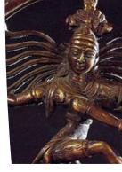
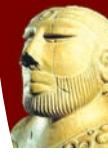
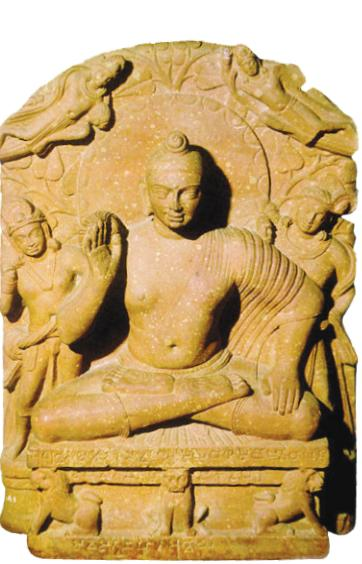
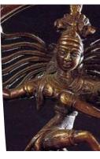
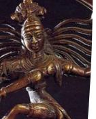

# Indian Art and Architecture **ntroduction 4**

## **I**

This chapter on Indian art and architecture will take you to the journey of one of the world's oldest and richest civilisations prevalent since the earliest times when human beings were engaged with their creative pursuits for one reason or the other. This is a journey of thousands of years of tangible and intangible heritage of the Indian sub-continent starting from the cave habitats to the oral tradition of *Vedas* to the writing of *Shastras* — the text on all possible topics where the wisdom of our ancestors has poured in! Through this chapter, you will have glimpses of different traditions of painting, sculpture and architecture — how these evolved over the years. Some of the traditional knowledge has remained with the people, communities and is still being practised specially in the pockets of modern India. Some of these timeless traditions are the oral traditions, iron smiths, potters, weavers, painting on walls, floors and ceilings, bronze cast, etc. which you can even find being practised in your region.

# **Textual Sources as Repository of Traditional Knowledge**

Early literary texts such as the epics of *Rāmāyaṇa*  and *Mahābhārata*, Kalidasa's *Abhijñānaśākuntalam*, *Daśakumāracaritam* and later on Vātsyāyana's *Kāmasūtra*  etc., refer to art galleries or *citraśālās* in the palaces. The texts on art and architecture known as *śilpaśāstra* deal with the paintings on different surfaces and media. The most comprehensive text of *Viṣṇudharmottara Purāṇa*, deals with

4- - Indian Art and Architecture.indd 61 15-10-2020 12:23:29

the interdependence of dance, music and the visual arts. It is one of the eighteen *Upa-purāṇas* where chapters are dedicated to the methods and ideals of painting. These texts have helped in passing the traditional knowledge of basics of painting techniques and their appreciation and aesthetics from one generation to the other and one region to another. They also facilitated the ancient artists to transform the technique of murals from using rough and untreated cave walls as painting surfaces to treating them for fresco, before using them to paint.

*Vāstuvidyā* or *śilpaśāstra* or the science of architecture is one of the technical subjects studied in ancient India. In the earliest texts, the word *vastu* is used for building which included temple construction, town planning, public and private buildings, and later on forts.

*Atharvaveda* too has references to different parts of a building. Kautilya's *Arthaśāstra* deals with town planning, fortifications and other civil structures. *Samarāṅgaṇasūtradhāra*, authored by King Bhoja (1010–55 C.E.), discusses the methods of examination of a site, analysis of the soil, systems of measurement, qualifications of the *sthapati* (architect) and his assistants, building materials, consecration of the plan followed by the construction of foundation, basal mouldings and technical details for each part of the plan, design and elevation. *Mayamata* (1000 C.E.) and *Mānasāra* (1300 C.E.), are the two texts having common understanding of the architectural plans and design of the southern style of temple architecture known as *drāviḍa*.

Vātsyāyana in his *Kāmasūtra*, (second century C.E.) describes the *ṣaḍaṅga* or six limbs or elements of painting as:

- 1. *Rūpabheda* or the perception of difference in appearance;
- 2. *Pramāṇa* or valid perception, measure and form;
- 3. *Bhāva* or feelings expressed in forms;
- 4. *Lāvaṇya yojana* or infusion of grace in artistic representation;
- 5. *Sādṛśyam* or similarities;
- 6. *Varṇikabhaṅga* or identification and analysis of colour and hue.

## **Painting Traditions**

Tradition of painting or *Citrakalā* is one of the earliest and most common of all expressions by humans which evolved over the centuries. Any painting activity requires a surface which could be anything—a wall, floor, ceiling, leaf, human or animal body, paper, canvas, etc. Crude walls of caves or rock shelters, to the most sophisticated digital paintings today,

**Fig. 5.16:***Gate (Details), Fifth century CE, Sanchi*

4- - Indian Art and Architecture.indd 62 15-10-2020 12:23:30

the evolution of painting has made a long journey.

## **Earliest Paintings in Rock Shelters**

A large number of sites, where remnants of rock paintings in the Indian sub-continent have been found on the walls of the caves situated in Madhya Pradesh, Uttar Pradesh, Andhra Pradesh, Karnataka, Uttarakhand and Bihar. The richest paintings are almost 10,000 years old as reported from the Vindhya ranges of

*Hunting Scene, Prehistoric Painting, Bhimbetka* 

Madhya Pradesh and their Kaimurean extensions into Uttar Pradesh. These hill ranges are full of Paleolithic and Mesolithic remains of paintings depicting human and animal figures and geometric patterns in white, black and red ochre. Humans are represented in stick figures. Wavy lines, rectangle-filled geometric designs, and groups of dots can also be seen. One of the interesting scenes commonly depicted is of hand-linked dancing human figures. It is interesting to note that at many rock-art sites, often a new painting is painted on the top of an older painting. At Bhimbetka, in some places, there are as many as 20 layers of paintings, one on top of another.

Indian Art and Architecture 63

4- - Indian Art and Architecture.indd 63 15-10-2020 12:23:31

*Mural Paintings, Fifth–Sixth Century C.E., Ajanta caves*

*Mural Paintings, Fifth–Sixth Century C.E., Ajanta caves*

*Mural Painting, Ninth Century C.E., Sittanvasal*

#### **Mural Painting Tradition**

The story of Indian mural painting starts around second century B.C.E. spread over several locations around India, the best known being Ajanta and Ellora in Maharashtra, Bagh in Madhya Pradesh and Panamalai and Sittanavasal in Tamil Nadu. The Ajanta caves consist of some of the finest surviving examples of Indian art with depictions of the Buddha and the *Jātaka* tales.

Ajanta, located in Aurangabad District of Maharashtra has twenty-nine *caitya* and *vihāra* caves decorated with sculptures and paintings from the first century B.C.E. to the fifth century C.E. Outward projections of the figures, clearly defined and rhythmic lines are used in the Ajanta paintings. Body colour gets merged with the outer line creating the effect of volume. The figures are heavy like the sculptures of western India. Some of the well known paintings of Ajanta are *Padmapāṇi Bodhisttva, Vajrapāṇi Bodhisattva, Mahājanaka Jātaka, Umaga Jātaka*, etc.

The Bagh Caves, consisting of Buddhist mural paintings, are located 97 km from Dhar district of Madhya Pradesh. These rock-cut cave monuments are not natural but were carved over a period of time during the Satvahana period. The Bagh caves, like those at Ajanta, were excavated on a perpendicular sandstone rock face of a hill across the seasonal stream of Baghani. Out of the original nine caves, only five have survived, all of which are *viharas* or resting places for monks, having a quadrangular plan.

Paintings at Vishnu cave in Badami, in Karnataka, excavated in sixth century C.E., have fragments of painting on the vaulted roof of the front *maṇḍapa*, and in this cave, paintings depict palace scenes. Stylistically the painting represents an extension of the tradition of mural painting from Ajanta to Badami in South India.

#### **Murals under the Pallava, Pandya and Chola Kings**

The tradition of painting extended further down South in Tamil Nadu in the preceding centuries with regional variations during the regimes of Pallava, Pandya and Chola dynasties, not only in caves but on the walls of temples and palaces too.

**Fig. 5.16:***Gate (Details), Fifth century CE, Sanchi*

4- - Indian Art and Architecture.indd 64 15-10-2020 12:23:32

In Panamalai, a small shrine has a small section of a mural painting of an exquisite female figure, her leg bent, standing against a wall with an umbrella above her. The Kailasanatha temple at Kanchipuram contains nearly fifty cells around the inner courtyard, with traces of paintings in red, yellow, green, and black vegetable colours. Sittanavasal in Pudukottai district is the location of a Jain monastery of the seventh century. Its walls and ceiling have been painted with mineral colours in the fresco-secco technique.

Murals in Tirumalaipuram caves and Jain caves at Sittanavasal are some of the surviving examples under Pandyas, where the paintings are visible on the ceilings of shrines, in verandas, and on the brackets. On the pillars of the veranda are seen dancing figures of celestial nymphs.

The tradition of building temples and embellishing them with carvings and paintings continued during the reign of the Chola kings between ninth to thirteenth century. But it was in the eleventh century, when the Cholas reached their zenith of power, when masterpieces of the Chola art and architecture began to appear. Though Chola paintings are seen in Narthamalai, the most important are those in Brihadeswara temple.

The paintings were executed on the walls of the narrow passage surrounding the shrine. Two layers of paintings were found when they were discovered. The upper layers were painted during the *Nāyaka* period, in the sixteenth century. The paintings show the narrations and aspects related to Lord Shiva on Kailash, Shiva as *Tripurāntaka*, Shiva as *Naṭarāja*, a portrait of the patron Rajaraja and his mentor Kuruvar, dancing figures, etc. The walls on either side of the narrow and dark passage of the inner *vimāna*, above the *sanctum sanctorum*, were painted later on.

*Mural Painting, Eleventh Century C.E., Thanjavur*

Indian Art and Architecture 65

4- - Indian Art and Architecture.indd 65 16-10-2020 16:06:02

#### **Palm Leaf Manuscript Painting**

The Buddhist manuscript paintings of Pala period, earliest being the *Aṣṭā Sāhasrikā Prajñāpāramitā,* were drawn in red and white, forming colour planes. The inspiration came from the metal images, giving an illusion of relief. Miniatures were painted according to the rules of mural painting, the rule of proportions being regulated by strict codes of measurement. Effects such as foreshortening were derived from the study of sculpture rather than from reality. The human figure was represented in the simplest and most visible manner. Against a background of rich colour, stood out thick, boldly drawn figures. The paintings were harmonised with the enclosing script. The Jain painters from western India preferred three-quarter profiles, displacing one of the eyes to avoid foreshortening, while frontal images had eyes set near the bridge of the nose.

**Fig. 5.16:***Gate (Details), Fifth century CE, Sanchi*

*Palm leaf Manuscript Painting*

*Dancing Girl, Indus Valley Civilisation* Source: CCRT

# **Indus Valley and the Phenomenon of Town Planning**

You have already read about the Indus Valley Civilisation in earlier classes which is one of the earliest civilisations existed during the second half of the third millennium B.C.E. In present days, there are sites of this civilisation having an expanse in Harappa and Mohenjodaro in Pakistan and in India, Lothal and Dholavira in Gujarat, Rakhigarhi in Haryana, Ropar in Punjab, Kalibangan and Balathal in Rajasthan. This civilisation has the unique example of well laid out town planning, artefacts such as sculptures in various materials, seals, pottery, jewellery, terracotta figures, etc. The use of metal casting techniques prevalent in those days is not very different from the contemporary practices. One of the earliest examples of civic planning with houses, markets, storage facilities, offices, public baths, burial ground, etc., were arranged in a grid-like pattern. There was also a highly developed drainage system.

4- - Indian Art and Architecture.indd 66 15-10-2020 12:23:33

Cities were planned, with the streets generally oriented along the cardinal directions, in some cases had an upper storey, also bricks of standardised proportions were used for buildings with roofs of wood. Most houses had individual bathrooms connected to extensive drainage networks. Complex structures, such as Mohenjodaro's public bath or the granary, had great skills of advanced planning and construction.

At Dholavira, a large and rigorously planned city located on an island in the Rann of Kutch, stone was used to build massive fortifications, while a network of enormous reservoirs ensured water supply to the city through the year.

Sculptures in stone, are excellent examples of handling three-dimensional volumes. The male figure, a torso in red sandstone polished, chiselled in round, is remarkable for its naturalistic pose and sophisticated modelling, highlighting its physical beauty. Another bust of a bearded man in steatite had its head and arms carved separately and socketed into the drilled holes of the torso. Another noteworthy example, is the bust of a bearded man, from Mohenjodaro, wearing a shawl with trefoil pattern.

The art of bronze-casting was practised on a wide scale using the 'lost wax' technique for making sculptures. In bronze we find human as well as animal figures, the best example of the former being the statue of a girl popularly titled 'Dancing Girl'. Found in Mohenjodaro, this exquisite casting depicts a girl whose long hair is tied in a bun. Bangles cover her left arm, a bracelet and an amulet or bangle adorn her right arm, and a cowrie shell necklace is seen around her neck. Her right hand is on her hip and her left hand is clasped in a dance gesture. She has large eyes and flat nose. Among animal figures in bronze, the buffalo with its uplifted head, back and sweeping horns and the goat are of artistic merit.

Terracotta images were crude as compared to the stone and bronze statues. A large number of seals made of steatite, terracotta and copper of various shapes and sizes have also been discovered. Generally they are rectangular, some are circular and few are cylindrical. Almost invariably they bear on them the representation of a human or an animal figure and have on top an inscription in pictographic script which

*Bust of a bearded priest, Indus Valley Civilisation* Source: CCRT

*Terracotta Indus Valley site*

*Seal Unicorn, Indus Valley site* 

Indian Art and Architecture 67

4- - Indian Art and Architecture.indd 67 15-10-2020 12:23:33

*Sānchi Stūpa, Second Century B.C.E., Sanchi*

**Fig. 5.16:***Gate (Details), Fifth century CE, Sanchi*

*Lion Capital, Third Century B.C.E., Sanchi*

has not been deciphered so far. A seated figure surrounded by four animals—a rhino, a buffalo, an elephant and a tiger is unique.

There are two deer shown under the throne. Most of these seals have a knob at the back through which runs a hole and it is believed that they were used by different guilds or merchants and traders for stamping purposes.

# **Mauryan Art**

The Mauryas established their power by the third century B.C.E. and soon a large part of India was

under Mauryan control. Pillars, sculptures and rock-cut architecture, *stūpas* and *vihāras*, rock-cut caves and monumental figure sculptures were carved at several places belonging to this period. Ashoka got erected many monolithic pillars of sandstone, 30 to 40 feet high, crowned by animal figures like the bull, lion and elephant, inscribed with the ideas of morality, humanity and piety, which he wished his people to follow. Ashoka started making extensive use of stone for sculptures and great monuments whereas the previous tradition consisted of working with wood and clay. Famous Ashokan pillars are from Lauriya Nandangarh in Bihar, Sanchi and Sarnath. Excellent specimens of the Mauryan craftsmanship in fashioning the human figure are provided by the colossal statues of *Yakśa* and *Yakśi -* , found from Patna, Vidisha and Mathura.

*Lion Capital, Mauryan Period, Rampurva*

*Yakshini, Mauryan Period, Bidarganj* Source: CCRT

In architectural remains of this period, the gradual transition from wood to stone is apparent. However, wood was still the dominant material. A typical example of this is the Lomas Rishi cave in the Barabar Hills of Bihar.

4- - Indian Art and Architecture.indd 68 15-10-2020 12:23:33

Stūpa is another form of architecture constructed during this time. Stūpa worship was an ancient form of honouring the great dead. Stūpas were built not only to enshrine the relics of Buddha and Buddhist saints, but also to commemorate the events of religious significance. The outstanding example of an early Buddhist stūpa built during the third and first century B.C.E. is at Sanchi. The present Stūpa at Sanchi was originally constructed during Ashoka's reign but was considerably enlarged with circumambulatory enclosure as well as the outer enclosures were added in the first century B.C.E. Bharhut, Sanchi and Bodh Gaya are the most famous in the North and Amravati and Nagarjunakonda in the South.

# **Post-Mauryan Trends in Indian Art and Architecture**

From the second century B.C.E. onward, various rulers established their control over the sub-continent: the Shungas, Kanvas, Kushanas and Guptas in the North and parts of central India; the Satvahanas, Ikshavakus, Abhiras, Vakataks in southern and western India. Incidentally, the period of the second century B.C.E. also marked the rise of the main Brahmanical sects such as the Vaishnavas and the Shaivas. Some of the prominent examples of the finest sculptures are found at Vidisha and Bharhut (Madhya Pradesh), Bodhgaya (Bihar), Jaggayyapeta (Andhra Pradesh), Mathura (Uttar Pradesh), Khandagiri-Udaigiri (Odisha), Bhaja and Pavani (Maharashtra).

Bharhut sculptures are tall like the images of Yakśa and Yakśiṇi of Mauryan period, modelling of the sculptural volume is in low relief maintaining linearity. Images stick to the picture plane. In the relief panels depicting narratives, illusion of three-dimensionality is shown with tilted perspective. Clarity in the narrative is enhanced by selecting the main events.

Mathura, Gandhara and Sarnath schools are predominantly Buddhist. Images of Buddha in Gandhara and Mathura was a parallel development, where it was produced

*Lomas Rishi cave*

*Gate (Details), Fifth century C.E., Sanchi*

*Queen Maya's dream, Bharhut*

Indian Art and Architecture 69

4- - Indian Art and Architecture.indd 69 15-10-2020 12:23:34

*Meditating Buddha, Third– fourth century C.E., Gandhar*

*Seated Buddha, Katra Mound, Mathura*

*Seated Buddha, Sarnath*

by the local artist craftsmen working in the local tradition. At Mathura, it clearly emerges from the Yaksha tradition.

The Buddhist religion flourished under the patronage of Kushan emperors, and several images of the Buddha and Bodhisattavas were produced after the earlier Yakśa types. A typical example of the image of Buddha, from second century C.E., shows him seated cross-legged on a lion-throne, under the Bodhi tree, with his right hand in the gesture of assuring protection, while the left is placed on the thigh. The eyes are wide open and the protuberance on the skull is indicated by a single curl coiled to the left. The hands and feet are marked with auspicious symbols. Two flying figures standing on either side, are shown above. This type of image of the Buddha reached perfection in the Gupta age, three centuries later.

Images of Vaishnava and Shaiva traditions are also found at Mathura. It may be noted that the images of Vishnu and Shiva are represented with their *āyudhas* (weapons). There is boldness in carving the large images, the volume of the images is projected out of the picture plane, the faces are round and smiling, and the heaviness in the sculptural volume is reduced to relaxed flesh. The garments of the body are clearly visible and they cover the left shoulder. In

**Fig. 5.16:***Gate (Details), Fifth century CE, Sanchi*

4- - Indian Art and Architecture.indd 70 15-10-2020 12:23:34

the second century C.E., images in Mathura get sensual, they depict lesser garments. In the third century C.E., the treatment of sculptural volume changes by making them thinner, movement in the posture is shown by increasing distance between the two legs as well as by using bends in the body posture. Softness in the surface continues to get refined. The trend continues in the fourth century C.E. but in the late fourth century C.E., the massiveness is reduced further. The volume of the drapery also gets reduced and in the fifth and sixth century C.E., the drapery is integrated into the sculptural mass. Transparent quality in the robes of the Buddha images is evident. In this period, important schools of sculptures in northern India worth noting are Mathura, Sarnath and Kosambi. Many Buddha images in Sarnath have plain transparent drapery covering both shoulders, and the halo around the head has very little ornamentation whereas the Mathura Buddha images continue to depict folds of the drapery in the Buddha images and the halo around the head is profusely decorated.

*Chola Bronze, Tamil Nadu*

## **Indian Bronze Sculptures**

Indian sculptors had mastered the bronze medium, an alloy of metals by mixing copper, zinc and tin with cire-perdue or lost-wax casting process as much as they had mastered terracotta sculpture and carving in stone as earlier as the Indus Valley Culture. Bronze sculptures of Buddhist, Hindu

and Jain icons have been discovered from many regions of India dating from the second century until the sixteenth century. Most of these were required for ritual worship and are characterised by exquisite beauty and aesthetic appeal. At the same time, the metalcasting process continued to be utilised for making articles for various purposes of daily use, such as utensils for cooking, eating, drinking, etc.

Interesting images of Jain Tirthankaras have been discovered from Chausa, Bihar, belonging to the Kushana Period during second century C.E. These bronzes show how the Indian sculptors had mastered the

*Nāṭarāja, Chola period*

4- - Indian Art and Architecture.indd 71 15-10-2020 12:23:35

modelling of masculine human physique and simplified it. Many standing Buddha images with right hand in *abhaya mudrā* were cast in North India, particularly Uttar Pradesh and Bihar, during the Gupta and post-Gupta period, i.e., between the fifth and seventh century. Vakataka bronze images of the Buddha from Phophnar, Maharashtra, are contemporary with the Gupta period bronzes statues. They show the influence of the Amaravati style of sculptures of the third century C.E. and at the same time there is a significant change in the draping style of the monk's robe.

The additional importance of the Gupta and Vakataka bronzes is that they were portable, and monks carried them from place to place for the purpose of individual worship or to be installed in Buddhist *vihāras*. In this manner, the refined classical style spread to different parts of India and to other Asian countries as well. The hoard of bronzes discovered in Akota near Vadodara established that bronze casting was practised in Gujarat also.

Himachal Pradesh and Kashmir regions also produced bronze images of Buddhist deities as well as Hindu gods and goddesses. Most of these were created during the eighth, ninth and tenth centuries and have a very distinct style in comparison with bronzes from other parts of India. A noteworthy development is the growth of different types of iconography of Vishnu images.

In Buddhist centres like Nalanda, a school of bronzecasting emerged around the ninth century during the rule of the Pala Dynasty in Bihar and Bengal regions. In the gap of a few centuries, the sculptors at Kurkihar near Nalanda were able to revive the classical style of the Gupta period.

> Although bronze images were modelled and cast during the Pallava Period in the eighth and ninth centuries, some of the most beautiful and exquisite statues were produced during the Chola Period in Tamil Nadu from the tenth to the twelfth century. The technique and art of fashioning bronze images is still skillfully practised in South India, particularly in Kumbakonam.

In the Pallava Period, bronzes of the eighth century is the icon of Shiva seated in *ardhaparyaṅka āsana* (one leg kept dangling). *Unfinished Chaitya cave, Kanheri* The right hand is in the *ācamana* 

72 Knowledge Traditions and Practices of India— Class XI

4- - Indian Art and Architecture.indd 72 15-10-2020 12:23:35

**Fig. 5.16:***Gate (Details), Fifth century CE, Sanchi*

*mudrā* gesture, suggesting that he is about to drink poison. The well-known dancing figure of Shiva as *Nāṭarāja* was evolved and fully developed during the Chola period and since then many variations of this complex bronze image have been modelled. A wide range of Shiva iconography was evolved in the Thanjavur (Tanjore) region of Tamil Nadu.

# **Buddhist Monuments of Deccan, East and South India**

*Chaitya Hall, Karla caves, Kanheri*

In today's Andhra Pradesh and Telangana there are many stūpa sites like Jagayyapetta, Amaravati, Bhattiprolu, Nagarjūnkonda, Goli, etc. Amaravati has a *mahācaitya* and had many sculptures which are now preserved in Chennai Museum, Amaravati Site Museum, National Museum, New Delhi and the British Museum, London.

In western India, many Buddhist caves dating back to the second century B.C.E. onward have been excavated. These include Bhaja, Kanheri, Karla, Ajanta, Ellora, Bedasa, Nashik, Junnar, Pitalkhora, etc. The front of the *caitya* hall is dominated by the motif of a semi-circular *caitya* arch with an open front which has a wooden facade and, in some cases, there is no dominating *caitya* arch window. In all the *caitya* caves, a stūpa at the back is common.

Located in Aurangabad District of Maharashtra, Ajanta has twenty-nine caves, built over a period of almost eight centuries. We have already read about the paintings of Ajanta caves in this chapter. Cave number 26 is very big and the entire interior hall is carved with a variety of Buddha images, the biggest one being the *Mahāparinibbāṇa* image. The rest of the caves are *vihāra-caitya* caves. They consist of a pillared veranda, a pillared hall and cells along the walls.

*Chaitya Hall, Karlacave, Kanheri Kailashanath Temple, Eleventh Century C.E., Ellora*

Indian Art and Architecture 73

4- - Indian Art and Architecture.indd 73 15-10-2020 12:23:36

*Udayagiri and Khandagiri caves near Bhubaneswar*

The back wall has the main Buddha shrine. Shrine images at Ajanta are grand in size.

Almost 100 kilometres from Ajanta, another important cave site is Ellora, and has 32 Buddhist, Brahmanical and Jain caves. It is a unique arthistorical site in the country as it has monasteries associated with the three religions dating from the fifth century C.E. onward to the eleventh century C.E. It is also unique in terms of stylistic eclecticism, i.e., confluence of many styles at one place.

The tradition of rock-cut caves continued in the Deccan and they are found not only in Maharashtra but also

in Karnataka, mainly at Badami and Aiholi, executed under the patronage of the Chalukyas, in Andhra Pradesh and Tamil Nadu.

Like in western India, Buddhist caves were also excavated in eastern India, mainly in the coastal regions, present day of Andhra Pradesh, and Odisha. One of the main sites in Andhra Pradesh is Guntapalle in Eluru district. The caves have been excavated in the hills along with the structured monasteries. Perhaps it is among the very unique sites where the structured stūpas, *vihāras* and the caves are excavated at one place. The Guntapalle *caitya* cave is circular with a stūpa in the circular hall and a *caitya* arch carved at the entrance.

The earliest examples of rock-cut cave tradition in Odisha are the Udayagiri and Khandagiri caves in the vicinity of Bhubaneswar. These caves are scattered and have inscriptions of Kharavela king. According to the inscriptions, the caves were meant for Jain monks. There are numerous single-cell excavations. Some have been carved in huge independent boulders and given the shape of animals. The big caves include a cave with a pillared veranda with cells at the back.

# **Development of Temple Architecture in India**

#### **Early Temple Architecture**

Some of the important sites of early temples in North India are Deogarh in Uttar Pradesh, Eran, Nachna-Kuthara and Udayagiri near Vidisha in Madhya Pradesh. These temples are simple structures consisting of a veranda, a hall and a

**Fig. 5.16:***Gate (Details), Fifth century CE, Sanchi*

4- - Indian Art and Architecture.indd 74 15-10-2020 12:23:37

*Daśāvatara Vishnu temple, Fifth century C.E., Deogarh Ratha style of temples, Mahabalipuram*

shrine at the rear. The Brahmanical cave numbers 13–28 have many sculptures. Many caves are dedicated to Shaivism, but the images of both Shiva and Vishnu and their various forms according to Puranic narrative are depicted. The sculptures at Ellora are monumental, and have protruding volume that

create deep recession in the picture space. The images are heavy and show considerable sophistication in the handling of sculptural volume. Various guilds at Ellora came from different places like Vidarbha, Karnataka and Tamil Nadu and carved the sculptures. Thereby it is the most diverse site in India in terms of the sculptural styles. One of the early examples of *Ratha* style of temples is at Mahabalipuram where the five *Rathas*  represent the five Pandavas.

# *Nagara* **Style of Indian Temple**

In North India, it is common for an entire temple to be built on a stone platform with steps leading up to it. While the earliest temples had just one *śikhara* with *garbhagṛha* located directly under it, later temples had several *śikhara*. There are several types of *śikhara*, the simple one having a square at the base and whose walls curve or slope inward to a point on top is called the 'latina' or the *rekhā*-*prāsāda* type of *śikhara*. The second major type of *nagara* temple is the *phamsana*. *Phamsana* buildings tend to be

*Bijapuraka Ambalika Chandrika Amlaka Bhadra Kalasha Shukanasika Anuratha Pratiratha Kuta Rathika Tilaka Danda Chadya Adishthana or vedibandha Pitha Jagati Griva Skandha Bhumi Amlaka Sikhara Uru Sringa Karna Sringa Varandika*

*Elements of a North Indian Temple: Plan of Nagara temple*

Indian Art and Architecture 75

4- - Indian Art and Architecture.indd 75 15-10-2020 12:23:37

*Vishvanatha temple, Khajuraho*  Source: CCRT

broader and shorter than latina ones. Their roofs are composed of several slabs that gently rise to a single point over the centre of the building, unlike the latina ones which look like sharply rising tall towers. *Phamsana* roofs do not curve inward, instead they slope upwards on a straight incline. Later on, the latina type of temples grew complex, and instead of appearing like a single tall *śikhara*, the temple began to support many smaller towers, with the tallest one being in the centre. The third main sub-type of the *nagara* temple is what is generally rectangular and called the *valabhi* type with a roof that rises into a vaulted chamber.

Ancient temples of Uttar Pradesh, Madhya Pradesh and Rajasthan share many traits. The

most visible is that they are made of sandstone. Some of the oldest surviving structural temples from the Gupta Period are in Madhya Pradesh. These are relatively modest-looking shrines each having four pillars that support a small *maṇḍapa* which looks like a simple square porch-like extension before an equally small room that served as the *garbhagṛha*. Importantly, of the two such temples that survive, one is at Udayagiri, which is on the outskirts of Vidisha, while the other one is at Sanchi, both being Buddhist sites.

The temples in the north-western parts of India including Gujarat and Rajasthan, and stylistically extendable, at times, to western Madhya Pradesh are too many to include here in a comprehensive way. The stone used to build the temples ranges in colour and type. While sandstone is the commonest, a grey to black basalt can be seen in some of the tenth to twelfth century temple sculptures. The most exuberant and

*Sun temple, Modhera, Gujarat Jain temple, Eleventh – Thirteenth Century, Rajasthan*

76 Knowledge Traditions and Practices of India— Class XI

**Fig. 5.16:***Gate (Details), Fifth century CE, Sanchi*

4- - Indian Art and Architecture.indd 76 15-10-2020 12:23:39

famed is the soft white marble which is also seen in some of the tenth to twelfth century Jain temples in Mount Abu and the fifteenth century temples at Ranakpur.

The main architectural features of Odisha temples are classified in three orders, i.e., *rekhāpi ḍa*, *pidhadeula* and *khākarā*. Most of the main temple sites are located in ancient Kalinga—modern Puri District, including Bhubaneswar or ancient Tribhuvanesvara, Puri and Konark.

#### *Drāviḍa* **Temple Style**

*Jain temple, Eleventh – Thirteenth Century, Rajasthan*

Unlike the *nagara* temple, the *Drāviḍa* temple is enclosed within a compound wall. The front wall has an entrance gateway in its centre, known as *gopuram*. The shape of the main temple tower known as Vimāna is similar to a stepped pyramid that rises up geometrically rather than the curving *śikhara* of north India.

It was in the eleventh century, when the Cholas reached their zenith of power, that masterpieces of Chola art and architecture began to appear with temples of Brihadeswara at Thanjavur, Gangaikonda Cholapuram and Darasuram.

Indian Art and Architecture 77

4- - Indian Art and Architecture.indd 77 15-10-2020 12:23:39

- 1. Prepare a timeline on the map of India, either with the help of a free and open software or on a chart paper, showing important places or sites of the Indian art from the beginning up to tenth century C.E.
- 2. Explore any historical archaeological site, monument or museum in your neighbouring area and describe it with illustrations, photographs, sketches, etc.
- 3. Teacher or facilitator can identify an ancient text on art or architecture and discuss with students about when it was written, its relevence, the content, etc.

#### **Suggested Readings**

- 1. *Ancient India*, V.D. Mahajan, S. Chand
- 2. *Art and Archaeology of Ancient India: Earliest Times to the Sixth Century*, Naman P. Ahuja, Ashmolean Museum
- 3. *Indian Sculpture*, Grace Morley
- 4. *Elements of Indian Art*, S.P. Gupta,
- 5. *Indian Art*, Partha Mitter, Oxford History of Art

#### **Useful links**

http://ncert.nic.in/textbook/textbook.htm?kefa1=0-8 http://ncert.nic.in/textbook/textbook.htm?kehc1=0-10 http://ncert.nic.in/textbook/textbook.htm?mehc1=0-10 http://ncert.nic.in/textbook/textbook.htm?lehc1=0-9

#### **Websites**

https://nroer.gov.in http:// asi.nic.in http://ngmaindia.gov.in http://nationalmuseumindia.gov.in http://ccrtindia.gov.in

#### **Bibliography**

*An Introduction to Indian Art-Part I*, Textbook for Visual Arts for Class XI, NCERT

**Fig. 5.16:***Gate (Details), Fifth century CE, Sanchi*

4- - Indian Art and Architecture.indd 78 15-10-2020 12:23:40

