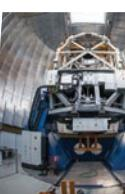

Astronomy is the study of objects seen in the sky. It is an ancient science, dating back perhaps to the time when humans came out of caves to live in the open. They must have felt a sense of wonder and awe as they looked at the sky and observed celestial phenomena like the phases of the moon, eclipses and appearance of different stars in the sky. In the absence of real understanding, humans wove these phenomena in mystery and incorporated them in their myths and religions. Astronomy in India **5**

India, being a very old civilisation, had a strong tradition of astronomy. *Vedas* and other religious texts speculated upon many important questions of astronomy and cosmology. These included questions relating to the origin of the universe, though the discussion was couched in philosophical terms. At the same time, there was a lot of activity in practical astronomy which people needed in their daily lives. For example, people needed to know when rains would come, and they could sow their crops. They also needed to know when they could celebrate marriages, and other ceremonies and festivals. Besides, phenomena like the eclipses and appearance of comets and shooting stars in the sky were believed to bring misfortune to rulers and destruction from wars, natural disasters like floods and earthquakes. Many kings had, in fact, appointed astronomers to keep an eye on the sky and report to them the occurrence of any such astronomical events. Moreover, most people believed in astrology which held that the motion of heavenly bodies and the occurrence of natural phenomena had a profound

5-- Astronomy in India.indd 79 15-10-2020 11:17:24

influence on their destiny. So, it was necessary to follow the motion of heavenly bodies and to track events like eclipses.

Thus, the main preoccupations of the ancient astronomers were—(i) devising calendars and reliable time-keeping devices for measuring time, (ii) predicting time of occurrence and duration of astronomical events such as eclipses, (iii) noting the time of appearance of certain stars in the sky, and (iv) observing the sun, moon and planets.

It is important to note that all these activities required reliable estimates of the distances of the sun, moon and other astronomical objects, as well as the ability to undertake tedious mathematical calculations. Many important contributions were made in these fields for which due credit has perhaps not been given to Indian astronomers by the Western historians of science.

The following section discuss the development of Indian calendar. We will also discuss the phenomena of eclipses and the variation in duration of sunlight in a day over the period of a year. We will chronologically discuss India's contribution in the field of astronomy.

# **Astronomical Practices in India**

Let us consider first, the development of the Indian calendar, often referred to as Hindu calendar, because other communities have their own calendars. The Hindu calendar is used by the majority of Indians, even when there is freedom to use the official Western calendar, which is much simpler to use. In contrast, most other calendars are based either on the movement of the moon alone (lunar calendars), or the movement of the sun alone (solar calendars). The lunar month in the luni-solar Hindu calendar is used for fixing the dates of festivals and other auspicious days, while the solar month is used for regulating day-to-day life of the people. Since the dates of festivals, days for fasting and special worships, are all decided by the phases of the moon, the moon seems to govern much of our social life.

The orbital period of the moon with respect to the stars, called the sidereal period, is 27.3 days. The orbital period observed from the moving earth round the Sun is 29.5 days. Therefore, the lunar month consists of two halves of 15 days each, the dark half (*Kṛṣṇapakṣa* कृष्णपक्ष) starting with the full moon as day one (*ekam* प्रथमा or एकम), and the ् bright half (*Śuklapakṣa* शक्लपक्ष ु ) starting with the new moon day as day one *(ekam*). However, in some calendars, the new moon day is taken as the last day of *Kṛṣṇapakṣa* and the full moon day is taken as the last day of the *Śuklapakṣa*. So, while stating the day of the month, we have to specify

5-- Astronomy in India.indd 80 15-10-2020 11:17:25

whether it falls in the *Kṛṣṇapakṣa* or *Śuklapakṣa*. There is no uniform practice regarding the start of the month; in some regions the month starts on a new moon day, while in other regions the start of the month is reckoned from the full moon day.

To understand the solar month, we would need to understand the concept of stellar constellations. A constellation is a group of stars that resembles the figure of an animal, a figure from a mythical story, or an imaginary object. The point is that each constellation is a familiar figure in the night sky which can be easily identified.

The path of the earth round the Sun is called ecliptic. On both sides of the ecliptic, a belt around 8 degrees wide has been defined as Zodiac, or *Rāśi Cakra*. *Rāśi Cakra* contains 12 constellations. These are known as zodiacal constellations, or *Rāśis*. These constellations and their signs are shown in the figure below. During its annual motion, the Sun takes about a month to cross each constellation.

Another important component of the Indian calendar is *Nakṣatra*. To understand what a *Nakṣatra* is, consider the motion of the moon round the earth. With respect to stars, the orbital period of the moon is 27.3 days. With each day of the lunar orbit, ancient astronomers identified a prominent star and associated it with the moon. These stars are called *Nakṣatras*. In all there are 27 or 28 *Nakṣatras*. The position of the moon is, thus, defined in terms of *Nakṣatras*.

*The constellations of the zodiac. As seen from the earth, in early March the Sun is in Pisces. (I,II, ... in the diagram refers to months January, February, .... respectively while numbers before them refer to dates)*

Astronomy in India 81

5-- Astronomy in India.indd 81 15-10-2020 11:17:25

The Sun takes roughly 30 days to move through a *Rāśi*. The day the Sun enters a *Rāśi* is called *Saṅkrānti* (मकर सं क्रांति). For example, *Makarā Saṅkrānti* (मकर सं क्रांति) is the day when the Sun enters *Makarā Rāśi* (मकर राशि, Capricornus). The length of a solar month in Indian calendar is reckoned from one *Saṅkrānti* to the next. The month is named after the *Nakshatra* seen on the full moon day in that month. For example, the month *Caitra* is named after the *Nakśatra Citrā*. The day in Hindu calendar is defined from one sunrise to the next sunrise. In contrast, the day in Western calendar begins at midnight. As the speed of the Sun in its orbit is not uniform and the sizes of zodiacal constellations are unequal, the length of a solar month in Hindu calendar is also unequal; it can vary from 29 to 32 days.

| Caitra | चैत्र |
| --- | --- |
| Vaiśākha | वैशाख |
| Jyeṣṭḥa | ज्‍येष्‍ठ |
| Āṣāḍha | आषाढ़ |
| Śrāvaṇa | श्रावण |
| Bhādrapada | भाद्रपद |
| - A śvina | आश्विन |
| Kārtika | कार्तिक |
| Agrahāyaṇa | अग्रहायण |
| Pauṣa | पौष |
| Māgha | माघ |
| Phālguna | फाल्नगु |

| Calendar month names in Hindu Calendars |
| --- |

Since a lunar year is about 11 days shorter than the solar year, there is obviously a need to harmonise the two systems, so that important festivals fall during the same period every year and do not drift from season to season, as happens with many calendars. Hindu calendar makers solved this problem by adding a lunar month after every three years.

Purely lunar calendars, such as *Hijri* calendar followed by Muslims, do not have provision to reconcile the lunar year with the solar year. Their festivals and other holy days fall in different seasons. An example is the month of *Ramzan* or *Ramadan*, the month in which Muslims observe fasting for the whole month. *Ramzan* falls sometimes in winter, another time in summer, and yet another time in autumn; it keeps rotating from season to season.

5-- Astronomy in India.indd 82 15-10-2020 11:17:25

 The rules for adding the extra month in the Hindu calendar are complicated. A simplified version of the rule is explained here.

A solar year is about 365.25 days long, while a lunar year is about 354 days long. The difference of 11 days amounts to a month in about 2.7 years. So, in about 3 years it becomes necessary to accommodate one extra month to keep lunar year in step with the solar year. Note that the average length of a solar month is 30 days and 10.5 hours. On the other hand, a lunar month is 29.3 days. Thus, it is possible that there will be solar months which will have two new moons. On such occasions, the two lunar months are given the same name. Of these two lunar months, the one which does not contain a *Sankranti* is called *adhika* (अधिक, extra) month, or *malamāsa*. The year then consists of 13 months. During such a year, all the festivals occur about a month earlier. In the next two years, they drift back to later times in the year. Thus, the festivals oscillate and occur within a range of about one month.

The problem of a festival occurring on two successive days has to do with another element of the Hindu calendar. This one is called astronomical *tithi* (तिथि), or just simply, *tithi*. A *tithi* is a lunar date and determined by the positions of the Sun and the moon at any given time. The duration of a *tithi* is determined by the angular separation between the Sun and the moon as seen from the earth. The next *tithi* begins when their separation changes by 12 degrees. There are in all 30 *tithis*. A *tithi* can change at any time during the day.

The orbits of the Sun and the moon are elliptic. In an elliptic orbit, such as that of the moon around the earth, the orbital speed of an object is not uniform. Moreover, the motion of the Sun and the moon may suffer from various other perturbations. Thus, the duration of *tithis* is not constant. Its duration can vary between 19 and 26 hours. Some *tithis* may be longer than the time from one sunrise to the next (a day according to the Hindu calendar) and some may be shorter than this interval.

Since the *tithis* are of variable duration, quite often there is a change of *tithi* during a day. For example, according to a *Pañcaṅga* of 24 October 2017 for North India, the *tithi* at sunrise (6:27 AM) is fourth *tithi,* which could also be *Pañcami*  and it will change to the fifth *tithi,* which could also be *Caturthi*  during the day.

A school of astronomers believes that the *tithi* at sunrise on a particular day should be considered the *tithi* for the whole day even if it changes to the next during the day. Considering the above example, according to this school of thought, the *tithi* for the whole day would be fourth. Now

Astronomy in India 83

5-- Astronomy in India.indd 83 15-10-2020 11:17:26

- 
- 
- 

imagine that on a particular day the *tithi* at sunrise is N. If this *tithi* is longer than 24 hours, then it is possible that the *tithi* at sunrise next day will still be N. So, according to this school, a *tithi* gets repeated on two days. On the other hand, if the duration of the *tithi* (N + 1) is shorter than 24 hours, then the *tithi* at sunrise next day will be (N + 2); *tithi* (N + 1) will be missing.

The other school of thought believes that cognisance should be taken if a *tithi* changes during the day. According to these people, after 7:06 AM, the *tithi* on 24 October 2017 should be taken as *fifth* (पं चमी), though the *tithi* at the start of the day (sunrise 6:27 AM) was *fourth* (चतर्ुथी). The difference between these two schools is the cause of confusion which results in a festival occurring on two consecutive days, or a festival occurring for a time shorter than a day.

# **Explanation of Eclipses**

While seeking explanation of the eclipses, it must be appreciated that the astronomers needed to realise that the moon has no light of its own and it shines in the light of the Sun. They also needed fairly accurate knowledge of the distances of the Sun and the moon from the earth.

The eclipse of the Sun occurs when the moon comes in between the earth and the Sun. As a result, the light of the Sun does not reach some parts of the earth. An observer in these parts is not able to see a part or the whole of the Sun. The lunar eclipse occurs when the earth comes in between the moon and the Sun. It must be appreciated that these three bodies do not come in contact with one another; only one of these comes in between the other two during their natural motion. This means that there is no change in the Sun during the eclipse and it continues to emit the usual radiation. There is, thus, no way that the Sun emits special rays at the time of an eclipse which can harm us. Yet, this myth is widely prevalent. However, even during a solar eclipse the radiation of the Sun is strong enough to harm our eyes. Therefore, we should take adequate precautions while looking at the Sun.

5-- Astronomy in India.indd 84 15-10-2020 11:17:26

It was observed that the eclipses occur only on the days of full moon or on days of new moon. The correct explanation offered by the astronomers was that the planes of the orbits of the earth and the moon are inclined to each other. The two planes intersect along a line, called the line of nodes. The end points of this line are known as nodes.

Only when the moon is at one of the nodes, can the eclipse occur. At other times, the Sun, moon and the earth are not in a straight line and the light of the Sun cannot be blocked. Incidentally, these nodes were named as *Rahu* and *Ketu*. Those people who did not understand the true significance of these nodal points had woven a myth around them which is still prevalent in some sections of our society. It was said that *Rahu* and *Ketu* are two demons to whom the Sun is indebted. Since the Sun is unable to clear the debt, these two demons appear periodically to ask the Sun to pay up. As the Sun is unable to pay, *Rahu* and *Ketu* devour the Sun and snuff out its light. Not only that, people also indulge in charity at the time of an eclipse to lessen the burden of the Sun. They also blow conches to chase away *Rahu* and *Ketu*.

*Intersection of the orbital planes of the moon and the Sun. The figure shows the line of nodes and the two nodes.*

*Only when earth, moon and the Sun lie in the same plane, can eclipses occur.*

Astronomy in India 85

5-- Astronomy in India.indd 85 15-10-2020 11:17:27

It is also believed that the period of an eclipse is inauspicious as, scientifically, more germs grow due to the absence of sunlight. To ward off the harmful effects of this period, people observe fast and throw away all perishable foods.

# *Uttarāyaṇa* **and** *Dakṣiṇāyana*

Over a period of time it was noted by astronomers that the duration of sunlight in a day varied throughout the year. Longer sunlight hours coincided with the summer season while shorter sunlight periods occurred during the winter season. Further, it was also observed that the position of sunrise changed every day; it drifted towards North, then towards South and again towards North, completing one cycle in one year. It was found that in our part of the world the southward change in the position of sunrise indicated approaching winter, while the northward drift in the position of sunrise meant that summer was approaching. When the Sun started its northward journey after its maximum drift to south, it was said to enter *Uttarāyaṇa*. When the Sun begins to travel towards south from its maximum displacement towards north, it is said to enter *Dakṣiṇāyana*. *Uttarāyaṇa*  was considered an auspicious event; it is celebrated even today as a festive occasion in our country.

There is an interesting story associated with *Uttarāyaṇa*. Bhiṣma, one of the main characters of *Mahābhārata*, was blessed with the power of choosing the time of his death. During the *Mahābhārata* war, Bhiṣma was wounded and lay on a bed of arrows. He declared that he would die only during the auspicious period of *Uttarāyaṇa*. It must be pointed out that about 2000 years back when the foundations of Indian astronomy were being laid, *Uttarāyaṇa* occurred around 14 January. However, due to precession, a slow change in the direction of the axis of earth's rotation, the event has drifted backwards and occurs now around 23 December.

You can also perform a simple activity (given on page 87) to observe how the position of sunrise changes with time.

# **Some Ancient Indian Astronomers**

## **Āryabhaṭṭa**

Āryabhaṭṭa is one of the most well-known ancient Indian astronomers. He was born in 476 C.E. somewhere near modern Patna. His work is compiled in *Āryabhaṭi yam*, perhaps the most influential book in the history of Indian astronomy. It is remarkable that he wrote this treatise when he was only 23 years of age. He introduced the use of large units of time, circular units of arc and units of distance. He

5-- Astronomy in India.indd 86 15-10-2020 11:17:27

## **Activity**

#### **Changing position of the rising Sun—***Uttārayaṇa* **and** *Dakṣiṇāyana*

Choose a convenient place from where the sunrise can be observed and make a mark on the ground. Select a marker, such as a tree or an electric pole, to mark the position of the sunrise as observed from your selected position. Start early in the morning just as the Sun rises. Observe the position of the sunrise with respect to the marker. Repeat observation every week on the same day and at about the same time. It will be a good idea to photograph the rising sun from your chosen position such that the marker is also in the frame in every observation. You would notice that the position of sunrise keeps changing.

If you perform this activity for a whole year, you will find the position of the Sun changes continuously throughout the year. You will find that from the summer solstice, which is around 21 June, the position of the sunrise graudallly shifts towards south.

The time the Sun starts moving towards south marks the beginning of *Dakṣiṇāyana*. It remains in *Dakṣiṇāyana*, that is, it keeps moving towards south, till about 23 December which is the time of winter solstice. Thereafter, the Sun starts moving towards north. It is then said to be the beginning of *Uttarāyana*, the journey of the Sun northwards.

From the above account, it is clear that the tradition of astronomy, particularly practical and utilitarian astronomy, was very strong in ancient India. Indian astronomers were able to explain many phenomena associated with the Sun, moon, and other heavenly bodies. The

Astronomy in India 87

explanation of many phenomena given by our astronomers are very close to what is presently accepted. It must be realised that all the complex calculations that the astronomers performed would not have been possible without parallel development in mathematics, particularly solution of algebraic equations and trigonometry. India boasted of some of the best mathematicians, whose works are now being appreciated in mathematical and scientific circles. The brief biographical sketches of some astronomers and mathematicians highlight many aspects of development in astronomy and mathematics in India.

5-- Astronomy in India.indd 87 15-10-2020 11:17:28

was conversant with many attributes of planets and their orbits including their inclinations to the ecliptic plane and their orbital speeds. He suggested the scheme of adding a month in Indian calendar to reconcile the lunar and solar years. This additional month is known as *adhikamāsa*. We owe him the concept of week days.

Āryabhaṭṭa conceived the idea of celestial sphere to seek the explanation of ecliptic, celestial equator, zodiacal constellations and their relation, occurrence of day and night as also the shape of the earth. It appears that he was convinced that the earth is spherical in shape and rotates on its own axis. This results in the diurnal motion of the stars and planets. He devised a method, unique for his time, of expressing large numbers using alphabets which made it easy to remember them. He was perhaps the first Indian to determine the value of pi (p) up to the first four places of decimal, 3.1416, which is quite close to the present known value. Aryabhatta's work forms the basis for the work of later generations of astronomers. India honoured this illustrious astronomer by naming the first Indian satellite after him.

## **Varāhamihira**

Varāhamihira was a contemporary of Āryabhaṭṭa, born in the beginning of sixth century C.E. When he was quite young, he met Āryabhaṭṭa, and was inspired to make the study of astronomy and astrology as his mission in life. His actual name was Mihira. He earned the title of *Varāha* from the king Vikramāditya because of his expertise in astrology. He studied all the previous systems of astronomy and compiled them into a single treatise, called *Pañcasiddhāntikā*, which facilitated the work of later astronomers. He also compiled a compendium called *Bṛhatsaṁhitā*. He considered *Sūryasiddhānta* to be the best astronomical system among the five systems prevalent at that time. It is remarkable that the revised versions of *Sūryasiddhānta* text are still used for astronomical reference. Varāhamihira is given the credit for stating that the equinoxes shift due to precession by 50.32 seconds of arc per year.

# **Bhāskara I**

Bhāskara I, an eminent astronomer and mathematician of seventh century C.E., was born in 600 C.E., only a few decades after Āryabhaṭṭa. He not only compiled the works of Āryabhaṭṭa and other astronomers, but also commented on *Āryabhaṭi yam*. He improved on the sine series developed by Āryabhaṭṭa. Bhāskara's most important contribution to

5-- Astronomy in India.indd 88 15-10-2020 11:17:28

India in mathematics and astronomy was to establish the method of writing large numbers using positional values. He introduced the symbol circle for zero. The idea of positional values along with zero meant that the symbol for 5 could represent values 5, 50, 500 and so on, depending on where they are placed. His works are contained in two books, *Mahābhāskari ya* and *Laghubhāskari ya*. The second satellite launched by India was named after Bhāskara I.

## **Brahmagupta**

Another great astronomer of ancient India, Brahmagupta, was born in seventh century C.E. His work on mathematics is of great importance, especially, the treatment of zero as a number. It was the first time that zero was recognised as a number. In addition, he dealt with positive and negative numbers, referring to them as fortune and debt respectively. He formulated the rules for addition, subtraction and multiplication of positive and negative numbers between themselves and with zero. These rules are valid even today. He also suggested rules for the combination of fractions. In arithmetic, his work covered the methods of finding squares, square-roots, cubes and cube-roots of integers. He established √10 (= 3.162277) as a good practical approximation for p (= 3.141593). Brahmagupta worked on quadratic equations and showed that a quadratic equation has two roots, one of which could be negative. He provided solutions of quadratic equations with two unknowns, the kind of problem which was attempted first in Europe in seventeenth century by Fermat, almost 1000 years later. Brahmagupta devoted a lot of his time to the development in geometry and trigonometry. He discovered a formula, now known as Brahmagupta formula, dealing with the area of a cyclic quadrilateral. He is also the author of Brahmagupta's theorem which deals with the diagonals of cyclic quadrilaterals. Most of his work is compiled in his famous book *Brahmaguptasiddhānta.*

#### **Bhāskara II**

Bhāskara II, more commonly known as Bhāskarācārya, was born in 1114 C.E. at Bijapur in Karnataka. He was the head of the astronomical observatory at Ujjain, which was at one time headed by the great astronomer and mathematician Brahmagupta. His major work on astronomy is contained in *Siddhāntaśiromaṇi* and *Karaṇakutūhala,* in which he compiled data on planetary positions, conjunctions and eclipses. In these works, he also described mathematical techniques and astronomical equipment used at that time.

Astronomy in India 89

5-- Astronomy in India.indd 89 15-10-2020 11:17:28

Bhāskarācārya compiled the work of Brahmagupta, filling the gaps in his work. He improved the decimal number system and suggested that division by zero is an infinite number. As an example he said that 3/0 = infinite number. He was perhaps the first to suggest the representation of unknown quantities in algebraic expressions by letters, as is the practice today. He also gave the general solution of Pell Equation (*x*2 = 1 + *py*2). His work in mathematics is compiled mainly in two books—*Li lāvati* and *Bi jagaṇita*. He died in 1185 C.E. at Ujjain.

## **Kerala School of Astronomy**

Here we will discuss the Kerala School of Astronomy and Mathematics, which flourished during fourteenth to sixteenth century C.E. During this time, a large number of astronomers and mathematicians were active in solving the problems of practical astronomy, most prominent of these being Parameśvara (1362–1455). Parameśvara mooted the idea of heliocentric model of the solar system, which was developed by Ni lakantha around 1500 C.E. (for comparison, note that the Copernicus' formulation of heliocentric model came in 1543 C.E.). One of the major achievements of the Kerala School was the discovery of a method to develop the infinite series of trigonometric functions. Initially the series were given without proof, but later a proof for power series for sine, cosine and arctangent functions was provided by Jyeṣṭhadeva. These mathematical developments were important for analysing astronomical observations. This was perhaps the first time in the world that a power series of a trigonometric function was developed. More importantly, this happened some 100 years before the development of calculus in Europe by Leibnitz and Newton. The work of Kerala School is now acknowledged worldwide. However, the credit of priority in proposing the heliocentric model of the solar system and the invention of calculus is still denied to Indian astronomers. The denial of the credit of priority in calculus is presumably on the ground that these astronomers developed the power series only for the functions that they needed for their astronomical calculations and did not generalise the method for any function.

# **Later Developments**

During the early eighteenth century (A.D. 1723–1735) massive *yantramantra* or Jantar Mantar observatories were built at Delhi, Jaipur, Ujjain, Mathura and Varanasi by the Maharaja of Jaipur, Sawai Jai Singh. Each of them contains

5-- Astronomy in India.indd 90 15-10-2020 11:17:28

a sundial consisting of a gigantic triangular gnomon, and many other *yantras* for making astronomical observations of planets and stars. Some of the techniques used to calculate planetary positions and eclipses yielded remarkably precise results.

# **Astronomy in Modern India**

We have learned of the contribution of ancient Indian astronomers to astronomy from the pre-vedic time to almost recent times. India has contributed immensely to both. In the modern times also, the progress in astronomy is based on the developments in basic sciences, new technological tools, efficient computing devices, high resolving power telescopes, etc. Like in ancient India, the modern India too is playing a significant role in the development of astronomy worldwide. For example, the Ooty Radio Telescope (ORT)

*Two views of New Delhi's Jantar Mantar* (Courtesy: Michel Danino, IIT Gandhinagar)

has produced results on radio galaxies, quasars, supernovae and pulsars and aided in the discovery of several asteroids, etc. India's satellite Chandrayan-I has recently confirmed the presence of water on moon, and Giant Meter Wave Radio Telescope (GMRT) installed near Pune, discovered the massive supercluster of galaxies, which has been named as Saraswati supercluster.

Indian Institute of Astrophysics (IIA), Bengaluru, has three major observatories. Vainu Bappu Telescope (VBT) at Kavalur, 1 m Carl Zeiss reflecting telescope, and 1.3 m JC Bhattacharya optical telescope. Kodaikanal Observatory was established in 1889 as a Solar Physics Observatory. It has various solar telescopes for the observations and study of the Sun. The third observatory named Indian Astronomical Observatory (IAO) is located at an altitude of 4517 m at

Astronomy in India 91

5-- Astronomy in India.indd 91 15-10-2020 11:17:28

*The Ooty Radio Telescope* (Source: www.rac.ncra.tifr.res.in)

Hanle in Jammu and Kashmir. Its site is one of the world's highest observatory sites. It has 2 m telescope operating in optical and near infrared regions. This telescope is remotely operated from Bengaluru. It is named as Himalayan Chandra Telescope (HCT). IAO also has another telescope called HAGAR, which works in gamma ray region.

 Aryabhatta Research Institute of Observational Sciences (ARIES), Nainital, also has three telescopes: Sampurnanand

*Himalayan Chandra Telescope Observatory* (Courtesy: Dorje Angchuk, IAO, Hanle, figure provided by Indian Institute of Astrophysics, Bengaluru)

92 Knowledge Traditions and Practices of India— Class XI

5-- Astronomy in India.indd 92 15-10-2020 11:17:29

(Source: www.aries.res.in)

Telescope, Devasthal Fast Optical Telescope (DFOT), and Devasthal Optical Telescope (DOT). The DOT is a custom-

built 3.6 m telescope. It is the largest telescope in India for the study of celestial objects at optical wavelengths. It was installed in 2016 at Devasthal, Nainital.

Inter University Center for Astronomy and Astrophysics (IUCAA), Pune, has Giravali Observatory located about 80 km away. The observatory has a reflecting telescope with a mirror of 2 m aperture. This observes radiations in optical and near infra-red regions of the electromagnetic spectrum.

National Center for Radio Astrophysics (NCRA), Pune, is a radio astrophysics research center. It has a Giant Metrewave Radio Telescope (GMRT) near Pune with 30 fully steerable dish type parabolic antennas arranged in Y-shaped array spread over a region of 25 km.

*GMRT array of thirty dishes*

5-- Astronomy in India.indd 93 15-10-2020 11:17:30

*A close-up of a dish*

(Source: gmrt.ncra.tifr.res.in)

The diameter of each antenna is 45 m. Presently, it is the world's largest radio telescope operating at meter wavelength. GMRT started its routine operation in 2000. The signals received from these antennas are synthesised together to gather information about astronomical sources.

Radio Astronomy Center, Ooty, which hosts the Ooty Radio Telescope, is situated near Udhagamandalam (Ooty). It provides stimulating environment for the front-line research in radio astronomy and astrophysics.

Physical Research Laboratory,

Ahmedabad, has two observatories, at Mount Abu and Udaipur in Rajasthan. Mount Abu Infrared Observatory, has a 1.2 m telescope supported with instruments like infrared camera and spectrograph, imaging Fabry-Perot Spectrometer, optical polarimeter, etc. A solar research unit at Udaipur Solar Observatory (USO), Udaipur, has Solar Optical Telescope with 50 cm aperture. This unit is a part of Global Oscillation Network Group (GONG) for studying the Sun throughout the day.

India is also playing a significant role and contributing globally to astronomy. It has become a joint partner for the extremely large telescope, the Thirty Meter Telescope (TMT). TMT will enable the scientists to study fainter objects in the universe. These objects, being far away from us, tell us the state of the universe in the distant past and provide information about the evolution of the universe. Also, it will allow us to study nearby objects in finer details, objects like undiscovered planets and other objects in our Solar System and other such extrasolar systems. This project is expected to benefit Indian industries, and research and development centers. It is expected that the TMT images would be twelve times sharper than those from the Hubble Space Telescope.

A team of Indian Scientists was a part of the group which announced in 2016, the discovery of gravitational waves predicted by Einstein. India is also joining the international group of Laser Interferometer Gravitational-Wave Observatory (LIGO). LIGO is a large-scale experiment to detect cosmic gravitational waves and to develop them as an astronomical tool to study the evolution of the universe.

5-- Astronomy in India.indd 94 15-10-2020 11:17:30

While having thousands of dishes and upto 10 lakhs antennas spread in an area of 12 km, the proposed is designed to survey the entire sky much faster and in much greater detail than any other existing system. India is also a part of the international Square Kilometer Array (SKA) project. Its construction is expected to begin in 2019 in Africa and Australia. Preliminary observations are expected from around 2025.

### **Exercises**

- 1. Write a few sentences on the development of astronomy in India.
- 2. Briefly describe the contribution of Āryabhaṭṭa to astronomy.
- 3. What is the significant contribution of Kerala School to astronomy?
- 4. Why eclipses occur only on full moon day or on new moon day? Explain.
- 5. Explain the importance of *tithi* in Indian Calendar.
- 6. Identify the situations in which solar eclipse and the lunar eclipse occur.
- 7. Explain why the shadows seen in the photographs of eclipses are circular?
- 8. Name a few Indian institutions where research in radio astronomy is carried out.
- 9. List the locations of large optical telescopes in India.
- 10. What is the full form of LIGO? Discuss its importance.
- 11. It is said that astronomy is the study of the past. Comment.
- 12. Name the city where Sawai Jai Singh observatory is built.
- 13. Match the following:

| Sūryasiddhānta | Moon |
| --- | --- |
| Lunar Year | Jantar Mantar observatories |
| Nakśatras | Varāhamihira |
| Nilkantha | 354 days |
| Rāśi | Udaipur |
| GONG | Ecliptic |
| Jai Singh | Heliocentric solar system |

# **Project Ideas**

- 1. Study some of the main instruments of the Jantar Mantar (Delhi or Jaipur) and try to explain their functions and principles. Your project should underline the historical importance and technical principles of the Jantar Mantar. You may prepare a power point presentation.
Astronomy in India 95

5-- Astronomy in India.indd 95 15-10-2020 11:17:30

- 2. Make a list of at least ten major Indian astronomers; mention their contributions and their impact on the society around them.
- 3. Draw a timeline of Indian astronomy, including some of its most famous representatives.
- 4. Look at the night sky and try to identify as many stars and constellations as possible.

## **Extended Activities**

- Make a working model for determining the true North-South direction at your location. For this, you can use the shadows of a stick.
- Draw the different phases of moon at your location on different nights (you may also take photographs!) and then explain the formation of these phases.
- Attempt to make a scale model of the solar system.
- Visit the nearest planetarium and acquire the basic knowledge of astronomy, beginning with our solar system. Reflect on how much the ancients (not just in India) were able to observe and calculate despite having no telescopes.
- Learn to observe the night sky and identify the main constellations (not just the *nakshatras*), both by their international and Indian names.
- Construct a sundial; observe the variations of the shadow not only in the course of the day, but in the course of the year. Indian astronomers researched the equations of the gnomon and shadow extensively; try to refer to some of their research and put it in modern terms.

# **Internet Resources And Apps**

**(All URLS Accessed in October 2018)** 

http://jantarmantar.org www.skyandtelescope.com www.space-india.com; https://www.iiap.res.in; https://www.aries.res.in; https://www.ncra.tifr.res.in; https://www.icts.res.in/program/AS2012; https://nptel.ac.in/courses/121104006/ www.euhou.net; www.ipsindia.org; www.astronomy.com/News-Observing www.astronomynow.com; www.sky-map.org

96 Knowledge Traditions and Practices of India— Class XI

5-- Astronomy in India.indd 96 15-10-2020 11:17:30

http://outreach.as.utexas.edu/marykay/highschool/hs.html

http://galileo.phys.virginia.edu/classes109N/lectures/greek_ astro.htm

https://www.youtube.com/watch?v=n-oITe1dsdU; …= KyExE-GXg54; …=Y7dQoSkoN0g

To study the celestial objects and to and enjoy all the activities that are happening up in the sky, one can simply download stargazing apps on to Android or iOS powered devices. A list of some such Apps is given here:

Stars Chart; Sky View; Distant Suns; NASA App; Pocket Universe; ISS Detector; Star & Planet Finder; Night Sky Lite; Solar Walk; SkySafari 5; SkEye; Heavens-Above;

Stellarium Mobile Sky Map; Satellite Augmented Reality; GoSkyWatch Planetarium; Solar System Explorer 3D; Star Tracker – Mobile Sky Map; SkyMap; ZSD; India Sky Map, etc.

#### **Suggested Readings**

- Basu, B., T. Chatopadhyay and S. Nath Biswas. 2010. *An Introduction to Astrophysics*. 2nd Ed. Prentice Hall, New Delhi.
- Chatterjee, S.K. 2006. *Indian Calendric System*. 2nd Ed. Publication Division, Government of India.
- Macnicol, N. 2003. *Hindu Scriptures: Hymns from the Rigveda, Five Upanishads and the Bhagavadgita*. Indigo Books and Cosmo Publications, New Delhi.
- Rao, S.B. 2000. *Indian Astronomy: An Introduction.* Universities Press, Hyderabad.
- Rao, S.B. 2004. *Indian Mathematics and Astronomy: Some Landmarks*. Jnana Deep Publications, 3rd Ed. Bangalore.
- Sarma, K.V. 1972. *A History of the Kerala School of Hindu Astronomy (in Perspective)*. Vishveshvaranand Institute, Hoshiarpur.
- Sarma, S.R. 2008. *The Archaic and the Exotic: Studies in the History of Indian Astronomical Instruments*. Manohar, New Delhi.
- Sen, S.N. and K.S. Shukla. Eds. 2000. *History of Astronomy in India*. 2nd Ed. Indian National Science Academy, New Delhi.
- Sharma, V.N. 1995. *Sawai Jai Singh and His Astronomy*. Motilal Banarsidass, Delhi.
- Sriram, M.S., K. Ramasubramanian and M.D. Srinivas. 2000. *500 Years of Tantrasangraha: A Landmark in the History of Astronomy*. Inter University Centre and Indian Institute of Advanced Study, Shimla.
- Subbarayappa, B.V. 2008. *The Tradition of Astronomy in India: Jyotihśāstra*. In History of Science, Philosophy and Culture in Indian Civilisation, Centre for Studies in Civilisation, New Delhi, Vol. 4. No. 4.
- Tyson, N.D.G. 2017. *Astrophysics for People in a Hurry*. Higher Education Textbooks.

Astronomy in India 97

5-- Astronomy in India.indd 97 15-10-2020 11:17:30

## **Glossary**

**Astronomy:** The scientific study of the celestial objects, their positions, their motions, their radiations reaching on earth and their nature.

**Eclipse:** The darkening of one non-luminous object by the shadow of another non-luminous object. Solar eclipse or 'eclipse of Sun' occurs when the Sun, the moon, and the earth are in line. In this situation the shadow of the moon falls on the earth. Lunar eclipse or 'eclipse of the moon' is said to occur when the shadow of the earth falls on the moon.

**Sidereal period of a year:** The 'year' of a planet. It is the actual period of its revolution round the Sun. The sidereal period of the earth is 365.256 days. The sidereal period of mars is 686.980 days. The sidereal period of the jupiter is about 12 years.

**Solstice:** The points at which the Sun reaches its greatest declination. The winter solstice is the point (around 23 December) when the position of sunrise gradually shifts towards north. The summer solstice is the point (around 21 June) when the position of sunrise gradually shifts towards south.

**Spectrometer:** In astronomical sense, it is an instrument used for measuring the energy distribution of a particular type of radiation.

**Supercluster:** A supercluster is an association of galaxy clusters and groups. It is composed of a few rich clusters and many poorer groups and isolated galaxies.

5-- Astronomy in India.indd 98 15-10-2020 11:17:31

