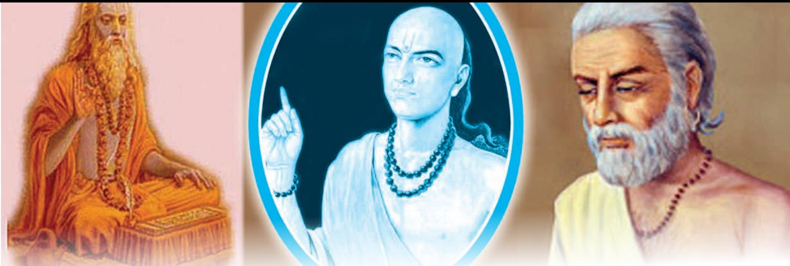

Little is known to us at present regarding the achievements of the early Indian mathematicians and our indebtedness to them. A look at the works done in mathematics by Indians in the ancient period makes one wonder about their achievements. It also makes us realise as to how important it was considered in the ancient period in India. For instance, it is now generally admitted that the decimal place value system of numeral notation was invented and first used by the Indians. Mathematics in India **6**

This chapter will give a fairly good idea about the growth and development of some of the major areas of mathematics in India from the earliest known times down to the seventeenth century of the Christian era.

# **A Glimpse of Ancient India**

The discoveries at Mohenjodaro reveal that as early as 3,000 B.C., the inhabitants of the land of the Sindhu lived a highly organised life. In fact, they were more advanced than any other people of that period. The *Brāhmaṇa* literature (2000 B.C.) which follows the Vedas, is partly ritualistic and partly philosophical. Continuous progress and brilliant achievements were made after this *Brāhmaṇa* period for more than two thousand years. The culture of the science of mathematics or of any other branch of knowledge, was not considered to be a hindrance to spiritual knowledge.

Importance to the culture of *Gaṇita* (mathematics) is also given by the Jainas. Their religious literature includes *gaṇita anuyoga*. The knowledge of *Saṁkhyāna* is stated to

6-- Mathematics in India.indd 99 15-10-2020 11:18:07

be one of the principal accomplishments of the Jaina priest. In Buddhist literature too, arithmetic (*gaṇanā saṁkhyāna*) is regarded as the first and the noblest of the arts. All these will give a fair idea of the importance and value set upon the culture of *gaṇita* in ancient India.

# **Development of Numerical Symbolism**

From the very early times, ten has formed the basis of numeration in India. It is also characteristic of India, that a long series of number names have been found of very high numerals. The reference to the use of numerical denominations as big as 1012 in the *Yajurveda Saṁhitā*  and in several other Vedic works, offer sufficient grounds for concluding that, even at that remote period, the Indians must have possessed a well developed system of numerical symbols. The writings on the inscriptions of Asoka show that in his time the use of numerical symbols in India was quite common.

The variations in the forms of the numerical signs suggest that the symbols had been in use for a long time. The *Brāhmi -* Numerals are a purely Indian invention. Our knowledge of these symbols goes back to the time of King Asoka (300 B.C.), whose vast dominions included the whole of India and extended in the north upto Central Asia. A number of inscriptions containing numerals and dating from A.D. first or second century are found in a cave in the district of Nasik of the then Bombay presidency. The numbers 1, 2 and 3 of the Brahmi notation were denoted by one, two and three horizontal lines placed one below the other.

It is clear now that India has a long tradition of mathematics. However, the period A.D. 500–1200 is extremely interesting in the sense that this is known as the Golden (*Siddhāntic*) period of Indian mathematics. It begins with Aryabhata I, who was born in A.D. 496, a pioneer mathematician known for his systematic collection and systematisation of knowledge, and ends with Bhaskara II born in A.D. 1114 who put the knowledge of mathematics on a solid foundation. The mathematicians in between them— Varāhamihira (A.D. 505), Bhāskara I (A.D. 600), Brahmagupta (A.D. 628), Mahāvi ra (A.D. 850), Śri dhara (A.D. 850), Śri pati (A.D. 1039), were equally famous.

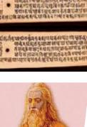

*Āryabhaṭa* Source: *Mathematics*, Class XI, NCERT

6-- Mathematics in India.indd 100 15-10-2020 11:18:08

*Āryabhaṭi ya* of Āryabhaṭa I has two sections—*Daśagtikā*  (some essential parameters on decimal scale and discovery of zero, elements of trigonometry) and *Gaṇita* (eight fundamental operations, plane geometry, algebraical equations and their solutions). Brahmagupta has two sections in his *Brahmasphuṭasiddhānta —Gaṇita* (mathematics) and *Kuṭṭaka* (pulveriser), whereas Bhāskara II wrote two separate works, *Lilāvati-* (mathematics) and *Bijagaṇita* (algebra), which show how the knowledge of mathematics has expanded in volumes in this period.

The symbol for zero was discovered by Āryabhaṭa I (born in A.D. 496) in connection to the decimal expression of numbers. Āryabhaṭa I says, "the vacant places should be filled up with a circle" which looks like '*śūnya*'. This has been illustrated by his commentator Bhaskara I (A.D. 600). This indeed brought a revolution in mathematical computation and simplified the whole technique of expressing numbers with nine numerical symbols and zero.

# **Arithmetic**

Arithmetic forms the major part of *pāṭigaṇita*. The word *pāṭigaṇita* is a compound word formed from the words *pāṭi*, meaning 'board,' and *gaṇita*, meaning 'science of calculation'. Thus it means the science of calculation which requires the use of writing material (the board). The carrying out of mathematical calculations was sometimes called *dhūlikarma* ('dust-work'), because the figures were written on dust spread on a board or on the ground. According to Brahmagupta there are twenty operations and eight determinations in *pāṭigaṇita*. He says: "He who distinctly and separately knows the twenty logistics, i.e., addition, etc., and the eight determinations including (measurement by shadow) is a mathematician." Āryabhaṭa I (A.D. 499) was the first to include a section on mathematics in his Siddhānta, the *Āryabhatiya*. Brahmagupta (A.D. 628) followed Āryabhaṭṭa in this respect, and after him it became the general fashion to include a section on mathematics in a Siddhānta work.

In India conciseness of composition, especially in scientific matters, had greater value in the eyes of the learned. It is for this reason that the Indian treatises contain only a brief statement of the known formulae and results, sometimes so concisely expressed as to be hardly understandable. This compactness is more pronounced in the older works; for instance, the exposition in the *Āryabhaṭi ya* is more compact than in the later works.

The eight fundamental operations of ancient *gaṇita* are: (1) addition, (2) subtraction, (3) multiplication, (4) division, *Brahmagupta*

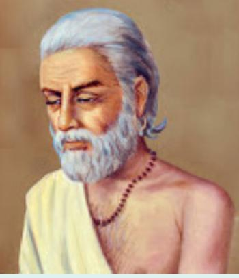

Mathematics in India 101

6-- Mathematics in India.indd 101 15-10-2020 11:18:08

(5) square, (6) square-root, (7) cube and (8) cube-root. Aryabhatta I gave the rules for finding the square and cuberoots only, whilst Brahmagupta gave the cube-root rule only.

That all mathematical operations are variations of the two fundamental operations of addition and subtraction, was recognised by the Indian mathematicians from early times. Bhāskara I states that—"All arithmetical operations resolve into two categories, though usually considered to be four. The two main categories are increase and decrease. Addition is increase and subtraction is decrease. These two varieties of operations permeate the whole of mathematics (*gaṇita*)." So previous teachers have said: "Multiplication and evolution are particular kinds of addition; and division and involution that of subtraction. Indeed every mathematical operation will be recognised to consist of increase and decrease."

### **Addition**

Aryabhata II defines addition as— "The making into one of several numbers is addition". The ancient name for addition is *saṁkalita* (made together). Other equivalent terms commonly used are *saṁkalana* (making together), *miśraṇa* (mixing), *sammelana* (mingling together), *prakṣepaṇa* (throwing together), *saṁyojana* (joining together), *eki karaṇa* (making into one), *yukti, yoga* (addition) and *abhyāsa,* etc. The word saṁkalita has been used by some writers in the general sense of the sum of a series.

In all mathematical and astronomical works, knowledge of the process of addition is taken for granted. Very brief mention of it is made in some later works of elementary character. Thus Bhāskara II says in the Li  lāvati *-* : "Add the figures in the same places in the direct or the inverse order." In the direct process of addition referred to above, the numbers to be added are written down, one below the other, and a line is drawn at the bottom, below which the sum is written. At first the sum of the numbers standing in the units place is written down, thus giving the first figure of the sum. The numbers in the tens place are then added together and their sum is added to the figure in the tens place of the partial sum standing below the line and the result is substituted in its place. Thus the figure in the tens place of the sum is obtained, and so on.

In the inverse process of addition, the numbers standing in the last place (extreme left) are added together and the result is placed below this last place. The numbers in the next place are then added and the process continues. The numbers of the partial sum are corrected, if necessary, when the figures in the next vertical line are added. For instance,

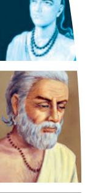

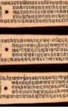

6-- Mathematics in India.indd 102 15-10-2020 11:18:08

if 12 be the sum of the numbers in the last place, 12 is put below the bottom line, 2 being directly below the numbers added; then, if the sum of the numbers in the next place is 13 (say), 3 is placed below the figures added and 1 is carried to the left. Thus, the figure 2 of the partial sum 12 is rubbed out and substituted by 3. Let us find 26 + 57.

### **Direct Process**

| Step 1: | Step 2: | Step 3: |  | Step 4: |  |
| --- | --- | --- | --- | --- | --- |
| 2 6 | 2 6 | 2 6 |  | 2 6 |  |
| + 5 7 | + 5 7 | + | 5 7 | + | 5 7 |
| ________ | ________ | ________ |  | ________ |  |
| 1 3 | 7 13 |  | (7+1) 3 |  | 8 3 |
| Inverse Process |  |  |  |  |  |
| Step 1: | Step 2: | Step 3: |  | Step 4: |  |
| 2 6 | 2 6 |  | 2 6 |  | 2 6 |
| + 5 7 | + 5 7 | + | 5 7 | + | 5 7 |
| ________ | ________ | ________ |  | ________ |  |
| 7 | 7 13 |  | (7+1) 3 | 8 3 |  |

### **Subtraction**

Aryabhata II (A.D. 950) defines subtraction as:

"The taking out (of some number) from the *sarvadhana* (total) is subtraction; what remains is called *Śeṣa* (remainder)." The terms *vyutkalita* (made apart), *vyutkalana* (making apart), *śodhana* (clearing), *patana* (causing to fall), *viyoga*  (separation), etc., have been used for subtraction. The terms *śeṣa* (residue) and *antara* (difference) have been used for the remainder. The minuend has been called *sarvadhana* or *viyojya* and the subtrahend *viyojaka*.

Bhaskara II gives the method of subtraction thus: "Subtract the numbers according to their places in the direct or inverse order." The direct process is explained with the help of an example say, 1000 – 360. Six cannot be subtracted from the zero standing in the tens place, so taking ten and subtracting six from it, the remainder (four) is placed below (six), and this ten is to be subtracted from the next place.

6-- Mathematics in India.indd 103 15-10-2020 11:18:08

For, as the places of unit, etc., are multiples of ten, so the figure of the subtrahend that cannot be subtracted from the corresponding figure of the minuend is subtracted from ten, the remainder is taken and this ten is deducted from the next place. In this way this ten is taken to the last place until it is exhausted with the last figure. In other words, numbers up to nine occupy one place, the differentiation of places begins from ten, so it is known 'how many tens are here in a given number', and therefore, the number that cannot be subtracted from its own place is subtracted from the next ten, and the remainder taken."

The inverse process is similar, the only difference being that "it begins from the last place of the minuend, and the previously obtained partial differences are corrected, if required. The process is suitable for working on a Pāṭi (board) where figures can be easily rubbed out and corrected."

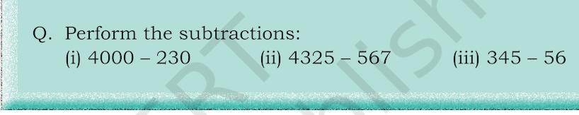

### **Multiplication**

The common Indian name for multiplication is *guṇana*. This term appears to be the oldest as it occurs in Vedic literature. The terms *hanana*, *vadha*, *kṣaya*, etc., which mean 'killing' or 'destroying', have also been used for multiplication. These terms came into use after the invention of the new method of multiplication with the decimal place-value numerals; for in the new method, the figures of the multiplicand were successively rubbed out (destroyed) and in their places the figures of the product were written. Synonyms of *hanana* (killing) have been used by Aryabhata I (A.D. 499), Brahmagupta (A.D. 628), Śri dhara (A.D. 750), and later writers. These terms also appear in the *Bakhshali* manuscript. The ancient terminology proves that the definition of multiplication was 'a process of addition resting on repetition of the multiplicand as many times as is the number of the multiplicator.' This definition occurs in the commentary of the *Āryabhaṭi ya* by Bhāskara I.

The multiplicator was termed *guṇya* and the multiplier as *guṇaka* or *guṇakara*. The product was called *guṇana-phala* (result of multiplication) or *prartyutpanna* ('reproduced', hence in arithmetic 'reproduced by multiplication').

6-- Mathematics in India.indd 104 15-10-2020 11:18:08

### *Methods of Multiplication*

Brahmagupta mentions four methods: (1) *gomutrikā*, (2) *khanḍa*, (3) *bheda,* and (4) *iṣṭa*. Āryabhata II (A.D. 950) did not name the method and stated: "Place the first figure of the multiplier over the last figure of the multiplicand, and then multiply successively all the figures of the multiplier by each figure of the multiplicand."

Śri pati (A.D. 1039) gives the name *kapaṭa-sandhi* and states: "Placing the multiplicand below the multiplier as in the junction of two doors, multiply successively (the figures of the multiplicand) by moving it (the multiplier) in the direct or inverse order."

The following illustrations explain the two processes of multiplication according to the *kapaṭa-sandhi* plan:

**Direct Process:** This method of working does not appear to have been popular. It has not been mentioned by writers after the eleventh century, Śri pati (A.D. 1039) being the last writer to mention it.

### **Example:** Multiply 135 by 12.

The numbers are written down on the *Pāṭi* thus:

12 135

The first (i.e., rightmost) digit of the multiplicand (5) is taken and multiplied with the digits of the multiplier. Thus

5×2= 10; 0 is written below 2, and 1 is to be carried over. Then 5×1=5; adding 1 (carried over), we get 6. The number

5, which is no longer required is rubbed out and 6 is written in its place. Thus, we have:

 12 1360

The multiplier is then moved one place towards the left, and we have:

12

1360 Now, 12 is multiplied by 3. The details are: 3×2=6; this 6 added to the figure 6 below 2 gives 12. 6 is rubbed out and 2 is substituted in its place. 1 is carried over. Then 3×1=3; 3 plus 1 (carried over)=4. 3 is rubbed out and 4 substituted. After the multiplier 12 has been moved to another place towards the left, the figures on the *Pāṭi* stand thus:

12

1420

Then, 1×2=2; 2+4=6; 4 is rubbed out and 6 substituted. 1×1= 1, which is placed to the left of 6.

Mathematics in India 105

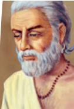

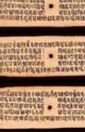

6-- Mathematics in India.indd 105 15-10-2020 11:18:08

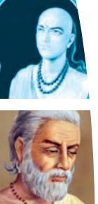

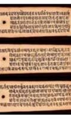

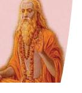

12

1620

As the operation has ended, 12 is rubbed out and the *Pāṭi*  has the product 1620.

Thus the numbers 12 and 135 have been killed and a new number 1620 is born (*pratyutpanna*).

**Inverse Process**: There appears to have been two varieties of the inverse method.

(a) In the first, the numbers are written thus:

12 135

Multiplication begins with the last (i.e., left most) digit of the multiplicand.

Thus 1×2=2; 1 is rubbed out and 2 substituted; then 1×1=1, this is written to the left; the multiplier 12 is moved to the next figure. The work on the *pāṭi* will now be:

> 12 1235

Then, 3×2=6; 3 is rubbed out and 6 substituted; then 3×1=3 and 3+2=5; 2 is rubbed out and 5 substituted in its place. The multiplier having been moved, the work on the *pāṭi*  now is:

12

1565

Now, 5×2= 10; 5 is rubbed out and 0 substituted in its place; then 5×1=5; 5+1=6; 6+6=12; 6 is rubbed out and 2 substituted, and 1 is carried over; then 1+ 5 = 6, 5 is rubbed out and 6 substituted in its place. The *Pāṭi* has now 1620 as the product (*pratyutpanna*). The figures to be carried over are noted down on a separate portion of the *pāṭi* and rubbed out after addition.

(b) In the second method, the partial multiplications (i.e., the multiplications by the digits of the multiplicand) are carried out in the direct manner. These partial multiplications, however, seem to have been carried out in the inverse way, this being the general fashion.

### **Division**

Division seems to have been regarded as the inverse of multiplication. The common Indian names for the operation are *bhāgahara*, *bhājana*, *haraṇa*, *chedana*, etc. All these terms

6-- Mathematics in India.indd 106 15-10-2020 11:18:09

literally mean 'to break into parts,' i.e., 'to divide', except *haraṇa,* which means 'to take away'. This term shows the relation of division to subtraction. The dividend is termed as *bhājya*, *hārya*, etc., the divisor is termed as *bhājaka*, *bhāgahara* or simply *hara*, and the quotient is called as *labdhi, which means*  'what is obtained' or *labdha*.

### *The Method of Long Division*

The following example will serve to illustrate the Indian method of performing the operation on a *pāṭi*:

### **Example:** Divide 1620 by 12.

The divisor 12 is placed below the dividend in this way:

1620 12

The process begins from the extreme left of the dividend, which is 16 in this case. This 16 is divided by 12. The quotient 1 is placed in a separate line. Thus, the partial quotient 1, being written, the procedure is: 1

1620 12

# line of quotients

16 is rubbed out and the remainder 4 is substituted in its place. The subtraction is made by rubbing out figures successively as each figure of the product to be subtracted is obtained, the figures on the *pāṭi* are: 1

420

12

# line of quotients

The divisor 12 is now moved one place to the right giving: 420 1

# line of quotients 12

42 is then divided by 12. The resulting quotient 3 is set in the 'line of quotients', 42 is rubbed out and the remainder 6 substituted in its place. The figures now stand thus:

# 60 13 line of quotients 12

Moving the divisor one place to the right, we have

60 12

After performing the division as before, the resulting quotient 5 is set in the 'line of quotients' and 60 is rubbed out leaving no remainder. The line of quotients has 135, which is the required result.

The above process, when the figures are not obliterated and the successive steps are written down one below the other, it becomes the modern method of long division. The

Mathematics in India 107

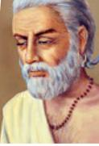

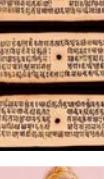

6-- Mathematics in India.indd 107 15-10-2020 11:18:09

method seems to have been invented in India about the fourth century A.D., if not earlier.

- 
- 

### **Fractions**

In the oldest known work, the *Ṛgveda,* the fractions onehalf *(ardha)* and three-fourths *(tri-pāda)* occur. In a passage of the *Maitrāyaṇi Saṁhitā,* are mentioned the fractions one-sixteenth *(kala),* one-twelfth *(kustha),* one-eighth *(sapha)*  and one-fourth *(pāda).* In the earliest known mathematical work, the *Sulbasūtra,* fractions have not only been mentioned, but have been used in the statement and solution of problems.

The occurrence of the fraction three-fourth in the *Ṛgveda*  is probably the oldest record of a composite fraction known to us. The Sanskrit compound *tri-pāda* literally means 'three feet'. Used as a number, it denotes that the measure of the part considered bears the same ratio to the whole as three feet of a quadruped bear to the total number of its feet. The term *pāda,* however, is a word numeral for one-fourth, and the compound *tri-pāda* is formed exactly on the same principle as the English term three-fourth. In the *Sulba,*  unit fractions are denoted by the use of a cardinal number with the term *bhāga* or *aṁśa;* thus *pañca-daśa-bhāga*  (fifteen parts) is equivalent to one-fifteenth, *sapta-bhāga*  (seven parts) is equivalent to one-seventh, and so on. The use of ordinal numbers with the term *bhāga* or *aṁśa* is also quite common, e.g., *pañcama-bhāga* (fifth part) is equivalent to one-fifth. Sometimes the word *bhāga* is omitted, probably for the sake of metrical convenience. Composite fractions like 3/8 and 2/7 are called *tri-aṣṭama* (three-eighths) and *dvi-saptama* (two-sevenths) respectively.

#### **Square**

The Sanskrit term for square is *varga* or *kṛti*. The word *varga*  literally means 'rows' or 'troops' (of similar things). But in mathematics, it 'ordinarily denotes the square power and also the square figure or its area'. Thus Aryabhata I says: "A square figure of four equal sides and the (number representing its) area are called *varga*. The product of two equal quantities is also *varga*."

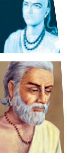

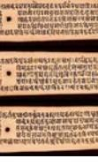

6-- Mathematics in India.indd 108 15-10-2020 11:18:09

The term *kṛti* literally means 'doing,' 'making' or 'action'. It carries with it the idea of specific performance, probably the graphical representation. Both the terms *varga* and *kṛti*  have been used in the mathematical treatises, but preference is given to the term *varga*.

The following is the method of working on the *Pāṭi*, the process beginning from the last place, according to Sridhara, Mahavira, Bhaskara II and others:

**Example:** Find the square of 125.

The number is written down:

125

The last digit from the left is 1. Its square is placed over itself.

#### 1 125

Then twice the last digit (i.e., 1) is 2×1=2; placing it below the rest of the figures (below 2 or below 5 accordingly as per the direct or inverse method of multiplication, whichever is used) and rubbing out the last digit 1, the work on the *pāṭi*  appears as:

- 1 25 2
Performing multiplication by 2 (below, i.e., 25×2 =50) and placing the results over the respective figures, removing out 2, we get:

- 150
25

One round of operation is completed. Next, moving the remaining digits i.e., 25, to the right by one place, we have:

 150 25

Now, the process is repeated, i.e., the square of the last digit (2) is placed over itself (by rubbing 0) giving:

154

 25 Then, placing twice the last digit (i.e., 2×2=4) below the rest of the digits and then rubbing out 2, we have:

154

 5 4

Performing multiplication, 4×5 = 20, and placing it over the corresponding figure 5, (i.e., 0 over 5 and 2 carried to the left), the work on the *pāṭi* appears as:

1560 5

Mathematics in India 109

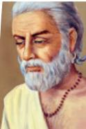

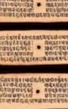

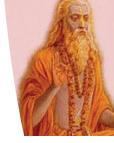

6-- Mathematics in India.indd 109 15-10-2020 11:18:09

Thus, the second round of operations is completed. Then moving 5, we have:

 1560 5

Squaring 5 we get 25, and placing it over 5, replacing 0 (i.e., 5 over 5 and 2 carried to the left), we have:

15625

5

As there are no remaining figures, the work ends.

5 being rubbed out, the *pāṭi* has 15625, the required square.

### **Square-Root**

The Hindi terms for the 'root' are *mūla* and *pāda*. The usual meaning of the word *mūla* in Sanskrit literature is the 'root' of a plant or tree; but figuratively the foot or lowest part or bottom of anything. Its other meanings are basis, foundation, cause, origin, etc. The word *pāda* means 'the lower part of the leg' (figuratively the lower part or basis of anything), foot, part, portion, side, place, cause, a square on a chess-board, etc. The meanings common to both the terms are foot, the lowest part or basis of anything, cause or origin. It is, therefore, quite clear that the Indians meant by the term *varga-mūla*  (square-root) the cause or origin of the square or the side of the square (figure).

The description of the method of finding the square-root is given in the Āryabhaṭi ya very concisely thus:

"Always divide the even place by twice the square-root (upto the preceding odd place); after having subtracted from the odd place the square (of the quotient), the quotient put down at the next place (in the line of the root) gives the root." The method may be illustrated thus:

**Example:** Find the square-root of 54756.

The odd and even places are marked by vertical and horizontal lines. The different steps are then as indicated hereby.

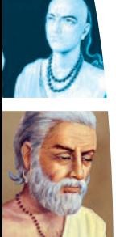

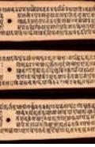

6-- Mathematics in India.indd 110 15-10-2020 11:18:09

| – | – |  |  |  |
| --- | --- | --- | --- | --- |
|  |  |  |  |  |
| 5 4 7 5 6 |  |  |  |  |
| Subtract the square of a 4 |  |  |  | Root = 2 (I) |
| number just less than 5. |  |  |  |  |
| _________ |  |  |  |  |
| Divide by twice the 4) 1 4 (3 |  |  |  | Placing quotient |
| root at I (i.e. 2). 1 2 |  |  |  | at the next place, the |
| _________ |  |  |  | root =23 (II) |
| 2 7 |  |  |  |  |
| Subtract square of the 9 |  |  |  |  |
| quotient i.e., 3 _________ |  |  |  |  |
| Divide twice the root | 46) 18 5 (4 |  |  | Placing quotient at |
| at II (i.e. 23) | 18 4 |  |  | the next place, the |
| _________ |  |  |  | root = 234 (III) |
| Subtract square of the |  | 1 6 |  |  |
| quotient i.e., 4 |  | 1 6 |  |  |
| _________ |  |  |  |  |

The process ends. The root is 234.

# **Geometry**

The oldest known mathematics texts in existence are the *Sulbasūtras* of *Baudhāyana*, *Āpastamba* and *Kātyāyana*, which form part of the literature of the Sūtra period of the later Vedic age. The *Sulbasūtras* had been estimated to have been composed around 800 B.C. But the mathematical knowledge recorded in these sutras are much more ancient; for the *Sūlba*  authors emphasise that they were merely stating facts already known to the composers of the Brāhmaṇas and Saṁhitās of the early Vedic age. The *Sulbasūtras* give a compilation of the results in mathematics that had been used for the designing and construction of the various elegant Vedic fire altars. The altars had rich symbolic significance and had to be constructed with accuracy. The designs of several of these brick-altars are quite interesting, for instance, there are constructions depicting a falcon in flight with curved wings, a chariot-wheel complete with spokes or a tortoise with extended head and legs. In *Sulbasūtra*, the types of triangles namely *Sama*, *dvisama* and *viṣamatribhūja* were basically equilateral, isosceles and scalene triangles.

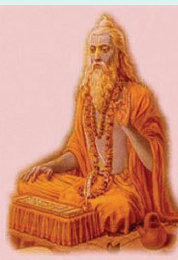

*Baudhayana*

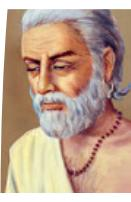

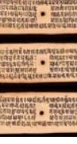

6-- Mathematics in India.indd 111 15-10-2020 11:18:09

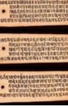

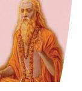

Throughout history, plane geometry has been known to stand on two important pillars having applications: (i) the result popularly known as the 'Pythagoras theorem', and (ii) the properties of similar figures. In the *Sulbasūtras*, a statement of the Pythagoras theorem can be seen alongwith its applications in various geometric constructions, such as construction of a square equal (in area) to the sum, or the difference of two given squares, or to a rectangle.

Āryabhaṭa I gave the correct formulae for area or perimeter of all the common geometrical figures, whereas Brahmagupta gave correct formulae for area of the triangle; also of the cyclic quadrilateral when sides are known, and diagonals of the cyclic quadrilateral.

# **Algebra**

The Indian name for the science of algebra is *Bi jagaṇita*. *Bi ja* means 'element' or 'analysis' and *gaṇita* means 'the science of calculation'. Thus *bi jagaṇita* literally means 'the science of calculation with elements' or 'the science of analytical calculation'. Brahmagupta (A.D. 628) calls algebra *kuṭṭakagaṇita*, or simply *kuṭṭaka*. The term *kuṭṭaka*, meaning 'pulveriser', refers to a branch of the science of algebra dealing particularly with the subject of indeterminate equations of the first degree. It is interesting to find that this subject was considered so important by the Indians that the whole science of algebra was named after it in the beginning of the seventh century. Algebra is also called *avyakta-gaṇita,* or 'the science of calculation with unknowns' (*avyakta*=unknown) in contradistinction to the name *vyakta*-*gaṇita,* or 'the science of calculation with knowns' (*vyakta*=known) for arithmetic including geometry and mensuration.

### **Importance of Algebra**

The early Indians regarded algebra as a science of great utility. In the opening verses of his treatise on algebra, Brahmagupta observes:

"Since questions can scarcely be known (i.e., solved) without algebra, therefore, I shall speak of algebra with examples. By knowing the pulveriser, zero, negative and positive quantities, unknowns, elimination of the middle term, equations with one unknown, factum and the squarenature, one becomes the learned professor (*ācārya*) amongst the learned."

Similarly Bhāskara II (1150 A.D.) writes—"What the learned calculators (saṁkhyāpaka) describe as the originator of intelligence, being directed by a wise being (*satpuruṣa*) and

6-- Mathematics in India.indd 112 15-10-2020 11:18:10

which alone is the primal cause (bi ja) of all knowns (vyakta), I venerate that Invisible God as well as that Science of Calculation with Unknowns... Since questions can scarcely be solved without the reasoning of algebra, not at all by those of dull perceptions I shall speak, therefore, of the operations of analysis." Thus, according to Bhāskara II, algebra may be defined as the science which treats numbers expressed by means of symbols, and in which there is scope and primary need for intelligent artifices and ingenious devices.

### **Origin of Algebra in India**

The origin of algebra in India can be traced back to the period of the *Sulba* (800–500 B.C.) and the *Brāhmaṇa* (2000 B.C.). But it was then mostly geometrical. The geometrical method of the transformation of a square into a rectangle having a given side, which is described in the important *Sulba* is obviously equivalent to the solution of a linear equation in one unknown, viz., ax = c2n. The quadratic equation has its counterpart in the construction of a figure (an altar) similar to a given one but differing in area from it by a specified amount. The usual method of solving that problem was to increase the unit of measure of the linear dimensions of the figure.

Āryabhaṭṭa I also made important contributions in Binomial expansion. These were used to find operations on indices, square, square-root, cube, cube-root, etc.

# **Trigonometry**

Apart from developing the concepts of Algebra, Indians also worked on systematically developing the concepts of Trigonometry that resembled its modern form. They used algebra in its further development.

Although the Greeks founded trigonometry, their progress was halted due to the absence of adequate algebraic machinery and notations. Indians invented the sine and cosine functions, discovered most of the standard formulae and identities, including the basic formula for sin(A ± *B)*  and constructed fairly accurate sine tables. Brahmagupta (A.D. 628) and Govindaswami (A.D. 880) gave interpolation formulae for calculating the sines of intermediate angles from sine tables—these are special cases of the Newton-Stirling and Newton-Gauss formulae for second-order difference (which are studied in advanced classes). Remarkable approximations are given in Indian texts including 3.1416 of Āryabhaṭa I (A.D. 499), 3.14159265359 of Mādhava (A.D. 1500) and 355/113 of Ni lakaṇṭha (A.D. 1500).

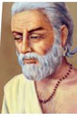

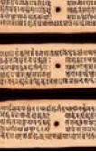

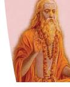

6-- Mathematics in India.indd 113 15-10-2020 11:18:10

Āryabhaṭa I, for the first time defined a right triangle within a quarter-circle and expressed perpendicular and base as function of angle, and expressed perpendicular, jyā or ji va as R Sin*θ*, and base, *ko-jyā* as R Cos*θ*, satisfying the relation (R Sin *θ*) 2 + (R Cos *θ*) 2 = R2, where R is the radius of the circle. He gave the values, R Sin 0° = 0, R Sin 30° = R/√3, R Sin 45° = R/√2, R Sin 60° = R√3/2, R Sin 90° = R.

He further suggested that the Sine values increase in the interval 0≤*θ*≤1, and Cosine values decrease in the same way, i.e., R Cos0° = R and Cos90° = 0. All these facts are studied in modern day Trigonometry also.

### **Exercise**

- 1. How many fundamental operations were known to the ancient mathematicians? What are they?
- 2. Name the Ancient Indian Mathematicians and their period, who worked in Geometry and Trigonometry. Do you find any similarity between the ancient mathematical concepts and the present day mathematical concepts of Algebra, Geometry, and Trigonometry that you study? (You may also refer the literature given in the references).
- 3. (a) Do you think there is any difference in the process of performing the basic operations on numbers in the earlier period and the present system which you studied?
	- (b) Which process do you feel easier? Why? Discuss with your friends.
- 4. Write at least three terms used by ancient mathematicians and give their meanings:

(a) addition

- (b) subtraction
- (c) multiplication
- (d) division
- 5. Find from the literature the concepts in mathematics other than those discussed in this chapter developed by the Indian mathematicians.

### **Bibliography**

- Arya, Vedveer. *Indian Contributions of Mathematics and Astronomy* (from Vedic period to seventeenth century).
- Bag, A. K. 1979. *Mathematics in Ancient and Medieval India.* Chaukhambha Orientalia. Mathematics. p. 344.
- ———. 2012. Mathematics and Mathematical Researches in India during Fifth to Twentieth Centuries—Profiles and Prospects. *Indian Journal of History of Science.* Vol. 47, No.3. pp. 473–512.

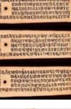

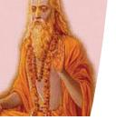

6-- Mathematics in India.indd 114 15-10-2020 11:18:10

- Bag, A.K. and S.R. Sarma. 2003. *The Concept of Sunya*. Indira Gandhi National Centre for The Arts. Indian National Science Academy. Arya Books International.
- Dani, S. G. 2010. Geometry in *Sulvasutras*. In: *Studies in the History of Indian Mathematics.* Cult. Hist. Math. 5. Hindustan Book Agency. New Delhi. pp. 9–37.
- ———. 2012. *Ancient Indian Mathematics—A Conspectus*, Tata Institute of Fundamental Research, Mumbai, pp. 236–246.
- Datta, Bibhutibhusan and Avadhesh N. Singh 1962. *Mathematics: A Source Book, Part I and II*. Asia Publishing House. Bombay, Calcutta, New Delhi, Madras, London, New York.
- Divakaran, P. P. 2016. What is Indian about Indian Mathematics?. *Indian Journal of History of Science.* Vol. 51, No. 1, pp. 56–82.
- Dutta, Amartya Kumar. 2002. Mathematics in Ancient India. Resonance—Journal of Science Education. Vol. 7, No. 4. pp. 4–19.
- Emch, Gerard. G, R. Sridharan and M. D. Srinivas. Eds. *Contributions to the History of Indian Mathematics.*
- Mallayya, V. Madhukar. 2014. Trigonometric Tables In India. *Indian Journal of History of Science.* Vol. 49, No. 2. pp.142–156.
- Plofker, Kim. 2009. *Mathematics in India.* Princeton University Press. Oxford. pp. xiv–357.
- Prakash, Satya and R. S. Sharma. Eds. 1968. *Baudhayana Sulbasutra.* Research Institute of Ancient Scientific Studies. New Delhi.
- Seidenberg, A. 1983. The Geometry of Vedic Rituals. *The Vedic Ritual of the Fire Altar.* Asian Humanities Press, Berkeley. Vol. 2. pp. 95–126.
- Shivakumar, N. and Satyaanshu. 2015. On the History of Indian Mathematics. *International Journal of Innovative Technology and Research.* Vol. 3. No. 2.
- Srinivas, M.D. 2014. 'Pingala's Chandah́sastra'. Lecture 5, *Mathematics in India from Vedic Period to Modern Times.*
- Subramanian, K. Rama and M. D. Srinivas. 2010. Development of Calculus in India. *Studies in the history of Indian mathematics.* Cult. Hist. Math. Hindustan Book Agency. New Delhi. Vol. 5. pp. 201–286.
- T.A., Saraswati Amma. 1979. *Geometry in Ancient and Medieval India.*  Motilal Banarasidas. Delhi.

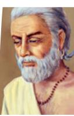

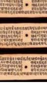

Mathematics in India 115

6-- Mathematics in India.indd 115 15-10-2020 11:18:10

## **Glossary**

*Gaṇita anuyoga:* the exposition of the principles of mathematics

*Kapaṭa-sandhi:* a method of multiplying numbers

*Saṁkhyāna:* the science of numbers, meaning, arithmetic and astronomy

*Sulbasūtra:* The Sanskrit name *Sulbasūtra* or 'Sulva Sūtra' derives from the practice of the surveyors of marking out straight lines close to the ground with cords joined by pegs. We still see bricklayers practising this art, if they want to be sure enough that the wall is straight.

*Yajurveda Saṁhitā:* The *Yajurveda-Saṁhitās* are the prayer-books for the *Adhvaryu* priest who had to do practically all the ritualistic works in a sacrifice.

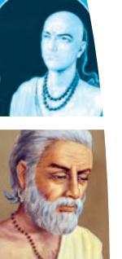

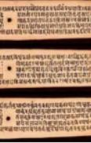

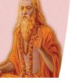

116 Knowledge Traditions and Practices of India— Class XI

6-- Mathematics in India.indd 116 15-10-2020 11:18:10

