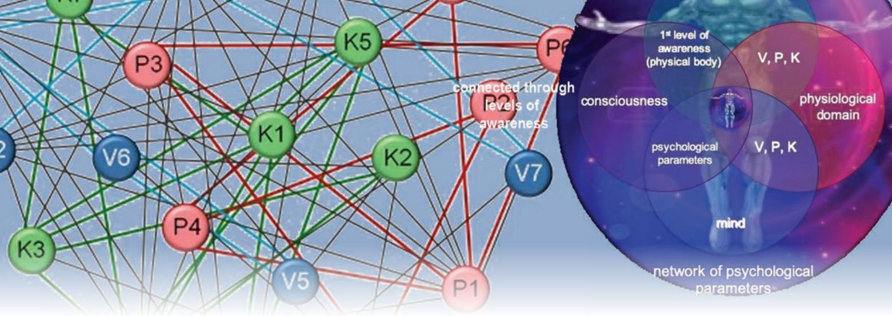

# Introducing *Ā*yurveda The Science of Health and Disease **7**

Welcome to the science of *Āyurveda*, a truly holistic health system encompassing all aspects of well‑being—from physical, physiological and psychological to environmental and ecological health. Literally meaning 'science of life', *Āyurveda* is a vast treasure house of interesting and contemporarily relevant scientific concepts dealing with health and diseases. It is a science which helps optimise one's health enabling a healthy, productive, happy and satisfactory lifespan. While *Āyurveda* emphasises greatly on preventive and promotive health, its comprehensive approach to treatment is in tune with the increasing interest in systemic approach to disease in modern medicine. The world is waking to the vast clinical expertise and wisdom of *Āyurveda*. Let us rediscover this in India too.

## **A Brief History of** *Āyurveda***—Origins Lost in the Mists of Antiquity**

For a very long time, having been the main system of healthcare in India, the beginning of *Āyurveda* is lost in the mists of antiquity. Suffice it to say that codified *Āyurveda* would be at least 4000 years old or 1500 years prior to Hippocrates, the father of Western medicine. *Āyurveda* has its roots in the *Vedas*, considered the oldest writtendown literature in the world from which many theories and philosophies have sprung. The systematised science of *Āyurveda* has resulted from the amalgamation and practical application of these various concepts and doctrines.

2024-25

7--Introducing Ayurveda.indd 117 16-10-2020 16:20:17

## **Oldest healthcare system in the world**

*Āyurveda*'s history and development is closely interwoven with the history and culture of the Indian sub-continent to the extent that ayurvedic thoughts and methods have had a very deep impact on the lifestyle of its people. In practically every household, there was (and still is) an awareness of ayurvedic treatment for common ailments. For example, adding pepper and turmeric (*haldi -* ) in hot milk for common cold and cough is very much based on *Āyurveda*. These are reflected not only in the traditional use of spices and medicinal ingredients in the cuisine but also in the daily activities and religious rituals. *Āyurveda* has had a pervasive influence on the daily life of Indians and continues to do so, and therefore is the longest unbroken health tradition in the world.

## *Āyurveda***, a common science for all biological systems**

Ancient *ṛṣis* studied nature for its underlying patterns and on the basis of this approach, *Āyurveda* has accepted the hypothesis that there are common principles underlying all the microcosms (all living entities) and macrocosm (universe). According to this hypothesis, humans, animals, plants and the universe are composed of the same basic elements and follow the same physical laws. Therefore, *Āyurveda* deals with *manuṣya* (human), *mṛga* (animals) and *vṛkṣa* (plant science or botany) with the same fundamental principles applying to all of them. Ancient Indians gave equal importance to the health of humans, animals and plants alike.

## **Literature in** *Āyurveda*

The ancient ayurvedic physicians were not only astute observers but were keen documenters as well. They had documented their clinical observations and inferences meticulously. In all three branches of *Āyurveda*, namely human (*manuṣya*), plant (*vṛkṣa*) and animal (*mṛga*), a large body of knowledge has been preserved in texts, written not only by the ayurvedic practitioners of yore but also the laterday physicians indicating the continuity of this indigenous medical system. Names of some of the books are given below to give an idea of the extensive documentation done from the days of yore.

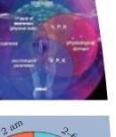

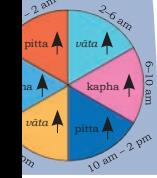

Internal Medicine

Surgery

7--Introducing Ayurveda.indd 118 15-10-2020 14:29:17

## *Manuṣya Āyurveda*

As is evident from the table, rich medical literature was produced by the ayurvedic physicians of ancient period continuously consolidating and validating the knowledge based on millenia of astute clinical observations, documentation and logical inference. Today, as healthcare stakeholders are searching for comprehensive understanding of health and disease management, *Āyurveda* with its systematic documentation is again in the spotlight.

| Books and authors | Some interesting details |
| --- | --- |
| Written in B.C.E. |  |
| Atreya Saṁhitā by | 46,500 verses and 5 adhyayas |
| Atreya | (chapters) |
| Agniveṣa Tantra by | Focuses on internal medicine and |
| Agniveṣa, a disciple of | elaborates on the fundamental |
| Atreya; | principles and management of health |
| this text is now known | and diseases in Āyurveda; translated |
| as Caraka Saṁhitā | into Arabic, Latin, Persian, Chinese, |
| after the redactor | Tibetan, Mongolian and Khotanese; over |
| Caraka | 43 commentaries have been written |
| Suśruta Saṁhitā by | Deals with surgery, anatomy and the |
| Suśruta | topics of contemporary interest such as |
|  | cataract and reconstructive surgery |
| Nimi Tantra by Nimi | Focuses on ophthalmology and surgical |
|  | interventions |
| Harita Saṁhitā by | On general medicine |
| Harita, disciple of |  |
| Atreya |  |
| Bhela Saṁhitā by | Explains brain and mind, and discusses |
| Bhela; disciple of | blood circulation |
| Atreya |  |
| Kaśyapa Saṁhitā by | Only 78 of the 200 chapters are available |
| Kaśyapa | now; the only currently available |
|  | ayurvedic text focusing on pediatrics, |
|  | mother and child care; female doctors |
|  | are mentioned |
| Dhanvantari Saṁhitā, | The author established University of |
| Cikitsā Tattva Vijñāna, | Kāshi; teacher of Suśruta and Nimi |
| Cikitsārpaṇam, |  |
| Cikitsā Darśana, |  |
| - Cikitsā Kaumudi by |  |
| Divodāsa Dhanvantari |  |

| Table 1: Some important literature on Manuśya Āyurveda |
| --- |

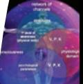

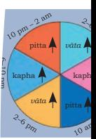

Internal Medicine

*Shalya Tantra*

Head & Neck

Rejuvenation

Surgery

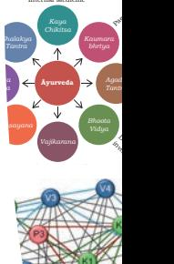

Diseases caused by

Introducing Ayurveda: the Science of Health and Disease 119

7--Introducing Ayurveda.indd 119 15-10-2020 14:29:18

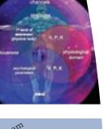

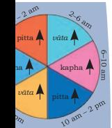

Internal Medicine

Surgery

| Vaidya Sandeha | Books not available now |
| --- | --- |
| Bhañjana and Janaka |  |
| Tantra by Janaka |  |
| Kumāra Tantra by | Other books on paediatrics |
| Rāvana, Parvataka |  |
| Tantra, Bandhaka |  |
| Tantra, Hiranyākṣa |  |
| Tantra |  |
| Vaidyaka Sarvasvam, | Books not available now |
| Aśva (horse) Śāstra |  |
| and Nakula Samhita |  |
| by Nakula |  |
| Vyādhi Sindhu | Books not available now |
| Vimardana and Gavā |  |
| (cow) ayurveda by |  |
| Sahadeva |  |
| Written in C.E. |  |
| Aṣṭāṅga Saṁgraha and | Concise compilation of all ayurvedic |
| Aṣtāṅga Hṛdaya by | knowledge available then and also |
| Vāgbhaṭṭa | updated information on new plants and |
|  | diseases |
| Śāraṅgadhara | Has 3 divisions and 32 chapters; a |
| Saṁhitā by | concise treatise to help ayurvedic |
| Śārangadhārācārya | clinical practice; mentions pulse (nãdi) |
|  | diagnosis and elaborates on preparation |
|  | of medicines |
| Mādhava Nidhān by | Best compilation of the cause and |
| Mādhava | development of diseases, their symptoms |
|  | and the associated complications for easy understanding and diagnosis of |
|  | diseases |
| Bhāva Prakaśa (Bhāva | 80 chapters and 10268 verses; a |
| Miśra) | systematic compilation of available |
|  | information on plants and herbs used |
|  | in medicinal preparations |

## *Vṛkṣa* **(Botany) and** *Mṛga* **(Veterinary)** *Āyurveda*

*Vṛkṣa Āyurveda* explains the life-cycle of plants in addition to prevention and treatment of plant diseases. It discusses, among many other things, the origin of plant from seed, different parts of plants, their structure, functions and diseases afflicting them, rules of plantation, seasons ideal for plantation and harvesting, and ideal agricultural practices. Examples of the books on ayurvedic botany are *Kṛṣi Parāśara*  by *Parāśara* and *Vṛkṣa Āyurveda* by Surapālā.

7--Introducing Ayurveda.indd 120 15-10-2020 14:29:18

Śālihotra, father of Veterinary *Āyurveda*, wrote *Haya Āyurveda* (translated into Persian Arabic, Tibetan and English), *Śālihotra Saṁhitā* a very early Indian treatise on veterinary medicine, *Aśvapraśna Śāstram, Aśvalakṣaṇa Śāstram* and *Aśva Āyurveda.* Pālakāpya wrote on *Hasti Āyurveda* and *Gaja Śāstram*. With this background information on the extensive literature in *Āyurveda*, let us move onto the science of *Āyurveda*, which has eight clinical specialities (*Aśṭāṅga Āyurveda*).

## **Role of Basic Sciences in Medicine**

All medical systems are applied sciences, which have adopted and adapted concepts and theories from basic sciences. For example, modern medicine has used many hypotheses, methods and tools of physics and chemistry for its next step in understanding and managing health and disease. Similarly, the theories and concepts which have influenced *āyurveda* have their basis in 'darśana', the fundamental and codified disciplines of Indian knowledge systems. It is interesting to note that the literal meaning of *darśana* and theory (derived from the Greek word 'theoria') are similar, namely, to 'view or observe'.

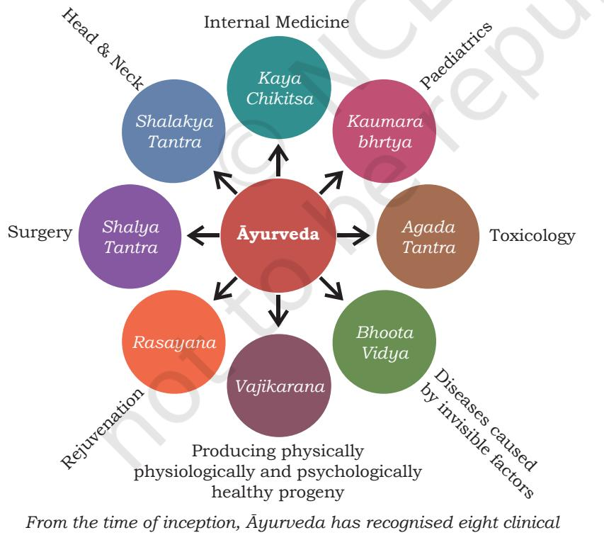

*specialities. Kaumārabhṛtya includes today's discipline of Obstetrics and Gynaecology* 

Introducing Ayurveda: the Science of Health and Disease 121

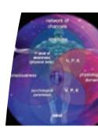

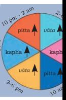

Internal Medicine *Kaya*

Paediatrics

Surgery

Rejuvenation

Head & Neck

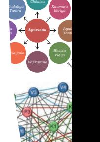

7--Introducing Ayurveda.indd 121 15-10-2020 14:29:18

#### **Western medicine—role of physics**

Physics, one of the most fundamental scientific disciplines, studies energy, matter and laws of nature. This subject has had a profound effect on the study of living systems. Its contribution to discovery of instruments (e.g., microscope, X-ray and other imaging techniques) is well known. But physics has also contributed in a more fundamental and theoretical way. The worldview or understanding of reality put forth by classical (also called Newtonian) physics has played a substantial role in the understanding of living systems and hence modern medicine. The other technical developments in physics has helped catalyse and develop them further.

A Newtonian mechanistic worldview considers the world as being made up of building blocks of atoms and molecules. This became the platform from which human body was viewed and understood. Consequently, modern medicine started regarding the body as made up of building blocks and as a sum of individual parts. In this predominantly structural hierarchical viewpoint, atom is at the lowest level forming the basic building block of the human body. Atoms make molecules, which in turn progressively form cells, tissues, organs and organ systems such as skeletal, endocrine and reproductive and so on. This is called a reductionist perspective since the entire human system is reduced to the fundamental unit of matter for both understanding and management. Reductionism means breaking down of a complex system into smaller parts and studying them separately.

Life is understood in terms of its chemical constituents, and diseases are understood and treated from a structural and chemical perspective. However, there is now a slowly changing perception that the structural and chemical components do not remain in isolation but are in dynamic relationships, which decide the overall functioning of the cells, organs and the organism itself. Western medicine is now striving for an integrated approach to manage health and disease.

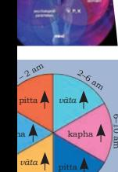

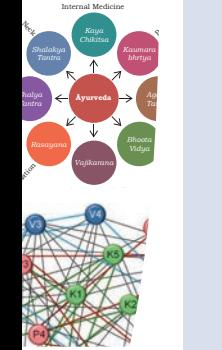

Surgery

7--Introducing Ayurveda.indd 122 15-10-2020 14:29:18

## *Āyurveda***—role of** *darśanas*

Just as Western medicine has adopted concepts from basic sciences, the theories and concepts which have influenced *āyurveda* have their basis in *darśana*, the fundamental and codified disciplines of Indian knowledge systems. The *darśanas* which have contributed to the development of *Āyurveda* are *Vaiśesika*, *Nyāya*, *Pūrva Mi māṁsā*, *Sāṅkhya*, Yoga and *Uttara Mi māṁsā*/*Vedānta*. Some of the theories and concepts from *darśanas* incorporated and used in Āyurveda deal with physical and non-physical realities, creation of universe, life and matter, constituents of physical matter (concept of *anu* or atom as the fundamental particles of the physical world in *Vaiśeṣikadarśana*), mind-bodyconsciousness relationship, 'tridoṣa' (*vāta, pitta, kapha*), *pañcamahābhūtas* (fundamental elements), transformation of substances to form new products, concepts of calculation and measurements (time, weight and length), and methodologies for scientific study and analysis.

*Āyurveda* is, in fact, a melting pot of a number of disciplines, a proof that knowledge was not compartmentalised in ancient India. *Āyurveda* is associated with and draws not only from *darśana* but from other wide-ranging subjects. For example, *vṛkṣa and mṛga āyurveda*, metallurgy (for surgical instruments), civil engineering and architecture (construction of hospitals and pharmacies), chemistry (*Rasa Śāstra)*, astronomy, ethics, water management, mathematics (calculations, units of measurements, weights and measures, concept of time, etc.), culinary science, pharmacology, diet, nutrition and agriculture.

All these form the basic sciences that have given rise to *Āyurveda*'s theoretical framework, under which it has put together an enormous body of observational data accumulated and documented through centuries (Table 1). Using these, *Āyurveda* has developed its own methodologies to diagnose and treat diseases. These well developed theories and practices form the backbone of ayurvedic approach to health and disease. *Āyurveda*'s unbroken chain of experience indicates that its theories and therapies have been tested by thousands of physicians on millions of patients and have stood the test of time.

Internal Medicine *Kaya*

Paediatrics

Surgery

Rejuvenation

Head & Neck

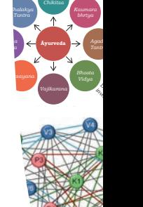

Introducing Ayurveda: the Science of Health and Disease 123

7--Introducing Ayurveda.indd 123 15-10-2020 14:29:18

## **Understanding of Human System in** *Āyurveda*

You all may wonder if there could be another way to understand the human system, other than that of Western medicine. The human body being a very complex biological entity provides a wide scope for multiple perspectives. Classification and categorisation makes it easy to handle complex systems and we know the classification adopted by Western medicine. It is a structure based classification based on Newtonian physics' viewpoint of the nature of reality. Similarly, the Vedic worldview of interconnectedness between everything in the universe is reflected in the way the human system is understood in *Āyurveda*.

*Āyurveda* considers four domains in the human system, which are connected within (intra-connected) and also with each other (inter connected). These are the structural (networked through various physical channels or *srotas* such as blood vessels and nerves), physiological (networked through biophysical properties defined by *vāta*, *pitta* and *kapha* known as *tridoṣa*), psychological (intra-connected by psychological parameters called *mānasikadoṣa*), and the subtlest domain of consciousness (intra connected by the levels of awareness defined by *pañcakoṣa*). The entire human system is thus one connected seamless entity in *Āyurveda*  with even the subtlest domain of awareness connected to

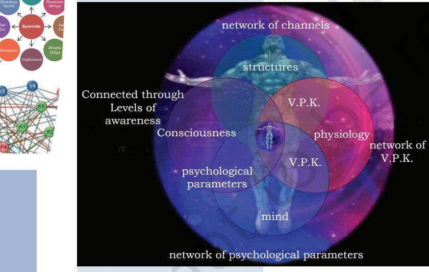

*Humans conceptualised as a seamless indivisible whole with four intra- and inter-connected domains: structural, physiological, psychological, consciousness. V - vāta, P - pitta, K - kapha.*

the gross physical structural domain by the first level of awareness, which is the physical body. The connectedness also extends to environment, world and even cosmic reality.

The core idea of the human system as an interconnected entity, and not merely a structure made of atoms and molecules, is unique to *Āyurveda* and gives it an enormous advantage in dealing with the human system in a holistic way. *Āyurveda* also recognises the importance of the mechanical aspects of human body, this can be inferred from the well developed branch of surgery in those days. *Suśruta*, the ayurvedic surgeon is acknowledged

even by present day surgeons for his surgical procedures of rhinoplasty and otoplasty. Yet, *Āyurveda* is based on principles that go beyond the purely mechanical view, i.e., a vision of wholeness, functional interdependence and integration.

pitta *vāta*

*vāta* pitta kapha kapha

Surgery

Rejuvenation

Head & Neck

Internal Medicine *Kaya Chikitsa Shalakya Tantra Shalya Tantra Rasayana Vajikarana Bhoota Vidya*

Producing physically

healthy progeny

*bhrtya*

Paediatrics

7--Introducing Ayurveda.indd 124 15-10-2020 14:29:18

The hypothesis of interrelatedness finds practical expression in *Āyurveda* through a number of concepts, theories and parameters, which are beyond the scope of this chapter to be elaborated. However, some of these concepts are—*pañcamahābhūta* (fundamental elements of the physical world), *srotas* (channels connecting the entire human system at the gross and subtle levels), *ojas* (responsible for overall vitality, energy, immunity and strength), *tridoṣa* (physicophysiological factors), *sapta dhātu* (structural components of the body), *trimala* (by-products of metabolism), *triguṇa*  (components of the mind and consciousness), *agni* (entity responsible for all digestive and metabolic processes), *prakṛti* (bio-psychological constitution) and the tenet that common principles underlie the microcosm (individual) and macrocosm (universe).

## **Systems Approach of** *Āyurveda* **to Health**

Although, a number of theories are used in *Āyurveda*, the theory of *tridoṣa* [*Vāta (V), Pitta (P) and Kapha (K)*] is fundamental to its understanding and practical management of health and disease. *Āyurveda*'s approach is predominantly functional. For the functional classification, *Āyurveda* has identified three functions, namely, movement (*Vāta*), metabolism and transformation (*Pitta*), and growth and support (*Kapha*).

## **What do we mean by** *vāta***,** *pitta* **and** *kapha***?**

In addition to functions, VPK includes parameters which are biophysical, chemical and physiological in nature. There are ten pairs of opposing properties (*Viṁśatiguṇa*) mentioned in *Āyurveda*:

- (i) cold (*śi ta*) and hot (*uṣṇa*);
- (ii) heavy (*guru*) and light (*laghu*);
- (iii) slow/dull (*manda*) and sharp (*ti kṣṇa*);
- (iv) oiliness (*snigdha*) and dryness (*rukṣa*);
- (v) immobility (*sthira*) and mobility (*sara*);
- (vi) soft (*mṛdu*) and hard (*kaṭhina*);
- (vii) smooth (*ślakṣṇa*) and rough (*khara*);
- (viii) adhesive/sticky (*picchila*) and non-slimy/non-adhesive (*viśada*);
- (ix) viscidity (*sāndra*) and diffusivity/fluidity (*drava*);
- (x) minuteness (*sūkṣma*) and gross (*sthūla*).

These 20 properties, at the opposite ends of a continuum, characterise material bodies and are used in *Āyurveda* to understand them. These properties refer not only to the biophysical properties of the substances but also their effect on the body. For instance, heavy substances are considered

Introducing Ayurveda: the Science of Health and Disease 125

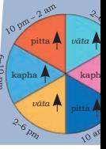

Internal Medicine

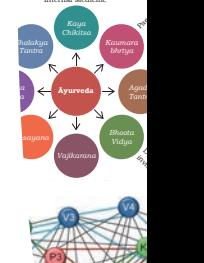

Diseases caused by

Surgery

Rejuvenation

Head & Neck

7--Introducing Ayurveda.indd 125 15-10-2020 14:29:18

*Network of the system properties associated with Vāta (V), Pitta (P) and Kapha (K). The circles correspond to nodes representing the system properties and the lines between nodes refer to the association between properties. Parameters associated with V (V1-V7), P (P1-P7) and K (K1-K7) are coloured differently. The intra-connections are shown in thicker lines with the colour of the corresponding category. The interconnections are shown by dark grey lines. V1 - dryness; V2 - temperature (cold); V3 mobility; V4 - weight (light); V5 - roughness; V6 - nonadhesive; V7 - minuteness; P1 - temperature (heat) ; P2 - penetrative power; P3 fluidity; P4 - pH; P5 - acrid; P6 - causing movement; P7 - lubrication (mild); K1 stability; K2 - smoothness; K3 - lubrication; K4 - viscosity; K5 - temperature (cold); K6 - weight (heavy); K7 adhesion.*

pitta *vāta*

*vāta* pitta kapha kapha

Surgery

Rejuvenation

Head & Neck

Internal Medicine *Kaya Chikitsa Shalakya Tantra Shalya Tantra Rasayana Vajikarana Bhoota Vidya*

> Producing physically physiologically and psychologically healthy progeny

*Kaumara bhrtya Agada*

Paediatrics

difficult to digest and hot materials are understood to produce heat in the body. All the parameters under V, P and K are intra and inter-connected forming a network. The key to health is the stability of these factors in the network. Disease is considered a perturbation of this network.

## **Translation of the theory of VPK to clinical use**

*Āyurveda* has incorporated the theory of VPK in an interesting way to all the factors which have a role in health and disease. Dietary ingredients, plants, physical and mental activities, seasons and clinical symptoms, all of which have a role in health, disease and treatment are classified and explained in terms of V, P and K. For example, wheat (dietary ingredient) increases K; exercise (activity) increases V; autumn (season) increases P; skin disorder (clinical manifestation)—dryness indicates involvement of V, *Pitta* involvement when there is reddishness and burning sensation, and K in case of pruritus and exudation. VPK thus provides a theoretical framework within which all clinical symptoms can be classified and understood. No clinical symptoms lie outside this VPK classification.

#### **Regimens used for health management**

Concepts like *dinacaryā* (daily regimen) and *ṛtucaryā* (seasonal regimen) provide strategies for empowering people to take charge of their health. These deal with the biological rhythms,

which are natural cycle of changes in our body's functions in coordination with the clock of nature as in circadian (24 hour) and circa-annual (1 year periodicity) rhythms. Both these regimens offer methods for preventive and promotive health by taking care of the nature induced changes in the functions and parameters defined under V, P and K. By following the do's and don'ts of these regimens, one can have healthy and productive days and also prevent seasonal diseases.

126 Knowledge Traditions and Practices of India— Class XI

7--Introducing Ayurveda.indd 126 15-10-2020 14:29:19

## **Comprehensive Approach of** *Āyurveda* **to Disease Management**

Health is considered as the balanced interplay between the various functions and parameters whereas disease is understood as a perturbation in V,P,K and hence a functional failure. Because of this, *Āyurveda* 

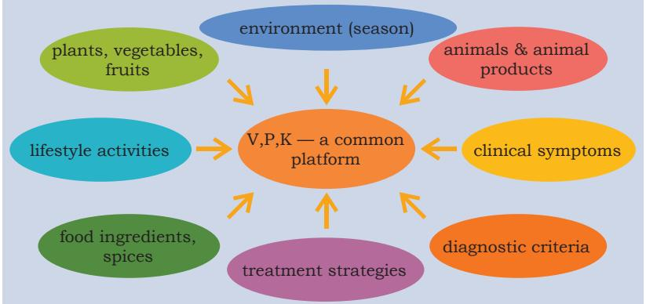

looks beyond the behaviour of individual structures and addresses the biophysical and system properties in an effort to rebalance the system. *Ayurvedic* treatment aims at restoration of the functional balance. The increase or decrease of V,P,K is accompanied by symptoms, which are described in detail in *ayurvedic* texts. For example, wet cough and cold indicate increase of *kapha*. One can infer the state of V,P,K from the symptoms and take corrective measures to bring them back to equilibrium state. This is accomplished by avoiding *kapha* aggravating diet and activities and using medicines made with *kapha* reducing medicinal plants. In addition, care is taken during seasons and times of the day when *kapha* increases.

We have already seen that V,P,K is a common platform for all the health related factors and also clinical symptoms. From a clinical viewpoint therefore, it provides a common interface facilitating easy conversion of all diagnostically and therapeutically relevant parameters enabling a VPK-based diagnosis and treatment. The *ayurvedic* therapeutic strategy is, therefore, different but comprehensive, addressing all causative factors and incorporating all the therapeutically relevant parameters such as medicines, diet and activities. The causative factors include biotic or living (e.g., plants, animals and micro-organisms) and abiotic or non-living (e.g., sunlight, temperature, wind, rain, etc.) components of the environment.

## *Āyurvedic* **Approach to Diet and Nutrition**

Hippocrates said "Let food be your medicine and medicine be thy food". *Āyurveda*, which predates Hippocrates declares the same and goes further to say 'you are what you eat'. The current dismal health scenario and the growing realisation of the importance of diet and lifestyle activities in health reinforces these statements. *Āyurveda* categorically states

Introducing Ayurveda: the Science of Health and Disease 127

*Vāta, Pitta and Kapha provide a common platform for all the factors which play a role in health and disease. Adapted and reprinted from Ref (28) with permission from the Journal Editor.*

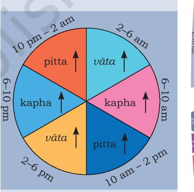

pitta *vāta*

*vāta* pitta kapha kapha

> *Kaumara bhrtya Agada Tantra* **Āyurveda** Toxicology

Paediatrics

Diseases caused by

invisible factors

Internal Medicine *Kaya Chikitsa Shalakya Tantra*

Producing physically physiologically and psychologically healthy progeny

*Rasayana Vajikarana Bhoota Vidya*

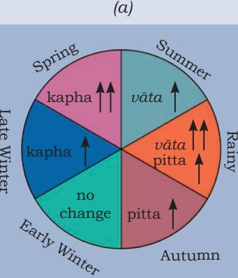

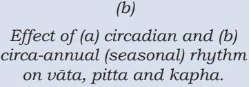

7--Introducing Ayurveda.indd 127 15-10-2020 14:29:19

that improper diet and activities are the causative factors for most diseases and play a vital role in maintenance of health and prevention of diseases.

A balanced diet in *Āyurveda* is one which helps to maintain the equilibrium of VPK and which should include all the six tastes, namely sweet, sour, salt, pungent, bitter and astringent. *Āyurveda* uses functional indices (how the food is functionally relevant to the person) rather than calories to assess nutrition. A number of parameters of practical significance are used to understand the functional, nutritional and therapeutic attributes of food and the ingredients that make it up, e.g., taste, thermogenic (producing heat or burning more calories) property, digestibility of the food, digestive power of the diner, etc. *Āyurveda* also stresses the importance of eating right. Some of the questions it answers are—who can eat what (personalised nutrition), what to eat, how much to eat, when to eat, how to eat (meal plan) and when to eat what (eating seasonally). *Āyurveda* has an indepth knowledge of the nutritional and therapeutic values of daily foods such as rice, wheat, milk, ghee, oil, vegetables, fruits and spices. All food items and ingredients are classified in terms of taste and VPK.

Traditional Indian cooking is based on the time-tested ayurvedic principles. Ingredients like ginger, pepper, turmeric and fenugreek are used not for flavour but for their medicinal properties. Incorporating such spices for cooking dishes with flavour and taste to suit the different climatic conditions and seasons has been the strength of Indian cuisine. Bitter and astringent tastes although beneficial to health, are generally not favoured by dieters due to their unpalatability. Traditional Indian cuisine offers several recipes to increase the palatability of bitter and astringent food substances by cooking or seasoning them with spices and other ingredients which can mask these tastes and at the same time retain their health benefits.

Therapeutic but tasty multi-ingredient foods were designed by incorporating antidotes for ingredients with side effects. For example, the side effects of chilli and pungent spices are tempered by cooking them in oil or ghee while retaining their medicinal properties. Another example is the preparation of wheat halwa—the K increasing property of wheat is countered by cooking in the K pacifier ghee. Ingredients like saffron (*Crocus sativus*) and cardamom (*Elettaria cardamomum*), while reducing K also flavours the sweet dish. Saffron and cardamom, in addition to their antidote role also contribute other medicinal attributes to the halwa. Over centuries, numerous recipes have been

pitta *vāta*

*vāta* pitta kapha kapha

Surgery

7--Introducing Ayurveda.indd 128 15-10-2020 14:29:19

developed across the country taking into account factors such as regional variations in climate, season, vegetation, culture and occupation of people. In depth analysis about the effect of one dietary ingredient on another in Indian cuisine is beyond the scope of this chapter. However, the examples outlined provide sufficient basis to understand how the curative ability of food was in-built in its culinary processing.

## *Āyurvedic* **Pharmacology**

*Āyurveda* has its own pharmacological parameters to understand, explain and put to therapeutic use the medicinal plants. Other sources of medicines in *Āyurveda* are animals, metals and minerals. The concept of *rasa* (generally taken to represent taste as a sensory perception) plays an important role in ayurvedic pharmacology (*Dravyaguṇa Vijñāna)*. *Āyurveda* has categorised plants under six types of *rasa madhura* (sweet), *amla* (sour), *lavaṇa* (salty), *kaṭu* (hot), *tikta*  (bitter) and *kaṣāyā* (astringent). Each plant or plant part can have one or a combination of *rasas*. Together with other biophysical and physico-chemical properties (*guṇa*) and pharmacological potency (*vi rya*), the knowledge of *rasa* of plants, predicts nearly 80% of the pharmacological action from an ayurvedic perspective.

*Āyurveda* uses plant parts in entirety to extract a group of compounds and not single molecules or active principles as in allopathic medicine—for example, water soluble (polar) compounds such as polyphenols, tannins and carbohydrates are extracted in decoction (*Kaṣāya/kvatha*); polar and non-polar compounds like phytoalcohols and terpenes in alcoholic preparations (*ariṣṭa, āsava*); non-polar compounds such as alkaloids and glycosides in lipid based preparations (*ghṛtam, tailam*). The other major difference in the medicinal use of plants between *Āyurveda* and modern medicine is that ayurvedic medicines are mostly multi ingredient formulations and also provides therapeutic nutrition. The therapeutic attributes of ayurvedic medicines probably lies in the combinatorial synergistic effect of the ingredients.

## *Āyurveda* **and Evolving Concepts in Western Medicine**

Western medicine is slowly moving away from its conventional reductionistic and disease-centric approach towards a more inclusive vision of the human system. There is a growing realisation of the role of factors such as diet, nutrition and mind in health and disease. Some of these new concepts with counterparts in *Āyurveda* are discussed in brief.

Introducing Ayurveda: the Science of Health and Disease 129

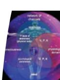

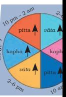

Internal Medicine

*Shalya Tantra*

Head & Neck

Rejuvenation

Surgery

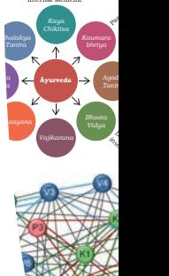

7--Introducing Ayurveda.indd 129 15-10-2020 14:29:19

2024-25

#### **Systems biology**

This new exciting and upcoming field talks of interactions between the components of abiological system, in particular cells and how these interactions give rise to new properties and functions. An example is how the inflammable hydrogen atom combines with oxygen to give rise to water molecule, with fire extinguishing properties. This emerging field explains and uses how information from lower levels (e.g., atoms) limits understanding the complexity of the higher levels (e.g., molecules). It is pertinent to note that *Āyurveda*  talks of how interactions between system properties affect the functioning of the biological system.

## **Personalised medicine**

Western medicine is realising that individual variations in the population limits similar responses to standard treatments. New concepts such as pharmacogenomics, nutrigenomics, etc., which takes into account the genetic variations in the population are being explored to help customise the treatment strategies. *Āyurveda* uses the concept of *prakṛti*  (bio-psychological constitution) for personalisation of both preventive health and treatment.

## **Therapeutic nutrition**

Although food as medicine is not a new concept, modern medicine's focus on disease management had delinked it from this old notion. However, with emerging knowledge of the role and importance of food in many diseases, therapeutic nutrition is beginning to be taken very seriously. The question is how to use food and nutrition not only to boost the body's natural ability to heal but also for preventive and complementary therapy. These concepts are inbuilt into ayurvedic approach to health and disease. It is also pointed out that ayurvedic medicines are also designed for providing therapeutic nutrition.

## **Circadian rhythm**

The 2017 Nobel Prize in Medicine was awarded to elucidation of the molecular mechanisms controlling circadian rhythm. The work showed that there are internal clocks synchronising cellular metabolism and biological rhythms with 24 hour periodicity. This work has brought to the fore the importance of circadian rhythm and its role in health and disease. *Āyurveda*, with its knowledge on circadian and circa-annual rhythms induced changes in VPK shows the translation of this information in management of health and disease.

pitta *vāta*

*vāta* pitta kapha kapha

Surgery

Rejuvenation

Head & Neck

Internal Medicine *Kaya Chikitsa Shalakya Tantra Shalya Tantra Rasayana Vajikarana Bhoota Vidya*

> Producing physically physiologically and psychologically healthy progeny

*Kaumara bhrtya Agada Tantra* **Āyurveda** Toxicology

Paediatrics

Diseases caused by

invisible factors

7--Introducing Ayurveda.indd 130 15-10-2020 14:29:19

## **Ecological health and disease prevention**

Environment is no more viewed as a separate, unconnected domain. Its relationship with individuals and public health are becoming apparent. Ecological health and disease prevention is gaining much attention these days. *Āyurveda*  considers humans as part of nature and connected to it, and hence impact of ecological health on individual and public health is dealt with in detail in *Āyurveda*.

#### **Sustainable medicine**

The aim of sustainable medicine is in ensuring the longterm viability of the medical system, so that high-quality medical services remain available for the health needs of future generations. With spiralling cost of Western medicine, sustainability of the system is gaining increasing attention. Sustainability is at the core of *Āyurveda*, as it spells out its concern about natural resources and emphasises the importance of their harmonious use for human needs. It has provided solutions through its concept of sustainability, low-energy consuming lifestyle and food habits, and preventive health.

## *Āyurveda***— Contemporary Scenario**

The following timeline traces very select and interesting milestones in *Āyurveda* from nineteenth century onwards.

- 1827 Ayurvedic course started in Govt. Sanskrit College, Calcutta
- 1833 Discontinuation of the above mentioned course by the British
- 1920 Indian National Congress resolve to accept āyurveda as India's National Health Care System
- 1921 Āyurveda and Unani Tibbia College established in Karol Bagh, Delhi
- 1927 Āyurveda college established in Banaras Hindu University
- 1970 Indian Medicine Central Council Act, 1970 introduced for regulation of practice and uniform standards of education.
- 1995 Dept of Indian Systems of Medicine and Homoeopathy (ISM&H) created in the Ministry of Health and Family Welfare, Govt. of India.
- 2005 ISM&H renamed as AYUSH (Āyurveda, *Yoga* and Naturopathy, *Unani*, *Siddha* and *Homoeopathy).*

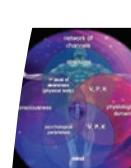

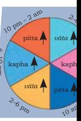

Internal Medicine

Surgery

Rejuvenation

Head & Neck

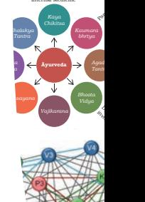

Introducing Ayurveda: the Science of Health and Disease 131

7--Introducing Ayurveda.indd 131 15-10-2020 14:29:19

- 2008 Creation of North East Institute of *Āyurveda* and Homeopathy at Shillong.
- 2010 Creation of Pharmacopoeia Commission of Indian Medicines (PCIM) an independent body under the Dept. of AYUSH.
- 2011 Publication of Ayurvedic Pharmacopoeia of India Part-I, Vol. VIII, containing the quality standards of water and hydro-alcoholic extracts of Ayurvedic drugs. (A major development over the traditional method of using herbs).
- 2014 Department of AYUSH upgraded to Ministry of AYUSH

Among all the systems in AYUSH, *Āyurveda* holds a prominent position. There are more than 250 ayurvedic colleges offering a professional graduate level medical degree in BAMS (Bachelor of Ayurvedic Medicine and Surgery)/*Āyurvedacārya* in India. This 5½ years' course (akin to MBBS) is taken after Class XII with science subjects. Post-graduation in *Āyurveda* (MD) is of three years duration and is offered in select colleges and institutions.

## **Contemporary Importance of** *Āyurveda*

As the world faces increasing chronic, psychosomatic, stress and lifestyle related disorders such as diabetes, cancer, and cardiovascular diseases, *Āyurveda* with its unique perspective, holistic approach, knowledgeable emphasis on diet and lifestyle activities, and time-tested clinical practices, have a crucial role to play. As a health care system, it can empower the individual with a healthy and productive life. *Āyurveda* should not be seen merely as a reminder of a past glory but as an example of Indian knowledge system with contemporary and increasing relevance in present day healthcare and disease-care. Its vast clinical experience and expertise, accumulated and documented over several millennia, should be utilised to benefit the people.

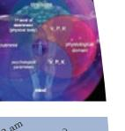

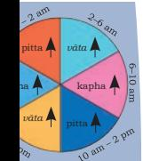

Internal Medicine

Surgery

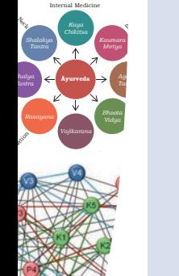

7--Introducing Ayurveda.indd 132 15-10-2020 14:29:19

## **Exercises**

- 1. Explain about the *manuṣya* and *mṛga Āyurveda*.
- 2. What are the eight branches of *Āyurveda*?
- 3. Explain the role of *Vāta*, *Pitta* and *Kapha* in maintenance of biological cycle.
- 4. Name the Ayurvedic surgeon who is also acknowledged in modern surgery.
- 5. What is *tridoṣa* theory?
- 6. What are the Ayurvedic approaches for diet and nutrition?
- 7. Name some Ayurvedic texts written in B.C. and A.D.

## **Activities and Projects**

- 1. Identify medicinal plants in your school.
- 2. Identify medicinal plants in your neighbourhood.
- 3. Find out the Sanskrit names of some common medicinal plants.
- 4. Gather information from your house elders about the medicinally important ingredients used for cooking in your house.
- 5. Work out the role of each ingredient in any of the traditional preparation (for example pickles) from an ayurvedic point of view.
- 6. Find out your prakṛti.
- 7. Collect same plants from different regions and study their differences.
- 8. Find out which of the ancient ayurvedic textbooks are still available and where.

#### **Suggested Readings**

 Ayurvedic Pharmacopoeia of India, Ministry of AYUSH, Govt. of India.

 Gogte VM, Ayurvedic Pharmacology and Therapeutic Use of Medicinal Plants (Dravyagunavignyan), Bharatiya Vidya Bhavan, 2000.

 Jayasundar R, If Systems Approach is th*e Way Fo*rward, What can Ayurvedic Theory of Tridosha Teach us?, CurrSci, 112, 1127–1133, 2017.

> Jayasundar R, Āyurveda: A Distinctive Approach to Health and Disease, Curr Sci, 98, 908-914, 2010.

> Kulkarni PH, The Encyclopaedia of Āyurveda (2 volumes), Indian Books Cente, 2005

 On AYUSH systems from the website of Ministry of AYUSH, Govt. of India, http://ayush.gov.in

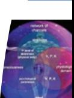

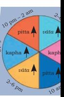

Internal Medicine

*Shalya Tantra*

Head & Neck

Rejuvenation

Surgery

7--Introducing Ayurveda.indd 133 15-10-2020 14:29:19

#### **Bibliography**

- Ayers, D and Day P.J. 2015. Systems Medicine: The Application of Systems Biology Approaches for Modern Medical Research and Drug Development, *MolBiol Intl, 8 pages, Article ID 698169.*
- Ballantyne. J.R. (Translator). 1885. 'The Sankhya Aphorisms of Kapila', Trubner & Co., London, UK.
- Chari, P.S. 2003. Susruta and Our Heritage, *Ind J Plastic Surgery,* Vol. 36, pp. 4–13.
- Cheeran, J.V. 2013. 'Elephantology in Sanskrit', *Gajah,* Vol. 39. pp. 24–29.

Deshpande, V.J. 2008. Glimpses of Āyurveda in Medieval Chinese Medicine, *Ind J History of Science,* Vol. 43, No. 2. pp. 137–161.

- Farrelly, C. 209. Towards a more Inclusive Vision of the Medical Sciences, *Quarterly J Medicine,* Vol. 102. pp. 579–582.
- Fougere, Barbara and Susan G. Wynn. 2007. 'Veterinary Herbal Medicine', *Mosby, Elsevier,* USA, pp. 59–86.
- http://www.iranicaonline.org/articles/jivakapustaka
- https://www.academia.edu/38178368/_Ayūrvedic_or_Traditional _Indian_Medicine_in_Khotanese_Texts
- Jayasundar, R. 2010. Āyurveda: A Distinctive Approach to Health and Disease, *Curr Sci,* Vol. 98. pp. 908–914.
- Jayasundar, R. 2013. 'Ayurvedic Approach to Functional Foods: Introduction to Functional Food Science' (Ed. DM Martirosyan), Food Science Publisher, USA, pp. 454–479.
- Jayasundar, R. 2013. 'Quantum Logic in Āyurveda'. In: *An Integrated View of Health and Well-being: Bridging Indian and Western Knowledge* (Eds. Morandi A and Nambi ANN), Springer, Heidelberg, Germany, pp. 115–139.

Jayasundar, R. 2017. If Systems Approach is the Way Forward, What can Ayurvedic Theory of Tridosha Teach us?, *CurrSci,* Vol. 112. pp. 1127–1133.

Keith, A.B. 1921. *Indian Logic and Atomism: An Exposition of the Nyāya and Vaiseshika Systems,* Oxford University Press, UK.

- Kineman, J.J and K. Anil Kumar. 2007. 'Primary Natural Relationship: Bateson, Rosen, and the Vedas', *Kybernetes,* Vol. 36, pp. 1055–1069.
- Kumar, S.H., Amit K, Jitesh V, Neetu N and Kashyapa Samhita. 2013. Only revered text on Kaumarbhritya (paediatrics), *J Biol Sci Opinion,* Vol. 1, pp. 412–416.
- Mishra, R. and Surapala Vriksh Āyurveda. 2017. A Treatise on Agricultural Technologies, *Intl J Historical Insight and Research,* Vol. 3. pp. 1–16.
- Mukerjee, G.N. 2006. 'History of Indian Medicine', *Chaukhamba Sanskrit Pratisthan,* Delhi.
- Naylor, S and Chen J.Y. 2010. Unraveling Human Complexity and Disease with Systems Biology and Personalised Medicine, *Per Med,* Vol. 7. pp. 275–289.

134 Knowledge Traditions and Practices of India— Class XI

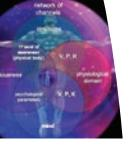

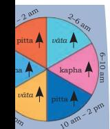

Internal Medicine

Surgery

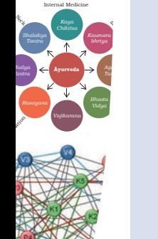

7--Introducing Ayurveda.indd 134 15-10-2020 14:29:20

- Norman, G. 2012. 'The Basic Role of Basic Science in Medicine'. *Adv Health Sci Educ,* Vol.17. pp. 453–456.
- Pandit, Ganganath Jha. Translator. 2018. *The Purva Mimāmsa Sutras of Jaimini,* Parimal Publications, Delhi.
- Ramachandran, C.K. and Nimi Tantra. 1984. Ophthalomology of Ancient India, *AncSci Life,* Vol. 3. pp. 183–187.
- Rao, Ramachandra S. K. 1985. *Encyclopedia of Indian Medicine,* Vol. 1. Popular Prakashan, Mumbai.
- Reductionism in Biology. Stanford Encyclopedia of Philosophy, Feb 21, 2017 (https://plato.stanford.edu/entries/reductionbiology/)
- Sastry, J.L.N. 2004. Dravyaguna Vijnana, Chaukamba Orientalia, Varanasi.
- Schettler, T. 2018. *Toward an Ecological view of Health: An Imperative for the Twenty-first Century,* The Centre for Health Design, California.
- Sharma, P.V. 1992. *History of Medicine in India, from Antiquity to A.D. 1000,* Indian National Academy, Delhi.
- Srikanth, N., Tewari D and Mangal A.K. 2015. *The Science of Plant Life (Vrksha Āyurveda) in Archaic Literature: An Insight on Botanical, Agricultural and Horticultural Aspects of Ancient India, World J Pharmacy & Pharmaceutical Sci,* Vol. 4. pp. 388–404.
- Sud, S and Sud K.S. 2014. 'Glimpses of Veterinary Science in Āyurveda', *Āyurveda J Health,* Vol. 12. pp. 29–33.
- Susruta, Das. S. 2001. 'The Pioneer Urologist of Antiquity', *The J of Urology,* Vol. 165. pp. 1405–1408.
- Sustainable Medicine, Swiss Academy of Medical Sciences, 2012. https://www.samw.ch
- Swami, Prabhavananda, Isherwood C. Translators. 2017. *Patanjali Yoga Sutras, Sri Ramakrishna Math,* Chennai.
- Thakkar, J., Chaudhari S. and P.K. Sarkar. 2011. Ritucharya: Answer to the Lifestyle Disorders, *Ayu,* Vol. 32. pp. 466–471.
- Waghmare, S.S. and Mhaiskar B.G.D. 2014. 'Darshanik Background of Āyurveda'. *Intl Ayu Med J,* Vol. 2. pp. 255–258.
- Welch, C. Environment as Medicine : Vaidyagrama—The Ayurvedic Eco-village, https://drclaudiawelch.com/the-importance-ofenvironment-vaidyagrama-the-ayurvedic-eco-village/
- Welch, W.H. 1908. 'The Interdependence of Medicine and Other Science of Nature', *Science,* Vol. 27. pp. 49–64.
- West, G.B. 2012. The Importance of Quantitative Systemic Thinking In Medicine. *Lancet,* Vol. 379. pp. 1551–1559.
- Wewalwala, S.L. 2011. Āyurveda and Sustainable Development, *Economic Rev,* Vol. 10. pp. 29–32.
- 2017 Nobel prize in physiology or medicine for discoveries of molecular mechanisms controlling the circadian rhythm. https:www.nobelprize. org/prizes/medicine/2017/summary/

Introducing Ayurveda: the Science of Health and Disease 135

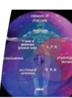

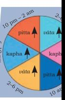

Internal Medicine

Diseases caused by

*Tantra*

Head & Neck

Rejuvenation

Surgery

7--Introducing Ayurveda.indd 135 15-10-2020 14:29:20

#### **Glossary**

**Āyurvedacharya:** A graduate level medical degree awarded after completion of an undergraduate programme (BAMS) in Āyurveda.

**BAMS:** Bachelor of Ayurvedic Medicine and Surgery

**Circadian rhythm:** The internal clocks that synchronise cellular metabolism and generate biological rhythms with 24 hours periodicity.

**Circa-annual rhythm:** biological process in living creatures with approximately one year periodicity in sync with the seasons in nature.

*Darshana***:** a Sanskrit word literally meaning 'to view or observe'. In the context of ancient Indian literature, it refers to the fundamental and codified disciplines of Indian knowledge systems.

*Manushya Āyurveda*: *Āyurveda* dealing with humans.

*Mṛga Āyurveda*: *Āyurveda* dealing with animals.

**Non-polar compounds:** Compounds not soluble in water like fats and oil.

**Polar compounds:** Water soluble compounds such as polyphenols, tannins and carbohydrates, etc.

*Rasa***:** a Sanskrit word literally meaning 'juice or essence'. In the context of ayurvedic pharmacology, it is generally taken to represent taste as a chemosensory perception.

**Rishi:** a Sanskrit term for an accomplished and enlightened person.

*Tridosha***:** Refers to *Vāta, Pitta and Kapha*, concepts fundamental to Āyurveda's understanding and practical management of health and disease. They are defined by certain physiological functions and grouped under them are a set of biophysical, chemical and physiological parameters which impact these functions defined by each of the *tridoshas.* 

*Vṛkṣa Āyurveda***:** *Āyurveda* dealing with plants

pitta *vāta*

*vāta* pitta kapha kapha

Surgery

Rejuvenation

Head & Neck

Internal Medicine *Kaya Chikitsa Shalakya Tantra Shalya Tantra Rasayana Vajikarana Bhoota Vidya*

> Producing physically physiologically and psychologically healthy progeny

*Kaumara bhrtya Agada Tantra* **Āyurveda** Toxicology

Paediatrics

Diseases caused by

invisible factors

7--Introducing Ayurveda.indd 136 15-10-2020 14:29:20

