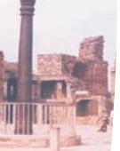
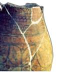

# Chemistry and Metallurgy in India

# **From Alchemy to Chemistry**

Modern chemistry, as we learn it today, evolved from Alchemy and Iatrochemistry during 1300–1600 C.E. Alchemy initially developed in ancient Egypt as a result of their belief in life after death due to which they developed mummification procedures. When Alexander the Great conquered Egypt and Greeks reached Egypt, the Greek philosophers became interested in Egyptian ways. They merged their knowledge about matter with the Egyptian science. In the seventeenth century, Arabs occupied Egypt and named the Egyptian science as *al‑Khemia* which is now seen as a possible origin of the word alchemy. The Greek word *Khumos* has been suggested as an alternate origin for the word alchemy. The alchemy was introduced to Europeans by Arabs who brought it to Spain from where it spread to the rest of Europe. Modern chemistry took shape in eighteenth century in Europe after a few centuries of alchemical traditions. It developed from Alchemy and Iatrochemistry as a result of search for two interesting things:

- 1. Philosopher's stone (*Paras*) which would convert all base metals, e.g., iron and copper into gold.
- 2. 'Elixir of life' which would grant immortality.

Alchemy led to the discovery of amalgams and advances in many other chemical processes and the apparatus required for them. By the sixteenth century, alchemists in Europe had separated into two groups. One group focused on discovery of new compounds and their reactions and the branch of science, now named as chemistry, evolved. The

8--Chemistry and Mettalurgy in India.indd 137 15-10-2020 12:25:00

other group continued to look into spiritual and metaphysical side of alchemy continuing the search of immortality and transmutation of base metal into gold. India and China had their own alchemical traditions.

Archaeological findings of Harappa and Saraswati sites provide ample proof in favour of advanced knowledge in the field of agriculture, irrigation, architecture and production of metals. The hymns of *Yajurveda* and *Ṛgveda* are unsurpassable proof of the antiquity of India's progress in science. These *Vedas* mention the extraction and processing of metals such as gold, silver, copper, tin, lead, iron and their alloys.

In ancient India, chemistry had various names i.e., *Rasāyana Śāstra, Rasatantra, Rasakriyā* or *Rasavidyā.* It included metallurgy, medicine, manufacture of cosmetics, glass, dyes, inks, etc. Ancient Indians applied that knowledge of chemistry in various walks of life.

*Baked bricks* Source: *History Textbook, Our Pasts–I,*  Class VI, NCERT

# **Early Chemical Techniques, Technology and Arts**

The Indus Valley Civilisation or Harrapan civilisation spreads across in India extensively. It spread from Alamgirpur in western Uttar Pradesh (in the East) to Sutkagendor in Makaran and Bhagatrav in South Gujarat (in the West) and from Gumla and Ropar (in the North) to Daimabad in Maharastra (in the South). Indus Valley Civilisation is known for its technological knowledge in variety of fields. Indus Valley people used a number of minerals for a variety

of purposes. Archaeological findings show that baked bricks were used in the construction work. Gypsum cement has been used in the construction work in which lime, sand and traces of CaCO3 have been found.

Archaeological evidences show the mass production of pottery in Indus Valley Civilisation or the Harappan culture, which can be regarded as the earliest chemical process in which materials were mixed, moulded and subjected to fire to achieve desirable qualities. Remains of glazed pottery have been found in Mohenjodaro. Many useful products from the excavation sites are plasters, medical preparations, hair wash products, etc.

Harappans made faience, which is glazed with ceramic. It was used in ornaments. Indus Valley faience was stronger because it was made from partially melted quartz. Although from Egypt or Mesopotamia, faience was produced from easily

8--Chemistry and Mettalurgy in India.indd 138 15-10-2020 12:25:01

available material, a highly specialised technical expertise was needed to process them in finished goods. Efforts of Jonathan Mark Kenoyer to find out the secret of glazing technique show that artisans partially melted powdered rock quartz in high temperature kilns using flux additives made of plant ash. A glassy frit was obtained which was reground into a fine paste and subjected to firing again at around 940 degree celsius to obtain dense glazed faience. His efforts indicated that artisans had mastery over controlling the kiln temperatures.

# **Different Areas of Development in Ancient India**

The major chemical arts and crafts in early period were pottery, jewellery making, dying of cloths, tanning of leather, glass making, etc. Several evidences are available in favour of these in literature and many have been obtained from archaeological excavations.

A number of statements and materials described in the ancient Vedic literature can be shown to agree with the modern scientific findings. Copper utensils, iron, gold, silver ornaments and terracotta discs and painted grey pottery have been found in many archaeological sites in North India. The golden gloss of the northern black polished ware could not be replicated and is still a technological mystery. In the following paragraphs you will learn about some of the areas of development in ancient India.

Source: National Museum, New Delhi *Glazed pottery*

8--Chemistry and Mettalurgy in India.indd 139 15-10-2020 12:25:01

# **Glass Making**

## *Literary Sources*

*Suśruta  Saṁhiṭa*: This mentions about different instruments made of glass crystals and quartz, used in the absence of other instruments. It also mentions about beautiful glass vessels, employed for serving food. Therefore, it can be concluded that by the sixth century B.C.E., glass vessels were manufactured for domestic and other utilitarian purposes.

*Arthaśāstra of Kauṭilya*: According to this book, advance licence fee was imposed for starting glass industry, which was payable in advance like modern surety money. This proves the existence of flourishing glass industry during the Mauryan epoch. It also mentions the use of different kinds of metallic salts and oxides for encrusting the valuable glass.

## *Foreign Travellers' Account*

*Pliny*: His narration about Indian glass industry tells that metallic salts and oxides were used for colouring crystals and the Indian glass industry was superior to those of other countries.

Some of the important conclusions that can be drawn from the close scrutiny of available literary sources are:

- • The antiquity of glass can be traced back to the period from 800 to 500 B.C.E.
- • The glass ornaments were deemed costly and made with remarkable skill. Imitational skills of craftsmen were highly advanced and they could imitate other costly ornaments of jewels, gold, silver or gems.
- • Different varieties of glasses were not only manufactured but also exported to other countries. The glass making industry had avenues in the commercial world.

## *Archaeological Evidences*

A number of glass objects have been found in Maski in South India (1000–900 B.C.E.) and Hastinapur and Taxila (1000–200 B.C.E.) in North India. Glass and glazes were coloured by addition of colouring agents like metal oxides.

According to Jonathan Mark Kenoyer, first evidence for glass beads production at Harappa comes around 1700 B.C.E., which is 200 years before glasses were being made in Egypt.

Archaeological excavations gave evidence of the occurrence of glass from fairly large number of ancient sites. Some of these are Rupar, Alamgirpur, Hastinapur, Maski and sites at Madras district.

8--Chemistry and Mettalurgy in India.indd 140 15-10-2020 12:25:01

From the cumulative evidence of archaeology and literature, it can be legitimately inferred that glass manufacturing had started in India in the first quarter of the first millennium B.C.E.

## **Paints and Dyes**

*Varāhamihira's Bṛhatsaṁhitā* is a sort of encyclopaedia, which was composed in the sixth century C.E. It informs about the preparation of glutinous material to be applied on walls and roofs of houses and temples. It was prepared entirely from extracts of various plants, fruits, seeds and barks which were concentrated by boiling and then treated with various resins. It will be interesting to test such materials scientifically and assess them for use. The paintings found on the walls of Ajanta and Ellora, which look fresh even after ages, testify to a high level of science achieved in ancient India.

A number of classical texts like Atharvaveda (1000 B.C.E.) mention some dye stuffs; the materials used were turmeric, sunflower, madder, orpiment, cochineal, lac and kermes. Some other substances having tinting property were *Kamplcica, Pattanga* and *Jatuka.* According to *Ṛgveda*, tanning of leather and dying of cotton were also practiced during the period 1000–400 B.C.E.

## **Perfumes and Cosmetics**

It appears that the whole range of modern cosmetics was conceived by ancient Indians and material required was obtained from the natural resources then available.

Varāhamihira's *Bṛhatsaṁhitā* gives references to perfumes and cosmetics. Recipes for hair dyeing were made from plants like indigo and minerals like iron powder, black iron or steel and acidic extracts of sour rice gruel.

*Gandhayukti* describes recipes for making scents, mouth perfumes, bath powders, incense and talcum powder.

*Aṣṭāṅga Hridaya,* a 1500 year old book of *Āyurveda*, describes six different formulations to be used in the six seasons of the year for body beautification.

Lot of efforts were taken by ancient researchers to evolve the science of cosmetics. Raja Serfoji who ruled (1788 C.E.–1832 C.E.) in Thanjavur in Tamil Nadu established an institute of medical research called Dhanvantari Mahal and

8--Chemistry and Mettalurgy in India.indd 141 15-10-2020 12:25:02

a great library called Serfoji's Saraswati Mahal at Tanjore. Experiments were conducted in Dhanwantari Mahal. He selected a few thousand efficacious recipes after testing them. They were then given to Tamil pundits to be woven into verse in Colloquial Marathi for the benefit of Marathi speaking people. These recipes are called *Anubhoga Vaidya Bhāga*, which means 'recipe tested by experience'. Many ancient families of Tanjore still possess medicines prepared in the Dhanvantari Mahal, bearing the original seals indicating the sample and the date of its preparation. Raja Serfoji developed a herbarium in his palace which supplied plants to Dhanvantari Mahal for experimentation. He got the paintings of these plants prepared and bound in the book form for future reference.

- 
- 

## **Chemicals in Ancient India**

*Suśruta Saṁhitā* explains the importance of alkalies. The *Caraka Saṁhitā* mentions about ancient Indians who knew how to prepare sulphuric acid and nitric acid; oxides of copper tin and zinc; sulphates of copper, zinc and iron; and the carbonates of lead and iron.

*Rasopaniṣada* describes the preparati*o*n of gun powder mixture. Tamil texts also describe the preparation of fireworks using sulphur, charcoal, saltpetre (i.e., potassium nitrate), mercury, camphor, etc.

Kautilya's *Arthaśāstra* describes the production of salt from sea. Nagarjuna's work *Rasratnākara* deals with the formulation of mercury compounds. He was a great Indian scientist. He was a reputed chemist, alchemist, and metallurgist. He has discussed methods for the extraction of metals like gold, silver, tin and copper.

Cakrapāṇi discovered mercury sulphide. The credit for inventing soap goes to him. He used mustard oil and some alkalies as ingredients for making soap. Indians began making soaps in eighteenth C.E., oil of eranda and seeds of mahua plant and calcium carbonate were used for making soap.

A book *Rasārṇavam* appeared around 800 C.E. It discusses the usage of various furnaces, ovens and crucibles for different purposes. It describes methods by which metals could be identified by flame colour.

142 Knowledge Traditions and Practices of India— Class XI

8--Chemistry and Mettalurgy in India.indd 142 15-10-2020 12:25:02

# **Paper and Ink Making**

Collecting evidences for researching into the history of paper making is difficult as paper is easily destroyed by environment or fungal or insect attack. Very few ancient specimens have survived in the protective environment of *Stūpas* or libraries. In eastern India, manuscript evidence begins from the twelfth century. The earliest evidence of paper manuscripts, probably of Indian origin, with Indian scripts are those that have survived in the stupas of Kuchar in central Asia and in Gilgit in the Karakoram. On palaeographic evidence, these manuscripts have been dated to be of fifth and eight century C.E. According to the account of Chinese traveller I-tsing, paper was known to India in seventh century. A paper manuscript belonging to 1105 C.E. is at the Ashutosh Museum of Calcutta. There are three known accounts of the use of paper in India by travellers who visited India between fifteenth and seventeenth centuries. These three accounts indicate that paper was used in India not only as writing material but also for wrapping common wares and it also seems to be a well known article of export from India.

An ink pot has been obtained in the excavations at Taxila that indicate that ink was used in India from fourth century. Colours of ink were made from chalk, red lead and minium (i.e., *Sindoor*). The recipe for making ink is given in *Rasaratnākara* of Nityanatha. The black ink made from nuts and myrobalans was durable and kept in water in iron pots. It was used in Malabar and other parts of the country. Special ink made from roasted rice, lamp black, sugar and juice of plant kesurte has been used in Jain manuscripts. It seems that in late mediaeval period, Indians knew that tannin solution becomes dark blue-black or greenish by addition of ferric salts. They used this knowledge to make ink.

## **Alcoholic Liquors**

It seems that the process of fermentation was well known to Indians. *Vedas* and Kauṭilya's *Arthaśāstra* mention about many types of liquors. *Caraka Saṁhitā* also mentions ingredients such as barks of plants, stem, flowers, leaves, woods, cereals, fruits and sugarcane for making *Āsavas.*

Chemistry and Metallurgy in India 143

8--Chemistry and Mettalurgy in India.indd 143 15-10-2020 12:25:02

# *Āyurvedic* **Medical System**

In the *Atharvaveda*, plants and vegetables have been recognised as helpful agents for the treatment of diseases. Two great works of Āyurveda period are *Caraka Saṁhitā* and *Suśruta Saṁhitā,* Caraka is older than Suśruta. *Suśruta* is a treatise on surgery and *Caraka* is a treatise on medicine. The texts on Indian alchemy (*rasavidyā*) reveal that a wide variety of inorganic and organic substances were used in the treatment of diseases. Mercury is a metal which has been of great alchemical importance in ancient India. Mercury was passed through 18 processes before it could be used for treatment.

# **Knowledge of Fundamental Concepts of Chemistry**

# **Concept of Atom**

The concept, that matter is ultimately made of indivisible building blocks, appeared in India a few centuries back as a part of philosophical speculations. *Acārya Kanda* born in 600 B.C.E., originally known by the name *Kaśyapa* was the first profounder of the 'atomic theory'. He formulated the theory of very small indivisible particles which he named '*Anu*' (comparable to molecules). He authored the text '*Vaiśeṣika Sūtras*'. According to him all substances are aggregated form of smaller units called atoms (*Paramãṇu*), which are eternal, indestructible, spherical, suprasensible and in motion at the primordial state. He explained that this individual entity cannot be sensed through any human organ. Kaṇāda also added that there are varieties of atoms that are as different as the different classes of substances. He said these could form pairs or triplets (*aṇu*), among other combinations, and unseen forces caused interaction between them. He conceptualised this theory around 2500 years before John Dalton (1766– 1844). John Dalton presented his atomic theory which was a turning point in the study of matter.

## **Nano particles**

The concept of reduction of particle size of metals is clearly discussed in *Caraka Saṁhitā*. Extreme reduction of particle size is now termed as nanotechnology. Nanotechnology and nano science is the study and use of structures between 1 and 100 nanometre size. The 'nanoscale' is typically measured in nanometres, i.e., billionths of a metre. The manipulation and manufacture of materials and devices on the scale of atoms or small groups of atoms is done in this technology.

8--Chemistry and Mettalurgy in India.indd 144 15-10-2020 12:25:02

It can be applied across all the other science fields, such as chemistry, biology, physics, materials science, engineering and medical science. Nanostructures interact with the body at molecular level. Bioavailability of a drug is improved in nano form and the effect of drug toxicity is reduced. *Caraka Saṁhitā* describes the use of *bhasma* of metals in treatment for ailments. It has been proved that the *bhasmas* have nano particles of metals. The scientists in ancient times performed the process of continuous burning and cooling of metals, minerals or gems (in some cases more than 100 times) and mixed with these herbs and other medicinal substances to get rid of toxic effects of these substances. It may be a chance discovery and they may have limited knowledge that the processing changed the physical and chemical properties of the substance i.e., metal, mineral or gem, but the drugs prepared by them were more effective, had quick action and were required in smaller doses. The drugs became more palatable and also had more shelf life. There is urgent need to carry out scientific research to analyse the risk-benefit aspect of these herbo-mineral or metal based medicines.

After the decline of alchemy, Iatrochemistry reached a steady state, but it declined due to the introduction and practice of western medicine in the twentieth century. During this period of stagnation, pharmaceutical industry based on *Ayurveda* continued to exist, but it too gradually declined. It took about 100–150 years for Indians to learn and adopt new techniques. During this time, the foreign products poured in. As a result, indigenous traditional techniques gradually declined.

Modern science appeared on Indian scene in later part of the nineteenth century. By the mid nineteenth century, European scientists started coming to India and modern chemistry started growing up. Modern metallurgy had exponential growth after Industrial Revolution.

# **Metallurgy in India**

For over 7000 years, India has had a high tradition of metallurgical skills. The two important sources for the history of Indian metallurgy are archaeological excavations and literary evidences. The first evidence of metal in Indian subcontinent comes from Mehrgarh in Baluchistan, where a small copper bead was dated to about 6000 B.C.E. It is, however, thought to be native copper, which has not been extracted from ore. Archaeological excavations have shown that Harappan metalsmiths obtained copper ore from Aravalli Hills, Baluchistan or beyond. Many bronze figurines of humans and animals have been unearthed from Harappan sites.

Source: National Museum, New Delhi *The Dancing Girl (Made of bronze, Mohenjodaro)*

Chemistry and Metallurgy in India 145

8--Chemistry and Mettalurgy in India.indd 145 15-10-2020 12:25:02

Systematic excavations at Mohenjodaro in Sindh and Harappa in Punjab show that during the mature Harappan period, the metal workers perfected the metallurgical skill. Harrapans used metals like tin, arsenic, lead, antimony, etc., for alloying. They had also perfected the wax technique of metal casting in as early as the third millennium B.C.E. They melted and forged a variety of objects from metals such as lead, silver, gold and copper. They improved the hardness of copper for making artefacts by using tin and arsenic.

## **Copper**

Copper metallurgy in India dates back to the beginning of Chalcolithic culture in the sub-continent. Copper and bronze were used for making weapons, tools and cheaper ornaments. Copper found at Mohenjodaro contains an appreciable amount of lead and also some objects made of copper which also contain nickel. An alloy of copper and arsenic was also used at Mohenjodaro. Copper was smelted from ore and afterwards refined in clay crucible. The fragment of such crucible with slag sticking at the edges has been found at the excavation of Mohenjodaro.

One of the resource zones for copper was Aravalli range. There are deposits of copper, lead, silver and zinc ores in the Aravalli hills. The copper ore of this region contains 4 per cent to 8 per cent arsenic. Many copper objects obtained from Harappa and Mohenjodaro contains high level of arsenic. This suggests that metal workers of Harappan civilisation obtained copper ore from this region of Aravalli hills. In Rajasthan, the copper mining areas are along the eastern flank of Aravalli hills extending from Bharatpur, Alwar and Khetri region in North East to the South of Udaipur.

There are evidences of deep mining in the Rajpur Dariba in the district Udaipur.

Radiocarbon dating shows that the mines are of the last quarter of the second millennium B.C.E. Large heaps of broken stones have been found near the mining area. It seems that ore bearing rocks were taken to the valley, where they were roasted, crushed, concentrated and smelted.

Now, archaeological and analytical data are available to prove that the objects excavated from later Chalcolithic sites were made in India. A number of axes, chisels and mirrors have been unearthed by archaeological excavations in pre-Harappan settlement sites—Nal, Mehi, and Kot Diji. A chemical analysis of a fragment of an axe from Nal shows that it is made up of 94% pure copper with 5% of nickel in it. This shows that smelters and smiths of the Indian subcontinent, who made these articles, had advanced

8--Chemistry and Mettalurgy in India.indd 146 15-10-2020 12:25:02

knowledge of copper metallurgy. In an excavation in 1962, at chalcolithic site at Ahar near Udaipur in Aravalli Hills, heaps of semi fused glass-like material together with copper tools and quartz in stratified layers were unearthed. Radiocarbon dating of the material shows it to be of the period from 1800 to 1600 B.C.E. Analysis of the glass-like material showed it to be copper metallurgical slag which is the waste product of the copper smelting industry. It establishes the evidence of copper smelting activity in Ahar during Chalcolithic period. More than fifty such sites have been located and some of these are Gilund, Meroli, Kumaria and Kadukota. This also shows that the Indian chalcolithic metal objects were, most probably, indigenously made. Extensive copper ore deposits are located in the Aravalli Hills within the area inhabited by Chalcolithic communities. Aravalli copper ore deposits can, therefore, be considered as the source likely used by the Chalcolithic metal workers. Though chalcopyrite ore is abundant in Aravalli Hills, the percentage of copper is poor in the ore but the percentage of copper in many examined samples was found to be 98 per cent. This purity in copper is equivalent to the purity of present time blister copper. Evidence of ore dressing, roasting, fluxing and extraction of copper consistently in 98 per cent purity prove that advanced stage of metallurgical processes was reached and maintained in Chalcolithic period.

There is fairly extensive evidence for ancient mining of copper ores from Khetri region of Rajasthan in north-western India dating to about the third–second millennium B.C.

#### **Iron**

Recent excavations in the central parts of Ganges Valley and Vindhya Hills have shown that the art of iron smelting and manufacturing of iron artefacts was well known in eastern Vindhyas and it was in use in the Central Ganga Plain. In the recent excavations conducted by Uttar Pradesh State Archeological Department, iron furnaces, artefacts, tuyers and layers of slag have been obtained. Radiocarbon dating places them between 1800 and 1000 B.C.E. The quantity and types of iron artefacts and the level of technical advancements in India indicate that the introduction of iron work took place even earlier.

Asur Munda and Agaria tribes of India have been the main tribes concerned with the manufacture of iron. Agaria tribe practiced iron smelting on large scale. This tribe has been living in Andhra Pradesh, Madhya Pradesh, Eastern Uttar Pradesh, Bihar and Orissa. The ancient practice was considered to be extinct till 1963, when Ghose of TISCO

Chemistry and Metallurgy in India 147

8--Chemistry and Mettalurgy in India.indd 147 15-10-2020 12:25:02

*Ancient iron making furnace, Naikund (700 BCE)*

*inner contours of Agaria iron making furnace* 

located the tribsman at Kamarjoda, Chiglabecha and Jiragora, who could construct their traditional furnace and operate them to produce wrought iron bloom.

These furnaces were meticulously designed and constructed using pre-shaped curved clay bricks. The refractory clay used in the bricks was obtained from the places close to the site of operation.

The design criteria such as shaft taper, bosh to top diameter and bosh angle in these primitive furnaces have been found to be almost same as in modern blast furnaces of 1960–70. The ancient furnaces have relatively large hearth diameter because these produced semi-solid sponge iron and liquid slag instead of molten cast iron and slag because forging operation is not possible on cast iron due to brittleness.

Iron smelting and the use of iron was especially established in South Indian megalithic cultures. The forging of wrought iron seems to have been at peak in India in the first millennium C.E. Greek accounts report the manufacture of steel in India by crucible process. In this process, iron, charcoal and glass were mixed together in a crucible and heated until the iron melted and absorbed the carbon. With the passage of time, blacksmiths of ancient India gained specialised skills in the hot and cold working and hot and cold forge welding. They gained experience about the effect of carbon on the physical properties of iron. They developed the process of carburisation. This resulted in hardening of the material. This process has been known as 'steeling'. This was used for making arrow heads, swords and knives, etc. *Suśruta* (500 B.C.E.) has also described this procedure and heat treatment for making of the surgical knives having such sharp edges that could bisect human hair longitudinally.

India was a major innovator in the production of advanced quality steel. Indian steel was called 'the wonder material of the Orient'. A Roman historian, Quintus Curtius, records that one of the gifts that Porus of Taxila (326 B.C.E.) gave to Alexander the Great, was some two-and-a-half tons of Wootz steel. Wootz steel is primarily iron containing a high proportion of carbon (1.0 – 1.9%). Wootz is the English version of word *'ukku'* which is used in the language in Karnataka and Andhra Pradesh for steel. Literary accounts suggest that Indian Wootz steel from southern part of Indian subcontinent was exported to Europe, China and Arab World. It became prominent in Middle East where it was named as Damascus steel. Michael Faraday tried to duplicate this steel by alloying iron with a variety of metals including noble metals, but failed. *Schematic diagram showing* 

8--Chemistry and Mettalurgy in India.indd 148 15-10-2020 12:25:03

When iron ore is reduced by charcoal in solid state, it forms porous iron blocks. Therefore, reduced iron blocks are also called sponge iron blocks. Any useful product can only be obtained from this material after removing the porosity by hot forging. The iron so obtained is termed as wrought iron. The process control achieved by the ancient iron smelters was so high that they could produce 6–10 tons of wrought iron of almost uniform quality used for the manufacture of objects like the world famous Iron Pillar at Delhi.

Engraved Sanskrit inscription suggests that it was brought here from elsewhere in the Gupta period. The average composition of the components present in the wrought iron of the pillar besides iron are 0.15% C, 0.05% Si, 0.05% Mn, 0.25% P, 0.005% Ni, 0.03% Cu and 0.02% N. The most significant aspect of pillar is that there is no

sign of corrosion in spite of the fact that it has been exposed to the atmosphere for about 1,600 years. High purity of the metal (> 99 per cent) and presence only of traces of injurious elements, and clean environment prevented it from rusting. Also most recently, Balasubramaniam has explained that a composite layer of iron hydrogen phosphate formed on the pillar prevents it from rusting. Rapid industrialisation and the increase in traffic in and around Delhi is raising the sulphurous gases in the environment. If this remains uncontrolled, corrosion may occur and weaken the matrix of the pillar. Another famous iron pillar is located at Mookambika temple in Kodachari Hill in a town near Mangalore. It also belongs to the same period. The iron beams lying in the Surya temple at Konark are still bigger in size. Non corroding iron beams were being used extensively in the construction of temples in Orissa dating back to the sixth and thirteenth centuries C.E.

Evidences of iron smelting are available in North East region also. Radiocarbon dating of charcoal from the iron slag obtained in this region provides evidence of continuous smelting in Khasi Hills. Meghalaya is the earliest iron smelting site studied in the entire region of North East India. The slag layer, which is dated to 2040±80 years BP (253 B.C.E. –A.D. 128) is the remnant of former iron ore excavation and iron manufacturing visible even now in the landscape of Khasi Hills.

*Iron Pillar, Qutub Minar Complex, Delhi* Source: *History Textbook,*  Class VI, NCERT

Chemistry and Metallurgy in India 149

8--Chemistry and Mettalurgy in India.indd 149 16-10-2020 16:21:17

*Zinc retorts from Zawar zinc mines*

#### **Zinc**

There is archaeological evidence of zinc production in Rajasthan at Zawar around the sixth or fifth B.C.E. Due to low boiling point, zinc tends to vaporise while its ore is smelted. As a result, its vapours present in the furnace are reoxidised and the metal is lost. Therefore, zinc is produced by distillation technique. India was the first country to master zinc distillation. The technique used for distillation

in Zawar was designed for downward distillation in which vapours were condensed in a lower container. The distillation of the pallets of roasted ore mixed with charcoal powder, salt, etc., and borax as flux was carried out in brinjal shaped retorts. In excavation at Zawar, these retorts have been found. Each distillation unit had two chambers. Lower chamber was separated from the upper chamber by perforated bricks. Charged retorts were fixed in the perforations with their mouth projecting out in the lower chamber. The mouth of the retort was sealed and fixed in the collecting earthen pots. Earthen pots were kept in the lower chamber of the distillation unit. Earthen pots were dipped in a water trough for cooling the vapours of zinc coming out of the retort. Upper part of the retort was heated by making fire in the upper chamber. Zinc vapours coming in the earthen pot cooled inside it due to cold water surrounding the earthen pot. This technique was also applied to mercury. Indian metallurgists were masters in this technique. This has been described in the Sanskrit texts of fourteenth century.

## **Gold and Silver**

Harappans also used gold and silver as well as their joint alloy electrum. Variety of ornaments such as pendants, bangles, beads, rings, etc., have been found in ceramic or bronze pots. Early gold and silver ornaments have been found from Indus Valley sites such as Mohenjodaro (3000 B.C.E). These are on display in the National Museum, New Delhi. India has the distinction that the deepest ancient mines in the world for gold are in Maski region of Karnataka with carbon dating from mid first millennium B.C.E. A sample of silver containing Ag 94.5; Pb 0.42; Cu 3.68; insoluble 0.38 per cent was found in Mohenjodaro. The process of extracting silver was known to the people of Mohenjodaro.

Hymns of *Ṛgveda* gave earliest indirect references to the alluvial placer gold deposits (i.e., deposits of gold minerals formed in stream) in India. The river Sindhu was an important source of gold in ancient times. It is interesting

8--Chemistry and Mettalurgy in India.indd 150 15-10-2020 12:25:03

that the availability of alluvial placer gold in the river Sindhu has been reported in modern times also. It has been reported that there are even now, great mines of gold in the region of Mansarovar and in Thokjalyug. The *pāli* text *Aṅguttara Nikāya* narrates the process of the recovery of gold dust or particles from alluvial placer gold deposits. Although evidence of gold refining is available in vedic texts, it was Kauṭilya *Arthaśāstra*, authored probably in third or fourth century B.C.E., during Mauryan era, which has much data on the prevailing chemical practices in a long section on mines and minerals including metal ores of gold, silver, copper, lead, tin and iron. Kauṭilyas' *Arthaśāstra* describes a variety of gold called *rasviddhā*, which is naturally occurring gold solution, Kalidas also mentioned about such solutions. It is astonishing how people recognised such solutions.

The native gold (i.e., gold found in nature) has different colours depending upon the nature and amount of impurity present. It may be that the different colours of native gold were a major driving force for the development of gold refining.

# **Disappearance of Metallurgical Skills**

India's prosperity was drastically harmed in the period of Turkish invasion. Turkish rulers carried away the country's riches to Islamic countries and enslaved men, women as well as artisans. In Mughal period, surviving artisans in the remote places of the country were patronised and were resettled in new places. Under the Mughal patronage, the iron workers of Gujarat and Deccan began making forged iron guns and fire arms as well as a variety of war weapons and armours.

Cottage iron making was flourishing by the end of nineteenth and early twentieth century. The iron production was taking shape of an organised industry. In 1852, Oldham had reported working of 70 iron making furnaces in Birbhum district. These large furnaces could produce 2 tonnes of iron per furnace at the cost of `17 only. However, these industries could not last long. The British representatives took over the local industries. Inspite of the better quality of Indian iron and steel, they began to import British and Swedish iron and levy heavy tax on local produce. European and British governments established their own industries. In order to supply raw material to these industries, British government began exporting high grade iron ore from India and banned iron and steel-making in India. The British government also began to import finished iron and steel machinery and levied high taxes on the Indian produce. Thus the tribal art of iron and Wootz steel making was almost stopped. Similar fate was of zinc production also.

Chemistry and Metallurgy in India 151

8--Chemistry and Mettalurgy in India.indd 151 15-10-2020 12:25:03

## **Exercises**

- 1. Which materials were used to make the colour of inks?
- 2. How was the concept of atom described in early Indian philosophical system?
- 3. Justify that copper metallurgy in India has indigenous origin.
- 4. What makes the extraction of zinc difficult? How did the Indian smelters carry out the process of smelting of zinc?
- 5. How can one show that the smelters and smiths of Indian sub-continent had advanced knowledge of copper metallurgy?
- 6. What caused the decline of knowledge of metallurgical skills in India?
- 7. Why iron pillar of Delhi has not rusted even after exposure to moist air for so many years?

## **Extended Activities**

- Collect information about the methods used to purify zinc in ancient time and today.
- Collect pictures and documents related to the historical background of two rust resistant monuments erected in India.
- Collect information about ancient Indian knowledge in the field of cosmetics.
- Collect information about ancient Indian knowledge in the field of drugs.

## **Bibliography**

- Brotherton, P.N and F.W. Preece. 1995. Science Process Skills: *Their Nature and Interrelationship.* Research in Science & Technological Education, Vol. 13, pp. 5–11.
- Chittrabrata, Patil and Nupur Dasgupta. Eds. 2009. An Ancient Indian System of Rasayana Suvarnatantra: *A Treatise on Alchemy,* pp. 45–46, Kalpaz Publications, New Delhi.
- Garfinkel, Harold. *Enthomethodological Studies of Work*, *Routage Reddif Books,* p. 129.
- Govind, V. 1970. Some Aspects of Glass Manufacturing in Ancient India. National Commission for the Compilation of History of Science in India, *National Institute of Science of India,* Vol. 5, No. 2. pp. 281–308. https://www.insa.nic.in/writereaddata/ UpLoadedFiles/IJHS/Vol05_2_7_VGovind.pdf)
- Habashi, Fathi. 1998. The Age of Alchemy History of Chemistry, Metallurgy, and Civilisation, *Interdisciplinary Science Reviews,* Vol. 23, No. 4. pp. 348-361, doi: 10.1179/ isr.1998.23.4.348.
- Hedge, K.T.M. 1981. Scientific Basis and Technology of Ancient Indian Copper and Iron Metallurgy. *Indian Journal of History of Science,* Vol. 16, No. 2. pp. 189–201.

8--Chemistry and Mettalurgy in India.indd 152 15-10-2020 12:25:04

- Hopkins, Arthur John. 1918. *The Scientific Monthly,* Vol. 6, No. 6. pp. 530–537.
- K.B. Patkar. 2008. Herbal cosmetics in ancient India. *Indian Journal of Plastic Surgery.* Oct.41( Suppl): S134–S137
- Kenoyer, Jonathan Mark. 2003. Uncovering the Keys to the Lost Indus Civilisation, *Scientific American,* pp. 68–75.
- Knowledge Traditions & Practices of India (2012–13). Textbook for Class XI, Module 2, Chemistry in India, Central Board of Secondary Education, New Delhi.
- Knowledge Traditions & Practices of India (2012–13). Textbook for Class XI, Module 8, Metallurgy in India, Central Board of Secondary Education, New Delhi.
- Pal, Sanjoy Kumar. 2015. *The Ayurvedic Bhasma: The Ancient Science of Nanomedicine,* Recent Patents on Nanomedicine. Vol. 5, No. 1. pp. 12–18.
- Prakash, B. 2011. Ancient Indian Iron and Steel: An Archaeometallurgical Study. *Indian Journal of History of Science,* Vol. 46, No. 3. pp. 381–410.
- Ramaseshan, S. 1989. The History of Paper in India Upto 1948. *Indian Journal of History of Science,* Vol. 24, No. 2. pp. 103–121.
- Rao, Ramachandra. P. and Goswami N.G. *Metallurgy in India: A Retrospective*; (ISBN: 81; 87053-56-7); *Article: 'Ferrous metallurgy in Ancient India',* pp. 52–91.
- Read, John. 1933. Alchemy and Alchemists, *Folklore,* Vol. 44, No. 3. pp. 251–278.
- Savrikar, S. S. and Ravishankar, B. 2011. Introduction to 'Rasashaastra' - The Iatrochemistry of Ayurveda, *Afr J Tradit Complement Altern Med.* Vol. 8. pp. 66–82.
- Shrivastava, Rina. 1999. Mining of Copper in Ancient India, *Indian Journal of History of Science,* Vol. 34, No. 3. pp.173–180.
- Srinivasan, Sharda and Ranganathan srinivasa. 2013. (NIAS Backgrounder B8), *Minerals and metals heritage of India,* National Institute of Advanced Studies, Bangalore.
- Tripathi, Vibha. 2018. Metals and Metallurgy in the Harrappan Civilisation, *Indian Journal of History of Science,* Vol. 53, No. 3. pp. 279–295.
- Tripathi, Vibha. 2008. History of Iron Technology in India-From the Begging to Pre-modern Times, Publisher: Rupa & Co. New Delhi. URL : https://www.jstor.org/stable/22599.
- Vaish A.K., P.K. Biswas, N.G. Goswami, C.S.S. Krishnan and P. Ramachandra Rao. 2000. Historical Perspective of Iron in Ancient India, *Journal of Metallurgy and Materials Science,* Vol. 42, No. 1, pp. 65–74.

## **Internet Resources accessed in October 2018**

- http://www.chm.bris.ac.uk/webprojects2002/crabb/history.html
- http://www.infinityfoundation.com/mandala/t_es_agraw_ chemistry_frameset.htm

Chemistry and Metallurgy in India 153

8--Chemistry and Mettalurgy in India.indd 153 15-10-2020 12:25:05

# **Glossary**

**Alchemy—**The medieval forerunner of chemistry, concerned particularly with attempts to convert base metals into gold or to find a universal elixir.

**Faience—**An attractive glazed ceramic or stone with lustrous sheen.

**Iatrochemistry—**Chemistry combined with medicine. It is a school of thought of the sixteenth and seventeenth centuries which stressed the use of chemicals in the treatment of diseases.

**Metaphysics—**The branch of philosophy the objective of which is to determine the real nature of things.

154 Knowledge Traditions and Practices of India— Class XI

8--Chemistry and Mettalurgy in India.indd 154 15-10-2020 12:25:05

