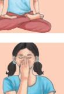

Yoga is an ancient Indian wisdom and it is our cultural and spiritual heritage. Yoga essentially focuses on bringing harmony between body and mind, thought and action; restraint and fulfilment; human and nature; a holistic approach to health and well-being. It is an art and science of healthy living. Yoga is also 'anuśāsanam' (discipline) which helps to develop overall physical, mental, spiritual, and social aspects of an individual's personality. To accomplish this, it advocates practice of different yogic techniques like *Āsana* (psycho-physiological postures), *Prāṇāyāma* (breath regulation techniques), *Pratyāhāra* (withdrawal of senses) *Dhāraṇā* (concentration) and *Dhyāna* (meditation), etc. Yoga **9**

In modern world, there is a general notion among the masses that Yoga is a series of exercises called *āsana* and considers it for their physical fitness and wellness. But it is not so. So, one need to understand that Yoga is not just related to physical fitness and wellness movement as it is perceived today, but it is a way to lead a holistic life and to attain enlightenment. There are various schools of Yoga, namely *Jñāna-yoga, Bhakti-yoga, Karma-yoga, Pātañjalayoga* and *Haṭha-yoga,* etc., while *āsana* is just one limb of *Aṣṭāṅga-yoga* and *Haṭha-yoga.*

# **Etymology of Yoga**

The word 'Yoga' is derived from the Sanskrit root *Yuj*, meaning 'to join' or 'to yoke' or 'to unite'. As per Yogic scriptures, the practice of Yoga leads to the union of an individual consciousness with that of the universal consciousness,

9- -Yoga.indd 155 15-10-2020 11:20:07

*Maharishi Patanjali* Source: https://encrypted- tbn0. gstatic.com/ images?q=tbn: ANd9GcRqpHHuNS58HyMQZ0 wbKFAojuvjc1kA1p4AAZpfobKda WdGtxjj

indicating a perfect harmony between the body and mind, human and nature. According to modern scientists, everything in the universe is just a manifestation of the same quantum firmament. One who experiences this oneness of existence is said to be in Yoga, and the practitioner is termed as a yogi, having attained a state of freedom referred to as *mukti*, *nirvana* or *mokṣa*.

# **History and Development of Yoga**

The practice of Yoga is believed to have started with the very dawn of civilisation. The science of Yoga originated thousands of years ago, long before the first religious belief systems were born. Yoga believes that suffering is a fact and *avidyā* (ignorance) is the root cause of all sufferings. Yoga has originated and been developed by ancient Indian *rishis* to overcome all kinds of suffering of human beings and its root cause. Yogic practices lead to health, harmony and total freedom. The *ṛṣis* and sages carried this yogic knowledge to different parts of the world including Asia, the Middle East, Northern Africa and South America.

Archaeological findings such as Yogi-like figure engraved on soapstone seal verified the existence of Yoga culture which is beyond 5000 years. Thus the history of Yoga can be traced back to over 5000 years. The history and development of Yoga can be divided into following periods.

### **Pre-Vedic Period**

The history of Yoga can be traced back to pre-vedic period. The study of the history of Indus Valley Civilisation reveals that the practices of Yoga was one of the significant features during that period. Yoga is being widely considered as an 'immortal cultural outcome' of Indus Sarasvati Valley Civilisation—dating back to 2700

B.C., it has proved itself catering to both material and spiritual *Carving on Stones of Yoga Mudrā During Indus Valley Civilisation* Source: https://i.pinimg.com/originals/ac/e4/39/ ace4397b7 3271e96 9fe1bbf42e03d473.jpg

upliftment of humanity. The stones seals excavated from the sites of the Indus Valley Civilisation depicting figures in yogic postures indicated that Yoga was being practised even during 3000 B.C. The idol of Pashupati in yogic postures is one of such specimens.

9- -Yoga.indd 156 15-10-2020 11:20:15

2024-25

# **Vedic and Upanishadic period**

This period is marked with the emergence of *Vedas*.

There are four *Vedas*:

- (i) *Ṛgveda*
- (ii) *Sāmaveda*
- (iii) *Yajurveda*
- (iv) *Atharvaveda*

During this period, the people relied on the knowledge of dedicated vedic yogis (*rishi*) to teach them how to live in divine harmony. The *ṛṣis* (*seers*) were also gifted with the ability to see the ultimate reality through their intensive spiritual practices. The *vedas* contain the oldest known *yogic*  teachings called *Vedic Yoga*.

- 
- 

The *Upaniṣads* are the concluding portion and essence of the *Vedas*. The *Upaniṣads* are contained in the knowledge portion of Vedas. The concepts of yoga are widely available in the Upanishads. The Yoga in *Upaniṣads* describe the inner vision of reality resulting in intense self-inquiry. Jñāna-*yoga*, *Karma-yoga* and *Dhyāna-yoga* are the main outcomes of the Upanishadic teachings.

# **Classical period**

In the pre-classical era, Yoga was an incoherent mixture of various ideas and techniques that often contradicted each other. The classical period is defined by Maharshi Patanjali's *yoga sutras,*  the first systematic presentation of Yoga. After Patanjali, many sages and Yoga masters contributed greatly for the preservation and development of the field through their well-documented practices and literature. The period between 500 B.C.–A.D. 800 is considered as the Classical period, which is also considered

*Script from Vedas* Source: https://www.hindujagruti. org/wp-content/uploads/2014/09

/1217775786_4_vedas.jpg

9- -Yoga.indd 157 15-10-2020 11:20:19

### *Pancha mahavrata* of Mahavir

- *1.* Non-violence—Live the life with the promise of not even drinking small creatures.
- *2.* Truth—Never lie, no matter how much difficulty comes to their life.
- *3.* Renunciation—They do not carry any kind of property and do not collect anything.
- *4. Asteya*—No stealing
- *5. Brahmacarya*—Jain ascetics have to follow celibacy completely.

### *Eightfold Path of Buddha*

- 1. Right understanding (*Sammā Diṭṭhi)*
- 2. Right thought (*Sammā Saṁkappa*)
- 3. Right speech (*Sammā Vāca*)
- 4. Right action (*Sammākammanta*)
- 5. Right livelihood (*Sammā Āji va*)
- 6. Right effort (*Sammā Vāyāma*)
- 7. Right mindfulness (*Sammā Sati*)
- 8. Right concentration (*Sammā Samādhi*)

as the most fertile and prominent period in the history and development of Yoga. During this period, commentaries of Vyāsa on *Yoga Sūtras* and Bhagavad Giˉtā, etc., came into existence. This period can be mainly dedicated to two great religious teachers of India—Mahavir and Buddha. The concept of five great vows—*Pañcamahāvrata* by Mahavir and *Aṭṭhaṁgika Magga* or eightfold path by Buddha can be well considered as early nature of *Yogasādhana*. We find more explicit explanation of Yoga in Bhagavad Giˉtā, which has elaborately presented the concept of *Jñāna-yoga, Bhakti-yoga* and *Karma-yoga*. These three types of Yoga are still the highest example of human wisdom. Patañjali's *Yoga sūtra* besides containing various aspects of Yoga, is mainly identified with the eight fold path of Yoga. Vyasa wrote a very important commentary on *Yoga sūtra*. During this very period, the aspect of mind was given more importance and it was clearly brought out through *Yoga Sādhanā*. Mind and body both can be brought under control to experience equanimity. Patañjali described 'eight limbed path' in order to attain *Samādhi* or enlightenment.

- 
- 
- • *Yama*: Social restraints, observances or ethical values
- • *Niyama*: Personal observances of study, purity and tolerance.
- • *Āsana*: Psycho-physiological postures

158 Knowledge Traditions and Practices of India— Class XI

9- -Yoga.indd 158 15-10-2020 11:20:21

- • *Prāṇāyāma*: Control of life force through breath control or regulation
- • *Pratyāhāra*: Withdrawal of senses
- • *Dhāraṇā*: Concentration
- • *Dhyāna*: Meditation
- • *Samādhi*: Spiritual absorption

# **Post classical period**

The period between A.D. 800–A.D. 1700 has been recognised as the Post Classical period, wherein the teachings of great Acāryatraya Adi Śaṅkaracārya, Rāmānujācārya, Mādhavācharya were prominent during this period. The teachings of Suradāsa, Tulasi dāsa, Purandaradāsa and Miˉrabāiˉ were prominent during this period. The *Nātha Yogis* of *Haṭha Yoga* tradition like Matsyendranātha, Gorakṣanātha, Caurangiṅātha, Svātmarāma Suri, Gheraṇḍa, Śṛˉinivāsa Bhaṭṭa are some of the great personalities who popularised the *Haṭha Yoga* practices during this period.

This period is different from the first three since its focus is more on the present. At this point, we see a proliferation of literature as well as the practice of Yoga. A few centuries after Patañjali, a number of Yoga masters created a system of practices designed to rejuvenate the body and prolong life. They embraced the concept of physical body as the means to achieve enlightenment.

# **Yoga in modern period**

The period between A.D. 1700–1900 is considered as modern period. This was the time in which great legacy of Yoga teachings was carried forward by prominent Yoga personalities like Ramaṇa Maharṣi, Rāmakṛṣṇa Paramahaṁsa, Paramahaṁsa Yogānanda, Swami Vivekānanda, Swami Dayānanda Sarasvati and Sri Aurobindo. Their philosophies, traditions, lineages and *Guru-śiṣya paramparā* led to further the knowledge and practices of different Traditional Schools of Yoga, e.g., *Jñānayoga, Bhakti-yoga, Karma-yoga, Rāja-yoga, Haṭha-yoga* and Integral-yoga, etc.

# **Yoga in contemporary period**

Now in the contemporary times, everybody has conviction about Yoga practices towards the preservation, maintenance and promotion of health. Yoga has spread all over the world by the teachings of great personalities like Swami Shivananda, Shri T. Krishnamacharya, Swami Kuvalayananda, Shri

*Swami Vivekananda* Source: http://veda.wdfiles. com/local-files/vivekananda/ vivekananda_poster.jpg

9- -Yoga.indd 159 15-10-2020 11:20:21

Yogendara, Swami Rama, Maharshi Mahesh Yogi, Pattabhi Jois, B.K.S. Iyengar, Swami Satyananda Sarasvati and the like.

In the present scenario, Yoga has been accepted by the world as a boon to prevent lifestyle diseases and for stress management. Given the health problems being at the centre stage of challenges faced by world population, Yoga is considered mainly as a tool of physical and mental well-being.

Considering the importance and potential of Yoga in health and well-being, the United Nations General Assembly (UNGA) on 11 December 2014 approved the proposal of the honorable Prime Minister of India, urging the world community to adopt an International Day of Yoga. The 193 members of UNGA approved the proposal by consensus with the record of 177 co-sponsoring countries, a resolution to establish 21st June as International Day of Yoga. This is the biggest recognition for Yoga by world community. On December 1, 2016, UNESCO inscribed Yoga in its list of intangible cultural heritages of humanity. *Yoga Sadhana* of all hues and colours is considered panacea for a meaningful life and living. Its orientation to a comprehensive health, both an individual and social, makes it a worthy practice for the people of all religions, races and nationalities.

Now-a-days, millions of people across the globe irrespective of their age, gender, cost, religion and countries have been benefitted by the practice of yoga which has been preserved and promoted by the great eminent yoga masters from ancient time to this date. Yoga has united the world and brought the whole world under one umbrella to live in peace and harmony.

# **Traditional Schools of Yoga**

The different philosophies, traditions, lineages and *guruśiṣya paramparā* of Yoga led to the emergence of different traditional schools.

# *Jñāna* **Yoga**

*Jñāna* means 'knowledge'. *Jñāna-yoga* is the yoga of wisdom. It shows the path of self-realisation through discerning the real from the unreal and discrimination between right and wrong. The three stages of *Jñāna-yoga* practices are considered as *śravaṇa, manana* and *nidhidhyāsana*.

- • *Śravaṇa*: listening or absorbing the instruction.
- • *Manana*: reflection or contemplation involving reasoning and arriving at intellectual convictions.
- • *Nidhidhyāsana*: repeated meditation and implementation of conviction or attaining to oneness with reality.

9- -Yoga.indd 160 15-10-2020 11:20:21

# *Bhakti* **Yoga**

Unconditional and intense love for God is Bhakti. Bhakti Yoga is a Yoga of devotion. *Bhakti Yoga* may be defined as the pathway of devotion to the realisation of personal God. The nine primary forms of bhakti (*Navadhā Bhakti*) are— (1) *śrava*ṇ*a* ('listening' to the scriptural stories of Kṛṣṇa and his companions), (2) *ki rtana* ('praising,' usually refers to ecstatic group singing), (3) *smara*ṇ*a* ('remembering' or fixing the mind on Viṣṇu), (4) *pāda-sevana* (rendering service), (5) *arcana* (worshiping an image), (6) *vandana* (paying homage), (7) *dāsya* (servitude), (8) *sākhya* (friendship), and (9) *ātma-nivedana* (complete surrender of the self). These nine principles of devotional service are described as helping the devotee remain constantly in touch with God. Bhakti softens the heart and removes jealousy, hatred, lust, anger, egoism, pride and arrogance. It infuses joy, bliss, peace and knowledge.

# *Karma* **Yoga**

*Karma* means action. *Karma Yoga* is the path of selfless action intended to overcome the desire which is the root cause of all miseries or sufferings. It purifies the action and emotions of the aspirant to act selflessly without the thought of any personal gain rewards. By having this state of mind—detaching from the fruit of action and surrender to the God, one can learn to sublimate and overcome the ego. The culmination of *Karma* Yoga lies in the devotee's diligent performance of his duty and offering the results thereof to the God.

# *Pātañjala* **Yoga**

The aim of *Pātañjala Yoga* (popularly called 'Raja Yoga') is to attain *citta-vṛtti-nirodha* (cessation of mental modifications), leading to *kaivalya* (self-realisation). It is the Yoga for mind management and to realise the self by the process of *dhayana* (Meditation). Yoga of Patanjali, popularly known as 'Aṣṭāṅga-Yoga', aims at restraining mental modification to realise the self. As explained earlier, these eight limbs include *Yama, Niyama, Āsana, Prāṇāyāma, Pratyāhāra, Dhāraṇā, Dhyāna*  and *Samādhi*. Practice of *Aṣṭāṅga Yoga* develops both personal and social dimensions of one's personality.

## *Haṭha Yoga*

*Haṭha Yoga* is the yoga of establishing balance between pairs of opposite. The roots of *Haṭha Yoga* are traced in *Tantra*.

9- -Yoga.indd 161 15-10-2020 11:20:21

*Depicting a gross body of human being showing layers of existence.* Source: http://eddy-gonzales.de/wp-content/uploads/ 2018/09/kosha-aufbau.png

The word *Haṭha* is the combination of *Ha*  (sun) and *Tha* (moon) also represent the *Īda* (left) and *Piṅgala* (right) Nāḍi s present in our body. Nāḍi s are channels of energy in the body. *Piṅgala* is known as the right channel and *Idā* is the left energy channel. *Haṭha Yoga* includes the yogic practice of *Ṣat-karma*, *Āsana, Prāṇāyāma, Mudrā, Pratyāhāra, Dhyāna, Samādhi,* etc. The main objective of Haṭha-yoga is to have a healthy body and mind to accomplish the goal.

# **Foundations of Yoga**

As per the insight of ancient texts, human body is made up of gross body (*Sthūlaśariˉra*), subtle body (*Sūkṣmaṣariˉra*) and the casual

body (*Kāraṇaśariˉra*). Also there is a mention of five layers (*Pañcakoṣas*) of existence in *Taittiˉriˉya upaniṣad* and these are *Annamaya* (physical), *Prāṇamaya* (energy), *Manomaya*  (mental), *Vijñānamaya* (intellectual) and *Ānandamaya*  (blissful) *Koṣa*.

*Annamaya* makes the structural framework for Sthūla*śari ra,* whereas, *Prāṇamaya*, *Manomaya* and *Vijñānamaya is*  for *Sūkṣma-śariˉra* and *Ānandamaya-koṣa* for *Kāraṇa-śariˉra*.

# *Annamaya Koṣa or koṣa* **made of food or the food body**

This is the outermost superficial sheath (cover) and is represented by our physical body made up of the five elements and is constituted by the food that we eat. *Kriyā*, *Āsana* and *Prāṇāyāma* helps in the strengthening of this sheath.

# *Prāṇāyāma Koṣa* **or the energy body**

This is the *pranic* sheath which energises or invigorates all the other sheaths. It is responsible for all the physiological and mental functions. It is mapped onto the physical body and extends slightly beyond the physical body. Our breath or *prāṇa* is the bridge between the body and mind. *Prāṇāyāma*  practice strengthens the *prāṇayamakoṣa*.

# *Manomaya Koṣa* **or the mental body**

This is the sheath of our thinking, feeling and emotions. It is comprised of *manas, ahaṁkāra* and the lower *buddhi*. *Prāṇāyāma* and *Pratyāhāra* (control over the senses) practices cater to this *koṣa*.

9- -Yoga.indd 162 15-10-2020 11:20:22

# *Vijñānamaya Koṣa* **or the wisdom, higher intellect body**

This is the region where refined or higher level thinking and intuition starts happening. Meditation practices cater to this sheath.

# *Ānandamaya Koṣa* **or the bliss body**

This sheath is the closest to our self. Transcending the body, mind and intellect leads to bliss. Meditation is the practice for this sheath.

# **Yoga and Holistic Health**

When we discuss about health, it is not merely the absence of diseases or illness at the physical level but also psychological, emotional, social and spiritual planes. Yoga believes in identifying the root cause of a disease and its elimination at all levels.

For the holistic development of overall health, Yoga works at several planes of human being:

# **Physical**

*Āsanas* primarily work at the physical level. Those practices tone up the muscles, nerve fibres, enhances blood circulation, promote the physiological functions and set the internal environment of the body called homeostasis. The *Kriyā* (cleansing techniques) vitalises the internal organs of the body and restore their efficiency by eliminating the toxic matter from the body. They establish equilibrium between *vāta* (air), *pitta* (bile) and *kapha* (phlegm). To nourish the physical body, a pure balanced wholesome diet with the supplement of nutrients is required. Yogic diet nourishes the body. Yogic food which is often discussed in the ancient text is *sātvika* food. Yoga emphasises on *mitāhāra*, which is related to the quality and quantity of food and also the state of mind during the intake of food. Various *āsana* or *yogic*  postures also help in physical development.

# **Cognitive or Intellectual**

Mental development is the growth and change in cognitive processes such as attention, memory, thinking, perceiving and imagination, reasoning and problem-solving. Practising of Yoga including *Āsanas*, *Prāṇāyāma* and *Yoga nidrā* by the students, has been found to improve their memory

- 
- 
- 

9- -Yoga.indd 163 15-10-2020 11:20:23

significantly. Meditation plays a vital role in regulating the speed of thoughts and attains the calm, quiet and relaxing state of mind. Meditation is a key tool to calm down the mind and hence becomes an important key for helping in managing the stress.

**Emotional**

Emotions are an integral part of human life. Emotional development can be considered in terms of control and expression of emotion as well as management of relationalships with oneself and others. There is always a fight between our likes and dislikes, and positive and negative emotions. Negative emotions are so vibrant in the mind that seldom any positive thought gets sharpened up in our psyche. Some *Āsanas*, *Prāṇāyāma* and relaxation techniques are good tools for conditioning the autonomous nervous system. These *yogic* practices have been found to bring significant positive changes in the emotional states of anxiety, stress, depression, regression, fatigue, guilt, and arousal. *Bhakti yoga* (unconditional love) is the well accepted method for culturing our emotions and get our mind directed towards accepting the positive emotions.

## **Social**

Due to isolation, an individual develops varieties of psychosocial complications. *Yamas* and *Niyamas* can be important tools for social development. During *satsang*, one comes near the Guru and acquaints with positive mentors and companions for life. Healthy social contacts, interpersonal relationships make life enjoyable and free from physical and psychological strains.

# **Spiritual**

Spiritual development takes place in the form of habits, values and ethics, etc. Good habits and strong value system inculcated right from the childhood will have lasting effects on the personality of the child. For spiritual development, *yama*, *niyama*, *pratyāhāra* and *dhyāna* (meditation) are helpful. *Yama* and *niyama* help to develop our moral values while *prāṇāyāma* and meditation help us to realise our true self. Introspection is very effective for the development of 'self'.

# **Yoga and Human Values**

Values are the principles that an individual adopts in one's life which describe human behaviour. Values are the desirable ideals and goals, which are intrinsic and when achieved, in fact, evoke a deep sense of fulfilment.

164 Knowledge Traditions and Practices of India— Class XI

9- -Yoga.indd 164 15-10-2020 11:20:23

- 
- 
- 

Values such as truth, non-violence, peace, love, honesty, generosity and no greed are given highest importance in Yoga. The erosion of human values becomes the primary cause for corruption, terrorist activities, violence, unrest and various complications in the society. Modern education is for bread earning purpose and does not focus on the development of spiritual, moral and ethical values. Indian culture is deeply rooted in spiritual and ethical values; unless these values find their way into the life of students, education will lose

its significance and will not fulfil its aim. In order to progress in the spiritual dimension, one has to adopt the following values that go in line with Indian tradition and heritage.

# **Application of Yoga Practices***

*Yogic* practices are mind centric and help in good health and wellness. You have learned the *yogic* practices in your earlier classes. These practices are given here in brief.

# *Kriyā*

These are detoxification procedures that are clinical in nature and help to remove the toxins accumulated in the body. For example, *Jala Neti, Sūtra Neti, Dhauti, Trāṭaka* and *Agnisāra*, etc.

*All practices have already been discussed in the textbook prepared for upper primary and secondary stages, titled *Yoga: A Healthy Way of Yoga of Living*. Yoga related practices are also included in the textbook *Health and Physical Education* for Classes IX–XII.

|
|  |

*Postures of Surya Namaskar*

9- -Yoga.indd 165 16-10-2020 16:23:06

*Standing Posture: Trikoṇāsana*

*Sitting Posture: Vajrāsana*

*Prone Posture: Bhujaṇgāsana*

*Supine Posture: Pawanamuktāsana*

# *Sūrya Namaskāra*

*Sūrya* means 'sun' and *namaskāra* means 'salutation' or 'bowing down'. It consist of 12 postures. The regular practice of *sūrya namaskāra* helps improve blood circulation throughout the body and maintain health, and thereby helps one to remain disease-free.

# *Āsana*

We all know that *āsanas* are beneficial for our physical and mental development. You have also learnt many *āsanas* in the previous classes. Now, we will discuss some more *āsanas*  in this section.

## *Standing Posture*

*Pāda-hastāsana, Garuḍāsana, Trikoṇāsana* and *Kaṭicakrāsana*

# *Sitting Posture*

*Padmāsana, Vajrāsana, Svastikāsana, Pascimottānāsana, Uṣṭrāsana, Ākarṇa Dhanurāsana, Vakrāsana, Supta Vajrāsana, Gomukhāsana, Maṇḍūkāsana and Uttānamaṇḍukāsana*

# *Prone Posture*

*Bhujaṅgāsana, Śalabhāsana,* and *Dhanurāsana*

## *Supine Posture*

*Setubandhāsana, Pavanamuktāsana, Sarvaṅgāsana, Halāsana* and *Matsyāsana*

# *Bandha* **and** *Mudrā*

These practices are associated with *prāṇāyāma*. These further facilitate the control over the mind. These include *Uḍḍi* ˉ*yana Bandha*, *Yoga Mudrā* and *Brahma Mudrā.*

# *Prāṇāyāma*

It helps in developing the awareness of vital basis of one's mind and helps to establish control over the mind. Different types of *Pranāyāma* include *Anuloma-viloma Prāṇāyāma, Bhastrikā Prāṇāyāma, Śitali Prāṇāyāma and Bhrāmari - Prāṇāyāma.*

9- -Yoga.indd 166 15-10-2020 11:20:26

# *Dhāraṇā or Dhyāna*

Five minutes on body awareness and five minutes breathe awareness and practice of meditation lead towards selfrealisation. By practicing of *Dhyāna,* one can take the mind away from all the negative things and helps to improve the functioning of mental abilities.

**Conclusion:** Yoga practices have numerous benefits that positively affect us physically and mentally. Yoga works as follows:

> *Kriyās, Āsanas, Prāṇāyāma* and *Dhyāna* ↓ Balance Endocrinal and Nervous control ↓ Increases Mind and Body Control ↓ ↓ ↓ Calm Relax Refresh ↓ Health and Harmony

Yoga is the perfect lifestyle as it is comprehensive and holistic in nature. *Yogic* principles of lifestyle help to strengthen and develop positive health enabling us to withstand stress better. This *Yogic* 'health insurance' has been achieved by normalising the perception of stress, optimising the reaction to it and releasing the pent-up stress effectively through the practice of various *Yogic* practices. Thus, Yoga is proving to be the most desirable complimentary and traditional system of healthcare in the present scenario.

- 
- 
- 
- 
- 
- 

*Anulom-Viloma Pranayama*

*Uḍḍiyana Bandha*

9- -Yoga.indd 167 15-10-2020 11:20:27

# **Exercises**

### **Fill in the blanks**

- 1. *Asteya* means____________.
- 2. Yoga is derived from the Sanskrit root word____________.
- 3. International Day of Yoga is being celebrated on____________.
- 4. Human body is made up of gross body,____________and causal body.
- 5. *Yamas* are____________.
- 6. *Niyamas are*____________.
- 7. *Jñāna Yoga* is the *Yoga* of____________.
- 8. Meaning of *Svādhyāya* is____________.
- 9. *Prāṇāyāma Koṣa* is the bridge between _________ and ________.
- 10. Patañjali *Yoga* is also known as____________.

### **Answer in one word**

- 1. Who is the author of *Yoga Sūtra*?
- 2. Write the meaning of word 'Yuj'.
- 3. What is the aim of Yoga?
- 4. Write down the four names of traditional school of Yoga.
- 5. Write down two objectives of Yoga.
- 6. Write down the three names of *śaṭkarma* (cleansing) practices.
- 7. Write the names of *vedas*.
- 8. Write the three names of modern practitioners of Yoga.

### **Write short notes (100 words)**

- 1. Describe *Pañcakoṣa*.
- 2. Write down the objectives of Yoga.
- 3. Discus the role of Yoga in holistic health.
- 4. Describe *Yamas* and *Niyamas*.
- 5. Write a short note on the history and development of Yoga.
- 6. Write a short note on the traditional school of Yoga.
- 7. Explain about the misconceptions of Yoga.
- 8. Describe *Aṣṭāṅga Yoga*.
- 9. Describe the stages of *Jñāna Yoga*.
- 10. Write down the nine primary forms of bhakti (*Navadha Bhakti*).
- 11. Write a short note on *Haṭha Yoga*.

### **Activities**

- 1. Prepare a chart on *Yogāsana*.
- 2. Write a short biography on Maharṣi Patañjali.
- 3. Make a report on the modern Yogis who have contributed in the development of Yoga.

9- -Yoga.indd 168 15-10-2020 11:20:27

## **Bibliography**

- Basavaraddi, Ishwar V. Ed. 2011. *Yoga Teacher's Manual for Yoga Teachers.* Morarji Desai National Institute of Yoga, New Delhi:
____2013. *A Monograph on Yogasana.* Morarji Desai National Institute of Yoga, New Delhi.

- Common Yoga Protocol. International Day of Yoga 21st June. Ministry of AYUSH, Government of India, New Delhi.
- *Certification of Yoga Professionals Official Guidebook 'For Level I*  (Instructor)' QCI.
- Iyengar, B.K.S. 1966. *Light on Yoga:* Ramamani Iyengar Memorial Yoga Institute (RIMYI).
- Kuvalyanand, Swami. 1993. *Asana:* Kaivalyadhama Yoga Institute and Research Centre, Lonavala.
- Nagendra, H. R. 2004. *Yoga Its Basis and Applications*, Swami Vivekananda Yoga Prakashana, Bangalore.
- NCERT. 2015. *Yoga: A Healthy Way of Living* (Hindi, English and Urdu) for Upper primary stage, New Delhi.
- ____ 2015. *Yoga: A Healthy Way of Living* (Hindi, English and Urdu) for Secondary stage, New Delhi.
- ____ 2016. *Health and Physical Education—A Teacher's Guide* for Class IX, New Delhi.
- ____ 2016. *Health and Physical Education—A Teacher's Guide* for Class VI, New Delhi.
- ____ 2017. *Health and Physical Education—A Teacher's Guide* for Class VII, New Delhi.
- Ramadev, Swami. *Yog Its philosophy and practice*, Divya Prakashan, Haridwar.
- Saraswati, Swami Satyananda. 1969. *Asana Pranayama Mudra Bandha: Bihar School of Yoga.*
- Tiwari, O. P. 2005. *Asana Why and How*, Kaivalyadham Yoga Institute and Research centre, Lonavala.

Yogendra. 2000. *Yogasanas Simplified*, The Yoga Institute, Santacruz, Mumbai.

### **Websites**

https://www.yogajournal.com/

https://www.yogatoday.com/

https://www.yogitimes.com/

9- -Yoga.indd 169 15-10-2020 11:20:27

# **Notes**

9- -Yoga.indd 170 15-10-2020 11:20:27

