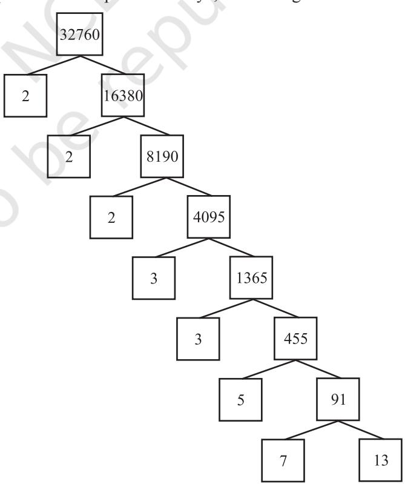
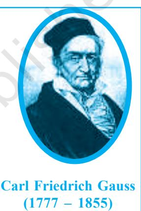

**1**

## **1.1 Introduction**

In Class IX, you began your exploration of the world of real numbers and encountered irrational numbers. We continue our discussion on real numbers in this chapter. We begin with two very important properties of positive integers in Sections 1.2 and 1.3, namely the Euclid's division algorithm and the Fundamental Theorem of Arithmetic.

Euclid's division algorithm, as the name suggests, has to do with divisibility of integers. Stated simply, it says any positive integer *a* can be divided by another positive integer *b* in such a way that it leaves a remainder *r* that is smaller than *b*. Many of you probably recognise this as the usual long division process. Although this result is quite easy to state and understand, it has many applications related to the divisibility properties of integers. We touch upon a few of them, and use it mainly to compute the HCF of two positive integers.

The Fundamental Theorem of Arithmetic, on the other hand, has to do something with multiplication of positive integers. You already know that every composite number can be expressed as a product of primes in a unique way— this important fact is the Fundamental Theorem of Arithmetic. Again, while it is a result that is easy to state and understand, it has some very deep and significant applications in the field of mathematics. We use the Fundamental Theorem of Arithmetic for two main applications. First, we use it to prove the irrationality of many of the numbers you studied in Class IX, such as 2, 3 and 5 . Second, we apply this theorem to explore when exactly the decimal expansion of a rational number, say ( 0) *p q q* , is terminating and when it is nonterminating repeating. We do so by looking at the prime factorisation of the denominator *q* of *p q* . You will see that the prime factorisation of *q* will completely reveal the nature of the decimal expansion of *p q* .

So let us begin our exploration.

# **1.2 The Fundamental Theorem of Arithmetic**

In your earlier classes, you have seen that any natural number can be written as a product of its prime factors. For instance, 2 = 2, 4 = 2 × 2, 253 = 11 × 23, and so on. Now, let us try and look at natural numbers from the other direction. That is, can any natural number be obtained by multiplying prime numbers? Let us see.

Take any collection of prime numbers, say 2, 3, 7, 11 and 23. If we multiply some or all of these numbers, allowing them to repeat as many times as we wish, we can produce a large collection of positive integers (In fact, infinitely many). Let us list a few :

> 7 × 11 × 23 = 1771 3 × 7 × 11 × 23 = 5313 2 × 3 × 7 × 11 × 23 = 10626 2 3 × 3 × 73 = 8232 2 2 × 3 × 7 × 11 × 23 = 21252

and so on.

Now, let us suppose your collection of primes includes all the possible primes. What is your guess about the size of this collection? Does it contain only a finite number of integers, or infinitely many? Infact, there are infinitely many primes. So, if we combine all these primes in all possible ways, we will get an infinite

collection of numbers, all the primes and all possible products of primes. The question is – can we produce all the composite numbers this way? What do you think? Do you think that there may be a composite number which is not the product of powers of primes? Before we answer this, let us factorise positive integers, that is, do the opposite of what we have done so far.

We are going to use the factor tree with which you are all familiar. Let us take some large number, say, 32760, and factorise it as shown.

So we have factorised 32760 as 2 × 2 × 2 × 3 × 3 × 5 × 7 × 13 as a product of primes, i.e., 32760 = 23 × 32 × 5 × 7 × 13 as a product of powers of primes. Let us try another number, say, 123456789. This can be written as 32 × 3803 × 3607. Of course, you have to check that 3803 and 3607 are primes! (Try it out for several other natural numbers yourself.) This leads us to a conjecture that every composite number can be written as the product of powers of primes. In fact, this statement is true, and is called the **Fundamental Theorem of Arithmetic** because of its basic crucial importance to the study of integers. Let us now formally state this theorem.

**Theorem 1.1 (Fundamental Theorem of Arithmetic) :** *Every composite number can be expressed* (*factorised*) *as a product of primes, and this factorisation is unique, apart from the order in which the prime factors occur.*

An equivalent version of Theorem 1.2 was probably first recorded as Proposition 14 of Book IX in Euclid's Elements, before it came to be known as the Fundamental Theorem of Arithmetic. However, the first correct proof was given by Carl Friedrich Gauss in his *Disquisitiones Arithmeticae*.

Carl Friedrich Gauss is often referred to as the 'Prince of Mathematicians' and is considered one of the three greatest mathematicians of all time, along with Archimedes and Newton. He has made fundamental contributions to both mathematics and science.

The Fundamental Theorem of Arithmetic says that every composite number can be factorised as a product of primes. Actually it says more. It says that given any composite number it can be factorised as a product of prime numbers in a **'unique'** way, except for the order in which the primes occur. That is, given any composite number there is one and only one way to write it as a product of primes, as long as we are not particular about the order in which the primes occur. So, for example, we regard 2 × 3 × 5 × 7 as the same as 3 × 5 × 7 × 2, or any other possible order in which these primes are written. This fact is also stated in the following form:

*The prime factorisation of a natural number is unique, except for the order of its factors*.

In general, given a composite number *x*, we factorise it as *x* = *p*1 *p*2 ... *pn* , where *p*1 , *p*2 ,..., *pn* are primes and written in ascending order, i.e., *p*1 *p*2 . . . *pn .* If we combine the same primes, we will get powers of primes. For example,

> 32760 = 2 × 2 × 2 × 3 × 3 × 5 × 7 × 13 = 23 × 32 × 5 × 7 × 13

Once we have decided that the order will be ascending, then the way the number is factorised, is unique.

The Fundamental Theorem of Arithmetic has many applications, both within mathematics and in other fields. Let us look at some examples.

**Example 1 :** Consider the numbers 4*n* , where *n* is a natural number. Check whether there is any value of *n* for which 4*n* ends with the digit zero.

**Solution :** If the number 4*n* , for any *n*, were to end with the digit zero, then it would be divisible by 5. That is, the prime factorisation of 4*n* would contain the prime 5. This is not possible because 4*n* = (2)2*n* ; so the only prime in the factorisation of 4*n* is 2. So, the uniqueness of the Fundamental Theorem of Arithmetic guarantees that there are no other primes in the factorisation of 4*n .* So, there is no natural number *n* for which 4*n* ends with the digit zero.

You have already learnt how to find the HCF and LCM of two positive integers using the Fundamental Theorem of Arithmetic in earlier classes, without realising it! This method is also called the *prime factorisation method*. Let us recall this method through an example.

**Example 2 :** Find the LCM and HCF of 6 and 20 by the prime factorisation method.

**Solution :** We have : 6 = 21 × 31 and 20 = 2 × 2 × 5 = 22 × 51 .

You can find HCF(6, 20) = 2 and LCM(6, 20) = 2 × 2 × 3 × 5 = 60, as done in your earlier classes.

Note that HCF(6, 20) = 21 = **Product of the smallest power of each common prime factor in the numbers.**

LCM (6, 20) = 22 × 31 × 51 = **Product of the greatest power of each prime factor**, **involved in the numbers**.

From the example above, you might have noticed that HCF(6, 20) × LCM(6, 20) = 6 × 20. In fact, we can verify that **for any two positive integers** *a* **and** *b***, HCF (***a***,** *b***) × LCM (***a***,** *b***) =** *a* **×** *b***.** We can use this result to find the LCM of two positive integers, if we have already found the HCF of the two positive integers.

**Example 3:** Find the HCF of 96 and 404 by the prime factorisation method. Hence, find their LCM.

**Solution :** The prime factorisation of 96 and 404 gives :

$$96=2^{5}\times3,\;404=2^{2}\times101$$

Therefore, the HCF of these two integers is 22 = 4.

Also,  
  

$$\text{LCM}\left(96,\,404\right)=\frac{96\times404}{\text{HCF}(96,\,404)}=\frac{96\times404}{4}=9696$$

**Example 4 :** Find the HCF and LCM of 6, 72 and 120, using the prime factorisation method.

**Solution :** We have :

$$6=2\times3,\ 72=2^{3}\times3^{2},\ 120=2^{3}\times3\times5$$

Here, 21 and 31 are the smallest powers of the common factors 2 and 3, respectively.

So,  
  
HCF (6, 72, 120) = $2^{1}\times3^{1}\equiv2\times3=6$

23 , 32 and 51 are the greatest powers of the prime factors 2, 3 and 5 respectively involved in the three numbers.

So, LCM (6, 72, 120) = 23 × 32 × 51 = 360

**Remark :** Notice, 6 × 72 × 120 HCF (6, 72, 120) × LCM (6, 72, 120). So, the product of three numbers is not equal to the product of their HCF and LCM.

## **EXERCISE 1.1**

- **1.** Express each number as a product of its prime factors:
(i) 140 (ii) 156 (iii) 3825 (iv) 5005 (v) 7429

- **2.** Find the LCM and HCF of the following pairs of integers and verify that LCM × HCF = product of the two numbers.
	- (i) 26 and 91 (ii) 510 and 92 (iii) 336 and 54
- **3.** Find the LCM and HCF of the following integers by applying the prime factorisation method.
	- (i) 12, 15 and 21 (ii) 17, 23 and 29 (iii) 8, 9 and 25
- **4.** Given that HCF (306, 657) = 9, find LCM (306, 657).
- **5.** Check whether 6*n* can end with the digit 0 for any natural number *n*.
- **6.** Explain why 7 × 11 × 13 + 13 and 7 × 6 × 5 × 4 × 3 × 2 × 1 + 5 are composite numbers.
- **7.** There is a circular path around a sports field. Sonia takes 18 minutes to drive one round of the field, while Ravi takes 12 minutes for the same. Suppose they both start at the

same point and at the same time, and go in the same direction. After how many minutes will they meet again at the starting point?

## **1.3 Revisiting Irrational Numbers**

In Class IX, you were introduced to irrational numbers and many of their properties. You studied about their existence and how the rationals and the irrationals together made up the real numbers. You even studied how to locate irrationals on the number line. However, we did not prove that they were irrationals. In this section, we will prove that 2 , 3 , 5 and, in general, *p* is irrational, where *p* is a prime. One of the theorems, we use in our proof, is the Fundamental Theorem of Arithmetic.

Recall, a number '*s*' is called *irrational* if it cannot be written in the form , *p q* where *p* and *q* are integers and *q* ¹ 0. Some examples of irrational numbers, with which you are already familiar, are :

$${\sqrt{2}},{\sqrt{3}},{\sqrt{15}},\pi,-{\frac{\sqrt{2}}{\sqrt{3}}},0.1011011101110\ldots,{\mathrm{etc.}}$$

Before we prove that 2 is irrational, we need the following theorem, whose proof is based on the Fundamental Theorem of Arithmetic.

**Theorem 1.2 :** *Let p be a prime number. If p divides a2 , then p divides a, where a is a positive integer.*

***Proof :** Let the prime factorisation of *a* be as follows :

*a* = *p*1 *p*2 . . . *pn* , where *p*1 ,*p*2 , . . ., *pn* are primes, not necessarily distinct.

Therefore, *a* 2 = ( *p*1 *p*2 . . . *pn* )( *p*1 *p*2 . . . *pn* ) = *p* 2 1 *p* 2 2 . . . *p* 2 *n* .

Now, we are given that *p* divides *a* 2 . Therefore, from the Fundamental Theorem of Arithmetic, it follows that *p* is one of the prime factors of *a* 2 . However, using the uniqueness part of the Fundamental Theorem of Arithmetic, we realise that the only prime factors of *a* 2 are *p*1 , *p*2 , . . ., *pn* . So *p* is one of *p*1 , *p*2 , . . ., *pn* .

Now, since *a* = *p*1 *p*2 . . . *pn* , *p* divides *a*.

We are now ready to give a proof that 2 is irrational.

The proof is based on a technique called 'proof by contradiction'. (This technique is discussed in some detail in Appendix 1).

**Theorem 1.3 :** 2 *is irrational.*

**Proof :** Let us assume, to the contrary, that 2 is rational.

* Not from the examination point of view.

So, we can find integers *r* and *s* (¹ 0) such that 2 = *r s* .

Suppose *r* and *s* have a common factor other than 1. Then, we divide by the common

factor to get $\sqrt{2}=\frac{a}{b}$, where $a$ and $b$ are coprime. So, $b\sqrt{2}=a$.  
  

Squaring on both sides and rearranging, we get 2*b* 2 = *a* 2 . Therefore, 2 divides *a* 2 .

Now, by Theorem 1.3, it follows that 2 divides *a*.

So, we can write *a* = 2*c* for some integer *c*.

Substituting for *a*, we get 2*b* 2 = 4*c* 2 , that is, *b* 2 = 2*c* 2 .

This means that 2 divides *b* 2 , and so 2 divides *b* (again using Theorem 1.3 with *p* = 2). Therefore, *a* and *b* have at least 2 as a common factor.

But this contradicts the fact that *a* and *b* have no common factors other than 1.

This contradiction has arisen because of our incorrect assumption that 2 is rational.

So, we conclude that 2 is irrational.

**Example 5 :** Prove that 3 is irrational.

**Solution :** Let us assume, to the contrary, that 3 is rational.

That is, we can find integers *a* and *b* (¹ 0) such that 3 = *a b* 

Suppose *a* and *b* have a common factor other than 1, then we can divide by the common factor, and assume that *a* and *b* are coprime.

$${\mathrm{So,~}}b{\sqrt{3}}=a.$$

Squaring on both sides, and rearranging, we get 3*b* 2 = *a* 2 .

Therefore, *a* 2 is divisible by 3, and by Theorem 1.3, it follows that *a* is also divisible by 3.

So, we can write *a* = 3*c* for some integer *c*.

Substituting for *a*, we get 3*b* 2 = 9*c* 2 , that is, *b* 2 = 3*c* 2 .

This means that *b* 2 is divisible by 3, and so *b* is also divisible by 3 (using Theorem 1.3 with *p* = 3).

Therefore, *a* and *b* have at least 3 as a common factor.

But this contradicts the fact that *a* and *b* are coprime.

This contradiction has arisen because of our incorrect assumption that 3 is rational. So, we conclude that 3 is irrational.

In Class IX, we mentioned that :

- the sum or difference of a rational and an irrational number is irrational and
- the product and quotient of a non-zero rational and irrational number is irrational.

We prove some particular cases here.

**Example 6 :** Show that 5– 3 is irrational.

**Solution :** Let us assume, to the contrary, that 5– 3 is rational.

That is, we can find coprime *a* and *b* (*b* 0) such that 5 3 *a b*

Therefore, 5 3 *a b*

Rearranging this equation, we get 5 3 5– *a ba b b* 

Since *a* and *b* are integers, we get 5 – *a b* is rational, and so 3 is rational. But this contradicts the fact that 3 is irrational.

This contradiction has arisen because of our incorrect assumption that 5 – 3 is rational.

So, we conclude that 5 3 is irrational.

**Example 7 :** Show that 3 2 is irrational. **Solution :** Let us assume, to the contrary, that 3 2 is rational.

That is, we can find coprime *a* and *b* (*b*  0) such that 3 2 *a b* Rearranging, we get 2 3 *a b* Since 3, *a* and *b* are integers, 3 *a b* is rational, and so 2 is rational. But this contradicts the fact that 2 is irrational. So, we conclude that 3 2 is irrational.

## **EXERCISE 1.2**

- **1.** Prove that 5 is irrational.
- **2.** Prove that 3 25 is irrational.
- **3.** Prove that the following are irrationals :

(i) $\frac{1}{\sqrt{2}}$ (ii) $7\sqrt{5}$ (iii) $6+\sqrt{2}$

## **1.4 Summary**

In this chapter, you have studied the following points:

- **1.** The Fundamental Theorem of Arithmetic :
Every composite number can be expressed (factorised) as a product of primes, and this factorisation is unique, apart from the order in which the prime factors occur.

- **2.** If *p* is a prime and *p* divides *a*2 , then *p* divides *a*, where *a* is a positive integer.
- **3.** To prove that 2, 3 are irrationals.

# **A NOTE TO THE READER**

You have seen that :

HCF ( *p*, *q*, *r*) × LCM (*p*, *q*, *r*) *p* × *q* × *r*, where *p*, *q*, *r* are positive integers (see Example 8). However, the following results hold good for three numbers *p*, *q* and *r* :

$\begin{array}{l}\mbox{LCM}\left(p,q,r\right)=\frac{p\cdot q\cdot r\cdot\mbox{HCF}(p,q,r)}{\mbox{HCF}(p,q)\cdot\mbox{HCF}(q,r)\cdot\mbox{HCF}(p,r)}\\ \cdot\\ \mbox{HCF}\left(p,q,r\right)=\frac{p\cdot q\cdot r\cdot\mbox{LCM}(p,q,r)}{\mbox{LCM}(p,q)\cdot\mbox{LCM}(q,r)\cdot\mbox{LCM}(p,r)}\end{array}$

