**10**

**CIRCLES**

# **10.1 Introduction**

You have studied in Class IX that a circle is a collection of all points in a plane which are at a constant distance (radius) from a fixed point (centre). You have also studied various terms related to a circle like chord, segment, sector, arc etc. Let us now examine the different situations that can arise when a circle and a line are given in a plane.

So, let us consider a circle and a line PQ. There can be three possibilities given in Fig. 10.1 below:

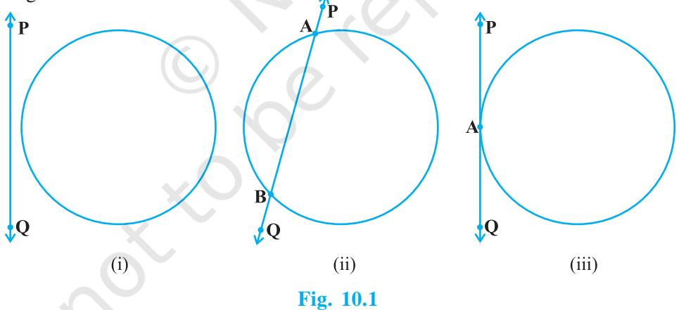

In Fig. 10.1 (i), the line PQ and the circle have no common point. In this case, PQ is called a **non-intersecting** line with respect to the circle. In Fig. 10.1 (ii), there are two common points A and B that the line PQ and the circle have. In this case, we call the line PQ a **secant** of the circle. In Fig. 10.1 (iii), there is only one point A which is common to the line PQ and the circle. In this case, the line is called a **tangent** to the circle.

You might have seen a pulley fitted over a well which is used in taking out water from the well. Look at Fig. 10.2. Here the rope on both sides of the pulley, if considered as a ray, is like a tangent to the circle representing the pulley.

Is there any position of the line with respect to the circle other than the types given above? You can see that there cannot be any other type of position of the line with respect to the circle. In this chapter, we will study about the existence of the tangents to a circle and also study some of their properties.

### **10.2 Tangent to a Circle**

In the previous section, you have seen that **a tangent* to a circle is a line that intersects the circle at only one point**.

To understand the existence of the tangent to a circle at a point, let us perform the following activities:

**Activity 1 :** Take a circular wire and attach a straight wire AB at a point P of the circular wire so that it can rotate about the point P in a plane. Put the system on a table and gently rotate the wire AB about the point P to get different positions of the straight wire [see Fig. 10.3(i)].

In various positions, the wire intersects the circular wire at P and at another point Q1 or Q2 or Q3, etc. In one position, you will see that it will intersect the circle at the point P only (see position AB of AB). This shows that a tangent exists at the point P of the circle. On rotating further, you can observe that in all other positions of AB, it will intersect the circle at P and at another point, say R1 or R2 or R3, etc. So, you can observe that **there is only one tangent at a point of the circle**.

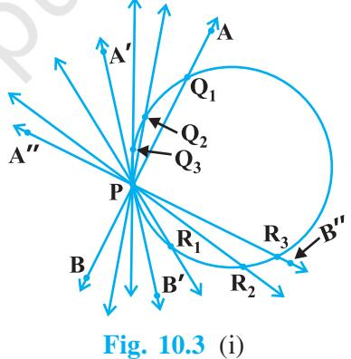

While doing activity above, you must have observed that as the position AB moves towards the position A B, the common point, say Q1, of the line AB and the circle gradually comes nearer and nearer to the common point P. Ultimately, it coincides with the point P in the position AB of AB. Again note, what happens if 'AB' is rotated rightwards about P? The common point R3 gradually comes nearer and nearer to P and ultimately coincides with P. So, what we see is:

**The tangent to a circle is a special case of the secant, when the two end points of its corresponding chord coincide**.

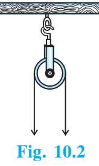

*The word 'tangent' comes from the Latin word 'tangere', which means to touch and was introduced by the Danish mathematician Thomas Fineke in 1583.

**Activity 2 :** On a paper, draw a circle and a secant PQ of the circle. Draw various lines parallel to the secant on both sides of it. You will find that after some steps, the length of the chord cut by the lines will gradually decrease, i.e., the two points of intersection of the line and the circle are coming closer and closer [see Fig. 10.3(ii)]. In one case, it becomes zero on one side of the secant and in another case, it becomes zero on the other side of the secant. See the positions PQ and PQ of the secant in Fig. 10.3 (ii). These are the tangents to the circle parallel to the given secant PQ. This also helps you to see that there cannot be more than two tangents parallel to a given secant.

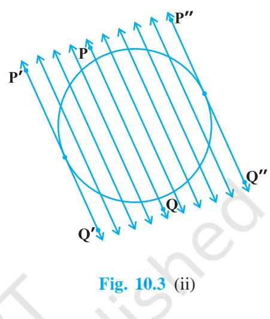

This activity also establishes, what you must have observed, while doing Activity 1, namely, a tangent is the secant when both of the end points of the corresponding chord coincide.

The common point of the tangent and the circle is called the **point of contact** [the point A in Fig. 10.1 (iii)]and the tangent is said to **touch** the circle at the common point.

Now look around you. Have you seen a bicycle or a cart moving? Look at its wheels. All the spokes of a wheel are along its radii. Now note the position of the wheel with respect to its movement on the ground. Do you see any tangent anywhere? (See Fig. 10.4). In fact, the wheel moves along a line which is a tangent to the circle representing the wheel. Also, notice that in all positions, the radius through the point of contact with the ground appears to be at right angles to the tangent (see Fig. 10.4). We shall now prove this property of the tangent.

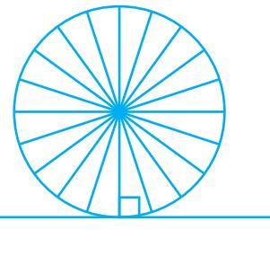

**Fig. 10.4**

**Theorem 10.1 :** *The tangent at any point of a circle is perpendicular to the radius through the point of contact.*

**Proof :** We are given a circle with centre O and a tangent XY to the circle at a point P. We need to prove that OP is perpendicular to XY.

Take a point Q on XY other than P and join OQ (see Fig. 10.5).

The point Q must lie outside the circle. (Why? Note that if Q lies inside the circle, XY will become a secant and not a tangent to the circle). Therefore, OQ is longer than the radius OP of the circle. That is,

$$\mathrm{{OQ>OP.}}$$

Since this happens for every point on the line XY except the point P, OP is the shortest of all the distances of the point O to the points of XY. So OP is perpendicular to XY. (as shown in Theorem A1.7.)

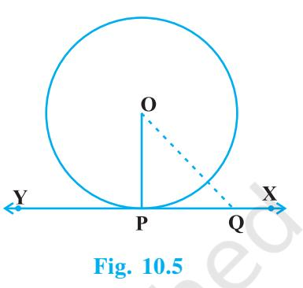

### **Remarks**

1. By theorem above, we can also conclude that at any point on a circle there can be one and only one tangent.

2. The line containing the radius through the point of contact is also sometimes called the 'normal' to the circle at the point.

## **EXERCISE 10.1**

- **1.** How many tangents can a circle have?
- **2.** Fill in the blanks :
	- (i) A tangent to a circle intersects it in point (s).
	- (ii) A line intersecting a circle in two points is called a .
	- (iii) A circle can have parallel tangents at the most.
	- (iv) The common point of a tangent to a circle and the circle is called .
- **3.** A tangent PQ at a point P of a circle of radius 5 cm meets a line through the centre O at a point Q so that OQ = 12 cm. Length PQ is :

(A) 12 cm (B) 13 cm (C) 8.5 cm (D) 119 cm.

- **4.** Draw a circle and two lines parallel to a given line such that one is a tangent and the other, a secant to the circle.
### **10.3 Number of Tangents from a Point on a Circle**

To get an idea of the number of tangents from a point on a circle, let us perform the following activity:

**Activity 3 :** Draw a circle on a paper. Take a point P inside it. Can you draw a tangent to the circle through this point? You will find that all the lines through this point intersect the circle in two points. So, it is not possible to draw any tangent to a circle through a point inside it [see Fig. 10.6 (i)].

Next take a point P on the circle and draw tangents through this point. You have already observed that there is only one tangent to the circle at such a point [see Fig. 10.6 (ii)].

Finally, take a point P outside the circle and try to draw tangents to the circle from this point. What do you observe? You will find that you can draw exactly two tangents to the circle through this point [see Fig. 10.6 (iii)].

We can summarise these facts as follows:

**Case 1 :** There is no tangent to a circle passing through a point lying inside the circle.

**Case 2 :** There is one and only one tangent to a circle passing through a point lying on the circle.

**Case 3 :** There are exactly two tangents to a circle through a point lying outside the circle.

In Fig. 10.6 (iii), T1 and T2 are the points of contact of the tangents PT1 and PT2 respectively.

The length of the segment of the tangent from the external point P and the point of contact with the circle is called the **length of the tangent** from the point P to the circle.

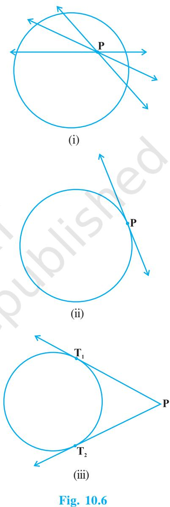

Note that in Fig. 10.6 (iii), PT1 and PT2 are the lengths of the tangents from P to the circle. The lengths PT1 and PT2 have a common property. Can you find this? Measure PT1 and PT2 . Are these equal? In fact, this is always so. Let us give a proof of this fact in the following theorem.

**Theorem 10.2 :** *The lengths of tangents drawn from an external point to a circle are equal*.

**Proof :** We are given a circle with centre O, a point P lying outside the circle and two tangents PQ, PR on the circle from P (see Fig. 10.7). We are required to prove that PQ = PR.

For this, we join OP, OQ and OR. Then ∠ OQP and ∠ ORP are right angles, because these are angles between the radii and tangents, and according to Theorem 10.1 they are right angles. Now in right triangles OQP and ORP,

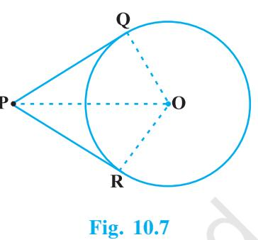

|  | OQ = | OR | (Radii of the same circle) |
| --- | --- | --- | --- |
|  | OP = | OP | (Common) |
| Therefore, | ∆ OQP ≅ | ∆ ORP | (RHS) |
| This gives | PQ = | PR | (CPCT) |

#### **Remarks**

1. The theorem can also be proved by using the Pythagoras Theorem as follows:

PQ2 = OP2 – OQ2 = OP2 – OR2 = PR2 (As OQ = OR)

which gives PQ = PR.

2. Note also that ∠ OPQ = ∠ OPR. Therefore, OP is the angle bisector of ∠ QPR, i.e., the centre lies on the bisector of the angle between the two tangents.

Let us take some examples.

**Example 1 :** Prove that in two concentric circles, the chord of the larger circle, which touches the smaller circle, is bisected at the point of contact.

**Solution :** We are given two concentric circles C1 and C2 with centre O and a chord AB of the larger circle C1 which touches the smaller circle C2 at the point P (see Fig. 10.8). We need to prove that AP = BP.

Let us join OP. Then, AB is a tangent to C2 at P and OP is its radius. Therefore, by Theorem 10.1,

$$\mathrm{OP}\perp\mathrm{AB}$$

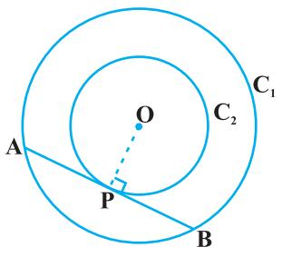

**Fig. 10.8**

Now AB is a chord of the circle C1 and OP AB. Therefore, OP is the bisector of the chord AB, as the perpendicular from the centre bisects the chord,

i.e., AP = BP

**Example 2 :** Two tangents TP and TQ are drawn to a circle with centre O from an external point T. Prove that PTQ = 2 OPQ.

**Solution :** We are given a circle with centre O, an external point T and two tangents TP and TQ to the circle, where P, Q are the points of contact (see Fig. 10.9). We need to prove that

PTQ = 2 OPQ

Let PTQ =

Now, by Theorem 10.2, TP = TQ. So, TPQ is an isosceles triangle.

Therefore, TPQ = TQP = 1 1 (180° ) 90° 2 2 

Also, by Theorem 10.1, OPT = 90°

So, OPQ = OPT – TPQ = 1 90° 90° – 2 

$$\angle\,{\frac{1}{2}}\,\theta={\frac{1}{2}}\,\angle\,\mathrm{PTQ}$$

This gives PTQ = 2 OPQ

**Example 3 :** PQ is a chord of length 8 cm of a circle of radius 5 cm. The tangents at P and Q intersect at a point T (see Fig. 10.10). Find the length TP.

**Solution :** Join OT. Let it intersect PQ at the point R. Then TPQ is isosceles and TO is the angle bisector of PTQ. So, OT PQ and therefore, OT bisects PQ which gives PR = RQ = 4 cm.

Also, OR = 2 2 22 OP PR 5 4 cm 3 c m.

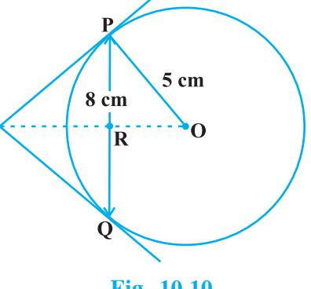

**Fig. 10.10**

Now, TPR + RPO = 90° = TPR + PTR (Why?) So, RPO = PTR

Therefore, right triangle TRP is similar to the right triangle PRO by AA similarity.

This gives  
  

$$\frac{\text{TP}}{\text{PO}}=\frac{\text{RP}}{\text{RO}},\text{i.e.,}\frac{\text{TP}}{5}=\frac{4}{3}\text{or}\text{TP}=\frac{20}{3}\text{cm}.$$

**Note :** TP can also be found by using the Pythagoras Theorem, as follows:

$$\operatorname{Let}$$

$$Let

\begin{array}{ll}\mbox{TP}=\,x\,\,\,\mbox{and}\,\,\,\mbox{TR}=y.\,\,\,\,\,\mbox{Then}\\ \mbox{x^{2}=\,y^{2}+16}&\mbox{(Taking right\DeltaPRT)}\\ \mbox{x^{2}+5^{2}=\,(y+3)^{2}}&\mbox{(Taking right\DeltaOPT)}\\ \end{array}$$

Subtracting (1) from (2), we get

$$25=\begin{array}{c}6y-7\quad\text{or}\quad y=\frac{32}{6}=\frac{16}{3}\\ \end{array}$$
  
  
Therefore,  
  

$$x^{2}=\begin{array}{c}\left(\frac{16}{3}\right)^{2}+16=\frac{16}{9}(16+9)=\frac{16\times25}{9}\\ \end{array}$$
  
  
or  
  

$$x=\begin{array}{c}\frac{20}{2}\\ \end{array}$$

Therefore, *x*2

### **EXERCISE 10.2**

In Q.1 to 3, choose the correct option and give justification.

3

- **1.** From a point Q, the length of the tangent to a circle is 24 cm and the distance of Q from the centre is 25 cm. The radius of the circle is
(A) 7 cm (B) 12 cm

- (C) 15 cm (D) 24.5 cm
- **2.** In Fig. 10.11, if TP and TQ are the two tangents to a circle with centre O so that POQ = 110°, then PTQ is equal to
	- (A) 60° (B) 70°
	- (C) 80° (D) 90°

- (A) 50° (B) 60°
- (C) 70° (D) 80°

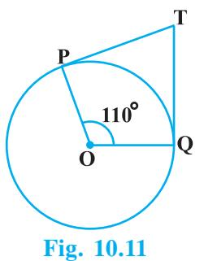

- **4.** Prove that the tangents drawn at the ends of a diameter of a circle are parallel.
- **5.** Prove that the perpendicular at the point of contact to the tangent to a circle passes through the centre.
- **6.** The length of a tangent from a point A at distance 5 cm from the centre of the circle is 4 cm. Find the radius of the circle.
- **7.** Two concentric circles are of radii 5 cm and 3 cm. Find the length of the chord of the larger circle which touches the smaller circle.
- **8.** A quadrilateral ABCD is drawn to circumscribe a circle (see Fig. 10.12). Prove that

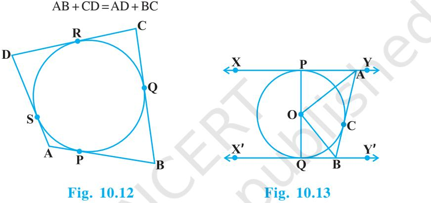

- **9.** In Fig. 10.13, XY and XY are two parallel tangents to a circle with centre O and another tangent AB with point of contact C intersecting XY at A and XY at B. Prove that AOB = 90°.
- **10.** Prove that the angle between the two tangents drawn from an external point to a circle is supplementary to the angle subtended by the line-segment joining the points of contact at the centre.
- **11.** Prove that the parallelogram circumscribing a circle is a rhombus.
- **12.** A triangle ABC is drawn to circumscribe a circle of radius 4 cm such that the segments BD and DC into which BC is divided by the point of contact D are of lengths 8 cm and 6 cm respectively (see Fig. 10.14). Find the sides AB and AC.
- **13.** Prove that opposite sides of a quadrilateral circumscribing a circle subtend supplementary angles at the centre of the circle. **Fig. 10.14**

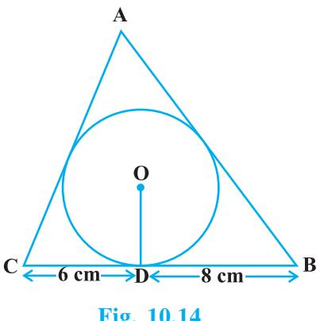

## **10.4 Summary**

In this chapter, you have studied the following points :

- **1.** The meaning of a tangent to a circle.
- **2.** The tangent to a circle is perpendicular to the radius through the point of contact.
- **3.** The lengths of the two tangents from an external point to a circle are equal.

