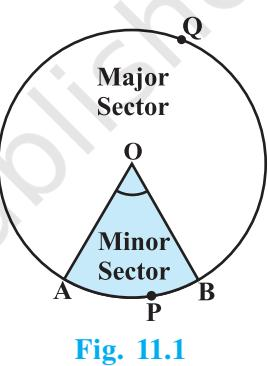
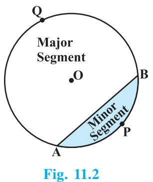
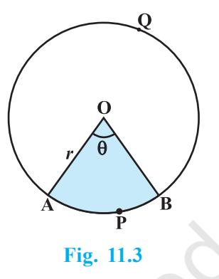
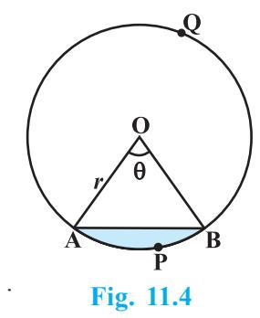
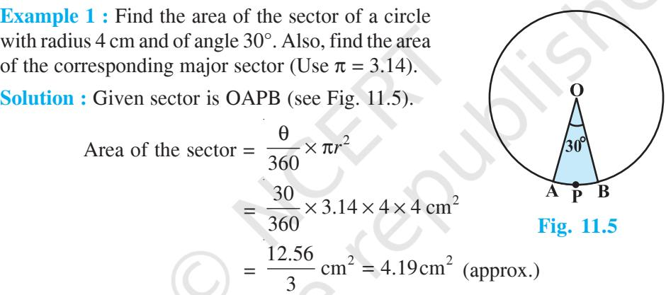
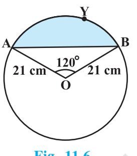
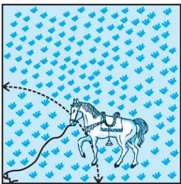
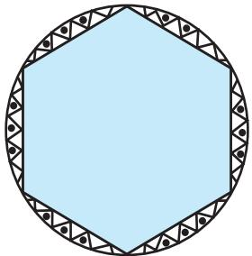

## **AREAS RELATED TO CIRCLES**

## **11.1 Areas of Sector and Segment of a Circle**

You have already come across the terms *sector* and *segment* of a circle in your earlier classes. Recall that the portion (or part) of the circular region enclosed by two radii and the corresponding arc is called a *sector* of the circle and the portion (or part) of the circular region enclosed between a chord and the corresponding arc is called a *segment* of the circle. Thus, in Fig. 11.1, shaded region OAPB is a *sector* of the circle with centre O. ∠ AOB is called the

**11**

*angle* of the sector. Note that in this figure, unshaded region OAQB is also a sector of the circle. For obvious reasons, OAPB is called the *minor sector* and OAQB is called the *major sector*. You can also see that angle of the major sector is 360° – ∠ AOB.

Now, look at Fig. 11.2 in which AB is a chord of the circle with centre O. So, shaded region APB is a segment of the circle. You can also note that unshaded region AQB is another segment of the circle formed by the chord AB. For obvious reasons, APB is called the *minor segment* and AQB is called the *major segment*.

**Remark :** When we write 'segment' and 'sector' we will mean the 'minor segment' and the 'minor sector' respectively, unless stated otherwise.

Now with this knowledge, let us try to find some relations (or formulae) to calculate their areas.

Let OAPB be a sector of a circle with centre O and radius *r* (see Fig. 11.3). Let the degree measure of Ð AOB be q.

You know that area of a circle (in fact of a circular region or disc) is p*r* 2 .

In a way, we can consider this circular region to be a sector forming an angle of 360° (i.e., of degree measure 360) at the centre O. Now by applying the Unitary Method, we can arrive at the area of the sector OAPB as follows:

When degree measure of the angle at the centre is 360, area of the sector = p*r* 2

So, when the degree measure of the angle at the centre is 1, area of the sector = 2 360 *r* 

Therefore, when the degree measure of the angle at the centre is q, area of the

$$\mathrm{sector}={\frac{\pi r^{2}}{360}}\times\theta\,=\,{\frac{\theta}{360}}\times\pi r^{2}$$

Thus, we obtain the following relation (or formula) for area of a sector of a circle:

  
  
**Area of the sector of angle $\theta=\frac{\theta}{360}\times\pi r^{2}$**

where *r* is the radius of the circle and q the angle of the sector in degrees.

Now, a natural question arises : Can we find the length of the arc APB corresponding to this sector? Yes. Again, by applying the Unitary Method and taking the whole length of the circle (of angle 360°) as 2p*r*, we can obtain the required

$$\left(\frac{\theta}{360}\times2\pi r\right)$$

So, **length of an arc of a sector of angle** q **= 2 360** *r* .

Now let us take the case of the area of the segment APB of a circle with centre O and radius *r* (see Fig. 11.4). You can see that :

Area of the segment APB = Area of the sector OAPB – Area of OAB

  

$$=\frac{\theta}{360}\times\pi{{r}^{2}}\text{}-\text{area of}\Delta\text{OAB}$$
.  

**Note :** From Fig. 11.3 and Fig. 11.4 respectively, you can observe that:

Area of the major sector OAQB = *r*2 – Area of the minor sector OAPB and Area of major segment AQB = *r*2 – Area of the minor segment APB

Let us now take some examples to understand these concepts (or results).

Area of the corresponding major sector

* [3] (3.14 x 16 - 4.19) cm${}^{2}$  
* [46.05 cm${}^{2}$ = 46.1 cm${}^{2}$(approx.)

**Alternatively,** area of the major sector = 2 (360 – ) 360 *r* 

= 360 30 2 3.14 16 cm 360 = 330 2 2 3.14 16cm 46.05 cm 360 = 46.1 cm2 (approx.)

**Example 2 :** Find the area of the segment AYB shown in Fig. 11.6, if radius of the circle is 21 cm and

$$\angle\,\mathrm{AOB}=120^{\circ}.\,(\mathrm{Use}\,\pi={\frac{22}{7}}\,)$$

**Fig. 11.6**

**Solution :** Area of the segment AYB

= Area of sector OAYB - Area of $\Delta$OAB (1)

Now, area of the sector OAYB = $\frac{120}{360}\times\frac{22}{7}\times21\times21$ cm${}^{2}$ = 462 cm${}^{2}$

For finding the area of OAB, draw OM AB as shown in Fig. 11.7.

Note that OA = OB. Therefore, by RHS congruence, AMO BMO.

So, M is the mid-point of AB and AOM = BOM = 1 120 60 2 .

| Let | OM = | x cm |  |  |  |  |  |  |  |  |
| --- | --- | --- | --- | --- | --- | --- | --- | --- | --- | --- |
| So, from  OMA, | OM = | cos 60° |  |  |  |  |  |  |  |  |
|  | OA |  |  |  |  |  |  |  |  |  |
| or, | x = | 1  cos  |  | 60° | = | 1 |   |  |  | Fig. 11.7 |
|  | 21 | 2  |  |  |  | 2 |  |  |  |  |
| or, | x = | 21 2 |  |  |  |  |  |  |  |  |
| So, | OM = | 21 cm 2 |  |  |  |  |  |  |  |  |
| Also, | AM = | sin 60° = |  | 3 |  |  |  |  |  |  |
|  | OA |  |  | 2 |  |  |  |  |  |  |
| So, | AM = | 21 3 | cm |  |  |  |  |  |  |  |
|  |  | 2 |  |  |  |  |  |  |  |  |
| Therefore, | AB = | 2 AM = | 2 |  | 21 | 3 | cm | = | 21 3 | cm |
|  |  |  |  |  | 2 |  |  |  |  |  |

So,  
  

$$\text{area of}\Delta\text{OAB}=\frac{1}{2}\text{AB}\times\text{OM}=\frac{1}{2}\times21\sqrt{3}\times\frac{21}{2}\text{cm}^{2}$$
 
$$=\frac{441}{4}\sqrt{3}\text{cm}^{2}\tag{3}$$

Therefore, area of the segment AYB = 441 2 462 3 cm 4 [From (1), (2) and (3)]

$$=\mathrm{\Large~\frac{\stackrel{\cdot}{21}}{4}\left(88-21\sqrt{3}\right)c m^{2}}$$

## **EXERCISE 11.1**

Unless stated otherwise, use = 22 7 .

- **1.** Find the area of a sector of a circle with radius 6 cm if angle of the sector is 60°.
- **2.** Find the area of a quadrant of a circle whose circumference is 22 cm.
- **3.** The length of the minute hand of a clock is 14 cm. Find the area swept by the minute hand in 5 minutes.
- **4.** A chord of a circle of radius 10 cm subtends a right angle at the centre. Find the area of the corresponding : (i) minor segment (ii) major sector. (Use = 3.14)
- **5.** In a circle of radius 21 cm, an arc subtends an angle of 60° at the centre. Find:

(i) the length of the arc (ii) area of the sector formed by the arc

(iii) area of the segment formed by the corresponding chord

- **6.** A chord of a circle of radius 15 cm subtends an angle of 60° at the centre. Find the areas of the corresponding minor and major segments of the circle.
(Use = 3.14 and 3 = 1.73)

- **7.** A chord of a circle of radius 12 cm subtends an angle of 120° at the centre. Find the area of the corresponding segment of the circle.
(Use = 3.14 and 3 = 1.73)

- **8.** A horse is tied to a peg at one corner of a square shaped grass field of side 15 m by means of a 5 m long rope (see Fig. 11.8). Find **Fig. 11.8**

- (i) the area of that part of the field in which the horse can graze.
(ii) the increase in the grazing area if the rope were 10 m long instead of 5 m. (Use = 3.14)

- **9.** A brooch is made with silver wire in the form of a circle with diameter 35 mm. The wire is also used in making 5 diameters which divide the circle into 10 equal sectors as shown in Fig. 11.9. Find :
	- (i) the total length of the silver wire required.
	- (ii) the area of each sector of the brooch.
- **10.** An umbrella has 8 ribs which are equally spaced (see Fig. 11.10). Assuming umbrella to be a flat circle of radius 45 cm, find the area between the two consecutive ribs of the umbrella.
- **11.** A car has two wipers which do not overlap. Each wiper has a blade of length 25 cm sweeping through an angle of 115°. Find the total area cleaned at each sweep of the blades.
- **12.** To warn ships for underwater rocks, a lighthouse spreads a red coloured light over a sector of angle 80° to a distance of 16.5 km. Find the area of the sea over which the ships are warned. (Use = 3.14)
- **13.** A round table cover has six equal designs as shown in Fig. 11.11. If the radius of the cover is 28 cm, find the cost of making the designs at the rate of ` 0.35 per cm2 . (Use 3 = 1.7)
- **14.** Tick the correct answer in the following : Area of a sector of angle *p* (in degrees) of a circle with radius R is

* $\frac{p}{180}\times2\,\pi\,\mathrm{R}$ (B) $\frac{p}{180}\times\pi\,\mathrm{R}^{\,2}$ (C) $\frac{p}{360}\times2\,\pi\,\mathrm{R}$ (D) $\frac{p}{720}\times2\,\pi\,\mathrm{R}^{\,2}$

**Fig. 11.9**

**Fig. 11.10**

**Fig. 11.11**

## **11.2 Summary**

In this chapter, you have studied the following points :

- **1.** Length of an arc of a sector of a circle with radius *r* and angle with degree measure is

$${\frac{\theta}{360}}\times2\,\pi\,r.$$

- **2.** Area of a sector of a circle with radius *r* and angle with degree measure is 2 360 *r*
- **3.** Area of segment of a circle
	- = Area of the corresponding sector Area of the corresponding triangle.

