# **12.1 Introduction**

From Class IX, you are familiar with some of the solids like cuboid, cone, cylinder, and sphere (see Fig. 12.1). You have also learnt how to find their surface areas and volumes.

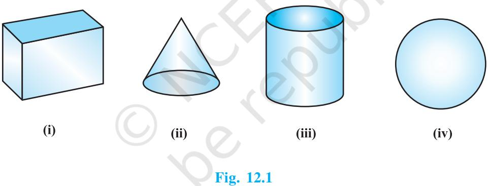

In our day-to-day life, we come across a number of solids made up of combinations of two or more of the basic solids as shown above.

You must have seen a truck with a container fitted on its back (see Fig. 12.2), carrying oil or water from one place to another. Is it in the shape of any of the four basic solids mentioned above? You may guess that it is made of a cylinder with two hemispheres as its ends.

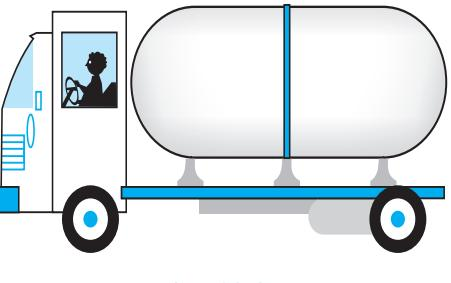

**Fig. 12.2**

Again, you may have seen an object like the one in Fig. 12.3. Can you name it? A test tube, right! You would have used one in your science laboratory. This tube is also a combination of a cylinder and a hemisphere. Similarly, while travelling, you may have seen some big and beautiful buildings or monuments made up of a combination of solids mentioned above.

If for some reason you wanted to find the surface areas, or volumes, or capacities of such objects, how would you do it? We cannot classify these under any of the solids you have already studied.

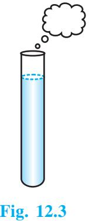

In this chapter, you will see how to find surface areas and volumes of such objects.

#### **12.2 Surface Area of a Combination of Solids**

Let us consider the container seen in Fig. 12.2. How do we find the surface area of such a solid? Now, whenever we come across a new problem, we first try to see, if we can break it down into smaller problems, we have earlier solved. We can see that this solid is made up of a cylinder with two hemispheres stuck at either end. It would look like what we have in Fig. 12.4, after we put the pieces all together.

If we consider the surface of the newly formed object, we would be able to see only the curved surfaces of the two hemispheres and the curved surface of the cylinder.

So, the *total* surface area of the new solid is the sum of the *curved* surface areas of each of the individual parts. This gives,

TSA of new solid = CSA of one hemisphere + CSA of cylinder

+ CSA of other hemisphere

where TSA, CSA stand for 'Total Surface Area' and 'Curved Surface Area' respectively.

Let us now consider another situation. Suppose we are making a toy by putting together a hemisphere and a cone. Let us see the steps that we would be going through.

First, we would take a cone and a hemisphere and bring their flat faces together. Here, of course, we would take the base radius of the cone equal to the radius of the hemisphere, for the toy is to have a smooth surface. So, the steps would be as shown in Fig. 12.5.

At the end of our trial, we have got ourselves a nice round-bottomed toy. Now if we want to find how much paint we would require to colour the surface of this toy, what would we need to know? We would need to know the surface area of the toy, which consists of the CSA of the hemisphere and the CSA of the cone.

So, we can say:

Total surface area of the toy = CSA of hemisphere + CSA of cone

Now, let us consider some examples.

**Example 1 :** Rasheed got a playing top (*lattu*) as his birthday present, which surprisingly had no colour on it. He wanted to colour it with his crayons. The top is shaped like a cone surmounted by a hemisphere (see Fig 12.6). The entire top is 5 cm in height and the diameter of the top is 3.5 cm. Find the area he

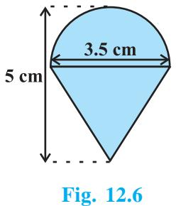

has to colour. (Take = 22 7 )

**Solution :** This top is exactly like the object we have discussed in Fig. 12.5. So, we can conveniently use the result we have arrived at there. That is :

TSA of the toy = CSA of hemisphere + CSA of cone

Now, the curved surface area of the hemisphere = 1 2 2 (4 ) 2 2 *r r*

$$={\dot{\left(2\times{\frac{22}{7}}\times{\frac{3.5}{2}}\times{\frac{3.5}{2}}\right)}}\,\mathrm{cm}^{2}$$

Also, the height of the cone = height of the top – height (radius) of the hemispherical part

$$=\left(5-{\frac{3.5}{2}}\right)\mathrm{cm}=3.25\ \mathrm{cm}$$

So, the slant height of the cone (*l* ) = 2 22 2 3.5 (3.25) cm 2 *r h* = 3.7 cm (approx.)

Therefore, CSA of cone = *rl* = 22 3.5 2 3.7 cm 7 2 

This gives the surface area of the top as

$$=\left(2\times\frac{22}{7}\times\frac{3.5}{2}\times\frac{3.5}{2}\right)\mathrm{cm}^{2}+\left(\frac{22}{7}\times\frac{3.5}{2}\times3.7\right)\mathrm{cm}^{2}$$
 
$$=\frac{22}{7}\times\frac{3.5}{2}\left(3.5+3.7\right)\mathrm{cm}^{2}=\frac{11}{2}\times\left(3.5+3.7\right)\mathrm{cm}^{2}=39,6\mathrm{cm}^{2}\text{(approx.)}$$

You may note that 'total surface area of the top' is *not* the sum of the total surface areas of the cone and hemisphere.

**Example 2 :** The decorative block shown in Fig. 12.7 is made of two solids — a cube and a hemisphere. The base of the block is a cube with edge 5 cm, and the hemisphere fixed on the top has a diameter of 4.2 cm. Find the total surface area of the block.

$$({\mathrm{Take~}}\pi={\frac{22}{7}}\,)$$

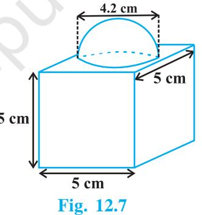

**Solution :** The total surface area of the cube = 6 × (edge)2 = 6 × 5 × 5 cm2 = 150 cm2 . Note that the part of the cube where the hemisphere is attached is not included in the surface area.

So, the surface area of the block = TSA of cube – base area of hemisphere

+ CSA of hemisphere  
  
= 150 - $\pi r^{2}$ + 2 $\pi r^{2}$ = (150 + $\pi r^{2}$) cm${}^{2}$  
  
= 150 cm${}^{2}$ + $\left(\frac{22}{7}\times\frac{4.2}{2}\times\frac{4.2}{2}\right)$ cm${}^{2}$  
  
= (150 + 13.86) cm${}^{2}$ = 163.86 cm${}^{2}$

$\left[\mathrm{~f~}\right]$

*.*

**Example 3 :** A wooden toy rocket is in the shape of a cone mounted on a cylinder, as shown in Fig. 12.8. The height of the entire rocket is 26 cm, while the height of the conical part is 6 cm. The base of the conical portion has a diameter of 5 cm, while the base diameter of the cylindrical portion is 3 cm. If the conical portion is to be painted orange and the cylindrical portion yellow, find the area of the rocket painted with each of these colours. (Take = 3.14)

**Solution :** Denote radius of cone by *r*, slant height of cone by *l*, height of cone by *h*, radius of cylinder by *r* and height of cylinder by *h*. Then *r* = 2.5 cm, *h* = 6 cm, *r* = 1.5 cm, *h* = 26 – 6 = 20 cm and

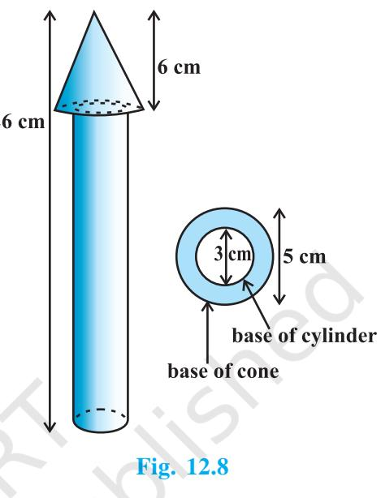

$l=\sqrt{r^{2}+h^{2}}=\sqrt{2.5^{2}+6^{2}}$ cm = 6.5 cm.  
  

Here, the conical portion has its circular base resting on the base of the cylinder, but the base of the cone is larger than the base of the cylinder. So, a part of the base of the cone (a ring) is to be painted.

So, the area to be painted orange = CSA of the cone + base area of the cone – base area of the cylinder

* [20.25] cm${}^{2}$ = 3.14 x 20.25 cm${}^{2}$  
* [20.25] cm${}^{2}$ = 3.14 x 20.25 cm${}^{2}$  
* [20.25] cm${}^{2}$ = 3.14 x 20.25 cm${}^{2}$  
* [20.25] cm${}^{2}$ = 3.14 x 20.25 cm${}^{2}$  
* [20.25] cm${}^{2}$ = 3.14 x 20.25 cm${}^{2}$  
* [20.25] cm${}^{2}$ = 3.14 x 20.25 cm${}^{2}$  
* [20.25] cm${}^{2}$ = 3.14 x 20.25 cm${}^{2}$  
* [20.25]

Now, the area to be painted yellow = CSA of the cylinder

+ area of one base of the cylinder

* 2nr${}^{\prime}$h${}^{\prime}$ + $\pi(r^{\prime})^{2}$  
* $\pi r^{\prime}$ (2h${}^{\prime}$ + $r^{\prime}$)  
* (3.14 x 1.5) (2 x 20 + 1.5) cm${}^{2}$  
* 4.71 x 41.5 cm${}^{2}$  
* 195.465 cm${}^{2}$

**Example 4 :** Mayank made a bird-bath for his garden in the shape of a cylinder with a hemispherical depression at one end (see Fig. 12.9). The height of the cylinder is 1.45 m and its radius is 30 cm. Find the

total surface area of the bird-bath. (Take = 22 7 )

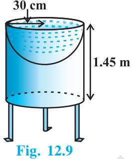

**Solution :** Let *h* be height of the cylinder, and *r* the common radius of the cylinder and hemisphere. Then,

the total surface area of the bird-bath = CSA of cylinder + CSA of hemisphere

$2\pi$_rh_ + 2$\pi$r${}^{2}$ = 2$\pi$r(h + r)  
  
$2\times2$ = 30(145 + 30) cm${}^{2}$  
  
$33000$ cm${}^{2}$ = 3.3 m${}^{2}$

#### **EXERCISE 12.1**

Unless stated otherwise, take = 22 7

- **1.** 2 cubes each of volume 64 cm3 are joined end to end. Find the surface area of the resulting cuboid.
- **2.** A vessel is in the form of a hollow hemisphere mounted by a hollow cylinder. The diameter of the hemisphere is 14 cm and the total height of the vessel is 13 cm. Find the inner surface area of the vessel.
- **3.** A toy is in the form of a cone of radius 3.5 cm mounted on a hemisphere of same radius. The total height of the toy is 15.5 cm. Find the total surface area of the toy.
- **4.** A cubical block of side 7 cm is surmounted by a hemisphere. What is the greatest diameter the hemisphere can have? Find the surface area of the solid.
- **5.** A hemispherical depression is cut out from one face of a cubical wooden block such that the diameter *l* of the hemisphere is equal to the edge of the cube. Determine the surface area of the remaining solid.
- **6.** A medicine capsule is in the shape of a cylinder with two hemispheres stuck to each of its ends (see Fig. 12.10). The length of the entire capsule is 14 mm and the diameter of the capsule is 5 mm. Find its surface area. **Fig. 12.10**

- **7.** A tent is in the shape of a cylinder surmounted by a conical top. If the height and diameter of the cylindrical part are 2.1 m and 4 m respectively, and the slant height of the top is 2.8 m, find the area of the canvas used for making the tent. Also, find the cost of the canvas of the tent at the rate of ` 500 per m2 . (Note that the base of the tent will not be covered with canvas.)
- **8.** From a solid cylinder whose height is 2.4 cm and diameter 1.4 cm, a conical cavity of the same height and same diameter is hollowed out. Find the total surface area of the remaining solid to the nearest cm2 .
- **9.** A wooden article was made by scooping out a hemisphere from each end of a solid cylinder, as shown in Fig. 12.11. If the height of the cylinder is 10 cm, and its base is of radius 3.5 cm, find the total surface area of the article.

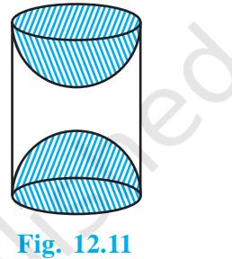

## **12.3 Volume of a Combination of Solids**

In the previous section, we have discussed how to find the surface area of solids made up of a combination of two basic solids. Here, we shall see how to calculate their volumes. It may be noted that in calculating the surface area, we have not added the surface areas of the two constituents, because some part of the surface area disappeared in the process of joining them. However, this will not be the case when we calculate the volume. The volume of the solid formed by joining two basic solids will actually be the sum of the volumes of the constituents, as we see in the examples below.

**Example 5 :** Shanta runs an industry in a shed which is in the shape of a cuboid surmounted by a half cylinder (see Fig. 12.12). If the base of the shed is of dimension 7 m × 15 m, and the height of the cuboidal portion is 8 m, find the volume of air that the shed can hold. Further, suppose the machinery in the shed occupies a total space of 300 m3 , and there are 20 workers, each of whom occupy about 0.08 m3 space on an average. Then, how much air is in the

$${\mathrm{shed?~(Take~}}\pi={\frac{22}{7}}\,)$$

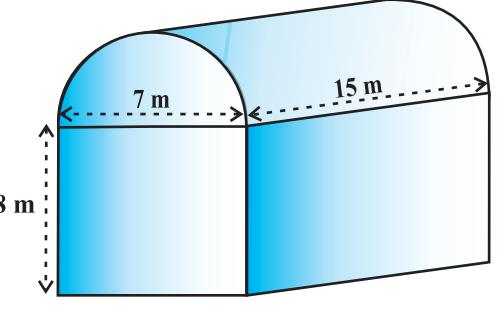

**Fig. 12.12**

**Solution :** The volume of air inside the shed (when there are no people or machinery) is given by the volume of air inside the cuboid and inside the half cylinder, taken together.

Now, the length, breadth and height of the cuboid are 15 m, 7 m and 8 m, respectively. Also, the diameter of the half cylinder is 7 m and its height is 15 m.

So, the required volume = volume of the cuboid + 1 2 volume of the cylinder

$$=\left[15\times7\times8+{\frac{1}{2}}\times{\frac{22}{7}}\times{\frac{7}{2}}\times{\frac{7}{2}}\times15\right]\mathrm{m}^{3}=1128.75\,\mathrm{m}^{3}$$

Next, the total space occupied by the machinery = 300 m3

And the total space occupied by the workers = 20 × 0.08 m3 = 1.6 m3

Therefore, the volume of the air, when there are machinery and workers

* [1128.75 - (300.00 + 1.60) = 827.15 m${}^{3}$

**Example 6 :** A juice seller was serving his customers using glasses as shown in Fig. 12.13. The inner diameter of the cylindrical glass was 5 cm, but the bottom of the glass had a hemispherical raised portion which reduced the capacity of the glass. If the height of a glass was 10 cm, find the apparent capacity of the glass and its actual capacity. (Use = 3.14.)

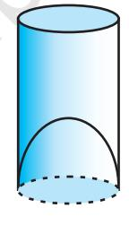

**Fig. 12.13**

**Solution :** Since the inner diameter of the glass = 5 cm and height = 10 cm,

the apparent capacity of the glass = *r*2 *h*

> = 3.14 × 2.5 × 2.5 × 10 cm3 = 196.25 cm3

But the actual capacity of the glass is less by the volume of the hemisphere at the base of the glass.

$$i.e., it is less by \frac{2}{3}\pi r^{3}=\frac{2}{3}\times3.14\times2.5\times2.5\times2.5\mathrm{cm}^{3}=32.71\mathrm{cm}^{3}$$

So, the actual capacity of the glass = apparent capacity of glass – volume of the hemisphere

$$=(196.25-32.71)\;\mathrm{cm}^{3}$$

$$=\,163.54{\mathrm{~cm}}^{3}$$

**Example 7 :** A solid toy is in the form of a hemisphere surmounted by a right circular cone. The height of the cone is 2 cm and the diameter of the base is 4 cm. Determine the volume of the toy. If a right circular cylinder circumscribes the toy, find the difference of the volumes of the cylinder and the toy. (Take = 3.14)

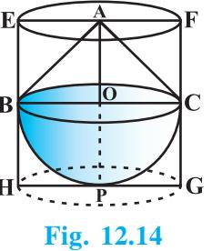

**Solution :** Let BPC be the hemisphere and ABC be the cone standing on the base of the hemisphere (see Fig. 12.14). The radius BO of the hemisphere (as well as

of the cone) = $\frac{1}{2}\times4$ cm = 2 cm.  
  
So, volume of the toy = $\frac{\cdot}{3}\pi r^{3}+\frac{1}{3}\pi r^{2}h$  
  

$$=\left[\frac{2}{3}\times3.14\times(2)^{3}+\frac{1}{3}\times3.14\times(2)^{3}\times2\right]\text{cm}^{3}=25.12\text{cm}^{3}$$

Now, let the right circular cylinder EFGH circumscribe the given solid. The radius of the base of the right circular cylinder = HP = BO = 2 cm, and its height is

EH = AO + OP = (2 + 2) cm = 4 cm

So, the volume required = volume of the right circular cylinder – volume of the toy

 = (3.14 × 22 × 4 – 25.12) cm3 = 25.12 cm3

Hence, the required difference of the two volumes = 25.12 cm3 .

#### **EXERCISE 12.2**

Unless stated otherwise, take = 22 7 .

- A solid is in the shape of a cone standing on a hemisphere with both their radii being equal to 1 cm and the height of the cone is equal to its radius. Find the volume of the solid in terms of .
- **2.** Rachel, an engineering student, was asked to make a model shaped like a cylinder with two cones attached at its two ends by using a thin aluminium sheet. The diameter of the model is 3 cm and its length is 12 cm. If each cone has a height of 2 cm, find the volume of air contained in the model that Rachel made. (Assume the outer and inner dimensions of the model to be nearly the same.)
- **3.** A *gulab jamun,* contains sugar syrup up to about 30% of its volume. Find approximately how much syrup would be found in 45 *gulab jamuns,* each shaped like a cylinder with two hemispherical ends with length 5 cm and diameter 2.8 cm (see Fig. 12.15).
- **4.** A pen stand made of wood is in the shape of a cuboid with four conical depressions to hold pens. The dimensions of the cuboid are 15 cm by 10 cm by 3.5 cm. The radius of each of the depressions is 0.5 cm and the depth is 1.4 cm. Find the volume of wood in the entire stand (see Fig. 12.16).
- **5.** A vessel is in the form of an inverted cone. Its height is 8 cm and the radius of its top, which is open, is 5 cm. It is filled with water up to the brim. When lead shots, each of which is a sphere of radius 0.5 cm are dropped into the vessel, one-fourth of the water flows out. Find the number of lead shots dropped in the vessel.

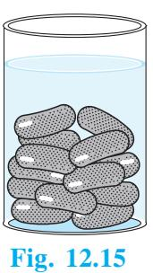

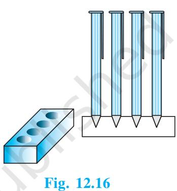

- **6.** A solid iron pole consists of a cylinder of height 220 cm and base diameter 24 cm, which is surmounted by another cylinder of height 60 cm and radius 8 cm. Find the mass of the pole, given that 1 cm3 of iron has approximately 8g mass. (Use = 3.14)
- **7.** A solid consisting of a right circular cone of height 120 cm and radius 60 cm standing on a hemisphere of radius 60 cm is placed upright in a right circular cylinder full of water such that it touches the bottom. Find the volume of water left in the cylinder, if the radius of the cylinder is 60 cm and its height is 180 cm.
- **8.** A spherical glass vessel has a cylindrical neck 8 cm long, 2 cm in diameter; the diameter of the spherical part is 8.5 cm. By measuring the amount of water it holds, a child finds its volume to be 345 cm3 . Check whether she is correct, taking the above as the inside measurements, and = 3.14.

## **12.4 Summary**

In this chapter, you have studied the following points:

- **1.** To determine the surface area of an object formed by combining any two of the basic solids, namely, cuboid, cone, cylinder, sphere and hemisphere.
- **2.** To find the volume of objects formed by combining any two of a cuboid, cone, cylinder, sphere and hemisphere.

