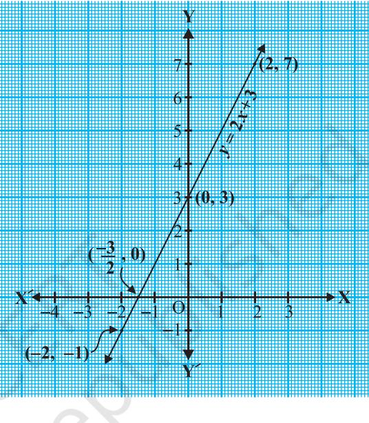
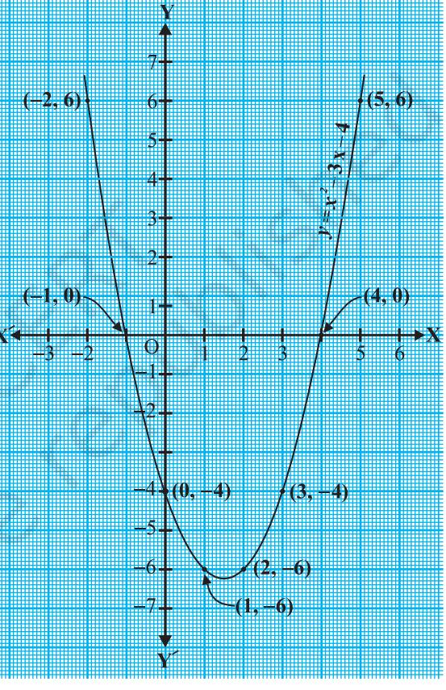
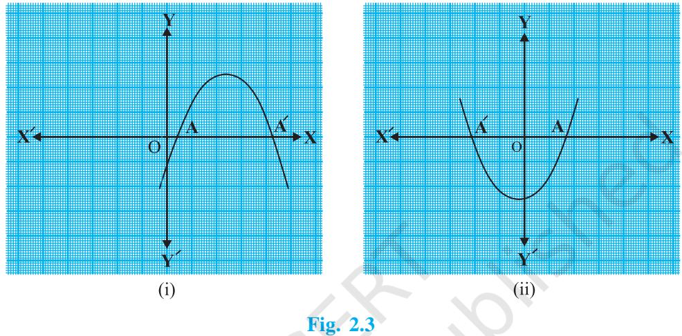
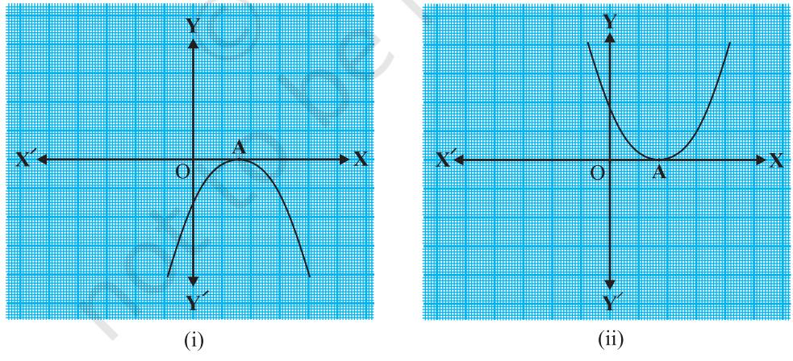
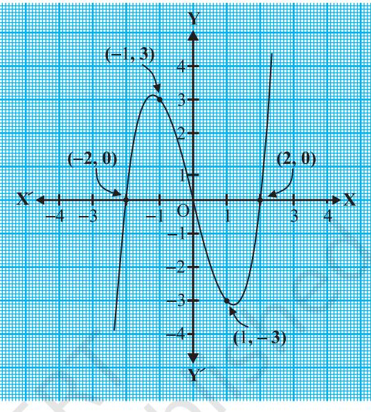
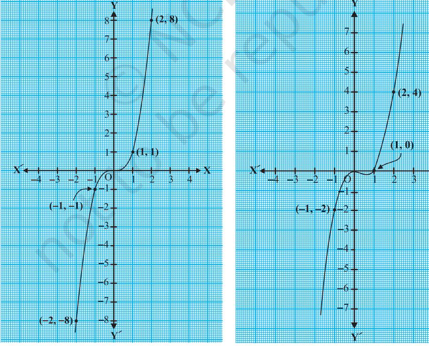
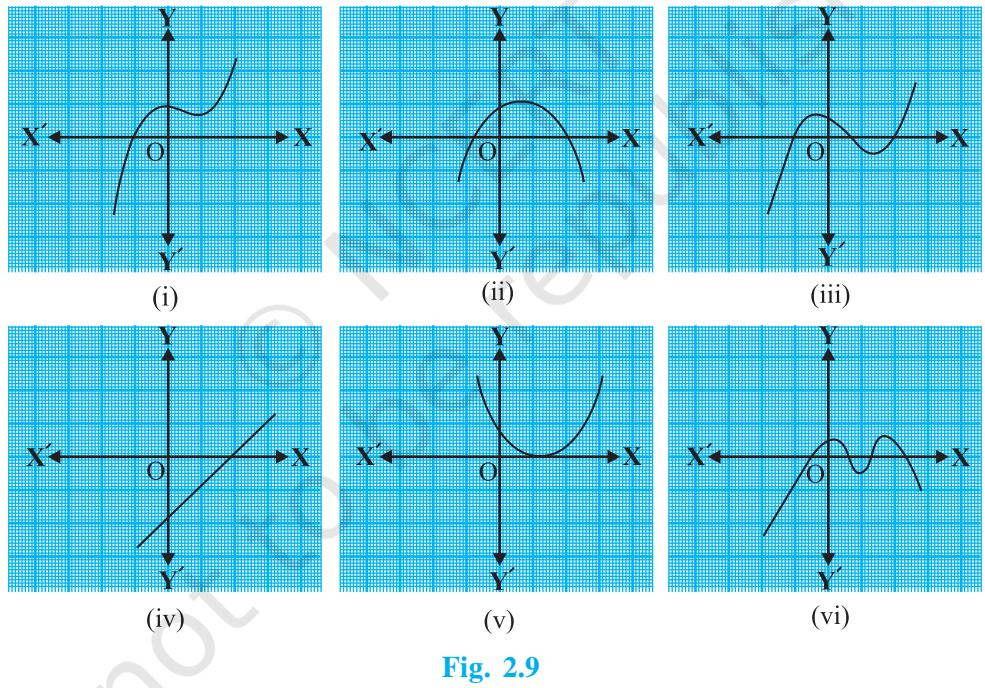
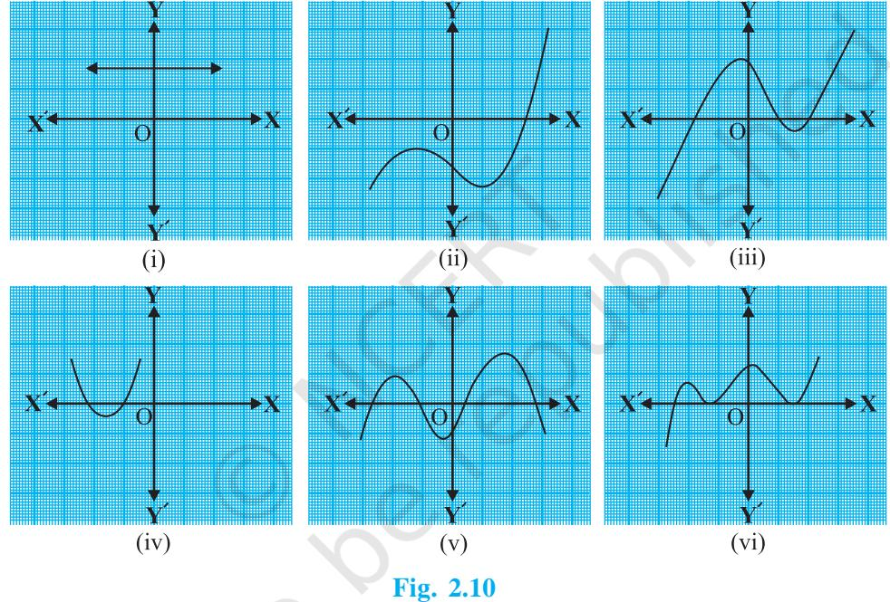

**2**

## **2.1 Introduction**

In Class IX, you have studied polynomials in one variable and their degrees. Recall that if *p*(*x*) is a polynomial in *x*, the highest power of *x* in *p*(*x*) is called **the degree of the polynomial** *p*(*x*). For example, 4*x* + 2 is a polynomial in the variable *x* of degree 1, 2*y*2 – 3*y* + 4 is a polynomial in the variable *y* of degree 2, 5*x*3 – 4*x*2 + *x* – 2

is a polynomial in the variable *x* of degree 3 and 7*u*6 – 3 4 2 4 8 2 *u uu* is a polynomial

in the variable *u* of degree 6. Expressions like 1 *x* 1 , *x* 2 , 2 1 *x x* 2 3 etc., are not polynomials.

A polynomial of degree 1 is called a **linear polynomial**. For example, 2*x* – 3, 3 5, *x y* 2 , 2 11 *x* , 3*z* + 4, 2 1 3 *u* , etc., are all linear polynomials. Polynomials such as 2*x* + 5 – *x*2 , *x*3 + 1, etc., are not linear polynomials.

A polynomial of degree 2 is called a **quadratic polynomial**. The name 'quadratic' has been derived from the word 'quadrate', which means 'square'. 2 2 2 3 , 5 *x x*

$y^{2}-2$, $\frac{\sqrt{3}}{2}x^{2}+\sqrt{3}x$, $\frac{u}{3}-2u^{2}+5,\sqrt{5}v^{2}-\frac{2}{3}v,4z^{2}+\frac{1}{7}$ are some examples of 

quadratic polynomials (whose coefficients are real numbers). More generally, any quadratic polynomial in *x* is of the form *ax*2  *+ bx* + *c*, where *a*, *b*, *c* are real numbers and *a* 0. A polynomial of degree 3 is called a **cubic polynomial**. Some examples of

a cubic polynomial are 2 – *x*3 , *x*3 , 3 2 , *x* 3 – *x*2 + *x*3 , 3*x*3 – 2*x*2 + *x* – 1. In fact, the most general form of a cubic polynomial is

$$a x^{3}+b x^{2}+c x+d,$$

where, *a*, *b*, *c*, *d* are real numbers and *a* 0.

Now consider the polynomial *p*(*x*) = *x*2 – 3*x* – 4. Then, putting *x* = 2 in the polynomial, we get *p*(2) = 22 – 3 × 2 – 4 = – 6. The value '– 6', obtained by replacing *x* by 2 in *x*2 – 3*x* – 4, is the value of *x*2 – 3*x* – 4 at *x* = 2. Similarly, *p*(0) is the value of *p*(*x*) at *x* = 0, which is – 4.

If *p*(*x*) is a polynomial in *x*, and if *k* is any real number, then the value obtained by replacing *x* by *k* in *p*(*x*), is called **the value of** *p***(***x***) at** *x* **=** *k*, and is denoted by *p*(*k*).

> What is the value of *p*(*x*) = *x*2 –3*x* – 4 at *x* = –1? We have :

$$p(-1)=(-1)^{2}-\{3\times(-1)\}-4=0$$

Also, note that *p*(4) = 42 – (3 4) – 4 = 0.

As *p*(–1) = 0 and *p*(4) = 0, –1 and 4 are called the zeroes of the quadratic polynomial *x*2 – 3*x* – 4. More generally, a real number *k* is said to be a **zero of a polynomial** *p***(***x***)**, if *p*(*k*) = 0.

You have already studied in Class IX, how to find the zeroes of a linear polynomial. For example, if *k* is a zero of *p*(*x*) = 2*x* + 3, then *p*(*k*) = 0 gives us 2*k* + 3 = 0, i.e., *k* = 3 

2 In general, if *k* is a zero of *p*(*x*) = *ax* + *b*, then *p*(*k*) = *ak* + *b* = 0, i.e., *b k a* So, the zero of the linear polynomial *ax* + *b* is (Constant term) Coefficient of *b a x* .

Thus, the zero of a linear polynomial is related to its coefficients. Does this happen in the case of other polynomials too? For example, are the zeroes of a quadratic polynomial also related to its coefficients?

In this chapter, we will try to answer these questions. We will also study the division algorithm for polynomials.

## **2.2 Geometrical Meaning of the Zeroes of a Polynomial**

You know that a real number *k* is a zero of the polynomial *p*(*x*) if *p*(*k*) = 0. But why are the zeroes of a polynomial so important? To answer this, first we will see the **geometrical** representations of linear and quadratic polynomials and the geometrical meaning of their zeroes.

Consider first a linear polynomial *ax* + *b*, *a* 0. You have studied in Class IX that the graph of *y* = *ax* + *b* is a straight line. For example, the graph of *y* = 2*x* + 3 is a straight line passing through the points (– 2, –1) and (2, 7).

| x | –2 | 2 |
| --- | --- | --- |
| y = 2x + 3 | –1 | 7 |

From Fig. 2.1, you can see that the graph of *y* = 2*x* + 3 intersects the *x* -axis mid-way between *x* = –1 and *x* = – 2, that is, at the point 3 , 0 2 . You also know that the zero of 2*x* + 3 is 3 2 . Thus, the zero of the polynomial 2*x* + 3 is the *x*-coordinate of the point where the graph of *y* = 2*x* + 3 intersects the *x*-axis.

**Fig. 2.1**

In general, for a linear polynomial *ax* + *b*, *a* 0, the graph of *y* = *ax* + *b* is a straight line which intersects the *x*-axis at exactly one point, namely, , 0 *b a* . Therefore, the linear polynomial *ax* + *b*, *a* 0, has exactly one zero, namely, the

*x*-coordinate of the point where the graph of *y* = *ax* + *b* intersects the *x*-axis.

Now, let us look for the geometrical meaning of a zero of a quadratic polynomial. Consider the quadratic polynomial *x*2 – 3*x* – 4. Let us see what the graph* of *y* = *x*2 – 3*x* – 4 looks like. Let us list a few values of *y* = *x*2 – 3*x* – 4 corresponding to a few values for *x* as given in Table 2.1.

* Plotting of graphs of quadratic or cubic polynomials is not meant to be done by the students, nor is to be evaluated.

#### **Table 2.1**

| x |  | – 2 | –1 | 0 | 1 | 2 | 3 | 4 | 5 |
| --- | --- | --- | --- | --- | --- | --- | --- | --- | --- |
| y = x2 | – 3x – 4 | 6 | 0 | – 4 | – 6 | – 6 | – 4 | 0 | 6 |

If we locate the points listed above on a graph paper and draw the graph, it will actually look like the one given in Fig. 2.2.

In fact, for any quadratic polynomial *ax*2 + *bx* + *c*, *a* 0, the graph of the corresponding equation *y* = *ax*2 + *bx* + *c* has one of the two shapes either open upwards like or open downwards like depending on whether *a* > 0 or *a* < 0. (These curves are called **parabolas**.)

You can see from Table 2.1 that –1 and 4 are zeroes of the quadratic polynomial. Also note from Fig. 2.2 that –1 and 4 are the *x*-coordinates of the points where the graph of *y* = *x*2 – 3*x* – 4 intersects the *x*-axis. Thus, the zeroes of the quadratic polynomial *x*2 – 3*x* – 4 are *x*-coordinates of the points where the graph of *y* = *x*2 – 3*x* – 4 intersects the *x*-axis.

**Fig. 2.2**

This fact is true for any quadratic polynomial, i.e., the zeroes of a quadratic polynomial *ax*2 + *bx* + *c*, *a* 0, are precisely the *x*-coordinates of the points where the parabola representing *y* = *ax*2 + *bx* + *c* intersects the *x*-axis.

From our observation earlier about the shape of the graph of *y* = *ax*2 + *bx* + *c*, the following three cases can happen:

**Case (i) :** Here, the graph cuts *x*-axis at two distinct points A and A.

The *x*-coordinates of A and A are the **two zeroes** of the quadratic polynomial *ax*2 + *bx* + *c* in this case (see Fig. 2.3).

**Case (ii) :** Here, the graph cuts the *x*-axis at exactly one point, i.e., at two coincident points. So, the two points A and A of Case (i) coincide here to become one point A (see Fig. 2.4).

**Fig. 2.4**

The *x*-coordinate of A is the **only zero** for the quadratic polynomial *ax*2 + *bx* + *c* in this case.

**Case (iii) :** Here, the graph is either completely above the *x*-axis or completely below the *x*-axis. So, it does not cut the *x*-axis at any point (see Fig. 2.5).

So, the quadratic polynomial *ax*2 + *bx* + *c* has **no zero** in this case.

So, you can see geometrically that a quadratic polynomial can have either two distinct zeroes or two equal zeroes (i.e., one zero), or no zero. This also means that a polynomial of degree 2 has atmost two zeroes.

Now, what do you expect the geometrical meaning of the zeroes of a cubic polynomial to be? Let us find out. Consider the cubic polynomial *x*3 – 4*x*. To see what the graph of *y* = *x*3 – 4*x* looks like, let us list a few values of *y* corresponding to a few values for *x* as shown in Table 2.2.

|  | Table 2.2 |  |  |  |  |  |
| --- | --- | --- | --- | --- | --- | --- |
| x |  | –2 | –1 | 0 | 1 | 2 |
| y = x3 | – 4x | 0 | 3 | 0 | –3 | 0 |

Locating the points of the table on a graph paper and drawing the graph, we see that the graph of *y* = *x*3 – 4*x* actually looks like the one given in Fig. 2.6.

We see from the table above that – 2, 0 and 2 are zeroes of the cubic polynomial *x*3 – 4*x*. Observe that – 2, 0 and 2 are, in fact, the *x*-coordinates of the only points where the graph of *y* = *x*3 – 4*x* intersects the *x*-axis. Since the curve meets the *x*-axis in only these 3 points, their *x*-coordinates are the only zeroes of the polynomial.

Let us take a few more examples. Consider the cubic polynomials *x*3 and *x*3 – *x*2 . We draw the graphs of *y* = *x*3 and *y* = *x*3 – *x*2 in Fig. 2.7 and Fig. 2.8 respectively.

**Fig. 2.6**

Note that 0 is the only zero of the polynomial *x*3 . Also, from Fig. 2.7, you can see that 0 is the *x*-coordinate of the only point where the graph of *y* = *x*3 intersects the *x*-axis. Similarly, since *x*3 – *x*2 = *x*2 (*x* – 1), 0 and 1 are the only zeroes of the polynomial *x*3 – *x*2 . Also, from Fig. 2.8, these values are the *x*-coordinates of the only points where the graph of *y* = *x*3 – *x*2 intersects the *x*-axis.

From the examples above, we see that there are at most 3 zeroes for any cubic polynomial. In other words, any polynomial of degree 3 can have at most three zeroes.

**Remark :** In general, given a polynomial *p*(*x*) of degree *n*, the graph of *y* = *p*(*x*) intersects the *x*-axis at atmost *n* points. Therefore, a polynomial *p*(*x*) of degree *n* has at most *n* zeroes.

**Example 1 :** Look at the graphs in Fig. 2.9 given below. Each is the graph of *y* = *p*(*x*), where *p*(*x*) is a polynomial. For each of the graphs, find the number of zeroes of *p*(*x*).

#### **Solution :**

- (i) The number of zeroes is 1 as the graph intersects the *x*-axis at one point only.
- (ii) The number of zeroes is 2 as the graph intersects the *x*-axis at two points.
- (iii) The number of zeroes is 3. (Why?)
- (iv) The number of zeroes is 1. (Why?)
- (v) The number of zeroes is 1. (Why?)
- (vi) The number of zeroes is 4. (Why?)

## **EXERCISE 2.1**

- **1.** The graphs of *y* = *p*(*x*) are given in Fig. 2.10 below, for some polynomials *p*(*x*). Find the number of zeroes of *p*(*x*), in each case.

## **2.3 Relationship between Zeroes and Coefficients of a Polynomial**

You have already seen that zero of a linear polynomial *ax* + *b* is *b a* . We will now try to answer the question raised in Section 2.1 regarding the relationship between zeroes and coefficients of a quadratic polynomial. For this, let us take a quadratic polynomial, say *p*(*x*) = 2*x*2 – 8*x* + 6. In Class IX, you have learnt how to factorise quadratic polynomials by splitting the middle term. So, here we need to split the middle term '– 8*x*' as a sum of two terms, whose product is 6 × 2*x*2 = 12*x*2 . So, we write

$2x^{2}-8x+6=2x^{2}-6x-2x+6=2x(x-3)-2(x-3)$  
  
$=(2x-2)(x-3)=2(x-1)(x-3)$

So, the value of *p*(*x*) = 2*x*2 – 8*x* + 6 is zero when *x* – 1 = 0 or *x* – 3 = 0, i.e., when *x* = 1 or *x* = 3. So, the zeroes of 2*x*2 – 8*x* + 6 are 1 and 3. Observe that :

Sum of its zeroes $=1+3=4=\frac{-(-8)}{2}=\frac{-(\text{Coefficient of}x)}{\text{Coefficient of}x^{2}}$  
  
Product of its zeroes $=1\times3=3=\frac{6}{2}=\frac{\text{Constant term}}{\text{Coefficient of}x^{2}}$

Let us take one more quadratic polynomial, say, *p*(*x*) = 3*x*2 + 5*x* – 2. By the method of splitting the middle term,

$3x^{2}+5x-2=3x^{2}+6x-x-2=3x(x+2)-1(x+2)$  
  
$=(3x-1)(x+2)$

Hence, the value of 3*x*2 + 5*x* – 2 is zero when either 3*x* – 1 = 0 or *x* + 2 = 0, i.e., when *x* = 1 3 or *x* = –2. So, the zeroes of 3*x*2 + 5*x* – 2 are 1 3 and – 2. Observe that :

Sum of its zeroes $\begin{array}{c}\includegraphics[height=36.135pt]{28.eps}\end{array}$  
  
\(\begin{array}{c}\includegraphics[height=36.  
  

Product of its zeroes = $\frac{1}{3}\times(-2)=\frac{2}{3}=\frac{2}{3}=\frac{2}{3}$Constant term 

In general, if * and * are the zeroes of the quadratic polynomial *p*(*x*) = *ax*2 + *bx* + *c*, *a* 0, then you know that *x* – and *x* – are the factors of *p*(*x*). Therefore,

$$ax^{2}+bx+c=k(x-\alpha)(x-\beta), where k is a constant.

=k[x^{2}-(\alpha+\beta)x+\alpha\ \beta]

=kx^{2}-k(\alpha+\beta)x+k\ \alpha\ \beta$$

Comparing the coefficients of *x*2 , *x* and constant terms on both the sides, we get

$a=k$, $b=-k(a+\beta)$ and $c=k\alpha\beta$.  
  

This gives  **+ =** *–b*

$${\sf\Phi}+{\sf\beta}=\,\frac{c}{a}\,,$$

* , are Greek letters pronounced as 'alpha' and 'beta' respectively. We will use later one more letter '' pronounced as 'gamma'.

i.e., sum of zeroes $=\alpha+\beta=-\frac{b}{a}=\frac{-(\text{Coefficient of}x)}{\text{Coefficient of}x^{2}}$,

product of zeroes $=\alpha\beta=\frac{c}{a}=\frac{\text{Constant term}}{\text{Coefficient of}x^{2}}$.  
  

Let us consider some examples.

**Example 2 :** Find the zeroes of the quadratic polynomial *x*2 + 7*x* + 10, and verify the relationship between the zeroes and the coefficients.

**Solution :** We have

$$x^{2}+7x+10=(x+2)(x+5)$$

So, the value of *x*2 + 7*x* + 10 is zero when *x* + 2 = 0 or *x* + 5 = 0, i.e., when *x* = – 2 or *x* = –5. Therefore, the zeroes of *x*2 + 7*x* + 10 are – 2 and – 5. Now,

sum of zeroes $=-2+(-5)\!=\!(7)\!=\!\frac{-(7)}{1}\!=\!\frac{-(\mbox{Coefficient of}x)}{1}$.  
  

product of zeroes = 2 10 Constant term ( 2) ( 5) 10 1 Coefficient of *x* 

**Example 3 :** Find the zeroes of the polynomial *x*2 – 3 and verify the relationship between the zeroes and the coefficients.

**Solution :** Recall the identity *a*2 – *b*2 = (*a* – *b*)(*a* + *b*). Using it, we can write:

$$x^{2}-3=\left(x-{\sqrt{3}}\right)\left(x+{\sqrt{3}}\right)$$

So, the value of *x*2 – 3 is zero when *x* = 3 or *x* = – 3

Therefore, the zeroes of *x*2 – 3 are 3 and 3 Now,

sum of zeroes = $\sqrt{3}-\sqrt{3}=0=\frac{-(\text{Coefficient of}x)}{\text{Coefficient of}x^{2}}$

product of zeroes $=\left(\sqrt{3}\right)\left(-\sqrt{3}\right)=-3=\frac{-3}{1}=\frac{\text{Constant term}}{\text{Coefficient of}x^{2}}$.  
  

**Example 4 :** Find a quadratic polynomial, the sum and product of whose zeroes are – 3 and 2, respectively.

**Solution :** Let the quadratic polynomial be *ax*2 + *bx* + *c*, and its zeroes be and . We have

$$\alpha+\beta=-\,3=\frac{\stackrel{\cdot}{-b}}{a},$$

and = 2 = *c a*

If *a* = 1, then *b* = 3 and *c* = 2. So, one quadratic polynomial which fits the given conditions is *x*2

You can check that any other quadratic polynomial that fits these conditions will be of the form *k*(*x*2 + 3*x* + 2), where *k* is real.

.

Let us now look at cubic polynomials. Do you think a similar relation holds between the zeroes of a cubic polynomial and its coefficients?

> Let us consider *p*(*x*) = 2*x*3 – 5*x*2 – 14*x* + 8.

You can check that *p*(*x*) = 0 for *x* = 4, – 2, 1 2 Since *p*(*x*) can have atmost three zeroes, these are the zeores of 2*x*3 – 5*x*2 – 14*x* + 8. Now,

sum of the zeroes = $4+(-2)+\frac{1}{2}=\frac{5}{2}=\frac{-(-5)}{2}=\frac{-(\text{Coefficient of}\ x^{2})}{\text{Coefficient of}\ x^{3}}$,

product of the zeroes = 3 1 8 – Constant term 4 ( 2) 4 2 2 Coefficient of *x* .

However, there is one more relationship here. Consider the sum of the products of the zeroes taken two at a time. We have

$$\left\{4\times(-2)\right\}\pm\left\{(-2)\times\frac{1}{2}\right\}+\left\{\frac{1}{2}\times4\right\}$$
 
$$\cdot$$
 
$$=-8-1+2=-7=\frac{-14}{2}=\frac{\text{Coefficient of}x}{\text{Coefficient of}x^{3}}\cdot$$

In general, it can be proved that if , , are the zeroes of the cubic polynomial *ax*3 + *bx*2 + *cx* + *d*, then

+ 3*x* + 2.

$$\begin{array}{c}{{\alpha+\beta+\gamma=\frac{-b}{a},}}\\ {{\alpha\beta+\beta\gamma+\gamma\alpha=\frac{c}{a},}}\\ {{\alpha\beta\gamma=\frac{-d}{a}.}}\end{array}$$

Let us consider an example.

**Example 5* :** Verify that 3, –1, 1 3 are the zeroes of the cubic polynomial *p*(*x*) = 3*x*3 – 5*x*2 – 11*x* – 3, and then verify the relationship between the zeroes and the coefficients.

**Solution :** Comparing the given polynomial with *ax*3 + *bx*2 + *cx* + *d*, we get

$a=3$, $b=-5$, $c=-11$, $d=-3$. Further  
  
$p(3)=3\times3^{3}-(5\times3^{2})-(11\times3)=3=81-45-33=0$,  
  
$p(-1)=3\times(-1)^{3}-5\times(-1)^{2}-11\times(-1)-3=-3-5+11-3=0$,  
  
$p\left(-\frac{1}{3}\right)=3\times\left(-\frac{1}{3}\right)^{3}-5\times\left(-\frac{1}{3}\right)^{2}-11\times\left(-\frac{1}{3}\right)=3$,  
  
$\cdot$  
  
$=-\frac{1}{9}\left(-\frac{5}{9}+\frac{11}{3}-3=-\frac{2}{3}+\frac{2}{3}=0\right.$

Therefore, 3, –1 and 1 3 are the zeroes of 3*x*3 – 5*x*2 – 11*x* – 3. So, we take = 3, = –1 and = 1 3 Now,

$$\alpha+\beta+\gamma\dot{=}3+(-1)+\left(-\frac{1}{3}\right)=2-\frac{1}{3}=\frac{5}{3}=\frac{-(-5)}{3}=\frac{-b}{a}\,,$$
 
$$\alpha\beta+\beta\gamma\dot{+}\gamma\alpha=3\times(-1)+(-1)\times\left(-\frac{1}{3}\right)+\left(-\frac{1}{3}\right)\times3=-3+\frac{1}{3}-1=\frac{-11}{3}=\frac{c}{a}\,,$$
 
$$\alpha\beta\gamma=3\times(-1)\times\left(-\frac{1}{3}\right)=1=\frac{-(-3)}{3}=\frac{-d}{a}\,.$$

* Not from the examination point of view.

## **EXERCISE 2.2**

- **1.** Find the zeroes of the following quadratic polynomials and verify the relationship between the zeroes and the coefficients.
	- (i) *x*2 – 2*x* – 8 (ii) 4*s*2 – 4*s* + 1 (iii) 6*x*2 – 3 – 7*x* (iv) 4*u*2 + 8*u* (v) *t* 2 – 15 (vi) 3*x*2 – *x* – 4
- **2.** Find a quadratic polynomial each with the given numbers as the sum and product of its zeroes respectively.

| (i) | 1 | , |  1 | (ii) |  | 2 , |  | 1 | (iii) 0, 5 |
| --- | --- | --- | --- | --- | --- | --- | --- | --- | --- |
|  | 4 |  |  |  |  |  |  | 3 |  |
| (iv) | 1, 1 |  |  | (v) |  | 1 | , | 1 | (vi) 4, 1 |
|  |  |  |  |  |  | 4 |  | 4 |  |

## **2.4 Summary**

In this chapter, you have studied the following points:

- **1.** Polynomials of degrees 1, 2 and 3 are called linear, quadratic and cubic polynomials respectively.
- **2.** A quadratic polynomial in *x* with real coefficients is of the form *ax*2 + *bx* + *c*, where *a*, *b*, *c* are real numbers with *a* 0.
- **3.** The zeroes of a polynomial *p*(*x*) are precisely the *x*-coordinates of the points, where the graph of *y* = *p*(*x*) intersects the *x* -axis.
- **4.** A quadratic polynomial can have at most 2 zeroes and a cubic polynomial can have at most 3 zeroes.
- **5.** If and are the zeroes of the quadratic polynomial *ax*2 + *bx* + *c*, then

$$\alpha+\beta=-\frac{b}{a},\quad\alpha\beta=\frac{c}{a}.$$

- **6.** If , , are the zeroes of the cubic polynomial *ax*3 + *bx*2 + *cx* + *d*, then

$$\alpha\beta+\beta+\gamma\alpha=\frac{c}{a}$$

and *a* .

