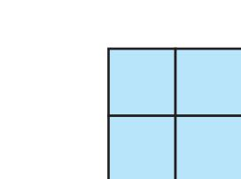
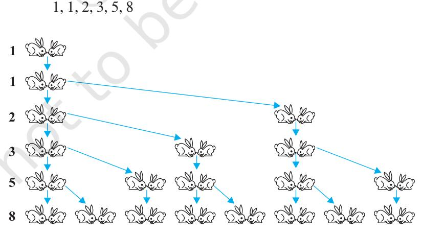
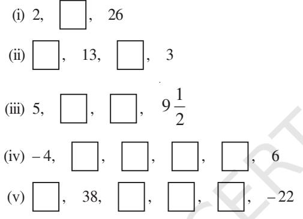
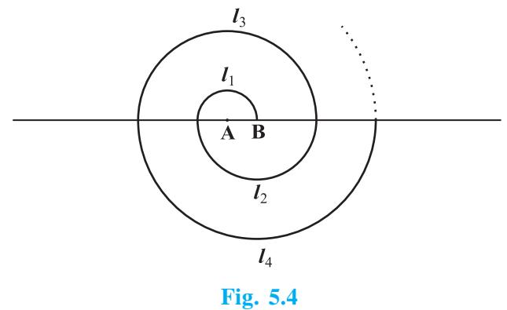
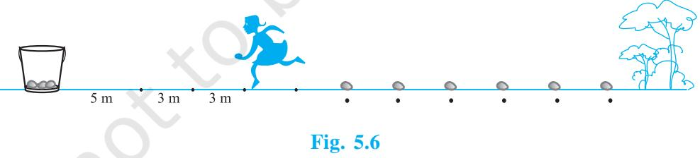
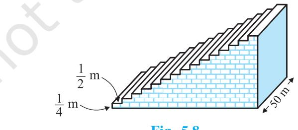

# **5.1 Introduction**

You must have observed that in nature, many things follow a certain pattern, such as the petals of a sunflower, the holes of a honeycomb, the grains on a maize cob, the spirals on a pineapple and on a pine cone, etc.

We now look for some patterns which occur in our day-to-day life. Some such examples are :

- (i) Reena applied for a job and got selected. She has been offered a job with a starting monthly salary of ` 8000, with an annual increment of ` 500 in her salary. Her salary (in `) for the 1st, 2nd, 3rd, . . . years will be, respectively
8000, 8500, 9000, . . . .

- (ii) The lengths of the rungs of a ladder decrease uniformly by 2 cm from bottom to top (see Fig. 5.1). The bottom rung is 45 cm in length. The lengths (in cm) of the 1st, 2nd, 3rd, . . ., 8th rung from the bottom to the top are, respectively
45, 43, 41, 39, 37, 35, 33, 31

**5**

**Fig. 5.1**

(iii) In a savings scheme, the amount becomes 5 4 times of itself after every 3 years.

The maturity amount (in `) of an investment of ` 8000 after 3, 6, 9 and 12 years will be, respectively :

10000, 12500, 15625, 19531.25

- (iv) The number of unit squares in squares with side 1, 2, 3, . . . units (see Fig. 5.2) are, respectively
12 , 22 , 32 , . . . .

- (v) Shakila puts ` 100 into her daughter's money box when she was one year old and increased the amount by ` 50 every year. The amounts of money (in `) in the box on the 1st, 2nd, 3rd, 4th, . . . birthday were
100, 150, 200, 250, . . ., respectively.

- (vi) A pair of rabbits are too young to produce in their first month. In the second, and every subsequent month, they produce a new pair. Each new pair of rabbits produce a new pair in their second month and in every subsequent month (see Fig. 5.3). Assuming no rabbit dies, the number of pairs of rabbits at the start of the 1st, 2nd, 3rd, . . ., 6th month, respectively are :

**Fig. 5.3**

In the examples above, we observe some patterns. In some, we find that the succeeding terms are obtained by adding a fixed number, in other by multiplying with a fixed number, in another we find that they are squares of consecutive numbers, and so on.

In this chapter, we shall discuss one of these patterns in which succeeding terms are obtained by adding a fixed number to the preceding terms. We shall also see how to find their *n*th terms and the sum of *n* consecutive terms, and use this knowledge in solving some daily life problems.

# **5.2 Arithmetic Progressions**

Consider the following lists of numbers :

- (i) 1, 2, 3, 4, . . .
- (ii) 100, 70, 40, 10, . . .
- (iii) 3, –2, –1, 0, . . .
- (iv) 3, 3, 3, 3, . . .
- (v) –1.0, –1.5, –2.0, –2.5, . . .

Each of the numbers in the list is called a **term**.

Given a term, can you write the next term in each of the lists above? If so, how will you write it? Perhaps by following a pattern or rule. Let us observe and write the rule.

In (i), each term is 1 more than the term preceding it.

In (ii), each term is 30 less than the term preceding it.

In (iii), each term is obtained by adding 1 to the term preceding it.

In (iv), all the terms in the list are 3 , i.e., each term is obtained by adding (or subtracting) 0 to the term preceding it.

In (v), each term is obtained by adding – 0.5 to (i.e., subtracting 0.5 from) the term preceding it.

In all the lists above, we see that successive terms are obtained by adding a fixed number to the preceding terms. Such list of numbers is said to form an **Arithmetic Progression ( AP )**.

So, **an arithmetic progression is a list of numbers in which each term is obtained by adding a fixed number to the preceding term except the first term.**

This fixed number is called the **common difference** of the AP. Remember that it **can be positive, negative or zero**.

Let us denote the first term of an AP by *a*1 , second term by *a*2 , . . ., *n*th term by *an* and the common difference by *d*. Then the AP becomes *a*1 , *a*2 , *a*3 , . . ., *an* .

So, *a*2 – *a*1 = *a*3 – *a*2 = . . . = *an* – *an* – 1 = *d*.

Some more examples of AP are:

- (a) The heights ( in cm ) of some students of a school standing in a queue in the morning assembly are 147 , 148, 149, . . ., 157.
- (b) The minimum temperatures ( in degree celsius ) recorded for a week in the month of January in a city, arranged in ascending order are

– 3.1, – 3.0, – 2.9, – 2.8, – 2.7, – 2.6, – 2.5

- (c) The balance money ( in ` ) after paying 5 % of the total loan of ` 1000 every month is 950, 900, 850, 800, . . ., 50.
- (d) The cash prizes ( in ` ) given by a school to the toppers of Classes I to XII are, respectively, 200, 250, 300, 350, . . ., 750.
- (e) The total savings (in `) after every month for 10 months when ` 50 are saved each month are 50, 100, 150, 200, 250, 300, 350, 400, 450, 500.

It is left as an exercise for you to explain why each of the lists above is an AP.

You can see that

$a$, $a$ + $d$, $a$ + $2d$, $a$ + $3d$, $\cdot$

represents an arithmetic progression where *a* is the first term and *d* the common difference. This is called the **general form of an AP.**

Note that in examples (a) to (e) above, there are only a finite number of terms. Such an AP is called a **finite AP.** Also note that each of these Arithmetic Progressions (APs) has a last term. The APs in examples (i) to (v) in this section, are not finite APs and so they are called **infinite Arithmetic Progressions**. Such APs do not have a last term.

Now, to know about an AP, what is the minimum information that you need? Is it enough to know the first term? Or, is it enough to know only the common difference? You will find that you will need to know both – the first term *a* and the common difference *d*.

For instance if the first term *a* is 6 and the common difference *d* is 3, then the AP is

6, 9,12, 15, . . .

and if *a* is 6 and *d* is – 3, then the AP is

6, 3, 0, –3, . . .

Similarly, when

$a=-7,\quad d=-2,\quad$ the AP is $\ -7,-9,-11,-13,\ldots,$  
  
$a=\ 1.0,\quad d=0.1,\quad$ the AP is $\ 1.0,\,1.1,\,1.2,\,1.3,\ldots,$  
  
$a=\ 0,\quad\ d=1\,\frac{1}{2},\quad$ the AP is $\ 0,\,1\,\frac{1}{2},\,3,\,4\,\frac{1}{2},\,6,\ldots,$  
  
$a=2,\quad\ d=0,\quad\quad$ the AP is $\ 2,\,2,\,2,\,2,\,\ldots$

So, if you know what *a* and *d* are, you can list the AP. What about the other way round? That is, if you are given a list of numbers can you say that it is an AP and then find *a* and *d*? Since *a* is the first term, it can easily be written. We know that in an AP, every succeeding term is obtained by adding *d* to the preceding term. So, *d* found by subtracting any term from its succeeding term, i.e., the term which immediately follows it should be same for an AP.

For example, for the list of numbers :

We have  
  

$$a_{2}-a_{1}=9\ \dot{\ }-6=3,$$
 
$$a_{3}-a_{2}=12\ \dot{\ }9=3,$$
 
$$a_{4}-a_{3}=15\ -12=3$$

Here the difference of any two consecutive terms in each case is 3. So, the given list is an AP whose first term *a* is 6 and common difference *d* is 3.

For the list of numbers : 6, 3, 0, – 3, . . .,

*a*2 – *a*1 = 3 – 6 = – 3 *a*3 – *a*2 = 0 – 3 = – 3 *a*4 – *a*3 = –3 – 0 = –3

Similarly this is also an AP whose first term is 6 and the common difference is –3.

> In general, for an AP *a*1 , *a*2 , . . ., *an* , we have

$$d=\,a_{_{k\,+\,1}}-a_{_{k}}$$

where *ak* + 1 and *ak* are the ( *k +* 1)th and the *k*th terms respectively.

To obtain *d* in a given AP, we need not find all of *a*2 – *a*1 , *a*3 – *a*2 , *a*4 – *a*3 , . . . . It is enough to find only one of them.

Consider the list of numbers 1, 1, 2, 3, 5, . . . . By looking at it, you can tell that the difference between any two consecutive terms is not the same. So, this is not an AP.

Note that to find *d* in the AP : 6, 3, 0, – 3, . . ., we have subtracted 6 from 3 and not 3 from 6, i.e., we should subtract the *k*th term from the (*k* + 1) th term even if the (*k* + 1) th term is smaller.

Let us make the concept more clear through some examples.

**Example 1 :** For the AP : 3 2 , 1 2 , – 1 2 , – 3 2 , . . ., write the first term *a* and the common difference *d*.

  
  
**Solution :** Here, $a=\frac{3}{2},d=\frac{1}{2}-\frac{3}{2}=-1.$

Remember that we can find *d* using any two consecutive terms, once we know that the numbers are in AP.

**Example 2 :** Which of the following list of numbers form an AP? If they form an AP, write the next two terms :

- (i) 4, 10, 16, 22, . . . (ii) 1, 1, 3, 5, . . . (iii) – 2, 2, – 2, 2, – 2, . . . (iv) 1, 1, 1, 2, 2, 2, 3, 3, 3, . . . **Solution :** (i) We have *a*2  *– a*1 = 10 – 4 = 6 *a*3 *– a*2 = 16 – 10 = 6 *a*4 *– a*3 = 22 – 16 = 6 i.e., *ak* + 1 – *ak* is the same every time.
So, the given list of numbers forms an AP with the common difference *d* = 6. The next two terms are: 22 + 6 = 28 and 28 + 6 = 34.

(ii) $a_{2}-a_{1}=-1-1=2$  
  
$a_{3}-a_{2}=-3-(-1)=-3+1=-2$  
  
$a_{4}-a_{3}=-5-(-3)=-5+3=-2$

i.e., *ak* + 1 – *ak* is the same every time.

So, the given list of numbers forms an AP with the common difference *d* = – 2. The next two terms are:

$-5+(-2)=-7$ and $-7+(-2)=-9$  
3. $a_{2}-a_{1}=2-(-2)=2+2=4$ $a_{3}-a_{2}=-2-2=-4$

As *a*2  *– a*1 *a*3 *– a*2 , the given list of numbers does not form an AP. (iv) *a*2 – *a*1 = 1 – 1 = 0 *a*3 – *a*2 = 1 – 1 = 0 *a*4 – *a*3 = 2 – 1 = 1

Here, *a*2 – *a*1 = *a*3 – *a*2 *a*4 – *a*3 .

So, the given list of numbers does not form an AP.

# **EXERCISE 5.1**

- **1.** In which of the following situations, does the list of numbers involved make an arithmetic progression, and why?
	- (i) The taxi fare after each km when the fare is ` 15 for the first km and ` 8 for each additional km.
	- (ii) The amount of air present in a cylinder when a vacuum pump removes 1 4 of the air remaining in the cylinder at a time.
	- (iii) The cost of digging a well after every metre of digging, when it costs ` 150 for the first metre and rises by ` 50 for each subsequent metre.
	- (iv) The amount of money in the account every year, when ` 10000 is deposited at compound interest at 8 % per annum.
- **2.** Write first four terms of the AP, when the first term *a* and the common difference *d* are given as follows:

| (i) | a = 10, | d = 10 | (ii) | a = –2, | d = 0 | 1 |
| --- | --- | --- | --- | --- | --- | --- |
| (iii) | a = 4, | d = – 3 | (iv) | a = – 1, | d = | 2 |
| (v) | a = – 1.25, | d = – 0.25 |  |  |  |  |

- **3.** For the following APs, write the first term and the common difference:
	- (i) 3, 1, 1, 3, . . . (ii) 5, 1, 3, 7, . . . (iii) 1 5 9 13 , ,, , 333 3 . . . (iv) 0.6, 1.7, 2.8, 3.9, . . .
- **4.** Which of the following are APs ? If they form an AP, find the common difference *d* and write three more terms.

$$(i)2,4,8,16,\ldots (ii) 2,\frac{5}{2},3,\frac{7}{2},\ldots (iv) -10,-6,-2,2,\ldots (v) 3,\ 3+\sqrt{2}\,\ 3+2\sqrt{2}\,\ 3+3\sqrt{2}\,\ \ldots (vi) 0.2,0.22,0.222,0.2222,\ldots (vii) 0,-4,-8,-12,\ldots (viii) -\frac{1}{2},-\frac{1}{2},-\frac{1}{2},-\frac{1}{2},\ldots$$

- (ix) 1, 3, 9, 27, . . . (x) *a,* 2*a*, 3*a,* 4*a,* . . .
- (xi) *a*, *a*2 , *a*3 , *a*4
- (xiii) 3, 6, 9 , 12 , . . . (xiv) 12
- (xv) 12 , 52 , 72 , 73, . . .
- , . . . (xii) 2, 8, 18 , 32, . . . , 32 , 52 , 72 , . . .

# **5.3** *n***th Term of an AP**

Let us consider the situation again, given in Section 5.1 in which Reena applied for a job and got selected. She has been offered the job with a starting monthly salary of ` 8000, with an annual increment of ` 500. What would be her monthly salary for the fifth year?

To answer this, let us first see what her monthly salary for the second year would be.

It would be ` (8000 + 500) = ` 8500. In the same way, we can find the monthly salary for the 3rd, 4th and 5th year by adding ` 500 to the salary of the previous year. So, the salary for the 3rd year = ` (8500 + 500)

$$=\mathfrak{F}\left(8000+500+500\right)$$
 
$$=\mathfrak{F}\left(8000+2\times500\right)$$
 
$$=\mathfrak{F}\left(8000+(3-1)\times500\right)$$
 (for the **3rd year**)  
  
Solarity for the 4th year 
$$=\mathfrak{F}\left(9000+500+500+500\right)$$
 
$$=\mathfrak{F}\left(8000+500+500+500\right)$$
 
$$=\mathfrak{F}\left(8000+(4-1)\times500\right)$$
 (for the **4th year**)  
  

$$=\mathfrak{F}\left(9500\right)$$
 
$$=\mathfrak{F}\left(9500+500\right)$$
 
$$=\mathfrak{F}\left(8000+500+500+500\right)$$
 
$$=\mathfrak{F}\left(8000+4\times500\right)$$
 
$$=\mathfrak{F}\left[8000+(5-1)\times500\right]$$
 (for the **5th year**)  
  

$$=\mathfrak{F}\left[10000\right.$$

Observe that we are getting a list of numbers

8000, 8500, 9000, 9500, 10000, . . .

These numbers are in AP. (Why?)

Now, looking at the pattern formed above, can you find her monthly salary for the 6th year? The 15th year? And, assuming that she will still be working in the job, what about the monthly salary for the 25th year? You would calculate this by adding ` 500 each time to the salary of the previous year to give the answer. Can we make this process shorter? Let us see. You may have already got some idea from the way we have obtained the salaries above.

Salary for the 15th year

$$* Salary for the 14th year + \500
* \\left[8000+\frac{500+500+500+\ldots+500}{13\,\mathrm{times}}\right]+\\\left[8000+14\times 500\right]
* \left[8000+(15-1)\times500\right]=\\left[15000\right]$$

i.e., First salary + (15 – 1) × Annual increment.

In the same way, her monthly salary for the 25th year would be

[8000 + (25 - 1) x 500] = 7 20000

= First salary + **(25 – 1)** × Annual increment

This example would have given you some idea about how to write the 15th term, or the 25th term, and more generally, the *n*th term of the AP.

Let *a*1 , *a*2 , *a*3 , . . . be an AP whose first term *a*1 is *a* and the common difference is *d*.

Then,

the **second term** *a*2 = *a* + *d* = *a* + **(2 – 1)** *d* the **third** term *a*3 = *a*2 + *d* = (*a* + *d*) + *d* = *a* + 2*d* = *a* + **(3 – 1**) *d* the **fourth** term *a*4 = *a*3 + *d* = (*a* + 2*d*) + *d* = *a* + 3*d* = *a* + **(4 – 1)** *d . . . . . . . .*

Looking at the pattern, we can say that the *n***th** term *an* = *a* + (*n* – 1) *d*.

*. . . . . . . .*

So, **the** *n***th term** *an* **of the AP with first term** *a* **and common difference** *d* **is given by** *an*  **=** *a* **+ (***n* **– 1)** *d.*

*an* is also called the **general term of the AP**. If there are *m* terms in the AP, then *am* represents the **last term which is sometimes also denoted by** *l*.

Let us consider some examples.

**Example 3 :** Find the 10th term of the AP : 2, 7, 12, . . .

**Solution :** Here, *a* = 2, *d* = 7 – 2 = 5 and *n* = 10.

We have *an* = *a* + (*n* – 1) *d*

So, *a*10 = 2 + (10 – 1) × 5 = 2 + 45 = 47

Therefore, the 10th term of the given AP is 47.

**Example 4 :** Which term of the AP : 21, 18, 15, . . . is – 81? Also, is any term 0? Give reason for your answer.

**Solution :** Here, *a* = 21, *d* = 18 – 21 = – 3 and *an* = – 81, and we have to find *n*.

$${\mathrm{As}}\qquad\qquad a_{n}=\,a+(\,n-1)\;d,$$

we have – 81 = 21 + (*n* – 1)(– 3)

– 81 = 24 – 3*n*

– 105 = – 3*n*

So, *n =* 35

Therefore, the 35th term of the given AP is – 81.

Next, we want to know if there is any *n* for which *an* = 0. If such an *n* is there, then

21 + (*n* – 1) (–3) = 0, i.e., 3(*n* – 1) = 21

i.e., *n* =8

So, the eighth term is 0.

**Example 5 :** Determine the AP whose 3rd term is 5 and the 7th term is 9. **Solution :** We have

$a_{{}_{3}}=a+(3-1)\;d=a+2d=5$

= *a* + (7 – 1) *d* = *a* + 6*d* = 9 (2)

and *a*7

Solving the pair of linear equations (1) and (2), we get

$$a=\ 3,\quad d=1$$

Hence, the required AP is 3, 4, 5, 6, 7, . . .

**Example 6 :** Check whether 301 is a term of the list of numbers 5, 11, 17, 23, . . . **Solution :** We have :

*a*2 – *a*1 = 11 – 5 = 6, *a*3 – *a*2 = 17 – 11 = 6, *a*4 – *a*3 = 23 – 17 = 6 As *ak* + 1 – *ak* is the same for *k* = 1, 2, 3, etc., the given list of numbers is an AP. Now, *a* = 5 and *d* = 6.

Let 301 be a term, say, the *n*th term of this AP.

We know that

$$a_{n}=a+(n-1)\,d$$
  
  
So,  
  

$$301=5+(n-1)\times6$$
  
  
i.e.,  
  

$$301=6n-1$$

So,  
  

$$n=\frac{302}{6}=\frac{151}{3}$$

But *n* should be a positive integer (Why?). So, 301 is not a term of the given list of numbers.

**Example 7 :** How many two-digit numbers are divisible by 3?

**Solution :** The list of two-digit numbers divisible by 3 is :

|  | 12, 15, 18, . . . , 99 |  |
| --- | --- | --- |
| Is this an AP? Yes it is. Here, | a = 12, | d = 3, a = 99. n |
| As | a = n | a + (n – 1) d, |
| we have | 99 = | 12 + (n – 1) × 3 |
| i.e., | 87 = | (n – 1) × 3 |
| i.e., | n – 1 = | 87 = 29 |
|  |  | 3 |

i.e., $n=29+1=30$

So, there are 30 two-digit numbers divisible by 3.

**Example 8 :** Find the 11th term from the last term (towards the first term) of the AP : 10, 7, 4, . . ., – 62.

**Solution :** Here, *a* = 10, *d* = 7 – 10 = – 3, *l* = – 62, where *l* = *a* + (*n* – 1) *d*

To find the 11th term from the last term, we will find the total number of terms in the AP.

So,  
  

$$-62=10+(n-1)(-3)$$
  
  
i.e.,  
  

$$-72=(n-1)(-3)$$
  
  
i.e.,  
  

$$n-1=24$$

or *n* = 25

So, there are 25 terms in the given AP.

The 11th term from the last term will be the 15th term. (Note that it will not be the 14th term. Why?)

So,  
  

$$a_{15}=10+(15-1)(-3)=10-42=-32$$

i.e., the 11th term from the last term is – 32.

#### **Alternative Solution :**

If we write the given AP in the reverse order, then *a* = – 62 and *d* = 3 (Why?) So, the question now becomes finding the 11th term with these *a* and *d*.

So, *a*11 = – 62 + (11 – 1) × 3 = – 62 + 30 = – 32

So, the 11th term, which is now the required term, is – 32.

**Example 9 :** A sum of ` 1000 is invested at 8% simple interest per year. Calculate the interest at the end of each year. Do these interests form an AP? If so, find the interest at the end of 30 years making use of this fact.

**Solution :** We know that the formula to calculate simple interest is given by

Simple Interest = P×R×T 100 So, the interest at the end of the 1st year = 1000 × 8×1 100 ` = ` 80 The interest at the end of the 2nd year = 1000 × 8× 2 100 ` = ` 160 The interest at the end of the 3rd year = 1000 × 8× 3 100 ` = ` 240 Similarly, we can obtain the interest at the end of the 4th year, 5th year, and so on.

So, the interest (in `) at the end of the 1st, 2nd, 3rd, . . . years, respectively are

80, 160, 240, . . .

It is an AP as the difference between the consecutive terms in the list is 80, i.e., *d* = 80. Also, *a* = 80.

So, to find the interest at the end of 30 years, we shall find *a*30.

Now, *a*30 = *a* + (30 – 1) *d* = 80 + 29 × 80 = 2400

So, the interest at the end of 30 years will be ` 2400.

**Example 10 :** In a flower bed, there are 23 rose plants in the first row, 21 in the second, 19 in the third, and so on. There are 5 rose plants in the last row. How many rows are there in the flower bed?

**Solution :** The number of rose plants in the 1st, 2nd, 3rd, . . ., rows are :

$$23,21,19,\ldots,5$$

It forms an AP (Why?). Let the number of rows in the flower bed be *n*.

| Then | a = 23, | d = | 21 – 23 = – 2, a | = 5 n |
| --- | --- | --- | --- | --- |
| As, |  | a = n | a + (n – 1) d |  |
| We have, |  | 5 = | 23 + (n – 1)(– 2) |  |

i.e., – 18 = (*n* – 1)(– 2)

i.e., *n* = 10

So, there are 10 rows in the flower bed.

# **EXERCISE 5.2**

- **1.** Fill in the blanks in the following table, given that *a* is the first term, *d* the common difference and *an* the *n*th term of the AP:

|  | a | d | n | an |
| --- | --- | --- | --- | --- |
| (i) | 7 | 3 | 8 | . . . |
| (ii) | – 18 | . . . | 10 | 0 |
| (iii) | . . . | – 3 | 18 | – 5 |
| (iv) | – 18.9 | 2.5 | . . . | 3.6 |
| (v) | 3.5 | 0 | 105 | . . . |

- **2.** Choose the correct choice in the following and justify :
1. 30th term of the AP: $10,7,4,\ldots,$ is (A) 97 (B) 77 (C) $-77$ (D) $-87$ (E) 11th term of the AP: $-3,\ -\frac{1}{2}\,,2,\ldots,$ is (A) 28 (B) 22 (C) $-38$ (D) $-48\,\frac{1}{2}$

- **3.** In the following APs, find the missing terms in the boxes :

- **4.** Which term of the AP : 3, 8, 13, 18, . . . ,is 78?
**5.** Find the number of terms in each of the following APs :

(i) 7, 13, 19,..., 205 (ii) 18, 15 1, 13,..., - 47

- **6.** Check whether 150 is a term of the AP : 11, 8, 5, 2 . . .
- **7.** Find the 31st term of an AP whose 11th term is 38 and the 16th term is 73.
- **8.** An AP consists of 50 terms of which 3rd term is 12 and the last term is 106. Find the 29th term.
- **9.** If the 3rd and the 9th terms of an AP are 4 and 8 respectively, which term of this AP is zero?
- **10.** The 17th term of an AP exceeds its 10th term by 7. Find the common difference.
- **11.** Which term of the AP : 3, 15, 27, 39, . . . will be 132 more than its 54th term?
- **12.** Two APs have the same common difference. The difference between their 100th terms is 100, what is the difference between their 1000th terms?
- **13.** How many three-digit numbers are divisible by 7?
- **14.** How many multiples of 4 lie between 10 and 250?
- **15.** For what value of *n*, are the *n*th terms of two APs: 63, 65, 67, . . . and 3, 10, 17, . . . equal?
- **16.** Determine the AP whose third term is 16 and the 7th term exceeds the 5th term by 12.
- **17.** Find the 20th term from the last term of the AP : 3, 8, 13, . . ., 253.
- **18.** The sum of the 4th and 8th terms of an AP is 24 and the sum of the 6th and 10th terms is 44. Find the first three terms of the AP.
- **19.** Subba Rao started work in 1995 at an annual salary of ` 5000 and received an increment of ` 200 each year. In which year did his income reach ` 7000?
- **20.** Ramkali saved ` 5 in the first week of a year and then increased her weekly savings by ` 1.75. If in the *n*th week, her weekly savings become ` 20.75, find *n*.

# **5.4 Sum of First** *n* **Terms of an AP**

Let us consider the situation again given in Section 5.1 in which Shakila put ` 100 into her daughter's money box when she was one year old, ` 150 on her second birthday, ` 200 on her third birthday and will continue in the same way. How much money will be collected in the money box by the time her daughter is 21 years old?

Here, the amount of money (in `) put in the money box on her first, second, third, fourth . . . birthday were respectively 100, 150, 200, 250, . . . till her 21st birthday. To find the total amount in the money box on her 21st birthday, we will have to write each of the 21 numbers in the list above and then add them up. Don't you think it would be a tedious and time consuming process? Can we make the process shorter? This would be possible if we can find a method for getting this sum. Let us see.

We consider the problem given to Gauss (about whom you read in Chapter 1), to solve when he was just 10 years old. He was asked to find the sum of the positive integers from 1 to 100. He immediately replied that the sum is 5050. Can you guess how did he do? He wrote :

S = 1 + 2 + 3 + . . . + 99 + 100

And then, reversed the numbers to write

S = 100 + 99 +. + 3 + 2 + 1

Adding these two, he got

$$2\text{S}=(100+1)+(99+2)+\ldots+(3+98)+(2+99)+(1+100)$$
 
$$=101+101+\ldots+101+101\quad(100\text{times})$$
  
  
So,  
  

$$\text{S}=\frac{100\times101}{2}=5050\text{,i.e.,the sum}=5050.$$

We will now use the same technique to find the sum of the first *n* terms of an AP :

*a*, *a* + *d*, *a* + 2*d*, . . .

The *n*th term of this AP is *a* + (*n* – 1) *d*. Let S denote the sum of the first *n* terms of the AP. We have

$$S=a+(a+d)+(a+2d)+\ldots+[a+(n-1)\;d]\tag{1}$$

Rewriting the terms in reverse order, we have

$$S=[a+(n-1)\,d]+[a+(n-2)\,d]+\ldots+(a+d)+a\tag{2}$$

On adding (1) and (2), term-wise. we get

$$2\text{S}=\frac{[2a+(n-1)d]+[2a+(n-1)d]+...+[2a+(n-1)d]+[2a+(n-1)d]}{n\text{times}}$$

- or, 2S = *n* [2*a* + (*n* 1) *d* ] (Since, there are *n* terms) or, S = 2 *n* [2*a* + (*n* – 1) *d* ]
#### So, **the sum of the first** *n* **terms of an AP is given by**

**S = 2** *n*  **[2***a* **+ (***n* **– 1)** *d* **]** *n* [*a* + *a* + (*n* – 1) *d* ]

We can also write this as S = 2

i.e.,  
  

$$\begin{array}{c}\includegraphics[width=140.0pt]{28.45}\end{array}\tag{3}$$

Now, if there are only *n* terms in an AP, then *an = l*, the last term. From (3), we see that

$${\bf S}=\frac{n}{2}\ (a+l)\tag{4}$$

This form of the result is useful when the first and the last terms of an AP are given and the common difference is not given.

Now we return to the question that was posed to us in the beginning. The amount of money (in Rs) in the money box of Shakila's daughter on 1st, 2nd, 3rd, 4th birthday, . . ., were 100, 150, 200, 250, . . ., respectively.

This is an AP. We have to find the total money collected on her 21st birthday, i.e., the sum of the first 21 terms of this AP.

Here, *a* = 100, *d* = 50 and *n* = 21. Using the formula :

$$S=\frac{n}{2}\left[2a+(n-1)\,d\right],$$
  
  
we have  
  

$$S=\frac{21}{2}\left[2\times100+(21-1)\times50\right]=\frac{21}{2}\left[200+1000\right]$$
  
  

$$=\frac{21}{2}\times1200=12600$$

$$So, the amount of money collected on her 21st birthday is 12600.

$$

Hasn't the use of the formula made it much easier to solve the problem?

We also use S*n* in place of S to denote the sum of first *n* terms of the AP. We write S20 to denote the sum of the first 20 terms of an AP. The formula for the sum of the first *n* terms involves four quantities S, *a*, *d* and *n*. If we know any three of them, we can find the fourth.

**Remark :** The *n*th term of an AP is the difference of the sum to first *n* terms and the sum to first (*n* – 1) terms of it, i.e., *an* = S*n* – S*n* – 1.

Let us consider some examples.

**Example 11 :** Find the sum of the first 22 terms of the AP : 8, 3, –2, . . .

**Solution :** Here, *a* = 8, *d* = 3 – 8 = –5, *n* = 22.

We know that

$$\mathbf{S}={\frac{n}{2}}\left[2a+(n-1)\,d\right]$$

Therefore,  
  
S = 22 [16 + 21 (-5)]

So, the sum of the first 22 terms of the AP is – 979.

**Example 12 :** If the sum of the first 14 terms of an AP is 1050 and its first term is 10, find the 20th term.

= 11(16 – 105) = 11(–89) = – 979

**Solution :** Here, S14 = 1050, *n* = 14, *a* = 10.

As  
  

$$S_{n}=\frac{n}{2}\big{[}2a+(n-1)d\big{]},$$
  
  
so,  
  

$$1050=\frac{.14}{\gamma}\big{[}20+13d\big{]}=140+91d.$$

2

| i.e., |  | 910 = | 91d |  |  |  |  |  |  |  |
| --- | --- | --- | --- | --- | --- | --- | --- | --- | --- | --- |
| or, |  | d = | 10 |  |  |  |  |  |  |  |
| Therefore, |  | a = 20 |  |  |  |  |  |  |  | 10 + (20 – 1) × 10 = 200, i.e. 20th term is 200. |
| sum is 78? |  |  |  |  |  | Example 13 : How many terms of the AP : 24, 21, 18, . . . must be taken so that their |  |  |  |  |
| Solution : Here, a = 24, |  |  | d = 21 – 24 = –3, |  |  |  | S | n |  | = 78. We need to find n. |
| We know that | S = n |  | n 2 |  2 a |  | ( | n  | 1) |  | d  |
| So, |  | 78 = | n 2 |  48 |  | ( n |  |  | 1)( | n  3)  =  51  3 n  2 |
| or | 3n2 – 51n + 156 = |  | 0 |  |  |  |  |  |  |  |
| or | n2 – 17n + 52 = |  | 0 |  |  |  |  |  |  |  |
| or | (n – 4)(n – 13) = |  | 0 |  |  |  |  |  |  |  |
| or |  | n = | 4 | or | 13 |  |  |  |  |  |

Both values of *n* are admissible. So, the number of terms is either 4 or 13.

#### **Remarks:**

- 1. In this case, the sum of the first 4 terms = the sum of the first 13 terms = 78.
- 2. Two answers are possible because the sum of the terms from 5th to 13th will be zero. This is because *a* is positive and *d* is negative, so that some terms will be positive and some others negative, and will cancel out each other.

**Example 14 :** Find the sum of :

(i) the first 1000 positive integers (ii) the first *n* positive integers

#### **Solution :**

- (i) Let S = 1 + 2 + 3 + . . . + 1000
Using the formula S*n* = ( ) 2 *n a l* for the sum of the first *n* terms of an AP, we have S1000 = 1000 (1 1000) 2 = 500 × 1001 = 500500

So, the sum of the first 1000 positive integers is 500500.

- (ii) Let S*n* = 1 + 2 + 3 + . . . + *n*
Here *a* = 1 and the last term *l* is *n*.

 = (1 ) 2 *n n* or S*n* = ( 1) 2 *n n*

Therefore, S*n*

So, the sum of first $n$ positive integers is given by . 

$$\mathbf{S}_{n}={\frac{n(n+1)}{2}}$$

**Example 15 :** Find the sum of first 24 terms of the list of numbers whose *n*th term is given by

$$a_{n}=3\,+\,2n$$

#### **Solution :**

As *an*

As  
  

$$a_{n}=3+2n,$$
  
  
so,  
  

$$a_{1}=3+2=5$$
  
  

$$a_{2}=3+2\times2=7$$
  
  

$$a_{3}=3+2\times3=9$$
  
  

$$\vdots$$

List of numbers becomes 5, 7, 9, 11, . . .

Here,  
  

$$7-5=9-7=11-9=2\,\,\,\mbox{and so on.}$$

So, it forms an AP with common difference *d* = 2.

To find S24, we have *n* = 24, *a* = 5, *d* = 2.

Therefore,  
  

$$\text{S}_{24}=\frac{24}{2}\left[2\times5+(24-1)\times2\right]=12\left[10+46\right]=672$$

So, sum of first 24 terms of the list of numbers is 672.

**Example 16 :** A manufacturer of TV sets produced 600 sets in the third year and 700 sets in the seventh year. Assuming that the production increases uniformly by a fixed number every year, find :

(i) the production in the 1st year (ii) the production in the 10th year

- (iii) the total production in first 7 years
**Solution :** (i) Since the production increases uniformly by a fixed number every year, the number of TV sets manufactured in 1st, 2nd, 3rd, . . ., years will form an AP.

Let us denote the number of TV sets manufactured in the *n*th year by *an* .

Then, *a*3 = 600 and *a*7 = 700 or, *a* + 2*d* = 600

$a$ + 6$d$ = 700

Solving these equations, we get *d* = 25 and *a* = 550.

Therefore, production of TV sets in the first year is 550.

- (ii) Now *a*10 = *a* + 9*d* = 550 + 9 × 25 = 775
So, production of TV sets in the 10th year is 775.

3. Also, 
$$S_{7}=\frac{7}{2}\left[2\times550+(7-1)\times25\right]$$
 
$$=\frac{7}{2}\left[1100+150\right]=4375$$

Thus, the total production of TV sets in first 7 years is 4375.

# **EXERCISE 5.3**

- **1.** Find the sum of the following APs:
	- (i) 2, 7, 12, . . ., to 10 terms. (ii) –37, –33, –29, . . ., to 12 terms.
	- (iii) 0.6, 1.7, 2.8, . . ., to 100 terms. (iv) 111 , , 15 12 10 , . . ., to 11 terms.
- **2.** Find the sums given below :

(i) $7+10\frac{1}{2}+\left(14+\right)\ldots+84$ (ii) $34+32+30+\ldots+10$

(iii) -5 + (-8) + (-11) + (-230)

**3.** In an AP:

- (i) given *a* = 5, *d* = 3, *an* = 50, find *n* and S*n* .
- (ii) given *a* = 7, *a*13 = 35, find *d* and S13.
- (iii) given *a*12 = 37, *d* = 3, find *a* and S12.
- (iv) given *a*3 = 15, S10 = 125, find *d* and *a*10.
- (v) given *d* = 5, S9 = 75, find *a* and *a*9 .
- (vi) given *a* = 2, *d* = 8, S*n* = 90, find *n* and *an .*
- (vii) given *a* = 8, *an* = 62, S*n* = 210, find *n* and *d*.
- (viii) given *an* = 4, *d* = 2, S*n* = –14, find *n* and *a*.
- (ix) given *a* = 3, *n =* 8, S = 192, find *d.*
- (x) given *l* = 28, S = 144,and there are total 9 terms. Find *a*.
- **4.** How many terms of the AP : 9, 17, 25, . . . must be taken to give a sum of 636?
- **5.** The first term of an AP is 5, the last term is 45 and the sum is 400. Find the number of terms and the common difference.
- **6.** The first and the last terms of an AP are 17 and 350 respectively. If the common difference is 9, how many terms are there and what is their sum?
- **7.** Find the sum of first 22 terms of an AP in which *d* = 7 and 22nd term is 149.
- **8.** Find the sum of first 51 terms of an AP whose second and third terms are 14 and 18 respectively.
- **9.** If the sum of first 7 terms of an AP is 49 and that of 17 terms is 289, find the sum of first *n* terms.
- **10.** Show that *a*1 , *a*2 , . . ., *an* , . . . form an AP where *an* is defined as below :

(i) $a_{{}_{n}}=3+4n$ (ii) $a_{{}_{n}}=9-5n$

Also find the sum of the first 15 terms in each case.

- **11.** If the sum of the first *n* terms of an AP is 4*n n*2 , what is the first term (that is S1 )? What is the sum of first two terms? What is the second term? Similarly, find the 3rd, the 10th and the *n*th terms.
- **12.** Find the sum of the first 40 positive integers divisible by 6.
- **13.** Find the sum of the first 15 multiples of 8.
- **14.** Find the sum of the odd numbers between 0 and 50.
- **15.** A contract on construction job specifies a penalty for delay of completion beyond a certain date as follows: ` 200 for the first day, ` 250 for the second day, ` 300 for the third day, etc., the penalty for each succeeding day being ` 50 more than for the preceding day. How much money the contractor has to pay as penalty, if he has delayed the work by 30 days?
- **16.** A sum of ` 700 is to be used to give seven cash prizes to students of a school for their overall academic performance. If each prize is ` 20 less than its preceding prize, find the value of each of the prizes.
- **17.** In a school, students thought of planting trees in and around the school to reduce air pollution. It was decided that the number of trees, that each section of each class will plant, will be the same as the class, in which they are studying, e.g., a section of Class I will plant 1 tree, a section of Class II will plant 2 trees and so on till Class XII. There are three sections of each class. How many trees will be planted by the students?
- **18.** A spiral is made up of successive semicircles, with centres alternately at A and B, starting with centre at A, of radii 0.5 cm, 1.0 cm, 1.5 cm, 2.0 cm, . . . as shown in Fig. 5.4. What is the total length of such a spiral made up of thirteen consecutive

$${\mathrm{semicircles~}}?{\mathrm{~(Take~}}\pi={\frac{22}{7}}{\mathrm{)}}$$

[**Hint :** Length of successive semicircles is *l* 1 , *l* 2 , *l* 3 , *l* 4 , . . . with centres at A, B, A, B, . . ., respectively.]

- **19.** 200 logs are stacked in the following manner: 20 logs in the bottom row, 19 in the next row, 18 in the row next to it and so on (see Fig. 5.5). In how many rows are the 200 logs placed and how many logs are in the top row?

**Fig. 5.5**

- **20.** In a potato race, a bucket is placed at the starting point, which is 5 m from the first potato, and the other potatoes are placed 3 m apart in a straight line. There are ten potatoes in the line (see Fig. 5.6).

A competitor starts from the bucket, picks up the nearest potato, runs back with it, drops it in the bucket, runs back to pick up the next potato, runs to the bucket to drop it in, and she continues in the same way until all the potatoes are in the bucket. What is the total distance the competitor has to run?

[**Hint :** To pick up the first potato and the second potato, the total distance (in metres) run by a competitor is 2 × 5 + 2 × (5 + 3)]

# **EXERCISE 5.4 (Optional)***

- **1.** Which term of the AP : 121, 117, 113, . . ., is its first negative term? [**Hint :** Find *n* for *an* < 0]
- **2.** The sum of the third and the seventh terms of an AP is 6 and their product is 8. Find the sum of first sixteen terms of the AP.
- **3.** A ladder has rungs 25 cm apart. (see Fig. 5.7). The rungs decrease uniformly in length from 45 cm at the bottom to 25 cm at the top. If the top and

the bottom rungs are 1 2 2 m apart, what is the length of the wood required for the rungs?

  
  
## 1 Introduction  
  
The _Fractional State_ of the Universe is a very important concept in the field theory. The _Fractional State_ of the Universe is a very important concept in the field theory.  
  

[**Hint :** Number of rungs = 250 1 25 ]

- **4.** The houses of a row are numbered consecutively from 1 to 49. Show that there is a value of *x* such that the sum of the numbers of the houses preceding the house numbered *x* is equal to the sum of the numbers of the houses following it. Find this value of *x*.
[**Hint :** S*x* – 1 = S49 – S*x* ]

- **5.** A small terrace at a football ground comprises of 15 steps each of which is 50 m long and built of solid concrete.
Each step has a rise of 1 4 m and a tread of 1 2 m. (see Fig. 5.8). Calculate the total volume of concrete required to build the terrace.

[**Hint :** Volume of concrete required to build the first step = 1 1 3 50 m 4 2 ]

**Fig. 5.8**

* These exercises are not from the examination point of view.

# **5.5 Summary**

In this chapter, you have studied the following points :

- **1.** An **arithmetic progression** (AP) is a list of numbers in which each term is obtained by adding a fixed number *d* to the preceding term, except the first term. The fixed number *d* is called the **common difference**.
The general form of an AP is *a*, *a* + *d*, *a* + 2*d*, *a* + 3*d*, . . .

- **2.** A given list of numbers *a*1 , *a*2 , *a*3 , . . . is an AP, if the differences *a*2 – *a*1 , *a*3 – *a*2 , *a*4 – *a*3 , . . ., give the same value, i.e., if *ak* + 1 – *ak* is the same for different values of *k*.
- **3.** In an AP with first term *a* and common difference *d*, the *n*th term (or the general term) is given by *an* = *a* + (*n* – 1) *d.*
- **4.** The sum of the first *n* terms of an AP is given by :

$$\mathbf{S}=\mathbf{\frac{\pi}{2}}[2a+(n-1)d]$$

- **5.** If *l* is the last term of the finite AP, say the *n*th term, then the sum of all terms of the AP is given by :

$$\mathbf{S}=\frac{n}{2}(a+l)\,,$$

# **A NOTE TO THE READER**

If *a, b*, *c* are in AP, then *b* = 2 *a c* and *b* is called the arithmetic mean of *a* and *c*.

