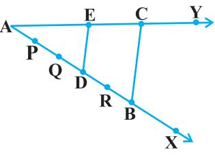
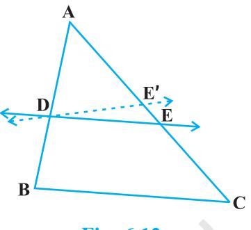
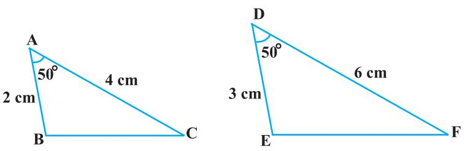

**6**

## **6.1 Introduction**

You are familiar with triangles and many of their properties from your earlier classes. In Class IX, you have studied congruence of triangles in detail. Recall that two figures are said to be *congruent*, if they have the same shape and the same size. In this chapter, we shall study about those figures which have the same shape but not necessarily the same size. Two figures having the same shape (and not necessarily the same size) are called *similar figures.* In particular, we shall discuss the similarity of triangles and apply this knowledge in giving a simple proof of Pythagoras Theorem learnt earlier.

Can you guess how heights of mountains (say Mount Everest) or distances of some long distant objects (say moon) have been found out? Do you think these have

been measured directly with the help of a measuring tape? In fact, all these heights and distances have been found out using the idea of indirect measurements, which is based on the principle of similarity of figures (see Example 7, Q.15 of Exercise 6.3 and also Chapters 8 and 9 of this book).

#### **6.2 Similar Figures**

In Class IX, you have seen that all circles with the same radii are congruent, all squares with the same side lengths are congruent and all equilateral triangles with the same side lengths are congruent.

Now consider any two (or more) circles [see Fig. 6.1 (i)]. Are they congruent? Since all of them do not have the same radius, they are not congruent to each other. Note that some are congruent and some are not, but all of them have the same shape. So they all are, what we call, *similar*. Two similar figures have the same shape but not necessarily the same size. Therefore, all circles are similar. What about two (or more) squares or two (or more) equilateral triangles [see Fig. 6.1 (ii) and (iii)]? As observed in the case of circles, here also all squares are similar and all equilateral triangles are similar.

From the above, we can say *that all congruent figures are similar but the similar figures need not be congruent.*

Can a circle and a square be similar? Can a triangle and a square be similar? These questions can be answered by just looking at the figures (see Fig. 6.1). Evidently these figures are not similar. (Why?)

What can you say about the two quadrilaterals ABCD and PQRS (see Fig 6.2)?Are they similar? These figures appear to be similar but we cannot be certain about it.Therefore, we must have some definition of similarity of figures and based on this definition some rules to decide whether the two given figures are similar or not. For this, let us look at the photographs given in Fig. 6.3:

**Fig. 6.3**

You will at once say that they are the photographs of the same monument (Taj Mahal) but are in different sizes. Would you say that the three photographs are similar? Yes,they are.

What can you say about the two photographs of the same size of the same person one at the age of 10 years and the other at the age of 40 years? Are these photographs similar? These photographs are of the same size but certainly they are not of the same shape. So, they are not similar.

What does the photographer do when she prints photographs of different sizes from the same negative? You must have heard about the stamp size, passport size and postcard size photographs. She generally takes a photograph on a small size film, say of 35mm size and then enlarges it into a bigger size, say 45mm (or 55mm). Thus, if we consider any line segment in the smaller photograph (figure), its corresponding line

segment in the bigger photograph (figure) will be 45 35 55 or 35 of that of the line segment.

This really means that every line segment of the smaller photograph is enlarged (increased) *in the ratio* 35:45 (or 35:55). It can also be said that every line segment of the bigger photograph is reduced (decreased) in the ratio 45:35 (or 55:35). Further, if you consider inclinations (or angles) between any pair of corresponding line segments in the two photographs of different sizes, you shall see that these inclinations(or angles) *are always equal.* This is the essence of the similarity of two figures and in particular of two polygons. We say that:

*Two polygons of the same number of sides are similar, if* (*i*) *their corresponding angles are equal and* (*ii*) *their corresponding sides are in the same ratio* (*or proportion*).

Note that the same ratio of the corresponding sides is referred to as *the scale factor* (or the *Representative Fraction*) for the polygons. You must have heard that world maps (i.e., global maps) and blue prints for the construction of a building are prepared using a suitable scale factor and observing certain conventions.

In order to understand similarity of figures more clearly, let us perform the following activity:

**Activity 1 :** Place a lighted bulb at a point O on the ceiling and directly below it a table in your classroom. Let us cut a polygon, say a quadrilateral ABCD, from a plane cardboard and place this cardboard parallel to the ground between the lighted bulb and the table. Then a shadow of ABCD is cast on the table. Mark the outline of this shadow as ABCD (see Fig.6.4).

Note that the quadrilateral ABCD is an enlargement (or magnification) of the quadrilateral ABCD. This is because of the property of light that light propogates in a straight line. You may also note that A lies on ray OA, B lies on ray OB, C

lies on OC and D lies on OD. Thus, quadrilaterals ABCD and ABCD are of the same shape but of different sizes.

So, quadrilateral ABCD is similiar to quadrilateral ABCD. We can also say that quadrilateral ABCD is similar to the quadrilateral ABCD.

Here, you can also note that vertex A corresponds to vertex A, vertex B corresponds to vertex B, vertex C corresponds to vertex C and vertex D corresponds to vertex D. Symbolically, these correspondences are represented as A A, B B, C C and D D. By actually measuring the angles and the sides of the two quadrilaterals, you may verify that

(i) $\angle$ A = $\angle$ A', $\angle$ B = $\angle$ B', $\angle$ C = $\angle$ C', $\angle$ D = $\angle$ D' and (ii) $\frac{\text{AB}}{\text{A'B'}}=\frac{\text{BC}}{\text{B'C'}}=\frac{\text{CD}}{\text{C'D'}}=\frac{\text{DA}}{\text{D'A'}}$.  
  

This again emphasises that *two polygons of the same number of sides are similar, if* (*i*) *all the corresponding angles are equal and* (*ii*) *all the corresponding sides are in the same ratio* (*or proportion*).

From the above, you can easily say that quadrilaterals ABCD and PQRS of Fig. 6.5 are similar.

**Remark :** You can verify that if one polygon is similar to another polygon and this second polygon is similar to a third polygon, then the first polygon is similar to the third polygon.

You may note that in the two quadrilaterals (a square and a rectangle) of Fig. 6.6, corresponding angles are equal, but their corresponding sides are not in the same ratio.

So, the two quadrilaterals are not similar. Similarly, you may note that in the two quadrilaterals (a square and a rhombus) of Fig. 6.7, corresponding sides are in the same ratio, but their corresponding angles are not equal. Again, the two polygons (quadrilaterals) are not similar.

**Fig. 6.7**

Thus, *either of the above two conditions* (*i*) *and* (*ii*) *of similarity of two polygons is not sufficient for them to be similar*.

## **EXERCISE 6.1**

- **1.** Fill in the blanks using the correct word given in brackets :
	- (i) All circles are . (congruent, similar)
	- (ii) All squares are . (similar, congruent)
	- (iii) All triangles are similar. (isosceles, equilateral)
	- (iv) Two polygons of the same number of sides are similar, if (a) their corresponding angles are and (b) their corresponding sides are .(equal, proportional)
- **2.** Give two different examples of pair of
	- (i) similar figures. (ii) non-similar figures.
- **3.** State whether the following quadrilaterals are similar or not:

**Fig. 6.8**

#### **6.3 Similarity of Triangles**

What can you say about the similarity of two triangles?

You may recall that triangle is also a polygon. So, we can state the same conditions for the similarity of two triangles. That is:

*Two triangles are similiar, if*

(*i*) *their corresponding angles are equal and*

(*ii*) *their corresponding sides are in the same ratio* (*or proportion*)*.*

Note that if corresponding angles of two triangles are equal, then they are known as *equiangular triangles.* A famous Greek mathematician Thales gave an important truth relating to two equiangular triangles which is as follows:

*The ratio of any two corresponding sides in two equiangular triangles is always the same.*

It is believed that he had used a result called the *Basic Proportionality Theorem* (now known as the *Thales Theorem*) for the same.

To understand the Basic Proportionality Theorem, let us perform the following activity:

**Activity 2 :** Draw any angle XAY and on its one arm AX, mark points (say five points) P, Q, D, R and B such that AP = PQ = QD = DR = RB.

Now, through B, draw any line intersecting arm AY at C (see Fig. 6.9).

Also, through the point D, draw a line parallel to BC to intersect AC at E. Do you observe from

**Fig. 6.9**

your constructions that AD 3 DB 2 ? Measure AE and EC. What about AE EC ? Observe that AE EC is also equal to 3 2 . Thus, you can see that in ABC, DE || BC and AD AE DB EC . Is it a coincidence? No, it is due to the following theorem (known as the Basic Proportionality Theorem):

**Theorem 6.1 :** *If a line is drawn parallel to one side of a triangle to intersect the other two sides in distinct points, the other two sides are divided in the same ratio.*

**Proof :** We are given a triangle ABC in which a line parallel to side BC intersects other two sides AB and AC at D and E respectively (see Fig. 6.10). We need to prove that AD AE DB EC . Let us join BE and CD and then draw DM AC and EN AB. Now, area of ADE (= 1 2 base × height) = 1 2 AD × EN. Recall from Class IX, that area of ADE is denoted as ar(ADE). So, ar(ADE) = 1 2 AD × EN Similarly, ar(BDE) = 1 2 DB × EN, ar(ADE) = 1 2 AE × DM and ar(DEC) = 1 2 EC × DM. Therefore, ar(ADE) ar(BDE) = 1 AD × EN 2 AD 1 DB DB × EN 2 (1) **Fig. 6.10**

and  
  

$$\frac{\text{ar(ADE)}}{\text{ar(DEC)}}=\frac{\frac{1}{2}\text{AE}\times\text{DM}}{\frac{1}{2}\text{EC}\times\text{DM}}=\frac{\text{AE}}{\text{EC}}\tag{2}$$

Note that BDE and DEC are on the same base DE and between the same parallels BC and DE.

So,  
  

$$\mbox{ar(BDE)=ar(DEC)}\tag{3}$$

Therefore, from (1), (2) and (3), we have :

AD DB = AE EC

Is the converse of this theorem also true (For the meaning of converse, see Appendix 1)? To examine this, let us perform the following activity:

**Activity 3 :** Draw an angle XAY on your notebook and on ray AX, mark points B1 , B2 , B3 , B4 and B such that AB1 = B1 B2 = B2 B3 = B3 B4 = B4 B.

Similarly, on ray AY, mark points C1 , C2 , C3 , C4 and C such that AC1 = C1 C2 = C2 C3 = C3 C4 = C4 C. Then join B1 C1 and BC (see Fig. 6.11).

You can also see that lines B1 C1 and BC are parallel to each other, i.e.,

$$\begin{array}{c}\mbox{B}_{1}\mbox{C}_{1}\parallel\mbox{BC}\\ \mbox{B}_{1}\mbox{C}_{1}\parallel\mbox{BC}\end{array}\tag{1}$$

Similarly, by joining B2 C2 , B3 C3 and B4 C4 , you can see that:

$$\begin{array}{c}\mbox{AB}_{2}=\mbox{AC}_{2}\left(\begin{array}{c}2\\ 3\end{array}\right)\mbox{and}\mbox{B}_{2}\mbox{C}_{2}\parallel\mbox{BC}\end{array}\tag{2}$$

$$\begin{array}{c}\mbox{AB}_{3}=\mbox{AC}_{3}\\ \mbox{B}_{3}\mbox{B}=\mbox{C}_{3}\mbox{C}\end{array}\left(=\frac{3}{2}\right)\mbox{and}\mbox{B}_{3}\mbox{C}_{3}\parallel\mbox{BC}\tag{3}$$

$$\begin{array}{c}\mbox{AB}_{4}\\ \mbox{B}_{4}\mbox{B}\end{array}=\frac{\mbox{AC}_{4}}{\mbox{C}_{4}\mbox{C}}\left(=\frac{4}{1}\right)\mbox{and}\mbox{B}_{4}\mbox{C}_{4}\parallel\mbox{BC}\tag{4}$$

From (1), (2), (3) and (4), it can be observed that if a line divides two sides of a triangle in the same ratio, then the line is parallel to the third side.

You can repeat this activity by drawing any angle XAY of different measure and taking any number of equal parts on arms AX and AY . Each time, you will arrive at the same result. Thus, we obtain the following theorem, which is the converse of Theorem 6.1:

This theorem can be proved by taking a line DE such

that AD AE DB EC and assuming that DE is not parallel

to BC (see Fig. 6.12).

If DE is not parallel to BC, draw a line DE parallel to BC.

> AD DB = AE

AE EC = AE E C 

Therefore,

So,

Adding 1 to both sides of above, you can see that E and E must coincide. (Why ?)

(Why ?)

(Why ?)

Let us take some examples to illustrate the use of the above theorems.

E C 

**Example 1 :** If a line intersects sides AB and AC of a ABC at D and E respectively

| and is parallel to BC, prove that |  | AD | = | AE | (see Fig. 6.13). |  |
| --- | --- | --- | --- | --- | --- | --- |
|  |  | AB |  | AC |  |  |
| Solution : | DE | BC |  |  |  | (Given) |
| So, | AD | AE = |  |  |  | (Theorem 6.1) |
|  | DB | EC |  |  |  |  |
| or, | DB | EC = |  |  |  |  |
|  | AD | AE |  |  |  |  |
| or, | DB  1 | EC = |  1 |  |  |  |
|  | AD | AE |  |  |  |  |
| or, | AB | AC = |  |  |  |  |
|  | AD | AE |  |  |  |  |
| So, | AD | AE |  |  |  |  |
|  |  | = |  |  |  |  |
|  | AB | AC |  |  | Fig. 6.13 |  |

Also, it is given that

$$\angle\ \mbox{PST}=\angle\ \mbox{PRQ}\tag{2}$$
  
  
So,  
  

$$\angle\ \mbox{PRQ}=\angle\ \mbox{PQR}\ \ \mbox{[From(1)and(2)]}$$
  
  
Therefore,  
  

$$\mbox{PQ}=\mbox{PR}\ \ \ \ \ \ \ \ \mbox{(Sides opposite the equal angles)}$$

i.e., PQR is an isosceles triangle.

## **EXERCISE 6.2**

**1.** In Fig. 6.17, (i) and (ii), DE || BC. Find EC in (i) and AD in (ii).

**Fig. 6.19**

- **5.** In Fig. 6.20, DE || OQ and DF || OR. Show that EF || QR.
- **6.** In Fig. 6.21, A, B and C are points on OP, OQ and OR respectively such that AB || PQ and AC || PR. Show that BC || QR.
- **7.** Using Theorem 6.1, prove that a line drawn through the mid-point of one side of a triangle parallel to another side bisects the third side. (Recall that you have proved it in Class IX).
- **8.** Using Theorem 6.2, prove that the line joining the mid-points of any two sides of a triangle is parallel to the third side. (Recall that you have done it in Class IX).
- **9.** ABCD is a trapezium in which AB || DC and its diagonals intersect each other at the point O. Show

$${\mathrm{that~}}{\frac{\mathrm{AO}}{\mathrm{BO}}}={\frac{\mathrm{CO}}{\mathrm{DO}}}.$$

- **10.** The diagonals of a quadrilateral ABCD intersect each other at the point O such that
AO CO BO DO Show that ABCD is a trapezium.

## **6.4 Criteria for Similarity of Triangles**

In the previous section, we stated that two triangles are similar, if (i) their corresponding angles are equal and (ii) their corresponding sides are in the same ratio (or proportion).

That is, in ABC and DEF, if

(i) $\angle$ A = $\angle$ D, $\angle$ B = $\angle$ E, $\angle$ C = $\angle$ F and 

**Fig. 6.22**

Here, you can see that A corresponds to D, B corresponds to E and C corresponds to F. Symbolically, we write the similarity of these two triangles as ' ABC ~ DEF' and read it as 'triangle ABC is similar to triangle DEF'. The symbol '~' stands for 'is similar to'. Recall that you have used the symbol '' for 'is congruent to' in Class IX.

It must be noted that as done in the case of congruency of two triangles, the similarity of two triangles should also be expressed symbolically, using correct correspondence of their vertices. For example, for the triangles ABC and DEF of Fig. 6.22, we cannot write ABC ~ EDF or ABC ~ FED. However, we can write BAC ~ EDF.

Now a natural question arises : For checking the similarity of two triangles, say ABC and DEF, should we always look for all the equality relations of their corresponding angles ( A = D, B = E, C = F) and all the equality relations of the ratios

of their corresponding sides AB BC CA DE EF FD ? Let us examine. You may recall that

in Class IX, you have obtained some criteria for congruency of two triangles involving only three pairs of corresponding parts (or elements) of the two triangles. Here also, let us make an attempt to arrive at certain criteria for similarity of two triangles involving relationship between less number of pairs of corresponding parts of the two triangles, instead of all the six pairs of corresponding parts. For this, let us perform the following activity:

**Activity 4 :** Draw two line segments BC and EF of two different lengths, say 3 cm and 5 cm respectively. Then, at the points B and C respectively, construct angles PBC and QCB of some measures, say, 60° and 40°. Also, at the points E and F, construct angles REF and SFE of 60° and 40° respectively (see Fig. 6.23).

Let rays BP and CQ intersect each other at A and rays ER and FS intersect each other at D. In the two triangles ABC and DEF, you can see that B = E, C = F and A = D. That is, corresponding angles of these two triangles are equal. What can you say about their corresponding sides ? Note that BC 3 0.6. EF 5 What about AB DE and CA FD ? On measuring AB, DE, CA and FD, you will find that AB DE and CA FD are also equal to 0.6 (or nearly equal to 0.6, if there is some error in the measurement). Thus, AB BC CA DE EF FD You can repeat this activity by constructing several pairs of triangles having their corresponding angles equal. Every time, you will find that their corresponding sides are in the same ratio (or proportion). This activity leads us to the following criterion for similarity of two triangles.

**Theorem 6.3 :** *If in two triangles, corresponding angles are equal, then their corresponding sides are in the same ratio* (*or proportion*) *and hence the two triangles are similar.*

This criterion is referred to as the AAA (Angle–Angle–Angle) criterion of similarity of two triangles. This theorem can be proved by taking two triangles ABC and DEF such that A = D, B = E and C = F (see Fig. 6.24) Cut DP = AB and DQ = AC and join PQ. So, ABC DPQ (Why ?) This gives B = P = E and PQ || EF (How?) Therefore, DP PE = DQ QF (Why?) i.e., AB DE = AC DF (Why?) Similarly, AB DE = BC EF and so AB BC AC DE EF DF . **Fig. 6.24**

**Remark :** If two angles of a triangle are respectively equal to two angles of another triangle, then by the angle sum property of a triangle their third angles will also be equal. Therefore, AAA similarity criterion can also be stated as follows:

*If two angles of one triangle are respectively equal to two angles of another triangle, then the two triangles are similar.*

This may be referred to as the AA *similarity criterion* for two triangles.

You have seen above that if the three angles of one triangle are respectively equal to the three angles of another triangle, then their corresponding sides are proportional (i.e., in the same ratio). What about the converse of this statement? Is the converse true? In other words, if the sides of a triangle are respectively proportional to the sides of another triangle, is it true that their corresponding angles are equal? Let us examine it through an activity :

**Activity 5 :** Draw two triangles ABC and DEF such that AB = 3 cm, BC = 6 cm, CA = 8 cm, DE = 4.5 cm, EF = 9 cm and FD = 12 cm (see Fig. 6.25).

Now measure A, B, C, D, E and F. You will observe that A = D, B = E and C = F, i.e., the corresponding angles of the two triangles are equal.

You can repeat this activity by drawing several such triangles (having their sides in the same ratio). Everytime you shall see that their corresponding angles are equal. It is due to the following criterion of similarity of two triangles:

**Theorem 6.4 :** *If in two triangles, sides of one triangle are proportional to* (*i.e., in the same ratio of* ) *the sides of the other triangle, then their corresponding angles are equal and hence the two triangles are similiar.*

This criterion is referred to as the SSS (Side–Side–Side) *similarity criterion for two triangles*.

This theorem can be proved by taking two triangles ABC and DEF such that AB BC CA DE EF FD (< 1) (see Fig. 6.26):

**Remark :** You may recall that either of the two conditions namely, (i) corresponding angles are equal and (ii) corresponding sides are in the same ratio is not sufficient for two polygons to be similar. However, on the basis of Theorems 6.3 and 6.4, you can now say that in case of similarity of the two triangles, it is not necessary to check both the conditions as one condition implies the other.

Let us now recall the various criteria for congruency of two triangles learnt in Class IX. You may observe that SSS similarity criterion can be compared with the SSS congruency criterion.This suggests us to look for a similarity criterion comparable to SAS congruency criterion of triangles. For this, let us perform an activity.

**Activity 6 :** Draw two triangles ABC and DEF such that AB = 2 cm, A = 50°, AC = 4 cm, DE = 3 cm, D = 50° and DF = 6 cm (see Fig.6.27).

Here, you may observe that AB DE = AC DF (each equal to 2 3 ) and A (included

between the sides AB and AC) = D (included between the sides DE and DF). That is, one angle of a triangle is equal to one angle of another triangle and sides including these angles are in the same ratio (i.e., proportion). Now let us measure B, C, E and F.

You will find that B = E and C = F. That is, A = D, B = E and C = F. So, by AAA similarity criterion, ABC ~ DEF. You may repeat this activity by drawing several pairs of such triangles with one angle of a triangle equal to one angle of another triangle and the sides including these angles are proportional. Everytime, you will find that the triangles are similar. It is due to the following criterion of similarity of triangles:

**Theorem 6.5 :** *If one angle of a triangle is equal to one angle of the other triangle and the sides including these angles are proportional, then the two triangles are similar.*

This criterion is referred to as the SAS (Side–Angle–Side) similarity criterion for two triangles*.*

As before, this theorem can be proved by taking two triangles ABC and DEF such that AB AC DE DF ( 1) and A = D (see Fig. 6.28). Cut DP = AB, DQ = AC and join PQ.

**Fig. 6.28**

| Now, | PQ | EF and  ABC  DPQ | (How ?) |
| --- | --- | --- | --- |
| So, |  A =  D, |  B =  P and  C =  Q |  |
| Therefore, |  ABC ~ |  DEF | (Why?) |

We now take some examples to illustrate the use of these criteria.

**Example 4 :** In Fig. 6.29, if PQ || RS, prove that POQ ~ SOR.

**Solution :** In ABC and PQR,

AB 3.8 1 , RQ 7.6 2 BC 6 1 QP 12 2 and CA 3 3 1 PR 2 6 3 That is, AB BC CA RQ QP PR So, ABC ~ RQP (SSS similarity) Therefore, C = P (Corresponding angles of similar triangles) But C = 180° – A – B (Angle sum property) = 180° – 80° – 60° = 40° So, P = 40° **Example 6 :** In Fig. 6.31, OA . OB = OC . OD. Show that A = C and B = D. **Solution :** OA . OB = OC . OD (Given) So, OA OC = OD OB (1) Also, we have AOD = COB (Vertically opposite angles) (2) Therefore, from (1) and (2), AOD ~ COB (SAS similarity criterion) So, A = C and D = B **Fig. 6.31**

(Corresponding angles of similar triangles)

**Example 7 :** A girl of height 90 cm is walking away from the base of a lamp-post at a speed of 1.2 m/s. If the lamp is 3.6 m above the ground, find the length of her shadow after 4 seconds.

**Solution :** Let AB denote the lamp-post and CD the girl after walking for 4 seconds away from the lamp-post (see Fig. 6.32).

From the figure, you can see that DE is the shadow of the girl. Let DE be *x* metres.

**Fig. 6.32**

| Now, BD = 1.2 m × 4 = 4.8 m. |  |  |  |
| --- | --- | --- | --- |
| Note that in  ABE and  CDE, |  |  |  |
|  B = |  |  D | (Each is of 90° because lamp-post as well as the girl are standing |
|  |  |  | vertical to the ground) |
| and |  E = |  E | (Same angle) |
| So,  CDE |  ABE ~ |  | (AA similarity criterion) |
| BE |  | AB |  |
| Therefore, | = |  |  |
| DE |  | CD |  |
| 4.8 | + x | 3.6 | 90 |
| i.e., | = x | 0.9 | (90 cm = m = 0.9 m) 100 |
| i.e., | 4.8 + x =4x |  |  |
| i.e., | 3x = | 4.8 |  |
| i.e., | x = | 1.6 |  |
| So, the shadow of the girl after walking for 4 seconds is 1.6 m long. |  |  |  |
| Example 8 : In Fig. 6.33, CM and RN are |  |  |  |
| respectively the medians of  ABC and |  |  |  |
|  PQR. If  ABC ~  PQR, prove that : |  |  |  |
| (i)  AMC ~  PNR |  |  |  |
| CM AB |  |  |  |
|  (ii) RN PQ |  |  |  |
| (iii)  CMB ~  RNQ |  |  |  |
|  |  |  | Fig. 6.33 |
| Solution : (i)  ABC ~ |  PQR |  | (Given) |
| AB So, | BC | CA | (1) |
| PQ = RP |  QR |  |  |
| and  A =  P,  B =  Q and  C =  R |  |  | (2) |
| But AB = 2 AM and PQ = 2 PN |  |  |  |
|  |  |  | (As CM and RN are medians) |

So, from (1), $\bf\frac{2AM}{2PN}=\frac{CA}{2PN}$

| i.e., | AM | CA |  | (3) |
| --- | --- | --- | --- | --- |
|  | = PN | RP |  |  |
| Also, |  MAC = |  NPR | [From (2)] | (4) |
| So, from (3) and (4), |  |  |  |  |
|  |  AMC ~ |  PNR | (SAS similarity) | (5) |
| (ii) From (5), | CM = | CA |  | (6) |
|  | RN | RP |  |  |
| But | CA = | AB | [From (1)] | (7) |
|  | RP | PQ |  |  |
| Therefore, | CM = | AB | [From (6) and (7)] | (8) |
|  | RN | PQ |  |  |
| (iii) Again, | AB | BC |  | [From (1)] |
|  | PQ = | QR |  |  |
| Therefore, | CM = | BC | [From (8)] | (9) |
|  | RN | QR |  |  |
| Also, | CM = | AB 2 BM  |  |  |
|  | RN | PQ 2 QN |  |  |
| i.e., | CM = | BM |  | (10) |
|  | RN | QN |  |  |
| i.e., | CM = | BC BM  | [From (9) and (10)] |  |
|  | RN | QR QN |  |  |
| Therefore, |  CMB ~ |  RNQ |  | (SSS similarity) |

[**Note :** You can also prove part (iii) by following the same method as used for proving part (i).]

## **EXERCISE 6.3**

- **1.** State which pairs of triangles in Fig. 6.34 are similar. Write the similarity criterion used by you for answering the question and also write the pairs of similar triangles in the symbolic form :

- **2.** In Fig. 6.35, ODC ~ OBA, BOC = 125° and CDO = 70°. Find DOC, DCO and OAB.
- **3.** Diagonals AC and BD of a trapezium ABCD with AB || DC intersect each other at the point O. Using a similarity criterion for two

$${\mathrm{triangles,~show~that~}}{\frac{\mathrm{OA}}{\mathrm{OC}}}={\frac{\mathrm{OB}}{\mathrm{OD}}}.$$

**Fig. 6.35**

- **4.** In Fig. 6.36, QR QT QS PR and 1 = 2. Show that PQS ~ TQR.
- **5.** S and T are points on sides PR and QR of PQR such that P = RTS. Show that RPQ ~ RTS.
- **6.** In Fig. 6.37, if ABE ACD, show that ADE ~ ABC.
- **7.** In Fig. 6.38, altitudes AD and CE of ABC intersect each other at the point P. Show that:
	- (i) AEP ~ CDP
	- (ii) ABD ~ CBE
	- (iii) AEP ~ ADB
	- (iv) PDC ~ BEC
- **8.** E is a point on the side AD produced of a parallelogram ABCD and BE intersects CD at F. Show that ABE ~ CFB.
- **9.** In Fig. 6.39, ABC and AMP are two right triangles, right angled at B and M respectively. Prove that:
	- (i) ABC ~ AMP

$${\mathrm{(ii)~}}{\frac{\mathrm{CA}}{\mathrm{PA}}}={\frac{\mathrm{BC}}{\mathrm{MP}}}$$

- **10.** CD and GH are respectively the bisectors of ACB and EGF such that D and H lie on sides AB and FE of ABC and EFG respectively. If ABC ~ FEG, show that:
  
(i) $\dfrac{\triangle\mathrm{D}}{\mathrm{GH}}=\dfrac{\mathrm{AC}}{\mathrm{FG}}$  
  
(ii) Δ DCB ~ Δ HGE.  

- (iii) DCA ~ HGF

- **11.** In Fig. 6.40, E is a point on side CB produced of an isosceles triangle ABC with AB = AC. If AD BC and EF AC, prove that ABD ~ ECF.
- **12.** Sides AB and BC and median AD of a triangle ABC are respectively proportional to sides PQ and QR and median PM of PQR (see Fig. 6.41). Show that ABC ~ PQR.
- **13.** D is a point on the side BC of a triangle ABC such that ADC = BAC. Show that CA2 = CB.CD.
- **14.** Sides AB and AC and median AD of a triangle ABC are respectively proportional to sides PQ and PR and median PM of another triangle PQR. Show that ABC ~ PQR.

- **15.** A vertical pole of length 6 m casts a shadow 4 m long on the ground and at the same time a tower casts a shadow 28 m long. Find the height of the tower.
- **16.** If AD and PM are medians of triangles ABC and PQR, respectively where

 ABC ~ PQR, prove that AB AD PQ PM

#### **6.5 Summary**

In this chapter you have studied the following points :

- **1.** Two figures having the same shape but not necessarily the same size are called similar figures.
- **2.** All the congruent figures are similar but the converse is not true.
- **3.** Two polygons of the same number of sides are similar, if (i) their corresponding angles are equal and (ii) their corresponding sides are in the same ratio (i.e., proportion).
- **4.** If a line is drawn parallel to one side of a triangle to intersect the other two sides in distinct points, then the other two sides are divided in the same ratio.
- **5.** If a line divides any two sides of a triangle in the same ratio, then the line is parallel to the third side.
- **6.** If in two triangles, corresponding angles are equal, then their corresponding sides are in the same ratio and hence the two triangles are similar (AAA similarity criterion).
- **7.** If in two triangles, two angles of one triangle are respectively equal to the two angles of the other triangle, then the two triangles are similar (AA similarity criterion).
- **8.** If in two triangles, corresponding sides are in the same ratio, then their corresponding angles are equal and hence the triangles are similar (SSS similarity criterion).
- **9.** If one angle of a triangle is equal to one angle of another triangle and the sides including these angles are in the same ratio (proportional), then the triangles are similar (SAS similarity criterion).

# **A NOTE TO THE READER**

If in two right triangles, hypotenuse and one side of one triangle are proportional to the hypotenuse and one side of the other triangle, then the two triangles are similar. This may be referred to as the RHS Similarity Criterion.

If you use this criterion in Example 2, Chapter 8, the proof will become simpler.

