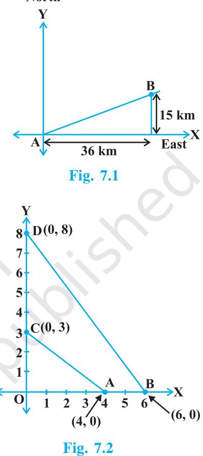
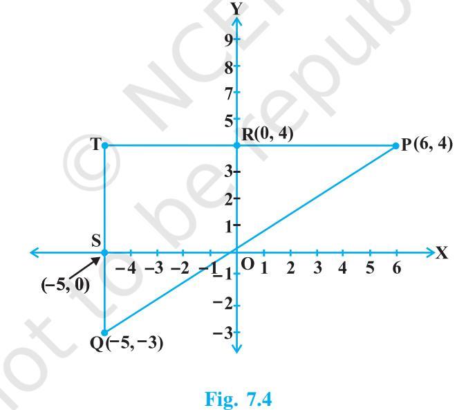
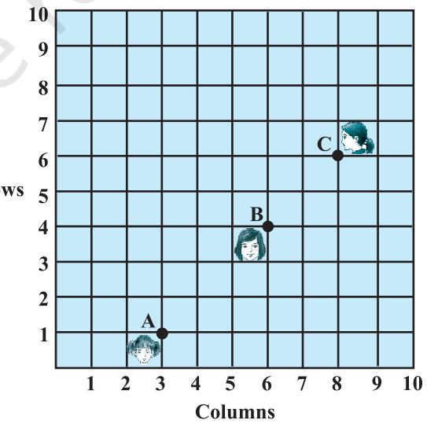
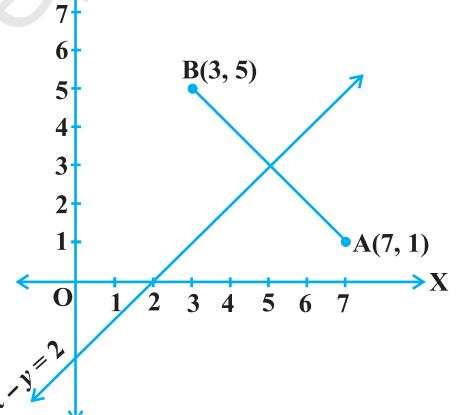
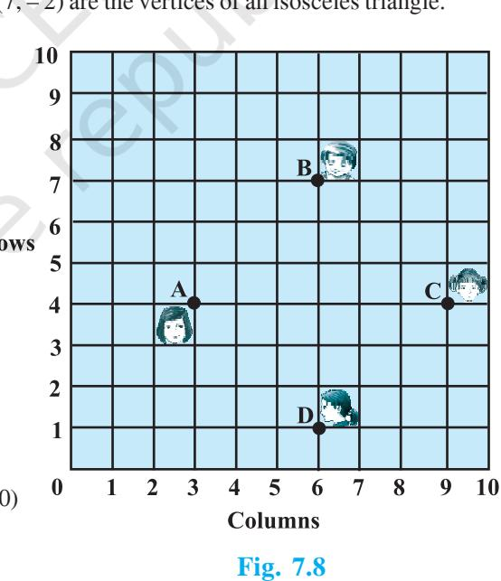
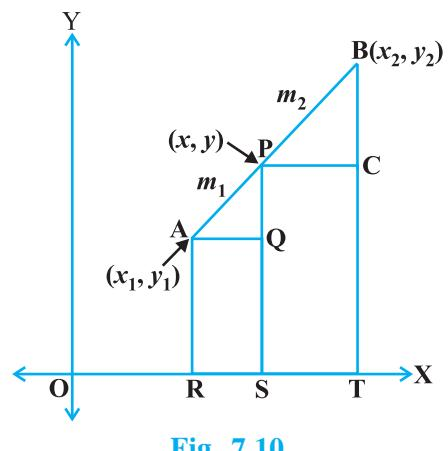
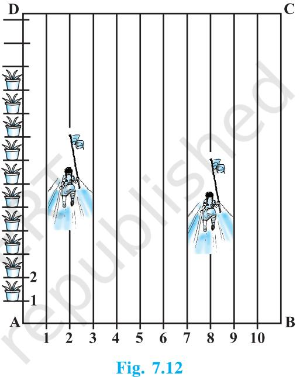

**7**

# **COORDINATE GEOMETRY**

## **7.1 Introduction**

In Class IX, you have studied that to locate the position of a point on a plane, we require a pair of coordinate axes. The distance of a point from the *y*-axis is called its *x***-coordinate**, or **abscissa**. The distance of a point from the *x*-axis is called its *y***-coordinate**, or **ordinate**. The coordinates of a point on the *x*-axis are of the form (*x*, 0), and of a point on the *y*-axis are of the form (0, *y*).

Here is a play for you. Draw a set of a pair of perpendicular axes on a graph paper. Now plot the following points and join them as directed: Join the point A(4, 8) to B(3, 9) to C(3, 8) to D(1, 6) to E(1, 5) to F(3, 3) to G(6, 3) to H(8, 5) to I(8, 6) to J(6, 8) to K(6, 9) to L(5, 8) to A. Then join the points P(3.5, 7), Q (3, 6) and R(4, 6) to form a triangle. Also join the points X(5.5, 7), Y(5, 6) and Z(6, 6) to form a triangle. Now join S(4, 5), T(4.5, 4) and U(5, 5) to form a triangle. Lastly join S to the points (0, 5) and (0, 6) and join U to the points (9, 5) and (9, 6). What picture have you got?

Also, you have seen that a linear equation in two variables of the form *ax* + *by* + *c* = 0, (*a*, *b* are not simultaneously zero), when represented graphically, gives a straight line. Further, in Chapter 2, you have seen the graph of *y* = *ax* 2 + *bx* + *c* (*a* ¹ 0), is a parabola. In fact, coordinate geometry has been developed as an algebraic tool for studying geometry of figures. It helps us to study geometry using algebra, and understand algebra with the help of geometry. Because of this, coordinate geometry is widely applied in various fields such as physics, engineering, navigation, seismology and art!

In this chapter, you will learn how to find the distance between the two points whose coordinates are given. You will also study how to find the coordinates of the point which divides a line segment joining two given points in a given ratio.

## **7.2 Distance Formula**

Let us consider the following situation:

A town B is located 36 km east and 15 km north of the town A. How would you find the distance from town A to town B without actually measuring it. Let us see. This situation can be represented graphically as shown in Fig. 7.1. You may use the Pythagoras Theorem to calculate this distance.

Now, suppose two points lie on the *x*-axis. Can we find the distance between them? For instance, consider two points A(4, 0) and B(6, 0) in Fig. 7.2. The points A and B lie on the *x*-axis.

From the figure you can see that OA = 4 units and OB = 6 units.

Therefore, the distance of B from A, i.e., AB = OB – OA = 6 – 4 = 2 units.

So, if two points lie on the *x*-axis, we can easily find the distance between them.

Now, suppose we take two points lying on the *y*-axis. Can you find the distance between them. If the points C(0, 3) and D(0, 8) lie on the *y*-axis, similarly we find that CD = 8 – 3 = 5 units (see Fig. 7.2).

Next, can you find the distance of A from C (in Fig. 7.2)? Since OA = 4 units and OC = 3 units, the distance of A from C, i.e., AC = 2 2 3 4 = 5 units. Similarly, you can find the distance of B from D = BD = 10 units.

Now, if we consider two points not lying on coordinate axis, can we find the distance between them? Yes! We shall use Pythagoras theorem to do so. Let us see an example.

In Fig. 7.3, the points P(4, 6) and Q(6, 8) lie in the first quadrant. How do we use Pythagoras theorem to find the distance between them? Let us draw PR and QS perpendicular to the *x*-axis from P and Q respectively. Also, draw a perpendicular from P on QS to meet QS at T. Then the coordinates of R and S are (4, 0) and (6, 0), respectively. So, RS = 2 units. Also, QS = 8 units and TS = PR = 6 units.

Therefore, QT = 2 units and PT = RS = 2 units.

Now, using the Pythagoras theorem, we have

$$\begin{array}{r l}{\mathrm{PQ^{2}=PT^{2}+QT^{2}}}\\ {{}}&{{}=2^{2}+2^{2}=8}\end{array}$$

So, PQ = 2 2 units

How will we find the distance between two points in two different quadrants?

Consider the points P(6, 4) and Q(–5, –3) (see Fig. 7.4). Draw QS perpendicular to the *x*-axis. Also draw a perpendicular PT from the point P on QS (extended) to meet *y*-axis at the point R.

Then PT = 11 units and QT = 7 units. (Why?)

Using the Pythagoras Theorem to the right triangle PTQ, we get PQ = 2 2 11 7 = 170 units.

**Fig. 7.3**

**Fig. 7.5**

Let us now find the distance between any two points P(*x*1 , *y*1 ) and Q(*x*2 , *y*2). Draw PR and QS perpendicular to the *x*-axis. A perpendicular from the point P on QS is drawn to meet it at the point T (see Fig. 7.5).

Then, OR = *x*1 , OS = *x*2 . So, RS = *x*2 – *x*1 = PT. Also, SQ = *y*2 , ST = PR = *y*1 . So, QT = *y*2 – *y*1 . Now, applying the Pythagoras theorem in PTQ, we get

Note that since distance is always non-negative, we take only the positive square root. So, the distance between the points P(*x*1 , *y*1 ) and Q(*x*2 , *y*2 ) is

  
  
**PQ = $\sqrt{(x_{2}-x_{1})^{2}+(y_{2}-y_{1})^{2}}$**

which is called the **distance formula**.

#### **Remarks :**

- 1. In particular, the distance of a point P(*x*, *y*) from the origin O(0, 0) is given by
* [10] M. C.  
  

2. We can also write, PQ = 2 2 12 1 2 *xx y y* . (Why?)

**Example 1 :** Do the points (3, 2), (–2, –3) and (2, 3) form a triangle? If so, name the type of triangle formed.

**Solution :** Let us apply the distance formula to find the distances PQ, QR and PR, where P(3, 2), Q(–2, –3) and R(2, 3) are the given points. We have

$$\text{PQ}=\sqrt{(3+2)^{2}+(2+3)^{2}}=\sqrt{5^{2}+5^{2}}=\sqrt{50}\ =7.07\ (\text{approx.})$$
 
$$\text{QR}=\sqrt{(-2-2)^{2}+(-3\ -3)^{2}}=\sqrt{(-4)^{2}+(-6)^{2}}=\sqrt{52}\ =7.21\ (\text{approx.})$$
 
$$\text{PR}=\sqrt{(3-2)^{2}+(2-3)^{2}}=\sqrt{1^{2}+(-1)^{2}}=\sqrt{2}\ =1.41\ (\text{approx.})$$

Since the sum of any two of these distances is greater than the third distance, therefore, the points P, Q and R form a triangle.

Also, PQ2 + PR2 = QR2 , by the converse of Pythagoras theorem, we have P = 90°. Therefore, PQR is a right triangle.

**Example 2 :** Show that the points (1, 7), (4, 2), (–1, –1) and (– 4, 4) are the vertices of a square.

**Solution :** Let A(1, 7), B(4, 2), C(–1, –1) and D(– 4, 4) be the given points. One way of showing that ABCD is a square is to use the property that all its sides should be equal and both its digonals should also be equal. Now,

$$\begin{array}{l}\mbox{AB}=\sqrt{\left(1-4\right)^{2}+\left(7-2\right)^{2}}=\sqrt{9+25}=\sqrt{34}\\ \mbox{BC}=\sqrt{\left(4+1\right)^{2}+\left(2+1\right)^{2}}=\sqrt{25+9}=\sqrt{34}\\ \mbox{CD}=\sqrt{\left(-1+4\right)^{2}+\left(-1-4\right)^{2}}=\sqrt{9+25}=\sqrt{34}\\ \mbox{DA}=\sqrt{\left(1+4\right)^{2}+\left(7-4\right)^{2}}=\sqrt{25+9}=\sqrt{34}\\ \mbox{AC}=\sqrt{\left(1+1\right)^{2}+\left(7+1\right)^{2}}=\sqrt{4+64}=\sqrt{68}\\ \mbox{BD}=\sqrt{\left(4+4\right)^{2}+\left(2-4\right)^{2}}=\sqrt{64+4}=\sqrt{68}\end{array}$$

Since, AB = BC = CD = DA and AC = BD, all the four sides of the quadrilateral ABCD are equal and its diagonals AC and BD are also equal. Thereore, ABCD is a square.

**Alternative Solution :** We find the four sides and one diagonal, say, AC as above. Here AD2 + DC2 = 34 + 34 = 68 = AC2 . Therefore, by the converse of Pythagoras theorem, D = 90°. A quadrilateral with all four sides equal and one angle 90° is a square. So, ABCD is a square.

**Example 3 :** Fig. 7.6 shows the arrangement of desks in a classroom. Ashima, Bharti and Camella are seated at A(3, 1), B(6, 4) and C(8, 6) respectively. Do you think they are seated in a line? Give reasons for your answer. **Fig. 7.6**

**Solution :** Using the distance formula, we have

$$\begin{array}{l}{\mathrm{AB}={\sqrt{\left(6-3\right)^{2}+\left(4-1\right)^{2}}}={\sqrt{9+9}}={\sqrt{18}}=3{\sqrt{2}}}\\ {\mathrm{BC}={\sqrt{\left(8-6\right)^{2}+\left(6-4\right)^{2}}}={\sqrt{4+4}}={\sqrt{8}}=2{\sqrt{2}}}\\ {\mathrm{AC}={\sqrt{\left(8-3\right)^{2}+\left(6-1\right)^{2}}}={\sqrt{25+25}}={\sqrt{50}}=5{\sqrt{2}}}\end{array}$$

Since, AB + BC = 3 2 2 2 5 2 AC, we can say that the points A, B and C are collinear. Therefore, they are seated in a line.

**Example 4 :** Find a relation between *x* and *y* such that the point (*x* , *y*) is equidistant from the points (7, 1) and (3, 5).

– 6*x* + 9 + *y*2

**Solution :** Let P(*x*, *y*) be equidistant from the points A(7, 1) and B(3, 5).

– 2*y* + 1 = *x*2

We are given that AP = BP. So, AP2 = BP2

– 14*x* + 49 + *y*2

i.e., (*x* – 7)2 + (*y* – 1)2 =(*x* – 3)2 + (*y* – 5)2

i.e., *x*2

i.e., 
$$\chi-\chi=2$$
.  

which is the required relation.

**Remark :** Note that the graph of the equation *x* – *y* = 2 is a line. From your earlier studies, you know that a point which is equidistant from A and B lies on the perpendicular bisector of AB. Therefore, the graph of *x* – *y* = 2 is the perpendicular bisector of AB (see Fig. 7.7).

**Example 5 :** Find a point on the *y*-axis which is equidistant from the points A(6, 5) and B(– 4, 3).

**Solution :** We know that a point on the *y*-axis is of the form (0, *y*). So, let the point P(0, *y*) be equidistant from A and B. Then

– 10*y* + 25

$$\mathrm{Fig.~7.7}$$

$$(6-0)^{2}+(5-y)^{2}=(-4-0)^{2}+(3-y)^{2}$$

i.e., $36+25+y^{2}-10y=16+9+y^{2}-6y$

i.e.,  
  
4y = 36

i.e., 
$${y}={9}$$
.  

So, the required point is (0, 9).

Let us check our solution : AP = $\sqrt{\left(6-0\right)^{2}+\left(5-9\right)^{2}}=\sqrt{36+16}=\sqrt{52}$  
  
BP = $\sqrt{\left(-4-0\right)^{2}+\left(3-9\right)^{2}}=\sqrt{16+36}=\sqrt{52}$

**Note :** Using the remark above, we see that (0, 9) is the intersection of the *y*-axis and the perpendicular bisector of AB.

## **EXERCISE 7.1**

- **1.** Find the distance between the following pairs of points :
(i) $(2,3),(4,1)$ (ii) $(-5,7),(-1,3)$ (iii) $(a,b),(-a,-b)$

- **2.** Find the distance between the points (0, 0) and (36, 15). Can you now find the distance between the two towns A and B discussed in Section 7.2.
- **3.** Determine if the points (1, 5), (2, 3) and (– 2, 11) are collinear.
- **4.** Check whether (5, 2), (6, 4) and (7, 2) are the vertices of an isosceles triangle.
- **5.** In a classroom, 4 friends are seated at the points A, B, C and D as shown in Fig. 7.8. Champa and Chameli walk into the class and after observing for a few minutes Champa asks Chameli, "Don't you think ABCD is a square?" Chameli disagrees. Using distance formula, find which of them is correct.
- **6.** Name the type of quadrilateral formed, if any, by the following points, and give reasons for your answer:

(4) (-1,-2),(1,0),(-1,2),(-3,0)

(ii) (-3, 5),(3, 1),(0, 3),(-1, -4)

- (iii) (4, 5), (7, 6), (4, 3), (1, 2)

- 
- **7.** Find the point on the *x*-axis which is equidistant from (2, –5) and (–2, 9).
- **8.** Find the values of *y* for which the distance between the points P(2, 3) and Q(10, *y*) is 10 units.
- **9.** If Q(0, 1) is equidistant from P(5, –3) and R(*x*, 6), find the values of *x*. Also find the distances QR and PR.
- **10.** Find a relation between *x* and *y* such that the point (*x*, *y*) is equidistant from the point (3, 6) and (– 3, 4).

## **7.3 Section Formula**

Let us recall the situation in Section 7.2. Suppose a telephone company wants to position a relay tower at P between A and B is such a way that the distance of the tower from B is twice its distance from A. If P lies on AB, it will divide AB in the ratio 1 : 2 (see Fig. 7.9). If we take A as the origin O, and 1 km as one unit on both the axis, the coordinates of B will be (36, 15). In order to know the position of the tower, we must know the coordinates of P. How do we find these coordinates?

Let the coordinates of P be (*x*, *y*). Draw perpendiculars from P and B to the *x*-axis, meeting it in D and E, respectively. Draw PC perpendicular to BE. Then, by the AA similarity criterion, studied in Chapter 6, POD and BPC are similar.

Therefore , OD OP 1 PC PB 2 , and PD OP 1 BC PB 2 So, 1 36 2 *x x* and 1 15 2 *y y* These equations give *x* = 12 and *y* = 5.

You can check that P(12, 5) meets the condition that OP : PB = 1 : 2.

Now let us use the understanding that you may have developed through this example to obtain the general formula.

Consider any two points A(*x*1 , *y*1 ) and B(*x*2 , *y*2 ) and assume that P (*x*, *y*) divides AB internally in the ratio *m*1 : *m*2 , i.e., 1 PA *m m* (see Fig. 7.10).

2

PB

**Fig. 7.10**

Draw AR, PS and BT perpendicular to the *x*-axis. Draw AQ and PC parallel to the *x*-axis. Then, by the AA similarity criterion,

$$\begin{array}{c}\mbox{\DeltaPAQ\sim\DeltaBPC}\\ \mbox{Therefore,}\\ \mbox{BP}=\mbox{AQ}\\ \mbox{BP}=\mbox{PC}\\ \mbox{AQ}=\mbox{RS}=\mbox{OS}-\mbox{OR}=x-x_{1}\\ \mbox{PC}=\mbox{ST}=\mbox{OT}-\mbox{OS}=x_{2}-x\\ \mbox{PQ}=\mbox{PS}-\mbox{QS}=\mbox{PS}-\mbox{AR}=y-y_{1}\\ \mbox{BC}=\mbox{BT}-\mbox{CT}=\mbox{BT}-\mbox{PS}=y_{2}-y\end{array}\tag{1}$$

Substituting these values in (1), we get

1 2 *m m* = 1 1 2 2 *x x yy x xy y* Taking 1 2 *m m* = 1 2 *x x x x* , we get *x* = 12 21 1 2 *mx m x m m m y y* 

Similarly, taking 1 2 *m* = 1 2 *y y* , we get *y* = 12 21 1 2 *my my m m* 

So, the coordinates of the point P(*x*, *y*) which divides the line segment joining the points A(*x*1 , *y*1 ) and B(*x*2 , *y*2 ), internally, in the ratio *m*1 : *m*2 are

$$\left(\begin{array}{c}m_{1}x_{2}+m_{2}x_{1}\\ m_{1}+m_{2}\end{array},\frac{m_{1}y_{2}+m_{2}y_{1}}{m_{1}+m_{2}}\right)\tag{2}$$

This is known as the **section formula**.

This can also be derived by drawing perpendiculars from A, P and B on the *y*-axis and proceeding as above.

If the ratio in which P divides AB is *k* : 1, then the coordinates of the point P will be

$$\left({\frac{k x_{2}+x_{1}}{k+1}},{\frac{k y_{2}+y_{1}}{k+1}}\right).$$

**Special Case :** The mid-point of a line segment divides the line segment in the ratio 1 : 1. Therefore, the coordinates of the mid-point P of the join of the points A(*x*1 , *y*1 ) and B(*x*2 , *y*2 ) is

$${\Bigg(}{\frac{1\cdot x_{1}+1\cdot x_{2}}{1+1}},{\frac{1\cdot y_{1}+1\cdot y_{2}}{1+1}}{\Bigg)}={\Bigg(}{\frac{x_{1}+x_{2}}{2}},{\frac{y_{1}+y_{2}}{2}}{\Bigg)}.$$

Let us solve a few examples based on the section formula.

**Example 6 :** Find the coordinates of the point which divides the line segment joining the points (4, – 3) and (8, 5) in the ratio 3 : 1 internally.

**Solution :** Let P(*x*, *y*) be the required point. Using the section formula, we get

$$x={\frac{3(8)+1(4)}{3+1}}=7\,,\;\;y={\frac{3(5)+1(-3)}{3+1}}=3$$

Therefore, (7, 3) is the required point.

**Example 7 :** In what ratio does the point (– 4, 6) divide the line segment joining the points A(– 6, 10) and B(3, – 8)?

**Solution :** Let (– 4, 6) divide AB internally in the ratio *m*1 : *m*2 . Using the section formula, we get

$$(-4,6)=\left(\frac{3m_{1}-6m_{2}}{m_{1}+m_{2}},\frac{-8m_{1}+10m_{2}}{m_{1}+m_{2}}\right)\tag{1}$$

Recall that if (*x*, *y*) = (*a*, *b*) then *x* = *a* and *y* = *b*.

So,  
  

$$-4=\frac{3m_{1}-6m_{2}}{m_{1}+m_{2}}\quad\text{and}\quad6=\frac{-8m_{1}+10m_{2}}{m_{1}+m_{2}}$$

Now, – 4 = 1 2 1 2 3 6 *m m m m* gives us – 4*m*1 – 4*m*2 =3*m*1 – 6*m*2 i.e., 7*m*1 =2*m*2 i.e., *m*1 : *m*2 = 2 : 7

You should verify that the ratio satisfies the *y*-coordinate also.

=

Now, 1 2 1 2 8 10 *m m m m* = 1 2 1 2 8 10 1 *m m m m* (Dividing throughout by *m*2 ) 2 8 10 7 6 2 1 

7

Therefore, the point (– 4, 6) divides the line segment joining the points A(– 6, 10) and B(3, – 8) in the ratio 2 : 7.

**Alternatively :** The ratio *m*1 : *m*2 can also be written as 1 2 :1, *m m* or *k* : 1. Let (– 4, 6)

divide AB internally in the ratio *k* : 1. Using the section formula, we get

$$(-4,6)=\left(\frac{3k-6}{k+1},\frac{-8k+10}{k+1}\right)\tag{2}$$
  
  
So,  
  

$$-4=\frac{\stackrel{{\cdot}}{{3k-6}}}{k+1}$$

i.e.,  
  
$-4k-4=3k-6$

i.e., 7*k* =2

i.e., *k* : 1 = 2 : 7

You can check for the *y*-coordinate also.

So, the point (– 4, 6) divides the line segment joining the points A(– 6, 10) and B(3, – 8) in the ratio 2 : 7.

**Note :** You can also find this ratio by calculating the distances PA and PB and taking their ratios provided you know that A, P and B are collinear.

**Example 8 :** Find the coordinates of the points of trisection (i.e., points dividing in three equal parts) of the line segment joining the points A(2, – 2) and B(– 7, 4).

**Solution :** Let P and Q be the points of trisection of AB i.e., AP = PQ = QB (see Fig. 7.11). **Fig. 7.11**

Therefore, P divides AB internally in the ratio 1 : 2. Therefore, the coordinates of P, by applying the section formula, are

$\left(\begin{array}{c}1(-7)+2(2)\\ 1+2\end{array}\right)$, $\left(\begin{array}{c}1(4)+2(-2)\\ 1+2\end{array}\right)$, i.e., $(-1,0)$.  
  

Now, Q also divides AB internally in the ratio 2 : 1. So, the coordinates of Q are

$$\left({\frac{2(-7)+1(2)}{2+1}},{\frac{2(4)+1(-2)}{2+1}}\right),{\mathrm{i.e.,~}}(-4,2)$$

Therefore, the coordinates of the points of trisection of the line segment joining A and B are (–1, 0) and (– 4, 2).

**Note :** We could also have obtained Q by noting that it is the mid-point of PB. So, we could have obtained its coordinates using the mid-point formula.

**Example 9 :** Find the ratio in which the *y*-axis divides the line segment joining the points (5, – 6) and (–1, – 4). Also find the point of intersection.

**Solution :** Let the ratio be *k* : 1. Then by the section formula, the coordinates of the

point which divides AB in the ratio *k* : 1 are 54 6 , 1 1 *k k k k* 

This point lies on the *y*-axis, and we know that on the *y*-axis the abscissa is 0.

Therefore,

5 1 *k k* =0

So, 
$$ k=5$$
.  

That is, the ratio is 5 : 1. Putting the value of *k* = 5, we get the point of intersection as

$$\left(\,0,{\frac{-13}{3}}\,\right).$$

**Example 10 :** If the points A(6, 1), B(8, 2), C(9, 4) and D(*p*, 3) are the vertices of a parallelogram, taken in order, find the value of *p*.

**Solution :** We know that diagonals of a parallelogram bisect each other.

So, the coordinates of the mid-point of AC = coordinates of the mid-point of BD

i.e.,  
  

$$\left(\frac{15}{2},\frac{5}{2}\right)=\left(\frac{8+p}{2},\frac{5}{2}\right)$$
  
  
so,  
  

$$\frac{15}{2}=\frac{8+p}{2}$$

- i.e., *p* =7
## **EXERCISE 7.2**

- **1.** Find the coordinates of the point which divides the join of (–1, 7) and (4, –3) in the ratio 2 : 3.
- **2.** Find the coordinates of the points of trisection of the line segment joining (4, –1) and (–2, –3).
- **3.** To conduct Sports Day activities, in your rectangular shaped school ground ABCD, lines have been drawn with chalk powder at a distance of 1m each. 100 flower pots have been placed at a distance of 1m from each other along AD, as shown

in Fig. 7.12. Niharika runs 1 4 th the

distance AD on the 2nd line and

posts a green flag. Preet runs 1 5 th the distance AD on the eighth line and posts a red flag. What is the distance between both the flags? If Rashmi has to post a blue flag exactly halfway between the line segment joining the two flags, where should she post her flag?

- **4.** Find the ratio in which the line segment joining the points (– 3, 10) and (6, 8) is divided by (– 1, 6).
- **5.** Find the ratio in which the line segment joining A(1, 5) and B(– 4, 5) is divided by the *x*-axis. Also find the coordinates of the point of division.
- **6.** If (1, 2), (4, *y*), (*x*, 6) and (3, 5) are the vertices of a parallelogram taken in order, find *x* and *y*.
- **7.** Find the coordinates of a point A, where AB is the diameter of a circle whose centre is (2, – 3) and B is (1, 4).
- **8.** If A and B are (– 2, 2) and (2, 4), respectively, find the coordinates of P such that AP = 3 AB 7 and P lies on the line segment AB.
- **9.** Find the coordinates of the points which divide the line segment joining A(– 2, 2) and B(2, 8) into four equal parts.
- **10.** Find the area of a rhombus if its vertices are (3, 0), (4, 5), (– 1, 4) and (– 2, 1) taken in order. [**Hint :** Area of a rhombus = 1 2 (product of its diagonals)]

## **7.4 Summary**

In this chapter, you have studied the following points :

- **1.** The distance between P(*x*1 , *y*1 ) and Q(*x*2 , *y*2 ) is 2 2 21 21 ( ) ( ). *xx yy*
- **2.** The distance of a point P(*x*, *y*) from the origin is 2 2 *x y* .
- **3.** The coordinates of the point P(*x*, *y*) which divides the line segment joining the points A(*x* 1, *y* 1) and B(*x* 2, *y* 2) internally in the ratio *m*1 : *m*2 are

$${\left(\frac{m_{1}x_{2}\,+\,m_{2}x_{1}}{m_{1}+m_{2}},\,{\frac{m_{1}y_{2}\,+\,m_{2}y_{1}}{m_{1}+m_{2}}}\right)}.$$

- **4.** The mid-point of the line segment joining the points P(*x*1 , *y*1 ) and Q(*x*2 , *y*2 ) is

$$\left({\frac{x_{1}+x_{2}}{2}},{\frac{y_{1}+y_{2}}{2}}\right).$$

# **A NOTETOTHE READER**

Section 7.3 discusses the Section Formula for the coordinates (*x*, *y*) of a point P which divides internally the line segment joining the points A(*x*1 , *y*1 ) and B(*x*2 , *y*2 ) in the ratio *m*1 : *m*2 as follows :

$\chi=\frac{m_{1}\chi_{2}+m_{2}\chi_{1}}{m_{1}+m_{2}}$

Note that, here, PA : PB = *m*1 : *m*2 .

However, if P does not lie between A and B but lies on the line AB, outside the line segment AB, and PA : PB = *m*1 : *m*2 , we say that P divides externally the line segment joining the points A and B. You will study Section Formula for such case in higher classes.

