*There is perhaps nothing which so occupies the middle position of mathematics as trigonometry.*

*– J.F. Herbart (1890)*

# **8.1 Introduction**

You have already studied about triangles, and in particular, right triangles, in your earlier classes. Let us take some examples from our surroundings where right triangles can be imagined to be formed. For instance :

- 1. Suppose the students of a school are visiting Qutub Minar. Now, if a student is looking at the top of the Minar, a right triangle can be imagined to be made, as shown in Fig 8.1. Can the student find out the height of the Minar, without actually measuring it?
- 2. Suppose a girl is sitting on the balcony of her house located on the bank of a river. She is looking down at a flower pot placed on a stair of a temple situated nearby on the other bank of the river. A right triangle is imagined to be made in this situation as shown in Fig.8.2. If you know the height at which the person is sitting, can you find the width of the river?

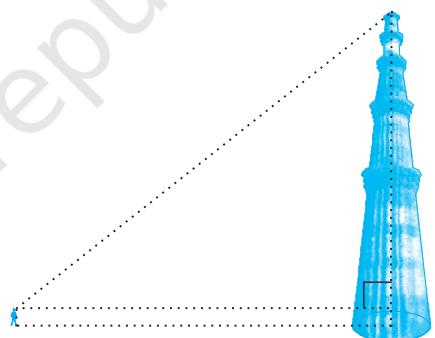

**8**

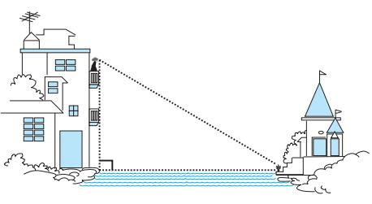

- 3. Suppose a hot air balloon is flying in the air. A girl happens to spot the balloon in the sky and runs to her mother to tell her about it. Her mother rushes out of the house to look at the balloon.Now when the girl had spotted the balloon intially it was at point A. When both the mother and daughter came out to see it, it had already travelled to another point B. Can you find the altitude of B from the ground?
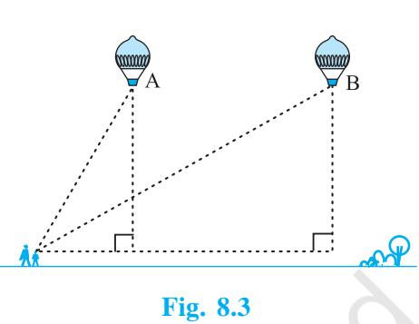

In all the situations given above, the distances or heights can be found by using some mathematical techniques, which come under a branch of mathematics called 'trigonometry'. The word 'trigonometry' is derived from the Greek words 'tri' (meaning three), 'gon' (meaning sides) and 'metron' (meaning measure). In fact, **trigonometry** is the study of relationships between the sides and angles of a triangle. The earliest known work on trigonometry was recorded in Egypt and Babylon. Early astronomers used it to find out the distances of the stars and planets from the Earth. Even today, most of the technologically advanced methods used in Engineering and Physical Sciences are based on trigonometrical concepts.

In this chapter, we will study some ratios of the sides of a right triangle with respect to its acute angles, called **trigonometric ratios of the angle.** We will restrict our discussion to acute angles only. However, these ratios can be extended to other angles also. We will also define the trigonometric ratios for angles of measure 0° and 90°. We will calculate trigonometric ratios for some specific angles and establish some identities involving these ratios, called **trigonometric identities.**

## **8.2 Trigonometric Ratios**

In Section 8.1, you have seen some right triangles imagined to be formed in different situations.

Let us take a right triangle ABC as shown in Fig. 8.4.

Here, CAB (or, in brief, angle A) is an acute angle. Note the position of the side BC with respect to angle A. It faces A. We call it the *side opposite* to angle A. AC is the *hypotenuse* of the right triangle and the side AB is a part of A. So, we call it the *side adjacent* to angle A. **Fig. 8.4**

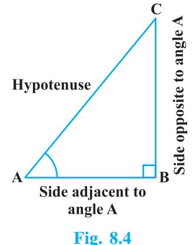

Note that the position of sides change when you consider angle C in place of A (see Fig. 8.5).

You have studied the concept of 'ratio' in your earlier classes. We now define certain ratios involving the sides of a right triangle, and call them trigonometric ratios.

**The trigonometric ratios** of the angle A in right triangle ABC (see Fig. 8.4) are defined as follows :

> sine of A = side opposite to angle A BC hypotenuse AC cosine of A = side adjacent to angle A AB hypotenuse AC tangent of A = side opposite to angle A BC side adjacent to angle A AB cosecant of A = 1 hypotenuse AC sine of A side opposite to angle A BC secant of A = 1 hypotenuse AC cosine of A side adjacent to angle A AB cotangent of A = 1 side adjacent to angle A AB tangent of A side opposite to angle A BC **Fig. 8.5**

The ratios defined above are abbreviated as sin A, cos A, tan A, cosec A, sec A and cot A respectively. Note that the ratios **cosec A, sec A and cot A** are respectively, the reciprocals of the ratios sin A, cos A and tan A.

Also, observe that $\tan\,\mathrm{A}=\dfrac{\mathrm{BC}}{\mathrm{AB}}=\dfrac{\mathrm{AC}}{\mathrm{AB}}=\dfrac{\sin\,\mathrm{A}}{\cos\,\mathrm{A}}$ and $\cot\,\mathrm{A}=\dfrac{\cos\,\mathrm{A}}{\sin\,\mathrm{A}}$.  
  

So, the **trigonometric ratios** of an acute angle in a right triangle express the relationship between the angle and the length of its sides.

Why don't you try to define the trigonometric ratios for angle C in the right triangle? (See Fig. 8.5)

The first use of the idea of **'sine'** in the way we use it today was in the work *Aryabhatiyam* by Aryabhata, in A.D. 500. Aryabhata used the word *ardha-jya* for the half-chord, which was shortened to *jya* or *jiva* in due course. When the *Aryabhatiyam* was translated into Arabic, the word *jiva* was retained as it is. The word *jiva* was translated into *sinus,* which means curve, when the Arabic version was translated into Latin. Soon the word *sinus*, also used as *sine*, became common in mathematical texts throughout Europe. An English Professor of astronomy Edmund Gunter (1581–1626), first used the abbreviated notation **'***sin***'.**

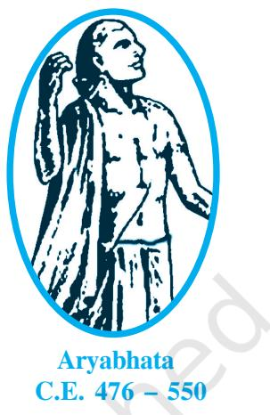

The origin of the terms **'cosine'** and **'tangent'** was much later. The cosine function arose from the need to compute the sine of the complementary angle. Aryabhatta called it **kotijya**. The name *cosinus* originated with Edmund Gunter. In 1674, the English Mathematician Sir Jonas Moore first used the abbreviated notation **'***cos***'**.

**Remark :** Note that the symbol sin A is used as an abbreviation for 'the sine of the angle A'. sin A is *not* the product of 'sin' and A. 'sin' separated from A has no meaning. Similarly, cos A is *not* the product of 'cos' and A. Similar interpretations follow for other trigonometric ratios also.

Now, if we take a point P on the hypotenuse AC or a point Q on AC extended, of the right triangle ABC and draw PM perpendicular to AB and QN perpendicular to AB extended (see Fig. 8.6), how will the trigonometric ratios of A in PAM differ from those of A in CAB or from those of A in QAN?

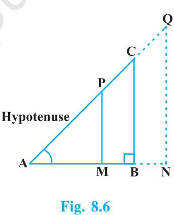

To answer this, first look at these triangles. Is PAM similar to CAB? From Chapter 6, recall the AA similarity criterion. Using the criterion, you will see that the triangles PAM and CAB are similar. Therefore, by the property of similar triangles, the corresponding sides of the triangles are proportional.

- So, we have AM AB = AP MP AC BC
From this, we find  
  

$$\frac{\text{MP}}{\text{AP}}=\frac{\text{BC}}{\text{AC}}=\sin\text{A}\,.$$
  
  
Similarly,  
  

$$\frac{\text{AM}}{\text{AP}}=\frac{\text{AB}}{\text{AC}}=\cos\text{A},\,\frac{\text{MP}}{\text{AM}}=\frac{\text{BC}}{\text{AB}}=\tan\text{A}\,\,\,\text{and so on.}$$

This shows that the trigonometric ratios of angle A in PAM not differ from those of angle A in CAB.

In the same way, you should check that the value of sin A (and also of other trigonometric ratios) remains the same in QAN also.

From our observations, it is now clear that **the values of the trigonometric ratios of an angle do not vary with the lengths of the sides of the triangle, if the angle remains the same.**

**Note :** For the sake of convenience, we may write sin2 A, cos2 A, etc., in place of (sin A)2 , (cos A)2 , etc., respectively. But cosec A = (sin A)–1 sin–1 A (it is called sine inverse A). sin–1 A has a different meaning, which will be discussed in higher classes. Similar conventions hold for the other trigonometric ratios as well. Sometimes, the Greek letter (theta) is also used to denote an angle.

We have defined six trigonometric ratios of an acute angle. If we know any one of the ratios, can we obtain the other ratios? Let us see.

If in a right triangle ABC, sin A = 1 , 3 then this means that BC 1 AC 3 , i.e., the lengths of the sides BC and AC of the triangle ABC are in the ratio 1 : 3 (see Fig. 8.7). So if BC is equal to *k*, then AC will be 3*k*, where *k* is any positive number. To determine other

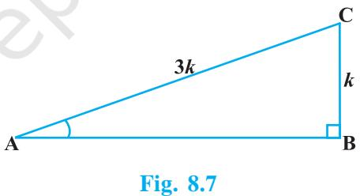

trigonometric ratios for the angle A, we need to find the length of the third side AB. Do you remember the Pythagoras theorem? Let us use it to determine the required length AB.

AB2 = AC2 – BC2 = (3*k*) 2 – (*k*)2 = 8*k*2 = (2 2 *k*)2 Therefore, AB = 2 2 *k* So, we get AB = 2 2 *k* (Why is AB not – 2 2 *k* ?) Now, cos A = AB 2 2 2 2 AC 3 3 *k k*

Similarly, you can obtain the other trigonometric ratios of the angle A.

**Remark :** Since the hypotenuse is the longest side in a right triangle, the value of sin A or cos A is always less than 1 (or, in particular, equal to 1).

Let us consider some examples.

**Example 1 :** Given tan A = 4 3 , find the other trigonometric ratios of the angle A. **Solution :** Let us first draw a right ABC (see Fig 8.8). Now, we know that tan A = BC 4 AB 3 . Therefore, if BC = 4*k*, then AB = 3*k*, where *k* is a positive number. Now, by using the Pythagoras Theorem, we have AC2 = AB2 + BC2 = (4*k*)2 + (3*k*)2 = 25*k*2 So, AC = 5*k* Now, we can write all the trigonometric ratios using their definitions. sin A = BC 4 4 AC 5 5 *k k* cos A = AB 3 3 AC 5 5 *k k* Therefore, cot A = 13 15 , cosec A = tan A 4 sin A 4 and sec A = 1 5 cos A 3 **Example 2 :** If B and Q are acute angles such that sin B = sin Q, then prove that B = Q. **Fig. 8.8**

**Solution :** Let us consider two right triangles ABC and PQR where sin B = sin Q (see Fig. 8.9).

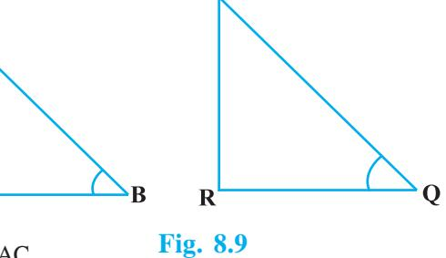

We have  
  

$$\sin\text{B}=\begin{array}{c}\cdot\\ \hline\text{AC}\\ \hline\text{AB}\\ \cdot\\ \sin\text{Q}=\begin{array}{c}\cdot\\ \hline\text{PR}\\ \hline\text{PQ}\end{array}\end{array}$$
  
  
and

Then AC AB = PR PQ Therefore, AC PR = AB , say PQ *k* (1)

BC = 2 2 AB AC

Now, using Pythagoras theorem,

and QR = 2 2 PQ – PR

So, $\frac{\text{BC}}{\text{QR}}=\frac{\sqrt{\text{AB}^{2}-\text{AC}^{2}}}{\sqrt{\text{PQ}^{2}-\text{PR}^{2}}}=\frac{\sqrt{k^{2}\text{PQ}^{2}-k^{2}\text{PR}^{2}}}{\sqrt{\text{PQ}^{2}-\text{PR}^{2}}}=\frac{k\sqrt{\text{PQ}^{2}-\text{PR}^{2}}}{\sqrt{\text{PQ}^{2}-\text{PR}^{2}}}=k$.  
  

From (1) and (2), we have

* [16] A. A. K.  
  

Then, by using Theorem 6.4, ACB ~ PRQ and therefore, B = Q.

**Example 3 :** Consider ACB, right-angled at C, in which AB = 29 units, BC = 21 units and ABC = (see Fig. 8.10). Determine the values of (i) cos2 + sin2 , (ii) cos2 – sin2 **Solution :** In ACB, we have AC = 2 2 AB BC = 2 2 (29) (21) = (29 21)(29 21) (8)(50) 400 20units So, sin = AC 20 BC 21 , cos = AB 29 AB 29 Now, (i) cos2 + sin2 = 2 2 2 2 2 20 21 20 21 400 441 1, 29 29 841 29 and (ii) cos2 – sin2 = 2 2 2 21 20 (21 20)(21 20) 41 29 29 841 29 . **Fig. 8.10**

**Fig. 8.11**

**Example 4 :** In a right triangle ABC, right-angled at B, if tan A = 1, then verify that

2 sin A cos A = 1.

  
  
**Solution :** In $\Delta$ ABC, tan A = $\frac{\mbox{BC}}{\mbox{AB}}=1$ (see Fig 8.11)

i.e., BC = AB

Let AB = BC = *k*, where *k* is a positive number.

Now,  
  

$$\begin{array}{c}\mbox{AC}=\sqrt{\mbox{AB}^{2}+\mbox{BC}^{2}}\\ \\ =\sqrt{\left(k\right)^{2}+\left(k\right)^{2}}=k\sqrt{2}\end{array}$$

Therefore,  
  

$$\sin A=\frac{\text{BC}}{\text{AC}}=\frac{1}{\sqrt{2}}\quad\text{and}\quad\cos A=\frac{\text{AB}}{\text{AC}}=\frac{1}{\sqrt{2}}$$

So,  
  
2 sin A cos A = 2($\frac{1}{\sqrt{2}}$)($\frac{1}{\sqrt{2}}$)=1, which is the required value.  
  

**Example 5 :** In OPQ, right-angled at P, OP = 7 cm and OQ – PQ = 1 cm (see Fig. 8.12). Determine the values of sin Q and cos Q.

**Solution :** In OPQ, we have

$$\mathrm{{\Omega}}\mathrm{{\Omega}}^{2}=\mathrm{{\Omega}}\mathrm{{\Omega}}^{2}\mathrm{{\Omega}}+\mathrm{{\Omega}}\mathrm{{\Omega}}^{2}$$

i.e., $\gamma(1+\rm PQ)^{2}=\rm OP^{2}+PQ^{2}$ (Why?)

i.e., 1 + PQ2 + 2PQ = OP2 + PQ2

i.e., $1+2$PQ = $7^{2}$ (Why?)

i.e., $\rm PQ=24$ cm and $\rm OQ=1+PQ=25$ cm

So,  
  

$$\sin\,Q=\frac{7}{25}\,\,\,\mbox{and}\,\,\cos\,Q=\frac{24}{25}\,.$$

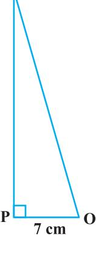

## **EXERCISE 8.1**

- **1.** In ABC, right-angled at B, AB = 24 cm, BC = 7 cm. Determine :
	- (i) sin A, cos A
	- (ii) sin C, cos C
- **2.** In Fig. 8.13, find tan P cot R.
- **3.** If sin A = 3 , 4 calculate cos A and tan A.
- **4.** Given 15 cot A = 8, find sin A and sec A.
- **5.** Given sec = 13 , 12 calculate all other trigonometric ratios.
- **6.** If A and B are acute angles such that cos A = cos B, then show that A = B.
- **7.** If cot = 7 , 8 evaluate : (i) (1 sin )(1 sin ) , (1 cos )(1 cos ) (ii) cot2

  
  
**8.**: If 3 cot A = 4, check whether $\frac{1-\tan^{2}\text{A}}{1+\tan^{2}\text{A}}=\cos^{2}\text{A}-\sin^{2}\text{A}$ or not.  
  

- **9.** In triangle ABC, right-angled at B, if tan A = 1 , 3 find the value of:
	- (i) sin A cos C + cos A sin C
	- (ii) cos A cos C sin A sin C
- **10.** In PQR, right-angled at Q, PR + QR = 25 cm and PQ = 5 cm. Determine the values of sin P, cos P and tan P.
- **11.** State whether the following are true or false. Justify your answer.
	- (i) The value of tan A is always less than 1.
	- (ii) sec A = 12 5 for some value of angle A.
	- (iii) cos A is the abbreviation used for the cosecant of angle A.
	- (iv) cot A is the product of cot and A.

(v) sin $\theta=\frac{4}{3}$ for some angle $\theta$.  
  

## **8.3 Trigonometric Ratios of Some Specific Angles**

From geometry, you are already familiar with the construction of angles of 30°, 45°, 60° and 90°. In this section, we will find the values of the trigonometric ratios for these angles and, of course, for 0°.

**Fig. 8.13**

**Fig. 8.14**

### **Trigonometric Ratios of 45°**

In ABC, right-angled at B, if one angle is 45°, then the other angle is also 45°, i.e., A = C = 45° (see Fig. 8.14).

So, BC = AB (Why?)

Now, Suppose BC = AB = *a*.

Then by Pythagoras Theorem, AC2 = AB2 + BC2 = *a*2 + *a*2 = 2*a*2 ,

and, therefore, AC = *a* 2

Using the definitions of the trigonometric ratios, we have :

$\sin45^{\circ}=\frac{\text{side opposite to angle}45^{\circ}}{\text{hypotenuse}}=\frac{\text{BC}}{\text{AC}}=\frac{a}{a\sqrt{2}}=\frac{1}{\sqrt{2}}$  
  
$\cos45^{\circ}=\frac{\text{side adjacent to angle}45^{\circ}}{\text{hypotenuse}}=\frac{\text{AB}}{\text{AC}}=\frac{a}{a\sqrt{2}}=\frac{1}{\sqrt{2}}$  
  
$\cos45^{\circ}=\frac{\text{side opposite to angle}45^{\circ}}{\text{BC}}=\frac{a}{a\sqrt{2}}=\frac{1}{\sqrt{2}}$

$\tan45^{\circ}=\frac{\text{side opposite to angle}45^{\circ}}{\text{side adjacent to angle}45^{\circ}}=\frac{\text{BC}}{\text{AB}}=\frac{a}{a}=1$

Also, cosec 45° = 1 2 sin 45 , sec 45° = 1 2 cos 45 , cot 45° = 1 1 tan 45 .

#### **Trigonometric Ratios of 30° and 60°**

Let us now calculate the trigonometric ratios of 30° and 60°. Consider an equilateral triangle ABC. Since each angle in an equilateral triangle is 60°, therefore, A = B = C = 60°.

Draw the perpendicular AD from A to the side BC (see Fig. 8.15).

Now ABD ACD (Why?) Therefore, BD = DC and BAD = CAD (CPCT)

Now observe that:

 ABD is a right triangle, right-angled at D with BAD = 30° and ABD = 60° (see Fig. 8.15).

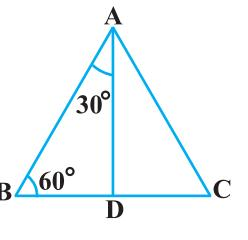

As you know, for finding the trigonometric ratios, we need to know the lengths of the sides of the triangle. So, let us suppose that AB = 2*a*.

Then, 
$$\mathrm{BD}=\,\frac{1}{2}\mathrm{BC}=a$$
.  

and  
  

$${\rm AD}^{2}={\rm AB}^{2}-{\rm BD}^{2}=(2a)^{2}-(a)^{2}=3a^{2},$$

Therefore, AD = *a* 3

Now, we have :  
  

$$\sin30^{\circ}=\frac{\text{BD}}{\text{AB}}=\frac{a}{2a}=\frac{1}{2}\,,\,\cos\,30^{\circ}=\frac{\text{AD}}{\text{AB}}=\frac{a\sqrt{3}}{2a}=\frac{\sqrt{3}}{2}$$
 
$$\tan\,30^{\circ}=\frac{\text{BD}}{\text{AD}}=\frac{a}{a\sqrt{3}}=\frac{1}{\sqrt{3}}\,.\tag{1}$$

1 2 cos 30 3 

Also, cosec 30° = 1 2, sin 30 sec 30° = cot 30° = 1 3 tan 30 .

AD 3 3

Similarly,

$$\sin60^{\circ}=\frac{\text{AD}}{\text{AB}}=\frac{a\sqrt{3}}{2a}=\frac{\sqrt{3}}{2},\cos60^{\circ}=\frac{1}{2},\tan60^{\circ}=\sqrt{3},$$
  
  

$$\cos60^{\circ}=\frac{2}{\sqrt{3}},\sec60^{\circ}=2\text{and}\cot60^{\circ}=\frac{1}{\sqrt{3}}.$$

## **Trigonometric Ratios of 0° and 90°**

Let us see what happens to the trigonometric ratios of angle A, if it is made smaller and smaller in the right triangle ABC (see Fig. 8.16), till it becomes zero. As A gets smaller and smaller, the length of the side BC decreases.The point C gets closer to point B, and finally when A becomes very close to 0°, AC becomes almost the same as AB (see Fig. 8.17).

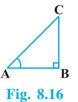

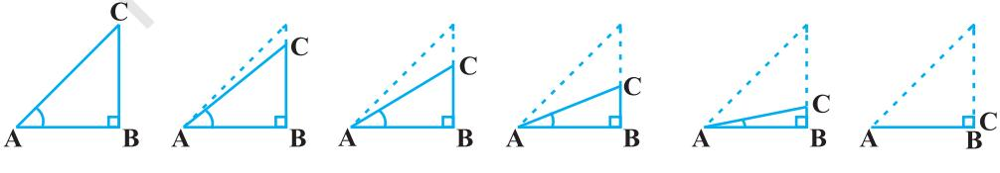

**Fig. 8.17**

When A is very close to 0°, BC gets very close to 0 and so the value of sin A = BC AC is very close to 0. Also, when A is very close to 0°, AC is nearly the same as AB and so the value of cos A = AB AC is very close to 1.

This helps us to see how we can define the values of sin A and cos A when A = 0°. We define : **sin 0° = 0 and cos 0° = 1.**

Using these, we have :

cos 0

$\tan0^{\circ}=\frac{\sin0^{\circ}}{\cos0^{\circ}}=0$, $\cot0^{\circ}=\frac{1}{\tan0^{\circ}}$, which is not defined. (Why?)  
  
$\sec0^{\circ}=\frac{1}{\cos0^{\circ}}=1$ and $\cosec0^{\circ}=\frac{1}{\sin0^{\circ}}$, which is again not defined. (Why?)

Now, let us see what happens to the trigonometric ratios of A, when it is made larger and larger in ABC till it becomes 90°. As A gets larger and larger, C gets smaller and smaller. Therefore, as in the case above, the length of the side AB goes on decreasing. The point A gets closer to point B. Finally when A is very close to 90°, C becomes very close to 0° and the side AC almost coincides with side BC (see Fig. 8.18).

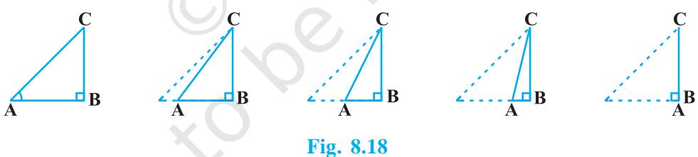

When C is very close to 0°, A is very close to 90°, side AC is nearly the same as side BC, and so sin A is very close to 1. Also when A is very close to 90°, C is very close to 0°, and the side AB is nearly zero, so cos A is very close to 0.

So, we define : **sin 90° = 1 and cos 90° = 0.**

Now, why don't you find the other trigonometric ratios of 90°?

We shall now give the values of all the trigonometric ratios of 0°, 30°, 45°, 60° and 90° in Table 8.1, for ready reference.

|  A | 0° | 30° | 45° | 60° | 90° |
| --- | --- | --- | --- | --- | --- |
| sin A | 0 | 1 | 1 | 3 | 1 |
|  |  | 2 | 2 | 2 |  |
| cos A | 1 | 3 | 1 | 1 | 0 |
|  |  | 2 | 2 | 2 |  |
| tan A | 0 | 1 3 | 1 | 3 | Not defined |
| cosec A | Not defined | 2 | 2 | 2 | 1 |
|  |  |  |  | 3 |  |
| sec A | 1 | 2 3 | 2 | 2 | Not defined |
| cot A | Not defined | 3 | 1 | 1 | 0 |
|  |  |  |  | 3 |  |

| Table 8.1 |
| --- |

**Remark :** From the table above you can observe that as A increases from 0° to 90°, sin A increases from 0 to 1 and cos A decreases from 1 to 0.

Let us illustrate the use of the values in the table above through some examples.

**Example 6 :** In ABC, right-angled at B, AB = 5 cm and ACB = 30° (see Fig. 8.19). Determine the lengths of the sides BC and AC.

**Solution :** To find the length of the side BC, we will choose the trigonometric ratio involving BC and the given side AB. Since BC is the side adjacent to angle C and AB is the side opposite to angle C, therefore

AB BC = tan C 5 BC = tan 30° = 1 3 which gives BC = 5 3 cm

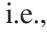

**Fig. 8.19**

To find the length of the side AC, we consider

$\sin30^{\circ}=\frac{\rm AB}{\rm AC}$ (Why?)  
  
i.e.,  
  
$\frac{1}{2}=\frac{5}{\rm AC}$

i.e., AC = 10 cm

Note that alternatively we could have used Pythagoras theorem to determine the third side in the example above,

i.e.,  
  

$$\text{AC}=\sqrt{\text{AB}^{2}+\text{BC}^{2}}=\sqrt{5^{2}+(5\sqrt{3})^{2}}\text{cm}=10\text{cm}$$

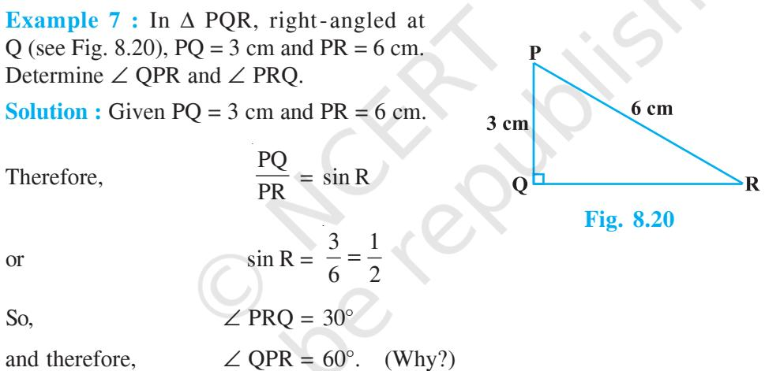

You may note that if one of the sides and any other part (either an acute angle or any side) of a right triangle is known, the remaining sides and angles of the triangle can be determined.

**Example 8 :** If sin (A – B) = 1 , 2 cos (A + B) = 1 , 2 0° < A + B 90°, A > B, find A and B.

  
  
**Solution :** Since, sin (A - B) = $\frac{1}{2}$, therefore, A - B = 30${}^{\circ}$ (Why?) (1)

Also, since cos (A + B) = $\frac{1}{2}$, therefore, A + B = 60${}^{\circ}$ (Why?) (2)

Solving (1) and (2), we get : A = 45° and B = 15°.

## **EXERCISE 8.2**

**1.** Evaluate the following :

- (i) sin 60° cos 30° + sin 30° cos 60° (ii) 2 tan2 45° + cos2 30° – sin2 60° (iii) cos 45° sec 30° + cosec 30° (iv) sin 30° + tan 45° – cosec 60° sec 30° + cos 60° + cot 45° (v) 2 22 2 2 5 cos 60 4 sec 30 tan 45 sin 30 cos 30 **2.** Choose the correct option and justify your choice : (i) 2 2 tan 30 1 tan 30 (A) sin 60° (B) cos 60° (C) tan 60° (D) sin 30° (ii) 2 2 1 tan 45 1 tan 45 (A) tan 90° (B) 1 (C) sin 45° (D) 0 (iii) sin 2A = 2 sin A is true when A = (A) 0° (B) 30° (C) 45° (D) 60°
* $\frac{2\ \tan\ 30^{\circ}}{1-\tan^{2}\ 30^{\circ}}=$  
* $\cos60^{\circ}$ (B) $\sin60^{\circ}$ (C) $\tan60^{\circ}$ (D) $\sin30^{\circ}$

  
  
**3.**: If $\tan\left(\text{A}+\text{B}\right)=\sqrt{3}$ and $\tan\left(\text{A}-\text{B}\right)=\frac{1}{\sqrt{3}}$ ; $0^{\circ}<\text{A}+\text{B}\leq90^{\circ}$; $\text{A}>\text{B}$, find $\text{A}$ and $\text{B}$.  
  

- **4.** State whether the following are true or false. Justify your answer.
(i) sin (A + B) = sin A + sin B.

- (ii) The value of sin increases as increases.
- (iii) The value of cos increases as increases.
- (iv) sin = cos for all values of .
- (v) cot A is not defined for A = 0°.

## **8.4 Trigonometric Identities**

You may recall that an equation is called an identity when it is true for all values of the variables involved. Similarly, an equation involving trigonometric ratios of an angle is called a **trigonometric identity,** if it is true for all values of the angle(s) involved.

In this section, we will prove one trigonometric identity, and use it further to prove other useful trigonometric identities.

In ABC, right-angled at B (see Fig. 8.21), we have:

AB2 + BC2 = AC2 (1)

Dividing each term of (1) by AC2 , we get

* [16] A. A. K.  
  

i.e.,  
  

$$\left(\frac{\text{AB}}{\text{AC}}\right)^{2}+\left(\frac{\text{BC}}{\text{AC}}\right)^{2}$$

i.e., (cos A)${}^{2}$ + (sin A)${}^{2}$ = 1

i.e., **cos2 A + sin2 A = 1** (2)

> This is true for all A such that 0° A 90°. So, this is a trigonometric identity. Let us now divide (1) by AB2 . We get

2 AC AC 

$$\frac{\mbox{AB}^{2}}{\mbox{AB}^{2}}+\frac{\mbox{BC}^{2}}{\mbox{AB}^{2}}=\frac{\mbox{AC}^{2}}{\mbox{AB}^{2}}$$
  
  
or,  
  

$$\left(\frac{\mbox{AB}}{\mbox{AB}}\right)^{2}+\left(\frac{\mbox{BC}}{\mbox{AB}}\right)^{2}=\left(\frac{\mbox{AC}}{\mbox{AB}}\right)^{2}$$
  
  
i.e.,  
  

$$1+\mbox{tan}^{2}\,\mbox{A}=\mbox{sec}^{2}\,\,\,\mbox{A}\tag{3}$$

or,

Is this equation true for A = 0°? Yes, it is. What about A = 90°? Well, tan A and sec A are not defined for A = 90°. So, (3) is true for all A such that 0° A 90°.

> Let us see what we get on dividing (1) by BC2 . We get

$${\frac{\mathrm{AB}^{2}}{\mathrm{BC}^{2}}}+{\frac{\mathrm{BC}^{2}}{\mathrm{BC}^{2}}}\,=\,{\frac{\mathrm{AC}^{2}}{\mathrm{BC}^{2}}}$$

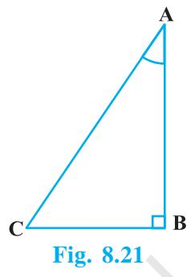

$$\left(\frac{\mathrm{AB}}{\mathrm{BC}}\right)^{2}+\left(\frac{\mathrm{BC}}{\mathrm{BC}}\right)^{2}=\left(\frac{\mathrm{AC}}{\mathrm{BC}}\right)^{2}$$
. 

i.e.,

i.e.,  
  

$${\bf cot^{2}\,A+1=cosec^{2}\,A}\tag{4}$$

Note that cosec A and cot A are not defined for A = 0°. Therefore (4) is true for all A such that 0° < A 90°.

Using these identities, we can express each trigonometric ratio in terms of other trigonometric ratios, i.e., if any one of the ratios is known, we can also determine the values of other trigonometric ratios.

Let us see how we can do this using these identities. Suppose we know that

$$\tan\mathrm{A}={\frac{1}{\sqrt{3}}}.{\mathrm{~Then,\cotA}}={\dot{\sqrt{3}}}\ .$$

- Since, sec2 A = 1 + tan2 A = 1 4 1 , 3 3 sec A = 2 3 , and cos A = 3 2
Again, sin A = 2 3 1 1 cos A 1 4 2 . Therefore, cosec A = 2.

**Example 9 :** Express the ratios cos A, tan A and sec A in terms of sin A.

**Solution :** Since cos2 A + sin2 A = 1, therefore,

$\cos^{2}$ A = $1-\sin^{2}$ A, i.e., $\cos$ A = $\pm\sqrt{1-\sin^{2}$ A 

This gives  
  

$$\cos\,{\rm A}=\sqrt{1-\sin^{2}\,{\rm A}}$$
 (Why?)

Hence,  
  

$$\tan\mathrm{A}\!\doteq\frac{\sin\mathrm{A}}{\cos\mathrm{A}}=\frac{\sin\mathrm{A}}{\sqrt{1-\sin^{2}\mathrm{A}}}\text{and sec A}=\frac{1}{\cos\mathrm{A}}=\frac{1}{\sqrt{1-\sin^{2}\mathrm{A}}}$$

**Example 10 :** Prove that sec A (1 – sin A)(sec A + tan A) = 1. **Solution :**

LHS = sec A (1 - sin A)(sec A + tan A) = $\left(\frac{1}{\cos\,\mathrm{A}}\right)$(1 - sin A)$\left(\frac{1}{\cos\,\mathrm{A}}+\frac{\sin\,\mathrm{A}}{\cos\,\mathrm{A}}\right)$

$\begin{array}{c}\mbox{(1--sin A)(1+sin A)}\\ \mbox{cos}^{2}\mbox{A}\end{array}$

**Example 11 :** Prove that cot A – cos A cosec A – 1 cot A + cos A cosec A + 1

  
  
**Solution :** LHS = $\frac{\cot\,\mathrm{A}\,-\,\cos\,\mathrm{A}}{\cot\,\mathrm{A}\,+\,\cos\,\mathrm{A}}=\frac{\frac{\cos\,\mathrm{A}}{\sin\,\mathrm{A}}-\cos\,\mathrm{A}}{\frac{\cos\,\mathrm{A}}{\sin\,\mathrm{A}}+\cos\,\mathrm{A}}$  
  

$$=\frac{\cos\,\mathrm{A}\!\left(\frac{1}{\sin\,\mathrm{A}}-1\right)}{\cos\,\mathrm{A}\!\left(\frac{1}{\sin\,\mathrm{A}}+1\right)}=\frac{\left(\frac{1}{\sin\,\mathrm{A}}-1\right)}{\left(\frac{1}{\sin\,\mathrm{A}}+1\right)}=\frac{\cos\mathrm{A}-1}{\cos\mathrm{A}+1}=\mathrm{RHS}$$

**Example 12 :** Prove that sin cos 1 1 , sin cos 1 sec tan using the identity sec2 = 1 + tan2 .

**Solution :** Since we will apply the identity involving sec and tan , let us first convert the LHS (of the identity we need to prove) in terms of sec and tan by dividing numerator and denominator by cos

$$\begin{array}{l}\mbox{LHS}=\frac{\sin\ \theta-\cos\ \theta+1}{\sin\ \theta+\cos\ \theta-1}=\frac{\tan\ \theta-1+\sec\ \theta}{\tan\ \theta+1-\sec\ \theta}\\ =\frac{(\tan\ \theta+\sec\ \theta)-1}{(\tan\ \theta-\sec\ \theta)+1}=\frac{\{(\tan\ \theta+\sec\ \theta)-1\}\ (\tan\ \theta-\sec\ \theta)}{\{(\tan\ \theta-\sec\ \theta)+1\}\ (\tan\ \theta-\sec\ \theta)}\\ =\frac{(\tan^{2}\ \theta-\sec^{2}\ \theta)-(\tan\ \theta-\sec\ \theta)}{\{\tan\ \theta-\sec\ \theta+1\}\ (\tan\ \theta-\sec\ \theta)}\\ =\frac{-1-\tan\ \theta+\sec\ \theta}{(\tan\ \theta-\sec\ \theta+1)\ (\tan\ \theta-\sec\ \theta)}\end{array}$$

$$={\frac{-1}{\tan\,\theta-\sec\,\theta}}={\frac{1}{\sec\,\theta-\tan\,\theta}},$$

which is the RHS of the identity, we are required to prove.

## **EXERCISE 8.3**

- **1.** Express the trigonometric ratios sin A, sec A and tan A in terms of cot A.
- **2.** Write all the other trigonometric ratios of A in terms of sec A.
- **3.** Choose the correct option. Justify your choice.
	- (i) 9 sec2 A – 9 tan2 A = (A) 1 (B) 9 (C) 8 (D) 0 (ii) (1 + tan + sec ) (1 + cot – cosec ) = (A) 0 (B) 1 (C) 2 (D) –1 (iii) (sec A + tan A) (1 – sin A) = (A) sec A (B) sin A (C) cosec A (D) cos A (iv) 2 2 1 tan A 1 + cot A (A) sec2 A (B) –1 (C) cot2 A (D) tan2 A
- **4.** Prove the following identities, where the angles involved are acute angles for which the expressions are defined.

(i) (cosec – cot )2 = 1 cos 1 cos (ii) cos A 1 sin A 2 sec A 1 + sin A cos A (iii) tan cot 1 sec cosec 1 cot 1 tan [**Hint :** Write the expression in terms of sin and cos ] (iv) 2 1 sec A sin A sec A 1 – cos A [**Hint :** Simplify LHS and RHS separately] (v) cos A – sin A + 1 cosec A + cot A, cos A + sin A – 1 using the identity cosec2 A = 1 + cot2 A. (vi) 1 sin A sec A + tan A 1 – sin A (vii) 3 3 sin 2 sin tan 2 cos cos (viii) (sin A + cosec A)2 + (cos A + sec A)2 = 7 + tan2 A + cot2 A

(ix) (cosec A - sin A)(sec A - cos A) = 1 - $\tan$ A + cot A 

[**Hint :** Simplify LHS and RHS separately]

(x) $\left(\frac{1+\tan^{2}\text{A}}{1+\cot^{2}\text{A}}\right)=\left(\frac{1-\tan\text{A}}{1-\cot\text{A}}\right)^{2}=\tan^{2}\text{A}$

## **8.5 Summary**

In this chapter, you have studied the following points :

- **1.** In a right triangle ABC, right-angled at B,
$\sin\mathrm{A}=\dfrac{\mathrm{side}\mathrm{opposite}\mathrm{to}\mathrm{angle}\mathrm{A}}{\mathrm{hypotenuse}}$, $\cos\mathrm{A}=\dfrac{\mathrm{side}\mathrm{adjacent}\mathrm{to}\mathrm{angle}\mathrm{A}}{\mathrm{hypotenuse}}$, $\tan\mathrm{A}=\dfrac{\mathrm{side}\mathrm{opposite}\mathrm{to}\mathrm{angle}\mathrm{A}}{\mathrm{side}\mathrm{adjacent}\mathrm{to}\mathrm{angle}\mathrm{A}}$.  
  

- **2.** 1 1 1 sin A , cosec A = ; sec A = ; tan A = tan A = sin A cos A cot A cos A  **.**
- **3.** If one of the trigonometric ratios of an acute angle is known, the remaining trigonometric ratios of the angle can be easily determined.
- **4.** The values of trigonometric ratios for angles 0°, 30°, 45°, 60° and 90°.
- **5.** The value of sin A or cos A never exceeds 1, whereas the value of sec A (0° £ A < 90°) or cosec A (0° < A £ 90º) is always greater than or equal to 1.
- **6.** sin2 A + cos2 A = 1, sec2 A – tan2 A = 1 for 0° £ A < 90°, cosec2 A = 1 + cot2 A for 0° < A £ 90º.

