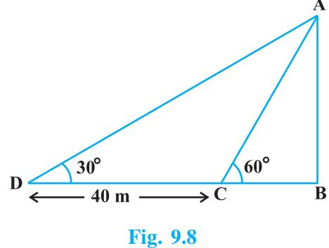

## **9.1 Heights and Distances**

In the previous chapter, you have studied about trigonometric ratios. In this chapter, you will be studying about some ways in which trigonometry is used in the life around you.

Let us consider Fig. 8.1 of prvious chapter, which is redrawn below in Fig. 9.1.

In this figure, the line AC drawn from the eye of the student to the top of the minar is called the *line of sight*. The student is looking at the top of the minar. The angle BAC, so formed by the line of sight with the horizontal, is called the *angle of elevation* of the top of the minar from the eye of the student.

Thus, the **line of sight** is the line drawn from the eye of an observer to the point in the object viewed by the observer. The **angle of elevation** of the point viewed is the angle formed by the line of sight with the horizontal when the point being viewed is above the horizontal level, i.e., the case when we raise our head to look at the object (see Fig. 9.2).

Now, consider the situation given in Fig. 8.2. The girl sitting on the balcony is *looking down* at a flower pot placed on a stair of the temple. In this case, the line of sight is *below* the horizontal level. The angle so formed by the line of sight with the horizontal is called the *angle of depression*.

Thus, the **angle of depression** of a point on the object being viewed is the angle formed by the line of sight with the horizontal when the point is below the horizontal level, i.e., the case when we lower our head to look at the point being viewed (see Fig. 9.3).

Now, you may identify the lines of sight, and the angles so formed in Fig. 8.3. Are they angles of elevation or angles of depression?

Let us refer to Fig. 9.1 again. If you want to find the height CD of the minar without actually measuring it, what information do you need? You would need to know the following:

(i) the distance DE at which the student is standing from the foot of the minar

- (ii) the angle of elevation, BAC, of the top of the minar
- (iii) the height AE of the student.

Assuming that the above three conditions are known, how can we determine the height of the minar?

In the figure, CD = CB + BD. Here, BD = AE, which is the height of the student.

To find BC, we will use trigonometric ratios of BAC or A.

In ABC, the side BC is the opposite side in relation to the known A. Now, which of the trigonometric ratios can we use? Which one of them has the two values that we have and the one we need to determine? Our search narrows down to using either tan A or cot A, as these ratios involve AB and BC.

Therefore, $\tan\,\mathrm{A}=\frac{\mathrm{BC}}{\mathrm{AB}}$ or $\cot\,\mathrm{A}=\frac{\mathrm{AB}}{\mathrm{BC}}$, which on solving would give us BC.  
  

By adding AE to BC, you will get the height of the minar.

Now let us explain the process, we have just discussed, by solving some problems.

**Example 1 :** A tower stands vertically on the ground. From a point on the ground, which is 15 m away from the foot of the tower, the angle of elevation of the top of the tower is found to be 60°. Find the height of the tower.

**Solution :** First let us draw a simple diagram to represent the problem (see Fig. 9.4). Here AB represents the tower, CB is the distance of the point from the tower and ACB is the angle of elevation. We need to determine the height of the tower, i.e., AB. Also, ACB is a triangle, right-angled at B.

To solve the problem, we choose the trigonometric ratio tan 60° (or cot 60°), as the ratio involves AB and BC.

15

i.e., 3 = AB

i.e., $\bf{AB=15\sqrt{3}}$

Hence, the height of the tower is 15 3 m.

**Fig. 9.4**

**Example 2 :** An electrician has to repair an electric fault on a pole of height 5 m. She needs to reach a point 1.3m below the top of the pole to undertake the repair work (see Fig. 9.5). What should be the length of the ladder that she should use which, when inclined at an angle of 60° to the horizontal, would enable her to reach the required position? Also, how far from the foot of the pole should she place the foot of the ladder? (You may take 3 = 1.73)

**Solution :** In Fig. 9.5, the electrician is required to reach the point B on the pole AD.

So, BD = AD – AB = (5 – 1.3)m = 3.7 m.

Here, BC represents the ladder. We need to find its length, i.e., the hypotenuse of the right triangle BDC.

Now, can you think which trigonometic ratio should we consider? It should be sin 60°.

* [10] A. A. K.  
  

Therefore, BC =

So,

* [15] M. C. Gonzalez-Garcia, M. C. Gonzalez-Garcia, M.  
  

1 3

i.e., the length of the ladder should be 4.28 m.

Now,  
  
$\begin{array}{c}\mbox{\rm{DC}}\\ \mbox{\rm{BD}}\end{array}$

i.e.,  
  
$\sqrt{3}=2.14$ m (approx.)

Therefore, $\scriptsize\text{the}$ should place the foot of the ladder at a distance of $\scriptsize2.14\text{m}$ from the pole.  

**Example 3 :** An observer 1.5 m tall is 28.5 m away from a chimney. The angle of elevation of the top of the chimney from her eyes is 45°. What is the height of the chimney?

**Solution :** Here, AB is the chimney, CD the observer and ADE the angle of elevation (see Fig. 9.6). In this case, ADE is a triangle, right-angled at E and we are required to find the height of the chimney.

We have AB = AE + BE = AE + 1.5 and DE = CB = 28.5 m

To determine AE, we choose a trigonometric ratio, which involves both AE and DE. Let us choose the tangent of the angle of elevation.

Now, tan 45° =

DE i.e., 1 = AE 28.5

AE

Therefore, AE = 28.5

So the height of the chimney (AB) = (28.5 + 1.5) m = 30 m.

**Example 4 :** From a point P on the ground the angle of elevation of the top of a 10 m tall building is 30°. A flag is hoisted at the top of the building and the angle of elevation of the top of the flagstaff from P is 45°. Find the length of the flagstaff and the distance of the building from the point P. (You may take 3 = 1.732)

**Solution :** In Fig. 9.7, AB denotes the height of the building, BD the flagstaff and P the given point. Note that there are two right triangles PAB and PAD. We are required to find the length of the flagstaff, i.e., DB and the distance of the building from the point P, i.e., PA.

i.e., *x* = 10 3 1 = 7.32

So, the length of the flagstaff is 7.32 m.

**Example 5 :** The shadow of a tower standing on a level ground is found to be 40 m longer when the Sun's altitude is 30° than when it is 60°. Find the height of the tower.

**Solution :** In Fig. 9.8, AB is the tower and BC is the length of the shadow when the Sun's altitude is 60°, i.e., the angle of elevation of the top of the tower from the tip of the shadow is 60° and DB is the length of the shadow, when the angle of elevation is 30°.

Now, let AB be *h* m and BC be *x* m. According to the question, DB is 40 m longer than BC.

So, DB = (40 + *x*) m

Now, we have two right triangles ABC and ABD.

- In ABC, tan 60° =
or, 3 = *h*

$$\mathrm{In\:\Delta\:ABD,\qquad\qquad\tan\,30^{\circ}=\mathrm{\large~\frac{AB}{BD}~}}$$

i.e.,  
  

$$\frac{1}{\sqrt{3}}\,=\,\frac{h}{x+40}$$

From (1), we have *h* = *x* 3

Putting this value in (2), we get *x* 3 3 = *x* + 40, i.e., 3*x* = *x* + 40

AB BC

*x*

i.e., *x* = 20

So, *h* = 20 3 [From (1)]

Therefore, the height of the tower is 20 3 m.

**Example 6 :** The angles of depression of the top and the bottom of an 8 m tall building from the top of a multi-storeyed building are 30° and 45°, respectively. Find the height of the multi-

storeyed building and the distance between the two buildings.

**Solution :** In Fig. 9.9, PC denotes the multistoryed building and AB denotes the 8 m tall building. We are interested to determine the height of the multi-storeyed building, i.e., PC and the distance between the two buildings, i.e., AC. Look at the figure carefully. Observe that PB is a transversal to the parallel lines PQ and BD. Therefore, QPB and PBD are alternate angles, and so are equal. So PBD = 30°. Similarly, PAC = 45°. In right PBD, we have

(1)

$${\frac{\mathrm{PD}}{\mathrm{BD}}}=\tan\,30^{\circ}={\frac{\stackrel{\cdot}{1}}{\sqrt{3}}}\;{\mathrm{~or~BD=PD}}\,{\sqrt{3}}$$

In right PAC, we have

$${\frac{\mathrm{PC}}{\mathrm{AC}}}=\,\tan45^{\circ}=1$$

i.e., PC = AC

Also, 
$$\text{PC=PD+DC,therefore,PD+DC=AC.}$$
.  

Since, AC = BD and DC = AB = 8 m, we get PD + 8 = BD = PD 3 (Why?)

This gives  
  

$$\text{PD}=\frac{8}{\sqrt{3}-1}=\frac{8\left(\sqrt{3}+1\right)}{\left(\sqrt{3}+1\right)\left(\sqrt{3}-1\right)}=4\left(\sqrt{3}+1\right)\text{m}.$$

So, the height of the multi-storeyed building is 4 3 1 8 m=4 3+ 3 m and the distance between the two buildings is also 4 3 3 m.

**Example 7 :** From a point on a bridge across a river, the angles of depression of the banks on opposite sides of the river are 30° and 45°, respectively. If the bridge is at a height of 3 m from the banks, find the width of the river.

**Solution :** In Fig 9.10, A and B represent points on the bank on opposite sides of the river, so that AB is the width of the river. P is a point on the bridge at a height of 3 m, i.e., DP = 3 m. We are interested to determine the width of the river, which is the length of the side AB of the D APB.

Now, AB = AD + DB

In right APD, A = 30°.

So, $\qquad\qquad\tan\,30^\circ=\,\dfrac{\text{PD}}{\text{AD}}$.  

**Fig. 9.10**

i.e., 1 3 = 3 AD or AD = 3 3 m

Also, in right PBD, B = 45°. So, BD = PD = 3 m.

Now, AB = BD + AD = 3 + 3$\sqrt{3}$ = 3 (1 + $\sqrt{3}$ ) m.  
  

Therefore, the width of the river is 3 3 1m .

## **EXERCISE 9.1**

- **1.** A circus artist is climbing a 20 m long rope, which is tightly stretched and tied from the top of a vertical pole to the ground. Find the height of the pole, if the angle made by the rope with the ground level is 30° (see Fig. 9.11).
- **2.** A tree breaks due to storm and the broken part bends so that the top of the tree touches the ground making an angle 30° with it. The distance between the foot of the tree to the point where the top touches the ground is 8 m. Find the height of the tree.

- **3.** A contractor plans to install two slides for the children to play in a park. For the children below the age of 5 years, she prefers to have a slide whose top is at a height of 1.5 m, and is inclined at an angle of 30° to the ground, whereas for elder children, she wants to have a steep slide at a height of 3m, and inclined at an angle of 60° to the ground. What should be the length of the slide in each case?
- **4.** The angle of elevation of the top of a tower from a point on the ground, which is 30 m away from the foot of the tower, is 30°. Find the height of the tower.
- **5.** A kite is flying at a height of 60 m above the ground. The string attached to the kite is temporarily tied to a point on the ground. The inclination of the string with the ground is 60°. Find the length of the string, assuming that there is no slack in the string.
- **6.** A 1.5 m tall boy is standing at some distance from a 30 m tall building. The angle of elevation from his eyes to the top of the building increases from 30° to 60° as he walks towards the building. Find the distance he walked towards the building.
- **7.** From a point on the ground, the angles of elevation of the bottom and the top of a transmission tower fixed at the top of a 20 m high building are 45° and 60° respectively. Find the height of the tower.
- **8.** A statue, 1.6 m tall, stands on the top of a pedestal. From a point on the ground, the angle of elevation of the top of the statue is 60° and from the same point the angle of elevation of the top of the pedestal is 45°. Find the height of the pedestal.
- **9.** The angle of elevation of the top of a building from the foot of the tower is 30° and the angle of elevation of the top of the tower from the foot of the building is 60°. If the tower is 50 m high, find the height of the building.
- **10.** Two poles of equal heights are standing opposite each other on either side of the road, which is 80 m wide. From a point between them on the road, the angles of elevation of the top of the poles are 60° and 30°, respectively. Find the height of the poles and the distances of the point from the poles.
- **11.** A TV tower stands vertically on a bank of a canal. From a point on the other bank directly opposite the tower, the angle of elevation of the top of the tower is 60°. From another point 20 m away from this point on the line joing this point to the foot of the tower, the angle of elevation of the top of the tower is 30° (see Fig. 9.12). Find the height of the tower and the width of the canal.

- **12.** From the top of a 7 m high building, the angle of elevation of the top of a cable tower is 60° and the angle of depression of its foot is 45°. Determine the height of the tower.
- **13.** As observed from the top of a 75 m high lighthouse from the sea-level, the angles of depression of two ships are 30° and 45°. If one ship is exactly behind the other on the same side of the lighthouse, find the distance between the two ships.
- **14.** A 1.2 m tall girl spots a balloon moving with the wind in a horizontal line at a height of 88.2 m from the ground. The angle of elevation of the balloon from the eyes of the girl at any instant is 60°. After some time, the angle of elevation reduces to 30° (see Fig. 9.13). Find the distance travelled by the balloon during the interval.

- **15.** A straight highway leads to the foot of a tower. A man standing at the top of the tower observes a car at an angle of depression of 30°, which is approaching the foot of the
tower with a uniform speed. Six seconds later, the angle of depression of the car is found to be 60°. Find the time taken by the car to reach the foot of the tower from this point.

## **9.2 Summary**

In this chapter, you have studied the following points :

- **1.** (i) The **line of sight** is the line drawn from the eye of an observer to the point in the object viewed by the observer.
	- (ii) The **angle of elevation** of an object viewed, is the angle formed by the line of sight with the horizontal when it is above the horizontal level, i.e., the case when we raise our head to look at the object.
	- (iii) The **angle of depression** of an object viewed, is the angle formed by the line of sight with the horizontal when it is below the horizontal level, i.e., the case when we lower our head to look at the object.
- **2.** The height or length of an object or the distance between two distant objects can be determined with the help of trigonometric ratios.

