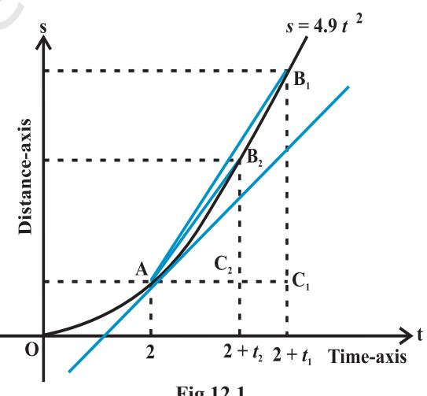
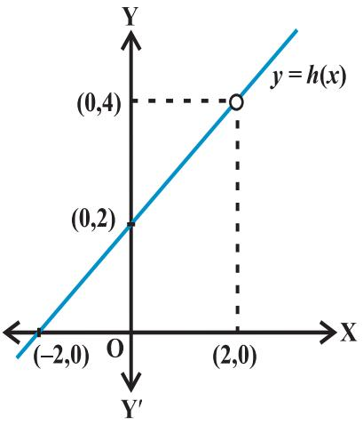
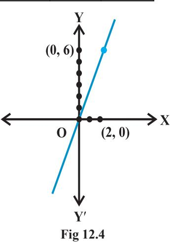
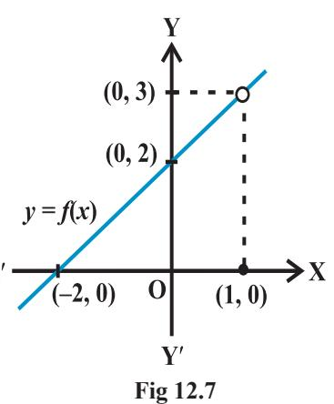
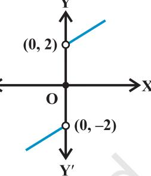
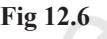
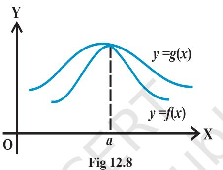
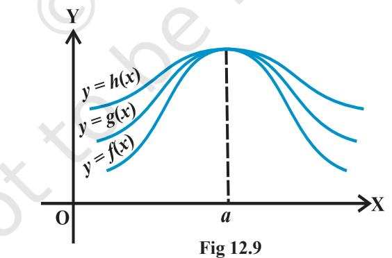
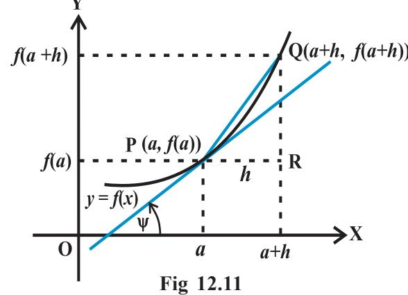

v*With the Calculus as a key, Mathematics can be successfully applied to the explanation of the course of Nature – WHITEHEAD* v

## **12.1 Introduction**

This chapter is an introduction to Calculus. Calculus is that branch of mathematics which mainly deals with the study of change in the value of a function as the points in the domain change. First, we give an intuitive idea of derivative (without actually defining it). Then we give a naive definition of limit and study some algebra of limits. Then we come back to a definition of derivative and study some algebra of derivatives. We also obtain derivatives of certain standard functions.

## **12.2 Intuitive Idea of Derivatives**

Physical experiments have confirmed that the body dropped from a tall cliff covers a distance of 4.9*t* 2 metres in *t* seconds,

i.e., distance *s* in metres covered by the body as a function of time *t* in seconds is given by *s* = 4.9*t* 2 *.*

The adjoining Table 13.1 gives the distance travelled in metres at various intervals of time in seconds of a body dropped from a tall cliff.

The objective is to find the veloctiy of the body at time *t* = 2 seconds from this data. One way to approach this problem is to find the average velocity for various intervals of time ending at *t* = 2 seconds and hope that these throw some light on the velocity at *t* = 2 seconds.

Average velocity between *t* = *t* 1 and *t = t2* equals distance travelled between *t = t1* and *t = t2* seconds divided by (*t* 2 – *t* 1 )*.* Hence the average velocity in the first two seconds

**Sir Issac Newton (1642-1727)**

seconds and *t* = 2 seconds.

=

=

| = | = | Distance travelled between | t | 2 | and t | 0 | 2 | 1 | = | − | Time interval ( | t | t | ) |  |  |  |
| --- | --- | --- | --- | --- | --- | --- | --- | --- | --- | --- | --- | --- | --- | --- | --- | --- | --- |
| 2 | 1 |  |  |  |  |  |  |  |  |  |  |  |  |  |  |  |  |
| − | 19.6 | 0 | m | ( | ) | = | 9.8 | m | / | s | = | . | ) | − | 2 | 0 | s |
| ( |  |  |  |  |  |  |  |  |  |  |  |  |  |  |  |  |  |
| Similarly, the average velocity between t = 1 | and t = 2 is |  |  |  |  |  |  |  |  |  |  |  |  |  |  |  |  |
| 19.6 – 4.9 | m | ( | ) | = 14.7 m/s | ) | − | 2 | 1 | s | ( |  |  |  |  |  |  |  |
| Likewise we compute the average velocitiy | between t = t | and t = 2 for various t | . The following |  |  |  |  |  |  |  |  |  |  |  |  |  |  |
| 1 | 1 | Table 13.2 gives the average velocity (v), t = t |  |  |  |  |  |  |  |  |  |  |  |  |  |  |  |

| 4 | 3 | 2.5 | 2.2 | 2.1 | 2.05 | 2 | 1.95 | 1.9 | 1.8 | 1.5 | 1 | 0 | t | Table 12.1 |
| --- | --- | --- | --- | --- | --- | --- | --- | --- | --- | --- | --- | --- | --- | --- |
| 78.4 | 44.1 | 30.625 | 23.716 | 21.609 | 20.59225 | 19.6 | 18.63225 | 17.689 | 15.876 | 11.025 | 4.9 | 0 | s |  |

**Table 12.2**

1

| t 1 | 0 | 1 | 1.5 | 1.8 | 1.9 | 1.95 | 1.99 |
| --- | --- | --- | --- | --- | --- | --- | --- |
| v | 9.8 | 14.7 | 17.15 | 18.62 | 19.11 | 19.355 | 19.551 |

From Table 12.2, we observe that the average velocity is gradually increasing. As we make the time intervals ending at *t* = 2 smaller, we see that we get a better idea of the velocity at *t* = 2. Hoping that nothing really dramatic happens between 1.99 seconds and 2 seconds, we conclude that the average velocity at *t* = 2 seconds is just above 19.551*m*/*s*.

This conclusion is somewhat strengthened by the following set of computation. Compute the average velocities for various time intervals starting at *t* = 2 seconds. As before the average velocity *v* between *t* = 2 seconds and *t* = *t* 2 seconds is

> = 2 2 Distance travelled between 2 seconds and seconds 2 *t t* − = 2 2 Distance travelled in seconds Distance travelled in 2 seconds 2 *t t* − −

#### = 2 2 Distance travelled in seconds 19.6 2 *t t* − −

The following Table 12.3 gives the average velocity *v* in metres per second between *t* = 2 seconds and *t* 2 seconds.

| t 2 | 4 | 3 | 2.5 | 2.2 2.1 | 2.05 | 2.01 |
| --- | --- | --- | --- | --- | --- | --- |
| v | 29.4 | 24.5 | 22.05 | 20.58 20.09 | 19.845 | 19.649 |

**Table 12.3**

Here again we note that if we take smaller time intervals starting at *t* = 2, we get better idea of the velocity at *t* = 2.

In the first set of computations, what we have done is to find average velocities in increasing time intervals ending at *t* = 2 and then hope that nothing dramatic happens just before *t* = 2. In the second set of computations, we have found the average velocities decreasing in time intervals ending at *t* = 2 and then hope that nothing dramatic happens just after *t* = 2. Purely on the physical grounds, both these sequences of average velocities must approach a common limit. We can safely conclude that the velocity of the body at *t* = 2 is between 19.551*m/s* and 19.649 *m/s*. Technically, we say that the instantaneous velocity at *t* = 2 is between 19.551 *m/s* and 19.649 *m/s*. As is well-known, *velocity is the rate of change of displacement*. Hence what we have accomplished is the following. From the given data of distance covered at various time

instants we have estimated the rate of change of the distance at a given instant of time. We say that the *derivative* of the distance function *s* = 4.9*t* 2 at *t* = 2 is between 19.551 and 19.649.

An alternate way of viewing this limiting process is shown in Fig 12.1. This is a plot of distance *s* of the body from the top of the cliff versus the time *t* elapsed. In the limit as the sequence of time intervals *h*1 , *h*2 , ..., approaches zero, the sequence of average velocities approaches the same limit as does the sequence of ratios **Fig 12.1**

$${\frac{\mathrm{C_{1}B_{1}}}{\mathrm{AC_{1}}}},{\frac{\mathrm{C_{2}B_{2}}}{\mathrm{AC_{2}}}},{\frac{\mathrm{C_{3}B_{3}}}{\mathrm{AC_{3}}}},\ldots$$

where C1B1 = *s* 1 – *s* 0 is the distance travelled by the body in the time interval *h*1 = AC1 , etc. From the Fig 12.1 it is safe to conclude that this latter sequence approaches the slope of the tangent to the curve at point A. In other words, the instantaneous velocity *v*(*t*) of a body at time *t* = 2 is equal to the slope of the tangent of the curve *s* = 4.9*t* 2 at *t* = 2.

## **12.3 Limits**

The above discussion clearly points towards the fact that we need to understand limiting process in greater clarity. We study a few illustrative examples to gain some familiarity with the concept of limits.

Consider the function *f*(*x*) = *x* 2 *.* Observe that as *x* takes values very close to 0, the value of *f*(*x*) also moves towards 0 (See Fig 2.10 Chapter 2). We say

$$\operatorname*{lim}_{x\to0}f\left(x\right)=0$$

(to be read as limit of *f*(*x*) as *x* tends to zero equals zero). The limit of *f*(*x*) as *x* tends to zero is to be thought of as the value *f* (*x*) should assume at *x =* 0.

In general as *x* → *a*, *f* (*x*) → *l*, then *l* is called *limit of the function f* (*x*) which is symbolically written as lim ( ) *f x l* = .

Consider the following function *g*(*x*) = |*x*|, *x* ≠ 0. Observe that *g*(0) is not defined.

Computing the value of *g*(*x*) for values of *x* very near to 0, we see that the value of *g*(*x*) moves towards 0. So, 0 lim *x*→  *g*(*x*) = 0. This is intuitively clear from the graph of *y* = |*x*| for *x* ≠ 0. (See Fig 2.13, Chapter 2).

*x a*

→

Consider the following function.

$$h(x)={\frac{x^{2}-4}{x-2}},\,x\neq2\;.$$

Compute the value of *h*(*x*) for values of *x* very near to 2 (but not at 2). Convince yourself that all these values are near to 4. This is somewhat strengthened by considering the graph of the function *y* = *h*(*x*) given here (Fig 12.2). **Fig 12.2**

In all these illustrations the value which the function should assume at a given point *x* = *a* did not really depend on how is *x* tending to *a.* Note that there are essentially two ways *x* could approach a number *a* either from left or from right, i.e., all the values of *x* near *a* could be less than *a* or could be greater than *a.* This naturally leads to two limits – the *right hand limit* and the *left hand limit*. *Right hand limit* of a function *f*(*x*) is that value of *f*(*x*) which is dictated by the values of *f*(*x*) when *x* tends to *a* from the right. Similarly, the *left hand limit*. To illustrate this, consider the function

$$f\left(x\right)={\begin{cases}1,&x\leq0\\ 2,&x>0\end{cases}}$$

Graph of this function is shown in the Fig 12.3. It is clear that the value of *f* at 0 dictated by values of *f*(*x*) with *x* ≤ 0 equals 1, i.e., the left hand limit of *f* (*x*) at 0 is

$$\operatorname*{lim}_{x\to0}f(x){=}1\;.$$

Similarly, the value of *f* at 0 dictated by values of *f* (*x*) with *x* > 0 equals 2, i.e., the right hand limit of *f* (*x*) at 0 is

$$\operatorname*{lim}_{x\to0^{+}}f\left(x\right)=2$$

**Fig 12.3**

In this case the right and left hand limits are different, and hence we say that the limit of *f* (*x*) as *x* tends to zero does not exist (even though the function is defined at 0).

#### *Summary*

 We say lim *x a* → **–** *f*(*x*) is the expected value of *f* at *x* = *a* given the values of *f* near *x* to the left of *a*. This value is called the *left hand limit* of *f* at *a*.

We say lim ( ) *x a f x* → + is the expected value of *f* at *x* = *a* given the values of *f* near *x* to the right of *a*. This value is called the *right hand limit* of *f*(*x*) at *a*.

If the right and left hand limits coincide, we call that common value as the limit

of *f*(*x*) at *x* = *a* and denote it by lim *x a* → *f*(*x*).

**Illustration 1** Consider the function *f*(*x*) = *x* + 10. We want to find the limit of this function at *x* = 5. Let us compute the value of the function *f*(*x*) for *x* very near to 5. Some of the points near and to the left of 5 are 4.9, 4.95, 4.99, 4.995. . ., etc. Values of the function at these points are tabulated below. Similarly, the real number 5.001, 5.01, 5.1 are also points near and to the right of 5. Values of the function at these points are also given in the Table 12.4.

| x | 4.9 | 4.95 | 4.99 | 4.995 | 5.001 | 5.01 | 5.1 |
| --- | --- | --- | --- | --- | --- | --- | --- |
| f(x) | 14.9 | 14.95 | 14.99 | 14.995 | 15.001 | 15.01 | 15.1 |

**Table 12.4**

From the Table 12.4, we deduce that value of *f*(*x*) at *x =* 5 should be greater than 14.995 and less than 15.001 assuming nothing dramatic happens between *x =* 4.995 and 5.001. It is reasonable to assume that the value of the *f*(*x*) at *x* = 5 as dictated by the numbers to the left of 5 is 15, i.e.,

$$\operatorname*{lim}_{x\to5^{-}}f(x)=15$$

Similarly, when *x* approaches 5 from the right, *f*(*x*) should be taking value 15, i.e.,

$$\operatorname*{lim}_{x\to5^{+}}f(x)=15$$

Hence, it is likely that the left hand limit of *f*(*x*) and the right hand limit of *f*(*x*) are both equal to 15. Thus,

$\lim\limits_{x\to5^{+}}f(x)=\lim\limits_{x\to5^{+}}f(x)=\lim\limits_{x\to5}f(x)=15$.  
  

This conclusion about the limit being equal to 15 is somewhat strengthened by seeing the graph of this function which is given in Fig 2.16, Chapter 2. In this figure, we note that as *x* approaches 5 from either right or left, the graph of the function *f*(*x*) *= x* +10 approaches the point (5, 15).

We observe that the value of the function at *x =* 5 also happens to be equal to 15.

**Illustration 2** Consider the function *f*(*x*) *= x*3 . Let us try to find the limit of this function at *x =* 1. Proceeding as in the previous case, we tabulate the value of *f*(*x*) at *x* near 1. This is given in the Table 12.5.

| x | 0.9 | 0.99 | 0.999 | 1.001 | 1.01 | 1.1 |
| --- | --- | --- | --- | --- | --- | --- |
| f(x) | 0.729 | 0.970299 | 0.997002999 | 1.003003001 | 1.030301 | 1.331 |

**Table 12.5**

From this table, we deduce that value of *f*(*x*) at *x* = 1 should be greater than 0.997002999 and less than 1.003003001 assuming nothing dramatic happens between *x =* 0.999 and 1.001. It is reasonable to assume that the value of the *f*(*x*) at *x =* 1 as dictated by the numbers to the left of 1 is 1, i.e.,

$$\operatorname*{lim}_{x\to1^{-}}f(x)=1\,.$$

Similarly, when *x* approaches 1 from the right, *f*(*x*)should be taking value 1, i.e.,

$$\operatorname*{lim}_{x\to1^{+}}f(x)=1\,.$$

Hence, it is likely that the left hand limit of *f*(*x*) and the right hand limit of *f*(*x*) are both equal to 1. Thus,

$$\operatorname*{lim}_{x\to1^{-}}f(x)=\operatorname*{lim}_{x\to1^{+}}f(x)=\operatorname*{lim}_{x\to1}f(x)=1\,.$$

This conclusion about the limit being equal to 1 is somewhat strengthened by seeing the graph of this function which is given in Fig 2.11, Chapter 2. In this figure, we note that as *x* approaches 1 from either right or left, the graph of the function *f*(*x*) *= x*3 approaches the point (1, 1).

We observe, again, that the value of the function at *x* = 1 also happens to be equal to 1.

**Illustration 3** Consider the function *f*(*x*) *=* 3*x*. Let us try to find the limit of this function at *x* = 2. The following Table 12.6 is now self-explanatory.

| x | 1.9 | 1.95 | 1.99 | 1.999 | 2.001 | 2.01 | 2.1 |
| --- | --- | --- | --- | --- | --- | --- | --- |
| f(x) | 5.7 | 5.85 | 5.97 | 5.997 | 6.003 | 6.03 | 6.3 |

**Table 12.6**

As before we observe that as *x* approaches 2 from either left or right, the value of *f*(*x*) seem to approach 6. We record this as

$\lim\limits_{x\to2^{+}}f(x)=\lim\limits_{x\to2^{+}}f(x)=\lim\limits_{x\to2^{+}}f(x)=6$

Its graph shown in Fig 12.4 strengthens this fact.

Here again we note that the value of the function at *x* = 2 coincides with the limit at *x* = 2.

**Illustration 4** Consider the constant function *f*(*x*) = 3. Let us try to find its limit at *x =* 2. This function being the constant function takes the same **Fig 12.4**

value (3, in this case) everywhere, i.e., its value at points close to 2 is 3. Hence

$\lim f(x)=\lim f(x)=\lim f(x)=3$.  
  

Graph of *f*(*x*) *=* 3 is anyway the line parallel to *x*-axis passing through (0, 3) and is shown in Fig 2.9, Chapter 2. From this also it is clear that the required limit is 3. In fact, it is easily observed that lim 3 ( ) *x a f x* → = for any real number *a*.

**Illustration 5** Consider the function *f*(*x*) *= x*2  *+ x*. We want to find ( ) 1 lim *x f x* → . We tabulate the values of *f*(*x*) near *x =* 1 in Table 12.7.

|  |  |  | Table 12.7 |  |  |  |
| --- | --- | --- | --- | --- | --- | --- |
| x | 0.9 | 0.99 | 0.999 | 1.01 | 1.1 | 1.2 |
| f(x) | 1.71 | 1.9701 | 1.997001 | 2.0301 | 2.31 | 2.64 |

**Fig 12.5**

From this it is reasonable to deduce that

$\lim\limits_{x\to1^{-}}f(x)=\lim\limits_{x\to1^{+}}f(x)=\lim\limits_{x\to1}f(x)=2$.  
  

From the graph of *f*(*x*) *= x*2 + *x* shown in the Fig 12.5, it is clear that as *x* approaches 1, the graph approaches (1, 2).

Here, again we observe that the

$$\operatorname*{lim}_{x\to1}\,f(x)=f(1)\,$$

Now, convince yourself of the following three facts:

$\lim x^{2}=1$, $\lim x=1$ and $\lim x+1=2$.  
  

Then  
  

$$\lim_{x\to1}x^{2}+\lim_{x\to1}x=1+1=2=\lim_{x\to1}\left[x^{2}+x\right].$$

Also  
  

$$\lim_{x\to1}x.\lim_{x\to1}\bigl{(}x+1\bigr{)}=1.2=2=\lim_{x\to1}\bigl{[}x\bigl{(}x+1\bigr{)}\bigr{]}=\lim_{x\to1}\bigl{[}x^{2}+x\bigr{]}.$$

**Illustration 6** Consider the function *f*(*x*) = sin *x.* We are interested in 2 lim sin *x x* π → ,

where the angle is measured in radians.

Here, we tabulate the (approximate) value of *f*(*x*) near 2 π (Table 12.8)*.* From this, we may deduce that

$$\operatorname*{lim}_{x\to{\frac{\pi}{2}}^{-}}f(x)=\operatorname*{lim}_{x\to{\frac{\pi}{2}}^{+}}f(x)=\operatorname*{lim}_{x\to{\frac{\pi}{2}}^{-}}f(x)=1$$

Further, this is supported by the graph of *f*(*x*) *=* sin *x* which is given in the Fig 3.8 (Chapter 3). In this case too, we observe that lim *x* π → sin *x* = 1.

**Table 12.8**

2

| x | π |  | π | π |  | π + 0.1 |
| --- | --- | --- | --- | --- | --- | --- |
|  | − | 0.1 | − 0.01 |  | + 0.01 |  |
|  | 2 |  | 2 | 2 |  | 2 |
| f(x) | 0.9950 |  | 0.9999 |  | 0.9999 | 0.9950 |

**Illustration 7** Consider the function *f*(*x*) = *x* + cos *x*. We want to find the 0 lim *x*→ *f* (*x*).

Here we tabulate the (approximate) value of *f*(*x*) near 0 (Table 12.9).

**Table 12.9**

| x | – 0.1 | – 0.01 | – 0.001 | 0.001 | 0.01 | 0.1 |
| --- | --- | --- | --- | --- | --- | --- |
| f(x) | 0.9850 | 0.98995 | 0.9989995 | 1.0009995 | 1.00995 | 1.0950 |

From the Table 13.9, we may deduce that

$\lim f(x)=\lim f(x)=\lim f(x)=\lim f(x)=1$.  
  

In this case too, we observe that 0 lim *x*→ *f* (*x*) = *f* (0) = 1.

Now, can you convince yourself that

[ ] 0 0 0 lim cos lim lim cos *x x x x x x x* → → → + = + is indeed true?

**Illustration 8** Consider the function ( ) 2 1 *f x x* = for *x* > 0 . We want to know 0 lim *x*→ *f* (*x*).

Here, observe that the domain of the function is given to be all positive real numbers. Hence, when we tabulate the values of *f*(*x*)*,* it does not make sense to talk of *x* approaching 0 from the left. Below we tabulate the values of the function for positive *x* close to 0 (in this table *n* denotes any positive integer).

From the Table 12.10 given below, we see that as *x* tends to 0, *f*(*x*) becomes larger and larger. What we mean here is that the value of *f*(*x*) may be made larger than any given number.

| Table 12.10 |
| --- |

| x | 1 | 0.1 | 0.01 | 10–n |
| --- | --- | --- | --- | --- |
| f(x) | 1 | 100 | 10000 | 102n |

Mathematically, we say

$$\operatorname*{lim}_{x\to0}f(x)=+\infty$$

We also remark that we will not come across such limits in this course.

**Illustration 9** We want to find ( ) 0 lim *x f x* → , where

( ) 2, 0 0 , 0 2, 0 *x x f x x x x* − < = = + >

As usual we make a table of *x* near 0 with *f*(*x*)*.* Observe that for negative values of *x* we need to evaluate *x* – 2 and for positive values, we need to evaluate *x* + 2.

**Table 12.11**

| x | – 0.1 | – 0.01 | – 0.001 | 0.001 | 0.01 | 0.1 |
| --- | --- | --- | --- | --- | --- | --- |
| f(x) | – 2.1 | – 2.01 | – 2.001 | 2.001 | 2.01 | 2.1 |

From the first three entries of the Table 12.11, we deduce that the value of the function is decreasing to –2 and hence.

$$\operatorname*{lim}_{x\to0^{-}}f\left(x\right)=-2$$

From the last three entires of the table we deduce that the value of the function is increasing from 2 and hence

$$\operatorname*{lim}_{x\to0^{+}}f(x)=2$$

Since the left and right hand limits at 0 do not coincide, we say that the limit of the function at 0 does not exist.

 Graph of this function is given in the Fig12.6. Here, we remark that the value of the function at *x* = 0 is well defined and is, indeed, equal to 0, but the limit of the function at *x* = 0 is not even defined.

**Illustration 10** As a final illustration, we find ( ) 1 lim *x f x* → , where

$$f(x)=\left\{\begin{array}{l l}{x+2}&{x\neq1}\\ {0}&{x=1}\end{array}\right.$$

| x | 0.9 | 0.99 | 0.999 | 1.001 | 1.01 | 1.1 |
| --- | --- | --- | --- | --- | --- | --- |
| f(x) | 2.9 | 2.99 | 2.999 | 3.001 | 3.01 | 3.1 |

As usual we tabulate the values of *f*(*x*) for *x* near 1. From the values of *f*(*x*) for *x* less than 1, it seems that the function should take value 3 at *x* = 1., i.e.,

$$\operatorname*{lim}_{x\to1^{-}}f\left(x\right)=3\quad.$$

Similarly, the value of *f*(*x*)should be 3 as dictated by values of *f*(*x*) at *x* greater than 1. i.e.

$$\operatorname*{lim}_{x\to1^{+}}f(x)=3\,.$$

But then the left and right hand limits coincide and hence

$\lim f(x)=\lim f(x)=\lim f(x)=3$.  
  

Graph of function given in Fig 12.7 strengthens our deduction about the limit. Here, we

note that in general, at a given point the value of the function and its limit may be different (even when both are defined).

**12.3.1** *Algebra of limits* In the above illustrations, we have observed that the limiting process respects addition, subtraction, multiplication and division as long as the limits and functions under consideration are well defined. This is not a coincidence. In fact, below we formalise these as a theorem without proof.

**Theorem 1** Let *f* and *g* be two functions such that both lim *x a* →  *f*(*x*) and lim *x a* → *g*(*x*) exist.

Then

- (i) Limit of sum of two functions is sum of the limits of the functions, i.e.,

$$\operatorname*{lim}_{x\to a}\,[f(x)+g\,(x)]=\operatorname*{lim}_{x\to a}\,f(x)+\operatorname*{lim}_{x\to a}\,g(x).$$

- (ii) Limit of difference of two functions is difference of the limits of the functions, i.e.,
$\lim\limits_{x\to a}\left[f(x)-g(x)\right]=\lim\limits_{x\to a}\left[f(x)-\lim\limits_{x\to a}g(x)\right]$.  
  

- (iii) Limit of product of two functions is product of the limits of the functions, i.e.,
$\lim\limits_{x\to a}\left[f(x)\cdot g(x)\right]=\lim\limits_{x\to a}f(x)$. $\lim\limits_{x\to a}g(x)$.  
  

- (iv) Limit of quotient of two functions is quotient of the limits of the functions (whenever the denominator is non zero), i.e.,

$$\operatorname*{lim}_{x\to a}f(x)=\operatorname*{lim}_{x\to a}f(x)$$

A**Note** In particular as a special case of (iii), when *g* is the constant function such that *g*(*x*) = λ *,* for some real number λ, we have

$$\operatorname*{lim}_{x\to a}[(\lambda.f)\left(x\right)]=\lambda.\operatorname*{lim}_{x\to a}f\left(x\right)\,.$$

In the next two subsections, we illustrate how to exploit this theorem to evaluate limits of special types of functions.

**12.3.2** *Limits of polynomials and rational functions* A function *f* is said to be a polynomial function of degree *n f*(*x*) = *a0* + *a*1 *x* + *a*2 *x* 2 +. . . + *an x n* , where *a*i *s* are real numbers such that *an* ≠ 0 for some natural number *n.*

> We know that lim *x a* → *x* = *a*. Hence

$\lim x^{2}=\lim(x.x)=\lim x.\lim x=a.a=a^{2}$  
  
$x\to a$

An easy exercise in induction on *n* tells us that

$$\operatorname*{lim}_{x\to a}x^{n}=a^{n}$$

Now, let ( ) 2 0 1 2 ... *n n f x a a x a x a x* = + + + + be a polynomial function. Thinking of each of 2 0 1 2 , , ,..., *n n a a x a x a x* as a function, we have

$$\lim_{x\to a}f\left(x\right)=\lim_{x\to a}\Bigl{[}a_{0}+a_{1}x+a_{2}x^{2}+...+a_{n}x^{n}\Bigr{]}$$
 
$$=\lim_{x\to a}a_{0}+\lim_{x\to a}a_{1}x+\lim_{x\to a}a_{2}x^{2}+...+\lim_{x\to a}a_{n}x^{n}$$
 
$$=a_{0}+a_{1}\lim_{x\to a}x+a_{2}\lim_{x\to a}x^{2}+...+a_{n}\lim_{x\to a}x^{n}$$
 
$$=a_{0}+a_{1}a+a_{2}a^{2}+...+a_{n}a^{n}$$
 
$$=f(a)$$

(Make sure that you understand the justification for each step in the above!)

A function *f* is said to be a rational function, if *f*(*x*) = ( ) ( ) *g x h x* , where *g*(*x*) and *h*(*x*) are polynomials such that *h*(*x*) ≠ 0. Then

$\lim_{x\to a}f(x)=\lim_{x\to a}\frac{g(x)}{h(x)}=\frac{\lim_{x\to a}g(x)}{\lim_{x\to a}h(x)}=\frac{g(a)}{h(a)}$

However, if *h*(*a*) = 0, there are two scenarios – (i) when *g*(*a*) ≠ 0 and (ii) when *g*(*a*) = 0. In the former case we say that the limit does not exist. In the latter case we can write *g*(*x*) = (*x* – *a*) *k g*1 (*x*), where *k* is the maximum of powers of (*x* – *a*) in *g*(*x*) Similarly, *h*(*x*) = (*x* – *a*) *l h*1 (*x*) as *h* (*a*) = 0. Now, if *k* > *l,* we have

$$\operatorname*{lim}_{x\to a}f(x)={\frac{\operatorname*{lim}_{x\to a}g(x)}{\operatorname*{lim}_{x\to a}h(x)}}={\frac{\operatorname*{lim}_{x\to a}\left(x-a\right)^{k}g_{1}\left(x\right)}{\operatorname*{lim}_{x\to a}\left(x-a\right)^{l}h_{1}\left(x\right)}}$$

$$={\frac{\operatorname*{lim}_{x\to a}\left(x-a\right)^{\left(k-l\right)}g_{1}\left(x\right)}{\operatorname*{lim}_{x\to a}h_{1}\left(x\right)}}={\frac{0.g_{1}\left(a\right)}{h_{1}\left(a\right)}}=0$$

If *k* < *l,* the limit is not defined.

- **Example 1** Find the limits: (i) 3 2 1 lim 1 *x x x* → − + (ii) ( ) 3 lim 1 *x x x* → + (iii) 2 10 1 lim 1 ... *x x x x* →− + + + + .
**Solution** The required limits are all limits of some polynomial functions. Hence the limits are the values of the function at the prescribed points. We have

- (i) 1 lim *x*→ [*x* 3 – *x* 2 + 1] = 13 – 12 + 1 = 1 (ii) ( ) ( ) ( ) 3 lim 1 3 3 1 3 4 12 *x x x* → + = + = = (iii) 2 10 1 lim 1 ... *x x x x* →− + + + + ( ) ( ) ( ) 2 10 = + − + − + + − 1 1 1 ... 1 = − + + = 1 1 1... 1 1.
**Example 2** Find the limits:

$$\begin{array}{ll}\mbox{(i)}&\lim_{x\to1}\left[\frac{x^{2}+1}{x+100}\right]\\ &\cdot\\ \mbox{(iii)}&\lim_{x\to2}\left[\frac{x^{2}-4}{x^{3}-4x^{2}+4x}\right]\\ &\cdot\\ \mbox{(v)}&\lim_{x\to1}\left[\frac{x-2}{x^{2}-x}\frac{1}{x^{3}-3x^{2}+2x}\right].\end{array}$$

**Solution** All the functions under consideration are rational functions. Hence, we first evaluate these functions at the prescribed points. If this is of the form 0 0 , we try to rewrite the function cancelling the factors which are causing the limit to be of the form 0 0 .

.

.

(i) We have $\lim\limits_{x\to1}\frac{x^{2}+1}{x+100}=\frac{1^{2}+1}{1+100}=\frac{2}{101}$

(ii) Evaluating the function at 2, it is of the form 0 0 .

Hence $\lim_{x\to2}\frac{x^{3}-4x^{2}+4x}{x^{2}-4}=\lim_{x\to2}\frac{x\big{(}x-2\big{)}^{2}}{\big{(}x+2\big{)}\big{(}x-2\big{)}}$  
  

$$=\lim_{x\to2}\frac{x\big{(}x-2\big{)}}{\big{(}x+2\big{)}}\qquad\qquad\text{as}x\neq2$$
  
  

$$=\frac{2\big{(}2-2\big{)}}{2+2}=\frac{0}{4}=0.$$

(iii) Evaluating the function at 2, we get it of the form 0 0

Hence $\lim_{x\to2}\frac{x^{2}-4}{x^{3}-4x^{2}+4x}=\lim_{x\to2}\frac{(x+2)(x-2)}{x(x-2)^{2}}$  
  

$$=\lim_{x\to2}\frac{(x+2)}{x(x-2)}=\frac{2+2}{2(2-2)}=\frac{4}{0}$$

which is not defined.

(iv) Evaluating the function at 2, we get it of the form 0 0 .

Hence $\lim_{x\to2}\frac{x^{3}-2x^{2}}{x^{2}-5x+6}=\lim_{x\to2}\frac{x^{2}\left(x-2\right)}{\left(x-2\right)\left(x-3\right)}$  
  

$$=\lim_{x\to2}\frac{x^{2}}{\left(x-3\right)}=\frac{\left(2\right)^{2}}{2-3}=\frac{4}{-1}=-4$$

(v) First, we rewrite the function as a rational function.

$$\left[\frac{x-2}{x^{2}-x}-\frac{1}{x^{3}-3x^{2}+2x}\right]=\left[\frac{x-2}{x\big{(}x-1\big{)}}-\frac{1}{x\big{(}x^{2}-3x+2\big{)}}\right]$$
  
  

$$=\left[\frac{x-2}{x\big{(}x-1\big{)}}-\frac{1}{x\big{(}x-1\big{)}\big{(}x-2\big{)}}\right]$$
  
  

$$=\left[\frac{x^{2}-4x+4-1}{x\big{(}x-1\big{)}\big{(}x-2\big{)}}\right]$$
  
  

$$=\frac{x^{2}-4x+3}{x\big{(}x-1\big{)}\big{(}x-2\big{)}}$$

Evaluating the function at 1, we get it of the form 0 0

Hence $\lim_{x\to1}\left[\frac{x^{2}-2}{x^{2}-x}-\frac{1}{x^{3}-3x^{2}+2x}\right]=\lim_{x\to1}\frac{x^{2}-4x+3}{x\big{(}x-1\big{)}\big{(}x-2\big{)}}$  
  

$$=\lim_{x\to1}\frac{\big{(}x-3\big{)}\big{(}x-1\big{)}}{x\big{(}x-1\big{)}\big{(}x-2\big{)}}$$
 
$$=\lim_{x\to1}\frac{x-3}{x\big{(}x-2\big{)}}=\frac{\cdot\ 1-3}{1\big{(}1-2\big{)}}=2.$$

.

We remark that we could cancel the term (*x* – 1) in the above evaluation because *x* ≠ 1 .

Evaluation of an important limit which will be used in the sequel is given as a theorem below.

**Theorem 2** For any positive integer *n,*

$$\operatorname*{lim}_{x\to a}{\frac{x^{n}-a^{n}}{x-a}}=n a^{n-1}\,.$$

*Remark* The expression in the above theorem for the limit is true even if *n* is any rational number and *a* is positive.

**Proof** Dividing (*x n* – *a n )* by (*x* – *a),* we see that

$$x^{n}-a^{n}=(x\!-\!a)\ (x^{n-1}+x^{n-2}\ a+x^{n-3}\ a^{2}+...+x\ a^{n-2}+a^{n-1})$$
  
  
Thus, $\lim_{x\to a}\frac{x^{n}-a^{n}}{x-a}=\lim_{x\to a}\ (x^{n-1}+x^{n-2}\ a+x^{n-3}\ a^{2}+...+x\ a^{n-2}+a^{n-1})$  
  

$$=a^{n-1}+a\ a^{n-2}+.\.\.\.+a^{n-2}\ (a)\ +a^{n-1}$$
  
  

$$=a^{n-1}+a^{n-1}+...+a^{n-1}+a^{n-1}\ (n\ \mbox{terms})$$
  
  

$$=na^{n-1}$$

**Example 3** Evaluate:

* $\lim\limits_{x\to1}\frac{x^{15}-1}{x^{10}-1}$ (ii) $\lim\limits_{x\to0}\frac{\sqrt{1+x}-1}{x}$

**Solution** (i) We have

Then

$$\lim_{x\to1}\frac{x^{15}-1}{x^{10}-1}=\lim_{x\to1}\left[\frac{x^{15}-1}{x-1}+\lim_{x\to1}\left[\frac{x^{10}-1}{x-1}\right]\right]$$
 
$$=\lim_{x\to1}\left[\frac{x^{15}-1}{x-1}+\lim_{x\to1}\left[\frac{x^{10}-1}{x-1}\right]\right]$$
 
$$=15\left(1\right)^{14}\div10(1)^{9}\text{(by the theorem above)}$$
 
$$=15\div10=\frac{3}{2}$$
  
2. Put $y=1+x$, so that $y\to1$ as $x\to0$.  
  

$$\lim_{x\to0}\frac{\sqrt{1+x}-1}{x}=\lim_{y\to1}\frac{\sqrt{y}-1}{y-1}$$
 
$$\cdot$$
 
$$=\lim_{y\to1}\frac{\frac{1}{2}-1^{2}}{1}$$

$\frac{1}{2}(1)^{2}$ (by the remark above) = $\frac{1}{2}$

1

→ *y*

*y* 1

−

*x a* →

### **12.4 Limits of Trigonometric Functions**

*x a* →

The following facts (stated as theorems) about functions in general come in handy in calculating limits of some trigonometric functions.

**Theorem 3** Let *f* and *g* be two real valued functions with the same domain such that *f* (*x*) ≤ g( *x*) for all *x* in the domain of definition, For some *a,* if both lim *x a* →  *f*(*x*) and lim  *g*(*x*) exist, then lim  *f*(*x*) ≤ lim  *g*(*x*). This is illustrated in Fig 12.8.

*x a* →

**Theorem 4 (Sandwich Theorem)** Let *f,* g and *h* be real functions such that *f*(*x*) ≤ *g*( *x*) ≤ *h*(*x*) for all *x* in the common domain of definition. For some real number

*a*, if lim *x a* →  *f*(*x*) = *l* = lim *x a* →  *h*(*x*), then lim *x a* →  *g*(*x*) = *l.* This is illustrated in Fig 12.9.

Given below is a beautiful geometric proof of the following important inequality relating trigonometric functions.

$$\cos x<\frac{\sin x}{x}<1\quad\mbox{for}\ 0<\left|x\right|<\frac{\pi}{2}$$
 (*)

**Proof** We know that sin (– *x*) = – sin *x* and cos( *– x*) = cos *x.* Hence, it is sufficient to prove the inequality for π 0 2 < <*x* . In the Fig 12.10, O is the centre of the unit circle such that the angle AOC is *x* radians and 0 < *x* < π 2 . Line segments B A and CD are perpendiculars to OA*.* Further, join AC. Then Area of ∆OAC < Area of sector OAC < Area of ∆ OAB. i.e., 1 2 1 OA.CD .π.(OA) OA.AB 2 2π 2 *x* < < . i.e., CD < *x* . OA < AB. From ∆ OCD, sin *x* = CD OA (since OC = OA) and hence CD = OA sin *x.* Also tan *x* = AB OA and hence AB = OA*.* tan *x*. Thus OA sin *x* < OA*. x* < OA*.* tan *x*. Since length OA is positive, we have sin *x* < *x* < tan *x*. Since 0 < *x* < π 2 , sin*x* is positive and thus by dividing throughout by sin *x,* we have 1< 1 sin cos *x x x* < . Taking reciprocals throughout, we have sin cos 1 *x x x* < < which complete the proof. **Fig 12.10**

**Theorem 5** The following are two important limits.

(i) $\lim\limits_{x\to0}\frac{\sin x}{x}=1$. (ii) $\lim\limits_{x\to0}\frac{1-\cos x}{x}=0$.  
  

**Proof** (i) The inequality in (*) says that the function sin *x x* is sandwiched between the function cos *x* and the constant function which takes value 1.

*x*

Further, since 0 lim *x*→ cos *x* = 1, we see that the proof of (i) of the theorem is complete by sandwich theorem.

> To prove (ii), we recall the trigonometric identity 1 – cos *x* = 2 sin2 2 *x* .

Then

$$\lim_{x\to0}\frac{1-\cos x}{x}=\lim_{x\to0}\frac{2\sin^{2}\left(\frac{x}{2}\right)}{x}=\lim_{x\to0}\frac{\sin\left(\frac{x}{2}\right)}{x}.\sin\left(\frac{x}{2}\right)$$
  
  

$$\sin\left(\frac{x}{2}\right)$$
  
  

$$=\lim_{x\to0}\frac{\sin\left(\frac{x}{2}\right)}{x}.\lim_{x\to0}\left(\frac{x}{2}\right)=1.0=0$$

Observe that we have implicitly used the fact that *x* → 0 is equivalent to 0 2 *x* → . This

may be justified by putting *y* = 2 *x* .

  
  
**Example 4**: Evaluate: (i) $\lim_{x\to0}\frac{\sin4x}{\sin2x}$ (ii) $\lim_{x\to0}\frac{\tan x}{x}$  
  
**Solution (i)**: $\lim_{x\to0}\frac{\sin4x}{\sin2x}=\lim_{x\to0}\left[\frac{\sin4x}{4x}.\frac{2x}{\sin2x}.2\right]$  
  

$$=2.\lim_{x\to0}\left[\frac{\sin4x}{4x}\right]+\left[\frac{\sin2x}{2x}\right]$$
  
  

$$=2.\lim_{4x\to0}\left[\frac{\sin4x}{4x}\right]+\lim_{2x\to0}\left[\frac{\sin2x}{2x}\right]$$
  
  

$$=2.1.1=2\ (\text{as}\ x\to0,\ 4x\to0\ \text{and}\ 2x\to0)$$

(ii) We have $\lim_{x\to0}\frac{\tan x}{x}=\lim_{x\to0}\frac{\sin x}{x\cos x}=\lim_{x\to0}\frac{\sin x}{x}\cdot\lim_{x\to0}\frac{1}{\cos x}=1.1=1$.  
  

A general rule that needs to be kept in mind while evaluating limits is the following.

Say, given that the limit ( ) ( ) lim *x a f x* → *g x* exists and we want to evaluate this. First we check

the value of *f* (*a*) and *g*(*a*). If both are 0, then we see if we can get the factor which is causing the terms to vanish, i.e., see if we can write *f*(*x*) = *f* 1 (*x*) *f* 2 (*x*) so that *f* 1 (*a*) = 0 and *f* 2 (*a*) ≠ 0. Similarly, we write *g*(*x*) = *g*1 (*x*) *g*2 (*x*), where *g*1 (*a*) = 0 and *g*2 (*a*) ≠ 0. Cancel out the common factors from *f*(*x*) and *g*(*x*) (if possible) and write

$${\frac{f(x)}{g(x)}}={\frac{p(x)}{q(x)}}\ ,{\mathrm{~where~}}q(x)\neq0.$$

Then

( ) ( ) ( ) ( ) lim *x a f x p a* → *g x q a* = .

**EXERCISE 12.1**

Evaluate the following limits in Exercises 1 to 22.

**1.** 3 lim 3 *x x* → + **2.** π 22 lim *x* 7 *x* → − **3.** 2 1 limπ *r r* → **4.** 4 4 3 lim *x* 2 *x* → *x* + − **5.** 10 5 1 1 lim *x* 1 *x x* → − *x* + + − **6.** ( )5 0 1 1 lim *x x* → *x* + − **7.** 2 2 2 3 10 lim *x* 4 *x x* → *x* − − − **8.** 4 2 3 81 lim *x* 2 5 3 *x* → *x x* − − − **9.** 0 lim *x* 1 *ax b* → *cx* + + **10.** 1 3 1 1 6 1 lim 1 *z z z* → − − **11.** 2 2 1 lim , 0 *x ax bx c a b c* → *cx bx a* + + + + ≠ + + **12.** 2 1 1 2 lim *x* 2 *x* →− *x* + + **13.** 0 sin lim *x ax* → *bx* **14.** 0 sin lim , , 0 *x* sin *ax a b* → *bx* ≠

**15.** ( ) ( ) π sin π lim *x* π π *x* → *x* − − **16.** 0 cos lim *x* π *x* → − *x* **17.** 0 cos 2 1 lim *x* cos 1 *x* → *x* − − **18.** 0 cos lim *x* sin *ax x x* → *b x* + **19.** 0 lim sec *x x x* → **20.** 0 sin lim , , 0 *x* sin *ax bx a b a b* → *ax bx* + + ≠ + , **21.** 0 lim (cosec cot ) *x x x* → − **22.** π 2 tan 2 lim π 2 *x x* → *x* − **23.** Find ( ) 0 lim *x f x* → and ( ) 1 lim *x f x* → , where ( ) ( ) 2 3, 0 3 1 , 0 *x x f x x x* + ≤ = + > **24.** Find ( ) 1 lim *x f x* → , where ( ) 2 2 1, 1 1, 1 *x x f x x x* − ≤ = − − > **25.** Evaluate ( ) 0 lim *x f x* → , where ( ) | | , 0 0, 0 *x x f x x x* ≠ = = **26.** Find ( ) 0 lim *x f x* → , where ( ) , 0 | | 0, 0 *x x f x x x* ≠ = = **27.** Find ( ) 5 lim *x f x* → , where *f x x* ( ) = − | | 5 **28.** Suppose ( ) , 1 4, 1 , 1 *a bx x f x x b ax x* + < = = − >

and if 1 lim *x*→ *f* (*x*) = *f* (1) what are possible values of *a* and *b*? **29.** Let *a*1 , *a*2 , . . ., *an* be fixed real numbers and define a function

*f x x a x a x a* ( ) = − − − ( 1 2 ) ( )...( *n* ) .

What is 1 lim *x a* → *f* (*x*) ? For some *a* ≠ *a*1 *, a*2 *, ..., an* , compute lim*x a* → *f* (*x*).

  
  
**30.** If $f(x)=\left\{\begin{array}{ll}\left|x\right|+1,&x<0\\ 0,&x=0\\ \left|x\right|-1,&x>0\end{array}\right.$

For what value (s) of *a* does lim *x a* → *f* (*x*) exists?

- **31.** If the function *f(x)* satisfies ( ) 2 1 2 lim π *x* 1 *f x* → *x* − = − , evaluate ( ) 1 lim *x f x* → .
  
  
**32.**: If $f\left(x\right)=\begin{cases}mx^{2}+n\,,&x<0\\ nx+m\,,&0\leq x\leq1\,.\,\,\text{For what integers$m$and$n$does both}\lim_{x\to0}f\left(x\right)\\ nx^{3}+m\,,&x>1\end{cases}$

and ( ) 1 lim *x f x* → exist?

## **12.5 Derivatives**

We have seen in the Section 13.2, that by knowing the position of a body at various time intervals it is possible to find the rate at which the position of the body is changing. It is of very general interest to know a certain parameter at various instants of time and try to finding the rate at which it is changing. There are several real life situations where such a process needs to be carried out. For instance, people maintaining a reservoir need to know when will a reservoir overflow knowing the depth of the water at several instances of time, Rocket Scientists need to compute the precise velocity with which the satellite needs to be shot out from the rocket knowing the height of the rocket at various times. Financial institutions need to predict the changes in the value of a particular stock knowing its present value. In these, and many such cases it is desirable to know how a particular parameter is changing with respect to some other parameter. The heart of the matter is derivative of a function at a given point in its domain of definition.

**Definition 1** *Suppose f is a real valued function and a is a point in its domain of definition. The derivative of f at a is defined by*

$$\operatorname*{lim}_{h\to0}{\frac{f\left(a+h\right)-f\left(a\right)}{h}}$$

*provided this limit exists. Derivative of f* (*x*) *at a is denoted by f*′(*a*)*.*

> Observe that *f*′(*a*) quantifies the change in *f*(*x*) at *a* with respect to *x.*

**Example 5** Find the derivative at *x* = 2 of the function *f*(*x*) = 3*x.*

**Solution** We have

$$f^{\prime}(2)=\lim_{h\to0}\frac{f(2+h)-f(2)}{h}=\lim_{h\to0}\frac{3(2+h)-3(2)}{h}$$
 
$$\cdot$$
 
$$=\lim_{h\to0}\frac{6+3h-6}{h}=\lim_{h\to0}\frac{3h}{h}=\lim_{h\to0}3=3$$

The derivative of the function 3*x* at *x* = 2 is 3.

**Example 6** Find the derivative of the function *f*(*x*) = 2*x* 2 + 3*x* – 5 at *x* = –1. Also prove that *f* ′ (0) + 3*f* ′ ( –1) = 0.

**Solution** We first find the derivatives of *f*(*x*) at *x* = –1 and at *x* = 0. We have

*f* ' 1 (− ) = ( ) ( ) 0 1 1 lim *h f h f* → *h* − + − − = ( ) ( ) ( ) ( ) 2 2 0 2 1 3 1 5 2 1 3 1 5 lim *h h h* → *h* − + + − + − − − + − − = ( ) ( ) 2 0 0 2 lim lim 2 1 2 0 1 1 *h h h h h* → *h* → − = − = − = − and *f* ' 0( ) = ( ) ( ) 0 0 0 lim *h f h f* → *h* + − = ( ) ( ) ( ) ( ) 2 2 2 0 3 0 5 2 0 3 0 5 lim *h h* + + + − − + − 

→ *h*

0

*h*

$\lim\limits_{h\to0}\frac{2h^{2}+3h}{h}=\lim\limits_{h\to0}(2h+3)=2(0)+3=3$

Clearly *f f* ' 0 3 ' 1 0 ( ) + − = ( )

*Remark* At this stage note that evaluating derivative at a point involves effective use of various rules, limits are subjected to. The following illustrates this.

**Example 7** Find the derivative of sin *x* at *x* = 0.

**Solution** Let *f*(*x*) = sin *x.* Then *f* ′(0) = ( ) ( ) 0 0 0 lim *h f h f* → *h* + − = ( ) ( ) 0 sin 0 sin 0 lim *h h* → *h* + − = 0 sin lim 1 *h h* → *h* =

**Example 8** Find the derivative of *f*(*x*) = 3 at *x* = 0 and at *x* = 3.

**Solution** Since the derivative measures the change in function, intuitively it is clear that the derivative of the constant function must be zero at every point. This is indeed, supported by the following computation.

$$f^{\prime}(0)=\lim_{h\to0}\frac{f(0+h)-f(0)}{h}=\lim_{h\to0}\frac{3-3}{h}=\lim_{h\to0}\frac{0}{h}=0\.$$
  
  
Similarly $f^{\prime}(3)=\lim_{h\to0}\frac{f(3+h)-f(3)}{h}=\lim_{h\to0}\frac{3-3}{h}=0\.$

We now present a geometric interpretation of derivative of a function at a point. Let *y* = *f*(*x*) be a function and let P = (*a*, *f*(*a*)) and Q = (*a* + *h*, *f*(*a* + *h*) be two points close to each other on the graph of this function. The Fig 12.11 is now self explanatory.

We know that ( ) ( ) ( ) 0 lim *h f a h f a f a* → *h* + − ′ =

From the triangle PQR, it is clear that the ratio whose limit we are taking is precisely equal to tan(QPR) which is the slope of the chord PQ. In the limiting process, as *h* tends to 0, the point Q tends to P and we have

$$\operatorname*{lim}_{h\to0}{\frac{f\left(a+h\right)-f\left(a\right)}{h}}=\operatorname*{lim}_{\mathrm{Q\to P}}{\frac{\mathrm{QR}}{\mathrm{PR}}}$$

This is equivalent to the fact that the chord PQ tends to the tangent at P of the curve *y* = *f*(*x*). Thus the limit turns out to be equal to the slope of the tangent. Hence

$$f^{\prime}(a)=\tan\psi\ .$$

For a given function *f* we can find the derivative at every point. If the derivative exists at every point, it defines a new function called the derivative of *f .* Formally, we define derivative of a function as follows.

**Definition 2** *Suppose f is a real valued function, the function defined by*

$$\operatorname*{lim}_{h\to0}{\frac{f\left(x+h\right)-f\left(x\right)}{h}}$$

*wherever the limit exists is defined to be the derivative of f at x and is denoted by f*′(*x*)*. This definition of derivative is also called the first principle of derivative.*

Thus  
  

$$f^{\prime}(x)=\lim_{h\to0}\frac{f(x+h)-f(x)}{h}$$

Clearly the domain of definition of *f*′ (*x*) is wherever the above limit exists. There are different notations for derivative of a function. Sometimes *f*′(*x*) is denoted by *dy*

( ) ( ) *d f x dx* or if *y* = *f*(*x*)*,* it is denoted by *dx* . This is referred to as derivative of *f*(*x*) or *y* with respect to *x.* It is also denoted by D (*f* (*x*) ). Further, derivative of *f* at *x = a*

is also denoted by $\frac{d}{dx}f(x)\left|{}_{a}\right.$ or $\frac{df}{dx}\left|{}_{a}\right.$ or even $\left(\frac{df}{dx}\right)_{x=a}$.  
  

**Example 9** Find the derivative of *f(x)* = 10*x.*

  
  
**Solution** Since $f^{\prime}\left(x\right)=\lim_{h\to0}\frac{f(x+h)-f(x)}{h}$

$$=\operatorname*{lim}_{h\to0}{\frac{10\big(x+h\big)-10\big(x\big)}{h}}$$
  
  

$$=\operatorname*{lim}_{h\to0}{\frac{10h}{h}}=\operatorname*{lim}_{h\to0}\big(10\big)=10\,.$$

**Example 10** Find the derivative of *f*(*x*) = *x* 2 *.*

  
  
**Solution** We have, $f^{\prime}(x)\ =\ \lim_{h\to0}\frac{f\left(x+h\right)-f\left(x\right)}{h}$  
  

$$=\lim_{h\to0}\frac{\left(x+h\right)^{2}-\left(x\right)^{2}}{h}\ =\lim_{h\to0}\left(h+2x\right)=2x$$

**Example 11** Find the derivative of the constant function *f* (*x*) = *a* for a fixed real number *a*.

  
  
**Solution** We have, $f^{\prime}(x)=\lim_{h\to0}\frac{f\left(x+h\right)-f\left(x\right)}{h}$  
  

$$=\lim_{h\to0}\frac{a-a}{h}=\lim_{h\to0}\frac{0}{h}=0\;\;\text{as}\;h\neq0$$
  
  
**Example 12**: Find the derivative of $f(x)=\frac{1}{x}$  
  
**Solution** We have $f^{\prime}(x)=\lim_{h\to0}\frac{f\left(x+h\right)-f\left(x\right)}{h}$  
  

$$=\lim_{h\to0}\frac{\left(x+h\right)}{h}-\frac{1}{x}$$
  
  

$$=\lim_{h\to0}\frac{1}{h}\left[\frac{x-\left(x+h\right)}{x\left(x+h\right)}\right]$$

$$=\operatorname*{lim}_{h\to0}\frac{1}{h}\Bigg{[}\frac{-h}{x\big{(}x+h\big{)}}\Bigg{]}=\operatorname*{lim}_{h\to0}\frac{-1}{x\big{(}x+h\big{)}}=-\frac{1}{x^{2}}$$

**12.5.1** *Algebra of derivative of functions* Since the very definition of derivatives involve limits in a rather direct fashion, we expect the rules for derivatives to follow closely that of limits. We collect these in the following theorem.

**Theorem 5** Let *f* and *g* be two functions such that their derivatives are defined in a common domain. Then

- (i) Derivative of sum of two functions is sum of the derivatives of the functions.

$${\frac{d}{d x}}\bigl[f(x)+g(x)\bigr]={\frac{d}{d x}}f(x)+{\frac{d}{d x}}g(x)\,.$$

- (ii) Derivative of difference of two functions is difference of the derivatives of the functions.
*.*

$\frac{d}{dx}[f(x)-g(x)]=\frac{d}{dx}f(x)-\frac{d}{dx}g(x)$

- (iii) Derivative of product of two functions is given by the following *product rule.*
$\frac{d}{dx}[f(x)\cdot g(x)]=\frac{d}{dx}f(x)\cdot g(x)+f(x)\cdot\frac{d}{dx}g(x)$

- (iv) Derivative of quotient of two functions is given by the following *quotient rule* (whenever the denominator is non–zero).
$\frac{d}{dx}\left(\frac{f(x)}{g(x)}\right)=\frac{d}{dx}f(x)\cdot g(x)-f(x)\ \frac{d}{dx}g(x)$

The proofs of these follow essentially from the analogous theorem for limits. We will not prove these here. As in the case of limits this theorem tells us how to compute derivatives of special types of functions. The last two statements in the theorem may be restated in the following fashion which aids in recalling them easily:

Let $u=f(x)$ and $v=g(x)$. Then

$$\left(u v\right)^{\prime}={\dot{u}}^{\prime}v+u v^{\prime}$$

This is referred to a Leibnitz rule for differentiating product of functions or the product rule. Similarly, the quotient rule is

$$\left({\frac{u}{\nu}}\right)^{\prime}={\frac{\dot{u}^{\prime}v-u v^{\prime}}{v^{2}}}$$

Now, let us tackle derivatives of some standard functions.

It is easy to see that the derivative of the function *f*(*x*) = *x* is the constant

function 1. This is because $f^{\prime}(x)=\lim_{h\to0}\frac{f\left(x+h\right)-f\left(x\right)}{h}=\lim_{h\to0}\frac{x+h-x}{h}$  
  

$$=\lim_{h\to0}1=1\.$$

We use this and the above theorem to compute the derivative of *f*(*x*) = 10*x* = *x* + .... + *x* (ten terms). By (*i*) of the above theorem

*df x*( ) *dx = d dx* ( *x x* + + ... ) (ten terms) = . . . *d d x x dx dx* + + (ten terms) = 1 ... 1 + + (ten terms) = 10.

We note that this limit may be evaluated using product rule too. Write *f*(*x*) = 10*x* = *uv*, where *u* is the constant function taking value 10 everywhere and *v*(*x*) = *x*. Here, *f*(*x*) = 10*x* = *uv* we know that the derivative of *u* equals 0. Also derivative of *v*(*x*) = *x* equals 1. Thus by the product rule we have

$f^{\prime}(x)=(10x)^{\prime}=(uv)^{\prime}=u^{\prime}v+uv^{\prime}=0.x+10.1=10$.  
  

On similar lines the derivative of *f*(*x*) = *x* 2 may be evaluated. We have *f*(*x*) = *x* 2 = *x .x* and hence

$$\begin{array}{l l}{{\frac{d f}{d x}=}}&{{\frac{d}{d x}\big(x.x\big)=\frac{d}{d x}\big(x\big).x+x.\frac{d}{d x}\big(x\big)}}\\ {{}}&{{=}}&{{1.x+x.1=2x\,.}}\end{array}$$

More generally, we have the following theorem.

**Theorem 6** Derivative of *f*(*x*) = *x n* is *nxn* – 1 for any positive integer *n.* **Proof** By definition of the derivative function, we have

$f^{\prime}(x)=\lim_{h\to0}\frac{f(x+h)-f(x)}{h}=\lim_{h\to0}\frac{\left(x+h\right)^{n}-x^{n}}{h}$

Binomial theorem tells that (*x* + *h*) *n* = ( ) ( ) ( ) 1 C C ... C 0 1 *n n n n n n n x x h h* − + + + and hence (*x* + *h*) *n* – *x n* = *h*(*nxn* – 1 +... + *h n* – 1)*.* Thus

$$\begin{array}{c}df(x)=\lim_{h\to0}\frac{\left(x+h\right)^{n}-x^{n}}{h}\\ \cdot\\ =\lim_{h\to0}\frac{h\left(nx^{n-1}+....+h^{n-1}\right)}{h}\\ \cdot\\ =\lim_{h\to0}\left(nx^{n-1}+....+h^{n-1}\right)=\frac{\cdot}{nx^{n-1}}\cdot\end{array}$$

Alternatively, we may also prove this by induction on *n* and the product rule as follows. The result is true for *n* = 1, which has been proved earlier. We have

$$\frac{d}{dx}\Big{(}x^{n}\Big{)}=\frac{d}{dx}\Big{(}x.x^{n-1}\Big{)}$$
 
$$=\frac{d}{dx}\Big{(}x\Big{)}.\Big{(}x^{n-1}\Big{)}+x.\frac{d}{dx}\Big{(}x^{n-1}\Big{)}\text{(by product rule)}$$
 
$$=1\,x^{n-1}+x.\Big{(}(n-1)\,x^{n-2}\Big{)}\text{(by induction hypothesis)}$$
 
$$=\frac{x^{n-1}+(n-1)\,x^{n-1}=nx^{n-1}}{\Big{(}n-1\Big{)}x^{n-1}=nx^{n-1}}.$$

*Remark* The above theorem is true for all powers of *x,* i.e., *n* can be any real number (but we will not prove it here).

**12.5.2** *Derivative of polynomials and trigonometric functions* We start with the following theorem which tells us the derivative of a polynomial function.

**Theorem 7** Let *f(x)* = 1 1 1 0 .... *n n n n a x a x a x a* − + + + + − be a polynomial function, where *ai s* are all real numbers and *an* ≠ 0. Then, the derivative function is given by

$\frac{df(x)}{dx}=na_{n}x^{n-1}+(n-1)a_{n-1}x^{n-2}+...+\frac{2a_{2}x+a_{1}}{2a_{2}x+a_{1}}$.  
  

Proof of this theorem is just putting together part (i) of Theorem 5 and Theorem 6. **Example 13** Compute the derivative of 6*x* 100 – *x* 55 + *x*.

**Solution** A direct application of the above theorem tells that the derivative of the above function is 99 54 600 55 1 *x x* − + .

**Example 14** Find the derivative of *f*(*x*) = 1 + *x* + *x* 2 + *x* 3 +... + *x* 50 at *x* = 1.

**Solution** A direct application of the above Theorem 6 tells that the derivative of the above function is 1 + 2*x* + 3*x* 2 + . . . + 50*x* 49 *.* At *x* = 1 the value of this function equals

$1+2(1)+3(1)^{2}+\ldots+50(1)^{49}=1+2+3+\ldots+50=\frac{(50)(51)}{2}=1275$.  
  

**Example 15** Find the derivative of *f*(*x*) = *x* 1 *x* +

**Solution** Clearly this function is defined everywhere except at *x* = 0. We use the quotient rule with *u* = *x* + 1 and *v* = *x*. Hence *u*′ = 1 and *v*′= 1. Therefore

$$\frac{df(x)}{dx}=\frac{d}{dx}\Bigg{(}\frac{x+1}{x}\Bigg{)}=\frac{d}{dx}\Bigg{(}\frac{u}{v}\Bigg{)}=\frac{u^{\prime}v-uv^{\prime}}{v^{2}}=\frac{1(x)-(x+1)1}{x^{2}}$$

**Example 16** Compute the derivative of sin *x*.

**Solution** Let *f*(*x*) = sin *x*. Then *df x*( ) *dx* = ( ) ( ) ( ) ( ) 0 0 sin sin lim lim *h h f x h f x x h x* → *h* → *h* + − + − = = 0 2 2cos sin 2 2 lim *h x h h* → *h* + (using formula for sin A – sin B) = 0 0 sin 2 lim cos .lim cos .1 cos 2 2 *h h h h x x x* → → *h* + = = .

**Example 17** Compute the derivative of tan *x.*

**Solution** Let *f*(*x*) = tan *x*. Then

$$\frac{df(x)}{dx}=\lim_{h\to0}\frac{f\big{(}x+h\big{)}-f\big{(}x\big{)}}{h}=\lim_{h\to0}\frac{\tan\big{(}x+h\big{)}-\tan\big{(}x\big{)}}{h}$$
 
$$=\lim_{h\to0}\frac{1}{h}\Bigg{[}\frac{\sin\big{(}x+h\big{)}}{\cos\big{(}x+h\big{)}}-\frac{\sin x}{\cos x}\Bigg{]}$$

$$=\lim_{h\to0}\Biggl{[}\frac{\sin\bigl{(}x+h\bigr{)}\cos x-\cos\bigl{(}x+h\bigr{)}\sin x}{h\cos\bigl{(}x+h\bigr{)}\cos x}\Biggr{]}$$
  
  

$$=\lim_{h\to0}\frac{\sin\bigl{(}x+h-x\bigr{)}}{h\cos\bigl{(}x+h\bigr{)}\cos x}\ \ \mbox{(using formula for sin(A+B))}$$
  
  

$$=\lim_{h\to0}\frac{\sin h}{h}.\lim_{h\to0}\frac{1}{\cos\bigl{(}x+h\bigr{)}\cos x}$$
  
  

$$\cdot$$
  
  

$$=1.\frac{1}{\cos^{2}x}=\sec^{2}x\.$$

**Example 18** Compute the derivative of *f*(*x*) = sin2 *x*. **Solution** We use the Leibnitz product rule to evaluate this.

( ) ( ) sin sin *df x d x x dx dx* = ( ) sin sin sin sin *x x x x* ( ) ′ ′ = + = (cos sin sin cos *x x x x* ) + ( ) = = 2sin cos sin 2 *x x x* .

**EXERCISE 12.2**

- **1.** Find the derivative of *x* 2 – 2 at *x* = 10.
- **2.** Find the derivative of *x* at *x* = 1.
- **3.** Find the derivative of 99*x* at *x* = l00.
- **4.** Find the derivative of the following functions from first principle.

(ii) $\left(x-1\right)\left(x-2\right)$  
  
(iii) $\left(x^{2}\right)$

- **5.** For the function

$$f(x)=\frac{x^{100}}{100}+\frac{x^{99}}{99}+\ldots+\frac{x^{2}}{2}+x+1\,.$$

Prove that *f f* ′ ′ (1 100 0 ) = ( ).

- **6.** Find the derivative of 1 2 2 1 . . . *n n n n n x ax a x a x a* − − − + + + + + for some fixed real number *a*.
- **7.** For some constants *a* and *b*, find the derivative of

(i) $\left(x-a\right)\left(x-b\right)$ (ii) $\left(ax^{2}+b\right)^{2}$ (iii) $\frac{x-a}{x-b}$

**8.** Find the derivative of *n n x a x a* − − for some constant *a*.

- **9.** Find the derivative of
(i) $2x-\frac{3}{4}$ (ii) $\left(5x^{3}+3x-1\right)\left(x-1\right)$ (iii) $x^{-3}\left(5+3x\right)$ (iv) $x^{5}\left(3-6x^{-9}\right)$ (v) $x^{-4}\left(3-4x^{-5}\right)$ (vi) $\frac{2}{x+1}-\frac{x^{2}}{3x-1}$

**10**. Find the derivative of cos *x* from first principle.

**11.** Find the derivative of the following functions:

- (i) sin cos *x x* (ii) sec *x* (iii) 5sec 4cos *x x* + (iv) cosec *x* (v) 3cot 5cosec *x x* + (vi) 5sin 6cos 7 *x x* − + (vii) 2tan 7sec *x x* −
## *Miscellaneous Examples*

**Example 19** Find the derivative of *f* from the first principle, where *f* is given by

(i) $f(x)=\frac{2x+3}{x-2}$ (ii) $f(x)=x+\frac{1}{x}$

**Solution** (i) Note that function is not defined at *x* = 2. But, we have

$$f^{\prime}(x)=\operatorname*{lim}_{h\to0}{\frac{f(x+h)-f(x)}{h}}=\operatorname*{lim}_{h\to0}{\frac{2\big{(}x+h\big{)}+3}{x+h-2}}-{\frac{2x+3}{x-2}}$$

$$=\lim_{h\to0}\frac{\big{(}2x+2h+3\big{)}\big{(}x-2\big{)}-\big{(}2x+3\big{)}\big{(}x+h-2\big{)}}{h\big{(}x-2\big{)}\big{(}x+h-2\big{)}}$$
 
$$=\lim_{h\to0}\frac{\big{(}2x+3\big{)}\big{(}x-2\big{)}+2h\big{(}x-2\big{)}-\big{(}2x+3\big{)}\big{(}x-2\big{)}-h\big{(}2x+3\big{)}}{h\big{(}x-2\big{)}\big{(}x+h-2\big{)}}$$
 
$$=\lim_{h\to0}\frac{-7}{\big{(}x-2\big{)}\big{(}x+h-2\big{)}}=-\frac{7}{\big{(}x-2\big{)}^{2}}$$

Again, note that the function *f* ′ is also not defined at *x* = 2.

(ii) The function is not defined at *x* = 0. But, we have

$$\begin{array}{ll}\dot{f}^{\prime}(x)&=\lim_{h\to0}\frac{f\left(x+h\right)-f\left(x\right)}{h}=\lim_{h\to0}\frac{\left(x+h+\frac{1}{x+h}\right)-\left(x+\frac{1}{x}\right)}{h}\\ &.\\ &=\lim_{h\to0}\frac{1}{h}\left[h+\frac{1}{x+h}-\frac{1}{x}\right]\\ &.\\ &=\lim_{h\to0}\frac{1}{h}\left[h+\frac{x-x-h}{x\left(x+h\right)}\right]=\lim_{h\to0}\frac{1}{h}\left[h\left(1-\frac{1}{x\left(x+h\right)}\right)\right]\\ &.\\ &=\lim_{h\to0}\left[1-\frac{1}{x\left(x+h\right)}\right]=1-\frac{1}{x^{2}}\end{array}$$

Again, note that the function *f* ′ is not defined at *x* = 0.

**Example 20** Find the derivative of *f(x)* from the first principle, where *f(x)* is

(i) $\sin x+\cos x$ (ii) $x\sin x$

  
  
**Solution (i)** we have $f^{\prime}(x)=\dfrac{f\left(x+h\right)-f\left(x\right)}{h}$  
  

$$=\lim_{h\to0}\dfrac{\sin\left(x+h\right)+\cos\left(x+h\right)-\sin x-\cos x}{h}$$
  
  

$$=\lim_{h\to0}\dfrac{\sin x\,\cos h+\cos x\,\sin h+\cos x\cos h-\sin x\,\sin h-\sin x-\cos x}{h}$$

= ( ) ( ) ( ) 0 sin cos sin sin cos 1 cos cos 1 lim *h h x x x h x h* → *h* − + − + − = ( ) ( ) 0 0 sin cos 1 lim cos sin lim sin *h h h h x x x* → *h* → *h* − − + ( ) 0 cos 1 lim cos *h h x* → *h* − + = cos sin *x x* − (ii) *f x* '( ) = ( ) ( ) ( ) ( ) 0 0 sin sin lim lim *h h f x h f x x h x h x x* → *h* → *h* + − + + − = = ( )( ) 0 sin cos sin cos sin lim *h x h x h h x x x* → *h* + + − = ( ) ( ) 0 sin cos 1 cos sin sin cos sin cos lim *h x x h x x h h x h h x* → *h* − + + + = ( ) 0 0 sin cos 1 sin lim lim cos *h h x x h h x x h h* → → − + ( ) 0 lim sin cos sin cos *h x h h x* → + + = *x x x* cos sin +

**Example 21** Compute derivative of

(i) $f(x)=\sin2x$ (ii) $g(x)=\cot x$

**Solution** (i) Recall the trigonometric formula sin 2*x* = 2 sin *x* cos *x*. Thus

$$\begin{array}{l}\frac{df(x)}{dx}=\frac{d}{dx}(2\sin x\cos x)=2\frac{d}{dx}(\sin x\cos x)\\ \\ =2\Big{[}(\sin x)^{\prime}\cos x+\sin x\big{(}\cos x\big{)}^{\prime}\Big{]}\\ \\ =2\Big{[}(\cos x)\cos x+\sin x\big{(}-\sin x\big{)}\Big{]}\\ \\ =2\Big{(}\cos^{2}x-\sin^{2}x\Big{)}\end{array}$$

(ii) By definition, g(*x*) = cos cot sin *x x x* = . We use the quotient rule on this function

wherever it is defined. cos (cot ) sin *dg d d x x dx dx dx x* = =

$\left(\cos x\right)^{\prime}\left(\sin x\right)-\left(\cos x\right)\left(\sin x\right)^{\prime}$  
  
$\left(\sin x\right)^{2}$  
  
$\left(\sin x\right)\left(\sin x\right)-\left(\cos x\right)\left(\cos x\right)$  
  
$\left(\sin x\right)^{2}$  
  
$\left(\sin x\right)^{2}$  
  
$\left(\sin x\right)^{2}$  
  
$\left(\sin x\right)^{2}$  

Alternatively, this may be computed by noting that 1 cot tan *x x* = . Here, we use the fact

that the derivative of *tan x* is *sec2 x* which we saw in Example 17 and also that the derivative of the constant function is 0.

*dg dx* = 1 (cot ) tan *d d x dx dx x* = = 2 (1) (tan ) (1)(tan ) (tan ) *x x x* ′ − ′ = 2 2 (0)(tan ) (sec ) (tan ) *x x x* − = 2 2 2 sec cosec tan *x x x* − = −

**Example 22** Find the derivative of

* (ii) $\frac{x+\cos x}{\sin x}$  
* (iii) $\frac{x+\cos x}{\tan x}$

**Solution** (i) Let 5 cos ( ) sin *x x h x x* − = . We use the quotient rule on this function wherever

it is defined.

$h^{\prime}(x)=\frac{(x^{5}-\cos x)^{\prime}\sin x-(x^{5}-\cos x)(\sin x)^{\prime}}{(\sin x)^{2}}$

$\begin{array}{l}=\frac{(5x^{4}+\sin x)\sin x-(x^{5}-\cos x)\cos x}{\sin^{2}x}\\ \cdot\\ =\frac{-x^{5}\cos x+5x^{4}\sin x+1}{(\sin x)^{2}}\end{array}$

- (ii) We use quotient rule on the function cos tan *x x x* + wherever it is defined.
$h^{\prime}(x)=\frac{(x+\cos x)^{\prime}\tan x-(x+\cos x)(\tan x)^{\prime}}{\left(\tan x\right)^{2}}$  
  
$\frac{(1-\sin x)\tan x-(x+\cos x)\sec^{2}x}{\left(\tan x\right)^{2}}$

## *Miscellaneous Exercise on Chapter 12*

- **1.** Find the derivative of the following functions from first principle:
(i) -$x$ (ii) (-$x$)${}^{-1}$ (iii) $\sin\left(\frac{\pi}{2}+1\right)$ (iv) $\cos\left(x-\frac{\pi}{8}\right)$

Find the derivative of the following functions (it is to be understood that *a, b, c, d, p, q, r* and *s* are fixed non-zero constants and *m* and *n* are integers):

**2.** (*x + a*) **3.** (*px* + *q*) *r s x* + **4.** ( ) ( )2 *ax b cx d* + + **5.** *ax b cx d* + + **6.** 1 1 1 1 *x x* + − **7.** 2 1 *ax bx c* + + **8.** 2 *ax b px qx r* + + + **9.** 2 *px qx r ax b* + + + **10.** 4 2 cos *a b x x x* − + **11.** 4 2 *x* − **12.** ( )*n ax b* + **13.** ( ) ( ) *n m ax b cx d* + + **14.** sin (*x + a*) **15.** cosec *x* cot *x* **16.** cos 1 sin *x* + *x*

17. $\frac{\sin x+\cos x}{\sin x-\cos x}$ 18. $\frac{\sec x-1}{\sec x+1}$ 19. $\sin^{n}x$ 20. $\frac{a+b\sin x}{c+d\cos x}$ 21. $\frac{\sin(x+a)}{\cos x}$ 22. $x^{4}\left(5\sin x-3\cos x\right)$ 23. $\left(x^{2}+1\right)\cos x$ 24. $\left(ax^{2}+\sin x\right)\left(p+q\cos x\right)$ 25. $\left(x+\cos x\right)\left(x-\tan x\right)$ 26. $\frac{4x+5\sin x}{3x+7\cos x}$ 27. $\frac{x^{2}\cos\left(\frac{\pi}{4}\right)}{\sin x}$ 28. $\frac{x}{1+\tan x}$ 29. $\left(x+\sec x\right)\left(x-\tan x\right)$ 30. $\frac{x}{\sin^{n}x}$

## *Summary*

- ÆThe expected value of the function as dictated by the points to the left of a point defines the left hand limit of the function at that point. Similarly the right hand limit.
- ÆLimit of a function at a point is the common value of the left and right hand limits, if they coincide.

ÆFor a function *f* and a real number *a*, lim *x a* → *f*(*x*) and *f* (*a*) may not be same (In fact, one may be defined and not the other one).

- ÆFor functions *f* and *g* the following holds:
$\lim[f(x)+g(x)]=\lim f(x)+\lim g(x)$  
  
$x\to a$

$\lim[f(x).g(x)]=\lim f(x).\lim g(x)$  
  
$x\to a$

$$\operatorname*{lim}_{x\to a}{\left[\begin{array}{l}{f(x)}\\ {g(x)}\end{array}\right]}={\frac{\operatorname*{lim}_{x\to a}f(x)}{\operatorname*{lim}_{x\to a}g(x)}}$$

ÆFollowing are some of the standard limits

1

$$\operatorname*{lim}_{x\to a}{\frac{x^{n}-a^{n}}{x-a}}=n a^{n-1}$$

0 sin lim 1 *x x* → *x* = 0 1 cos lim 0 *x x* → *x* − = ÆThe derivative of a function *f* at *a* is defined by 0 ( ) ( ) ( ) lim *h f a h f a f a* → *h* + − ′ = ÆDerivative of a function *f* at any point *x* is defined by 0 ( ) ( ) ( ) ( ) lim *h df x f x h f x f x dx* → *h* + − ′ = = ÆFor functions *u* and *v* the following holds: ( ) *u v u v* ± = ± ′ ′ ′ ( ) *uv u v uv* ′ ′ ′ = + 2 *u u v uv v v* ′ ′ ′ − = provided all are defined. ÆFollowing are some of the standard derivatives. 1 ( ) *d n n x nx dx* − = (sin ) cos *d x x dx* = (cos ) sin *d x x dx* = −

## *Historical Note*

In the history of mathematics two names are prominent to share the credit for inventing calculus, Issac Newton (1642 – 1727) and G.W. Leibnitz (1646 – 1717). Both of them independently invented calculus around the seventeenth century. After the advent of calculus many mathematicians contributed for further development of calculus. The rigorous concept is mainly attributed to the great

mathematicians, A.L. Cauchy, J.L.Lagrange and Karl Weierstrass. Cauchy gave the foundation of calculus as we have now generally accepted in our textbooks. Cauchy used D'Alembert's limit concept to define the derivative of a function. Starting with definition of a limit, Cauchy gave examples such as the limit of

$\frac{\sin\alpha}{\alpha}$ for $\alpha=0$. He wrote $\frac{\Delta y}{\Delta x}=\frac{f(x+i)-f(x)}{i}$, and called the limit for 

*i* → 0, the "function derive'e, *y*′ for *f* ′ (*x*)".

Before 1900, it was thought that calculus is quite difficult to teach. So calculus became beyond the reach of youngsters. But just in 1900, John Perry and others in England started propagating the view that essential ideas and methods of calculus were simple and could be taught even in schools. F.L. Griffin, pioneered the teaching of calculus to first year students. This was regarded as one of the most daring act in those days.

Today not only the mathematics but many other subjects such as Physics, Chemistry, Economics and Biological Sciences are enjoying the fruits of calculus.

**—** v **—**

