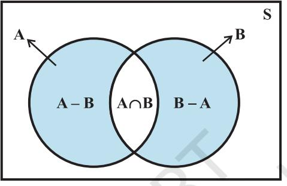

v*Where a mathematical reasoning can be had, it is as great a folly to make use of any other, as to grope for a thing in the dark, when you have a candle in your hand. – JOHN ARBUTHNOT* v

## **14.1 Event**

We have studied about random experiment and sample space associated with an experiment. The sample space serves as an universal set for all questions concerned with the experiment.

Consider the experiment of tossing a coin two times. An associated sample space is S = {HH, HT, TH, TT}.

Now suppose that we are interested in those outcomes which correspond to the occurrence of exactly one head. We find that HT and TH are the only elements of S corresponding to the occurrence of this happening (event). These two elements form the set E = { HT, TH}

We know that the set E is a subset of the sample space S . Similarly, we find the following correspondence between events and subsets of S.

| Description of events | Corresponding subset of 'S' |
| --- | --- |
| Number of tails is exactly 2 | A = {TT} |
| Number of tails is atleast one | B = {HT, TH, TT} |
| Number of heads is atmost one | C = {HT, TH, TT} |
| Second toss is not head | D = { HT, TT} |
| Number of tails is atmost two | S = {HH, HT, TH, TT} |
| Number of tails is more than two | φ |

The above discussion suggests that a subset of sample space is associated with an event and an event is associated with a subset of sample space. In the light of this we define an event as follows.

**Definition** Any subset E of a sample space S is called *an event*.

**14.1.1** *Occurrence of an event* Consider the experiment of throwing a die. Let E denotes the event " a number less than 4 appears". If actually '1' had appeared on the die then we say that event E has occurred. As a matter of fact if outcomes are 2 or 3, we say that event E has occurred

Thus, the event E of a sample space S is said to have occurred if the outcome *ω* of the experiment is such that *ω* ∈ E. If the outcome *ω* is such that *ω* ∉ E, we say that the event E has not occurred.

**14.1.2** *Types of events* Events can be classified into various types on the basis of the elements they have.

**1. Impossible and Sure Events** The empty set φ and the sample space S describe events. In fact φ is called an *impossible event* and S, i.e., the whole sample space is called the *sure event*.

To understand these let us consider the experiment of rolling a die. The associated sample space is

$$\mathbf{S}=\{1,2,3,4,5,6\}$$

Let E be the event " the number appears on the die is a multiple of 7". Can you write the subset associated with the event E?

Clearly no outcome satisfies the condition given in the event, i.e., no element of the sample space ensures the occurrence of the event E. Thus, we say that the empty set only correspond to the event E. In other words we can say that it is impossible to have a multiple of 7 on the upper face of the die. Thus, the event E = φ is an impossible event.

Now let us take up another event F "the number turns up is odd or even". Clearly F = {1, 2, 3, 4, 5, 6,} = S, i.e., all outcomes of the experiment ensure the occurrence of the event F. Thus, the event F = S is a sure event.

**2. Simple Event** If an event E has only one sample point of a sample space, it is called a *simple* (or *elementary*) *event*.

In a sample space containing *n* distinct elements, there are exactly *n* simple events.

For example in the experiment of tossing two coins, a sample space is

S={HH, HT, TH, TT}  
  

There are four simple events corresponding to this sample space. These are

E1 = {HH}, E2 ={HT}, E3 = { TH} and E4 ={TT}. **3. Compound Event** If an event has more than one sample point, it is called a *Compound event*.

For example, in the experiment of "tossing a coin thrice" the events

E: 'Exactly one head appeared'

F: 'Atleast one head appeared'

G: 'Atmost one head appeared' etc.

are all compound events. The subsets of S associated with these events are

E={HTT,THT,TTH}

F={HTT,THT, TTH, HHT, HTH, THH, HHH}

G= {TTT, THT, HTT, TTH}

Each of the above subsets contain more than one sample point, hence they are all compound events.

**14.1.3** *Algebra of events* In the Chapter on Sets, we have studied about different ways of combining two or more sets, viz, union, intersection, difference, complement of a set etc. Like-wise we can combine two or more events by using the analogous set notations.

Let A, B, C be events associated with an experiment whose sample space is S.

**1. Complementary Event** For every event A, there corresponds another event

A′ called the complementary event to A. It is also called the *event 'not* A'.

For example, take the experiment 'of tossing three coins'. An associated sample space is

S = {HHH, HHT, HTH, THH, HTT, THT, TTH, TTT}

Let A={HTH, HHT, THH} be the event 'only one tail appears'

Clearly for the outcome HTT, the event A has not occurred. But we may say that the event 'not A' has occurred. Thus, with every outcome which is not in A, we say that 'not A' occurs.

Thus the complementary event 'not A' to the event A is

A′ = {HHH, HTT, THT, TTH, TTT}

or A′ = {ω : ω ∈ S and ω ∉A} = S – A.

**2. The Event 'A or B'** Recall that union of two sets A and B denoted by A ∪ B contains all those elements which are either in A or in B or in both.

When the sets A and B are two events associated with a sample space, then 'A ∪ B' is the event 'either A or B or both'. This event 'A∪ B' is also called 'A or B'.

Therefore Event 'A or B' = A ∪ B

= {ω : ω ∈ A or ω ∈ B}

**3. The Event 'A and B'** We know that intersection of two sets A ∩ B is the set of those elements which are common to both A and B. i.e., which belong to both 'A and B'.

If A and B are two events, then the set A ∩ B denotes the event 'A and B'. Thus, A ∩ B = {ω : ω ∈ A and ω ∈ B}

For example, in the experiment of 'throwing a die twice' Let A be the event 'score on the first throw is six' and B is the event 'sum of two scores is atleast 11' then

A = {(6,1), (6,2), (6,3), (6,4), (6,5), (6,6)}, and B = {(5,6), (6,5), (6,6)} so A ∩ B = {(6,5), (6,6)}

Note that the set A ∩ B = {(6,5), (6,6)} may represent the event 'the score on the first throw is six and the sum of the scores is atleast 11'.

**4. The Event 'A but not B'** We know that A–B is the set of all those elements which are in A but not in B. Therefore, the set A–B may denote the event 'A but not B'.We know that

$$\mathrm{A-B=A\capB^{\prime}}$$

**Example 1** Consider the experiment of rolling a die. Let A be the event 'getting a prime number', B be the event 'getting an odd number'. Write the sets representing the events (i) Aor B (ii) A and B (iii) A but not B (iv) 'not A'.

**Solution** Here S = {1, 2, 3, 4, 5, 6}, A = {2, 3, 5} and B = {1, 3, 5}

Obviously

(i) "A or B" = AUB = 1, 2, 3, 5

(ii) "A and B" = A = 13,31"

(iii) "A but not B" = A - B = 12

- (iv) 'not A' = A′ = {1,4,6}
**14.1.4** *Mutually exclusive events* In the experiment of rolling a die, a sample space is S = {1, 2, 3, 4, 5, 6}. Consider events, A 'an odd number appears' and B 'an even number appears'

Clearly the event A excludes the event B and vice versa. In other words, there is no outcome which ensures the occurrence of events A and B simultaneously. Here

A = {1, 3, 5} and B = {2, 4, 6}

Clearly A ∩ B = φ, i.e., A and B are disjoint sets.

In general, two events A and B are called *mutually exclusive* events if the occurrence of any one of them excludes the occurrence of the other event, i.e., if they can not occur simultaneously. In this case the sets A and B are disjoint.

Again in the experiment of rolling a die, consider the events A 'an odd number appears' and event B 'a number less than 4 appears'

Obviously A = {1, 3, 5} and B = {1, 2, 3}

Now 3 ∈ A as well as 3 ∈ B

Therefore, A and B are not mutually exclusive events.

*Remark* Simple events of a sample space are always mutually exclusive.

**14.1.5** *Exhaustive events* Consider the experiment of throwing a die. We have S = {1, 2, 3, 4, 5, 6}. Let us define the following events

A: 'a number less than 4 appears',

B: 'a number greater than 2 but less than 5 appears'

and C: 'a number greater than 4 appears'.

Then A = {1, 2, 3}, B = {3,4} and C = {5, 6}. We observe that

A U B U C = {1,2,3} U {3,4} U {5,6} = S.  
  

Such events A, B and C are called exhaustive events. In general, if E1 , E2 , ..., En are *n* events of a sample space S and if

$\bf E_{1}$ U $\bf E_{2}$ U $\bf E_{3}$ U $\bf E_{n}$ U $\bf E_{1}$

then E1 , E2 , ...., En are called *exhaustive events*.In other words, events E1 , E2 , ..., E*n* are said to be exhaustive if atleast one of them necessarily occurs whenever the experiment is performed.

Further, if E*i* ∩ E*j* = φ for *i* ≠ *j* i.e., events E*i* and E*j* are pairwise disjoint and SE 1 =∪ = *i n i* , then events E1 , E2 , ..., E*n*  are called *mutually exclusive and exhaustive*

*events*.

We now consider some examples.

**Example 2** Two dice are thrown and the sum of the numbers which come up on the dice is noted. Let us consider the following events associated with this experiment

A: 'the sum is even'.

B: 'the sum is a multiple of 3'.

C: 'the sum is less than 4'.

D: 'the sum is greater than 11'.

Which pairs of these events are mutually exclusive?

**Solution** There are 36 elements in the sample space S = {(*x*, *y*): *x*, *y* = 1, 2, 3, 4, 5, 6}. Then

$\mathrm{A}=\{(1,1),(1,3),(1,5),(2,2),(2,4),(2,6),(3,1),(3,3),(3,5),(4,2),(4,4),$  
  
$(4,6),(5,1),(5,3),(5,5),(6,2),(6,4),(6,6)\}$  
  
$\mathrm{B}=\{(1,2),(2,1),(1,5),(5,1),(3,3),(2,4),(4,2),(3,6),(6,3),(4,5),(5,4),$  
  
$(6,6)\}$  
  
$\mathrm{C}=\{(1,1),(2,1),(1,2)\}$ and $\mathrm{D}=\{(6,6)\}$

We find that

$\alpha\cap\mathrm{B}=\{(1,5),(2,4),(3,3),(4,2),(5,1),(6,6)\}\neq\phi$

Therefore, A and B are not mutually exclusive events.

Similarly A ∩ C ≠ φ, A ∩ D ≠ φ, B ∩ C ≠ φ and B ∩ D ≠ φ.

Thus, the pairs of events, (A, C), (A, D), (B, C), (B, D) are not mutually exclusive events.

Also C ∩ D = φ and so C and D are mutually exclusive events.

**Example 3** A coin is tossed three times, consider the following events.

A: 'No head appears', B: 'Exactly one head appears' and C: 'Atleast two heads appear'.

Do they form a set of mutually exclusive and exhaustive events?

**Solution** The sample space of the experiment is

S = {HHH, HHT, HTH, THH, HTT, THT, TTH, TTT} and A = {TTT}, B = {HTT, THT, TTH}, C = {HHT, HTH, THH, HHH} Now

```
A ∪ B ∪ C = {TTT, HTT, THT, TTH, HHT, HTH, THH, HHH} = S
```
Therefore, A, B and C are exhaustive events.

Also, A ∩ B = φ, A ∩ C = φ and B ∩ C = φ

Therefore, the events are pair-wise disjoint, i.e., they are mutually exclusive.

Hence, A, B and C form a set of mutually exclusive and exhaustive events.

# **EXERCISE 14.1**

- **1.** A die is rolled. Let E be the event "die shows 4" and F be the event "die shows even number". Are E and F mutually exclusive?
- **2.** A die is thrown. Describe the following events:
	- (i) A: a number less than 7 (ii) B: a number greater than 7
- - (iii) C: a multiple of 3 (iv) D: a number less than 4
- - (v) E: an even number greater than 4 (vi) F: a number not less than 3

Also find A ∪ B, A ∩ B, B ∪ C, E ∩ F, D ∩ E, A – C, D – E, E ∩ F′, F′

- **3.** An experiment involves rolling a pair of dice and recording the numbers that come up. Describe the following events: A: the sum is greater than 8, B: 2 occurs on either die C: the sum is at least 7 and a multiple of 3. Which pairs of these events are mutually exclusive?
- **4.** Three coins are tossed once. Let A denote the event 'three heads show", B denote the event "two heads and one tail show", C denote the event" three tails show and D denote the event 'a head shows on the first coin". Which events are

(i) mutually exclusive? (ii) simple? (iii) Compound?

- **5.** Three coins are tossed. Describe
	- (i) Two events which are mutually exclusive.
	- (ii) Three events which are mutually exclusive and exhaustive.
	- (iii) Two events, which are not mutually exclusive.
	- (iv) Two events which are mutually exclusive but not exhaustive.
	- (v) Three events which are mutually exclusive but not exhaustive.
- **6.** Two dice are thrown. The events A, B and C are as follows:

A: getting an even number on the first die.

B: getting an odd number on the first die.

- C: getting the sum of the numbers on the dice ≤ 5.
Describe the events

- (i) A′ (ii) not B (iii) A or B
- (iv) A and B (v) A but not C (vi) B or C
- (vii) B and C (viii) A ∩ B′ ∩ C′
- **7.** Refer to question 6 above, state true or false: (give reason for your answer)
	- (i) A and B are mutually exclusive
	- (ii) A and B are mutually exclusive and exhaustive
	- (iii) A = B′
	- (iv) A and C are mutually exclusive
	- (v) A and B′ are mutually exclusive.
	- (vi) A′, B′, C are mutually exclusive and exhaustive.

## **14.2 Axiomatic Approach to Probability**

In earlier sections, we have considered random experiments, sample space and events associated with these experiments. In our day to day life we use many words about the chances of occurrence of events. Probability theory attempts to quantify these chances of occurrence or non occurrence of events.

In earlier classes, we have studied some methods of assigning probability to an event associated with an experiment having known the number of total outcomes.

Axiomatic approach is another way of describing probability of an event. In this approach some axioms or rules are depicted to assign probabilities.

Let S be the sample space of a random experiment. The probability P is a real valued function whose domain is the power set of S and range is the interval [0,1] satisfying the following axioms

(i) For any event E, P (E) ≥ 0 (ii) P(S) = 1

- (iii) If E and F are mutually exclusive events, then P(E ∪ F) = P(E) + P(F).
It follows from (iii) that P(φ) = 0. To prove this, we take F = φ and note that E and φ are disjoint events. Therefore, from axiom (iii), we get

P (E ∪ φ) = P (E) + P (φ) or P(E) = P(E) + P (φ) i.e. P (φ) = 0.

Let S be a sample space containing outcomes 1 2 , ,..., ω ω ω*n* , i.e.,

* [10] M. C. Gonzalez-Garcia, M. C. Gonzalez-Garcia, M.  
  

It follows from the axiomatic definition of probability that

- (i) 0 ≤ P (ω*i* ) ≤ 1 for each ω*i* ∈ S
- (ii) P (ω1 ) + P (ω2 ) + ... + P (ω*n* ) = 1
- (iii) For any event A, P(A) = ∑ P(ω*i* ), ω*i* ∈ A.

A**Note** It may be noted that the singleton {ω*i* } is called elementary event and for notational convenience, we write P(ω*i* ) for P({ω*i* }).

For example, in 'a coin tossing' experiment we can assign the number 1 2 to each of the outcomes H and T.

i.e.  
  
P(H) = - and P(T) = 1  
  
2

(1)

Clearly this assignment satisfies both the conditions i.e., each number is neither less than zero nor greater than 1 and

$$\mathrm{P(H)+P(T)=\frac{\partial}{\partial t}+\frac{1}{2}=1.}$$

Therefore, in this case we can say that probability of H = 2 1 , and probability of T = 2 1

If we take P(H) = $\frac{1}{4}$ and P(T) = $\frac{3}{4}$... (2)

Does this assignment satisfy the conditions of axiomatic approach?

Yes, in this case, probability of H = 1 4 and probability of T = 4 3 .

We find that both the assignments (1) and (2) are valid for probability of H and T.

In fact, we can assign the numbers *p* and (1 – *p*) to both the outcomes such that 0 ≤ *p* ≤ 1 and P(H) + P(T) = *p* + (1 – *p*) = 1

This assignment, too, satisfies both conditions of the axiomatic approach of probability. Hence, we can say that there are many ways (rather infinite) to assign probabilities to outcomes of an experiment. We now consider some examples.

**Example 4** Let a sample space be S = {ω1 , ω2 ,..., ω6 }.Which of the following assignments of probabilities to each outcome are valid?

| Outcomes | ω | ω | ω | ω | ω | ω |
| --- | --- | --- | --- | --- | --- | --- |
|  | 1 | 2 | 3 | 4 | 5 | 6 |
| (a) | 1 | 1 | 1 | 1 | 1 | 1 |
|  | 6 | 6 | 6 | 6 | 6 | 6 |
| (b) | 1 | 0 | 0 | 0 | 0 | 0 |
| (c) | 1 | 2 | 1 | 1 | 1 − | 1 − |
|  | 8 | 3 | 3 | 3 | 4 | 3 |
| (d) | 1 | 1 | 1 | 1 | 1 | 3 |
|  | 12 | 12 | 6 | 6 | 6 | 2 |
| (e) | 0.1 | 0.2 | 0.3 | 0.4 | 0.5 | 0.6 |

**Solution** (a) Condition (i): Each of the number p(ω*i* ) is positive and less than one. Condition (ii): Sum of probabilities

$$={\frac{1}{6}}+{\frac{1}{6}}+{\frac{1}{6}}+{\frac{1}{6}}+{\frac{1}{6}}+{\frac{1}{6}}=1$$

Therefore, the assignment is valid

- (b) Condition (i): Each of the number *p*(ω*i* ) is either 0 or 1. Condition (ii) Sum of the probabilities = 1 + 0 + 0 + 0 + 0 + 0 = 1 Therefore, the assignment is valid
- (c) Condition (i) Two of the probabilities *p*(ω5 ) and *p*(ω6 ) are negative, the assignment is not valid

(d) Since $p(\omega_{6})=\frac{3}{2}>1$, the assignment is not valid.  
  

- (e) Since, sum of probabilities = 0.1 + 0.2 + 0.3 + 0.4 + 0.5 + 0.6 = 2.1, the assignment is not valid.
**14.2.1** *Probability of an event* Let S be a sample space associated with the experiment 'examining three consecutive pens produced by a machine and classified as Good (non-defective) and bad (defective)'. We may get 0, 1, 2 or 3 defective pens as result of this examination.

A sample space associated with this experiment is

S = {BBB, BBG, BGB, GBB, BGG, GBG, GGB, GGG},

where B stands for a defective or bad pen and G for a non – defective or good pen.

| Let the probabilities assigned to the outcomes be as follows |
| --- |

| Probability: | 1 | 1 | 1 | 1 | 1 | 1 | 1 | 1 |
| --- | --- | --- | --- | --- | --- | --- | --- | --- |
| Sample point: | BBB 8 | BBG 8 | BGB 8 | GBB 8 | BGG 8 | GBG 8 | GGB 8 | GGG 8 |

Let event A: there is exactly one defective pen and event B: there are atleast two defective pens.

Hence A = {BGG, GBG, GGB} and B = {BBG, BGB, GBB, BBB} Now P(A) = ∑ ∀ ∈ P(*ω ), ω A i i*

= P(BGG) + P(GBG) + P(GGB) = 1 + 1 + 1 = 3 8 8 8 8 8

and P(B) = ∑ ∀ ∈ P(*ω ), ω B i i*

$=$ P(BBG) + P(BGB) + P(GBB) + P(BBB) = $\frac{1}{8}+\frac{1}{8}+\frac{1}{8}+\frac{1}{8}=\frac{4}{8}=\frac{1}{2}$

Let us consider another experiment of 'tossing a coin "twice"

The sample space of this experiment is S = {HH, HT, TH, TT}

Let the following probabilities be assigned to the outcomes

P(HH) = $\frac{1}{4}$, P(HT) = $\frac{1}{7}$, P(TH) = $\frac{2}{7}$, P(TT) = $\frac{9}{28}$

Clearly this assignment satisfies the conditions of axiomatic approach. Now, let us find the probability of the event E: 'Both the tosses yield the same result'.

Here E = {HH, TT} Now P(E) = Σ P(*wi* ), for all *wi* ∈ E

$$=\mathrm{P(HH)+P(TT)}={\frac{1}{4}}+{\frac{9}{28}}={\frac{4}{7}}$$

For the event F: 'exactly two heads', we have F = {HH}

and P(F) = P(HH) = 1 4

**14.2.2** *Probabilities of equally likely outcomes* Let a sample space of an experiment be

$$\mathbf{S}=\left\{\omega_{1},\,\omega_{2},...,\,\omega_{n}\right\}.$$

Let all the outcomes are equally likely to occur, i.e., the chance of occurrence of each simple event must be same.

i.e.  
  

$$\mbox{P}(\omega_{i})=p,\mbox{for all}\omega_{i}\in\mbox{S}\mbox{where}0\leq\ p\leq1$$

Since

$\sum_{i=1}^{n}$P($\omega_{i}$)=$I$ i.e., $p+p+...+p$ ($n$ times) = 1

or *np* = 1 i.e., *p* = 1 *n*

Let S be a sample space and E be an event, such that *n*(S) = *n* and *n*(E) = *m*. If each out come is equally likely, then it follows that

$\begin{array}{c}\mbox{P(E)}=\frac{m}{n}\\ \mbox{Total possible outcomes}\end{array}$

**14.2.3** *Probability of the event 'A or B'* Let us now find the probability of event 'A or B', i.e., P (A ∪ B)

Let A = {HHT, HTH, THH} and B = {HTH, THH, HHH} be two events associated with 'tossing of a coin thrice'

Clearly A ∪ B = {HHT, HTH, THH, HHH}

Now P (A ∪ B) = P(HHT) + P(HTH) + P(THH) + P(HHH)

If all the outcomes are equally likely, then

$$\begin{array}{c}\mbox{P}\big{(}\mbox{A}\cup\mbox{B}\big{)}=\frac{1}{8}+\frac{1}{8}+\frac{1}{8}+\frac{1}{8}=\frac{4}{8}=\frac{1}{2}\\ \mbox{Also}\qquad\mbox{P}(\mbox{A})=\mbox{P}(\mbox{HHT})+\mbox{P}(\mbox{HTH})+\mbox{P}(\mbox{THH})=\frac{3}{8}\end{array}$$

and P(B) = P(HTH) + P(THH) + P(HHH) = 3

Therefore P(A) + P(B) = 3 3 6 8 8 8 + =

It is clear that P(A ∪ B) ≠ P(A) + P(B)

The points HTH and THH are common to both A and B. In the computation of P(A) + P(B) the probabilities of points HTH and THH, i.e., the elements of A ∩B are included twice. Thus to get the probability P(A∪ B) we have to subtract the probabilities of the sample points in A ∩ B from P(A) + P(B)

i.e. $\mathrm{P(A\cup B)}=\mathrm{P(A)+P(B)-\sum P(\omega_{i}),\,\forall\omega_{i}\in A\cap B}$  
  
$=\mathrm{P(A)+P(B)-P(A\cap B)}$

Thus we observe that, ∪ = + − ∩ )BA(P)B(P)A(P)BA(P

In general, if A and B are any two events associated with a random experiment, then by the definition of probability of an event, we have

P(A$\cup$B)=$\Sigma$p($\omega_{i}$), $\forall\omega_{i}$ = 4 $\cup$B.  
  

Since $\mathbf{A}\cup\mathbf{B}=(\mathbf{A}-\mathbf{B})\cup(\mathbf{A}\cap\mathbf{B})\cup(\mathbf{B}-\mathbf{A})$,

we have

P(A ∪ B) = [ P(*ω ) ω (A–B) P(ω ) ω A B + i* ] [ *i i* ] ∑ ∀ ∈ + ∑ ∀ ∈ ∩ *i* [∑ ∀ ∈ P(*ω ) ω B – A i i* ] (because A–B, A ∩ B and B – A are mutually exclusive) ... (1) Also P(A) P(B) ( + = ∑ ∀ ∈ ∑ ∀ ∈ [ *p ω ) A + (ω ) ω B i i* ω ] [ *p i i* ] = [∑ ∀ ∈ ∪ ∩ P(*ω ) ω (A–B) (A B) + i i* ] [∑ ∀ ∈ ∪ ∩ P(*ω ) ω (B – A) (A B) i i* ] = [∑ ∀ ∈ ∑ ∀ ∈ ∩ P(*ω ) ω (A – B) + P(ω ) ω (A B) i i* ] [ *i i* ] + [∑ ∀ ∈ P(*ω ) ω (B–A) i i* ] + [∑ ∀ ∈ ∩ P(*ω ) ω (A B) i i* ] = P(A B) P( ∪ + ∑ ∀ ∈ ∩ [ *ω ) ω A B i i* ] [using (1)] = P(A B)+ P(A B) ∪ ∩ .

Hence P(A B) P (A) +P(B) – P(A B) ∪ = ∩ .

**Alternatively,** it can also be proved as follows:

A ∪ B = A ∪ (B – A), where A and B – A are mutually exclusive,

and B = (A ∩ B) ∪ (B – A), where A ∩ B and B – A are mutually exclusive.

Using Axiom (iii) of probability, we get

P (A $\cup$B) = P (A) + P (B - A)... (2) P(B) = P ( A $\cap$ B) + P (B - A)... (3)

and  
  

$${\rm P(B)=P(A\cap\dot{B})+P(B-A)}$$

Subtracting (3) from (2) gives

P (A $\cup$ B) - P(B) = P(A) - P (A $\cap$ B)  
  
or P(A $\cup$ B) = P(A) + P (B) - P (A $\cap$ B)

The above result can further be verified by observing the Venn Diagram (Fig 14.1)




If A and B are disjoint sets, i.e., they are mutually exclusive events, then A ∩ B = φ

Therefore P(A B) = P ( ) = 0 ∩ φ

Thus, for mutually exclusive events A and B, we have

∪ = + )B(P)A(P)BA(P ,

which is Axiom (iii) of probability.

**14.2.4** *Probability of event* **'***not A***'** Consider the event A = {2, 4, 6, 8} associated with the experiment of drawing a card from a deck of ten cards numbered from 1 to 10. Clearly the sample space is S = {1, 2, 3, ...,10}

If all the outcomes 1, 2, ...,10 are considered to be equally likely, then the probability

of each outcome is $\frac{1}{10}$  
  
Now  
  

$$\begin{array}{l}\mbox{P(A)}=\mbox{P(2)}+\mbox{P(4)}+\mbox{P(6)}+\mbox{P(8)}\\ =\frac{1}{10}+\frac{1}{10}+\frac{1}{10}+\frac{1}{10}=\frac{4}{10}=\frac{2}{5}\end{array}$$
  
  
Also event 'not A' = 'A' = {1, 3, 5, 7, 9, 10}  
  
Now  
  

$$\mbox{P(A')}=\mbox{P(1)}+\mbox{P(3)}+\mbox{P(5)}+\mbox{P(7)}+\mbox{P(9)}+\mbox{P(10)}$$

$$={\frac{6}{10}}={\frac{3}{5}}$$
  
  
Thus,  
  

$${\rm P(A^{\prime})}={\frac{3}{5}}=1-{\frac{2}{5}}=1-{\rm P(A)}$$

Also, we know that A′ and A are mutually exclusive and exhaustive events i.e.,

$\alpha\cap A^{\prime}=\phi$ and $A\cup A^{\prime}=S$ or $P(A\cup A^{\prime})=P(S)$ Now $P(A)+P(A^{\prime})=1$.  
  

Now P(A) + P(A′) = 1, by using axioms (ii) and (iii).

or P( A′) = P(not A) = 1 – P(A) We now consider some examples and exercises having equally likely outcomes unless stated otherwise.

**Example 5** One card is drawn from a well shuffled deck of 52 cards. If each outcome is equally likely, calculate the probability that the card will be

- (i) a diamond (ii) not an ace
- (iii) a black card (i.e., a club or, a spade) (iv) not a diamond
- (v) not a black card.

**Solution** When a card is drawn from a well shuffled deck of 52 cards, the number of possible outcomes is 52.

(i) Let A be the event 'the card drawn is a diamond' Clearly the number of elements in set A is 13.

Therefore, $\quad\mathrm{P(A)=\frac{13}{52}=\frac{1}{4}}$

i.e. probability of a diamond card = 1 4

(ii) We assume that the event 'Card drawn is an ace' is B Therefore 'Card drawn is not an ace' should be B′.

We know that P(B${}^{\prime}$) = 1 - P(B) = 1 - $\frac{4}{52}$=1 - $\frac{1}{13}$ = $\frac{12}{13}$

(iii) Let C denote the event 'card drawn is black card' Therefore, number of elements in the set C = 26

$${\mathrm{i.e.~\ P(C)=\frac{26}{52}=\frac{1}{2}}}$$

Thus, probability of a black card = 2 1 .

(iv) We assumed in (i) above that A is the event 'card drawn is a diamond', so the event 'card drawn is not a diamond' may be denoted as A' or 'not A'

Now P(not A) = 1 - P(A) = 1 - 4 - 4

- (v) The event 'card drawn is not a black card' may be denoted as C′ or 'not C'.
We know that P(not C) = 1 - P(C) = 1 - $\frac{1}{2}$ = $\frac{1}{2}$

Therefore, probability of not a black card = 2 1

**Example 6** A bag contains 9 discs of which 4 are red, 3 are blue and 2 are yellow. The discs are similar in shape and size. A disc is drawn at random from the bag. Calculate the probability that it will be (i) red, (ii) yellow, (iii) blue, (iv) not blue, (v) either red or blue.

**Solution** There are 9 discs in all so the total number of possible outcomes is 9. Let the events A, B, C be defined as

A: 'the disc drawn is red'

B: 'the disc drawn is yellow'

C: 'the disc drawn is blue'.

- (i) The number of red discs = 4, i.e., *n* (A) = 4
Hence $\mathbf{P(A)}=\mathbf{P(A)}$

(ii) The number of yellow discs = 2, i.e., *n* (B) = 2

Therefore, P(B) = 9 2

(iii) The number of blue discs = 3, i.e., *n*(C) = 3

Therefore, P(C) = 3 1 9 3 =

(iv) Clearly the event 'not blue' is 'not C'. We know that P(not C) = 1 – P(C)

Therefore P(not C) = 3 2 3 1 1 =−

(v) The event 'either red or blue' may be described by the set 'A or C' Since, A and C are mutually exclusive events, we have

P(A or C) = P (A $\cup$ C) = P(A) + P(C) = $\frac{4}{9}+\frac{1}{3}=\frac{7}{9}$

**Example 7**Two students Anil and Ashima appeared in an examination. The probability that Anil will qualify the examination is 0.05 and that Ashima will qualify the examination is 0.10. The probability that both will qualify the examination is 0.02. Find the probability that

- (a) Both Anil and Ashima will not qualify the examination.
- (b) Atleast one of them will not qualify the examination and
- (c) Only one of them will qualify the examination.

**Solution** Let E and F denote the events that Anil and Ashima will qualify the examination, respectively. Given that

P(E) = 0.05, P(F) = 0.10 and P(E $\cap$ F) = 0.02.  
  

Then

- (a) The event 'both Anil and Ashima will not qualify the examination' may be expressed as E´ ∩ F´.
Since, E´ is 'not E', i.e., Anil will not qualify the examination and F´ is 'not F', i.e., Ashima will not qualify the examination.

Also E´ ∩ F´ = (E ∪ F)´ (by Demorgan's Law)

Now P(E ∪ F) = P(E) + P(F) – P(E ∩ F)

or P(E ∪ F) = 0.05 + 0.10 – 0.02 = 0.13

Therefore P(E´ ∩ F´) = P(E ∪ F)´ = 1 – P(E ∪ F) = 1 – 0.13 = 0.87

(b) P (atleast one of them will not qualify)

= 1 – P(both of them will qualify)

= 1 – 0.02 = 0.98

(c) The event only one of them will qualify the examination is same as the event either (Anil will qualify, and Ashima will not qualify) or (Anil will not qualify and Ashima will qualify) i.e., E ∩ F´ or E´ ∩ F, where E ∩ F´ and E´ ∩ F are mutually exclusive.

Therefore, P(only one of them will qualify) = P(E $\cap$ F' or E' $\cap$ F)

$$= P(E \cap F{}^{\prime}) + P(E{}^{\prime}\cap F) = P (E) - P(E \cap F) + P(F) - P (E \cap F) = 0.05 - 0.02 + 0.10 - 0.02 = 0.11$$

**Example 8** A committee of two persons is selected from two men and two women. What is the probability that the committee will have (a) no man? (b) one man? (c) two men?

**Solution** The total number of persons = 2 + 2 = 4. Out of these four person, two can be selected in 4C2 ways.

- (a) No men in the committee of two means there will be two women in the committee. Out of two women, two can be selected in 2C 1 2 = way.
Therefore P(no man) = $\frac{{}^{2}\text{C}_{2}}{{}^{4}\text{C}_{2}}=\frac{1\times2\times1}{4\times3}=\frac{1}{6}$

(b) One man in the committee means that there is one woman. One man out of 2 can be selected in 2C1 ways and one woman out of 2 can be selected in 2C1 ways. Together they can be selected in 2 2 C C 1 1 × ways.

Therefore P(One man)=$\frac{2\times2}{4\times2}=\frac{2\times2}{2\times3}=\frac{2\times2}{3}$

- (c) Two men can be selected in 2C2 way.
Hence  
  

$$\text{P}(\text{Two men})=\frac{2\,\text{C}_{2}}{4\,\text{C}_{2}}=\frac{1}{4\,\text{C}_{2}}=\frac{1}{6}$$

#### **EXERCISE 14.2**

- **1.** Which of the following can not be valid assignment of probabilities for outcomes of sample Space S = {ω ω ω ω ω ω ω 1 2 3 4 5 6 7 , , , , , , }

| Assignment | ω 1 | ω 2 | ω 3 | ω 4 | ω 5 | ω 6 | ω 7 |
| --- | --- | --- | --- | --- | --- | --- | --- |
| (a) | 0.1 | 0.01 | 0.05 | 0.03 | 0.01 | 0.2 | 0.6 |
| (b) | 1 | 1 | 1 | 1 | 1 | 1 | 1 |
|  | 7 | 7 | 7 | 7 | 7 | 7 | 7 |
| (c) | 0.1 | 0.2 | 0.3 | 0.4 | 0.5 | 0.6 | 0.7 |
| (d) | – 0.1 | 0.2 | 0.3 | 0.4 | – 0.2 | 0.1 | 0.3 |
| (e) | 1 | 2 | 3 | 4 | 5 | 6 | 15 |
|  | 14 | 14 | 14 | 14 | 14 | 14 | 14 |

**2.** A coin is tossed twice, what is the probability that atleast one tail occurs?

- **3.** A die is thrown, find the probability of following events:
	- (i) A prime number will appear,
	- (ii) A number greater than or equal to 3 will appear,
	- (iii) A number less than or equal to one will appear,
	- (iv) A number more than 6 will appear,
	- (v) A number less than 6 will appear.
- **4.** A card is selected from a pack of 52 cards.
	- (a) How many points are there in the sample space?
	- (b) Calculate the probability that the card is an ace of spades.
	- (c) Calculate the probability that the card is (i) an ace (ii) black card.
- **5.** A fair coin with 1 marked on one face and 6 on the other and a fair die are both tossed. find the probability that the sum of numbers that turn up is (i) 3 (ii) 12
- **6.** There are four men and six women on the city council. If one council member is selected for a committee at random, how likely is it that it is a woman?

**7.** A fair coin is tossed four times, and a person win Re 1 for each head and lose Rs 1.50 for each tail that turns up.

From the sample space calculate how many different amounts of money you can have after four tosses and the probability of having each of these amounts.

- **8.** Three coins are tossed once. Find the probability of getting

| (i) | 3 heads | (ii) | 2 heads | (iii) | atleast 2 heads |
| --- | --- | --- | --- | --- | --- |
| (iv) | atmost 2 heads | (v) | no head | (vi) | 3 tails |

- (vii) exactly two tails (viii) no tail (ix) atmost two tails
- **9.** If 11 2 is the probability of an event, what is the probability of the event 'not A'.
- **10.** A letter is chosen at random from the word 'ASSASSINATION'. Find the probability that letter is (i) a vowel (ii) a consonant
- **11.** In a lottery, a person choses six different natural numbers at random from 1 to 20, and if these six numbers match with the six numbers already fixed by the lottery committee, he wins the prize. What is the probability of winning the prize in the game? [**Hint** order of the numbers is not important.]
- **12.** Check whether the following probabilities P(A) and P(B) are consistently defined (i) P(A) = 0.5, P(B) = 0.7, P(A ∩ B) = 0.6
	- (ii) P(A) = 0.5, P(B) = 0.4, P(A ∪ B) = 0.8
- **13.** Fill in the blanks in following table:

|  | P(A) | P(B) | P(A ∩ B) | P(A ∪ | B) |
| --- | --- | --- | --- | --- | --- |
| (i) | 1 | 1 | 1 | . . . |  |
|  | 3 | 5 | 15 |  |  |
| (ii) | 0.35 | . . . | 0.25 | 0.6 |  |
| (iii) | 0.5 | 0.35 | . . . | 0.7 |  |

**14.** Given P(A) = 5 3 and P(B) = 5 1 . Find P(A or B), if A and B are mutually exclusive events.

- **15.** If E and F are events such that P(E) = 4 1 , P(F) = 2 1 and P(E and F) = 8 1 , find (i) P(E or F), (ii) P(not E and not F).
- **16.** Events E and F are such that P(not E or not F) = 0.25, State whether E and F are mutually exclusive.
- **17.** A and B are events such that P(A) = 0.42, P(B) = 0.48 and P(A and B) = 0.16. Determine (i) P(not A), (ii) P(not B) and (iii) P(A or B)
- **18.** In Class XI of a school 40% of the students study Mathematics and 30% study Biology. 10% of the class study both Mathematics and Biology. If a student is selected at random from the class, find the probability that he will be studying Mathematics or Biology.
- **19.** In an entrance test that is graded on the basis of two examinations, the probability of a randomly chosen student passing the first examination is 0.8 and the probability of passing the second examination is 0.7. The probability of passing atleast one of them is 0.95. What is the probability of passing both?
- **20.** The probability that a student will pass the final examination in both English and Hindi is 0.5 and the probability of passing neither is 0.1. If the probability of passing the English examination is 0.75, what is the probability of passing the Hindi examination?

- **21.** In a class of 60 students, 30 opted for NCC, 32 opted for NSS and 24 opted for both NCC and NSS. If one of these students is selected at random, find the probability that
	- (i) The student opted for NCC or NSS.
	- (ii) The student has opted neither NCC nor NSS.
	- (iii) The student has opted NSS but not NCC.

## *Miscellaneous Examples*

**Example 9** On her vacations Veena visits four cities (A, B, C and D) in a random order. What is the probability that she visits

- (i) A before B? (ii) A before B and B before C?
- (iii) A first and B last? (iv) A either first or second?
- (v) A just before B?

**Solution** The number of arrangements (orders) in which Veena can visit four cities A, B, C, or D is 4! i.e., 24.Therefore, *n* (S) = 24.

Since the number of elements in the sample space of the experiment is 24 all of these outcomes are considered to be equally likely. A sample space for the experiment is

- S = {ABCD, ABDC, ACBD, ACDB, ADBC, ADCB BACD, BADC, BDAC, BDCA, BCAD, BCDA CABD, CADB, CBDA, CBAD, CDAB, CDBA DABC, DACB, DBCA, DBAC, DCAB, DCBA}
(i) Let the event 'she visits A before B' be denoted by E

- Therefore,E = {ABCD, CABD, DABC, ABDC, CADB, DACB ACBD, ACDB, ADBC, CDAB, DCAB, ADCB}
Thus  
  

$$\begin{array}{c}\mbox{\rm P(E)}=\frac{n(E)}{n(S)}=\frac{1}{24}=\frac{1}{2}\\ \mbox{\rm n(S)}=\frac{1}{24}=\frac{1}{2}\end{array}$$

- (ii) Let the event 'Veena visits A before B and B before C' be denoted by F. Here F = {ABCD, DABC, ABDC, ADBC}
Therefore, ( ) ( ) ( ) F 4 1 P F S 24 6 *n n* = = =

Students are advised to find the probability in case of (iii), (iv) and (v).

**Example 10** Find the probability that when a hand of 7 cards is drawn from a well shuffled deck of 52 cards, it contains (i) all Kings (ii) 3 Kings (iii) atleast 3 Kings.

**Solution** Total number of possible hands = 52C7

- (i) Number of hands with 4 Kings = 4 48 C C 4 3 × (other 3 cards must be chosen from the rest 48 cards)
Hence P (a hand will have 4 Kings) = $\frac{{}^{4}\text{C}_{4}\times{}^{48}\text{C}_{3}}{{}^{52}\text{C}_{7}}=\frac{1}{7735}$

(ii) Number of hands with 3 Kings and 4 non-King cards = 4 48 C C 3 4 ×

Therefore P (3 Kings) = $\frac{{}^{4}\text{C}_{3}\times{}^{48}\text{C}_{4}}{{}^{52}\text{C}_{7}}=\frac{9}{1547}$

- (iii) P(atleast 3 King) = P(3 Kings or 4 Kings) = P(3 Kings) + P(4 Kings)

$$={\frac{9}{1547}}+{\frac{1}{7735}}={\frac{46}{7735}}$$

**Example 11** If A, B, C are three events associated with a random experiment, prove that

P(A$\cup$B$\cup$C) = P(A)+P(B)+P(C)-P(A$\cap$B)-P(A$\cap$C) - P(B$\cap$C)+P(A$\cap$B$\cap$C)

**Solution** Consider E = B ∪ C so that

P (A $\cup$ B $\cup$ C ) = P(A $\cup$ E ) = P(A) + P(E) - P(A $\cap$ E)... (1)

Now

$$\begin{array}{l}\mbox{P}\big{(}\mbox{E}\big{)}=\mbox{P}\big{(}\mbox{B}\cup\mbox{C}\big{)}\\ =\mbox{P}\big{(}\mbox{B}\big{)}+\mbox{P}\big{(}\mbox{C}\big{)}-\mbox{P}\big{(}\mbox{B}\cap\mbox{C}\big{)}\end{array}\tag{2}$$

Also A E A B C ∩ = ∩ ∪ ( ) = (A B A C ∩ ∪ ∩ ) ( ) [using distribution property of intersection of sets over the union]. Thus

P(A$\cap$E)=P(A$\cap$B)+P(A$\cap$C)- P[(A$\cap$B)$\cap$(A$\cap$C)]

$$={\rm P}({\rm A}\cap{\rm B})+{\rm P}({\rm A}\cap{\rm C})-{\rm P}[{\rm A}\cap{\rm B}\cap{\rm C}]\quad...\tag{3}$$

Using (2) and (3) in (1), we get

$\rm P[A\cup B\cup C]=P(A)+P(B)+P(C)-P(B\cap C)$  
  
$\rm-P(A\cap B)-P(A\cap C)+P(A\cap B\cap C)$

**Example 12** In a relay race there are five teams A, B, C, D and E.

- (a) What is the probability that A, B and C finish first, second and third, respectively.
- (b) What is the probability that A, B and C are first three to finish (in any order) (Assume that all finishing orders are equally likely)

**Solution** If we consider the sample space consisting of all finishing orders in the first

three places, we will have 5 P3 , i.e., ( ) 5! 5 3 ! − = 5 × 4 × 3 = 60 sample points, each with

a probability of 1 60 .

- (a) A, B and C finish first, second and third, respectively. There is only one finishing order for this, i.e., ABC.
Thus P(A, B and C finish first, second and third respectively) = 1 60 .

- (b) A, B and C are the first three finishers. There will be 3! arrangements for A, B and C. Therefore, the sample points corresponding to this event will be 3! in number.
So P (A, B and C are first three to finish) 3! 6 1 60 60 10 = = =

## *Miscellaneous Exercise on Chapter 14*

- **1.** A box contains 10 red marbles, 20 blue marbles and 30 green marbles. 5 marbles are drawn from the box, what is the probability that (i) all will be blue? (ii) atleast one will be green?
- **2.** 4 cards are drawn from a well shuffled deck of 52 cards. What is the probability of obtaining 3 diamonds and one spade?
- **3.** A die has two faces each with number '1', three faces each with number '2' and one face with number '3'. If die is rolled once, determine
	- (i) P(2) (ii) P(1 or 3) (iii) P(not 3)
- **4.** In a certain lottery 10,000 tickets are sold and ten equal prizes are awarded. What is the probability of not getting a prize if you buy (a) one ticket (b) two tickets (c) 10 tickets.
- **5.** Out of 100 students, two sections of 40 and 60 are formed. If you and your friend are among the 100 students, what is the probability that

(a) you both enter the same section?

- (b) you both enter the different sections?
- **6.** Three letters are dictated to three persons and an envelope is addressed to each of them, the letters are inserted into the envelopes at random so that each envelope contains exactly one letter. Find the probability that at least one letter is in its proper envelope.
- **7.** A and B are two events such that P(A) = 0.54, P(B) = 0.69 and P(A ∩ B) = 0.35. Find (i) P(A ∪ B) (ii) P(A´ ∩ B´) (iii) P(A ∩ B´) (iv) P(B ∩ A´)
- **8.** From the employees of a company, 5 persons are selected to represent them in the managing committee of the company. Particulars of five persons are as follows:

| S. No. | Name | Sex | Age in years |
| --- | --- | --- | --- |
| 1. | Harish | M | 30 |
| 2. | Rohan | M | 33 |
| 3. | Sheetal | F | 46 |
| 4. | Alis | F | 28 |
| 5. | Salim | M | 41 |

A person is selected at random from this group to act as a spokesperson. What is the probability that the spokesperson will be either male or over 35 years?

- **9.** If 4-digit numbers greater than 5,000 are randomly formed from the digits 0, 1, 3, 5, and 7, what is the probability of forming a number divisible by 5 when, (i) the digits are repeated? (ii) the repetition of digits is not allowed?
- **10.** The number lock of a suitcase has 4 wheels, each labelled with ten digits i.e., from 0 to 9. The lock opens with a sequence of four digits with no repeats. What is the probability of a person getting the right sequence to open the suitcase?

#### *Summary*

In this Chapter, we studied about the axiomatic approach of probability. The main features of this Chapter are as follows:

- Æ*Event*: A subset of the sample space
- Æ*Impossible event* : The empty set
- Æ*Sure event*: The whole sample space
- Æ*Complementary event or 'not event'* : The set A′ or S A
- Æ*Event* **A** *or* **B**: The set A ∪ B
- Æ*Event* **A** *and* **B**: The set A ∩ B
- Æ*Event* **A** *and* **not B**: The set A B
- Æ*Mutually exclusive event*: A and B are mutually exclusive if A ∩ B = φ
- Æ*Exhaustive and mutually exclusive events*: Events E1 , E2 ,..., E*n* are mutually exclusive and exhaustive if E1 ∪ E2 ∪ ...∪ E*n* = S and E*i* ∩ E*j* = φ V *i* ≠ *j*
- Æ*Probability*: Number P (ω*i* ) associated with sample point ω *i* such that
	- (i) 0 ≤ P (ω*i* ) ≤ 1 (ii) ∑P(*ωi*) for all ω*i* ∈ S = 1

(iii) P(A) = ∑P(*ωi*) for all ω*i* ∈A. The number P (ω*i* ) is called *probability*

*of the outcome* ω*i .*

- Æ*Equally likely outcomes*: All outcomes with equal probability
- Æ*Probability of an event*: For a finite sample space with equally likely outcomes

Probability of an event (A) P(A) (S) *n n* = , where *n*(A) = number of elements in

the set A, *n*(S) = number of elements in the set S.

- ÆIf A and B are any two events, then
P(A or B) = P(A) + P(B) – P(A and B) equivalently, P(A ∪ B) = P(A) + P(B) – P(A ∩ B)

- ÆIf A and B are mutually exclusive, then P(A or B) = P(A) + P(B)
- ÆIf A is any event, then
	- P(not A) = 1 P(A)

## *Historical Note*

Probability theory like many other branches of mathematics, evolved out of practical consideration. It had its origin in the 16th century when an Italian physician and mathematician Jerome Cardan (1501–1576) wrote the first book on the subject "Book on Games of Chance" (Biber de Ludo Aleae). It was published in 1663 after his death.

In 1654, a gambler Chevalier de Metre approached the well known French Philosopher and Mathematician Blaise Pascal (1623–1662) for certain dice problem. Pascal became interested in these problems and discussed with famous French Mathematician Pierre de Fermat (1601–1665). Both Pascal and Fermat solved the problem independently. Besides, Pascal and Fermat, outstanding contributions to probability theory were also made by Christian Huygenes (1629– 1665), a Dutchman, J. Bernoulli (1654–1705), De Moivre (1667–1754), a Frenchman Pierre Laplace (1749–1827), the Russian P.L Chebyshev (1821– 1897), A. A Markov (1856–1922) and A. N Kolmogorove (1903–1987). Kolmogorov is credited with the axiomatic theory of probability. His book 'Foundations of Probability' published in 1933, introduces probability as a set function and is considered a classic.

**—** v **—**

