v*Mathematics is the indispensable instrument of all physical research. – BERTHELOT* v

# **2.1 Introduction**

Much of mathematics is about finding a pattern – a recognisable link between quantities that change. In our daily life, we come across many patterns that characterise relations such as brother and sister, father and son, teacher and student. In mathematics also, we come across many relations such as number *m* is less than number *n*, line *l* is parallel to line *m*, set A is a subset of set B. In all these, we notice that a relation involves pairs of objects in certain order. In this Chapter, we will learn how to link pairs of objects from two sets and then introduce relations between the two objects in the pair. Finally, we will learn about special relations which will qualify to be functions. The

**G. W. Leibnitz (1646–1716)**

concept of function is very important in mathematics since it captures the idea of a mathematically precise correspondence between one quantity with the other.

# **2.2 Cartesian Products of Sets**

Suppose A is a set of 2 colours and B is a set of 3 objects, i.e., A = {red, blue}and B = {*b*, *c*, *s*},

where *b*, *c* and *s* represent a particular bag, coat and shirt, respectively.

How many pairs of coloured objects can be made from these two sets?

Proceeding in a very orderly manner, we can see that there will be 6 distinct pairs as given below:

(red, *b*), (red, *c*), (red, *s*), (blue, *b*), (blue, *c*), (blue, *s*).

Thus, we get 6 distinct objects (Fig 2.1).

Let us recall from our earlier classes that an ordered pair of elements taken from any two sets P and Q is a pair of elements written in small

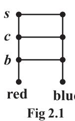

brackets and grouped together in a particular order, i.e., (*p,q*), *p* ∈ P and *q* ∈ Q . This leads to the following definition:

**Definition 1** Given two non-empty sets P and Q. The cartesian product P × Q is the set of all ordered pairs of elements from P and Q, i.e.,

P × Q = { (*p,q*) : *p* ∈ P, *q* ∈ Q }

If either P or Q is the null set, then P × Q will also be empty set, i.e., P × Q = φ

From the illustration given above we note that

A × B = {(red,*b*), (red,*c*), (red,*s*), (blue,*b*), (blue,*c*), (blue,*s*)}.

Again, consider the two sets:

A = {DL, MP, KA}, where DL, MP, KA represent Delhi, Madhya Pradesh and Karnataka, respectively and B = {01,02, 03}representing codes for the licence plates of vehicles issued by DL, MP and KA .

If the three states, Delhi, Madhya Pradesh and Karnataka were making codes for the licence plates of vehicles, with the restriction that the code begins with an element from set A, which are the pairs available from these sets and how many such pairs will there be (Fig 2.2)?

The available pairs are:(DL,01), (DL,02), (DL,03), (MP,01), (MP,02), (MP,03), (KA,01), (KA,02), (KA,03) and the product of set A and set B is given by A × B = {(DL,01), (DL,02), (DL,03), (MP,01), (MP,02), (MP,03), (KA,01), (KA,02),

(KA,03)}.

It can easily be seen that there will be 9 such pairs in the Cartesian product, since there are 3 elements in each of the sets A and B. This gives us 9 possible codes. Also note that the order in which these elements are paired is crucial. For example, the code (DL, 01) will not be the same as the code (01, DL).

> As a final illustration, consider the two sets A= {*a*1 , *a*2 } and B = {*b*1 , *b*2 , *b*3 , *b*4 } (Fig 2.3). A × B = {( *a*1 , *b*1 ), (*a*1 , *b*2 ), (*a*1 , *b*3 ), (*a*1 , *b*4 ), (*a*2 , *b*1 ), (*a*2 , *b*2 ), (*a*2 , *b*3 ), (*a*2 , *b*4 )}.

The 8 ordered pairs thus formed can represent the position of points in the plane if A and B are subsets of the set of real numbers and it is obvious that the point in the position (*a*1 , *b*2 ) will be distinct from the point in the position (*b*2 , *a*1 ).

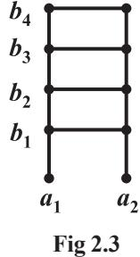

*Remarks*

- (i) Two ordered pairs are equal, if and only if the corresponding first elements are equal and the second elements are also equal.
- (ii) If there are *p* elements in A and *q* elements in B, then there will be *pq* elements in A × B, i.e., if *n*(A) = *p* and *n*(B) = *q,* then *n*(A × B) = *pq*.
- (iii) If A and B are non-empty sets and either A or B is an infinite set, then so is A × B.
- (iv) A × A × A = {(*a*, *b*, *c*) : *a*, *b*, *c* ∈ A}. Here (*a*, *b*, *c*) is called an *ordered triplet*.

**Example 1** If (*x* + 1, *y* – 2) = (3,1), find the values of *x* and *y*.

**Solution** Since the ordered pairs are equal, the corresponding elements are equal.

| Therefore | x + 1 = 3 and y – 2 = 1. |
| --- | --- |
| Solving we get | x = 2 and y = 3. |

**Example 2** If P = {*a*, *b*, *c*} and Q = {*r*}, form the sets P × Q and Q × P. Are these two products equal?

**Solution** By the definition of the cartesian product,

P × Q = {(*a*, *r*), (*b*, *r*), (*c*, *r*)} and Q × P = {(*r*, *a*), (*r*, *b*), (*r*, *c*)} Since, by the definition of equality of ordered pairs, the pair (*a*, *r*) is not equal to the pair (*r*, *a*), we conclude that P × Q ≠ Q × P.

However, the number of elements in each set will be the same.

**Example 3** Let A = {1,2,3}, B = {3,4} and C = {4,5,6}. Find (i) A × (B ∩ C) (ii) (A × B) ∩ (A × C) (iii) A × (B ∪ C) (iv) (A × B) ∪ (A × C)

**Solution** (i) By the definition of the intersection of two sets, (B ∩ C) = {4}.

Therefore, A × (B ∩ C) = {(1,4), (2,4), (3,4)}.

 (ii) Now (A × B) = {(1,3), (1,4), (2,3), (2,4), (3,3), (3,4)} and (A × C) = {(1,4), (1,5), (1,6), (2,4), (2,5), (2,6), (3,4), (3,5), (3,6)} Therefore, (A × B) ∩ (A × C) = {(1, 4), (2, 4), (3, 4)}.

(iii) Since, (B ∪ C) = {3, 4, 5, 6}, we have A × (B ∪ C) = {(1,3), (1,4), (1,5), (1,6), (2,3), (2,4), (2,5), (2,6), (3,3), (3,4), (3,5), (3,6)}.

(iv) Using the sets A × B and A × C from part (ii) above, we obtain

(A × B) ∪ (A × C) = {(1,3), (1,4), (1,5), (1,6), (2,3), (2,4), (2,5), (2,6), (3,3), (3,4), (3,5), (3,6)}.

**Example 4** If P = {1, 2}, form the set P × P × P.

**Solution** We have, P× P× P = {(1,1,1), (1,1,2), (1,2,1), (1,2,2), (2,1,1), (2,1,2), (2,2,1), (2,2,2)}.

**Example 5** If **R** is the set of all real numbers, what do the cartesian products **R** × **R** and **R** × **R** × **R** represent?

**Solution** The Cartesian product **R** × **R** represents the set **R** × **R**={(*x*, *y*) : *x, y* ∈ **R**} which represents the *coordinates of all the points in two dimensional space* and the cartesian product **R** × **R** × **R** represents the set **R** × **R** × **R** ={(*x*, *y, z*) : *x, y*, *z* ∈ **R**} which represents the *coordinates of all the points in three-dimensional space*.

**Example 6** If A × B ={(*p*, *q*),(*p*, *r*), (*m*, *q*), (*m*, *r*)}, find A and B.

**Solution** A = set of first elements = {*p*, *m*} B = set of second elements = {*q*, *r*}.

**EXERCISE 2.1**

- **1.** If 2 5 1 1 3 3 3 3 *x ,y – ,* + = , find the values of *x* and *y*.
- **2.** If the set A has 3 elements and the set B = {3, 4, 5}, then find the number of elements in (A×B).
- **3.** If G = {7, 8} and H = {5, 4, 2}, find G × H and H × G.
- **4.** State whether each of the following statements are true or false. If the statement is false, rewrite the given statement correctly.
	- (i) If P = {*m*, *n*} and Q = { *n*, *m*}, then P × Q = {(*m*, *n*),(*n*, *m*)}.
	- (ii) If A and B are non-empty sets, then A × B is a non-empty set of ordered pairs (*x*, *y*) such that *x* ∈ A and *y* ∈ B.
	- (iii) If A = {1, 2}, B = {3, 4}, then A × (B ∩ φ) = φ.
- **5.** If A = {–1, 1}, find A × A × A.
- **6.** If A × B = {(*a*, *x*),(*a* , *y*), (*b*, *x*), *(b*, *y*)}. Find A and B.
- **7.** Let A = {1, 2}, B = {1, 2, 3, 4}, C = {5, 6} and D = {5, 6, 7, 8}. Verify that (i) A × (B ∩ C) = (A × B) ∩ (A × C). (ii) A × C is a subset of B × D.
- **8.** Let A = {1, 2} and B = {3, 4}. Write A × B. How many subsets will A × B have? List them.
- **9.** Let A and B be two sets such that *n*(A) = 3 and *n*(B) = 2. If (*x*, 1), (*y*, 2), (*z*, 1) are in A × B, find A and B, where *x*, *y* and *z* are distinct elements.

- **10.** The Cartesian product A × A has 9 elements among which are found (–1, 0) and (0,1). Find the set A and the remaining elements of A × A.
# **2.3 Relations**

Consider the two sets P = {*a*, *b*, *c*} and Q = {Ali, Bhanu, Binoy, Chandra, Divya}.

The cartesian product of P and Q has 15 ordered pairs which can be listed as P × Q = {(*a*, Ali), (*a,*Bhanu), (*a*, Binoy), ..., (*c*, Divya)}.

We can now obtain a subset of P × Q by introducing a relation R between the first element *x* and the second element *y* of each ordered pair (*x*, *y*) as

R= { (*x,y*): *x* is the first letter of the name *y*, *x* ∈ P*, y* ∈ Q}.

Then R = {(*a*, Ali), (*b*, Bhanu), (*b*, Binoy), (*c*, Chandra)}

A visual representation of this relation R (called an *arrow diagram*) is shown in Fig 2.4.

**Definition 2** A relation R from a non-empty set A to a non-empty set B is a subset of the cartesian product A × B. The subset is derived by describing a relationship between the first element and the second element of the ordered pairs in A × B. The second element is called the *image* of the first element.

**Definition 3** The set of all first elements of the ordered pairs in a relation R from a set A to a set B is called the *domain* of the relation R.

**Definition 4** The set of all second elements in a relation R from a set A to a set B is called the *range* of the relation R. The whole set B is called the *codomain* of the relation R. Note that range ⊂ codomain.

| Remarks | (i) A | relation may be represented algebraically either by the Roster |
| --- | --- | --- |
|  |  | method or by the Set-builder method. |

- (ii) An arrow diagram is a visual representation of a relation.
**Example 7** Let A = {1, 2, 3, 4, 5, 6}. Define a relation R from A to A by R = {(*x*, *y*) : *y* = *x* + 1 }

- (i) Depict this relation using an arrow diagram.
- (ii) Write down the domain, codomain and range of R.

**Solution** (i) By the definition of the relation, R **=** {(1,2), (2,3), (3,4), (4,5), (5,6)}**.** The corresponding arrow diagram is shown in Fig 2.5.

(ii) We can see that the domain ={1, 2, 3, 4, 5,}

Similarly, the range = {2, 3, 4, 5, 6} and the codomain = {1, 2, 3, 4, 5, 6}.

**Example 8** The Fig 2.6 shows a relation

between the sets P and Q. Write this relation (i) in set-builder form, (ii) in roster form. What is its domain and range?

**Solution** It is obvious that the relation R is

# "*x* is the square of y".

- (i) In set-builder form, R = {(*x*, *y*): *x* is the square of *y, x* ∈ P, *y* ∈ **Q**}
- (ii) In roster form, R = {(9, 3), (9, –3), (4, 2), (4, –2), (25, 5), (25, –5)}

The domain of this relation is {4, 9, 25}.

The range of this relation is {– 2, 2, –3, 3, –5, 5}.

Note that the element 1 is not related to any element in set P.

The set Q is the codomain of this relation.

A**Note** The total number of relations that can be defined from a set A to a set B is the number of possible subsets of A × B. If *n*(A ) = *p* and *n*(B) = *q*, then *n* (A × B) = *pq* and the total number of relations is 2 *pq* .

**Example 9** Let A = {1, 2} and B = {3, 4}. Find the number of relations from A to B.

**Solution** We have,

A × B = {(1, 3), (1, 4), (2, 3), (2, 4)}.

Since *n* (A×B ) = 4, the number of subsets of A×B is 24 . Therefore, the number of relations from A into B will be 24 .

*Remark* A relation R from A to A is also stated as a relation on A.

**EXERCISE 2.2**

- **1.** Let A = {1, 2, 3,...,14}. Define a relation R from A to A by R = {(*x*, *y*) : 3*x* – *y* = 0, where *x*, *y* ∈ A}. Write down its domain, codomain and range.
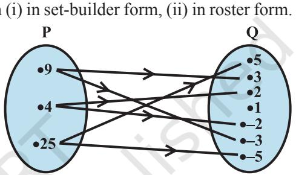

**Fig 2.5**

$\text{Fig}\;2.6$ . 

- **2.** Define a relation R on the set **N** of natural numbers by R = {(*x*, *y*) : *y* = *x* + 5, *x* is a natural number less than 4; *x*, *y* ∈**N**}. Depict this relationship using roster form. Write down the domain and the range.
- **3.** A = {1, 2, 3, 5} and B = {4, 6, 9}. Define a relation R from A to B by R = {(*x*, *y*): the difference between *x* and *y* is odd; *x* ∈ A, *y* ∈ B}. Write R in roster form.
- **4.** The Fig2.7 shows a relationship between the sets P and Q. Write this relation

(i) in set-builder form (ii) roster form. What is its domain and range?

- **5.** Let A = {1, 2, 3, 4, 6}. Let R be the relation on A defined by {(*a*, *b*): *a* , *b* ∈A, *b* is exactly divisible by *a*}.
	- (i) Write R in roster form
	- (ii) Find the domain of R
	- (iii) Find the range of R.
- **6.** Determine the domain and range of the relation R defined by R = {(*x*, *x* + 5) : *x* ∈ {0, 1, 2, 3, 4, 5}}.
- **7**. Write the relation R = {(*x*, *x*3 ) : *x* is a prime number less than 10} in roster form.
- **8**. Let A = {*x, y*, *z*} and B = {1, 2}. Find the number of relations from A to B.
- **9.** Let R be the relation on **Z** defined by R = {(*a*,*b*): *a*, *b* ∈ **Z**, *a b* is an integer}. Find the domain and range of R.

# **2.4 Functions**

In this Section, we study a special type of relation called *function.* It is one of the most important concepts in mathematics. We can, visualise a function as a rule, which produces new elements out of some given elements. There are many terms such as 'map' or 'mapping' used to denote a function.

**Definition 5** A relation *f* from a set A to a set B is said to be a *function* if every element of set A has one and only one image in set B.

In other words, a function *f* is a relation from a non-empty set A to a non-empty set B such that the domain of *f* is A and no two distinct ordered pairs in *f* have the same first element.

If *f* is a function from A to B and (*a*, *b*) ∈ *f,* then *f* (*a*) = *b*, where *b* is called the *image* of *a* under *f* and *a* is called the *preimage* of *b* under *f*.

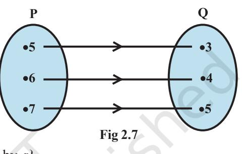

The function *f* from A to B is denoted by *f*: A ‡ B.

Looking at the previous examples, we can easily see that the relation in Example 7 is not a function because the element 6 has no image.

Again, the relation in Example 8 is not a function because the elements in the domain are connected to more than one images. Similarly, the relation in Example 9 is also not a function. (*Why*?) In the examples given below, we will see many more relations some of which are functions and others are not.

**Example 10** Let **N** be the set of natural numbers and the relation R be defined on N such that R = {(*x*, *y*) : *y* = 2*x, x, y* ∈ **N**}.

What is the domain, codomain and range of R? Is this relation a function?

**Solution** The domain of R is the set of natural numbers **N**. The codomain is also **N**. The range is the set of even natural numbers.

Since every natural number *n* has one and only one image, this relation is a function.

**Example 11** Examine each of the following relations given below and state in each case, giving reasons whether it is a function or not?

- (i) R = {(2,1),(3,1), (4,2)}, (ii) R = {(2,2),(2,4),(3,3), (4,4)}
- (iii) R = {(1,2),(2,3),(3,4), (4,5), (5,6), (6,7)}
- **Solution** (i) Since 2, 3, 4 are the elements of domain of R having their unique images, this relation R is a function.
	- (ii) Since the same first element 2 corresponds to two different images 2 and 4, this relation is not a function.
	- (iii) Since every element has one and only one image, this relation is a function.

**Definition 6** A function which has either R or one of its subsets as its range is called a *real valued function*. Further, if its domain is also either R or a subset of R, it is called a *real function*.

**Example 12** Let **N** be the set of natural numbers. Define a real valued function

|
|  |

| x | 1 | 2 | 3 | 4 | 5 | 6 | 7 |
| --- | --- | --- | --- | --- | --- | --- | --- |
| y | f (1) = ... | f (2) = ... | f (3) = ... | f (4) = ... | f (5) = ... | f (6) = ... | f (7) = ... |

**Solution** The completed table is given by

| x | 1 | 2 | 3 | 4 | 5 | 6 | 7 |
| --- | --- | --- | --- | --- | --- | --- | --- |
| y | f (1) = 3 | f (2) = 5 | f (3) = 7 | f (4) = 9 | f (5) = 11 | f (6) = 13 | f (7) =15 |

# **2.4.1** *Some functions and their graphs*

(i) **Identity function** Let **R** be the set of real numbers. Define the real valued function *f* : **R** → **R** by *y* = *f*(*x*) = *x* for each *x* ∈ **R**. Such a function is called the *identity function*. Here the domain and range of *f* are **R**. The graph is a straight line as shown in Fig 2.8. It passes through the origin.

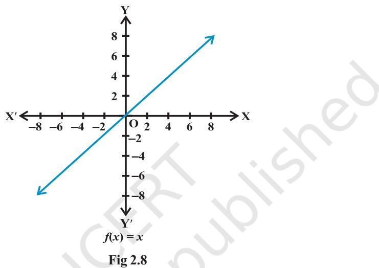

- (ii) **Constant function** Define the function *f*: **R** → **R** by *y = f* (*x*) = *c*, *x* ∈ **R** where *c* is a constant and each *x* ∈ **R**. Here domain of *f* is **R** and its range is {*c*}.
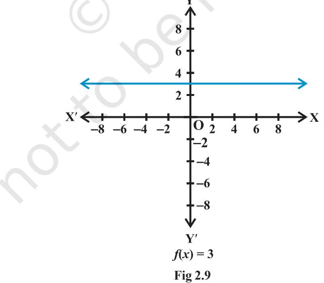

The graph is a line parallel to *x*-axis. For example, if *f*(*x*)=3 for each *x*∈**R**, then its graph will be a line as shown in the Fig 2.9.

- (iii) **Polynomial function** A function *f* : **R** → **R** is said to be *polynomial function* if for each *x* in **R**, *y* = *f* (*x*) = *a*0 + *a*1 *x* + *a*2 *x* 2 + ...+ *an x n ,* where *n* is a non-negative integer and *a*0 , *a*1 , *a*2 ,...,*an*∈**R**.
The functions defined by *f*(*x*) = *x*3 – *x*2 + 2, and *g*(*x*) = *x*4 + 2 *x* are some examples 2

of polynomial functions, whereas the function *h* defined by *h*(*x*) = 3 *x* + 2*x* is not a polynomial function.(*Why*?)

**Example 13** Define the function *f*: **R** → **R** by *y = f*(*x*) = *x*2 *, x* ∈ **R**. Complete the Table given below by using this definition. What is the domain and range of this function? Draw the graph of *f*.

| x | – 4 | –3 | –2 | –1 | 0 | 1 | 2 | 3 | 4 |
| --- | --- | --- | --- | --- | --- | --- | --- | --- | --- |
| y = f(x) = x2 |  |  |  |  |  |  |  |  |  |

**Solution** The completed Table is given below:

| x | – 4 | –3 | –2 | –1 | 0 | 1 | 2 | 3 | 4 |
| --- | --- | --- | --- | --- | --- | --- | --- | --- | --- |
| y = f (x) = x2 | 16 | 9 | 4 | 1 | 0 | 1 | 4 | 9 | 16 |

Domain of *f* = {*x* : *x*∈**R**}. Range of *f* = {*x 2* : *x* ∈ **R**}. The graph of *f* is given by Fig 2.10

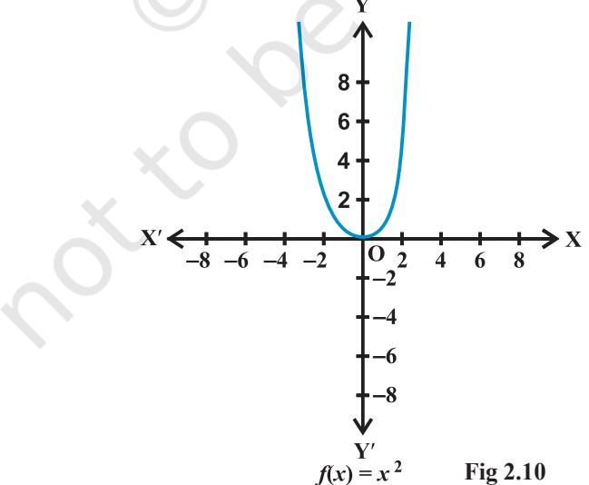

**Example 14** Draw the graph of the function *f* :**R** → **R** defined by *f* (*x*) = *x* 3 , *x*∈**R**.

**Solution** We have *f*(0) = 0, *f*(1) = 1, *f*(–1) = –1, *f*(2) = 8, *f*(–2) = –8, *f*(3) = 27; *f*(–3) = –27, etc. Therefore, *f* = {(*x*,*x* 3 ): *x*∈**R**}. The graph of *f* is given in Fig 2.11. **Fig 2.11**

- (iv) **Rational functions** are functions of the type ( ) ( ) *f x g x* , where *f*(*x*) and *g*(*x*) are
polynomial functions of *x* defined in a domain, where *g*(*x*) ≠ 0.

**Example 15** Define the real valued function *f* : **R** – {0} → **R** defined by 1 *f x*( ) = *x ,*

*x* ∈ **R** –{0}. Complete the Table given below using this definition. What is the domain and range of this function?

| x |  | –2 | –1.5 | –1 | –0.5 | 0.25 | 0.5 | 1 | 1.5 | 2 |
| --- | --- | --- | --- | --- | --- | --- | --- | --- | --- | --- |
| y = | 1 | ... | ... | ... | ... | ... | ... | ... | ... | ... |
|  | x |  |  |  |  |  |  |  |  |  |

**Solution** The completed Table is given by

| x |  | –2 | –1.5 | –1 | –0.5 | 0.25 | 0.5 | 1 | 1.5 | 2 |
| --- | --- | --- | --- | --- | --- | --- | --- | --- | --- | --- |
| y = | 1 | – 0.5 | – 0.67 | –1 | – 2 | 4 | 2 | 1 | 0.67 | 0.5 |
|  | x |  |  |  |  |  |  |  |  |  |

The domain is all real numbers except 0 and its range is also all real numbers except 0. The graph of *f* is given in Fig 2.12.

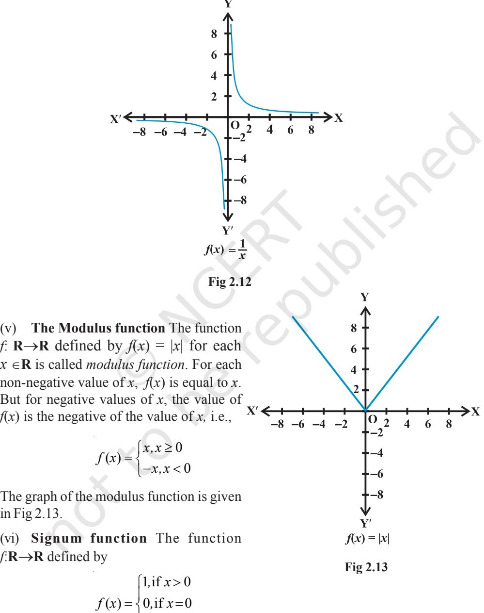

1 if 0

*, x*

 − < is called the *signum function*. The domain of the signum function is **R** and the range is the set {–1, 0, 1}. The graph of the signum function is given by the Fig 2.14.

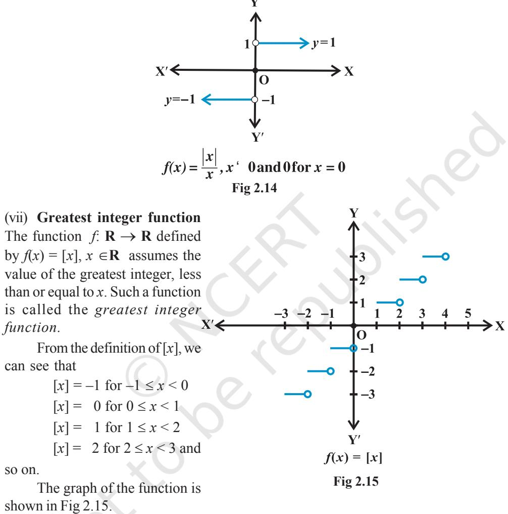

**2.4.2** *Algebra of real functions* In this Section, we shall learn how to add two real functions, subtract a real function from another, multiply a real function by a scalar (here by a scalar we mean a real number), multiply two real functions and divide one real function by another.

(i) **Addition of two real functions** Let *f* : X → **R** and *g* : X → **R** be any two real functions, where X ⊂ **R**. Then, we define (*f* + *g*): X → **R** by

(*f* + *g*) (*x*) = *f* (*x*) + *g* (*x*), for all *x* ∈ X.

(ii) **Subtraction of a real function from another** Let *f* : X → **R** and *g*: X → **R** be any two real functions, where X ⊂ **R**. Then, we define (*f* – *g*) : X→**R** by (*f*–*g*) (*x*) = *f*(*x*) –*g*(*x*), for all *x* ∈ X.

(iii) **Multiplication by a scalar** Let *f* : X→**R** be a real valued function and α be a scalar. Here by scalar, we mean a real number. Then the product α *f* is a function from X to **R** defined by (α *f* ) (*x*) = α *f* (*x*), *x* ∈X.

(iv) **Multiplication of two real functions** The product (or multiplication) of two real functions *f*:X→**R** and *g*:X→**R** is a function *fg*:X→**R** defined by (*fg*) (*x*) = *f*(*x*) *g*(*x*), for all *x* ∈ X.

This is also called *pointwise multiplication.*

(v) **Quotient of two real functions** Let *f* and *g* be two real functions defined from

X→**R**, where X ⊂ **R**. The quotient of *f* by *g* denoted by *f g* is a function defined by ,

$$\left({\frac{f}{g}}\right)(x)={\frac{f(x)}{g(x)}}\,,{\mathrm{provided~}}g(x)\neq0,x\in X$$

**Example 16** Let *f*(*x*) = *x* 2 and *g*(*x*) = 2*x* + 1 be two real functions.Find

(f+g) (x), (f-g) (x), (fg) (x), (f) (x), (f) (x),

**Solution** We have,

$(f+g)\left(x\right)=x^{2}+2x+1,(f-g)\left(x\right)=\ x^{2}-2x-1,$  
  
$(f\underline{\text{g}})\left(x\right)=x^{2}\left(2x+1\right)=2x^{3}+x^{2},\ \ \left(\frac{f}{g}\right)(x)=\frac{x^{2}}{2x+1},x\ \neq-\frac{1}{2}.$

**Example 17** Let *f*(*x*) = *x* and *g*(*x*) = *x* be two functions defined over the set of non-

negative real numbers. Find (*f* + *g*) (*x*), (*f* – *g*) (*x*), (*fg*) (*x*) and *f g* (*x*). **Solution** We have

$(f+g)\left(x\right)=\sqrt{x}+x$, $(f-g)\left(x\right)=\sqrt{x}\ \ -x$,  
  

$$\left(f\!g\right)x\ =\ \sqrt{x}(x)=x^{\frac{3}{2}}\ \ \text{and}\ \left(\frac{f}{g}\right)\!\left(x\right)\ =\frac{\sqrt{x}}{x}=x^{-\frac{1}{2}},\ x\neq0.$$

# **EXERCISE 2.3**

- **1.** Which of the following relations are functions? Give reasons. If it is a function, determine its domain and range.
	- (i) {(2,1), (5,1), (8,1), (11,1), (14,1), (17,1)}
	- (ii) {(2,1), (4,2), (6,3), (8,4), (10,5), (12,6), (14,7)}
	- (iii) {(1,3), (1,5), (2,5)}.
- **2.** Find the domain and range of the following real functions:

(i) $f(x)=-\left|x\right|$ (ii) $f(x)=\sqrt{9-x^{2}}$

- **3.** A function *f* is defined by *f*(*x*) = 2*x* –5. Write down the values of (i) *f* (0), (ii) *f* (7), (iii) *f* (–3).
- **4.** The function '*t*' which maps temperature in degree Celsius into temperature in

degree Fahrenheit is defined by *t*(C) = 9C 5 + 32.

Find (i) *t*(0) (ii) *t*(28) (iii) *t*(–10) (iv) The value of C, when *t*(C) = 212.

- **5.** Find the range of each of the following functions.
	- (i) *f* (*x*) = 2 3*x, x* ∈ **R***, x* > 0.
	- (ii) *f* (*x*) = *x* 2 + 2*, x* is a real number.
	- (iii) *f* (*x*) = *x*, *x* is a real number.

# *Miscellaneous Examples*

**Example 18** Let **R** be the set of real numbers. Define the real function

$$f\colon\mathbb{R}{\rightarrow}\mathbb{R}{\mathrm{~by~}}f(x)=x+10$$

and sketch the graph of this function.

**Solution** Here *f*(0) = 10, *f*(1) = 11, *f*(2) = 12, ..., *f*(10) = 20, etc., and

*f*(–1) = 9, *f*(–2) = 8, ..., *f*(–10) = 0 and so on.

Therefore, shape of the graph of the given function assumes the form as shown in Fig 2.16.

*Remark* The function *f* defined by *f*(*x*) = *mx* **+** *c , x* ∈ **R**, is called *linear function*, where *m* and *c* are constants. Above function is an example of a *linear function*.

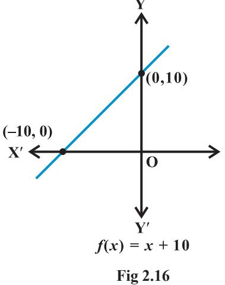

**Example 19** Let R be a relation from **Q** to **Q** defined by R = {(*a*,*b*): *a*,*b* ∈ **Q** and *a* – *b* ∈ **Z**}. Show that

- (i) (*a*,*a*) ∈ R for all *a* ∈ **Q**
- (ii) (*a*,*b*) ∈ R implies that (*b*, *a*) ∈ R
- (iii) (*a*,*b*) ∈ R and (*b*,*c*) ∈ R implies that (*a*,*c*) ∈R

- **Solution** (i) Since, *a a* = 0 ∈ **Z**, if follows that (*a*, *a*) ∈ R.
	- (ii) (*a*,*b*) ∈ R implies that *a b* ∈ **Z**. So, *b a* ∈ **Z**. Therefore, (*b*, *a*) ∈ R
	- (iii) (*a*, *b*) and (*b*, *c*) ∈ R implies that *a b* ∈ **Z**. *b c* ∈ **Z**. So, *a* – *c =* (*a – b*) *+* (*b – c*) ∈ **Z**. Therefore, (*a*,*c*) ∈ R

**Example 20** Let *f* = {(1,1), (2,3), (0, –1), (–1, –3)} be a linear function from **Z** into **Z**. Find *f*(*x*).

**Solution** Since *f* is a linear function, *f* (*x) = mx + c.* Also, since (1, 1), (0*,* – 1) ∈ R, *f* (1) = *m* + *c* = 1 and *f* (0) = *c* = –1. This gives *m* = 2 and *f*(*x*) = 2*x* – 1.

**Example 21** Find the domain of the function 2 2 3 5 ( ) 5 4 *x x f x x x* + + = − +

**Solution** Since *x* 2 –5*x* + 4 = (*x* – 4) (*x* –1), the function *f* is defined for all real numbers except at *x* = 4 and *x* = 1. Hence the domain of *f* is **R** – {1, 4}.

**Example 22** The function *f* is defined by

$$f(x)={\begin{array}{l}{\left(1-x,\ x{<}0\right)}\\ {\left(1-x,\ x{=}0\right)}\\ {\left(x{+}1,\ x{>}0\right)}\end{array}}$$

Draw the graph of *f* (*x*).

**Solution** Here, *f*(*x*) = 1 – *x*, *x* < 0, this gives

$$\begin{array}{c}{{f(-\ 4)\ =1\ -(-\ 4)=5;}}\\ {{f(-\ 3)\ =1\ -(-\ 3)=4,}}\end{array}$$

* [16] A. A. K.  
  

$$\begin{array}{r l}{f(-1)}&{{}=1-(-1)=2;\,{\mathrm{etc}},}\end{array}$$

and *f*(1) = 2, *f* (2) = 3, *f* (3) = 4

*f*(4) = 5 and so on for *f*(*x*) = *x* + 1, *x* > 0.

Thus, the graph of *f* is as shown in Fig 2.17 **Fig 2.17**

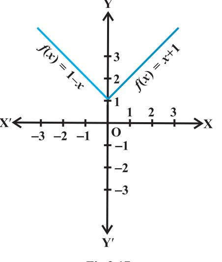

# *Miscellaneous Exercise on Chapter 2*

- **1.** The relation *f* is defined by 2 0 3 ( ) = 3 3 10 *x , x f x x, x* ≤ ≤ ≤ ≤
The relation *g* is defined by 2 , 0 2 ( ) 3 , 2 10 *x x g x x x* ≤ ≤ = ≤ ≤

.

Show that *f* is a function and *g* is not a function.

  
  
**2.** If $f(x)=x^{2}$, find $f(1.1)-f(1)$  
  
(1.1-1)

  
  
**3.** Find the domain of the function $f(x)=\frac{x^{2}+2x+1}{x^{2}-8x+12}$

- **4.** Find the domain and the range of the real function *f* defined by *f* (*x*) = ( 1) *x* − .
- **5.** Find the domain and the range of the real function *f* defined by *f* (*x*) = *x* –1 .

Let $f=\left\{\left(x,\frac{x^{2}}{1+x^{2}}\right):x\in\mathbf{R}\right\}$be a function from $\mathbf{R}$ into $\mathbf{R}$. Determine the range of $f$.  
  

- **7.** Let *f*, *g* : **R**→**R** be defined, respectively by *f*(*x*) = *x* + 1, *g*(*x*) = 2*x* 3. Find *f* + *g, f – g* and *f g* .
- **8.** Let *f* = {(1,1), (2,3), (0,–1), (–1, –3)} be a function from **Z** to **Z** defined by *f*(*x*) = *ax* + *b,* for some integers *a*, *b*. Determine *a*, *b*.
- **9.** Let R be a relation from **N** to **N** defined by R = {(*a*, *b*) : *a*, *b* ∈**N** and *a* = *b*2 }. Are the following true?
	- (i) (*a*,*a*) ∈ R, for all *a* ∈ **N** (ii) (*a*,*b*) ∈ R, implies (*b*,*a*) ∈ R
	- (iii) (*a*,*b*) ∈ R, (*b*,*c*) ∈ R implies (*a*,*c*) ∈ R.

Justify your answer in each case.

- **10.** Let A ={1,2,3,4}, B = {1,5,9,11,15,16} and *f* = {(1,5), (2,9), (3,1), (4,5), (2,11)} Are the following true?
	- (i) *f* is a relation from A to B (ii) *f* is a function from A to B.

Justify your answer in each case.

- **11.** Let *f* be the subset of **Z** *×* **Z** *defined by f =* {(*ab*, *a* + *b*) : *a*, *b* ∈ **Z**}. Is *f* a function from **Z** to **Z**? Justify your answer.
- **12.** Let A = {9,10,11,12,13} and let *f* : A→**N** be defined by *f* (*n*) = the highest prime factor of *n*. Find the range of *f*.

# *Summary*

In this Chapter, we studied about relations and functions.The main features of this Chapter are as follows:

- Æ *Ordered pair* A pair of elements grouped together in a particular order.
- Æ *Cartesian product* A × B of two sets A and B is given by

A × B = {(*a*, *b*): *a* ∈ A, *b* ∈ B}

In particular **R** × **R** = {(*x*, *y*): *x*, *y* ∈ **R**}

- and **R** × **R** × **R** = {(*x*, *y*, *z*): *x*, *y*, *z* ∈ **R**}
- Æ If (*a*, *b*) = (*x*, *y*), then *a* = *x* and *b* = *y.*
- Æ If *n*(A) = *p* and *n*(B) = *q*, then *n*(A × B) = *pq*.
- Æ A × φ = φ
- Æ In general, A × B ≠ B × A.
- Æ *Relation* A relation R from a set A to a set B is a subset of the cartesian product A × B obtained by describing a relationship between the first element *x* and the second element *y* of the ordered pairs in A × B.
- Æ The *image* of an element *x* under a relation R is given by *y*, where (*x*, *y*) ∈ R,
- Æ The *domain* of R is the set of all first elements of the ordered pairs in a relation R.
- Æ The *range* of the relation R is the set of all second elements of the ordered pairs in a relation R.
- Æ *Function* A function *f* from a set A to a set B is a specific type of relation for which every element *x* of set A has one and only one image *y* in set B.

We write *f*: A→B, where *f*(*x*) = *y*.

- Æ A is the domain and B is the codomain of *f*.
- Æ The range of the function is the set of images.
- Æ A real function has the set of real numbers or one of its subsets both as its domain and as its range.
- Æ *Algebra of functions* For functions *f* : X → **R** and *g* : X → **R**, we have

$(f+g)\left(x\right)=f(x)+g(x),x\in X$  
  
$(f-g)\left(x\right)=f(x)-g(x),x\in X$  
  
$(f.g)\left(x\right)=f(x)\.g\left(x\right),x\in X$  
  
$(kf)\left(x\right)=k\left(f(x)\right),x\in X$, where $k$ is a real number.  
  
$\left(\frac{f}{g}\right)(x)=\frac{f(x)}{g(x)},x\in X,g(x)\neq0$

# *Historical Note*

The word FUNCTION first appears in a Latin manuscript "Methodus tangentium inversa, seu de fuctionibus" written by Gottfried Wilhelm Leibnitz (1646-1716) in 1673; Leibnitz used the word in the non-analytical sense. He considered a function in terms of "mathematical job" – the "employee" being just a curve.

On July 5, 1698, Johan Bernoulli, in a letter to Leibnitz, for the first time deliberately assigned a specialised use of the term *function* in the analytical sense. At the end of that month, Leibnitz replied showing his approval.

*Function is found in English in 1779 in* Chambers' Cyclopaedia: "The term function is used in algebra, for an analytical expression any way compounded of a variable quantity, and of numbers, or constant quantities".

**—** v **—**

