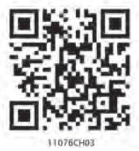
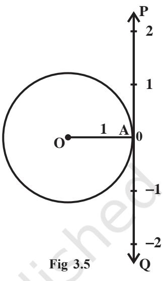

v*A mathematician knows how to solve a problem, he can not solve it. – MILNE* v

# **3.1 Introduction**

The word 'trigonometry' is derived from the Greek words '*trigon*' and '*metron*' and it means 'measuring the sides of a triangle'. The subject was originally developed to solve geometric problems involving triangles. It was studied by sea captains for navigation, surveyor to map out the new lands, by engineers and others. Currently, trigonometry is used in many areas such as the science of seismology, designing electric circuits, describing the state of an atom, predicting the heights of tides in the ocean, analysing a musical tone and in many other areas.

In earlier classes, we have studied the trigonometric ratios of acute angles as the ratio of the sides of a right

**Arya Bhatt (476-550)**

angled triangle. We have also studied the trigonometric identities and application of trigonometric ratios in solving the problems related to heights and distances. In this Chapter, we will generalise the concept of trigonometric ratios to trigonometric functions and study their properties.

# **3.2 Angles**

Angle is a measure of rotation of a given ray about its initial point. The original ray is

called the *initial side* and the final position of the ray after rotation is called the *terminal side* of the angle. The point of rotation is called the *vertex*. If the direction of rotation is anticlockwise, the angle is said to be positive and if the direction of rotation is clockwise, then the angle is *negative* (Fig 3.1).

The measure of an angle is the amount of rotation performed to get the terminal side from the initial side. There are several units for measuring angles. The definition of an angle

suggests a unit, viz. *one complete revolution* from the position of the initial side as indicated in Fig 3.2.

This is often convenient for large angles. For example, we can say that a rapidly spinning wheel is making an angle of say 15 revolution per second. We shall describe two other units of measurement of an angle which are most commonly used, viz. degree measure and radian measure.

**3.2.1** *Degree measure* If a rotation from the initial side to terminal side is th 1 360 of

a revolution, the angle is said to have a measure of one *degree*, written as 1°. A degree is divided into 60 minutes, and a minute is divided into 60 seconds . One sixtieth of a degree is called a *minute*, written as 1′, and one sixtieth of a minute is called a *second*, written as 1″. Thus, 1° = 60′, 1′ = 60″

Some of the angles whose measures are 360°,180°, 270°, 420°, – 30°, – 420° are shown in Fig 3.3.

**3.2.2** *Radian measure* There is another unit for measurement of an angle, called the *radian* measure. Angle subtended at the centre by an arc of length 1 unit in a unit circle (circle of radius 1 unit) is said to have a measure of 1 radian. In the Fig 3.4(i) to (iv), OA is the initial side and OB is the terminal side. The figures show the

We know that the circumference of a circle of radius 1 unit is 2π. Thus, one complete revolution of the initial side subtends an angle of 2π radian.

More generally, in a circle of radius *r*, an arc of length *r* will subtend an angle of 1 radian. It is well-known that equal arcs of a circle subtend equal angle at the centre. Since in a circle of radius *r*, an arc of length *r* subtends an angle whose measure is 1 radian, an arc of length *l* will subtend an angle whose measure is *l r* radian. Thus, if in a circle of radius *r*, an arc of length *l* subtends an angle θ radian at the centre, we have

$$\theta\;=\frac{l}{r}\;\;\mathrm{or}\;\;l\;=r\;\theta.$$

**3.2.3** *Relation between radian and real numbers* Consider the unit circle with centre O. Let A be any point on the circle. Consider OA as initial side of an angle. Then the length of an arc of the circle will give the radian measure of the angle which the arc will subtend at the centre of the circle. Consider the line PAQ which is tangent to the circle at A. Let the point A represent the real number zero, AP represents positive real number and AQ represents negative real numbers (Fig 3.5). If we rope the line AP in the anticlockwise direction along the circle, and AQ in the clockwise direction, then every real number will correspond to a radian measure and conversely. Thus, radian measures and real numbers can be considered as one and the same.

**3.2.4** *Relation between degree and radian* Since a circle subtends at the centre an angle whose radian measure is 2π and its degree measure is 360°, it follows that

2π radian = 360° or π radian = 180°

The above relation enables us to express a radian measure in terms of degree measure and a degree measure in terms of radian measure. Using approximate value

of $\pi$ as $\frac{22}{7}$, we have  
  

$$1\ \text{radian}=\frac{180^{\circ}}{\pi}=57^{\circ}16^{\prime}\ \text{approximately}.$$

Also 1° = *π* 180 radian = 0.01746 radian approximately.

The relation between degree measures and radian measure of some common angles are given in the following table:

| Degree | 30° | 45° | 60° | 90° | 180° | 270° | 360° |
| --- | --- | --- | --- | --- | --- | --- | --- |
| Radian | π | π | π | π | π | 3π | 2π |
|  | 6 | 4 | 3 | 2 |  | 2 |  |

# **Notational Convention**

Since angles are measured either in degrees or in radians, we adopt the convention that whenever we write angle θ°, we mean the angle whose degree measure is θ and whenever we write angle β, we mean the angle whose radian measure is β.

Note that when an angle is expressed in radians, the word 'radian' is frequently

omitted. Thus, *π π 180 and 45* 4 = ° = ° are written with the understanding that π and *π* 4

are radian measures. Thus, we can say that

$$\begin{array}{r l}{{\mathrm{Radian~measure}={\frac{\pi}{180}}}}&{{}{\times{\mathrm{Degree~measure}}}}\\ {{\mathrm{Degree~measure}={\frac{\cdot}{180}}{\times{\mathrm{Radian~measure}}}}}&{{}}\end{array}$$

$\pi$  
  
$\pi$  
  
$\pi$  
  
$\pi$  

**Example 1** Convert 40° 20′ into radian measure.

**Solution** We know that 180° = π radian.

Hence $40^{\circ}\ 20^{\prime}\ =40\ \frac{1}{3}\ \text{degree}=\frac{\pi}{180}\times\frac{121}{3}\ \text{radian}=\frac{121\pi}{540}\ \text{radian}$.  
  

Therefore 40° 20′ =

* [16] A. A. K.  
  

**Example 2** Convert 6 radians into degree measure.

**Solution** We know that π radian = 180°.

Hence 6 radians = $\frac{180}{\pi}\times6$ degree = $\frac{1080\times7}{22}$degree = $343^{\circ}+\frac{7\times60}{11}$ minute [as $1^{\circ}=60^{\circ}$] = $343^{\circ}+38^{\circ}+\frac{2}{11}$ minute [as $1^{\circ}=60^{\circ}$] = $343^{\circ}+38^{\circ}+10.9^{\circ}$ = $343^{\circ}38^{\prime}$ 11" approximately. Hence 6 radians = $343^{\circ}$ 38' 11" approximately.  
  

**Example 3** Find the radius of the circle in which a central angle of 60° intercepts an arc of length 37.4 cm (use 22 *π* 7 = ).

**Solution** Here *l* = 37.4 cm and θ = 60° = 60*π π* radian = 180 3

Hence, by *r* =

$$r={\frac{l}{\theta}}\,,{\mathrm{~we~have}}$$
 
$$r={\frac{{\dot{\ }}37.4{\times}3}{\pi}}={\frac{37.4{\times}3{\times}7}{22}}=35.7{\mathrm{~cm}}$$

**Example 4** The minute hand of a watch is 1.5 cm long. How far does its tip move in 40 minutes? (Use π = 3.14).

**Solution** In 60 minutes, the minute hand of a watch completes one revolution. Therefore, in 40 minutes, the minute hand turns through 2 3 of a revolution. Therefore, 2 *θ =* × 360° 3

or 4*π* 3 radian. Hence, the required distance travelled is given by

$l=r\,\theta\,=\,1.5\times\frac{4\pi}{3}\,\mathrm{cm}=2\pi\,\mathrm{cm}=2\times3.14\,\mathrm{cm}=6.28\,\mathrm{cm}$.  
  

**Example 5** If the arcs of the same lengths in two circles subtend angles 65°and 110° at the centre, find the ratio of their radii.

**Solution** Let *r 1* and *r 2* be the radii of the two circles. Given that

$\theta_{1}=65^{\circ}=\frac{\pi}{180}\times65=\frac{13\pi}{36}$ radian

and θ2 = 110° = *π* 110 180 × = 22*π* 36 radian

Let *l* be the length of each of the arc. Then *l* = *r* 1 θ1 = *r*2 θ2 , which gives

$${\frac{13\pi}{36}}\times r_{1}={\frac{22\pi}{36}}\times r_{2},{\mathrm{~i.e.,~}}{\frac{r_{1}}{r_{2}}}={\frac{22}{13}}$$

= 22 : 13.

Hence *r*

1 : *r* 2

**EXERCISE 3.1**

- **1.** Find the radian measures corresponding to the following degree measures: (i) 25° (ii) – 47°30′ (iii) 240° (iv) 520°
- **2 .** Find the degree measures corresponding to the following radian measures
(Use $\pi=\frac{22}{7}$).  
  
(i) $\frac{11}{16}$ (ii) $-4$ (iii) $\frac{5\pi}{3}$ (iv) $\frac{7\pi}{6}$

- **3.** A wheel makes 360 revolutions in one minute. Through how many radians does it turn in one second?
- **4.** Find the degree measure of the angle subtended at the centre of a circle of

radius 100 cm by an arc of length 22 cm (Use 22 *π* 7 = ).

- **5.** In a circle of diameter 40 cm, the length of a chord is 20 cm. Find the length of minor arc of the chord.
- **6.** If in two circles, arcs of the same length subtend angles 60° and 75° at the centre, find the ratio of their radii.
- **7.** Find the angle in radian through which a pendulum swings if its length is 75 cm and th e tip describes an arc of length
	- (i) 10 cm (ii) 15 cm (iii) 21 cm

# **3.3 Trigonometric Functions**

In earlier classes, we have studied trigonometric ratios for acute angles as the ratio of sides of a right angled triangle. We will now extend the definition of trigonometric ratios to any angle in terms of radian measure and study them as trigonometric functions.

Consider a unit circle with centre at origin of the coordinate axes. Let P (*a, b*) be any point on the circle with angle AOP = *x* radian, i.e., length of arc AP = *x* (Fig 3.6).

We define cos *x* = *a* and sin *x* = *b* Since ∆OMP is a right triangle, we have

OM2 + MP2 = OP2 or *a* 2 + *b* 2 = 1 Thus, for every point on the unit circle, we have

> *a 2* + *b 2* = 1 or cos2 *x* + sin2 *x* = 1

Since one complete revolution subtends an angle of 2π radian at the

centre of the circle, ∠AOB = *π* 2

∠AOC = π and ∠AOD = 3*π* 2 . All angles which are integral multiples of *π* 2 are called *quadrantal angles*. The coordinates of the points A, B, C and D are, respectively,

(1, 0), (0, 1), (–1, 0) and (0, –1). Therefore, for quadrantal angles, we have

$$\begin{array}{c c c}{{\cos\,0^{\circ}=1}}&{{}}&{{\sin0^{\circ}=0,}}\\ {{\stackrel{\cdot}{\cos\,{\frac{\pi}{2}}}=0}}&{{}}&{{\sin{\frac{\pi}{2}}=1}}\\ {{\cos\pi=-\,1}}&{{}}&{{\sin\pi=0}}\\ {{\stackrel{\cdot}{\cos\,{\frac{3\pi}{2}}}=0}}&{{}}&{{\sin{\frac{\stackrel{\cdot}{3\pi}}{2}}=-1}}\\ {{\cos\,2\pi=1}}&{{}}&{{\sin2\pi=0}}\end{array}$$

Now, if we take one complete revolution from the point P, we again come back to same point P. Thus, we also observe that if *x* increases (or decreases) by any integral multiple of *2*π, the values of sine and cosine functions do not change. Thus,

sin (2*n*π + *x*) = sin *x*, *n* ∈ **Z** , cos (2*n*π + *x*) = cos *x* , *n* ∈ **Z** Further, sin *x* = 0, if *x* = 0, ± π, ± 2π , ± 3π, ..., i.e., when *x* is an integral multiple of π

and cos *x* = 0, if *x* = ± *π* 2 , ± 3*π* 2 , ± 5*π* 2 , ... i.e., cos *x* vanishes when *x* is an odd multiple of *π* 2 . Thus

**sin** *x* **= 0 implies** *x* **=** *n*π, where *n* is any integer

  
  
**cos $x=0$ implies $x=(2n+1)$, where $n$ is any integer.**

We now define other trigonometric functions in terms of sine and cosine functions:

$\begin{array}{c}\includegraphics[height=142.26375pt]{lin}\end{array}$, $x\neq\begin{array}{c}\includegraphics[height=142.26375pt]{lin}\end{array}$, where $n$ is any integer.  
  
$\begin{array}{c}\includegraphics[height=142.26375pt]{lin}\end{array}$, where $n$ is any integer.  
  
$\begin{array}{c}\includegraphics[height=142.26375pt]{lin}\end{array}$, where $n$ is any integer.  
  
$\begin{array}{c}\includegraphics[height=142.26375pt]{lin}\end{array}$, where $n$ is any integer.  
  
$\begin{array}{c}\includegraphics[height=142.26375pt]{lin}\end{array}$, where $n$ is any integer.  
  

We have shown that for all real *x*, sin2 *x* + cos2 *x* = 1

It follows that

$$1+\tan^{2}x=\sec^{2}x\qquad\qquad{\mathrm{(why?)}}$$

$$1+\cot^{2}x=\operatorname{cosec}^{2}x\qquad{\mathrm{(why?)}}$$

In earlier classes, we have discussed the values of trigonometric ratios for 0°, 30°, 45°, 60° and 90°. The values of trigonometric functions for these angles are same as that of trigonometric ratios studied in earlier classes. Thus, we have the following table:

|  | 0° | π | π | π | π | π | 3π | 2π |
| --- | --- | --- | --- | --- | --- | --- | --- | --- |
|  |  | 6 | 4 | 3 | 2 |  | 2 |  |
| sin | 0 | 1 | 1 | 3 | 1 | 0 | – 1 | 0 |
|  |  | 2 | 2 | 2 |  |  |  |  |
| cos | 1 | 3 | 1 | 1 | 0 | – 1 | 0 | 1 |
|  |  | 2 | 2 | 2 |  |  |  |  |
| tan | 0 | 1 |  |  | not | 0 | not defined | 0 |
|  |  | 3 | 1 | 3 | defined |  |  |  |

The values of cosec *x*, sec *x* and cot *x* are the reciprocal of the values of sin *x*, cos *x* and tan *x*, respectively.

# **3.3.1** *Sign of trigonometric functions*

Let P (*a, b*) be a point on the unit circle with centre at the origin such that ∠AOP = *x*. If ∠AOQ = – *x*, then the coordinates of the point Q will be (*a*, –*b*) (Fig 3.7). Therefore

cos (– *x*) = cos *x*

and sin (– *x*) = – sin *x*

Since for every point P (*a, b*) on the unit circle, – 1 ≤ *a* ≤ 1 and

– 1 ≤ *b* ≤ 1, we have – 1 ≤ cos *x* ≤ 1 and –1 ≤ sin *x* ≤ 1 for all *x*. We have learnt in previous classes that in the first quadrant (0 < *x* < *π* 2 ) *a* and *b* are both positive, in the second quadrant ( *π* 2 < *x* <π) *a* is negative and *b* is positive, in the third quadrant (π < *x* < 3*π* 2 ) *a* and *b* are both negative and in the fourth quadrant ( 3*π* 2 < *x* < 2π) *a* is positive and *b* is negative. Therefore, sin *x* is positive for 0 < *x* < π, and negative for π < *x* < 2π. Similarly, cos *x* is positive for 0 < *x* < *π* 2 , negative for *π* 2 < *x* < 3*π* 2 and also positive for 3*π* 2 < *x* < 2π. Likewise, we can find the signs of other trigonometric

|  | I | II | III | IV |
| --- | --- | --- | --- | --- |
| sin x | + | + | – | – |
| cos x | + | – | – | + |
| tan x | + | – | + | – |
| cosec x | + | + | – | – |
| sec x | + | – | – | + |
| cot x | + | – | + | – |

functions in different quadrants. In fact, we have the following table.

**3.3.2** *Domain and range of trigonometric functions* From the definition of sine and cosine functions, we observe that they are defined for all real numbers. Further, we observe that for each real number *x*,

– 1 ≤ sin *x* ≤ 1 and – 1 ≤ cos *x* ≤ 1

Thus, domain of *y* = sin *x* and *y* = cos *x* is the set of all real numbers and range is the interval [–1, 1], i.e., – 1 ≤ *y* ≤ 1.

Since cosec *x* = 1 sin *x* , the domain of *y* = cosec *x* is the set { *x* : *x* ∈ **R** and *x* ≠ *n* π, *n* ∈ **Z**} and range is the set {*y* : *y* ∈ **R**, *y* ≥ 1 or *y* ≤ – 1}. Similarly, the domain of *y* = sec *x* is the set {*x* : *x* ∈ **R** and *x* ≠ (2*n* + 1) *π* 2 , *n* ∈ **Z**} and range is the set {*y* : *y* ∈ **R**, *y* ≤ – 1or *y* ≥ 1}. The domain of *y* = tan *x* is the set {*x* : *x* ∈ **R** and *x* ≠ (2*n* + 1) *π* 2 , *n* ∈ **Z**} and range is the set of all real numbers. The domain of *y* = cot *x* is the set {*x* : *x* ∈ **R** and *x* ≠ *n* π, *n* ∈ **Z**} and the range is the set of all real numbers.

We further observe that in the first quadrant, as *x* increases from 0 to *π* 2 , sin *x* increases from 0 to 1, as *x* increases from *π* 2 to π, sin *x* decreases from 1 to 0. In the third quadrant, as *x* increases from π to 3*π* 2 , sin *x* decreases from 0 to –1and finally, in the fourth quadrant, sin *x* increases from –1 to 0 as *x* increases from 3*π* 2 to 2π. Similarly, we can discuss the behaviour of other trigonometric functions. In fact, we have the following table:

|  | I quadrant | II quadrant | III quadrant | IV quadrant |
| --- | --- | --- | --- | --- |
| sin | increases from 0 to 1 | decreases from 1 to 0 | decreases from 0 to –1 | increases from –1 to 0 |
| cos | decreases from 1 to 0 | decreases from 0 to – 1 | increases from –1 to 0 | increases from 0 to 1 |
| tan | increases from 0 to ∞ | increases from –∞to 0 | increases from 0 to ∞ | increases from –∞to 0 |
| cot | decreases from ∞ to 0 | decreases from 0 to–∞ | decreases from ∞ to 0 | decreases from 0to –∞ |
| sec | increases from 1 to ∞ | increases from –∞to–1 | decreases from –1to–∞ | decreases from ∞ to 1 |
| cosec | decreases from ∞ to 1 | increases from 1 to ∞ | increases from –∞to–1 | decreases from–1to–∞ |

*Remark* In the above table, the statement tan *x* increases from 0 to ∞ (infinity) for

$0<x<\frac{\pi}{2}$ simply means that $\tan\,x$ increases as $x$ increases for $0<x<\frac{\pi}{2}$ and 

assumes arbitraily large positive values as *x* approaches to *π* 2 . Similarly, to say that cosec *x* decreases from –1 to – ∞ (minus infinity) in the fourth quadrant means that cosec *x* decreases for *x* ∈ ( 3*π* 2 , 2π) and assumes arbitrarily large negative values as *x* approaches to 2π. The symbols ∞ and – ∞ simply specify certain types of behaviour of functions and variables.

We have already seen that values of sin *x* and cos *x* repeats after an interval of 2π. Hence, values of cosec *x* and sec *x* will also repeat after an interval of 2π. We

shall see in the next section that tan (π + *x*) = tan *x*. Hence, values of tan *x* will repeat after an interval of π. Since cot *x* is reciprocal of tan *x*, its values will also repeat after an interval of π. Using this knowledge and behaviour of trigonometic functions, we can sketch the graph of these functions. The graph of these functions are given above:

**Example 6** If cos *x* = – 3 5 , *x* lies in the third quadrant, find the values of other five trigonometric functions.

> 5 3 −

− , we have sec *x* =

**Solution** Since cos *x* =

Now $\sin^{2}x+\cos^{2}x=1$, i.e., $\sin^{2}x=1-\cos^{2}x$  
  
or $\sin^{2}x=1-\frac{9}{25}=\frac{16}{25}$

4 5

Hence sin *x* = ±

Since *x* lies in third quadrant, sin *x* is negative. Therefore

3 5

$$\sin x=-\ {\frac{4}{5}}$$

which also gives

$$\operatorname{cosec}x=-\ {\frac{5}{4}}$$

Further, we have

$\tan x=\frac{\sin x}{\cos x}=\frac{4}{3}$ and $\cot x=\frac{\cos x}{\sin x}=\frac{3}{4}$.  
  

**Example 7** If cot *x* = – 5 12 , *x* lies in second quadrant, find the values of other five trigonometric functions.

  
  
**Solution** Since $\cot x=-\frac{5}{12}$, we have $\tan x=-\frac{12}{5}$

Now $\sec^{2}x=1+\tan^{2}x=1+\frac{144}{25}=\frac{169}{25}$

Hence $\sec\,x=\pm\,\frac{13}{5}$

Since *x* lies in second quadrant, sec *x* will be negative. Therefore

$$\sec x=-\,{\frac{13}{5}}\,,$$

which also gives

$$\begin{array}{r}{\cos x=-{\frac{5}{13}}}\\ {\sqrt{5}}\end{array}$$

1 *sin x* = 13 12 .

Further, we have

$\sin x=\tan x\cos x=(-\frac{12}{5})\times(-\frac{5}{13})=\frac{12}{13}$

and cosec *x* =

  
  
## Example 8 Find the value of sin $\frac{31\pi}{3}$

**Solution** We know that values of sin *x* repeats after an interval of 2π. Therefore

.

$$\sin\frac{31\pi}{3}=\sin\left(10\pi+\frac{\pi}{3}\right)=\sin\frac{\pi}{3}=\frac{\sqrt{3}}{2}\,.$$

**Example 9** Find the value of cos (–1710°).

**Solution** We know that values of cos *x* repeats after an interval of 2π or 360°. Therefore, cos (–1710°) = cos (–1710° + 5 × 360°) = cos (–1710° + 1800°) = cos 90° = 0.

**EXERCISE 3.2**

Find the values of other five trigonometric functions in Exercises 1 to 5.

- **1.** cos *x* = 1 2 , *x* lies in third quadrant.
- **2.** sin *x* = 3 5 , *x* lies in second quadrant.
- **3.** cot *x* = 4 3 , *x* lies in third quadrant.
- **4.** sec *x* = 13 5 , *x* lies in fourth quadrant.
- **5.** tan *x* = 5 12 , *x* lies in second quadrant.

Find the values of the trigonometric functions in Exercises 6 to 10.

- **6.** sin 765° **7.** cosec (– 1410°) **8.** tan 19*π* 3 **9.** sin (– 11*π* 3 ) **10.** cot (– 15*π* 4 )
# **3.4 Trigonometric Functions of Sum and Difference of Two Angles**

In this Section, we shall derive expressions for trigonometric functions of the sum and difference of two numbers (angles) and related expressions. The basic results in this connection are called *trigonometric identities*. We have seen that

- **1. sin (–** *x***) = sin** *x*
- **2. cos (–** *x***) = cos** *x*

We shall now prove some more results:

## **3. cos (***x* **+** *y***) = cos** *x* **cos** *y* **– sin** *x* **sin** *y*

Consider the unit circle with centre at the origin. Let *x* be the angle P4OP1 and *y* be the angle P1OP2 . Then (*x* + *y*) is the angle P4OP2 . Also let (– *y*) be the angle P4OP3 . Therefore, P1 , P2 , P3 and P4 will have the coordinates P1 (cos *x*, sin *x*), P2 [cos (*x* + *y*), sin (*x* + *y*)], P3 [cos (– *y*), sin (– *y*)] and P4 (1, 0) (Fig 3.14).

**Fig 3.14**

Consider the triangles P1OP3 and P2OP4 . They are congruent (Why?). Therefore, P1 P3 and P2 P4 are equal. By using distance formula, we get

$$\begin{array}{ll}\mbox{P}_{1}\mbox{P}_{3}^{2}&=[\cos\overline{x}\!-\!\cos\,(-y)]^{2}\,+[\sin x-\sin(-y)]^{2}\\ &=(\cos x-\cos y)^{2}+(\sin x+\sin y)^{2}\\ &=\cos^{2}x+\cos^{2}y-2\,\cos x\cos y+\sin^{2}x+\sin^{2}y+2\sin x\sin y\\ &=2-2\,\left(\cos x\,\cos y-\sin x\,\sin y\right)\qquad\qquad(\mbox{Why?})\end{array}$$
  
  
Also, $\mbox{P}_{2}\mbox{P}_{4}^{2}$ $=[1-\cos\,(x+y)]^{2}+[0-\sin\,(x+y)]^{2}$  
  

$$=1-2\cos\,(x+y)+\cos^{2}\,(x+y)+\sin^{2}\,(x+y)$$
 
$$=2-2\,\cos\,(x+y)$$

Since P1 P3 = P2 P4 , we have P1 P3 2 = P2 P4 2 . Therefore, 2 –2 (cos *x* cos *y* – sin *x* sin *y*) = 2 – 2 cos (*x* + *y*). Hence cos (*x* + *y*) = cos *x* cos *y* – sin *x* sin *y* **4 . cos (***x – y***)** *=* **cos** *x* **cos** *y +* **sin** *x* **sin** *y* Replacing *y* by – *y* in identity 3, we get cos (*x* + (– *y*)) = cos *x* cos (– *y*) – sin *x* sin (*– y*) or cos (*x* – *y*) = cos *x* cos *y* + sin *x* sin *y* **5. cos (** *x π* **– 2 )** *=* **sin** *x* If we replace *x* by *π* 2 and *y* by *x* in Identity (4), we get cos ( *π* 2 − *x* ) = cos *π* 2 cos *x* + sin *π* 2 sin *x* = sin *x*. **6. sin (** *x π* **– ) = cos** *x*

Using the Identity 5, we have

**2**

$\sin\left(\frac{\pi}{2}-x\right)=\cos\left[\frac{\pi}{2}-\left(\frac{\pi}{2}-x\right)\right]=\cos\left[\frac{\pi}{2}-\left(\frac{\pi}{2}-x\right)\right]=\cos\left[\frac{\pi}{2}-\left(\frac{\pi}{2}-x\right)\right]$

**7. sin (***x* **+** *y***) = sin** *x* **cos** *y* **+ cos** *x* **sin** *y* We know that

$\sin\left(x+y\right)=\cos\left(\frac{\pi}{2}-(x+y)\right)=\cos\left(\frac{\pi}{2}-x\right)-y$  
  
$\sin\left(x+y\right)=\cos\left(\frac{\pi}{2}-(x+y)\right)=\cos\left(\frac{\pi}{2}-x\right)-y$  

= sin *x* cos *y* + cos *x* sin *y*

**8. sin (***x* **–** *y***) = sin** *x* **cos** *y* **– cos** *x* **sin** *y*

If we replace *y* by –*y*, in the Identity 7, we get the result.

- **9.** By taking suitable values of *x* and *y* in the identities 3, 4, 7 and 8, we get the following results:
	- **cos** *x π* **( + ) 2 = – sin** *x* **sin** *x π* **( + ) 2 = cos** *x* **cos (**π **–** *x***) = – cos** *x* **sin (**π **–** *x***) = sin** *x*

**cos (**π **+** *x***) = – cos** *x* **sin (**π **+** *x***) = – sin** *x* **cos (2**π **–** *x***) = cos** *x* **sin (2**π **–** *x***) = – sin** *x*

Similar results for tan *x*, cot *x*, sec *x* and cosec *x* can be obtained from the results of sin *x* and cos *x*.

**10. If none of the angles** *x***,** *y* **and (***x* **+** *y***) is an odd multiple of**  *π* 2 **, then**

$$\tan\,(x+y)={\frac{\tan\,x+\tan\,y}{1-\tan\,x\,\tan\,y}}$$

Since none of the *x*, *y* and (*x* + *y*) is an odd multiple of *π* 2 , it follows that cos *x*, cos *y* and cos (*x* + *y*) are non-zero. Now

$$\tan\left(x+y\right)=\frac{sin(x+y)}{cos(x+y)}=\frac{sinxcosy+cosxsiny}{cosxcosy-sinxsiny}$$

Dividing numerator and denominator by cos *x* cos *y*, we have

  
  
\begin{tabular}{c c} $\sin x\cos y$ & $\cos x\sin y$ \\ $\tan\left(x+y\right)$ & $=$ \\ $\cos x\cos y$ & $\sin x\sin y$ \\ $\cos x\cos y$ & $\cos x\cos y$ \\ $\tan x+\tan y$ \\ $1-\tan x\tan y$ \\ \end{tabular}  
  

  
  
## 11. **tan (x-y)= 1+ tan $x$ tan $y$**  
  
1+ tan $x$ tan $y$

If we replace *y* by – *y* in Identity 10, we get

$\tan\left(x-y\right)=\tan\left[x+\left(-y\right)\right]$  
  

$$=\frac{\tan x+\tan\left(-y\right)}{1-\tan x\tan\left(-y\right)}=\frac{\tan x-\tan y}{1+\tan x\tan y}$$

- **12. If none of the angles** *x***,** *y* **and (***x* **+** *y***) is a multiple of** π**, then**

$$\cot{(\,x+y)}={\frac{\cot x\cot y-1}{\cot y+\cot x}}$$

Since, none of the *x*, *y* and (*x* + *y*) is multiple of π, we find that sin *x* sin *y* and sin (*x* + *y*) are non-zero. Now,

$\cot\left(\ x+y\right)=\frac{\cos\left(x+y\right)}{\sin\left(x+y\right)}=\frac{\cos x\cos y-\sin x\sin y}{\sin x\cos y+\cos x\sin y}$

Dividing numerator and denominator by sin *x* sin *y*, we have

$$\cot\,(x+y)={\frac{\cot x\cot y-1}{\cot y+\cot x}}$$

**13. cot (***x* **–** *y***)=** *x y y x* **cot cot + 1 cot – cot** if none of angles *x, y* and *x–y* is a multiple of π

If we replace *y* by –*y* in identity 12, we get the result

14. $\cos\ 2x=\cos^{2}x-\sin^{2}x=2\ \cos^{2}x-1=1-2\ \sin^{2}x=\frac{1-\tan^{2}x}{1+\tan^{2}x}$

We know that

$\cos\,(x+y)=\cos\,x\,\,\cos\,y-\sin\,x\,\sin\,y$  
  
Replacing $y$ by $x$, we get  
  
$\cos\,2x=\cos^{2}\!x-\sin^{2}\!x$  
  
$=\cos^{2}\!x-(1-\cos^{2}\!x)=2\,\cos^{2}\!x-1$  
  
Again, $\cos\,2x=\cos^{2}\!x-\sin^{2}\!x$  
  
$=1-\sin^{2}\!x-\sin^{2}\!x=1-2\,\sin^{2}\!x$.  
  

We have cos 2*x* = cos2 *x* – sin 2 *x* = 2 2 2 2 cos sin cos sin *x x x x* − +

Dividing numerator and denominator by cos2 *x*, we get

$\cos\ 2x=\frac{1-\tan^{2}x}{1+\tan^{2}x},\ \ x\neq n\pi+\frac{\pi}{2},$ where n is an integer.  
  

**15. sin 2***x* **= 2 sin***x* **cos** *x* **=**  *x x* **2 2tan 1 + tan** *π π* 2 *x n* ≠ + *,* where n is an integer

We have

sin (*x* + *y*) = sin *x* cos *y* + cos *x* sin *y*

Replacing *y* by *x*, we get sin 2*x* = 2 sin *x* cos *x*.

$${\mathrm{Again}}\qquad\quad{\mathrm{~\\sin~}}2x={\frac{2{\mathrm{sin}}\,x{\mathrm{cos}}\,x}{{\mathrm{cos}}^{2}\,x+{\mathrm{sin}}^{2}\,x}}$$

Dividing each term by cos2 *x*, we get

$$\sin2x={\frac{2\tan x}{1{+}\tan^{2}x}}$$

* [16] tan $2x=\frac{2\tan x}{1-\tan^{2}x}$ if $2x\neq n\pi+\frac{\pi}{2}$, where n is an integer.  
  

We know that

$$\tan\,(x+y)={\frac{\tan x+\tan y}{1-\tan x\tan y}}$$

Replacing $y$ by $x$, we get $\tan2x=\frac{2\tan x}{1-\tan^{2}x}$

# **17. sin 3***x* **= 3 sin** *x* **– 4 sin3** *x*

We have,

- sin 3*x* = sin (2*x* + *x*) = sin 2*x* cos *x* + cos 2*x* sin *x* = 2 sin *x* cos *x* cos *x* + (1 – 2sin2 *x*) sin *x* = 2 sin *x* (1 – sin2 *x*) + sin *x* – 2 sin3 *x* = 2 sin *x* – 2 sin3 *x* + sin *x* – 2 sin3 *x* = 3 sin *x* – 4 sin3 *x*
# **18. cos 3***x***= 4 cos3** *x* **– 3 cos** *x*

We have,

 cos 3*x* = cos (2*x* +*x*) = cos 2*x* cos *x* – sin 2*x* sin *x* = (2cos2 *x* – 1) cos *x* – 2sin *x* cos *x* sin *x* = (2cos2 *x* – 1) cos *x* – 2cos *x* (1 – cos2 *x*) = 2cos3 *x* – cos *x* – 2cos *x* + 2 cos3 *x* = 4cos3 *x* – 3cos *x*.

* [19] $\tan3\,x=\frac{3\,\tan x-\tan^{3}x}{1-3\tan^{2}x}$ if $3x\neq n\,\pi+\frac{\pi}{2}$, where n is an integer.  
  

We have tan 3*x* =tan (2*x* + *x*)

  
  
\begin{tabular}{c c} \hline \hline $\tan\ 2x+\tan\ x$ & $1-\tan^{2}\ x$ \\ \hline $1-\tan\ 2x\tan\ x$ & $1-\tan^{2}\ x$ \\ \hline \end{tabular}  
  

3 3 2 2 2 2tan tan tan 3 tan tan 1 tan 2tan 1 3tan *x x – x x – x – x – x – x* + = = **20. (i) cos** *x* **+ cos** *y = x y x y* **+ – 2cos cos 2 2 (ii) cos** *x* **– cos** *y = – x y x y* **+ – 2sin sin 2 2 (iii) sin** *x* **+ sin** *y = x y x y* **+ – 2sin cos 2 2 (iv) sin** *x* **– sin** *y = x y x y* **+ – 2cos sin 2 2** We know that cos (*x* + *y*) = cos *x* cos *y* – sin *x* sin *y* ... (1) and cos (*x* – *y*) = cos *x* cos *y* + sin *x* sin *y* ... (2) Adding and subtracting (1) and (2), we get cos (*x* + *y*) + cos(*x* – *y*) = 2 cos *x* cos *y* ... (3) and cos (*x* + *y*) – cos (*x* – *y*) = *–* 2 sin *x* sin *y* ... (4) Further sin (*x* + *y*) = sin *x* cos *y* + cos *x* sin *y* ... (5) and sin (*x* – *y*) = sin *x* cos *y* – cos *x* sin *y* ... (6) Adding and subtracting (5) and (6), we get sin (*x* + *y*) + sin (*x* – *y*) = 2 sin *x* cos *y* ... (7) sin (*x* + *y*) – sin (*x* – *y*) = 2cos *x* sin *y* ... (8)

Let *x* + *y* = θ and *x* – *y* = φ. Therefore

$$x=\left({\frac{\theta+\phi}{2}}\right){\mathrm{and}}y=\left({\frac{\theta-\phi}{2}}\right)$$

Substituting the values of *x* and *y* in (3), (4), (7) and (8), we get

$\cos\theta+\cos\phi=2\cos\left(\frac{\theta+\phi}{2}\right)\cos\left(\frac{\theta-\phi}{2}\right)$  
  
$\cos\theta-\cos\phi=-2\sin\left(\frac{\theta+\phi}{2}\right)\sin\left(\frac{\theta-\phi}{2}\right)$  
  
$\sin\theta+\sin\phi=2\sin\left(\frac{\theta+\phi}{2}\right)\cos\left(\frac{\theta-\phi}{2}\right)$

$$\sin\,\theta-\sin\,\phi=2\,\cos\,\left({\frac{\theta+\phi}{2}}\right)\sin\left({\frac{\theta-\phi}{2}}\right)$$

Since θ and φ can take any real values, we can replace θ by *x* and φ by *y*. Thus, we get

$$\cos x+\cos y=2\,\cos\,\frac{x+y}{2}\cos\frac{x-y}{2}\,;\,\cos x-\cos y=-\,2\,\sin\,\frac{x+y}{2}\sin\frac{x-y}{2}\,,$$
 
$$\sin x+\sin y=2\,\sin\,\frac{x+y}{2}\cos\frac{x-y}{2}\,;\,\sin x-\sin y=2\,\cos\,\frac{x+y}{2}\sin\frac{x-y}{2}\,.$$

*Remark* As a part of identities given in 20, we can prove the following results:

- **21. (i) 2 cos** *x* **cos** *y* **= cos (***x* **+** *y***) + cos (***x**y***) (ii) –2 sin** *x* **sin** *y* **= cos (***x* **+** *y***) – cos (***x* **–** *y***)**
	- **(iii) 2 sin** *x* **cos** *y* **= sin (***x* **+** *y***) + sin (***x**y***)**
	- **(iv) 2 cos** *x* **sin** *y* **= sin (***x* **+** *y***) sin (***x**y***).**

**Example 10** Prove that

$$3\sin{\frac{\pi}{6}}\sec{\frac{\pi}{3}}-4\sin{\frac{5\pi}{6}}\cot{\frac{\pi}{4}}=1$$

**Solution** We have

L.H.S. = 3sin $\frac{\pi}{6}$sec $\frac{\pi}{3}-4\sin\frac{5\pi}{6}$cot $\frac{\pi}{4}$  
  
$=3\times\frac{1}{2}\times2-4\sin\frac{\pi}{6}\times1=3-4\sin\frac{\pi}{6}$  
  
$=3-4\times\frac{1}{2}=1=$ R.H.S.  
  

**Example 11** Find the value of sin 15°.

  
  
**Solution** We have  
  
$\sin15^{\circ}=\sin\left(45^{\circ}-30^{\circ}\right)$  
  
$=\sin45^{\circ}\cos30^{\circ}-\cos45^{\circ}\sin30^{\circ}$  
  
$=\frac{1}{\sqrt{2}}\times\frac{\sqrt{3}}{2}-\frac{1}{\sqrt{2}}\times\frac{1}{2}=\frac{\sqrt{3}-1}{2\sqrt{2}}$.  
  
**Example 12**: Find the value of $\tan\frac{13\pi}{12}$.  
  

**Solution** We have

$$\tan\frac{13\pi}{12}=\tan\left(\pi+\frac{\pi}{12}\right)=\tan\frac{\pi}{12}=\tan\left(\frac{\pi}{4}-\frac{\pi}{6}\right)$$
 
$$\cdot$$
 
$$=\frac{\tan\frac{\pi}{4}-\tan\frac{\pi}{6}}{1+\tan\frac{\pi}{4}\tan\frac{\pi}{6}}=\frac{1-\frac{1}{\sqrt{3}}}{1+\frac{1}{\sqrt{3}}}=\frac{\sqrt{3}-1}{\sqrt{3}+1}=2-\sqrt{3}$$

**Example 13** Prove that

$${\frac{\sin\left(x+y\right)}{\sin\left(x-y\right)}}={\frac{\tan x+\tan y}{\tan x-\tan y}}\,.$$

**Solution** We have

L.H.S. = $\frac{\sin\left(x+y\right)}{\sin\left(x-y\right)}$ = $\frac{\sin x\cos y+\cos x\sin y}{\sin x\cos y-\cos x\sin y}$

Dividing the numerator and denominator by cos *x* cos *y*, we get

  
  
## 6 Conclusion  
  
In this paper we have presented a new method for computing the $\alpha$-function of the \(\

**Example 14** Show that

tan 3 $x$ tan 2 $x$ tan $x=$ tan 3$x-$ tan 2 $x-$ tan $x$

**Solution** We know that 3*x* = 2*x* + *x*

Therefore, tan 3*x* = tan (2*x* + *x*)

or

  
  
## 1 Introduction  
  
The _Fractional State_ of the Universe is a very important concept in the field theory. The _Fractional State_ of the Universe is a very important concept in the field theory.  
  

$\tan3\dot{x}-\tan\ 3x\ \tan\ 2x\ \tan\ x=\tan\ 2x+\tan\ x$

or tan 3*x* – tan 2*x* – tan *x* = tan 3*x* tan 2*x* tan *x*

or tan 3*x* tan 2*x* tan *x* = tan 3*x* – tan 2*x* – tan *x.* **Example 15** Prove that

$$\cos\left({\frac{\pi}{4}}+x\right)+\cos\left({\frac{\pi}{4}}-x\right)={\sqrt{2}}\,\cos x$$

**Solution** Using the Identity 20(i), we have

L.H.S. 
$$=\cos\left(\frac{\pi}{4}+x\right)+\cos\left(\frac{\pi}{4}-x\right)$$
 
$$=2\cos\left(\frac{\frac{\pi}{4}+x+\frac{\pi}{4}-x}{2}\right)\cos\left(\frac{\frac{\pi}{4}+x-(\frac{\pi}{4}-x)}{2}\right)$$
 
$$=2\cos\frac{\pi}{4}\ \cos x=2\times\frac{1}{\sqrt{2}}\ \cos x=\sqrt{2}\ \cos x=\text{R.H.S.}$$

**Example 16** Prove that cos 7 cos 5 cot sin 7 – sin 5 *x x x x x* + =

**Solution** Using the Identities 20 (i) and 20 (iv), we get

L.H.S. = $\frac{2\cos\frac{7x\pm5x}{2}\cos\frac{7x-5x}{2}}{2\cos\frac{7x+5x}{2}\sin\frac{7x-5x}{2}}=\frac{\cos x}{\sin x}=cot\,x=$ R.H.S.  
  

**Example 17** Prove that sin 5 2sin 3 sin tan cos5 cos *x x x x x x* − + = = −

**Solution** We have

L.H.S. = $\frac{\sin5x-2\sin3x+\sin x}{\cos5x-\cos x}$ = $\frac{\sin5x+\sin x-2\sin3x}{\cos5x-\cos x}$

$$2\sin3x\cos2x-2\sin3x=-\frac{\sin3x\ (\cos2x-1)}{\sin3x\sin2x}$$

$\begin{array}{c}\includegraphics[scale=0.5]{fig/fig1.eps}\end{array}$

# **EXERCISE 3.3**

Prove that:

1. $\sin^{2}\ \frac{\pi}{6}+\cos^{2}\ \frac{\pi}{3}-\tan^{2}\ \frac{\pi}{4}=-\frac{1}{2}$ 2. $2\sin^{2}\frac{\pi}{6}+\cos^{2}\ \frac{7\pi}{6}\cos^{2}\ \frac{\pi}{3}=\frac{3}{2}$ 3. $\cot^{2}\frac{\pi}{6}+\cos\frac{5\pi}{6}+3\tan^{2}\frac{\pi}{6}=6$ 4. $2\sin^{2}\frac{3\pi}{4}+2\cos^{2}\frac{\pi}{4}+2\sec^{2}\frac{\pi}{3}=10$  
5. Find the value of: (i) $\sin75^{\circ}$ (ii) $\tan15^{\circ}$

Prove the following:

$\cos\left(\frac{\pi}{4}-x\right)\cos\left(\frac{\pi}{4}-y\right)-\sin\left(\frac{\pi}{4}-x\right)\sin\left(\frac{\pi}{4}-y\right)=\sin\left(x+y\right)$  
  
$\tan\left(\frac{\pi}{4}+x\right)=\left(\frac{1+\tan x}{1-\tan x}\right)^{2}$  
  
$\tan\left(\frac{\pi}{4}-x\right)=\left(\frac{1+\tan x}{1-\tan x}\right)^{2}$  
  
$\tan\left(\frac{\pi}{4}-x\right)=\left(\frac{1+\tan x}{1-\tan x}\right)^{2}$  
  
$\tan\left(\frac{\pi}{4}-x\right)=\left(\frac{1+\tan x}{1-\tan x}\right)^{2}$  
  
$\tan\left(\frac{\pi}{4}-x\right)=\left(\frac{1+\tan x}{1-\tan x}\right)^{2}$  

$\cos\left(\frac{3\pi}{2}+x\right)\cos\left(2\pi+x\right)\cdot\left[\cot\left(\frac{3\pi}{2}-x\right)+\cot\left(2\pi+x\right)\right]=I$

**10.** sin (*n* + 1)*x* sin (*n* + 2)*x* + cos (*n* + 1)*x* cos (*n* + 2)*x* = cos *x*

11. $\cos\left(\frac{3\pi}{4}+x\right)-\cos\left(\frac{3\pi}{4}-x\right)=-\sqrt{2}\sin x$

- **12.** sin2 6*x* – sin2 4*x* = sin 2*x* sin 10*x* **13.** cos2 2*x* – cos2 6*x* = sin 4*x* sin 8*x*
- **14.** sin2 *x* + 2 sin 4*x* + sin 6*x* = 4 cos2 *x* sin 4*x*

  
  
**15.**: $\cot4x$ ($\sin5x+\sin3x$) = $\cot x$ ($\sin5x-\sin3x$)

16. $\frac{cos9x\equiv cos5x}{sin17x-sin3x}=-\frac{sin2x}{cos10x}$ 17. $\frac{sin5x+sin3x}{cos5x+cos3x}=tan4x$ 18. $\frac{sin\,x-sin\,y}{cosx+cos\,y}=tan\frac{x-y}{2}$ 19. $\frac{sin\,x+sin\,3x}{cosx+cos\,3x}=tan2x$ 21. $\frac{cos4x+cos\,3x+cos\,2x}{sin4x+sin\,3x+sin\,2x}=cot\,3x$

**22.** cot *x* cot 2*x* – cot 2*x* cot 3*x* – cot 3*x* cot *x* = 1

  
  
**23.**: $\tan\,4x=\frac{4\tan\,x\,(1-\tan^{2}x)}{1-6\,\tan^{2}x+\tan^{4}x}$ **24.**: $\cos\,4x=1-8\sin^{2}x\,\cos^{2}x$

**25.** cos 6*x* = 32 cos6 *x* – 48cos4 *x* + 18 cos2 *x* – 1

# *Miscellaneous Examples*

**Example 18** If sin *x* = 3 5 , cos *y* = − 12 13 , where *x* and *y* both lie in second quadrant, find the value of sin (*x* + *y*).

**Solution** We know that

sin (*x* + *y*) = sin *x* cos *y* + cos *x* sin *y* ... (1)

Now $\cos^{2}x=1-\sin^{2}x=1-\frac{9}{25}=\frac{16}{25}$

Therefore cos *x* = ± 4 5 .

Since *x* lies in second quadrant, cos *x* is negative.

4

5 13 .

Hence cos *x* = −

Now $\sin^{2}\!y=1-\cos^{2}\!y=1-\frac{144}{169}=\frac{25}{169}$

$${\mathrm{i.e.}}\qquad\qquad\sin y=\pm$$

Since *y* lies in second quadrant, hence sin *y* is positive. Therefore, sin *y* = 5 13 . Substituting the values of sin *x*, sin *y*, cos *x* and cos *y* in (1), we get

$$\begin{array}{l l l l l}{{\left(x+y\right)=\frac{3}{5}\times\left(-\frac{12}{13}\right)+\left(-\frac{4}{5}\right)\times\frac{5}{13}}}&{{\quad=\quad-\frac{36}{65}-\frac{20}{65}=-\frac{56}{65}\,.}}\end{array}$$

**Example 19** Prove that

$$\cos2x\,\cos{\frac{x}{2}}-\cos3x\,\cos{\frac{9x}{2}}=\sin5x\,\sin{\frac{5x}{2}}\,.$$

**Solution** We have

L.H.S. = 1 9 2cos 2 cos 2cos cos 3 2 2 2 *x x x x* − = 1 9 9 cos 2 cos 2 cos 3 cos 3 2 2 2 2 2 *x x x x x x x x* + + − − + − − = 1 2 5 2 3 2 15 2 3 2 *cos cos cos cos x x x x* + − − = 1 2 5 2 15 2 *cos cos x x* − = 5 15 5 15 1 2 2 2 2 2sin sin 2 2 2 *x x x x* + − − = − − *sin sin sin sin* 5 = 5 2 5 5 2 *x x x x* = R.H.S.

.

**Example 20** Find the value of tan *π* 8

**Solution** Let *π* 8 *x* = . Then *π* 2 4 *x* = .

Now *tan*

* [16] A. A. K.  
  

4 *π* 1 tan

−

=

*π* 2tan *π* 8

8

or 2

Let $y=\tan\frac{\pi}{8}$. Then $1=\frac{2y}{1-y^{2}}$.  
  

tan

Therefore  
  

$$y=\frac{-2\pm2\sqrt{2}}{2}=-1\pm\sqrt{2}$$

Since *π* 8 lies in the first quadrant, *y* = tan *π* 8 is positve. Hence *π* tan 2 1 8 = − . **Example 21** If 3 3*π* tan = , *π < <* 4 2 *x x* , find the value of sin *x* 2 , cos *x* 2 and tan *x* 2 . **Solution** Since 3*π π* 2 < <*x* , cos *x* is negative. Also *π 3π* 2 2 4 *x* < < . Therefore, sin *x* 2 is positive and cos *x* 2 is negative. Now sec2 *x* = 1 + tan2 *x* = 1 9 16 25 16 + = Therefore cos2 *x* = 16 25 or cos *x* = 4 5 *–* (Why?) Now 2 2 2 *sin x* = 1 – cos *x* = 1 4 5 9 5 + = . Therefore sin2 *x* 2 = 9 10 or sin *x* 2 = 3 10 (Why?) Again 2cos2 *x* 2 = 1+ cos *x* = 1 4 5 1 5 − = Therefore cos2 *x* 2 = 1 10 or cos *x* 2 = − 1 10 (Why?)

.

3 3 2

Hence 
$$\tan\frac{x}{2}=\frac{sin\frac{x}{2}}{cos\frac{x}{2}}=\frac{3}{\sqrt{10}}\times\left(\frac{-\sqrt{10}}{1}\right)=-\ 3.$$
  
  
**Example 22**: Prove that $\cos^{2}x+\cos^{2}\!\!\left(x+\frac{\pi}{3}\right)+\cos^{2}\!\!\left(x-\frac{\pi}{3}\right)=\frac{3}{2}$

**Solution** We have

L.H.S. 
$$=\frac{1+\cos2x}{2}+\frac{1+\cos\left(2x+\frac{2\pi}{3}\right)}{2}+\frac{1+\cos\left(2x-\frac{2\pi}{3}\right)}{2}$$
 
$$=\frac{1}{2}\Bigg{[}3+\cos2x+\cos\left(2x+\frac{2\pi}{3}\right)+\cos\left(2x-\frac{2\pi}{3}\right)\Bigg{]}$$
 
$$=\frac{1}{2}\Bigg{[}3+\cos2x+2\cos2x\cos\frac{2\pi}{3}\Bigg{]}$$
 
$$=\frac{1}{2}\Bigg{[}3+\cos2x+2\cos2x\cos\frac{2\pi}{3}\Bigg{]}$$
 
$$=\frac{1}{2}\Bigg{[}3+\cos2x-2\cos2x\cos\frac{\pi}{3}\Bigg{]}$$
 
$$=\frac{1}{2}\Bigg{[}3+\cos2x-\cos2x\cos\frac{\pi}{3}\Bigg{]}=\frac{3}{2}=\text{R.H.S.}$$

# *Miscellaneous Exercise on Chapter 3*

Prove that:

$2\cos\frac{\pi}{13}\cos\frac{9\pi}{13}+\cos\frac{3\pi}{13}+\cos\frac{5\pi}{13}$=0  
  
$(\sin3x+\sin x)\sin x+(\cos3x-\cos x)\cos x=0$  
  
$(\cos x+\cos y)^{2}+(\sin x-\sin y)^{2}=4\cos^{2}\frac{x+y}{2}$

# *Summary*

- ÆIf in a circle of radius *r*, an arc of length *l* subtends an angle of θ radians, then *l = r* θ
- ÆRadian measure = *π* 180 × Degree measure
- ÆDegree measure = 180 *π* × Radian measure
- Æcos2 *x* + sin2 *x* = 1
- Æ1 + tan2 *x* = sec2 *x*
- Æ1 + cot2 *x* = cosec2 *x*
- Æcos (2*n*π + *x*) = cos *x*
- Æsin (2*n*π + *x*) = sin *x*
- Æsin (– *x*) = sin *x*
- Æcos (– *x*) = cos *x*
- Æcos (*x* + *y*) = cos *x* cos *y* sin *x* sin *y*
- Æcos (*x y*) *=* cos *x* cos *y +* sin *x* sin *y*

$$\quad\bullet\cos\,(\,{\frac{\pi}{2}}-x\,)=\sin\,x$$

Æsin ( *π* 2 − *x* ) = cos *x* Æsin (*x* + *y*) = sin *x* cos *y* + cos *x* sin *y* Æsin (*x* – *y*) = sin *x* cos *y* – cos *x* sin *y* Æcos *π* + 2 *x* = – sin *x* sin *π* + 2 *x* = cos *x* cos (π – *x*) = – cos *x* sin (π – *x*) = sin *x* cos (π + *x*) = – cos *x* sin (π + *x*) = – sin *x* cos (2π – *x*) = cos *x* sin (2π – *x*) = – sin *x*

ÆIf none of the angles *x*, *y* and (*x* ± *y*) is an odd multiple of *π* 2 , then

  
  
\begin{tabular}{l l} $\bullet$ & $\tan\left(x-y\right)=\frac{\tan x-\tan y}{1+\tan x\tan y}$ \\ \end{tabular}  
  

ÆIf none of the angles *x*, *y* and (*x* ± *y*) is a multiple of π, then

  
  
## 1 Introduction  
  
The _Fractional State_ of the Universe is a fundamental problem in cosmology. The _Fractional State_ of the Universe is a fundamental problem in cosmology.  
  

  
  
## 1 Introduction  
  
The _Fractional State_ of the Universe is a fundamental problem in cosmology. The _Fractional State_ of the Universe is a fundamental problem in cosmology.  
  

$\diamond$ cos $2x=\cos^{2}x-\sin^{2}x\equiv2\cos^{2}x-1=1-2\sin^{2}x=\frac{1-\tan^{2}x}{1+\tan^{2}x}$.  
  

$\bullet$ sin $2x=2$ sin$x$ cos $x=\frac{2$ tan $x$ 1 + tan ${}^{2}x$

* [16] A. A. K.  
  

$$\bullet\,\sin3x=3\sin x-4\sin^{3}\!x$$

$$\quad\bullet\ \cos\,3x=4\cos^{3}\!x\,-3\cos\!x$$

Ætan 3*x* = 3 2 3tan tan 1 3tan *x x x* − − Æ (i) cos *x* + cos *y* = 2cos cos 2 2 *x y x y* + − (ii) cos *x* – cos *y* = – 2sin sin 2 2 *x y x y* + − (iii) sin *x* + sin *y* = 2 sin cos 2 2 *x y x y* + − (iv) sin *x* – sin *y* = 2cos sin 2 2 *x y x y* + − Æ (i) 2cos *x* cos *y* = cos ( *x* + *y*) + cos ( *x* – *y*) (ii) – 2sin *x* sin *y* = cos (*x* + *y*) – cos (*x* – *y*) (iii) 2sin *x* cos *y* = sin (*x* + *y*) + sin (*x* – *y*) (iv) 2 cos *x* sin *y* = sin (*x* + *y*) – sin (*x* – *y*).

# *Historical Note*

The study of trigonometry was first started in India. The ancient Indian Mathematicians, Aryabhatta (476), Brahmagupta (598), Bhaskara I (600) and Bhaskara II (1114) got important results. All this knowledge first went from India to middle-east and from there to Europe. The Greeks had also started the study of trigonometry but their approach was so clumsy that when the Indian approach became known, it was immediately adopted throughout the world.

In India, the predecessor of the modern trigonometric functions, known as the sine of an angle, and the introduction of the sine function represents the main contribution of the *siddhantas* (Sanskrit astronomical works) to the history of mathematics.

Bhaskara I (about 600) gave formulae to find the values of sine functions for angles more than 90°. A sixteenth century Malayalam work *Yuktibhasa* (period) contains a proof for the expansion of sin (A + B). Exact expression for sines or cosines of 18°, 36°, 54°, 72°, etc., are given by Bhaskara II.

The symbols sin–1 *x*, cos–1 *x*, etc., for arc sin *x*, arc cos *x*, etc., were suggested by the astronomer Sir John F.W. Hersehel (1813) The names of Thales (about 600 B.C.) is invariably associated with height and distance problems. He is credited with the determination of the height of a great pyramid in Egypt by measuring shadows of the pyramid and an auxiliary staff (or gnomon) of known height, and comparing the ratios:

$${\frac{\mathrm{H}}{\mathrm{S}}}={\frac{h}{s}}=\tan{\mathrm{(sun's~altitude)}}$$

Thales is also said to have calculated the distance of a ship at sea through the proportionality of sides of similar triangles. Problems on height and distance using the similarity property are also found in ancient Indian works.

**—** v **—**

