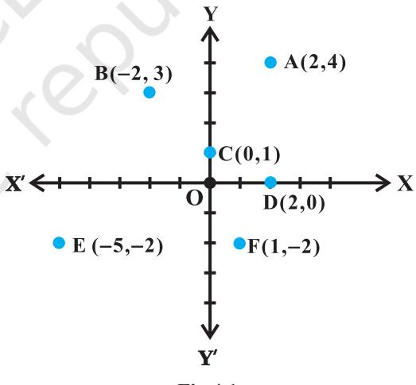
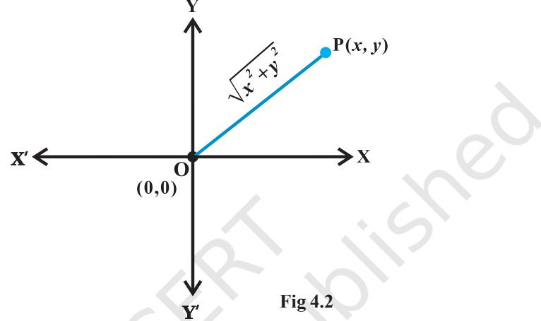
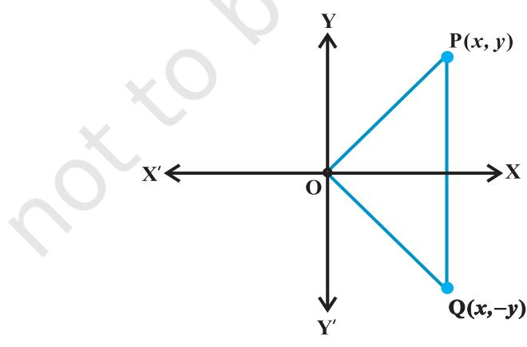

v*Mathematics is the Queen of Sciences and Arithmetic is the Queen of Mathematics. – GAUSS* v

# **4.1 Introduction**

76 MATHEMATICS

In earlier classes, we have studied linear equations in one and two variables and quadratic equations in one variable. We have seen that the equation *x* 2 + 1 = 0 has no real solution as *x* 2 + 1 = 0 gives *x* 2 = – 1 and square of every real number is non-negative. So, we need to extend the real number system to a larger system so that we can find the solution of the equation *x* 2 = – 1. In fact, the main objective is to solve the equation *ax*2 + *bx* + *c* = 0, where D = *b* 2 – 4*ac* < 0, which is not possible in the system of real numbers.

# **4.2 Complex Numbers**

**W. R. Hamilton (1805-1865)**

Let us denote −1 by the symbol *i*. Then, we have 2 *i* = −1 . This means that *i* is a solution of the equation *x* 2 + 1 = 0.

A number of the form *a* + *ib*, where *a* and *b* are real numbers, is defined to be a

complex number. For example, 2 + *i*3, (– 1) + *i* 3 , 1 4 11 *i* − + are complex numbers.

For the complex number *z* = *a* + *ib*, *a* is called the *real part*, denoted by Re *z* and *b* is called the *imaginary part* denoted by Im *z of the complex number z*. For example, if *z* = 2 + *i*5, then Re *z* = 2 and Im *z* = 5.

> Two complex numbers *z* 1 = *a* + *ib* and *z* 2 = *c* + *id* are equal if *a* = *c* and *b* = *d*.

**Example 1** If 4*x* + *i*(3*x* – *y*) = 3 + *i* (– 6), where *x* and *y* are real numbers, then find the values of *x* and *y*.

**Solution** We have

$4x+i\left(3x-y\right)=3+i\left(-6\right)$

Equating the real and the imaginary parts of (1), we get

$$4x=3,\,3x-y=-\,6,$$

which, on solving simultaneously, give 3 4 *x* = and 33 4 *y* = .

## **4.3 Algebra of Complex Numbers**

In this Section, we shall develop the algebra of complex numbers.

**4.3.1** *Addition of two complex numbers* Let *z* 1 = *a* + *ib* and *z* 2 = *c* + *id* be any two complex numbers. Then, the sum *z* 1 + *z* 2 is defined as follows:

*z* 1 + *z*2 = (*a* + *c*) + *i* (*b* + *d*), which is again a complex number.

For example, (2 + *i*3) + (– 6 +*i*5) = (2 – 6) + *i* (3 + 5) = – 4 + *i* 8

The addition of complex numbers satisfy the following properties:

- (i) *The closure law* The sum of two complex numbers is a complex number, i.e., *z* 1 + *z* 2 is a complex number for all complex numbers *z* 1 and *z* 2 .
- (ii) *The commutative law* For any two complex numbers *z* 1 and *z* 2 , *z* 1 + *z* 2 = *z* 2 + *z*1
- (iii) *The associative law* For any three complex numbers *z* 1 , *z* 2 , *z* 3 , (*z* 1 + *z* 2 ) + *z* 3 = *z* 1 + (*z* 2 + *z* 3 ).
- (iv) *The existence of additive identity* There exists the complex number 0 + *i* 0 (denoted as 0), called the *additive identity* or the *zero complex number,* such that, for every complex number *z*, *z* + 0 = *z.*
- (v) *The existence of additive inverse* To every complex number *z* = *a* + *ib*, we have the complex number – *a* + *i*(– *b*) (denoted as – *z*), called the *additive inverse* or *negative of z.* We observe that *z* + (–*z*) = 0 (the additive identity).

**4.3.2** *Difference of two complex numbers* Given any two complex numbers *z* 1 and *z* 2 , the difference *z* 1 – *z* 2 is defined as follows:

*z* 1 – *z* 2 = *z* 1 + (– z2 ). For example, (6 + 3*i*) – (2 – *i*) = (6 + 3*i*) + (– 2 + *i* ) = 4 + 4*i* and (2 – *i*) – (6 + 3*i*) = (2 – *i*) + ( – 6 – 3*i*) = – 4 – 4*i*

**4.3.3** *Multiplication of two complex numbers* Let *z* 1 = *a* + *ib* and *z* 2 = *c* + *id* be any two complex numbers. Then, the product *z* 1 *z* 2 is defined as follows:

*z* 1 *z* 2 = (*ac* – *bd*) + *i*(*ad* + *bc*)

For example, (3 + *i*5) (2 + *i*6) = (3 × 2 – 5 × 6) + *i*(3 × 6 + 5 × 2) = – 24 + *i*28

The multiplication of complex numbers possesses the following properties, which we state without proofs.

- (i) **The closure law** The product of two complex numbers is a complex number, the product *z* 1 *z* 2 is a complex number for all complex numbers *z* 1 and *z* 2 .
- (ii) **The commutative law** For any two complex numbers *z* 1 and *z* 2 ,

$$z_{1}\ z_{2}=z_{2}\ z_{1}$$

- (iii) **The associative law** For any three complex numbers *z* 1 , *z* 2 , *z* 3 , (*z* 1 *z* 2 ) *z* 3 = *z* 1 (*z* 2 *z* 3 ).
- (iv) **The existence of multiplicative identity** There exists the complex number 1 + *i* 0 (denoted as 1), called the *multiplicative identity* such that *z.*1 = *z*, for every complex number *z*.
- (v) **The existence of multiplicative inverse** For every non-zero complex number *z* = *a* + *ib* or *a* + *bi*(*a* ≠ 0, b ≠ 0), we have the complex number

2 2 2 2 *a –b i a b a b* + + + (denoted by 1 *z* or *z* –1 ), called the *multiplicative inverse* of *z* such that

1 *z.* 1 *z* = (the multiplicative identity).

- (vi) **The distributive law** For any three complex numbers *z* 1 , *z* 2 , *z* 3 ,
(a) *z*1 (*z* 2 + *z* 3 ) = *z* 1 *z* 2 + *z* 1 *z* 3 (b) (*z* + *z* ) *z* = *z z* + *z z*

1 2 3 1 3 2 3 **4.3.4** *Division of two complex numbers* Given any two complex numbers *z* 1 and *z* 2 ,

where 2 *z* ≠ 0 , the quotient 1 2 *z z* is defined by

$$\frac{z_{1}}{z_{2}}=z_{1}\,\frac{1}{z_{2}}$$

For example, let *z* 1 = 6 + 3*i* and *z* 2 = 2 – *i*

Then  
  

$$\frac{\vec{z}_{1}}{z_{2}}=\left((6+3i)\times\frac{1}{2-i}\right)=\left(6+3i\right)\,\left(\frac{2}{2^{2}+\left(-1\right)^{2}}+i\,\frac{-\left(-1\right)}{2^{2}+\left(-1\right)^{2}}\right)$$

$$={\big(}6+3i{\big)}{\bigg(}{\frac{2+i}{5}}{\bigg)}={\frac{1}{5}}{\big[}12-3+i{\big(}6+6{\big)}{\big]}={\frac{1}{5}}{\big(}9+12i{\big)}$$

**4.3.5** *Power of i* we know that

$$i^{3}=i^{2}i=\left(-1\right)i=-i\,\qquad\quad i^{4}=\left(i^{2}\right)^{2}=\left(-1\right)^{2}=1$$
  
  

$$i^{5}=\left(i^{2}\right)^{2}i=\left(-1\right)^{2}i=i\,\qquad\quad i^{6}=\left(i^{2}\right)^{3}=\left(-1\right)^{3}=-1\,\ \text{etc.}$$
  
  
Also, we have  
  

$$i^{-1}=\frac{1}{i}\times\frac{i}{i}=\frac{i}{-1}=-i,\quad\ i^{-2}=\frac{1}{i^{2}}=\frac{1}{-1}=-1,$$
  
  

$$i^{-3}=\frac{1}{i^{3}}=\frac{1}{-i}\times\frac{i}{i}=\frac{i}{1}=i,\quad i^{-4}=\frac{1}{i^{4}}=\frac{1}{1}=1$$
  
  
\[\begin{array}{c}\includegraphics[width=142.26378pt]{./

In general, for any integer *k*, *i* 4*k* = 1, *i* 4*k* + 1 = *i, i*4*k* + 2 = –1, *i* 4*k* + 3 = – *i*

#### **4.3.6** *The square roots of a negative real number*

Note that *i*2 = –1 and ( *– i*) 2 = *i*2 = – 1

Therefore, the square roots of – 1 are *i*, – *i*. However, by the symbol −1, we would mean *i* only.

Now, we can see that *i* and –*i* both are the solutions of the equation *x* 2 + 1 = 0 or *x* 2 = –1.

Similarly  
  

$$\left(\sqrt{3i}\right)^{2}=\left(\sqrt{3}\right)^{2}\,i^{2}=3\,(-1)=-3$$
  
  

$$\left(-\sqrt{3i}\right)^{2}=\left(-\sqrt{3}\right)^{2}\,i^{2}=-3$$

Therefore, the square roots of –3 are 3 *i* and − 3*i* .

Again, the symbol −3 is meant to represent 3 *i* only, i.e., −3 = 3 *i* .

Generally, if *a* is a positive real number, −*a* = *a* −1 = *a i* ,

We already know that *a b* × = *ab* for all positive real number *a* and *b*. This result also holds true when either *a* > 0, *b* < 0 or *a* < 0, *b* > 0. What if *a* < 0, *b* < 0? Let us examine.

Note that

$i^{2}=\sqrt{-1}\ \sqrt{-1}=\sqrt{(-1)\left(-1\right)}$ (by assuming $\sqrt{a}\times\sqrt{b}\ =\sqrt{ab}\ \ \text{for all real numbers}$)  
  
$=\sqrt{1}\ =1$, which is a contradiction to the fact that $i^{2}=-1$.  
  
Therefore, $\sqrt{a}\times\sqrt{b}\neq\sqrt{ab}\ \ \text{if both}\ a\ \text{and}\ b\ \text{are negative real numbers}$.  
  

Further, if any of *a* and *b* is zero, then, clearly, *a b ab* × = = 0. **4.3.7** *Identities* We prove the following identity

> ( )2 2 2 *z z z z z z* 1 2 1 2 1 2 + = + + 2 , for all complex numbers *z* 1 and *z* 2 .

**Proof** We have, (*z* 1 + *z* 2 ) 2 = (*z* 1 + *z* 2 ) (*z* 1 + *z* 2 ), = (*z* 1 + *z* 2 ) *z* 1 + (*z* 1 + *z* 2 ) *z* 2 (Distributive law) = 2 2 1 2 1 1 2 2 *z z z z z z* + + + (Distributive law) = 2 2 1 1 2 1 2 2 *z z z z z z* + + + (Commutative law of multiplication) = 2 2 1 1 2 2 *z z z z* + + 2

Similarly, we can prove the following identities:

- (i) ( )2 2 2 *z z z z z z* 1 2 1 1 2 2 − = − + 2 (ii) ( )3 3 2 2 3 *z z z z z z z z* 1 2 1 1 2 1 2 2 + = + + + 3 3 (iii) ( )3 3 2 2 3 *z z z z z z z z* 1 2 1 1 2 1 2 2 − = − + − 3 3 (iv) ( ) ( ) 2 2 1 2 1 2 1 2 *z – z z z z – z* = +
In fact, many other identities which are true for all real numbers, can be proved to be true for all complex numbers.

**Example 2** Express the following in the form of *a* + *bi*:

  
  
**Solution** (i) $\left(-5i\right)\left(\frac{1}{8}i\right)=\frac{\cdot5}{8}i^{2}=\frac{\cdot5}{8}(-1)=\frac{\cdot5}{8}=\frac{5}{8}+i0$  
  
.  
  
(ii) $\left(-i\right)\left(2i\right)\left(-\frac{1}{8}i\right)^{3}=2\times\frac{1}{8\times8\times8}\times i^{5}=\frac{\cdot1}{256}\left(i^{2}\right)^{2}\ i=\frac{1}{256}i$

**Example 3** Express (5 – 3*i*) 3 in the form *a* + *ib*.

**Solution** We have, (5 – 3*i*) 3 = 5 3 – 3 × 52 × (3*i*) + 3 × 5 (3*i*) 2 – (3*i*) 3 = 125 – 225*i* – 135 + 27*i* = – 10 – 198*i.*

**Example 4** Express (− + − − 3 2 2 3 )( *i*)in the form of *a* + *ib*

  
  
**Solution** We have, $\left(-\sqrt{3}+\sqrt{-2}\right)\left(2\sqrt{3}-i\right)\ =\left(-\sqrt{3}+\sqrt{2}\,i\right)\left(2\sqrt{3}-i\right)$  
  

$$=-6+\sqrt{3}i+2\sqrt{6}i-\sqrt{2}\,i^{2}\ =\left(-6+\sqrt{2}\right)+\sqrt{3}\left(1+2\sqrt{2}\right)i$$

#### **4.4 The Modulus and the Conjugate of a Complex Number**

Let *z* = *a* + *ib* be a complex number. Then, the modulus of *z*, denoted by | *z* |, is defined to be the non-negative real number 2 2 *a b* + , i.e., | *z* | = 2 2 *a b* + and the conjugate of *z*, denoted as *z* , is the complex number *a* – *ib*, i.e., *z* = *a* – *ib*.

For example,  
  

$$\left|\ 3+i\ \right|=\sqrt{3^{2}+1^{2}}=\sqrt{10}\ ;\ \left|\ 2-5i\ \right|=\sqrt{2^{2}+\left(-5\right)^{2}}=\sqrt{29}\,$$
  
  
and  
  

$$\frac{\cdot}{3+i}=3=i_{3}\cdot\frac{\cdot}{2-5i}=2+5i_{3}\cdot\frac{\cdot}{3i_{4}-5}=3i-5$$

Observe that the multiplicative inverse of the non-zero complex number *z* is given by

$\overline{z}=\left|\begin{array}{c}\overline{z}\\ \overline{z}\end{array}\right|^{2}$

or *z*

Furthermore, the following results can easily be derived. For any two compex numbers *z* 1 and *z* 2 , we have

(i) $\left|\begin{array}{c}z_{1}\\ z_{1}\end{array}\right|=\left|z_{1}\right|\left|z_{2}\right|$ (ii) $\left|\begin{array}{c}z_{1}\\ z_{2}\end{array}\right|=\left|\begin{array}{c}z_{1}\\ z_{2}\end{array}\right|$ provided $\left|\begin{array}{c}z_{2}\\ z_{2}\end{array}\right|\neq0$  
  
(iii) $\overline{z_{1}z_{2}}=\overline{z_{1}}\,\overline{z_{2}}$ (iv) $\overline{z_{1}\pm z_{2}}=\overline{z_{1}}\pm\overline{z_{2}}$ (v) $\overline{\left(\begin{array}{c}z_{1}\\ z_{2}\end{array}\right)}=\overline{\overline{z_{1}}}$ provided $z_{2}\neq0$.  
  

**Example 5** Find the multiplicative inverse of 2 – 3*i*.

**Solution** Let *z* = 2 – 3*i*

Then *z* = 2 + 3*i* and 2 2 2 *z* = + − = 2 ( 3) 13

Therefore, the multiplicative inverse of 2 3 − *i* is given by

$$z^{-1}\;=\frac{\overline{{z}}}{\left|\;z\;\right|^{2}}=\frac{2+3i}{13}=\frac{2}{13}+\frac{3}{13}i$$

The above working can be reproduced in the following manner also,

$\begin{array}{c}\includegraphics[height=36.135pt]{fig1.eps}\end{array}$

**Example 6** Express the following in the form *a* + *ib*

(i) $\frac{5+\sqrt{2i}}{1-\sqrt{2i}}$ (ii) $\frac{5+\sqrt{2i}}{1-\sqrt{2i}}$ (iii) $\frac{5+\sqrt{2i}}{1-\sqrt{2i}}$ (iv) $\frac{5+\sqrt{2i}}{1-\sqrt{2i}}$ (v) \(\frac{5+\sqrt{2i}}{1-\sqrt{2i}}\

**Solution** (i) We have, 5 2 5 2 1 2 1 2 1 2 1 2 *i i i i i i* + + + = × − − + ( )2 5 5 2 2 2 1 2 *i i i* + + − = −

$3+6\sqrt{2i}=3(1+2\sqrt{2i})=1+2\sqrt{2i}$.  
  

(ii) ( ) 35 35 17 2 1 1 1 *i i i i i i i* − = = = × − = 2 *i i i* = −

**EXERCISE 4.1**

Express each of the complex number given in the Exercises 1 to 10 in the form *a* + *ib.*

$(5i)\!\left(-\frac{3}{5}i\right)$ **2.**$i^{9}+i^{19}$ **3.**$i^{-39}$

$$3(7+i7)+i\,(7+i7)5.(1-i)-(-1+i6)

6.\left(\frac{1}{5}+i\frac{2}{5}\right)-\left(4+i\frac{5}{2}\right)7.\left[\left(\frac{1}{3}+i\frac{7}{3}\right)+\left(4+i\frac{1}{3}\right)\right]-\left(-\frac{4}{3}+i\right)

\left.\right.

\left.\right.

\left.\right.

\left.\right.

\left.\right.

\left.\right.

\left.\right.

\left.\right.

\left.\right.

\left.\right.

\left.\right.

\left.\right.

\left.\right.

\left.\right.

\left.\right.

\left.\right.

\left.\right.

\left.\right.

\(\left.\right.

$$

Find the multiplicative inverse of each of the complex numbers given in the Exercises 11 to 13.

- **11.** 4 3*i* **12.** 5 3 + *i* **13.** *i*
- **14.** Express the following expression in the form of *a* + *ib* :

$$\frac{\left(3+i{\sqrt{5}}\right)\left(3-i{\sqrt{5}}\right)}{\left({\sqrt{3}}+{\sqrt{2}}\,i\right)-\left({\sqrt{3}}-i{\sqrt{2}}\right)}$$

#### **4.5 Argand Plane and Polar Representation**

We already know that corresponding to each ordered pair of real numbers (*x*, *y*), we get a unique point in the XYplane and vice-versa with reference to a set of mutually perpendicular lines known as the *x*-axis and the *y*-axis. The complex number *x* + *iy* which corresponds to the ordered pair (*x*, *y*) can be represented geometrically as the unique point P(*x*, *y*) in the XY-plane and vice-versa.

Some complex numbers such as 2 + 4*i*, – 2 + 3*i*, 0 + 1*i*, 2 + 0*i*, – 5 –2*i* and 1 – 2*i* which correspond to the ordered

**Fig 4.1**

pairs (2, 4), ( – 2, 3), (0, 1), (2, 0), ( –5, –2), and (1, – 2), respectively, have been represented geometrically by the points A, B, C, D, E, and F, respectively in the Fig 4.1.

The plane having a complex number assigned to each of its point is called the *complex plane* or the *Argand plane*.

Obviously, in the Argand plane, the modulus of the complex number

*x* + *iy* = 2 2 *x y* + is the distance between the point P(*x*, *y*) and the origin O (0, 0) (Fig 4.2). The points on the *x*-axis corresponds to the complex numbers of the form *a* + *i* 0 and the points on the *y*-axis corresponds to the complex numbers of the form

0 + *i b*. The *x*-axis and *y*-axis in the Argand plane are called, respectively, the *real axis* and the *imaginary axis*.

The representation of a complex number *z* = *x* + *iy* and its conjugate *z* = *x* – *iy* in the Argand plane are, respectively, the points P (*x, y*) and Q (*x, – y*).

Geometrically, the point (*x*, *– y*) is the mirror image of the point (*x*, *y*) on the real axis (Fig 4.3).

**Fig 4.3**

### *Miscellaneous Examples*

  
  
**Example 7**: Find the conjugate of $\frac{(3-2i)(2+3i)}{(1+2i)(2-i)}$.  
  
**Solution** We have, $\frac{(3-2i)(2+3i)}{(1+2i)(2-i)}$  
  

$$=\frac{6+9i-4i+6}{2-i+4i+2}=\frac{12+5i}{4+3i}\times\frac{4-3i}{4-3i}$$
  
  

$$=\frac{48-36i+20i+15}{16+9}=\frac{63-16i}{25}=\frac{63}{25}-\frac{16}{25}i$$
  
  
Therefore, conjugate of $\frac{(3-2i)(2+3i)}{(1+2i)(2-i)}$ is $\frac{63}{25}+\frac{16}{25}i$.  
  

Therefore, conjugate of (1 2 )(2 ) 25 25 *i i* + − .

  
  
**Example 8**: If $x+iy=\frac{a+ib}{a-ib}$, prove that $x^{2}+y^{2}=1$.  
  

**Solution** We have,

$$x+\dot{b}(a+ib)(a+ib)(a-ib)(a+ib)=\frac{a^{2}-b^{2}+2abi}{a^{2}+b^{2}}=\frac{a^{2}-b^{2}}{a^{2}+b^{2}}+\frac{2ab}{a^{2}+b^{2}}=\frac{a^{2}-b^{2}}{a^{2}+b^{2}}+\frac{2ab}{a^{2}+b^{2}}=\frac{a^{2}-b^{2}}{a^{2}+b^{2}}=\frac{a^{2}-b^{2}}{a^{2}+b^{2}}=\frac{a^{2}-b^{2}}{a^{2}+b^{2}}=\frac{a^{2}-b^{2}}{a^{2}+b^{2}}\(=$$

So that, *x* – *iy =*  2 2 2 2 2 2 *a b ab* 2 *i a b a b* − − + +

Therefore,

$$x^{2}+y^{2}=(x+iy)\left(x-iy\right)=\ \frac{\left(a^{2}-b^{2}\right)^{2}}{\left(a^{2}+b^{2}\right)^{2}}+\frac{4a^{2}b^{2}}{\left(a^{2}+b^{2}\right)^{2}}\ =\ \frac{\left(a^{2}+b^{2}\right)^{2}}{\left(a^{2}+b^{2}\right)^{2}}\ =1$$

*Miscellaneous Exercise on Chapter* **4**

- **1.** Evaluate: 3 25 18 1 *i i* + .
- **2.** For any two complex numbers *z* 1 and *z* 2 , prove that Re (*z* 1 *z* 2 ) = Re *z* 1 Re *z* 2 – Im*z* 1 Im*z* 2 .

  
  
**3.** Reduce $\left(\frac{1}{1-4i}-\frac{2}{1+i}\right)\!\!\left(\frac{3-4i}{5+i}\right)$ to the standard form.  
  
.  
  
**4.** If $x-iy=\sqrt{\frac{a-ib}{c-id}}$ prove that $\left(x^{2}+y^{2}\right)^{2}=\frac{a^{2}+b^{2}}{c^{2}+d^{2}}$.  
  
**5.** If $z_{1}=2-i,z_{2}=1+i$, find $\left|\frac{z_{1}+z_{2}+1}{z_{1}-z_{2}+1}\right|$.  
  

If $a+ib=\dfrac{\left(x+i\right)^{2}}{2x^{2}+1}$, prove that $a^{2}+b^{2}=\dfrac{\left(x^{2}+1\right)^{2}}{\left(2x^{2}+1\right)^{2}}$.  
  

Let $\mathbb{Z}_{1}=2-i,\mathbb{Z}_{2}=-2+i$. Find

(i) Re($\frac{2_{1}2_{2}}{\overline{2}_{1}}$), (ii) Im($\frac{1}{2_{1}2_{1}}$).  
  

**8.** Find the real numbers *x* and *y* if (*x* – *iy*) (3 + 5*i*) is the conjugate of –6 – 24*i*.

  
  
## 9.  
  
Find the modulus of $\frac{1+i}{1-i}$

If $(x+iy)^{3}=u+\frac{\left(y,\right)}{\left(y,\right)}$then show that $\frac{u}{x}+\frac{v}{y}=4(x^{2}-y^{2})+\frac{v}{y}$

**11.** If α and β are different complex numbers with β 1 = , then find β α 1 αβ *– –* .

- **12.** Find the number of non-zero integral solutions of the equation 1 2 *x x – i* = .
- **13.** If (*a* + *ib*) (*c* + *id*) (*e* + *if*) (*g* + *ih*) = A + *i*B, then show that (*a* 2 + *b* 2 ) (*c* 2 + *d* 2 ) (*e* 2 + *f* 2 ) (*g* 2 + *h* 2 ) = A2 + B2 *m*
- **14.** If 1 1 1 *i – i* + = , then find the least positive integral value of *m*.

## *Summary*

- ÆA number of the form *a* + *ib*, where *a* and *b* are real numbers, is called a *complex number*, *a* is called the *real part* and *b* is called the *imaginary* part of the complex number.
- ÆLet *z* 1 = *a* + *ib* and *z* 2 = *c* + *id*. Then
	- (i) *z* 1 + *z* 2 = (*a* + *c*) + *i* (*b* + *d*)
	- (ii) *z* 1 *z* 2 = (*ac* – *bd*) + *i* (*ad* + *bc*)
- ÆFor any non-zero complex number *z* = *a* + *ib* (*a* ≠ 0, *b* ≠ 0), there exists the

complex number 2 2 2 2 *a b i a b a b* − + + + , denoted by 1 *z* or *z* –1, called the

*multiplicative inverse* of *z* such that (*a* + *ib*) 2 2 2 2 − + + + *a b i a b a b* = 1 + *i*0 =1

- ÆFor any integer *k*, *i* 4*k* = 1, *i* 4*k* + 1 = *i*, *i* 4*k* + 2 = – 1, *i* 4*k* + 3 = – *i*
- ÆThe conjugate of the complex number *z* = *a* + *ib*, denoted by *z* , is given by *z* = *a* – *ib.*

# *Historical Note*

The fact that square root of a negative number does not exist in the real number system was recognised by the Greeks. But the credit goes to the Indian mathematician *Mahavira* (850) who first stated this difficulty clearly. "He mentions in his work '*Ganitasara Sangraha*' as in the nature of things a negative (quantity) is not a square (quantity)', it has, therefore, no square root". *Bhaskara*, another Indian mathematician, also writes in his work *Bijaganita*, written in 1150. "There is no square root of a negative quantity, for it is not a square." *Cardan* (1545) considered the problem of solving

* [16] A. A. K.  
  

He obtained *x* = 5 + −15 and *y = 5 –* −15 as the solution of it, which was discarded by him by saying that these numbers are 'useless'. *Albert Girard* (about 1625) accepted square root of negative numbers and said that this will enable us to get as many roots as the degree of the polynomial equation. *Euler* was the first to introduce the symbol *i* for −1 and *W.R. Hamilton* (about 1830) regarded the complex number *a* + *ib* as an ordered pair of real numbers (*a*, *b*) thus giving it a purely mathematical definition and avoiding use of the so called '*imaginary numbers*'.

**—** v **—**

