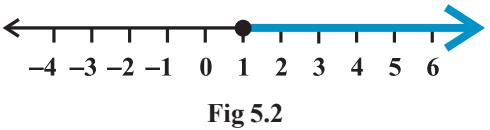
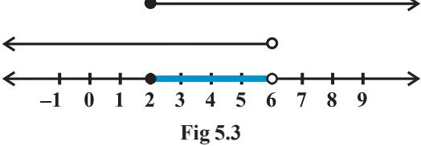

## v*Mathematics is the art of saying many things in many different ways.* **–** *MAXWELL*v

# **5.1 Introduction**

In earlier classes, we have studied equations in one variable and two variables and also solved some statement problems by translating them in the form of equations. Now a natural question arises: 'Is it always possible to translate a statement problem in the form of an equation? For example, the height of all the students in your class is less than 160 cm. Your classroom can occupy atmost 60 tables or chairs or both. Here we get certain statements involving a sign '<' (less than), '>' (greater than), '≤' (less than or equal) and ≥ (greater than or equal) which are known as *inequalities*.

In this Chapter, we will study linear inequalities in one and two variables. The study of inequalities is very useful in solving problems in the field of science, mathematics, statistics, economics, psychology, etc.

## **5.2 Inequalities**

Let us consider the following situations:

(i) Ravi goes to market with `200 to buy rice, which is available in packets of 1kg. The price of one packet of rice is ` 30. If *x* denotes the number of packets of rice, which he buys, then the total amount spent by him is ` 30*x*. Since, he has to buy rice in packets only, he may not be able to spend the entire amount of ` 200. (Why?) Hence 30*x* < 200 ... (1)

Clearly the statement (i) is not an equation as it does not involve the sign of equality.

(ii) Reshma has ` 120 and wants to buy some registers and pens. The cost of one register is ` 40 and that of a pen is ` 20. In this case, if *x* denotes the number of registers and *y*, the number of pens which Reshma buys, then the total amount spent by her is ` (40*x +* 20*y*) and we have

$40x+20y\leq120$

Since in this case the total amount spent may be upto ` 120. Note that the statement (2) consists of two statements

$40x+20y<120$

and  
  

$$40x+20y=120$$

Statement (3) is not an equation, i.e., it is an inequality while statement (4) is an equation.

**Definition 1** Two real numbers or two algebraic expressions related by the symbol '<', '>', '≤' or '≥' form an *inequality*.

Statements such as (1), (2) and (3) above are inequalities.

3 < 5; 7 > 5 are the examples of *numerical inequalities* while

*x* < 5; *y* > 2; *x* ≥ 3, *y* ≤ 4 are some examples of *literal inequalities*.

3 < 5 < 7 (read as 5 is greater than 3 and less than 7), 3 < *x* < 5 (read as *x* is greater than or equal to 3 and less than 5) and 2 < *y* < 4 are the examples of *double inequalities*.

Some more examples of inequalities are:

| ax + b < 0 |  |  | ... (5) |
| --- | --- | --- | --- |
| ax + b > 0 |  |  | ... (6) |
| ax + b ≤ | 0 |  | ... (7) |
| ax + b ≥ | 0 |  | ... (8) |
| ax + by < c |  |  | ... (9) |
| ax + by > c |  |  | ... (10) |
| ax + by ≤ c |  |  | ... (11) |
| ax + by ≥ c |  |  | ... (12) |
| ax2 + bx + c ≤ |  | 0 | ... (13) |
| ax2 + bx + c > |  | 0 | ... (14) |

Inequalities (5), (6), (9), (10) and (14) are *strict inequalities* while inequalities (7), (8), (11), (12), and (13) are *slack inequalities*. Inequalities from (5) to (8) are *linear inequalities* in one variable *x* when *a* ≠ 0, while inequalities from (9) to (12) *are linear inequalities in two variables x and y* when *a* ≠ 0, *b* ≠0.

Inequalities (13) and (14) are not linear *(in fact, these are quadratic inequalities in one variable x when a* ≠0)*.*

In this Chapter, we shall confine ourselves to the study of linear inequalities in one and two variables only.

## **5.3 Algebraic Solutions of Linear Inequalities in One Variable and their Graphical Representation**

Let us consider the inequality (1) of Section 6.2, viz, 30*x <* 200 Note that here *x* denotes the number of packets of rice.

Obviously, *x* cannot be a negative integer or a fraction. Left hand side (L.H.S.) of this inequality is 30*x* and right hand side (RHS) is 200. Therefore, we have

> For *x* = 0, L.H.S. = 30 (0) = 0 < 200 (R.H.S.), which is true. For *x* = 1, L.H.S. = 30 (1) = 30 < 200 (R.H.S.), which is true. For *x* = 2, L.H.S. = 30 (2) = 60 < 200, which is true. For *x* = 3, L.H.S. = 30 (3) = 90 < 200, which is true. For *x* = 4, L.H.S. = 30 (4) = 120 < 200, which is true. For *x* = 5, L.H.S. = 30 (5) = 150 < 200, which is true. For *x* = 6, L.H.S. = 30 (6) = 180 < 200, which is true. For *x* = 7, L.H.S. = 30 (7) = 210 < 200, which is false.

In the above situation, we find that the values of *x*, which makes the above inequality a true statement, are 0,1,2,3,4,5,6. These values of *x*, which make above inequality a true statement, are called *solutions* of inequality and the set {0,1,2,3,4,5,6} is called its *solution set*.

*Thus, any solution of an inequality in one variable is a value of the variable which makes it a true statement.*

We have found the solutions of the above inequality by *trial and error* method which is not very efficient. Obviously, this method is time consuming and sometimes not feasible. We must have some better or systematic techniques for solving inequalities. Before that we should go through some more properties of numerical inequalities and follow them as rules while solving the inequalities.

You will recall that while solving linear equations, we followed the following rules:

**Rule 1** Equal numbers may be added to (or subtracted from) both sides of an equation.

**Rule 2** Both sides of an equation may be multiplied (or divided) by the same non-zero number.

In the case of solving inequalities, we again follow the same rules except with a difference that in Rule 2, the sign of inequality is reversed (i.e., '<' becomes '>', ≤' becomes '≥' and so on) whenever we multiply (or divide) both sides of an inequality by a negative number. It is evident from the facts that

$3>2$ while $-3<-2$,  
  
$-8<-7$ while $(-8)\,(-2)>(-7)\,(-2)\,,$ i.e., $16>14$.  
  

Thus, we state the following rules for solving an inequality:

**Rule 1** Equal numbers may be added to (or subtracted from) both sides of an inequality without affecting the sign of inequality.

**Rule 2** Both sides of an inequality can be multiplied (or divided) by the same positive number. But when both sides are multiplied or divided by a negative number, then the sign of inequality is *reversed.*

Now, let us consider some examples.

**Example 1** Solve 30 *x* < 200 when

(i) *x* is a natural number, (ii) *x* is an integer.

**Solution** We are given 30 *x* < 200

or 30 200 *x*

30 30 < (Rule 2), i.e., *x* < 20 / 3.

- (i) When *x* is a natural number, in this case the following values of *x* make the statement true.
1, 2, 3, 4, 5, 6.

The solution set of the inequality is {1,2,3,4,5,6}.

- (ii) When *x* is an integer**,** the solutions of the given inequality are ..., – 3, –2, –1, 0, 1, 2, 3, 4, 5, 6
The solution set of the inequality is {...,–3, –2,–1, 0, 1, 2, 3, 4, 5, 6}

**Example 2** Solve 5*x* – 3 < 3*x* +1 when

(i) *x* is an integer, (ii) *x* is a real number.

**Solution** We have, 5*x* –3 < 3*x* + 1

or 5*x* –3 + 3 < 3*x* +1 +3 (Rule 1) or 5*x* < 3*x* +4 or 5*x* – 3*x* < 3*x* + 4 – 3*x* (Rule 1) or 2*x* < 4 or *x* < 2 (Rule 2)

(i) When *x* is an integer, the solutions of the given inequality are ..., – 4, – 3, – 2, – 1, 0, 1

- (ii) When *x* is a real number**,** the solutions of the inequality are given by *x* < 2, i.e., all real numbers *x* which are less than 2. Therefore, the solution set of the inequality is *x* ∈ (– ∞, 2).
We have considered solutions of inequalities in the set of natural numbers, set of integers and in the set of real numbers. Henceforth, unless stated otherwise, we shall solve the inequalities in this Chapter in the set of real numbers.

**Example 3** Solve 4*x* + 3 < 6*x* +7.

**Solution** We have, 4*x* + 3 < 6*x* + 7 or 4*x* – 6*x* < 6*x* + 4 – 6*x* or – 2*x* < 4 or *x* > – 2

i.e., all the real numbers which are greater than –2, are the solutions of the given inequality. Hence, the solution set is (–2, ∞).

  
  
**Example 4**: Solve $\frac{5-2x}{3}\leq\frac{x}{6}-5$.  
  

**Solution** We have

$${\frac{5-2x}{3}}\leq{\frac{x}{6}}-5$$

- or 2 (5 2*x*) ≤ *x* 30. or 10 – 4*x* ≤ *x* – 30 or – 5*x* ≤ – 40, i.e., *x* ≥ 8
Thus, all real numbers *x* which are greater than or equal to 8 are the solutions of the given inequality, i.e., *x* ∈ [8, ∞).

**Example 5** Solve 7*x* + 3 < 5*x* + 9. Show the graph of the solutions on number line.

**Solution** We have 7*x* + 3 < 5*x* + 9 or 2*x* < 6 or *x* < 3

or

The graphical representation of the solutions are given in Fig 5.1.

* [10] M. C. Gonzalez-Garcia, M. C. Gonzalez-Garcia, M.  
  

**Example 6** Solve 3 4 1 1 2 4 *x x* − + ≥ − . Show the graph of the solutions on number line. **Solution** We have

$$\frac{3x-4}{2}\geq\frac{x+1}{4}-1$$
  
  
or  
  

$$\frac{3x-4}{2}\geq\frac{x-3}{4}$$
  
  
or  
  

$$2\ (3x-4)\geq(x-3)$$

$\begin{array}{c}\mbox{or}\\ \mbox{or}\\ \mbox{or}\end{array}$

The graphical representation of solutions is given in Fig 5.2.

**Example 7** The marks obtained by a student of Class XI in first and second terminal examination are 62 and 48, respectively. Find the minimum marks he should get in the annual examination to have an average of at least 60 marks.

**Solution** Let *x* be the marks obtained by student in the annual examination. Then

$$\frac{62+48+x}{3}\geq60$$
  
or  

$$110+x\geq180$$
  
or  

$$x\geq70$$

Thus, the student must obtain a minimum of 70 marks to get an average of at least 60 marks.

**Example 8** Find all pairs of consecutive odd natural numbers, both of which are larger than 10, such that their sum is less than 40.

**Solution** Let *x* be the smaller of the two consecutive odd natural number, so that the other one is *x* +2. Then, we should have

|  | x > 10 | ... (1) |
| --- | --- | --- |
|  | and x + ( x + 2) < 40 | ... (2) |
|  | Solving (2), we get |  |
|  | 2x + 2 < 40 |  |
|  | i.e., x < 19 | ... (3) |
| From (1) and (3), we get |  |  |
|  | 10 < x < 19 |  |

Since *x* is an odd number, *x* can take the values 11, 13, 15, and 17. So, the required possible pairs will be

(11, 13), (13, 15), (15, 17), (17, 19)

### **EXERCISE 5.1**

| 1. | Solve 24x < 100, when | (i) | x is a natural number. | (ii) | x is an integer. |  |  |  |  |  |  |  |  |  |  |  |  |  |  |  |  |  |  |  |  |  |  |  |  |  |  |  |
| --- | --- | --- | --- | --- | --- | --- | --- | --- | --- | --- | --- | --- | --- | --- | --- | --- | --- | --- | --- | --- | --- | --- | --- | --- | --- | --- | --- | --- | --- | --- | --- | --- |
| 2. | Solve – 12x > 30, when | (i) | x is a natural number. | (ii) | x is an integer. |  |  |  |  |  |  |  |  |  |  |  |  |  |  |  |  |  |  |  |  |  |  |  |  |  |  |  |
| 3. | Solve 5x – 3 < 7, when | (i) | x is an integer. | (ii) | x is a real number. |  |  |  |  |  |  |  |  |  |  |  |  |  |  |  |  |  |  |  |  |  |  |  |  |  |  |  |
| 4. | Solve 3x + 8 >2, when | (i) | x is an integer. | (ii) | x is a real number. |  |  |  |  |  |  |  |  |  |  |  |  |  |  |  |  |  |  |  |  |  |  |  |  |  |  |  |
| Solve the inequalities in Exercises 5 to 16 for real x. | 5. | 4x + 3 < 5x + 7 | 6. | 3x – 7 > 5x – 1 |  |  |  |  |  |  |  |  |  |  |  |  |  |  |  |  |  |  |  |  |  |  |  |  |  |  |  |  |
| 3(x – 1) ≤ 2 (x – 3) | 3 (2 – x) ≥ 2 (1 – x) | 7. | 8. |  |  |  |  |  |  |  |  |  |  |  |  |  |  |  |  |  |  |  |  |  |  |  |  |  |  |  |  |  |
| x | x | x | x | + | + | < | > | + | x | 11 | 1 | 9. | 10. | 2 | 3 | 3 | 2 |  |  |  |  |  |  |  |  |  |  |  |  |  |  |  |
| 1 | 3 | x | 1 | − | − |  |  | 3( | x | 2) | 5(2 | x | ) | + | ≥ | − | 4 ( | x | 6) | ≤ | 11. | 12. |  |  | 2 | 5 | 3 | 5 | 3 |  |  |  |
| 13. | 2 (2x + 3) – 10 < 6 (x – 2) | 14. | 37 – (3x + 5) > 9x – 8 (x – 3) |  |  |  |  |  |  |  |  |  |  |  |  |  |  |  |  |  |  |  |  |  |  |  |  |  |  |  |  |  |
| − | − | − | − | − | (2 | x | 1) | (3 | x | 2) | (2 | x | ) | x | (5 | x | 2) | (7 | x | 3) | ≥ | − | < | − | 15. | 16. | 4 | 3 | 5 | 3 | 4 | 5 |

Solve the inequalities in Exercises 17 to 20 and show the graph of the solution in each case on number line

- **17.** 3*x* 2 < 2*x* + 1 **18.** 5*x* 3 > 3*x* 5 **19.** 3 (1 – *x*) < 2 (*x* + 4) **20.** (5 – 2) (7 –3) – 2 3 5 *x x x* ≥
- **21.** Ravi obtained 70 and 75 marks in first two unit test. Find the minimum marks he should get in the third test to have an average of at least 60 marks.
- **22.** To receive Grade 'A' in a course, one must obtain an average of 90 marks or more in five examinations (each of 100 marks). If Sunita's marks in first four examinations are 87, 92, 94 and 95, find minimum marks that Sunita must obtain in fifth examination to get grade 'A' in the course.
- **23.** Find all pairs of consecutive odd positive integers both of which are smaller than 10 such that their sum is more than 11.
- **24.** Find all pairs of consecutive even positive integers, both of which are larger than 5 such that their sum is less than 23.

- **25.** The longest side of a triangle is 3 times the shortest side and the third side is 2 cm shorter than the longest side. If the perimeter of the triangle is at least 61 cm, find the minimum length of the shortest side.
- **26.** A man wants to cut three lengths from a single piece of board of length 91cm. The second length is to be 3cm longer than the shortest and the third length is to be twice as long as the shortest. What are the possible lengths of the shortest board if the third piece is to be at least 5cm longer than the second?

[*Hint:* If *x* is the length of the shortest board, then *x* , (*x* + 3) and 2*x* are the lengths of the second and third piece, respectively. Thus, *x* + (*x* + 3) + 2*x* ≤ 91 and 2*x* ≥ (*x* + 3) + 5].

### *Miscellaneous Examples*

#### **Example 9** Solve – 8 ≤ 5*x* – 3 < 7.

**Solution** In this case, we have two inequalities, – 8 ≤ 5*x* – 3 and 5*x* – 3 < 7, which we will solve simultaneously. We have – 8 ≤ 5*x* –3 < 7 or –5 ≤ 5*x* < 10 or –1 ≤ *x* < 2 **Example 10** Solve – 5 ≤ 5 3 2 *– x* ≤ 8. **Solution** We have – 5 ≤ 5 3 2 *– x* ≤ 8 or –10 ≤ 5 – 3*x* ≤ 16 or – 15 ≤ – 3*x* ≤ 11

or 5 ≥ *x* ≥ –

3 which can be written as –11 3 ≤ *x* ≤ 5

11

**Example 11** Solve the system of inequalities:

3*x* – 7 < 5 + *x* ... (1) 11 – 5 *x* ≤ 1 ... (2)

and represent the solutions on the number line.

**Solution** From inequality (1), we have

3*x* – 7 < 5 + *x* or *x* < 6 ... (3)

Also, from inequality (2), we have

11 – 5 *x* ≤ 1 or – 5 *x* ≤ – 10 i.e., *x* ≥ 2 ... (4) If we draw the graph of inequalities (3) and (4) on the number line, we see that the values of *x*, which are common to both, are shown by bold line in Fig 5.3.

Thus, solution of the system are real numbers *x* lying between 2 and 6 including 2, i.e., 2 ≤ *x* < 6

**Example 12** In an experiment, a solution of hydrochloric acid is to be kept between 30° and 35° Celsius. What is the range of temperature in degree Fahrenheit if conversion

formula is given by C = 5 9 (F – 32), where C and F represent temperature in degree

Celsius and degree Fahrenheit, respectively.

**Solution** It is given that 30 < C < 35.

Putting C =

$${\mathrm{C}}={\frac{5}{9}}\ \ ({\mathrm{F}}-32),{\mathrm{~we~get~}}$$

* [16] A. A. K.  
  

or

9 5 *×* (30) < (F – 32) < 9 5 *×* (35)

or 54 < (F – 32) < 63

or 86 < F < 95.

Thus, the required range of temperature is between 86° F and 95° F.

**Example 13** A manufacturer has 600 litres of a 12% solution of acid. How many litres of a 30% acid solution must be added to it so that acid content in the resulting mixture will be more than 15% but less than 18%?

**Solution** Let *x* litres of 30% acid solution is required to be added. Then Total mixture = (*x* + 600) litres

| Therefore | 30% x + 12% of 600 > 15% of (x + 600) |  |  |  |  |
| --- | --- | --- | --- | --- | --- |
| and | 30% x + 12% of 600 < 18% of (x + 600) |  |  |  |  |
| or | 30 x + | 12 | (600) > | 15 | (x + 600) |
|  | 100 | 100 |  | 100 |  |

and

$${\frac{30x}{100}}\ +{\frac{12}{100}}\ (600)<{\frac{18}{100}}\ (x+600)$$

$30x+7200>15x+9000$

and  
  
$30x+7200<18x+10800$

$15x>1800$ and $12x<3600$

or *x* > 120 and *x* < 300,

i.e. 120 < *x* < 300

Thus, the number of litres of the 30% solution of acid will have to be more than 120 litres but less than 300 litres.

## *Miscellaneous Exercise on Chapter 5*

Solve the inequalities in Exercises 1 to 6.

$2\leq3x-4\leq5$  
  
$3.\quad-3\leq4-\frac{7x}{2}\leq18$  
  
$5.\quad-12<4-\frac{3x}{-5}\leq2$  
  
$6.\quad7\leq\frac{(3x+11)}{2}\leq11$.  
  

Solve the inequalities in Exercises 7 to 10 and represent the solution graphically on number line.

  
  
## 7 **S4 + 1 - 24, 5x - 1 - 24**

- **8.** 2 (*x* 1) < *x* + 5, 3 (*x* + 2) > 2 *x*
- **9.** 3*x* 7 > 2 (*x* 6) , 6 *x* > 11 2*x*
- **10.** 5 (2*x*  7) 3 (2*x* + 3) ≤ 0 , 2*x* + 19 ≤ 6*x* + 47 .
- **11.** A solution is to be kept between 68° F and 77° F. What is the range in temperature in degree Celsius (C) if the Celsius / Fahrenheit (F) conversion formula is given by

$$\mathrm{F}=\mathrm{~\frac{9}{5}~C+32~}?$$

- **12.** A solution of 8% boric acid is to be diluted by adding a 2% boric acid solution to it. The resulting mixture is to be more than 4% but less than 6% boric acid. If we have 640 litres of the 8% solution, how many litres of the 2% solution will have to be added?
- **13.** How many litres of water will have to be added to 1125 litres of the 45% solution of acid so that the resulting mixture will contain more than 25% but less than 30% acid content?
- **14.** IQ of a person is given by the formula

$$\mathrm{IQ}=\mathrm{\boldmath~\frac{MA}{CA}\times100,}$$

where MA is mental age and CA is chronological age. If 80 ≤ IQ ≤ 140 for a group of 12 years old children, find the range of their mental age.

#### *Summary*

- ÆTwo real numbers or two algebraic expressions related by the symbols <, >, ≤ or ≥ form an inequality.
- ÆEqual numbers may be added to (or subtracted from ) both sides of an inequality.
- ÆBoth sides of an inequality can be multiplied (or divided ) by the same positive number. But when both sides are multiplied (or divided) by a negative number, then the inequality is reversed.
- ÆThe values of *x*, which make an inequality a true statement, are called *solutions of the inequality*.
- ÆTo represent *x* < *a* (or *x* > *a*) on a number line, put a circle on the number *a* and dark line to the left (or right) of the number *a*.
- ÆTo represent *x* ≤ *a* (or *x* ≥ *a*) on a number line, put a dark circle on the number *a* and dark the line to the left (or right) of the number *x*.

**—** v **—**

