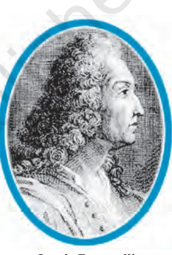
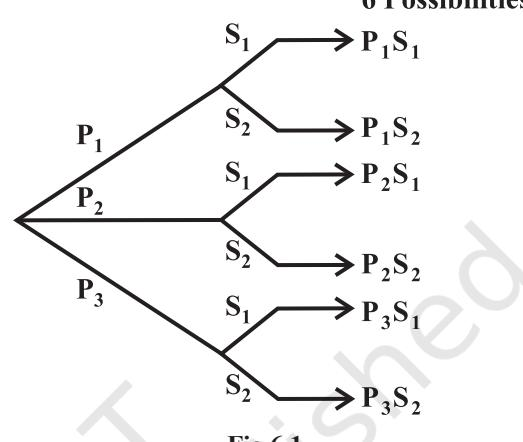
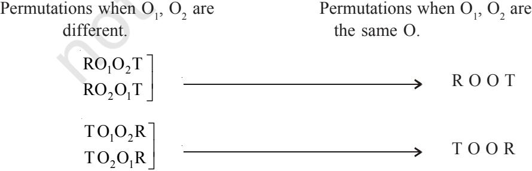
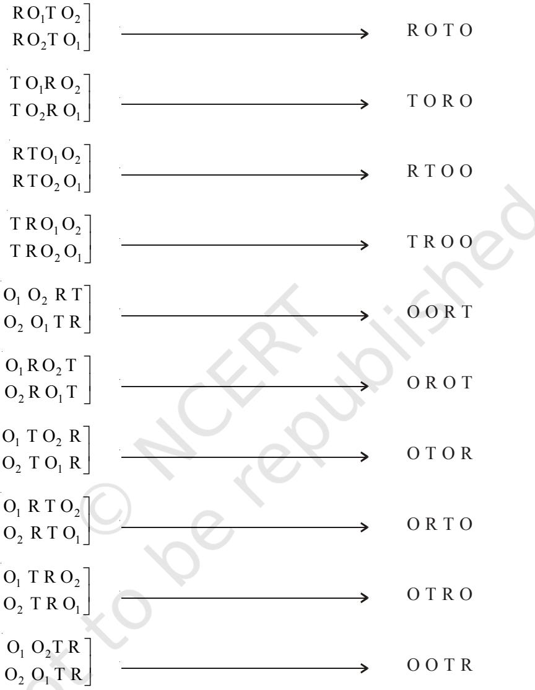
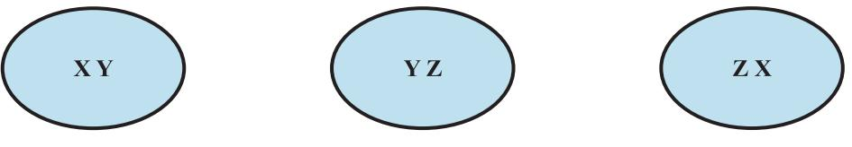

v*Every body of discovery is mathematical in form because there is no other guidance we can have – DARWIN*v

# **6.1 Introduction**

100 MATHEMATICS

Suppose you have a suitcase with a number lock. The number lock has 4 wheels each labelled with 10 digits from 0 to 9. The lock can be opened if 4 specific digits are arranged in a particular sequence with no repetition. Some how, you have forgotten this specific sequence of digits. You remember only the first digit which is 7. In order to open the lock, how many sequences of 3-digits you may have to check with? To answer this question, you may, immediately, start listing all possible arrangements of 9 remaining digits taken 3 at a time. But, this method will be tedious, because the number of possible sequences may be large. Here, in this Chapter, we shall learn some basic counting techniques which will

**Jacob Bernoulli (1654-1705)**

enable us to answer this question without actually listing 3-digit arrangements. In fact, these techniques will be useful in determining the number of different ways of arranging and selecting objects without actually listing them. As a first step, we shall examine a principle which is most fundamental to the learning of these techniques.

# **6.2 Fundamental Principle of Counting**

Let us consider the following problem. Mohan has 3 pants and 2 shirts. How many different pairs of a pant and a shirt, can he dress up with? There are 3 ways in which a pant can be chosen, because there are 3 pants available. Similarly, a shirt can be chosen in 2 ways. For every choice of a pant, there are 2 choices of a shirt. Therefore, there are 3 × 2 = 6 pairs of a pant and a shirt.

Let us name the three pants as P1 , P2 , P3 and the two shirts as S1 , S2 . Then, these six possibilities can be illustrated in the Fig. 6.1.

Let us consider another problem of the same type.

Sabnam has 2 school bags, 3 tiffin boxes and 2 water bottles. In how many ways can she carry these items (choosing one each).

A school bag can be chosen in 2 different ways. After a school bag is chosen, a tiffin box can be chosen in 3 different ways. Hence, there are 2 × 3 = 6 pairs of school bag and a tiffin box. For each of these pairs a water bottle can be chosen in 2 different ways.

**Fig 6.1**

Hence, there are 6 × 2 = 12 different ways in which, Sabnam can carry these items to school. If we name the 2 school bags as B1 , B2 , the three tiffin boxes as T1 , T2 , T3 and the two water bottles as W1 , W2 , these possibilities can be illustrated in the Fig. 6.2.

**Fig 6.2**

In fact, the problems of the above types are solved by applying the following principle known as the *fundamental principle of counting*, or, simply, the *multiplication principle*, which states that

*"If an event can occur in m different ways, following which another event can occur in n different ways, then the total number of occurrence of the events in the given order is m×n."*

The above principle can be generalised for any finite number of events. For example, for 3 events, the principle is as follows:

'If an event can occur in *m* different ways, following which another event can occur in *n* different ways, following which a third event can occur in *p* different ways, then the total number of occurrence to 'the events in the given order is *m* × *n* × *p*."

In the first problem, the required number of ways of wearing a pant and a shirt was the number of different ways of the occurence of the following events in succession:

- (i) the event of choosing a pant
- (ii) the event of choosing a shirt.

In the second problem, the required number of ways was the number of different ways of the occurence of the following events in succession:

- (i) the event of choosing a school bag
- (ii) the event of choosing a tiffin box
- (iii) the event of choosing a water bottle.

Here, in both the cases, the events in each problem could occur in various possible orders. But, we have to choose any one of the possible orders and count the number of different ways of the occurence of the events in this chosen order.

**Example 1** Find the number of 4 letter words, with or without meaning, which can be formed out of the letters of the word ROSE, where the repetition of the letters is not allowed.

**Solution** There are as many words as there are ways of filling in 4 vacant places

by the 4 letters, keeping in mind that the repetition is not allowed. The

first place can be filled in 4 different ways by anyone of the 4 letters R,O,S,E. Following which, the second place can be filled in by anyone of the remaining 3 letters in 3 different ways, following which the third place can be filled in 2 different ways; following which, the fourth place can be filled in 1 way. Thus, the number of ways in which the 4 places can be filled, by the multiplication principle, is 4 × 3 × 2 × 1 = 24. Hence, the required number of words is 24.

A**Note** If the repetition of the letters was allowed, how many words can be formed? One can easily understand that each of the 4 vacant places can be filled in succession in 4 different ways. Hence, the required number of words = 4 × 4 × 4 × 4 = 256.

**Example 2** Given 4 flags of different colours, how many different signals can be generated, if a signal requires the use of 2 flags one below the other?

**Solution** There will be as many signals as there are ways of filling in 2 vacant places

in succession by the 4 flags of different colours. The upper vacant place can

be filled in 4 different ways by anyone of the 4 flags; following which, the lower vacant place can be filled in 3 different ways by anyone of the remaining 3 different flags. Hence, by the multiplication principle, the required number of signals = 4 × 3 = 12.

**Example 3** How many 2 digit even numbers can be formed from the digits 1, 2, 3, 4, 5 if the digits can be repeated?

**Solution** There will be as many ways as there are ways of filling 2 vacant places

in succession by the five given digits. Here, in this case, we start filling in unit's

place, because the options for this place are 2 and 4 only and this can be done in 2 ways; following which the ten's place can be filled by any of the 5 digits in 5 different ways as the digits can be repeated. Therefore, by the multiplication principle, the required number of two digits even numbers is 2 × 5, i.e., 10.

**Example 4** Find the number of different signals that can be generated by arranging at least 2 flags in order (one below the other) on a vertical staff, if five different flags are available.

**Solution** A signal can consist of either 2 flags, 3 flags, 4 flags or 5 flags. Now, let us count the possible number of signals consisting of 2 flags, 3 flags, 4 flags and 5 flags separately and then add the respective numbers.

There will be as many 2 flag signals as there are ways of filling in 2 vacant places

 in succession by the 5 flags available. By Multiplication rule, the number of ways is 5 × 4 = 20.

Similarly, there will be as many 3 flag signals as there are ways of filling in 3

vacant places in succession by the 5 flags.

The number of ways is 5 × 4 × 3 = 60.

Continuing the same way, we find that

The number of 4 flag signals = 5 × 4 × 3 × 2 = 120

and the number of 5 flag signals = 5 × 4 × 3 × 2 × 1 = 120

Therefore, the required no of signals = 20 + 60 + 120 + 120 = 320.

# **EXERCISE 6.1**

- **1.** How many 3-digit numbers can be formed from the digits 1, 2, 3, 4 and 5 assuming that
	- (i) repetition of the digits is allowed?
	- (ii) repetition of the digits is not allowed?
- **2.** How many 3-digit even numbers can be formed from the digits 1, 2, 3, 4, 5, 6 if the digits can be repeated?
- **3.** How many 4-letter code can be formed using the first 10 letters of the English alphabet, if no letter can be repeated?
- **4.** How many 5-digit telephone numbers can be constructed using the digits 0 to 9 if each number starts with 67 and no digit appears more than once?
- **5.** A coin is tossed 3 times and the outcomes are recorded. How many possible outcomes are there?
- **6.** Given 5 flags of different colours, how many different signals can be generated if each signal requires the use of 2 flags, one below the other?

# **6.3 Permutations**

In Example 1 of the previous Section, we are actually counting the different possible arrangements of the letters such as ROSE, REOS, ..., etc. Here, in this list, each arrangement is different from other. In other words, the order of writing the letters is important. Each arrangement is called a *permutation of* 4 *different letters taken all at a time*. Now, if we have to determine the number of 3-letter words, with or without meaning, which can be formed out of the letters of the word NUMBER, where the repetition of the letters is not allowed, we need to count the arrangements NUM, NMU, MUN, NUB, ..., etc. Here, we are counting the permutations of 6 different letters taken 3 at a time. The required number of words = 6 × 5 × 4 = 120 (by using multiplication principle).

If the repetition of the letters was allowed, the required number of words would be 6 × 6 × 6 = 216.

**Definition 1** A permutation is an arrangement in a definite order of a number of objects taken some or all at a time.

In the following sub-section, we shall obtain the formula needed to answer these questions immediately.

#### **6.3.1** *Permutations when all the objects are distinct*

**Theorem 1** The number of permutations of *n* different objects taken *r* at a time, where 0 < *r* ≤ *n* and the objects do not repeat is *n* ( *n* – 1) ( *n* – 2). . .( *n* – *r* + 1), which is denoted by *n*P*r .*

**Proof** There will be as many permutations as there are ways of filling in *r* vacant

places . . . by

← *r* vacant places →

the *n* objects. The first place can be filled in *n* ways; following which, the second place can be filled in (*n* – 1) ways, following which the third place can be filled in (*n* – 2) ways,..., the *r*th place can be filled in (*n* – (*r* – 1)) ways. Therefore, the number of ways of filling in *r* vacant places in succession is *n*(*n* – 1) (*n* – 2) . . . (*n* – (*r* – 1)) or *n* ( *n* – 1) (*n* – 2) ... (*n* – *r* + 1)

This expression for *n*P*r* is cumbersome and we need a notation which will help to reduce the size of this expression. The symbol *n*! (read as factorial *n* or *n* factorial ) comes to our rescue. In the following text we will learn what actually *n*! means.

**6.3.2** *Factorial notation* The notation *n*! represents the product of first *n* natural numbers, i.e., the product 1 × 2 × 3 × . . . × (*n* – 1) × *n* is denoted as *n*!. We read this symbol as '*n* factorial'. Thus, 1 × 2 × 3 × 4 . . . × (*n* – 1) × *n* = *n* !

$$1=1\!$$
 
$$1\times2=2\!$$
 
$$1\times2\times3=3\!$$
 
$$1\times2\times3\!\times4=4\!$$
  
  
and so on.  
  
We define $0\!=\!1$  
  
We can write $5\!=5\times4\!=5\times4\times3\!=5\times4\times3\times2\!$  
  
$=5\times4\times3\times2\times1\!$  
  
Clearly, for a natural number $n$  
  

$$n!=n\;(n\;-\;1)\!$$
 
$$=n\;(n\;-\;1)\;(n\;-\;2)\!$$
 [provided 
$$(n\geq2)$$
 ] 
$$=n\;(n\;-\;1)\;(n\;-\;2)\;(n\;-\;3)\!$$
 [provided 
$$(n\geq3)$$
 ]

and so on.

**Example 5** Evaluate (i) 5 ! (ii) 7 ! (iii) 7 ! – 5! **Solution** (i) 5 ! = 1 × 2 × 3 × 4 × 5 = 120 (ii) 7 ! = 1 × 2 × 3 × 4 × 5 × 6 ×7 = 5040 and (iii) 7 ! – 5! = 5040 – 120 = 4920. **Example 6** Compute (i) 7! 5! (ii) ( ) 12! 10! (2!) **Solution** (i) We have 7! 5! *=*  7 6 5! 5! × ×  *=* 7 *×* 6 *=* 42 and (ii) ( ) ( ) 12! 10! 2! = ( ) ( ) ( ) 12 11 10! 10! 2 × × × = 6 × 11 = 66. **Example 7** Evaluate ( ) ! ! ! *n r n r* − , when *n* = 5, *r* = 2. **Solution** We have to evaluate ( ) 5! 2! 5 2 ! − (since *n* = 5, *r* = 2) We have ( ) 5! 2 ! 5 2 ! − = 5! 5 4 10 2! 3! 2 × = = × . **Example 8** If 1 1 8! 9! 10! *x* + = , find *x*. **Solution** We have 1 1 8! 9 8! 10 9 8! *x* + = × × × Therefore 1 1 9 10 9 *x* + = × or 10 9 10 9 *x* = × So *x* = 100. **EXERCISE 6.2 1.** Evaluate (i) 8 ! (ii) 4 ! – 3 !

Is 3! + 4! = 7!? **3.** Compute $\frac{8!}{6!\times2!}$ **4.** If $\frac{1}{6!}+\frac{1}{7!}=\frac{x}{8!}$, find $x$

- **5.** Evaluate ( ) ! ! *n n r* − , when
(i) $n=6$, $r=2$ (ii) $n=9$, $r=5$.  
  

**6.3.3** *Derivation of the formula for nPr*

$${}^{n}\mathbf{P}_{r}={\frac{n!}{\left(n-r\right)!}}\,,\,0\leq r\leq n$$

Let us now go back to the stage where we had determined the following formula:

${}^{n}$P${}_{r}=n$ ($n-1$) ($n-2$). ($n-r+1$)

Multiplying numerator and denomirator by (*n* – *r*) (*n* – *r* – 1) . . . 3 × 2 × 1, we get

$${}^{n}\,\mathrm{P}_{r}=\frac{n\big{(}n-1\big{)}\big{(}n-2\big{)}...\big{(}n-r+1\big{)}\big{(}n-r\big{)}\big{(}n-r-1\big{)}...3\times2\times1}{\big{(}n-r\big{)}\big{(}n-r\big{)}\big{(}n-r\big{)}\big{(}n-r\big{)}\big{(}n-r\big{)}\big{(}n-r\big{)}\big{(}n-r\big{)}\big{(}n-r\big{)}\big{)}}=\frac{n!}{\big{(}n-r\big{)}!}\,,$$

Thus  
  

$${}^{n}\,{\bf P}_{r}=\frac{n!}{(n-r)!}\,,\,\mbox{where}0<r\leq n$$

This is a much more convenient expression for *n*P*r* than the previous one.

In particular, when *r* = *n*, ! P ! 0! *n n n* = = *n*

*n*

Counting permutations is merely counting the number of ways in which some or all objects at a time are rearranged. Arranging no object at all is the same as leaving behind all the objects and we know that there is only one way of doing so. Thus, we can have

$$\left(\begin{array}{c}\mbox{P}_{0}=1=\frac{n!}{n!}=\frac{n!}{(n-0)!}\end{array}\right.\tag{1}$$

Therefore, the formula (1) is applicable for *r* = 0 also.

Thus ( ) ! P 0 ! *n r n , r n n r* = ≤ ≤ −

.

**Theorem 2** The number of permutations of *n* different objects taken *r* at a time, where repetition is allowed, is *n r* .

Proof is very similar to that of Theorem 1 and is left for the reader to arrive at.

Here, we are solving some of the problems of the pervious Section using the formula for *n*P*r* to illustrate its usefulness.

In Example 1, the required number of words = 4P4 = 4! = 24. Here repetition is not allowed. If repetition is allowed, the required number of words would be 44 = 256.

The number of 3-letter words which can be formed by the letters of the word

$$\text{NUMBER}=\ ^{6}\text{P}_{3}=\frac{6!}{3!}=4\times5\times6=120.$$
  
  
Here, in this case also, the repetition is not 

allowed. If the repetition is allowed,the required number of words would be 63 = 216.

The number of ways in which a Chairman and a Vice-Chairman can be chosen from amongst a group of 12 persons assuming that one person can not hold more than

one position, clearly ${}^{12}$P${}_{2}=\frac{12!}{10!}=11\times12=132$.  
  

**6.3.4** *Permutations when all the objects are not distinct objects* Suppose we have to find the number of ways of rearranging the letters of the word ROOT. In this case, the letters of the word are not all different. There are 2 Os, which are of the same kind. Let us treat, temporarily, the 2 Os as different, say, O1 and O2 . The number of permutations of 4-different letters, in this case, taken all at a time is 4!. Consider one of these permutations say, RO1O2 T. Corresponding to this permutation,we have 2 ! permutations RO1O2 T and RO2O1 T which will be exactly the same permutation if O1 and O2 are not treated as different, i.e., if O1 and O2 are the same O at both places.

Therefore, the required number of permutations = 4! 3 4 12 2! = × = .

Let us now find the number of ways of rearranging the letters of the word INSTITUTE. In this case there are 9 letters, in which I appears 2 times and T appears 3 times.

Temporarily, let us treat these letters different and name them as I1 , I2 , T1 , T2 , T3 . The number of permutations of 9 different letters, in this case, taken all at a time is 9 !. Consider one such permutation, say, I1 NT1 SI2 T2 U E T3 . Here if I1 , I2 are not same

and T1 , T2 , T3 are not same, then I1 , I2 can be arranged in 2! ways and T1 , T2 , T3 can be arranged in 3! ways. Therefore, 2! × 3! permutations will be just the same permutation corresponding to this chosen permutation I1NT1 SI2 T2UET3 . Hence, total number of

different permutations will be $\frac{9!}{2!\,3!}$

We can state (without proof) the following theorems:

**Theorem 3** The number of permutations of *n* objects, where *p* objects are of the

same kind and rest are all different = ! ! *n p* .

In fact, we have a more general theorem.

**Theorem 4** The number of permutations of *n* objects, where *p*1 objects are of one kind*, p*2 are of second kind, ..., *pk* are of *k* th kind and the rest, if any, are of different

$$\mathrm{kind\:is\:}\frac{n!}{p_{1}!\:p_{2}!\dots p_{k}!}.$$

**Example 9** Find the number of permutations of the letters of the word ALLAHABAD.

**Solution** Here, there are 9 objects (letters) of which there are 4A's, 2 L's and rest are all different.

Therefore, the required number of arrangements = 9! 5 6 7 8 9 4!2! 2 × × × × = = 7560

**Example 10** How many 4-digit numbers can be formed by using the digits 1 to 9 if repetition of digits is not allowed?

**Solution** Here order matters for example 1234 and 1324 are two different numbers. Therefore, there will be as many 4 digit numbers as there are permutations of 9 different digits taken 4 at a time.

Therefore, the required 4 digit numbers $={}^{9}\mathrm{P}_{4}=\frac{9!}{\left(9-4\right)!}=\frac{9!}{5!}=9\times8\times7\times6=3024$.  
  

**Example 11** How many numbers lying between 100 and 1000 can be formed with the digits 0, 1, 2, 3, 4, 5, if the repetition of the digits is not allowed?

**Solution** Every number between 100 and 1000 is a 3-digit number. We, first, have to

count the permutations of 6 digits taken 3 at a time. This number would be 6P3 . But, these permutations will include those also where 0 is at the 100's place. For example, 092, 042, . . ., etc are such numbers which are actually 2-digit numbers and hence the number of such numbers has to be subtracted from 6P3 to get the required number. To get the number of such numbers, we fix 0 at the 100's place and rearrange the remaining 5 digits taking 2 at a time. This number is 5P2 . So

The required number 6 5

$$={}^{6}\mathbf{p}_{3}-{}^{5}\mathbf{p}_{2}={\frac{6!}{3!}}-{\frac{5!}{3!}}$$
  

$$=4\times5\times6\ -\ 4\times5=100$$

**Example 12** Find the value of *n* such that

(i) ${}^{n}\,{\rm P}_{5}=42\,\,{}^{n}\,{\rm P}_{3},\,\,n>4$ (ii) ${}^{n}\,{\rm P}_{4}=\frac{5}{3}\,,n>4$

**Solution** (i) Given that

$${}^{n}P{}_{5}=42{}^{n}P{}_{3}

or n(n-1)(n-2)(n-3)(n-4)=42n(n-1)(n-2)$$

Since $n>4$ so $n(n-1)\,(n-2)\neq0$

Therefore, by dividing both sides by *n*(*n* – 1) (*n* – 2), we get

or  
  

$$n^{2}-7n-30=0$$
  
  
or  
  

$$n^{2}-10n+3n-30$$
  
  
or  
  

$$n-10n+3n-30$$

(*n* – 3 (*n* – 4) = 42

or (*n* – 10) (*n* + 3) = 0

2

or  
  
$n-10=0$or $n+3=0$

or  
  
$n=10$ or $n=-3$

As *n* cannot be negative, so *n* = 10.

(ii) Given that $\frac{n}{n-1}$

Therefore 3*n* (*n* – 1) (*n* – 2) (*n* – 3) = 5(*n* – 1) (*n* – 2) (*n* – 3) (*n* – 4) or 3*n* = 5 (*n* – 4) [as (*n* – 1) (*n* – 2) (*n* – 3) ≠ 0, *n* > 4] or *n* = 10.

**Example 13** Find *r*, if 5 4P*r* = 6 5P*r*–1 . **Solution** We have 4 5 1 5 P 6 P *r r* = −

or ( ) ( ) 4! 5! 5 6 4 ! 5 1 ! *r r* × = × − − +

×

or ( ) ( ) ( )( ) 5! 6 5! 4 ! 5 1 5 5 1 ! *r r r r* = − − + − − − or (6 – *r*) (5 – *r*) = 6 or *r* 2 – 11*r* + 24 = 0 or *r* 2 – 8*r* – 3*r* + 24 = 0 or (*r* – 8) (*r* – 3) = 0 or *r* = 8 or *r* = 3.

Hence *r* = 8, 3.

**Example 14** Find the number of different 8-letter arrangements that can be made from the letters of the word DAUGHTER so that

(i) all vowels occur together (ii) all vowels do not occur together.

**Solution** (i) There are 8 different letters in the word DAUGHTER, in which there are 3 vowels, namely, A, U and E. Since the vowels have to occur together, we can for the time being, assume them as a single object (AUE). This single object together with 5 remaining letters (objects) will be counted as 6 objects. Then we count permutations of these 6 objects taken all at a time. This number would be 6P6 = 6!. Corresponding to each of these permutations, we shall have 3! permutations of the three vowels A, U, E taken all at a time . Hence, by the multiplication principle the required number of permutations = 6 ! × 3 ! = 4320.

(ii) If we have to count those permutations in which all vowels are never together, we first have to find all possible arrangments of 8 letters taken all at a time, which can be done in 8! ways. Then, we have to subtract from this number, the number of permutations in which the vowels are always together.

Therefore, the required number 8 ! – 6 ! × 3 ! = 6 ! (7×8 – 6) = 2 × 6 ! (28 – 3) = 50 × 6 ! = 50 × 720 = 36000

**Example 15** In how many ways can 4 red, 3 yellow and 2 green discs be arranged in a row if the discs of the same colour are indistinguishable ?

**Solution** Total number of discs are 4 + 3 + 2 = 9. Out of 9 discs, 4 are of the first kind

(red), 3 are of the second kind (yellow) and 2 are of the third kind (green).

Therefore, the number of arrangements 9! =1260 4! 3! 2! .

**Example 16** Find the number of arrangements of the letters of the word INDEPENDENCE. In how many of these arrangements,

- (i) do the words start with P
- (ii) do all the vowels always occur together
- (iii) do the vowels never occur together
- (iv) do the words begin with I and end in P?

**Solution** There are 12 letters, of which N appears 3 times, E appears 4 times and D appears 2 times and the rest are all different. Therefore

The required number of arrangements = $\frac{12!}{3!\,4!\,2!}=1663200$

- (i) Let us fix P at the extreme left position, we, then, count the arrangements of the remaining 11 letters. Therefore, the required number of words starting with P
* [10] A. A. K.  
  

- (ii) There are 5 vowels in the given word, which are 4 Es and 1 I. Since, they have to always occur together, we treat them as a single object EEEEI for the time being. This single object together with 7 remaining objects will account for 8 objects. These 8 objects, in which there are 3Ns and 2 Ds, can be rearranged in
8! 3! 2! ways. Corresponding to each of these arrangements, the 5 vowels E, E, E,

E and I can be rearranged in 5! 4! ways. Therefore, by multiplication principle,

the required number of arrangements

$$={\frac{8!}{3!\,2!}}\times{\frac{5!}{4!}}=16800$$

(iii) The required number of arrangements = the total number of arrangements (without any restriction) – the number of arrangements where all the vowels occur together.

$$=1663200-16800=1646400$$

- (iv) Let us fix I and P at the extreme ends (I at the left end and P at the right end). We are left with 10 letters.
Hence, the required number of arrangements

$$={\frac{10!}{3!\,2!\,4!}}=12600$$

# **EXERCISE 6.3**

- **1.** How many 3-digit numbers can be formed by using the digits 1 to 9 if no digit is repeated?
- **2.** How many 4-digit numbers are there with no digit repeated?
- **3.** How many 3-digit even numbers can be made using the digits 1, 2, 3, 4, 6, 7, if no digit is repeated?
- **4.** Find the number of 4-digit numbers that can be formed using the digits 1, 2, 3, 4, 5 if no digit is repeated. How many of these will be even?
- **5.** From a committee of 8 persons, in how many ways can we choose a chairman and a vice chairman assuming one person can not hold more than one position?
- **6.** Find *n* if *n*  1P3 : *n*P4 = 1 : 9.
- **7.** Find *r* if (i) 5 6 P 2 P *r r* = −1 (ii) 5 6 P P *r r* = −1 .
- **8.** How many words, with or without meaning, can be formed using all the letters of the word EQUATION, using each letter exactly once?
- **9.** How many words, with or without meaning can be made from the letters of the word MONDAY, assuming that no letter is repeated, if.
	- (i) 4 letters are used at a time, (ii) all letters are used at a time,
	- (iii) all letters are used but first letter is a vowel?
- **10.** In how many of the distinct permutations of the letters in MISSISSIPPI do the four I's not come together?
- **11.** In how many ways can the letters of the word PERMUTATIONS be arranged if the
	- (i) words start with P and end with S, (ii) vowels are all together,
	- (iii) there are always 4 letters between P and S?

# **6.4 Combinations**

Let us now assume that there is a group of 3 lawn tennis players X, Y, Z. A team consisting of 2 players is to be formed. In how many ways can we do so? Is the team of X and Y different from the team of Y and X ? Here, order is not important. In fact, there are only 3 possible ways in which the team could be constructed.

**Fig. 6.3**

These are XY, YZ and ZX (Fig 6.3).

Here, each selection is called a *combination of 3 different objects taken 2 at a time*. In a combination, the order is not important.

Now consider some more illustrations.

Twelve persons meet in a room and each shakes hand with all the others. How do we determine the number of hand shakes. X shaking hands with Y and Y with X will not be two different hand shakes. Here, order is not important. There will be as many hand shakes as there are combinations of 12 different things taken 2 at a time.

Seven points lie on a circle. How many chords can be drawn by joining these points pairwise? There will be as many chords as there are combinations of 7 different things taken 2 at a time.

Now, we obtain the formula for finding the number of combinations of *n* different objects taken *r* at a time, denoted by *n*C*r* ..

Suppose we have 4 different objects A, B, C and D. Taking 2 at a time, if we have to make combinations, these will be AB, AC, AD, BC, BD, CD. Here, AB and BA are the same combination as order does not alter the combination. This is why we have not included BA, CA, DA, CB, DB and DC in this list. There are as many as 6 combinations of 4 different objects taken 2 at a time, i.e., 4C2 = 6.

Corresponding to each combination in the list, we can arrive at 2! permutations as 2 objects in each combination can be rearranged in 2! ways. Hence, the number of permutations = 4C2 × 2!.

On the other hand, the number of permutations of 4 different things taken 2 at a time = 4P2 .

Therefore ${}^{4}$P${}_{2}={}^{4}$C${}_{2}$ x 2! or $\frac{4!}{(4-2)!\,2!}={}^{4}$C${}_{2}$

Now, let us suppose that we have 5 different objects A, B, C, D, E. Taking 3 at a time, if we have to make combinations, these will be ABC, ABD, ABE, BCD, BCE, CDE, ACE, ACD, ADE, BDE. Corresponding to each of these 5C3 combinations, there are 3! permutations, because, the three objects in each combination can be rearranged in 3 ! ways. Therefore, the total of permutations = 5C 3! 3 ×

Therefore ${}^{5}$P${}_{3}={}^{5}$C${}_{3}\times3$! or $\frac{5!}{(5-3)!}={}^{5}$C${}_{3}$

These examples suggest the following theorem showing relationship between permutaion and combination:

**Theorem 5** P C ! *n n r r* = *r* , 0 < *r* ≤ *n*.

**Proof** Corresponding to each combination of *n*C*r* , we have *r* ! permutations, because *r* objects in every combination can be rearranged in *r* ! ways.

Hence, the total number of permutations of *n* different things taken *r* at a time

is *n*C*r* × *r*!. On the other hand, it is P *n r* . Thus

$${}^{n}\mathbf{P}_{r}={}^{n}\mathbf{C}_{r}\times r!,\;{}^{\cdot}0<r\leq n\;.$$

_Remarks_ 1. From above $\frac{n!}{(n-r)!}=\frac{n}{C_{r}\times r!}$ i.e., $\frac{n!}{r!(n-r)!}$

In particular, if *r n*= , ! C 1 ! 0! *n n n n* = = .

- **2.** We define *n*C0 = 1, i.e., the number of combinations of *n* different things taken nothing at all is considered to be 1. Counting combinations is merely counting the number of ways in which some or all objects at a time are selected. Selecting nothing at all is the same as leaving behind all the objects and we know that there is only one way of doing so. This way we define *n*C0 = 1.
**3.** As ( ) 0 ! 1 C 0! 0 ! *n n n* = = − , the formula ( ) ! C ! ! *n r n r n r* = − is applicable for *r* = 0 also.

Hence

$n$C$r=\frac{n!}{r!\left(n-r\right)!}$, $0\leq r\leq n$.  
  

$$4.\quad\quad{}^{n}\mathrm{C}_{n-r}=\frac{n!}{\big{(}n-r\big{)}!\big{(}n-\big{(}n-r\big{)}\big{)}!}\ =\ \frac{n!}{\big{(}n-r\big{)}!r!}\ =\ ^{n}\mathrm{C}_{r},$$

C

*r*

i.e., selecting *r* objects out of *n* objects is same as rejecting (*n* – *r*) objects.

**5.** *n*C*a* = *n*C*b* ⇒ *a* = *b* or *a* = *n* – *b,* i.e., *n* = *a* + *b* **Theorem 6** 1 C C C 1 *n n n r r r* + + = −

**Proof** We have ( ) ( ) ( ) 1 ! ! C C ! ! 1 ! 1 ! *n n r r n n r n r r n r* + = + − − − − +

$$=\frac{n!}{r\times\left(r-1\right)!\left(n-r\right)!}\ +\ \frac{n!}{\left(r-1\right)!\left(n-r+1\right)\left(n-r\right)!}$$
 
$$=\frac{n!}{\left(r-1\right)!\left(n-r\right)!}\ \left[\frac{1}{r}+\frac{1}{n-r+1}\right]$$
 
$$=\frac{n!}{\left(r-1\right)!\left(n-r\right)!}\times\frac{n-r+1+r}{r\left(n-r+1\right)}=\frac{\left(n+1\right)!}{r!\left(n+1-r\right)!}=n+1$$

**Example 17** If C C 9 8 *n n* = , find C17 *n* .

**Solution** We have C C 9 8 *n n* =

$n!$  
  
$\frac{n!}{9!(n-9)!}=\frac{n!}{(n-8)!8!}$

or

1 1 9 8 *n* = − or *n* – 8 = 9 or *n* = 17

Therefore 17 C C 1 17 17 *n* = = .

**Example 18** A committee of 3 persons is to be constituted from a group of 2 men and 3 women. In how many ways can this be done? How many of these committees would consist of 1 man and 2 women?

**Solution** Here, order does not matter. Therefore, we need to count combinations. There will be as many committees as there are combinations of 5 different persons

taken 3 at a time. Hence, the required number of ways = ${}^{5}$C${}_{3}=\frac{5!}{3!\,2!}=\frac{4\times5}{2}=10$.  
  

Now, 1 man can be selected from 2 men in 2C1 ways and 2 women can be selected from 3 women in 3C2 ways. Therefore, the required number of committees

$$={}^{2}\mathbf{C}_{1}\times{}^{3}\mathbf{C}_{2}={\frac{2!}{1!\ 1!}}\times{\frac{3!}{2!\ 1!}}=6\ .$$

**Example 19** What is the number of ways of choosing 4 cards from a pack of 52 playing cards? In how many of these

- (i) four cards are of the same suit,
- (ii) four cards belong to four different suits,
- (iii) are face cards,
- (iv) two are red cards and two are black cards,
- (v) cards are of the same colour?

**Solution** There will be as many ways of choosing 4 cards from 52 cards as there are combinations of 52 different things, taken 4 at a time. Therefore

The required number of ways = ${}^{52}$C${}_{4}$ = $\frac{52!}{4!}$ = $\frac{49\times50\times51\times52}{2\times3\times4}$ = $270725$

- (i) There are four suits: diamond, club, spade, heart and there are 13 cards of each suit. Therefore, there are 13C4 ways of choosing 4 diamonds. Similarly, there are 13C4 ways of choosing 4 clubs, 13C4 ways of choosing 4 spades and 13C4 ways of choosing 4 hearts. Therefore
The required number of ways = 13C4 + 13C4 + 13C4 + 13C4 .

$$\begin{array}{r l}{(1)}&{{}={\frac{13!}{4!\times{\frac{13!}{4!\ 9!}}}}=2860}\end{array}$$

- (ii) There are13 cards in each suit.
Therefore, there are 13C1 ways of choosing 1 card from 13 cards of diamond, 13C1 ways of choosing 1 card from 13 cards of hearts, 13C1 ways of choosing 1 card from 13 cards of clubs, 13C1 ways of choosing 1 card from 13 cards of spades. Hence, by multiplication principle, the required number of ways

$$\mathbf{\tau}=\mathbf{\tau}^{13}\mathbf{C}_{1}\times\mathbf{\tau}^{13}\mathbf{C}_{1}\times\mathbf{\tau}^{13}\mathbf{C}_{1}=13^{4}$$

- (iii) There are 12 face cards and 4 are to be selected out of these 12 cards. This can be done in 12C4 ways. Therefore, the required number of ways = 12! 495 4! 8! = .
- (iv) There are 26 red cards and 26 black cards. Therefore, the required number of ways = 26C2 × 26C2

$$={\frac{\cdot}{\left({\frac{26!}{2!\ 24!}}\right)^{2}}}=\left(325\right)^{2}=105625$$

- (v) 4 red cards can be selected out of 26 red cards in 26C4 ways. 4 black cards can be selected out of 26 black cards in 26C4ways.
Therefore, the required number of ways = 26C4 + 26C4

$$=\,2\times{\frac{26!}{4!\ 22!}}=29900.$$

# **EXERCISE 6.4**

- **1.** If *n*C8 = *n*C2 , find *n*C2 .
- **2.** Determine *n* if (i) 2*n*C3 : *n*C3 = 12 : 1 (ii) 2*n*C3 : *n*C3 = 11 : 1
- **3.** How many chords can be drawn through 21 points on a circle?
- **4.** In how many ways can a team of 3 boys and 3 girls be selected from 5 boys and 4 girls?
- **5.** Find the number of ways of selecting 9 balls from 6 red balls, 5 white balls and 5 blue balls if each selection consists of 3 balls of each colour.
- **6.** Determine the number of 5 card combinations out of a deck of 52 cards if there is exactly one ace in each combination.
- **7.** In how many ways can one select a cricket team of eleven from 17 players in which only 5 players can bowl if each cricket team of 11 must include exactly 4 bowlers?
- **8.** A bag contains 5 black and 6 red balls. Determine the number of ways in which 2 black and 3 red balls can be selected.
- **9.** In how many ways can a student choose a programme of 5 courses if 9 courses are available and 2 specific courses are compulsory for every student?

### *Miscellaneous Examples*

**Example 20** How many words, with or without meaning, each of 3 vowels and 2 consonants can be formed from the letters of the word INVOLUTE ?

**Solution** In the word INVOLUTE, there are 4 vowels, namely, I,O,E,Uand 4 consonants, namely, N, V, L and T.

The number of ways of selecting 3 vowels out of 4 = 4C3 = 4. The number of ways of selecting 2 consonants out of 4 = 4C2 = 6.

Therefore, the number of combinations of 3 vowels and 2 consonants is 4 × 6 = 24.

Now, each of these 24 combinations has 5 letters which can be arranged among themselves in 5 ! ways. Therefore, the required number of different words is 24 × 5 ! = 2880.

**Example 21** A group consists of 4 girls and 7 boys. In how many ways can a team of 5 members be selected if the team has (i) no girl ? (ii) at least one boy and one girl ? (iii) at least 3 girls ?

**Solution** (i) Since, the team will not include any girl, therefore, only boys are to be selected. 5 boys out of 7 boys can be selected in 7C5 ways. Therefore, the required

$$number of ways ={}^{7}C{}_{5}=\frac{7!}{5!}=\frac{6\times7}{2}=21$$

- (ii) Since, at least one boy and one girl are to be there in every team. Therefore, the team can consist of
	- (a) 1 boy and 4 girls (b) 2 boys and 3 girls
	- (c) 3 boys and 2 girls (d) 4 boys and 1 girl.

1 boy and 4 girls can be selected in 7C1 × 4C4 ways.

2 boys and 3 girls can be selected in 7C2 × 4C3 ways.

- 3 boys and 2 girls can be selected in 7C3 × 4C2 ways.
4 boys and 1 girl can be selected in 7C4 × 4C1 ways.

Therefore, the required number of ways

${}^{7}$C${}_{1}\times{}^{4}$C${}_{4}+{}^{7}$C${}_{2}\times{}^{4}$C${}_{3}+{}^{7}$C${}_{3}\times{}^{4}$C${}_{2}+{}^{7}$C${}_{4}\times{}^{4}$C${}_{1}$  
  
$=7+84+210+140=441$

- (iii) Since, the team has to consist of at least 3 girls, the team can consist of (a) 3 girls and 2 boys, or (b) 4 girls and 1 boy.
Note that the team cannot have all 5 girls, because, the group has only 4 girls.

3 girls and 2 boys can be selected in 4C3 × 7C2 ways.

4 girls and 1 boy can be selected in 4C4 × 7C1 ways.

Therefore, the required number of ways

= 4C3 × 7C2 + 4C4 × 7C1 = 84 + 7 = 91 **Example 22** Find the number of words with or without meaning which can be made using all the letters of the word AGAIN. If these words are written as in a dictionary, what will be the 50th word?

**Solution** There are 5 letters in the word AGAIN, in which A appears 2 times. Therefore,

the required number of words = 5! 60 2! = .

To get the number of words starting with A, we fix the letter A at the extreme left position, we then rearrange the remaining 4 letters taken all at a time. There will be as many arrangements of these 4 letters taken 4 at a time as there are permutations of 4 different things taken 4 at a time. Hence, the number of words starting with

A = 4! = 24. Then, starting with G, the number of words 4! 2! = = 12 as after placing G at the extreme left position, we are left with the letters A, A, I and N. Similarly, there are 12 words starting with the next letter I. Total number of words so far obtained = 24 + 12 + 12 =48.

The 49th word is NAAGI. The 50th word is NAAIG.

**Example 23** How many numbers greater than 1000000 can be formed by using the digits 1, 2, 0, 2, 4, 2, 4?

**Solution** Since, 1000000 is a 7-digit number and the number of digits to be used is also 7. Therefore, the numbers to be counted will be 7-digit only. Also, the numbers have to be greater than 1000000, so they can begin either with 1, 2 or 4.

> The number of numbers beginning with 1 = 6! 4 5 6 3! 2! 2 × × = = 60, as when 1 is

fixed at the extreme left position, the remaining digits to be rearranged will be 0, 2, 2, 2, 4, 4, in which there are 3, 2*s* and 2, 4*s*.

Total numbers begining with 2

* [16] A. A. K. K.  
  

and total numbers begining with 4 6! 4 5 6 3! = = × × = 120

Therefore, the required number of numbers = 60 + 180 + 120 = 360.

### **Alternative Method**

The number of 7-digit arrangements, clearly, 7! 420 3! 2! = . But, this will include those numbers also, which have 0 at the extreme left position. The number of such arrangements 6! 3! 2! (by fixing 0 at the extreme left position) = 60.

Therefore, the required number of numbers = 420 – 60 = 360.

A**Note** If one or more than one digits given in the list is repeated, it will be understood that in any number, the digits can be used as many times as is given in the list, e.g., in the above example 1 and 0 can be used only once whereas 2 and 4 can be used 3 times and 2 times, respectively.

**Example 24** In how many ways can 5 girls and 3 boys be seated in a row so that no two boys are together?

**Solution** Let us first seat the 5 girls. This can be done in 5! ways. For each such arrangement, the three boys can be seated only at the cross marked places.

× G × G × G × G × G ×.

There are 6 cross marked places and the three boys can be seated in 6P3 ways. Hence, by multiplication principle, the total number of ways

* 5! $\times$ 6P = 5! $\times$ 6! $\times$ 5 $\times$ 2 $\times$ 3 $\times$ 4 $\times$ 5 $\times$ 6 = 14400.  
  

# *Miscellaneous Exercise on Chapter 6*

- **1.** How many words, with or without meaning, each of 2 vowels and 3 consonants can be formed from the letters of the word DAUGHTER ?
- **2.** How many words, with or without meaning, can be formed using all the letters of the word EQUATION at a time so that the vowels and consonants occur together?
- **3.** A committee of 7 has to be formed from 9 boys and 4 girls. In how many ways can this be done when the committee consists of:

(i) exactly 3 girls ? (ii) atleast 3 girls ? (iii) atmost 3 girls ?

- **4.** If the different permutations of all the letter of the word EXAMINATION are
listed as in a dictionary, how many words are there in this list before the first word starting with E ?

- **5.** How many 6-digit numbers can be formed from the digits 0, 1, 3, 5, 7 and 9 which are divisible by 10 and no digit is repeated ?
- **6.** The English alphabet has 5 vowels and 21 consonants. How many words with two different vowels and 2 different consonants can be formed from the alphabet ?
- **7.** In an examination, a question paper consists of 12 questions divided into two parts i.e., Part I and Part II, containing 5 and 7 questions, respectively. A student is required to attempt 8 questions in all, selecting at least 3 from each part. In how many ways can a student select the questions ?
- **8.** Determine the number of 5-card combinations out of a deck of 52 cards if each selection of 5 cards has exactly one king.
- **9.** It is required to seat 5 men and 4 women in a row so that the women occupy the even places. How many such arrangements are possible ?
- **10.** From a class of 25 students, 10 are to be chosen for an excursion party. There are 3 students who decide that either all of them will join or none of them will join. In how many ways can the excursion party be chosen ?
- **11.** In how many ways can the letters of the word ASSASSINATION be arranged so that all the S's are together ?

### *Summary*

- Æ*Fundamental principle of counting* If an event can occur in *m* different ways, following which another event can occur in *n* different ways, then the total number of occurrence of the events in the given order is *m* × *n*.
- ÆThe number of permutations of *n* different things taken *r* at a time, where

repetition is not allowed, is denoted by *n*P*r* and is given by *n*P*r* = ! ( )! *n n r* − ,

where 0 ≤ *r* ≤ *n*.

* [16] A. A. K.  
  

- Æ*n*! = *n* × (*n* 1) !
- ÆThe number of permutations of *n* different things, taken *r* at a time, where repeatition is allowed, is *n r* .
- ÆThe number of permutations of *n* objects taken all at a time, where *p*1 objects

are of first kind, *p*2 objects are of the second kind, ..., *pk* objects are of the *k* kind and rest, if any, are all different is ! ! ! !*k n p p ... p* .

th

ÆThe number of combinations of *n* different things taken *r* at a time, denoted by

1 2

*n*C*r* , is given by *n*C*r =*  ! ! ! *n r ( n r )* = − *,* 0 ≤ *r* ≤ *n*.

### *Historical Note*

The concepts of permutations and combinations can be traced back to the advent of Jainism in India and perhaps even earlier. The credit, however, goes to the Jains who treated its subject matter as a self-contained topic in mathematics, under the name *Vikalpa*.

Among the Jains, *Mahavira*, (around 850) is perhaps the world's first mathematician credited with providing the general formulae for permutations and combinations.

In the 6th century B.C., *Sushruta,* in his medicinal work, *Sushruta Samhita*, asserts that 63 combinations can be made out of 6 different tastes, taken one at a time, two at a time, etc. *Pingala*, a Sanskrit scholar around third century B.C., gives the method of determining the number of combinations of a given number of letters, taken one at a time, two at a time, etc. in his work *Chhanda Sutra*. *Bhaskaracharya* (born 1114) treated the subject matter of permutations and combinations under the name *Anka Pasha* in his famous work *Lilavati.* In addition to the general formulae for *n*C*r* and *n*P*r*  already provided by *Mahavira, Bhaskaracharya* gives several important theorems and results concerning the subject.

Outside India, the subject matter of permutations and combinations had its humble beginnings in China in the famous book I–King (Book of changes). It is difficult to give the approximate time of this work, since in 213 B.C., the emperor had ordered all books and manuscripts in the country to be burnt which fortunately was not completely carried out. Greeks and later Latin writers also did some scattered work on the theory of permutations and combinations.

Some Arabic and Hebrew writers used the concepts of permutations and combinations in studying astronomy. *Rabbi ben Ezra,* for instance, determined the number of combinations of known planets taken two at a time, three at a time and so on. This was around 1140. It appears that *Rabbi ben Ezra* did not know the formula for *n*C*r* . However, he was aware that *n*C*r*  = *n*C*n*–*r*  for specific values *n* and *r*. In 1321, *Levi Ben Gerson*, another Hebrew writer came up with the formulae for *n*P*r , n*P*n and the general formula for n*C*r .*

The first book which gives a complete treatment of the subject matter of permutations and combinations is Ars Conjectandi written by a Swiss, *Jacob Bernoulli* (1654 – 1705), posthumously published in 1713. This book contains essentially the theory of permutations and combinations as is known today.

