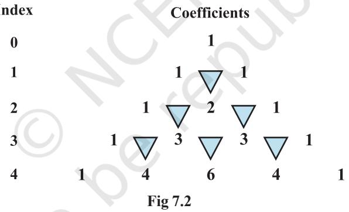
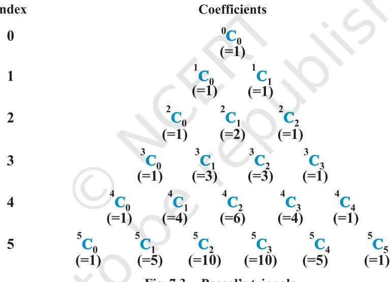

v*Mathematics is a most exact science and its conclusions are capable of absolute proofs.* **–** *C.P. STEINMETZ*v

# **7.1 Introduction**

126 MATHEMATICS

In earlier classes, we have learnt how to find the squares and cubes of binomials like *a* + *b* and *a* – *b*. Using them, we could evaluate the numerical values of numbers like (98)2 = (100 – 2)2 , (999)3 = (1000 – 1)3 , etc. However, for higher powers like (98)5 , (101)6 , etc., the calculations become difficult by using repeated multiplication. This difficulty was overcome by a theorem known as binomial theorem. It gives an easier way to expand (*a* + *b*) *n* , where *n* is an integer or a rational number. In this Chapter, we study binomial theorem for positive integral indices only.

# **7.2 Binomial Theorem for Positive Integral Indices**

**Blaise Pascal (1623-1662)**

4

Let us have a look at the following identities done earlier:

$$(a+\ b)^{0}=1a+b(a+\ b)^{1}=a+b(a+\ b)^{2}=a^{2}+2ab+b^{2}(a+\ b)^{3}=a^{3}+3a^{2}b+3ab^{2}+b^{3}(a+\ b)^{4}=(a+\ b)^{3}(a+\ b)=a^{4}+4a^{3}b+6a^{2}b^{2}+4ab^{3}+b^{4}$$

In these expansions, we observe that

- (i) The total number of terms in the expansion is one more than the index. For example, in the expansion of (*a + b*) 2 , number of terms is 3 whereas the index of (*a* + *b*) 2 is 2.
- (ii) Powers of the first quantity '*a*' go on decreasing by 1 whereas the powers of the second quantity '*b*' increase by 1, in the successive terms.
- (iii) In each term of the expansion, the sum of the indices of *a* and *b* is the same and is equal to the index of *a* + *b*.

**Fig 7.1**

We now arrange the coefficients in these expansions as follows (Fig 7.1):

Do we observe any pattern in this table that will help us to write the next row? Yes we do. It can be seen that the addition of 1's in the row for index 1 gives rise to 2 in the row for index 2. The addition of 1, 2 and 2, 1 in the row for index 2, gives rise to 3 and 3 in the row for index 3 and so on. Also, 1 is present at the beginning and at the end of each row. This can be continued till any index of our interest.

We can extend the pattern given in Fig 7.2 by writing a few more rows.

# **Pascal's Triangle**

The structure given in Fig 7.2 looks like a triangle with 1 at the top vertex and running down the two slanting sides. This array of numbers is known as *Pascal's triangle*, after the name of French mathematician Blaise Pascal. It is also known as *Meru Prastara* by Pingla.

Expansions for the higher powers of a binomial are also possible by using Pascal's triangle. Let us expand (2*x* + 3*y*) 5 by using Pascal's triangle. The row for index 5 is

1 5 10 10 5 1 Using this row and our observations (i), (ii) and (iii), we get (2*x* + 3*y*) 5 = (2*x*) 5 + 5(2*x*) 4 (3*y*) + 10(2*x*) 3 (3*y*) 2 +10 (2*x*) 2 (3*y*) 3 + 5(2*x*)(3*y*) 4 +(3*y*) 5 = 32*x* 5 + 240*x* 4y + 720*x* 3y 2 + 1080*x* 2*y* 3 + 810*xy*4 + 243*y* 5 .

Now, if we want to find the expansion of (2*x* + 3*y*) 12, we are first required to get the row for index 12. This can be done by writing all the rows of the Pascal's triangle till index 12. This is a slightly lengthy process. The process, as you observe, will become more difficult, if we need the expansions involving still larger powers.

We thus try to find a rule that will help us to find the expansion of the binomial for any power without writing all the rows of the Pascal's triangle, that come before the row of the desired index.

For this, we make use of the concept of combinations studied earlier to rewrite

the numbers in the Pascal's triangle. We know that ! C !( )! *n r n r n – r* = , 0 ≤ *r* ≤ *n* and *n* is a non-negative integer. Also, *n*C0 = 1 = *n*C*n* The Pascal's triangle can now be rewritten as (Fig 7.3)

Observing this pattern, we can now write the row of the Pascal's triangle for any index without writing the earlier rows. For example, for the index 7 the row would be

$${}^{7}\!{\bf C}_{0}\ \ ^{7}\!{\bf C}_{1}\ \ ^{7}\!{\bf C}_{2}\ \ ^{7}\!{\bf C}_{3}\ \ ^{7}\!{\bf C}_{4}\ \ ^{7}\!{\bf C}_{5}\ \ ^{7}\!{\bf C}_{6}\ \ ^{7}\!{\bf C}_{7}$$

Thus, using this row and the observations (i), (ii) and (iii), we have

$(a+b)^{7}={}^{7}{\rm C}_{0}\,a^{7}+7{\rm C}_{1}a^{6}b+{}^{7}{\rm C}_{2}a^{5}b^{2}+{}^{7}{\rm C}_{3}a^{4}b^{3}+7{\rm C}_{4}a^{3}b^{4}+{}^{7}{\rm C}_{5}a^{2}b^{5}+{}^{7}{\rm C}_{6}ab^{6}+{}^{7}{\rm C}_{7}b^{7}$

An expansion of a binomial to any positive integral index say *n* can now be visualised using these observations. We are now in a position to write the expansion of a binomial to any positive integral index.

...

*k* )

**7.2.1** *Binomial theorem for any positive integer n*,

$(a+b)^{n}={}^{n}{\rm C}_{0}a^{n}+{}^{n}{\rm C}_{1}a^{n-1}b+{}^{n}{\rm C}_{2}a^{n-2}\,b^{2}+...+{}^{n}{\rm C}_{n-1}a.b^{n-1}+{}^{n}{\rm C}_{n}b^{n}$

**Proof** The proof is obtained by applying principle of mathematical induction. Let the given statement be

> P(*n*) : (*a* + *b*) *n* = *n*C0 *a n* + *n*C1 *a n* – 1*b* + *n*C2 *a n* – 2*b* 2 + ...+ *n*C*n*–1*a*.*b n* – 1 + *n*C*n b n* For *n* = 1, we have P (1) : (*a* + *b*) 1 = 1C0 *a* 1 + 1C1 *b* 1 = *a* + *b*

Thus, P (1) is true.

Suppose P (*k*) is true for some positive integer *k*, i.e.

$(a+b)^{k}={}^{k}{\rm C}_{\theta}a^{k}+{}^{k}{\rm C}_{1}a^{k}-{}^{1}b+{}^{k}{\rm C}_{2}a^{k}-{}^{2}b^{2}+...+{}^{k}{\rm C}_{k}b^{k}$

We shall prove that P(*k* + 1) is also true, i.e.,

(*a* + *b*) *k* + 1 = *k* + 1C0 *a k* + 1 + *k* + 1C1 *a kb* + *k* + 1C2 *a k* – 1*b* 2 + ...+ *k* + 1C*k*+1 *b k* + 1 Now, (*a* + *b*) *k* + 1 = (*a* + *b*) (*a* + *b*) *k* = (*a* + *b*) (*k*C0 *a k* + *k*C1 *a k* – 1 *b* + *k*C2 *a k* – 2 *b* 2 +...+ *k*C*k* – 1 *abk* – 1 + *k*C*k b* [from (1)] = *k*C0 *a k* + 1 + *k*C1 *a kb* + *k*C2 *a k* – 1*b* 2 +...+ *k*C*k* – 1 *a* 2*b k* – 1 + *k*C*k abk* +*k*C0 *a kb* + *k*C1 *a k* – 1*b* 2 + *k*C2 *a k* – 2*b* 3+...+ *k*C*k*-1*abk* + *k*C*k b k* + 1 [by actual multiplication] = *k*C0 *a k* + 1 + (*k*C1 +  *k*C0 ) *akb* + (*k*C2 +  *k*C1 )*a k* – 1*b* 2 + ... + (*k*C*k* +  *k*C*k*–1) *abk* + *k*C*k b k* + 1 [grouping like terms]

(by using ${}^{k+1}$C${}_{0}$=1, ${}^{k}$C${}_{r}+{}^{k}$C${}_{r-1}$= ${}^{k+1}$C${}_{r}$ and ${}^{k}$C${}_{k}$ = 1= ${}^{k+1}$C${}_{k+1}$)

Thus, it has been proved that P (*k* + 1) is true whenever P(*k*) is true. Therefore, by principle of mathematical induction, P(*n*) is true for every positive integer *n*.

> We illustrate this theorem by expanding (*x* + 2)6 :

$$(x+2)^{6}={}^{6}{\rm C}_{0}x^{6}+{}^{6}{\rm C}_{1}x^{5}.2+{}^{6}{\rm C}_{2}x^{4}2^{2}+{}^{6}{\rm C}_{3}x^{3}.2^{3}+{}^{6}{\rm C}_{4}x^{2}.2^{4}+{}^{6}{\rm C}_{5}x.2^{5}+{}^{6}{\rm C}_{6}.2^{6}.$$
 
$$=x^{6}+12x^{5}+60x^{4}+160x^{3}+240x^{2}+192x+64$$

Thus (*x* + 2)6 = *x* 6 + 12*x* 5 + 60*x* 4 + 160*x* 3 + 240*x* 2 + 192*x* + 64.

### **Observations**

- **1.** The notation ∑= − *n k kkn k n a b* 0 C stands for
*n*C0 *a nb* 0 + *n*C1 *a n*–1*b* 1 + ...+ *n*Cr *a n–rb r* + ...+*n*C*n a n–nb n* , where *b* 0 = 1 = *an–n* . Hence the theorem can also be stated as

$$(a+b)^{n}=\sum_{k=0}^{n}\,{}^{n}\,\mathrm{C}_{k}\,\,a^{n-k}b^{k}\ .$$

- **2.** The coefficients *n*C*r* occuring in the binomial theorem are known as binomial coefficients.
- **3.** There are (*n*+1) terms in the expansion of (*a*+*b*) *n* , i.e., one more than the index.
- **4.** In the successive terms of the expansion the index of *a* goes on decreasing by unity. It is *n* in the first term, (*n*–1) in the second term, and so on ending with zero in the last term. At the same time the index of *b* increases by unity, starting with zero in the first term, 1 in the second and so on ending with *n* in the last term.
- **5.** In the expansion of (*a*+*b*) *n* , the sum of the indices of *a* and *b* is *n* + 0 = *n* in the first term, (*n* – 1) + 1 = *n* in the second term and so on 0 + *n* = *n* in the last term. Thus, it can be seen that the sum of the indices of *a* and *b* is *n* in every term of the expansion.

#### **7.2.2** *Some special cases* In the expansion of (*a* + *b*) *n* ,

- (i) Taking *a* = *x* and *b* = – *y*, we obtain
(*x* – *y)n =* [*x* + (–*y*)]*n* = *n*C0 *x n* + *n*C1 *x n* – 1(–*y*) + *n*C2 *x n*–2(–*y*) 2 + *n*C3 *x n*–3(–*y*) 3 + ... + *n*C*n* (–*y*) *n* = *n*C0 *x n* – *n*C1 *x n* – 1*y* + *n*C2 *x n* – 2*y* 2 – *n*C3 *x n* – 3*y* 3 + ... + (–1)*n n*C*n y n*

Thus (*x*–*y*) *n* = *n*C0 *x n* – *n*C1 *x n* – 1 *y* + *n*C2 *x n* – 2 *y* 2 + ... + (–1)*n n*C*n y n* Using this, we have (*x*–2*y*) 5 = 5C0 *x* 5 – 5C1 *x* 4 (2*y*) + 5C2 *x* 3 (2*y*) 2 – 5C3 *x* 2 (2*y*) 3 + 5C4 *x*(2*y*) 4 – 5C5 (2*y*) 5

$$=x^{5}-10x^{4}y+40x^{3}y^{2}-80x^{2}y^{3}+80x y^{4}-32y^{5}.$$

+ ... + *n*C*n*

*x n*

(ii) Taking *a* = 1, *b* = *x*, we obtain

*n* = *n*C0

+ *n*C1

$(1+x)^{n}={}^{n}{\rm C}_{0}(1)^{n}+{}^{n}{\rm C}_{1}(1)^{n-1}x+{}^{n}{\rm C}_{2}(1)^{n-2}x^{2}+...+{}^{n}{\rm C}_{n}x^{n}$  
  
$={}^{n}{\rm C}_{0}+{}^{n}{\rm C}_{1}x+{}^{n}{\rm C}_{2}x^{2}+{}^{n}{\rm C}_{3}x^{3}+...+{}^{n}{\rm C}_{n}x^{n}$

*x* + *n*C2 *x* 2 + *n*C3 *x* 3

Thus (1 + *x*)

In particular, for *x* = 1, we have

$$2^{n}={}^{n}\!\mathrm{C}_{0}+{}^{n}\!\mathrm{C}_{1}+{}^{n}\!\mathrm{C}_{2}+\,...\,+\,{}^{n}\!\mathrm{C}_{n}.$$

(iii) Taking *a* = 1, *b* = – *x,* we obtain

$$\begin{array}{r c l}{(1-x)^{n}}&{{=}}&{{{}^{n}\mathrm{C}_{0}-{}^{n}\mathrm{C}_{1}x+{}^{n}\mathrm{C}_{2}x^{2}-\ldots+(-1)^{n}{}^{n}\mathrm{C}_{n}x^{n}}\end{array}$$

In particular, for *x* = 1, we get

$0={}^{n}$C${}_{0}-{}^{n}$C${}_{1}+{}^{n}$C${}_{2}-...+(-1)^{n}$C${}_{n}$

**Example 1** Expand 4 2 3 *x x* + , *x* ≠ 0

**Solution** By using binomial theorem, we have

$$\begin{array}{ll}x^{2}+\frac{3}{x}&=4\mbox{C}_{0}(x^{2})^{4}+4\mbox{C}_{1}(x^{3})^{\cdot}\left(\frac{3}{x}\right)+4\mbox{C}_{2}(x^{2})^{2}\left(\frac{3}{x}\right)^{2}+4\mbox{C}_{3}(x^{2})\left(\frac{3}{x}\right)^{3}+4\mbox{C}_{4}\left(\frac{3}{x}\right)^{4}\\ &=x^{8}+4x^{6}\cdot\frac{3}{x}+6x^{4}\cdot\frac{9}{x^{2}}+4x^{2}\frac{27}{x^{3}}+\frac{81}{x^{4}}\\ &=x^{8}+12x^{5}+54x^{2}\frac{108}{x}+\frac{81}{x^{4}}\cdot\end{array}$$

**Example 2** Compute (98)5 .

**Solution** We express 98 as the sum or difference of two numbers whose powers are easier to calculate, and then use Binomial Theorem.

Write $98=100-2$  
  
Therefore, $(98)^{5}=(100-2)^{5}$  
  
$={}^{5}\mathrm{C}_{0}(100)^{5}-{}^{5}\mathrm{C}_{1}\ (100)^{4}.2+{}^{5}\mathrm{C}_{2}\ (100)^{2}2^{2}$  
  
${}^{5}\mathrm{C}_{1}^{5}\ (100)^{2}\ (2)^{3}+{}^{5}\mathrm{C}_{4}\ (100)\ (2)^{4}-{}^{5}\mathrm{C}_{5}\ (2)^{5}$  
  
$=10000000000-5\times100000000\times2+10\times1000000\times4-10\times100000$  
  
$\times8+5\times100\times16-32$

= 10040008000 – 1000800032 = 9039207968.

**Example 3** Which is larger (1.01)1000000 or 10,000?

**Solution** Splitting 1.01 and using binomial theorem to write the first few terms we have

 (1.01)1000000 = (1 + 0.01)1000000 = 1000000C0 + 1000000C1 (0.01) + other positive terms = 1 + 1000000 × 0.01 + other positive terms = 1 + 10000 + other positive terms > 10000 Hence (1.01)1000000 > 10000

**Example 4** Using binomial theorem, prove that 6*n*–5*n* always leaves remainder 1 when divided by 25.

**Solution** For two numbers *a* and *b* if we can find numbers *q* and *r* such that *a* = *bq* + *r*, then we say that *b* divides *a* with *q* as quotient and *r* as remainder. Thus, in order to show that 6*n* – 5*n* leaves remainder 1 when divided by 25, we prove that 6 *n* – 5*n* = 25*k* + 1, where *k* is some natural number.

+ ... + *n*C*n*

5 *n*

We have

$(1+a)^{n}={\rm C}_{0}+{\rm C}_{1}a+{\rm C}_{2}a^{2}+...+{\rm C}_{n}a^{n}$

5 + *n*C2 5 2

For *a* = 5, we get

(1 + 5)*n*

$\hat{1}$  
a. 

i.e. (6)${}^{n}=1+5n+5^{2}.^{n}$C${}_{2}+5^{3}.^{n}$C${}_{3}+...+5^{n}$

i.e. $6^{n}-5n=1+5^{2}$ (${}^{n}$C${}_{2}+{}^{n}$C${}_{3}+...+5^{n-2}$)

+ *n*C1

= *n*C0

or  
  

$$6^{n}-5n=1+25\ (^{n}C_{2}+5\.^{n}C_{3}+...+5^{n-2})$$

or 6

$6^{n}-5n=25k+1$ where $k={}^{n}{\rm C}_{2}+5\cdot{}^{n}{\rm C}_{3}+...+5^{n-2}$.  
  

This shows that when divided by 25, 6*n* – 5*n* leaves remainder 1.

# **EXERCISE 7.1**

Expand each of the expressions in Exercises 1 to 5.

1. $(1-2x)^{5}$ 2. $\left(\frac{2}{x}-\frac{x}{2}\right)^{5}$ 3. $(2x-3)^{6}$

$\left(\frac{x}{3}+\frac{1}{x}\right)^{5}$\(\left(x+\frac{1}{x}\right)^{6}\

Using binomial theorem, evaluate each of the following:

- **6.** (96)3 **7.** (102)5 **8.** (101)4
- **9.** (99)5
- **10.** Using Binomial Theorem, indicate which number is larger (1.1)10000 or 1000.

**11.** Find (*a* + *b*) 4 – (*a* – *b*) 4 . Hence, evaluate 4 + )23( – 4 )2–3( .

- **12.** Find (*x* + 1)6 + (*x* – 1)6 . Hence or otherwise evaluate ( 2 + 1)6 + ( 2 – 1)6 .
- **13.** Show that 9*n*+1 8*n* 9 is divisible by 64, whenever *n* is a positive integer.
- **14.** Prove that ∑= = *n r nr n r* 0 4C3 .

# *Miscellaneous Exercise on Chapter 7*

- **1.** If *a* and *b* are distinct integers, prove that *a b* is a factor of *a n* – *b n* , whenever *n* is a positive integer.
[**Hint** write *a n* = (*a* – *b* + *b*) *n* and expand]

  
  
## 2 Evaluate $\left(\sqrt{3}+\sqrt{2}\right)^{6}-\left(\sqrt{3}-\sqrt{2}\right)^{6}$

  
  
**3.** Find the value of $\left(a^{2}+\sqrt{a^{2}-1}\right)^{4}+\left(a^{2}-\sqrt{a^{2}-1}\right)^{4}$.  
  

- **4.** Find an approximation of (0.99)5 using the first three terms of its expansion.
Expand using Binomial Theorem $\left(1+\frac{x}{2}-\frac{2}{x}\right)^{4},x\neq0$.  
  

- **6.** Find the expansion of (3*x* 2 – 2*ax* + 3*a* 2 ) 3 using binomial theorem.
## *Summary*

- ÆThe expansion of a binomial for any positive integral *n* is given by Binomial Theorem, which is (*a* + *b*) *n* = *n*C0 *a n* + *n*C1 *a n* – 1*b* + *n*C2 *a n* – 2*b* 2 + ...+ *n*C*n* – 1*a*.*b n* – 1 + *n*C*n b n .*
- ÆThe coefficients of the expansions are arranged in an array. This array is called *Pascal's triangle*.

# *Historical Note*

The ancient Indian mathematicians knew about the coefficients in the expansions of (*x* + *y*) *n* , 0 ≤ *n* ≤ 7. The arrangement of these coefficients was in the form of a diagram called *Meru-Prastara*, provided by Pingla in his book *Chhanda shastra* (200B.C.). This triangular arrangement is also found in the work of Chinese mathematician Chu-shi-kie in 1303. The term binomial coefficients was first introduced by the German mathematician, Michael Stipel (1486-1567) in approximately 1544. Bombelli (1572) also gave the coefficients in the expansion of (*a* + *b*) *n* , for *n* = 1,2 ...,7 and Oughtred (1631) gave them for *n* = 1, 2,..., 10. The arithmetic triangle, popularly known as *Pascal's triangle* and similar to the *Meru-Prastara* of Pingla was constructed by the French mathematician Blaise Pascal (1623-1662) in 1665.

The present form of the binomial theorem for integral values of *n* appeared in *Trate du triange arithmetic*, written by Pascal and published posthumously in 1665.

**—** v **—**

