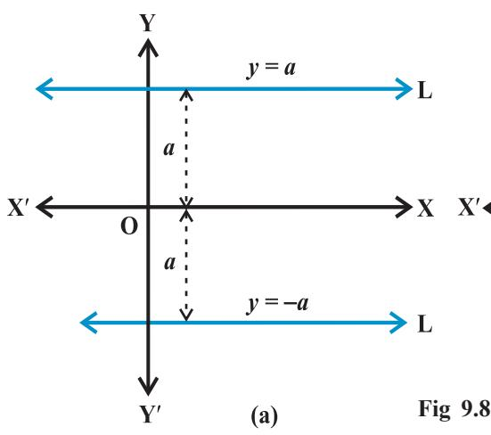

v*G eometry, as a logical system, is a means and even the most powerful means to make children feel the strength of the human spirit that is of their own spirit. – H. FREUDENTHAL*v

# **9.1 Introduction**

We are familiar with two-dimensional *coordinate geometry* from earlier classes. Mainly, it is a combination of *algebra* and *geometry*. A systematic study of geometry by the use of algebra was first carried out by celebrated French philosopher and mathematician René Descartes, in his book 'La Géométry, published in 1637. This book introduced the notion of the equation of a curve and related analytical methods into the study of geometry. The resulting combination of analysis and geometry is referred now as *analytical geometry.* In the earlier classes, we initiated the study of coordinate geometry, where we studied about coordinate axes, coordinate plane, plotting of points in a

plane, distance between two points, section formulae, etc. All these concepts are the basics of coordinate geometry.

Let us have a brief recall of coordinate geometry done in earlier classes. To recapitulate, the location of the points (6, – 4) and

(3, 0) in the XY-plane is shown in Fig 9.1.

We may note that the point (6, – 4) is at 6 units distance from the *y*-axis measured along the positive *x*-axis and at 4 units distance from the *x*-axis measured along the negative *y*-axis. Similarly, the point (3, 0) is at 3 units distance from the *y*-axis measured along the positive *x*-axis and has zero distance from the *x*-axis.

We also studied there following important formulae:

- **I.** Distance between the points P (*x*1, *y*1 ) and Q (*x*2 , *y*2 ) is

$$\mathrm{PQ}{=}{\sqrt{\left(x_{2}-x_{1}\right)^{2}+\left(y_{2}-y_{1}\right)^{2}}}$$

For example, distance between the points (6, – 4) and (3, 0) is

$\sqrt{(3-6)^{2}+(0+4)^{2}}=\sqrt{9+16}=5$ units.  
  

**II.** The coordinates of a point dividing the line segment joining the points (*x*1, *y*1 )

and $(x_{2},y_{2})$ internally, in the ratio $m$: $n$ are $\left(\frac{m\,x_{2}+n\,x_{1}}{m+n},\frac{m\,y_{2}+n\,y_{1}}{m+n}\right)$.  
  

For example, the coordinates of the point which divides the line segment joining

A (1, –3) and B (–3, 9) internally, in the ratio 1: 3 are given by 1 ( 3) 3 1 0 1 3 *. . x* − + = = +

$${\mathrm{~and~}}y={\frac{1.9+3.\left(-3\right)}{1+3}}=0.$$

**III.** In particular, if *m* = *n*, the coordinates of the mid-point of the line segment

joining the points $(x_{1},y_{1})$ and $(x_{2},y_{2})$ are $\left(\frac{x_{1}+x_{2}}{2},\frac{y_{1}+y_{2}}{2}\right)$.  
  

**IV.** Area of the triangle whose vertices are (*x*1, *y*1 ), (*x*2 , *y*2 ) and (*x*3 , *y*3 ) is

$$\left|\right.x_{1}(y_{2}-y_{3})+x_{2}(y_{3}-y_{1})+x_{3}(y_{1}-y_{2})\left|\right.$$

For example, the area of the triangle, whose vertices are (4, 4), (3, – 2) and (– 3, 16) is

.

$${\frac{1}{2}}\bigl|4(-2-16)+3(16-4)+(-3)(4+2)\bigr|={\frac{\bigl|}{2}}=27.$$

*Remark* If the area of the triangle ABC is zero, then three points A, B and C lie on a line, i.e., they are collinear.

In the this Chapter, we shall continue the study of coordinate geometry to study properties of the simplest geometric figure – *straight line.* Despite its simplicity, the line is a vital concept of geometry and enters into our daily experiences in numerous interesting and useful ways. Main focus is on representing the line algebraically, for which *slope* is most essential.

## **9.2 Slope of a Line**

A line in a coordinate plane forms two angles with the *x*-axis, which are supplementary.

The angle (say) θ made by the line *l* with positive direction of *x*-axis and measured anti clockwise is called the *inclination of the line*. Obviously 0° ≤ θ ≤ 180° (Fig 9.2).

We observe that lines parallel to *x*-axis, or coinciding with *x*-axis, have inclination of 0°. The inclination of a vertical line (parallel to or coinciding with *y*-axis) is 90°.

**Definition 1** If θ is the inclination of a line *l*, then tan θ is called the *slope* or *gradient* of the line *l*.

The slope of a line whose inclination is 90° is not defined.

The slope of a line is denoted by *m*.

Thus, *m* = tan θ, θ ≠ 90°

It may be observed that the slope of *x*-axis is zero and slope of *y*-axis is not defined.

**9.2.1** *Slope of a line when coordinates of any two points on the line are given* We know that a line is completely determined when we are given two points on it.

Hence, we proceed to find the slope of a line in terms of the coordinates of two points on the line.

Let P(*x* 1 , *y* 1 ) and Q(*x* 2 , *y* 2 ) be two points on non-vertical line *l* whose inclination is θ. Obviously, *x* 1 ≠ *x* 2 , otherwise the line will become perpendicular to *x*-axis and its slope will not be defined. The inclination of the line *l* may be acute or obtuse. Let us take these two cases.

Draw perpendicular QR to *x*-axis and PM perpendicular to RQ as shown in Figs. 9.3 (i) and (ii).

**Case 1** When angle θ is acute:

Therefore, slope of line *l* = *m* = tan θ.

But in $\Delta$MPQ, we have $\tan\theta$=$\frac{\text{MQ}}{\text{MP}}$=$\frac{y_{2}-y_{1}}{x_{2}-x_{1}}$. (2)

From equations (1) and (2), we have

$m=\tan\theta$  
  
$=\tan\left(\ 180^{\circ}-\angle\text{MPQ}\right)=-\tan\ \angle\text{MPQ}$  
  
$=-\frac{\text{MQ}}{\text{MP}}=-\frac{\text{y}_{2}-\text{y}_{1}}{\text{x}_{1}-\text{x}_{2}}=\frac{\text{y}_{2}-\text{y}_{1}}{\text{x}_{2}-\text{x}_{1}}$

Consequently, we see that in both the cases the slope *m* of the line through the points

.

$(x_{1},y_{1})$ and $(x_{2},y_{2})$ is given by $m=\frac{y_{2}-y_{1}}{x_{2}-x_{1}}$.  
  

**9.2.2** *Conditions for parallelism and perpendicularity of lines in terms of their slopes* In a coordinate plane, suppose that non-vertical *lines l*1 and *l*2 have slopes *m*1 *and m*2 *,* respectively. Let their inclinations be α and β, respectively.

**If the line** *l* **1 is parallel to** *l* **2** (Fig 9.4), then their inclinations are equal, i.e.,

$\alpha=\beta$, and hence, $\tan\alpha=\tan\beta$  
  
Therefore $m_{1}=m_{2}$, i.e., their slopes are equal. Conversely, if the slope of two lines $l_{1}$ and $l_{2}$ is same, i.e.,

is same, i.e.,

$$m_{\mathrm{{}_{1}}}=m_{\mathrm{{}_{2}}}.$$

Then tan α = tan β.

By the property of tangent function (between 0° and 180°), α = β. Therefore, the lines are parallel.

*Hence, two non vertical lines l*1 *and l*2  *are parallel if and only if their slopes are equal.*

**If the lines** *l***1 and** *l* **2 are perpendicular** (Fig 9.5), then β = α + 90°*.* Therefore, tan β = tan (α + 90°)

*m*2

= – 1.

$$=-\cot\alpha=-{\frac{1}{\tan\alpha}}$$

i.e., *m*2

Conversely, if *m*1 *m*2 = – 1, i.e., tan α tan β = – 1. Then tan α = – cot β = tan (β + 90°) or tan (β – 90°) Therefore, α and β differ by 90°.

− or *m*1

1

1 *m*

Thus, lines *l*1 and *l* 2 are perpendicular to each other.

Hence, *two non-vertical lines are perpendicular to each other if and only if their slopes are negative reciprocals of each other,*

= – 1

$$\mathrm{i.e.,}\qquad\qquad m_{2}=-\,\frac{1}{m_{1}}\,\,\mathrm{or,}\,\,\,m_{1}\,\,m_{2}$$

=

Let us consider the following example.

**Example 1** Find the slope of the lines:

- (a) Passing through the points (3, 2) and (–1, 4),
- (b) Passing through the points (3, 2) and (7, 2),
- (c) Passing through the points (3, 2) and (3, 4),
- (d) Making inclination of 60° with the positive direction of *x*-axis.

**Solution** (a) The slope of the line through (3, – 2) and (– 1, 4) is

$$m=\frac{4-(-2)}{-1-3}=\frac{6}{-4}=-\frac{3}{2}\ .$$

- (b) The slope of the line through the points (3, 2) and (7, 2) is

$$m=\frac{-2-(-2)}{7-3}=\frac{0}{4}=0\,.$$

- (c) The slope of the line through the points (3, 2) and (3, 4) is
$m=\frac{4-(-2)}{3-3}=\frac{6}{0}$, which is not defined.  
  

(d) Here inclination of the line α = 60°. Therefore, slope of the line is *m* = tan 60° = 3 .

**9.2.3** *Angle between two lines* When we think about more than one line in a plane, then we find that these lines are either intersecting or parallel. Here we will discuss the angle between two lines in terms of their slopes.

Let L1 and L2 be two non-vertical lines with slopes *m*1 and *m*2 ,respectively. If α1 and α2 are the inclinations of lines L1 and L2 , respectively. Then

$m_{1}=\tan a_{1}$ and $m_{2}=\tan a_{2}$

We know that when two lines intersect each other, they make two pairs of vertically opposite angles such that sum of any two adjacent angles is 180°. Let θ and φ be the adjacent angles between the lines L1 and L2 (Fig 9.6). Then

$\theta=\alpha_{2}-\alpha_{1}$ and $\alpha_{1},\alpha_{2}+90^{\circ}$.  
  

Therefore tan θ = tan (α2 – α1 ) 2 1 2 1 1 2 1 2 tan tan 1 tan tan 1 *m m m m* α α α α − − = = + + (as 1 + *m*1*m*2 ≠ 0)

and φ = 180° – θ so that

$\tan\ \phi=\tan\ (180^{\circ}-\theta)=-\tan\ \theta=-\frac{m_{2}-m_{1}}{1+m_{1}m_{2}}\,,$ as $1\ +m_{1}m_{2}\neq0$

Now, there arise two cases:

... (1)

*,*

**Case I** If 2 1 1 1 2 *m m– + m m* is positive, then tan θ will be positive and tan φ will be negative,

which means θ will be acute and φ will be obtuse.

**Case II** If 2 1 1 1 2 *m m– + m m* is negative, then tan θ will be negative and tan φ will be positive,

which means that θ will be obtuse and φ will be acute.

Thus, the acute angle (say θ) between lines L1 and L2 with slopes *m*1 and *m*2 , respectively, is given by

$$\tan\theta=\left|\begin{array}{c}{{m_{2}-m_{1}}}\\ {{1+m_{1}m_{2}}}\end{array}\right|,\ \ \mbox{as}\ \ \ 1+m_{1}m_{2}\neq0$$

The obtuse angle (say φ) can be found by using φ =1800 – θ*.*

**Example 2** If the angle between two lines is π 4 and slope of one of the lines is 1 2 , find

the slope of the other line.

**Solution** We know that the acute angle θ between two lines with slopes *m*1 and *m*2

is given by  
  

$$\tan\theta=\left|\begin{array}{c}\frac{m_{2}-m_{1}}{1+m_{1}m_{2}}\\ \end{array}\right|$$
... (1)  
  
Let $m_{1}=\frac{1}{2}$, $m_{2}=m$ and $\dot{\theta}=\frac{\pi}{4}$.  
  

Now, putting these values in (1), we get

$$\tan\frac{\pi}{4}=\left|\begin{array}{c}m-\frac{1}{2}\\ 1+\frac{1}{2}m\end{array}\right|\quad\mbox{or}\;\;1=\left|\begin{array}{c}m-\frac{1}{2}\\ 1+\frac{1}{2}m\end{array}\right|$$
  
  
which gives  
  

$$\frac{m-\frac{1}{2}}{1+\frac{1}{2}}=1\quad\mbox{or}\quad\frac{m-\frac{1}{2}}{1+\frac{1}{2}}=-1.$$

**Example 3** Line through the points (–2, 6) and (4, 8) is perpendicular to the line through the points (8, 12) and (*x*, 24). Find the value of *x*.

**Solution** Slope of the line through the points (– 2, 6) and (4, 8) is

  
  
## 1 Introduction  
  
The _Fractional State_ of the Universe is a very important concept in the field theory. The _Fractional State_ of the Universe is a very important concept in the field theory.  
  

Slope of the line through the points (8, 12) and (*x*, 24) is

* [16] M. C.  
  

Since two lines are perpendicular,

*m*1 *m*2 = –1, which gives

$\begin{array}{c}\mbox{\rm EXERCISE}\ 9.1\end{array}$

- **1.** Draw a quadrilateral in the Cartesian plane, whose vertices are (– 4, 5), (0, 7), (5, – 5) and (– 4, –2). Also, find its area.
- **2.** The base of an equilateral triangle with side 2*a* lies along the *y*-axis such that the mid-point of the base is at the origin. Find vertices of the triangle.
- **3.** Find the distance between P (*x*1 *, y*1 ) and Q (*x*2 *, y*2 ) when : (i) PQ is parallel to the *y*-axis, (ii) PQ is parallel to the *x*-axis.
- **4.** Find a point on the *x*-axis, which is equidistant from the points (7, 6) and (3, 4).
- **5.** Find the slope of a line, which passes through the origin, and the mid-point of the line segment joining the points P (0, *–* 4) and B (8, 0).
- **6.** Without using the Pythagoras theorem, show that the points (4, 4), (3, 5) and (*–*1, *–*1) are the vertices of a right angled triangle.
- **7.** Find the slope of the line, which makes an angle of 30° with the positive direction of *y*-axis measured anticlockwise.
- **8.** Without using distance formula, show that points (*–* 2, *–* 1), (4, 0), (3, 3) and (*–*3, 2) are the vertices of a parallelogram.
- **9.** Find the angle between the *x-*axis and the line joining the points (3,*–*1) and (4,*–*2).
- **10.** The slope of a line is double of the slope of another line. If tangent of the angle 1

between them is 3 , find the slopes of the lines.

- **11.** A line passes through (*x*1 *, y*1 ) and (*h, k*). If slope of the line is *m*, show that *k – y*1 = *m* (*h – x*1 ).
## **9.3 Various Forms of the Equation of a Line**

We know that every line in a plane contains infinitely many points on it. This relationship between line and points leads us to find the solution of the following problem:

How can we say that a given point lies on the given line? Its answer may be that for a given line we should have a definite condition on the points lying on the line. Suppose P (*x, y*) is an arbitrary point in the XY-plane and L is the given line. For the equation of L, we wish to construct a *statement* or *condition* for the point P that is true, when P is on L, otherwise false. Of course the statement is merely an algebraic equation involving the variables *x* and *y*. Now, we will discuss the equation of a line under different conditions.

**9.3.1** *Horizontal and vertical lines* If a horizontal line L is at a distance *a* from the *x*axis then ordinate of every point lying on the line is either *a* or – *a* [Fig 9.8 (a)]*.* Therefore, equation of the line L is either *y* = *a* or *y =* – *a*. Choice of sign will depend upon the position of the line according as the line is above or below the *y*-axis. Similarly, the equation of a vertical line at a distance *b* from the *y*-axis is either *x* = *b* or *x* = – *b* [Fig 9.8(b)].

**Example 4** Find the equations of the lines parallel to axes and passing through (– 2, 3).

**Solution** Position of the lines is shown in the Fig 9.9. The *y-*coordinate of every point on the line parallel to *x-*axis is 3, therefore, equation of the line parallel to*x-*axis and passing through (– 2, 3) is *y* = 3. Similarly, equation of the line parallel to *y*-axis and passing through (– 2, 3) is *x* = – 2.

**9.3.2** *Point-slope form* Suppose that P0 (*x*0 *, y*0 ) is a fixed point on a non-vertical line L, whose slope is *m*. Let P (*x, y*) be an arbitrary point on L (Fig 9.10).

Then, by the definition, the slope of L is given by

$m=\frac{V-V_{0}}{x-x_{0}}$, i.e., $y-y_{0}=m(x-x_{0})$

Since the point P0 (*x*0 *, y*0 ) along with all points (*x, y*) on L satisfies (1) and no other point in the plane satisfies (1). Equation (1) is indeed the equation for the given line L.

Thus, the point (*x, y*) lies on the line with slope *m* through the fixed point (*x*0 *, y*0 ), if and only if, its coordinates satisfy the equation

$$y-y_{0}=m\ (x-x_{0})$$

**Example 5** Find the equation of the line through (– 2, 3) with slope – 4.

**Solution** Here *m* = – 4 and given point (*x*0 *, y*0 ) is (– 2, 3).

By slope-intercept form formula (1) above, equation of the given line is

*y* – 3 = – 4 (*x* + 2) or 4*x* + *y* + 5 = 0, which is the required equation.

**9.3.3** *Two-point form* Let the line L passes through two given points P1 (*x*1 *, y*1 ) and P2 (*x*2 *, y*2 ). Let P (*x, y*) be a general point on L (Fig 9.11).

The three points P1 , P2 and P are collinear, therefore, we have slope of P1 P = slope of P1 P2

i.e., $\frac{y-y_{1}}{x-x_{1}}=\frac{y_{2}-y_{1}}{x_{2}-x_{1}}$, or $y-y_{1}=\frac{y_{2}-y_{1}}{x_{2}-x_{1}}(x-x_{1})$.  
  

Thus, equation of the line passing through the points (*x*1 *, y*1 ) and (*x*2 *, y*2 ) is given by

$$y-y_{1}=\frac{y_{2}-y_{1}}{x_{2}-x_{1}}(x-x_{1})\tag{2}$$

**Example 6** Write the equation of the line through the points (1, –1) and (3, 5).

**Solution** Here *x*1 = 1, *y*1 = – 1, *x*2 = 3 and *y*2 = 5. Using two-point form (2) above for the equation of the line, we have

$$y-\left(-1\right)=\frac{5-\left(-1\right)}{3-1}\left(x-1\right)$$

or –3*x* + *y* + 4 = 0, which is the required equation.

**9.3.4** *Slope-intercept form* Sometimes a line is known to us with its slope and an intercept on one of the axes. We will now find equations of such lines.

**Case I** Suppose a line L with slope *m* cuts the *y*-axis at a distance *c* from the origin (Fig 9.12). The distance *c* is called the *yintercept* of the line L. Obviously, coordinates of the point where the line meet the *y*-axis are (0, *c*). Thus, L has slope *m* and passes through a fixed point (0, *c*). Therefore, by point-slope form, the equation of L is

$$y-c=m\left(x-0\right)\ \ \mathrm{or}\ \ y=m x+c$$

Thus, the point (*x, y*) on the line with slope *m* and *y*-intercept *c* lies on the line if and only if

*y = mx +c ..*.(3)

Note that the value of *c* will be positive or negative according as the intercept is made on the positive or negative side of the *y*-axis, respectively.

**Case II** Suppose line L with slope *m* makes *x-*intercept *d*. Then equation of L is *y = m(x – d)* ... (4)

Students may derive this equation themselves by the same method as in Case I.

**Example 7** Write the equation of the lines for which tan θ = 2 1 , where θ is the

inclination of the line and (i) *y-*intercept is 3 2 *–* (ii) *x*-intercept is 4.

**Solution** (i) Here, slope of the line is *m* = tan θ = 2 1 and *y* - intercept *c* = – 2 3 .

Therefore, by slope-intercept form (3) above, the equation of the line is

$$y=\frac{1}{2}x-\frac{3}{2}\,\,\,\mathrm{or}\,\,\,2y-x+3=0\,,$$

which is the required equation.

(ii) Here, we have $m=\tan\theta=\frac{1}{2}$ and $d=4$.  
  

Therefore, by slope-intercept form (4) above, the equation of the line is

$$y=\frac{1}{2}(x-4)\ \mathrm{or}\ 2y-x+4=0\,,$$

which is the required equation.

**9.3.5** *Intercept - form* Suppose a line L makes *x*-intercept *a* and *y*-intercept *b* on the axes. Obviously L meets *x*-axis at the point (*a*, 0) and *y*-axis at the point (0, *b*) (Fig .9.13). By two-point form of the equation of the line, we have 0 0 ( ) or 0 *b y x a ay bx ab a* − − = − = − + − , i.e., =+ 1 *b y a x* . Thus, equation of the line making intercepts *a* and *b* on *x-*and *y*-axis, respectively, is =+ 1 *b y a x* ... (5) **Fig 9.13**

**Example 8** Find the equation of the line, which makes intercepts –3 and 2 on the *x-* and *y*-axes respectively.

**Solution** Here *a* = –3 and *b* = 2. By intercept form (5) above, equation of the line is

$\begin{array}{c}\includegraphics[height=36.135pt]{Fig1}\end{array}$

Any equation of the form A*x +* B*y +* C *=* 0, where A and B are not zero simultaneously is called *general linear equation* or *general equation of a line*.

# **EXERCISE 9.2**

In Exercises 1 to 8, find the equation of the line which satisfy the given conditions:

- **1.** Write the equations for the *x*-and *y*-axes.
- **2.** Passing through the point (– 4, 3) with slope 2 1 .
- **3.** Passing through (0, 0) with slope *m*.
- **4.** Passing through ( 32,2 )and inclined with the *x*-axis at an angle of 75o .
- **5.** Intersecting the *x*-axis at a distance of 3 units to the left of origin with slope –2.
- **6.** Intersecting the *y*-axis at a distance of 2 units above the origin and making an angle of 30o with positive direction of the *x*-axis.

- **7.** Passing through the points (–1, 1) and (2, 4).
- **8.** The vertices of ∆ PQR are P (2, 1), Q (–2, 3) and R (4, 5). Find equation of the median through the vertex R.
- **9.** Find the equation of the line passing through (–3, 5) and perpendicular to the line through the points (2, 5) and (–3, 6).
- **10.** A line perpendicular to the line segment joining the points (1, 0) and (2, 3) divides it in the ratio 1: *n*. Find the equation of the line.
- **11.** Find the equation of a line that cuts off equal intercepts on the coordinate axes and passes through the point (2, 3).
- **12.** Find equation of the line passing through the point (2, 2) and cutting off intercepts on the axes whose sum is 9.
- **13.** Find equation of the line through the point (0, 2) making an angle 2π 3 with the

positive *x*-axis. Also, find the equation of line parallel to it and crossing the *y*-axis at a distance of 2 units below the origin.

- **14.** The perpendicular from the origin to a line meets it at the point (–2, 9), find the equation of the line.
- **15.** The length L (in centimetre) of a copper rod is a linear function of its Celsius temperature C. In an experiment, if L = 124.942 when C = 20 and L= 125.134 when C = 110, express L in terms of C.
- **16.** The owner of a milk store finds that, he can sell 980 litres of milk each week at Rs 14/litre and 1220 litres of milk each week at Rs 16/litre. Assuming a linear relationship between selling price and demand, how many litres could he sell weekly at Rs 17/litre?
- **17.** P (*a*, *b*) is the mid-point of a line segment between axes. Show that equation

of the line is $\frac{\pi}{2}$.  
  

- **18.** Point R (*h*, *k*) divides a line segment between the axes in the ratio 1: 2. Find equation of the line.
- **19.** By using the concept of equation of a line, prove that the three points (3, 0), (– 2, – 2) and (8, 2) are collinear.

# **9.4 Distance of a Point From a Line**

The distance of a point from a line is the length of the perpendicular drawn from the point to the line. Let L : A*x* + By + C *=* 0 be a line, whose distance from the point P (*x*1 , *y*1 ) is *d.* Draw a perpendicular PM from the point P to the line L (Fig 9.14). If the

line meets the *x-*and *y-*axes at the points Q and R, respectively. Then, coordinates of the points are Q C 0 A *,* − and R C 0 B *,* − . Thus, the area of the triangle PQR is given by

area (APQR) = $\frac{1}{2}$PM.QR$\frac{\cdot}{\cdot}$which gives PM = $\frac{2}{\text{area(APQR)}}$... (1)  
  
Also, area (APQR) = $\frac{1}{2}$[x$\frac{\cdot}{\text{B}}$) + (-$\frac{\cdot}{\text{C}}$) (-$\frac{\cdot}{\text{B}}$ - $y_{1}$) + 0 ($y_{1}-0$)]  
  
or 2 area (APQR) = $\frac{\cdot}{\text{AB}}$[x${}_{1}$+By${}_{1}$+C], and 

$\rm{QR}=\sqrt{\left(0+\frac{C}{A}\right)^{2}+\left(\frac{C}{B}\right.}-\left.0\right)^{2}=\left|\frac{C}{AB}\right|\sqrt{A^{2}+B^{2}}$

Substituting the values of area (∆PQR) and QR in (1), we get

$$\mathrm{PM}={\frac{\left|\begin{array}{l}{\mathrm{A}x_{1}+\mathrm{B}y_{1}+\mathrm{C}}\end{array}\right|}{\sqrt{\mathrm{A}^{2}+\mathrm{B}^{2}}}}$$

or

$$d={\frac{\left\lfloor\mathbf{\Delta}X_{1}+\mathbf{B}y_{1}+\mathbf{C}\right\rfloor}{\sqrt{\mathbf{A}^{2}+\mathbf{B}^{2}}}}\,.$$

Thus, the perpendicular distance (*d*) of a line A*x +* B*y+* C *=* 0 from a point (*x*1 , *y*1 ) is given by

$$d={\frac{\left\lfloor\mathrm{\bf~A}x_{1}+\mathrm{\bf~B}y_{1}+\mathrm{\bf~C}\right\rfloor}{\sqrt{\mathrm{\bf~A}^{2}+\mathrm{\bf~B}^{2}}}}\,.$$

**9.4.1** *Distance between two*

*parallel lines* We know that slopes of two parallel lines are equal. Therefore, two parallel lines can be taken in the form

> *y* = *mx* + *c*1 ... (1)

and *y* = *mx* + *c* 2 ... (2)

Line (1) will intersect *x-*axis at the point

$\left(\frac{C_{1}}{m},\ 0\right)$as shown in Fig 9.15.  
  

**Fig 9.15**

Distance between two lines is equal to the length of the perpendicular from point A to line (2). Therefore, distance between the lines (1) and (2) is

$\left(-m\right)\left(\frac{c_{1}}{m}\right)+\left(-c_{2}\right)$  
  
$\left(\frac{c_{1}}{m}\right)+\left(-c_{2}\right)$  

Thus, the distance *d* between two parallel lines 1 *y mx c* = + and 2 *y mx c* = + is given by

$$d{=}\frac{\left\lfloor\ c_{1}-c_{2}\ \right\rfloor}{\sqrt{\ 1+m^{2}\ }}\ .$$

If lines are given in general form, i.e., A*x* + B*y* + C1 = 0 and A*x* + B*y* + C2 = 0, then above formula will take the form 1 2 2 2 C C A B *d* − = +

Students can derive it themselves.

**Example 9** Find the distance of the point (3, – 5) from the line 3*x* – 4*y* –26 = 0. **Solution** Given line is 3*x* – 4*y* –26 = 0 ... (1)

Comparing (1) with general equation of line A*x* + B*y* + C = 0, we get

$$\mathrm{A=3,\,B=-\,4\,\,and\,\,C=-\,26.}$$

Given point is (*x*1 , *y*1 ) = (3, –5). The distance of the given point from given line is

$$d=\frac{\left|\begin{array}{c}\text{Ax}_{1}+\text{By}_{1}+\text{C}\\ \hline\end{array}\right|}{\sqrt{\text{A}^{2}+\text{B}^{2}}}=\frac{\left|\begin{array}{c}3.3+(-4)(-5)-26\\ \hline\end{array}\right|}{\sqrt{\text{3}^{2}+\left(-4\right)^{2}}}=\frac{3}{5}.$$

**Example 10** Find the distance between the parallel lines 3*x* – 4*y* +7 = 0 and

$$3x-4y+5=0$$

**Solution** Here A = 3, B = –4, C1 = 7 and C2 = 5. Therefore, the required distance is

* [16] M. C. C.  
  

.

**EXERCISE 9.3**

- **1.** Reduce the following equations into slope intercept form and find their slopes and the y - intercepts.
(i) *x* + 7*y* = 0, (ii) 6*x* + 3*y* – 5 = 0, (iii) *y* = 0.

- **2.** Reduce the following equations into intercept form and find their intercepts on the axes.
(i) 3*x* + 2*y* – 12 = 0, (ii) 4*x* – 3*y* = 6, (iii) 3*y* + 2 = 0.

- **3.** Find the distance of the point (–1, 1) from the line 12(*x* + 6) = 5(*y* 2).
- **4.** Find the points on the *x*-axis, whose distances from the line 1 3 4 *x y* + = are 4 units.
- **5.** Find the distance between parallel lines (i) 15*x* + 8*y* – 34 = 0 and 15*x* + 8*y* + 31 = 0 (ii) *l* (*x* + *y*) + *p* = 0 and *l* (*x* + *y*) – *r* = 0.
- **6.** Find equation of the line parallel to the line 3 4 2 0 *x y* − + = and passing through the point (–2, 3).
- **7.** Find equation of the line perpendicular to the line *x* 7*y* + 5 = 0 and having *x* intercept 3.
- **8.** Find angles between the lines *yxyx* =+=+ .13and13
- **9.** The line through the points (*h*, 3) and (4, 1) intersects the line 7 9 19 0 *x y .* − − = at right angle. Find the value of *h*.

- **10.** Prove that the line through the point (*x*1 , *y*1 ) and parallel to the line A*x +* B*y +* C = 0 is A (*x –x*1 ) *+* B (*y – y*1 ) = 0.
- **11.** Two lines passing through the point (2, 3) intersects each other at an angle of 60o . If slope of one line is 2, find equation of the other line.
- **12.** Find the equation of the right bisector of the line segment joining the points (3, 4) and (*–*1, 2).
- **13.** Find the coordinates of the foot of perpendicular from the point (*–*1, 3) to the line 3*x* – 4*y* – 16 = 0.
- **14.** The perpendicular from the origin to the line *y = mx + c* meets it at the point (*–*1, 2). Find the values of *m* and *c*.
- **15.** If *p* and *q* are the lengths of perpendiculars from the origin to the lines − = *kyx* θ2cosθsinθcos and *x* sec θ + *y* cosec θ = *k*, respectively, prove that *p* 2 + 4*q* 2 = *k* 2 .
- **16.** In the triangle ABC with vertices A (2, 3), B (4, *–*1) and C (1, 2), find the equation and length of altitude from the vertex A.
- **17.** If *p* is the length of perpendicular from the origin to the line whose intercepts on

the axes are *a* and *b*, then show that . 111 2 22 *p ba* +=

## *Miscellaneous Examples*

**Example 11** If the lines 2 3 0 5 3 0 *x y , x ky* + − = + − = and 3 2 0 *x y* − − = are concurrent, find the value of *k*.

**Solution** Three lines are said to be concurrent, if they pass through a common point, i.e., point of intersection of any two lines lies on the third line. Here given lines are

$$2x+y=3=0^{7}$$

$$\begin{array}{l}\mbox{\chi}+\mbox{\chi}-3=0\\ \end{array}$$

$$\left(\begin{array}{cccc}3x-y-2=0&\end{array}\right)$$

Solving (1) and (3) by cross-multiplication method, we get

$${\frac{x}{-2-3}}={\frac{y}{-9+4}}={\frac{1}{-2-3}}\quad{\mathrm{or}}\quad x=1,\;y=1\;.$$

Therefore, the point of intersection of two lines is (1, 1). Since above three lines are concurrent, the point (1, 1) will satisfy equation (2) so that

$$5.1+k\;.1-3=0{\mathrm{~or~}}k=-\;2.$$

**Example 12** Find the distance of the line 4*x – y =* 0 from the point P (4, 1) measured along the line making an angle of 135° with the positive *x-*axis.

**Solution** Given line is 4*x – y =* 0 ... (1) In order to find the distance of the line (1) from the point P (4, 1) along another line, we have to find the point of intersection of both the lines. For this purpose, we will first find the equation of the second line (Fig 9.16). Slope of second line is tan 135° = *–*1. Equation of the line with slope – 1 through the point P (4, 1) is *y* – 1 = – 1 (*x* – 4) or *x* + *y* – 5 = 0 ... (2) **Fig 9.16 (1, 4)**

Solving (1) and (2), we get *x* = 1 and *y* = 4 so that point of intersection of the two lines is Q (1, 4). Now, distance of line (1) from the point P (4, 1) along the line (2) = the distance between the points P (4, 1) and Q (1, 4).

$\sqrt{(1-4)^{2}+(4-1)^{2}}=3\sqrt{2}$ units.  
  

**Example 13** Assuming that straight lines work as the plane mirror for a point, find the image of the point (1, 2) in the line *x –* 3*y +* 4 = 0.

**Solution** Let Q (*h*, *k*) is the image of the point P (1, 2) in the line

$x-3y+4=0$

Therefore, the line (1) is the perpendicular bisector of line segment PQ (Fig 9.17).

Hence Slope of line PQ = 1 Slope of line 3 4 0 *x y* − − + = ,

so that $\frac{k-2}{h-1}=\frac{-1}{1}$ or $3h+k=5$... (2)

and the mid-point of PQ, i.e., point ++ 2 2 , 2 1 *kh* will satisfy the equation (1) so that

$$\frac{h+1}{2}-3\Bigg{(}\frac{k+2}{2}\Bigg{)}+4=0\,\,\,\mbox{or}\,\,\,h-3k=-3\tag{3}$$

Solving (2) and (3), we get *h* = 5 6 and *k* = 5 7 .

Hence, the image of the point (1, 2) in the line (1) is 6 7 5 5 *,* .

**Example 14** Show that the area of the triangle formed by the lines

$y=m_{1}x+c_{1}$, $y=m_{2}x+c_{2}$, and $x=0$ is $\frac{\left(c_{1}-c_{2}\right)^{2}}{2\left|m_{1}-m_{2}\right|}$.  
  

**Solution** Given lines are

1

*y* = *m*1 *x* + *c*1 ... (1) *y* = *m*2 *x* + *c* 2 ... (2) *x* = 0 ... (3)

We know that line *y = mx + c* meets the line *x* = 0 (*y*-axis) at the point (0, *c*). Therefore, two vertices of the triangle formed by lines (1) to (3) are P (0, *c* ) and Q (0, *c* ) (Fig 9.18).

Third vertex can be obtained by solving equations (1) and (2). Solving (1) and (2), we get

2

**Fig 9.18**

$$x=\frac{\left(c_{2}-c_{1}\right)}{\left(m_{1}-m_{2}\right)}\ \ \ \text{and}\ y=\frac{\left(m_{1}c_{2}-m_{2}c_{1}\right)}{\left(m_{1}-m_{2}\right)}$$
  
  
Therefore, third vertex of the triangle is $\text{R}\left(\frac{\left(c_{2}-c_{1}\right)}{\left(m_{1}-m_{2}\right)}\,\ \frac{\left(m_{1}c_{2}-m_{2}c_{1}\right)}{\left(m_{1}-m_{2}\right)}\right)$.  
  

Now, the area of the triangle is

$$=\frac{1}{2}\Bigg{|}\ 0\ \left(\frac{m_{1}c_{2}-m_{2}c_{1}}{m_{1}-m_{2}}-c_{2}\right)+\frac{c_{2}-c_{1}}{m_{1}-m_{2}}\big{(}c_{2}-c_{1}\big{)}+0\ \left(c_{1}-\frac{m_{1}c_{2}-m_{2}c_{1}}{m_{1}-m_{2}}\right)\Bigg{|}=\frac{\left(c_{2}-c_{1}\right)^{2}}{2\Big{|}m_{1}-m_{2}\Big{|}}$$

**Example 15** A line is such that its segment between the lines

5*x* – *y* + 4 = 0 and 3*x* + 4*y* – 4 = 0 is bisected at the point (1, 5). Obtain its equation.

**Solution** Given lines are

$\begin{array}{l}\mbox{\rm S}x-y+4=0\\ \mbox{\rm S}x+4y-4=0\end{array}$

Let the required line intersects the lines (1) and (2) at the points, (α1 , β1 ) and (α2 , β2 ), respectively (Fig 9.19). Therefore

$$\begin{array}{l}{{5\alpha_{1}-\beta_{1}+4=0\mathrm{~and~}}}\\ {{3\;\alpha_{2}+4\;\beta_{2}-4\,{\overset{\rightharpoonup}{=}}\,0}}\end{array}$$

or

or $\beta_{1}=5a_{1}+4$ and $\beta_{2}=4-3a_{2}$

We are given that the mid point of the segment of the required line between (α1 , β1 ) and (α2 , β2 ) is (1, 5). Therefore **Fig 9.19**

$$\alpha_{1}+\alpha_{2}=2\ \ \text{and}\ \ \frac{5\alpha_{1}+4+\frac{4-3\alpha_{2}}{4}}{2}=5,$$
  
  
or $\alpha_{1}+\alpha_{2}=2$ and $20\alpha_{1}-3\alpha_{2}=20$... (3)

Solving equations in (3) for α1 and α2 , we get

$\alpha_{1}=\frac{26}{23}$ and $\alpha_{2}=\frac{20}{23}$ and hence, $\beta_{1}=5.\frac{26}{23}+4=\frac{222}{23}$.  
  

Equation of the required line passing through (1, 5) and (α1 , β1 ) is

$$y-5={\frac{\beta_{1}-5}{a_{1}-1}}(x-1)\,{\mathrm{or}}\,\,\,y-5={\frac{\frac{222}{23}-5}{\frac{26}{23}-1}}(x-1)$$

or 107*x* – 3*y* – 92 = 0,

which is the equation of required line.

**Example 16** Show that the path of a moving point such that its distances from two lines 3*x* – 2*y* = 5 and 3*x* + 2*y* = 5 are equal is a straight line.

**Solution** Given lines are

$$3x-2y=5$$
  
  
and  
  

$$3x+2y=5$$
  
  
... (1)  
  
... (2)

Let (*h, k*) is any point, whose distances from the lines (1) and (2) are equal. Therefore

$$\frac{|3h-2k-5|}{\sqrt{9+4}}=\frac{|3h+2k-5|}{\sqrt{9+4}}\text{or}|3h-2k-5|=|3h+2k-5|\,,$$

which gives 3*h* – 2*k* – 5 = 3*h* + 2*k* – 5 or – (3*h* – 2*k* – 5) = 3*h* + 2*k* – 5.

Solving these two relations we get *k* = 0 or *h* = 3 5 . Thus, the point (*h*, *k*) satisfies the

equations *y* = 0 or *x* = 3 5 , which represent straight lines. Hence, path of the point equidistant from the lines (1) and (2) is a straight line.

## *Miscellaneous Exercise on Chapter 9*

- **1.** Find the values of *k* for which the line (*k–*3) *x –* (4 *– k* 2 ) *y* + *k* 2 –7*k* + 6 = 0 is
	- (a) Parallel to the *x*-axis,
	- (b) Parallel to the *y*-axis,
	- (c) Passing through the origin.
- **2.** Find the equations of the lines, which cut-off intercepts on the axes whose sum and product are 1 and – 6, respectively.
- **3.** What are the points on the *y*-axis whose distance from the line 1 3 4 *x y* + = is 4 units.
- **4.** Find perpendicular distance from the origin to the line joining the points (cosθ, sin θ) and (cos φ, sin φ).
- **5.** Find the equation of the line parallel to *y*-axis and drawn through the point of intersection of the lines *x –* 7*y* + 5 = 0 and 3*x* + *y* = 0.
- **6.** Find the equation of a line drawn perpendicular to the line 1 4 6 =+ *yx* through the point, where it meets the *y*-axis.
- **7.** Find the area of the triangle formed by the lines *y x =* 0, *x + y =* 0 and *x k =* 0.
- **8.** Find the value of *p* so that the three lines 3*x + y* 2 *=* 0, *px +* 2 *y* 3 *=* 0 and 2*x – y –* 3 *=* 0 may intersect at one point.
- **9.** If three lines whose equations are *y = m*1 *x + c*1 , *y* = *m*2 *x* + c2 and *y* = *m*3 *x* + c3 are concurrent, then show that *m*1 (c2 – c3 ) + *m*2 (c3 – c1 ) + *m*3 (c1 – c2 ) = 0.
- **10.** Find the equation of the lines through the point (3, 2) which make an angle of 45o with the line *x –* 2*y* = 3.
- **11.** Find the equation of the line passing through the point of intersection of the lines 4*x* + 7*y* – 3 = 0 and 2*x* – 3*y* + 1 = 0 that has equal intercepts on the axes.
- **12.** Show that the equation of the line passing through the origin and making an angle

θ with the line *y mx c is y x m m* = + = ± tan ' ∓ tan '1 .

- **13.** In what ratio, the line joining (*–*1, 1) and (5, 7) is divided by the line *x* + *y* = 4?
- **14.** Find the distance of the line 4*x* + 7*y* + 5 = 0 from the point (1, 2) along the line 2*x* – *y =* 0*.*
- **15.** Find the direction in which a straight line must be drawn through the point (*–*1, 2) so that its point of intersection with the line *x* + *y* = 4 may be at a distance of 3 units from this point.
- **16.** The hypotenuse of a right angled triangle has its ends at the points (1, 3) and (– 4, 1). Find an equation of the legs (perpendicular sides) of the triangle which are parallel to the axes.
- **17.** Find the image of the point (3, 8) with respect to the line *x* +3*y* = 7 assuming the line to be a plane mirror.
- **18.** If the lines *y* = 3*x* +1 and 2*y* = *x* + 3 are equally inclined to the line *y* = *mx* + 4, find the value of *m*.
- **19.** If sum of the perpendicular distances of a variable point P (*x, y*) from the lines *x* + *y –* 5 = 0 and 3*x –* 2*y* +7 = 0 is always 10. Show that P must move on a line.

- **20.** Find equation of the line which is equidistant from parallel lines 9*x* + 6*y*  7 = 0 and 3*x* + 2*y* + 6 = 0.
- **21.** A ray of light passing through the point (1, 2) reflects on the *x*-axis at point A and the reflected ray passes through the point (5, 3). Find the coordinates of A.
- **22.** Prove that the product of the lengths of the perpendiculars drawn from the

points $\left(\sqrt{a^{2}-b^{2}},0\right)$ and $\left(-\sqrt{a^{2}-b^{2}},0\right)$ to the line $\frac{x}{a}\cos\theta+\frac{y}{b}\sin\theta=1$is $b^{2}$.  
  

- **23.** A person standing at the junction (crossing) of two straight paths represented by the equations 2*x* – 3*y* + 4 = 0 and 3*x* + 4*y* – 5 = 0 wants to reach the path whose equation is 6*x* – 7*y* + 8 = 0 in the least time. Find equation of the path that he should follow.
# *Summary*

- Æ*Slope* (*m*) of a non-vertical line passing through the points (*x* 1 *, y*1 ) and (*x* 2 *, y*2 )
is given by $m=\frac{V_{2}-V_{1}}{x_{2}-x_{1}}=\frac{V_{1}-V_{2}}{x_{1}-x_{2}}$.  
  

- Æ If a line makes an angle á with the positive direction of *x*-axis, then the slope of the line is given by *m* = tan α, α ≠ 90°.
- ÆSlope of horizontal line is zero and slope of vertical line is undefined.
- Æ An acute angle (say θ) between lines L1 and L2 with slopes *m*1 and *m*2 is

given by $\tan\theta=\left|\frac{m_{2}-m_{1}}{1+m_{1}\ m_{2}}\right|,1+m_{1}\ m_{2}\neq0$.  
  

- ÆTwo lines are *parallel* if and only if their slopes are equal.
- ÆTwo lines are *perpendicular* if and only if product of their slopes is –1.
- ÆThree points A, B and C are collinear, if and only if slope of AB = slope of BC.
- ÆEquation of the horizontal line having distance *a* from the *x*-axis is either *y* = *a* or *y =* – *a.*
- ÆEquation of the vertical line having distance *b* from the *y*-axis is either *x* = *b* or *x =* – *b.*
- ÆThe point (*x, y*) lies on the line with slope *m* and through the fixed point (*x*o *, y*o ), if and only if its coordinates satisfy the equation *y* – *y*o = *m* (*x* – *x*o ).
- Æ Equation of the line passing through the points (*x*1 *, y*1 ) and (*x*2 *, y*2 ) is given by

$$y-y_{1}={\frac{y_{2}-y_{1}}{x_{2}-x_{1}}}(x-x_{1}).$$

- ÆThe point (*x*, *y*) on the line with slope *m* and *y-*intercept *c* lies on the line if and only if *y* = *mx* + *c*.
- ÆIf a line with slope *m* makes *x-*intercept *d*. Then equation of the line is *y* = *m* (*x* – *d*).
- ÆEquation of a line making intercepts *a* and *b* on the *x-*and *y*-axis,

respectively, is =+ 1 *b y a x* .

- ÆAny equation of the form A*x +* B*y +* C *=* 0, with A and B are not zero, simultaneously, is called the *general linear equation* or *general equation of a line*.
- ÆThe perpendicular distance (*d*) of a line A*x +* B*y+* C *=* 0 from a point (*x*1 , *y*1 )

is given by $d=\frac{\left|\text{Ax}_{1}+\text{By}_{1}+\text{C}\right|}{\sqrt{\text{A}^{2}+\text{B}^{2}}}$

- ÆDistance between the parallel lines A*x +* B*y +* C1 = 0 and A*x +* B*y +* C2 = 0,
.

is given by $d=\sqrt{\frac{1}{2}+\frac{1}{2}}$.  
  

