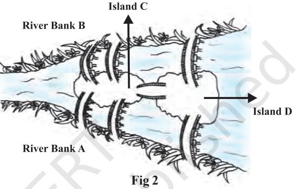
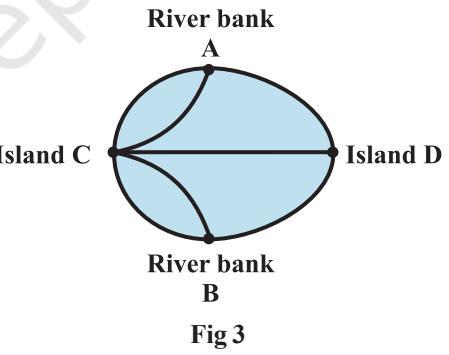
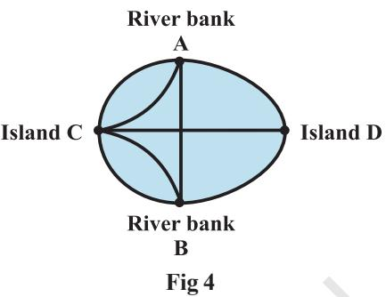
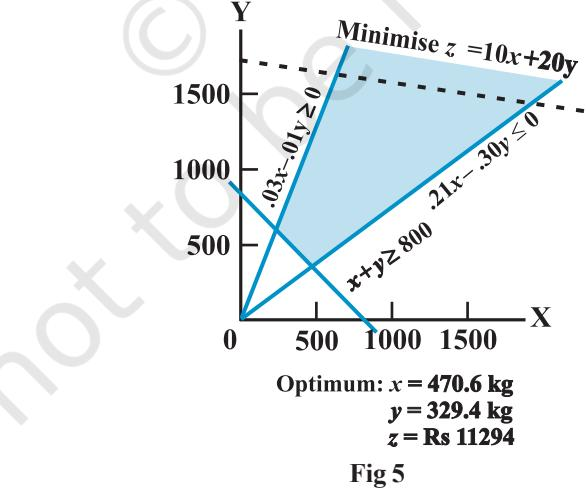
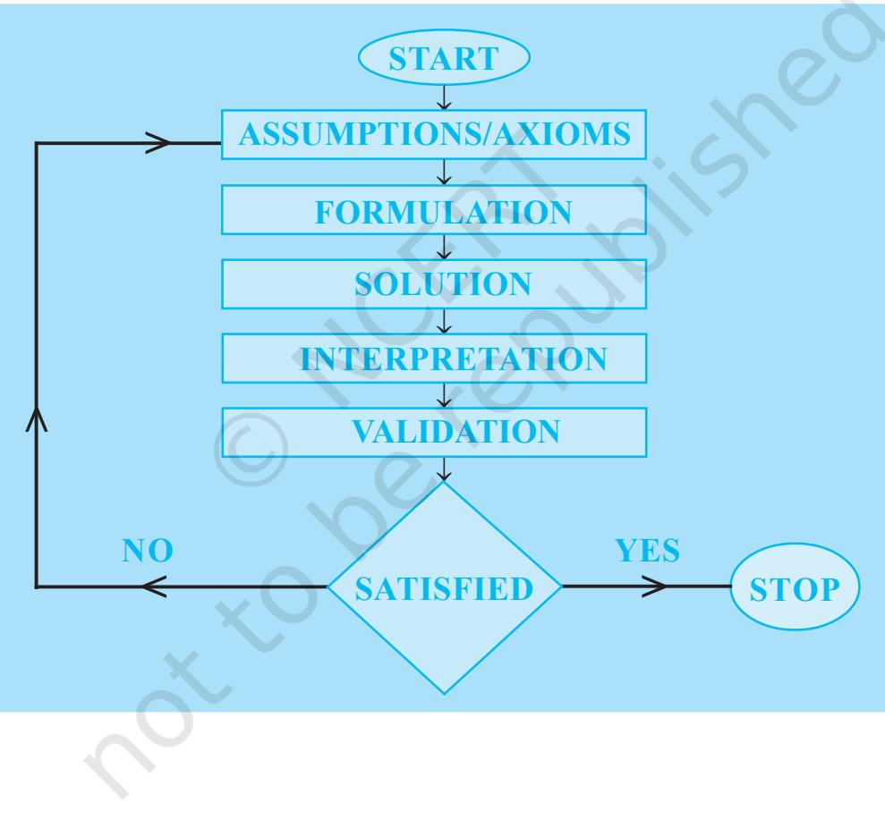

# **MATHEMATICAL MODELLING**

# **A.2.1 Introduction**

Much of our progress in the last few centuries has made it necessary to apply mathematical methods to real-life problems arising from different fields – be it Science, Finance, Management etc. The use of Mathematics in solving real-world problems has become widespread especially due to the increasing computational power of digital computers and computing methods, both of which have facilitated the handling of lengthy and complicated problems. The process of translation of a real-life problem into a mathematical form can give a better representation and solution of certain problems. The process of translation is called Mathematical Modelling.

Here we shall familiaries you with the steps involved in this process through examples. We shall first talk about what a mathematical model is, then we discuss the steps involved in the process of modelling.

# **A.2.2 Preliminaries**

Mathematical modelling is an essential tool for understanding the world. In olden days the Chinese, Egyptians, Indians, Babylonians and Greeks indulged in understanding and predicting the natural phenomena through their knowledge of mathematics. The architects, artisans and craftsmen based many of their works of art on geometric prinicples.

Suppose a surveyor wants to measure the height of a tower. It is physically very difficult to measure the height using the measuring tape. So, the other option is to find out the factors that are useful to find the height. From his knowledge of trigonometry, he knows that if he has an angle of elevation and the distance of the foot of the tower to the point where he is standing, then he can calculate the height of the tower.

So, his job is now simplified to find the angle of elevation to the top of the tower and the distance from the foot of the tower to the point where he is standing. Both of which are easily measurable. Thus, if he measures the angle of elevation as 40° and the distance as 450m, then the problem can be solved as given in Example 1.

**Example 1** The angle of elevation of the top of a tower from a point O on the ground, which is 450 m away from the foot of the tower, is 40°. Find the height of the tower.

**Solution** We shall solve this in different steps.

**Step 1** We first try to understand the real problem. In the problem a tower is given and its height is to be measured. Let *h* denote the height. It is given that the horizontal distance of the foot of the tower from a particular point O on the ground is 450 m. Let *d* denotes this distance. Then *d* = 450m. We also know that the angle of elevation, denoted by θ, is 40°.

The real problem is to find the height *h* of the tower using the known distance *d* and the angle of elevation θ.

**Step 2** The three quantities mentioned in the problem are height, distance and angle of elevation.

So we look for a relation connecting these three quantities. This is obtained by expressing it geometrically in the following way (Fig 1).

AB denotes the tower. OA gives the horizontal distance from the point O to foot of the tower. ∠AOB is the angle of elevation. Then we have

$$\tan\theta=\frac{h}{d}\ \ \mbox{or}\ h=d\ \tan\theta\tag{1}$$

$$\mathrm{~oM~}$$

This is an equation connecting θ, *h* and *d*.

**Step 3** We use Equation (1) to solve *h*. We have θ = 40°. and *d* = 450m. Then we get *h* = tan 40° × 450 = 450 × 0.839 = 377.6m

**Step 4** Thus we got that the height of the tower approximately 378m.

Let us now look at the different steps used in solving the problem. In step 1, we have studied the real problem and found that the problem involves three parameters height, distance and angle of elevation. That means in this step we have *studied the real-life problem and identified the parameters.*

In the Step 2, we used some geometry and found that the problem can be represented geometrically as given in Fig 1. Then we used the trigonometric ratio for the "tangent" function and found the relation as

$$h=d\tan\theta$$

So, in this step we formulated the problem mathematically. That means we found an equation representing the real problem.

In Step 3, we solved the mathematical problem and got that *h* = 377.6m. That is we found

## *Solution of the problem*.

In the last step, we interpreted the solution of the problem and stated that the height of the tower is approximately 378m. We call this as

## *Interpreting the mathematical solution to the real situation*

In fact these are the steps mathematicians and others use to study various reallife situations. We shall consider the question, "why is it necessary to use mathematics to solve different situations."

Here are some of the examples where mathematics is used effectively to study various situations.

- 1. Proper flow of blood is essential to transmit oxygen and other nutrients to various parts of the body in humanbeings as well as in all other animals. Any constriction in the blood vessel or any change in the characteristics of blood vessels can change the flow and cause damages ranging from minor discomfort to sudden death. The problem is to find the relationship between blood flow and physiological characteristics of blood vessel.
- 2. In cricket a third umpire takes decision of a LBW by looking at the trajectory of a ball, simulated, assuming that the batsman is not there. Mathematical equations are arrived at, based on the known paths of balls before it hits the batsman's leg. This simulated model is used to take decision of LBW.
- 3. Meteorology department makes weather predictions based on mathematical models. Some of the parameters which affect change in weather conditions are temperature, air pressure, humidity, wind speed, etc. The instruments are used to measure these parameters which include thermometers to measure temperature, barometers to measure airpressure, hygrometers to measure humidity, anemometers to measure wind speed. Once data are received from many stations around the country and feed into computers for further analysis and interpretation.
- 4. Department of Agriculture wants to estimate the yield of rice in India from the standing crops. Scientists identify areas of rice cultivation and find the average yield per acre by cutting and weighing crops from some representative fields. Based on some statistical techniques decisions are made on the average yield of rice.

How do mathematicians help in solving such problems? They sit with experts in the area, for example, a physiologist in the first problem and work out a mathematical equivalent of the problem. This equivalent consists of one or more equations or inequalities etc. which are called the mathematical models. Then

solve the model and interpret the solution in terms of the original problem. Before we explain the process, we shall discuss what a mathematical model is. A mathematical model is a representation which comprehends a situation. An interesting geometric model is illustrated in the following example.

**Example 2** (Bridge Problem) Konigsberg is a town on the Pregel River, which in the

18th century was a German town, but now is Russian. Within the town are two river islands that are connected to the banks with seven bridges as shown in (Fig 2).

People tried to walk around the town in a way that only crossed each bridge once, but it proved to be difficult problem. Leonhard Euler, a Swiss mathematician in the service of

the Russian empire Catherine the Great, heard about the problem. In 1736 Euler proved that the walk was not possible to do. He proved this by inventing a kind of diagram

called a network, that is made up of vertices (dots where lines meet) and arcs (lines) (Fig3).

He used four dots (vertices) for the two river banks and the two islands. These have been marked A, B and C, D. The seven lines (arcs) are the seven bridges. You can see that 3 bridges (arcs) join to riverbank, A, and 3 join to riverbank B. 5 bridges (arcs) join to island C, and 3 join to island D. This means that all the vertices have an odd number of arcs, so they are called odd vertices (An even vertex

would have to have an even number of arcs joining to it).

Remember that the problem was to travel around town crossing each bridge only once. On Euler's network this meant tracing over each arc only once, visiting all the vertices. Euler proved it could not be done because he worked out that, to have an odd vertex you would have to begin or end the trip at that vertex. (Think about it). Since there can only be one beginning and one end, there can only be two odd vertices if you are to trace over each arc only once. Since the bridge problem has 4 odd vertices, it just not possible to do!

After Euler proved his Theorem, much water has flown under the bridges in Konigsberg. In 1875, an extra bridge was built in Konigsberg, joining the land areas of river banks A and B (Fig 4). Is it possible now for the Konigsbergians to go round the city, using each bridge only once?

Here the situation will be as in Fig 4. After the addition of the new edge, both the vertices A and B have become even degree vertices. However, D and C still have odd degree. So, it

is possible for the Konigsbergians to go around the city using each bridge exactly once.

The invention of networks began a new theory called graph theory which is now used in many ways, including planning and mapping railway networks (Fig 4).

## **A.2.3 What is Mathematical Modelling?**

Here, we shall define what mathematical modelling is and illustrate the different processes involved in this through examples.

**Definition** Mathematical modelling is an attempt to study some part (or form) of the real-life problem in mathematical terms.

*Conversion of physical situation into mathematics with some suitable conditions is known as mathematical modelling. Mathematical modelling is nothing but a technique and the pedagogy taken from fine arts and not from the basic sciences.* Let us now understand the different processes involved in Mathematical Modelling. Four steps are involved in this process. As an illustrative example, we consider the modelling done to study the motion of a simple pendulum.

#### **Understanding the problem**

This involves, for example, understanding the process involved in the motion of simple pendulum. All of us are familiar with the simple pendulum. This pendulum is simply a mass (known as bob) attached to one end of a string whose other end is fixed at a point. We have studied that the motion of the simple pendulum is periodic. The period depends upon the length of the string and acceleration due to gravity. So, what we need to find is the period of oscillation. Based on this, we give a precise statement of the problem as

**Statement** How do we find the period of oscillation of the simple pendulum? The next step is formulation.

**Formulation** Consists of two main steps.

**1. Identifying the relevant factors** In this, we find out what are the factors/

parameters involved in the problem. For example, in the case of pendulum, the factors are period of oscillation (T), the mass of the bob (*m*), effective length (*l*) of the pendulum which is the distance between the point of suspension to the centre of mass of the bob. Here, we consider the length of string as effective length of the pendulum and acceleration due to gravity (*g*), which is assumed to be constant at a place.

So, we have identified four parameters for studying the problem. Now, our purpose is to find T. For this we need to understand what are the parameters that affect the period which can be done by performing a simple experiment.

We take two metal balls of two different masses and conduct experiment with each of them attached to two strings of equal lengths. We measure the period of oscillation. We make the observation that there is no appreciable change of the period with mass. Now, we perform the same experiment on equal mass of balls but take strings of different lengths and observe that there is clear dependence of the period on the length of the pendulum.

This indicates that the mass *m* is not an *essential parameter* for finding period whereas the length *l* is an essential parameter.

This process of searching the **essential parameters** is necessary before we go to the next step.

**2. Mathematical description** This involves finding an equation, inequality or a geometric figure using the parameters already identified.

In the case of simple pendulum, experiments were conducted in which the values of period T were measured for different values of *l*. These values were plotted on a graph which resulted in a curve that resembled a parabola. It implies that the relation between T and *l* could be expressed

$$\Gamma^{2}=\frac{\hbar}{\hbar}\tag{1}$$

It was found that $k=\frac{4\pi^{2}}{g}$. This gives the equation  
  

$$\Gamma=2\pi\sqrt{\frac{l}{g}}\tag{2}$$

Equation (2) gives the mathematical formulation of the problem.

**Finding the solution** The mathematical formulation rarely gives the answer directly. Usually we have to do some operation which involves solving an equation, calculation or applying a theorem etc. In the case of simple pendulums the solution involves applying the formula given in Equation (2).

The period of oscillation calculated for two different pendulums having different lengths is given in Table 1

|  | Table 1 |  |
| --- | --- | --- |
| l | 225 cm | 275cm |
| T | 3.04 sec | 3.36 sec |

The table shows that for *l* = 225 cm, T = 3.04 sec and for *l* = 275 cm, T = 3.36 sec.

## **Interpretation/Validation**

A mathematical model is an attempt to study, the essential characteristic of a real life problem. Many times model equations are obtained by assuming the situation in an idealised context. The model will be useful only if it explains all the facts that we would like it to explain. Otherwise, we will reject it, or else, improve it, then test it again. In other words, *we measure the effectiveness of the model by comparing the results obtained from the mathematical model, with the known facts about the real problem. This process is called validation of the model.* In the case of simple pendulum, we conduct some experiments on the pendulum and find out period of oscillation. The results of the experiment are given in Table 2.

| Mass (gms) | Length (cms) | Time (secs) |
| --- | --- | --- |
| 385 | 275 | 3.371 |
|  | 225 | 3.056 |
| 230 | 275 | 3.352 |
|  | 225 | 3.042 |

**Table 2** Periods obtained experimentally for four different pendulums

Now, we compare the measured values in Table 2 with the calculated values given in Table 1.

The difference in the observed values and calculated values gives the error. For example, for *l* = 275 cm, and mass *m* = 385 gm,

$$\mathrm{error}=3.371-3.36=0.011$$

which is small and the model is accepted.

Once we accept the model, we have to interpret the model. *The process of describing the solution in the context of the real situation is called interpretation of the model.* In this case, we can interpret the solution in the following way:

(a) The period is directly proportional to the square root of the length of the pendulum.

(b) It is inversely proportional to the square root of the acceleration due to gravity.

Our validation and interpretation of this model shows that the mathematical model is in good agreement with the practical (or observed) values. But we found that there is some error in the calculated result and measured result. This is because we have neglected the mass of the string and resistance of the medium. So, in such situation we look for a better model and this process continues.

This leads us to an important observation. The real world is far too complex to understand and describe completely. We just pick one or two main factors to be completely accurate that may influence the situation. Then try to obtain a simplified model which gives some information about the situation. We study the simple situation with this model expecting that we can obtain a better model of the situation. Now, we summarise the main process involved in the modelling as

(a) Formulation (b) Solution (c) Interpretation/Validation The next example shows how modelling can be done using the techniques of finding graphical solution of inequality.

**Example 3** A farm house uses atleast 800 kg of special food daily. The special food is a mixture of corn and soyabean with the following compositions

| Material | Nutrients present per Kg | Nutrients present per Kg | Cost per Kg |
| --- | --- | --- | --- |
|  | Protein | Fibre |  |
| Corn | .09 | .02 | Rs 10 |
| Soyabean | .60 | .06 | Rs 20 |

**Table 3**

The dietary requirements of the special food stipulate atleast 30% protein and at most 5% fibre. Determine the daily minimum cost of the food mix.

**Solution Step 1** Here the objective is to minimise the total daily cost of the food which is made up of corn and soyabean. So the variables (factors) that are to be considered are

> *x =* the amount of corn *y =* the amount of soyabean *z =* the cost

**Step 2** The last column in Table 3 indicates that *z*, *x*, *y* are related by the equation *z* = 10*x* + 20*y* ... (1)

The problem is to minimise *z* with the following constraints:

- (a) The farm used atleast 800 kg food consisting of corn and soyabean
i.e., $x+y\geq800$

- (b) The food should have atleast 30% protein dietary requirement in the proportion as given in the first column of Table 3. This gives
$0.09x+0.6y\geq0.3$ ($x+y$)

- (c) Similarly the food should have atmost 5% fibre in the proportion given in 2nd column of Table 3. This gives
$0.02x+0.06\,y\leq0.05\,(x+y)$

We simplify the constraints given in (2), (3) and (4) by grouping all the coefficients of *x*, *y*.

Then the problem can be restated in the following mathematical form. **Statement** Minimise *z* subject to

$$\begin{array}{l}{x+y\geq800}\\ {0.21x-.30y\leq0}\\ {0.03x-.01y\geq0}\end{array}$$

This gives the formulation of the model.

**Step 3** This can be solved graphically. The shaded region in Fig 5 gives the possible solution of the equations. From the graph it is clear that the minimum value is got at the point (470.6,329.4) i.e., *x* = 470.6 and *y* = 329.4.

This gives the value of *z* as *z* = 10 × 470.6 + 20 × 329.4 = 11294 This is the mathematical solution.

**Step 4** The solution can be interpreted as saying that, "The minimum cost of the special food with corn and soyabean having the required portion of nutrient contents, protein and fibre is Rs 11294 and we obtain this minimum cost if we use 470.6 kg of corn and 329.4 kg of soyabean."

In the next example, we shall discuss how modelling is used to study the population of a country at a particular time.

**Example 4** Suppose a population control unit wants to find out "how many people will be there in a certain country after 10 years"

**Step 1 Formulation** We first observe that the population changes with time and it increases with birth and decreases with deaths.

We want to find the population at a particular time. Let *t* denote the time in years. Then *t* takes values 0, 1, 2, ..., *t* = 0 stands for the present time, *t* = 1 stands for the next year etc. For any time *t*, let *p* (*t*) denote the population in that particular year.

Suppose we want to find the population in a particular year, say *t*0 = 2006. How will we do that. We find the population by Jan. 1st, 2005. Add the number of births in that year and subtract the number of deaths in that year. Let B(*t*) denote the number of births in the one year between *t* and *t* + 1 and D(*t*) denote the number of deaths between *t* and *t* + 1. Then we get the relation

P (*t* + 1) = P (*t*) + B (*t*) – D (*t*)

Now we make some assumptions and definitions

1. B ( ) P ( ) *t t* is called the *birth rate* for the time interval *t* to *t* + 1.

2. D (t) P (t) is called the *death rate* for the time interval *t* to *t* + 1.

## **Assumptions**

 1. The birth rate is the same for all intervals. Likewise, the death rate is the same for all intervals. This means that there is a constant *b*, called the birth rate, and a constant *d*, called the death rate so that, for all *t* ≥ 0,

B ( ) D ( ) and P ( ) P ( ) *t t b d t t* = = ... (1)

 2. There is no migration into or out of the population; i.e., the only source of population change is birth and death.

As a result of assumptions 1 and 2, we deduce that, for *t* ≥ 0, P (*t* + 1) = P(*t*) + B(*t*) – D(*t*) = P(*t*) + *b*P(*t*) – *d*P(*t*) = (1 + *b* – *d*) P(*t*) ... (2)

Setting *t* = 0 in (2) gives

P(1) = (1 + $b-d$)P (0)... (3)

Setting *t* = 1 in Equation (2) gives

P(2) = (1 + $b-d$) P (1)  
  
= (1 + $b-d$) (1 + $b-d$) P (0) (Using equation 3)  
  
= (1 + $b-d$)${}^{2}$ P(0)

Continuing this way, we get

$${\rm P}(t)=(1+b-d)^{t}\ {\rm P}\ (0)\tag{4}$$

for *t* = 0, 1, 2, ... The constant 1 + *b* – *d* is often abbreviated by *r* and called the *growth rate or*, in more high-flown language, the *Malthusian parameter,* in honor of Robert Malthus who first brought this model to popular attention. In terms of *r*, Equation (4) becomes

$$\mbox{P}(t)=\mbox{P}(0)r^{\,t}\tag{5}$$

P(*t*) is an example of an *exponential function.* Any function of the form *cr t* , where *c* and *r* are constants, is an exponential function.

Equation (5) gives the mathematical formulation of the problem.

#### **Step 2 – Solution**

Suppose the current population is 250,000,000 and the rates are *b* = 0.02 and *d* = 0.01. What will the population be in 10 years? Using the formula, we calculate P(10).

P(10) = (1.01)${}^{10}$ (250,000,000)  
  
= (1.104622125) (250,000,000)  
  
= 276,155,531.25

### **Step 3 Interpretation and Validation**

Naturally, this result is absurd, since one can't have 0.25 of a person.

So, we do some approximation and conclude that the population is 276,155,531 (approximately). Here, we are not getting the exact answer because of the assumptions that we have made in our mathematical model.

The above examples show how modelling is done in variety of situations using different mathematical techniques.

Since a mathematical model is a simplified representation of a real problem, by its very nature, has built-in assumptions and approximations. Obviously, the most important question is to decide whether our model is a good one or not i.e., when the obtained results are interpreted physically whether or not the model gives reasonable answers. If a model is not accurate enough, we try to identify the sources of the shortcomings. It may happen that we need a new formulation, new mathematical manipulation and hence a new evaluation. Thus mathematical modelling can be a cycle of the modelling process as shown in the flowchart given below:

