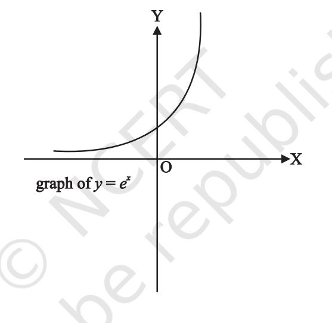
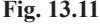
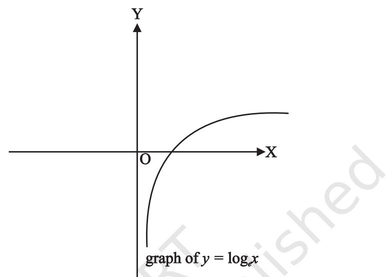

# **SUPPLEMENTARY MATERIAL**

SUPPLEMENTARY MATERIAL 357

## **CHAPTER 8**

### **8.6 Infinite G.P. and its Sum**

G.P. of the form *a*, *ar*, *ar*2 , *ar*3 , ... is called infinite G.P. Now, to find the formulae for finding sum to infinity of a G.P., we begin with an example.

Let us consider the G.P.,

$${\bf\Phi}^{\cdot}{\bf\Phi}1\,,\,\frac{2}{3}\,,\,\frac{4}{9}\,,\,\ldots$$

Here *a* = 1, 2 3 *r* = . We have

2 1 3 2 S 3 1 2 3 1 3 *n n n* − = = − −

Let us study the behaviour of 2 3 *n* as *n* becomes larger and larger:

| n |  | 1 | 5 | 10 | 20 |
| --- | --- | --- | --- | --- | --- |
|  2  | n |  |  |  |  |
|   |  | 0.6667 | 0.1316872428 | 0.01734152992 | 0.00030072866 |
|   3 |  |  |  |  |  |

We observe that as *n* becomes larger and larger, 2 3 *n* becomes closer and closer to zero. Mathematically, we say that as *n* becomes sufficiently large, 2 3 *n* becomes sufficiently small. In other words as 2 , 0. 3 *n n* → ∞ → Consequently, we find that the sum of infinitely many terms is given by S 3. ∞ =

Now, for a geometric progression, *a*, *ar*, *ar*2 , ..., if numerical value of common ratio *r* is less than 1, then

$\mathbf{S}_{n}=\frac{a\left(1-r^{n}\right)}{\left(1-r\right)}=\frac{a}{1-r}-\frac{a\,r^{n}}{1-r}$

In this case as , *n* →∞ *r n* → 0 since |*r*| < 1. Therefore

$$S_{u}\to{\frac{a}{1-r}}$$

Symbolically sum to infinity is denoted by S or S. ∞

Thus, we have S 1 – *a r* = . For examples,

(i) $1+\frac{1}{2}+\frac{1}{2^{\,2}}+\frac{1}{2^{\,3}}+\ldots=\frac{1}{2}$.  
  
(ii) $1-\frac{1}{2}+\frac{1}{2^{\,2}}-\frac{1}{2^{\,3}}+\ldots=\frac{1}{2}$.  
  

### **Exercise 8.3**

Find the sum to infinity in each of the following Geometric Progression.

- 1. 1 1 1, , ,... 3 9 (Ans. 1.5) 2. 6, 1.2, .24, ... (Ans. 7.5)
- 3. 5, 2 0 8 0 , , ... 7 4 9 (Ans. 35 3 ) 4. 3 3 3 , , ,... 4 16 64 − − (Ans. 3 5 − )
- 5. Prove that 1 1 1 2 4 8 3 3 3 .. . 3 × × =
- 6. Let *x* = 1 + *a* + *a* 2 + ... and *y* = 1 + *b* + *b* 2 + ..., where |*a*| < 1 and |*b*| < 1. Prove that

$$1+a b+a^{2}b^{2}+\ldots={\frac{x y}{x+y-1}}$$

#### **CHAPTER 12**

## **12.6 Limits Involving Exponential and Logarithmic Functions**

Before discussing evaluation of limits of the expressions involving exponential and logarithmic functions, we introduce these two functions stating their domain, range and also sketch their graphs roughly.

Leonhard Euler (1707–1783), the great Swiss mathematician introduced the number *e* whose value lies between 2 and 3. This number is useful in defining exponential function and is defined as *f* (*x*) = *e x* , *x* ∈ **R**. Its domain is **R**, range is the set of positive real numbers. The graph of exponential function, i.e., *y* = *e x* is as given in Fig.13.11.

Similarly, the logarithmic function expressed as log*e* **R**+ → **R** is given by log*e x* = *y*, if and only if *e y* = *x*. Its domain is **R**+ which is the set of all positive real numbers and range is **R**. The graph of logarithmic function *y* = log*e x* is shown in Fig.13.12.

**Fig. 13.12**

In order to prove the result 0 – 1 lim 1 *x x e* → *x* = , we make use of an inequality involving

the expression *x e x* −1 which runs as follows: 1 1 *x* ≤ + – 1 *x e x* ≤ 1 + (*e* – 2) |*x*| holds for all *x* in [–1, 1] ~ {0}.

**Theorem 6** Prove that 0 1 lim 1 *x x e* → *x* − =

**Proof** Using above inequality, we get

$$\frac{1}{1+\left|x\right|}\leq\frac{e^{x}-1}{x}\ \leq\ 1+\left|\ x\right|\left(e-2\right),x\ \hat{1}\ [-1,\ 1]\sim\left\{0\right\}$$
  
  
Also $\lim_{x\to0}\ \frac{1}{1+\left|x\right|}=\frac{1}{1+\lim_{x\to0}\left|x\right|}=\frac{1}{1+0}=1$

and 0 0 lim 1 ( 2) 1 ( 2 ) lim 1 ( 2)0 1 *x x e x e x e* → → + − = + − = + − = Therefore, by Sandwich theorem, we get

$$\operatorname*{lim}_{x\to\,0}{\frac{e^{\,x}\,-\,1}{x}}=1$$

**Theorem 7** Prove that 0 log (1 ) lim 1 *e x x* → *x* + =

  
  
**Proof** Let $\log_{\varepsilon}(1+x)=y$. Then $\log_{\varepsilon}(1+x)=xy$. $\log_{\varepsilon}(1+x)=xy$. $\log_{\varepsilon}(1+x)=xy$. $\log_{\varepsilon}(1+x)=xy$. $\log_{\varepsilon}(1+x)=xy$. $\log_{\varepsilon}(1+x)=xy$. $\log_{\varepsilon}(1+x)=xy$. $\log_{\varepsilon}(1+x)=xy$. $\log_{\varepsilon}(1+x)=xy$. $\log_{\varepsilon}(1+x)=xy$. $\log_{\varepsilon}(1+x)=xy$.  
  

1 . 1

*y*

=

*xy e*

*xy* −

or

$$\Rightarrow\lim\limits_{xy\to0}\frac{e^{xy}-1}{xy}\lim\limits_{x\to0}y=1 (since x\to0 gives xy\to0).

\Rightarrow\lim\limits_{x\to0}y=1 (as \lim\limits_{xy\to0}\frac{e^{xy}-1}{xy}=1)

\Rightarrow\lim\limits_{x\to0}\frac{\log\left(1+x\right)}{x}=1$$

**Example 5** Compute 3 0 1 l i m *x x e* → *x* − **Solution** We have

$\lim\limits_{x\to0}\frac{e^{3x}-1}{x}=\lim\limits_{3x\to0}\frac{e^{3x}-1}{3x}\cdot3$  
  
$=3\left(\lim\limits_{y\to0}\frac{e^{y}-1}{y}\right)$, where $y=3x$  
  
$=3\cdot1=3$

**Example 6** Compute 0 sin 1 lim *x x e x* → *x* − − **Solution** We have 0 0 sin 1 1 sin lim lim *x x x x e x e x* → *x* → *x x* − − − = − 0 0 1 sin lim lim 1 1 0 *x x x e x* → *x x* → − = − = − = **Example 7** Evaluate 1 log lim 1 *e x x* → *x* − **Solution** Put *x* = 1 + *h*, then as *x h* → ⇒ → 1 0. Therefore, 1 0 log log (1 ) lim lim 1 *e e x h x h* → *x* → *h* + = − 0 log (1 ) 1 since lim 1 *e x x* → *x* + = = 

### **Exercise 13.2**

.

Evaluate the following limits, if exist

$\lim_{x\to0}\frac{e^{4\,x}-1}{x}$ (Ans. 4) ($\lim_{x\to0}\frac{e^{2\,x}-e^{2}}{x}$ (Ans. $e^{2}$)

$\lim_{x\to5}\frac{e^{x}-e^{5}}{x-5}$ (Ans. 6) 4. $\lim_{x\to0}\frac{e^{\sin x}-1}{x}$ (Ans. 1)

$\lim_{x\to3}\frac{e^{x}-e^{3}}{x-3}$ (Ans. $e^{3}$) 6. $\lim_{x\to0}\frac{x(e^{x}-1)}{1-\cos x}$ (Ans. 2)

$\lim_{x\to0}\frac{\log_{x}(1+2x)}{x}$ (Ans. 2) 8. $\lim_{x\to0}\frac{\log\left(1+x^{3}\right)}{\sin^{3}x}$ (Ans. 1)

SUPPLEMENTARY MATERIAL 363

