v*In most sciences one generation tears down what another has built and what one has established another undoes. In Mathematics alone each generation builds a new story to the old structure. – HERMAN HANKEL* v

## **10.1 Introduction**

338 MATHEMATICS

In our day to day life, we come across many queries such as – What is your height? How should a football player hit the ball to give a pass to another player of his team? Observe that a possible answer to the first query may be 1.6 meters, a quantity that involves only one value (magnitude) which is a real number. Such quantities are called *scalars*. However, an answer to the second query is a quantity (called force) which involves muscular strength (magnitude) and direction (in which another player is positioned). Such quantities are called *vectors.* In mathematics, physics and engineering, we frequently come across with both types of quantities, namely, scalar quantities such as length, mass, time, distance, speed, area, volume, temperature, work,

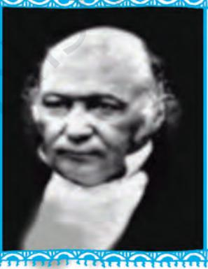

**W.R. Hamilton (1805-1865)**

money, voltage, density, resistance etc. and vector quantities like displacement, velocity, acceleration, force, weight, momentum, electric field intensity etc.

In this chapter, we will study some of the basic concepts about vectors, various operations on vectors, and their algebraic and geometric properties. These two type of properties, when considered together give a full realisation to the concept of vectors, and lead to their vital applicability in various areas as mentioned above.

## **10.2 Some Basic Concepts**

Let '*l*' be any straight line in plane or three dimensional space. This line can be given two directions by means of arrowheads. A line with one of these directions prescribed is called a *directed line* (Fig 10.1 (i), (ii)).

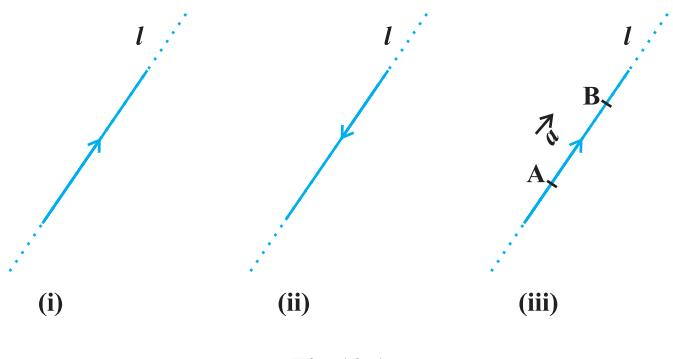

**Fig 10.1**

Now observe that if we restrict the line *l* to the line segment AB, then a magnitude is prescribed on the line *l* with one of the two directions, so that we obtain a *directed line segment* (Fig 10.1(iii)). Thus, a directed line segment has magnitude as well as direction.

**Definition 1** A quantity that has magnitude as well as direction is called a vector.

Notice that a directed line segment is a vector (Fig 10.1(iii)), denoted as or simply as , and read as 'vector ' or 'vector '.

The point A from where the vector starts is called its *initial point*, and the point B where it ends is called its *terminal point*. The distance between initial and terminal points of a vector is called the *magnitude* (or length) of the vector, denoted as | |, or | |, or *a*. The arrow indicates the direction of the vector.

A**Note** Since the length is never negative, the notation | | < 0 has no meaning.

#### **Position Vector**

From Class XI, recall the three dimensional right handed rectangular coordinate system (Fig 10.2(i)). Consider a point P in space, having coordinates (*x*, *y*, *z*) with respect to the origin O(0, 0, 0). Then, the vector having O and P as its initial and terminal points, respectively, is called the *position vector* of the point P with respect to O. Using distance formula (from Class XI), the magnitude of (or ) is given by

$$|{\overrightarrow{\mathrm{OP}}}|={\dot{\sqrt{x^{2}+y^{2}+z^{2}}}}$$

In practice, the position vectors of points A, B, C, etc., with respect to the origin O are denoted by , , , etc., respectively (Fig 10.2 (ii)).

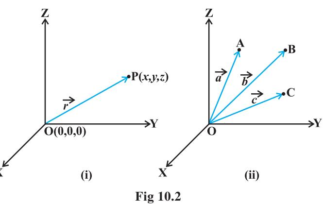

### **Direction Cosines**

**Z** Consider the position vector of a point P(*x*, *y*, *z*) as in Fig 10.3. The angles α, β, γ made by the vector with the positive directions of *x*, *y* and *z*-axes respectively, are called its *direction angles*. The cosine values of these angles, i.e., cosα, cosβ and cos γ are called *direction cosines* of the vector , and usually denoted by *l*, *m* and *n*, respectively.

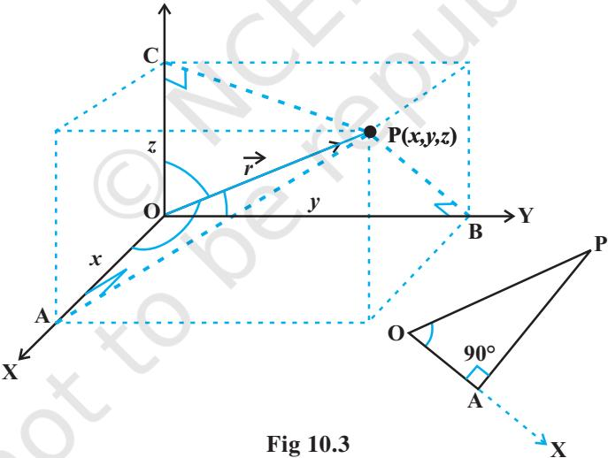

**X** From Fig 10.3, one may note that the triangle OAP is right angled, and in it, we have . Similarly, from the right angled triangles OBP and OCP, we may write cos and cos *y z r r* β = γ = . Thus, the coordinates of the point P may also be expressed as (*lr*, *mr*,*nr*). The numbers *lr*, *mr* and *nr*, proportional to the direction cosines are called as *direction ratios* of vector , and denoted as *a*, *b* and *c*, respectively.

A**Note** One may note that *l* 2 + *m*2 + *n* 2 = 1 but *a* 2 + *b* 2 + *c* 2 ≠ 1, in general.

## **10.3 Types of Vectors**

**Zero Vector**A vector whose initial and terminal points coincide, is called a zero vector (or null vector), and denoted as . Zero vector can not be assigned a definite direction as it has zero magnitude. Or, alternatively otherwise, it may be regarded as having any direction. The vectors represent the zero vector,

**Unit Vector** A vector whose magnitude is unity (i.e., 1 unit) is called a unit vector. The unit vector in the direction of a given vector is denoted by *a*ˆ .

**Coinitial Vectors** Two or more vectors having the same initial point are called coinitial vectors.

**Collinear Vectors** Two or more vectors are said to be collinear if they are parallel to the same line, irrespective of their magnitudes and directions.

**Equal Vectors** Two vectors are said to be equal, if they have the same magnitude and direction regardless of the positions of their initial points, and written as .

**Negative of a Vector** A vector whose magnitude is the same as that of a given vector (say, ), but direction is opposite to that of it, is called *negative* of the given vector. For example, vector is negative of the vector , and written as = – .

*Remark* The vectors defined above are such that any of them may be subject to its parallel displacement without changing its magnitude and direction. Such vectors are called *free vectors*. Throughout this chapter, we will be dealing with free vectors only.

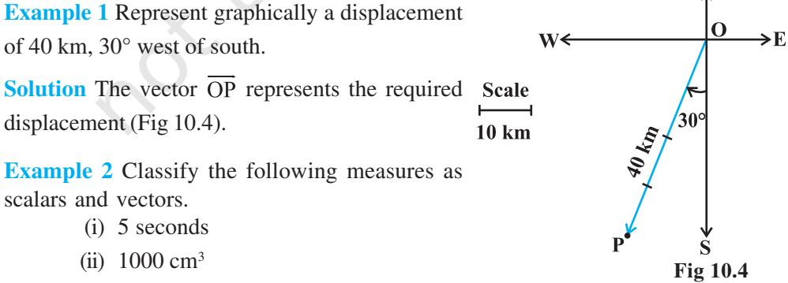

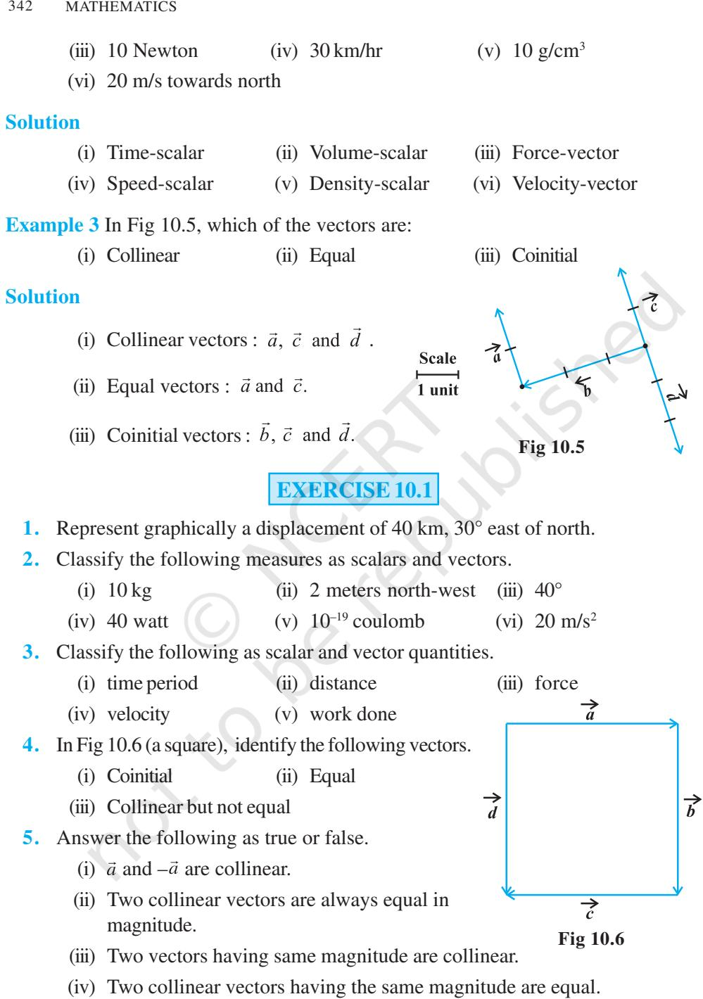

## **10.4 Addition of Vectors**

A vector simply means the displacement from a point A to the point B. Now consider a situation that a girl moves from A to B and then from B to C (Fig 10.7). The net displacement made by the girl from point A to the point C, is given by the vector and expressed as

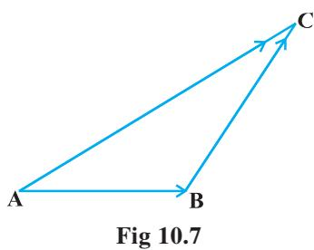

## =

This is known as the *triangle law of vector addition.*

In general, if we have two vectors and (Fig 10.8 (i)), then to add them, they are positioned so that the initial point of one coincides with the terminal point of the other (Fig 10.8(ii)).

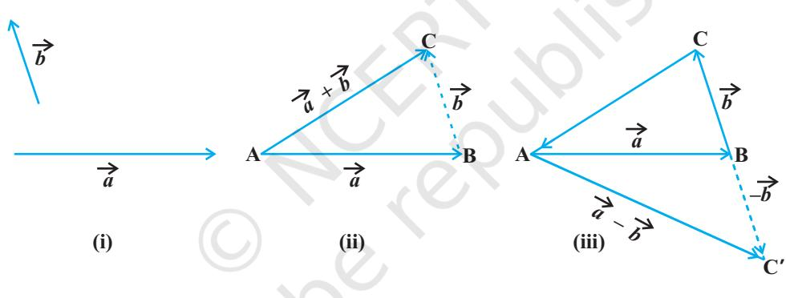

For example, in Fig 10.8 (ii), we have shifted vector without changing its magnitude and direction, so that it's initial point coincides with the terminal point of . Then, the vector *+* , represented by the third side AC of the triangle ABC, gives us the sum (or resultant) of the vectors and i.e., in triangle ABC (Fig 10.8 (ii)), we have

 = Now again, since , from the above equation, we have

$${\overrightarrow{\mathrm{AB}}}+{\overrightarrow{\mathrm{BC}}}+{\overrightarrow{\mathrm{CA}}}={\overrightarrow{\mathrm{AA}}}={\overrightarrow{0}}$$

This means that when the sides of a triangle are taken in order, it leads to zero resultant as the initial and terminal points get coincided (Fig 10.8(iii)).

Now, construct a vector so that its magnitude is same as the vector , but the direction opposite to that of it (Fig 10.8 (iii)), i.e.,

$${\overline{{\mathrm{3C^{\prime}}}}}=-{\overline{{\mathrm{B C}}}}$$

Then, on applying triangle law from the Fig 10.8 (iii), we have

$${\overline{{\mathrm{AC^{\prime}}}}}={\overline{{\mathrm{AB}}}}+{\overline{{\mathrm{BC^{\prime}}}}}={\overline{{\mathrm{AB}}}}+(-{\overline{{\mathrm{BC}}}})={\vec{a}}-{\vec{b}}$$

The vector is said to represent the *difference of .*

Now, consider a boat in a river going from one bank of the river to the other in a direction perpendicular to the flow of the river. Then, it is acted upon by two velocity vectors–one is the velocity imparted to the boat by its engine and other one is the velocity of the flow of river water. Under the simultaneous influence of these two velocities, the boat in actual starts travelling with a different velocity. To have a precise

idea about the effective speed and direction (i.e., the resultant velocity) of the boat, we have the following law of vector addition.

Ifwe havetwo vectors represented by the two adjacent sides of a parallelogram in magnitude and direction (Fig 10.9), then their sum is represented in magnitude and direction by the diagonal of the parallelogram through their common point. This is known as the *parallelogram law of vector addition.*

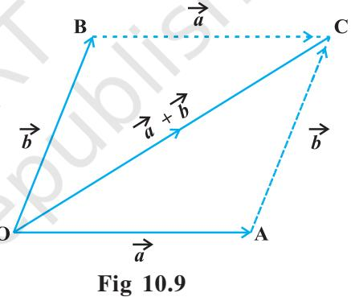

  
  
**Note**: From Fig 10.9, using the triangle law, one may note that  
  

$$\begin{array}{ll}\mbox{\rm OA}+\mbox{\rm AC}=\mbox{\rm OC}\\ \mbox{\rm OA}+\mbox{\rm OB}=\mbox{\rm OC}\end{array}$$
  
  
(since $\overline{\mbox{\rm AC}}=\overline{\mbox{\rm OB}}$ )  
  
which is a well known as $\overline{\mbox{\rm OA}}$. The $\overline{\mbox{\rm OA}}$ is a well known as $\overline{\mbox{\rm OA}}$.  
  

which is parallelogram law. Thus, we may say that the two laws of vector addition are equivalent to each other.

#### **Properties of vector addition**

**Property 1** For any two vectors ,

$\vec{a}+\vec{b}=\vec{b}+\vec{a}$ (Commutative property)

**Proof** Consider the parallelogram ABCD (Fig 10.10). Let then using the triangle law, from triangle ABC, we have

$${\overline{{\mathrm{AC}}}}={\vec{a}}+{\vec{b}}$$

Now, since the opposite sides of a parallelogram are equal and parallel, from Fig 10.10, we have, and . Again using triangle law, from triangle ADC, we have

$${\overrightarrow{\mathrm{AC}}}={\overrightarrow{\mathrm{AD}}}+{\overrightarrow{\mathrm{DC}}}={\overrightarrow{b}}+{\overrightarrow{a}}$$

Hence =

**Property 2** For any three vectors *a b c* , and

$(\bar{a}+\bar{b})+\bar{c}=\bar{a}+(b+\bar{c})$ (Associative property)

**Proof** Let the vectors be represented by , respectively, as shown in Fig 10.11(i) and (ii).

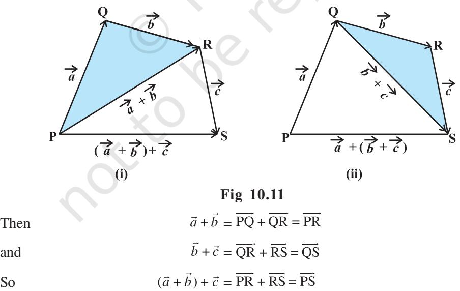

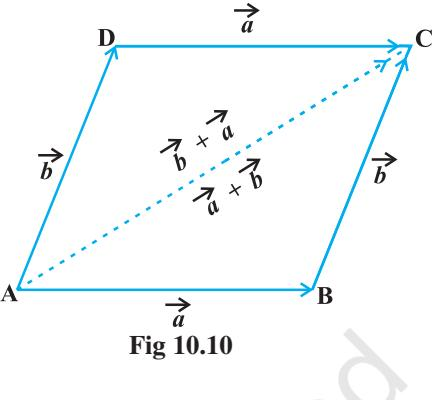

$$\bar{a}+(\bar{b}+\bar{c})=\overline{\rm PQ}+\overline{\rm QS}=\overline{\rm PS}$$
  
  
Hence  
  

$$(\bar{a}+\bar{b})+\bar{c}=\bar{a}+(\bar{b}+\bar{c})$$

*Remark* The associative property of vector addition enables us to write the sum of three vectors without using brackets.

Note that for any vector *a* , we have

$${\vec{a}}+{\vec{0}}={\vec{0}}+{\vec{a}}={\vec{a}}$$

Here, the zero vector is called the *additive identity* for the vector addition.

## **10.5 Multiplication of a Vector by a Scalar**

Let be a given vector and λ a scalar. Then the product of the vector by the scalar λ, denoted as λ , is called the multiplication of vector by the scalar λ. Note that, λ is also a vector, collinear to the vector . The vector λ has the direction same (or opposite) to that of vector according as the value of λ is positive (or negative). Also, the magnitude of vector λ is |λ| times the magnitude of the vector , i.e.,

$$|\lambda\,\vec{a}|=|\lambda\,||\,\vec{a}|\;.$$

A geometric visualisation of multiplication of a vector by a scalar is given in Fig 10.12.

#### **Fig 10.12**

When λ = –1, then λ = – , which is a vector having magnitude equal to the magnitude of and direction opposite to that of the direction of . The vector – is called the *negative* (or *additive inverse*) *of vector* and we always have

$${\vec{a}}\,+(-\,{\vec{a}})=(-\,{\vec{a}})\,+{\vec{a}}={\vec{0}}$$

Also, if 1 = | | *a* λ , provided ≠ 0 i.e. is not a null vector, then

$$|\lambda\vec{a}|=|\lambda||\vec{a}|=\frac{1}{\left|\vec{a}\,\right|}\left|\vec{a}\,\right|=1.$$

So, λ *represents the unit vector in the direction of* . We write it as

$$\mathbf{\dot{\vec{a}}}={\frac{1}{|{\vec{a}}\,|}}{\vec{a}}$$

#### A**Note** For any scalar *k*, 0 = 0. r r *k*

#### **10.5.1** *Components of a vector*

Let us take the points A(1, 0, 0), B(0, 1, 0) and C(0, 0, 1) on the *x*-axis, *y*-axis and *z*-axis, respectively. Then, clearly

$|\overline{\rm OA}|=1,|\overline{\rm OB}|=1$ and $|\overline{\rm OC}|=1$  
  
The vectors $\overline{\rm OA},\ \overline{\rm OB}$ and $\overline{\rm OC}$, each having magnitude 1, are called _unit vectors along the axes_ OX, OY and OZ, respectively, and denoted by $\hat{i},\hat{j}$ and $\hat{k},\hat{j}$ respectively (Fig 10.13).  
  

Now, consider the position vector of a point P(*x*, *y*, *z*) as in Fig 10.14. Let P1 be the foot of the perpendicular from P on the plane XOY. **Fig 10.13**

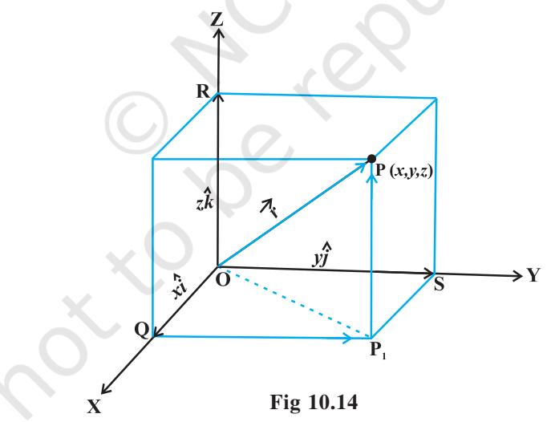

We, thus, see that P1 P is parallel to *z*-axis. As ˆ ˆ ˆ *i j k* , and are the unit vectors along the *x*, *y* and *z*-axes, respectively, and by the definition of the coordinates of P, we have . Similarly, and .

Therefore, it follows that = and =

Hence, the position vector of P with reference to O is given by

$${\overline{{\mathrm{OP}}}}\ (\mathrm{or}\ {\vec{r}})=x{\ddot{i}}+y{\ddot{j}}+z k$$

This form of any vector is called its *component form.* Here, *x*, *y* and *z* are called as the *scalar components* of , and ˆ ˆ ˆ *xi yj zk* , and are called the *vector components* of along the respective axes. Sometimes *x*, *y* and *z* are also termed as *rectangular components*.

The length of any vector = ˆ ˆ ˆ *r xi yj zk* = + + , is readily determined by applying the Pythagoras theorem twice. We note that in the right angle triangle OQP1 (Fig 10.14)

$\overline{\text{OP}}_{1}=\sqrt{\text{100}}^{2}+\text{100}^{2}=\sqrt{x^{2}+y^{2}}$.  
  

and in the right angle triangle OP1 P, we have

$\rm OP=\sqrt{10P_{1}}^{2}+|P_{1}P|^{2}=\sqrt{(x^{2}+y^{2})+z^{2}}$

Hence, the length of any vector = ˆ ˆ ˆ *r xi yj zk* = + + is given by

$$|{\vec{r}}\,|=|x{\hat{i}}+y{\hat{j}}+z{\hat{k}}|={\sqrt{x^{2}+y^{2}+z^{2}}}$$

If are any two vectors given in the component form 1 2 3 ˆ ˆ ˆ *a i a j a k* + + and 1 2 3 ˆ ˆ ˆ *b i b j b k* + + , respectively, then

- (i) the sum (or resultant) of the vectors is given by
$\bar{a}+\bar{b}=(a_{1}+b_{1})\bar{i}+(a_{2}+b_{2})\bar{j}+(a_{3}+b_{3})\bar{k}$

- (ii) the difference of the vector is given by
$a-b=(a_{1}-b_{1})\dot{i}+(a_{2}-b_{2})\dot{j}+(a_{3}-b_{3})\dot{k}$.  
  

(iii) the vectors are equal if and only if

$$a_{_1}=b_{_1},\,a_{_2}=b_{_2}\quad\mathrm{and}\quad a_{_3}=b_{_3}$$

- (iv) the multiplication of vector by any scalar λ is given by

$$\lambda\vec{a}=(\lambda a_{1})\hat{i}+(\lambda a_{2})\hat{j}+(\lambda a_{3})\hat{k}$$

The addition of vectors and the multiplication of a vector by a scalar together give the following distributive laws:

Let be any two vectors, and *k* and *m* be any scalars. Then

- (i)
- (ii)
- (iii)

### *Remarks*

- (i) One may observe that whatever be the value of λ, the vector λ is always collinear to the vector . In fact, two vectors are collinear if and only if there exists a nonzero scalar λ such that . If the vectors are given in the component form, i.e. = 1 2 3 ˆ ˆ ˆ *a a i a j a k* = + + and , then the two vectors are collinear if and only if

$$b_{1}\hat{i}+b_{2}\hat{j}+b_{3}\hat{k}\,=\,\lambda(a_{1}\hat{i}+a_{2}\hat{j}+a_{3}\hat{k})$$

$b_{1}\hat{i}+b_{2}\hat{j}+b_{3}\hat{k}=(\lambda a_{1})\hat{i}+(\lambda a_{2})\hat{j}+(\lambda a_{3})\hat{k}$

$b_{1}=\lambda a_{1}\,,\ b_{2}=\lambda a_{2}\,,\ b_{3}=\lambda a_{3}$

1 *b a* =

⇔ 1

- (ii) If = 1 2 3 ˆ ˆ ˆ *a a i a j a k* = + + , then *a*1 , *a*2 , *a*3 are also called direction ratios of .
- (iii) In case if it is given that *l*, *m*, *n* are direction cosines of a vector, then ˆ ˆ ˆ *li mj nk* + + = ˆ ˆ ˆ (cos ) (cos ) (cos ) α + β + γ *i j k* is the unit vector in the direction of that vector, where α, β and γ are the angles which the vector makes with *x*, *y* and *z* axes respectively.

2 3 2 3

*b b a a* = = λ

**Example 4** Find the values of *x*, *y* and *z* so that the vectors and are equal.

**Solution** Note that two vectors are equal if and only if their corresponding components are equal. Thus, the given vectors will be equal if and only if

$$x=2,\,y=2,\,z=1$$

**Example 5** Let and . Is ? Are the vectors equal?

**Solution** We have and

So, . But, the two vectors are not equal since their corresponding components are distinct.

**Example 6** Find unit vector in the direction of vector

**Solution** The unit vector in the direction of a vector is given by .

Now  
  

$$\left|\,\vec{a}\,\right|=\sqrt{2^{2}+3^{2}+1^{2}}=\sqrt{14}$$

Therefore $\hat{a}=\frac{1}{\sqrt{14}}(2\hat{i}+3\hat{j}+\hat{k})=\frac{2}{\sqrt{14}}\hat{i}+\frac{3}{\sqrt{14}}\hat{j}+\frac{1}{\sqrt{14}}\hat{k}$.  
  

**Example 7** Find a vector in the direction of vector that has magnitude 7 units.

**Solution** The unit vector in the direction of the given vector is

$${\hat{a}}={\frac{1}{\left|{\hat{a}}\right|}}{\hat{a}}={\frac{1}{\sqrt{5}}}({\hat{i}}-2{\hat{j}})={\frac{1}{\sqrt{5}}}{\hat{i}}-{\frac{2}{\sqrt{5}}}{\hat{j}}$$

Therefore, the vector having magnitude equal to 7 and in the direction of is

$$7{\overset{\wedge}{a}}=7\left({\frac{1}{\sqrt{5}}}{\hat{i}}-{\frac{2}{\sqrt{5}}}{\hat{j}}\right)={\frac{7}{\sqrt{5}}}{\hat{i}}-{\frac{14}{\sqrt{5}}}{\hat{j}}$$

**Example 8** Find the unit vector in the direction of the sum of the vectors, and .

**Solution** The sum of the given vectors is

$$\bar{a}+\bar{b}\ (=\bar{c},\,{\rm say})=4\bar{i}+3\bar{j}-2\bar{k}$$
  
  
and  
  

$$|\,\bar{c}\ |=\sqrt{4^{2}+3^{2}+(-2)^{2}}=\sqrt{29}$$

Thus, the required unit vector is

$${\hat{c}}={\frac{1}{\mid{\vec{c}}\mid}}{\vec{c}}={\frac{1}{\sqrt{29}}}(4{\hat{i}}+3{\hat{j}}-2{\hat{k}})={\frac{4}{\sqrt{29}}}{\hat{i}}+{\frac{3}{\sqrt{29}}}\,{\hat{j}}-{\frac{2}{\sqrt{29}}}{\hat{k}}$$

**Example 9** Write the direction ratio's of the vector and hence calculate its direction cosines.

**Solution** Note that the direction ratio's *a*, *b*, *c* of a vector are just the respective components *x*, *y* and *z* of the vector. So, for the given vector, we have *a* = 1, *b* = 1 and *c* = –2. Further, if *l*, *m* and *n* are the direction cosines of the given vector, then

$$1=\frac{a}{\left|\vec{r}\right|}=\frac{1}{\sqrt{6}}\,,\quad m=\frac{b}{\left|\vec{r}\right|}=\frac{1}{\sqrt{6}}\,,\quad n=\frac{c}{\left|\vec{r}\right|}=\frac{-2}{\sqrt{6}}\quad\text{as}\quad\left|\vec{r}\right|=\sqrt{6}$$
  
  
Thus, the direction cosines are $\left(\frac{1}{\sqrt{6}},\frac{1}{\sqrt{6}},-\frac{2}{\sqrt{6}}\right)$

#### **10.5.2** *Vector joining two points*

If P1 (*x*1 , *y*1 , *z* 1 ) and P2 (*x*2 , *y*2 , *z* 2 ) are any two points, then the vector joining P1 and P2 is the vector (Fig 10.15).

Joining the points P1 and P2 with the origin O, and applying triangle law, from the triangle OP1 P2 , we have

$${\overline{{\mathrm{OP_{1}}}}}+{\overline{{\mathrm{P_{1}P_{2}}}}}={\overline{{\mathrm{OP_{2}}}}}$$

Using the properties of vector addition, the above equation becomes

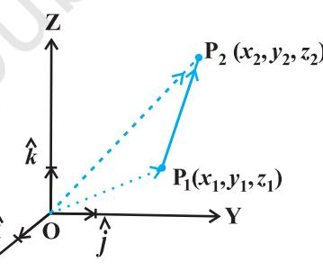

i.e.  
  
$\frac{\mathrm{P_{i}P_{2}}}{\mathrm{P_{i}P_{2}}}=(x_{2}\hat{i}+y_{2}\hat{j}+z_{2}\hat{k})-(x_{1}\hat{i}+y_{1}\hat{j}+z_{1}\hat{k})$  
  
$\frac{\mathrm{P_{i}P_{2}}}{\mathrm{P_{i}P_{2}}}=(x_{2}\hat{i}+y_{2}\hat{j}+z_{2}\hat{k})-(x_{1}\hat{i}+y_{1}\hat{j}+z_{1}\hat{k})$  

$$\hat{\hat{\hat{\jmath}}}=(x_{2}-x_{1})\hat{\hat{i}}+(y_{2}-y_{1})\hat{\hat{j}}+(z_{2}-z_{1})\hat{\hat{k}}$$

The magnitude of vector is given by

=

$$|\overline{{{\mathrm{P}_{1}\mathrm{P}_{2}}}}|={\sqrt{\left(x_{2}-x_{1}\right)^{2}+\left(y_{2}-y_{1}\right)^{2}+\left(z_{2}-z_{1}\right)^{2}}}$$

**Example 10** Find the vector joining the points P(2, 3, 0) and Q(– 1, – 2, – 4) directed from P to Q.

**Solution** Since the vector is to be directed from P to Q, clearly P is the initial point and Q is the terminal point. So, the required vector joining P and Q is the vector , given by

$$\overline{\mathrm{PQ}}=\,(-1-2)\hat{i}+(-2-3)\,\hat{j}+(-4-0)\hat{k}$$
  
  
i.e.  
  

$$\overline{\mathrm{PQ}}=\,-3\hat{i}-5\,\hat{j}-4\hat{k}.$$

**Fig 10.16**

#### **10.5.3** *Section formula*

Let P and Q be two points represented by the position vectors , respectively,

with respect to the origin O. Then the line segment joining the points P and Q may be divided by a third point, say R, in two ways – internally (Fig 10.16) and externally (Fig 10.17). Here, we intend to find the position vector for the point R with respect to the origin O. We take the two cases one by one.

**Case I** When R divides PQ internally (Fig 10.16).

If R divides such that = ,

where *m* and *n* are positive scalars, we say that the point R divides internally in the ratio of *m* : *n*. Now from triangles ORQ and OPR, we have

$\begin{array}{c}\mbox{$\rm RQ=\overline{\rm OP}-\overline{\rm OR}=\overline{b}-\overline{r}$}\\ \mbox{$\rm PR=\overline{\rm OR}-\overline{\rm OP}=\overline{r}-\overline{a}$},\end{array}$

Therefore, we have  
  

$$\begin{array}{c}\includegraphics[width=142.26378pt]{Fig1}\end{array}$$
  
  
or  
  

$$\begin{array}{c}\includegraphics[width=142.26378pt]{Fig2}\end{array}$$
  
  
(on simplification)

Hence, the position vector of the point R which divides P and Q internally in the ratio of *m* : *n* is given by

$${\overline{{\mathrm{OR}}}}={\frac{m{\bar{b}}+n{\bar{a}}}{m+n}}$$

**Case II** When R divides PQ externally (Fig 10.17). We leave it to the reader as an exercise to verify that the position vector of the point R which divides the line segment PQ externally in the ratio

$$m:n\quad{\mathrm{i.e.~}}\ {\frac{{\mathrm{PR}}}{{\mathrm{QR}}}}={\frac{m}{n}}\quad{\mathrm{is~given~by}}$$

$${\overrightarrow{\mathrm{OR}}}={\frac{m{\overrightarrow{b}}-n{\overrightarrow{a}}}{m-n}}$$

*Remark* If R is the midpoint of PQ , then *m* = *n*. And therefore, from Case I, the midpoint R of , will have its position vector as

$${\overline{{\mathrm{OR}}}}={\frac{{\vec{a}}+{\vec{b}}}{2}}$$

**Example 11** Consider two points P and Q with position vectors and . Find the position vector of a point R which divides the line joining P and Q in the ratio 2:1, (i) internally, and (ii) externally.

#### **Solution**

- (i) The position vector of the point R dividing the join of P and Q internally in the ratio 2:1 is
$\begin{array}{c}\mbox{\rm OR}=\mbox{\rm(}a+b\mbox{\rm)}+\mbox{\rm(}3a-2b\mbox{\rm)}\\ \mbox{\rm(}a+b\mbox{\rm)}+\mbox{\rm(}3a-2b\mbox{\rm)}\end{array}$

- (ii) The position vector of the point R dividing the join of P and Q externally in the ratio 2:1 is
$\begin{array}{c}\mbox{\rm OR}=\frac{2(a+b)-(3a-2b)}{2-1}=4b-a\end{array}$

**Example 12** Show that the points A(2 ), B( 3 5 ), C(3 4 4 ) ˆ ˆ ˆ ˆ ˆ ˆ ˆ ˆ *i j k i j k i j k* − + − − − − are the vertices of a right angled triangle.

**Solution** We have

$$\begin{array}{l}\hline\hline\mbox{AB}=(1-2)\hat{i}+(-3+1)\hat{j}+(-5-1)\hat{k}\ =-\hat{i}-2\hat{j}-6\hat{k}\\ \hline\mbox{BC}=(3-1)\hat{i}+(-4+3)\hat{j}+(-4+5)\hat{k}\ =2\hat{i}-\hat{j}+\hat{k}\\ \hline\mbox{CA}=(2-3)\hat{i}+(-1+4)\hat{j}+(1+4)\hat{k}\ =-\hat{i}+3\hat{j}+5\hat{k}\end{array}$$

Further, note that

$${\overrightarrow{\mathrm{AB}}}\mid^{2}=41=6+35=\mid{\overrightarrow{\mathrm{BC}}}\mid^{2}+\mid{\overrightarrow{\mathrm{CA}}}\mid^{2}$$

Hence, the triangle is a right angled triangle.

## **EXERCISE 10.2**

- **1.** Compute the magnitude of the following vectors:

$$\vec{a}=\hat{i}+\hat{j}+k;\;\;\;\;\;\vec{b}=2\hat{i}-7\hat{j}-3\hat{k};\;\;\;\;\;\vec{c}=\frac{1}{\sqrt{3}}\hat{i}+\frac{1}{\sqrt{3}}\hat{j}-\frac{1}{\sqrt{3}}\hat{k}$$

- **2.** Write two different vectors having same magnitude.
- **3.** Write two different vectors having same direction.
- **4.** Find the values of *x* and *y* so that the vectors 2 3 and ˆ ˆ ˆ ˆ *i j xi yj* + + are equal.
- **5.** Find the scalar and vector components of the vector with initial point (2, 1) and terminal point (– 5, 7).
- **6.** Find the sum of the vectors = ˆ ˆ ˆ *i j k* − + 2 , = ˆ ˆ ˆ − + + 2 4 5 *i j k* and = ˆ ˆ ˆ *c i j k* = − 6 – 7 .
- **7.** Find the unit vector in the direction of the vector = ˆ ˆ ˆ *a i j k* = + + 2 .
- **8.** Find the unit vector in the direction of vector , where P and Q are the points (1, 2, 3) and (4, 5, 6), respectively.
- **9.** For given vectors, = ˆ ˆ ˆ 2 2 *i j k* − + and = ˆ ˆ ˆ − + − *i j k* , find the unit vector in the direction of the vector .
- **10.** Find a vector in the direction of vector ˆ ˆ ˆ 5 2 *i j k* − + which has magnitude 8 units.
- **11.** Show that the vectors ˆ ˆ ˆ ˆ ˆ ˆ 2 3 4 and 4 6 8 *i j k i j k* − + − + − are collinear.
- **12.** Find the direction cosines of the vector ˆ ˆ ˆ *i j k* + + 2 3 .
- **13.** Find the direction cosines of the vector joining the points A (1, 2, –3) and B (–1, –2, 1), directed from A to B.
- **14.** Show that the vector ˆ ˆ ˆ *i j k* + + is equally inclined to the axes OX, OY and OZ.
- **15.** Find the position vector of a point R which divides the line joining two points P and Q whose position vectors are ˆ ˆ ˆ ˆ ˆ ˆ *i j k i j k* + − + + 2 and – respectively, in the ratio 2 : 1
	- (i) internally (ii) externally
- **16.** Find the position vector of the mid point of the vector joining the points P(2, 3, 4) and Q(4, 1, –2).
- **17.** Show that the points A, B and C with position vectors, = ˆ ˆ ˆ 3 4 4 , *i j k* − − = ˆ ˆ ˆ 2*i j k* − + and = ˆ ˆ ˆ *i j k* − − 3 5 , respectively form the vertices of a right angled triangle.
- **18.** In triangle ABC (Fig 10.18), which of the following is not true:
	- (A)
	- (B)
	- (C)
	- (D)

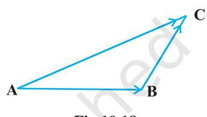

- **19.** If are two collinear vectors, then which of the following are incorrect:
	- (A)
	- (B)
	- (C) the respective components of are not proportional
	- (D) both the vectors have same direction, but different magnitudes.

## **10.6 Product of Two Vectors**

So far we have studied about addition and subtraction of vectors. An other algebraic operation which we intend to discuss regarding vectors is their product. We may recall that product of two numbers is a number, product of two matrices is again a matrix. But in case of functions, we may multiply them in two ways, namely, multiplication of two functions pointwise and composition of two functions. Similarly, multiplication of two vectors is also defined in two ways, namely, scalar (or dot) product where the result is a scalar, and vector (or cross) product where the result is a vector. Based upon these two types of products for vectors, they have found various applications in geometry, mechanics and engineering. In this section, we will discuss these two types of products.

#### **10.6.1** *Scalar (or dot) product of two vectors*

**Definition 2** The scalar product of two nonzero vectors , denoted by , is

defined as = where, θ is the angle between (Fig 10.19). If either then θ is not defined, and in this case, we **Fig 10.19**

define

## **Observations**

- 1. is a real number.
- 2. Let be two nonzero vectors, then if and only if are perpendicular to each other. i.e.

- 3. If θ = 0, then
In particular, as θ in this case is 0.

- 4. If θ = π, then ⋅ = −| | | | r r r r *a b a b*
In particular, , as θ in this case is π.

- 5. In view of the Observations 2 and 3, for mutually perpendicular unit vectors ˆ ˆ ˆ *i j k* , and , we have

$${\frac{\left(-{\hat{i}}\cdot{\hat{i}}={\hat{j}}\cdot{\hat{j}}={\hat{k}}\cdot{\hat{k}}=1,\right.}{\left.{\hat{i}}\cdot{\hat{j}}={\hat{j}}\cdot{\hat{k}}={\hat{k}}\cdot{\hat{i}}=0\right.}}$$

- 6. The angle between two nonzero vectors is given by

$$\cos\theta=\frac{\vec{a}\cdot\vec{b}}{\left|\vec{a}\,\right|\left|\vec{b}\,\right|},\;\;\mathrm{or}\;\;\theta\;=\cos^{-1}\!\left(\frac{\vec{a}\,\vec{b}}{\left|\,\vec{a}\,\right|\left|\vec{b}\,\right|}\right)$$

- 7. The scalar product is commutative. i.e.

$${\vec{a}}\cdot b=b\cdot{\vec{a}}\qquad\quad{\mathrm{(Why?)}}$$

### **Two important properties of scalar product**

**Property 1** (Distributivity of scalar product over addition) Let be any three vectors, then

$$\vec{a}\cdot(\vec{b}+\vec{c}\,)=\vec{a}\cdot\vec{b}\ +\ \vec{a}\cdot\vec{c}$$

**Property 2** Let be any two vectors, and l be any scalar. Then

$$(\lambda\vec{a})\cdot\vec{b}=(\lambda\vec{a})\cdot\vec{b}=\lambda(\vec{a}\cdot\vec{b})=\vec{a}\cdot(\lambda\vec{b})$$

If two vectors are given in component form as 1 2 3 ˆ ˆ ˆ *a i a j a k* + + and 1 2 3 ˆ ˆ ˆ *b i b j b k* + + , then their scalar product is given as

 = 1 2 3 1 2 3 ˆ ˆ ˆ ˆ ˆ ˆ (*a i a j a k b i b j b k* + + ⋅ + + ) ( ) = 1 1 2 3 2 1 2 3 ˆ ˆ ˆ ˆ ˆ ˆ ˆ ˆ *a i b i b j b k a j b i b j b k* ⋅ + + + ⋅ + + ( ) ( ) + 3 1 2 3 ˆ ˆ ˆ ˆ *a k b i b j b k* ⋅ + + ( ) = 1 1 1 2 1 3 2 1 2 2 2 3 ˆ ˆ ˆ ˆ ˆ ˆ ˆ ˆ ˆ ˆ ˆ ˆ *a b i i a b i j a b i k a b j i a b j j a b j k* ( ) ( ) ( ) ( ) ( ) ( ) ⋅ + ⋅ + ⋅ + ⋅ + ⋅ + ⋅ + 3 1 3 2 3 3 ˆ ˆ ˆ ˆ ˆ ˆ *a b k i a b k j a b k k* ( ) ( ) ( ) ⋅ + ⋅ + ⋅ (Using the above Properties 1 and 2) = *a*1 *b*1 + *a*2 *b*2 + *a*3 *b*3 (Using Observation 5)

Thus = 1 1 2 2 3 3 *a b a b a b* + +

## **10.6.2** *Projection of a vector on a line*

Suppose a vector makes an angle θ with a given directed line *l* (say), in the *anticlockwise direction* (Fig 10.20). Then the projection of on *l* is a vector (say) with magnitude , and the direction of being the same (or opposite) to that of the line *l*, depending upon whether cosθ is positive or negative. The vector

**Fig 10.20**

is called the *projection vector*, and its magnitude | | is simply called as the *projection* of the vector on the directed line *l*.

For example, in each of the following figures (Fig 10.20(i) to (iv)), projection vector of along the line *l* is vector .

## **Observations**

- 1. If *p*ˆ is the unit vector along a line *l*, then the projection of a vector on the line *l* is given by *a p*⋅ ˆ .
- 2. Projection of a vector on other vector r *b* , is given by

$$\vec{\bar{a}}\!\cdot\!\hat{\bar{b}},\quad\mathrm{or}\quad\vec{\bar{a}}\!\cdot\!\left(\frac{\vec{b}}{|\vec{b}\,|}\right),\;\;\mathrm{or}\;\;\frac{1}{|\vec{b}\,|}(\vec{\bar{a}}\!\cdot\!\vec{b})$$

- 3. If θ = 0, then the projection vector of will be itself and if θ = π, then the projection vector of will be .
- 4. If = 2 π θ or 3 = 2 π θ , then the projection vector of will be zero vector.

*Remark* If α, β and γ are the direction angles of vector 1 2 3 ˆ ˆ ˆ = + + *a i a j a k* , then its direction cosines may be given as

$\cos\alpha=\frac{\bar{a}\cdot\bar{i}}{|\bar{a}||\bar{i}|}=\frac{a_{1}}{|\bar{a}|}$, $\cos\beta=\frac{a_{2}}{|\bar{a}|}$, and $\cos\gamma=\frac{a_{3}}{|\bar{a}|}$.  
  

Also, note that are respectively the projections of along OX, OY and OZ. i.e., the scalar components *a*1 , *a*2 and *a*3 of the vector , are precisely the projections of along *x*-axis, *y*-axis and *z*-axis, respectively. Further, if is a unit vector, then it may be expressed in terms of its direction cosines as

$$\vec{a}=\cos\alpha\hat{i}+\cos\beta\hat{j}+\cos\gamma\hat{k}$$

**Example 13** Find the angle between two vectors with magnitudes 1 and 2 respectively and when =1.

**Solution** Given . We have

$$\theta=\cos^{-1}\!\left({\frac{\vec{a}\cdot\vec{b}}{\left|\,{\vec{a}}\,\right|\,{\vec{b}}\,\right|}}\right)=\cos^{-1}\!\left({\frac{1}{2}}\right)={\frac{\pi}{3}}$$

**Example 14** Find angle 'θ' between the vectors . **Solution** The angle θ between two vectors is given by

$$\cos\theta=\frac{\vec{a}\cdot\vec{b}}{|\vec{a}\,||\vec{b}\,|}$$
  
  
Now  
  

$$\vec{a}\cdot\vec{b}=(\hat{i}+\hat{j}-\hat{k})\cdot(\hat{i}-\hat{j}+\hat{k})=1-1-1=-1\,.$$

Therefore, we have  
  

$$\cos\theta=\frac{-1}{3}$$

hence the required angle is θ =

**Example 15** If , then show that the vectors are perpendicular.

**Solution** We know that two nonzero vectors are perpendicular if their scalar product is zero.

Here  
  

$$\vec{a}+\vec{b}=(5\hat{i}-\hat{j}-3\hat{k})+(\hat{i}+3\hat{j}-5\hat{k})=6\hat{i}+2\hat{j}-8\hat{k}$$
  
  
and  
  

$$\vec{a}-\vec{b}=(5\hat{i}-\hat{j}-3\hat{k})-(\hat{i}+3\hat{j}-5\hat{k})=4\hat{i}-4\hat{j}+2\hat{k}$$

So  
  

$$(\vec{a}+\vec{b})\cdot(\vec{a}-\vec{b})=(6\vec{i}+2\vec{j}-8\vec{k})\cdot(4\vec{i}-4\vec{j}+2\vec{k})=24-8-16=0.$$

Hence are perpendicular vectors.

**Example 16** Find the projection of the vector ˆ ˆ ˆ = + + 2 3 2 *i j k* on the vector ˆ ˆ ˆ = + + *i j k* 2 . r

**Solution** The projection of vector on the vector *b* is given by

$${\frac{1}{|\vec{b}|}}(\vec{a}\cdot\vec{b})\ =\ {\frac{(2\times1+3\times2+2\times1)}{\sqrt{\left(1\right)^{2}+\left(2\right)^{2}+\left(1\right)^{2}}}}={\frac{10}{\sqrt{6}}}={\frac{5}{3}}{\sqrt{6}}$$

**Example 17** Find , if two vectors are such that and .

**Solution** We have

$$\begin{array}{r l}{\mid{\vec{a}}-{\vec{b}}\mid^{2}=({\vec{a}}-{\vec{b}})\cdot({\vec{a}}-{\vec{b}})}\\ {=\ {\vec{a}}.{\vec{a}}-{\vec{a}}\cdot{\vec{b}}-{\vec{b}}\cdot{\vec{a}}+{\vec{b}}\cdot{\vec{b}}}\end{array}$$

$$=\mid\bar{a}\mid^{2}-2(\bar{a}\cdot\bar{b})+\mid\bar{b}\mid^{2}$$
 
$$=(2)^{2}-2(4)+(3)^{2}$$
  
  
Therefore  
  

$$\mid\bar{a}-\bar{b}\mid=\sqrt{5}$$

**Example 18** If is a unit vector and , then find .

**Solution** Since is a unit vector, . Also,

$$({\vec{x}}-{\vec{a}})\cdot({\vec{x}}+{\vec{a}})=8$$

or

$${\mathrm{or}}\qquad\qquad{\vec{x}}\cdot{\vec{x}}+{\vec{x}}\cdot{\vec{a}}-{\vec{a}}\cdot{\vec{x}}-{\vec{a}}\cdot{\vec{a}}\ =8$$

Therefore = 3 (as magnitude of a vector is non negative).

**Example 19** For any two vectors , we always have (Cauchy-Schwartz inequality). r r r r

**Solution** The inequality holds trivially when either = = 0 or 0 *a b* . Actually, in such a situation we have . So, let us assume that . Then, we have

= | cos | 1 θ ≤

Therefore

**Example 20** For any two vectors , we always have (triangle inequality).

**Solution** The inequality holds trivially in case either

=

=

(How?). So, let . Then,

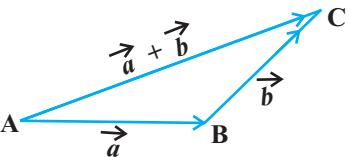

**Fig 10.21**

- = (scalar product is commutative) ≤ (since *x x x* ≤ ∀ ∈ | | **R** ) ≤ (from Example 19)
Hence  
  

$$\left|\,\vec{a}+\vec{b}\,\right|\leq\left|\,\vec{a}\,\right|+\left|\,\vec{b}\,\right|$$

*Remark* If the equality holds in triangle inequality (in the above Example 20), i.e.

$$\mid\vec{a}+\vec{b}\mid\;=\;\;\mid\vec{a}\mid+\mid\vec{b}\mid\;,$$

then =

showing that the points A, B and C are collinear.

**Example 21** Show that the points A( 2 3 5 ), B( 2 3 ) ˆ ˆ ˆ ˆ ˆ ˆ − + + + + *i j k i j k* and C(7 ) ˆ ˆ *i k* − are collinear.

**Solution** We have

$$\begin{array}{l}\mbox{AB}=(1+2)\hat{i}+(2-3)\hat{j}+(3-5)\hat{k}=3\hat{i}-\hat{j}-2\hat{k},\\ \mbox{BC}=(7-1)\hat{i}+(0-2)\hat{j}+(-1-3)\hat{k}=6\hat{i}-2\hat{j}-4\hat{k},\\ \mbox{AC}=(7+2)\hat{i}+(0-3)\hat{j}+(-1-5)\hat{k}=9\hat{i}-3\hat{j}-6\hat{k}\\ \mbox{AB}\mid=\sqrt{14},\mid\mbox{BC}\mid=2\sqrt{14}\;\;\;\mbox{and}\;\;\;\mid\mbox{AC}\mid=3\sqrt{14}\end{array}$$

Therefore

Hence the points A, B and C are collinear.

A**Note** In Example 21, one may note that although but the points A, B and C do not form the vertices of a triangle.

**EXERCISE 10.3**

- **1.** Find the angle between two vectors with magnitudes 3 and 2 , respectively having .
- **2.** Find the angle between the vectors ˆ ˆ *i j k i j k* ˆ ˆ ˆ ˆ − + − + 2 3 and 3 2 and ˆ ˆ *i j k i j k* ˆ ˆ ˆ ˆ − + − + 2 3 and 3 2
- **3.** Find the projection of the vector ˆ ˆ *i j* − on the vector ˆ ˆ *i j* + .
- **4.** Find the projection of the vector ˆ ˆ ˆ *i j k* + + 3 7 on the vector ˆ ˆ ˆ 7 8 *i j k* − + .
- **5.** Show that each of the given three vectors is a unit vector:

$$\frac{1}{7}(2\hat{i}+3\hat{j}+6\hat{k}),\;\frac{1}{7}(3\hat{i}-6\hat{j}+2\hat{k}),\;\;\frac{1}{7}(6\hat{i}+2\hat{j}-3\hat{k})$$

Also, show that they are mutually perpendicular to each other.

- **6.** Find , if .
- **7.** Evaluate the product .
- **8.** Find the magnitude of two vectors , having the same magnitude and such that the angle between them is 60o and their scalar product is 1 2 .
- **9.** Find , if for a unit vector , .
- **10.** If are such that is perpendicular to , then find the value of λ.
- **11.** Show that is perpendicular to , for any two nonzero vectors .
- **12.** If , then what can be concluded about the vector ?
- **13.** If are unit vectors such that , find the value of .
- **14.** If either vector . But the converse need not be true. Justify your answer with an example.
- **15.** If the vertices A, B, C of a triangle ABC are (1, 2, 3), (–1, 0, 0), (0, 1, 2), respectively, then find ∠ABC. [∠ABC is the angle between the vectors and ].
- **16.** Show that the points A(1, 2, 7), B(2, 6, 3) and C(3, 10, –1) are collinear.
- **17.** Show that the vectors ˆ ˆ ˆ ˆ ˆ ˆ ˆ ˆ ˆ 2 , 3 5 and 3 4 4 *i j k i j k i j k* − + − − − − form the vertices of a right angled triangle.
- **18.** If is a nonzero vector of magnitude '*a*' and λ a nonzero scalar, then λ is unit vector if

(A) λ = 1 (B) λ = – 1 (C) *a* = |λ| (D) *a* = 1/|λ|

### **10.6.3** *Vector (or cross) product of two vectors*

In Section 10.2, we have discussed on the three dimensional right handed rectangular coordinate system. In this system, when the positive *x*-axis is rotated counterclockwise into the positive *y*-axis, a right handed (standard) screw would advance in the direction of the positive *z*-axis (Fig 10.22(i)).

In a right handed coordinate system, the thumb of the right hand points in the direction of the positive *z*-axis when the fingers are curled in the direction away from the positive *x*-axis toward the positive *y*-axis (Fig 10.22(ii)).

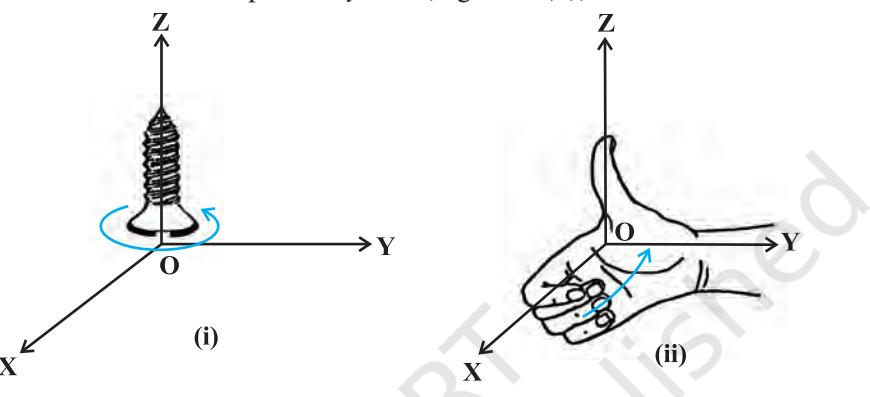

**Fig 10.22 (i), (ii)**

**Definition 3** The vector product of two nonzero vectors , is denoted by and defined as

If either , then θ is not defined and in this case, we define . **Observations**

- 1. is a vector.
- 2. Let be two nonzero vectors. Then if and only if are parallel (or collinear) to each other, i.e.,

$${\vec{a}}\times{\vec{b}}=\ {\vec{0}}\Longleftrightarrow{\vec{a}}\,\|\,{\vec{b}}$$

In particular, and , since in the first situation, θ = 0 and in the second one, θ = π, making the value of sin θ to be 0.

- 3. If 2 π θ = then .
- 4. In view of the Observations 2 and 3, for mutually perpendicular unit vectors ˆ ˆ ˆ *i j k* , and (Fig 10.24), we have

$\hat{i}\times\hat{i}=\hat{j}\times\hat{j}=\hat{k}\times\hat{k}=\vec{0}$  
  
$\hat{i}\times\hat{j}=\hat{k},\ \ \hat{j}\times\hat{k}=\hat{i},\ \ \hat{k}\times\hat{i}=\hat{j}$  
  
Fig 10.24

- 5. In terms of vector product, the angle between two vectors may be given as

$$\sin\theta={\frac{|\,{\vec{a}}\times{\vec{b}}\,|}{|\,{\vec{a}}\,||\,{\vec{b}}\,|}}$$

- 6. It is always true that the vector product is not commutative, as = . Indeed, , where form a right handed system, i.e., θ is traversed from , Fig 10.25 (i). While, , where form a right handed system i.e. θ is traversed from , Fig 10.25(ii).
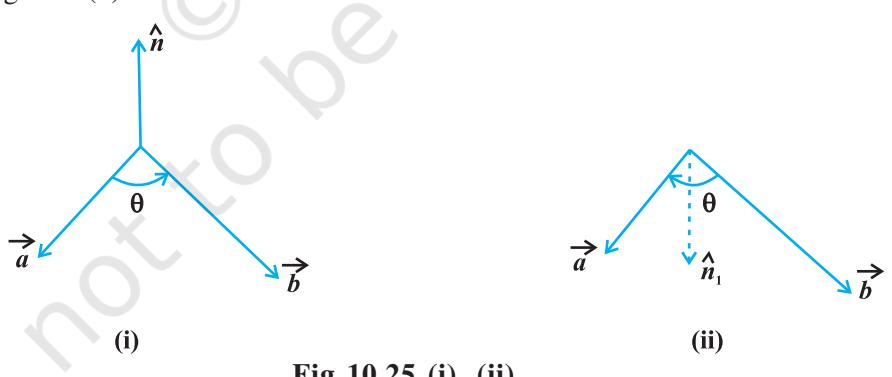

**Fig 10.25 (i), (ii)**

Thus, if we assume to lie in the plane of the paper, then 1 *n n* ˆ ˆ and both will be perpendicular to the plane of the paper. But, *n*ˆ being directed above the paper while 1 *n*ˆ directed below the paper. i.e. 1 *n n* ˆ ˆ = − .

Hence = =

- 7. In view of the Observations 4 and 6, we have

$$\hat{j}\times\hat{i}=-\hat{k},\;\;\hat{k}\times\hat{j}=-\hat{i}\mathrm{~and~}\;\;\hat{i}\times\hat{k}=-\hat{j}.$$

8. If represent the adjacent sides of a triangle then its area is given as

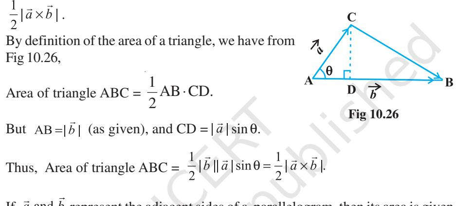

- 9. If represent the adjacent sides of a parallelogram, then its area is given by . From Fig 10.27, we have Area of parallelogram ABCD = AB. DE. But (as given), and . Thus,  **Fig 10.27**
Area of parallelogram ABCD =

We now state two important properties of vector product.

**Property 3** (Distributivity of vector product over addition): If are any three vectors and λ be a scalar, then

$$\begin{array}{r l}{{\mathrm{(i)}}}&{{}{\vec{a}}\times({\vec{b}}+{\vec{c}})={\vec{a}}\times{\vec{b}}+{\vec{a}}\times{\vec{c}}}\end{array}$$

$$\mathrm{(ii)}\quad\lambda(\vec{a}\times\vec{b})=(\lambda\vec{a})\times\vec{b}=\vec{a}\times(\lambda\vec{b})$$

Let be two vectors given in component form as 1 2 3 ˆ ˆ ˆ *a i a j a k* + + and 1 2 3 ˆ ˆ ˆ *b i b j b k* + + , respectively. Then their cross product may be given by

$${\vec{a}}\times{\vec{b}}={\left|\begin{array}{l l l}{{\hat{i}}}&{{}}&{{\hat{j}}}&{{}}&{{\hat{k}}}\\ {{}}&{{}}&{{}}&{{}}\\ {{a_{1}}}&{{a_{2}}}&{{a_{3}}}\\ {{}}&{{}}&{{}}&{{}}\\ {{b_{1}}}&{{b_{2}}}&{{b_{3}}}\end{array}\right|}$$

**Explanation** We have

 = 1 2 3 1 2 3 ˆ ˆ ˆ ˆ ˆ ˆ (*a i a j a k b i b j b k* + + × + + ) ( ) = 1 1 1 2 1 3 2 1 ˆ ˆ ˆ ˆ ˆ ˆ ˆ ˆ *a b i i a b i j a b i k a b j i* ( ) ( ) ( ) ( ) × + × + × + × + 2 2 2 3 ˆ ˆ ˆ ˆ *a b j j a b j k* ( ) ( ) × + × + 3 1 3 2 3 3 ˆ ˆ ˆ ˆ ˆ ˆ *a b k i a b k j a b k k* ( ) ( ) ( ) × + × + × (by Property 1) = 1 2 1 3 2 1 ˆ ˆ ˆ ˆ ˆ ˆ *a b i j a b k i a b i j* ( ) ( ) ( ) × − × − × + 2 3 3 1 3 2 ˆ ˆ ˆ ˆ ˆ ˆ *a b j k a b k i a b j k* ( ) ( ) ( ) × + × − × ˆ ˆ ˆ ˆ ˆ ˆ ˆ ˆ ˆ ˆ ˆ ˆ ˆ ˆ ˆ ˆ ˆ ˆ (as *i i j j k k i k k i j i i j k j j k* × = × = × = × = − × × = − × × = − × 0 and , and ) = 1 2 1 3 2 1 2 3 3 1 3 2 *a b k a b j a b k a b i a b j a b i* ˆ − − + + − ˆ ˆ ˆ ˆ ˆ ˆ ˆ ˆ ˆ ˆ ˆ ˆ ˆ ˆ (as , and ) *i j k j k i k i j* × = × = × = = 2 3 3 2 1 3 3 1 1 2 2 1 ˆ ˆ ˆ ( ) ( ) ( ) *a b a b i a b a b j a b a b k* − − − + − = 1 2 3 1 2 3 ˆ ˆ ˆ *i j k a a a b b b*

**Example 22** Find **Solution** We have

$$\begin{array}{c}\includegraphics[height=142.26375pt]{Fig1}\end{array}$$
  
  

$$\begin{array}{c}\includegraphics[height=142.26375pt]{Fig2}\end{array}$$
  
  

$$\begin{array}{c}\includegraphics[height=142.26375pt]{Fig3}\end{array}$$
  
  

$$\begin{array}{c}\includegraphics[height=142.26375pt]{Fig4}\end{array}$$
  
  

$$\begin{array}{c}\includegraphics[height=142.26375pt]{Fig5}\end{array}$$
  
  

$$\begin{array}{c}\includegraphics[height=142.26375pt]{Fig6}\end{array}$$
  
  

$$\begin{array}{c}\includegraphics[height=142.26375pt]{Fig7}\end{array}$$
  
  

$$\begin{array}{c}\includegraphics[height=142.26375pt]{Fig8}\end{array}$$
  
  
\[\begin{array}{c}\includegraphics[height=142.26375pt]{Fig9}\end{array}  
  

**Example 23** Find a unit vector perpendicular to each of the vectors and where .

**Solution** We have

A vector which is perpendicular to both + − and r r r r *a b a b* is given by

$$(\vec{a}+\vec{b})\times(\vec{a}-\vec{b})=\begin{vmatrix}\hat{i}&\hat{j}&\hat{k}\\ 2&3&4\\ 0&-1&-2\end{vmatrix}=-2\hat{i}+4\hat{j}-2\hat{k}\ \ (=\vec{c},\ \text{say})$$
  
  
Now  
  

$$\begin{vmatrix}\vec{c}\end{vmatrix}=\sqrt{4+16+4}=\sqrt{24}=2\sqrt{6}$$
  
  
Therefore, the required unit vector is 

Therefore, the required unit vector is

$${\frac{\vec{c}}{|\,\vec{c}\,|}}={\frac{-1}{\sqrt{6}}}i+{\frac{2}{\sqrt{6}}}j-{\frac{1}{\sqrt{6}}}k$$

  
  
**Note** **There are two perpendicular directions to any plane. Thus, another unit vector perpendicular to $\vec{a}+\vec{b}$ and $\vec{a}-\vec{b}^{\prime}$ will be $\sqrt{6}-\sqrt{6}\ \hat{j}+\frac{1}{\sqrt{6}}\ \hat{k}$. But that will be a consequence of $(\vec{a}-\vec{b})\times(\vec{a}+\vec{b})$.  
  

**Example 24** Find the area of a triangle having the points A(1, 1, 1), B(1, 2, 3) and C(2, 3, 1) as its vertices.

**Solution** We have . The area of the given triangle is .

Now,  
  

$$\overline{\text{AB}}\times\overline{\text{AC}}\ =\begin{vmatrix}\hat{i}&\hat{j}&\hat{k}\\ 0&1&2\\ 1&2&0\end{vmatrix}=-4\hat{i}+2\hat{j}-\hat{k}$$

Therefore = 16 4 1 21 + + =

1 21

2

Thus, the required area is

**Example 25** Find the area of a parallelogram whose adjacent sides are given by the vectors

**Solution** The area of a parallelogram with as its adjacent sides is given by .

$$\mathrm{Now}$$

Now  
  

$$\vec{a}\times\vec{b}=\begin{vmatrix}\hat{i}&\hat{j}&\hat{k}\\ 3&1&4\\ 1&-1&1\end{vmatrix}=5\hat{i}+\hat{j}-4\hat{k}$$

Therefore  
  

$$|\,\bar{a}\times\bar{b}\,|\,=\sqrt{25+1+16}=\sqrt{42}$$

and hence, the required area is 42 .

## **EXERCISE 10.4**

- **1.** Find .
- **2.** Find a unit vector perpendicular to each of the vector , where .
- **3.** If a unit vector makes angles with , with ˆ ˆ 3 4 *i j* π π and an acute angle θ with

ˆ*k* , then find θ and hence, the components of .

- **4.** Show that

$$(\vec{a}-\vec{b})\times(\vec{a}+\vec{b})=2(\vec{a}\times\vec{b})$$

- **5.** Find λ and µ if .
- **6.** Given that and . What can you conclude about the vectors ?
- **7.** Let the vectors be given as 1 2 3 1 2 3 ˆ ˆ ˆ ˆ ˆ ˆ *a i a j a k b i b j b k* + + + + , , 1 2 3 ˆ ˆ ˆ *c i c j c k* + + . Then show that .
- **8.** If either then . Is the converse true? Justify your answer with an example.
- **9.** Find the area of the triangle with vertices A(1, 1, 2), B(2, 3, 5) and C(1, 5, 5).

- **10.** Find the area of the parallelogram whose adjacent sides are determined by the vectors and .
**11.** Let the vectors be such that , then is a unit vector, if the angle between is (A) π/6 (B) π/4 (C) π/3 (D) π/2

- **12.** Area of a rectangle having vertices A, B, C and D with position vectors 1 1 1
$-\hat{i}+\frac{1}{2}\,\hat{j}+4\hat{k}\,,\ \hat{i}+\frac{1}{2}\,\hat{j}+4\hat{k}\,,\ \hat{i}-\frac{1}{2}\,\hat{j}+4\hat{k}\ \ \mbox{and}\ \ -\hat{i}-\frac{1}{2}\,\hat{j}+4\hat{k}\,,$ respectively is  
  
(A) $\frac{1}{2}$ (B) $1$ (C) $2$ (D) $4$

## *Miscellaneous Examples*

**Example 26** Write all the unit vectors in XY-plane.

**Solution** Let be a unit vector in XY-plane (Fig 10.28). Then, from the figure, we have *x* = cos θ and *y* = sin θ (since | | = 1). So, we may write the vector as

$$\vec{r}\left(=\overline{\rm OP}\right)=\cos\theta\,\hat{i}+\sin\theta\,\hat{j}\tag{1}$$

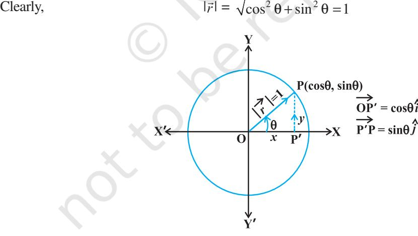

**Fig 10.28**

Also, as θ varies from 0 to 2π, the point P (Fig 10.28) traces the circle *x* 2 + *y* 2 = 1 counterclockwise, and this covers all possible directions. So, (1) gives every unit vector in the XY-plane.

**Example 27** If ˆ ˆ ˆ ˆ ˆ ˆ ˆ ˆ ˆ ˆ ˆ *i j k i j i j k i j k* + + + + − − − , 2 5 , 3 2 3 and 6 are the position vectors of points A, B, C and D respectively, then find the angle between and . Deduce that and are collinear.

**Solution** Note that if θ is the angle between AB and CD, then θ is also the angle between and .

Now  
  

$$\overline{\text{AB}}=\text{Position vector of B}-\text{Position vector of A}$$
 
$$=(2\hat{i}+5\hat{j})-(\hat{i}+\hat{j}+\hat{k})=\hat{i}+4\hat{j}-\hat{k}$$
  
  
Therefore  
  

$$|\overline{\text{AB}}|=\sqrt{(1)^{2}+(4)^{2}+(-1)^{2}}=3\sqrt{2}$$
  
  
Similarly  
  

$$\overline{\text{CD}}=-2\hat{i}-8\hat{j}+2\hat{k}\ \ \text{and}\ \ |\overline{\text{CD}}|=6\sqrt{2}$$
  
  
Thus  
  

$$\cos\theta=\frac{\overline{\text{AB}}\cdot\overline{\text{CD}}}{|\overline{\text{AB}}|\overline{\text{CD}}|}$$
  
  

$$=\frac{(1-2)+4(-8)+(-1)(2)}{(3\sqrt{2})(6\sqrt{2})}=\frac{-36}{36}=-1$$

Since 0 ≤ θ ≤ π, it follows that θ = π. This shows that and are collinear. **Alternatively**, which implies that and are collinear vectors. **Example 28** Let be three vectors such that and each one of them being perpendicular to the sum of the other two, find . **Solution** Given Now = + = = 9 + 16 + 25 = 50 Therefore = 50 5 2 =

**Example 29** Three vectors satisfy the condition . Evaluate the quantity .

**Solution** Since , we have

= 0

or = 0 Therefore ... (1) Again, = 0 or ... (2)

Similarly = – 4. ... (3)

Adding (1), (2) and (3), we have

2 ($\bar{a}\cdot\bar{b}+\bar{b}\cdot\bar{c}+\bar{a}\cdot\bar{c}$) = 29.  
  

or 2µ = – 29, i.e., µ =

**Example 30** If with reference to the right handed system of mutually perpendicular unit vectors , then express in the form is parallel to is perpendicular to

29 2 −

**Solution** Let is a scalar, i.e., .

Now  
  
$\tilde{\beta}_{2}=\tilde{\beta}-\tilde{\beta}_{1}=(2-3\lambda)\hat{i}+(1+\lambda)\hat{j}-3\hat{k}$.  
  

Now, since β2 is to be perpendicular to α , we should have . i.e.,

$$3(2-3\lambda)-(1+\lambda)\,=0$$

or λ =

Therefore  
  

$$\bar{\beta}_{1}=\frac{3}{2}\hat{i}-\frac{1}{2}\hat{j}\ \ \ \mbox{and}\ \ \bar{\beta}_{2}=\frac{1}{2}\hat{i}+\frac{3}{2}\hat{j}-3\hat{k}$$

1 2

## *Miscellaneous Exercise on Chapter 10*

- **1.** Write down a unit vector in XY-plane, making an angle of 30° with the positive direction of *x*-axis.
- **2.** Find the scalar components and magnitude of the vector joining the points P(*x*1 , *y*1 , *z* 1 ) and Q(*x*2 , *y*2 , *z* 2 ).
- **3.** A girl walks 4 km towards west, then she walks 3 km in a direction 30° east of north and stops. Determine the girl's displacement from her initial point of departure.
- **4.** If , then is it true that ? Justify your answer.
- **5.** Find the value of *x* for which ˆ ˆ ˆ *x i j k* ( ) + + is a unit vector.
- **6.** Find a vector of magnitude 5 units, and parallel to the resultant of the vectors .
- **7.** If , find a unit vector parallel to the vector .
- **8.** Show that the points A(1, 2, 8), B(5, 0, –2) and C(11, 3, 7) are collinear, and find the ratio in which B divides AC.
- **9.** Find the position vector of a point R which divides the line joining two points P and Q whose position vectors are externally in the ratio 1 : 2. Also, show that P is the mid point of the line segment RQ.
- **10.** The two adjacent sides of a parallelogram are ˆ ˆ ˆ ˆ ˆ ˆ 2 4 5 and 2 3 *i j k i j k* − + − − . Find the unit vector parallel to its diagonal. Also, find its area.
- **11.** Show that the direction cosines of a vector equally inclined to the axes OX, OY

and OZ are ± 1 3 1 3 1 3 , , .

- **12.** Let . Find a vector which is perpendicular to both and , and .
- **13.** The scalar product of the vector ˆ ˆ ˆ *i j k* + + with a unit vector along the sum of vectors ˆ ˆ ˆ 2 4 5 *i j k* + − and ˆ ˆ ˆ λ + + *i j k* 2 3 is equal to one. Find the value of λ.
- **14.** If are mutually perpendicular vectors of equal magnitudes, show that the vector is equally inclined to .

- **15.** Prove that , if and only if are perpendicular, given .
Choose the correct answer in Exercises 16 to 19.

**16.** If θ is the angle between two vectors , then only when

- (A) 0 2 π < θ < (B) 0 2 π ≤ θ ≤ (C) 0 < θ < π (D) 0 ≤ θ ≤ π
**17.** Let be two unit vectors and θ is the angle between them. Then is a unit vector if

* $\theta=\frac{\pi}{4}$ (B) $\theta=\frac{\pi}{3}$ (C) $\theta=\frac{\pi}{2}$ (D) $\theta=\frac{2\pi}{3}$

**18.** The value of ˆ ˆ ˆ ˆ ˆ ˆ ˆ ˆ ˆ *i j k j i k k i j* .( ) ( ) ( ) × + ⋅ × + ⋅ × is (A) 0 (B) –1 (C) 1 (D) 3

**19.** If θ is the angle between any two vectors , then when θ is equal to

  
  
**(A) 0** (B) 4 (C) 2 (D) $\pi$

## *Summary*

- ® Position vector of a point P(*x*, *y*, *z*) is given as , and its magnitude by 2 2 2 *x y z* + + .
- ® The scalar components of a vector are its direction ratios, and represent its projections along the respective axes.
- ® The magnitude (*r*), direction ratios (*a*, *b*, *c*) and direction cosines (*l*, *m*, *n*) of any vector are related as:

$$l=\frac{a}{r},\quad m=\frac{b}{r},\;\;n=\frac{c}{r}$$

- ® The vector sum of the three sides of a triangle taken in order is .
- ® The vector sum of two coinitial vectors is given by the diagonal of the parallelogram whose adjacent sides are the given vectors.
- ® The multiplication of a given vector by a scalar λ, changes the magnitude of the vector by the multiple |λ|, and keeps the direction same (or makes it opposite) according as the value of λ is positive (or negative).
- ® For a given vector , the vector gives the unit vector in the direction of .

® The position vector of a point R dividing a line segment joining the points P and Q whose position vectors are respectively, in the ratio *m* : *n*

- (i) internally, is given by .
- (ii) externally, is given by .
- ® The scalar product of two given vectors having angle θ between them is defined as

$${\vec{a}}\cdot{\vec{b}}=\mid{\vec{a}}\mid\mid{\vec{b}}\mid\cos\theta.$$

Also, when is given, the angle 'θ' between the vectors may be determined by

$$\left(\cos\theta={\frac{{\vec{a}}\cdot{\vec{b}}}{\left|{\vec{a}}\right|\left|{\vec{b}}\right|}}\right)$$

- ® If θ is the angle between two vectors , then their cross product is given as

$$\vec{a}\times\vec{b}=\mid\vec{a}\mid\mid\vec{b}\mid\sin\theta\,\hat{n}$$

where *n*ˆ is a unit vector perpendicular to the plane containing . Such that form right handed system of coordinate axes.

- ® If we have two vectors , given in component form as and λ any scalar,
then $\vec{a}+\vec{b}=(a_{1}+b_{1})\hat{i}+(a_{2}+b_{2})\hat{j}+(a_{3}+b_{3})\hat{k}$ ; $\hat{\lambda}\,\vec{a}=(\lambda a_{1})\hat{i}+(\lambda a_{2})\hat{j}+(\lambda a_{3})\hat{k}$ ; $\vec{a}\cdot\vec{b}=a_{1}b_{1}+a_{2}b_{2}+a_{3}b_{3}$ ; and $\vec{a}\times\vec{b}=\begin{vmatrix}\hat{i}&\hat{j}&\hat{k}\\ a_{1}&b_{1}&c_{1}\\ a_{2}&b_{2}&c_{2}\end{vmatrix}$.  
  

## *Historical Note*

The word *vector* has been derived from a Latin word *vectus*, which means "to carry". The germinal ideas of modern vector theory date from around 1800 when Caspar Wessel (1745-1818) and Jean Robert Argand (1768-1822) described that how a complex number *a + ib* could be given a geometric interpretation with the help of a directed line segment in a coordinate plane. William Rowen Hamilton (1805-1865) an Irish mathematician was the first to use the term vector for a directed line segment in his book *Lectures on Quaternions* (1853). Hamilton's method of quaternions (an ordered set of four real numbers given as:

ˆ ˆ ˆ ˆ ˆ ˆ *a bi cj dk i j k* + + + , , , following certain algebraic rules) was a solution to the

problem of multiplying vectors in three dimensional space. Though, we must mention here that in practice, the idea of vector concept and their addition was known much earlier ever since the time of Aristotle (384-322 B.C.), a Greek philosopher, and pupil of Plato (427-348 B.C.). That time it was supposed to be known that the combined action of two or more forces could be seen by adding them according to parallelogram law. The correct law for the composition of forces, that forces add vectorially, had been discovered in the case of perpendicular forces by Stevin-Simon (1548-1620). In 1586 A.D., he analysed the principle of geometric addition of forces in his treatise *DeBeghinselen der Weeghconst* ("Principles of the Art of Weighing"), which caused a major breakthrough in the development of mechanics. But it took another 200 years for the general concept of vectors to form.

In the 1880, Josaih Willard Gibbs (1839-1903), an American physicist and mathematician, and Oliver Heaviside (1850-1925), an English engineer, created what we now know as *vector analysis*, essentially by separating the real (*scalar*)

part of quaternion from its imaginary (*vector*) part. In 1881 and 1884, Gibbs printed a treatise entitled *Element of Vector Analysis*. This book gave a systematic and concise account of vectors. However, much of the credit for demonstrating the applications of vectors is due to the D. Heaviside and P.G. Tait (1831-1901) who contributed significantly to this subject.

