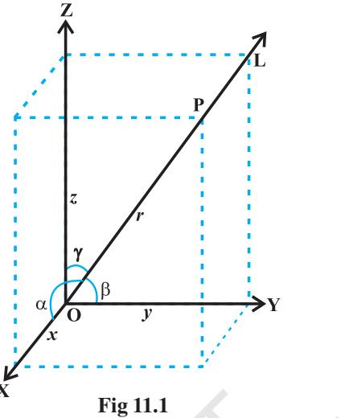
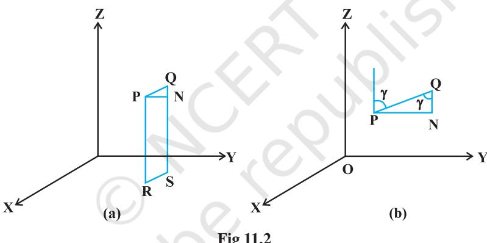
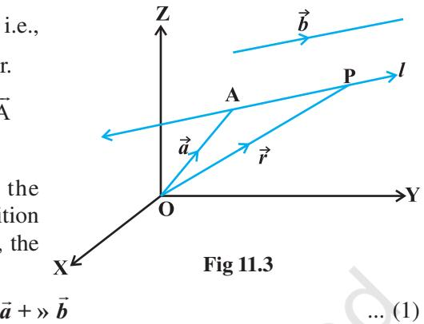
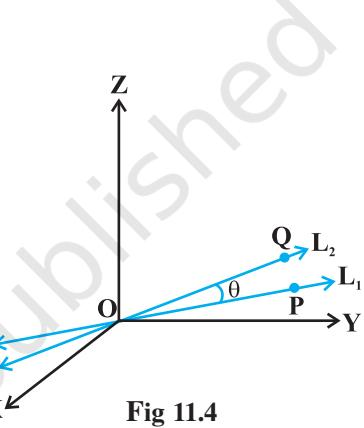
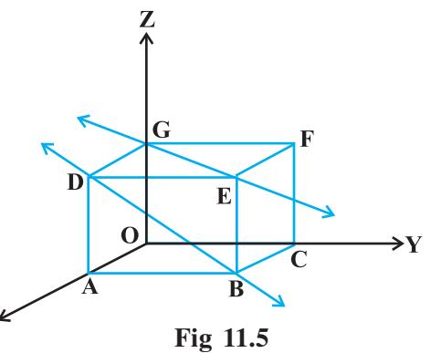
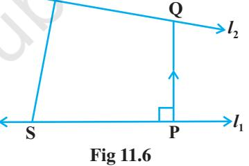
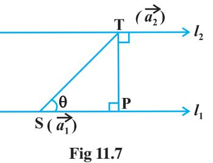

v *The moving power of mathematical invention is not reasoning but imagination. – A.DEMORGAN* v

## **11.1 Introduction**

In Class XI, while studying Analytical Geometry in two dimensions, and the introduction to three dimensional geometry, we confined to the Cartesian methods only. In the previous chapter of this book, we have studied some basic concepts of vectors. We will now use vector algebra to three dimensional geometry. The purpose of this approach to 3-dimensional geometry is that it makes the study simple and elegant*.

In this chapter, we shall study the direction cosines and direction ratios of a line joining two points and also discuss about the equations of lines and planes in space under different conditions, angle between two lines, two planes, a line and a plane, shortest distance between two skew lines and distance of a point from a plane. Most of

**Leonhard Euler (1707-1783)**

the above results are obtained in vector form. Nevertheless, we shall also translate these results in the Cartesian form which, at times, presents a more clear geometric and analytic picture of the situation.

## **11.2 Direction Cosines and Direction Ratios of a Line**

From Chapter 10, recall that if a directed line L passing through the origin makes angles α, β and γ with *x*, *y* and *z*-axes, respectively, called direction angles, then cosine of these angles, namely, cos α, cos β and cos γ are called direction cosines of the directed line L.

If we reverse the direction of L, then the direction angles are replaced by their supplements, i.e., , and . Thus, the signs of the direction cosines are reversed.

* For various activities in three dimensional geometry, one may refer to the Book *"A Hand Book for designing Mathematics Laboratory in Schools",* NCERT, 2005

Note that a given line in space can be extended in two opposite directions and so it has two sets of direction cosines. In order to have a unique set of direction cosines for a given line in space, we must take the given line as a directed line. These unique direction cosines are denoted by *l*, *m* and *n*.

*Remark* If the given line in space does not pass through the origin, then, in order to find its direction cosines, we draw a line through the origin and parallel to the given line. Now take one of the directed lines from the origin and find its direction cosines as two parallel line have same set of direction cosines.

Any three numbers which are proportional to the direction cosines of a line are called the *direction ratios* of the line. If *l*, *m*, *n* are direction cosines and *a*, *b*, *c* are direction ratios of a line, then *a* = λ*l*, *b*=λ*m* and *c* = λ*n*, for any nonzero λ ∈ **R**.

A**Note** Some authors also call direction ratios as direction numbers.

Let *a*, *b*, *c* be direction ratios of a line and let *l*, *m* and *n* be the direction cosines (*d*.*c*'s) of the line. Then

$$\frac{l}{a}=\frac{m}{b}=\frac{n}{c}=k\ \ (\mbox{say}),\,k\ \mbox{being a constant}.$$
  
  
Therefore  
  

$$l=ak,\,m=bk,\,n=ck$$
  
  
But  
  

$$l^{2}+m^{2}+n^{2}=1$$
  
  
Therefore  
  

$$k^{2}\ (a^{2}+b^{2}+c^{2})=1$$
  
  
or  
  

$$k=\ \pm\frac{1}{\sqrt{a^{2}+b^{2}+c^{2}}}$$

Hence, from (1), the *d*.*c*.'*s* of the line are

$$l=\pm\frac{a}{\sqrt{a^{2}+b^{2}+c^{2}}},m=\pm\frac{b}{\sqrt{a^{2}+b^{2}+c^{2}}},n=\pm\frac{c}{\sqrt{a^{2}+b^{2}+c^{2}}}$$

where, depending on the desired sign of *k*, either a positive or a negative sign is to be taken for *l*, *m* and *n*.

For any line, if *a*, *b*, *c* are direction ratios of a line, then *ka*, *kb*, *kc*; *k* ≠ 0 is also a set of direction ratios. So, any two sets of direction ratios of a line are also proportional. Also, for any line there are infinitely many sets of direction ratios.

#### **11.2.1** *Direction cosines of a line passing through two points*

Since one and only one line passes through two given points, we can determine the direction cosines of a line passing through the given points P(*x*1 , *y*1 , *z* 1 ) and Q(*x*2 , *y*2 , *z* 2 ) as follows (Fig 11.2 (a)).

**Fig 11.2**

Let *l*, *m*, *n* be the direction cosines of the line PQ and let it makes angles α, β and γ with the *x*, *y* and *z*-axis, respectively.

Draw perpendiculars from P and Q to XY-plane to meet at R and S. Draw a perpendicular from P to QS to meet at N. Now, in right angle triangle PNQ, ∠PQN= γ (Fig 11.2 (b).

Therefore, $\begin{array}{c}\includegraphics[height=36.135pt]{28.eps}\end{array}$

$$\gamma={\frac{\mathrm{{NQ}}}{\mathrm{{PQ}}}}={\frac{z_{2}-z_{1}}{\mathrm{{PQ}}}}$$

Similarly cosα =

Hence, the direction cosines of the line segment joining the points P(*x* 1 , *y*1 , *z*1 ) and Q(*x* 2 , *y*2 , *z*2 ) are

2 1 2 1 and cos PQ PQ *x x* − *y y* −

β=

$${\frac{\left({\begin{array}{l}{x_{2}\ -\ x_{1}}\\ {\mathrm{PQ}}\end{array}}\right)}{\mathrm{PQ}}}\,,\,{\frac{y_{2}\ -\ y_{1}}{\mathrm{PQ}}}\,,\,{\frac{z_{2}\ -\ z_{1}}{\mathrm{PQ}}}$$

2 1 2 1 2 1 ( ) ( ) *x x y y z z* − + − + −

where PQ = ( ) 2 2 2

A**Note** The direction ratios of the line segment joining P(*x*1 , *y*1 , *z* 1 ) and Q(*x*2 , *y*2 , *z* 2 ) may be taken as

$X_{2}-X_{1}$, $Y_{2}-Y_{1}$, $Z_{2}-Z_{1}$ or $X_{1}-X_{2}$, $Y_{1}-Y_{2}$, $Z_{1}-Z_{2}$

**Example 1** If a line makes angle 90°, 60° and 30° with the positive direction of *x*, *y* and *z*-axis respectively, find its direction cosines.

**Solution** Let the *d* . *c* .'*s* of the lines be *l* , *m*, *n*. Then *l* = cos 900 = 0, *m* = cos 600 = 1 2 ,

$$n=\cos\,30^{0}={\frac{\,{\stackrel{\cdot}{\sqrt{3\,}}}\,}{2}}\,.$$

**Example 2** If a line has direction ratios 2, – 1, – 2, determine its direction cosines.

**Solution** Direction cosines are

2 2 2 )2()1(2 2 −+−+ , 2 2 2 )2()1(2 1 −+−+ − , ( ) 2 2 2 )2(12 2 −+−+ − 2 1 2 , , 3 3 3 − −

or

**Example 3** Find the direction cosines of the line passing through the two points (– 2, 4, – 5) and (1, 2, 3).

**Solution** We know the direction cosines of the line passing through two points P(*x* 1 , *y* 1 , *z* 1 ) and Q(*x* 2 , *y* 2 , *z* 2 ) are given by

$${\frac{x_{2}\,-\,x_{1}}{\mathrm{PQ}}},\;\;{\frac{y_{2}\,-\,y_{1}}{\mathrm{PQ}}},\;\;{\frac{z_{2}\,-\,z_{1}}{\mathrm{PQ}}}$$

where  
  

$$\begin{array}{c}\mbox{PQ}=\sqrt{\left(x_{2}\ -\ x_{1}\right)^{2}\ +\ \left(y_{2}-y_{1}\right)^{2}\ +\ \left(z_{2}-z_{1}\right)^{2}}\\ \mbox{\bf?}\end{array}$$

Here P is (– 2, 4, – 5) and Q is (1, 2, 3).

So  
  

$$\text{PQ}=\sqrt{\left(1-\left(-2\right)\right)^{2}+\left(2-4\right)^{2}+\left(3-\left(-5\right)\right)^{2}}=\sqrt{77}$$

Thus, the direction cosines of the line joining two points is

$${\frac{3}{\sqrt{77}}},\ {\frac{-2}{\sqrt{77}}},\ {\frac{8}{\sqrt{77}}}$$

**Example 4** Find the direction cosines of *x*, *y* and *z*-axis.

**Solution** The *x*-axis makes angles 0°, 90° and 90° respectively with *x*, *y* and *z*-axis. Therefore, the direction cosines of *x*-axis are cos 0°, cos 90°, cos 90° i.e., 1,0,0. Similarly, direction cosines of *y*-axis and *z*-axis are 0, 1, 0 and 0, 0, 1 respectively.

**Example 5** Show that the points A (2, 3, – 4), B (1, – 2, 3) and C (3, 8, – 11) are collinear.

**Solution** Direction ratios of line joining A and B are

1 – 2, – 2 – 3, 3 + 4 i.e., – 1, – 5, 7.

The direction ratios of line joining B and C are

3 –1, 8 + 2, – 11 – 3, i.e., 2, 10, – 14.

It is clear that direction ratios of AB and BC are proportional, hence, AB is parallel to BC. But point B is common to both AB and BC. Therefore, A, B, C are collinear points.

## **EXERCISE 11.1**

- **1.** If a line makes angles 90°, 135°, 45° with the *x*, *y* and *z*-axes respectively, find its direction cosines.
- **2.** Find the direction cosines of a line which makes equal angles with the coordinate axes.
- **3.** If a line has the direction ratios –18, 12, 4, then what are its direction cosines ?
- **4.** Show that the points (2, 3, 4), (– 1, 2, 1), (5, 8, 7) are collinear.
- **5.** Find the direction cosines of the sides of the triangle whose vertices are (3, 5, – 4), (– 1, 1, 2) and (– 5, – 5, – 2).

## **11.3 Equation of a Line in Space**

We have studied equation of lines in two dimensions in Class XI, we shall now study the vector and cartesian equations of a line in space.

A line is uniquely determined if

- (i) it passes through a given point and has given direction, or
- (ii) it passes through two given points.

**11.3.1** *Equation of a line through a given point and parallel to given vector*  Let be the position vector of the given point A with respect to the origin O of the rectangular coordinate system. Let *l* be the line which passes through the point A and is parallel to a given vector . Let be the position vector of an arbitrary point P on the line (Fig 11.3).

Then AP uuur is parallel to the vector , i.e., AP uuur = λ , where λ is some real number.

But 
$$\text{AP}=\text{OP}-\text{OA}$$
 i.e.
$$\lambda\;\vec{b}=\;\vec{r}-\vec{a}$$
. 

uuur

uuur uuur

Conversely, for each value of the parameter λ, this equation gives the position vector of a point P on the line. Hence, the vector equation of the line is given by r r

*Remark* If ˆ ˆ ˆ = + + r *b ai bj ck* , then *a*, *b*, *c* are direction ratios of the line and conversely, if *a*, *b*, *c* are direction ratios of a line, then ˆ ˆ ˆ = + + r *b ai bj ck* will be the parallel to the line. Here, *b* should not be confused with | |.

= **»**

#### **Derivation of cartesian form from vector form**

*b a i b j c k*

Let the coordinates of the given point A be (*x*1 , *y*1 , *z* 1 ) and the direction ratios of the line be *a*, *b*, *c*. Consider the coordinates of any point P be (*x*, *y*, *z*). Then

$\bf r=x\hat{i}+y\hat{j}+z\hat{k}$; $\bf a=x_{1}\hat{i}+y_{1}\hat{j}+z_{1}\hat{k}$; $\bf a=x_{1}\hat{i}+y_{1}\hat{j}+z_{1}\hat{k}$; $\bf a=x_{1}\hat{i}+y_{1}\hat{j}+z_{1}\hat{k}$; \(\bf a=x_{1}\hat{i}+y_{1}\hat{j}+z_{1}\hat{k}  
  

and ˆ ˆ ˆ = + +

Substituting these values in (1) and equating the coefficients of ˆ ˆ *i j* , and *k* ˆ , we get

$$\chi=\chi_{1}+\lambda a;\;y=y_{1}+\lambda b;\;z=z_{1}+\lambda c\tag{2}$$

These are parametric equations of the line. Eliminating the parameter λ from (2), we get

$$\frac{x-x_{1}}{a}=\frac{y-y_{1}}{b}=\frac{z-z_{1}}{c}\tag{3}$$

This is the Cartesian equation of the line.

Note $\big{]}$ If $l,m,n$ are the direction cosines of the line, the equation of the line is  
  

$$\frac{x-x_{1}}{l}=\frac{y-y_{1}}{m}=\frac{z-z_{1}}{n}$$

**Example 6** Find the vector and the Cartesian equations of the line through the point (5, 2, – 4) and which is parallel to the vector ˆ ˆ ˆ 3 2 8 *i j k* + − . **Solution** We have r

$$\vec{a}=5\hat{i}+2\hat{j}-4\hat{k}\,\,\mathrm{and}\,\,\vec{b}=3\hat{i}+2\hat{j}-8\hat{k}$$

Therefore, the vector equation of the line is

$$\vec{r}=5\;\hat{i}+2\;\hat{j}-4\;\hat{k}+\;\lambda\;(\;3\;\hat{i}+2\;\hat{j}-8\;\hat{k})$$

Now, is the position vector of any point P(*x*, *y*, *z*) on the line.

Therefore, ˆ ˆ ˆ *xi y j z k* + + = ˆ ˆ ˆ ˆ ˆ ˆ 5 2 4 ( 3 2 8 ) *i j k i j k* + − + λ + − = ˆ ˆ ˆ (5 3 ) (2 2 ) ( 4 8 ) + λ + + λ + − − λ *i j k*

Eliminating λ , we get

$${\frac{x-5}{3}}={\frac{y-2}{2}}={\frac{z+4}{-8}}$$

which is the equation of the line in Cartesian form.

## **11.4 Angle between Two Lines**

Let L1 and L2 be two lines passing through the origin and with direction ratios *a*1 , *b*1 , *c*1 and *a*2 , *b*2 , *c*2 , respectively. Let P be a point on L1 and Q be a point on L2 . Consider the directed lines OP and OQ as given in Fig 11.6. Let θ be the acute angle between OP and OQ. Now recall that the directed line segments OP and OQ are vectors with components *a*1 , *b*1 , *c*1 and *a*2 , *b*2 , *c*2 , respectively. Therefore, the angle θ between them is given by

$\cos\theta=\frac{a_{1}a_{2}+b_{1}b_{2}+c_{1}c_{2}}{\sqrt{a_{1}^{2}+b_{1}^{2}+c_{1}^{2}}\sqrt{a_{2}^{2}+b_{2}^{2}+c_{2}^{2}}}$

The angle between the lines in terms of sin θ is given by

sin θ = 2 1 cos − θ = ( )( ) 2 1 2 1 2 1 2 2 2 2 2 2 2 1 1 1 2 2 2 ( ) 1 *a a b b c c a b c a b c* + + − + + + + = ( )( ) ( ) ( ) ( ) 2 2 2 2 2 2 2 1 1 1 2 2 2 1 2 1 2 1 2 2 2 2 2 2 2 1 1 1 2 2 2 *a b c a b c a a b b c c a b c a b c* + + + + − + + + + + + = 2 2 2 1 2 2 1 1 2 2 1 1 2 2 1 2 2 2 2 2 2 1 1 1 2 2 2 ( − + − + − ) ( ) ( ) + + + + *a b a b b c b c c a c a a b c a b c* ... (2)

... (1)

A**Note** In case the lines L1 and L2 do not pass through the origin, we may take lines L and L 1 2 ′ ′ which are parallel to L1 and L2 respectively and pass through the origin.

If instead of direction ratios for the lines L1 and L2 , direction cosines, namely, *l* 1 , *m*1 , *n*1 for L1 and *l* 2 , *m*2 , *n*2 for L2 are given, then (1) and (2) takes the following form:

$$\cos\ \theta=|l_{1}\ l_{2}+m_{1}m_{2}+n_{1}n_{2}|\ \ \ \ ({\rm as}\ \ l_{1}^{2}+m_{1}^{2}+n_{1}^{2}=1=l_{2}^{2}+m_{2}^{2}+n_{2}^{2}\ )\ \ \ \ \ \...\tag{3}$$

and sin θ = ( )2 2 2 1 2 2 1 1 2 2 1 1 2 2 1 *l m l m m n m n n l n l* − − − + − ( ) ( ) ... (4) are

Two lines with direction ratios *a*1 , *b*1 , *c*1 and *a*2 , *b*2 , *c*2

- (i) perpendicular i.e. if θ = 90° by (1)

$$a_{1}a_{2}+b_{1}b_{2}+c_{1}c_{2}=0$$

- (ii) parallel i.e. if θ = 0 by (2)

$${\frac{a_{1}}{a_{2}}}={\frac{b_{1}}{b_{2}}}={\frac{c_{1}}{c_{2}}}$$

Now, we find the angle between two lines when their equations are given. If θ is acute the angle between the lines

then  
  

$$\begin{array}{c}\includegraphics[width=140.0pt]{28.45}\end{array}$$

In Cartesian form, if θ is the angle between the lines

$$\begin{array}{c}\chi-\chi_{1}\\ a_{1}\end{array}=\begin{array}{c}\frac{y-y_{1}}{b_{1}}=\frac{z-z_{1}}{c_{1}}\\ \frac{y-y_{1}}{b_{1}}=\frac{z-z_{1}}{c_{1}}\end{array}\tag{1}$$

= ... (2)

and  
  

$$\begin{array}{c}\includegraphics[height=56.905512pt]{Fig1}\end{array}$$

where, *a*1 , *b*1, *c*1 and *a*2, *b*2 , *c*2 are the direction ratios of the lines (1) and (2), respectively, then

$$\cos\,\theta=\left|{\frac{a_{1}a_{2}+b_{1}b_{2}+c_{1}c_{2}}{\sqrt{{a_{1}}^{2}+{b_{1}}^{2}+{c_{1}}^{2}}}}\sqrt{{a_{2}}^{2}+{b_{2}}^{2}+{c_{2}}^{2}}}\right|$$

2 2 2 2

*y y z z b c* − −

**Example 7** Find the angle between the pair of lines given by

2

=

*x x a* −

$$\vec{r}=3\hat{i}+2\hat{j}-4\hat{k}+\lambda(\hat{i}+2\hat{j}+2\hat{k})$$

$$\qquad\qquad\vec{r}=5\hat{i}-2\hat{j}+\mu\,(3\hat{i}+2\hat{j}+6\hat{k})$$

**Solution** Here 1 r *b* = ˆ ˆ ˆ *i j k* + + 2 2 and 2 r *b* = ˆ ˆ ˆ 3 2 6 *i j k* + + The angle θ between the two lines is given by

cos θ = 1 2 1 2 ˆ ˆ ˆ ˆ ˆ ˆ ( 2 2 ) (3 2 6 ) 1 4 4 9 4 36 ⋅ + + ⋅ + + = + + + + r r r r *b b i j k i j k b b* = 3 4 12 19 3 7 21 + + = × Hence θ = cos–1 19 21 

**Example 8** Find the angle between the pair of lines

$${\frac{\stackrel{\cdot}{\frac{x+3}{3}}}{x+1}}={\frac{\stackrel{\cdot}{y-1}}{5}}={\frac{z+3}{4}}$$

and

**Solution** The direction ratios of the first line are 3, 5, 4 and the direction ratios of the second line are 1, 1, 2. If θ is the angle between them, then

$$\cos\ \theta=\left|\frac{3.1+5.1+4.2}{\sqrt{3^{2}+5^{2}+4^{2}}\sqrt{1^{2}+1^{2}+2^{2}}}\right|=\frac{16}{\sqrt{50}\ \sqrt{6}}=\frac{16}{5\sqrt{2}\ \sqrt{6}}=\frac{8\sqrt{3}}{15}.$$
  
  
The required angle is $\cos^{-1}\left(\frac{8\sqrt{3}}{15}\right)$.  
  

Hence, the required angle is cos

## **11.5 Shortest Distance between Two Lines**

If two lines in space intersect at a point, then the shortest distance between them is zero. Also, if two lines in space are parallel, then the shortest distance between them will be the perpendicular distance, i.e. the length of the perpendicular drawn from a point on one line onto the other line.

Further, in a space, there are lines which are neither intersecting nor parallel. In fact, such pair of lines are *non coplanar* and are called *skew lines*. For example, let us consider a room of size 1, 3, 2 units along *x*, *y* and *z*-axes respectively Fig 11.5.

The line GE that goes diagonally across the ceiling and the line DB passes through one corner of the ceiling directly above A and goes diagonally down the wall. These lines are skew because they are not parallel and also never meet.

By the shortest distance between two lines we mean the join of a point in one line with one point on the other line so that the length of the segment so obtained is the smallest.

For skew lines, the line of the shortest distance will be perpendicular to both the lines.

#### **11.5.1** *Distance between two skew lines*

We now determine the shortest distance between two skew lines in the following way: Let *l* 1 and *l* 2 be two skew lines with equations (Fig. 11.6)

$$\vec{r}=\vec{a}_{1}+\lambda\ \vec{b}_{1}$$
  
  
and  
  

$$\vec{r}=\vec{a}_{2}+\mu\ \vec{b}_{2}$$
  
  
... (2)

**T** Take any point S on *l* 1 with position vector 1 a r and T on *l* 2 , with position vector 2 a r . Then the magnitude of the shortest distance vector will be equal to that of the projection of ST along the

direction of the line of shortest distance (See 10.6.2). uuur

If PQ is the shortest distance vector between *l* 1 and *l* 2 , then it being perpendicular to both 1 r *b* and 2 r *b* , the unit vector *n*ˆ along PQ uuur would therefore be

$$\hat{n}=\frac{\hat{b}_{1}\times\hat{b}_{2}}{\mid\hat{b}_{1}\times\hat{b}_{2}\mid}\tag{3}$$

Then PQ

$${\overline{{\mathrm{PQ}}}}=d\;\;{\hat{n}}$$

where, *d* is the magnitude of the shortest distance vector. Let θ be the angle between ST uur and PQ uuur . Then

r r

PQ = ST | cos θ| But cos θ = PQ ST | PQ | | ST | ⋅ uuur uur uuuur uur = 2 1 ˆ ( ) ST ⋅ − r r *d n a a d* (since ST ) = − 2 1 uur r r *a a* = 1 2 2 1 1 2 ( ) ( ) ST × ⋅ − × r r r r r r *b b a a b b* [From (3)]

Hence, the required shortest distance is

$$d=\text{PQ}=\text{ST}\mid\cos\,\theta\mid$$
  
or  

$$d=\left\lfloor\frac{(\overrightarrow{\text{b}}_{1}\times\overrightarrow{\text{b}}_{2})\,\cdot\,(\overrightarrow{a}_{2}\times\overrightarrow{a}_{1})}{\mid\overrightarrow{b}_{1}\times\overrightarrow{b}_{2}\mid}\right\rfloor$$
  
Cartesian form.  

#### **Cartesian form**

The shortest distance between the lines

$$l_{1}:\frac{x-\ x_{1}}{a_{1}}\ =\ \frac{y-\ y_{1}}{b_{1}}\ =\ \frac{z-\ z_{1}}{c_{1}}$$
  
  
and  
  

$$l_{2}:\frac{x-\ x_{2}}{a_{2}}\ =\ \frac{y-\ y_{2}}{b_{2}}\ =\ \frac{z-\ z_{2}}{c_{2}}$$

$\left|\begin{array}{cccc}\chi_{2}-\chi_{1}&\chi_{2}-\chi_{1}&\chi_{2}-\chi_{1}\\ a_{1}&b_{1}&c_{1}\\ a_{2}&b_{2}&c_{2}\\ \hline\sqrt{\left(b_{1}c_{2}-b_{2}c_{1}\right)^{2}+\left(c_{1}a_{2}-c_{2}a_{1}\right)^{2}+\left(a_{1}b_{2}-a_{2}b_{1}\right)^{2}}\end{array}\right.$

is

#### **11.5.2** *Distance between parallel lines*

If two lines *l* 1 and *l* 2 are parallel, then they are coplanar. Let the lines be given by

$$\operatorname{ind}$$

and  
  

$$\begin{array}{c}\includegraphics[width=140.0pt]{28.45}\end{array}$$
  
  
... (1)  
  

$$\begin{array}{c}\includegraphics[width=140.0pt]{28.45}\end{array}$$
  
  
... (2)

where, 1 a r is the position vector of a point S on *l* 1 and 2 a r is the position vector of a point T on *l* 2 Fig 11.7.

As *l* 1 , *l* 2 are coplanar, if the foot of the perpendicular from T on the line *l* 1 is P, then the distance between the lines *l* 1 and *l* 2 = |TP|.

Let θ be the angle between the vectors ST uur and . Then

$$\bar{b}\times\overline{\rm ST}=(\,|\,\bar{b}\,|\,|\,\overline{\rm ST}|\sin\,\theta)\,\hat{n}\,\,\,...\tag{3}$$

where *n*ˆ is the unit vector perpendicular to the plane of the lines *l* 1 and *l* 2.

But 
$$\overrightarrow{\mathrm{ST}}=\vec{a}_{2}-\vec{a}_{1}$$
. 

Therefore, from (3), we get

$$\vec{b}\,\times(\vec{a}_{2}-\vec{a}_{1})=\vec{b}\,|\,{\rm PT}\,\,\hat{n}\qquad\mbox{(since PT=ST sin\theta)}

i.e.,

|\,\vec{b}\times(\vec{a}_{2}-\vec{a}_{1})|=|\,\vec{b}\,|\,{\rm PT}\cdot1\qquad\mbox{(as|\,\hat{n}\,|=1)}$$

Hence, the distance between the given parallel lines is

$$d=\left|{\overline{{\mathbf{P}\mathbf{T}}}}\,\right|=\left|{\frac{{\vec{b}}\,\,\mathrm{x}\,\left({\vec{a}}_{2}-{\vec{a}}_{1}\right)}{\mid{\vec{b}}\mid}}\right|$$

**Example 9** Find the shortest distance between the lines *l* 1 and *l* 2 whose vector equations are

$$\vec{r}=\hat{i}\ +\hat{j}+\hat{\lambda}\ (2\ \hat{i}-\hat{j}+\hat{k}\ )\tag{1}$$

and = ˆ ˆ ˆ ˆ ˆ ˆ 2 *i j k i j k* + − + µ − + (3 5 2 ) ... (2)

**Solution** Comparing (1) and (2) with = 1 1 + λ r r *a b* and 2 2 r a b = + µ r r r respectively, r

we get  
  
Therefore  
  
and  
  

$$\begin{array}{c}\includegraphics[width=142.26378pt]{Fig1}\end{array}$$

So  
  
$|\vec{b}_{1}\times\vec{b}_{2}|=\sqrt{9+1+49}=\sqrt{59}$

Hence, the shortest distance between the given lines is given by

*d* = 1 2 2 1 1 2 ( b b ) . ( a a ) | b b | × − × r r r r r r 59 10 59 |703| = +− =

**Example 10** Find the distance between the lines *l* 1 and *l* 2 given by

$$\vec{r}=\hat{i}+2\ \hat{j}-4\ \hat{k}+\lambda\ (\ 2\ \hat{i}+3\ \hat{j}+6\ \hat{k}\ )$$
  
  
and  
  

$$\vec{r}=\hat{3}\hat{i}+3\ \hat{j}-5\ \hat{k}+\mu\ (\ 2\ \hat{i}+3\ \hat{j}+6\ \hat{k}\ )$$

**Solution** The two lines are parallel (Why? ) We have

$\bar{\bar{a}}_{1}=\hat{i}+2\hat{j}-4\hat{k}$, $\bar{\bar{a}}_{2}=3\hat{i}+3\hat{j}-5\hat{k}$ and $\bar{b}=2\hat{i}+3\hat{j}+6\hat{k}$.  
  

Therefore, the distance between the lines is given by

$$d=\left|{\frac{{\vec{b}}\times({\vec{a}}_{2}-{\vec{a}}_{1})}{|{\vec{b}}\,|}}\right|=\left|{\frac{\hat{i}\quad\hat{j}\quad\hat{k}}{2\quad3\quad6}}\right|$$

| 9 14 4 | 293 293

49 49 7

= =

**EXERCISE 11.2**

or 
$$\equiv$$
.  

**1.** Show that the three lines with direction cosines

ˆ ˆ ˆ

− + − *i j k*

- 12 3 4 4 12 3 3 4 12 , , ; , , ; , , 13 13 13 13 13 13 13 13 13 − − − are mutually perpendicular.
- **2.** Show that the line through the points (1, 1, 2), (3, 4, 2) is perpendicular to the line through the points (0, 3, 2) and (3, 5, 6).
- **3.** Show that the line through the points (4, 7, 8), (2, 3, 4) is parallel to the line through the points (– 1, – 2, 1), (1, 2, 5).
- **4.** Find the equation of the line which passes through the point (1, 2, 3) and is parallel to the vector ˆ ˆ ˆ 3 2 2 *i j k* + − .
- **5.** Find the equation of the line in vector and in cartesian form that passes through the point with position vector ˆ ˆ 2 4 *i j k* − + and is in the direction ˆ ˆ ˆ *i j k* + − 2 .
- **6.** Find the cartesian equation of the line which passes through the point (– 2, 4, 5)

and parallel to the line given by 3 4 8 3 5 6 *x y z* + − + = = .

- **7.** The cartesian equation of a line is 5 4 6 3 7 2 *x y z* − + − = = . Write its vector form.
- **8.** Find the angle between the following pairs of lines:

* (i) $r=2\,i-5\,j+\hat{k}+\lambda(3\,i+2\,j+6\,\hat{k})$ and $r=7\,i-6\,\hat{k}+\mu\,(\hat{i}+2\,j+2\,\hat{k})$

(ii) $r=3\,\hat{i}+\hat{j}-2\,\hat{k}+\hat{A}(\hat{i}-\hat{j}-2\,\hat{k})$ and $r=2\,\hat{i}-\hat{j}-56\,\hat{k}+\mu(3\,\hat{i}-5\,\hat{j}-4\,\hat{k})$

- **9.** Find the angle between the following pair of lines:
(i) $\frac{x-2}{2}=\frac{y-1}{5}=\frac{z+3}{-3}$ and $\frac{x+2}{-1}=\frac{y-4}{8}=\frac{z-5}{4}$. (ii) $\frac{x}{2}=\frac{y}{2}=\frac{z}{1}$ and $\frac{x-5}{4}=\frac{y-2}{1}=\frac{z-3}{8}$

**10.** Find the values of *p* so that the lines 1 7 14 3 3 2 2 *x y z p* − − − = =

and $\frac{7-Tx}{3\,p}=\frac{y-5}{1}=\frac{6-z}{5}$ are at right angles.  
  

- **11.** Show that the lines 5 2 7 5 1 *x y z* − + = = − and 1 2 3 *x y z* = = are perpendicular to each other.
- **12.** Find the shortest distance between the lines

$\bar{r}=(\hat{i}+2\hat{j}+\hat{k})+\hat{A}(\hat{i}-\hat{j}+\hat{k})$ and $\bar{r}=2\hat{i}-\hat{j}-\hat{k}+\mu(2\hat{i}+\hat{j}+2\hat{k})$

- **13.** Find the shortest distance between the lines
$x+1=\frac{y+1}{2}=\frac{2+1}{1}$ and $\frac{x-3}{1}=\frac{y-5}{2}=\frac{2-7}{1}$.  
  

- **14.** Find the shortest distance between the lines whose vector equations are

$$\vec{r}=(\hat{i}+2\,\hat{j}+3\,\hat{k})+\hat{\lambda}(\hat{i}-3\,\hat{j}+2\,\hat{k})$$

and ˆ ˆ ˆ ˆ ˆ ˆ = + + + µ + + 4 5 6 (2 3 ) r *r i j k i j k*

- **15.** Find the shortest distance between the lines whose vector equations are
$r=(1-t)\,i+(t-2)\,j+(3-2\,t)\,k$ and $r=(s+1)\,i+(2s-1)\,j-(2s+1)\,k$

## *Miscellaneous Exercise on Chapter 11*

- **1.** Find the angle between the lines whose direction ratios are *a*, *b*, *c* and *b* – *c*, *c* – *a*, *a* – *b*.
- **2.** Find the equation of a line parallel to *x*-axis and passing through the origin.
- **3.** If the lines 1 2 3 1 1 6 and 3 2 2 3 1 5 *x y z x y z k k* − − − − − − = = = = − − are perpendicular, find the value of *k*.
- **4.** Find the shortest distance between lines ˆ ˆ ˆ ˆ ˆ ˆ = + + + λ − + 6 2 2 ( 2 2 ) r *r i j k i j k* and ˆ ˆ ˆ ˆ ˆ = − − + µ − − 4 (3 2 2 ) r

*r i k i j k* .

- **5.** Find the vector equation of the line passing through the point (1, 2, 4) and perpendicular to the two lines:

$${\frac{x-8}{3}}={\frac{y+19}{-16}}={\frac{z-10}{7}}{\mathrm{~and~}}{\frac{x-15}{3}}={\frac{y-29}{8}}={\frac{z-5}{-5}}.$$

## *Summary*

- ® **Direction cosines of a line** are the cosines of the angles made by the line with the positive directions of the coordinate axes.
- ® If *l*, *m*, *n* are the direction cosines of a line, then *l* 2 + *m*2 + *n* 2 = 1.
- ® Direction cosines of a line joining two points P(*x* 1 , *y* 1 , *z* 1 ) and Q(*x* 2 , *y* 2 , *z* 2 ) are

$${\frac{x_{2}-x_{1}}{\mathrm{PQ}}},{\frac{y_{2}-y_{1}}{\mathrm{PQ}}},{\frac{z_{2}-z_{1}}{\mathrm{PQ}}}$$

where PQ = $\sqrt{(x_{2}-x_{1})^{2}+(y_{2}-y_{1})^{2}+(z_{2}-z_{1})^{2}}$

- ® **Direction ratios of a line** are the numbers which are proportional to the direction cosines of a line.
- ® If *l*, *m*, *n* are the direction cosines and *a*, *b*, *c* are the direction ratios of a line then

$l=\frac{a}{\sqrt{a^{2}+b^{2}+c^{2}}}$ ; $m=\frac{b}{\sqrt{a^{2}+b^{2}+c^{2}}}$ ; $n=\frac{c}{\sqrt{a^{2}+b^{2}+c^{2}}}$

- ® **Skew lines** are lines in space which are neither parallel nor intersecting. They lie in different planes.
- ® **Angle between skew lines** is the angle between two intersecting lines drawn from any point (preferably through the origin) parallel to each of the skew lines.
- ® If *l*1 , *m*1 , *n*1 and *l* 2 , *m*2 , *n*2 are the direction cosines of two lines; and θ is the acute angle between the two lines; then

$$\cos\theta\;=\;11_{1}l_{2}+m_{1}m_{2}+n_{1}n_{2}|$$

- ® If *a*1 , *b*1 , *c*1 and *a*2 , *b*2 , *c*2 are the direction ratios of two lines and θ is the acute angle between the two lines; then

$$\cos\theta=\left|{\frac{a_{1}\;a_{2}+b_{1}\;b_{2}+c_{1}\;c_{2}}{\sqrt{a_{1}^{2}\;+\;b_{1}^{2}\;+c_{1}^{2}\;}\;\sqrt{a_{2}^{2}\;+\;b_{2}^{2}\;+\;c_{2}^{2}}}}\right|$$

- ® Vector equation of a line that passes through the given point whose position vector is and parallel to a given vector is = + λ r r r *r a b* .
- ® Equation of a line through a point (*x*1 , *y*1 , *z* 1 ) and having direction cosines *l*, *m*, *n* is

$${\frac{x-x_{1}}{l}}={\frac{y-y_{1}}{m}}={\frac{z-z_{1}}{n}}$$

- ® The vector equation of a line which passes through two points whose position vectors are and is = + λ − ( ) r r r r *r a b a* .
- ® If θ is the acute angle between = + λ 1 1 r r r *r a b* and = + λ 2 2 r r r *r a b* , then

$$\cos\theta=\left|\frac{\vec{b}_{1}\cdot\vec{b}_{2}}{\left|\ \vec{b}_{1}\ \right|\ \left|\ \vec{b}_{2}\ \right|}\right|$$
  
  

$$\bullet\quad\text{If}\quad\frac{x-x_{1}}{l_{1}}\ =\ \frac{y-y_{1}}{m_{1}}\ =\frac{z-z_{1}}{n_{1}}\ \text{and}\ \frac{x-x_{2}}{l_{2}}\ =\ \frac{y-y_{2}}{m_{2}}\ =\ \frac{z-z_{2}}{n_{2}}$$

are the equations of two lines, then the acute angle between the two lines is given by cos θ = |*l* 1 *l* 2 + *m*1*m*2 + *n*1 *n*2 |.

- ® Shortest distance between two skew lines is the line segment perpendicular to both the lines.
- ® Shortest distance between = + λ 1 1 r r r *r a b* and = + µ 2 2 r r r *r a b* is

$$\left|\begin{array}{c}{{(\vec{b}_{1}\times\vec{b}_{2})\cdot(\vec{a}_{2}-\vec{a}_{1})}}\\ {{|\;\vec{b}_{1}\times\vec{b}_{2}\;|}}\end{array}\right|$$

- ® Shortest distance between the lines: 1 1 1 1 1 1 *x x y y z z a b c* − − − = = and

$${\frac{x-x_{2}}{a_{2}}}={\frac{y-y_{2}}{b_{2}}}={\frac{z-z_{2}}{c_{2}}}\,\,\,{\mathrm{is}}$$

$$\begin{array}{c}\left|\begin{array}{cccc}x_{2}&-x_{1}&y_{2}&-y_{1}&z_{2}-z_{1}\\ a_{1}&b_{1}&c_{1}\\ a_{2}&b_{2}&c_{2}\\ \hline\sqrt{(b_{1}c_{2}-b_{2}c_{1})^{2}+(c_{1}a_{2}-c_{2}a_{1}\bar{b})^{2}+(a_{1}b_{2}-a_{2}b_{1})^{2}}\end{array}\right.\end{array}$$
  
* Distance between parallel lines $\bar{r}=\bar{a}_{1}+\bar{a}_{1}$ and $\bar{r}=\bar{a}_{2}+\mu\ \bar{b}$ is 

