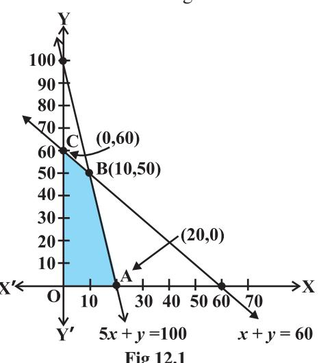
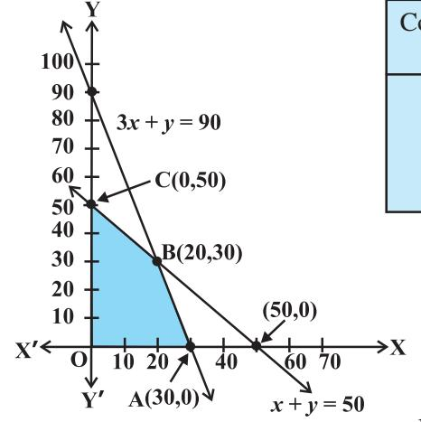
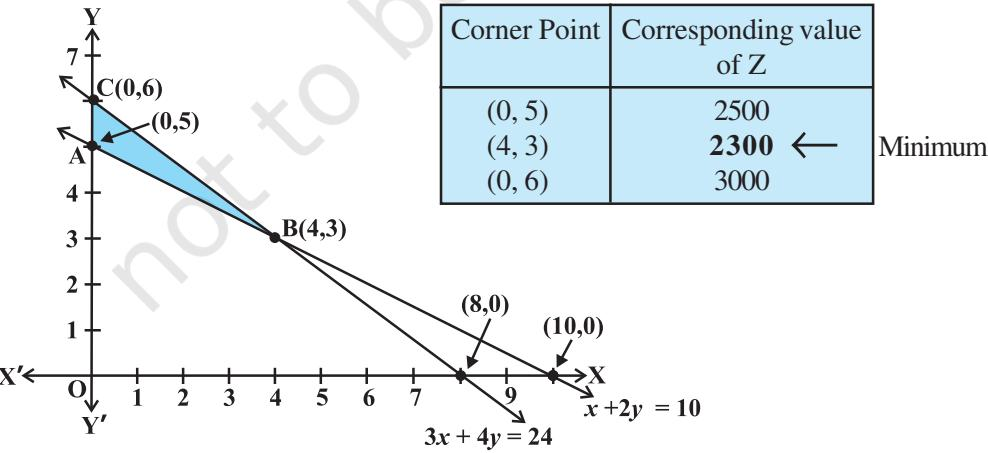
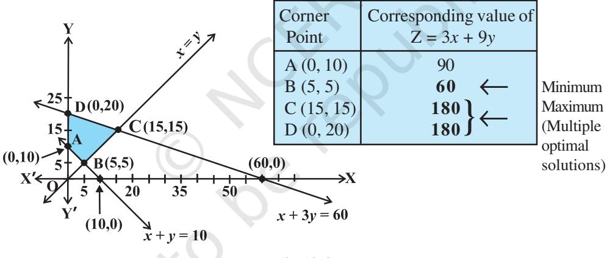
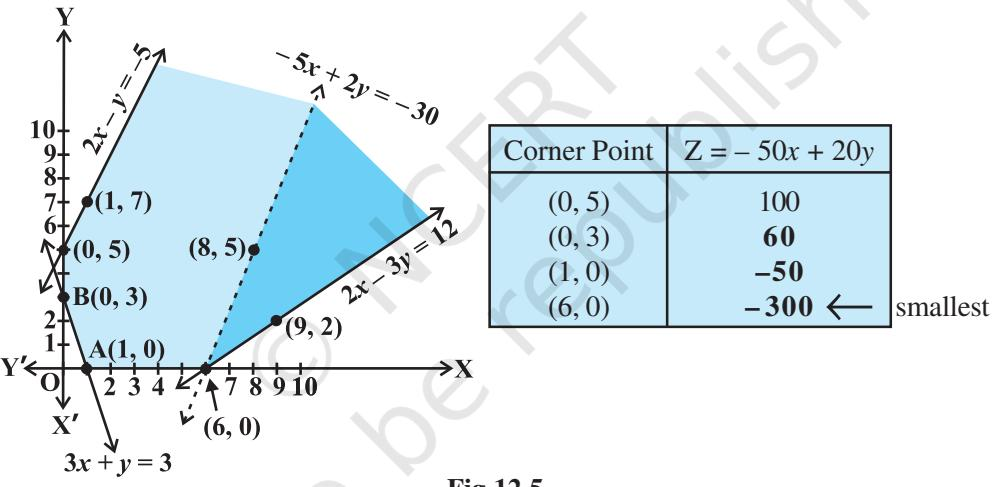
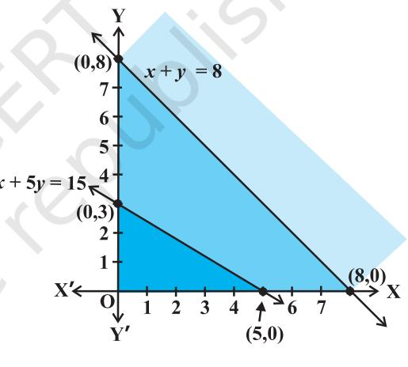

# v*The mathematical experience of the student is incomplete if he never had the opportunity to solve a problem invented by himself. – G. POLYA* v

# **12.1 Introduction**

394 MATHEMATICS

In earlier classes, we have discussed systems of linear equations and their applications in day to day problems. In Class XI, we have studied linear inequalities and systems of linear inequalities in two variables and their solutions by graphical method. Many applications in mathematics involve systems of inequalities/equations. In this chapter, we shall apply the systems of linear inequalities/equations to solve some real life problems of the type as given below:

A furniture dealer deals in only two items–tables and chairs. He has Rs 50,000 to invest and has storage space of at most 60 pieces. A table costs Rs 2500 and a chair Rs 500. He estimates that from the sale of one table, he can make a profit of Rs 250 and that from the sale of one

**L. Kantorovich**

chair a profit of Rs 75. He wants to know how many tables and chairs he should buy from the available money so as to maximise his total profit, assuming that he can sell all the items which he buys.

Such type of problems which seek to maximise (or, minimise) profit (or, cost) form a general class of problems called **optimisation problems**. Thus, an optimisation problem may involve finding maximum profit, minimum cost, or minimum use of resources etc.

A special but a very important class of optimisation problems is **linear programming problem.** The above stated optimisation problem is an example of linear programming problem. Linear programming problems are of much interest because of their wide applicability in industry, commerce, management science etc.

In this chapter, we shall study some linear programming problems and their solutions by graphical method only, though there are many other methods also to solve such problems.

# **12.2 Linear Programming Problem and its Mathematical Formulation**

We begin our discussion with the above example of furniture dealer which will further lead to a mathematical formulation of the problem in two variables. In this example, we observe

- (i) The dealer can invest his money in buying tables or chairs or combination thereof. Further he would earn different profits by following different investment strategies.
- (ii) There are certain **overriding conditions** or **constraints** viz., his investment is limited to a **maximum** of Rs 50,000 and so is his storage space which is for a maximum of 60 pieces.

Suppose he decides to buy tables only and no chairs, so he can buy 50000 ÷ 2500, i.e., 20 tables. His profit in this case will be Rs (250 × 20), i.e., **Rs 5000.**

Suppose he chooses to buy chairs only and no tables. With his capital of Rs 50,000, he can buy 50000 ÷ 500, i.e. 100 chairs. But he can store only 60 pieces. Therefore, he is forced to buy only 60 chairs which will give him a total profit of Rs (60 × 75), i.e., **Rs 4500**.

There are many other possibilities, for instance, he may choose to buy 10 tables and 50 chairs, as he can store only 60 pieces. Total profit in this case would be Rs (10 × 250 + 50 × 75), i.e., **Rs 6250** and so on.

We, thus, find that the dealer can invest his money in different ways and he would earn different profits by following different investment strategies.

Now the problem is : How should he invest his money in order to get maximum profit? To answer this question, let us try to formulate the problem mathematically.

### **12.2.1** *Mathematical formulation of the problem*

Let *x* be the number of tables and *y* be the number of chairs that the dealer buys. Obviously, *x* and *y* must be non-negative, i.e.,

$x\geq0$ (Non-negative constraints)... (1) $y\geq0$ (2)

The dealer is constrained by the maximum amount he can invest (Here it is Rs 50,000) and by the maximum number of items he can store (Here it is 60). Stated mathematically,

$$2500x+500y\leq500000\ (\mbox{investment constraint})$$
  
  
or  
  

$$5x+y\leq100$$
  
  
... (3)

and *x* + *y* ≤ 60 (storage constraint) ... (4)

The dealer wants to invest in such a way so as to maximise his profit, say, Z which stated as a function of *x* and *y* is given by

Z = 250*x* + 75*y* (called *objective function*) ... (5)

Mathematically, the given problems now reduces to:

Maximise Z = 250*x* + 75*y*

subject to the constraints:

$$\begin{array}{r}{5x+y\leq100}\\ {x+y\leq60}\end{array}$$
  

$$\begin{array}{r}{x\geq0,\ y\geq0}\end{array}$$

So, we have to maximise the linear function Z subject to certain conditions determined by a set of linear inequalities with variables as non-negative. There are also some other problems where we have to minimise a linear function subject to certain conditions determined by a set of linear inequalities with variables as non-negative. Such problems are called **Linear Programming Problems.**

Thus, a Linear Programming Problem is one that is concerned with finding the **optimal value** (maximum or minimum value) of a linear function (called **objective function**) of several variables (say *x* and *y*), subject to the conditions that the variables are **non-negative** and satisfy a set of linear inequalities (called **linear constraints).** The term **linear** implies that all the mathematical relations used in the problem are **linear relations** while the term programming refers to the method of determining a particular **programme** or plan of action.

Before we proceed further, we now formally define some terms (which have been used above) which we shall be using in the linear programming problems:

**Objective function** Linear function Z = *ax* + *by*, where *a*, *b* are constants, which has to be maximised or minimized is called a linear **objective function.**

In the above example, Z = 250*x* + 75*y* is a linear objective function. Variables *x* and *y* are called **decision variables**.

**Constraints** The linear inequalities or equations or restrictions on the variables of a linear programming problem are called **constraints**. The conditions *x* ≥ 0, *y* ≥ 0 are called non-negative restrictions. In the above example, the set of inequalities (1) to (4) are **constraints**.

**Optimisation problem** A problem which seeks to maximise or minimise a linear function (say of two variables *x* and *y*) subject to certain constraints as determined by a set of linear inequalities is called an **optimisation problem**. Linear programming problems are special type of optimisation problems. The above problem of investing a given sum by the dealer in purchasing chairs and tables is an example of an optimisation problem as well as of a linear programming problem.

We will now discuss how to find solutions to a linear programming problem. In this chapter, we will be concerned only with the graphical method.

**12.2.2** *Graphical method of solving linear programming problems*

In Class XI, we have learnt how to graph a system of linear inequalities involving two variables *x* and *y* and to find its solutions graphically. Let us refer to the problem of investment in tables and chairs discussed in Section 12.2. We will now solve this problem graphically. Let us graph the constraints stated as linear inequalities:

$$5x+y\leq100$$
 
$$x+y\leq60$$
 
$$x\geq0$$
 
$$y\geq0$$
 
$$y\geq0$$
 
$$y\geq0$$
 
$$y\geq0$$
 
$$y\geq0$$
 
$$y\geq0$$
 
$$y\geq0$$
 
$$y\geq0$$
 
$$y\geq0$$
 
$$y\geq0$$
 
$$y\geq0$$
 
$$y\geq0$$
 
$$y\geq0$$
 
$$y\geq0$$
 
$$y\geq0$$
 
$$y\geq0$$
 
$$y\geq0$$
 
$$y\geq0$$
 
$$y\geq0$$
 
$$y\geq0$$
 
$$y\geq0$$
 
$$y\geq0$$
 
$$y\geq0$$
 
$$y\geq0$$
 
$$y\geq0$$
 
$$y\geq0$$
 
$$y\geq0$$
 
$$y\geq0$$
 
$$y\geq0$$
 
$$y\geq0$$
 
$$y\geq0$$
 
$$y\geq0$$
 
$$y\geq0$$
 
$$y\geq0$$
 
$$y\geq0$$
 y\geq0

The graph of this system (shaded region) consists of the points common to all half planes determined by the inequalities (1) to (4) (Fig 12.1). Each point in this region represents a **feasible choice** open to the dealer for investing in tables and chairs. The region, therefore, is called the **feasible region** for the problem. Every point of this region is called a **feasible solution** to the problem. Thus, we have,

**Feasible region** The common region determined by all the constraints including non-negative constraints *x*, *y* ≥ 0 of a linear programming problem is called the **feasible region** (or solution region) for the problem. In Fig 12.1, the region OABC (shaded) is the feasible region for the problem. The region other than feasible region is called an **infeasible region**.

**Feasible solutions** Points within and on the boundary of the feasible region represent feasible solutions of the constraints. In Fig 12.1, every point within and on the boundary of the feasible region OABC represents feasible solution to the problem. For example, the point (10, 50) is a feasible solution of the problem and so are the points (0, 60), (20, 0) etc.

Any point outside the feasible region is called an **infeasible solution.** For example, the point (25, 40) is an infeasible solution of the problem. **Fig 12.1**

**Optimal (feasible) solution**: Any point in the feasible region that gives the optimal value (maximum or minimum) of the objective function is called an **optimal solution.**

Now, we see that every point in the feasible region OABC satisfies all the constraints as given in (1) to (4), and since there are **infinitely many points**, it is not evident how we should go about finding a point that gives a maximum value of the objective function Z = 250*x* + 75*y.* To handle this situation, we use the following theorems which are fundamental in solving linear programming problems. The proofs of these theorems are beyond the scope of the book.

**Theorem 1** Let R be the feasible region (convex polygon) for a linear programming problem and let Z = *ax* + *by* be the objective function. When Z has an optimal value (maximum or minimum), where the variables *x* and *y* are subject to constraints described by linear inequalities, this optimal value must occur at a corner point* (vertex) of the feasible region.

**Theorem 2** Let R be the feasible region for a linear programming problem, and let Z = *ax* + *by* be the objective function. If R is **bounded****, then the objective function Z has both a **maximum** and a **minimum** value on R and each of these occurs at a corner point (vertex) of R.

*Remark* If R is **unbounded**, then a maximum or a minimum value of the objective function may not exist. However, if it exists, it must occur at a corner point of R. (By Theorem 1).

In the above example, the corner points (vertices) of the bounded (feasible) region are: O, A, B and C and it is easy to find their coordinates as (0, 0), (20, 0), (10, 50) and (0, 60) respectively. Let us now compute the values of Z at these points.

We have

| Vertex of the | Corresponding value |  |
| --- | --- | --- |
| Feasible Region | of Z (in Rs) |  |
| O (0,0) | 0 ← | Maximum |
| C (0,60) | 4500 |  |
| B (10,50) | 6250 |  |
| A (20,0) | 5000 |  |

* A corner point of a feasible region is a point in the region which is the intersection of two boundary lines.

** A feasible region of a system of linear inequalities is said to be bounded if it can be enclosed within a circle. Otherwise, it is called unbounded. Unbounded means that the feasible region does extend indefinitely in any direction.

We observe that the maximum profit to the dealer results from the investment strategy (10, 50), i.e. buying 10 tables and 50 chairs.

This method of solving linear programming problem is referred as **Corner Point Method**. The method comprises of the following steps:

- 1. Find the feasible region of the linear programming problem and determine its corner points (vertices) either by inspection or by solving the two equations of the lines intersecting at that point.
- 2. Evaluate the objective function Z = *ax* + *by* at each corner point. Let M and *m*, respectively denote the largest and smallest values of these points.
- 3. (i) When the feasible region is **bounded**, M and *m* are the maximum and minimum values of Z.
	- (ii) In case, the feasible region is **unbounded**, we have:
- 4. (a) M is the maximum value of Z, if the open half plane determined by *ax* + *by* > M has no point in common with the feasible region. Otherwise, Z has no maximum value.
	- (b) Similarly, *m* is the minimum value of Z, if the open half plane determined by *ax* + *by* < *m* has no point in common with the feasible region. Otherwise, Z has no minimum value.

We will now illustrate these steps of Corner Point Method by considering some examples:

**Example 1** Solve the following linear programming problem graphically:

Maximise Z = 4*x* + *y* ... (1)

subject to the constraints:

$$\chi+y\leq50$$

$$3x+y\leq\ 90$$

$$\chi\geq0,y\geq0$$

**Solution** The shaded region in Fig 12.2 is the feasible region determined by the system of constraints (2) to (4). We observe that the feasible region OABC is **bounded.** So, we now use Corner Point Method to determine the maximum value of Z.

The coordinates of the corner points O, A, B and C are (0, 0), (30, 0), (20, 30) and (0, 50) respectively. Now we evaluate Z at each corner point.

| Corner Point | Corresponding value of Z |  |
| --- | --- | --- |
| (0, 0) | 0 |  |
| (30, 0) | ← 120 | Maximum |
| (20, 30) | 110 |  |
| (0, 50) | 50 |  |

**Fig 12.2**

Hence, maximum value of Z is 120 at the point (30, 0).

**Example 2** Solve the following linear programming problem graphically: Minimise Z = 200 *x* + 500 *y* ... (1) subject to the constraints:

$$x+2y\geq10$$
... (2) 
$$3x+4y\leq24$$
... (3) 
$$x\geq0,y\geq0$$
... (4)

**Solution** The shaded region in Fig 12.3 is the feasible region ABC determined by the system of constraints (2) to (4), which is **bounded**. The coordinates of corner points

**Fig 12.3**

A, B and C are (0,5), (4,3) and (0,6) respectively. Now we evaluate Z = 200*x* + 500*y* at these points.

Hence, minimum value of Z is 2300 attained at the point (4, 3)

**Example 3** Solve the following problem graphically:

Minimise and Maximise Z = 3$x+9y$... (1)

subject to the constraints: *x* + 3*y* ≤ 60 ... (2)

$x+y\geq10$

$$\chi\leq y\tag{4}$$

$x\geq0,y\geq0$

**Solution** First of all, let us graph the feasible region of the system of linear inequalities (2) to (5). The feasible region ABCD is shown in the Fig 12.4. Note that the region is bounded. The coordinates of the corner points A, B, C and D are (0, 10), (5, 5), (15,15) and (0, 20) respectively.

We now find the minimum and maximum value of Z. From the table, we find that the minimum value of Z is 60 at the point B (5, 5) of the feasible region.

The maximum value of Z on the feasible region occurs at the two corner points C (15, 15) and D (0, 20) and it is 180 in each case.

*Remark* Observe that in the above example, the problem has multiple optimal solutions at the corner points C and D, i.e. the both points produce same maximum value 180. In such cases, you can see that every point on the line segment CD joining the two corner points C and D also give the same maximum value. Same is also true in the case if the two points produce same minimum value.

**Example 4** Determine graphically the minimum value of the objective function

$$Z=-\ 50x+20y$$

subject to the constraints:

$2x-y\geq-5$

$3x+y\geq3$

$$2x-3y\leq12$$

$x\geq0,y\geq0$

**Solution** First of all, let us graph the feasible region of the system of inequalities (2) to (5). The feasible region (shaded) is shown in the Fig 12.5. Observe that the feasible region is **unbounded**.

We now evaluate Z at the corner points.

From this table, we find that – 300 is the smallest value of Z at the corner point (6, 0). Can we say that minimum value of Z is – 300? Note that if the region would have been bounded, this smallest value of Z is the minimum value of Z (Theorem 2). But here we see that the feasible region is unbounded. Therefore, – 300 may or may not be the minimum value of Z. To decide this issue, we graph the inequality

– 50*x* + 20*y* < – 300 (see Step 3(ii) of corner Point Method.)

i.e., $-5x+2y<-30$

and check whether the resulting open half plane has points in common with feasible region or not. If it has common points, then –300 will not be the minimum value of *Z*. Otherwise, –300 will be the minimum value of Z.

As shown in the Fig 12.5, it has common points. Therefore, Z = –50 *x* + 20 *y* has no minimum value subject to the given constraints.

In the above example, can you say whether *z* = – 50 *x* + 20 *y* has the maximum value 100 at (0,5)? For this, check whether the graph of – 50 *x* + 20 *y* > 100 has points in common with the feasible region. (Why?)

**Example 5** Minimise Z = 3*x* + 2*y*

subject to the constraints:

$$x+y\geq8$$
 
$$3x+5y\leq15$$
 
$$x\geq0,\,y\geq0$$

**Solution** Let us graph the inequalities (1) to (3) (Fig 12.6). Is there any feasible region? Why is so?

From Fig 12.6, you can see that there is no point satisfying all the constraints simultaneously. Thus, the problem is having no feasible region and hence no feasible solution.

*Remarks* From the examples which we have discussed so far, we notice some general features of linear programming problems:

- (i) The feasible region is always a convex region.

- (ii) The maximum (or minimum) solution of the objective function occurs at the vertex (corner) of the feasible region. If two corner points produce the same maximum (or minimum) value of the objective function, then every point on the line segment joining these points will also give the same maximum (or minimum) value.
## **EXERCISE 12.1**

Solve the following Linear Programming Problems graphically:

- **1.** Maximise Z = 3*x* + 4*y*
subject to the constraints : *x* + *y* ≤ 4, *x* ≥ 0, *y* ≥ 0.

- **2.** Minimise Z = 3*x* + 4 *y* subject to *x* + 2*y* ≤ 8, 3*x* + 2*y* ≤ 12, *x* ≥ 0, *y* ≥ 0.
- **3.** Maximise Z = 5*x* + 3*y* subject to 3*x* + 5*y* ≤ 15, 5*x* + 2*y* ≤ 10, *x* ≥ 0, *y* ≥ 0.
- **4.** Minimise Z = 3*x* + 5*y* such that *x* + 3*y* ≥ 3, *x* + *y* ≥ 2, *x*, *y* ≥ 0.
- **5.** Maximise Z = 3*x* + 2*y* subject to *x* + 2*y* ≤ 10, 3*x* + *y* ≤ 15, *x*, *y* ≥ 0.
- **6.** Minimise Z = *x* + 2*y* subject to 2*x* + *y* ≥ 3, *x* + 2*y* ≥ 6, *x*, *y* ≥ 0.

Show that the minimum of Z occurs at more than two points.

- **7.** Minimise and Maximise Z = 5*x* + 10 *y* subject to *x* + 2*y* ≤ 120, *x* + *y* ≥ 60, *x* – 2*y* ≥ 0, *x*, *y* ≥ 0.
- **8.** Minimise and Maximise Z = *x* + 2*y* subject to *x* + 2*y* ≥ 100, 2*x* – *y* ≤ 0, 2*x* + *y* ≤ 200; *x*, *y* ≥ 0.
- **9.** Maximise Z = *x* + 2*y*, subject to the constraints: *x* ≥ 3, *x* + *y* ≥ 5, *x* + 2*y* ≥ 6, *y* ≥ 0.
- **10.** Maximise Z = *x* + *y*, subject to *x y* ≤ –1, –*x* + *y* ≤ 0, *x*, *y* ≥ 0.

## *Summary*

- ® A linear programming problem is one that is concerned with finding the optimal value (maximum or minimum) of a linear function of several variables (called **objective function)** subject to the conditions that the variables are non-negative and satisfy a set of linear inequalities (called linear **constraints**). Variables are sometimes called **decision variables** and are **non-negative.**
## *Historical Note*

In the World War II, when the war operations had to be planned to economise expenditure, maximise damage to the enemy, linear programming problems came to the forefront.

The first problem in linear programming was formulated in 1941 by the Russian mathematician, L. Kantorovich and the American economist, F. L. Hitchcock, both of whom worked at it independently of each other. This was the well known *transportation problem*. In 1945, an English economist, G.Stigler, described yet another linear programming problem – that of determining an *optimal diet*.

In 1947, the American economist, G. B. Dantzig suggested an efficient method known as the simplex method which is an iterative procedure to solve any linear programming problem in a finite number of steps.

L. Katorovich and American mathematical economist, T. C. Koopmans were awarded the nobel prize in the year 1975 in economics for their pioneering work in linear programming. With the advent of computers and the necessary softwares, it has become possible to apply linear programming model to increasingly complex problems in many areas.

**—**v**—**

