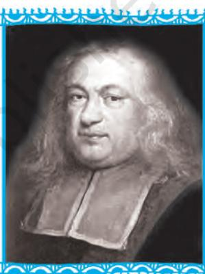
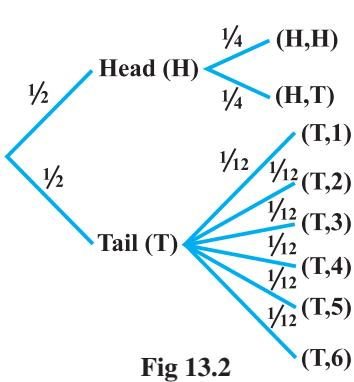
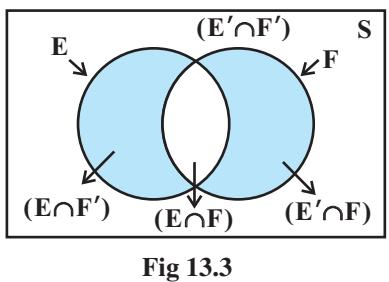
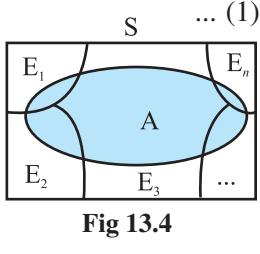

v*The theory of probabilities is simply the Science of logic quantitatively treated. – C.S. PEIRCE* v

# **13.1 Introduction**

406 MATHEMATICS

In earlier Classes, we have studied the probability as a measure of uncertainty of events in a random experiment. We discussed the axiomatic approach formulated by Russian Mathematician, A.N. Kolmogorov (1903-1987) and treated probability as a function of outcomes of the experiment. We have also established equivalence between the axiomatic theory and the classical theory of probability in case of equally likely outcomes. On the basis of this relationship, we obtained probabilities of events associated with discrete sample spaces. We have also studied the addition rule of probability. In this chapter, we shall discuss the important concept of conditional probability of an event given that another event has occurred, which will be helpful in understanding the Bayes' theorem, multiplication rule of probability and independence of events. We shall also learn an important concept of random variable and its probability



**Pierre de Fermat (1601-1665)**

distribution and also the mean and variance of a probability distribution. In the last section of the chapter, we shall study an important discrete probability distribution called Binomial distribution. Throughout this chapter, we shall take up the experiments having equally likely outcomes, unless stated otherwise.

# **13.2 Conditional Probability**

Uptill now in probability, we have discussed the methods of finding the probability of events. If we have two events from the same sample space, does the information about the occurrence of one of the events affect the probability of the other event? Let us try to answer this question by taking up a random experiment in which the outcomes are equally likely to occur.

Consider the experiment of tossing three fair coins. The sample space of the experiment is

S = {HHH, HHT, HTH, THH, HTT, THT, TTH, TTT}

1 4

Since the coins are fair, we can assign the probability 1 8 to each sample point. Let E be the event 'at least two heads appear' and F be the event 'first coin shows tail'. Then

E = {HHH, HHT, HTH, THH} and F = {THH, THT, TTH, TTT} Therefore P(E) = P ({HHH}) + P ({HHT}) + P ({HTH}) + P ({THH}) = 1 1 1 1 1 8 8 8 8 2 + + + = (Why ?) and P(F) = P ({THH}) + P ({THT}) + P ({TTH}) + P ({TTT}) = 1 1 1 1 1 8 8 8 8 2 + + + = Also E ∩ F = {THH}

with P(E ∩ F) = P({THH}) = 1 8

Now, suppose we are given that the first coin shows tail, i.e. F occurs, then what is the probability of occurrence of E? With the information of occurrence of F, we are sure that the cases in which first coin does not result into a tail should not be considered while finding the probability of E. This information reduces our sample space from the set S to its subset F for the event E. In other words, the additional information really amounts to telling us that the situation may be considered as being that of a new random experiment for which the sample space consists of all those outcomes only which are favourable to the occurrence of the event F.

Now, the sample point of F which is favourable to event E is THH.

Thus, Probability of E considering F as the sample space = 1 4 , or Probability of E given that the event F has occurred =

This probability of the event E is called the *conditional probability of E given that F has already occurred*, and is denoted by P (E|F).

Thus P(E|F) =

1 4

Note that the elements of F which favour the event E are the common elements of E and F, i.e. the sample points of E ∩ F.

Thus, we can also write the conditional probability of E given that F has occurred as

  
  
\begin{tabular}{l l} P(EIF) = & Number of elementary events favourable to E$\cap$F \\ \cline{2-3} & Number of elementary events which are favourable to F \\ & \\ \end{tabular}  
  

Dividing the numerator and the denominator by total number of elementary events of the sample space, we see that P(E|F) can also be written as

$$\begin{array}{c}\cdot\\ n(\text{E}\cap\text{F})\\ \hline n(\text{S})\\ \hline n(\text{F})\\ \hline n(\text{S})\\ \hline\end{array}=\frac{\text{P}(\text{E}\cap\text{F})}{\text{P}(\text{F})}\tag{1}$$

Note that (1) is valid only when P(F) ≠ 0 i.e., F ≠ φ (Why?)

Thus, we can define the conditional probability as follows :

**Definition 1** If E and F are two events associated with the same sample space of a random experiment, the conditional probability of the event E given that F has occurred, i.e. P (E|F) is given by

P(EIF) = P(EFF) = provided P(F) $\neq0$  
  
P(F)

# **13.2.1** *Properties of conditional probability*

Let E and F be events of a sample space S of an experiment, then we have **Property 1** P(S*|*F) *=* P(F*|*F) = 1

We know that

$$\mathrm{P}(\mathrm{S}|\mathrm{F})={\frac{\mathrm{P}(\mathrm{S}\cap\mathrm{F})}{\mathrm{P}(\mathrm{F})}}={\frac{\mathrm{P}(\mathrm{F})}{\mathrm{P}(\mathrm{F})}}=1.$$

$$\mathrm{Al}{\mathrm{s}}0$$

Also  
  
P(FIF) = $\frac{\text{P(F$\cap$F)}}{\text{P(F)}}$=$\frac{\text{P(F)}}{\text{P(F)}}$=1

Thus P(S|F) = P(F|F) = 1

**Property 2** *If* A *and* B *are any two events of a sample space* S *and* F *is an event of* S *such that* P(F) ≠ 0*, then*

P((A ∪ B)*|*F) = P(A|F) + P(B|F) – P((A ∩ B)|F)

*In particular*, *if* A *and* B *are disjoint events, then*

$$\mathrm{P((A\cup B)|F)=P(A|F)\,+\,P(B|F)}$$

We have

P((A$\cup$B)IF) = P[(A$\cup$B)$\cap$F] P(F) = P[(A$\cap$F)$\cup$(B$\cap$F)] P(F)

(by distributive law of union of sets over intersection)

$$=\frac{\text{P(A}\cap\text{F)}+\text{P(B}\cap\text{F)}-\text{P(A}\cap\text{B}\cap\text{F)}}{\text{P(F)}}$$
 
$$=\frac{\text{P(A}\cap\text{F)}}{\text{P(F)}}+\frac{\text{P(B}\cap\text{F)}}{\text{P(F)}}-\frac{\text{P((A}\cap\text{B)}\cap\text{F)}}{\text{P(F)}}$$
 
$$=\text{P(A}\text{IF)}+\text{P(B}\text{IF)}-\text{P((A}\cap\text{B)}\text{IF)}$$
  
  
and $\text{P}$ are disjoint sets that 

When A and B are disjoint events, then

P((A $\cap$ B)IF) = 0 P((A $\cup$ B)IF) = P(AIF) + P(BIF)

**Property 3** P(E′|F) = 1 − P(E|F)

From Property 1, we know that P(SIF) = I$\backslash$  
  
$\Rightarrow$  
  
$\Rightarrow$  
  
P(EIF) + P (E${}^{\prime}$P) = I$\backslash$  
  
since S = E $\cup$ E${}^{\prime}$  
  
since E and E${}^{\prime}$ are disjoint events. Thus,  
  
P(E${}^{\prime}$I${}^{\prime}$) = 1 - P(EIF)

Let us now take up some examples.

**Example 1** If P(A) = 7 13 , P(B) = 9 13 and P(A ∩ B) = 4 13 , evaluate P(A|B).

  
  
**Solution** We have P(AlB)=P(A$\cap$B)=13 = 4 = 9 = 9 = 13

**Example 2** A family has two children. What is the probability that both the children are boys given that at least one of them is a boy ?

**Solution** Let *b* stand for boy and *g* for girl. The sample space of the experiment is S = {(*b, b*), (*g, b*), (*b, g*), (*g, g*)}

Let E and F denote the following events :

E : 'both the children are boys'

F : 'at least one of the child is a boy'

Then E = {(*b*,*b*)} and F = {(*b*,*b*), (*g*,*b*), (*b*,*g*)} Now E ∩ F = {(*b*,*b*)}

Thus 
$$\text{P(F)=}\frac{3}{4}\text{and P(E}\cap\text{F)=}\frac{1}{2}$$
.  

Therefore  
  

$$\text{P}(\text{EIF})=\frac{\text{P}(\text{E}\cap\text{F})}{\text{P}(\text{F})}=\frac{\frac{1}{4}}{3}=\frac{1}{3}$$

**Example 3** Ten cards numbered 1 to 10 are placed in a box, mixed up thoroughly and then one card is drawn randomly. If it is known that the number on the drawn card is more than 3, what is the probability that it is an even number?

1 4

**Solution** Let A be the event 'the number on the card drawn is even' and B be the event 'the number on the card drawn is greater than 3'. We have to find P(A|B).

Now, the sample space of the experiment is S = {1, 2, 3, 4, 5, 6, 7, 8, 9, 10}

| Then | A = | {2, 4, 6, 8, 10}, B = {4, 5, 6, 7, 8, 9, 10} |
| --- | --- | --- |
| and | A ∩ B = | {4, 6, 8, 10} |

Also  
  
P(A) = $\frac{5}{10}$, P(B) = $\frac{7}{10}$ and P(A$\cap$B) = $\frac{4}{10}$

Then  
  

$$\text{P(AlB)}=\frac{\text{P(A}\cap\text{B)}}{\text{P(B)}}=\frac{\frac{4}{10}}{\frac{7}{10}}=\frac{4}{7}$$

**Example 4** In a school, there are 1000 students, out of which 430 are girls. It is known that out of 430, 10% of the girls study in class XII. What is the probability that a student chosen randomly studies in Class XII given that the chosen student is a girl?

**Solution** Let E denote the event that a student chosen randomly studies in Class XII and F be the event that the randomly chosen student is a girl. We have to find P (E|F).

Now 
$$\text{P(F)}=$$
. 

F) = $\frac{430}{1000}$ = 0.43 and P(E $\cap$ F) = $\frac{43}{1000}$ = 0.043 (Why?)

Then  
  
P(EIF) = P(E$\cap$F) = 0.043 = 0.1 P(F) = 0.43

**Example 5** A die is thrown three times. Events A and B are defined as below:

A : 4 on the third throw

B : 6 on the first and 5 on the second throw

Find the probability of A given that B has already occurred.

**Solution** The sample space has 216 outcomes.

Now  
  

$$\text{A}=\begin{bmatrix}(1,1,4)&(1,2,4)&...&(1,6,4)&(2,1,4)&(2,2,4)&...&(2,6,4)\\ (3,1,4)&(3,2,4)&...&(3,6,4)&(4,1,4)&(4,2,4)&...&(4,6,4)\\ (5,1,4)&(5,2,4)&...&(5,6,4)&(6,1,4)&(6,2,4)&...&(6,6,4)\end{bmatrix}$$

B = {(6,5,1), (6,5,2), (6,5,3), (6,5,4), (6,5,5), (6,5,6)}  
  

and A ∩ B = {(6,5,4)}.

Now P(B) = 6 and P(A $\cap$B) = 116

Then P(AIB) = P(AIB) = P(AIB) = 216 = 1 P(B) = 6 = 1 P(B) = 216

**Example 6** A die is thrown twice and the sum of the numbers appearing is observed to be 6. What is the conditional probability that the number 4 has appeared at least once?

**Solution** Let E be the event that 'number 4 appears at least once' and F be the event that 'the sum of the numbers appearing is 6'.

Then,  
  
$\begin{array}{l}\mbox{E}=\{(4,1),(4,2),(4,3),(4,4),(4,5),(4,6),(1,4),(2,4),(3,4),(5,4),(6,4)\}\\ \mbox{F}=\{(1,5),(2,4),(3,3),(4,2),(5,1)\}\end{array}$

We have P(E) =

11 36 and P(F) = 5 36

Also E∩F = {(2,4), (4,2)}

Therefore P(E∩F) = 2 36

Hence, the required probability

$$\mathrm{P}(\mathrm{E}|\mathrm{F})=\mathrm{~\frac{P}{P(F)}=\frac{\frac{2}{36}}{\frac{5}{36}}=\frac{2}{5}~}$$

For the conditional probability discussed above, we have considered the elementary events of the experiment to be equally likely and the corresponding definition of the probability of an event was used. However, the same definition can also be used in the general case where the elementary events of the sample space are not equally likely, the probabilities P(E∩F) and P(F) being calculated accordingly. Let us take up the following example.

**Example 7** Consider the experiment of tossing a coin. If the coin shows head, toss it

again but if it shows tail, then throw a die. Find the conditional probability of the event that 'the die shows a number greater than 4' given that 'there is at least one tail'.

**Solution** The outcomes of the experiment can be represented in following diagrammatic manner called the 'tree diagram'.

The sample space of the experiment may be described as

S = {(H,H),(H,T),(T,1),(T,2),(T,3),(T,4),(T,5),(T,6)}  
  

where (H, H) denotes that both the tosses result into head and (T, *i*) denote the first toss result into a tail and the number *i* appeared on the die for *i* = 1,2,3,4,5,6.

Thus, the probabilities assigned to the 8 elementary events

(H, H), (H, T), (T, 1), (T, 2), (T, 3) (T, 4), (T, 5), (T, 6)

are 1 1 1 1 1 1 1 1 , , , , , , , 4 4 12 12 12 12 12 12 respectively which is clear from the Fig 13.2.



**Fig 13.1**

Let F be the event that 'there is at least one tail' and E be the event 'the die shows a number greater than 4'. Then

F = {(H,T), (T,1), (T,2), (T,3), (T,4), (T,5), (T,6)} E = {(T,5), (T,6)} and E ∩ F = {(T,5), (T,6)} Now P(F) = P({(H,T)}) + P ({(T,1)}) + P ({(T,2)}) + P ({(T,3)}) + P ({(T,4)}) + P({(T,5)}) + P({(T,6)}) = 1 1 1 1 1 1 1 3 4 12 12 12 12 12 12 4 + + + + + + = and P(E ∩ F) = P ({(T,5)}) + P ({(T,6)}) = 1 1 1 12 12 6 + =

Hence P(E|F) =

$$={\frac{\mathrm{P}(\mathrm{E}\cap\mathrm{F})}{\mathrm{P}(\mathrm{F})}}={\frac{\frac{1}{6}}{\frac{3}{4}}}={\frac{2}{9}}$$

**EXERCISE 13.1**

- **1.** Given that E and F are events such that P(E) = 0.6, P(F) = 0.3 and P(E ∩ F) = 0.2, find P(E|F) and P(F|E)
- **2.** Compute P(A|B), if P(B) = 0.5 and P (A ∩ B) = 0.32
- **3.** If P(A) = 0.8, P (B) = 0.5 and P(B|A) = 0.4, find (i) P(A ∩ B) (ii) P(A|B) (iii) P(A ∪ B)

  
  
**4.** Evaluate P(A $\cup$ B),if 2P(A) = P(B) = $\frac{5}{13}$ and P(AlB) = $\frac{2}{5}$

  
  
**5.**: If P(A) = $\frac{6}{11}$, P(B) = $\frac{5}{11}$ and P(A $\cup$ B) = $\frac{7}{11}$, find  
  
(i) P(A$\cap$B) (ii) P(A|B) (iii) P(B|A)  
  
(ii) P(A$\cap$B) (iii) P(B|A)

Determine P(E|F) in Exercises 6 to 9.

- **6.** A coin is tossed three times, where
	- (i) E : head on third toss , F : heads on first two tosses
	- (ii) E : at least two heads , F : at most two heads
	- (iii) E : at most two tails , F : at least one tail

- **7.** Two coins are tossed once, where
- (i) E : tail appears on one coin, F : one coin shows head
- (ii) E : no tail appears, F : no head appears
- **8.** A die is thrown three times,
- 
- 

E : 4 appears on the third toss, F : 6 and 5 appears respectively on first two tosses

- **9.** Mother, father and son line up at random for a family picture E : son on one end, F : father in middle
- **10.** A black and a red dice are rolled.
	- (a) Find the conditional probability of obtaining a sum greater than 9, given that the black die resulted in a 5.
	- (b) Find the conditional probability of obtaining the sum 8, given that the red die resulted in a number less than 4.
- **11.** A fair die is rolled. Consider events E = {1,3,5}, F = {2,3} and G = {2,3,4,5} Find
	- (i) P(E|F) and P(F|E) (ii) P(E|G) and P(G|E)
	- (iii) P((E ∪ F)|G) and P((E ∩ F)|G)
- **12.** Assume that each born child is equally likely to be a boy or a girl. If a family has two children, what is the conditional probability that both are girls given that (i) the youngest is a girl, (ii) at least one is a girl?
- **13.** An instructor has a question bank consisting of 300 easy True / False questions, 200 difficult True / False questions, 500 easy multiple choice questions and 400 difficult multiple choice questions. If a question is selected at random from the question bank, what is the probability that it will be an easy question given that it is a multiple choice question?
- **14.** Given that the two numbers appearing on throwing two dice are different. Find the probability of the event 'the sum of numbers on the dice is 4'.
- **15.** Consider the experiment of throwing a die, if a multiple of 3 comes up, throw the die again and if any other number comes, toss a coin. Find the conditional probability of the event 'the coin shows a tail', given that 'at least one die shows a 3'.

In each of the Exercises 16 and 17 choose the correct answer:

  
  
**16.**: If P(A) = $\frac{1}{2}$, P(B) = 0, then P(AlB) is  
  
(A) 0 (B) $\frac{1}{2}$  
  
(C) not defined

- **17.** If A and B are events such that P(A|B) = P(B|A), then
	- (A) A ⊂ B but A ≠ B (B) A = B (C) A ∩ B = φ (D) P(A) = P(B)

# **13.3 Multiplication Theorem on Probability**

Let E and F be two events associated with a sample space S. Clearly, the set E ∩ F denotes the event that both E and F have occurred. In other words, E ∩ F denotes the simultaneous occurrence of the events E and F. The event E ∩ F is also written as EF.

Very often we need to find the probability of the event EF. For example, in the experiment of drawing two cards one after the other, we may be interested in finding the probability of the event 'a king and a queen'. The probability of event EF is obtained by using the conditional probability as obtained below :

We know that the conditional probability of event E given that F has occurred is denoted by P(E|F) and is given by

P(E|F) = P(E F),P(F) 0 P(F) ∩ ≠

From this result, we can write

P(E $\cap$ F) = P(F). P(EIF)... (1)

Also, we know that

P(F1E) = P(F1E) = P(E) = P(E) = P(E) = P(E)

or  
  
P(E) = P(E $\cap$F) P(E) (since E $\cap$ F = F $\cap$ E)

Thus,  
  

$${\rm P(E\cap F)=P(E).\ P(F|E)}$$
  
  
.... (2)

Combining (1) and (2), we find that

P(E $\cap$ F) = P(E) P(E) = P(F) P(E) = P(F) P(E) provided P(E) $\neq0$ and P(F) $\neq0$.  
  

The above result is known as the *multiplication rule of probability*.

Let us now take up an example.

**Example 8** An urn contains 10 black and 5 white balls. Two balls are drawn from the urn one after the other without replacement. What is the probability that both drawn balls are black?

**Solution** Let E and F denote respectively the events that first and second ball drawn are black. We have to find P(E ∩ F) or P (EF).

Now P(E) = P (black ball in first draw) = $\frac{10}{15}$

Also given that the first ball drawn is black, i.e., event E has occurred, now there are 9 black balls and five white balls left in the urn. Therefore, the probability that the second ball drawn is black, given that the ball in the first draw is black, is nothing but the conditional probability of F given that E has occurred.

i.e.
$$\text{P(F|E)}=\frac{9}{14}$$
.  

By multiplication rule of probability, we have

P (E ∩ F) = P(E) P(F|E) = 10 9 3 15 14 7 × =

*Multiplication rule of probability for more than two events* If E, F and G are three events of sample space, we have

P(E ∩ F ∩ G) = P(E) P(F|E) P(G|(E ∩ F)) = P(E) P(F|E) P(G|EF)

Similarly, the multiplication rule of probability can be extended for four or more events.

The following example illustrates the extension of multiplication rule of probability for three events.

**Example 9** Three cards are drawn successively, without replacement from a pack of 52 well shuffled cards. What is the probability that first two cards are kings and the third card drawn is an ace?

**Solution** Let K denote the event that the card drawn is king and A be the event that the card drawn is an ace. Clearly, we have to find P (KKA)

Now  
  
P(K) = $\frac{4}{52}$

Also, P (K|K) is the probability of second king with the condition that one king has already been drawn. Now there are three kings in (52 − 1) = 51 cards.

Therefore 
$$\text{P(KIK)}=$$
.  

$$\mathrm{P(KlK)}={\frac{\stackrel{.}{3}}{51}}$$

Lastly, P(A|KK) is the probability of third drawn card to be an ace, with the condition that two kings have already been drawn. Now there are four aces in left 50 cards.

Therefore P(A|KK) = 4 50

By multiplication law of probability, we have

$$\begin{array}{r l}{\mathrm{P(KKA)=P(K)}}&{{}\mathrm{P(KIK)}}&{{}\mathrm{P(AlKK)}}\\ {\cdot}&{{}}&{{}}\\ {={\frac{4}{52}}\times{\frac{3}{51}}\times{\frac{4}{50}}={\frac{2}{5525}}}\end{array}$$

# **13.4 Independent Events**

Consider the experiment of drawing a card from a deck of 52 playing cards, in which the elementary events are assumed to be equally likely. If E and F denote the events 'the card drawn is a spade' and 'the card drawn is an ace' respectively, then

P(E) = $\frac{13}{52}$ = $\frac{1}{4}$ and P(F) = $\frac{4}{52}$ = $\frac{1}{13}$

Also E and F is the event ' the card drawn is the ace of spades' so that

Hence  
  
$\begin{array}{c}\mbox{P(E}\cap\mbox{F)}=\frac{1}{52}\\ \mbox{P(E}\cap\mbox{F)}=\frac{1}{52}=\frac{1}{4}\end{array}$

Since P(E) = 1 4 = P (E|F), we can say that the occurrence of event F has not affected the probability of occurrence of the event E.

We also have

$$\mathrm{P(F|E)={\frac{P(E\cap F)}{P(E)}}={\frac{{\frac{1}{52}}}{{\frac{1}{4}}}}={\frac{1}{13}}=P(F)}$$

Again, P(F) = 1 13 = P(F|E) shows that occurrence of event E has not affected the probability of occurrence of the event F.

Thus, E and F are two events such that the probability of occurrence of one of them is not affected by occurrence of the other.

Such events are called *independent events*.

**Definition 2** Two events E and F are said to be independent, if

$$\mathrm{P}\,{\mathrm{(F|E)=P~(F)~provided~P~(E)~}}\neq0$$

and P (E|F) = P (E) provided P (F) ≠ 0

Thus, in this definition we need to have P (E) ≠ 0 and P(F) ≠ 0

Now, by the multiplication rule of probability, we have

P(E $\cap$ F) = P(E). P (FIE)... (1)

If E and F are independent, then (1) becomes

P(E $\cap$ F) = P(E). P(F)

Thus, using (2), the independence of two events is also defined as follows:

**Definition 3** Let E and F be two events associated with the same random experiment, then E and F are said to be independent if

$$\mathrm{P}(\mathrm{E}\cap\mathrm{F})=\mathrm{P}(\mathrm{E})\ .\ \mathrm{P}\ (\mathrm{F})$$

# *Remarks*

- (i) Two events E and F are said to be dependent if they are not independent, i.e. if
P(E ∩ F ) ≠ P(E) . P (F)

- (ii) Sometimes there is a confusion between independent events and mutually exclusive events. Term 'independent' is defined in terms of 'probability of events' whereas mutually exclusive is defined in term of events (subset of sample space). Moreover, mutually exclusive events never have an outcome common, but independent events, may have common outcome. Clearly, 'independent' and 'mutually exclusive' do not have the same meaning.
In other words, two independent events having nonzero probabilities of occurrence can not be mutually exclusive, and conversely, i.e. two mutually exclusive events having nonzero probabilities of occurrence can not be independent.

- (iii) Two experiments are said to be independent if for every pair of events E and F, where E is associated with the first experiment and F with the second experiment, the probability of the simultaneous occurrence of the events E and F when the two experiments are performed is the product of P(E) and P(F) calculated separately on the basis of two experiments, i.e., P (E ∩ F) = P (E) . P(F)
- (iv) Three events A, B and C are said to be mutually independent, if

$\begin{array}{l}\mbox{P(A$\cap$B)}=\mbox{P(A)P(B)}\\ \mbox{P(A$\cap$C)}=\mbox{P(A)P(C)}\\ \mbox{P(B$\cap$C)}=\mbox{P(B)P(C)}\\ \mbox{P(A$\cap$B$\cap$C)}=\mbox{P(A)P(B)P(C)}\end{array}$

If at least one of the above is not true for three given events, we say that the events are not independent.

**Example 10** A die is thrown. If E is the event 'the number appearing is a multiple of 3' and F be the event 'the number appearing is even' then find whether E and F are independent ?

**Solution** We know that the sample space is S = {1, 2, 3, 4, 5, 6}

Now E = { 3, 6}, F = { 2, 4, 6} and E ∩ F = {6}

Then P(E) = 2 1 3 1 1 , P(F) and P(E F) 6 3 6 2 6 = = = ∩ =

Clearly P(E ∩ F) = P(E). P (F)

Hence E and F are independent events.

**Example 11** An unbiased die is thrown twice. Let the event A be 'odd number on the first throw' and B the event 'odd number on the second throw'. Check the independence of the events A and B.

**Solution** If all the 36 elementary events of the experiment are considered to be equally likely, we have

$\begin{array}{c}\mbox{\rm P(A)}=\mbox{\rm18}=\mbox{\rm1}\\ \mbox{\rm36}=\mbox{\rm2}\end{array}$ and $\mbox{\rm P(B)}=\mbox{\rm18}=\mbox{\rm1}$

Also P(A ∩ B) = P (odd number on both throws)

$\left(\dfrac{9}{36}\text{=}\dfrac{1}{4}\right)\\$. 

Now  
  
P(A) P(B) = $\frac{1}{2}\times\frac{1}{2}=\frac{1}{4}$

Clearly P(A ∩ B) = P(A) × P(B)

Thus, A and B are independent events

**Example 12** Three coins are tossed simultaneously. Consider the event E 'three heads or three tails', F 'at least two heads' and G 'at most two heads'. Of the pairs (E,F), (E,G) and (F,G), which are independent? which are dependent?

**Solution** The sample space of the experiment is given by

S = {HHH, HHT, HTH, THH, HTT, THT, TTH, TTT} Clearly E = {HHH, TTT}, F= {HHH, HHT, HTH, THH}

$$\mathrm{G=\{HHT,HTH,THH,HTT,THT,TTH,TTT\}}$$

Also E ∩ F = {HHH}, E ∩ G = {TTT}, F ∩ G = {HHT, HTH, THH}

Therefore P(E) = $\frac{2}{8}$=$\frac{1}{4}$, P(F) = $\frac{4}{8}$=$\frac{1}{2}$, P(G) = $\frac{7}{8}$

and  
  

$$\text{P}(\text{E}\cap\text{F})=\frac{1}{8},\text{P}(\text{E}\cap\text{G})=\frac{1}{8},\text{P}(\text{F}\cap\text{G})=\frac{3}{8}$$

Also P(E). P(F) = $\frac{1}{4}\times\frac{1}{2}=\frac{1}{8}$, P(E). P(G) = $\frac{1}{4}\times\frac{7}{8}=\frac{7}{32}$

and P(F). P(G) = $\frac{1}{2}\times\frac{7}{8}$ = $\frac{7}{16}$

Thus P(E ∩ F) = P(E) . P(F)

P(E ∩ G) ≠ P(E) . P(G) and P(F ∩ G) ≠ P (F) . P(G)

Hence, the events (E and F) are independent, and the events (E and G) and (F and G) are dependent.

**Example 13** Prove that if E and F are independent events, then so are the events E and F′.

**Solution** Since E and F are independent, we have

P(E $\cap$ F) = P(E) $\cdot$ P(F)

From the venn diagram in Fig 13.3, it is clear that E ∩ F and E ∩ F′ are mutually exclusive events and also E =(E ∩ F) ∪ (E ∩ F′).

Therefore P(E) = P(E ∩ F) + P(E ∩ F′) or P(E ∩ F′) = P(E) − P(E ∩ F) = P(E) − P(E) . P(F) (by (1)) = P(E) (1−P(F))

= P(E). P(F′)



Hence, E and F′ are independent

A**Note** In a similar manner, it can be shown that if the events E and F are independent, then

(a) E′ and F are independent,

- (b) E′ and F′ are independent
**Example 14** If A and B are two independent events, then the probability of occurrence of at least one of A and B is given by 1– P(A′) P(B′)

**Solution** We have

P(at least one of A and B) = P(A ∪ B) = P(A) + P(B) − P(A ∩ B) = P(A) + P(B) − P(A) P(B) = P(A) + P(B) [1−P(A)] = P(A) + P(B). P(A′) = 1− P(A′) + P(B) P(A′) = 1− P(A′) [1− P(B)] = 1− P(A′) P (B′) **EXERCISE 13.2**

- **1.** If P(A) 3 5 = and P (B) 1 5 = , find P (A ∩ B) if A and B are independent events.
- **2.** Two cards are drawn at random and without replacement from a pack of 52 playing cards. Find the probability that both the cards are black.
- **3.** A box of oranges is inspected by examining three randomly selected oranges drawn without replacement. If all the three oranges are good, the box is approved for sale, otherwise, it is rejected. Find the probability that a box containing 15 oranges out of which 12 are good and 3 are bad ones will be approved for sale.
- **4.** A fair coin and an unbiased die are tossed. Let A be the event 'head appears on the coin' and B be the event '3 on the die'. Check whether A and B are independent events or not.
- **5.** A die marked 1, 2, 3 in red and 4, 5, 6 in green is tossed. Let A be the event, 'the number is even,' and B be the event, 'the number is red'. Are A and B independent?

**6.** Let E and F be events with P(E) 3 5 = , P(F) 3 10 = and P (E ∩ F) = 1 5 . Are E and F independent?

**7.** Given that the events A and B are such that P(A) = 1 2 , P(A ∪ B) = 3 5 and P(B) = *p*. Find *p* if they are (i) mutually exclusive (ii) independent.

**8.** Let A and B be independent events with P(A) = 0.3 and P(B) = 0.4. Find

- (i) P(A ∩ B) (ii) P(A ∪ B)
- (iii) P (A|B) (iv) P (B|A)
- **9.** If A and B are two events such that P(A) = 1 4 , P (B) = 1 2 and P(A ∩ B) = 1 8 , find P (not A and not B).

**10.** Events A and B are such that P (A) = 1 2 , P(B) = 7 12 and P(not A or not B) = 1 4 . State whether A and B are independent ?

- **11.** Given two independent events A and B such that P(A) = 0.3, P(B) = 0.6. Find
	- (i) P(A and B) (ii) P(A and not B)
	- (iii) P(A or B) (iv) P(neither A nor B)
- **12.** A die is tossed thrice. Find the probability of getting an odd number at least once.
- **13.** Two balls are drawn at random with replacement from a box containing 10 black and 8 red balls. Find the probability that
	- (i) both balls are red.
	- (ii) first ball is black and second is red.
	- (iii) one of them is black and other is red.
- **14.** Probability of solving specific problem independently by A and B are 1 2 and 1 3 respectively. If both try to solve the problem independently, find the probability that
	- (i) the problem is solved (ii) exactly one of them solves the problem.
- **15.** One card is drawn at random from a well shuffled deck of 52 cards. In which of the following cases are the events E and F independent ?
	- (i) E : 'the card drawn is a spade'
		- F : 'the card drawn is an ace'
	- (ii) E : 'the card drawn is black'
		- F : 'the card drawn is a king'
	- (iii) E : 'the card drawn is a king or queen'
		- F : 'the card drawn is a queen or jack'.
- **16.** In a hostel, 60% of the students read Hindi newspaper, 40% read English newspaper and 20% read both Hindi and English newspapers. A student is selected at random.
	- (a) Find the probability that she reads neither Hindi nor English newspapers.
	- (b) If she reads Hindi newspaper, find the probability that she reads English newspaper.
	- (c) If she reads English newspaper, find the probability that she reads Hindi newspaper.

(C)

1

12 (D)

1 36

Choose the correct answer in Exercises 17 and 18.

- **17.** The probability of obtaining an even prime number on each die, when a pair of dice is rolled is

$$\textbf{(A)}\ 0\qquad\qquad\qquad\textbf{(B)}\ \frac{1}{3}$$

- **18.** Two events A and B will be independent, if
	- (A) A and B are mutually exclusive
	- (B) P(A′B′) = [1 P(A)] [1 P(B)]
	- (C) P(A) = P(B)
	- (D) P(A) + P(B) = 1

# **13.5 Bayes' Theorem**

Consider that there are two bags I and II. Bag I contains 2 white and 3 red balls and Bag II contains 4 white and 5 red balls. One ball is drawn at random from one of the

bags. We can find the probability of selecting any of the bags (i.e. 1 2 ) or probability of

drawing a ball of a particular colour (say white) from a particular bag (say Bag I). In other words, we can find the probability that the ball drawn is of a particular colour, if we are given the bag from which the ball is drawn. But, can we find the probability that the ball drawn is from a particular bag (say Bag II), if the colour of the ball drawn is given? Here, we have to find the reverse probability of Bag II to be selected when an event occurred after it is known. Famous mathematician, John Bayes' solved the problem of finding reverse probability by using conditional probability. The formula developed by him is known as *'Bayes theorem'* which was published posthumously in 1763. Before stating and proving the Bayes' theorem, let us first take up a definition and some preliminary results.

# **13.5.1** *Partition of a sample space*

A set of events E1 , E2 , ..., En is said to represent a partition of the sample space S if

- (a) E*i* ∩ E*j* = φ, *i* ≠ *j*, *i*, *j* = 1, 2, 3, ..., *n*
- (b) E1 ∪ Ε2 ∪ ... ∪ E*n =* S and
- (c) P(E*i* )> 0 for all *i* = 1, 2, ..., *n*.

In other words, the events E1 , E2 , ..., E*n* represent a partition of the sample space S if they are pairwise disjoint, exhaustive and have nonzero probabilities.

As an example, we see that any nonempty event E and its complement E′ form a partition of the sample space S since they satisfy E ∩ E′ = φ and E ∪ E′ = S.

From the Venn diagram in Fig 13.3, one can easily observe that if E and F are any two events associated with a sample space S, then the set {E ∩ F′, E ∩ F, E′ ∩ F, E′ ∩ F′} is a partition of the sample space S. It may be mentioned that the partition of a sample space is not unique. There can be several partitions of the same sample space.

We shall now prove a theorem known as *Theorem of total probability*.

# **13.5.2** *Theorem of total probability*

Let {E1 , E2 ,...,E*n* } be a partition of the sample space S, and suppose that each of the events E1 , E2 ,..., E*n* has nonzero probability of occurrence. Let A be any event associated with S, then

P(A) = P(E${}_{1}$) P(AIE${}_{j}$) + P(E${}_{2}$) P(AIE${}_{2}$) + P(E${}_{n}$) P(AIE${}_{n}$) = $\sum_{j=1}^{n}$P(E${}_{j}$)P(AIE${}_{j}$)

**Proof** Given that E1 , E2 ,..., E*n* is a partition of the sample space S (Fig 13.4). Therefore,

S = E1 ∪ E2 ∪ ... ∪ E*n* and E*i* ∩ E*j* = φ, *i* ≠ *j*, *i*, *j* = 1, 2, ..., *n*

Now, we know that for any event A,

$$\begin{array}{l}{{\mathrm{A=A\capS}}}\\ {{\mathrm{=A\cap(E_{1}\cup E_{2}\cup...\cup E_{n})}}}\\ {{\mathrm{=(A\cap E_{1})\cup(A\cap E_{2})\cup...\cup(A\cap E_{n})}}}\end{array}$$



Also A ∩ E*i* and A ∩ E*j* are respectively the subsets of E*i* and E*j* . We know that E*i* and E*j* are disjoint, for *i* ≠ *j*, therefore, A ∩ E*i* and A ∩ E*j* are also disjoint for all *i* ≠ *j*, *i*, *j* = 1, 2, ..., *n*.

Thus,  
  

$$\begin{array}{l}\mbox{P(A)}=\mbox{P}\left[(\mbox{A}\cap\mbox{E}_{1})\cup(\mbox{A}\cap\mbox{E}_{2})\cup....\cup(\mbox{A}\cap\mbox{E}_{n})\right]\\ =\mbox{P}\left(\mbox{A}\cap\mbox{E}_{1}\right)+\mbox{P}\left(\mbox{A}\cap\mbox{E}_{2}\right)+...+\mbox{P}\left(\mbox{A}\cap\mbox{E}_{n}\right)\end{array}$$

Now, by multiplication rule of probability, we have

P(A ∩ E*i* ) = P(E*i* ) P(A|E*i* ) as P (E*i* ) ≠ 0∀*i* = 1,2,..., *n*

Therefore, P (A) = P (E${}_{1}$) P (AIE${}_{1}$) + P (E${}_{2}$) P (AIE${}_{2}$) +... + P (E${}_{n}$)P(AIE${}_{n}$)

$$\mathrm{or}\qquad\qquad\mathrm{P(A)}=\sum_{j=1}^{n}\mathrm{P(E}_{j})\,\mathrm{P(A|E}_{j})$$

**Example 15** A person has undertaken a construction job. The probabilities are 0.65 that there will be strike, 0.80 that the construction job will be completed on time if there is no strike, and 0.32 that the construction job will be completed on time if there is a strike. Determine the probability that the construction job will be completed on time.

**Solution** Let A be the event that the construction job will be completed on time, and B be the event that there will be a strike. We have to find P(A). We have

P(B) = 0.65, P(no strike) = P(B${}^{\prime}$) = 1 - P(B) = 1 - 0.65 = 0,35 P(AlB) = 0.32, P(AlB${}^{\prime}$) = 0.80

Since events B and B′ form a partition of the sample space S, therefore, by theorem on total probability, we have

P(A) = P(B) P(AIB) + P(B${}^{\prime}$) P(AIB${}^{\prime}$) = 0.65 x 0.32 + 0.35 x 0.8 = 0.208 + 0.28 = 0.488

Thus, the probability that the construction job will be completed in time is 0.488.

We shall now state and prove the Bayes' theorem.

**Bayes' Theorem** If E1 , E2 ,..., E*n* are *n* non empty events which constitute a partition of sample space S, i.e. E1 , E2 ,..., E*n* are pairwise disjoint and E1∪ E2∪ ... ∪ E*n* = S and A is any event of nonzero probability, then

$\mathrm{P}(\mathrm{E}_{i}|\mathrm{A})=\frac{\mathrm{P}(\mathrm{E}_{i})\mathrm{P}(\mathrm{A}\mathrm{I}\mathrm{E}_{i})}{\sum_{j=1}^{n}\mathrm{P}(\mathrm{E}_{j})\mathrm{P}(\mathrm{A}\mathrm{I}\mathrm{E}_{j})}$ for any $i=1,2,3,...,n$

**Proof** By formula of conditional probability, we know that

$\mathrm{P(E_{i}A)}=\frac{\mathrm{P(A\cap E_{i})}}{\mathrm{P(A)}}$  
  
$\mathrm{P(E_{i})P(A|E_{i})}$  
  
$\mathrm{P(A)}$  
  
(by multiplication rule of probability)  
  
$\mathrm{P(E_{i})P(A|E_{i})}$  
  
(by the result of theorem of total probability)  
  
$\mathrm{P(E_{j})P(A|E_{j})}$

*Remark* The following terminology is generally used when Bayes' theorem is applied. The events E1 , E2 , ..., E*n* are called *hypotheses.*

> The probability P(E*i* ) is called the *priori probability* of the hypothesis E*i*

The conditional probability P(E*i* |A) is called *a posteriori probability* of the hypothesis E*i* .

Bayes' theorem is also called the formula for the probability of "causes". Since the E*i* 's are a partition of the sample space S, one and only one of the events E*i* occurs (i.e. one of the events E*i* must occur and only one can occur). Hence, the above formula gives us the probability of a particular E*i* (i.e. a "Cause"), given that the event A has occurred.

The Bayes' theorem has its applications in variety of situations, few of which are illustrated in following examples.

**Example 16** Bag I contains 3 red and 4 black balls while another Bag II contains 5 red and 6 black balls. One ball is drawn at random from one of the bags and it is found to be red. Find the probability that it was drawn from Bag II.

**Solution** Let E1 be the event of choosing the bag I, E2 the event of choosing the bag II and A be the event of drawing a red ball.

Then P(E1

$$\mathrm{(E_{1})=P(E_{2})=\frac{1}{2}}$$

Also P(AIE${}_{1}$) = P(drawing a red ball from Bag I) = $\frac{3}{7}$  
  
$\bullet$

) = P(drawing a red ball from Bag II) =

and P(A|E2

Now, the probability of drawing a ball from Bag II, being given that it is red, is P(E2 |A)

11

By using Bayes' theorem, we have

$\mathrm{P(E_{2}|A)}=\frac{\mathrm{P(E_{2})P(A|E_{2})}}{\mathrm{P(E_{1})P(A|E_{1})+P(E_{2})P(A|E_{2})}}=\frac{\frac{1}{2}\times\frac{5}{11}}{\frac{1}{2}\times\frac{3}{7}+\frac{1}{2}\times\frac{5}{11}}=\frac{35}{68}$

**Example 17** Given three identical boxes I, II and III, each containing two coins. In box I, both coins are gold coins, in box II, both are silver coins and in the box III, there is one gold and one silver coin. A person chooses a box at random and takes out a coin. If the coin is of gold, what is the probability that the other coin in the box is also of gold? **Solution** Let E1 , E2 and E3 be the events that boxes I, II and III are chosen, respectively.

Then P(E${}_{1}$) = P(E${}_{2}$) = P(E${}_{3}$) = $\frac{1}{3}$

Also, let A be the event that 'the coin drawn is of gold'

Then P(A|E1 ) = P(a gold coin from bag I) = 2 2 = 1 P(A|E2 ) = P(a gold coin from bag II) = 0 P(A|E3 ) = P(a gold coin from bag III) = 1 2

Now, the probability that the other coin in the box is of gold

- = the probability that gold coin is drawn from the box I. = P(E1 |A)
By Bayes' theorem, we know that

$\rm P(E_{1}|A)=\frac{P(E_{1})P(A|E_{1})}{P(E_{1})P(A|E_{1})+P(E_{2})P(A|E_{2})+P(E_{3})P(A|E_{3})}$.  
  

**Example 18** Suppose that the reliability of a HIV test is specified as follows:

Of people having HIV, 90% of the test detect the disease but 10% go undetected. Of people free of HIV, 99% of the test are judged HIV–ive but 1% are diagnosed as showing HIV+ive. From a large population of which only 0.1% have HIV, one person is selected at random, given the HIV test, and the pathologist reports him/her as HIV+ive. What is the probability that the person actually has HIV?

**Solution** Let E denote the event that the person selected is actually having HIV and A the event that the person's HIV test is diagnosed as +ive. We need to find P(E|A). Also E′ denotes the event that the person selected is actually not having HIV.

Clearly, {E, E′} is a partition of the sample space of all people in the population. We are given that

$$\mathrm{P(E)}=0.1\%\ ={\frac{0.1}{100}}=0.001$$

P(E′) = 1 – P(E) = 0.999 P(A|E) = P(Person tested as HIV+ive given that he/she is actually having HIV)

$$=90\%={\frac{90}{100}}=0.9$$

and P(A|E′) = P(Person tested as HIV +ive given that he/she is actually not having HIV)

$$=1\%={\frac{1}{100}}=0.01$$

Now, by Bayes' theorem

P(E|A) = P(E)P(A|E) P(E)P(A|E)+ P(E )P(A|E ) ′ ′ = 0.001 0.9 90 0.001 0.9 0.999 0.01 1089 × = × + × = 0.083 approx.

Thus, the probability that a person selected at random is actually having HIV given that he/she is tested HIV+ive is 0.083.

**Example 19** In a factory which manufactures bolts, machines A, B and C manufacture respectively 25%, 35% and 40% of the bolts. Of their outputs, 5, 4 and 2 percent are respectively defective bolts. A bolt is drawn at random from the product and is found to be defective. What is the probability that it is manufactured by the machine B? **Solution** Let events B1 , B2 , B3 be the following :

B1 : the bolt is manufactured by machine A

B2 : the bolt is manufactured by machine B

B3 : the bolt is manufactured by machine C

Clearly, B1 , B2 , B3 are mutually exclusive and exhaustive events and hence, they represent a partition of the sample space.

Let the event E be 'the bolt is defective'.

The event E occurs with B1 or with B2 or with B3 . Given that,

> P(B1 ) = 25% = 0.25, P (B2 ) = 0.35 and P(B3 ) = 0.40

Again P(E|B1 ) = Probability that the bolt drawn is defective given that it is manufactured by machine A = 5% = 0.05

Similarly, P(E|B2 ) = 0.04, P(E|B3 ) = 0.02. Hence, by Bayes' Theorem, we have

$\mathrm{P(B_{2}|E)}=\frac{\mathrm{P(B_{2})P(E|B_{2})}}{\mathrm{P(B_{1})P(E|B_{1})+P(B_{2})P(E|B_{2})+P(B_{3})P(E|B_{3})}}$.  
  
$\mathrm{0.35\times0.04}$  
  
$\mathrm{0.25\times0.05+0.35\times0.04+0.40\times0.02}$  
  
$\mathrm{0.0140}=\frac{28}{69}$

**Example 20** A doctor is to visit a patient. From the past experience, it is known that the probabilities that he will come by train, bus, scooter or by other means of transport

are respectively 3 1 1 2 , , and 10 5 10 5 . The probabilities that he will be late are 1 1 1 , , and 4 3 12 , if he comes by train, bus and scooter respectively, but if he comes by other means of transport, then he will not be late. When he arrives, he is late. What is the probability that he comes by train?

**Solution** Let E be the event that the doctor visits the patient late and let T1 , T2 , T3 , T4 be the events that the doctor comes by train, bus, scooter, and other means of transport respectively.

Then  
  

$$\text{P}(\text{T}_{1})=\frac{3}{10},\text{P}(\text{T}_{2})=\frac{1}{5},\text{P}(\text{T}_{3})=\frac{1}{10}\text{and}\text{P}(\text{T}_{4})=\frac{2}{5}$$
 (given)

P(E|T1 ) = Probability that the doctor arriving late comes by train = 1 4

Similarly, P(E|T2 ) = 1 3 , P(E|T3 ) = 1 12 and P(E|T4 ) = 0, since he is not late if he comes by other means of transport.

Therefore, by Bayes' Theorem, we have

P(T1 |E) = Probability that the doctor arriving late comes by train

= 1 1 1 1 2 2 3 3 4 4 P(T )P(E|T ) P(T )P(E|T )+ P(T )P(E|T )+ P(T )P(E|T )+ P(T )P(E|T ) = 3 1 10 4 3 1 1 1 1 1 2 0 10 4 5 3 10 12 5 × × + × + × + × = 3 120 1 40 18 2 × = Hence, the required probability is 1 2 .

**Example 21** A man is known to speak truth 3 out of 4 times. He throws a die and reports that it is a six. Find the probability that it is actually a six.

**Solution** Let E be the event that the man reports that six occurs in the throwing of the die and let S1 be the event that six occurs and S2 be the event that six does not occur.

Then P(S1

$$\hat{\mathbf{\tau}}^{2}=\frac{1}{6}$$
) = Probability that $s i x$ occurs = $\frac{1}{6}$

P(S2 ) = Probability that *six* does not occur = 5 6

P(E|S1 ) = Probability that the man reports that *six* occurs when *six* has actually occurred on the die

- = Probability that the man speaks the truth = 3 4
P(EIS${}_{2}$) = Probability that the man reports that _six_ occurs when _six_ has not actually occurred on the die 

= Probability that the man does not speak the truth 3 1 1 4 4 = − =

Thus, by Bayes' theorem, we get

- P(S1 |E) = Probability that the report of the man that *six* has occurred is actually a *six*
= 1 1 1 1 2 2 P(S )P(E |S ) P(S )P(E|S )+P(S )P(E|S ) = 1 3 6 4 1 24 3 1 3 5 1 8 8 8 6 4 6 4 × = × = × + × Hence, the required probability is 3 . 8

*Remark* A random variable is a real valued function whose domain is the sample space of a random experiment.

For example, let us consider the experiment of tossing a coin two times in succession.

The sample space of the experiment is S = {HH, HT, TH, TT}.

If X denotes the number of heads obtained, then X is a random variable and for each outcome, its value is as given below :

X(HH) = 2, X (HT) = 1, X (TH) = 1, X (TT) = 0.

More than one random variables can be defined on the same sample space. For example, let Y denote the number of heads minus the number of tails for each outcome of the above sample space S.

Then Y(HH) = 2, Y (HT) = 0, Y (TH) = 0, Y (TT) = – 2.

Thus, X and Y are two different random variables defined on the same sample space S.

# **EXERCISE 13.3**

- **1.** An urn contains 5 red and 5 black balls. A ball is drawn at random, its colour is noted and is returned to the urn. Moreover, 2 additional balls of the colour drawn are put in the urn and then a ball is drawn at random. What is the probability that the second ball is red?
- **2.** A bag contains 4 red and 4 black balls, another bag contains 2 red and 6 black balls. One of the two bags is selected at random and a ball is drawn from the bag which is found to be red. Find the probability that the ball is drawn from the first bag.
- **3.** Of the students in a college, it is known that 60% reside in hostel and 40% are day scholars (not residing in hostel). Previous year results report that 30% of all students who reside in hostel attain A grade and 20% of day scholars attain A grade in their annual examination. At the end of the year, one student is chosen at random from the college and he has an A grade, what is the probability that the student is a hostlier?
- **4.** In answering a question on a multiple choice test, a student either knows the answer or guesses. Let 3 4 be the probability that he knows the answer and 1 4 be the probability that he guesses. Assuming that a student who guesses at the answer will be correct with probability 1 4 . What is the probability that the student knows the answer given that he answered it correctly?
- **5.** A laboratory blood test is 99% effective in detecting a certain disease when it is in fact, present. However, the test also yields a false positive result for 0.5% of the healthy person tested (i.e. if a healthy person is tested, then, with probability 0.005, the test will imply he has the disease). If 0.1 percent of the population

actually has the disease, what is the probability that a person has the disease given that his test result is positive ?

- **6.** There are three coins. One is a two headed coin (having head on both faces), another is a biased coin that comes up heads 75% of the time and third is an unbiased coin. One of the three coins is chosen at random and tossed, it shows heads, what is the probability that it was the two headed coin ?
- **7.** An insurance company insured 2000 scooter drivers, 4000 car drivers and 6000 truck drivers. The probability of an accidents are 0.01, 0.03 and 0.15 respectively. One of the insured persons meets with an accident. What is the probability that he is a scooter driver?
- **8.** A factory has two machines A and B. Past record shows that machine A produced 60% of the items of output and machine B produced 40% of the items. Further, 2% of the items produced by machine A and 1% produced by machine B were defective. All the items are put into one stockpile and then one item is chosen at random from this and is found to be defective. What is the probability that it was produced by machine B?
- **9.** Two groups are competing for the position on the Board of directors of a corporation. The probabilities that the first and the second groups will win are 0.6 and 0.4 respectively. Further, if the first group wins, the probability of introducing a new product is 0.7 and the corresponding probability is 0.3 if the second group wins. Find the probability that the new product introduced was by the second group.
- **10.** Suppose a girl throws a die. If she gets a 5 or 6, she tosses a coin three times and notes the number of heads. If she gets 1, 2, 3 or 4, she tosses a coin once and notes whether a head or tail is obtained. If she obtained exactly one head, what is the probability that she threw 1, 2, 3 or 4 with the die?
- **11.** A manufacturer has three machine operators A, B and C. The first operator A produces 1% defective items, where as the other two operators B and C produce 5% and 7% defective items respectively. A is on the job for 50% of the time, B is on the job for 30% of the time and C is on the job for 20% of the time. A defective item is produced, what is the probability that it was produced by A?
- **12.** A card from a pack of 52 cards is lost. From the remaining cards of the pack, two cards are drawn and are found to be both diamonds. Find the probability of the lost card being a diamond.
- **13.** Probability that A speaks truth is 4 5 . A coin is tossed. A reports that a head appears. The probability that actually there was head is

* $\frac{4}{5}$ (B) $\frac{1}{2}$ (C) $\frac{1}{5}$ (D) $\frac{2}{5}$

**14.** If A and B are two events such that A ⊂ B and P(B) ≠ 0, then which of the following is correct?

* (A) P(A$\,$B) = $\frac{\mbox{P(B)}}{\mbox{P(A)}}$ (B) P(A$\,$B) $<$ P(A) P(A$\,$B) $\geq$ P(A) (D) None of these 

# *Miscellaneous Examples*

**Example 22** Coloured balls are distributed in four boxes as shown in the following table:

| Box |  | Colour |  |  |
| --- | --- | --- | --- | --- |
|  | Black | White | Red | Blue |
| I | 3 | 4 | 5 | 6 |
| II | 2 | 2 | 2 | 2 |
| III | 1 | 2 | 3 | 1 |
| IV | 4 | 3 | 1 | 5 |

A box is selected at random and then a ball is randomly drawn from the selected box. The colour of the ball is black, what is the probability that ball drawn is from the box III?

**Solution** Let A, E1 , E2 , E3 and E4 be the events as defined below :

| E : box II is selected 2 | E 3 | : box III is selected |
| --- | --- | --- |
| A : a black ball is selected | E 1 | : box I is selected |

E4 : box IV is selected

Since the boxes are chosen at random,

Therefore  
  
$\rm P(E_{1})=P(E_{2})=P(E_{3})$

Also P(A|E1 ) = 3 18 , P(A|E2 ) = 2 8 , P(A|E3 ) = 1 7 and P(A|E4 ) = 4 13

) = 1 4

) = P(E4

P(box III is selected, given that the drawn ball is black) = P(E3 |A). By Bayes' theorem,

$$\text{P(E}_{3}|\text{A)}=\frac{\text{P(E}_{3})\cdot\text{P(AlE}_{3})}{\text{P(E}_{1})\text{P(AlE}_{1})+\text{P(E}_{2})\text{P(AlE}_{2})+\text{P(E}_{3})\,\text{P(AlE}_{3})+\text{P(E}_{4})\,\text{P(AlE}_{4})}$$
 
$$=\frac{\frac{1}{4}\times\frac{1}{7}}{\frac{1}{4}\times\frac{3}{18}+\frac{1}{4}\times\frac{1}{4}+\frac{1}{4}\times\frac{1}{7}+\frac{1}{4}\times\frac{4}{13}}=0.165$$

**Example 23** A and B throw a die alternatively till one of them gets a '6' and wins the game. Find their respective probabilities of winning, if A starts first.

**Solution** Let S denote the success (getting a '6') and F denote the failure (not getting a '6').

Thus,  
  
P(S) = $\frac{1}{6}$, P(F)=$\frac{5}{6}$

P(A wins in the first throw) = P(S) = 1 6

A gets the third throw, when the first throw by A and second throw by B result into failures.

> 2 5 1 6 6 ×

Therefore, P(A wins in the 3rd throw) = P(FFS) = 5 5 1 P(F)P(F)P(S)= 6 6 6 × ×

=

P(A wins in the 5th throw) = P (FFFFS) = 5 6 1 6 4 and so on.

Hence,  
  

$$\hat{\mathbf{P}}(\mathbf{A}\,\text{wins})=\frac{1}{6}+\left(\frac{5}{6}\right)^{2}\left(\frac{1}{6}\right)+\left(\frac{5}{6}\right)^{4}\left(\frac{1}{6}\right)+...$$

= 1 6 25 1 36 − = 6 11

P(B wins) = 1 - P (A wins) = 1-6 - 111

*Remark* If *a* + *ar* + *ar*2 + ... + *arn*–1 + ..., where |*r*| < 1, then sum of this infinite G.P.

is given by . 1 *a* − *r* (Refer A.1.3 of Class XI Text book).

**Example 24** If a machine is correctly set up, it produces 90% acceptable items. If it is incorrectly set up, it produces only 40% acceptable items. Past experience shows that 80% of the set ups are correctly done. If after a certain set up, the machine produces 2 acceptable items, find the probability that the machine is correctly setup.

**Solution** Let A be the event that the machine produces 2 acceptable items.

Also let B1 represent the event of correct set up and B2 represent the event of incorrect setup.

Now P(B1 ) = 0.8, P(B2 ) = 0.2

P(A|B1 ) = 0.9 × 0.9 and P(A|B2 ) = 0.4 × 0.4

$$\mathrm{Therefore\qquad\qquad P(B_{1}|A)=\frac{P(B_{1})\,P(A|B_{1})}{P(B_{1})\,P(A|B_{1})+P(B_{2})\,P(A|B_{2})}}$$

$0.8\times0.9\times0.9+0.2\times0.4\times0.4$

# *Miscellaneous Exercise on Chapter 13*

- **1.** A and B are two events such that P (A) ≠ 0. Find P(B|A), if (i) A is a subset of B (ii) A ∩ B = φ
- **2**. A couple has two children,
	- (i) Find the probability that both children are males, if it is known that at least one of the children is male.
	- (ii) Find the probability that both children are females, if it is known that the elder child is a female.
- **3.** Suppose that 5% of men and 0.25% of women have grey hair. A grey haired person is selected at random. What is the probability of this person being male? Assume that there are equal number of males and females.
- **4.** Suppose that 90% of people are right-handed. What is the probability that at most 6 of a random sample of 10 people are right-handed?
- **5.** If a leap year is selected at random, what is the chance that it will contain 53 tuesdays?
- **6.** Suppose we have four boxes A,B,C and D containing coloured marbles as given below:

| Box |  | Marble colour |  |
| --- | --- | --- | --- |
|  | Red | White | Black |
| A | 1 | 6 | 3 |
| B | 6 | 2 | 2 |
| C | 8 | 1 | 1 |
| D | 0 | 6 | 4 |

 One of the boxes has been selected at random and a single marble is drawn from it. If the marble is red, what is the probability that it was drawn from box A?, box B?, box C?

- **7.** Assume that the chances of a patient having a heart attack is 40%. It is also assumed that a meditation and yoga course reduce the risk of heart attack by 30% and prescription of certain drug reduces its chances by 25%. At a time a patient can choose any one of the two options with equal probabilities. It is given that after going through one of the two options the patient selected at random suffers a heart attack. Find the probability that the patient followed a course of meditation and yoga?
- **8.** If each element of a second order determinant is either zero or one, what is the probability that the value of the determinant is positive? (Assume that the individual entries of the determinant are chosen independently, each value being

assumed with probability 1 2 ).

- **9.** An electronic assembly consists of two subsystems, say, A and B. From previous testing procedures, the following probabilities are assumed to be known:

```
P(A fails) = 0.2
P(B fails alone) = 0.15
P(A and B fail) = 0.15
```
Evaluate the following probabilities

- (i) P(A fails|B has failed) (ii) P(A fails alone)
- **10.** Bag I contains 3 red and 4 black balls and Bag II contains 4 red and 5 black balls. One ball is transferred from Bag I to Bag II and then a ball is drawn from Bag II. The ball so drawn is found to be red in colour. Find the probability that the transferred ball is black.

Choose the correct answer in each of the following:

- **11.** If A and B are two events such that P(A) ≠ 0 and P(B | A) = 1, then
	- (A) A ⊂ B (B) B ⊂ A (C) B = φ (D) A = φ

- **12.** If P(A|B) > P(A), then which of the following is correct :
	- (A) P(B|A) < P(B) (B) P(A ∩ B) < P(A) . P(B)
	- (C) P(B|A) > P(B) (D) P(B|A) = P(B)

**13.** If A and B are any two events such that P(A) + P(B) – P(A and B) = P(A), then

- (A) P(B|A) = 1 (B) P(A|B) = 1
- (C) P(B|A) = 0 (D) P(A|B) = 0

# *Summary*

The salient features of the chapter are –

- ® The conditional probability of an event E, given the occurrence of the event F
is given by P(E F) P(E | F) P(F) ∩ = , P(F) ≠ 0

- ® 0 ≤ P (E|F) ≤ 1, P (E′|F) = 1 P (E|F) P ((E ∪ F)|G) = P (E|G) + P (F|G) – P ((E ∩ F)|G)
- ® P (E ∩ F) = P (E) P (F|E), P (E) ≠ 0 P (E ∩ F) = P (F) P (E|F), P (F) ≠ 0
- ® If E and F are independent, then
	- P (E ∩ F) = P (E) P (F)
	- P (E|F) = P (E), P (F) ≠ 0
	- P (F|E) = P (F), P(E) ≠ 0
- ® **Theorem of total probability**

Let {E1 , E2 , ...,E*n* ) be a partition of a sample space and suppose that each of E1 , E2 , ..., E*n* has nonzero probability. Let A be any event associated with S, then

P(A) = P(E1 ) P (A|E1 ) + P (E2 ) P (A|E2 ) + ... + P (E*n* ) P(A|E*n* )

- ® **Bayes' theorem** If E1 , E2 , ..., E*n* are events which constitute a partition of sample space S, i.e. E1 , E2 , ..., E*n* are pairwise disjoint and E1 4 E2 4 ... 4 E*n* = S and A be any event with nonzero probability, then

$$\mathrm{P}(\mathrm{E}_{i}\,|\,\mathrm{A})={\frac{\mathrm{P}(\mathrm{E}_{i})\,\mathrm{P}(\mathrm{A}|\mathrm{E}_{i})}{\sum_{j=1}^{n}\mathrm{P}(\mathrm{E}_{j})\,\mathrm{P}(\mathrm{A}|\mathrm{E}_{j})}}$$

# *Historical Note*

The earliest indication on measurement of chances in game of dice appeared in 1477 in a commentary on Dante's Divine Comedy. A treatise on gambling named *liber de Ludo Alcae*, by Geronimo Carden (1501-1576) was published posthumously in 1663. In this treatise, he gives the number of favourable cases for each event when two dice are thrown.

Galileo (1564-1642) gave casual remarks concerning the correct evaluation of chance in a game of three dice. Galileo analysed that when three dice are thrown, the sum of the number that appear is more likely to be 10 than the sum 9, because the number of cases favourable to 10 are more than the number of cases for the appearance of number 9.

Apart from these early contributions, it is generally acknowledged that the true origin of the science of probability lies in the correspondence between two great men of the seventeenth century, Pascal (1623-1662) and Pierre de Fermat (1601-1665). A French gambler, Chevalier de Metre asked Pascal to explain some seeming contradiction between his theoretical reasoning and the observation gathered from gambling. In a series of letters written around 1654, Pascal and Fermat laid the first foundation of science of probability. Pascal solved the problem in algebraic manner while Fermat used the method of combinations.

Great Dutch Scientist, Huygens (1629-1695), became acquainted with the content of the correspondence between Pascal and Fermat and published a first book on probability, "*De Ratiociniis in Ludo Aleae*" containing solution of many interesting rather than difficult problems on probability in games of chances.

The next great work on probability theory is by Jacob Bernoulli (1654-1705), in the form of a great book, "*Ars Conjectendi*" published posthumously in 1713 by his nephew, Nicholes Bernoulli. To him is due the discovery of one of the most important probability distribution known as Binomial distribution. The next remarkable work on probability lies in 1993. A. N. Kolmogorov (1903-1987) is credited with the axiomatic theory of probability. His book, 'Foundations of probability' published in 1933, introduces probability as a set function and is considered a 'classic!'.

