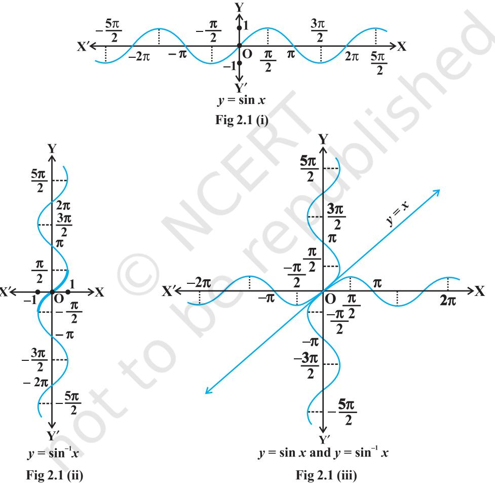
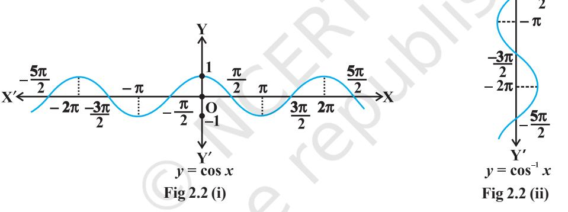
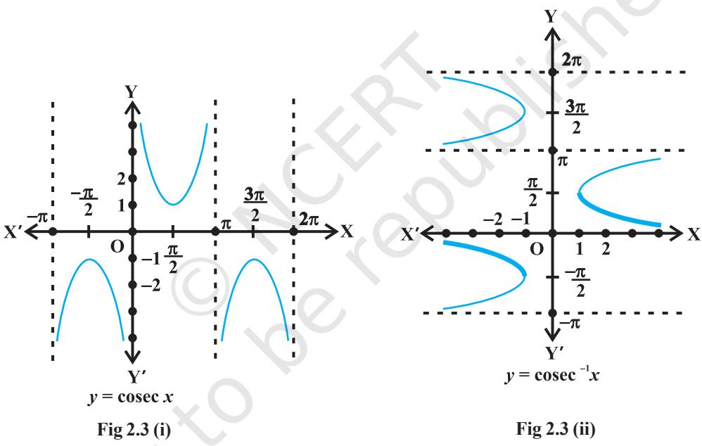
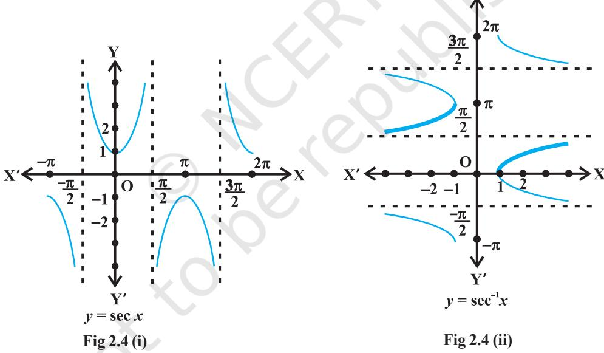
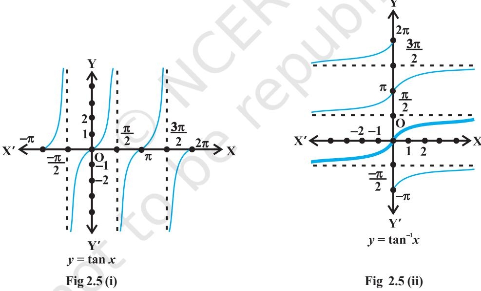
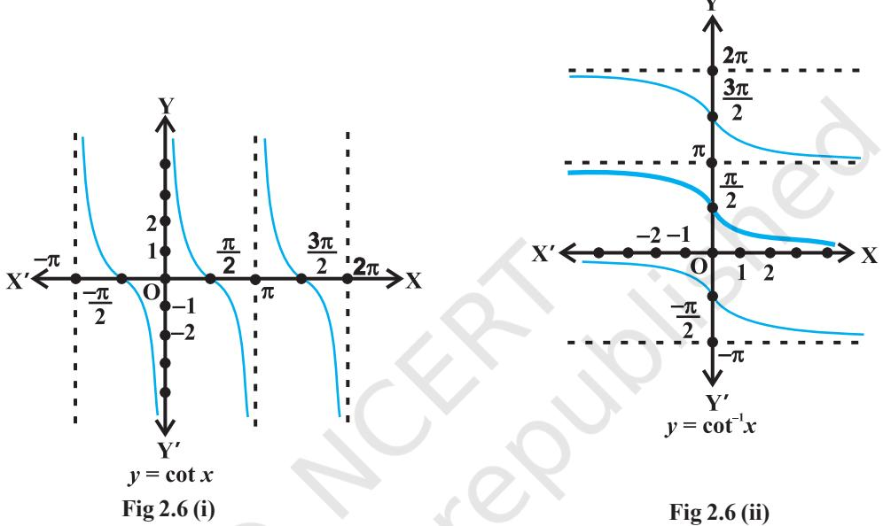
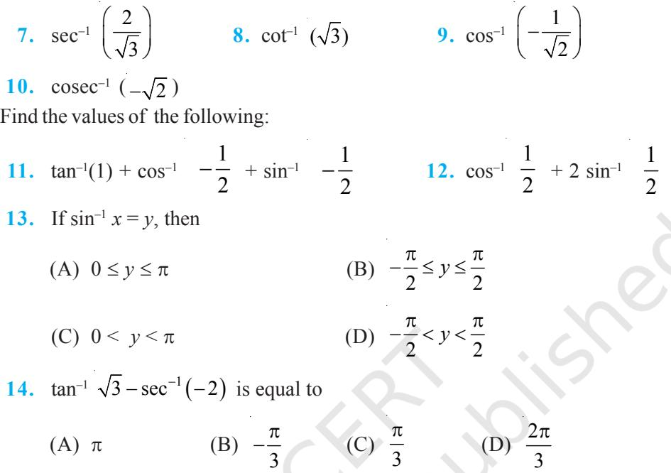

v*Mathematics, in general, is fundamentally the science of self-evident things. — FELIX KLEIN* v

## **2.1 Introduction**

18 MATHEMATICS

In Chapter 1, we have studied that the inverse of a function *f*, denoted by *f* –1, exists if *f* is one-one and onto. There are many functions which are not one-one, onto or both and hence we can not talk of their inverses. In Class XI, we studied that trigonometric functions are not one-one and onto over their natural domains and ranges and hence their inverses do not exist. In this chapter, we shall study about the restrictions on domains and ranges of trigonometric functions which ensure the existence of their inverses and observe their behaviour through graphical representations. Besides, some elementary properties will also be discussed.

The inverse trigonometric functions play an important role in calculus for they serve to define many integrals.

 **(476-550 A. D.)**

The concepts of inverse trigonometric functions is also used in science and engineering.

## **2.2 Basic Concepts**

In Class XI, we have studied trigonometric functions, which are defined as follows:

sine function, i.e., sine : **R** → [– 1, 1] cosine function, i.e., cos : **R** → [– 1, 1]

tangent function, i.e., tan : **R** – { *x* : *x* = (2*n* + 1) 2 π , *n* ∈ **Z**} → **R** cotangent function, i.e., cot : **R** – { *x* : *x* = *n*π, *n* ∈ **Z**} → **R** secant function, i.e., sec : **R** – { *x* : *x* = (2*n* + 1) 2 π , *n* ∈ **Z**} → **R** – (– 1, 1) cosecant function, i.e., cosec : **R** – { *x* : *x* = *n*π, *n* ∈ **Z**} → **R** – (– 1, 1)

We have also learnt in Chapter 1 that if *f* : X→Y such that *f*(*x*) = *y* is one-one and onto, then we can define a unique function *g* : Y→X such that *g*(*y*) = *x*, where *x* ∈ X and *y* = *f* (*x*), *y* ∈ Y. Here, the domain of *g* = range of *f* and the range of *g* = domain of *f*. The function *g* is called the inverse of *f* and is denoted by *f* –1. Further, *g* is also one-one and onto and inverse of *g* is *f*. Thus, *g* –1 = (*f* –1) –1 = *f*. We also have

$$\begin{array}{c}\left(f^{-1}\circ f\right)\left(x\right)=f^{-1}\left(f\left(x\right)\right)=f^{-1}(y)=x\\ \end{array}$$
  
  
and  
  

$$\begin{array}{c}\left(f\circ f^{-1}\right)\left(y\right)=f\left(f^{-1}(y)\right)\ =f(x)=y\\ \end{array}$$

Since the domain of sine function is the set of all real numbers and range is the closed interval [–1, 1]. If we restrict its domain to , 2 2 −π π , then it becomes one-one and onto with range [– 1, 1]. Actually, sine function restricted to any of the intervals − 3 2 2 π π , , , 2 2 −π π , 3 , 2 2 π π etc., is one-one and its range is [–1, 1]. We can, therefore, define the inverse of sine function in each of these intervals. We denote the inverse of sine function by sin–1 (arc sine function). Thus, sin–1 is a function whose domain is [– 1, 1] and range could be any of the intervals 3 , 2 2 − π −π , , 2 2 −π π or 3 , 2 2 π π , and so on. Corresponding to each such interval, we get a *branch* of the function sin–1. The branch with range , 2 2 −π π is called the *principal value branch, whereas other intervals as range give different branches of* sin–1 . When we refer to the function sin–1, we take it as the function whose domain is [–1, 1] and range is , 2 2 −π π . We write sin–1 : [–1, 1] → , 2 2 −π π From the definition of the inverse functions, it follows that sin (sin–1 *x*) = *x*

if – 1 ≤ *x* ≤ 1 and sin–1 (sin *x*) = *x* if 2 2 *x* π π − ≤ ≤ . In other words, if *y* = sin–1 *x*, then sin *y* = *x*.

## *Remarks*

- (i) We know from Chapter 1, that if *y* = *f*(*x*) is an invertible function, then *x* = *f* –1 (*y*). Thus, the graph of sin–1 function can be obtained from the graph of original function by interchanging *x* and *y* axes, i.e., if (*a*, *b*) is a point on the graph of sine function, then (*b*, *a*) becomes the corresponding point on the graph of inverse
of sine function. Thus, the graph of the function *y* = sin–1 *x* can be obtained from the graph of *y* = sin *x* by interchanging *x* and *y* axes. The graphs of *y* = sin *x* and *y* = sin–1 *x* are as given in Fig 2.1 (i), (ii), (iii). The dark portion of the graph of *y* = sin–1 *x* represent the principal value branch.

- (ii) It can be shown that the graph of an inverse function can be obtained from the corresponding graph of original function as a mirror image (i.e., reflection) along the line *y* = *x*. This can be visualised by looking the graphs of *y* = sin *x* and *y* = sin–1 *x* as given in the same axes (Fig 2.1 (iii)).

Like sine function, the cosine function is a function whose domain is the set of all real numbers and range is the set [–1, 1]. If we restrict the domain of cosine function to [0, π], then it becomes one-one and onto with range [–1, 1]. Actually, cosine function restricted to any of the intervals [– π, 0], [0,π], [π, 2π] etc., is bijective with range as [–1, 1]. We can, therefore, define the inverse of cosine function in each of these intervals. We denote the inverse of the cosine function by cos–1 (arc cosine function).

Thus, cos–1 is a function whose domain is [–1, 1] and range could be any of the intervals [–π, 0], [0, π], [π, 2π] etc. Corresponding to each such interval, we get a branch of the function cos–1. The branch with range [0, π] is called the *principal value branch* of the function cos–1 . We write

$$\cos^{-1}:[-1,\,1]\rightarrow[0,\,\pi].$$

The graph of the function given by *y* = cos–1 *x* can be drawn in the same way as discussed about the graph of *y* = sin–1 *x*. The graphs of *y* = cos *x* and *y* = cos–1 *x* are given in Fig 2.2 (i) and (ii).

Let us now discuss cosec–1*x* and sec–1*x* as follows:

Since, cosec *x* = 1 sin *x* , the domain of the cosec function is the set {*x* : *x* ∈ **R** and *x* ≠ *n*π, *n* ∈ **Z**} and the range is the set {*y* : *y* ∈ **R**, *y* ≥ 1 or *y* ≤ –1} i.e., the set **R** – (–1, 1). It means that *y* = cosec *x* assumes all real values except –1 < *y* < 1 and is not defined for integral multiple of π. If we restrict the domain of cosec function to , 2 2 π π − – {0}, then it is one to one and onto with its range as the set **R** – (– 1, 1). Actually, cosec function restricted to any of the intervals 3 , { } 2 2 − π −π − −π , , 2 2 −π π – {0}, 3 , { } 2 2 π π − π etc., is bijective and its range is the set of all real numbers **R** – (–1, 1).

Thus cosec–1 can be defined as a function whose domain is **R** – (–1, 1) and range could be any of the intervals − − − − 3 2 2 π π , { }π , − − π π 2 2 0, { } , 3 , { } 2 2 π π − π etc. The function corresponding to the range , {0} 2 2 −π π − is called the *principal value branch* of cosec–1 . We thus have principal branch as

$$\operatorname{cosec}^{-1}:\mathbf{R}-(-1,\,1)\to\left[{\frac{-\pi}{2}},{\frac{\pi}{2}}\right]-\{0\}$$

The graphs of *y* = cosec *x* and *y* = cosec–1 *x* are given in Fig 2.3 (i), (ii).

Also, since sec *x* = 1 cos *x* , the domain of *y* = sec *x* is the set **R** – {*x* : *x* = (2*n* + 1) 2 π , *n* ∈ **Z**} and range is the set **R** – (–1, 1). It means that sec (secant function) assumes all real values except –1 < *y* < 1 and is not defined for odd multiples of 2 π . If we restrict the domain of secant function to [0, π] – { 2 π }, then it is one-one and onto with its range as the set **R** – (–1, 1). Actually, secant function restricted to any of the intervals [–π, 0] – { 2 −π }, [0, ] – 2 π π , [π, 2π] – { 3 2 π } etc., is bijective and its range is **R** – {–1, 1}. Thus sec–1 can be defined as a function whose domain is **R**– (–1, 1) and range could be any of the intervals [– π, 0] – { 2 −π }, [0, π] – { 2 π }, [π, 2π] – { 3 2 π } etc. Corresponding to each of these intervals, we get different branches of the function sec–1 . The branch with range [0, π] – { 2 π } is called the *principal value branch* of the function sec–1 . We thus have

$$\sec^{-1}:\mathbf{R}-(-1,1)\rightarrow[0,\,\pi]-\{{\frac{\pi}{2}}\}$$

The graphs of the functions *y* = sec *x* and *y* = sec-1 *x* are given in Fig 2.4 (i), (ii).

Finally, we now discuss tan–1 and cot–1

We know that the domain of the tan function (tangent function) is the set {*x* : *x* ∈ **R** and *x* ≠ (2*n* +1) 2 π , *n* ∈ **Z**} and the range is **R**. It means that tan function is not defined for odd multiples of 2 π . If we restrict the domain of tangent function to

, 2 2 −π π , then it is one-one and onto with its range as **R**. Actually, tangent function restricted to any of the intervals 3 , 2 2 − π −π , , 2 2 −π π , 3 , 2 2 π π etc., is bijective and its range is **R**. Thus tan–1 can be defined as a function whose domain is **R** and range could be any of the intervals 3 , 2 2 − π −π , , 2 2 −π π , 3 , 2 2 π π and so on. These intervals give different branches of the function tan–1. The branch with range , 2 2 −π π is called the *principal value branch* of the function tan–1 . We thus have

$$\tan^{-1}:\mathbf{R}\to\left({\frac{-\pi}{2}},{\frac{\pi}{2}}\right)$$

The graphs of the function *y* = tan *x* and *y* = tan–1*x* are given in Fig 2.5 (i), (ii).

We know that domain of the cot function (cotangent function) is the set {*x* : *x* ∈ **R** and *x* ≠ *n*π, *n* ∈ **Z**} and range is **R**. It means that cotangent function is not defined for integral multiples of π. If we restrict the domain of cotangent function to (0, π), then it is bijective with and its range as **R**. In fact, cotangent function restricted to any of the intervals (–π, 0), (0, π), (π, 2π) etc., is bijective and its range is **R**. Thus cot –1 can be defined as a function whose domain is the **R** and range as any of the intervals (–π, 0), (0, π), (π, 2π) etc. These intervals give different branches of the function cot –1. The function with range (0, π) is called the *principal value branch* of the function cot –1 . We thus have

$$\cot^{-1}:\mathbf{R}\rightarrow(0,\,\pi)$$

The graphs of *y* = cot *x* and *y* = cot–1*x* are given in Fig 2.6 (i), (ii).

The following table gives the inverse trigonometric function (principal value branches) along with their domains and ranges.

| sin–1 | : | [–1, 1] | → | π  − | , | π   |  |
| --- | --- | --- | --- | --- | --- | --- | --- |
|  |  |  |  |  2 |  | 2  |  |
| cos–1 | : | [–1, 1] | → | [0, π] |  |  |  |
| cosec–1 | : | R – (–1,1) | → | π  −  | , | π    | – {0} |
|  |  |  |  | 2 |  | 2 |  |
| sec–1 | : | R – (–1, 1) | → | [0, π] – { |  |  | π } |
|  |  |  |  |  |  |  | 2 |
| tan–1 | : | R | → |  −π | , | π  |  |
|  |  |  |  |   |  |  |  |
|  |  |  |  | 2  |  | 2  |  |
| cot–1 | : | R | → | (0, π) |  |  |  |

## A**Note**

- 1. sin–1*x* should not be confused with (sin *x*) –1. In fact (sin *x*) –1 = 1 sin *x* and similarly for other trigonometric functions.
- 2. Whenever no branch of an inverse trigonometric functions is mentioned, we mean the principal value branch of that function.
- 3. The value of an inverse trigonometric functions which lies in the range of principal branch is called the *principal value* of that inverse trigonometric functions.

We now consider some examples:

#### **Example 1** Find the principal value of sin–1 1 2 . **Solution** Let sin–1 1 2 = *y*. Then, sin *y* = 1 2 .

We know that the range of the principal value branch of sin–1 is − π π 2 2 , and

$$\sin\!\left(\frac{\pi}{4}\right)\!=\frac{1}{\sqrt{2}}\,.$$
  
  
Therefore, principal value of $\sin^{-1}\!\left(\frac{1}{\sqrt{2}}\right)$ is $\frac{\pi}{4}$.  
  
**Example 2**: Find the principal value of $\sin^{-1}\!\left(\frac{1}{\sqrt{2}}\right)$.  
  

**Example 2** Find the principal value of cot–1 1 3 

  
  
**Solution** Let $\cot^{-1}\left(\frac{-1}{\sqrt{3}}\right)=y$. Then,  
  

$$\cot y=\frac{-1}{\sqrt{3}}=-\cot\left(\frac{\pi}{3}\right)=\cot\left(\pi-\frac{\pi}{3}\right)=\cot\left(\frac{2\pi}{3}\right)$$
  
  
We know that the range of principal value branch of $\cot$

We know that the range of principal value branch of cot–1 is (0, π) and cot 2 3 π = 1 3 − . Hence, principal value of cot–1 1 3 − is 2 3 π

**EXERCISE 2.1**

Find the principal values of the following:

- **1.** sin–1 1 2 − **2.** cos–1 3 2 **3.** cosec–1 (2) **4.** tan–1 ( 3) − **5.** cos–1 1 2 − **6.** tan–1 (–1)

## **2.3 Properties of Inverse Trigonometric Functions**

In this section, we shall prove some important properties of inverse trigonometric functions. It may be mentioned here that these results are valid within the principal value branches of the corresponding inverse trigonometric functions and wherever they are defined. Some results may not be valid for all values of the domains of inverse trigonometric functions. In fact, they will be valid only for some values of *x* for which inverse trigonometric functions are defined. We will not go into the details of these values of *x* in the domain as this discussion goes beyond the scope of this textbook.

Let us recall that if *y* = sin–1*x*, then *x* = sin *y* and if *x* = sin *y*, then *y* = sin–1*x*. This is equivalent to

$\sin\left(\sin^{-1}x\right)=x,x\in\left[-1,1\right]$ and $\sin^{-1}\left(\sin x\right)=x,x\in\left[\frac{-\pi}{2},\frac{\pi}{2}\right]$

For suitable values of domain similar results follow for remaining trigonometric functions.

We now consider some examples.

**Example 3** Show that

- (i) sin–1 ( ) 2 2 1 *x x* − = 2 sin–1 *x*, 1 1 2 2 − ≤ ≤*x* 1
(ii) $\sin^{-1}\left(2x\sqrt{1-x^{2}}\right)=2\cos^{-1}x$, $\frac{1}{\sqrt{2}}\leq x\leq1$.  
  

**Solution**

Let $x=\sin\ \theta$. Then $\sin^{-1}\ x=\theta$. We have  
  

$$\sin^{-1}\left(2x\sqrt{1-x^{2}}\ \right)=\sin^{-1}\left(2\sin\theta\sqrt{1-\sin^{2}\theta}\right)$$
 
$$=\sin^{-1}\left(2\sin\theta\ \cos\theta\right)=\sin^{-1}\left(\sin2\theta\right)=2\theta$$
 
$$=2\ \sin^{-1}x$$

(ii) Take *x* = cos θ, then proceeding as above, we get, sin–1 ( ) 2 2 1 *x x* − = 2 cos–1 *x*

**Example 4** Express 1 cos tan 1 sin *x x* − − , 3 2 2 − π π < <*x* in the simplest form. **Solution** We write

$$\tan^{-1}\!\left(\frac{\cos x}{2}+\sin\frac{x}{2}\right)\!\left(\cos\frac{x}{2}-\sin\frac{x}{2}\right)$$
 
$$=\tan^{-1}\!\left(\frac{\cos\frac{x}{2}+\sin\frac{x}{2}}{\left(\cos\frac{x}{2}-\sin\frac{x}{2}\right)^{2}}\right)$$
 
$$=\tan^{-1}\!\left[\frac{\cos\frac{x}{2}+\sin\frac{x}{2}}{\cos\frac{x}{2}-\sin\frac{x}{2}}\right]=\tan^{-1}\!\left[\frac{1+\tan\frac{x}{2}}{1-\tan\frac{x}{2}}\right]$$
 
$$=\tan^{-1}\!\left[\tan\!\left(\frac{\pi}{4}+\frac{x}{2}\right)\right]=\frac{\pi}{4}+\frac{x}{2}$$

  
  
**Example 5** Write $\cot^{-1}\!\left(\frac{1}{\sqrt{x^{2}-1}}\right)$, $x>1$ in the simplest form.  
  

**Solution** Let *x* = sec θ, then 2 *x* −1 = 2 sec 1 tan θ − = θ

> Therefore, –1 2 1 cot *x* −1 = cot–1 (cot θ) = θ = sec–1 *x,* which is the simplest form.

> > **EXERCISE 2.2**

Prove the following:

- **1.** 3sin–1 *x* = sin–1 (3*x* 4*x* 3 ), 1 1 – , 2 2 *x* ∈ 3 – 3*x*), 1

$$2. 3cos{}^{-1}x= cos{}^{-1}(4x^{3}-3x), x\in\frac{1}{2}$$

Write the following functions in the simplest form:

- **3.** 2 1 1 1 tan *x x* − + − , *x* ≠ 0 **4.** 1 1 cos tan 1 cos *x x* − − + , 0 < *x* < π **5.** 1 cos sin tan cos sin *x x x x* − − + , 4 −π < *x* < 3 4 π **6.** 1 2 2 tan *x a x* − − , | *x* | < *a* **7.** 2 3 1 3 2 3 tan 3 *a x x a ax* − − − , *a* > 0; 3 3 − < < *a a x*
Find the values of each of the following:

$\tan^{-1}\left[2\cos\left(2\sin^{-1}\frac{1}{2}\right)\right]$  
  
$\tan\frac{1}{2}\left[\sin^{-1}\frac{2x}{1+x^{2}}+\cos^{-1}\frac{1-y^{2}}{1+y^{2}}\right],\left|x\right|<1,y>0$ and $xy<1$

Find the values of each of the expressions in Exercises 16 to 18.

- **10.** –1 2 sin sin 3 π **11.** –1 3 tan tan 4 π **12.** –1 –1 3 3 tan sin cot 5 2 + **13.** 1 7 cos cos is equal to 6 − π (A) 7 6 π (B) 5 6 π (C) 3 π (D) 6 π **14.** 1 1 sin sin ( ) 3 2 π − − − is equal to (A) 1 2 (B) 1 3 (C) 1 4 (D) 1 **15.** 1 1 tan 3 cot ( 3) − − − − is equal to (A) π (B) 2 π − (C) 0 (D) 2 3
*Miscellaneous Examples*

**Example 6** Find the value of 1 3 sin (sin ) 5 − π

3

**Solution** We know that 1 sin (sin ) *x x* − = . Therefore, 1 3 3 sin (sin ) 5 5 − π π =

But

But  
  

$$\sin\left(\frac{3\pi}{5}\right)=\sin(\pi-\frac{3\pi}{5})=\sin\frac{2\pi}{5}\ \ \text{and}\ \ \frac{2\pi}{5}\in\left[-\frac{\pi}{2},\frac{\pi}{2}\right]$$

Therefore $\sin^{-1}(\sin\frac{3\pi}{5})=\sin^{-1}(\sin\frac{2\pi}{5})=\frac{2\pi}{5}$

,

π π π

## *Miscellaneous Exercise on Chapter 2*

Find the value of the following:

$\cos^{-1}\left(\cos\frac{13\pi}{6}\right)$

Prove that

  
  
## 3. $2\sin^{-1}\frac{3}{5}=\tan^{-1}\frac{24}{7}$  
  
$\cdot$  
  
$\cos^{-1}\frac{4}{5}+\cos^{-1}\frac{12}{13}=\cos^{-1}\frac{33}{65}$  
  
$\cdot$  
  
$\tan^{-1}\frac{63}{16}=\sin^{-1}\frac{5}{13}+\cos^{-1}\frac{3}{5}$

$$\frac{3}{5}=\tan^{-1}\frac{24}{7}\frac{4}{\cdot}\sin^{-1}\frac{8}{17}+\sin^{-1}\frac{3}{5}=\tan^{-1}\frac{77}{36}+\cos^{-1}\frac{12}{13}=\cos^{-1}\frac{33}{65}\frac{\cdot}{\cdot}\cos^{-1}\frac{12}{13}+\sin^{-1}\frac{3}{5}=\sin^{-1}\frac{56}{65}$$

Prove that

$\tan^{-1}\sqrt{x}=\frac{1}{2}\cos^{-1}\ \ \frac{1-x}{1+x}\ \,x\in[0,1]$  
  
$\cot^{-1}\left(\frac{\sqrt{1+\sin x}+\sqrt{1-\sin x}}{\sqrt{1+\sin x}-\sqrt{1-\sin x}}\right)=\frac{x}{2}\,x\in\left(0,\frac{\pi}{4}\right)$  
  
$\tan^{-1}\left(\frac{\sqrt{1+x}-\sqrt{1-x}}{\sqrt{1+x}+\sqrt{1-x}}\right)=\frac{\pi}{4}-\frac{1}{2}\cos^{-1}x\,\ -\frac{1}{\sqrt{2}}\leq x\leq1\ \ [$Hint: Put $x=\cos2\theta$]

Solve the following equations:

11. $2\tan^{-1}\left(\cos x\right)=\tan^{-1}\left(2\ \cos\ec x\right)$ 12. $\tan^{-1}\frac{1-x}{1+x}=\frac{1}{2}\tan^{-1}x,(x>0)$

**13.** sin (tan–1 *x*), | *x* | < 1 is equal to

(A) $\sqrt{1-x^{2}}$ (B) $\sqrt{1-x^{2}}$ (C) $\sqrt{1+x^{2}}$ (D) $\sqrt{1+x^{2}}$

**14.** sin–1 (1 – *x*) – 2 sin–1 *x* = 2 π , then *x* is equal to

* [1] (A) 0, $\frac{1}{2}$ (B) 1, $\frac{1}{2}$ (C) 0 (D) $\frac{1}{2}$

## *Summary*

- Æ The domains and ranges (principal value branches) of inverse trigonometric functions are given in the following table:

| Functions | Domain | Range |  |  |  |
| --- | --- | --- | --- | --- | --- |
|  |  | (Principal Value Branches) |  |  |  |
|  |  |  −π | π |  |  |
| y = sin–1 x | [–1, 1] | , |  |  |  |
|  |  |  2  | 2 |   |  |
| y = cos–1 x | [–1, 1] | [0, π] |  |  |  |
|  |  | −π  | π |  |  |
| y = cosec–1 x | R – (–1,1) | ,  |  |  | – {0} |
|  |  |  2 | 2 |  |  |
| y = sec–1 x | R – (–1, 1) | [0, π] – { |  |  | π } |
|  |  |  |  |  | 2 |
| y = tan–1 x | R |  π − , | π |  |  |
|  |  |   2  | 2 |  |  |
| y = cot–1 x | R | (0, π) |  |  |  |

Æ sin–1*x* should not be confused with (sin *x*) –1. In fact (sin *x*) –1 = 1 sin *x* and

similarly for other trigonometric functions.

- Æ The value of an inverse trigonometric functions which lies in its principal value branch is called the *principal value* of that inverse trigonometric functions.
For suitable values of domain, we have

- 

$$\sin\left(\sin^{-1}x\right)=x\phi\sin^{-1}\left(\sin x\right)=x.

$$

- Æ *y* = sin–1 *x* ⇒ *x* = sin *y* Æ *x =* sin *y* ⇒ *y =* sin–1 *x*
	-

## *Historical Note*

The study of trigonometry was first started in India. The ancient Indian Mathematicians, Aryabhata (476A.D.), Brahmagupta (598 A.D.), Bhaskara I (600 A.D.) and Bhaskara II (1114 A.D.) got important results of trigonometry. All this knowledge went from India to Arabia and then from there to Europe. The Greeks had also started the study of trigonometry but their approach was so clumsy that when the Indian approach became known, it was immediately adopted throughout the world.

In India, the predecessor of the modern trigonometric functions, known as the sine of an angle, and the introduction of the sine function represents one of the main contribution of the *siddhantas* (Sanskrit astronomical works) to mathematics.

Bhaskara I (about 600 A.D.) gave formulae to find the values of sine functions for angles more than 90°. A sixteenth century Malayalam work *Yuktibhasa* contains a proof for the expansion of sin (A + B). Exact expression for sines or cosines of 18°, 36°, 54°, 72°, etc., were given by Bhaskara II.

The symbols sin–1 *x*, cos–1 *x*, etc., for arc sin *x*, arc cos *x*, etc., were suggested by the astronomer Sir John F.W. Hersehel (1813) The name of Thales (about 600 B.C.) is invariably associated with height and distance problems. He is credited with the determination of the height of a great pyramid in Egypt by measuring shadows of the pyramid and an auxiliary staff (or gnomon) of known height, and comparing the ratios:

* [10] M. C. Gonzalez-Garcia, M. C. Gonzalez-Garcia, M.  
  

Thales is also said to have calculated the distance of a ship at sea through the proportionality of sides of similar triangles. Problems on height and distance using the similarity property are also found in ancient Indian works.

**—**v**—**

