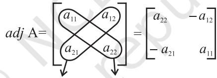
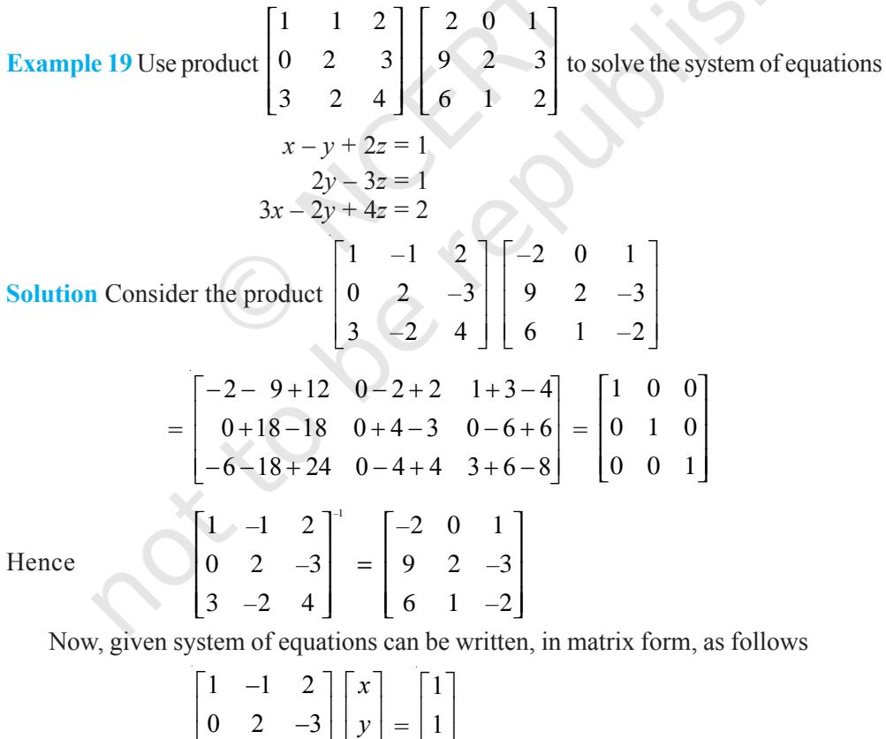

# v *All Mathematical truths are relative and conditional. — C.P. STEINMETZ* v

## **4.1 Introduction**

76 MATHEMATICS

In the previous chapter, we have studied about matrices and algebra of matrices. We have also learnt that a system of algebraic equations can be expressed in the form of matrices. This means, a system of linear equations like

$$a_{1}\,x+b_{1}\,y=c_{1}$$
 
$$a_{2}\,x+b_{2}\,y=c_{2}$$
  
  
can be represented as $\left[\begin{matrix}a_{1}&b_{1}\\ a_{2}&b_{2}\end{matrix}\right]\left[\begin{matrix}x\\ y\end{matrix}\right]=\left[\begin{matrix}c_{1}\\ c_{2}\end{matrix}\right]$. Now, this 

system of equations has a unique solution or not, is determined by the number *a*1 *b*2 – *a*2 *b*1 . (Recall that if

1 1 2 2 *a b a b* ≠ or, *a*1 *b*2 – *a*2 *b*1 ≠ 0, then the system of linear equations has a unique solution). The number *a*1 *b*2 – *a*2 *b*1

**P.S. Laplace (1749-1827)**

which determines uniqueness of solution is associated with the matrix 1 1 2 2 A *a b a b* =

and is called the determinant of A or det A. Determinants have wide applications in Engineering, Science, Economics, Social Science, etc.

In this chapter, we shall study determinants up to order three only with real entries. Also, we will study various properties of determinants, minors, cofactors and applications of determinants in finding the area of a triangle, adjoint and inverse of a square matrix, consistency and inconsistency of system of linear equations and solution of linear equations in two or three variables using inverse of a matrix.

## **4.2 Determinant**

To every square matrix A = [*aij*] of order *n*, we can associate a number (real or complex) called determinant of the square matrix A, where *aij* = (*i*, *j*) th element of A. This may be thought of as a function which associates each square matrix with a unique number (real or complex). If M is the set of square matrices, K is the set of numbers (real or complex) and *f* : M → K is defined by *f* (A) = *k*, where A ∈ M and *k* ∈ K, then *f*(A) is called the determinant of A. It is also denoted by |A| or det A or ∆.

If A = $\left[\begin{array}{cc}a&b\\ c&d\end{array}\right]$, then determinant of A is written as $|\,\mathrm{A}\,|=\left|\begin{array}{cc}a&b\\ c&d\end{array}\right|=\det\left(\mathrm{A}\right)$

*Remarks*

- (i) For matrix A, |A| is read as determinant of A and not modulus of A.
- (ii) Only square matrices have determinants.

#### **4.2.1** *Determinant of a matrix of order one*

Let A = [*a* ] be the matrix of order 1, then determinant of A is defined to be equal to *a*

#### **4.2.2** *Determinant of a matrix of order two*

Let  
  

$$\text{A}=\begin{bmatrix}a_{11}&a_{12}\\ a_{21}&a_{22}\end{bmatrix}\text{be a matrix of order}2\times2,$$

then the determinant of A is defined as:

$\left(\text{A}\right)=\left|\text{A}\right|=\Lambda=\left|\begin{array}{c}a_{11}\\ a_{21}\end{array}\right|=a_{11}a_{22}-a_{21}a_{12}$

**Example 1** Evaluate 2 4 –1 2 .

  
  
**Solution** We have $\left|\begin{array}{cc}2&4\\ -1&2\end{array}\right|=2(2)-4(-1)=4+4=8$.  
  

**Example 2** Evaluate 1 – 1 *x x x x* +

**Solution** We have

$\left|\begin{array}{c}x\\ x-1\end{array}\right|=x\left(x\right)-\left(x+1\right)\left(x-1\right)\ =x^{2}-\left(x^{2}-1\right)=x^{2}-x^{2}+1=1$

#### **4.2.3** *Determinant of a matrix of order* **3 × 3**

Determinant of a matrix of order three can be determined by expressing it in terms of second order determinants. This is known as expansion of a determinant along a row (or a column). There are six ways of expanding a determinant of order

3 corresponding to each of three rows (R1 , R2 and R3 ) and three columns (C1 , C2 and C3 ) giving the same value as shown below.

Consider the determinant of square matrix A = [*aij*] 3 × 3

i.e.,  
  

$$\left|\,\mathrm{A}\,\right|=\left|\begin{array}{ccc}a_{11}&a_{12}&a_{13}\\ a_{21}&a_{22}&a_{23}\\ a_{31}&a_{32}&a_{33}\end{array}\right|$$

#### **Expansion along first Row (R1 )**

**Step 1** Multiply first element *a*11 of R1 by (–1)(1 + 1) [(–1)sum of suffixes in *a* 11] and with the second order determinant obtained by deleting the elements of first row (R1 ) and first column (C1 ) of | A | as *a*11 lies in R1 and C1 ,

$$\mathrm{i.e.,}\qquad\qquad(-1)^{1\;+\;1}\;a_{11}\;\left|\begin{array}{l l}{{a_{22}}}&{{a_{23}}}\\ {{a_{32}}}&{{a_{33}}}\end{array}\right|$$

**Step 2** Multiply 2nd element *a*12 of R1 by (–1)1 + 2 [(–1)sum of suffixes in *a* 12] and the second order determinant obtained by deleting elements of first row (R1 ) and 2nd column (C2 ) of | A | as *a*12 lies in R1 and C2 ,

i.e., (–1)1 + 2 *a*12 21 23 31 33 *a a a a*

**Step 3** Multiply third element *a*13 of R1 by (–1)1 + 3 [(–1)sum of suffixes in *a* 13] and the second order determinant obtained by deleting elements of first row (R1 ) and third column (C3 ) of | A | as *a*13 lies in R1 and C3 ,

$$

**1.e.,**

(-1){}^{1} + {}^{3}a_{13}a_{31}a_{32}$$

**Step 4** Now the expansion of determinant of A, that is, | A | written as sum of all three terms obtained in steps 1, 2 and 3 above is given by

det A = |A| = (–1)1 + 1 *a*11 22 23 1 2 21 23 12 32 33 31 33 (–1) *a a a a a a a a a* + + + 1 3 21 22 13 31 32 (–1) *a a a a a* + or |A| = *a*11 (*a*22 *a*33 – *a*32 *a*23) – *a*12 (*a*21 *a*33 – *a*31 *a*23) + *a*13 (*a*21 *a*32 – *a*31 *a*22)

= *a*11 *a*22 *a*33 – *a*11 *a*32 *a*23 – *a*12 *a*21 *a*33 + *a*12 *a*31 *a*23 + *a*13 *a*21 *a*32 – *a*13 *a*31 *a*22 ... (1)

A**Note** We shall apply all four steps together.

**Expansion along second row** (**R2** )

$$\mathbf{\partial}\left[\mathbf{\partial}\mathbf{A}\right]={\left|\begin{array}{l l l}{\mathbf{a}_{11}}&{\mathbf{a}_{12}}&{\mathbf{a}_{13}}\\ {\mathbf{a}_{21}}&{\mathbf{a}_{22}}&{\mathbf{a}_{23}}\\ {\mathbf{a}_{31}}&{\mathbf{a}_{32}}&{\mathbf{a}_{33}}\end{array}\right|}$$

Expanding along R2 ,we get

| A | = 2 1 12 13 2 2 11 13 21 22 32 33 31 33 (–1) (–1) *a a a a a a a a a a* + + + 2 3 11 12 23 31 32 (–1) *a a a a a* + + = – *a*21 (*a*12 *a*33 – *a*32 *a*13) + *a*22 (*a*11 *a*33 – *a*31 *a*13) – *a*23 (*a*11 *a*32 – *a*31 *a*12)

| A | = – *a*21 *a*12 *a*33 + *a*21 *a*32 *a*13 + *a*22 *a*11 *a*33 – *a*22 *a*31 *a*13 – *a*23 *a*11 *a*32 + *a*23 *a*31 *a*12 = *a*11 *a*22 *a*33 – *a*11 *a*23 *a*32 – *a*12 *a*21 *a*33 + *a*12 *a*23 *a*31 + *a*13 *a*21 *a*32 – *a*13 *a*31 *a*22 ... (2)

**Expansion along first Column (C1 )**

$$|\mathbf{A}|={\begin{vmatrix}a_{11}&a_{12}&a_{13}\\ a_{21}&a_{22}&a_{23}\\ a_{31}&a_{32}&a_{33}\end{vmatrix}}$$

By expanding along C1 , we get

$$\begin{array}{c}\left(\begin{array}{c}\mbox{\small\hat{\mbox{A}}}\end{array}\right|=a_{11}\ (-1)^{1\,+\,1}\left|\begin{array}{cc}a_{22}&a_{23}\\ a_{32}&a_{33}\end{array}\right|+a_{21}\ (-1)^{2\,+\,1}\left|\begin{array}{cc}a_{12}&a_{13}\\ a_{32}&a_{33}\end{array}\right|\\ \cdot\\ +\ a_{31}\ (-1)^{3\,+\,1}\left|\begin{array}{cc}a_{12}&a_{13}\\ a_{22}&a_{23}\end{array}\right|\\ =a_{11}\ (a_{22}\ a_{33}-a_{23}\ a_{32})-a_{21}\ (a_{12}\ a_{33}-a_{13}\ a_{32})+a_{31}\ (a_{12}\ a_{23}-a_{13}\ a_{23})\end{array}$$

| A | = *a*11 *a*22 *a*33 – *a*11 *a*23 *a*32 – *a*21 *a*12 *a*33 + *a*21 *a*13 *a*32 + *a*31 *a*12 *a*23 – *a*31 *a*13 *a*22 = *a*11 *a*22 *a*33 – *a*11 *a*23 *a*32 – *a*12 *a*21 *a*33 + *a*12 *a*23 *a*31 + *a*13 *a*21 *a*32 – *a*13 *a*31 *a*22 ... (3)

Clearly, values of |A| in (1), (2) and (3) are equal. It is left as an exercise to the reader to verify that the values of |A| by expanding along R3 , C2 and C3 are equal to the value of |A| obtained in (1), (2) or (3).

Hence, expanding a determinant along any row or column gives same value.

#### *Remarks*

- (i) For easier calculations, we shall expand the determinant along that row or column which contains maximum number of zeros.
- (ii) While expanding, instead of multiplying by (–1)*i* + *j* , we can multiply by +1 or –1 according as (*i* + *j*) is even or odd.

(ii) Let A = $\left[\begin{array}{cc}2&2\\ 4&0\end{array}\right]$ and B = $\left[\begin{array}{cc}1&1\\ 2&0\end{array}\right]$. Then, it is easy to verify that A = 2B. Also, $|\,\mathrm{A}\,|=0-8=-8$ and $|\,\mathrm{B}\,|=0-2=\raisebox{-2.15pt}{\includegraphics[height=28.452756pt]{.}}$.  
  

Observe that, |A| = 4(– 2) = 22 |B| or |A| = 2*n* |B|, where *n* = 2 is the order of square matrices A and B.

In general, if A = *k*B where A and B are square matrices of order *n*, then | A| = *k n* | B |, where *n* = 1, 2, 3

**Example 3** Evaluate the determinant ∆ = 1 2 4 –1 3 0 4 1 0 .

**Solution** Note that in the third column, two entries are zero. So expanding along third column (C3 ), we get

$$\Lambda=4\left|\begin{array}{cc}-1&3\\ 4&1\end{array}\right|-0\left|\begin{array}{cc}1&2\\ 4&1\end{array}\right|+0\left|\begin{array}{cc}1&2\\ -1&3\end{array}\right|

\Lambda=4\left|\begin{array}{cc}-1&3\\ 4&1\end{array}\right|-0\left|\begin{array}{cc}1&2\\ 4&1\end{array}\right|+0\left|\begin{array}{cc}1&2\\ -1&3\end{array}\right|

\Lambda=4\left|\begin{array}{cc}-1&3\\ 4&1\end{array}\right|-0\left|\begin{array}{cc}1&2\\ 4&1\end{array}\right|+0\left|\begin{array}{cc}1&2\\ -1&3\end{array}\right|

\(\Lambda=4$$

**Example 4** Evaluate ∆ = 0 sin – cos –sin 0 sin cos –sin 0 α α α β α β . **Solution** Expanding along R1 , we get

∆ = 0 sin – sin sin – sin 0 0 – sin – cos – sin 0 cos 0 cos – sin β α β α α α β α α β = 0 – sin α (0 – sin β cos α) – cos α (sin α sin β – 0) = sin α sin β cos α – cos α sin α sin β = 0 **Example 5** Find values of *x* for which 3 3 2 1 4 1 *x x* = . **Solution** We have 3 3 2 1 4 1 *x x* = i.e. 3 – *x* 2 = 3 – 8 i.e. *x* 2 = 8 Hence *x* = ± 2 2 **EXERCISE 4.1** Evaluate the determinants in Exercises 1 and 2. **1.** 2 4 –5 –1 **2.** (i) cos – sin sin cos θ θ θ θ (ii) 2 – 1 – 1 1 1 *x x x x x* + + + **3.** If A = 1 2 4 2 , then show that | 2A | = 4 | A | **4.** If A = 1 0 1 0 1 2 0 0 4 , then show that | 3 A | = 27 | A |

- **5.** Evaluate the determinants

|  | 3 | –1 | –2 |  | 3 | – 4 | 5 |
| --- | --- | --- | --- | --- | --- | --- | --- |
| (i) | 0 | 0 | –1 | (ii) | 1 | 1 | –2 |
|  | 3 | –5 | 0 |  | 2 | 3 | 1 |

(iii) 0 1 2 –1 0 –3 –2 3 0 (iv) 2 –1 –2 0 2 –1 3 –5 0 **6.** If A = 1 1 –2 2 1 –3 5 4 –9 , find | A | **7.** Find values of *x*, if (i) 2 4 2 4 5 1 6 *x x* = (ii) 2 3 3 4 5 2 5 *x x* = **8.** If 2 6 2 18 18 6 *x x* = , then *x* is equal to (A) 6 (B) ± 6 (C) – 6 (D) 0

## **4.3 Area of a Triangle**

In earlier classes, we have studied that the area of a triangle whose vertices are

(*x*1 , *y*1 ), (*x*2 , *y*2 ) and (*x*3 , *y*3 ), is given by the expression 1 2 [*x*1 (*y*2 –*y*3 ) + *x*2 (*y*3 –*y*1 ) + *x*3 (*y*1 –*y*2 )]. Now this expression can be written in the form of a determinant as

∆ = 1 1 2 2 3 3 1 1 1 2 1 *x y x y x y* ... (1)

#### *Remarks*

- (i) Since area is a positive quantity, we always take the absolute value of the determinant in (1).
- (ii) If area is given, use both positive and negative values of the determinant for calculation.
- (iii) The area of the triangle formed by three collinear points is zero.

**Example 6** Find the area of the triangle whose vertices are (3, 8), (– 4, 2) and (5, 1). **Solution** The area of triangle is given by

$$\Delta={\frac{1}{2}}{\left|\begin{array}{l l l}{3}&{8}&{1}\\ {-4}&{2}&{1}\\ {5}&{1}&{1}\end{array}\right|}$$

$$={\frac{1}{2}}\left[3(2-1)-8(-4-5)+1(-4-10)\right]$$
 
$$={\frac{1}{2}}\left(3+72-14\right)={\frac{61}{2}}$$

**Example 7** Find the equation of the line joining A(1, 3) and B (0, 0) using determinants and find *k* if D(*k,* 0) is a point such that area of triangle ABD is 3sq units.

**Solution** Let P (*x, y*) be any point on AB. Then, area of triangle ABP is zero (Why?). So

$$\begin{array}{c|cccc}1&0&0&1\\ 2&1&3&1\\ x&y&1\end{array}=0$$
  
  
This gives  
  

$$\begin{array}{c|cccc}1&0&0&1\\ 2&1&3&1\\ x&y&1\end{array}=0$$
  
  
This gives  
  

$$\begin{array}{c|cccc}1&0&0&1\\ 2&1&3&1\\ x&y&1\end{array}=0$$
  
  
This gives  
  

$$\begin{array}{c|cccc}1&0&0&1\\ 2&1&3&1\\ x&y&1\end{array}=0$$
  
  
This gives  
  

$$\begin{array}{c|cccc}1&0&0&1\\ 2&1&3&1\\ x&y&1\end{array}=0$$
  
  

which is the equation of required line AB.

Also, since the area of the triangle ABD is 3 sq. units, we have

$${\frac{1}{2}}\left|\begin{array}{l l}{{1}}&{{3}}\\ {{0}}&{{0}}\\ {{k}}&{{0}}\end{array}\right|=\pm3$$

This gives, 3 3 2 − *k* = ± , i.e., *k* = ∓ 2.

**EXERCISE 4.2**

- **1.** Find area of the triangle with vertices at the point given in each of the following :
	- (i) (1, 0), (6, 0), (4, 3) (ii) (2, 7), (1, 1), (10, 8)
	- (iii) (–2, –3), (3, 2), (–1, –8)
- **2.** Show that points

A (*a, b + c*), B (*b, c + a*), C (*c, a + b*) are collinear.

- **3.** Find values of *k* if area of triangle is 4 sq. units and vertices are
(i) (*k*, 0), (4, 0), (0, 2) (ii) (–2, 0), (0, 4), (0, *k*)

- **4.** (i) Find equation of line joining (1, 2) and (3, 6) using determinants.
	- (ii) Find equation of line joining (3, 1) and (9, 3) using determinants.
- **5.** If area of triangle is 35 sq units with vertices (2, 6), (5, 4) and (*k*, 4). Then *k* is (A) 12 (B) –2 (C) –12, –2 (D) 12, –2

## **4.4 Minors and Cofactors**

In this section, we will learn to write the expansion of a determinant in compact form using minors and cofactors.

**Definition 1** Minor of an element *aij* of a determinant is the determinant obtained by deleting its *i*th row and *j*th column in which element *aij* lies. Minor of an element *aij* is denoted by M*ij*.

*Remark* Minor of an element of a determinant of order *n*(*n* ≥ 2) is a determinant of order *n* – 1.

**Example 8** Find the minor of element 6 in the determinant 1 2 3 4 5 6 7 8 9 ∆ =

**Solution** Since 6 lies in the second row and third column, its minor M23 is given by

$\mathrm{M}_{23}=\begin{bmatrix}1&2\\ 7&8\end{bmatrix}=8-14=-6$ (obtained by deleting $\mathrm{R}_{2}$ and $\mathrm{C}_{3}$ in $\Delta$).  
  

**Definition 2** Cofactor of an element *aij* , denoted by A*ij* is defined by A*ij* = (–1)*i* + *j* M*ij* , where M*ij* is minor of *aij* .

**Example 9** Find minors and cofactors of all the elements of the determinant 1 –2 4 3

**Solution** Minor of the element *aij* is M*ij* Here *a*11 = 1. So M11 = Minor of *a*11= 3 M12 = Minor of the element *a*12 = 4 M21 = Minor of the element *a*21 = –2 M22 = Minor of the element *a*22 = 1 Now, cofactor of *aij* is A*ij*. So A11 = (–1)1 + 1 M11 = (–1)2 (3) = 3 A12 = (–1)1 + 2 M12 = (–1)3 (4) = – 4 A21 = (–1)2 + 1 M21 = (–1)3 (–2) = 2 A22 = (–1)2 + 2 M22 = (–1)4 (1) = 1

**Example 10** Find minors and cofactors of the elements *a*11, *a*21 in the determinant

$$\Delta=\begin{vmatrix}a_{11}&a_{12}&a_{13}\\ a_{21}&a_{22}&a_{23}\\ a_{31}&a_{32}&a_{33}\end{vmatrix}$$

**Solution** By definition of minors and cofactors, we have

Minor of *a*11 = M11 = 22 23 32 33 *a a a a* = *a*22 *a*33– *a*23 *a*32 Cofactor of *a*11 = A11 = (–1)1+1 M11 = *a*22 *a*33 – *a*23 *a*32 Minor of *a*21 = M21 = 12 13 32 33 *a a a a* = *a*12 *a*33 – *a*13 *a*32

Cofactor of *a*21 = A21 = (–1)2+1 M21 = (–1) (*a*12 *a*33 – *a*13 *a*32) = – *a*12 *a*33 + *a*13 *a*32 *Remark* Expanding the determinant ∆, in Example 21, along R1 , we have

$$\Lambda=(-1)^{1+1}\,a_{11}a_{22}a_{33}+(-1)^{1+2}\,a_{12}a_{21}a_{33}+(-1)^{1+3}\,a_{13}a_{31}a_{32}$$

= *a*11 A11 + *a*12 A12 + *a*13 A13, where A*ij* is cofactor of *aij*

 = sum of product of elements of R1 with their corresponding cofactors

Similarly, ∆ can be calculated by other five ways of expansion that is along R2 , R3 , C1 , C2 and C3 .

Hence ∆ = sum of the product of elements of any row (or column) with their corresponding cofactors.

A**Note** If elements of a row (or column) are multiplied with cofactors of any other row (or column), then their sum is zero. For example,

∆ = *a*11 A21 + *a*12 A22 + *a*13 A23 = *a*11 (–1)1+1 12 13 32 33 *a a a a* + *a*12 (–1)1+2 11 13 31 33 *a a a a* + *a*13 (–1)1+3 11 12 31 32 *a a a a* = 11 12 13 11 12 13 31 32 33 *a a a a a a a a a* = 0 (since R1 and R2 are identical)

Similarly, we can try for other rows and columns.

**Example 11** Find minors and cofactors of the elements of the determinant

- 2 3 5 6 0 4 1 5 7 *– –* and verify that *a*11 A31 + *a*12 A32 + *a*13 A33= 0
**Solution** We have M11 = 0 4 5 7*–* = 0 –20 = –20; A11 = (–1)1+1 (–20) = –20 M12 = 6 4 1 7*–* = – 42 – 4 = – 46; A12 = (–1)1+2 (– 46) = 46 M13 = 6 0 1 5 = 30 – 0 = 30; A13 = (–1)1+3 (30) = 30 M21 = 3 5 5 7 *– –* = 21 – 25 = – 4; A21 = (–1)2+1 (– 4) = 4 M22 = 2 5 1 7*–* = –14 – 5 = –19; A22 = (–1)2+2 (–19) = –19 M23 = 2 3 1 5 *–* = 10 + 3 = 13; A23 = (–1)2+3 (13) = –13 M31 = 3 5 0 4 *–* = –12 – 0 = –12; A31 = (–1)3+1 (–12) = –12 M32 = 2 5 6 4 = 8 – 30 = –22; A32 = (–1)3+2 (–22) = 22 and M33 = 2 3 6 0 *–* = 0 + 18 = 18; A33 = (–1)3+3 (18) = 18 Now *a*11 = 2, *a*12 = –3, *a*13 = 5; A31 = –12, A32 = 22, A33 = 18

So  
  

$$a_{11}\;{\rm A}_{31}+a_{12}\;{\rm A}_{32}+a_{13}\;{\rm A}_{33}$$
 
$$=2\;(-12)+(-3)\;(22)+5\;(18)=-24-66+90=0$$

# **EXERCISE 4.3**

Write Minors and Cofactors of the elements of following determinants:

  
  
\begin{tabular}{l|c|c|c|c|c}  
1. (i) & $2$ & $-4$ & (ii) & $a$ & $c$ \\  
0 & 3 & & & $b$ & $d$ \\ \end{tabular}  
  

**3.** Using Cofactors of elements of second row, evaluate ∆ = 5 3 8 2 0 1 1 2 3 . **4.** Using Cofactors of elements of third column, evaluate ∆ = 1 1 1 *x yz y zx z xy* .

  
  
**5.**: If $\Delta=\begin{vmatrix}a_{11}&a_{12}&a_{13}\\ a_{21}&a_{22}&a_{23}\\ a_{31}&a_{32}&a_{33}\end{vmatrix}$ and $\Delta_{ij}$ is Cofactors of $a_{ij}$, then value of $\Delta$ is given by

* $a_{{}_{11}}\,{\rm A}_{{}_{31}}+a_{{}_{12}}{\rm A}_{{}_{32}}+a_{{}_{13}}{\rm A}_{{}_{33}}$ (B) $a_{{}_{11}}{\rm A}_{{}_{11}}+a_{{}_{12}}\,{\rm A}_{{}_{21}}+a_{{}_{13}}\,{\rm A}_{{}_{31}}$  
* $a_{{}_{21}}\,{\rm A}_{{}_{11}}+a_{{}_{22}}{\rm A}_{{}_{12}}+a_{{}_{23}}\,{\rm A}_{{}_{13}}$

## **4.5 Adjoint and Inverse of a Matrix**

In the previous chapter, we have studied inverse of a matrix. In this section, we shall discuss the condition for existence of inverse of a matrix.

To find inverse of a matrix A, i.e., A–1 we shall first define adjoint of a matrix.

## **4.5.1** *Adjoint of a matrix*

**Definition 3** The adjoint of a square matrix A = [*aij*] *n* × *n* is defined as the transpose of the matrix [A*ij*] *n* × *n* , where A*ij* is the cofactor of the element *aij* . Adjoint of the matrix A is denoted by *adj* A.

$$\operatorname{Let}$$

$$\mathbf{A}={\left[\begin{array}{l l l}{a_{11}}&{a_{12}}&{a_{13}}\\ {a_{21}}&{a_{22}}&{a_{23}}\\ {a_{31}}&{a_{32}}&{a_{33}}\end{array}\right]}$$

Then _adj_ A = Transposeof $\begin{bmatrix}\text{A}_{11}&\text{A}_{12}&\text{A}_{13}\\ \text{A}_{21}&\text{A}_{22}&\text{A}_{23}\\ \text{A}_{31}&\text{A}_{32}&\text{A}_{33}\end{bmatrix}=\begin{bmatrix}\text{A}_{11}&\text{A}_{21}&\text{A}_{31}\\ \text{A}_{12}&\text{A}_{22}&\text{A}_{32}\\ \text{A}_{13}&\text{A}_{23}&\text{A}_{33}\end{bmatrix}$

**Example 12** 2 3 Find A for A = 1 4 *adj* **Solution** We have A11 = 4, A12 = –1, A21 = –3, A22 = 2 Hence *adj* A = 11 21 12 22 A A 4 –3 = A A –1 2 

*Remark* For a square matrix of order 2, given by

$$\mathbf{A}={\left[\begin{array}{l l}{a_{11}}&{a_{12}}\\ {a_{21}}&{a_{22}}\end{array}\right]}$$

The *adj* A can also be obtained by interchanging *a*11 and *a*22 and by changing signs of *a*12 and *a*21, i.e.,

We state the following theorem without proof.

**Theorem 1** If A be any given square matrix of order *n*, then

(_Adj_ A) = (_adj_ A) A = [A]I,

where I is the identity matrix of order *n*

#### **Verification**

Let  
  
$\begin{array}{c}\includegraphics[height=142.26375pt]{Fig1}\end{array}$  
  
$\begin{array}{c}\includegraphics[height=142.26375pt]{Fig2}\end{array}$  
  
$\begin{array}{c}\includegraphics[height=142.26375pt]{Fig3}\end{array}$  
  
$\begin{array}{c}\includegraphics[height=142.26375pt]{Fig4}\end{array}$  
  
$\begin{array}{c}\includegraphics[height=142.26375pt]{Fig5}\end{array}$  
  
$\begin{array}{c}\includegraphics[height=142.26375pt]{Fig6}\end{array}$  
  
$\begin{array}{c}\includegraphics[height=142.26375pt]{Fig7}\end{array}$  
  
$\begin{array}{c}\includegraphics[height=142.26375pt]{Fig8}\end{array}$  
  
\(\begin{array}{c}\includegraphics[height=142.  
  

Since sum of product of elements of a row (or a column) with corresponding cofactors is equal to |A| and otherwise zero, we have

$\mathbf{A}\left(adj\,\mathbf{A}\right)=\left[\begin{array}{cccc}\left|\mathbf{A}\right|&0&0\\ 0&\left|\mathbf{A}\right|&0\\ 0&0&\left|\mathbf{A}\right|\end{array}\right]=\left|\mathbf{A}\right|\left[\begin{array}{cccc}1&0&0\\ 0&1&0\\ 0&0&1\end{array}\right]=\left|\mathbf{A}\right|$

Similarly, we can show (*adj* A) A = A I

Hence A (*adj* A) = (*adj* A) A = A I

**Definition 4** A square matrix A is said to be singular if A = 0.

For example, the determinant of matrix A = 1 2 4 8 is zero

Hence A is a singular matrix.

**Definition 5** A square matrix A is said to be non-singular if A ≠ 0

Let  
  

$$\text{A}=\begin{bmatrix}1&2\\ 3&4\end{bmatrix}.$$
  
  
Then $\left|\text{A}\right|=\begin{bmatrix}1&2\\ 3&4\end{bmatrix}=4-6=2\neq0$.  
  

Hence A is a nonsingular matrix

We state the following theorems without proof.

**Theorem 2** If A and B are nonsingular matrices of the same order, then AB and BA are also nonsingular matrices of the same order.

**Theorem 3** The determinant of the product of matrices is equal to product of their respective determinants, that is, AB = A B , where A and B are square matrices of the same order

_Remark_ We know that $(adj\,A)\,A=\left|A\right|\,\,I=\left|\begin{array}{ccc}\left|A\right|&0&0\\ 0&\left|A\right|&0\\ 0&0&\left|A\right|\end{array}\right|,\left|A\right|\neq0$.  
  

Writing determinants of matrices on both sides, we have

$${\dot{\mathbf{\nabla}}}\left|(a d j\,\mathbf{A})\,\mathbf{A}\right|={\begin{array}{l l l}{\left|\mathbf{A}\right|}&{0}&{0}\\ {0}&{\left|\mathbf{A}\right|}&{0}\\ {0}&{0}&{\left|\mathbf{A}\right|}\end{array}}$$

i.e.  
  

$$|(\textit{adj}\ \mathrm{A})|\ |\mathrm{A}|=|\mathrm{A}|^{3}\begin{vmatrix}1&0&0\\ 0&1&0\\ 0&0&1\end{vmatrix}$$
 (Why?)

2

1.e. $|$(_adj_ A)$|$A$|=|$A$|^{3}$ (1)

i.e.  
  
$|(adj\ A)|=|A|$

In general, if A is *a* square matrix of order *n*, then |*adj*(A)| = |A| *n* – 1 .

**Theorem 4** A square matrix A is invertible if and only if A is nonsingular matrix. **Proof** Let A be invertible matrix of order *n* and I be the identity matrix of order *n*. Then, there exists a square matrix B of order *n* such that AB = BA = I

Now AB = I. So AB = I or A B = 1 (since I 1, AB A B ) = =

This gives A ≠ 0. Hence A is nonsingular.

Conversely, let A be nonsingular. Then A ≠ 0

Now A (*adj* A) = (*adj* A) A = A I (Theorem 1) 1 1 A A A I *adj adj* = =

or A

or  
  
AB = BA = I, where B = 1 A _adj_ A 

| A | | A |

Thus A is invertible and A–1 = 1 A | A | *adj*

**Example 13** If A = 1 3 3 1 4 3 1 3 4 , then verify that A *adj* A = |A| I. Also find A–1 .

**Solution** We have A = 1 (16 – 9) –3 (4 – 3) + 3 (3 – 4) = 1 ≠ 0 Now A11 = 7, A12 = –1, A13 = –1, A21 = –3, A22 = 1,A23 = 0, A31 = –3, A32 = 0, A33 = 1

|  |  |  | 7 | − | 3 | − 3 |  |
| --- | --- | --- | --- | --- | --- | --- | --- |
| Therefore | adj A = |  |  |  |  |  |   |
|  |  | −  | 1 |  | 1 | 0 |  |
|  |  |  −  | 1 |  | 0 | 1 |   |

Now A (*adj* A) = 1 3 3 7 3 3 1 4 3 1 1 0 1 3 4 1 0 1 − − − − = 7 3 3 3 3 0 3 0 3 7 4 3 3 4 0 3 0 3 7 3 4 3 3 0 3 0 4 − − − + + − + + − − − + + − + + − − − + + − + + = 1 0 0 0 1 0 0 0 1 = (1) 1 0 0 0 1 0 0 0 1 = A . I Also A–1 1 A A = *a d j* = 7 3 3 1 1 1 0 1 1 0 1 − − − − = 7 3 3 1 1 0 1 0 1 − − − − **Example 14** If A = 2 3 1 2 and B 1 4 1 3 − = − − , then verify that (AB)–1 = B–1A–1 . **Solution** We have AB = 2 3 1 2 1 5 1 4 1 3 5 14 − − = − − − Since, AB = –11 ≠ 0, (AB)–1 exists and is given by (AB)–1 = 1 1 14 5 (AB) AB 11 5 1 *adj* − − =− − − 1 14 5 11 5 1 = Further, A = –11 ≠ 0 and B = 1 ≠ 0. Therefore, A–1 and B–1 both exist and are given by A–1 = − − − − = 1 − 11 4 3 1 2 3 2 1 1 1 ,B

Therefore B A− − = − − − − 1 1 1 11 3 2 1 1 4 3 1 2 = − − − − − 1 11 14 5 5 1 1 14 5 11 5 1 = Hence (AB)–1 = B–1 A–1

**Example 15** Show that the matrix A = 2 3 1 2 satisfies the equation A2 – 4A + I = O, where I is 2 × 2 identity matrix and O is 2 × 2 zero matrix. Using this equation, find A–1 .

  
  
**Solution** We have $\mathbf{A}^{2}=\mathbf{A}.\mathbf{A}=\begin{bmatrix}2&3\\ 1&2\end{bmatrix}\begin{bmatrix}2&3\\ 1&2\end{bmatrix}=\begin{bmatrix}7&12\\ 4&7\end{bmatrix}$  
  
Hence $\mathbf{A}^{2}-4\mathbf{A}+\mathbf{I}=\begin{bmatrix}7&12\\ \mathbf{A}&\mathbf{A}\end{bmatrix}-\begin{bmatrix}8&12\\ \mathbf{A}&\mathbf{A}\end{bmatrix}+\begin{bmatrix}1&0\\ \mathbf{A}&\mathbf{A}\end{bmatrix}=\begin{bmatrix}0&0\\ \mathbf{A}&\mathbf{A}\end{bmatrix}$

$$\begin{split}\text{A}^{2}-4\text{A}+\text{I}=\begin{bmatrix}7&12\\ 4&7\end{bmatrix}-\begin{bmatrix}8&12\\ 4&8\end{bmatrix}+\begin{bmatrix}1&0\\ 0&1\end{bmatrix}=\begin{bmatrix}0&0\\ 0&0\end{bmatrix}=\text{O}\\ \text{A}^{2}-4\text{A}+\text{I}=\text{O}\end{split}$$

Now A2

Therefore A A – 4A = – I

or A A (A–1) – 4 A A–1 = – I A–1 (Post multiplying by A–1 because |A| ≠ 0)

$$\mathbf{U}\mathbf{I}$$

  
  
**or**  
  
A (A A${}^{-1}$) - 4I = - A${}^{-1}$  
  
or  
  
AI - 4I = - A${}^{-1}$

$\alpha\pi$.  

or A–1 = 4I – A = 4 0 2 3 2 3 0 4 1 2 1 2 − − = − 1 2 3 A − − = −

Hence

## **EXERCISE 4.4**

Find adjoint of each of the matrices in Exercises 1 and 2.

1 2

  
  
## 1. $\left[\begin{matrix}1&2\\ 3&4\end{matrix}\right]$  
  
$\left[\begin{matrix}1&2\\ 2&3&5\\ -2&0&1\end{matrix}\right]$

Verify A (*adj* A) = (*adj* A) A = |A| I in Exercises 3 and 4

  
  
## 1 Introduction  
  
The _Fractional State_ of the Universe is a very important concept in the field theory. The _Fractional State_ of the Universe is a very important concept in the field theory.  
  

Find the inverse of each of the matrices (if it exists) given in Exercises 5 to 11.

- **5.** 2 2 4 3 − **6.** − − 1 5 3 2 **7.** 1 2 3 0 2 4 0 0 5
**8.** 1 0 0 3 3 0 5 2 1− **9.** 2 1 3 4 1 0 7 2 1 − − **10.** 1 1 2 0 2 3 3 2 4 − − − **11.** 1 0 0 0 cos sin 0 sin cos α α α − α **12.** Let A = 3 7 2 5 and B = 6 8 7 9 . Verify that (AB)–1 = B–1 A–1 . **13.** If A = 3 1 −1 2 , show that A2 – 5A + 7I = O. Hence find A–1 . **14.** For the matrix A = 3 2 1 1 , find the numbers *a* and *b* such that A2 + *a*A + *b*I = O. **15.** For the matrix A = 1 1 1 1 2 3 2 1 3 − − Show that A3– 6A2 + 5A + 11 I = O. Hence, find A–1 . **16.** If A = 2 1 1 1 2 1 1 1 2 − − − − Verify that A3 – 6A2 + 9A – 4I = O and hence find A–1 **17.** Let A be a nonsingular square matrix of order 3 × 3. Then |*adj* A| is equal to (A) | A | (B) | A | 2 (C) | A | 3 (D) 3|A| **18.** If A is an invertible matrix of order 2, then det (A–1) is equal to (A) det (A) (B) 1 det (A) (C) 1 (D) 0

## **4.6 Applications of Determinants and Matrices**

In this section, we shall discuss application of determinants and matrices for solving the system of linear equations in two or three variables and for checking the consistency of the system of linear equations.

**Consistent system** A system of equations is said to be *consistent* if its solution (one or more) exists.

**Inconsistent system** A system of equations is said to be *inconsistent* if its solution does not exist.

A**Note** In this chapter, we restrict ourselves to the system of linear equations having unique solutions only.

**4.6.1** *Solution of system of linear equations using inverse of a matrix*

Let us express the system of linear equations as matrix equations and solve them using inverse of the coefficient matrix.

Consider the system of equations

$a_{1}\,x+b_{1}y+c_{1}\,z=d_{1}$  
  
$a_{2}\,x+b_{2}y+c_{2}\,z=d_{2}$  
  
$a_{3}\,x+b_{3}y+c_{3}\,z=d_{3}$  
  
Let $\mathrm{A}=\begin{bmatrix}a_{1}&b_{1}&c_{1}\\ a_{2}&b_{2}&c_{2}\\ a_{3}&b_{3}&c_{3}\end{bmatrix}$, $\mathrm{X}=\begin{bmatrix}x\\ y\\ z\end{bmatrix}$ and $\mathrm{B}=\begin{bmatrix}d_{1}\\ d_{2}\\ d_{3}\end{bmatrix}$

Then, the system of equations can be written as, AX = B, i.e.,

  
  
\begin{tabular}{|c c c|c|c|} \hline $a_{1}$ & $b_{1}$ & $c_{1}$ & $c_{1}$ & $d_{1}$ \\ $a_{2}$ & $b_{2}$ & $c_{2}$ & $y$ & $d_{2}$ \\ $a_{3}$ & $b_{3}$ & $c_{3}$ & $z$ & $d_{3}$ \\ \hline \end{tabular}  
  

**Case I** If A is a nonsingular matrix, then its inverse exists. Now

|  | AX = | B |  |
| --- | --- | --- | --- |
| or | A–1 (AX) = | A–1 B | (premultiplying by A–1) |
| or | (A–1A) X = | A–1 B | (by associative property) |
| or | I X = | A–1 B |  |
| or | X = | A–1 B |  |

This matrix equation provides unique solution for the given system of equations as inverse of a matrix is unique. This method of solving system of equations is known as Matrix Method.

**Case II** If A is a singular matrix, then |A| = 0.

In this case, we calculate (*adj* A) B.

If (*adj* A) B ≠ O, (O being zero matrix), then solution does not exist and the system of equations is called inconsistent.

If (*adj* A) B = O, then system may be either consistent or inconsistent according as the system have either infinitely many solutions or no solution.

**Example 16** Solve the system of equations

$$\begin{array}{r}{2x+5y=1}\\ {3x+2y=7}\end{array}$$

**Solution** The system of equations can be written in the form AX = B, where

$\mathbf{A}=\left[\begin{array}{cc}2&5\\ 3&2\end{array}\right]$, $\mathbf{X}=\left[\begin{array}{cc}\mathbf{x}\\ \mathbf{y}\end{array}\right]$ and $\mathbf{B}=\left[\begin{array}{cc}1\\ 7\end{array}\right]$

1 7  

Now, A = –11 ≠ 0, Hence, A is nonsingular matrix and so has a unique solution.

Note that  
  

$$\begin{array}{c|c|c}\mbox{A}^{-1}=-\frac{1}{11}&2&-5\\ \mbox{A}^{-1}=-\frac{1}{11}&-3&2\\ \end{array}$$

Therefore  
  

$$X=A^{-1}B=-\frac{1}{11}\left[\begin{array}{c}2\\ -3\end{array}\right]$$
  
  
i.e.  
  

$$\left[\begin{array}{c}x\\ y\end{array}\right]=-\frac{1}{11}\left[\begin{array}{c}-33\\ 11\end{array}\right]=\left[\begin{array}{c}3\\ -1\end{array}\right]$$

i.e.

Hence *x* = 3, *y* = – 1

**Example 17** Solve the following system of equations by matrix method.

* [16] A. A. K. K.  
  

**Solution** The system of equations can be written in the form AX = B, where

$\begin{array}{c}\mbox{\bf A}=\left[\begin{array}{cccc}3&-2&3\\ 2&1&-1\\ 4&-3&2\end{array}\right]$, $\mbox{\bf X}=\left[\begin{array}{cccc}x\\ y\\ z\end{array}\right]$ and $\mbox{\bf B}=\left[\begin{array}{cccc}8\\ 1\\ 4\end{array}\right]$

We see that

$\left|\mathbf{A}\right|=3\left(2-3\right)+2(4+4)+3\left(-6-4\right)=-17\neq0$

Hence, A is nonsingular and so its inverse exists. Now

$$\begin{array}{l l l}{{\mathrm{A}_{11}=-1,}}&{{\mathrm{A}_{12}=-\ 8,}}&{{\mathrm{A}_{13}=-10,}}\\ {{\mathrm{A}_{21}=-5,}}&{{\mathrm{A}_{22}=-\ 6,}}&{{\mathrm{A}_{23}=1}}\\ {{\mathrm{A}_{31}=-1,}}&{{\mathrm{A}_{32}=9,}}&{{\mathrm{A}_{33}=7}}\end{array}$$

Therefore  
  

$$\begin{array}{c}\mbox{A}^{-1}=-\frac{1}{17}\left[\begin{array}{rrr}-1&-5&-1\\ -8&-6&9\\ -10&1&7\end{array}\right]\\ \cdot\\ \mbox{So}\\ \mbox{X}=\mbox{A}^{-1}\,\mbox{B}=-\frac{1}{17}\left[\begin{array}{rrr}-1&-5&-1\\ -8&-6&9\\ -10&1&7\end{array}\right]\left[\begin{array}{rrr}8\\ 1\\ 4\end{array}\right]\\ \end{array}$$
  
  

$$\begin{array}{c}\mbox{\left[\begin{array}{c}x\\ y\\ z\end{array}\right]}=-\frac{1}{17}\left[\begin{array}{rrr}-17\\ -34\\ -51\end{array}\right]=\left[\begin{array}{rrr}1\\ 2\\ 3\end{array}\right]\\ \end{array}$$
  
  
Hence  
  

$$x=1,y=2\mbox{and}z=3.$$

**Example 18** The sum of three numbers is 6. If we multiply third number by 3 and add second number to it, we get 11. By adding first and third numbers, we get double of the second number. Represent it algebraically and find the numbers using matrix method.

**Solution** Let first, second and third numbers be denoted by *x*, *y* and *z*, respectively. Then, according to given conditions, we have

$x+y+z=6$  
  
$y+3z=11$  
  
$x+z=2y$ or $x-2y+z=0$  
  
This system can be written as A $X=\mathbb{B}$, where 

$\mathbf{A}=\left[\begin{array}{cccc}1&1&1\\ 0&1&3\\ 1&2&1\end{array}\right]$, $\mathbf{X}=\left[\begin{array}{cccc}x\\ y\\ z\end{array}\right]$ and $\mathbf{B}=\left[\begin{array}{cccc}6\\ 11\\ 0\end{array}\right]$

Here A 1 1 6 – (0 – 3) 0 –1 9 0 = + + = ≠ ( ) ( ) . Now we find *adj* A

$$\begin{array}{ll}\text{A}_{{}_{11}}=1\text{-}(1\text{+}6)=7,&\text{A}_{{}_{12}}=-\,(0-3)=3,&\text{A}_{{}_{13}}=-\,1\\ \text{A}_{{}_{21}}=\text{-}(1\text{+}2)=-3,&\text{A}_{{}_{22}}=0,&\text{A}_{{}_{23}}=-\,(-2-1)=3\\ \text{A}_{{}_{31}}=(3-1)=2,&\text{A}_{{}_{32}}=-\,(3-0)=-\,3,&\text{A}_{{}_{33}}=(1-0)=1\end{array}$$
  
  
Hence  
  

$$adj\text{A}=\begin{bmatrix}7&-3&2\\ 3&0&-3\\ -1&3&1\end{bmatrix}$$

Thus A –1 = 1 A *adj* (A) = 7 3 2 1 3 0 3 9 1 3 1 *– – –* Since X = A–1 B X = 7 3 2 6 1 3 0 3 11 9 1 3 1 0 *– – –* or *x y z* = 1 9 42 33 0 18 0 0 6 33 0 − + + + − + + = 1 9 9 18 27 = 1 2 3 Thus *x* = 1, *y* = 2, *z* = 3 **EXERCISE 4.5** Examine the consistency of the system of equations in Exercises 1 to 6. **1.** *x* + 2*y* = 2 **2.** 2*x* – *y* = 5 **3.** *x* + 3*y* = 5 2*x* + 3*y* = 3 *x* + *y* = 4 2*x* + 6*y* = 8 **4.** *x* + *y* + *z* = 1 **5.** 3*x*–*y* – 2*z* = 2 **6.** 5*x* – *y* + 4*z* = 5 2*x* + 3*y* + 2*z* = 2 2*y* – *z* = –1 2*x* + 3*y* + 5*z* = 2 *ax* + *ay* + 2*az* = 4 3*x* – 5*y* = 3 5*x* – 2*y* + 6*z* = –1 Solve system of linear equations, using matrix method, in Exercises 7 to 14. **7.** 5*x* + 2*y* = 4 **8.** 2*x* – *y* = –2 **9.** 4*x* – 3*y* = 3 7*x* + 3*y* = 5 3*x* + 4*y* = 3 3*x* – 5*y* = 7 **10.** 5*x* + 2*y* = 3 **11.** 2*x* + *y* + *z* = 1 **12.** *x* – *y* + *z* = 4 3*x* + 2*y* = 5 *x* – 2*y* – *z* = 3 2 2*x* + *y* – 3*z* = 0 3*y* – 5*z* = 9 *x* + *y* + *z* = 2 **13.** 2*x* + 3*y* +3 *z* = 5 **14.** *x* – *y* + 2*z* = 7 *x* – 2*y* + *z* = – 4 3*x* + 4*y* – 5*z* = – 5

$$3x-y-2z=32x-y+3z=12$$

15. If $\,\mathrm{A}=\begin{bmatrix}2&-3&5\\ 3&2&-4\\ 1&1&-2\end{bmatrix}$, find $\mathrm{A}^{-1}$. Using $\mathrm{A}^{-1}$ solve the system of equations  
  

$$2x-3y+5z=11$$
 
$$3x+2y-4z=\ -5$$
 
$$x+y-2z=\ -3$$

- **16.** The cost of 4 kg onion, 3 kg wheat and 2 kg rice is ` 60. The cost of 2 kg onion, 4 kg wheat and 6 kg rice is ` 90. The cost of 6 kg onion 2 kg wheat and 3 kg rice is ` 70. Find cost of each item per kg by matrix method.
## *Miscellaneous Examples*

Reprint 2024-25

2

 

3 –2 4

 

*z*

=

*–*

$$\begin{array}{c}\cdot\\ x\\ y\\ z\end{array}=\begin{bmatrix}1&-1&2\\ 0&2&-3\\ 3&-2&4\end{bmatrix}^{-1}\begin{bmatrix}1\\ 1\\ 2\end{bmatrix}=\begin{bmatrix}2&0&1\\ 9&2&3\\ 6&1&2\end{bmatrix}\begin{bmatrix}1\\ 1\\ 2\end{bmatrix}$$
 
$$=\begin{bmatrix}-2+0+2\\ 9+2-6\\ 6+1-4\end{bmatrix}=\begin{bmatrix}0\\ 5\\ 3\end{bmatrix}$$
  
  
Hence  
  

$$x=0,y=5\text{and}z=3$$

## *Miscellaneous Exercises on Chapter 4*

**1.** Prove that the determinant sin cos – sin – 1 cos 1 *x x x* θ θ θ θ is independent of θ.

  
  
**2.** Evaluate $\begin{array}{|c|c|c|}\cos\alpha\,\cos\beta&\cos\alpha\,\sin\beta&-\sin\alpha\\ \hline-\sin\beta&\cos\beta&0\\ \sin\alpha\,\cos\beta&\sin\alpha\,\sin\beta&\cos\alpha\\ \end{array}$

  
  
**3.**: If $\mathrm{A}^{-1}=\begin{bmatrix}3&1\\ -15&6\\ 5&-2&2\end{bmatrix}$ and $\mathrm{B}=\begin{bmatrix}1&2&-2\\ -1&3&0\\ 0&-2&1\end{bmatrix}$, $\mathrm{find}\big{(}\mathrm{AB}\big{)}^{-1}$  
**4.**: Let $\mathrm{A}=\begin{bmatrix}1&2&1\\ 2&3&(1)\\ 1&1&5\end{bmatrix}$. Verify that  
  
(i) $[adj\mathrm{A}]^{-1}=adj\ (\mathrm{A}^{-1})$ (ii) $(\mathrm{A}^{-1})^{-1}=\mathrm{A}$  
**5.**: Evaluate $\begin{vmatrix}x&y&x+y\\ y&x+y&x\\ x+y&x&y\end{vmatrix}$  
**6.**: Evaluate $\begin{vmatrix}1&x&y\\ 1&x+y&y\\ 1&x&x+y\end{vmatrix}$

Using properties of determinants in Exercises 11 to 15, prove that:

- **7.** Solve the system of equations
	- 2 3 10 + + = 4 *x y z* 4 6 5 *–* + =1 *x y z* 6 9 20 + = *–* 2 *x y z*

Choose the correct answer in Exercise 17 to 19.

- **8.** If *x*, *y*, *z* are nonzero real numbers, then the inverse of matrix 0 0 A 0 0 0 0 *x y z* = is
* $\left[\begin{array}{cccc}x^{-1}&0&0\\ 0&y^{-1}&0\\ 0&0&z^{-1}\end{array}\right]$.  
* $\left[\begin{array}{cccc}x&0&0\\ 0&y&0\\ 0&0&z\end{array}\right]$.  
* Let A = $\left[\begin{array}{cccc}1&\sin\theta&1\\ -\sin\theta&1&\sin\theta\\ -1&-\sin\theta&1\end{array}\right]$, where $0\leq\theta\leq2\pi$. Then  
* $\left[\begin{array}{cccc}\mbox{\rm Det}\left(\mbox{\rm A}\right)=0&\mbox{\rm(B)}&\mbox{\rm Det}\left(\mbox{\rm A}\right)\in\left(2,\,\infty\right)\\ \mbox{\rm Det}\left(\mbox{\rm A}\right)\in\left(2,\,4\right)&\mbox{\rm(D)}&\mbox{\rm Det}\left(\mbox{\rm A}\right)\in\left[2,\,4\right]\end{array}\right.$

## *Summary*

- Æ Determinant of a matrix A = [*a*11] 1×1 is given by | *a*11 | = *a*11
- Æ Determinant of a matrix A = *a a a a* 11 12 21 22 is given by

$\begin{array}{c|c|c}\hline\mbox{A}&\mbox{$a_{11}$}&\mbox{$a_{12}$}\\ \mbox{$a_{21}$}&\mbox{$a_{22}$}&\mbox{$a_{11}$}&\mbox{$a_{22}$}-\mbox{$a_{12}$}&\mbox{$a_{21}$}\\ \hline\end{array}$

Æ Determinant of a matrix A = *a b c a b c a b c* 1 1 1 2 2 2 3 3 3 is given by (expanding along R1 )

$$\left|\text{A}\right|=\begin{vmatrix}a_{1}&b_{1}&c_{1}\\ a_{2}&b_{2}&c_{2}\\ a_{3}&b_{3}&c_{3}\end{vmatrix}=a_{1}\begin{vmatrix}b_{2}&c_{2}\\ b_{3}&c_{3}\end{vmatrix}-b_{1}\begin{vmatrix}a_{2}&c_{2}\\ a_{3}&c_{3}\end{vmatrix}+c_{1}\begin{vmatrix}a_{2}&b_{2}\\ a_{3}&b_{3}\end{vmatrix}$$

#### **For any square matrix A, the |A| satisfy following properties.**

- Æ Area of a triangle with vertices (*x* 1 , *y* 1 ), (*x* 2 , *y* 2 ) and (*x* 3 , *y* 3 ) is given by

$$\Delta=\frac{1}{2}\left|\begin{array}{l l l}{{x_{1}}}&{{y_{1}}}&{{1}}\\ {{x_{2}}}&{{y_{2}}}&{{1}}\\ {{x_{3}}}&{{y_{3}}}&{{1}}\end{array}\right|$$

- Æ Minor of an element *aij* of the determinant of matrix A is the determinant obtained by deleting *i* th row and *j th* column and denoted by M*ij*.
- Æ Cofactor of *aij* of given by A*ij* = (– 1)*i*+ *j* M*ij*
- Æ Value of determinant of a matrix A is obtained by sum of product of elements of a row (or a column) with corresponding cofactors. For example,

$$|\mathbf{A}|=a_{11}\ \mathbf{A}_{11}+a_{12}\ \mathbf{A}_{12}+a_{13}\ \mathbf{A}_{13}.$$

- Æ If elements of one row (or column) are multiplied with cofactors of elements of any other row (or column), then their sum is zero. For example, *a*11 A21 + *a*12 A22 + *a*13 A23 = 0
* If $\mathrm{A}=\begin{bmatrix}a_{11}&a_{12}&a_{13}\\ a_{21}&a_{22}&a_{23}\\ a_{31}&a_{32}&a_{33}\end{bmatrix}$, then _adj_$\mathrm{A}=\begin{bmatrix}\mathrm{A}_{11}&\mathrm{A}_{21}&\mathrm{A}_{31}\\ \mathrm{A}_{12}&\mathrm{A}_{22}&\mathrm{A}_{32}\\ \mathrm{A}_{13}&\mathrm{A}_{23}&\mathrm{A}_{33}\end{bmatrix}$, where $\mathrm{A}_{ij}$ is cofactor of $a$.  
  

cofactor of *aij*

- Æ A (*adj* A) = (*adj* A) A = |A| I, where A is square matrix of order *n*.
- Æ A square matrix A is said to be singular or non-singular according as |A| = 0 or |A| ≠ 0.
- Æ If AB = BA = I, where B is square matrix, then B is called inverse of A. Also A–1 = B or B–1 = A and hence (A–1) –1 = A.
- Æ A square matrix A has inverse if and only if A is non-singular.

$$\bullet\quad\mathrm{A}^{-1}=\frac{1}{\left|\mathrm{A}\right|}(a d j\mathrm{~A})$$

  
  
## 1 Introduction  
  
The _Fractional State_ of the Universe is a very important concept in the field theory. The _Fractional State_ of the Universe is a very important concept in the field theory.  
  

then these equations can be written as A X = B, where

$\mathbf{A}=\left[\begin{array}{cccc}a_{1}&b_{1}&c_{1}\\ a_{2}&b_{2}&c_{2}\\ a_{3}&b_{3}&c_{3}\\ \end{array}\right]$,$\mathbf{X}=\left[\begin{array}{cccc}\mathbf{x}&\mathbf{d}_{1}\\ \mathbf{y}&\mathbf{d}_{2}\\ \mathbf{z}&\mathbf{d}_{3}\\ \end{array}\right]$

- Æ Unique solution of equation AX = B is given by X = A–1 B, where A 0 ≠ *.*
- Æ A system of equation is consistent or inconsistent according as its solution exists or not.
- Æ For a square matrix A in matrix equation AX = B
	- (i) |A| ≠ 0, there exists unique solution
	- (ii) |A| = 0 and (*adj* A) B ≠ 0, then there exists no solution
	- (iii) |A| = 0 and (*adj* A) B = 0, then system may or may not be consistent.

## *Historical Note*

The Chinese method of representing the coefficients of the unknowns of several linear equations by using rods on a calculating board naturally led to the discovery of simple method of elimination. The arrangement of rods was precisely that of the numbers in a determinant. The Chinese, therefore, early developed the idea of subtracting columns and rows as in simplification of a determinant *Mikami, China*, *pp* 30, 93.

Seki Kowa, the greatest of the Japanese Mathematicians of seventeenth century in his work '*Kai Fukudai no Ho*' in 1683 showed that he had the idea of determinants and of their expansion. But he used this device only in eliminating a quantity from two equations and not directly in the solution of a set of simultaneous linear equations. T. Hayashi, "*The Fakudoi and Determinants in Japanese Mathematics*," in the proc. of the Tokyo Math. Soc., V.

Vendermonde was the first to recognise determinants as independent functions. He may be called the formal founder. Laplace (1772), gave general method of expanding a determinant in terms of its complementary minors. In 1773 Lagrange treated determinants of the second and third orders and used them for purpose other than the solution of equations. In 1801, Gauss used determinants in his theory of numbers.

The next great contributor was Jacques - Philippe - Marie Binet, (1812) who stated the theorem relating to the product of two matrices of *m*-columns and *n*rows, which for the special case of *m* = *n* reduces to the multiplication theorem.

Also on the same day, Cauchy (1812) presented one on the same subject. He used the word 'determinant' in its present sense. He gave the proof of multiplication theorem more satisfactory than Binet's.

The greatest contributor to the theory was Carl Gustav Jacob Jacobi, after this the word determinant received its final acceptance.

