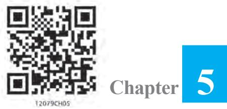

v*The whole of science is nothing more than a refinement of everyday thinking.***" —** *ALBERT EINSTEIN* v

# **5.1 Introduction**

104 MATHEMATICS

This chapter is essentially a continuation of our study of differentiation of functions in Class XI. We had learnt to differentiate certain functions like polynomial functions and trigonometric functions. In this chapter, we introduce the very important concepts of continuity, differentiability and relations between them. We will also learn differentiation of inverse trigonometric functions. Further, we introduce a new class of functions called exponential and logarithmic functions. These functions lead to powerful techniques of differentiation. We illustrate certain geometrically obvious conditions through differential calculus. In the process, we will learn some fundamental theorems in this area.

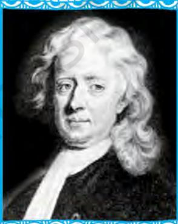

**Sir Issac Newton (1642-1727)**

# **5.2 Continuity**

We start the section with two informal examples to get a feel of continuity. Consider the function

* [16] A. A. K.  
  

This function is of course defined at every point of the real line. Graph of this function is given in the Fig 5.1. One can deduce from the graph that the value of the function at *nearby* points on *x*-axis remain *close* to each other except at *x* = 0. At the points near and to the left of 0, i.e., at points like – 0.1, – 0.01, – 0.001, the value of the function is 1. At the points near and to the right of 0, i.e., at points like 0.1, 0.01,

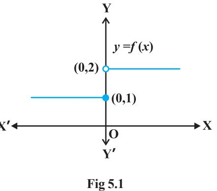

0.001, the value of the function is 2. Using the language of left and right hand limits, we may say that the left (respectively right) hand limit of *f* at 0 is 1 (respectively 2). In particular the left and right hand limits do not coincide. We also observe that the value of the function at *x* = 0 concides with the left hand limit. Note that when we try to draw the graph, we cannot draw it in one stroke, i.e., without lifting pen from the plane of the paper, we can not draw the graph of this function. In fact, we need to lift the pen when we come to 0 from left. This is one instance of function being not continuous at *x* = 0.

Now, consider the function defined as

$$f(x)={\begin{cases}1,{\mathrm{if~}}x\neq0\\ 2,{\mathrm{if~}}x=0\end{cases}}$$

This function is also defined at every point. Left and the right hand limits at *x* = 0

are both equal to 1. But the value of the function at *x* = 0 equals 2 which does not coincide with the common value of the left and right hand limits. Again, we note that we cannot draw the graph of the function without lifting the pen. This is yet another instance of a function being not continuous at *x* = 0.

Naively, we may say that a function is continuous at a fixed point if we can draw the graph of the function *around* that point without lifting the pen from the plane of the paper.

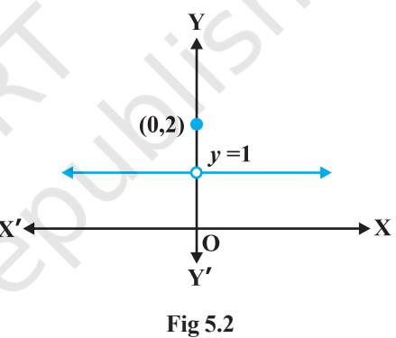

Mathematically, it may be phrased precisely as follows:

**Definition 1** Suppose *f* is a real function on a subset of the real numbers and let *c* be a point in the domain of *f*. Then *f* is continuous at *c* if

$$\operatorname*{lim}_{x\to c}f(x)=f(c)$$

More elaborately, if the left hand limit, right hand limit and the value of the function at *x* = *c* exist and equal to each other, then *f* is said to be continuous at *x* = *c*. Recall that if the right hand and left hand limits at *x* = *c* coincide, then we say that the common value is the limit of the function at *x* = *c*. Hence we may also rephrase the definition of continuity as follows: *a function is continuous at x = c if the function is defined at x = c and if the value of the function at x = c equals the limit of the function at x = c.* If *f* is not continuous at *c*, we say *f* is *discontinuous* at *c* and *c* is called a *point of discontinuity* of *f*.

**Example 1** Check the continuity of the function *f* given by *f*(*x*) = 2*x* + 3 at *x* = 1.

**Solution** First note that the function is defined at the given point *x* = 1 and its value is 5. Then find the limit of the function at *x* = 1. Clearly

$\lim f(x)=\lim(2x+3)=2(1)+3=5$  
  
$\lim f(x)=5=f(1)$

Thus 1 *x* →

Hence, *f* is continuous at *x* = 1.

**Example 2** Examine whether the function *f* given by *f*(*x*) = *x* 2 is continuous at *x* = 0.

**Solution** First note that the function is defined at the given point *x* = 0 and its value is 0. Then find the limit of the function at *x* = 0. Clearly

$$\lim_{x\to0}f(x)=\lim_{x\to0}x^{2}=0^{2}=0$$
  
  
Thus  
  

$$\lim_{x\to0}f(x)=0=f(0)$$

Hence, *f* is continuous at *x* = 0.

**Example 3** Discuss the continuity of the function *f* given by *f*(*x*) = | *x* | at *x* = 0.

**Solution** By definition

*f*(*x*) = , if 0 , if 0 *x x x x* − < ≥

Clearly the function is defined at 0 and *f*(0) = 0. Left hand limit of *f* at 0 is

$$\operatorname*{lim}_{x\to0^{-}}f(x)=\operatorname*{lim}_{x\to0^{-}}(-x)=0$$

Similarly, the right hand limit of *f* at 0 is

$$\operatorname*{lim}_{x\to0^{+}}f(x)=\operatorname*{lim}_{x\to0^{+}}x=0$$

Thus, the left hand limit, right hand limit and the value of the function coincide at *x* = 0. Hence, *f* is continuous at *x* = 0.

**Example 4** Show that the function *f* given by

$$f(x)={\begin{cases}x^{3}+3,{\mathrm{~if~}}x\neq0\\ 1,{\mathrm{~}}\quad{\mathrm{~if~}}x=0\end{cases}}$$

is not continuous at *x* = 0.

**Solution** The function is defined at *x* = 0 and its value at *x* = 0 is 1. When *x* ≠ 0, the function is given by a polynomial. Hence,

$\lim f(x)=\lim(x^{3}+3)=0^{3}+3=3$.  
  

Since the limit of *f* at *x* = 0 does not coincide with *f*(0), the function is not continuous at *x* = 0. It may be noted that *x* = 0 is the only point of discontinuity for this function.

**Example 5** Check the points where the constant function *f*(*x*) = *k* is continuous.

**Solution** The function is defined at all real numbers and by definition, its value at any real number equals *k*. Let *c* be any real number. Then

$$\operatorname*{lim}_{x\to c}f(x)=\operatorname*{lim}_{x\to c}k=k$$

Since *f*(*c*) = *k* = lim *x c* → *f*(*x*) for any real number *c*, the function *f* is continuous at every real number.

**Example 6** Prove that the identity function on real numbers given by *f*(*x*) = *x* is continuous at every real number.

**Solution** The function is clearly defined at every point and *f*(*c*) = *c* for every real number *c*. Also,

[15] M. C. Gonzalez-Garcia, M.  
  

Thus, lim *x c* → *f*(*x*) = *c* = *f*(*c*) and hence the function is continuous at every real number.

Having defined continuity of a function at a given point, now we make a natural extension of this definition to discuss continuity of a function.

**Definition 2** A real function *f* is said to be continuous if it is continuous at every point in the domain of *f*.

This definition requires a bit of elaboration. Suppose *f* is a function defined on a closed interval [*a*, *b*], then for *f* to be continuous, it needs to be continuous at every point in [*a*, *b*] including the end points *a* and *b*. Continuity of *f* at *a* means

$$\operatorname*{lim}_{x\to a^{+}}f(x){=}f(a)$$

and continuity of *f* at *b* means

$$\operatorname*{lim}_{x\to b^{-}}f(x)=f(b)$$

*Observe that* lim ( ) *x a f x* → −  *and* lim ( ) *x b f x* → + *do not make sense. As a consequence of this definition, if f is defined only at one point, it is continuous there, i.e., if the domain of f is a singleton, f is a continuous function.*

**Example 7** Is the function defined by *f*(*x*) = | *x* |, a continuous function? **Solution** We may rewrite *f* as

$$f(x)={\begin{cases}-x,{\mathrm{if~}}x<0\\ x,{\mathrm{~if~}}x\geq0\end{cases}}$$

By Example 3, we know that *f* is continuous at *x* = 0. Let *c* be a real number such that *c* < 0. Then *f*(*c*) = – *c*. Also

$\lim f(x)=\lim(-x)=-c$ (Why?)  
  
$x\to c$

Since lim ( ) ( ) *x c f x f c* → = , *f* is continuous at all negative real numbers.

Now, let *c* be a real number such that *c* > 0. Then *f*(*c*) = *c*. Also

$\lim_{x\to c}f(x)=\lim_{x\to c}x=c$ (Why?)

Since lim ( ) ( ) *x c f x f c* → = , *f* is continuous at all positive real numbers. Hence, *f* is continuous at all points.

**Example 8** Discuss the continuity of the function *f* given by *f* (*x*) = *x* 3 + *x* 2 – 1.

**Solution** Clearly *f* is defined at every real number *c* and its value at *c* is *c* 3 + *c* 2 – 1. We also know that

$\lim f(x)=\lim\left(x^{3}+x^{2}-1\right)=c^{3}+c^{2}-1$

Thus lim ( ) ( ) *x c f x f c* → = , and hence *f* is continuous at every real number. This means *f* is a continuous function.

**Example 9** Discuss the continuity of the function *f* defined by *f* (*x*) = 1 *x* , *x* ≠ 0.

**Solution** Fix any non zero real number *c*, we have

$$\operatorname*{lim}_{x\to c}f(x)=\operatorname*{lim}_{x\to c}{\frac{1}{x}}={\frac{1}{c}}$$

Also, since for *c* ≠ 0, 1 *f c*( ) *c* = , we have lim ( ) ( ) *x c f x f c* → = and hence, *f* is continuous at every point in the domain of *f*. Thus *f* is a continuous function.

We take this opportunity to explain the concept of *infinity*. This we do by analysing the function *f* (*x*) = 1 *x* near *x* = 0. To carry out this analysis we follow the usual trick of finding the value of the function at real numbers *close* to 0. Essentially we are trying to find the right hand limit of *f* at 0. We tabulate this in the following (Table 5.1).

|  | x | 1 | 0.3 | 0.2 | 0.1 = 10–1 | 0.01 = 10–2 | 0.001 = 10–3 | 10–n |
| --- | --- | --- | --- | --- | --- | --- | --- | --- |
| f | (x) | 1 | 3.333... | 5 | 10 | 100 = 102 | 1000 = 103 | 10n |

| Table 5.1 |
| --- |

We observe that as *x* gets closer to 0 from the right, the value of *f* (*x*) shoots up higher. This may be rephrased as: the value of *f* (*x*) may be made larger than any given number by choosing a positive real number *very close* to 0. In symbols, we write

$$\operatorname*{lim}_{x\to0^{+}}f(x)=+\infty$$

(to be read as: the right hand limit of *f* (*x*) at 0 is plus infinity). We wish to emphasise that + ∞ is NOT a real number and hence the right hand limit of *f* at 0 does not exist (as a real number).

Similarly, the left hand limit of *f* at 0 may be found. The following table is self explanatory.

| Table 5.2 |
| --- |

| x |  | – 1 | – 0.3 | – 0.2 | – 10–1 | – 10–2 | – 10–3 | – 10–n |
| --- | --- | --- | --- | --- | --- | --- | --- | --- |
| f | (x) | – 1 | – 3.333... | – 5 | – 10 | – 102 | – 103 | – 10n |

From the Table 5.2, we deduce that the value of *f*(*x*) may be made smaller than any given number by choosing a negative real number *very close* to 0. In symbols, we write

$$\operatorname*{lim}_{x\to0}f(x)=-\infty$$

(to be read as: the left hand limit of *f*(*x*) at 0 is minus infinity). Again, we wish to emphasise that – ∞ is NOT a real number and hence the left hand limit of *f* at 0 does not exist (as a real number). The graph of the reciprocal function given in Fig 5.3 is a geometric representation of the above mentioned facts. **Fig 5.3**

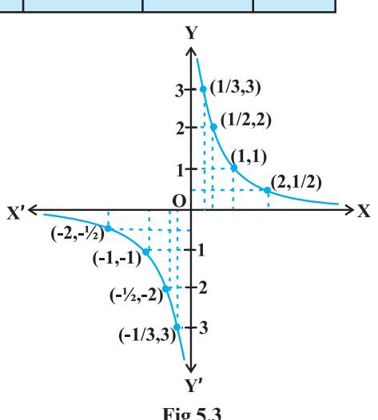

**Example 10** Discuss the continuity of the function *f* defined by

$$f(x)={\begin{cases}x+2,{\mathrm{if~}}x\leq1\\ x-2,{\mathrm{if~}}x>1\end{cases}}$$

**Solution** The function *f* is defined at all points of the real line.

**Case 1** If *c* < 1, then *f*(*c*) = *c* + 2. Therefore, lim ( ) lim( 2) 2 *x c x c f x x c* → → = + = + Thus, *f* is continuous at all real numbers lessthan 1. **Case 2** If *c* > 1, then *f*(*c*) = *c* – 2. Therefore, lim ( ) lim *x c x c f x* → → = (*x* – 2) = *c* – 2 = *f* (*c*) Thus, *f* is continuous at all points *x* > 1. **Case 3** If *c* = 1, then the left hand limit of *f* at *x* = 1 is – – 1 1 lim ( ) lim ( 2) 1 2 3 *x x f x x* → → = + = + = The right hand limit of *f* at *x* = 1 is 1 1 lim ( ) lim ( 2) 1 2 1 *x x f x x* → + → + = − = − = −

Since the left and right hand limits of *f* at *x* = 1 do not coincide, *f* is not continuous at *x* = 1. Hence *x* = 1 is the only point of discontinuity of *f*. The graph of the function is given in Fig 5.4. **Fig 5.4**

**Example 11** Find all the points of discontinuity of the function *f* defined by

*f* (*x*) = 2, if 1 0, if 1 2, if 1 *x x x x x* + < = − >

**Solution** As in the previous example we find that *f* is continuous at all real numbers *x* ≠ 1. The left hand limit of *f* at *x* = 1 is

$\lim_{x\to1^{-}}f(x)=\lim_{x\to1^{-}}(x+2)=1+2=3$  
  
The right hand limit of $f$at $x=1$ is 

$\begin{array}{l}\mbox{lim}f(x)=\mbox{lim}(x-2)=1-2=-1\\ x\to1^{+}\end{array}$

Since, the left and right hand limits of *f* at *x* = 1 do not coincide, *f* is not continuous at *x* = 1. Hence *x* = 1 is the only point of discontinuity of *f*. The graph of the function is given in the Fig 5.5.

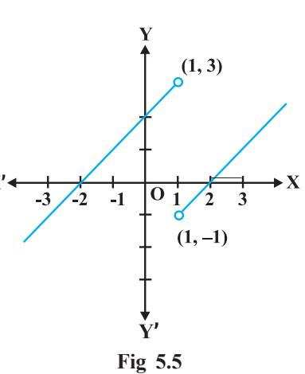

**Example 12** Discuss the continuity of the function defined by

$$f(x)={\left\{\begin{array}{l l}{x+2,{\mathrm{if~}}x<0}\\ {-x+2,{\mathrm{if~}}x>0}\end{array}\right.}$$

**Solution** Observe that the function is defined at all real numbers except at 0. Domain of definition of this function is

$\mathrm{D}_{1}\cup\mathrm{D}_{2}$ where $\mathrm{D}_{1}=\{x\in\mathbf{R}:x<0\}$ and  
  
$\mathrm{D}_{2}=\{x\in\mathbf{R}:x>0\}$  
  
**Case 1** If $c\in\mathrm{D}_{1}$, then $\lim_{x\to c}f(x)=\lim_{x\to c}\ (x\ +\ 2)$  
  
$=c+2=f(c)$ and hence $f$ is continuous in $\mathrm{D}_{1}$.  
  
**Case 2** If $c\in\mathrm{D}_{2}$, then $\lim_{x\to c}f(x)=\lim_{x\to c}\ (-\ x\ +\ 2)$  
  
$=-c+2=f(c)$ and hence $f$ is continuous in $\mathrm{D}_{2}$.  
  
Since $f$ is continuous at all points in the domain of $f$, we deduce that $f$ is continuous. Graph of this function is given in the Fig 5.6. Note that to graph this function we need to lift the pen from the plane.  
  

of the paper, but we need to do that only for those points where the function is not defined.

**Example 13** Discuss the continuity of the function *f* given by

[15] M. C. Gonzalez-Garcia, M. C. Gonzalez-Garcia, M.  
  

**Solution** Clearly the function is defined at every real number. Graph of the function is given in Fig 5.7. By inspection, it seems prudent to partition the domain of definition of *f* into three disjoint subsets of the real line.

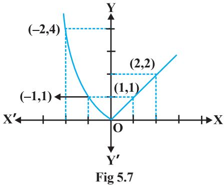

#### Let D1 = {*x* ∈ **R** : *x* < 0}, D2 = {0} and D3 = {*x* ∈ **R** : *x* > 0}

**Case 1** At any point in D1 , we have *f*(*x*) = *x* 2 and it is easy to see that it is continuous there (see Example 2).

**Case 2** At any point in D3 , we have *f*(*x*) = *x* and it is easy to see that it is continuous there (see Example 6).

**Case 3** Now we analyse the function at *x* = 0. The value of the function at 0 is *f*(0) = 0. The left hand limit of *f* at 0 is

$$\operatorname*{lim}_{x\to0^{-}}f(x)=\operatorname*{lim}_{x\to0^{-}}x^{2}=0^{2}=0$$

The right hand limit of *f* at 0 is

$$\operatorname*{lim}_{x\to0^{+}}f(x)=\operatorname*{lim}_{x\to0^{+}}x=0$$

Thus 0 lim ( ) 0 *x f x* → = = *f*(0) and hence *f* is continuous at 0. This means that *f* is

continuous at every point in its domain and hence, *f* is a continuous function.

**Example 14** Show that every polynomial function is continuous.

**Solution** Recall that a function *p* is a polynomial function if it is defined by *p*(*x*) = *a*0 + *a*1 *x* + ... + *an x n* for some natural number *n*, *an* ≠ 0 and *ai* ∈ **R**. Clearly this function is defined for every real number. For a fixed real number *c*, we have

$$\operatorname*{lim}_{x\to c}p\left(x\right)=p\left(c\right)$$

By definition, *p* is continuous at *c*. Since *c* is any real number, *p* is continuous at every real number and hence *p* is a continuous function.

**Example 15** Find all the points of discontinuity of the greatest integer function defined by *f*(*x*) = [*x*], where [*x*] denotes the greatest integer less than or equal to *x*.

**Solution** First observe that *f* is defined for all real numbers. Graph of the function is given in Fig 5.8. From the graph it looks like that *f* is discontinuous at every integral point. Below we explore, if this is true.

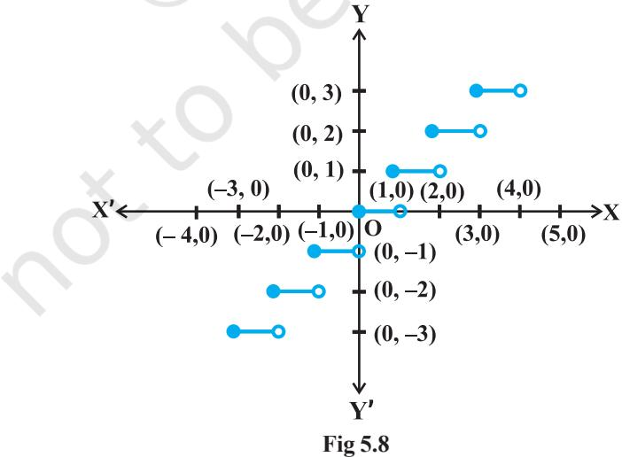

**Case 1** Let *c* be a real number which is not equal to any integer. It is evident from the graph that for all real numbers *close* to *c* the value of the function is equal to [*c*]; i.e., lim ( ) lim [ ] [ ] *x c x c f x x c* → → = = . Also *f*(*c*) = [*c*] and hence the function is continuous at all real

numbers not equal to integers.

**Case 2** Let *c* be an integer. Then we can find a sufficiently small real number *r* > 0 such that [*c* – *r*] = *c* – 1 whereas [*c* + *r*] = *c*.

This, in terms of limits mean that

$$\operatorname*{lim}_{x\to c^{-}}f(x)=c-1,\ \operatorname*{lim}_{x\to c^{+}}f(x)=c$$

Since these limits cannot be equal to each other for any *c*, the function is discontinuous at every integral point.

### *5.2.1 Algebra of continuous functions*

In the previous class, after having understood the concept of limits, we learnt some algebra of limits. Analogously, now we will study some algebra of continuous functions. Since continuity of a function at a point is entirely dictated by the limit of the function at that point, it is reasonable to expect results analogous to the case of limits.

**Theorem 1** Suppose *f* and *g* be two real functions continuous at a real number *c*. Then

- (1) *f* + *g* is continuous at *x* = *c*.
- (2) *f g* is continuous at *x* = *c*.
- (3) *f* . *g* is continuous at *x* = *c*.
- (4) *f g* is continuous at *x* = *c*, (provided *g* (*c*) ≠ 0).

**Proof** We are investigating continuity of (*f* + *g*) at *x* = *c*. Clearly it is defined at *x* = *c*. We have

$$\begin{array}{ll}\lim_{x\to c}(f+g)(x)&=\lim_{x\to c}[f(x)+g(x)]&\mbox{(by definition off^{+}g)}\\ &=\lim_{x\to c}f(x)+\lim_{x\to c}g(x)&\mbox{(by the theorem on limits)}\\ &=f(c)+g(c)&\mbox{(asfandgare continuous)}\\ &=\mbox{(f+g)(c)}&\mbox{(by definition off^{+}g)}\end{array}$$

Hence, *f* + *g* is continuous at *x* = *c*.

Proofs for the remaining parts are similar and left as an exercise to the reader.

### *Remarks*

- (i) As a special case of (3) above, if *f* is a constant function, i.e., *f*(*x*) = λ for some real number λ, then the function (λ . *g*) defined by (λ . *g*) (*x*) = λ . *g*(*x*) is also continuous. In particular if λ = – 1, the continuity of *f* implies continuity of – *f*.
- (ii) As a special case of (4) above, if *f* is the constant function *f*(*x*) = λ, then the

function *g* λ defined by ( ) ( ) *x g g x* λ λ = is also continuous wherever *g*(*x*) ≠ 0. In

particular, the continuity of *g* implies continuity of 1 *g* .

The above theorem can be exploited to generate many continuous functions. They also aid in deciding if certain functions are continuous or not. The following examples illustrate this:

**Example 16** Prove that every rational function is continuous.

**Solution** Recall that every rational function *f* is given by

[15] M. C. Gonzalez-Garcia, M.  
  

where *p* and *q* are polynomial functions. The domain of *f* is all real numbers except points at which *q* is zero. Since polynomial functions are continuous (Example 14), *f* is continuous by (4) of Theorem 1.

**Example 17** Discuss the continuity of sine function.

**Solution** To see this we use the following facts

$$\operatorname*{lim}_{x\to0}\sin x=0$$

We have not proved it, but is intuitively clear from the graph of sin *x* near 0.

Now, observe that *f*(*x*) = sin *x* is defined for every real number. Let *c* be a real number. Put *x* = *c* + *h*. If *x* → *c* we know that *h* → 0. Therefore

$$\begin{array}{ll}\lim_{x\to c}f(x)&=\lim_{x\to c}\sin x\\ &=\lim_{h\to0}\sin(c+h)\\ &=\lim_{h\to0}\left[\sin c\cos h+\cos c\sin h\right]\\ &=\lim_{h\to0}\left[\sin c\cos h\right]+\lim_{h\to0}\left[\cos c\sin h\right]\\ &=\sin c+0=\sin c=f(c)\end{array}$$

Thus lim *x c* → *f*(*x*) = *f*(*c*) and hence *f* is a continuous function. *Remark* A similar proof may be given for the continuity of cosine function.

**Example 18** Prove that the function defined by *f*(*x*) = tan *x* is a continuous function.

**Solution** The function *f*(*x*) = tan *x* = sin cos *x x* . This is defined for all real numbers such

that cos *x* ≠ 0, i.e., *x* ≠ (2*n* +1) 2 π . We have just proved that both sine and cosine functions are continuous. Thus tan *x* being a quotient of two continuous functions is continuous wherever it is defined.

An interesting fact is the behaviour of continuous functions with respect to composition of functions. Recall that if *f* and *g* are two real functions, then

$$(f\circ g)\;(x)=f(g(x))$$

is defined whenever the range of *g* is a subset of domain of *f*. The following theorem (stated without proof) captures the continuity of composite functions.

**Theorem 2** Suppose *f* and *g* are real valued functions such that (*f* o *g*) is defined at *c*. If *g* is continuous at *c* and if *f* is continuous at *g* (*c*), then (*f* o *g*) is continuous at *c*.

The following examples illustrate this theorem.

**Example 19** Show that the function defined by *f*(*x*) = sin (*x* 2 ) is a continuous function.

**Solution** Observe that the function is defined for every real number. The function *f* may be thought of as a composition *g* o *h* of the two functions *g* and *h*, where *g* (*x*) = sin *x* and *h* (*x*) = *x* 2 . Since both *g* and *h* are continuous functions, by Theorem 2, it can be deduced that *f* is a continuous function.

**Example 20** Show that the function *f* defined by

$$f(x)=\left\vert1-x+\left\vert x\right\vert\right\vert_{2}$$

where *x* is any real number, is a continuous function.

**Solution** Define *g* by *g* (*x*) = 1 – *x* + | *x*| and *h by h* (*x*) = | *x*| for all real *x*. Then

($h$ o g) ($x$) = $h$ (g ($x$))  
  
= $h$ ($1-x+|x|$)  
  
= $|1-x+|x||=f(x)$

In Example 7, we have seen that *h* is a continuous function. Hence *g* being a sum of a polynomial function and the modulus function is continuous. But then *f* being a composite of two continuous functions is continuous.

# **EXERCISE 5.1**

- **1.** Prove that the function *f*(*x*) = 5*x* 3 is continuous at *x* = 0, at *x* = 3 and at *x* = 5.
- **2.** Examine the continuity of the function *f*(*x*) = 2*x* 2 – 1 at *x* = 3.
- **3.** Examine the following functions for continuity.

  
  
**(a)**: $f(x)=x-5$ (b)**: $f(x)=\frac{1}{x-5}\,,\,x\neq5$  
**(c)**: $f(x)=\frac{x^{2}-25}{x+5}\,,\,x\neq-5$ (d)**: $f(x)=|x-5\,|$

- **4.** Prove that the function *f*(*x*) = *x n* is continuous at *x* = *n*, where *n* is a positive integer.
- **5.** Is the function *f* defined by

$$f(x)={\begin{cases}{x,\text{if}x\leq1}\\ {5,\text{if}x>1}\end{cases}}$$

continuous at *x* = 0? At *x* = 1? At *x* = 2?

Find all points of discontinuity of *f*, where *f* is defined by

- **6.** 2 3, if 2 ( ) 2 3, if > 2 *x x f x x x* + ≤ = − **7.** | | 3, if 3 ( ) 2 , if 3 < 3 6 2, if 3 *x x f x x x x x* + ≤ − = − − < + ≥ **8.** | | , if 0 ( ) 0, if 0 *x x f x x x* ≠ = = **9.** , if 0 ( ) | | 1, if 0 *x x f x x x* < = − ≥ **10.** 2 1, if 1 ( ) 1, if 1 *x x f x x x* + ≥ = + < **11.** 3 2 3, if 2 ( ) 1, if 2 *x x f x x x* − ≤ = + > **12.** 10 2 1, if 1 ( ) , if 1 *x x f x x x* − ≤ = >
- **13.** Is the function defined by

$$f(x)={\begin{cases}x+5,&{\mathrm{if~}}x\leq1\\ x-5,&{\mathrm{if~}}x>1\end{cases}}$$

a continuous function?

Discuss the continuity of the function *f*, where *f* is defined by

14. $f(x)=\begin{cases}3,\text{if}0\leq x\leq1\\ 4,\text{if}1<x<3\\ 5,\text{if}3\leq x\leq10\end{cases}$ 15. $f(x)=\begin{cases}2x,\text{if}x<0\\ 0,\text{if}0\leq x\leq1\\ 4x,\text{if}x>1\end{cases}$

  
  
**16.**$f(x)=\left\{\begin{array}{ll}-2,&\mbox{if}x\leq-1\\ 2x,&\mbox{if}-1<x\leq1\\ 2,&\mbox{if}x>1\end{array}\right.$

**17.** Find the relationship between *a* and *b* so that the function *f* defined by

$$f(x)={\begin{cases}a x+1,&{\mathrm{if~}}x\leq3\\ b x+3,&{\mathrm{if~}}x>3\end{cases}}$$

is continuous at *x* = 3.

- **18.** For what value of λ is the function defined by
[15] M. C. Gonzalez-Garcia, M. C. Gonzalez-Garcia, M.  
  

continuous at *x* = 0? What about continuity at *x* = 1?

- **19.** Show that the function defined by *g* (*x*) = *x* [*x*] is discontinuous at all integral points. Here [*x*] denotes the greatest integer less than or equal to *x*.
- **20.** Is the function defined by *f*(*x*) = *x* 2 – sin *x* + 5 continuous at *x* = π?
- **21.** Discuss the continuity of the following functions:
	- (a) *f*(*x*) = sin *x* + cos *x* (b) *f*(*x*) = sin *x* cos *x*
	- (c) *f*(*x*) = sin *x* . cos *x*
- **22.** Discuss the continuity of the cosine, cosecant, secant and cotangent functions.
- **23.** Find all points of discontinuity of *f*, where

$$f(x)=\begin{cases}{\frac{\sin x}{x}},&{\mathrm{if~}}x<0\\ x&{\mathrm{if~}}x\geq0\end{cases}$$

- **24.** Determine if *f* defined by

$$f(x)={\begin{cases}x^{2}\sin{\frac{1}{x}},&{\mathrm{if~}}x\neq0\\ 0,&{\mathrm{if~}}x=0\end{cases}}$$

is a continuous function?

# **25.** Examine the continuity of *f*, where *f* is defined by

$f(x)=\left\{\begin{array}{ll}\sin x-\cos x,&\mbox{if$x\neq 0$}\\ \hline\end{array}\right.$

Find the values of *k* so that the function *f* is continuous at the indicated point in Exercises 26 to 29.

$$f(x)=\begin{cases}\dfrac{k\cos x}{\pi-2x},&\text{if}x\neq\dfrac{\pi}{2}\\ 3,&\text{if}x=\dfrac{\pi}{2}\end{cases}\quad\text{at}x=\dfrac{\pi}{2}$$
  
* $f(x)=\begin{cases}kx^{2},&\text{if}x\leq2\\ 3,&\text{if}x>2\end{cases}\quad\text{at}x=2$  
* $f(x)=\begin{cases}kx+1,&\text{if}x\leq\pi\\ \cos x,&\text{if}x>\pi\end{cases}\quad\text{at}x=\pi$  
* $f(x)=\begin{cases}kx+1,&\text{if}x\leq5\\ 3x-5,&\text{if}x>5\end{cases}\quad\text{at}x=5$

**30.** Find the values of *a* and *b* such that the function defined by

$f(x)=\left\{\begin{array}{ll}5,&\mbox{if$x\leq 2$}\\ ax+b,&\mbox{if$2<x<10$}\\ 21,&\mbox{if$x\geq 10$}\end{array}\right.$

is a continuous function.

- **31.** Show that the function defined by *f*(*x*) = cos (*x* 2 ) is a continuous function.
- **32.** Show that the function defined by *f*(*x*) = | cos *x* | is a continuous function.
- **33.** Examine that sin | *x* | is a continuous function.
- **34.** Find all the points of discontinuity of *f* defined by *f*(*x*) = | *x* | | *x* + 1 |.

# **5.3. Differentiability**

Recall the following facts from previous class. We had defined the derivative of a real function as follows:

Suppose *f* is a real function and *c* is a point in its domain. The derivative of *f* at *c* is defined by

$$\operatorname*{lim}_{h\to0}{\frac{f(c+h)-f(c)}{h}}$$

provided this limit exists. Derivative of *f* at *c* is denoted by *f* ′(*c*) or ( ( )) | *c d f x dx* . The function defined by

$$f^{\prime}(x)=\operatorname*{lim}_{h\to0}{\frac{f(x+h)-f(x)}{h}}$$

wherever the limit exists is defined to be the derivative of *f*. The derivative of *f* is denoted by *f* ′(*x*) or ( ( )) *d f x dx* or if *y* = *f*(*x*) by *dy dx* or *y*′. The process of finding derivative of a function is called differentiation. We also use the phrase *differentiate f*(*x*) *with respect to x* to mean *find f* ′(*x*).

The following rules were established as a part of algebra of derivatives:

- (1) (*u* ± *v*)′ = *u*′ ± *v*′
- (2) (*uv*)′ = *u*′*v* + *uv*′ (Leibnitz or product rule)
- (3) 2 *u u v uv v v* ′ ′ − ′ = , wherever *v* ≠ 0 (Quotient rule).

The following table gives a list of derivatives of certain standard functions:

| Table 5.3 |
| --- |

| f | (x) | n x | sin x | cos x | tan x |
| --- | --- | --- | --- | --- | --- |
| f | ′(x) | nxn – 1 | cos x | – sin x | sec2 x |

Whenever we defined derivative, we had put a caution *provided the limit exists*. Now the natural question is; what if it doesn't? The question is quite pertinent and so is

its answer. If 0 ( ) ( ) lim *h f c h f c* → *h* + − does not exist, we say that *f* is not differentiable at *c*.

In other words, we say that a function *f* is differentiable at a point *c* in its domain if both

$\lim_{h\to0^{+}}\frac{f(c+h)-f(c)}{h}$ and $\lim_{h\to0^{+}}\frac{f(c+h)-f(c)}{h}$ are finite and equal. A function is said 

to be differentiable in an interval [*a*, *b*] if it is differentiable at every point of [*a*, *b*]. As in case of continuity, at the end points *a* and *b*, we take the right hand limit and left hand limit, which are nothing but left hand derivative and right hand derivative of the function at *a* and *b* respectively. Similarly, a function is said to be differentiable in an interval (*a*, *b*) if it is differentiable at every point of (*a*, *b*).

**Theorem 3** If a function *f* is differentiable at a point *c*, then it is also continuous at that point.

**Proof** Since *f* is differentiable at *c*, we have

$$\operatorname*{lim}_{x\to c}{\frac{f(x)-f(c)}{x-c}}=f^{\prime}(c)$$

But for *x* ≠ *c*, we have

$$f(x)-f(c)={\frac{f(x)-f(c)}{x-c}}.\left(x-c\right)$$

( ) ( ) lim . ( )

−

*x c*

*f x f c*

Therefore lim [ ( ) ( )]

*x c* → − = *x c* → *x c* − − or lim [ ( )] lim [ ( )] *x c x c f x f c* → → − = ( ) ( ) lim . lim [( )] *x c x c f x f c x c* → → *x c* − − − = *f* ′(*c*) . 0 = 0

*f x f c*

$\lim f(x)=f(e)$  
  
$x\to e$

Hence *f* is continuous at *x* = *c*.

**Corollary 1** Every differentiable function is continuous.

We remark that the converse of the above statement is not true. Indeed we have seen that the function defined by *f*(*x*) = | *x* | is a continuous function. Consider the left hand limit

– 0 (0 ) (0) lim 1 *h f h f h* → *h h* + − − = = −

The right hand limit

$$\operatorname*{lim}_{h\to0^{+}}{\frac{f(0+h)-f(0)}{h}}={\frac{h}{h}}=1$$

Since the above left and right hand limits at 0 are not equal, 0 (0 ) (0) lim *h f h f* → *h* + −

does not exist and hence *f* is not differentiable at 0. Thus *f* is not a differentiable function.

### **5.3.1** *Derivatives of composite functions*

To study derivative of composite functions, we start with an illustrative example. Say, we want to find the derivative of *f*, where

$$f(x)=(2x+1)^{3}$$

One way is to expand (2*x* + 1)3 using binomial theorem and find the derivative as a polynomial function as illustrated below.

( ) *d f x dx* = 3 (2 1) *d x dx* + = 3 2 (8 12 6 1) *d x x x dx* + + + = 24*x* 2 + 24*x* + 6 = 6 (2*x* + 1)2

Now, observe that *f*(*x*) = (*h* o *g*) (*x*)

where *g*(*x*) = 2*x* + 1 and *h*(*x*) = *x* 3 . Put *t* = *g*(*x*) = 2*x* + 1. Then *f*(*x*) = *h*(*t*) = *t* 3 . Thus

$\frac{df}{dx}=6\,(2x+1)^{2}=3(2x+1)^{2}\,.\,2=3t^{2}\,2=\frac{dh}{dt}\,.\,\frac{dt}{dx}$

The advantage with such observation is that it simplifies the calculation in finding the derivative of, say, (2*x* + 1)100 . We may formalise this observation in the following theorem called the chain rule.

**Theorem 4 (Chain Rule)** Let *f* be a real valued function which is a composite of two

functions *u* and *v* ; i.e., *f* = *v* o *u*. Suppose *t* = *u*(*x*) and if both *dt dx* and *dv dt* exist, we have

$${\frac{d f}{d x}}={\frac{d v}{d t}}.{\frac{d t}{d x}}$$

We skip the proof of this theorem. Chain rule may be extended as follows. Suppose *f* is a real valued function which is a composite of three functions *u*, *v* and *w*; i.e.,

*f* = (*w* o *u*) o *v*. If *t* = *v* (*x*) and *s* = *u* (*t*), then

$\frac{d(w_{0}u)}{dx}\cdot\frac{dt}{dx}=\frac{dw}{ds}\cdot\frac{ds}{dt}$

provided all the derivatives in the statement exist. Reader is invited to formulate chain rule for composite of more functions.

**Example 21** Find the derivative of the function given by *f*(*x*) = sin (*x* 2 ).

**Solution** Observe that the given function is a composite of two functions. Indeed, if *t* = *u*(*x*) = *x* 2 and *v*(*t*) = sin *t*, then

$f(x)=(v\circ u)\left(x\right)=v(u(x))=v(x^{2})=\sin x^{2}$

Put $t=u(x)=x^{2}$. Observe that $\dfrac{dv}{dt}=\cos t$ and $\dfrac{dt}{dx}=2x$ exist. Hence, by chain rule  
  

$$\cdot\dfrac{df}{dx}=\dfrac{dv}{dt}\cdot\dfrac{dt}{dx}=\cos t\cdot2x$$

It is normal practice to express the final result only in terms of *x*. Thus

$${\frac{d f}{d x}}=\dot{\cos t\cdot2x}=2x\cos x^{2}$$

# **EXERCISE 5.2**

Differentiate the functions with respect to *x* in Exercises 1 to 8.

- **1.** sin (*x* 2 + 5) **2.** cos (sin *x*) **3.** sin (*ax* + *b*) **4.** sec (tan ( *x* )) **5.** sin ( ) cos ( ) *ax b cx d* + + **6.** cos *x* 3 . sin2 (*x* 5 )
- **7.** ( ) 2 2 cot *x* **8.** cos( *x* )

**9.** Prove that the function *f* given by

[16] M. C. Gonzalez-Garcia, M.  
  

is not differentiable at *x* = 1.

- **10.** Prove that the greatest integer function defined by
*f*(*x*) = [*x*], 0 < *x* < 3

is not differentiable at *x* = 1 and *x* = 2.

## **5.3.2** *Derivatives of implicit functions*

Until now we have been differentiating various functions given in the form *y* = *f*(*x*). But it is not necessary that functions are always expressed in this form. For example, consider one of the following relationships between *x* and *y*:

> *x* – *y* – π = 0 *x* + sin *xy* – *y* = 0

In the first case, we can *solve for y* and rewrite the relationship as *y* = *x* – π. In the second case, it does not seem that there is an easy way to *solve for y*. Nevertheless, there is no doubt about the dependence of *y* on *x* in either of the cases. When a relationship between *x* and *y* is expressed in a way that it is easy to *solve for y* and write *y* = *f*(*x*), we say that *y* is given as an *explicit function* of *x*. In the latter case it is implicit that *y* is a function of *x* and we say that the relationship of the second type, above, gives function *implicitly*. In this subsection, we learn to differentiate implicit functions.

  
  
**Example 22**: Find $\frac{dy}{dx}$ if $x-y=\pi$.  
  

**Solution** One way is to solve for *y* and rewrite the above as

$$\begin{array}{c}{{y=x-\pi}}\\ {{\vdots}}\\ {{\frac{d y}{d x}=1}}\end{array}$$

But then

**Alternatively**, *directly* differentiating the relationship w.r.t., *x*, we have

$${\frac{d}{d x}}(x-y)\,=\,\,{\frac{d\pi}{d x}}$$

Recall that *d dx* π means to differentiate the constant function taking value π

everywhere w.r.t., *x*. Thus

$${\frac{d}{d x}}(x)-{\frac{d}{d x}}(y)=0$$

which implies that

$${\frac{d y}{d x}}={\frac{d x}{d x}}=1$$

**Example 23** Find *dy dx* , if *y* + sin *y* = cos *x*.

**Solution** We differentiate the relationship directly with respect to *x*, i.e.,

$${\frac{d y}{d x}}+{\frac{d}{d x}}(\sin y)\,=\,{\frac{d}{d x}}(\cos x)$$

which implies using chain rule

$$\frac{dy}{dx}+\cos y\cdot\frac{dy}{dx}=-\sin x$$
  
  
This gives  
  

$$\frac{dy}{dx}=-\frac{\sin x}{1+\cos y}$$
  
  
where  
  

$$y\neq(2n+1)\ \pi$$

### **5.3.3** *Derivatives of inverse trigonometric functions*

We remark that inverse trigonometric functions are continuous functions, but we will not prove this. Now we use chain rule to find derivatives of these functions.

**Example 24** Find the derivative of *f* given by *f*(*x*) = sin–1 *x* assuming it exists.

**Solution** Let *y* = sin–1 *x*. Then, *x* = sin *y*.

Differentiating both sides w.r.t. *x*, we get

$$1=\cos\,y\,\,{\frac{d y}{d x}}$$
  

$${\frac{\cdot}{d y}}={\frac{\cdot}{\cos\,y}}={\frac{1}{\cos(\sin^{-1}x)}}$$

which implies that

Observe that this is defined only for cos *y* ≠ 0, i.e., sin–1 *x* ≠ , 2 2 π π − , i.e., *x* ≠ – 1, 1,

i.e., *x* ∈ (– 1, 1).

To make this result a bit more attractive, we carry out the following manipulation. Recall that for *x* ∈ (– 1, 1), sin (sin–1 *x*) = *x* and hence

$\cos^{2}y=1-(\sin y)^{2}=1-(\sin\left(\sin^{-1}x\right))^{2}=1-x^{2}$

Also, since *y* ∈ , 2 2 π π − , cos *y* is positive and hence cos *y* = 2 1− *x* Thus, for *x* ∈ (– 1, 1),

$${\frac{d y}{d x}}={\frac{1}{\cos y}}={\frac{1}{\sqrt{1-x^{2}}}}$$

| f(x) | sin–1 x | cos-1 x | tan-1x |
| --- | --- | --- | --- |
| 1 f (x) | 1 | − 1 | 1 2 |
|  | 2 1− x | 2 1 − x | 1+ x |
| Domain off | (-1, 1) | (-1, 1) | R |

## **EXERCISE 5.3**

Find *dy dx* in the following: **1.** 2*x +* 3*y* = sin *x* **2.** 2*x +* 3*y* = sin *y* **3.** *ax + by*2 = cos *y* **4.** *xy + y*2 = tan *x* + *y* **5.** *x* 2  *+ xy* + *y* 2 = 100 **6.** *x* 3  *+ x*2 *y* + *xy*2 + *y* 3 = 81 **7.** sin2 *y +* cos *xy* = κ **8.** sin2 *x +* cos2 *y* = 1 **9.** *y* = sin–1 2 2 1 *x x* + **10.** *y* = tan–1 3 2 3 , 1 3 *x x x* − − 1 1 3 3 − < <*x* **11.** 2 1 2 1 cos 0 1 , 1 *x y x x* − − = < < + **12.** 2 1 2 1 sin 0 1 , 1 *x y x x* − − = < < + **13.** 1 2 2 cos , 1 1 1 *x y x x* − = − < < + **14.** ( ) 1 2 1 1 sin 2 1 , 2 2 *y x x x* − = − − < < **15.** 1 2 1 1 sec , 0 2 1 2 *y x x* − = < < −

### **5.4 Exponential and Logarithmic Functions**

Till now we have learnt some aspects of different classes of functions like polynomial functions, rational functions and trigonometric functions. In this section, we shall learn about a new class of (related) functions called exponential functions and logarithmic functions. It needs to be emphasized that many statements made in this section are motivational and precise proofs of these are well beyond the scope of this text.

The Fig 5.9 gives a sketch of *y* = *f* 1 (*x*) = *x*, *y* = *f* 2 (*x*) = *x* 2 , *y* = *f* 3 (*x*) = *x* 3 and *y* = *f* 4 (*x*) = *x* 4 . Observe that the curves get steeper as the power of *x* increases. Steeper the curve, faster is the rate of growth. What this means is that for a fixed increment in the value of *x* (> 1), the increment in the value of *y* = *f n*  (*x*) increases as *n* increases for *n* = 1, 2, 3, 4. It is conceivable that such a statement is true for all positive values of *n*, where *f n*  (*x*) = *x n* . Essentially, this means that the graph of *y* = *f n*  (*x*) *leans* more towards the *y*-axis as *n* increases. For example, consider *f* 10(*x*) = *x* 10 and *f* 15(*x*) = *x* 15. If *x* increases from 1 to 2, *f* 10 increases from 1 to 210 whereas *f* 15 increases from 1 to 215. Thus, for the same increment in *x*, *f* 15 grow faster than *f* 10.

Upshot of the above discussion is that the growth of polynomial functions is dependent on the degree of the polynomial function – higher the degree, greater is the growth. The next natural question is:

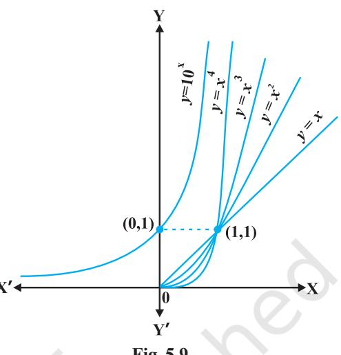

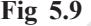

Is there a function which grows faster than any polynomial function. The answer is in affirmative and an example of such a function is

$$\gamma=f(x)=10^{x}.$$

Our claim is that this function *f* grows faster than *f n* (*x*) = *x n* for any positive integer *n*. For example, we can prove that 10*x* grows faster than *f* 100 (*x*) = *x* 100. For large values of *x* like *x* = 103 , note that *f* 100 (*x*) = (103 ) 100 = 10300 whereas *f*(103 ) = 3 10 10 = 101000 . Clearly *f*(*x*) is much greater than *f* 100 (*x*). It is not difficult to prove that for all *x* > 103 , *f*(*x*) > *f* 100 (*x*). But we will not attempt to give a proof of this here. Similarly, by choosing large values of *x*, one can verify that *f*(*x*) grows faster than *f n* (*x*) for any positive integer *n*.

**Definition 3** The exponential function with positive base *b* > 1 is the function

$$y=f(x)=b^{x}$$

The graph of *y* = 10*x* is given in the Fig 5.9.

It is advised that the reader plots this graph for particular values of *b* like 2, 3 and 4. Following are some of the salient features of the exponential functions:

- (1) Domain of the exponential function is **R**, the set of all real numbers.
- (2) Range of the exponential function is the set of all positive real numbers.
- (3) The point (0, 1) is always on the graph of the exponential function (this is a restatement of the fact that *b* 0 = 1 for any real *b* > 1).
- (4) Exponential function is ever increasing; i.e., as we move from left to right, the graph rises above.

- (5) For very large negative values of *x*, the exponential function is very close to 0. In other words, in the second quadrant, the graph approaches *x*-axis (but never meets it).
Exponential function with base 10 is called the *common exponential function*. In the Appendix A.1.4 of Class XI, it was observed that the sum of the series

$$1+{\frac{1}{1!}}+{\frac{1}{2!}}+\ldots$$

is a number between 2 and 3 and is denoted by *e*. Using this *e* as the base we obtain an extremely important exponential function *y* = *e x .*

This is called *natural exponential function*.

It would be interesting to know if the inverse of the exponential function exists and has *nice* interpretation. This search motivates the following definition.

**Definition 4** Let *b* > 1 be a real number. Then we say logarithm of *a* to base *b* is *x* if *b x* = *a*.

Logarithm of *a* to base *b* is denoted by log*b a*. Thus log*b a* = *x* if *b x* = *a*. Let us work with a few explicit examples to get a feel for this. We know 23 = 8. In terms of logarithms, we may rewrite this as log2 8 = 3. Similarly, 104 = 10000 is equivalent to saying log10 10000 = 4. Also, 625 = 54 = 252 is equivalent to saying log5 625 = 4 or log25 625 = 2.

On a slightly more mature note, fixing a base *b* > 1, we may look at logarithm as a function from positive real numbers to all real numbers. This function, called the *logarithmic function*, is defined by

$\log_{b}\cdot\log_{b}x=y$ if $b^{\prime}=x$

As before if the base *b* = 10, we say it is *common logarithms* and if *b* = *e*, then we say it is *natural logarithms*. Often natural logarithm is denoted by *ln*. *In this chapter*, *log x denotes the logarithm function to base e*, i.e., *ln x* will be written as simply log *x*. The Fig 5.10 gives the plots of logarithm function to base 2, *e* and 10.

Some of the important observations about the logarithm function to any base *b* > 1 are listed below: **Fig 5.10**

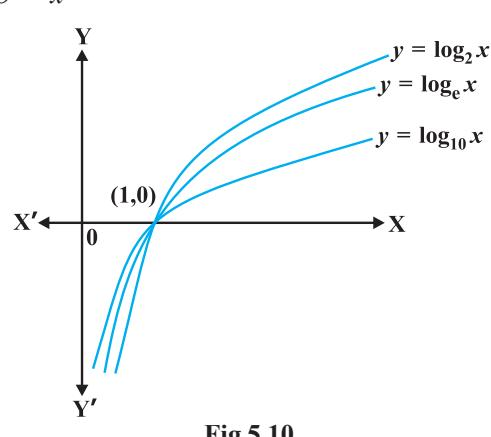

- (1) We cannot make a meaningful definition of logarithm of non-positive numbers and hence the domain of log function is **R**+ .
- (2) The range of log function is the set of all real numbers.
- (3) The point (1, 0) is always on the graph of the log function.
- (4) The log function is ever increasing, i.e., as we move from left to right the graph rises above.
- (5) For *x* very near to zero, the value of log *x* can be made lesser than any given real number. In other words in the fourth quadrant the graph approaches *y*-axis (but never meets it).
- (6) Fig 5.11 gives the plot of *y* = *e x* and *y* = *ln x*. It is of interest to observe that the two curves are the mirror images of each other reflected in the line *y* = *x*.

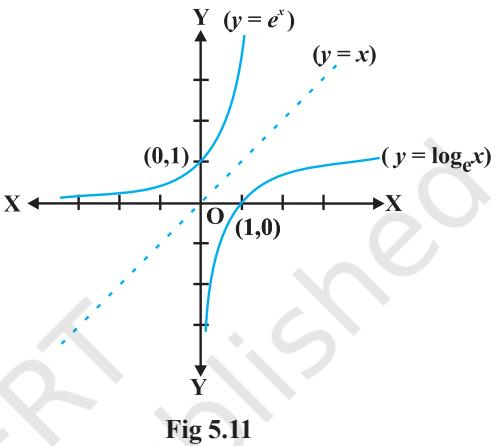

Two properties of 'log' functions are proved below:

- (1) There is a standard change of base rule to obtain log*a p* in terms of log*b p*. Let log*a p* = α, log*b p* = β and log*b a* = γ. This means *a* α = *p*, *b* β = *p* and *b* γ = *a*. Substituting the third equation in the first one, we have
* [16] M. C.  
  

Using this in the second equation, we get

$$b^{\beta}=p=b^{\gamma\alpha}$$

which implies β = αγ or α = β γ . But then

$$\log_{a}p={\frac{\log_{b}p}{\log_{b}a}}$$

- (2) Another interesting property of the log function is its effect on products. Let log*b pq* = α. Then *b* α = *pq*. If log*b p* = β and log*b q* = γ, then *b* β = *p* and *b* γ = *q*. But then *b* α = *pq* = *b*β*b* γ = *b* β + γ
which implies α = β + γ, i.e.,

$$\log_{b}p q=\log_{b}p+\log_{b}q$$

A particularly interesting and important consequence of this is when *p* = *q*. In this case the above may be rewritten as

$\log_{b}p^{2}=\log_{b}p+\log_{b}p=2\log p$

An easy generalisation of this (left as an exercise!) is

$$\log_{b}p^{n}=n\,\log p$$

for any positive integer *n*. In fact this is true for any real number *n*, but we will not attempt to prove this. On the similar lines the reader is invited to verify

$$\log_{b}{\frac{x}{y}}=\log_{b}x-\log_{b}y$$

**Example 25** Is it true that *x* = *e* log *x* for all real *x*?

**Solution** First, observe that the domain of log function is set of all positive real numbers. So the above equation is not true for non-positive real numbers. Now, let *y* = *e* log *x* . If *y* > 0, we may take logarithm which gives us log *y* = log (*e* log *x* ) = log *x* . log *e* = log *x*. Thus *y* = *x*. Hence *x* = *e* log *x* is true only for positive values of *x*.

One of the striking properties of the natural exponential function in differential calculus is that it doesn't change during the process of differentiation. This is captured in the following theorem whose proof we skip.

**Theorem 5***

- (1) The derivative of *e x* w.r.t., *x* is *e x* ; i.e., *d dx* (*e x* ) = *e x* .
- (2) The derivative of log *x* w.r.t., *x* is 1 *x* ; i.e., *d dx* (log *x*) = 1 *x* .

**Example 26** Differentiate the following w.r.t. *x*:

(i) $e^{-x}$ (ii) $\sin\left(\log x\right),x>0$ (iii) $\cos^{-1}\left(e^{x}\right)$ (iv) $e^{\cos x}$

**Solution**

- (i) Let *y* = *e* – *x* . Using chain rule, we have

$${\frac{d y}{d x}}=e^{-x}\cdot{\frac{d}{d x}}\ (-\,x)=-\ e^{-\,x}$$

(ii) Let *y* = sin (log *x*). Using chain rule, we have

$\begin{array}{l}\mbox{\rm day}=\cos\left(\log x\right)\cdot\frac{d}{dx}\left(\log x\right)=\frac{\cos\left(\log x\right)}{x}\end{array}$

<i>* Please see supplementary material on Page 222.

- (iii) Let *y* = cos–1 (*e x* ). Using chain rule, we have

$${\frac{d y}{d x}}={\frac{-1}{\sqrt{1-\left(e^{x}\right)^{2}}}}\cdot{\frac{d}{d x}}\left(e^{x}\right)={\frac{-e^{x}}{\sqrt{1-e^{2x}}}}$$

- (iv) Let *y* = *e* cos *x* . Using chain rule, we have

$${\frac{d y}{d x}}=e^{\cos x}\cdot(-\sin x)=-(\sin x)\,e^{\cos x}$$

**3.**

) **6.**

3 *x e*

> log *x x x*

cos , 0

2 5 ... *x x x e e e* + + +

>

**EXERCISE 5.4**

*x*

Differentiate the following w.r.t. *x*:

- **1.** sin *x e x*
- **4.** sin (tan–1 *e* –*x* ) **5.** log (cos *e*
- **7.** , 0 *x e x* > **8.** log (log *x*), *x* > 1 **9.**

$$10.\quad\cos{(\log{x}+e^{x})},x>0$$

# **5.5. Logarithmic Differentiation**

In this section, we will learn to differentiate certain special class of functions given in the form

[16] M. C. C.  
  

By taking logarithm (to base *e*) the above may be rewritten as

**2.**

1 sin *x e* −

$$\log y=w(x)\,\log\,[u(x)]$$

Using chain rule we may differentiate this to get

$\begin{array}{c}1\cdot dy=v(x)\cdot\frac{1}{u(x)}\cdot u^{\prime}(x)+v^{\prime}(x)\cdot\log\left[u(x)\right]\cdot\\ \end{array}$

which implies that

$${\frac{d y}{d x}}=y\left[{\frac{v(x)}{u(x)}}\cdot u^{\prime}(x)+v^{\prime}(x)\cdot\log[u(x)]\right]$$

The main point to be noted in this method is that *f*(*x*) and *u*(*x*) must always be positive as otherwise their logarithms are not defined. This process of differentiation is known as *logarithms differentiation* and is illustrated by the following examples:

  
  
**Example 27** Differentiate $\sqrt{\frac{\left(x-3\right)\left(x^{2}+4\right)}{3x^{2}+4x+5}}$ w.r.t. $x$.  
  

  
  
## Solution Let $y=\sqrt{\frac{(x-3)\left(x^{2}+4\right)}{(3x^{2}+4x+5)}}$

Taking logarithm on both sides, we have

$\log y=\frac{1}{2}\left[\log\left(x-3\right)+\log\left(x^{2}+4\right)-\log\left(3x^{2}+4x+5\right)\right]$

Now, differentiating both sides w.r.t. *x*, we get

$$\begin{array}{l}\frac{1}{y}\cdot\frac{dy}{dx}=\frac{1}{2}\bigg{[}\frac{1}{(x-3)}+\frac{2x}{x^{2}+4}-\frac{6x+4}{3x^{2}+4x+5}\bigg{]}\\ \cdot\\ \frac{dy}{dx}=\frac{y}{2}\bigg{[}\frac{1}{(x-3)}+\frac{2x}{x^{2}+4}-\frac{6x+4}{3x^{2}+4x+5}\bigg{]}\\ \cdot\\ \frac{1}{2}\sqrt{\frac{(x-3)(x^{2}+4)}{3x^{2}+4x+5}}\bigg{[}\frac{1}{(x-3)}+\frac{2x}{x^{2}+4}-\frac{6x+4}{3x^{2}+4x+5}\bigg{]}\\ \end{array}$$

or

  
  
**Example 28** Differentiate $a^{\vec{x}}$ w.r.t $\vec{x}$, where $\vec{a}$ is a positive constant.  
  
**Solution** Let $y=a^{\vec{x}}$. Then

*a*

log *y* = *x* log *a* Differentiating both sides w.r.t. *x*, we have

$${\frac{1}{y}}{\frac{d y}{d x}}=\log a$$
  

$$\therefore$$
  

$${\frac{d y}{d x}}=y\log a$$

*x* log *a*

or

Thus  
  

$$\frac{d}{dx}(a^{x})$$

$\frac{d}{dx}(a^{x})=\frac{d}{dx}(e^{x\log a})=e^{x\log a}\frac{d}{dx}(x\log a)$  
  
$=e^{x\log a}\cdot\log a=a^{x}\log a$.  
  

**Alternatively** ( ) *d x*

#### **Example 29** Differentiate *x* sin *x* , *x* > 0 w.r.t. *x*.

**Solution** Let *y* = *x* sin *x .* Taking logarithm on both sides, we have

log *y* = sin *x* log *x* Therefore 1 . *dy y dx* = sin (log ) log (sin ) *d d x x x x dx dx* + 1 *dy y dx* = 1 (sin ) log cos *x x x x* + *dy dx* = sin cos log *x y x x x* + = sin sin cos log *x x x x x x* + = sin 1 sin sin cos log *x x x x x x x* − ⋅ + ⋅

or

or

**Example 30** Find *dy dx* , if *y x* + *x y* + *x x* = *a b*

**Solution** Given that *y x* + *x y* + *x x* = *a b* . Putting *u* = *y x* , *v* = *x y* and *w* = *x x* , we get *u* + *v* + *w* = *a b*

Therefore  
  

$$\frac{du}{dx}+\frac{dv}{dx}+\frac{dw}{dx}=0$$
... (1)

.

Now, *u* = *y x* . Taking logarithm on both sides, we have

log *u* = *x* log *y*

Differentiating both sides w.r.t. *x*, we have

$$\frac{1}{u}\cdot\frac{du}{dx}=x\frac{d}{dx}(\log y)+\log y\frac{d}{dx}(x)$$
 
$$=x\frac{1}{y}\cdot\frac{dy}{dx}+\log y\cdot1$$
 
$$\frac{du}{dx}=u\Bigg{(}\frac{x}{y}\frac{dy}{dx}+\log y\Bigg{)}=y^{x}\Bigg{[}\frac{x}{y}\frac{dy}{dx}+\log y\Bigg{]}\quad...\tag{2}$$

So

Also *v* = *x y* Taking logarithm on both sides, we have

$$\log v=y\log x$$

Differentiating both sides w.r.t. *x*, we have

$$\frac{1}{v}\cdot\frac{dv}{dx}=\cdot\frac{d}{dx}(\log x)+\log x\frac{dy}{dx}$$
 
$$=\cdot\frac{1}{x}+\log x\cdot\frac{dy}{dx}$$
  
  
So  
  

$$\frac{dv}{dx}=\cdot v\bigg{[}\frac{y}{x}+\log x\frac{dy}{dx}\bigg{]}$$
 
$$=x^{y}\bigg{[}\frac{y}{x}+\log x\frac{dy}{dx}\bigg{]}$$
  
  
Again  
  

$$w=x^{x}$$

So

Taking logarithm on both sides, we have

* [16] A. A. K.  
  

Differentiating both sides w.r.t. *x*, we have

$$\frac{dw}{dx}=x\frac{d}{dx}(\log x)+\log x\cdot\frac{d}{dx}(x)$$
 
$$=x\cdot\frac{1}{x}+\log x\cdot1$$
 
$$\frac{dw}{dx}=w\left(1+\log x\right)$$
 
$$=x^{x}\left(1+\log x\right)\tag{4}$$

. log

+

*x y x x*

i.e.

From (1), (2), (3), (4), we have

$$\begin{array}{c}\includegraphics[height=142.26375pt]{Fig1}\end{array}$$
  
  
or  
  

$$\begin{array}{c}\includegraphics[height=142.26375pt]{Fig2}\end{array}$$
  
  
Therefore  
  

$$\begin{array}{c}\includegraphics[height=142.26375pt]{Fig3}\end{array}$$

Therefore

# **EXERCISE 5.5**

Differentiate the functions given in Exercises 1 to 11 w.r.t. *x*.

- **1.** cos *x* . cos 2*x* . cos 3*x* **2.** ( 1) ( 2) ( 3) ( 4) ( 5) *x x x x x* − − − − − **3.** (log *x*) cos *x* **4.** *x x* – 2sin *x* **5.** (*x +* 3)2 . (*x* + 4)3 . (*x* + 5)4 **6.** 1 1 1 *x x x x x* + + + **7.** (log *x*) *x* + *x* log *x* **8.** (sin *x*) *x* + sin–1 *x* **9.** *x* sin *x* + (sin *x*) cos *x* **10.** 2 cos 2 1 1 *x x x x x* + + − **11.** (*x* cos *x*) *x* + 1 ( sin ) *x x x* Find *dy dx* of the functions given in Exercises 12 to 15.
- **12.** *x y* + *y x* = 1 **13.** *y x* = *x y*
- **14.** (cos *x*) *y* = (cos *y*) *x* **15.** *xy* = *e* (*x* – *y*)
- **16.** Find the derivative of the function given by *f*(*x*) = (1 + *x*) (1 + *x* 2 ) (1 + *x* 4 ) (1 + *x* 8 ) and hence find *f* ′(1).
- **17.** Differentiate (*x* 2 – 5*x* + 8) (*x* 3 + 7*x* + 9) in three ways mentioned below:
	- (i) by using product rule
	- (ii) by expanding the product to obtain a single polynomial.
	- (iii) by logarithmic differentiation.

Do they all give the same answer?

**18.** If *u*, *v* and *w* are functions of *x*, then show that

$${\frac{d}{d x}}\ (u.\ v.\ w)={\frac{d u}{d x}}\ v.\ w+u\ .\ {\frac{d v}{d x}}\ .\ w+u\ .\ v\ {\frac{d w}{d x}}$$

in two ways - first by repeated application of product rule, second by logarithmic differentiation.

# **5.6 Derivatives of Functions in Parametric Forms**

Sometimes the relation between two variables is neither explicit nor implicit, but some link of a third variable with each of the two variables, separately, establishes a relation between the first two variables. In such a situation, we say that the relation between them is expressed via a third variable. The third variable is called the parameter. More precisely, a relation expressed between two variables *x* and *y* in the form *x* = *f*(*t*), *y* = *g* (*t*) is said to be parametric form with *t* as a parameter.

In order to find derivative of function in such form, we have by chain rule.

$${\frac{d y}{d t}}={\frac{d y}{d x}}.{\frac{d x}{d t}}$$
  

$${\dot{\frac{d y}{d x}}}={\frac{d t}{d x}}\left({\mathrm{whenever}}\,{\frac{d x}{d t}}\neq0\right)$$

or

Thus

So

*dy dx* = ( ) as ( ) and ( ) ( ) *g t dy dx g t f t f t dt dt* ′ = ′ = ′ ′ [provided *f* ′(*t*) ≠ 0]

  
  
**Example 31**: Find $\frac{dy}{dx}$, if $x=a$ cos $\theta,y=a$ sin $\theta$.  
  

**Solution** Given that

$x=a\cos\theta,y=a\sin\theta$  
  
Therefore $\frac{dx}{d\theta}=-a\sin\theta,\frac{dy}{d\theta}=a\cos\theta$  
  
$\frac{dy}{dx}=\frac{d\theta}{dx}=\frac{a\cos\theta}{-a\sin\theta}=-\cot\theta$

*d*

θ

  
  
**Example 32**: Find $\frac{dy}{dx}$, if $x=at^{2},y=2at$.  
  
**Solution** Given that $x=at^{2},y=2at$

$${\frac{d x}{d t}}=2a t\quad{\mathrm{and}}\quad{\frac{d y}{d t}}=2a$$

Therefore  
  

$$\frac{dy}{dx}=\frac{\frac{dy}{dt}}{\frac{dx}{dt}}=\frac{2a}{2at}=\frac{1}{t}$$

  
  
**Example 33**: Find $\frac{dy}{dx}$, if $x=a$ ($\theta+\sin\,\theta$), $y=a$ ($1-\cos\,\theta$).  
  
**Solution** We have $\frac{dx}{d\theta}=a(1+\cos\,\theta)$, $\frac{dy}{d\theta}=a$ ($\sin\,\theta$)  
  
Therefore  
  

$$\frac{dy}{dx}=\frac{\frac{dy}{d\theta}}{\frac{dx}{d\theta}}=\frac{a\sin\theta}{a(1+\cos\theta)}=\tan\frac{\theta}{2}$$

A**Note** It may be noted here that *dy dx* is expressed in terms of parameter only without directly involving the main variables *x* and *y*.

*d*

**Example 34** Find 2 2 2 3 3 3 , if *dy x y a dx* + = . **Solution** Let *x* = *a* cos3 θ, *y* = *a* sin3 θ. Then 2 2 3 3 *x y* + = 2 2 3 3 3 3 ( cos ) ( sin ) *a a* θ + θ = 2 2 3 2 2 3 *a* (cos (sin ) θ + θ = *a*

Hence, *x* = *a* cos3θ, *y* = *a* sin3θ is parametric equation of 2 2 2 3 3 3 *x y a* + =

$$\frac{dx}{d\theta}=-3a cos{}^{2}\theta sin \theta and \frac{dy}{d\theta}=3a sin{}^{2}\theta cos \theta$$

Therefore

Now

$${\frac{d y}{d x}}={\frac{{\frac{d\theta}{d\theta}}}{{\frac{d x}{d\theta}}-3a\cos^{2}\theta\sin\theta}}=-\tan\theta=-{\sqrt[3]{\frac{y}{x}}}$$

$\mathrm{(C)}$ . 

**EXERCISE 5.6**

If *x* and *y* are connected parametrically by the equations given in Exercises 1 to 10, without eliminating the parameter, Find *dy dx* . **1.** *x* = 2*at*2 , *y* = *at*4 **2.** *x* = *a* cos θ, *y* = *b* cos θ **3.** *x* = sin *t*, *y* = cos 2*t* **4.** *x* = 4*t*, *y* = 4 *t* **5.** *x* = cos θ – cos 2θ, *y* = sin θ – sin 2θ **6.** *x* = *a* (θ – sin θ), *y* = *a* (1 + cos θ) **7.** *x* = 3 sin cos 2 *t t* , 3 cos cos 2 *t y t* = **8.** cos log tan 2 *t x a t* = + *y* = *a* sin *t* **9.** *x* = *a* sec θ, *y* = *b* tan θ **10.** *x* = *a* (cos θ + θ sin θ), *y* = *a* (sin θ – θ cos θ) **11.** If 1 1 sin cos , , show that *t t dy y x a y a dx x* − − = = = − **5.7 Second Order Derivative**

Let $y=f(x)$. Then  
  

$$\frac{dy}{dx}=f^{\prime}(x)$$
... (1)

If *f* ′(*x*) is differentiable, we may differentiate (1) again w.r.t. *x*. Then, the left hand

side becomes *d dy dx dx* which is called the *second order derivative* of *y* w.r.t. *x* and

is denoted by 2 2 *d y dx* . The second order derivative of *f*(*x*) is denoted by *f* ″(*x*). It is also denoted by D2 *y* or *y*″ or *y* 2 if *y* = *f*(*x*). We remark that higher order derivatives may be defined similarly.

**Example 35** Find 2 2 *d y dx* , if *y* = *x* 3 + tan *x*.

**Solution** Given that *y* = *x* 3 + tan *x*. Then

$$\frac{dy}{dx}=3x^{2}+\sec^{2}x$$
  
  
Therefore  
  

$$\frac{d^{2}y}{dx^{2}}=\frac{d}{dx}\left(3x^{2}+\sec^{2}x\right)$$
 
$$=6x+2\sec x\cdot\sec x\tan x=6x+2\sec^{2}x\tan x$$

**Example 36** If *y* = A sin *x* + B cos *x*, then prove that 2 2 0 *d y y dx* + = .

**Solution** We have

$\frac{d^{2}y}{dx}=\frac{d}{dx}$ (A $\cos x-\mbox{B}\sin x$)  
  
$-\mbox{A}\sin x-\mbox{B}\cos x=-y$

Hence

and

$${\frac{d^{2}y}{d x^{2}}}+y=0$$

**Example 37** If *y* = 3*e* 2*x* + 2*e* 3*x* , prove that 2 2 5 6 0 *d y dy y dx dx* − + = .

**Solution** Given that *y* = 3*e* 2*x* + 2*e* 3*x* . Then

$${\frac{d y}{d x}}=6e^{2x}+6e^{3x}=6\ (e^{2x}+e^{3x})$$

Therefore

$${\frac{d^{2}y}{d x^{2}}}=12e^{2x}+18e^{3x}=6\;(2e^{2x}+3e^{3x})$$

Hence

$$\frac{d^{2}y}{dx^{2}}-5\,\frac{dy}{dx}\,+6y=6\,\,(2e^{2x}+3e^{3x})$$
 
$$-30\,\,(e^{2x}+e^{3x})+6\,\,(3e^{2x}+2e^{3x})=0$$

  
  
**Example 38**: If $y=\sin^{-1}x$, show that $(1-x^{2})\ \frac{d^{2}y}{dx^{2}}-x\frac{dy}{dx}=0$.  
  

**Solution** We have *y* = sin–1 *x*. Then

$${\frac{d y}{d x}}={\frac{1}{\sqrt{(1-x^{2})}}}$$

2 (1 ) 1 *dy x*

*dx* − =

or

So  
  

$$\frac{d}{dx}\Biggl{(}\sqrt{(1-x^{2})}\cdot\frac{dy}{dx}\Biggr{)}=0$$

or  
  

$$\sqrt{(1-x^{2})}\cdot\frac{d^{2}y}{dx^{2}}+\frac{dy}{dx}\cdot\frac{d}{dx}\left(\sqrt{(1-x^{2})}\right)=0$$

$\sqrt{(1-x^{2})}\cdot\frac{d^{2}y}{dx^{2}}\cdot\frac{2x}{2\sqrt{1-x^{2}}}=0$

or

Hence 2 2 2 (1 ) 0 *d y dy x x dx dx* − − =

**Alternatively**, Given that *y* = sin–1 *x*, we have

1 2 1 1 *y x* = − , i.e., ( ) 2 2 1 1 1 − = *x y*

So 2 2 1 2 1 (1 ) . 2 (0 2 ) 0 − + − = *x y y y x* Hence (1 – *x* 2 ) *y*2 – *xy*1 = 0

**EXERCISE 5.7**

Find the second order derivatives of the functions given in Exercises 1 to 10.

- **1.** *x* 2 + 3*x* + 2 **2.** *x* 20 **3.** *x* . cos *x* **4.** log *x* **5.** *x* 3 log *x* **6.** *e x* sin 5*x* **7.** *e* 6*x* cos 3*x* **8.** tan–1 *x* **9.** log (log *x*) **10.** sin (log *x*) **11.** If *y* = 5 cos *x* – 3 sin *x*, prove that 2 2 0 *d y y dx* + =
If $y=\cos^{-1}x$, Find $\frac{d^{2}y}{dx^{2}}$ in terms of $y$ alone.  
  

If $y=3$ cos ($\log x$) + 4 sin ($\log x$), show that $x^{2}\,y_{2}+xy_{1}+y=0$

If $y=\mbox{A}e^{mx}+\mbox{B}e^{nx}$, show that $\frac{d^{2}y}{dx^{2}}-(m+n)\frac{dy}{dx}+mny=0$.  
  

  
  
**15.** If $y=500e^{7x}+600e^{-7x}$, show that $\frac{d^{2}y}{dx^{2}}=49y$.  
  

If $e^{v}(x+1)=1$, show that $\frac{d^{2}y}{dx^{2}}=\left(\frac{dy}{dx}\right)^{2}$

- **17.** If *y* = (tan–1 *x*) 2 , show that (*x* 2 + 1)2 *y* 2 + 2*x* (*x* 2 + 1) *y* 1 = 2
# *Miscellaneous Examples*

**Example 39** Differentiate w.r.t. *x*, the following function:

(i) $\sqrt{3x+2}+\frac{1}{\sqrt{2x^{2}+4}}$ (ii) $\log_{7}\left(\log x\right)$

**Solution**

* Let $y=\sqrt{3x+2+\frac{1}{2x^{2}+4}}=(3x+2)^{\frac{1}{2}}+(2x^{2}+4)^{-\frac{1}{2}}$

Note that this function is defined at all real numbers 2 3 *x* > − . Therefore

$$\frac{dy}{dx}=\frac{1}{2}\left(3x+2\right)^{\frac{1}{2}}\cdot\frac{d}{dx}\left(3x+2\right)+\left(-\frac{1}{2}\right)\left(2x^{2}+4\right)^{\frac{1}{2}-1}\cdot\frac{d}{dx}\left(2x^{2}+4\right)$$
 
$$=\frac{1}{2}\left(3x+2\right)^{-\frac{1}{2}}\cdot\left(3\right)-\left(\frac{1}{2}\right)\left(2x^{2}+4\right)^{-\frac{3}{2}}\cdot4x$$
 
$$=\frac{3}{2\sqrt{3x+2}}-\frac{2x}{\left(2x^{2}+4\right)^{\frac{3}{2}}}$$

This is defined for all real numbers 2 3 *x* > − *.*

(ii) Let $y=\log_{7}\left(\log x\right)=\frac{\log\left(\log x\right)}{\log7}$ (by change of base formula).  
  

The function is defined for all real numbers *x* > 1. Therefore

$$\begin{array}{r l}{{\frac{d y}{d x}}={\frac{1}{\log7}}{\frac{d}{d x}}(\log{(\log x)})}\\ {\cdot}&{{}}\\ {={\frac{1}{\log7}}{\frac{1}{\log x}}\cdot{\frac{d}{d x}}(\log x)}\\ {\cdot}&{{}}\\ {={\frac{1}{x\log7\log x}}}\end{array}$$

**Example 40** Differentiate the following w.r.t. *x*.

(i) $\cos^{-1}$ ($\sin x$) (ii) $\tan^{-1}\!\left(\frac{\sin x}{1+\cos x}\right)$ (iii) $\sin^{-1}\!\left(\frac{2^{x+1}}{1+4^{x}}\right)$

### **Solution**

- (i) Let *f* (*x*) = cos –1 (sin *x*). Observe that this function is defined for all real numbers. We may rewrite this function as
*f*(*x*) = cos –1 (sin *x*) = cos cos − − 1 2 π *x* = 2 *x* π −

Thus *f* ′(*x*) = – 1.

(ii) Let *f*(*x*) = tan –1 sin 1 cos *x x* + . Observe that this function is defined for all real

> numbers, where cos *x* ≠ – 1; i.e., at all odd multiplies of π. We may rewrite this function as

$$f(x)=\tan^{-1}\!\left({\frac{\sin x}{1+\cos x}}\right)$$
 
$$=\tan^{-1}\!\left[{\frac{2\sin\!\left({\frac{x}{2}}\right)\cos\!\left({\frac{x}{2}}\right)}{2\cos^{2}{\frac{x}{2}}}}\right]$$

$=\;\tan^{-1}\!\left[\tan\!\left(\dfrac{x}{2}\right)\right]=\dfrac{x}{2}$  
  
. 

Observe that we could cancel cos 2 *x* in both numerator and denominator as it is not equal to zero. Thus *f* ′(*x*) = 1 .

- (iii) Let *f*(*x*) = sin –1 1 2 1 4 *x x* + + . To find the domain of this function we need to find all
2

*x* such that 1 2 1 1 1 4 *x x* + − ≤ ≤ + . Since the quantity in the middle is always positive,

we need to find all *x* such that 1 2 1 1 4 *x x* + ≤ + , i.e., all *x* such that 2*x* + 1 ≤ 1 + 4*x* . We

may rewrite this as 2 ≤ 1 2 *x* + 2*x* which is true for all *x*. Hence the function is defined at every real number. By putting 2*x* = tan θ, this function may be rewritten as

$$\begin{split}\int(x)&=\sin^{-1}\left[\frac{2^{x+1}}{1+4^{x}}\right]\\ &=\sin^{-1}\left[\frac{2\tan\theta}{1+\tan^{2}\theta}\right]\\ &=\sin^{-1}\left[\sin2\theta\right]\\ &=2\theta=2\,\tan^{-1}\left(2^{x}\right)\\ &\cdot\\ f^{\prime}(x)&=2\cdot\frac{1}{1+\left(2^{x}\right)^{2}}\cdot\frac{d}{dx}\left(2^{x}\right)\\ &\cdot\\ &=\frac{2}{1+4^{x}}\cdot\left(2^{x}\right)\log2\\ &\cdot\\ &=\frac{2^{x+1}\log2}{1+4^{x}}\end{split}$$

**Example 41** Find *f* ′(*x*) if *f*(*x*) = (sin *x*) sin *x* for all 0 < *x* < π.

**Solution** The function *y* = (sin *x*) sin *x* is defined for all positive real numbers. Taking logarithms, we have

$${\frac{1}{y}}{\frac{d y}{d x}}={\frac{d}{d x}}{\mathrm{~(sin~}}x{\mathrm{~log~(sin~}}x{\mathrm{))}}$$

Then

$\begin{array}{l}=\cos x\log\left(\sin x\right)+\sin x\cdot\frac{1}{\sin x}\cdot\frac{d}{dx}\left(\sin x\right)\\ =\cos x\log\left(\sin x\right)+\cos x\\ =\left(1+\log\left(\sin x\right)\right)\cos x\end{array}$

sin *x* cos *x*

Thus

*dx* = *y*((1 + log (sin *x*)) cos *x*) = (1 + log (sin *x*)) ( sin *x*) **Example 42** For a positive constant *a* find *dy dx* , where

1 1 , and *a t t y a x t t* + = = +

**Solution** Observe that both *y* and *x* are defined for all real *t* ≠ 0. Clearly

$$\frac{dy}{dt}=\frac{d}{dt}\left(\frac{t+1}{t}\right)=a^{t+\frac{1}{t}}\frac{d}{dt}\left(t+1\right)\cdot\log a$$
 
$$\cdot\frac{t+1}{t}\left(1-\frac{1}{t^{2}}\right)\log a$$
 
$$\cdot\frac{dx}{dt}=a\left[t+\frac{1}{t}\right]^{a-1}\cdot\frac{d}{dt}\left(t+\frac{1}{t}\right)$$
 
$$=a\left[t+\frac{1}{t}\right]^{a-1}\cdot\left(1-\frac{1}{t^{2}}\right)$$

*dx dt* ≠ 0 only if *t* ≠ ± 1. Thus for *t* ≠ ± 1,

*dy*

$${\frac{d y}{d x}}={\frac{d t}{d x}}={\frac{d t}{d t}}={\frac{a^{t+{\frac{1}{t}}}{\left(1-{\frac{1}{t^{2}}}\right)}\log a}{a{\left[t+{\frac{1}{t}}\right]}^{a-1}\cdot{\left(1-{\frac{1}{t^{2}}}\right)}}}$$
  

$$\cdot$$
  

$$={\frac{a^{t+{\frac{1}{t}}}}{a^{t}\log a}}$$
  

$$a{\left(t+{\frac{1}{t}}\right)}^{a-1}$$

**Example 43** Differentiate sin2 *x* w.r.t. *e* cos *x* .

**Solution** Let *u* (*x*) = sin2 *x* and *v* (*x*) = *e* cos *x* . We want to find / / *du du dx dv dv dx* = . Clearly

$\frac{du}{dx}=2\,\sin\,x\,\cos\,x$ and $\frac{dv}{dx}=e^{\cos\,x}\,(-\sin\,x)=-\,(\sin\,x)\,\,e^{\cos\,x}$  
  
$\frac{du}{dv}=\frac{2\sin\,x\,\cos\,x}{\sin\,x\,e^{\cos\,x}}=\frac{2\cos\,x}{e^{\cos\,x}}$

Thus

### *Miscellaneous Exercise on Chapter 5*

Differentiate w.r.t. *x* the function in Exercises 1 to 11.

**1.** (3*x* 2 – 9*x* + 5)9 **2.** sin3 *x* + cos6 *x* **3.** (5*x*) 3 cos 2*x* **4.** sin–1 (*x x* ), 0 ≤ *x* ≤ 1 **5.** 1 cos 2 2 7 *x x* − + , – 2 < *x* < 2 **6.** 1 1 sin 1 sin cot 1 sin 1 sin *x x x x* − + + − + − − , 0 < *x* < 2 π **7.** (log *x*) log *x* , *x* > 1 **8.** cos (*a* cos *x* + *b* sin *x*), for some constant *a* and *b*. **9.** (sin *x* – cos *x*) (sin *x* – cos *x*) , 3 4 4 *x* π π < <

$x^{x}+x^{a}+a^{x}+a^{a}$, for some fixed $a>0$ and $x>0$

11. $x^{x^{2}-3}+\left(x-3\right)^{x^{2}},$ for $x>3$  
12. Find $\frac{dy}{dx},$ if $y=12\,\left(1-\cos\,t\right),x=10\,\left(t-\sin\,t\right),\,-\frac{\pi}{2}<t<\frac{\pi}{2}$  
13. Find $\frac{dy}{dx},$ if $y=\sin^{-1}x+\sin^{-1}\sqrt{1-x^{2}}\,,\,0<x<1$

- **14.** If *x y y x* 1 1 0 + + + = , for , 1 < *x* < 1, prove that

$${\frac{d y}{d x}}=-{\frac{1}{\left(1+x\right)^{2}}}$$

- **15.** If (*x a*) 2 + (*y* – *b*) 2 = *c* 2 , for some *c* > 0, prove that

$$\frac{\left[1+\left(\frac{d y}{d x}\right)^{2}\right]^{\frac{3}{2}}}{\frac{d^{2}y}{d x^{2}}}$$

is a constant independent of *a* and *b*.

- **16.** If cos *y* = *x* cos (*a* + *y*), with cos *a* ≠ ± 1, prove that 2 cos ( ) sin *dy a y dx a* + = .
- **17.** If *x* = *a* (cos *t* + *t* sin *t*) and *y* = *a* (sin *t t* cos *t*), find 2 2 *d y dx* .
- **18.** If *f*(*x*) = | *x* | 3 , show that *f* ″(*x*) exists for all real *x* and find it.
- **19.** Using the fact that sin (A + B) = sin A cos B + cos A sin B and the differentiation, obtain the sum formula for cosines.
- **20.** Does there exist a function which is continuous everywhere but not differentiable at exactly two points? Justify your answer.

  
  
**21.**: If $y=\begin{vmatrix}f(x)&g(x)&h(x)\\ l&m&n\\ a&b&c\end{vmatrix}$, prove that $\frac{dy}{dx}=\begin{vmatrix}f^{\prime}(x)&g^{\prime}(x)&h^{\prime}(x)\\ l&m&n\\ a&b&c\end{vmatrix}$.  
  

  
  
**22.** If $y=e^{a\cos^{-1}x},-1\leq x\leq1$, show that $\left(1-x^{2}\right)\frac{d^{2}y}{dx^{2}}-x\frac{dy}{dx}-a^{2}y=0$.  
  

# *Summary*

- Æ A real valued function is *continuous* at a point in its domain if the limit of the function at that point equals the value of the function at that point. A function is continuous if it is continuous on the whole of its domain.
- Æ Sum, difference, product and quotient of continuous functions are continuous. i.e., if *f* and *g* are continuous functions, then

$(f\pm g)\left(x\right)=f(x)\pm g(x)$ is continuous.  
  
$(f\cdot g)\left(x\right)=f(x)\cdot g(x)$ is continuous.  
  
$(f\cdot g)(x)=\frac{f(x)}{g(x)}$ (wherever $g(x)\neq0$) is continuous.  
  

- Æ Every differentiable function is continuous, but the converse is not true.
- Æ Chain rule is rule to differentiate composites of functions. If *f* = *v* o *u*, *t* = *u* (*x*)

and if both $\frac{dt}{dx}$ and $\frac{dv}{dt}$ exist then 

$${\frac{d f}{d x}}={\frac{d v}{d t}}\cdot{\frac{d t}{d x}}$$

- Æ Following are some of the standard derivatives (in appropriate domains):

$$\frac{d}{dx}(\sin^{-1}x)=\frac{1}{\sqrt{1-x^{2}}}\frac{d}{dx}(\cos^{-1}x)=-\frac{1}{\sqrt{1-x^{2}}}\frac{d}{dx}(\tan^{-1}x)=\frac{1}{1+x^{2}}\frac{d}{dx}(e^{x})=e^{x}\frac{d}{dx}(\log x)=\frac{1}{x}$$

Æ Logarithmic differentiation is a powerful technique to differentiate functions of the form *f*(*x*) = [*u* (*x*)]*v* (*x*) . Here both *f*(*x*) and *u*(*x*) need to be positive for this technique to make sense.

