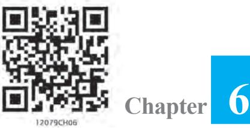

v *With the Calculus as a key, Mathematics can be successfully applied to the explanation of the course of Nature."* **—** *WHITEHEAD* v

## **6.1 Introduction**

In Chapter 5, we have learnt how to find derivative of composite functions, inverse trigonometric functions, implicit functions, exponential functions and logarithmic functions. In this chapter, we will study applications of the derivative in various disciplines, e.g., in engineering, science, social science, and many other fields. For instance, we will learn how the derivative can be used (i) to determine rate of change of quantities, (ii) to find the equations of tangent and normal to a curve at a point, (iii) to find turning points on the graph of a function which in turn will help us to locate points at which largest or smallest value (locally) of a function occurs. We will also use derivative to find intervals on which a function is increasing or decreasing. Finally, we use the derivative to find approximate value of certain quantities.

## **6.2 Rate of Change of Quantities**

Recall that by the derivative *ds dt* , we mean the rate of change of distance *s* with respect to the time *t*. In a similar fashion, whenever one quantity *y* varies with another quantity *x*, satisfying some rule *y f x* = ( ), then *dy dx* (or *f*′(*x*)) represents the rate of change of *y* with respect to *x* and *dy dx x x* = 0 (or *f*′(*x*0 )) represents the rate of change

of *y* with respect to *x* at 0 *x x* = .

Further, if two variables *x* and *y* are varying with respect to another variable *t*, i.e., if *x f t* = ( ) and *y g t* = ( ), then by Chain Rule

$${\frac{d y}{d x}}={\frac{d y}{d t}}{\Big/}{\frac{d x}{d t}}\,,{\mathrm{~if~}}{\frac{d x}{d t}}\neq0$$

Thus, the rate of change of *y* with respect to *x* can be calculated using the rate of change of *y* and that of *x* both with respect to *t*.

Let us consider some examples.

**Example 1** Find the rate of change of the area of a circle per second with respect to its radius *r* when *r* = 5 cm.

**Solution** The area A of a circle with radius *r* is given by A = π*r* 2 . Therefore, the rate

of change of the area A with respect to its radius *r* is given by A 2 ( ) 2 *d d r r dr dr* = π = π .

When *r* = 5 cm, A 10 *d dr* = π . Thus, the area of the circle is changing at the rate of 10π cm2 /s.

**Example 2** The volume of a cube is increasing at a rate of 9 cubic centimetres per second. How fast is the surface area increasing when the length of an edge is 10 centimetres ?

**Solution** Let *x* be the length of a side, V be the volume and S be the surface area of the cube. Then, V = *x* 3 and S = 6*x* 2 , where *x* is a function of time *t*.

Now  
  
Therefore  
  

$$\frac{d\mathbf{N}}{dt}=9\mathrm{cm}^{3/8}(\mathrm{Given})$$
  
  
or  
  

$$\frac{d\mathbf{x}}{dt}=\frac{3}{x^{2}}$$
... (1)  
  
Now  
  

$$\frac{dS}{dt}=\frac{d}{dt}(6x^{2})=\frac{d}{dx}(6x^{2})\cdot\frac{dx}{dt}$$
 (By Chain Rule)  
  

$$\cdot$$
  
  

$$=12x\cdot\left(\frac{3}{x^{2}}\right)=\frac{36}{x}$$
 (Using (1))  
  
Hence, when  
  

$$x=10\;\mathrm{cm},\;\frac{dS}{dt}=3.6\;\mathrm{cm}^{2}/\mathrm{s}$$

**Example 3** A stone is dropped into a quiet lake and waves move in circles at a speed of 4cm per second. At the instant, when the radius of the circular wave is 10 cm, how fast is the enclosed area increasing?

**Solution** The area A of a circle with radius *r* is given by A = π*r* 2 . Therefore, the rate of change of area A with respect to time *t* is

$$\frac{d\mathbf{A}}{dt}=\frac{d}{dt}(\pi r^{2})=\frac{d}{dr}(\pi r^{2})\cdot\frac{dr}{dt}=2\pi\;r\;\frac{dr}{dt}$$
 (By Chain Rule)

It is given that

$${\frac{\dot{d}r}{d t}}=4\mathrm{cm/s}$$

Therefore, when $r=10$ cm, $\frac{d\mathbf{A}}{dt}=2\pi(10)$ (4) = 80$\pi$

Thus, the enclosed area is increasing at the rate of 80π cm2 /s, when *r* = 10 cm.

$\frac{dy}{dx}$ is positive if $y$ increases as $x$ increases and is negative if $y$ decreases as $x$ increases.  
  

**Example 4** The length *x* of a rectangle is decreasing at the rate of 3 cm/minute and the width *y* is increasing at the rate of 2cm/minute. When *x* =10cm and *y* = 6cm, find the rates of change of (a) the perimeter and (b) the area of the rectangle.

**Solution** Since the length *x* is decreasing and the width *y* is increasing with respect to time, we have

$dx=-3$ cm/min and $\frac{dy}{dt}=2$ cm/min.  
  

(a) The perimeter P of a rectangle is given by

$$\mathrm{P}=2\left(x+y\right)$$

A = *x* . *y*

Therefore

$${\frac{d\mathrm{P}}{d t}}=2{\left({\frac{d x}{d t}}+{\frac{d y}{d t}}\right)}=2\left(-3+2\right)=-2{\mathrm{~cm/min}}$$

(b) The area A of the rectangle is given by

$\frac{\mathrm{dA}}{dt}=\frac{dx}{dt}\cdot y+x\cdot\frac{dy}{dt}$  
  
$=-3(6)+10(2)$ (as $x=10$ cm and $y=6$ cm)  
  
$=2$ cm${}^{2}$/min

Therefore

**Example 5** The total cost C(*x*) in Rupees, associated with the production of *x* units of an item is given by

> C(*x*) = 0.005 *x* 3 – 0.02 *x* 2 + 30*x* + 5000

Find the marginal cost when 3 units are produced, where by marginal cost we mean the instantaneous rate of change of total cost at any level of output.

**Solution** Since marginal cost is the rate of change of total cost with respect to the output, we have

$$\begin{array}{ll}\mbox{Marginal}&\mbox{cost(MC)}=\frac{dC}{dx}=0.005(3x^{2})-0.02(2x)+30\\ \mbox{When}&x=3,\,\mbox{MC}=0.015(3^{2})-0.04(3)+30\\ &=0.135-0.12+30=30.015\\ \end{array}$$

Hence, the required marginal cost is ` 30.02 (nearly).

**Example 6** The total revenue in Rupees received from the sale of *x* units of a product is given by R(*x*) = 3*x* 2 + 36*x* + 5. Find the marginal revenue, when *x* = 5, where by marginal revenue we mean the rate of change of total revenue with respect to the number of items sold at an instant.

**Solution** Since marginal revenue is the rate of change of total revenue with respect to the number of units sold, we have

Marginal Revenue (MR) =

$$\begin{array}{c}\mbox{Marginal Revenue}\\ \mbox{When}\\ \mbox{x=5,\mbox{MR}=6(5)+36=66}\end{array}$$

Hence, the required marginal revenue is ` 66.

**EXERCISE 6.1**

- **1.** Find the rate of change of the area of a circle with respect to its radius *r* when
	- (a) *r* = 3 cm (b) *r* = 4 cm
- **2.** The volume of a cube is increasing at the rate of 8 cm3 /s. How fast is the surface area increasing when the length of an edge is 12 cm?
- **3.** The radius of a circle is increasing uniformly at the rate of 3 cm/s. Find the rate at which the area of the circle is increasing when the radius is 10 cm.
- **4.** An edge of a variable cube is increasing at the rate of 3 cm/s. How fast is the volume of the cube increasing when the edge is 10 cm long?
- **5.** A stone is dropped into a quiet lake and waves move in circles at the speed of 5 cm/s. At the instant when the radius of the circular wave is 8 cm, how fast is the enclosed area increasing?
- **6.** The radius of a circle is increasing at the rate of 0.7 cm/s. What is the rate of increase of its circumference?
- **7.** The length *x* of a rectangle is decreasing at the rate of 5 cm/minute and the width *y* is increasing at the rate of 4 cm/minute. When *x* = 8cm and *y* = 6cm, find the rates of change of (a) the perimeter, and (b) the area of the rectangle.
- **8.** A balloon, which always remains spherical on inflation, is being inflated by pumping in 900 cubic centimetres of gas per second. Find the rate at which the radius of the balloon increases when the radius is 15 cm.
- **9.** A balloon, which always remains spherical has a variable radius. Find the rate at which its volume is increasing with the radius when the later is 10 cm.
- **10.** A ladder 5 m long is leaning against a wall. The bottom of the ladder is pulled along the ground, away from the wall, at the rate of 2cm/s. How fast is its height on the wall decreasing when the foot of the ladder is 4 m away from the wall ?
- **11.** A particle moves along the curve 6*y* = *x* 3 +2. Find the points on the curve at which the *y*-coordinate is changing 8 times as fast as the *x*-coordinate.
- **12.** The radius of an air bubble is increasing at the rate of 1 2 cm/s. At what rate is the volume of the bubble increasing when the radius is 1 cm?
- **13.** A balloon, which always remains spherical, has a variable diameter 3 (2 1) 2 *x* + .

Find the rate of change of its volume with respect to *x*.

- **14.** Sand is pouring from a pipe at the rate of 12 cm3 /s. The falling sand forms a cone on the ground in such a way that the height of the cone is always one-sixth of the radius of the base. How fast is the height of the sand cone increasing when the height is 4 cm?
- **15.** The total cost C(*x*) in Rupees associated with the production of *x* units of an item is given by

C(*x*) = 0.007*x* 3 – 0.003*x* 2 + 15*x* + 4000.

Find the marginal cost when 17 units are produced.

- **16.** The total revenue in Rupees received from the sale of *x* units of a product is given by

$$\mathrm{R}\left(x\right)=13x^{2}+26x+15.$$

Find the marginal revenue when *x* = 7.

Choose the correct answer for questions 17 and 18.

- **17.** The rate of change of the area of a circle with respect to its radius *r* at *r* = 6 cm is (A) 10π (B) 12π (C) 8π (D) 11π
- **18.** The total revenue in Rupees received from the sale of *x* units of a product is given by
R(*x*) = 3*x* 2 + 36*x* + 5. The marginal revenue, when *x* = 15 is (A) 116 (B) 96 (C) 90 (D) 126

## **6.3 Increasing and Decreasing Functions**

In this section, we will use differentiation to find out whether a function is increasing or decreasing or none.

Consider the function *f* given by *f* (*x*) = *x* 2 , *x* ∈ **R**. The graph of this function is a parabola as given in Fig 6.1.

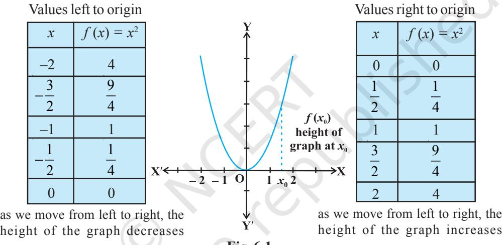

**Fig 6.1**

First consider the graph (Fig 6.1) to the right of the origin. Observe that as we move from left to right along the graph, the height of the graph continuously increases. For this reason, the function is said to be increasing for the real numbers *x* > 0.

Now consider the graph to the left of the origin and observe here that as we move from left to right along the graph, the height of the graph continuously decreases. Consequently, the function is said to be decreasing for the real numbers *x* < 0.

We shall now give the following analytical definitions for a function which is increasing or decreasing on an interval.

**Definition 1** Let I be an interval contained in the domain of a real valued function *f*. Then *f* is said to be

- (i) increasing on I if *x*1 < *x*2 in I ⇒ *f*(*x*1 ) < *f*(*x*2 ) for all *x*1 , *x*2 ∈ I.
- (ii) decreasing on I, if *x* 1 , *x* 2 in I ⇒ *f*(*x* 1 ) < *f*(*x* 2 ) for all *x* 1 , *x* 2 ∈ I.
- (iii) constant on I, if *f(x) = c* for all *x* ∈ I, where *c* is a constant.

- (iv) decreasing on I if *x*1 < *x*2 in I ⇒ *f* (*x*1 ) ≥ *f*(*x*2 ) for all *x*1 , *x*2 ∈ I.
- (v) strictly decreasing on I if *x*1 < *x*2 in I ⇒ *f*(*x*1 ) > *f*(*x*2 ) for all *x*1 , *x*2 ∈ I. For graphical representation of such functions see Fig 6.2.

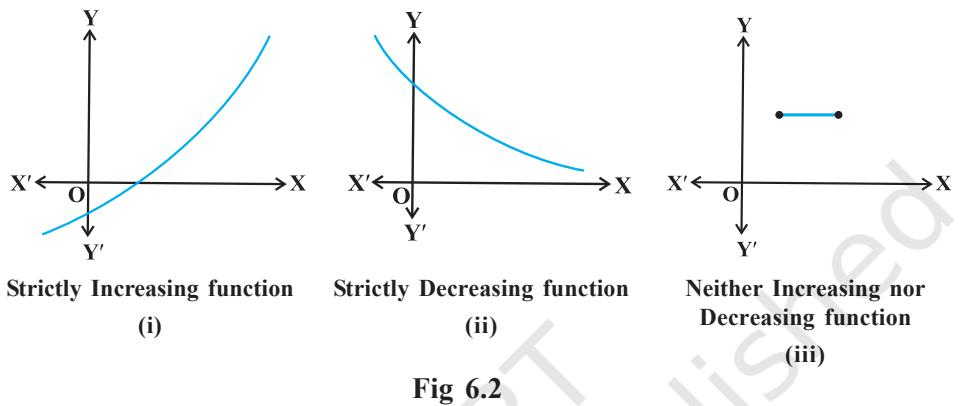

We shall now define when a function is increasing or decreasing at a point.

**Definition 2** Let *x* 0 be a point in the domain of definition of a real valued function *f*. Then *f* is said to be increasing, decreasing at *x*0 if there exists an open interval I containing *x* 0 such that *f* is increasing, decreasing, respectively, in I.

Let us clarify this definition for the case of increasing function.

**Example 7** Show that the function given by *f*(*x*) = 7*x* – 3 is increasing on **R**.

**Solution** Let *x*1 and *x*2 be any two numbers in **R**. Then

> *x*1 < *x*2 ⇒ 7*x*1 < 7*x*2 ⇒ 7*x*1 – 3 < 7*x*2 – 3 ⇒ *f*(*x*1 ) < *f*(*x*2 ) Thus, by Definition 1, it follows that *f* is strictly increasing on **R**.

We shall now give the first derivative test for increasing and decreasing functions. The proof of this test requires the Mean Value Theorem studied in Chapter 5.

**Theorem 1** Let *f* be continuous on [*a, b*] and differentiable on the open interval (*a,b*). Then

(a) *f* is increasing in [*a,b*] if *f* ′(*x*) > 0 for each *x* ∈ (*a*, *b*)

(b) *f* is decreasing in [*a,b*] if *f* ′(*x*) < 0 for each *x* ∈ (*a*, *b*)

- (c) *f* is a constant function in [*a,b*] if *f* ′(*x*) = 0 for each *x* ∈ (*a*, *b*)
**Proof** (a) Let *x*1 , *x*2 ∈ [*a*, *b*] be such that *x*1 < *x*2 .

Then, by Mean Value Theorem (Theorem 8 in Chapter 5), there exists a point *c* between *x*1 and *x*2 such that

$$f(x_{2})-f(x_{1})=f^{\prime}(c)\ (x_{2}-x_{1})$$
  
  
i.e.  
  

$$f(x_{2})-f(x_{1})>0$$
  
  
(as $f^{\prime}(c)>0$ (given))  
  
i.e.  
  

$$f(x_{2})>f(x_{1})$$

Thus, we have

$$x_{1}<x_{2}\;\;\;\;\;f(x_{1})\;\;\;\;f(x_{2}),\;\;\mathrm{for\;all}\;x_{1},x_{2}\;\;\;[a,b]$$

Hence, *f* is an increasing function in [*a,b*].

The proofs of part (b) and (c) are similar. It is left as an exercise to the reader.

## *Remarks*

There is a more generalised theorem, which states that if *f*¢(*x*) > 0 for *x* in an interval excluding the end points and *f* is continuous in the interval, then *f* is increasing. Similarly, if *f*¢(*x*) < 0 for *x* in an interval excluding the end points and *f* is continuous in the interval, then *f* is decreasing.

**Example 8** Show that the function *f* given by

(4) = 3x = 3x = 4x, x = R 

is increasing on **R**.

**Solution** Note that

(4) 34 - 6x + 4  
  
(4) 34 - 2x + 1) +

$$=3(x^{2}-2x+1)+1$$

= 3(*x* – 1)2 + 1 > 0, in every interval of **R**

Therefore, the function *f* is increasing on **R**.

**Example 9** Prove that the function given by *f*(*x*) = cos *x* is

- (a) decreasing in (0, π)
- (b) increasing in (π, 2π), and
- (c) neither increasing nor decreasing in (0, 2π).

**Fig 6.3**

**Solution** Note that *f* ′(*x*) = – sin *x*

- (a) Since for each *x* ∈ (0, π), sin *x* > 0, we have *f* ′(*x*) < 0 and so *f* is decreasing in (0, π).
- (b) Since for each *x* ∈ (π, 2π), sin *x* < 0, we have *f* ′(*x*) > 0 and so *f* is increasing in (π, 2π).
- (c) Clearly by (a) and (b) above, *f* is neither increasing nor decreasing in (0, 2π).

**Example 10** Find the intervals in which the function *f* given by *f*(*x*) = *x* 2 – 4*x* + 6 is

- (a) increasing (b) decreasing
*f* (*x*) = *x*

2

– 4*x* + 6

**Solution** We have

or *f* ′(*x*) = 2*x* – 4

Therefore, *f* ′(*x*) = 0 gives *x* = 2. Now the point *x* = 2 divides the real line into two disjoint intervals namely, (– ∞, 2) and (2, ∞) (Fig 6.3). In the interval (– ∞, 2), *f* ′(*x*) = 2*x* – 4 < 0.

Therefore, *f* is decreasing in this interval. Also, in the interval (2, ) ∞ , *f x* ′( ) 0 > and so the function *f* is increasing in this interval.

**Example 11** Find the intervals in which the function *f* given by *f* (*x*) = 4*x* 3 – 6*x* 2 – 72*x* + 30 is (a) increasing (b) decreasing.

**Solution** We have

$$f(x)=4x^{3}-6x^{2}-72x+30$$
  
  
or  
  

$$f(x)=12x^{2}-12x-72$$
  
  

$$=12(x^{2}-x-6)$$
  
  

$$=12(x-3)\;(x+2)$$

Therefore, *f* ′(*x*) = 0 gives *x* = – 2, 3. The points *x* = – 2 and *x* = 3 divides the real line into three disjoint intervals, namely, (– ∞, – 2), (– 2, 3) and (3, ∞).

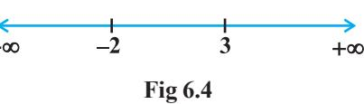

In the intervals (– ∞, – 2) and (3, ∞), *f* ′(*x*) is positive while in the interval (– 2, 3), *f* ′(*x*) is negative. Consequently, the function *f* is increasing in the intervals (– ∞, – 2) and (3, ∞) while the function is decreasing in the interval (– 2, 3). However, *f* is neither increasing nor decreasing in **R**.

| Interval | Sign of f ′(x) | Nature of function f |
| --- | --- | --- |
| (– ∞, – 2) | (–) (–) > 0 | f is increasing |
| (– 2, 3) | (–) (+) < 0 | f is decreasing |
| (3, ∞) | (+) (+) > 0 | f is increasing |

**Example 12** Find intervals in which the function given by *f* (*x*) = sin 3*x*, *x* ∈ 0 2 , π is (a) increasing (b) decreasing.

**Solution** We have

$f(x)=\sin3x$  
  
$f^{\prime}(x)=3\cos3x$

Therefore, *f*′(*x*) = 0 gives cos 3*x* = 0 which in turn gives 3 3 , 2 2 *x* π π = (as *x* ∈ 0 2 , π implies 3 3 0, 2 *x* π ∈ ). So 6 *x* π = and 2 π . The point 6 *x* π = divides the interval 0 2 , π into two disjoint intervals 0, 6 π and π π 6 2 , . Now, *f x* ′( ) 0 > for all 0, 6 *x* π ∈ as 0 0 3 6 2 *x x* π π ≤ < ⇒ ≤ < and *f x* ′( ) 0 < for all , 6 2 *x* π π ∈ as 3 3 6 2 2 2 *x x* π π π π < < ⇒ < < . Therefore, *f* is increasing in 0, 6 π and decreasing in , 6 2 π π . **Fig 6.5**

Also, the given function is continuous at *x* = 0 and 6 *x* π = . Therefore, by Theorem 1,

$f$is increasing on $\left[0,\frac{\pi}{6}\right]$ and decreasing on $\left[\frac{\pi}{6},\frac{\pi}{2}\right]$.  
  

**Example 13** Find the intervals in which the function *f* given by

*f*(*x*) = sin *x* + cos *x*, 0 ≤ *x* ≤ 2π

is increasing or decreasing.

**Solution** We have

$f(x)=\sin x+\cos x$, $f^{\prime}(x)=\cos x-\sin x$

Now *f x* ′( ) 0 = gives sin *x* = cos *x* which gives that 4 *x* π = , 5 4 π as 0 2 ≤ ≤ π *x*

The points 4 *x* π = and 5 4 *x* π = divide the interval [0, 2π] into three disjoint intervals,

namely, $\left[0,\frac{\pi}{4}\right)$, $\left(\frac{\pi}{4},\frac{5\pi}{4}\right)$ and $\left(\frac{5\pi}{4},2\pi\right)$.  
  

Note that 5 ( ) 0 if 0, ,2 4 4 *f x x* π π ′ > ∈ ∪ π 

or  
  

$$f$$
  
  
is increasing in the intervals $\left[\,0,\frac{\pi}{4}\right]$ and $\left(\frac{5\pi}{4},2\pi\right]$

Also $f^{\prime}(x)<0$ if $x\in\left(\frac{\pi}{4},\frac{5\pi}{4}\right)$

or  
  
$f$ is decreasing in $\left(\frac{\pi}{4},\frac{5\pi}{4}\right)$

|  | Interval |  |  | Sign of f | ′( x ) | Nature of function |
| --- | --- | --- | --- | --- | --- | --- |
|   | 0, | π   |  | > 0 |  | f is increasing |
|  |  | 4  |  |  |  |  |
| π   | 5 , | π |   | < 0 |  | f is decreasing |
|  4 |  | 4 |  |  |  |  |
|  5   | π | π ,2 |    | > 0 |  | f is increasing |
|  | 4 |  |  |  |  |  |

## **EXERCISE 6.2**

- **1.** Show that the function given by *f* (*x*) = 3*x* + 17 is increasing on **R**.
- **2.** Show that the function given by *f* (*x*) = *e* 2*x* is increasing on **R**.
- **3.** Show that the function given by *f* (*x*) = sin *x* is
	- (a) increasing in 0, 2 π (b) decreasing in , 2 π π

(c) neither increasing nor decreasing in (0, π)

- **4.** Find the intervals in which the function *f* given by *f*(*x*) = 2*x* 2 – 3*x* is (a) increasing (b) decreasing
- **5.** Find the intervals in which the function *f* given by *f*(*x*) = 2*x* 3 – 3*x* 2 – 36*x* + 7 is
	- (a) increasing (b) decreasing
- **6.** Find the intervals in which the following functions are strictly increasing or decreasing:

2

- (a) *x* 2 + 2*x* – 5 (b) 10 – 6*x* – 2*x*
- (c) –2*x* 3 – 9*x* 2 – 12*x* + 1 (d) 6 – 9*x* – *x* 2

* [16] A. A. K.  
  

- **7.** Show that 2 log(1 ) 2 *x y x x* = + − + , *x* > – 1, is an increasing function of *x* throughout its domain.
- **8.** Find the values of *x* for which *y* = [*x*(*x* 2)]2 is an increasing function.

Prove that $y=\dfrac{4\sin\theta}{(2+\cos\theta)}-\theta$ is an increasing function of $\theta$ in $\left[0,\dfrac{\pi}{2}\right]$.  
  

- **10.** Prove that the logarithmic function is increasing on (0, ∞).
- **11.** Prove that the function *f* given by *f*(*x*) = *x* 2 – *x* + 1 is neither strictly increasing nor decreasing on (– 1, 1).
- **12.** Which of the following functions are decreasing on 0, 2 π ?
	- (A) cos *x* (B) cos 2*x* (C) cos 3*x* (D) tan *x*
- **13.** On which of the following intervals is the function *f* given by *f*(*x*) = *x* 100 + sin *x* –1 decreasing ?

* (0,1) (B) $\frac{\pi}{2},\pi$ (C) $0,\frac{\pi}{2}$ (D) None of these 

- **14.** For what values of *a* the function *f* given by *f*(*x*) = *x* 2 + *ax* + 1 is increasing on [1, 2]?
- **15.** Let I be any interval disjoint from [–1, 1]. Prove that the function *f* given by

$$f(x)=x+{\frac{1}{x}}{\mathrm{~is~increasing~on~I.~}}$$

- **16.** Prove that the function *f* given by *f*(*x*) = log sin *x* is increasing on 0 2 , π and
decreasing on π π 2 , .

- **17.** Prove that the function *f* given by *f* (*x*) = log |cos *x|* is decreasing on 0, 2 π and increasing on 3 , 2 2 π π .
- **18.** Prove that the function given by *f* (*x*) = *x* 3 – 3*x* 2 + 3*x* – 100 is increasing in **R**.

**19.** The interval in which *y* = *x* 2 *e –x* is increasing is

(A) (– ∞, ∞) (B) (– 2, 0) (C) (2, ∞) (D) (0, 2)

## **6.4 Maxima and Minima**

In this section, we will use the concept of derivatives to calculate the maximum or minimum values of various functions. In fact, we will find the 'turning points' of the graph of a function and thus find points at which the graph reaches its highest (or

lowest) *locally*. The knowledge of such points is very useful in sketching the graph of a given function. Further, we will also find the absolute maximum and absolute minimum of a function that are necessary for the solution of many applied problems.

Let us consider the following problems that arise in day to day life.

- (i) The profit from a grove of orange trees is given by P(*x*) = *ax* + *bx*2 , where *a,b* are constants and *x* is the number of orange trees per acre. How many trees per acre will maximise the profit?
- (ii) A ball, thrown into the air from a building 60 metres high, travels along a path

given by 2 ( ) 60 60 *x h x x* = + − , where *x* is the horizontal distance from the building and *h*(*x*) is the height of the ball . What is the maximum height the ball will reach?

- (iii) An Apache helicopter of enemy is flying along the path given by the curve *f* (*x*) = *x* 2 + 7. A soldier, placed at the point (1, 2), wants to shoot the helicopter when it is nearest to him. What is the nearest distance?
In each of the above problem, there is something common, i.e., we wish to find out the maximum or minimum values of the given functions. In order to tackle such problems, we first formally define maximum or minimum values of a function, points of local maxima and minima and test for determining such points.

**Definition 3** Let *f* be a function defined on an interval I. Then

- (a) *f* is said to have a *maximum value* in I, if there exists a point *c* in I such that *f c f x* ( ) ( ) > , for all *x* ∈ I.
The number *f*(*c*) is called the maximum value of *f* in I and the point *c* is called a *point of maximum value* of *f* in I.

- (b) *f* is said to have a minimum value in I, if there exists a point *c* in I such that *f* (*c*) < *f* (*x*), for all *x* ∈ I.
The number *f* (*c*), in this case, is called the minimum value of *f* in I and the point *c*, in this case, is called a *point of minimum value* of *f* in I.

- (c) *f* is said to have an extreme value in I if there exists a point *c* in I such that *f* (*c*) is either a maximum value or a minimum value of *f* in I.
The number *f* (*c*), in this case, is called an *extreme value* of *f* in I and the point *c* is called an *extreme point*.

*Remark* In Fig 6.7(a), (b) and (c), we have exhibited that graphs of certain particular functions help us to find maximum value and minimum value at a point. Infact, through graphs, we can even find maximum/minimum value of a function at a point at which it is not even differentiable (Example 15).

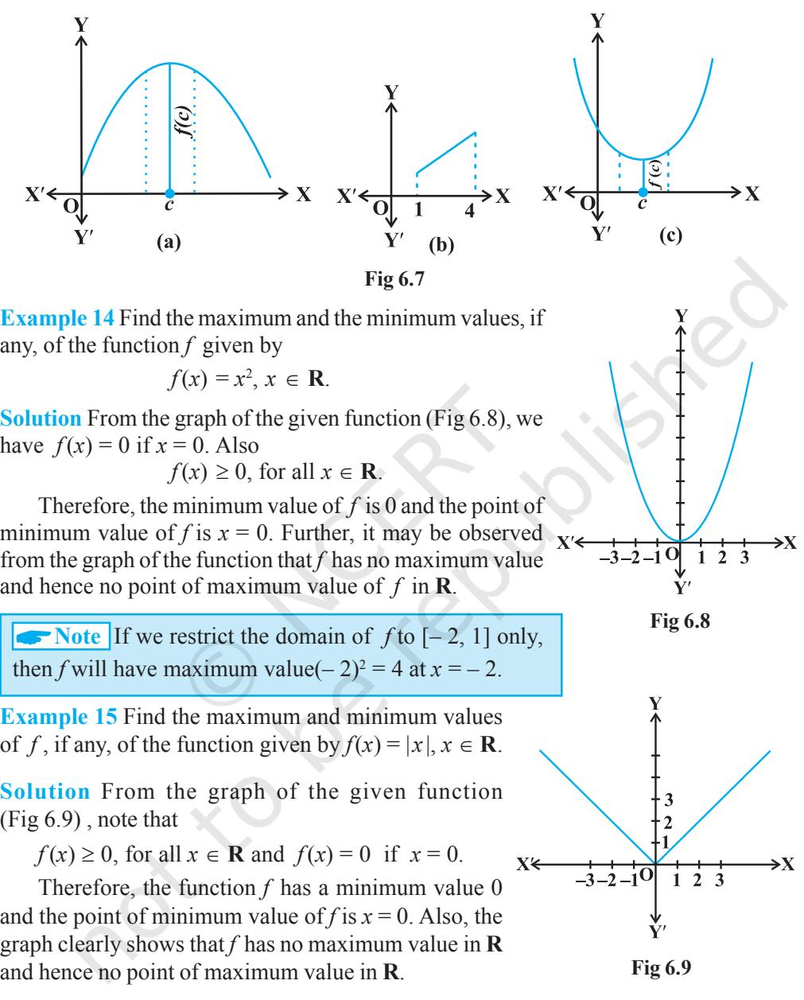

A**Note**

- (i) If we restrict the domain of *f* to [– 2, 1] only, then *f* will have maximum value | – 2| = 2.
- (ii) One may note that the function *f* in Example 27 is not differentiable at *x* = 0.
**Example 16** Find the maximum and the minimum values, if any, of the function given by

$$f(x)=x,x\in(0,\,1).$$

**Solution** The given function is an increasing (strictly) function in the given interval (0, 1). From the graph (Fig 6.10) of the function *f* , it

seems that, it should have the minimum value at a point closest to 0 on its right and the maximum value at a point closest to 1 on its left. Are such points available? Of course, not. It is not possible to locate such points. Infact, if a point *x*0 is closest to 0, then

we find 0 0 2 *x* < *x* for all 0 *x* ∈(0,1). Also, if *x*1 is closest 1 *x* +

to 1, then 1 1 2 *x* > for all 1 *x* ∈(0,1) .

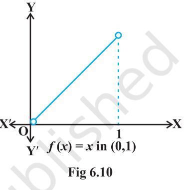

Therefore, the given function has neither the maximum value nor the minimum value in the interval (0,1).

*Remark* The reader may observe that in Example 16, if we include the points 0 and 1 in the domain of *f* , i.e., if we extend the domain of *f* to [0,1], then the function *f* has minimum value 0 at *x* = 0 and maximum value 1 at *x* = 1. Infact, we have the following results (The proof of these results are beyond the scope of the present text)

*Every monotonic function assumes its maximum/minimum value at the end points of the domain of definition of the function.*

A more general result is

*Every continuous function on a closed interval has a maximum and a minimum value.*

A**Note** By a monotonic function *f* in an interval I, we mean that *f* is either increasing in I or decreasing in I.

Maximum and minimum values of a function defined on a closed interval will be discussed later in this section.

Let us now examine the graph of a function as shown in Fig 6.11. Observe that at points A, B, C and D on the graph, the function changes its nature from decreasing to increasing or vice-versa. These points may be called *turning points* of the given function. Further, observe that at turning points, the graph has either a little hill or a little valley. Roughly speaking, the function has minimum value in some neighbourhood (interval) of each of the points A and C which are at the bottom of their respective

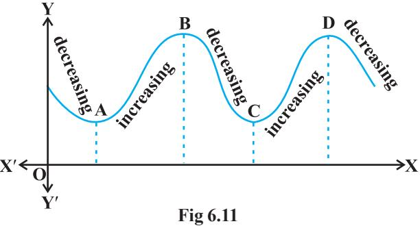

valleys. Similarly, the function has maximum value in some neighbourhood of points B and D which are at the top of their respective hills. For this reason, the points A and C may be regarded as points of *local minimum value* (or *relative minimum value*) and points B and D may be regarded as points of *local maximum value* (or *relative maximum value*) for the function. The *local maximum value* and *local minimum value* of the function are referred to as *local maxima* and *local minima*, respectively, of the function.

We now formally give the following definition

**Definition 4** Let *f* be a real valued function and let *c* be an interior point in the domain of *f*. Then

- (a) *c* is called a point of *local maxima* if there is an *h* > 0 such that
*f* (*c*) ≥ *f* (*x*), for all *x* in (*c* – *h*, *c* + *h*), *x* ≠ *c*

The value *f*(*c*) is called the *local maximum value* of *f*.

- (b) *c* is called a point of *local minima* if there is an *h* > 0 such that
*f* (*c*) ≤ *f* (*x*), for all *x* in (*c* – *h*, *c* + *h*)

The value *f*(c) is called the *local minimum value* of *f* .

Geometrically, the above definition states that if *x* = *c* is a point of local maxima of *f*, then the graph of *f* around *c* will be as shown in Fig 6.12(a). Note that the function *f* is increasing (i.e., *f* ′(*x*) > 0) in the interval (*c* – *h*, *c*) and decreasing (i.e., *f* ′(*x*) < 0) in the interval (*c*, *c* + *h*).

This suggests that *f* ′(*c*) must be zero.

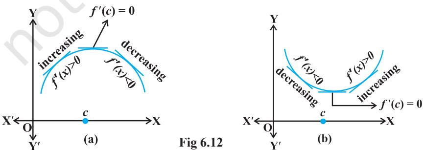

Similarly, if *c* is a point of local minima of *f* , then the graph of *f* around *c* will be as shown in Fig 6.14(b). Here *f* is decreasing (i.e., *f* ′(*x*) < 0) in the interval (*c* – *h*, *c*) and increasing (i.e., *f* ′(*x*) > 0) in the interval (*c*, *c* + *h*). This again suggest that *f* ′(*c*) must be zero.

The above discussion lead us to the following theorem (without proof).

**Theorem 2** Let *f* be a function defined on an open interval I. Suppose *c* ∈ I be any point. If *f* has a local maxima or a local minima at *x* = *c*, then either *f* ′(*c*) = 0 or *f* is not differentiable at *c*.

*Remark* The converse of above theorem need not be true, that is, a point at which the derivative vanishes need not be a point of local maxima or local minima. For example, if *f* (*x*) = *x* 3 , then *f* ′(*x*) = 3*x* 2 and so *f* ′(0) = 0. But 0 is neither a point of local maxima nor a point of local minima (Fig 6.13).

A**Note** A point c in the domain of a function *f* at which either *f* ′(*c*) = 0 or *f* is not differentiable is called a *critical point* of*f*. Note that if *f* is continuous at *c* and *f* ′(*c*) = 0, then there exists an *h* > 0 such that *f* is differentiable in the interval (*c* – *h*, *c* + *h*).

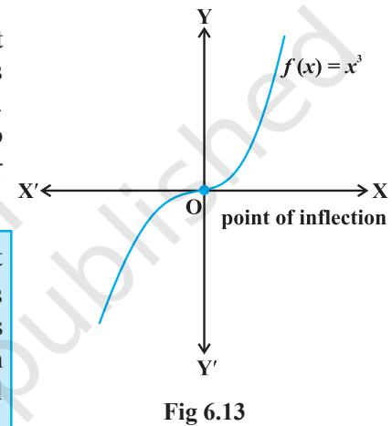

We shall now give a working rule for finding points of local maxima or points of local minima using only the first order derivatives.

**Theorem 3 (First Derivative Test)** Let *f* be a function defined on an open interval I. Let *f* be continuous at a critical point *c* in I. Then

- (i) If *f* ′(*x*) changes sign from positive to negative as *x* increases through c, i.e., if *f* ′(*x*) > 0 at every point sufficiently close to and to the left of *c*, and *f* ′(*x*) < 0 at every point sufficiently close to and to the right of *c*, then *c* is a point of *local maxima*.
- (ii) If *f* ′(*x*) changes sign from negative to positive as *x* increases through *c*, i.e., if *f* ′(*x*) < 0 at every point sufficiently close to and to the left of *c*, and *f* ′(*x*) > 0 at every point sufficiently close to and to the right of *c*, then *c* is a point of *local minima*.
- (iii) If *f* ′(*x*) does not change sign as *x* increases through *c*, then *c* is neither a point of local maxima nor a point of local minima. Infact, such a point is called *point of inflection* (Fig 6.13).

A**Note** If *c* is a point of local maxima of *f* , then *f*(*c*) is a local maximum value of *f*. Similarly, if *c* is a point of local minima of *f* , then *f*(*c*) is a local minimum value of *f*.

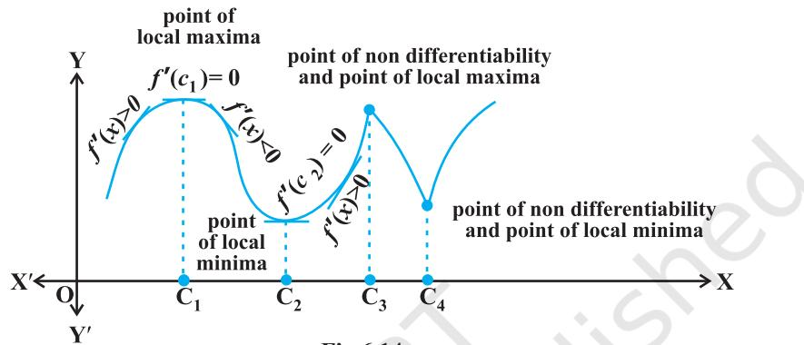

Figures 6.13 and 6.14, geometrically explain Theorem 3.

**Fig 6.14**

**Example 17** Find all points of local maxima and local minima of the function *f* given by

$$f(x)=x^{3}-3x+3.$$

**Solution** We have

$f(x)=x^{3}-3x+3$  
  
or  
  
$f^{\prime}(x)=3x^{2}-3=3\left(x-1\right)\left(x+1\right)$  
  
or  
  
$f^{\prime}(x)=0$ at $x=1$ and $x=-1$

Thus, *x* = ± 1 are the only critical points which could possibly be the points of local maxima and/or local minima of *f* . Let us first examine the point *x* = 1.

Note that for values close to 1 and to the right of 1, *f* ′(*x*) > 0 and for values close to 1 and to the left of 1, *f* ′(*x*) < 0. Therefore, by first derivative test, *x* = 1 is a point of local minima and local minimum value is *f* (1) = 1. In the case of *x* = –1, note that *f* ′(*x*) > 0, for values close to and to the left of –1 and *f* ′(*x*) < 0, for values close to and to the right of – 1. Therefore, by first derivative test, *x* = – 1 is a point of local maxima and local maximum value is *f*(–1) = 5.

|  | Values of x | Sign of f | ′(x) = 3(x – 1) (x + 1) |
| --- | --- | --- | --- |
| Close to 1 | to the right (say 1.1 etc.) |  | >0 |
|  | to the left (say 0.9 etc.) |  | <0 |
| Close to –1 | to the right (say − 0.9 etc.) |  | < 0 |
|  | to the left (say − 1.1 etc.) |  | > 0 |

**Example 18** Find all the points of local maxima and local minima of the function *f* given by

$$f(x)=2x^{3}-6x^{2}+6x+5.$$
  
  
**Solution** We have  
  

$$f(x)=2x^{3}-6x^{2}+6x+5$$
  
  
or  
  

$$f^{\prime}(x)=6x^{2}-12x+6=6(x-1)^{2}$$
  
  
or  
  

$$f^{\prime}(x)=0\quad\mbox{at}\quad x=1$$

Thus, *x* = 1 is the only critical point of *f* . We shall now examine this point for local maxima and/or local minima of *f*. Observe that *f* ′(*x*) ≥ 0, for all *x* ∈ **R** and in particular *f* ′(*x*) > 0, for values close to 1 and to the left and to the right of 1. Therefore, by first derivative test, the point *x* = 1 is neither a point of local maxima nor a point of local minima. Hence *x* = 1 is a point of inflexion.

*Remark* One may note that since *f* ′(*x*), in Example 30, never changes its sign on **R**, graph of *f* has no turning points and hence no point of local maxima or local minima.

We shall now give another test to examine local maxima and local minima of a given function. This test is often easier to apply than the first derivative test.

**Theorem 4 (Second Derivative Test)** Let *f* be a function defined on an interval I and *c* ∈ I. Let *f* be twice differentiable at *c*. Then

- (i) *x* = *c* is a point of local maxima if *f* ′(*c*) = 0 and *f* ″(*c*) < 0 The value *f* (*c*) is local maximum value of *f* .
- (ii) *x* = *c* is a point of local minima if *f c* ′( ) 0 = and *f* ″(*c*) > 0

In this case, *f* (*c*) is local minimum value of *f* .

- (iii) The test fails if *f* ′(*c*) = 0 and *f* ″(*c*) = 0.
In this case, we go back to the first derivative test and find whether *c* is a point of local maxima, local minima or a point of inflexion.

A**Note** As *f* is twice differentiable at *c*, we mean second order derivative of *f* exists at *c*.

**Example 19** Find local minimum value of the function *f* given by *f* (*x*) = 3 + |*x* |, *x* ∈ **R**.

**Solution** Note that the given function is not differentiable at *x* = 0. So, second derivative test fails. Let us try first derivative test. Note that 0 is a critical point of *f* . Now to the left of 0, *f*(*x*) = 3 – *x* and so *f* ′(*x*) = – 1 < 0. Also to

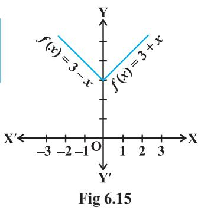

the right of 0, *f*(*x*) = 3 + *x* and so *f* ′(*x*) = 1 > 0. Therefore, by first derivative test, *x* = 0 is a point of local minima of *f* and local minimum value of *f* is *f* (0) = 3.

**Example 20** Find local maximum and local minimum values of the function *f* given by

$f(x)=3x^{4}+4x^{3}-12x^{2}+12$

**Solution** We have

|  | f (x) = | 4 3x | + 4x |  | 3 – 12x | 2 + 12 |
| --- | --- | --- | --- | --- | --- | --- |
| or | f ′(x) = | 3 12x |  | + 12x | 2 | – 24x = 12x (x – 1) (x + 2) |
| or | f ′(x) = |  |  |  | 0 at x = 0, x = 1 and x = – 2. |  |
| Now | f ″(x) = | 2 36x |  |  | + 24x – 24 = 12 | 2 (3x + 2x – 2) |
|  |  |  f | ′′ | ( 0 ) | = − | 24 < 0 |
| or |  |  f  | ′′ | ( ) 1 | = 36 | > 0 |
|  |  |  f  |  | ′′ − ( 2 ) | = | 72 > 0 |

Therefore, by second derivative test, *x* = 0 is a point of local maxima and local maximum value of *f* at *x* = 0 is *f* (0) = 12 while *x* = 1 and *x* = – 2 are the points of local minima and local minimum values of *f* at *x* = – 1 and – 2 are *f* (1) = 7 and *f* (–2) = –20, respectively.

**Example 21** Find all the points of local maxima and local minima of the function *f* given by

(4) = 24 - 6x + 6x + 5.  
  

**Solution** We have

$f(x)=2x^{3}-6x^{2}+6x+5$  
  
$f^{\prime}(x)=6x^{2}-12x+6=6(x-1)^{2}$  
  
$f^{\prime\prime}(x)=12(x-1)$

or

Now *f* ′(*x*) = 0 gives *x* =1. Also *f* ″(1) = 0. Therefore, the second derivative test fails in this case. So, we shall go back to the first derivative test.

We have already seen (Example 18) that, using first derivative test, *x* =1 is neither a point of local maxima nor a point of local minima and so it is a point of inflexion.

**Example 22** Find two positive numbers whose sum is 15 and the sum of whose squares is minimum.

**Solution** Let one of the numbers be *x*. Then the other number is (15 – *x*). Let S(*x*) denote the sum of the squares of these numbers. Then

$\mathbf{S}(x)=x^{2}+(15-x)^{2}=2x^{2}-30x+225$  
  
$\mathbf{S}^{\prime}(x)=4x-30$  
  
$\mathbf{S}^{\prime\prime}(x)=4$

or

Now S′(*x*) = 0 gives 15 2 *x* = . Also 15 S 4 0 2 ′′ = > . Therefore, by second derivative

test, 15 2 *x* = is the point of local minima of S. Hence the sum of squares of numbers is

minimum when the numbers are 15 2 and 15 15 15 2 2 − = .

*Remark* Proceeding as in Example 34 one may prove that the two positive numbers,

whose sum is *k* and the sum of whose squares is minimum, are and 2 2 *k k* .

**Example 23** Find the shortest distance of the point (0, *c*) from the parabola *y* = *x* 2 , where 1 2 ≤ *c* ≤ 5.

**Solution** Let (*h, k*) be any point on the parabola *y* = *x* 2 . Let D be the required distance between (*h, k*) and (0, *c*). Then

$$\begin{array}{l}\mbox{D}=\sqrt{\left(\dot{h}-0\right)^{2}+\left(\dot{k}-c\right)^{2}}=\sqrt{h^{2}+\left(k-c\right)^{2}}\hskip113.811024pt...\end{array}\tag{1}$$

2

Since (*h, k*) lies on the parabola *y* = *x* 2 , we have *k* = *h* 2 . So (1) gives

$$\begin{array}{c}\mbox{D}\equiv\mbox{D}(k)=\sqrt{k+(k-c)^{2}}\\ \mbox{D}^{\prime}(k)=\frac{1+2(k-c)}{2\sqrt{k+(k-c)^{2}}}\\ \mbox{.}\\ \mbox{D}^{\prime}(k)=0\mbox{gives}k=\frac{2c-1}{\gamma}\end{array}$$

Observe that when 2 1 2 *c k* − < , then 2( ) 1 0 *k c* − + < , i.e., D ( ) 0 ′ < *k* . Also when

$k>\frac{2c-1}{2}$, then 'D'($k$) > 0. So, by first derivative test, D ($k$) is minimum at $k=\frac{2c-1}{2}$.  
  

Hence, the required shortest distance is given by

$$\mathrm{D}\!\left({\frac{2c\!-\!1}{2}}\right)\!=\!{\sqrt{\frac{2c\!-\!1}{2}+\!\left({\frac{2c\!-\!1}{2}}\!-\!c\right)^{2}}}={\frac{\sqrt{4c\!-\!1}}{2}}$$

A**Note** The reader may note that in Example 35, we have used first derivative test instead of the second derivative test as the former is easy and short.

**Example 24** Let AP and BQ be two vertical poles at points A and B, respectively. If AP = 16 m, BQ = 22 m and AB = 20 m, then find the distance of a point R on AB from the point A such that RP2 + RQ2 is minimum.

**Solution** Let R be a point on AB such that AR = *x* m. Then RB = (20 – *x*) m (as AB = 20 m). From Fig 6.16, we have

RP2

+ RQ2

= AR2

= RB2

= AR2

= *x* 2 + (16)2

= 2*x* 2 + AP2

+ BQ*2*

+ AP2

+ RQ2

– 40*x* + 1140

 = 2*x* 2

– 40*x* + 1140.

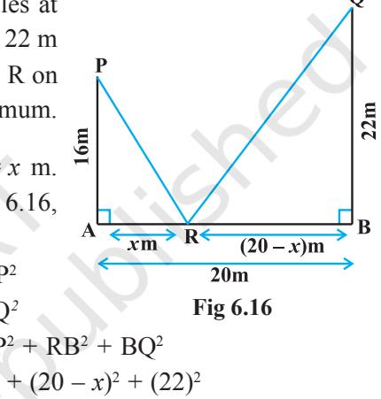

Let S ≡ S(*x*) = RP2

$$\mathbb{L}\mathbb{C}\mathbb{I}$$

Therefore S′(*x*) = 4*x* – 40.

and RQ2

Therefore RP2

Now S′(*x*) = 0 gives *x* = 10. Also S″(*x*) = 4 > 0, for all *x* and so S″(10) > 0. Therefore, by second derivative test, *x* = 10 is the point of local minima of S. Thus, the distance of R from A on AB is AR = *x* =10 m.

**Example 25** If length of three sides of a trapezium other than base are equal to 10cm, then find the area of the trapezium when it is maximum.

**Solution** The required trapezium is as given in Fig 6.17. Draw perpendiculars DP and

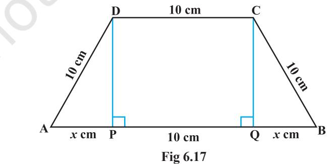

CQ on AB. Let AP = *x* cm. Note that ∆APD ~ ∆BQC. Therefore, QB = *x* cm. Also, by Pythagoras theorem, DP = QC = 2 100 − *x* . Let A be the area of the trapezium. Then

$$\begin{split}\text{A}\equiv\text{A}(x)&=\frac{1}{2}\left(\text{sum of parallel sides}\right)\left(\text{height}\right)\\ &=\frac{1}{2}\left(2x+10+10\right)\left(\sqrt{100-x^{2}}\right)\\ &=\left(x+10\right)\left(\sqrt{100-x^{2}}\right)\\ \end{split}$$
  
  
or  
  

$$\begin{split}\text{A}^{\prime}(x)&=\left(x+10\right)\frac{\left(-2x\right)}{2\sqrt{100-x^{2}}}+\left(\sqrt{100-x^{2}}\right)\\ &=\frac{\cdot}{2x^{2}-10x+100}{\sqrt{100-x^{2}}}\\ \end{split}$$

Now A′(*x*) = 0 gives 2*x* 2 + 10*x* – 100 = 0, i.e., *x* = 5 and *x* = –10. Since *x* represents distance, it can not be negative. So, *x* = 5. Now

A″(*x*) = 2 2 2 2 ( 2 ) 100 ( 4 10) ( 2 10 100) 2 100 100 *x x x x x x x* − − − − − − − + − − = 3 3 2 2 2 300 1000 (100 ) *x x x* − − − (on simplification) or A″(5) = 3 3 2 2 2(5) 300(5) 1000 2250 30 0 75 75 75 (100 (5) ) − − − − = = < −

Thus, area of trapezium is maximum at *x* = 5 and the area is given by

A(5) = (5+10)/100 - (5)^2 = 15/75 = 75/3 cm^2

**Example 26** Prove that the radius of the right circular cylinder of greatest curved surface area which can be inscribed in a given cone is half of that of the cone.

**Solution** Let OC = *r* be the radius of the cone and OA = *h* be its height. Let a cylinder with radius OE = *x* inscribed in the given cone (Fig 6.18). The height QE of the cylinder is given by

or

$${\frac{\mathrm{QE}}{h}}={\frac{r-x}{r}}$$

QE OA =

or QE =

Let S be the curved surface area of the given cylinder. Then

*h r x* ( ) *r* −

EC

S ≡ S(*x*) = 2 ( ) *xh r x r* π − = 2 2 ( ) *h rx x r* π −

OC (since ∆QEC ~ ∆AOC)

$$\begin{array}{l}{{\stackrel{\cdot}{\left(\mathrm{S}^{\prime}(x)=\frac{2\pi h}{r}(r-2x)\right.}}\\ {{\left.\mathrm{S}^{\prime\prime}(x)=\frac{-4\pi h}{r}\right.}}\end{array}\right.}}\end{array}$$

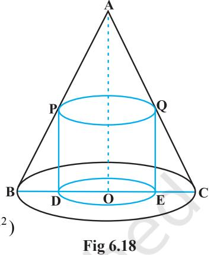

$$\mathrm{{on}}$$

Now S′(*x*) = 0 gives 2 *r x* = . Since S″(*x*) < 0 for all *x*, S 0 2 *r* ′′ < . So 2 *r x* = is a

point of maxima of S. Hence, the radius of the cylinder of greatest curved surface area which can be inscribed in a given cone is half of that of the cone.

## *6.4.1 Maximum and Minimum Values of a Function in a Closed Interval*

Let us consider a function *f* given by

[16] J. M. Campbell, J. M. Campbell, and J. M. Campbell, Phys. Rev. D **68**, 034002 (2003).  
* [17] J. M. Campbell, J. M. Campbell, and J. M. Campbell, J. M. Campbell, Phys. Rev. D **69**, 034001 (2004).  
* [18] J. M. Campbell, J. M. Campbell, and J. M. Campbell, J. M. Campbell, Phys. Rev. D **70**, 034004 (2004).  
* [19] J. M. Campbell, J. M. Campbell, and J. M. Campbell, J. M. Campbell, J. M. Campbell, and J. M. Campbell, J. M. Campbell, J. M. Campbell, and J. M. Campbell, J. M. Campbell, J. M. Campbell, and J. M. Campbell, J. M. Campbell, J. M. Campbell, and J. M. Campbell, J. M. Campbell, J. M. Campbell, and J. M. Campbell, J. M. Campbell, J. M. Campbell, and J. M. Campbell, J. M. Campbell, J. M. Campbell, and J. M. Campbell, J. M. Campbell, J. M. Campbell, and J. M.  
  

Observe that the function is continuous on (0, 1) and neither has a maximum value nor has a minimum value. Further, we may note that the function even has neither a local maximum value nor a local minimum value.

However, if we extend the domain of *f* to the closed interval [0, 1], then *f* still may not have a local maximum (minimum) values but it certainly does have maximum value 3 = *f*(1) and minimum value 2 = *f*(0). The maximum value 3 of *f* at *x* = 1 is called *absolute maximum* value (*global maximum* or *greatest value*) of *f* on the interval [0, 1]. Similarly, the minimum value 2 of *f* at *x* = 0 is called the *absolute minimum* value (*global minimum* or *least value*) of *f* on [0, 1].

Consider the graph given in Fig 6.19 of a continuous function defined on a closed interval [*a*, *d*]. Observe that the function *f* has a local minima at *x* = *b* and local

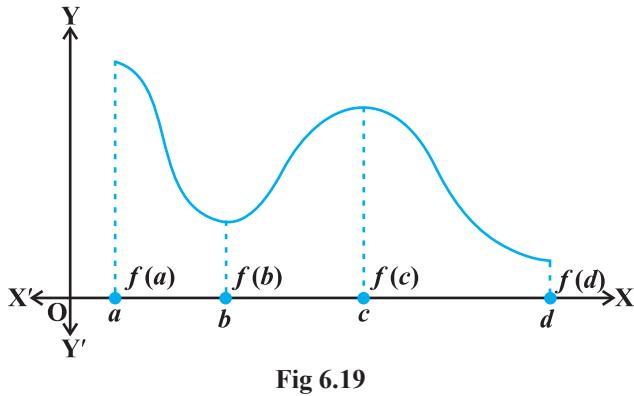

minimum value is *f*(*b*). The function also has a local maxima at *x* = *c* and local maximum value is *f* (*c*).

Also from the graph, it is evident that *f* has absolute maximum value *f* (*a*) and absolute minimum value *f* (*d*). Further note that the absolute maximum (minimum) value of *f* is different from local maximum (minimum) value of *f*.

We will now state two results (without proof) regarding absolute maximum and absolute minimum values of a function on a closed interval I.

**Theorem 5** Let *f* be a continuous function on an interval I = [*a*, *b*]. Then *f* has the absolute maximum value and *f* attains it at least once in I. Also, *f* has the absolute minimum value and attains it at least once in I.

**Theorem 6** Let *f* be a differentiable function on a closed interval I and let *c* be any interior point of I. Then

- (i) *f* ′(*c*) = 0 if *f* attains its absolute maximum value at *c*.
- (ii) *f* ′(*c*) = 0 if *f* attains its absolute minimum value at *c*.

In view of the above results, we have the following working rule for finding absolute maximum and/or absolute minimum values of a function in a given closed interval [*a*, *b*].

### **Working Rule**

- **Step 1**: Find all critical points of *f* in the interval, i.e., find points *x* where either *f x* ′( ) 0 = or *f* is not differentiable.
- **Step 2**: Take the end points of the interval.
- **Step 3**: At all these points (listed in Step 1 and 2), calculate the values of *f* .
- **Step 4**: Identify the maximum and minimum values of *f* out of the values calculated in Step 3. This maximum value will be the absolute maximum (greatest) value of *f* and the minimum value will be the absolute minimum (least) value of *f* .

**Example 27** Find the absolute maximum and minimum values of a function *f* given by

$f(x)=2x^{3}-15x^{2}+36x+1$ on the interval [1, 5].  
  

**Solution** We have

$$f(x)=2x^{3}-15x^{2}+36x+1$$
  
  
or  
  

$$f^{\prime}(x)=6x^{2}-30x+36=6\left(x-3\right)\left(x-2\right)$$
  
  
Note that $f^{\prime}(x)=0$ gives $x=2$ and $x=3$.  
  

We shall now evaluate the value of *f* at these points and at the end points of the interval [1, 5], i.e., at *x* = 1, *x* = 2, *x* = 3 and at *x* = 5. So

$f(1)=2(1^{3})-15(1^{2})+36(1)+1=24$  
  
$f(2)=2(2^{3})-15(2^{2})+36(2)+1=29$  
  
$f(3)=2(3^{3})-15(3^{2})+36(3)+1=28$  
  
$f(5)=2(5^{3})-15(5^{2})+36(5)+1=56$

Thus, we conclude that absolute maximum value of *f* on [1, 5] is 56, occurring at *x* =5, and absolute minimum value of *f* on [1, 5] is 24 which occurs at *x* = 1.

**Example 28** Find absolute maximum and minimum values of a function *f* given by

4 1 3 3 *f x x x x* ( ) 12 6 , [ 1, 1] = − ∈ −

**Solution** We have

$f(x)=12x^{\frac{3}{3}}-6x^{\frac{1}{3}}$  
  
or  
  
$f^{\prime}(x)=16x^{\frac{1}{3}}-\frac{2}{\frac{2}{3}}=\frac{2(8x-1)}{\frac{2}{3}}$

Thus, *f* ′(*x*) = 0 gives 1 8 *x* = . Further note that *f* ′(*x*) is not defined at *x* = 0. So the

critical points are *x* = 0 and 1 8 *x* = . Now evaluating the value of *f* at critical points

*x* = 0, 1 8 and at end points of the interval *x* = –1 and *x* = 1, we have

$$\begin{array}{c}{{f(-1)=12(-1)^{\frac{4}{3}}-6(-1)^{\frac{1}{3}}=18}}\\ {{f(0)=12(0)-6(0)=0}}\end{array}$$

$$\begin{array}{l}{{\stackrel{\cdot}{f}\!\left(\frac{1}{8}\right)=12\!\left(\frac{1}{8}\right)^{\frac{4}{3}}-6\!\left(\frac{1}{8}\right)^{\frac{1}{3}}=\frac{-9}{4}}}\\ {{\stackrel{\cdot}{f}\!\left(1\right)=12(1)^{\frac{4}{3}}-6(1)^{\frac{1}{3}}=6}}\end{array}$$

Hence, we conclude that absolute maximum value of *f* is 18 that occurs at *x* = –1

and absolute minimum value of *f* is 9 4 − that occurs at 1 8 *x* = .

**Example 29** An Apache helicopter of enemy is flying along the curve given by *y* = *x* 2 + 7. A soldier, placed at (3, 7), wants to shoot down the helicopter when it is nearest to him. Find the nearest distance.

**Solution** For each value of *x*, the helicopter's position is at point (*x*, *x* 2 + 7). Therefore, the distance between the helicopter and the soldier placed at (3,7) is

$$\sqrt{\left(x-3\right)^{2}+\left(x^{2}+7\right)^{2}},\left(x,\sqrt{\left(x-3\right)^{2}+x^{4}}\right)$$
  
  
Let  
  

$$f(x)=\left(x-3\right)^{2}+x^{4}$$
  
  
or  
  

$$f(x)=2(x-3)+\left(4x^{3}\right)=2\left(x-1\right)\left(2x^{2}+2x+3\right)$$

Thus, *f* ′(*x*) = 0 gives *x* = 1 or 2*x* 2 + 2*x* + 3 = 0 for which there are no real roots. Also, there are no end points of the interval to be added to the set for which *f* ′ is zero, i.e., there is only one point, namely, *x* = 1. The value of *f* at this point is given by *f* (1) = (1 – 3)2 + (1)4 = 5. Thus, the distance between the solider and the helicopter is *f* (1) 5 = .

Note that 5 is either a maximum value or a minimum value. Since

$$\sqrt{f(0)}=\sqrt{\left(0-3\right)^{2}+\left(0\right)^{4}}=3>\sqrt{3}\;,$$

it follows that 5 is the minimum value of *f x*( ) . Hence, 5 is the minimum distance between the soldier and the helicopter.

**EXERCISE 6.3**

- **1.** Find the maximum and minimum values, if any, of the following functions given by
	- (i) *f* (*x*) = (2*x* 1)2 + 3 (ii) *f*(*x*) = 9*x* 2 + 12*x* + 2
	- (iii) *f*(*x*) = (*x* 1)2 + 10 (iv) *g*(*x*) = *x* 3 + 1

- **2.** Find the maximum and minimum values, if any, of the following functions given by
	- (i) *f*(*x*) = | *x* + 2 | 1 (ii) *g*(*x*) = | *x* + 1| + 3 (iii) *h*(*x*) = sin(2*x*) + 5 (iv) *f*(*x*) = |sin 4*x* + 3|
	- (v) *h*(*x*) = *x* + 1, *x* ∈ (– 1, 1)
- **3.** Find the local maxima and local minima, if any, of the following functions. Find also the local maximum and the local minimum values, as the case may be:
	- (i) *f*(*x*) = *x* 2 (ii) *g*(*x*) = *x* 3 – 3*x* (iii) *h*(*x*) = sin *x* + cos *x*, 0 2 *x* π < < (iv) *f*(*x*) = sin *x* – cos *x*, 0 2 < < π *x* (v) *f*(*x*) = *x* 3 – 6*x* 2 + 9*x* + 15 (vi) 2 ( ) , 0 2 *x g x x x* = + > (vii) 2 1 ( ) 2 *g x x* = + (viii) *f x x x x* ( ) 1 , 0 1 = − < <
- **4.** Prove that the following functions do not have maxima or minima:
	- (i) *f*(*x*) = *e x* (ii) *g*(*x*) = log *x* (iii) *h* (*x*) = *x* 3 + *x* 2 + *x* +1
- **5.** Find the absolute maximum value and the absolute minimum value of the following functions in the given intervals:

(i) $f(x)=x^{5},\overline{x}\in[-2,2]$ (ii) $f(x)=\sin\,x+\cos\,x\,\,,\,x\in[0,\,\pi]$ (iii) $f(x)=4x-\frac{1}{2}x^{2},\,x\in[-2,\frac{9}{2}]$ (iv) $f(x)=(x-1)^{2}+3,\,\,x\in[-3,1]$

- **6.** Find the maximum profit that a company can make, if the profit function is given by

$$p(x)=41-72x-18x^{2}$$

- **7.** Find both the maximum value and the minimum value of 3*x* 4 – 8*x* 3 + 12*x* 2 – 48*x* + 25 on the interval [0, 3].
- **8.** At what points in the interval [0, 2π], does the function sin 2*x* attain its maximum value?
- **9.** What is the maximum value of the function sin *x* + cos *x*?
- **10.** Find the maximum value of 2*x* 3 – 24*x* + 107 in the interval [1, 3]. Find the maximum value of the same function in [–3, –1].

- **11.** It is given that at *x* = 1, the function *x* 4 – 62*x* 2 + *ax* + 9 attains its maximum value, on the interval [0, 2]. Find the value of *a*.
- **12.** Find the maximum and minimum values of *x* + sin 2*x* on [0, 2π].
- **13.** Find two numbers whose sum is 24 and whose product is as large as possible.
- **14.** Find two positive numbers *x* and *y* such that *x* + *y* = 60 and *xy*3 is maximum.
- **15.** Find two positive numbers *x* and *y* such that their sum is 35 and the product *x* 2 *y* 5 is a maximum.
- **16.** Find two positive numbers whose sum is 16 and the sum of whose cubes is minimum.
- **17.** A square piece of tin of side 18 cm is to be made into a box without top, by cutting a square from each corner and folding up the flaps to form the box. What should be the side of the square to be cut off so that the volume of the box is the maximum possible.
- **18.** A rectangular sheet of tin 45 cm by 24 cm is to be made into a box without top, by cutting off square from each corner and folding up the flaps. What should be the side of the square to be cut off so that the volume of the box is maximum ?
- **19.** Show that of all the rectangles inscribed in a given fixed circle, the square has the maximum area.
- **20.** Show that the right circular cylinder of given surface and maximum volume is such that its height is equal to the diameter of the base.
- **21.** Of all the closed cylindrical cans (right circular), of a given volume of 100 cubic centimetres, find the dimensions of the can which has the minimum surface area?
- **22.** A wire of length 28 m is to be cut into two pieces. One of the pieces is to be made into a square and the other into a circle. What should be the length of the two pieces so that the combined area of the square and the circle is minimum?
- **23.** Prove that the volume of the largest cone that can be inscribed in a sphere of radius R is 8

27 of the volume of the sphere.

- **24.** Show that the right circular cone of least curved surface and given volume has an altitude equal to 2 time the radius of the base.
- **25.** Show that the semi-vertical angle of the cone of the maximum volume and of given slant height is 1 tan 2 − .
- **26.** Show that semi-vertical angle of right circular cone of given surface area and maximum volume is sin− 1 1 3 .

Choose the correct answer in Questions 27 and 29.

- **27.** The point on the curve *x* 2 = 2*y* which is nearest to the point (0, 5) is (A) (2 2,4) (B) (2 2,0) (C) (0, 0) (D) (2, 2) **28.** For all real values of *x*, the minimum value of 2 2 1 1 *x x x x* − + + + is (A) 0 (B) 1 (C) 3 (D) 1 3 **29.** The maximum value of 1 3 [ ( 1) 1] *x x* − + , 0 1 ≤ ≤*x* is (A) 1 3 1 3 (B) 1 2 (C) 1 (D) 0
## *Miscellaneous Examples*

**Example 30** A car starts from a point P at time *t* = 0 seconds and stops at point Q. The distance *x*, in metres, covered by it, in *t* seconds is given by

$$x=t^{2}\left(2-{\frac{t}{3}}\right)$$

Find the time taken by it to reach Q and also find distance between P and Q.

**Solution** Let *v* be the velocity of the car at *t* seconds.

Now  
  

$$\begin{array}{c}\includegraphics[height=56.905512pt]{Fig1}\end{array}$$

$$x=t^{2}\left(2-{\frac{t}{3}}\right)$$

Therefore *v* =

$$v={\frac{d x}{d t}}=4t-t^{2}=t(4-t)$$

Thus, *v* = 0 gives *t* = 0 and/or *t* = 4.

Now *v* = 0 at P as well as at Q and at P, *t* = 0. So, at Q, *t* = 4. Thus, the car will reach the point Q after 4 seconds. Also the distance travelled in 4 seconds is given by

$$\left[x\right]_{t\,-\,4}=\,4^{2}{\bigg(}2-{\frac{4}{3}}{\bigg)}{=}16{\bigg(}{\frac{2}{3}}{\bigg)}{=}{\frac{32}{3}}\mathrm{m}$$

**Example 31** A water tank has the shape of an inverted right circular cone with its axis vertical and vertex lowermost. Its semi-vertical angle is tan–1 (0.5). Water is poured into it at a constant rate of 5 cubic metre per hour. Find the rate at which the level of the water is rising at the instant when the depth of water in the tank is 4 m.

**Solution** Let *r*, *h* and α be as in Fig 6.20. Then . tan *r h* α =

So  

$$\alpha=\tan^{-1}\!\left(\frac{r}{h}\right).$$
  
D.4.  
  

But α = tan–1 (0.5) (given)

$$\frac{r}{h}=0.5$$
. 

- or *r* = 2
Let V be the volume of the cone. Then

$\begin{array}{c}\includegraphics[scale=0.5]{fig/fig1.eps}\end{array}$  
  
$\begin{array}{c}\includegraphics[scale=0.5]{fig/fig1.eps}\end{array}$  

Therefore

$$=\frac{\pi}{4}h^{2}\,\frac{d h}{d t}$$

π

*h*

Now rate of change of volume, i.e., V 5 *d dt* = m3 /h and *h* = 4 m.

Therefore 5 = 2

$$\frac{d h}{d t}=\frac{5}{4\pi}=\frac{35}{88}\,\mathrm{m/h}\left(\pi=\frac{22}{7}\right)$$

⋅

*dh*

(4)

or

Thus, the rate of change of water level is 35 m/h 88 .

**Example 32** A man of height 2 metres walks at a uniform speed of 5 km/h away from a lamp post which is 6 metres high. Find the rate at which the length of his shadow increases.

**Solution** In Fig 6.21, Let AB be the lamp-post, the lamp being at the position B and let MN be the man at a particular time *t* and let AM = *l* metres. Then, MS is the shadow of the man. Let MS = *s* metres.

Note that ∆MSN ~ ∆ASB or MS AS = MN AB or AS = 3*s* (as MN = 2 and AB = 6 (given)) Thus AM = 3*s* – *s* = 2*s*. But AM = *l* So *l* = 2*s* Therefore *dl dt* = 2 *ds dt* 5 **Fig 6.21**

Since 5 *dl dt* = km/h. Hence, the length of the shadow increases at the rate 2 km/h.

**Example 33** Find intervals in which the function given by

$f(x)=\frac{3}{10}x^{4}-\frac{4}{5}x^{3}-3x^{2}+\frac{36}{5}x+11$

is (a) increasing (b) decreasing.

**Solution** We have

$$f(x)=\frac{3}{10}x^{4}-\frac{4}{5}x^{3}-3x^{2}+\frac{36}{5}x+11$$
 
$$f^{\prime}(x)=\frac{3}{10}(4x^{3})-\frac{4}{5}(3x^{2})-3(2x)+\frac{36}{5}$$
 
$$=\frac{\cdot6}{5}(x-1)(x+2)(x-3)\qquad\text{(on simplification)}$$

Now *f* ′(*x*) = 0 gives *x* = 1, *x* = – 2, or *x* = 3. The points *x* = 1, – 2, and 3 divide the real line into four disjoint intervals namely, (– ∞, – 2), (– 2, 1), (1, 3) and (3, ∞) (Fig 6.22). **Fig 6.22**

Consider the interval (– ∞, – 2), i.e., when – ∞ < *x* < – 2. In this case, we have *x* – 1 < 0, *x* + 2 < 0 and *x* – 3 < 0.

(In particular, observe that for *x* = –3, *f* ′(*x*) = (*x* – 1) (*x* + 2) (*x* – 3) = (– 4) (– 1) (– 6) < 0)

Therefore, *f* ′(*x*) < 0 when – ∞ < *x* < – 2.

Thus, the function *f* is decreasing in (– ∞, – 2).

Consider the interval (– 2, 1), i.e., when – 2 < *x* < 1.

In this case, we have *x* – 1 < 0, *x* + 2 > 0 and *x* – 3 < 0

(In particular, observe that for *x* = 0, *f* ′(*x*) = (*x* – 1) (*x* + 2) (*x* – 3) = (–1) (2) (–3) = 6 > 0)

So *f* ′(*x*) > 0 when – 2 < *x* < 1.

Thus, $f$ is increasing in ($\tau$2, 1).  
  

Now consider the interval (1, 3), i.e., when 1 < *x* < 3. In this case, we have *x* – 1 > 0, *x* + 2 > 0 and *x* – 3 < 0.

So,  
  
$f^{\prime}(x)<0$ when $1<x<3$.  
  

Thus, *f* is decreasing in (1, 3).

Finally, consider the interval (3, ∞), i.e., when *x* > 3. In this case, we have *x* – 1 > 0, *x* + 2 > 0 and *x* – 3 > 0. So *f* ′(*x*) > 0 when *x* > 3.

.

Thus, *f* is increasing in the interval (3, ∞).

**Example 34** Show that the function *f* given by

$$f(x)=\tan^{-1}(\sin x+\cos x),\,x>0$$

is always an increasing function in 0 4 , π 

**Solution** We have

$$f(x)=\tan^{-1}(\sin x+\cos x),\,x>0$$

Therefore  
  

$$f^{\prime}(x)=\frac{1}{1+\left(\sin x+\cos x\right)^{2}}\left(\cos x-\sin x\right)$$

$$={\frac{\cos x-\sin x}{2+\sin2x}}$$

(on simplification)

Note that 2 + sin 2*x* > 0 for all *x* in 0, 4 π .

| Therefore | f ′(x) > 0 if cos x – sin x > 0 |
| --- | --- |
| or | f ′(x) > 0 if cos x > sin x or cot x > 1 |

Now  
  

$$\cot x>1\ \mbox{if}\tan x<1,\ \mbox{i.e.,if}\ 0<x<\frac{\pi}{4}$$

Thus *f* ′(*x*) > 0 in 0 4 , π

Hence *f* is increasing function in 0, 4 

**Example 35** A circular disc of radius 3 cm is being heated. Due to expansion, its radius increases at the rate of 0.05 cm/s. Find the rate at which its area is increasing when radius is 3.2 cm.

π

.

**Solution** Let *r* be the radius of the given disc and A be its area. Then

$\begin{array}{c}\mbox{A}=\pi r^{2}\\ \mbox{$\frac{d\mbox{A}}{dt}$}=2\pi r\frac{dr}{dt}\end{array}$ (by Chain Rule)

or

Now approximate rate of increase of radius = *dr* = 0.05 *dr t dt* ∆ = cm/s.

Therefore, the approximate rate of increase in area is given by

$dA=\frac{dA}{dt}(\Delta t)=2\pi r\Bigg{(}\frac{dr}{dt}\Delta t\Bigg{)}$  
  
$=2\pi\,(3.2)\,(0.05)=0.320\pi$ cm${}^{2}$/s ($r=3.2$ cm)

**Example 36** An open topped box is to be constructed by removing equal squares from each corner of a 3 metre by 8 metre rectangular sheet of aluminium and folding up the sides. Find the volume of the largest such box.

**Solution** Let *x* metre be the length of a side of the removed squares. Then, the height of the box is *x*, length is 8 – 2*x* and breadth is 3 – 2*x* (Fig 6.23). If V(*x*) is the volume of the box, then

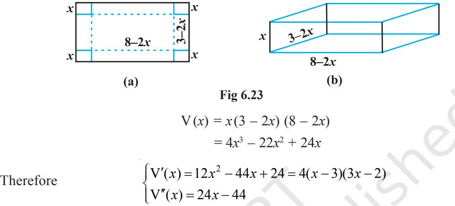

Now $\mathrm{V}^{\prime}(x)=0$ gives $x=3,\frac{2}{3}\cdot\mathrm{But}\,x\neq3$ (Why?)

Thus, we have $x=\frac{2}{3}$. Now $\mathbf{V}^{n}\!\left(\frac{2}{3}\right)=24\!\left(\frac{2}{3}\right)-44=28<0$.  
  

Therefore, 2 3 *x* = is the point of maxima, i.e., if we remove a square of side 2 3

metre from each corner of the sheet and make a box from the remaining sheet, then the volume of the box such obtained will be the largest and it is given by

$\left(\frac{2}{3}\right)=4\left(\frac{2}{3}\right)^{3}-22\left(\frac{2}{3}\right)^{2}+24\left(\frac{2}{3}\right)^{2}$

**Example 37** Manufacturer can sell *x* items at a price of rupees 5 100 − *x* each. The

cost price of *x* items is Rs *x* 5 + 500 . Find the number of items he should sell to earn maximum profit.

**Solution** Let S(*x*) be the selling price of *x* items and let C(*x*) be the cost price of *x* items. Then, we have

$$\begin{array}{c}\mbox{S}\left(x\right)=\left(5-\frac{x}{100}\right)x=5x-\frac{x^{2}}{100}\\ \cdot\\ \mbox{C}\left(x\right)=\frac{x}{5}+500\end{array}$$

Thus, the profit function P(*x*) is given by

$$\mathrm{P}(x)=\mathrm{S}\left(x\right)-\mathrm{C}\left(x\right)=5x-\frac{x^{2}}{100}-\frac{x}{5}-500$$
  
  
i.e.  
  

$$\mathrm{P}(x)=\frac{\cdot}{24}x-\frac{x^{2}}{100}-500$$
  
  
or  
  

$$\mathrm{P}^{\prime}(x)=\frac{\cdot}{5}\frac{24}{50}$$

Now P′(*x*) = 0 gives *x* = 240. Also 1 P ( ) 50 *x* − ′′ = . So 1 P (240) 0 50 − ′′ = <

Thus, *x* = 240 is a point of maxima. Hence, the manufacturer can earn maximum profit, if he sells 240 items.

5 50

## *Miscellaneous Exercise on Chapter 6*

- **1.** Show that the function given by log ( ) *x f x x* = has maximum at *x* = *e*.
- **2.** The two equal sides of an isosceles triangle with fixed base *b* are decreasing at the rate of 3 cm per second. How fast is the area decreasing when the two equal sides are equal to the base ?
- **3.** Find the intervals in which the function *f* given by

$$f(x)={\frac{4\sin x-2x-x\cos x}{2+\cos x}}$$

is (i) increasing (ii) decreasing.

- **4.** Find the intervals in which the function *f* given by 3 3 1 *f x x x* ( ) , 0 *x* = + ≠ is
	- (i) increasing (ii) decreasing.

- **5.** Find the maximum area of an isosceles triangle inscribed in the ellipse 2 2 2 2 1 *x y a b* + =
with its vertex at one end of the major axis.

- **6.** A tank with rectangular base and rectangular sides, open at the top is to be constructed so that its depth is 2 m and volume is 8 m3 . If building of tank costs Rs 70 per sq metres for the base and Rs 45 per square metre for sides. What is the cost of least expensive tank?
- **7.** The sum of the perimeter of a circle and square is *k*, where *k* is some constant. Prove that the sum of their areas is least when the side of square is double the radius of the circle.
- **8.** A window is in the form of a rectangle surmounted by a semicircular opening. The total perimeter of the window is 10 m. Find the dimensions of the window to admit maximum light through the whole opening.
- **9.** A point on the hypotenuse of a triangle is at distance *a* and *b* from the sides of the triangle.

Show that the minimum length of the hypotenuse is 2 2 3 3 3 2 ( ) *a b* + .

- **10.** Find the points at which the function *f* given by *f* (*x*) = (*x* 2)4 (*x* + 1)3 has
	- (i) local maxima (ii) local minima
	- (iii) point of inflexion
- **11.** Find the absolute maximum and minimum values of the function *f* given by

(fk) = cos${}^{2}$ x + sin x, x = [0, $\pi$]

- **12.** Show that the altitude of the right circular cone of maximum volume that can be inscribed in a sphere of radius *r* is 4 3 *r* .
- **13.** Let *f* be a function defined on [*a*, *b*] such that *f* ′(*x*) > 0, for all *x* ∈ (*a*, *b*). Then prove that *f* is an increasing function on (*a*, *b*).
- **14.** Show that the height of the cylinder of maximum volume that can be inscribed in a sphere of radius R is 2R 3 . Also find the maximum volume.
- **15.** Show that height of the cylinder of greatest volume which can be inscribed in a right circular cone of height *h* and semi vertical angle α is one-third that of the

cone and the greatest volume of cylinder is $\frac{4}{27}\pi h^{3}\tan^{2}\alpha$.  
  

- **16.** A cylindrical tank of radius 10 m is being filled with wheat at the rate of 314 cubic metre per hour. Then the depth of the wheat is increasing at the rate of
	- (A) 1 m/h (B) 0.1 m/h
	- (C) 1.1 m/h (D) 0.5 m/h

## *Summary*

- Æ If a quantity *y* varies with another quantity *x*, satisfying some rule *y f x* = ( ),
then *dy dx* (or *f x* ′( ) ) represents the rate of change of *y* with respect to *x* and *x x*0 *dy dx* = (or 0 *f x* ′( )) represents the rate of change of *y* with respect to *x* at *x x* = .

- Æ If two variables *x* and *y* are varying with respect to another variable *t*, i.e., if *x f t* = ( ) and *y g t* = ( ), then by Chain Rule

$${\frac{d y}{d x}}={\frac{d y}{d t}}\int_{\partial t}{\frac{d x}{d t}}\,,{\mathrm{if~}}{\frac{d x}{d t}}\neq0\ .$$

- Æ A function *f* is said to be
0

- (a) increasing on an interval (*a*, *b*) if *x* 1 < *x* 2 in (*a*, *b*) ⇒ *f*(*x* 1 ) < *f*(*x* 2 ) for all *x* 1 , *x* 2 ∈ (*a*, *b*).
Alternatively, if *f* ′(*x*) ≥ 0 for each *x* in (*a*, *b*)

- (b) decreasing on (*a*,*b*) if
*x*1 < *x*2 in (*a*, *b*) ⇒ *f*(*x*1 ) > *f*(*x*2 ) for all *x*1 , *x*2 ∈ (*a*, *b*).

- (c) constant in (*a*, *b*), if *f* (*x*) = *c* for all *x* ∈ (*a*, *b*), where *c* is a constant.
- Æ A point *c* in the domain of a function *f* at which either *f* ′(*c*) = 0 or *f* is not differentiable is called a *critical point* of *f*.
- Æ *First Derivative Test* Let *f* be a function defined on an open interval I. Let *f* be continuous at a critical point *c* in I. Then
	- (i) If *f* ′(*x*) changes sign from positive to negative as *x* increases through c, i.e., if *f* ′(*x*) > 0 at every point sufficiently close to and to the left of *c*, and *f* ′(*x*) < 0 at every point sufficiently close to and to the right of *c*, then *c* is a point of *local maxima*.
- (ii) If *f* ′(*x*) changes sign from negative to positive as *x* increases through *c*, i.e., if *f* ′(*x*) < 0 at every point sufficiently close to and to the left of *c*, and *f* ′(*x*) > 0 at every point sufficiently close to and to the right of *c*, then *c* is a point of *local minima*.
- (iii) If *f* ′(*x*) does not change sign as *x* increases through *c*, then *c* is neither a point of local maxima nor a point of local minima. Infact, such a point is called *point of inflexion*.
- Æ *Second Derivative Test* Let *f* be a function defined on an interval I and *c* ∈ I. Let *f* be twice differentiable at *c*. Then
	- (i) *x* = *c* is a point of local maxima if *f* ′(*c*) = 0 and *f* ″(*c*) < 0 The values *f* (*c*) is local maximum value of *f* .
	- (ii) *x* = *c* is a point of local minima if *f* ′(*c*) = 0 and *f* ″(*c*) > 0 In this case, *f* (*c*) is local minimum value of *f* .
	- (iii) The test fails if *f* ′(*c*) = 0 and *f* ″(*c*) = 0. In this case, we go back to the first derivative test and find whether *c* is a point of maxima, minima or a point of inflexion.
- Æ Working rule for finding absolute maxima and/or absolute minima

**Step 1:** Find all critical points of *f* in the interval, i.e., find points *x* where either *f* ′(*x*) = 0 or *f* is not differentiable.

**Step 2:**Take the end points of the interval.

**Step 3:** At all these points (listed in Step 1 and 2), calculate the values of *f* . **Step 4:** Identify the maximum and minimum values of *f* out of the values

calculated in Step 3. This maximum value will be the absolute maximum value of *f* and the minimum value will be the absolute minimum value of *f* .

**—**v**—**

