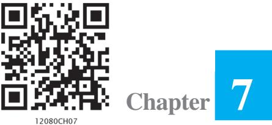
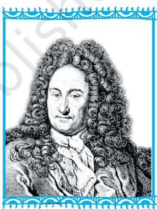
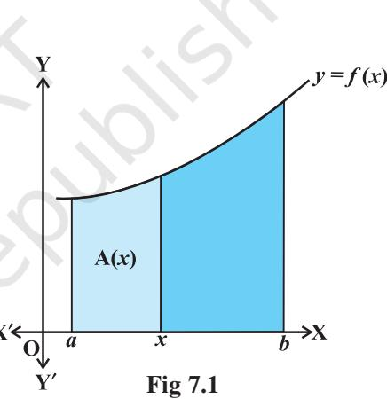

v *Just as a mountaineer climbs a mountain – because it is there, so a good mathematics student studies new material because it is there. — JAMES B. BRISTOL* v

## **7.1 Introduction**

Differential Calculus is centred on the concept of the derivative. The original motivation for the derivative was the problem of defining tangent lines to the graphs of functions and calculating the slope of such lines. Integral Calculus is motivated by the problem of defining and calculating the area of the region bounded by the graph of the functions.

If a function *f* is differentiable in an interval I, i.e., its derivative *f* ′exists at each point of I, then a natural question arises that given *f* ′at each point of I, can we determine the function? The functions that could possibly have given function as a derivative are called anti derivatives (or primitive) of the function. Further, the formula that gives

**G .W. Leibnitz (1646 -1716)**

all these anti derivatives is called the *indefinite integral* of the function and such process of finding anti derivatives is called integration. Such type of problems arise in many practical situations. For instance, if we know the instantaneous velocity of an object at any instant, then there arises a natural question, i.e., can we determine the position of the object at any instant? There are several such practical and theoretical situations where the process of integration is involved. The development of integral calculus arises out of the efforts of solving the problems of the following types:

- (a) the problem of finding a function whenever its derivative is given,
- (b) the problem of finding the area bounded by the graph of a function under certain conditions.

These two problems lead to the two forms of the integrals, e.g., indefinite and definite integrals, which together constitute the *Integral Calculus*.

There is a connection, known as the *Fundamental Theorem of Calculus*, between indefinite integral and definite integral which makes the definite integral as a practical tool for science and engineering. The definite integral is also used to solve many interesting problems from various disciplines like economics, finance and probability.

In this Chapter, we shall confine ourselves to the study of indefinite and definite integrals and their elementary properties including some techniques of integration.

## **7.2 Integration as an Inverse Process of Differentiation**

*e*

= *e x*

Integration is the inverse process of differentiation. Instead of differentiating a function, we are given the derivative of a function and asked to find its primitive, i.e., the original function. Such a process is called *integration* or *anti differentiation*. Let us consider the following examples:

We know that 
$$\frac{d}{dx}\left(\sin\,x\right)$$

$$\frac{d}{dx}\left(\sin\,x\right)=\cos\,x\tag{1}$$
 
$$\frac{d}{dx}\left(\frac{x^{3}}{3}\right)=x^{2}$$

... (3)

and ( ) *d x*

*dx* We observe that in (1), the function cos *x* is the derived function of sin *x*. We say that sin *x* is an anti derivative (or an integral) of cos *x*. Similarly, in (2) and (3), 3 3 *x* and *e x* are the anti derivatives (or integrals) of *x* 2 and *e x* , respectively. Again, we note that for any real number C, treated as constant function, its derivative is zero and hence, we can write (1), (2) and (3) as follows :

$\frac{d}{dx}\left(\sin x+\mathrm{C}\right)=\cos x\,,\,\frac{d}{dx}\left(\frac{x^{3}}{3}+\mathrm{C}\right)=x^{2}$ and $\frac{d}{dx}\left(e^{x}+\mathrm{C}\right)=e^{x}$.  
  

Thus, anti derivatives (or integrals) of the above cited functions are not unique. Actually, there exist infinitely many anti derivatives of each of these functions which can be obtained by choosing C arbitrarily from the set of real numbers. For this reason C is customarily referred to as *arbitrary constant*. In fact, C is the *parameter* by varying which one gets different anti derivatives (or integrals) of the given function.

More generally, if there is a function F such that F ( ) = ( ) *d x f x dx* , ∀ *x* ∈ I (interval), then for any arbitrary real number C, (also called *constant of integration*)

$${\frac{d}{d x}}\left[\operatorname{F}\left(x\right)+\operatorname{C}\right]=f(x),\,x\in\,\operatorname{I}$$

Thus, {F + C, C ∈ **R**} denotes a family of anti derivatives of *f*.

*Remark* Functions with same derivatives differ by a constant. To show this, let *g* and *h* be two functions having the same derivatives on an interval I.

Consider the function *f* = *g* – *h* defined by *f*(*x*) = *g*(*x*) – *h*(*x*), ∀ *x* ∈ I

Then

$\frac{df}{dx}=f^{\prime}=g^{\prime}-h^{\prime}$ giving $f^{\prime}(x)=g^{\prime}(x)-h^{\prime}(x)\ \forall\ x\in\mathbb{I}$

or *f*′(*x*) = 0, ∀ *x* ∈ I by hypothesis,

i.e., the rate of change of *f* with respect to *x* is zero on I and hence *f* is constant.

In view of the above remark, it is justified to infer that the family {F + C, C ∈ **R**} provides all possible anti derivatives of *f*.

We introduce a new symbol, namely, *f x dx* ( ) ∫ which will represent the entire class of anti derivatives read as the indefinite integral of *f* with respect to *x*.

Symbolically, we write $\int f(x)\,dx=\mathrm{F}\left(x\right)+\mathrm{C}$.  
  

  
  
**Notation** Given that $\frac{dy}{dx}=f\left(x\right),$ we write $y=\int f\left(x\right)dx,$

For the sake of convenience, we mention below the following symbols/terms/phrases with their meanings as given in the Table (7.1).

| Symbols/Terms/Phrases | Meaning |
| --- | --- |
| ∫ f ( ) x dx | Integral of f with respect to x |
| f(x) in ∫ f ( x ) dx | Integrand |
| x in ∫ f ( x ) dx | Variable of integration |
| Integrate | Find the integral |
| An integral of f | A function F such that F′(x) = f (x) |
| Integration | The process of finding the integral |
| Constant of Integration | Any real number C, considered as constant function |

**Table 7.1**

We already know the formulae for the derivatives of many important functions. From these formulae, we can write down immediately the corresponding formulae (referred to as standard formulae) for the integrals of these functions, as listed below which will be used to find integrals of other functions.

### **Derivatives Integrals (Anti derivatives)**

|  |  | + | n | 1 | d | x | + | n | 1 | x | n | = |  |  | x | ∫ | n | = | + | x | dx | C | ≠ –1 | (i) | ; | , n |
| --- | --- | --- | --- | --- | --- | --- | --- | --- | --- | --- | --- | --- | --- | --- | --- | --- | --- | --- | --- | --- | --- | --- | --- | --- | --- | --- |
| + | dx | n | 1 |  |  | + | n | 1 |  |  |  |  |  |  |  |  |  |  |  |  |  |  |  |  |  |  |
| Particularly, we note that | d |  |  |  |  |  |  |  |  |  |  |  |  |  |  |  |  |  |  |  |  |  |  |  |  |  |
| ) | ∫ | = | x | 1 | = | + | ( | dx | x | C | ; | dx |  |  |  |  |  |  |  |  |  |  |  |  |  |  |
| d | ) | ∫ | = | x | x | = | + | sin | cos | x dx | x | ( | cos | sin | C | (ii) | ; | dx |  |  |  |  |  |  |  |  |
| d | ) | ∫ | = | – cos | x | sin | x | = | + | ( | x dx | – | x | sin | cos | C | (iii) | ; | dx |  |  |  |  |  |  |  |
| d |  |  |  |  |  |  |  |  |  |  |  |  |  |  |  |  |  |  |  |  |  |  |  |  |  |  |
| ) | ∫ |  |  |  |  |  |  |  |  |  |  |  |  |  |  |  |  |  |  |  |  |  |  |  |  |  |
| 2 | 2 | = | tan | x | sec | x | = | + | ( | sec | x dx | tan | x | C | (iv) | ; | dx |  |  |  |  |  |  |  |  |  |
| d | ) | 2 | ∫ | 2 | = | – cot | x | cosec | x | = | + | ( | cosec | x dx | – | cot | x | C | (v) | ; | dx |  |  |  |  |  |
| d | ) | ∫ | = | sec | x | sec | x | tan | x | = | + | ( | sec | x | tan | x dx | sec | x | C | (vi) | ; | dx |  |  |  |  |
| d | ) | ∫ | = | x | x | x | = | + | – cosec | cosec | cot | x | x dx | x | ( | cosec | cot | – cosec | C | (vii) | ; | dx |  |  |  |  |
| d | 1 | dx |  |  |  |  |  |  |  |  |  |  |  |  |  |  |  |  |  |  |  |  |  |  |  |  |
| ) | ∫ |  |  |  |  |  |  |  |  |  |  |  |  |  |  |  |  |  |  |  |  |  |  |  |  |  |
| – 1 | – 1 | = | = | + | sin | x | sin | x | C | ( | (viii) | ; | dx | 2 | 2 | 1 | – x | 1 | – x |  |  |  |  |  |  |  |
| d | 1 | dx |  |  |  |  |  |  |  |  |  |  |  |  |  |  |  |  |  |  |  |  |  |  |  |  |
| ) | ∫ |  |  |  |  |  |  |  |  |  |  |  |  |  |  |  |  |  |  |  |  |  |  |  |  |  |
| – 1 | – 1 | = | = | + | x | – | x | – cos | cos | C | ( | (ix) | ; | dx | 2 | 2 | 1 | – x | 1 | – x |  |  |  |  |  |  |
| d | 1 | dx |  |  |  |  |  |  |  |  |  |  |  |  |  |  |  |  |  |  |  |  |  |  |  |  |
| ∫ |  |  |  |  |  |  |  |  |  |  |  |  |  |  |  |  |  |  |  |  |  |  |  |  |  |  |
| – 1 | – 1 | = | = | + | tan | x | tan | x | C | ( | ) | (x) | ; | 2 | 2 | dx | + | + | 1 | x | 1 | x |  |  |  |  |
| d | x | x | ∫ | x | x | = | ( | e | ) | e | = | + | e dx | e | C | (xi) | ; | dx |  |  |  |  |  |  |  |  |

(xii) $\frac{d}{dx}\big{(}\log|\,x|\big{)}=\frac{1}{x}$; $\int\frac{1}{x}\,dx=\log|\,x|+C$. (xiii) $\frac{d}{dx}\Bigg{(}\frac{a^{x}}{log\,a}\Bigg{)}=a^{x}$; $\int a^{x}dx=\frac{a^{x}}{log\,a}+C$.  
  

A**Note** In practice, we normally do not mention the interval over which the various functions are defined. However, in any specific problem one has to keep it in mind.

### **7.2.1** *Some properties of indefinite integral*

In this sub section, we shall derive some properties of indefinite integrals.

- (I) The process of differentiation and integration are inverses of each other in the sense of the following results :

$${\frac{d}{d x}}{\int}\,f(x)\,d x=f(x)$$

and *f x dx* ′( ) ∫ = *f*(*x*) + C, where C is any arbitrary constant.

**Proof** Let F be any anti derivative of *f*, i.e.,

*dx* ∫

* [16] M. C.  
  

Then  
  

$$\left(\begin{array}{c}\includegraphics[height=36.135pt]{./figures/.eps}\end{array}\right)f(x)\,dx=\mbox{F}(x)+\mbox{C}$$

Therefore ( ) *d*

$$f(x)\,d x={\frac{d}{d x}}\left(\mathrm{F}\left(x\right)+\mathrm{C}\right)$$

$$={\frac{d}{d x}}\operatorname{F}(x)=f(x)$$

Similarly, we note that

$$f^{\prime}(x)={\frac{d}{d x}}\,f(x)$$

and hence  
  

$$\int f^{\prime}(x)\,dx=f(x)+C$$

where C is arbitrary constant called constant of integration.

- (II) Two indefinite integrals with the same derivative lead to the same family of curves and so they are equivalent.
**Proof** Let *f* and *g* be two functions such that

$$\frac{d}{dx}\Big{[}\int f(x)\,dx-\int g\,(x)\,dx\Big{]}=0$$

Hence *f x dx – g x dx* ( ) ( ) ∫ ∫ = C, where C is any real number (Why?) or *f x dx* ( ) ∫ = *g x dx* ( ) C+ ∫

So the families of curves {∫ *f x dx* ( ) C , C R + ∈ 1 1 }

and  
  

$$\left\{\left|\int g(x)\,dx+C_{2},C_{2}\in R\right.\right\}$$
  
  
are identical.  
  

Hence, in this sense, *f x dx g x dx* ( ) and ( ) ∫ ∫ are equivalent.

A **Note** The equivalence of the families {∫ *f x dx* ( ) + C ,C1 1 ∈**R**} and {∫ *g x dx* ( ) + C ,C2 2 ∈**R**} is customarily expressed by writing *f x dx g x dx* ( ) = ( ) ∫ ∫ , without mentioning the parameter.

(III) $\int[f(x)+g(x)]\,dx=\int f(x)\,dx+\int g(x)\,dx$

**Proof** By Property (I), we have

$$\frac{d}{dx}\left[\left[\left[f(x)+g(x)\right]dx\right]=f(x)+g\left(x\right)\right.\tag{1}$$

On the otherhand, we find that

$$\frac{d}{dx}\left[\left[\int f(x)\,dx+\int g(x)\,dx\right]=\frac{d}{dx}\int f(x)\,dx+\frac{d}{dx}\int g(x)\,dx\right.$$
 
$$=f(x)+g\left(x\right)$$
... (2)  
  
$\left.\right.$  
  
$\left.\right.$  

Thus, in view of Property (II), it follows by (1) and (2) that

$\left(f(x)+g(x)\right)dx=\left\lceil f(x)\,dx+\right\rceil g(x)\,dx$.  
  

(IV) For any real number *k*, *k f x dx k f x dx* ( ) ( ) = ∫ ∫

  
  
**Proof** By the Property (I), $\frac{d}{dx}\int k\ f(x)\,dx=k\ f(x)\,.$

Also $\frac{d}{dx}\Big{[}k\int f(x)\,dx\Big{]}=\ k\,\frac{d}{dx}\Big{]}\,f(x)\,dx=k\ f(x)$

Therefore, using the Property (II), we have *k f x dx k f x dx* ( ) ( ) = ∫ ∫ .

- (V) Properties (III) and (IV) can be generalised to a finite number of functions *f* 1 , *f* 2 , ..., *f n* and the real numbers, *k*1 , *k*2 , ..., *kn* giving

$$\int[k_{1}f_{1}(x)+k_{2}f_{2}\ (x)+...+k_{n}f_{n}(x)]\,dx$$
 
$$=\ k_{1}\int f_{1}(x)\,dx+k_{2}\int f_{2}\ (x)\,dx+...+k_{n}\int f_{n}(x)\,dx\.$$

To find an anti derivative of a given function, we search intuitively for a function whose derivative is the given function. The search for the requisite function for finding an anti derivative is known as integration by the method of inspection. We illustrate it through some examples.

**Example 1** Write an anti derivative for each of the following functions using the method of inspection:

- (i) cos 2*x* (ii) 3*x* 2 + 4*x* 3 (iii) 1 *x* , *x* ≠ 0
### **Solution**

- (i) We look for a function whose derivative is cos 2*x*. Recall that
$\frac{d}{dx}\sin2x=2\cos2x$  
  
or $\cos2x=\frac{1}{2}\frac{d}{dx}$ ($\sin2x$) = $\frac{d}{dx}\biggl{(}\frac{1}{2}\sin2x\biggr{)}$

Therefore, an anti derivative of cos 2*x* is 1 sin 2 2 *x* .

- (ii) We look for a function whose derivative is 3*x* 2 + 4*x* 3 . Note that

$${\frac{d}{d x}}\left(x^{3}+x^{4}\right)=3x^{2}+4x^{3}.$$

Therefore, an anti derivative of 3*x* 2 + 4*x* 3 is *x*3 + *x* 4 .

(iii) We know that

$$\frac{d}{dx}\left(\log x\right)=\frac{1}{x},x>0\text{and}\frac{d}{dx}\left[\log\left(-x\right)\right]=\frac{1}{-x}\left(-1\right)=\frac{1}{x},x<0$$
  
  
Combining above, we get $\frac{d}{dx}\left(\log\left|x\right|\right)=\frac{1}{x},x\neq0$  
  
Therefore, $\int\frac{1}{x}\,dx=\log\left|x\right|$ is one of the anti derivatives of $\frac{1}{x}$.  
  

**Example 2** Find the following integrals:

(i) $\int\frac{x^{3}-1}{x^{2}}dx$ (ii) $\int(x^{\frac{2}{3}}+1)\,dx$ (iii) $\int(x^{\frac{3}{2}}+2\,e^{x}-\frac{1}{x})\,dx$

**Solution**

(i) We have

3 2 2 *x –* 1 *– dx x dx – x dx x* = ∫ ∫ ∫ (by Property V) = 1 1 2 1 C1 C2 1 1 2 1 *– x x – –* + + + + + + ; C1 , C2 are constants of integration = 2 1 C C 1 2 2 1 *– x x – – –* + = 2 1 2 1 + C C 2 *x – x* + = 2 1 + C 2 *x x* + , where C = C1 – C2 is another constant of integration.

A**Note** From now onwards, we shall write only one constant of integration in the final answer.

(ii) We have

$\left(x^{3}+1\right)dx=\left\lceil x^{3}\right\rceil dx+\left\lceil dx\right.$  
  
$\left.\begin{array}{c}\frac{2}{2}+1\\ x^{3}\end{array}+x+C=\frac{3}{5}x^{3}+x+C\right.$

3. We have $\int(x^{\frac{3}{2}}+2\,e^{x}-\frac{1}{x})\,dx=\int x^{\frac{3}{2}}\,dx+\int2\,e^{x}\,dx-\int\frac{1}{x}\,dx$. 
$$=\frac{x^{\frac{3}{2}+1}}{\frac{3}{2}+1}+2\,e^{x}-\log\left|x\right|+\mathrm{C}$$
 
$$=\frac{2}{5}\,x^{\frac{5}{2}}+2\,e^{x}-\log\left|x\right|+\mathrm{C}$$

**Example 3** Find the following integrals:

- (i) (sin cos ) *x x dx* + ∫ (ii) cosec (cosec cot ) *x x x dx* + ∫ (iii) 2 1 sin cos *– x dx x* ∫
### **Solution**

- (i) We have (sin cos ) sin cos *x x dx x dx x dx* + = + ∫ ∫ ∫ = – cos sin C *x x* + +
- (ii) We have

$\int(\operatorname{cosec}x\,(\operatorname{cosec}x+\cot x)\,dx=\int\operatorname{cosec}^{2}\tilde{x}\,dx+\int\operatorname{cosec}x\cot x\,dx$

  
  
## 1 Introduction  
  
The _Fractional State_ of the Universe is a fundamental problem in cosmology. The _Fractional State_ of the Universe is a fundamental problem in cosmology.  
  

- (iii) We have
$\frac{1-\sin x}{\cos^{2}x}\,dx=\left|\frac{1}{\cos^{2}x}\,dx-\right|\frac{\sin x}{\cos^{2}x}\,dx$  
  
$\left|\frac{\sin x}{\cos^{2}x}\,dx-\right|\tan x\sec x\,dx$  
  
$\left|\frac{\sin x}{\cos^{2}x}\,dx-\right|\tan x\sec x\,dx$  
  
$\left|\frac{\sin x}{\cos^{2}x}\,dx-\right|\tan x\sec x\,dx$  

**Example 4** Find the anti derivative F of *f* defined by *f* (*x*) = 4*x* 3 – 6, where F (0) = 3 **Solution** One anti derivative of *f* (*x*) is *x* 4 – 6*x* since

$${\frac{d}{d x}}(x^{4}-6x)\,=4x^{3}-6$$

Therefore, the anti derivative F is given by

F(*x*) = *x* 4 – 6*x* + C, where C is constant.

Given that F(0) = 3, which gives,

3 = 0 – 6 × 0 + C or C = 3

Hence, the required anti derivative is the unique function F defined by

F(*x*) = *x* 4 – 6*x* + 3.

## *Remarks*

- (i) We see that if F is an anti derivative of *f*, then so is F + C, where C is any constant. Thus, if we know one anti derivative F of a function *f*, we can write down an infinite number of anti derivatives of *f* by adding any constant to F expressed by F(*x*) + C, C ∈ **R**. In applications, it is often necessary to satisfy an additional condition which then determines a specific value of C giving unique anti derivative of the given function.
- (ii) Sometimes, F is not expressible in terms of elementary functions viz., polynomial, logarithmic, exponential, trigonometric functions and their inverses etc. We are

therefore blocked for finding *f x dx* ( ) ∫ . For example, it is not possible to find

2 *– x e dx* ∫ by inspection since we can not find a function whose derivative is 2 *– x e*

- (iii) When the variable of integration is denoted by a variable other than *x*, the integral formulae are modified accordingly. For instance

$$\int y^{4}\ dy={\frac{y^{4+1}}{4+1}}+C={\frac{1}{y^{5}}}+C$$

**EXERCISE 7.1**

Find an anti derivative (or integral) of the following functions by the method of inspection.

2*x*

- **1.** sin 2*x* **2.** cos 3*x* **3.** *e* **4.** (*ax* + *b*) 2 **5.** sin 2*x* – 4 *e* 3*x*
Find the following integrals in Exercises 6 to 20:

- **6.** 3 (4 + 1) *x e dx* ∫ **7.** 2 2 1 *x dx* (1 – ) *x* ∫ **8.** 2 ( ) *ax bx c dx* + + ∫ **9.** 2 (2 ) *x x e dx* + ∫ **10.** 2 1 *x – dx x* ∫ **11.** 3 2 2 *x x –* 5 4 *dx x* + ∫ **12.** 3 *x x*3 4 *dx x* + + ∫ **13.** 3 2 1 1 *x x x – dx x –* − + ∫ **14.** (1 ) *– x x dx* ∫
- **15.** 2 *x x x dx* ( 3 2 3) + + ∫ **16.** (2 3cos ) *x x – x e dx* + ∫ **17.** 2 (2 3sin 5 ) *x – x x dx* + ∫ **18.** sec (sec tan ) *x x x dx* + ∫
- **19.** 2 2 sec cosec *x dx x* ∫ **20.** 2 2 – 3sin cos *x x* ∫ *dx*.

Choose the correct answer in Exercises 21 and 22.

  
  
**21.**: The anti derivative of $\left(\sqrt{x}+\frac{1}{\sqrt{x}}\right)$ equals  
  

$$\begin{array}{ll}\cdot&\cdot\\ \frac{1}{3}x^{3}+2x^{2}+\mathbb{C}&\cdot\\ \cdot&\cdot\\ \frac{2}{3}x^{\frac{3}{2}}+2x^{\frac{1}{2}}+\mathbb{C}&\cdot\\ \cdot&\cdot\\ \end{array}$$
  
**22.**: If $\frac{d}{dx}f(x)=4x^{3}-\frac{3}{x^{4}}$ such that $f(2)=0$. Then $f(x)$ is  
  

$$\begin{array}{ll}\cdot&\cdot\\ \cdot&\cdot\\ \end{array}$$

* $x^{3}$ 8  
* $x^{4}+\frac{1}{x^{3}}+\frac{129}{8}$ (D) $x^{3}+\frac{1}{x^{4}}-\frac{129}{8}$

## **7.3 Methods of Integration**

In previous section, we discussed integrals of those functions which were readily obtainable from derivatives of some functions. It was based on inspection, i.e., on the search of a function F whose derivative is *f* which led us to the integral of *f*. However, this method, which depends on inspection, is not very suitable for many functions. Hence, we need to develop additional techniques or methods for finding the integrals by reducing them into standard forms. Prominent among them are methods based on:

- 1. Integration by Substitution
- 2. Integration using Partial Fractions
- 3. Integration by Parts

### **7.3.1** *Integration by substitution*

In this section, we consider the method of integration by substitution.

The given integral *f x dx* ( ) ∫ can be transformed into another form by changing the independent variable *x* to *t* by substituting *x* = *g* (*t*).

Consider I = *f x dx* ( ) ∫ Put *x* = *g*(*t*) so that *dx dt* = *g*′(*t*). We write *dx* = *g*′(*t*) *dt* Thus I = *f x dx f g t g t dt* ( ) ( ( )) ( ) = ′ ∫ ∫

This change of variable formula is one of the important tools available to us in the name of integration by substitution. It is often important to guess what will be the useful substitution. Usually, we make a substitution for a function whose derivative also occurs in the integrand as illustrated in the following examples.

**Example 5** Integrate the following functions w.r.t. *x*:

- (i) sin *mx* (ii) 2*x* sin (*x* 2 + 1) 1 *–*
(iii) $\tan^{4}\sqrt{x\sec^{2}\sqrt{x}}$ (iv) $\sin\left(\tan^{-1}x\right)$

### **Solution**

- (i) We know that derivative of *mx* is *m*. Thus, we make the substitution *mx* = *t* so that *mdx* = *dt*.
Therefore,  
  

$$\int\sin\,\dot{m}x\,dx=\frac{1}{m}\int\sin\,t\,dt=\,-\,\frac{1}{m}\cos\,t+C\,=-\,\frac{1}{m}\cos\,mx+C$$

- (ii) Derivative of *x* 2 + 1 is 2*x*. Thus, we use the substitution *x* 2 + 1 = *t* so that 2*x dx* = *dt*.
Therefore, 2 2 sin ( 1) sin *x x dx t dt* + = ∫ ∫ = – cos *t* + C = – cos (*x* 2 + 1) + C

- (iii) Derivative of *x* is 1 2 1 1 2 2 *– x x* = . Thus, we use the substitution
$\sqrt{x}=t$ so that $\frac{1}{2\sqrt{x}}\,dx=dt$ giving $\,dx=2t\,dt$.  
  

Thus,  
  

$$\int\frac{\tan^{4}\sqrt{x}\sec^{2}\sqrt{x}}{\sqrt{x}}\ dx=\int\frac{2t\tan^{4}t\sec^{2}t\ dt}{t}=2\int\tan^{4}t\ \sec^{2}t\ dt$$

Again, we make another substitution tan *t* = *u* so that sec2 *t dt* = *du*

Therefore, 4 2 4 2 tan sec 2 *t t dt u du* = ∫ ∫ = 5 2 C 5 *u* + = 2 5 tan C 5 *t* + (since *u* = tan *t*) = 2 5 tan C (since ) 5 *x t x* + = Hence, 4 2 tan sec *x x dx x* ∫ = 2 5 tan C 5 *x* +

**Alternatively**, make the substitution tan *x t* =

* Derivative of $\tan^{-1}x=\frac{1}{1+x^{2}}$. Thus, we use the substitution $\frac{1}{1+x^{2}}$.  
  

$\tan^{-1}x=t$ so that $\frac{dx}{1+x^{2}}=dt$.  
  

Therefore, $\int\frac{\sin\left(\tan^{-1}x\right)}{1+x^{2}}\,dx=\int\sin t\,dt=-\cos t+C=-\cos\left(\tan^{-1}x\right)+C$.  
  

Now, we discuss some important integrals involving trigonometric functions and their standard integrals using substitution technique. These will be used later without reference.

- **(i)** ∫ **tan = log sec + C** *x dx x*
We have

$$\int\tan x\,d x=\int{\frac{\sin x}{\cos x}}\,d x$$

Put cos *x* = *t* so that sin *x dx* = – *dt*

Then  
  

$$\int\tan\,x\,dx=-\int\frac{dt}{t}=-\log\left|t\right|+\mathrm{C}=-\log\left|\cos\,x\right|+\mathrm{C}$$
  
  
or  
  

$$\int\tan\,x\,dx=\log\left|\sec\,x\right|+\mathrm{C}$$

**(ii)** ∫ **cot = log sin + C** *x dx x*

We have $\int\cot x\,dx=\int\frac{\cos x}{\sin x}\,dx$.  
  

Put sin *x* = *t* so that cos *x dx* = *dt* Then cot *dt x dx t* = ∫ ∫ = log C *t* + = log sin C *x* +

#### **(iii)** ∫ **sec = log sec + tan + C** *x dx x x*

We have

$$\int\sec x\,d x=\int{\frac{\sec x\,(\sec x+\tan x)}{\sec x+\tan x}}\,d x$$

Put sec *x* + tan *x* = *t* so that sec *x* (tan *x* + sec *x*) *dx* = *dt* Therefore, sec log + C = log sec tan C *dt x dx t x x t* = = + + ∫ ∫

- **(iv)** ∫ **cosec = log cosec – cot + C** *x dx x x*
We have

$\left[\begin{array}{c}\text{cosec}x\ dx=\left[\begin{array}{c}\text{cosec}x\left(\text{cosec}x+\text{cot}x\right)\\ \text{(cosec}x+\text{cot}x\right)\end{array}\right]dx$

Put cosec *x* + cot *x* = *t* so that – cosec *x* (cosec *x* + cot *x*) *dx* = *dt*

So  
  

$$\int\text{cosec}x\ dx=-\int\frac{dt}{t}=-\log|t|=-\log|\text{cosec}x+\cot x|+\text{C}$$
 
$$=-\log\frac{\text{cosec}^{2}x-\cot^{2}x}{\text{cosec}x-\cot x}+\text{C}$$
 
$$=\log\left|\text{cosec}x-\cot x\right|+\text{C}$$

**Example 6** Find the following integrals:

(i) $\int\sin^{3}\,x\cos^{2}\,x\,dx$ (ii) $\int\frac{\sin\,x}{\sin\,(x+a)}\,dx$ (iii) $\int\frac{1}{1+\tan\,x}\,dx$

**Solution**

(i) We have

$\sin^{3}x\cos^{2}x\,dx=\int\sin^{2}x\cos^{2}x\,(\sin x)\,dx$  
  

$$=\int(1-\cos^{2}x)\cos^{2}x\,(\sin x)\,dx$$

Put *t* = cos *x* so that *dt* = – sin *x dx*

Therefore, $\int\sin^{2}x\cos^{2}x\left(\sin\,x\right)dx=-\int(1-t^{2})\,t^{2}\ dt$  
  

$$=-\int(t^{2}-t^{4})\ dt=-\left(\frac{t^{3}}{3}-\frac{t^{5}}{5}\right)+\mathrm{C}$$
 
$$=-\frac{1}{3}\cos^{3}x+\frac{1}{5}\cos^{5}x+\mathrm{C}$$

(ii) Put *x* + *a* = *t*. Then *dx* = *dt*. Therefore

$$\int\frac{\sin\,x}{\sin\,(x+a)}\,dx=\int\frac{\sin\,(t-a)}{\sin\,t}\,dt$$
 
$$=\int\frac{\sin\,t\,\cos\,a-\cos\,t\,\sin\,a}{\sin\,t}\,dt$$
 
$$=\cos\,a\int dt-\sin\,a\int\cot\,t\,dt$$
 
$$=\,(\cos\,a)\,t-(\sin\,a)\Big{[}\log\Big{|}\sin\,t\Big{|}+C_{1}\Big{]}$$
 
$$=\,(\cos\,a)\,(x+a)-(\sin\,a)\Big{[}\log\Big{|}\sin\,(x+a)\Big{|}+C_{1}\Big{]}$$
 
$$=\,x\cos\,a+a\cos\,a-(\sin\,a)\log\Big{|}\sin\,(x+a)\Big{|}-C_{1}\sin\,a$$

Hence, $\int\frac{\sin x}{\sin\left(x+a\right)}dx=x\cos a-\sin a\log\left|\sin\left(x+a\right)\right|+\mathrm{C}$,

where, C = – C1 sin *a* + *a* cos *a*, is another arbitrary constant.

(iii) $\int\frac{dx}{1+\tan\,x}=\int\frac{\cos x\,dx}{\cos x+\sin\,x}$  
  

$$\begin{split}&\includegraphics[scale=0.5]{0.5}{\includegraphics[scale=0.5]{0.5}}\frac{\cos x+\sin\,x+\cos\,x-\sin\,x)\,dx}{\cos x+\sin\,x}\\ &=\frac{1}{2}\int dx+\frac{1}{2}\int\frac{\cos\,x-\sin\,x}{\cos\,x+\sin\,x}\,dx\\ &=\frac{x}{2}+\frac{C_{1}}{2}+\frac{1}{2}\int\frac{\cos\,x-\sin\,x}{\cos\,x+\sin\,x}\,dx\end{split}$$
 (1)

Now, consider cos sin I cos sin *x – x dx x x* = + ∫ Put cos *x* + sin *x* = *t* so that (cos *x* – sin *x*) *dx* = *dt* Therefore 2 I log C *dt t t* = = + ∫ = 2 log cos sin C *x x* + + Putting it in (1), we get C1 C2 1 + + log cos sin 1 tan 2 2 2 2 *dx x x x x* = + + + ∫ = C C 1 2 1 + log cos sin 2 2 2 2 *x x x* + + + = C C 1 2 1 + log cos sin C C 2 2 2 2 *x x x ,* + + = + **EXERCISE 7.2**

Integrate the functions in Exercises 1 to 37:

**1.** 2 2 1 *x* + *x* **2.** ( )2 log *x x* **3.** 1 *x x x* + log **4.** sin sin (cos ) *x x* **5.** sin ( ) cos ( ) *ax b ax b* + + **6.** *ax b* + **7.** *x x* + 2 **8.** 2 *x x* 1 2 + **9.** 2 (4 2) 1 *x x x* + + + **10.** 1 *x – x* **11.** 4 *x x* + , *x* > 0 **12.** 1 3 5 3 ( 1) *x – x* **13.** 2 3 3 (2 3 ) *x* + *x* **14.** 1 (log )*m x x* , *x* > 0, *m* ≠1 **15.** 2 9 4 *x – x* **16.** 2 3 *x e* + **17.** 2 *x x e* **18.** 1 2 1 *– tan x e* + *x* **19.** 2 2 1 1 *x x e – e* + **20.** 2 2 2 2 *x – x x – x e – e e e* +

**21.** tan2 (2*x* – 3) **22.** sec2 (7 – 4*x*) **23.** 1 2 sin 1 *– x – x* **24.** 2cos 3sin 6cos 4sin *x – x x x* + **25.** 2 2 1 cos (1 tan ) *x – x* **26.** cos *x x* **27.** sin 2 cos 2 *x x* **28.** cos 1 sin *x* + *x* **29.** cot *x* log sin *x* **30.** sin 1 cos *x* + *x* **31.** ( )2 sin 1 cos *x* + *x* **32.** 1 1 cot + *x* **33.** 1 1 tan *– x* **34.** tan sin cos *x x x* **35.** ( ) 2 1 log *x x* + **36.** ( )2 ( 1) log *x x x x* + + **37.** ( ) 3 1 4 sin tan 1 *– x x x* 8 +

Choose the correct answer in Exercises 38 and 39.

  
  
**38.**: $\int\frac{10x^{9}+10^{x}\log_{e}10\ dx}{x^{10}+10^{x}}$ equals  
  
(A) $10^{x}-x^{10}+$C  
  
(C) $(10^{x}-x^{10})^{-1}+$C  
  
**39.**: $\int\frac{dx}{\sin^{2}x\cos^{2}x}$ equals  
  
(A) $\tan\ x+\cot\ x+$C  
  
(B) $\tan\ x-\cot\ x+$C  
  
(D) $\tan\ x-\cot\ 2x+$C

### **7.3.2** *Integration using trigonometric identities*

When the integrand involves some trigonometric functions, we use some known identities to find the integral as illustrated through the following example.

  
  
**Example 7**: Find (i) $\int\cos^{2}x\,dx$ (ii) $\int\sin\,2x\cos\,3x\,dx$ (iii) $\int\sin^{3}x\,dx$

### **Solution**

- (i) Recall the identity cos 2*x* = 2 cos2 *x* 1, which gives

$$\cos^{2}x=\frac{1+\cos2x}{2}$$
  
  
Therefore, 
$$\int\cos^{2}x\,dx=\frac{1}{2}\int(1+\cos2x)\,dx=\frac{1}{2}\int dx+\frac{1}{2}\int\cos2x\,dx$$
 
$$=\frac{x}{2}+\frac{1}{4}\sin2x+\mathbb{C}$$

(ii) Recall the identity sin *x* cos *y* = 1 2 [sin (*x* + *y*) + sin (*x* – *y*)] (Why?)

$$({\mathrm{Why?}})$$

Then $\int\sin2x\cos3x\,dx=\frac{1}{2}\left[\int\sin5x\,dx\right]\sin x\,dx$  
  

$$=\frac{1}{2}\left[\frac{1}{5}\cos5x+\cos x\right]+C$$

- (iii) From the identity sin 3*x* = 3 sin *x* 4 sin3 *x*, we find that
* [16] A. A. K.  
  

Therefore, 3 sin *x dx* ∫ = 3 1 sin sin 3 4 4 *x dx – x dx* ∫ ∫

$\begin{array}{c}\includegraphics[height=36.135pt]{fig1}\end{array}$

**Alternatively,**  3 2 sin sin sin *x dx x x dx* = ∫ ∫ = 2 (1 – cos ) sin *x x dx* ∫ Put cos *x* = *t* so that – sin *x dx* = *dt*

Therefore, $\int\sin^{3}x\,dx=-\int\left(1-t^{2}\right)dt=-\int dt+\int t^{2}\ dt=-\ t+\frac{t^{3}}{3}+\mathbb{C}$  
  

$$=-\cos x+\frac{1}{3}\cos^{3}x+\mathbb{C}$$

*Remark* It can be shown using trigonometric identities that both answers are equivalent.

## **EXERCISE 7.3**

Find the integrals of the functions in Exercises 1 to 22:

- **1.** sin2 (2*x* + 5) **2.** sin 3*x* cos 4*x* **3.** cos 2*x* cos 4*x* cos 6*x* **4.** sin3 (2*x +* 1) **5.** sin3 *x* cos3 *x* **6.** sin *x* sin 2*x* sin 3*x* **7.** sin 4*x* sin 8*x* **8.** 1 cos 1 cos *– x* + *x* **9.** cos 1 cos *x* + *x* **10.** sin4 *x* **11.** cos4 2*x* **12.** 2 sin 1 cos *x* + *x* **13.** cos 2 cos 2 cos cos *x – x –* α α **14.** cos sin 1 sin 2 *x – x* + *x* **15.** tan3 2*x* sec 2*x* **16.** tan4*x* **17.** 3 3 2 2 sin cos sin cos *x x x x* + **18.** 2 2 cos 2 2sin cos *x x x* + **19.** 3 1 sin cos *x x* **20.** ( ) 2 cos 2 cos sin *x x x* + **21.** sin – 1 (cos *x*) **22.** 1 cos ( ) cos ( ) *x – a x – b* Choose the correct answer in Exercises 23 and 24. **23.** 2 2 2 2 sin cos is equal to sin cos *x x dx x x* − ∫ (A) tan *x* + cot *x* + C (B) tan *x* + cosec *x* + C (C) – tan *x* + cot *x* + C (D) tan *x* + sec *x* + C **24.** 2 (1 ) equals cos ( ) *x x e x dx e x* + ∫ (A) – cot (*exx* ) + C (B) tan (*xex* ) + C (C) tan (*e x* ) + C (D) cot (*e x* ) + C
## **7.4 Integrals of Some Particular Functions**

In this section, we mention below some important formulae of integrals and apply them for integrating many other related standard integrals:

(1) $\left\{\frac{dx}{x^{2}-a^{2}}=\frac{1}{2a}\log\left|\frac{x-a}{x+a}\right|+\mathbf{C}\right\}$

$${\bf(2)}\quad\int{\frac{d x}{a^{2}-x^{2}}}={\frac{1}{2a}}\log\left|{\frac{a+x}{a-x}}\right|+{\bf C}$$

(3) $\frac{dx}{x^{2}+a^{2}}=\frac{1}{a}\tan^{-1}\frac{x}{a}+\frac{1}{a}$

$$\quad(4)\quad\left\lceil{\frac{d x}{\sqrt{x^{2}-a^{2}}}}\right\rceil=\log\left\lfloor x+{\sqrt{x^{2}-a^{2}}}\right\rfloor+\mathbf{C}$$

$$\begin{array}{r l}{({\bf5})}&{{}\int{\frac{d x}{\sqrt{a^{2}-x^{2}}}}=\sin^{-1}{\frac{x}{a}}+\mathbf{C}}\end{array}$$

$$\quad(6)\quad\left\lceil{\frac{d x}{\sqrt{x^{2}+a^{2}}}}=\log\left\vert x+{\sqrt{x^{2}+a^{2}}}\right\vert+\mathbf{C}\right\vert$$

We now prove the above results:

**(1)** We have 2 2 1 1 *x – a* ( ) ( ) *x – a x a* = + = 1 ( ) – ( ) 1 1 1 2 ( ) ( ) 2 *x a x – a – a x – a x a a x – a x a* + = + + Therefore, 2 2 1 2 *dx dx dx – x – a a x – a x a* = + ∫ ∫ ∫ = [ ] 1 log ( )| log ( )| C 2 *| x – a – | x a a* + + = 1 log C 2 *x – a a x a* + +

- **(2)** In view of (1) above, we have

$${\frac{1}{a^{2}-x^{2}}}={\frac{1}{2a}}\left[{\frac{\left(a+x\right)+\left(a-x\right)}{\left(a+x\right)\left(a-x\right)}}\right]={\frac{1}{2a}}\left[{\frac{1}{a-x}}+{\frac{1}{a+x}}\right]$$

Therefore, $\int\frac{dx}{a^{2}-x^{2}}=\frac{1}{2a}\bigg{[}\int\frac{dx}{a-x}+\int\frac{dx}{a+x}\bigg{]}$  
  

$$=\frac{1}{.2a}\left[-\log|a-x|+\log|a+x|\right]+\text{C}$$
 
$$=\frac{1}{2a}\log\left|\frac{a+x}{a-x}\right|+\text{C}$$

A**Note** The technique used in (1) will be explained in Section 7.5.

$$

**(3)**: Put x=a tan \theta. Then dx=a sec{}^{2}\thetad\theta.

Therefore, \int\frac{dx}{x^{2}+a^{2}}=\int\frac{a\sec^{2}\theta\ d\theta}{a^{2}\ \tan^{2}\theta+a^{2}}

=\frac{1}{a}\int d\theta\mbox{=}\frac{1}{a}\theta+C=\frac{1}{a}\tan^{-1}\frac{x}{a}+C
**(4)**: Let x=a sec\theta. Then dx=a sec\theta\tan\thetad\theta.

$$

Therefore,  
  

$$\int\frac{dx}{\sqrt{x^{2}-a^{2}}}=\int\frac{a\sec\theta\tan\theta\,d\theta}{\sqrt{a^{2}\sec^{2}\theta-a^{2}}}$$
 
$$=\int\sec\theta\,d\theta\equiv\log\left|\sec\theta+\tan\theta\right|+C_{1}$$
 
$$=\log\left|\frac{x}{a}+\sqrt{\frac{x^{2}}{a^{2}}-1}\right|+C_{1}$$
 
$$=\log\left|x+\sqrt{x^{2}-a^{2}}\right|-\log\left|a\right|+C_{1}$$
 
$$=\log\left|x+\sqrt{x^{2}-a^{2}}\right|+C,\,\text{where}\,C=C_{1}-\log\left|a\right|+C_{1}$$

- **(5)** Let *x* = *a* sinθ. Then *dx* = *a* cosθ dθ.
Therefore,  
  

$$\begin{array}{c}\includegraphics[width=142.26378pt]{Fig1}\frac{dx}{\sqrt{a^{2}-x^{2}}}=\int\frac{a\cos\theta\,d\theta}{\sqrt{a^{2}-a^{2}\,\sin^{2}\theta}}\\ \cdot\\ =\int d\theta=\theta+C=\sin^{-1}\frac{x}{a}+C\end{array}$$
  
  
Let $x=a$, $\tan\theta$. Then $dx=a\cos^{2}\theta\,d\theta$.  
  

**(6)** Let *x* = *a* tan θ. Then *dx* = *a* sec2θ dθ.

Therefore,  
  

$$\int\frac{dx}{\sqrt{x^{2}+a^{2}}}=\int\frac{a\sec^{2}\theta\,d\theta}{\sqrt{a^{2}\,\tan^{2}\theta+a^{2}}}$$
 
$$=\int\sec\theta\,d\theta=\log\left|(\sec\theta+\tan\theta)\right|+C_{1}$$

$$=\log\left|\frac{x}{a}+\sqrt{\frac{x^{2}}{a^{2}}+1}\right|+\mathrm{C}_{1}$$
 
$$=\log\left|x+\sqrt{x^{2}+a^{2}}\right|-\log\left|a\right|+\mathrm{C}_{1}$$
 
$$=\log\left|x+\sqrt{x^{2}+a^{2}}\right|+\mathrm{C},\,\,\text{where}\,\,\mathrm{C}=\mathrm{C}_{1}-\log\left|a\right|$$

Applying these standard formulae, we now obtain some more formulae which are useful from applications point of view and can be applied directly to evaluate other integrals.

- **(7) To find the integral** 2 *dx ax bx c* + + ∫ , we write *ax*2 + *bx* + *c* = 2 2 2 2 2 4 *b c b c b a x x a x – a a a a a* + + = + +
Now, put 2 *b x t a* + = so that *dx* = *dt* and writing 2 2 2 4 *c b – k a a* = ± . We find the

integral reduced to the form 2 2 1 *dt a t k* ± ∫ depending upon the sign of 2 2 4 *c b – a a* and hence can be evaluated.

- **(8) To find the integral of the type** , proceeding as in (7), we
obtain the integral using the standard formulae.

- **(9) To find the integral of the type** 2 *px q dx ax bx c* + + + ∫ , where *p*, *q*, *a*, *b*, *c* are constants, we are to find real numbers A, B such that
$px+q=\mbox{A}\,\frac{d}{dx}(ax^{2}+bx+c)+\mbox{B}=\mbox{A}\,(2ax+b)+\mbox{B}$.  
  

To determine A and B, we equate from both sides the coefficients of *x* and the constant terms. A and B are thus obtained and hence the integral is reduced to one of the known forms.

**(10) For the evaluation of the integral of the type** 2 ( ) *px q dx ax bx c* + + + ∫ , we proceed

> as in (9) and transform the integral into known standard forms. Let us illustrate the above methods by some examples.

**Example 8** Find the following integrals:

(i) $\int\frac{dx}{x^{2}-16}$ (ii) $\int\frac{dx}{\sqrt{2x-x^{2}}}$

**Solution**

(i) We have $\int\frac{dx}{x^{2}-16}=\int\frac{dx}{x^{2}-4^{2}}=\frac{1}{8}\log\left|\frac{x-4}{x+4}\right|+\mathrm{C}$ [by 7.4 (1)]

$${\mathrm{(ii)}}\quad\int{\frac{d x}{\sqrt{2x-x^{2}}}}=\int{\frac{d x}{\sqrt{1-\left(x-1\right)^{2}}}}$$

Put *x* – 1 = *t*. Then *dx* = *dt*.

Therefore,  
  

$$\int\frac{dx}{\sqrt{2x-x^{2}}}=\int\frac{dt}{\sqrt{1-t^{2}}}=\sin^{-1}(t)+C$$
 [by 7.4 (5)]

* [16] A. A. K.  
  

**Example 9** Find the following integrals :

(i) $\int\frac{dx}{x^{2}-6x+13}$ (ii) $\int\frac{dx}{3x^{2}+13x-10}$ (iii) $\int\frac{dx}{\sqrt{5x^{2}-2x}}$

### **Solution**

(i) We have $x^{2}-6x+13=x^{2}-6x+3^{2}-3^{2}+13=(x-3)^{2}+4$.  
  

So,  
  

$$\int\frac{dx}{x^{2}-6x+13}=\int\frac{1}{\left(x-3\right)^{2}+2^{2}}\,dx$$

Let $\chi-3=t$. Then $dx=dt$

Therefore,  
  

$$\int\frac{dx}{x^{2}-6x+13}=\int\frac{dt}{t^{2}+2^{2}}=\frac{1}{2}\tan^{-1}\frac{t}{2}+\mathrm{C}$$
 [by 7.4 (3)] 
$$=\frac{\cdot}{2}\tan^{-1}\frac{x-3}{2}+\mathrm{C}$$

- (ii) The given integral is of the form 7.4 (7). We write the denominator of the integrand,

$$3x^{2}+13x-10=3\Bigg{(}x^{2}+\frac{13x}{3}-\frac{10}{3}\Bigg{)}$$
 
$$=3\Bigg{[}\Bigg{(}x+\frac{13}{6}\Bigg{)}^{2}-\Bigg{(}\frac{17}{6}\Bigg{)}^{2}\Bigg{]}$$
 (completing the square)

Thus $\int\frac{dx}{3x^{2}+13x-10}=\frac{1}{3}\int\frac{dx}{\left(x+\frac{13}{6}\right)^{2}-\left(\frac{17}{6}\right)^{2}}$

Put 13 6 *x t* + = . Then *dx* = *dt*.

Therefore, $\int\frac{dx}{3x^{2}+13x-10}=\frac{1}{3}\int\frac{dt}{t^{2}-\left(\frac{17}{6}\right)^{2}}$

$\begin{array}{c}\includegraphics[height=36.135pt]{Fig1}\end{array}$

$$=\frac{1}{17}\log\left|\frac{x+\frac{13}{6}-\frac{17}{6}}{x+\frac{13}{6}+\frac{17}{6}}+\mathrm{C}_{1}\right.$$
 
$$=\frac{1}{17}\log\left|\frac{6x-4}{6x+30}\right|+\mathrm{C}_{1}$$
 
$$=\frac{1}{17}\log\left|\frac{3x-2}{x+5}\right|+\mathrm{C}_{1}+\frac{1}{17}\log\frac{1}{3}$$
 
$$\cdot$$
 
$$=\frac{1}{17}\log\left|\frac{3x-2}{x+5}\right|+\mathrm{C}\,,\,\mathrm{where}\,\mathrm{C}=\mathrm{C}_{1}+\frac{1}{17}\log\frac{1}{3}$$

(iii) We have $\int\!\frac{dx}{\sqrt{5x^{2}-2x}}=\int\!\frac{dx}{\sqrt{5\!\left(x^{2}-\frac{2x}{5}\right)}}$  
  

$$=\frac{1}{\sqrt{5}}\int\frac{dx}{\sqrt{\!\left(x-\frac{1}{5}\right)^{2}-\!\left(\frac{1}{5}\right)^{2}}}\;\;(\text{completing the square})$$

Put $x-\frac{1}{5}=t$. Then $dx=dt$.  
  
Therefore,  
  

$$\int\frac{dx}{\sqrt{5x^{2}-2x}}=\frac{1}{\sqrt{5}}\int\frac{dt}{\sqrt{t^{2}-\left(\frac{1}{5}\right)^{2}}}$$
  
  
[by 7.4 (4)]

**Example 10** Find the following integrals:

(i) $\int\frac{x+2}{2x^{2}+6x+5}\,dx$ (ii) $\int\frac{x+3}{\sqrt{5-4x-x^{2}}}\,dx$

### **Solution**

- (i) Using the formula 7.4 (9), we express
$x+2=\mbox{A}\,\frac{d}{dx}\Big{(}2x^{2}+6x+5\Big{)}+\mbox{B}=\mbox{A}\,(4x+6)+\mbox{B}$

Equating the coefficients of *x* and the constant terms from both sides, we get

4A = 1,and 6A + B = 2 or A = $\frac{1}{4}$ and B = $\frac{1}{2}$. Therefore, $\int\frac{x+2}{2x^{2}+6x+5}=\frac{1}{4}\int\frac{4x+6}{2x^{2}+6x+5}dx+\frac{1}{2}\int\frac{dx}{2x^{2}+6x+5}$ $=\frac{1}{4}\,\mathrm{I}_{1}+\frac{1}{2}\,\mathrm{I}_{2}$ (say)... (1)

In I1 , put 2*x* 2 + 6*x* + 5 = *t*, so that (4*x* + 6) *dx* = *dt* Therefore, I 1 = 1 log C *dt t t* = + ∫ = 2 1 log | 2 6 5 | C *x x* + + + ... (2)

and  
  

$$\mathrm{I}_{2}=\int\frac{dx}{2x^{2}+6x+5}=\frac{1}{2}\int\frac{dx}{x^{2}+3x+\frac{5}{2}}$$
  
  

$$=\frac{1}{2}\int\frac{dx}{\left(x+\frac{3}{2}\right)^{2}+\left(\frac{1}{2}\right)^{2}}$$

Put 3 2 *x t* + = , so that *dx* = *dt*, we get

$\mathbf{I}_{2}=\frac{1}{2}\left[\begin{array}{c}dt\\ t^{2}+\left(\frac{1}{2}\right)^{2}\end{array}\right]=\frac{1}{2\times\frac{1}{2}}\left[\begin{array}{c}\tan^{-1}2t+\mathbf{C}_{2}\end{array}\right.$ [by 7.4 (3)]

$$\left(\begin{array}{c}\includegraphics[height=36.135pt]{0.0pt}{\includegraphics[height=36.135pt]{0.0pt}}\\ \includegraphics[height=36.135pt]{0.0pt}{\includegraphics[height=36.135pt]{0.0pt}}\\ \end{array}\right)=\tan^{-1}2\left(\begin{array}{c}\includegraphics[height=36.135pt]{0.0pt}{\includegraphics[height=36.135pt]{0.0pt}}\\ \end{array}\right)+\mbox{C}_{2}=\tan^{-1}\left(2x+3\right)+\mbox{C}_{2}\qquad\qquad...\tag{3}$$

Using (2) and (3) in (1), we get

$$\int\frac{x+2}{2x^{2}+6x+5}\,dx=\frac{1}{4}\log\left|2x^{2}+6x+5\right|+\frac{1}{2}\tan^{-1}\left(2x+3\right)+\mathbb{C}$$

where, C =

$$\mathrm{C}={\frac{\mathrm{C}_{1}}{4}}+{\frac{\mathrm{C}_{2}}{2}}$$

- (ii) This integral is of the form given in 7.4 (10). Let us express

$$x+3=\mathrm{A}\,{\frac{d}{d x}}\,(5-4x-x^{2})+\mathrm{B}=\mathrm{A}\,(-4-2x)+\mathrm{B}$$

Equating the coefficients of *x* and the constant terms from both sides, we get

$-$ 2A = 1 and $-$ 4 A + B = 3, i.e., A = $-$ 2 and B = 1

Therefore, $\int\frac{x+3}{\sqrt{5-4x-x^{2}}}\,dx=\,-\frac{1}{2}\int\frac{\left(-4-2x\right)dx}{\sqrt{5-4x-x^{2}}}+\int\frac{dx}{\sqrt{5-4x-x^{2}}}$  
  

$$=\,-\frac{1}{2}\,\,\,\mathrm{I}_{{}_{1}}+\mathrm{I}_{{}_{2}}\hskip113.811024pt...\tag{1}$$

In I1 , put 5 – 4*x* – *x* 2 = *t*, so that (– 4 – 2*x*) *dx* = *dt*.

Therefore,  
  

$$\begin{split}\text{I}_{1}&=\int\frac{(-4-2x)dx}{\sqrt{5-4x-x^{2}}}=\int\frac{dt}{\sqrt{t}}=\cdot2\sqrt{t}+\text{C}_{1}\\ &=\cdot2\sqrt{5-4x-x^{2}}+\text{C}_{1}\end{split}\tag{2}$$
  
  
Now consider  
  

$$\text{I}_{2}=\int\frac{dx}{\sqrt{5-4x-x^{2}}}=\int\frac{dx}{\sqrt{9-(x^{2}+2)^{2}}}$$

Put *x* + 2 = *t*, so that *dx* = *dt*.

Therefore,  
  

$$\begin{array}{c}\includegraphics[width=142.26375pt]{Fig1}\end{array}$$

$$\begin{array}{c}\includegraphics[width=140.0pt]{28.45}\end{array}$$

Substituting (2) and (3) in (1), we obtain

$$\int\frac{x+3}{\sqrt{5-4x-x^{2}}}=-\sqrt{5-4x-x^{2}}\pm\sin^{-1}\frac{x+2}{3}+\text{C}\,,\,\,\text{where}\,\,\,\text{C}=\text{C}_{2}-\frac{\text{C}_{1}}{2}$$

**EXERCISE 7.4**

Integrate the functions in Exercises 1 to 23.

$$\frac{3x^{2}}{\sqrt{1+4x^{2}}}\frac{1}{\sqrt{\left(2-x\right)^{2}+1}}\frac{1}{\sqrt{9-25x^{2}}}\frac{3x}{1+2x^{4}}\frac{x^{2}}{1-x^{6}}\frac{x-1}{\sqrt{x^{2}-1}}\frac{x^{2}}{\sqrt{x^{6}+a^{6}}}\frac{\sec^{2}x}{\sqrt{\tan^{2}x+4}}$$

**10.** 2 1 *x x* + + 2 2 **11.** 2 1 9 6 5 *x x* + + **12.** 2 1 7 6 *– x – x* **13.** ( )( ) 1 *x – x –* 1 2 **14.** 2 1 8 3 + *x – x* **15.** ( )( ) 1 *x – a x – b* **16.** 2 4 1 2 3 *x x x –* + + **17.** 2 2 1 *x x –* + **18.** 2 5 2 1 2 3 *x x x* − + + **19.** ( )( ) 6 7 5 4 *x x – x –* + **20.** 2 2 4 *x x – x* + **21.** 2 2 2 3 *x x x* + + + **22.** 2 3 2 5 *x x – x* + − **23.** 2 5 3 4 10 *x x x* + + + .

Choose the correct answer in Exercises 24 and 25.

  
  
**24.**: $\int\!\frac{dx}{x^{2}+2x+2}$ equals  
  
(A) $x\tan^{-1}\left(x+1\right)+\mathrm{C}$ (B) $\tan^{-1}\left(x+1\right)+\mathrm{C}$  
  
(C) $\left(x+1\right)\tan^{-1}x+\mathrm{C}$ (D) $\tan^{-1}x+\mathrm{C}$  
**25.**: $\int\!\frac{dx}{\sqrt{9x-4x^{2}}}$ equals  
  
(A) $\frac{1}{9}\sin^{-1}\!\left(\frac{9x-8}{8}\right)+\mathrm{C}$ (B) $\frac{1}{2}\sin^{-1}\!\left(\frac{8x-9}{9}\right)+\mathrm{C}$  
  
(C) $\frac{1}{3}\sin^{-1}\!\left(\frac{9x-8}{8}\right)+\mathrm{C}$ (D) $\frac{1}{2}\sin^{-1}\!\left(\frac{9x-8}{9}\right)+\mathrm{C}$

### **7.5 Integration by Partial Fractions**

Recall that a rational function is defined as the ratio of two polynomials in the form P( ) *x* , where P (*x*) and Q(*x*) are polynomials in *x* and Q(*x*) ≠ 0. If the degree of P(*x*)

Q( ) *x*

is less than the degree of Q(*x*), then the rational function is called proper, otherwise, it is called improper. The improper rational functions can be reduced to the proper rational

functions by long division process. Thus, if $\dfrac{\mathrm{P}(x)}{\mathrm{Q}(x)}$ is improper, then $\dfrac{\mathrm{P}(x)}{\mathrm{Q}(x)}=\mathrm{T}(x)+\dfrac{\mathrm{P}_{1}(x)}{\mathrm{Q}(x)}$,

where T(*x*) is a polynomial in *x* and P ( ) 1 Q( ) *x x* is a proper rational function. As we know

how to integrate polynomials, the integration of any rational function is reduced to the integration of a proper rational function. The rational functions which we shall consider here for integration purposes will be those whose denominators can be factorised into

linear and quadratic factors. Assume that we want to evaluate P( ) Q( ) *x dx x* ∫ , where P( ) Q( ) *x x*

is proper rational function. It is always possible to write the integrand as a sum of simpler rational functions by a method called partial fraction decomposition. After this, the integration can be carried out easily using the already known methods. The following Table 7.2 indicates the types of simpler partial fractions that are to be associated with various kind of rational functions.

| S.No. | Form of the rational function Form of the partial fraction |
| --- | --- |
| 1. | A B px + q ≠ + , a b |
|  | x – a x – b ( x – a ) ( x – b ) |
| 2. | A B px + q + |
|  | x – a 2 x – a )2 ( ( x – a ) |
| 3. | 2 px + qx + r A B C + + |
|  | ( x – a ) ( x – b ) ( x – c ) x – a x – b x – c |
| 4. | 2 A B C px + qx + r + + |
|  | 2 2 x – a ( x – a ) x – b ( x – a ) ( x – b ) |
| 5. | 2 px + qx + r A B x + C |
|  | + , 2 |
|  | 2 ( x – a ) ( x + bx + c ) x – a + + x bx c |
|  | 2 where x + bx + c cannot be factorised further |

**Table 7.2**

In the above table, A, B and C are real numbers to be determined suitably.

**Example 11** Find ( 1) ( 2) *dx x x* + + ∫

**Solution** The integrand is a proper rational function. Therefore, by using the form of partial fraction [Table 7.2 (i)], we write

1 ( 1) ( 2) *x x* + + = A B *x x* 1 2 + + + ... (1)

where, real numbers A and B are to be determined suitably. This gives

$$1=\mathrm{A}\;(x+2)+\mathrm{B}\;(x+1).$$

Equating the coefficients of *x* and the constant term, we get

$$\begin{array}{l}{\mathrm{A+B=0}}\\ {\mathrm{2A+B=1}}\end{array}$$

Solving these equations, we get A =1 and B = – 1.

Thus, the integrand is given by

$\left(x+1\right)\left(x+2\right)=\left(x+1\right)\left(x+2\right)=\left(x+1\right)\left(x+2\right)$

Therefore,  
  

$$\begin{array}{c}\includegraphics[height=142.26375pt]{Fig1}\end{array}$$

*Remark* The equation (1) above is an identity, i.e. a statement true for all (permissible) values of *x*. Some authors use the symbol '≡' to indicate that the statement is an identity and use the symbol '=' to indicate that the statement is an equation, i.e., to indicate that the statement is true only for certain values of *x*.

  
  
## Example 12 Find $\int\frac{x^{2}+1}{x^{2}-5x+6}$

**Solution** Here the integrand 2 2 1 5 6 *x x – x* + + is not proper rational function, so we divide *x* 2 + 1 by *x* 2 – 5*x* + 6 and find that

$$\frac{x^{2}+1}{x^{2}-5x+6}=1+\frac{5x-5}{x^{2}-5x+6}=1+\frac{5x-5}{\left(x-2\right)\left(x-3\right)}$$
  
  
Let  
  

$$\frac{5x-5}{\left(x-2\right)\left(x-3\right)}=\frac{\text{A}}{x-2}+\frac{\text{B}}{x-3}$$
  
  
So that  
  

$$5x-5=\text{A}\left(x-3\right)+\text{B}\left(x-2\right)$$

Let

Equating the coefficients of *x* and constant terms on both sides, we get A + B = 5 and 3A + 2B = 5. Solving these equations, we get A = – 5 and B = 10

Thus,  
  

$$\frac{x^{2}+1}{x^{2}-5x+6}=1-\frac{5}{x-2}+\frac{10}{x-3}$$

Therefore,

or,  
  

$$\int\frac{x^{2}+1}{x^{2}-5x+6}\,dx=\int dx-5\int\frac{1}{x-2}\,dx+10\int\frac{dx}{x-3}$$
 
$$=x-5\,\log\{x-2\}+10\,\log\{x-3\}+\mbox{C}.$$

**Example 13** Find 2 3 2 ( 1) ( 3) *x dx x x* − + + ∫

**Solution** The integrand is of the type as given in Table 7.2 (4). We write

$$\frac{3x-2}{\left(x+1\right)^{2}\left(x+3\right)}=\frac{\text{A}}{x+1}+\frac{\text{B}}{\left(x+1\right)^{2}}+\frac{\text{C}}{x+3}$$
  
  
So that  
  

$$3x-2=\text{A}\left(x+1\right)^{2}\left(x+3\right)+\text{B}\left(x+3\right)+\text{C}\left(x+1\right)^{2}$$
 
$$=\text{A}\left(x^{2}+4x+3\right)+\text{B}\left(x+3\right)+\text{C}\left(x^{2}+2x+1\right)$$

Comparing coefficient of *x* 2 , *x* and constant term on both sides, we get A + C = 0, 4A + B + 2C = 3 and 3A + 3B + C = – 2. Solving these equations, we get

11 5 11 A B and C 4 2 4 *– –* = = = *,* . Thus the integrand is given by 2 3 2 ( 1) ( 3) *x x x* − + + = 2 11 5 11 4 ( 1) 2 ( 1) 4 ( 3) *– – x x* + *x* + + Therefore, 2 3 2 ( 1) ( 3) *x x x* − + + ∫ = 2 11 5 11 4 1 2 ( 1) 4 3 *dx dx dx – x x x* − + + + ∫ ∫ ∫ = 11 5 11 log +1 log 3 C 4 2 ( +1) 4 *x x x* + − + + = 11 +1 5 log + C 4 + 3 2 ( + 1) *x x x* +

  
  
**Example 14**: Find $\int\frac{x^{2}}{(x^{2}+1)\,(x^{2}+4)}dx$.  
  

  
  
**Solution** Consider $\frac{x^{2}}{\left(x^{2}+1\right)\left(x^{2}+4\right)}$ and put $x^{2}=y$.  
  

Then  
  

$$\frac{x^{2}}{\left(x^{2}+1\right)\left(x^{2}+4\right)}=\frac{y}{\left(y+1\right)\left(y+4\right)}$$

$${\mathrm{Write~}}\qquad\qquad{\frac{y}{(y+1)\,(y+4)}}={\frac{\mathrm{A}}{y+1}}+{\frac{\mathrm{B}}{y+4}}$$

So that *y* = A (*y* + 4) + B (*y* + 1)

Comparing coefficients of *y* and constant terms on both sides, we get A + B = 1 and 4A + B = 0, which give

Thus,  
  

$$\frac{x^{2}}{\left(x^{2}+1\right)\left(x^{2}+4\right)}=\frac{1}{3\left(x^{2}+1\right)}+\frac{4}{3\left(x^{2}+4\right)}$$
  
  
Therefore,  
  

$$\int\frac{x^{2}dx}{\left(x^{2}+1\right)\left(x^{2}+4\right)}=-\frac{1}{3}\int\frac{dx}{x^{2}+1}+\frac{4}{3}\int\frac{dx}{x^{2}+4}$$
  
  

$$=-\frac{1}{3}\tan^{-1}x+\frac{4}{3}\times\frac{1}{2}\tan^{-1}\frac{x}{2}+\text{C}$$
  
  

$$=-\frac{1}{3}\tan^{-1}x+\frac{2}{3}\tan^{-1}\frac{x}{2}+\text{C}$$

In the above example, the substitution was made only for the partial fraction part and not for the integration part. Now, we consider an example, where the integration involves a combination of the substitution method and the partial fraction method.

  
  
**Example 15**: Find $\left\{\frac{(3\sin\phi-2)\cos\phi}{5-\cos^{2}\phi-4\sin\phi}\right.d\phi$  
  
**Solution** Let $y=\sin\phi$

Then *dy* = cosφ *d*φ

Therefore, $\int\frac{(3\sin\phi-2)\cos\phi}{5-\cos^{2}\phi-4\sin\phi}\,d\phi=\int\frac{(3y-2)\,dy}{5-(1-y^{2})-4y}$  
  

$$=\int\frac{3y-2}{y^{2}-4y+4}\,dy$$
 
$$=\int\frac{3y-2}{\left(y-2\right)^{2}}=\mathrm{I}\left(\mathrm{say}\right)$$
 
$$\cdot$$
 
$$3y-2\qquad\mathrm{A}\qquad\mathrm{B}$$

Now, we write

$$\frac{3y-2}{\left(y-2\right)^{2}}=\frac{\text{A}}{y-2}+\frac{\text{B}}{\left(y-2\right)^{2}}$$
 [by Table 7.2 (2)]

Therefore, 3*y* – 2 = A (*y* – 2) + B

Comparing the coefficients of *y* and constant term, we get A = 3 and B – 2A = – 2, which gives A = 3 and B = 4.

Therefore, the required integral is given by

$$\begin{array}{l}\mbox{I}=\int[\frac{3}{y-2}+\frac{4}{\left(y-2\right)^{2}}]dy=3\int\frac{dy}{y-2}+4\int\frac{dy}{\left(y-2\right)^{2}}\\ \\ =3\log\left|y-2\right|+4\left(-\frac{1}{y-2}\right)+C\\ \\ =3\log\left|\sin\phi-2\right|+\frac{4}{2-\sin\phi}+C\\ \\ =3\log\left(2-\sin\phi\right)+\frac{4}{2-\sin\phi}+C\;\;\mbox{(since,2-\sin\phiis always positive)}\right.\end{array}$$

**Example 16** Find 2 2 1 ( 2) ( 1) *x x dx x x* + + + + ∫

**Solution** The integrand is a proper rational function. Decompose the rational function into partial fraction [Table 2.2(5)]. Write

$$\frac{x^{2}+x+1}{\left(x^{2}+1\right)\left(x+2\right)}=\frac{\mathrm{A}}{x+2}+\frac{\mathrm{B}x+\mathrm{C}}{\left(x^{2}+1\right)}$$
  
  
Therefore,  
  

$$x^{2}+x+1=\mathrm{A}\left(x^{2}+1\right)+\left(\mathrm{B}x+\mathrm{C}\right)\left(x+2\right)$$

Equating the coefficients of *x* 2 , *x* and of constant term of both sides, we get A + B =1, 2B + C = 1 and A + 2C = 1. Solving these equations, we get 3 2 1 A , B and C 5 5 5 = = =

Thus, the integrand is given by

2 2 1 ( 1) ( 2) *x x x x* + + + + = 2 2 1 3 5 5 5 ( 2) 1 *x x x* + + + + = 2 3 1 2 1 5 ( 2) 5 1 *x x x* + + + + Therefore, 2 2 1 ( +1) ( 2) *x x dx x x* + + + ∫ = 2 2 3 1 2 1 1 5 2 5 1 5 1 *dx x dx dx x x x* + + + + + ∫ ∫ ∫ = 3 1 2 1 1 log 2 log 1 tan C 5 5 5 *– x* + + + + + *x x*

## **EXERCISE 7.5**

Integrate the rational functions in Exercises 1 to 21.

- **1.** ( 1) ( 2) *x x x* + + **2.** 2 1 *x –* 9 **3.** 3 1 ( 1) ( 2) ( 3) *x – x – x – x –* **4.** ( 1) ( 2) ( 3) *x x – x – x –* **5.** 2 2 3 2 *x x x* + + **6.** 2 1 (1 2 ) *– x x – x* **7.** 2 ( 1) ( – 1) *x x x* + **8.** 2 ( 1) ( 2) *x x – x* + **9.** 3 2 3 5 1 *x x – x x* + − + **10.** 2 2 3 ( 1) (2 3) *x x – x* − + **11.** 2 5 ( 1) ( 4) *x x x* + − **12.** 3 2 1 1 *x x x* + + − **13.** 2 2 (1 ) (1 ) − + *x x* **14.** 2 3 1 ( 2) *x – x* + **15.** 4 1 *x* −1 **16.** 1 ( 1) *n x x* + [Hint: multiply numerator and denominator by *x n* – 1 and put *x* **17.** cos (1 – sin ) (2 – sin ) *x x x* [Hint : Put sin *x* = *t*]
*n* = *t* ]

18. $\frac{\left(x^{2}+1\right)\left(x^{2}+2\right)}{\left(x^{2}+3\right)\left(x^{2}+4\right)}$ 19. $\frac{2x}{\left(x^{2}+1\right)\left(x^{2}+3\right)}$ 20. $\frac{1}{x\left(x^{4}-1\right)}$ 21. $\frac{1}{\left(e^{x}-1\right)}$ [Hint : Put $e^{x}=t$]

Choose the correct answer in each of the Exercises 22 and 23.

**22.** ( 1) ( 2) *x dx x x* − − ∫ equals (A) 2 ( 1) log C 2 *x x* − + − (B) 2 ( 2) log C 1 *x x* − + − (C) 2 1 log C 2 *x x* − + − (D) log ( 1) ( 2) C *x x* − − + **23.** 2 ( 1) *dx x x* + ∫ equals (A) 1 2 log log ( +1) + C 2 *x x* − (B) 1 2 log log ( +1) + C 2 *x x* + (C) 1 2 log log ( +1) + C 2 − + *x x* (D) 1 2 log log ( +1) + C 2 *x x* +

### **7.6 Integration by Parts**

In this section, we describe one more method of integration, that is found quite useful in integrating products of functions.

If *u* and *v* are any two differentiable functions of a single variable *x* (say). Then, by the product rule of differentiation, we have

$${\frac{d}{d x}}(u v)\,=\,u{\frac{d v}{d x}}+v{\frac{d u}{d x}}$$

Integrating both sides, we get

$$uv=\int u\frac{dv}{dx}\,dx+\int v\frac{du}{dx}\,dx$$
  
  
or  
  

$$\int u\frac{dv}{dx}\,dx=uv-\int v\frac{du}{dx}\,dx$$
  
  
Let  
  

$$u=f(x)\mbox{and}\frac{dv}{dx}=\mbox{g}\,(x).\mbox{Then}$$
  
  

$$\frac{du}{dx}=f^{\prime}(x)\mbox{and}v=\int g(x)\,dx$$

or

Therefore, expression (1) can be rewritten as

$$\int f(x)\,g(x)\,dx\,=\,f(x)\!\int g(x)\,dx-\int[\!\int g(x)\,dx]\,f^{\prime}(x)\,dx$$
  
  
i.e.,  
  

$$\int f(x)\,g\,(x)\,dx\,=\,f(x)\!\int g\,(x)\,dx-\int[\!\int^{\prime}(x)\int g(x)\,dx]\,dx$$

If we take *f* as the first function and *g* as the second function, then this formula may be stated as follows:

**"The integral of the product of two functions = (first function) × (integral of the second function) – Integral of [(differential coefficient of the first function)** *×* **(integral of the second function)]"**

**Example 17** Find *x x dx* cos ∫

**Solution** Put *f* (*x*) = *x* (first function) and *g* (*x*) = cos *x* (second function).

Then, integration by parts gives

function and the second function is significant.

$$\int x\cos x\,dx=x\int\cos x\,dx=\int[\frac{d}{dx}(x)\int\cos x\,dx]\,dx$$
 
$$=x\sin x-\int\sin x\,dx=x\sin x+\cos x+\mbox{C}$$
 
$$f(x)=\cos x\mbox{and}g(x)=x.\mbox{Then}$$
 
$$\int x\cos x\,dx=\cos x\int x\,dx-\int[\frac{d}{dx}(\cos x)\int x\,dx]\,dx$$
 
$$\left(\cos x\right)\frac{x^{2}}{\gamma}+\int\sin x\,\frac{x^{2}}{\gamma}\,dx$$

2 2 Thus, it shows that the integral *x x dx* cos ∫ is reduced to the comparatively more complicated integral having more power of *x*. Therefore, the proper choice of the first

## *Remarks*

- (i) It is worth mentioning that integration by parts is not applicable to product of functions in all cases. For instance, the method does not work for *x x dx* sin ∫ . The reason is that there does not exist any function whose derivative is *x* sin *x*.
- (ii) Observe that while finding the integral of the second function, we did not add any constant of integration. If we write the integral of the second function cos *x*

as sin *x* + *k*, where *k* is any constant, then

$$\int x\cos x\,dx=x\,(\sin\,x+k)-\int(\sin\,x+k)\,dx$$
 
$$=x\,(\sin\,x+k)-\int(\sin\,x\,dx-\int k\,dx$$
 
$$=x\,(\sin\,x+k)-\cos\,x-kx+C=x\sin\,x+\cos\,x+C$$

This shows that adding a constant to the integral of the second function is superfluous so far as the final result is concerned while applying the method of integration by parts.

- (iii) Usually, if any function is a power of *x* or a polynomial in *x*, then we take it as the first function. However, in cases where other function is inverse trigonometric function or logarithmic function, then we take them as first function.
**Example 18** Find log *x dx* ∫

**Solution** To start with, we are unable to guess a function whose derivative is log *x*. We take log *x* as the first function and the constant function 1 as the second function. Then, the integral of the second function is *x*.

Hence,  
  

$$\int(\log x.1)\,dx=\log x\int1\,dx-\int[\frac{d}{dx}(\log x)\int1\,dx]\,dx$$
 
$$=(\log x)x-x\int_{x}^{1}x\,dx=x\log x-x+C\,.$$

**Example 19** Find *x x e dx* ∫

**Solution** Take first function as *x* and second function as *e x* . The integral of the second function is *e x* .

Therefore, *x*

$\left|x\,e^{x}dx\right.=x\,e^{x}-\left|1\cdot e^{x}dx\right.=xe^{x}-e^{x}+\left.\right.$

**Example 20** Find 1 2 sin 1 *– x x dx* − *x* ∫

**Solution** Let first function be sin – 1*x* and second function be 2 1 *x* − *x* .

First we find the integral of the second function, i.e., 2 1 *x dx* − *x* ∫ .

Put *t* =1 – *x* 2 . Then *dt* = – 2*x dx*

Therefore,  
  

$$\int\frac{x\,dx}{\sqrt{1-x^{2}}}=-\frac{1}{2}\int\frac{dt}{\sqrt{t}}=-\sqrt{t}=-\sqrt{1-x^{2}}$$

Hence,  
  

$$\int\frac{x\sin^{-1}x}{\sqrt{1-x^{2}}}\,dx=\,(\sin^{-1}x)\left(-\sqrt{1-x^{2}}\,\right)-\int\frac{1}{\sqrt{1-x^{2}}}\,(\,-\sqrt{1-x^{2}}\,)\,dx$$
 
$$=\,-\sqrt{1-x^{2}}\,\sin^{-1}x+x+C\,=\,x-\sqrt{1-x^{2}}\,\sin^{-1}x+C$$

**Alternatively**, this integral can also be worked out by making substitution sin–1 *x* = θ and then integrating by parts.

  
  
## Example 21 Find $\int e^{x}$ sin $x$

**Solution** Take *e x* as the first function and sin *x* as second function. Then, integrating by parts, we have

$$\begin{array}{l}\mbox{I}=\int e^{x}\,\sin\,x\,dx=e^{x}\,(-\cos(x)+\int e^{x}\cos\,x\,dx\\ =-e^{x}\cos\,x+\mbox{I}_{1}\,\,(\mbox{say})_{\mbox{\tiny\backslash}}\end{array}\tag{1}$$

Taking *e x* and cos *x* as the first and second functions, respectively, in I1 , we get

$\mathbf{I}_{1}=e^{x}$ sin $x=1$ ($e^{x}$ sin $x=1$)

Substituting the value of I1 in (1), we get

$\Gamma=\frac{\varepsilon^{x}}{\varepsilon^{x}}\cos x+e^{x}\sin x\frac{\varepsilon^{x}}{\varepsilon^{x}}\Gamma$ or $2\Gamma=e^{x}\left(\sin x-\cos x\right)$

Hence,  
  

$$\mathrm{I}=\int\!e^{x}\sin\,x\,dx=\frac{e^{x}}{2}(\sin\,x-\cos\,x)+\mathrm{C}$$

**Alternatively**, above integral can also be determined by taking sin *x* as the first function and *e x* the second function.

**7.6.1** *Integral of the type* [ ( ) + ( )] *x e f x f x dx* ′ ∫

We have I = [ ( ) + ( )] *x e f x f x dx* ′ ∫ = ( ) + ( ) *x x e f x dx e f x dx* ′ ∫ ∫ = 1 1 I ( ) , where I = ( ) *x x* + *e f x dx* ′ *e f x dx* ∫ ∫ ... (1)

Taking *f*(*x*) and *e x* as the first function and second function, respectively, in I1 and integrating it by parts, we have I1 = *f* (*x*) *e x –* ( ) C *x f x e dx* ′ + ∫ Substituting I1 in (1), we get

$\mathrm{I}=e^{x}f(x)-\int f^{\prime}(x)\,e^{x}dx+\int e^{x}f^{\prime}(x)\,dx+\mathrm{C}\,=e^{x}f(x)+\mathrm{C}\,.$

Thus,  
  

$$\int e^{x}[\,f(x)+f^{\prime}(x)]dx\ =\ e^{x}f(x)+C$$

  
  
**Example 22**: Find (i) $\int e^{x}(\tan^{-1}x+\frac{1}{1+x^{2}})\,dx$ (ii) $\int\frac{(x^{2}+1)\,e^{x}}{\left(x+1\right)^{2}}\,dx$

### **Solution**

(i) We have $\mathrm{I}=\int e^{x}(\tan^{-1}x+\frac{1}{1+x^{2}})\,dx$.  
  

Consider *f*(*x*) = tan– 1*x*, then *f* ′(*x*) = 2 1 1+ *x* Thus, the given integrand is of the form *e x* [ *f* (*x*) + *f* ′(*x*)]. Therefore, 1 2 1 I (tan ) *x – e x dx* = + ∫ = *e x* tan– 1*x* + C

1

+

*x*

* We have $\mathrm{I}=\int\frac{\left(x^{2}+1\right)e^{x}}{\left(x+1\right)^{2}}\,dx=\int e^{x}\frac{x^{2}-1+1+1}{\left(x+1\right)^{2}}\,dx$.  
  

$$=\int e^{x}\left[\frac{x^{2}-1}{(x+1)^{2}}+\frac{2}{(x+1)^{2}}\right]dx=\int e^{x}\left[\frac{x-1}{x+1}+\frac{2}{(x+1)^{2}}\right]dx$$

Consider 1 ( ) 1 *x f x x* − = + , then 2 2 ( ) ( 1) *f x x* ′ = +

Thus, the given integrand is of the form *e x* [*f* (*x*) + *f* ′(*x*)].

Therefore,

$\left(\begin{array}{c}\frac{1}{2}+1\\ \frac{1}{2}+1\end{array}\right)$

### **EXERCISE 7.6**

Integrate the functions in Exercises 1 to 22.

- **1.** *x* sin *x* **2.** *x* sin 3*x* **3.** *x* 2 *e x* **4.** *x* log *x* **5.** *x* log 2*x* **6.** *x* 2 log *x* **7.** *x* sin– 1*x* **8.** *x* tan–1 *x* **9.** *x* cos–1 *x* **10.** (sin–1*x*) 2 **11.** 1 2 cos 1 *x x x* − − **12.** *x* sec2 *x* **13.** tan–1*x* **14.** *x* (log *x*) 2 **15.** (*x* 2 + 1) log *x*
  
  
**16.**: $e^{x}\left(\sin x+\cos x\right)$**17.**: $\frac{x\,e^{x}}{\left(1+x\right)^{2}}$**18.**: $e^{x}\left(\frac{1+\sin x}{1+\cos x}\right)$**19.**: $e^{x}\left(\frac{1}{x}-\frac{1}{x^{2}}\right)$**20.**: $\frac{\left(x-3\right)e^{x}}{\left(x-1\right)^{3}}$**21.**: $e^{2x}\sin x$**22.**: $\sin^{-1}\!\left(\frac{2x}{1+x^{2}}\right)$  
  
Choose the correct answer in Exercises 23 and 24.  
  

  
  
**23.**: $\int x^{2}e^{x^{3}}dx$ equals  
  
(A) $\frac{1}{3}e^{x^{3}}+C$  
  
(C) $\frac{1}{2}e^{x^{3}}+C$  
  
**24.**: $\int e^{x}\sec x\left(1+\tan x\right)dx$ equals  
  
(A) $e^{x}\cos x+C$  
  
(B) $e^{x}\sec x+C$  
  
(C) $e^{x}\sin x+C$

### **7.6.2** *Integrals of some more types*

Here, we discuss some special types of standard integrals based on the technique of integration by parts :

- (i) 2 2 *x a dx* − ∫ (ii) 2 2 *x a dx* + ∫ (iii) 2 2 *a x dx* − ∫ (i) Let 2 2 I = − *x a dx* ∫
Taking constant function 1 as the second function and integrating by parts, we have

$$\begin{array}{l}\mbox{I}=\ x\,\sqrt{x^{2}-a^{2}}-\int\!\frac{1}{2}\,\frac{2x}{\sqrt{x^{2}-a^{2}}}\,x\,dx\\ \mbox{.}\\ \mbox{}=\ x\,\sqrt{x^{2}-a^{2}}-\int\!\frac{x^{2}}{\sqrt{x^{2}-a^{2}}}\,dx\,=\,x\,\sqrt{x^{2}-a^{2}}-\int\!\frac{x^{2}-a^{2}+a^{2}}{\sqrt{x^{2}-a^{2}}}\,dx.\end{array}$$

= 2 2 2 2 2 2 2 *dx x x a x a dx a x a* − − − − − ∫ ∫ = 2 2 2 2 2 I *dx x x a a x a* − − − − ∫

$${\mathrm{or}}\qquad\qquad2\mathrm{I}=\,x\,{\sqrt{x^{2}-a^{2}}}-a^{2}\int{\frac{d x}{\sqrt{x^{2}-a^{2}}}}$$

or **I =** ∫ **2 2** Similarly, integrating other two integrals by parts, taking constant function 1 as the second function, we get

*x a*

**2**

*x a x x a*

**2 2 2 2 – – log + – + C**

(ii) $\int\sqrt{x^{2}+a^{2}}dx=\frac{1}{2}\,x\,\sqrt{x^{2}+a^{2}}+\frac{a^{2}}{2}\log\left|x+\sqrt{x^{2}+a^{2}}\right|+C$

**2 2** *x – a dx* **=**

(iii) $\int\sqrt{a^{2}-x^{2}}dx=\frac{1}{2}\,x\sqrt{a^{2}-x^{2}}+\frac{a^{2}}{2}\sin^{-1}\frac{x}{a}+C$

**Alternatively**, integrals (i), (ii) and (iii) can also be found by making trigonometric substitution *x* = *a* secθ in (i), *x* = *a* tanθ in (ii) and *x* = *a* sinθ in (iii) respectively.

**Example 23** Find 2 *x x dx* + + 2 5 ∫

**Solution** Note that

$$\int\sqrt{x^{2}+2x+5}\ dx=\int\sqrt{\left(x+1\right)^{2}+4}\ dx$$
  
  
Put $x+1=y$, so that $dx\equiv dy$. Then  
  

$$\int\sqrt{x^{2}+2x+5}\ dx=\int\sqrt{y^{2}+2^{2}}\ dy$$
 
$$=\frac{1}{2}\ y\sqrt{y^{2}+4}+\frac{4}{2}\log\left|\ y+\sqrt{y^{2}+4}\ \right|+\mathrm{C}\qquad\text{[using7.6.2(ii)]}$$
 
$$=\frac{1}{2}\left(x+1\right)\sqrt{x^{2}+2x+5}+2\log\left|\ x+1+\sqrt{x^{2}+2x+5}\ \right|+\mathrm{C}$$
  
  
**Example 24**: Find $\int\sqrt{3-2x-x^{2}}\ dx$  
  
**Solution**: Note that $\int\sqrt{3-2x-x^{2}}\ dx=\int\sqrt{4-\left(x+1\right)^{2}}\ dx$

Put *x* + 1 = *y* so that *dx* = *dy*. Thus 2 3 2 − −*x x dx* ∫ = 2 4 − *y dy* ∫ = 1 2 4 1 4 sin C 2 2 2 *– y y y* − + + [using 7.6.2 (iii)] = 1 2 1 1 ( 1) 3 2 2 sin C 2 2 *– x x x x* + + − − + + **EXERCISE 7.7** Integrate the functions in Exercises 1 to 9. **1.** 2 4 − *x* **2.** 2 1 4 − *x* **3.** 2 *x x* + + 4 6 **4.** 2 *x x* + + 4 1 **5.** 2 1 4 − −*x x* **6.** 2 *x x* + − 4 5 **7.** 2 1 3 + −*x x* **8.** 2 *x x* + 3 **9.** 2 1 9 *x* + Choose the correct answer in Exercises 10 to 11. **10.** 2 1+ *x dx* ∫ is equal to (A) ( ) 2 1 2 1 log 1 C 2 2 *x* + + + + + *x x x* (B) 3 2 2 2 (1 ) C 3 + + *x* (C) 3 2 2 2 (1 ) C 3 *x x* + + (D) 2 2 2 2 1 1 log 1 C 2 2 *x* + + + + + *x x x x* **11.** 2 *x x dx* − + 8 7 ∫ is equal to (A) 1 2 2 ( 4) 8 7 9log 4 8 7 C 2 *x x x x x x* − − + + − + − + + (B) 1 2 2 ( 4) 8 7 9log 4 8 7 C 2 *x x x x x x* + − + + + + − + + (C) 1 2 2 ( 4) 8 7 3 2 log 4 8 7 C 2 *x x x* − − + − − + − + + *x x x* (D) 1 2 9 2 ( 4) 8 7 log 4 8 7 C 2 2 *x x x* − − + − − + − + + *x x x*

## **7.7 Definite Integral**

In the previous sections, we have studied about the indefinite integrals and discussed few methods of finding them including integrals of some special functions. In this section, we shall study what is called definite integral of a function. The definite integral

has a unique value. A definite integral is denoted by ( ) *b a f x dx* ∫ , where *a* is called the

lower limit of the integral and *b* is called the upper limit of the integral. The definite integral is introduced either as the limit of a sum or if it has an anti derivative F in the interval [*a*, *b*], then its value is the difference between the values of F at the end points, i.e., F*(b)* – F*(a)*.

## **7.8 Fundamental Theorem of Calculus**

## **7.8.1** *Area function*

We have defined ( ) *b a f x dx* ∫ as the area of

the region bounded by the curve *y* = *f*(*x*), the ordinates *x* = *a* and *x* = *b* and *x*-axis. Let *x*

be a given point in [*a*, *b*]. Then ( ) *x a f x dx* ∫

represents the area of the light shaded region in Fig 7.1 [Here it is assumed that *f*(*x*) > 0 for *x* ∈ [*a*, *b*], the assertion made below is equally true for other functions as well]. The area of this shaded region depends upon the value of *x*.

In other words, the area of this shaded region is a function of *x*. We denote this function of *x* by A(*x*). We call the function A(*x*) as *Area function* and is given by

$$\mbox{A}\left(x\right)=\int_{a}^{x}f(x)dx\tag{1}$$

Based on this definition, the two basic fundamental theorems have been given. However, we only state them as their proofs are beyond the scope of this text book.

## **7.8.2** *First fundamental theorem of integral calculus*

**Theorem 1** Let *f* be a continuous function on the closed interval [*a*, *b*] and let A (*x*) be the area function. Then **A**′**(***x***) =** *f* **(***x***),** for all *x* ∈ **[***a***,** *b***]**.

### **7.8.3** *Second fundamental theorem of integral calculus*

We state below an important theorem which enables us to evaluate definite integrals by making use of anti derivative.

**Theorem 2** Let *f* be continuous function defined on the closed interval [*a*, *b*] and F be

an anti derivative of *f*. Then ∫ **( )** *b a f x dx* = **[F( )] =***b a x* **F (***b***) – F(***a***)**.

### *Remarks*

- (i) In words, the Theorem 2 tells us that ( ) *b a f x dx* ∫ = (value of the anti derivative F of *f* at the upper limit *b* – value of the same anti derivative at the lower limit *a*).
- (ii) This theorem is very useful, because it gives us a method of calculating the definite integral more easily, without calculating the limit of a sum.
- (iii) The crucial operation in evaluating a definite integral is that of finding a function whose derivative is equal to the integrand. This strengthens the relationship between differentiation and integration.
- (iv) In ( ) *b a f x dx* ∫ , the function *f* needs to be well defined and continuous in [*a*, *b*].

For instance, the consideration of definite integral 1 3 2 2 2 *x x dx* ( –1) ∫ − is erroneous

since the function *f* expressed by *f*(*x*) = 1 2 2 *x x*( –1) is not defined in a portion – 1 < *x* < 1 of the closed interval [– 2, 3].

**Steps for calculating** ( ) *b a f x dx* ∫ .

- (i) Find the indefinite integral *f x dx* ( ) ∫ . Let this be F(*x*). There is no need to keep integration constant C because if we consider F(*x*) + C instead of F(*x*), we get
$\int_{a}^{b}f(x)dx=[\mbox{F}(x)+\mbox{C}]_{a}^{b}=[\mbox{F}(b)+\mbox{C}]-[\mbox{F}(a)+\mbox{C}]=\mbox{F}(b)-\mbox{F}(a)$.  
  

Thus, the arbitrary constant disappears in evaluating the value of the definite integral.

- (ii) Evaluate F(*b*) F(*a*) = [F ( )]*b a x* , which is the value of ( ) *b a f x dx* ∫ .
We now consider some examples

**Example 25** Evaluate the following integrals:

(i) $\int_{2}^{3}x^{2}\ dx$ (ii) $\int_{4}^{9}\frac{\sqrt{x}}{\left(30-x^{2}\right)^{2}}\ dx$ (iii) $\int_{1}^{2}\frac{x\ dx}{\left(x+1\right)\left(x+2\right)}$ (iv) $\int_{0}^{\frac{\pi}{4}}\sin^{3}2t\cos2\,t\ dt$

**Solution**

- (i) Let 3 2 2 I = *x dx* ∫ . Since 3 2 F ( ) 3 *x x dx x* = = ∫ ,
Therefore, by the second fundamental theorem, we get

$$\mathrm{I}=\mathrm{F}\left(3\right)-\mathrm{F}\left(2\right)=\frac{27}{3}-\frac{8}{3}=\frac{19}{3}$$

- (ii) Let 9 3 4 2 2 I (30 – ) *x dx x* = ∫ . We first find the anti derivative of the integrand.
Put $30-x^{\frac{3}{2}}=t$. Then $-\frac{3}{2}\sqrt{x}\,dx=dt$ or $\sqrt{x}\,dx=-\frac{2}{3}\,dt$  
  
Thus, $\int\frac{\sqrt{x}\,dx}{3-dx}=-\frac{2}{3}\int\frac{dt}{t^{2}}=\frac{2}{3}\left[\frac{1}{t}\right]=\frac{2}{3}\left[\frac{1}{\left(30-x^{\frac{3}{2}}\right)}\right]=\mathrm{F}\left(x\right)$

Therefore, by the second fundamental theorem of calculus, we have

$$\begin{split}\text{I}&=\text{F}(9)-\text{F}(4)=\frac{2}{3}\Bigg{[}\frac{1}{\left(30-x^{2}\right)}\Bigg{]}_{4}^{9}\\ &=\frac{2}{3}\Bigg{[}\frac{1}{\left(30-27\right)}-\frac{1}{30-8}\Bigg{]}=\frac{2}{3}\Bigg{[}\frac{1}{3}-\frac{1}{22}\Bigg{]}=\frac{19}{99}\end{split}$$
  
  
(iii) Let $\text{I}=\int_{1}^{2}\frac{x\,dx}{\left(x+1\right)\left(x+2\right)}$

Using partial fraction, we get $\frac{x}{(x+1)\left(x+2\right)}=\frac{-1}{x+1}+\frac{2}{x+2}$

So  
  

$$\int\frac{x\,dx}{\left(x+1\right)\left(x+2\right)}=-\log\left|\ x+1\right|+2\log\left|\ x+2\right|=\mathrm{F}(x)$$

Therefore, by the second fundamental theorem of calculus, we have I = F(2) – F(1) = [– log 3 + 2 log 4] – [– log 2 + 2 log 3] = – 3 log 3 + log 2 + 2 log 4 = 32 log 27 (iv) Let 4 3 0 I sin 2 cos 2 *t t dt* π = ∫ . Consider 3 sin 2 cos 2 ∫ *t t dt*

> Put sin 2*t* = *u* so that 2 cos 2*t dt* = *du* or cos 2*t dt* = 1 2  *du*

So  
  

$$\left|\sin^{3}2t\cos2t\,dt=\frac{1}{2}\right|u^{3}du$$

[10] M. C. Gonzalez-Garcia, M. C. Gonzalez-Garcia, M.  
  

Therefore, by the second fundamental theorem of integral calculus

$\rm I=F(\frac{T}{4})-F(0)=\frac{1}{8}[\sin^{4}\frac{T}{2}-\sin^{4}0]=\frac{1}{8}$

**EXERCISE 7.8**

Evaluate the definite integrals in Exercises 1 to 20.

1. $\int_{-1}^{1}(x+1)\,dx$ 2. $\int_{2}^{3}\frac{1}{x}\,dx$ 3. $\int_{1}^{2}(4x^{3}-5x^{2}+6x+9)\,dx$  
4. $\int_{0}^{\frac{\pi}{4}}\sin2x\,dx$ 5. $\int_{0}^{\frac{\pi}{2}}\cos2x\,dx$ 6. $\int_{4}^{5}e^{x}dx$ 7. $\int_{0}^{\frac{\pi}{4}}\tan x\,dx$  
8. $\int_{0}^{\frac{\pi}{4}}\frac{dx}{\sqrt{1-x^{2}}}$ 10. $\int_{0}^{1}\frac{dx}{1+x^{2}}$ 11. $\int_{2}^{3}\frac{dx}{x^{2}-1}$

12. $\int_{0}^{\frac{\pi}{2}}\cos^{2}x\,dx$ **13.**$\int_{2}^{3}\frac{x\,dx}{x^{2}+1}$ **14.**$\int_{0}^{1}\frac{2\,x+3}{5x^{2}+1}\,dx$ **15.**$\int_{0}^{1}x\,e^{x^{2}}\,dx$ **16.**$\int_{1}^{2}\frac{5x^{2}}{x^{2}+4x+3}$ **17.**$\int_{0}^{\frac{\pi}{4}}(2\sec^{2}x+x^{3}+2)\,dx$ **18.**$\int_{0}^{\pi}(\sin^{2}\frac{x}{2}-\cos^{2}\frac{x}{2})\,dx$

  
  
**19.**$\int_{0}^{2}\frac{6x+3}{x^{2}+4}\,dx$ **20.**$\int_{0}^{1}(x\,e^{x}+\sin\frac{\pi x}{4})\,dx$

Choose the correct answer in Exercises 21 and 22.

  
  
**21.**: $\int_{1}^{\sqrt{3}}\frac{dx}{1+x^{2}}$ equals  
  
(A) $\frac{\pi}{3}$ (B) $\frac{2\pi}{3}$ (C) $\frac{\pi}{6}$ (D) $\frac{\pi}{12}$  
  
(A) $\frac{\pi}{6}$ (B) $\frac{\pi}{12}$ (C) $\frac{\pi}{24}$ (D) $\frac{\pi}{4}$

### **7.9 Evaluation of Definite Integrals by Substitution**

In the previous sections, we have discussed several methods for finding the indefinite integral. One of the important methods for finding the indefinite integral is the method of substitution.

To evaluate ( ) *b a f x dx* ∫ , by substitution, the steps could be as follows:

- 1. Consider the integral without limits and substitute, *y* = *f* (*x*) or *x* = *g*(*y*) to reduce the given integral to a known form.
- 2. Integrate the new integrand with respect to the new variable without mentioning the constant of integration.
- 3. Resubstitute for the new variable and write the answer in terms of the original variable.
- 4. Find the values of answers obtained in (3) at the given limits of integral and find the difference of the values at the upper and lower limits.

A**Note** In order to quicken this method, we can proceed as follows: After performing steps 1, and 2, there is no need of step 3. Here, the integral will be kept in the new variable itself, and the limits of the integral will accordingly be changed, so that we can perform the last step.

Let us illustrate this by examples.

  
  
**Example 26** Evaluate $\int_{-1}^{1}5x^{4}\sqrt{x^{5}+1}\ dx$.  
  

**Solution** Put *t* = *x*5 + 1, then *dt* = 5*x* 4 *dx*.

Therefore, 4 5 5 1 *x x dx* + ∫ = *t dt* ∫ = 3 2 2 3 *t* = 3 5 2 2 ( 1) 3 *x* +

Hence,

$\int_{-1}^{1}5x^{4}\sqrt{x^{5}+1}\ dx=\frac{2}{3}\left(x^{5}+1\right)^{2}$

$$={\frac{2}{3}}\left[(1^{5}+1)^{\frac{3}{2}}-((-1)^{5}+1\right]^{\frac{3}{2}}\right]$$

$$\left[{\frac{2}{3}}\left[{\frac{3}{2^{2}}}-0^{\frac{3}{2}}\right]={\frac{2}{3}}\left(2\,{\sqrt{2}}\right)={\frac{4\,{\sqrt{2}}}{3}}\right]$$

**Alternatively**, first we transform the integral and then evaluate the transformed integral with new limits.

Let  
  
Note that, when  
  
$x=-1$, $t=0$ and when $x=1$, $t=2$  
  
Thus, as $x$ varies from $-1$ to $1$, $t$ varies from $0$ to $2$  
  
Therefore  
  
$\left[\begin{array}{c}1\ 5x^{4}\sqrt{x^{5}+1}\ dx=\left[\begin{array}{c}2\sqrt{t}\ dt\\ \end{array}\right.\right.$

1

Therefore $\int_{-1}^{1}5x^{4}\sqrt{x^{5}+1}\ dx=\int_{0}^{2}\sqrt{t}\ dt$  
  

$$=\frac{2}{3}\left[t^{\frac{3}{2}}\right]_{0}^{2}=\frac{2}{3}\left[2^{\frac{3}{2}}-0^{\frac{3}{2}}\right]=\frac{2}{3}\left(2\sqrt{2}\right)=\frac{4\sqrt{2}}{3}$$
  
  
**Example 27** Evaluate $\int_{0}^{1}\frac{\tan^{-1}x}{1+x^{2}}\ dx$

**Solution** Let *t* = tan – 1*x*, then 2 1 1 *dt dx x* = + . The new limits are, when *x* = 0, *t* = 0 and when *x* = 1, 4 *t* π = . Thus, as *x* varies from 0 to 1, *t* varies from 0 to 4 π . Therefore –1 1 2 0 tan 1 *x dx* + *x* ∫ = 2 4 4 0 0 2 *t t dt* π π ∫ = 2 2 1 – 0 2 16 32 π π = **EXERCISE 7.9**

Evaluate the integrals in Exercises 1 to 8 using substitution.

- **1.** 1 2 0 1 *x dx x* + ∫ **2.** 2 5 0 sin cos *d* π φ φ φ ∫ **3.** 1 – 1 2 0 2 sin 1 *x dx x* + ∫ **4.** 2 0 *x x* + 2 ∫ (Put *x* + 2 = *t* 2 ) **5.** 2 2 0 sin 1 cos *x dx x* π + ∫ **6.** 2 2 0 4 – *dx x x* + ∫ **7.** 1 2 1 2 5 *dx x x* − + + ∫ **8.** 2 2 2 1 1 1 – 2 *x e dx x x* ∫
Choose the correct answer in Exercises 9 and 10.

  
  
**9.** The value of the integral $\int_{\frac{1}{3}}^{1}\frac{(x-x^{3})^{\frac{1}{3}}}{x^{4}}\,dx$ is  
  
(A) 6. (B) 0 (C) 3 (D) 4.  
  
**10.** If $f(x)=\int_{0}^{x}t\sin t\ dt$, then$f^{\prime}(x)$ is  
  
(A) $\cos x+x\ \sin x$ (B) $x\ \sin x$  
  
(C) $x\ \cos x$ (D) $\sin x+x\ \cos x$

## **7.10 Some Properties of Definite Integrals**

We list below some important properties of definite integrals. These will be useful in evaluating the definite integrals more easily.

$\mathbf{P_{0}}:\quad\int_{a}^{b}f(x)\,dx=\int_{a}^{b}f(t)\,dt$  
  
$\mathbf{P_{1}}:\quad\int_{a}^{b}f(x)\,dx=-\int_{b}^{a}f(x)\,dx\,.$ In particular, $\int_{a}^{a}f(x)\,dx=0$  
  
$\mathbf{P_{2}}:\quad\int_{a}^{b}f(x)\,dx=\int_{a}^{c}f(x)\,dx+\int_{c}^{b}f(x)\,dx$

**P3 :** ( ) ( ) *b b a a f x dx f a b x dx* = + − ∫ ∫ **P4 :** 0 0 ( ) ( ) *a a f x dx f a x dx* = − ∫ ∫ (Note that P4 is a particular case of P3 ) **P5 :** 2 0 0 0 ( ) ( ) (2 ) *a a a f x dx f x dx f a x dx* = + − ∫ ∫ ∫ **P6 :** 2 0 0 ( ) 2 ( ) , if (2 ) ( ) *a a f x dx f x dx f a x f x* = − = ∫ ∫ and 0 if *f* (2*a* – *x*) = – *f* (*x*) **P7 :** (i) 0 ( ) 2 ( ) *a a a f x dx f x dx* − = ∫ ∫ , if *f* is an even function, i.e., if *f* (– *x*) = *f* (*x*). (ii) ( ) 0 *a a f x dx* − = ∫ , if *f* is an odd function, i.e., if *f* (– *x*) = – *f* (*x*). We give the proofs of these properties one by one.

**Proof of P0** It follows directly by making the substitution *x* = *t*.

**Proof of P1** Let F be anti derivative of *f*. Then, by the second fundamental theorem of calculus, we have ( ) F ( ) – F ( ) – [F ( ) F ( )] ( ) *b a a b f x dx b a a b f x dx* = = − = − ∫ ∫ Here, we observe that, if *a* = *b*, then ( ) 0 *a a f x dx* = ∫ .

**Proof of P2** Let F be anti derivative of *f*. Then

$$\int_{a}^{b}f(x)\,dx={\rm F}(b)-{\rm F}(a)\tag{1}$$

$$\int_{a}^{c}f(x)\,dx={\rm F}(c)-{\rm F}(a)\tag{2}$$

and  
  

$$\int_{c}^{b}f(x)\,dx={\rm F}(b)-{\rm F}(c)\tag{3}$$

Adding (2) and (3), we get ( ) ( ) F( ) – F( ) ( ) *c b b a c a f x dx f x dx b a f x dx* + = = ∫ ∫ ∫ This proves the property P2 .

**Proof of P3** Let *t* = *a* + *b* – *x*. Then *dt* = – *dx*. When *x* = *a*, *t* = *b* and when *x* = *b*, *t* = *a*. Therefore

$\int_a^b f(x)\,dx\:=\:-\!\!\int_b^a f(a+b-t)\,dt$  
  
. 

$=\int_{a}^{b}f(a+b-t)\,dt$ (by P${}_{1}$)  
  
$=\int_{a}^{b}f(a+b-x)\,dx$ by P${}_{0}$

**Proof of P4** Put *t* = *a* – *x*. Then *dt* = – *dx*. When *x* = 0, *t* = *a* and when *x* = *a*, *t* = 0. Now proceed as in P3 .

**Proof of P5** Using P2 , we have 2 2 0 0 ( ) ( ) ( ) *a a a a f x dx f x dx f x dx* = + ∫ ∫ ∫ .

Let *t =* 2*a – x* in the second integral on the right hand side. Then *dt* = – *dx*. When *x* = *a*, *t* = *a* and when *x* = 2*a*, *t* = 0. Also *x* = 2*a* – *t*.

Therefore, the second integral becomes

$\int_{a}^{2a}f(x)\,dx=-\int_{a}^{0}f(2a-t)\,dt=\int_{0}^{a}f(2a-t)\,dt=\int_{0}^{a}f(2a-x)\,dx$.  
  

Hence

$\int_{0}^{2a}f(x)\,dx=\int_{0}^{a}f(x)\,dx+\int_{0}^{a}f(2a-x)\,dx$

  
  
**Proof of P${}_{6}$** Using P${}_{5}$, we have $\int_{0}^{2a}f(x)\,dx=\int_{0}^{a}f(x)\,dx+\int_{0}^{a}f(2a-x)\,dx$... (1) Now if $f(2a-x)=f(x)$ then (1) becomes

Now, if  
  

$$f(2a-x)=f(x),\,\,\mbox{then}\,\,(1)\,\,\mbox{becomes}$$

2 0 ( ) *a f x dx* ∫ = 0 0 0 ( ) ( ) 2 ( ) , *a a a f x dx f x dx f x dx* + = ∫ ∫ ∫ and if *f*(2*a* – *x*) = – *f*(*x*), then (1) becomes

$\int_{0}^{2a}f(x)dx=\int_{0}^{a}f(x)dx=0$.  
  

**Proof of P7** Using P2 , we have

$\int_{-a}^{a}f(x)\,dx=\int_{-a}^{0}f(x)\,dx+\int_{0}^{a}f(x)\,dx\,.$ Then

$t=-\,x$ in the first integral on the right hand side. $dt=-\,dx$. When $x=-\,a$, $t=a$ and when $x=0$, $t=0$. Also $x=-\,t$.  
  

Therefore  
  

$$\int_{-a}^{a}f(x)\,dx=-\int_{a}^{0}f(-t)\,dt+\int_{0}^{a}f(x)\,dx$$
 
$$=\int_{0}^{a}f(-x)\,dx+\int_{0}^{a}f(x)\,dx\qquad\mbox{(by P}_{0})\,\,\,...\,\,(1)$$

- (i) Now, if *f* is an even function, then *f*(–*x*) = *f*(*x*) and so (1) becomes

$$\int_{-a}^{a}f(x)d x=\int_{0}^{a}f(x)d x+\int_{0}^{a}f(x)d x=2\int_{0}^{a}f(x)d x$$

(ii) If *f* is an odd function, then *f*(–*x*) = – *f*(*x*) and so (1) becomes

$$\int_{-a}^{a}f(x)\,d x=-\int_{0}^{a}f(x)\,d x+\int_{0}^{a}f(x)\,d x=0$$

**Example 28** Evaluate 2 3 1 *x x dx* – ∫ −

**Solution** We note that *x* 3 – *x* ≥ 0 on [– 1, 0] and *x* 3 – *x* ≤ 0 on [0, 1] and that *x* 3 – *x* ≥ 0 on [1, 2]. So by P2 we write

2 3 1 *x x dx* – ∫ − = 0 1 2 3 3 3 1 0 1 ( – ) – ( – ) ( – ) *x x dx x x dx x x dx* − + + ∫ ∫ ∫ = 0 1 2 3 3 3 1 0 1 ( – ) ( – ) ( – ) *x x dx x x dx x x dx* − + + ∫ ∫ ∫ = 0 1 2 4 2 2 4 4 2 – 1 0 1 – – – 4 2 2 4 4 2 *x x x x x x* + + = ( ) 1 1 1 1 1 1 – – – 4 – 2 – – 4 2 2 4 4 2 + + = 1 1 1 1 1 1 – 2 4 2 2 4 4 2 + + − + − + = 3 3 11 2 2 4 4 − + = **Example 29** Evaluate 4 2 – 4 sin *x dx* π ∫ π

**Solution** We observe that sin2 *x* is an even function. Therefore, by P7 (i), we get

$\int\frac{\pi}{4}\sin^{2}x\,dx\,=\,2\int\frac{\pi}{4}\sin^{2}x\,dx$  
  
$\cdot$  
  
$=\,2\int\frac{\pi}{4}\frac{(1-\cos2x)}{2}\,dx\,=\,\int\frac{\pi}{4}(1-\cos2x)dx$

$$=\left[x-{\frac{1}{2}}\sin2x\right]_{0}^{\frac{\pi}{4}}=\left({\frac{\pi}{4}}-{\frac{1}{2}}\sin{\frac{\pi}{2}}\right)-0={\frac{\pi}{4}}-{\frac{1}{2}}$$

**Example 30** Evaluate 2 0 sin 1 cos *x x dx x* π + ∫

  
  
**Solution** Let $\mathrm{I}=\int_{0}^{\pi}\frac{x\sin x}{1+\cos^{2}x}\,dx\,.$ Then, by $\mathrm{P}_{4}$, we have  
  

$$\mathrm{I}=\int_{0}^{\pi}\frac{(\pi-x)\sin\,(\pi-x)\,dx}{1+\cos^{2}(\pi-x)}$$
 
$$=\int_{0}^{\pi}\frac{(\pi-x)\sin\,x\,dx}{1+\cos^{2}x}=\pi\int_{0}^{\pi}\frac{\sin\,x\,dx}{1+\cos^{2}x}-\mathrm{I}$$
  
  
or  
  

$$2\,\mathrm{I}=\pi\int_{0}^{\pi}\frac{\sin\,x\,dx}{1+\cos^{2}x}$$

$\pi\:\pi\int_0^{\text{-}\pi}\frac{\sin x\,dx}{1+\cos^2x}$  
  
.$\quad\pi\int_0^{\text{-}\pi}\sin x\,dx$  
  
. 

2 1 cos

∫

+

or I = 2 0

Put cos *x* = *t* so that – sin *x dx* = *dt*. When *x* = 0, *t* = 1 and when *x* = π, *t* = – 1. Therefore, (by P1 ) we get

$$\begin{array}{l}\mbox{I}=\frac{\pi}{2}\int_{1}^{-1}\frac{dt}{1+t^{2}}=\frac{\pi}{2}\int_{-1}^{1}\frac{dt}{1+t^{2}}\\ \mbox{}=\pi\int_{0}^{1}\frac{dt}{1+t^{2}}\;\;\mbox{(byP_{\gamma}since\frac{1}{1+t^{2}}is even function)}\\ \mbox{}=\pi\left[\tan^{-1}t\right]_{0}^{1}=\pi\left[\tan^{-1}1-\tan^{-1}0\right]=\pi\left[\frac{\pi}{4}-0\right]=\frac{\pi^{2}}{4}\end{array}

**sample 31** Evaluate \int_{-1}^{1}\sin^{5}x\cos^{4}x\,dx.

$$

*x*

**Example 31** Evaluate 1 sin cos *x x dx* ∫−

**Solution** Let I = 1 5 4 1 sin cos *x x dx* − ∫ . Let *f*(*x*) = sin5 *x* cos4 *x*. Then

*f* (– *x*) = sin5 (– *x*) cos4 (– *x*) = – sin5 *x* cos4 *x* = – *f* (*x*), i.e., *f* is an odd function. Therefore, by P7 (ii), I = 0

  
  
**Example 32** Evaluate $\int\frac{\pi}{2}\frac{\sin^{4}x}{\sin^{4}x+\cos^{4}x}\,dx$

  
  
**Solution** Let I = $\int\limits_{0}^{\frac{\pi}{2}}\frac{\sin^{4}x}{\sin^{4}x+\cos^{4}x}\,dx$... (1)

Then, by P4

$$\mathrm{I}=\int\limits_{0}^{\frac{\pi}{2}}\frac{\sin^{4}\left(\frac{\pi}{2}-x\right)}{\sin^{4}\left(\frac{\pi}{2}-x\right)+\cos^{4}\left(\frac{\pi}{2}-x\right)}\,dx=\int\limits_{0}^{\frac{\pi}{2}}\frac{\cos^{4}x}{\cos^{4}x+\sin^{4}x}\,dx\tag{2}$$

Adding (1) and (2), we get

$2\mathrm{I}=\int_{0}^{\frac{\pi}{2}}\frac{\sin^{4}x+\cos^{4}x}{\sin^{4}x+\cos^{4}x}\,dx=\int_{0}^{\frac{\pi}{2}}dx=\left[x\right]_{0}^{\frac{\pi}{2}}=\frac{\pi}{2}$

Hence I =

$$\mathrm{I}={\frac{\pi}{4}}$$

  
  
## Example 33 Evaluate $\int\frac{\pi}{1}\frac{dx}{1+\sqrt{\tan x}}$

  
  
**Solution**: Let I = $\int\frac{\pi}{6}\frac{\sqrt{dx}}{1+\sqrt{\tan x}}=\int\frac{\pi}{3}\frac{\sqrt{\cos x}\ dx}{\sqrt{\cos x}+\sqrt{\sin x}}$... (1)

Then, by P${}_{3}$ I = $\int_{\frac{\pi}{6}}^{\frac{\pi}{3}}\sqrt{\cos\left(\frac{\pi}{3}+\frac{\pi}{6}-x\right)}\,dx$  
  

$$=\int_{\frac{\pi}{6}}^{\frac{\pi}{3}}\frac{\sqrt{\sin x}}{\sqrt{\sin x}+\sqrt{\cos x}}\,dx\tag{2}$$

Adding (1) and (2), we get

$$2\mathrm{I}=\int{\frac{\pi}{{\frac{\pi}{6}}}}d x=\left[x\right]_{\frac{\pi}{6}}^{\frac{\pi}{3}}={\frac{\pi}{3}}-{\frac{\pi}{6}}={\frac{\pi}{6}}\,.$$

**Example 34** Evaluate 2 0 log sin *x dx* π ∫

**Solution** Let I = 2 0 log sin *x dx* π ∫

Then, by P4

$$\mathrm{I}=\int_{0}^{\frac{\pi}{2}}\log\sin\!\left({\frac{\pi}{2}}\!-\!x\right)\!d x\!=\!\int_{0}^{\frac{\pi}{2}}\!\log\cos x\,d x$$

Adding the two values of I, we get

$2\mathrm{I}=\int\frac{\pi}{2}(\log\sin x+\log\cos x)\,dx$  
  
$=\int\frac{\pi}{2}(\log\sin x\cos x+\log2-\log2)\,dx$ (by adding and subtracting $\log2$)  
  
$=\int\frac{\pi}{2}\log\sin2x\,dx-\int\frac{\pi}{2}\log2\,dx$ (Why?)

Put 2*x* = *t* in the first integral. Then 2 *dx* = *dt*, when *x* = 0, *t* = 0 and when 2 *x* π = , *t* = π.

Therefore 2I = 0 1 log sin log 2 2 2 *t dt* π π − ∫ = 2 0 2 log sin log 2 2 2 *t dt* π π − ∫ [by P6 as sin (π – *t*) = sin *t*) = 2 0 log sin log 2 2 *x dx* π π − ∫ (by changing variable *t* to *x*) = I log 2 2 π − Hence 2 0 log sin *x dx* π ∫ = – log 2 2 π .

## **EXERCISE 7.10**

By using the properties of definite integrals, evaluate the integrals in Exercises 1 to 19.

**1.** 2 2 0 cos *x dx* π ∫ **2.** 2 0 sin sin cos *x dx x x* π + ∫ **3.** 3 2 2 3 3 0 2 2 sin sin cos *x dx x x* π + ∫ **4.** 5 2 5 5 0 cos sin cos *x dx x x* π + ∫ **5.** 5 5 | 2 | *x dx* − + ∫ **6.** 8 2 *x dx* − 5 ∫ **7.** 1 0 (1 )*n x x dx* − ∫ **8.** 4 0 log (1 tan ) *x dx* π + ∫ **9.** 2 0 *x x dx* 2 − ∫ **10.** 2 0 (2log sin log sin 2 ) *x x dx* π − ∫ **11.** 22 – 2 sin *x dx* π ∫ π **12.** 0 1 sin *x dx x* π + ∫ **13.** 72 – 2 sin *x dx* π ∫ π **14.** 2 5 0 cos *x dx* π ∫ **15.** 2 0 sin cos 1 sin cos *x x dx x x* π − + ∫ **16.** 0 log (1 cos ) *x dx* π + ∫ **17.** 0 *a x dx x a x* + − ∫ **18.** 4 0 *x dx* −1 ∫ **19.** Show that 0 0 ( ) ( ) 2 ( ) *a a f x g x dx f x dx* = ∫ ∫ , if *f* and *g* are defined as *f*(*x*) = *f*(*a* – *x*) and *g*(*x*) + *g*(*a* – *x*) = 4 Choose the correct answer in Exercises 20 and 21. π

  
  
**20.** The value of $\int\limits_{\frac{\pi}{2}}^{\frac{\pi}{2}}(x^{3}+x\cos x+\tan^{5}x+1)\,dx$ is  
  
(A) 0. (B) 2 (C) $\pi$ (D) 1  
  
**21.** The value of $\int\limits_{0}^{\frac{\pi}{2}}\log\Biggl{(}\frac{4+3\sin x}{4+3\cos x}\Biggr{)}dx$ is  
  
(A) 2 (B) $\frac{3}{4}$ (C) 0 (D) $-2$

### *Miscellaneous Examples*

**Example 35** Find cos 6 1 sin 6 *x x dx* + ∫

**Solution** Put *t* = 1 + sin 6*x*, so that *dt* = 6 cos 6*x dx*

Therefore 1 2 1 cos 6 1 sin 6 6 *x x dx t dt* + = ∫ ∫ = 3 3 2 2 1 2 1 ( ) C = (1 sin 6 ) C 6 3 9 × + + + *t x* **Example 36** Find 1 4 4 5 ( ) *x x dx x* − ∫ **Solution** We have 1 1 4 4 4 3 5 4 1 (1 ) ( ) *x x x dx dx x x* − − = ∫ ∫ Put – 3 3 4 1 3 1 1 – , s *x t dx dt* o that *x x* − = = = Therefore 1 4 1 4 4 5 ( ) 1 3 *x x dx t dt x* − = ∫ ∫ = 5 5 4 4 3 1 4 4 1 C = 1 C 3 5 15 *t x* × + − + **Example 37** Find 4 2 ( 1) ( 1) *x dx x x* − + ∫ **Solution** We have 4 *x* = 3 2 1 ( 1) *x* + +

( 1)( 1) *x x* − + 1 *x x x* − + − = 2 1 ( 1) ( 1) ( 1) *x x x* + + − + ... (1)

Now express  
  

$$\frac{1}{(x-1)(x^{2}+1)}=\frac{\mbox{A}}{(x-1)}+\frac{\mbox{B}x+\mbox{C}}{(x^{2}+1)}\qquad\qquad\qquad...\tag{2}$$

#### Reprint 2024-25

2

So  
  

$$1=\text{A}\left(x^{2}+1\right)+\left(\text{B}x+\text{C}\right)\left(x-1\right)$$
 
$$=\left(\text{A}+\text{B}\right)x^{2}+\left(\text{C}-\text{B}\right)x+\text{A}-\text{C}$$

Equating coefficients on both sides, we get A + B = 0, C – B = 0 and A – C = 1,

which give 1 1 A , B C – 2 2 = = = . Substituting values of A, B and C in (2), we get

$$\frac{1}{\left(x-1\right)\left(x^{2}+1\right)}=\frac{1}{2(x-1)}-\frac{1}{2}\frac{x}{\left(x^{2}+1\right)}-\frac{1}{2(x^{2}+1)}\qquad\qquad...\tag{3}$$

Again, substituting (3) in (1), we have

$$\frac{x^{4}}{(x-1)\left(x^{2}+x+1\right)}=\left(x+1\right)+\frac{1}{2(x-1)}-\frac{1}{2}\,\frac{x}{(x^{2}+1)}-\frac{1}{2(x^{2}+1)}$$

Therefore

$$\int\frac{x^{4}}{\left(x-1\right)\left(x^{2}+x+1\right)}dx=\frac{x^{2}}{2}+x+\frac{1}{2}\log\left|x^{2}+1\right|=\frac{1}{4}\log\left(x^{2}+1\right)=\frac{1}{2}\tan^{-1}x+C$$

  
  
**Example 38**: Find $\int\left|\log\left(\log x\right)+\frac{1}{\left(\log x\right)^{2}}\right|dx$.  
  

  
  
**Solution** Let $\mathrm{I}=\int\left[\log\left(\log x\right)+\frac{1}{\left(\log x\right)^{2}}\right]dx$  
  
$=\int\log\left(\log x\right)dx+\int\frac{1}{\left(\log x\right)^{2}}\,dx$

In the first integral, let us take 1 as the second function. Then integrating it by parts, we get

$$\begin{array}{l}\mbox{I}=x\log\left(\log x\right)-\int\frac{1}{x\log x}\,dx+\int\frac{dx}{\left(\log x\right)^{2}}\\ \\ \mbox{}=x\log\left(\log x\right)-\int\frac{dx}{\log x}+\int\frac{dx}{\left(\log x\right)^{2}}\end{array}\tag{1}$$

Again, consider log *dx x* ∫ , take 1 as the second function and integrate it by parts,

we have $\int\frac{dx}{\log x}=\left[\frac{x}{\log x}-\int x\left\{-\frac{1}{\left(\log x\right)^{2}}\left(\frac{1}{x}\right)\right\}dx\right]$... (2)

Putting (2) in (1), we get

$$\begin{array}{c}\mbox{I}=x\log\left(\log x\right)-\frac{x}{\log x}-\int\frac{dx}{\left(\log x\right)^{2}}+\int\frac{dx}{\left(\log x\right)^{2}}\ =\ x\log\left(\log x\right)-\frac{x}{\log x}+\mbox{C}\\ \mbox{\Large\frac{1}{2}}\end{array}$$

**Example 39** Find cot tan *x x dx* + ∫

**Solution** We have

$\mathrm{I}=\int\left[\sqrt{\cot x}+\sqrt{\tan x}\right]dx=\int\sqrt{\tan x}(1+\cot x)\,dx$.  
  

Put tan *x* = *t* 2 , so that sec2 *x dx* = 2*t dt*

2

*t dt*

or  
  

$$dx=\frac{2t\ dt}{1+t^{4}}$$

Then  
  

$$\begin{array}{c}\includegraphics[height=36.135pt]{Fig1}\end{array}$$

$\left(\frac{t^{2}+1}{t^{4}+1}\right)dt=2\left(\frac{t^{2}+1}{t^{2}}\right)dt$

Put 1 *t t* − = *y*, so that 2 1 1 *t* + *dt* = *dy*. Then

$$\begin{array}{l}\mbox{I}=2\left[\begin{array}{c}\frac{dy}{y^{2}+\left(\sqrt{2}\right)^{2}}=\sqrt{2}\,\tan^{-1}\frac{y}{\sqrt{2}}+\mbox{C}=\sqrt{2}\,\tan^{-1}\frac{\left(t-\frac{1}{t}\right)}{\sqrt{2}}+\mbox{C}\\ \\ =\sqrt{2}\,\tan^{-1}\left(\frac{t^{2}-1}{\sqrt{2}\,t}\right)+\mbox{C}=\sqrt{2}\,\tan^{-1}\left(\frac{\tan x-1}{\sqrt{2}\tan x}\right)+\mbox{C}\end{array}\right.\end{array}$$

**Example 40** Find 4 sin 2 cos 2 9 – cos (2 ) *x x dx x* ∫

**Solution** Let 4 sin 2 cos 2 I 9 – cos 2 *x x dx x* = ∫

Put cos2 (2*x*) = *t* so that 4 sin 2*x* cos 2*x dx* = – *dt*

Therefore  
  

$$\mathrm{I}=-\frac{1}{4}\int\frac{dt}{\sqrt{9-t^{2}}}=-\frac{1}{4}\sin^{-1}\!\left(\frac{t}{3}\right)+\mathrm{C}=-\frac{1}{4}\sin^{-1}\!\left[\frac{1}{3}\cos^{2}2x\right]+\mathrm{C}$$

**Example 41** Evaluate 3 2 1 *x x dx* sin ( ) − π ∫

  
  
**Solution** Here $f(x)=|\,x\,\sin\,\pi x\,|=\begin{cases}x\,\sin\pi\,x\,\,\text{for}-1\leq x\leq1\\ -x\,\sin\pi\,x\,\,\text{for}\,1\leq x\leq\frac{3}{2}\end{cases}$

Therefore  
  

$$\int_{-1}^{\frac{3}{2}}|\,x\sin\pi\,x\,|\,dx\,=\,\int_{-1}^{1}x\sin\pi\,x\,dx+\int_{1}^{\frac{3}{2}}-x\sin\pi\,x\,dx$$

$\left(\begin{array}{c}\frac{1}{2}\sin\pi\,dx=\left(\begin{array}{c}\frac{1}{2}\sin\pi\,dx\\ \frac{1}{2}\sin\pi\,dx\end{array}\right)\right)$

Integrating both integrals on righthand side, we get

$$\int_{-1}^{\frac{3}{2}}|x\sin\pi\,x\,|\,dx=\left[\frac{-x\cos\pi\,x}{\pi}+\frac{\sin\pi\,x}{\pi^{2}}\right]_{-1}^{-1}\left[\frac{-x\cos\pi\,x}{\pi}+\frac{\sin\pi\,x}{\pi^{2}}\right]_{1}^{\frac{3}{2}}$$
  
  

$$\frac{2}{\pi}-\left[\frac{1}{\pi^{2}}\frac{1}{\pi}\right]=\frac{3}{\pi}+\frac{1}{\pi^{2}}$$
  
  

$$\frac{1}{\pi}\,dx$$

**Example 42** Evaluate 2 2 2 2 0 cos sin *a x b x* + ∫

  
  
**Solution** Let $\mathrm{I}=\int_{0}^{\pi}\frac{x\,dx}{a^{2}\cos^{2}x+b^{2}\sin^{2}x}=\int_{0}^{\pi}\frac{(\pi-x)\,dx}{a^{2}\cos^{2}(\pi-x)+b^{2}\sin^{2}(\pi-x)}$ (using $\mathrm{P}_{d}$)  
  

$$=\pi\int_{0}^{\pi}\frac{dx}{a^{2}\cos^{2}x+b^{2}\sin^{2}x}-\int_{0}^{\pi}\frac{x\,dx}{a^{2}\cos^{2}x+b^{2}\sin^{2}x}$$
  
  

$$=\pi\int_{0}^{\pi}\frac{x}{a^{2}\cos^{2}x+b^{2}\sin^{2}x}-\mathrm{I}$$
  
  
Thus  
  

$$2\mathrm{I}=\pi\int_{0}^{\pi}\frac{dx}{a^{2}\cos^{2}x+b^{2}\sin^{2}x}$$

or I = 2 2 2 2 2 2 2 2 2 0 0 2 2 cos sin 2 cos sin *dx dx a x b x a x b x* π π π π = ⋅ + + ∫ ∫ (using P6 ) = 4 2 2 2 2 2 2 2 2 2 0 4 cos sin cos sin π π π π + + + ∫ ∫ *dx dx a x b x a x b x* = 2 2 4 2 2 2 2 2 2 2 0 4 sec cosec tan cot π π π π + + + ∫ ∫ *x dx x dx a b x a x b* = ( ) 1 0 2 2 2 2 2 2 0 1 tan t cot π − = = + + ∫ ∫ *dt du put x and x u a b t a u b* = 1 0 –1 –1 0 1 tan – tan π π *bt au ab a ab b* = –1 –1 tan tan π + *b a ab a b* = 2 2 π *ab*

### *Miscellaneous Exercise on Chapter 7*

Integrate the functions in Exercises 1 to 23.

**1.** 3 1 *x x* − **2.** 1 *x a x b* + + + **3.** 2 1 *x ax x* − [Hint:Put *x*= *a t* ] **4.** 3 2 4 4 1 *x x*( 1) + **5.** 1 1 2 3 1 *x x* + [Hint: 11 1 1 2 3 3 6 1 1 *x x x x* 1 = + + , put *x* = *t* 6 ] **6.** 2 5 ( 1) ( 9) *x x x* + + **7.** sin sin ( ) *x x a* − **8.** 5 log 4 log 3 log 2 log *x x x x e e e e* − − **9.** 2 cos 4 sin *x* − *x* **10.** 8 8 2 2 sin cos 1 2sin cos *x x x* − − **11.** 1 cos ( ) cos ( ) *x a x b* + + **12.** 3 8 1 *x* − *x* **13.** (1 ) (2 ) *x x x e* + + *e e* **14.** 2 2 1 ( 1) ( 4) *x x* + + **15.** cos3 *x e* log sin*x* **16.** *e* 3 log*x* (*x* 4 + 1)– 1 **17.** *f* ′ (*ax* + *b*) [*f* (*ax* + *b*)]*n*

  
  
\begin{tabular}{l l l l}  
**18.** & $\sqrt{\sin^{3}x\sin\left(x+\alpha\right)}$ & **19.** & $\sqrt{\frac{1-\sqrt{x}}{1+\sqrt{x}}}$ & **20.** & $\frac{2+\sin2x}{1+\cos2x}\,e^{x}$ \\ &. & &. \\  
**21.** & $\frac{x^{2}+x+1}{\left(x+1\right)^{2}\,\left(x+2\right)}$ & **22.** & $\tan^{-1}\sqrt{\frac{1-x}{1+x}}$ \\ &. & &. \\  
**23.** & $\frac{\sqrt{x^{2}+1}\Big{[}\log\left(x^{2}+1\right)-2\log x\Big{]}}{x^{4}}$ \\ \end{tabular}  
  

Evaluate the definite integrals in Exercises 24 to 31.

**24.** 2 1 sin 1 cos π π − − ∫ *x x e dx x* **25.** 4 4 4 0 sin cos cos sin *x x dx x x* π + ∫ **26.** 2 2 2 2 0 cos cos 4 sin *x dx x x* π + ∫ **27.** 3 6 sin cos sin 2 *x x dx x* π π + ∫ **28.** 1 0 1 *dx* + − *x x* ∫ **29.** 4 0 sin cos 9 16 sin 2 *x x dx x* π + + ∫ **30.** 2 1 0 sin 2 tan (sin ) *x x dx* π − ∫ **31.** 4 1 [| 1| | 2 | | 3|] *x x x dx* − + − + − ∫ Prove the following (Exercises 32 to 37) **32.** 3 2 1 2 2 log ( 1) 3 3 *dx x x* = + + ∫ **33.** 1 0 1 *x x e dx* = ∫ **34.** 1 17 4 1 *x x dx* cos 0 − = ∫ **35.** 3 2 0 2 sin 3 *x dx* π = ∫ **36.** 4 3 0 2 tan 1 log2 *x dx* π = − ∫ **37.** 1 1 0 sin 1 2 *x dx* − π = − ∫ Choose the correct answers in Exercises 38 to 40

  
  
**38.**: $\int\frac{dx}{e^{x}+e^{-x}}$ is equal to  
  
(A) $\tan^{-1}\,(e^{x})+C$ (B) $\tan^{-1}\,(e^{-x})+C$  
  
(C) $\log\,(e^{x}-e^{-x})+C$ (D) $\log\,(e^{x}+e^{-x})+C$  
**39.**: $\int\frac{\cos2x}{\left(\sin x+\cos x\right)^{2}}\,dx$ is equal to

* $\frac{-1}{\sin x+\cos x}+\mathrm{C}$ (B) $\log|\sin x+\cos x|+\mathrm{C}$ (C) $\log|\sin x-\cos x|+\mathrm{C}$ (D) $\frac{1}{\left(\sin x+\cos x\right)^{2}}$

**40.** If *f* (*a* + *b* – *x*) = *f* (*x*), then ( ) *b a x f x dx* ∫ is equal to

* $\frac{a+b}{2}\int_{a}^{b}f(b-x)\,dx$ (B) $\frac{a+b}{2}\int_{a}^{b}f(b+x)\,dx$ (D) $\frac{a+b}{2}\int_{a}^{b}f(x)\,dx$

### *Summary*

- ® Integration is the inverse process of differentiation. In the differential calculus, we are given a function and we have to find the derivative or differential of this function, but in the integral calculus, we are to find a function whose differential is given. Thus, integration is a process which is the inverse of differentiation.
Let F( ) ( ) *d x f x dx* = . Then we write *f x dx x* ( ) F ( ) C = + ∫ . These integrals are called indefinite integrals or general integrals, C is called constant of integration. All these integrals differ by a constant.

® Some properties of indefinite integrals are as follows:

1. $[f(x)+g(x)]\,dx=\left[f(x)\,dx+\right]g(x)\,dx$

2. For any real number *k*, *k f x dx k f x dx* ( ) ( ) = ∫ ∫

More generally, if *f* 1 , *f* 2 , *f* 3 , ... , *f n* are functions and *k* 1 , *k* 2 , ... ,*k n* are real numbers. Then

1 1 2 2 [ ( ) ( ) ... ( )] *n n k f x k f x k f x dx* + + + ∫ = 1 1 2 2 ( ) ( ) ... ( ) *n n k f x dx k f x dx k f x dx* + + + ∫ ∫ ∫

- ® **Some standard integrals**
(i) $\int x^{n}dx=\frac{x^{n+1}}{n+1}+\text{C}\,,\,n\neq-1$. Particularly, $\int dx=x+\text{C}$

(ii) cos sin C *x dx x* = + ∫ (iii) sin – cos C *x dx x* = + ∫ (iv) 2 sec tan C *x dx x* = + ∫ (v) 2 cosec – cot C *x dx x* = + ∫ (vi) sec tan sec C *x x dx x* = + ∫ (vii) cosec cot – cosec C *x x dx x* = + ∫ (viii) 1 2 sin C 1 *dx x x* − = + − ∫ (ix) 1 2 cos C 1 *dx x x* − = − + − ∫ (x) 1 2 tan C 1 *dx x x* − = + + ∫ (xi) 1 2 cot C 1 *dx x x* − = − + + ∫ (xii) C *x x e dx e* = + ∫ (xiii) C log *x x a a dx a* = + ∫ (xiv) 1 *dx x* log | | C *x* = + ∫

# ® **Integration by partial fractions**

Recall that a rational function is ratio of two polynomials of the form P( ) Q( ) *x x* , where P(*x*) and Q (*x*) are polynomials in *x* and Q (*x*) ≠ 0. If degree of the polynomial P (*x*) is greater than the degree of the polynomial Q (*x*), then we may divide P (*x*) by Q (*x*) so that P( ) P ( ) 1 T ( ) Q( ) Q( ) *x x x x x* = + , where T(*x*) is a polynomial in *x* and degree of P1 (*x*) is less than the degree of Q(*x*). T(*x*) being polynomial can be easily integrated. P ( ) 1 Q( ) *x x* can be integrated by expressing P ( ) 1 Q( ) *x x* as the sum of partial fractions of the following type: *px q* + A B

  
  
\begin{tabular}{l l l l} $1.$ & $\frac{px+q}{\left(x-a\right)\left(x-b\right)}$ & $=$ & $\frac{x-a}{x-b}+\frac{x-a}{x-b}\,,\,a\neq b$ \\ $.$ & $\frac{px+q}{\left(x-a\right)^{2}}$ & $=$ & $\frac{\cdot}{\cdot}$ & A \\ $2.$ & $\frac{px+q}{\left(x-a\right)^{2}}$ & $=$ & $\frac{\cdot}{\cdot}$ & A \\ \end{tabular}  
  

  
  
\begin{tabular}{l c c} $3.$ & $\frac{px^{2}+qx+r}{\left(x-a\right)\left(x-b\right)\left(x-c\right)}$ & $=$ & $\frac{\text{A}}{x-a}+\frac{\text{B}}{x-b}+\frac{\text{C}}{x-c}$ \\ $.$ & $\frac{px^{2}+qx+r}{\left(x-a\right)^{2}\left(x-b\right)}$ & $=$ & $\frac{\text{A}}{x-a}+\frac{\text{B}}{\left(x-a\right)^{2}}+\frac{\text{C}}{x-b}$ \\ $.$ & $\frac{px^{2}+qx+r}{\left(x-a\right)\left(x^{2}+bx+c\right)}$ & $=$ & $\frac{\text{A}}{x-a}+\frac{\text{B}x+\text{C}}{x^{2}+bx+c}$ \\ \end{tabular}  
  

where *x* 2 + *bx* + *c* can not be factorised further.

# ® **Integration by substitution**

A change in the variable of integration often reduces an integral to one of the fundamental integrals. The method in which we change the variable to some other variable is called the method of substitution. When the integrand involves some trigonometric functions, we use some well known identities to find the integrals. Using substitution technique, we obtain the following standard integrals.

(i) $\left|\tan x\,dx=\log\left|\sec x\right|\right|+C$ (ii) $\left|\cot x\,dx=\log\left|\sin x\right|+C\right|$

(iii) $\left|\sec x\,dx=\log\right|\sec x+\tan x\left|+\right.$

(iv) $\left|\text{cosec}\,x\,dx=\text{log}\,\right|\text{cosec}\,x-\text{cot}\,x\left|+\text{C}\right|$

® **Integrals of some special functions**

(i) $\int\frac{dx}{x^{2}-a^{2}}=\frac{1}{2a}\log\left|\frac{x-a}{x+a}\right|+\mathrm{C}$  
  
(ii) $\int\frac{dx}{a^{2}-x^{2}}=\frac{1}{2a}\log\left|\frac{a+x}{a-x}\right|+\mathrm{C}$ (iii) $\int\frac{dx}{x^{2}+a^{2}}=\frac{1}{a}\tan^{-1}\frac{x}{a}+\mathrm{C}$  
  
(iv) $\int\frac{dx}{x^{2}-a^{2}}=\log\left|x+\sqrt{x^{2}-a^{2}}\right|+\mathrm{C}$ (v) $\int\frac{dx}{\sqrt{a^{2}-x^{2}}}=\sin^{-1}\frac{x}{a}+\mathrm{C}$

(vi) $\int\frac{dx}{\sqrt{x^{2}+a^{2}}}=\log|x+\sqrt{x^{2}+a^{2}}|+C$

® **Integration by parts** For given functions *f* 1 and *f* 2 , we have

$$\int f_{1}(x)\cdot f_{2}(x)\,dx=f_{1}(x)\int f_{2}(x)\,dx-\int\left[\frac{d}{dx}\,f_{1}(x)\cdot\int f_{2}(x)\,dx\right]dx\,,\,\,\,\mbox{i.e.},\,\,\,\mbox{the}$$

integral of the product of two functions = first function × integral of the second function – integral of {differential coefficient of the first function × integral of the second function}. Care must be taken in choosing the first function and the second function. Obviously, we must take that function as the second function whose integral is well known to us.

$$\bullet\int e^{x}[f(x)+f^{\prime}(x)]\,dx=\int e^{x}f(x)\,dx+C$$

- ® **Some special types of integrals**
(i) $\int\!\!\sqrt{x^{2}-a^{2}}\ dx=\frac{x}{2}\sqrt{x^{2}-a^{2}}-\frac{a^{2}}{2}\log\left|x+\sqrt{x^{2}-a^{2}}\right|+C$

(ii) $\int\sqrt{x^{2}+a^{2}}\ dx=\frac{x}{2}\sqrt{x^{2}+a^{2}}+\frac{a^{2}}{2}\log\left|x+\sqrt{x^{2}+a^{2}}\right|+C$

(iii) $\int\sqrt{a^{2}-x^{2}}\ dx=\frac{x}{2}\sqrt{a^{2}-x^{2}}+\frac{a^{2}}{2}\sin^{-1}\frac{x}{a}+\mathbb{C}$

* Integrals of the types $\int\frac{dx}{ax^{2}\pm bx+c}$ or $\int\frac{dx}{\sqrt{ax^{2}+bx+c}}$ can be 

transformed into standard form by expressing

$$ax^{2}+bx+c=a\left[x^{2}+\frac{b}{a}x+\frac{c}{a}\right]=a\left[\left(x+\frac{b}{2a}\right)^{2}+\left(\frac{c}{a}-\frac{b^{2}}{4a^{2}}\right)\right]$$

- (v) Integrals of the types 2 2 or *px q dx px q dx ax bx c ax bx c* + + + + + + ∫ ∫ can be transformed into standard form by expressing
$px+q=$ A $\frac{d}{dx}(ax^{2}+bx+c)+$ B = A $(2ax+b)+$ B, where A and B are determined by comparing coefficients on both sides.  
  

- ® We have defined ( ) *b a f x dx* ∫ as the area of the region bounded by the curve *y* = *f* (*x*), *a* ≤ *x* ≤ *b*, the *x*-axis and the ordinates *x* = *a* and *x* = *b*. Let *x* be a
given point in [*a*, *b*]. Then ( ) *x a f x dx* ∫ represents the **Area function** A (*x*).

This concept of area function leads to the Fundamental Theorems of Integral Calculus.

- ® **First fundamental theorem of integral calculus**
Let the area function be defined by A(*x*) = ( ) *x a f x dx* ∫ for all *x* ≥ *a*, where the function *f* is assumed to be continuous on [*a*, *b*]. Then A′ (*x*) = *f* (*x*) for all *x* ∈ [*a*, *b*].

- ® **Second fundamental theorem of integral calculus**
Let *f* be a continuous function of *x* defined on the closed interval [*a*, *b*] and

let F be another function such that F( ) ( ) *d x f x dx* = for all *x* in the domain of

$f$, then $\int_{a}^{b}f(x)\,dx=\left[\text{F}(x)+\text{C}\right]_{a}^{b}=\text{F}(b)-\text{F}(a)$.  
  

This is called the definite integral of *f* over the range [*a*, *b*], where *a* and *b* are called the limits of integration, *a* being the lower limit and *b* the upper limit.

**—**v**—**

