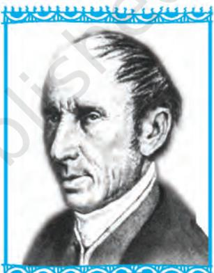
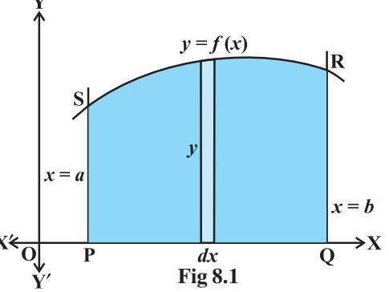
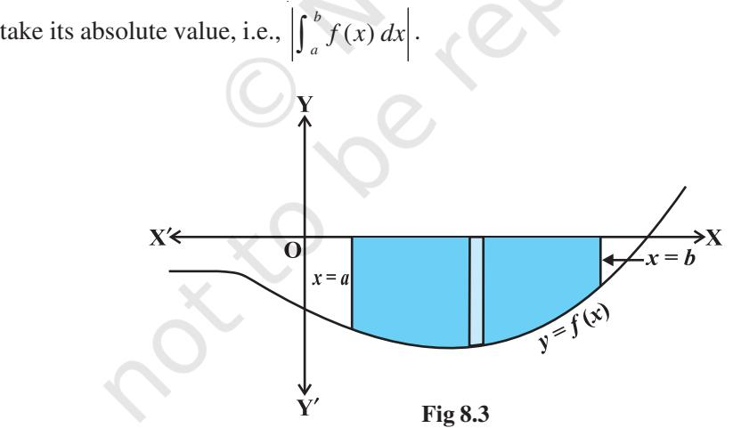
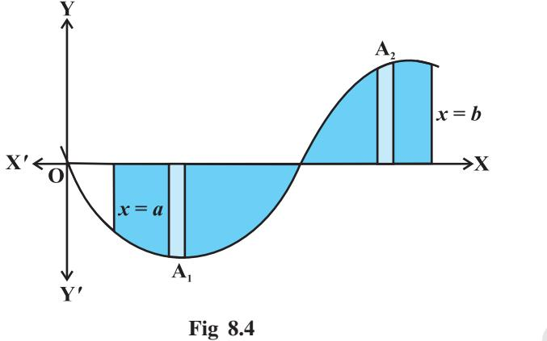
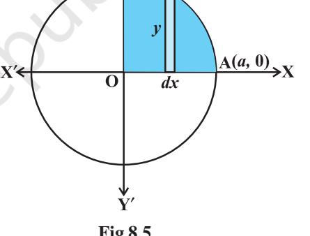
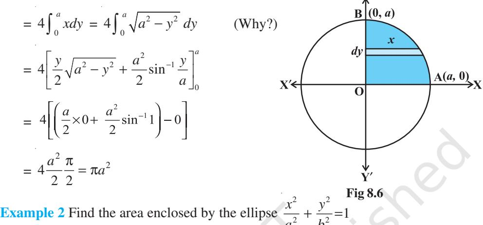
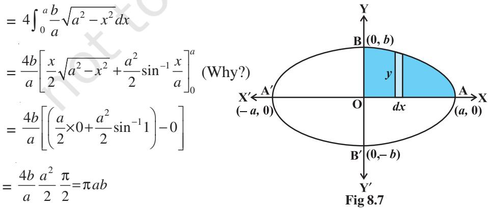
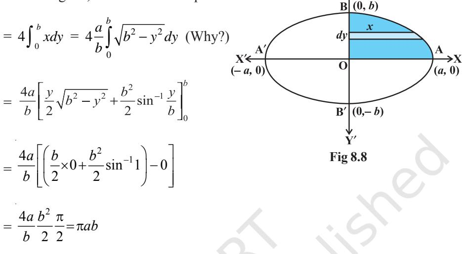

# v *One should study Mathematics because it is only through Mathematics that nature can be conceived in harmonious form. – BIRKHOFF* v

#### **8.1 Introduction**

292 MATHEMATICS

In geometry, we have learnt formulae to calculate areas of various geometrical figures including triangles, rectangles, trapezias and circles. Such formulae are fundamental in the applications of mathematics to many real life problems. The formulae of elementary geometry allow us to calculate areas of many simple figures. However, they are inadequate for calculating the areas enclosed by curves. For that we shall need some concepts of Integral Calculus.

In the previous chapter, we have studied to find the area bounded by the curve *y* = *f* (*x*), the ordinates *x* = *a*, *x* = *b* and *x*-axis, while calculating definite integral as the limit of a sum. Here, in this chapter, we shall study a specific application of integrals to find the area under simple curves, area between lines and arcs of circles, parabolas and ellipses (standard forms only). We shall also deal with finding the area bounded by the above said curves.

#### **8.2 Area under Simple Curves**

In the previous chapter, we have studied definite integral as the limit of a sum and how to evaluate definite integral using Fundamental Theorem of Calculus. Now, we consider the easy and intuitive way of finding the area bounded by the curve *y* = *f*(*x*), *x*-axis and the ordinates *x* = *a* and *x* = *b*. From Fig 8.1, we can think of area under the curve as composed of large number of very thin vertical strips. Consider an arbitrary strip of height *y* and width *dx*, then *d*A (area of the elementary strip)= *ydx*, where, *y* = *f*(*x*).

**A.L. Cauchy (1789-1857)**

This area is called the *elementary area* which is located at an arbitrary position within the region which is specified by some value of *x* between *a* and *b.* We can think of the total area A of the region between *x*-axis, ordinates *x* = *a*, *x* = *b* and the curve *y* = *f* (*x*) as the result of adding up the elementary areas of thin strips across the region PQRSP. Symbolically, we express

$$\mathbf{A}=\int_{a}^{b}d\mathbf{A}=\int_{a}^{b}y d x=\int_{a}^{b}f(x)\,d x$$

The area A of the region bounded by the curve *x* = *g* (*y*), *y*-axis and the lines *y* = *c*, *y* = *d* is given by

$$\mathbf{A}=\int_{c}^{d}x d y=\int_{c}^{d}g(y)\,d y$$

Here, we consider horizontal strips as shown in the Fig 8.2

**Fig 8.2**

*Remark* If the position of the curve under consideration is below the *x*-axis, then since *f* (*x*) < 0 from *x* = *a* to *x* = *b*, as shown in Fig 8.3, the area bounded by the curve, *x*-axis and the ordinates *x = a, x* = *b* come out to be negative. But, it is only the numerical value of the area which is taken into consideration. Thus, if the area is negative, we

Generally, it may happen that some portion of the curve is above *x*-axis and some is below the *x*-axis as shown in the Fig 8.4. Here, A1 < 0 and A2 > 0. Therefore, the area A bounded by the curve *y* = *f* (*x*), *x*-axis and the ordinates *x* = *a* and *x* = *b* is given by A = |A1 | + A2 .

**Example 1** Find the area enclosed by the circle *x* 2 + *y* 2 = *a* 2 .

**Solution** From Fig 8.5, the whole area enclosed by the given circle

= 4 (area of the region AOBA bounded by the curve, *x*-axis and the ordinates *x* = 0 and *x* = *a*) [as the circle is symmetrical about both *x*-axis and *y*-axis]

* 4$\int_{0}^{a}ydx$ (taking vertical strips)  
* 4$\int_{0}^{a}\sqrt{a^{2}-x^{2}}$

Since *x* 2 + *y* 2 = *a* 2 gives *y* = 2 2 ± − *a x*

$$\mathrm{Fig}\,8.5$$

As the region AOBA lies in the first quadrant, *y* is taken as positive. Integrating, we get the whole area enclosed by the given circle

$$=4\Biggl{[}\frac{x}{2}\sqrt{a^{2}-x^{2}}+\frac{a^{2}}{2}\sin^{-1}\frac{x}{a}\Biggr{]}_{0}^{a}$$
  
  

$$=4\Biggl{[}\Biggl{(}\frac{a}{2}\times0+\frac{a^{2}}{2}\sin^{-1}1\Biggr{)}-0\Biggr{]}\ =\ 4\Biggl{(}\frac{a^{2}}{2}\Biggr{)}\Biggl{(}\frac{\pi}{2}\Biggr{)}=\pi a^{2}$$

**Alternatively**, considering horizontal strips as shown in Fig 8.6, the whole area of the region enclosed by circle

*a b* **Solution** From Fig 8.7, the area of the region ABA′B′A bounded by the ellipse

* 4 $\left(\begin{array}{l}area\ of\ the\ region\ AOBA\ in\ the\ first\ quadrant\ bounded\\ by\ the\ curve,x-axis\ and\ the\ ordinates\ x=0,x=a\end{array}\right)$

(as the ellipse is symmetrical about both *x*-axis and *y*-axis)

= 0 4 (taking verticalstrips) *a ydx* ∫

Now 2 2 2 2 *x y a b* + = 1 gives *b* 2 2 *y a x a* = ± − , but as the region AOBA lies in the first

quadrant, *y* is taken as positive. So, the required area is

**Alternatively**, considering horizontal strips as shown in the Fig 8.8, the area of the ellipse is

## **EXERCISE 8.1**

- **1.** Find the area of the region bounded by the ellipse 2 2 1 16 9 *x y* + = .
- **2.** Find the area of the region bounded by the ellipse 2 2 1 4 9 *x y* + = .

Choose the correct answer in the following Exercises 3 and 4.

- **3.** Area lying in the first quadrant and bounded by the circle *x* 2 + *y* 2 = 4 and the lines *x* = 0 and *x* = 2 is
  
  
**(A) $\pi$**(B) $\frac{\pi}{2}$**(C) $\frac{\pi}{3}$**(D) $\frac{\pi}{4}$**

**4.** Area of the region bounded by the curve *y* 2 = 4*x*, *y*-axis and the line *y* = 3 is

(A) 2 (B) 9 4 (C) 9 3 (D) 9 2

#### *Miscellaneous Examples*

**Example 3** Find the area of the region bounded by the line *y =* 3*x* + 2*,* the *x*-axis and the ordinates *x* = –1 and *x* = 1.

**Solution** As shown in the Fig 8.9, the line *y* = 3*x* + 2 meets *x*-axis at *x* = 2 3 − and its graph lies below *x*-axis for and above *x*-axis for . The required area = Area of the region ACBA + Area of the region ADEA = 2 1 3 1 2 3 (3 2) (3 2) *x dx x dx* − − − + + + ∫ ∫ = 2 1 2 2 3 2 1 3 3 3 2 2 2 2 *x x x x* − − − + + + = 1 25 13 6 6 3 + = **Example 4** Find the area bounded by the curve *y* = cos *x* between *x* = 0 and *x* = 2π. **Solution** From the Fig 8.10, the required area = area of the region OABO + area of the region BCDB + area of the region DEFD. **Fig 8.9 Fig 8.10**

Thus, we have the required area

$\begin{array}{l}\includegraphics[height=142.26375pt]{Fig1}\end{array}$  
  
$\begin{array}{l}\includegraphics[height=142.26375pt]{Fig2}\end{array}$  
  
$\begin{array}{l}\includegraphics[height=142.26375pt]{Fig3}\end{array}$  
  
$\begin{array}{l}\includegraphics[height=142.26375pt]{Fig4}\end{array}$  
  
$\begin{array}{l}\includegraphics[height=142.26375pt]{Fig5}\end{array}$  
  
$\begin{array}{l}\includegraphics[height=142.26375pt]{Fig6}\end{array}$  
  
$\begin{array}{l}\includegraphics[height=142.26375pt]{Fig7}\end{array}$  
  
$\begin{array}{l}\includegraphics[height=142.26375pt]{Fig8}\end{array}$  
  
\(\begin{array}{l}\includegraphics[height=142.  
  

### *Miscellaneous Exercise on Chapter 8*

- **1.** Find the area under the given curves and given lines:
	- (i) *y* = *x* 2 , *x* = 1, *x* = 2 and *x*-axis
	- (ii) *y* = *x* 4 , *x* = 1, *x* = 5 and *x*-axis
- **2.** Sketch the graph of *y* = *x* + 3 and evaluate .

**3.** Find the area bounded by the curve *y* = sin *x* between *x* = 0 and *x* = 2π.

Choose the correct answer in the following Exercises from 4 to 5.

- **4.** Area bounded by the curve *y* = *x* 3 , the *x*-axis and the ordinates *x* = – 2 and *x* = 1 is
(A) - 9 (B) $\frac{-15}{4}$ (C) $\frac{15}{4}$ (D) $\frac{17}{4}$

- **5.** The area bounded by the curve *y* = *x* | *x* | , *x*-axis and the ordinates *x* = 1 and *x* = 1 is given by
	- (A) 0 (B) 1 3 (C) 2 3 (D) 4 3

[Hint : *y* = *x* 2 if *x* > 0 and *y* = – *x* 2 if *x* < 0].

#### *Summary*

- ® The area of the region bounded by the curve *y* = *f* (*x*), *x*-axis and the lines *x* = *a* and *x* = *b* (*b* > *a*) is given by the formula: Area ( ) *b b a a* = = *ydx f x dx* ∫ ∫ . ® The area of the region bounded by the curve *x* = φ (*y*), *y*-axis and the lines *y* = *c*, *y* = *d* is given by the formula: Area ( ) *d d c c* = = φ *xdy y dy* ∫ ∫ .
#### *Historical Note*

The origin of the Integral Calculus goes back to the early period of development of Mathematics and it is related to the method of exhaustion developed by the mathematicians of ancient Greece. This method arose in the solution of problems on calculating areas of plane figures, surface areas and volumes of solid bodies etc. In this sense, the method of exhaustion can be regarded as an early method of integration. The greatest development of method of exhaustion in the early period was obtained in the works of Eudoxus (440 B.C.) and Archimedes (300 B.C.)

Systematic approach to the theory of Calculus began in the 17th century. In 1665, Newton began his work on the Calculus described by him as the theory of fluxions and used his theory in finding the tangent and radius of curvature at any point on a curve. Newton introduced the basic notion of inverse function called the anti derivative (indefinite integral) or the inverse method of tangents.

During 1684-86, Leibnitz published an article in the *Acta Eruditorum* which he called *Calculas summatorius*, since it was connected with the summation of a number of infinitely small areas, whose sum, he indicated by the symbol '∫'. In 1696, he followed a suggestion made by J. Bernoulli and changed this article to Calculus integrali. This corresponded to Newton's inverse method of tangents.

Both Newton and Leibnitz adopted quite independent lines of approach which was radically different. However, respective theories accomplished results that were practically identical. Leibnitz used the notion of definite integral and what is quite certain is that he first clearly appreciated tie up between the antiderivative and the definite integral.

Conclusively, the fundamental concepts and theory of Integral Calculus and primarily its relationships with Differential Calculus were developed in the work of P.de Fermat, I. Newton and G. Leibnitz at the end of 17th century. However, this justification by the concept of limit was only developed in the works of A.L. Cauchy in the early 19th century. Lastly, it is worth mentioning the following quotation by Lie Sophie's:

"It may be said that the conceptions of differential quotient and integral which in their origin certainly go back to Archimedes were introduced in Science by the investigations of Kepler, Descartes, Cavalieri, Fermat and Wallis .... The discovery that differentiation and integration are inverse operations belongs to Newton and Leibnitz".

**—**v**—**

