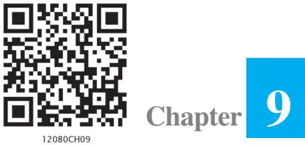

v*He who seeks for methods without having a definite problem in mind seeks for the most part in vain. – D. HILBERT* v

# **9.1 Introduction**

300 MATHEMATICS

In Class XI and in Chapter 5 of the present book, we discussed how to differentiate a given function *f* with respect to an independent variable, i.e., how to find *f* ′(*x*) for a given function *f* at each *x* in its domain of definition. Further, in the chapter on Integral Calculus, we discussed how to find a function *f* whose derivative is the function *g*, which may also be formulated as follows:

For a given function *g*, find a function *f* such that

$$\frac{dy}{dx}=g(x),\,\mbox{where}y=f(x)\tag{1}$$

An equation of the form (1) is known as a *differential equation*. A formal definition will be given later.

**Henri Poincare (1854-1912 )**

These equations arise in a variety of applications, may it be in Physics, Chemistry, Biology, Anthropology, Geology, Economics etc. Hence, an indepth study of differential equations has assumed prime importance in all modern scientific investigations.

In this chapter, we will study some basic concepts related to differential equation, general and particular solutions of a differential equation, formation of differential equations, some methods to solve a first order - first degree differential equation and some applications of differential equations in different areas.

# **9.2 Basic Concepts**

We are already familiar with the equations of the type:

$x^{2}-3x+3=0$

$\sin x+\cos x=0$

$$\chi+y=7$$

Let us consider the equation:

$$x\,\frac{dy}{dx}+y\,=0$$

We see that equations (1), (2) and (3) involve independent and/or dependent variable (variables) only but equation (4) involves variables as well as derivative of the dependent variable *y* with respect to the independent variable *x*. Such an equation is called a *differential equation*.

In general, an equation involving derivative (derivatives) of the dependent variable with respect to independent variable (variables) is called a differential equation.

A differential equation involving derivatives of the dependent variable with respect to only one independent variable is called an ordinary differential equation, e.g.,

$$2\,\frac{d^{2}\,y}{dx^{2}}+\left(\frac{dy}{dx}\right)^{3}=0\,\,\,\mbox{is an ordinary differential equation}\tag{5}$$

Of course, there are differential equations involving derivatives with respect to more than one independent variables, called partial differential equations but at this stage we shall confine ourselves to the study of ordinary differential equations only. Now onward, we will use the term 'differential equation' for 'ordinary differential equation'.

A**Note**

- 1. We shall prefer to use the following notations for derivatives:

$${\frac{d y}{d x}}=y^{\prime},{\frac{d^{2}y}{d x^{2}}}=y^{\prime},{\frac{d^{3}y}{d x^{3}}}=y^{\prime\prime\prime}$$

2. For derivatives of higher order, it will be inconvenient to use so many dashes

as supersuffix therefore, we use the notation *y n* for *n*th order derivative *n n d y dx*

### **9.2.1.** *Order of a differential equation*

Order of a differential equation is defined as the order of the highest order derivative of the dependent variable with respect to the independent variable involved in the given differential equation.

Consider the following differential equations:

$$\frac{dy}{dx}=e^{x}$$

.

$$\frac{d^{2}y}{dx^{2}}+y=0$$

$$\left(\frac{d^{3}y}{dx^{3}}\right)+x^{2}\left(\frac{d^{2}y}{dx^{2}}\right)^{3}=0\tag{8}$$

The equations (6), (7) and (8) involve the highest derivative of first, second and third order respectively. Therefore, the order of these equations are 1, 2 and 3 respectively.

### **9.2.2** *Degree of a differential equation*

To study the degree of a differential equation, the key point is that the differential equation must be a polynomial equation in derivatives, i.e., *y*′, *y*″, *y*″′ etc. Consider the following differential equations:

$$\frac{d^{3}y}{dx^{3}}+2\Bigg{(}\frac{d^{2}y}{dx^{2}}\Bigg{)}^{2}-\frac{dy}{dx}+y=0\tag{9}$$

$$\left(\frac{dy}{dx}\right)^{2}+\left(\frac{dy}{dx}\right)-\sin^{2}y=0\tag{10}$$

$$\frac{dy}{dx}+\sin\left(\frac{dy}{dx}\right)=0\tag{11}$$

We observe that equation (9) is a polynomial equation in *y*″′, *y*″ and *y*′, equation (10) is a polynomial equation in *y*′ (not a polynomial in *y* though). Degree of such differential equations can be defined. But equation (11) is not a polynomial equation in *y*′ and degree of such a differential equation can not be defined.

By the degree of a differential equation, when it is a polynomial equation in derivatives, we mean the highest power (positive integral index) of the highest order derivative involved in the given differential equation.

In view of the above definition, one may observe that differential equations (6), (7), (8) and (9) each are of degree one, equation (10) is of degree two while the degree of differential equation (11) is not defined.

A**Note** Order and degree (if defined) of a differential equation are always positive integers.

**Example 1** Find the order and degree, if defined, of each of the following differential equations:

(i) $\frac{dy}{dx}-\cos x=0$ (ii) $xy\,\frac{d^{\,2}y}{dx^{2}}+x\left(\frac{dy}{dx}\right)^{2}-y\,\frac{dy}{dx}=0$ (iii) $y^{\,\prime\prime}+y^{\,2}+e^{y^{\,\prime}}=0$

### **Solution**

- (i) The highest order derivative present in the differential equation is *dy dx* , so its order is one. It is a polynomial equation in *y*′ and the highest power raised to *dy dx* is one, so its degree is one.
- (ii) The highest order derivative present in the given differential equation is 2 2 *d y dx* , so

its order is two. It is a polynomial equation in 2 2 *d y dx* and *dy dx* and the highest

power raised to 2 2 *d y dx* is one, so its degree is one.

- (iii) The highest order derivative present in the differential equation is *y*′′′ , so its order is three. The given differential equation is not a polynomial equation in its derivatives and so its degree is not defined.
**EXERCISE 9.1**

Determine order and degree (if defined) of differential equations given in Exercises 1 to 10.

$$\frac{d^{4}y}{dx^{4}}+\sin(y^{\prime\prime})=0\mathbf{2.}y^{\prime}+5y=0\mathbf{3.}\left(\frac{ds}{dt}\right)^{4}+3s\,\frac{d^{\,2}s}{dt^{2}}=0\mathbf{4.}\left(\frac{d^{\,2}y}{dx^{2}}\right)^{2}+\cos\left(\frac{dy}{dx}\right)=0\mathbf{5.}\frac{d^{\,2}y}{dx^{2}}=\cos3x+\sin3x\mathbf{6.}(y^{\prime\prime})^{2}+(y^{\prime\prime})^{3}+(y^{\prime})^{4}+y^{5}=0\mathbf{7.}y^{\prime\prime}+2y^{\prime\prime}+y^{\prime}=0$$

$y^{\prime}+y=e^{x}$ 9. $y^{\prime\prime}+(y^{\prime})^{2}+2y=0$ 10. $y^{\prime\prime}+2y^{\prime}+\sin y=0$

**11.** The degree of the differential equation

$$\left(\frac{d^{2}y}{dx^{2}}\right)^{3}+\left(\frac{dy}{dx}\right)^{2}+\sin\left(\frac{dy}{dx}\right)+1=0\;\;\mbox{is}$$
  
  
(A) 3 (B) 2 (C) 1 (D) not defined 

**12.** The order of the differential equation

$2x^{2}\,\frac{d^{2}y}{dx^{2}}-3\,\frac{dy}{dx}+y=0$ is  
  
(A) 2 (B) 1 (C) 0 (D) not defined 

## **9.3. General and Particular Solutions of a Differential Equation**

In earlier Classes, we have solved the equations of the type:

$$x^{2}+1=0$$
... (1) 
$$\sin^{2}x-\cos x=0$$
... (2)

Solution of equations (1) and (2) are numbers, real or complex, that will satisfy the given equation i.e., when that number is substituted for the unknown *x* in the given equation, L.H.S. becomes equal to the R.H.S..

Now consider the differential equation $\frac{d^{2}y}{dx^{2}}+y=0$... (3)

In contrast to the first two equations, the solution of this differential equation is a function φ that will satisfy it i.e., when the function φ is substituted for the unknown *y* (dependent variable) in the given differential equation, L.H.S. becomes equal to R.H.S..

The curve *y* = φ (*x*) is called the solution curve (integral curve) of the given differential equation. Consider the function given by

$y=\phi\left(x\right)=a$ sin $(x+b)$,... (4)

where *a*, *b* ∈ **R**. When this function and its derivative are substituted in equation (3), L.H.S. = R.H.S.. So it is a solution of the differential equation (3).

Let *a* and *b* be given some particular values say *a* = 2 and 4 *b* π = , then we get a

function *y* = φ1

$$=\phi_{1}(x)=\ 2\sin\Biggl{(}\ x+\frac{\pi}{4}\Biggr{)}\tag{5}$$

When this function and its derivative are substituted in equation (3) again L.H.S. = R.H.S.. Therefore φ1 is also a solution of equation (3).

Function φ consists of two arbitrary constants (parameters) *a*, *b* and it is called *general solution* of the given differential equation. Whereas function φ1 contains no arbitrary constants but only the particular values of the parameters *a* and *b* and hence is called a *particular solution* of the given differential equation.

The solution which contains arbitrary constants is called the *general solution* (*primitive*) of the differential equation.

The solution free from arbitrary constants i.e., the solution obtained from the general solution by giving particular values to the arbitrary constants is called a *particular solution* of the differential equation.

**Example 2** Verify that the function *y* = *e* – 3*x* is a solution of the differential equation

$${\frac{d^{2}y}{d x^{2}}}+{\frac{d y}{d x}}-6y=0$$

**Solution** Given function is *y* = *e* – 3*x* . Differentiating both sides of equation with respect to *x* , we get

$$\frac{dy}{dx}=-3e^{-3x}\tag{1}$$

Now, differentiating (1) with respect to *x*, we have

*dx*

$${\frac{d^{2}y}{d x^{2}}}=9\,e^{-\,3x^{2}}$$

Substituting the values of 2 2 , *d y dy dx dx* and *y* in the given differential equation, we get L.H.S. = 9 *e*– 3*x* + (–3*e* – 3*x* ) – 6.*e* – 3*x* = 9 *e*– 3*x* – 9 *e*– 3*x* = 0 = R.H.S..

Therefore, the given function is a solution of the given differential equation.

**Example 3** Verify that the function *y* = *a* cos *x* + *b* sin *x*, where, *a*, *b* ∈ **R** is a solution of the differential equation 2 2 0 *d y y* + =

**Solution** The given function is

$y=a$ cos $x+b$ sin $x$

Differentiating both sides of equation (1) with respect to *x*, successively, we get

$${\frac{d y}{d x}}=-\ a\,\sin x+b\,\cos x$$
  

$${\frac{d^{2}y}{d x^{2}}}=-\ a\,\cos x-b\,\sin x$$

Substituting the values of 2 2 *d y dx* and *y* in the given differential equation, we get L.H.S. = (– *a* cos *x* – *b* sin *x*) + (*a* cos *x* + *b* sin *x*) = 0 = R.H.S.

Therefore, the given function is a solution of the given differential equation.

# **EXERCISE 9.2**

In each of the Exercises 1 to 10 verify that the given functions (explicit or implicit) is a solution of the corresponding differential equation:

- **1.** *y* = *e x* + 1 : *y*″ – *y*′ = 0 **2.** *y* = *x* 2 + 2*x* + C : *y*′ – 2*x* – 2 = 0 **3.** *y* = cos *x* + C : *y*′ + sin *x* = 0 **4.** *y* = 2 1+ *x* : *y*′ = 2 1 *xy* + *x* **5.** *y* = A*x* : *xy*′ = *y* (*x* ≠ 0) **6.** *y* = *x* sin *x* : *xy*′ = *y* + *x* 2 2 *x y* − (*x* ≠ 0 and *x* > *y* or *x* < *– y*) **7.** *xy* = log *y* + C : *y*′ = 2 1 *y* − *xy* (*xy* ≠ 1) **8.** *y* – cos *y* = *x* : (*y* sin *y* + cos *y* + *x*) *y*′ = *y* **9.** *x + y =* tan–1*y* : *y* 2 *y*′ + *y* 2 + 1 = 0 **10.** *y* = 2 2 *a x* − *x* ∈ (–*a*, *a*) : *x* + *y dy dx* = 0 (*y* ≠ 0) **11.** The number of arbitrary constants in the general solution of a differential equation
- of fourth order are:
	- (A) 0 (B) 2 (C) 3 (D) 4
- **12.** The number of arbitrary constants in the particular solution of a differential equation of third order are:
	- (A) 3 (B) 2 (C) 1 (D) 0

# **9.4. Methods of Solving First Order, First Degree Differential Equations**

In this section we shall discuss three methods of solving first order first degree differential equations.

# **9.4.1** *Differential equations with variables separable*

A first order-first degree differential equation is of the form

$\frac{dy}{dx}=$ F($x$, $y$)... (1)

If F (*x*, *y*) can be expressed as a product g (*x*) *h*(*y*), where, *g*(*x*) is a function of *x* and *h*(*y*) is a function of *y*, then the differential equation (1) is said to be of variable separable type. The differential equation (1) then has the form

$$\frac{dy}{dx}=h\left(y\right)\cdot g(x)$$

If *h*(*y*) ≠ 0, separating the variables, (2) can be rewritten as

$$\frac{1}{h(y)}\ dy=g(x)\ dx\tag{3}$$

Integrating both sides of (3), we get

$$\int\frac{1}{h(y)}\,dy=\int g(x)\,dx\tag{4}$$

Thus, (4) provides the solutions of given differential equation in the form

$$\mathrm{H}(y)=\mathrm{G}(x)+\mathrm{C}$$

Here, H (*y*) and G (*x*) are the anti derivatives of 1 *h y*( ) and *g* (*x*) respectively and C is the arbitrary constant.

**Example 4** Find the general solution of the differential equation 1 2 *dy x dx y* + = − , (*y* ≠ 2)

**Solution** We have

$$\begin{array}{c}\hline\hline dy&x+1\\ \hline dx&2-y\end{array}\tag{1}$$

Separating the variables in equation (1), we get

(2 - y) $dy=(x+1)\ dx$... (2)

Integrating both sides of equation (2), we get

$$\int(2-y)\,d y=\int(x+1)\,d x$$

2

2 *x*

= 0

C1

+ +*x*

2

2 *y y* − =

or

or *x* 2 + *y* 2 + 2*x* – 4*y* + 2 C1

or  
  

$$x^{2}+y^{2}+2x-4y+C=0,\ \mbox{where}\ C=2C_{1}$$

2

which is the general solution of equation (1).

**Example 5** Find the general solution of the differential equation 2 2 1 1 *dy y dx x* + = + .

**Solution** Since 1 + *y* 2 ≠ 0, therefore separating the variables, the given differential equation can be written as

$$\frac{dy}{1+y^{2}}=\frac{dx}{1+x^{2}}\tag{1}$$

Integrating both sides of equation (1), we get

$$\int\frac{dy}{1+y^{2}}=\int\frac{dx}{1+x^{2}}$$
  
  
or  
  

$$\tan^{-1}y=\tan^{-1}x+\mbox{C}$$

which is the general solution of equation (1).

**Example 6** Find the particular solution of the differential equation 2 4 *dy xy dx* = − given

that *y* = 1, when *x* = 0.

**Solution** If *y* ≠ 0, the given differential equation can be written as

$$\frac{dy}{y^{2}}=-\,4x\,dx\tag{1}$$

Integrating both sides of equation (1), we get

$$\int\frac{dy}{y^{2}}=4\int x\,dx$$
  
  
or  
  

$$\frac{1}{y}=-\,2x^{2}+\,C$$
  
  
or  
  

$$y=\frac{1}{2x^{2}-C}$$
  
  
... (2)

or

Substituting *y* = 1 and *x* = 0 in equation (2), we get, C = – 1.

Now substituting the value of C in equation (2), we get the particular solution of the

given differential equation as $y=\frac{1}{2x^{2}+1}$

**Example 7** Find the equation of the curve passing through the point (1, 1) whose differential equation is *x dy* = (2*x* 2 + 1) *dx* (*x* ≠ 0).

**Solution** The given differential equation can be expressed as

$$dy^{*}=\left(\frac{2x^{2}+1}{x}\right)dx^{*}$$
  
  
or  
  

$$dy=\left(\begin{array}{c}\cdot\\ 2x+\frac{1}{x}\end{array}\right)dx\tag{1}$$

Integrating both sides of equation (1), we get

$$\int dy\ =\int\biggl{(}\ 2x+\frac{1}{x}\biggr{)}dx$$
  
  
or  
  

$$y=x^{2}+\log\ |x|+\mathrm{C}\tag{2}$$

Equation (2) represents the family of solution curves of the given differential equation but we are interested in finding the equation of a particular member of the family which passes through the point (1, 1). Therefore substituting *x* = 1, *y* = 1 in equation (2), we get C = 0.

Now substituting the value of C in equation (2) we get the equation of the required curve as *y* = *x* 2 + log | *x* |.

**Example 8** Find the equation of a curve passing through the point (–2, 3), given that

the slope of the tangent to the curve at any point (*x*, *y*) is 2 2*x y* .

**Solution** We know that the slope of the tangent to a curve is given by *dy dx* .

$$\begin{array}{c}\mbox{\frac{dy}{dx}}=\frac{2x}{y^{2}}\\ \mbox{\frac{dy}{dx}}=\frac{2x}{y^{2}}\end{array}\tag{1}$$

so,

Separating the variables, equation (1) can be written as

$y^{2}\ dy=2x\ dx$

Integrating both sides of equation (2), we get

$$\int y^{2}dy=\int2x\,dx$$
 
$$\frac{y^{3}}{3}=x^{2}+\,\mbox{C}\tag{3}$$

or

* The notation *dy dx* due to Leibnitz is extremely flexible and useful in many calculation and formal transformations, where, we can deal with symbols *dy* and *dx* exactly as if they were ordinary numbers. By treating *dx* and *dy* like separate entities, we can give neater expressions to many calculations. Refer: Introduction to Calculus and Analysis, volume-I page 172, By Richard Courant,

Fritz John Spinger – Verlog New York.

Substituting *x* = –2, *y* = 3 in equation (3), we get C = 5. Substituting the value of C in equation (3), we get the equation of the required curve as

$${\frac{y^{3}}{3}}=x^{2}+5\quad{\mathrm{or}}\quad y=(3x^{2}+15)^{\frac{1}{3}}$$

**Example 9** In a bank, principal increases continuously at the rate of 5% per year. In how many years Rs 1000 double itself?

**Solution** Let P be the principal at any time *t*. According to the given problem,

$$\begin{array}{l}\frac{dp}{dt}=\left(\frac{5}{100}\right)\times\mbox{P}\\ \frac{dp}{dt}=\frac{\mbox{P}}{20}\end{array}$$

or

separating the variables in equation (1), we get

$$\frac{dp}{\rm P}=\frac{dt}{20}\tag{2}$$

Integrating both sides of equation (2), we get

$\log$P = $\frac{t}{20}+$C${}_{1}$  
  
$\log$P = $\frac{t}{20}+$C${}_{1}$  
  
$\log$P = $\frac{t}{20}+$C${}_{1}$  
  
$\log$P = $\frac{t}{20}+$C${}_{1}$  
  
$\log$P = $\frac{t}{20}+$C${}_{1}$  
  
$\log$P = $\frac{t}{20}+$C${}_{1}$  
  
$\log$P = $\frac{t}{20}+$C${}_{1}$  

or P = C 20 *t e* (where *e* C1 = C ) ... (3) Now P = 1000, when *t* = 0

Substituting the values of P and *t* in (3), we get C = 1000. Therefore, equation (3), gives

$$\mathrm{P}=1000\ e^{\frac{t}{20}}$$

Let *t* years be the time required to double the principal. Then

$$2000=1000\,e^{\frac{t}{20}}\quad\Rightarrow\,t=20\,\log_{e}2$$

# **EXERCISE 9.3**

For each of the differential equations in Exercises 1 to 10, find the general solution:

- **1.** 1 cos 1 cos *dy x dx x* − = + **2.** 2 4 ( 2 2) *dy y y dx* = − − < <
$\frac{dy}{dx}+y=1\,(y\neq1)$ 4. $\sec^{2}\,x\,\tan\,y\,\,dx+\sec^{2}\,y\,\tan\,x\,\,dy=0$ 5. $(e^{x}+e^{-x})\,\,dy-(e^{x}-e^{-x})\,\,dx=0$ 6. $\frac{dy}{dx}=(1+x^{2})\,(1+y^{2})$ 7. $y\,\log\,y\,\,dx-x\,\,dy=0$ 8. $x^{5}\,\frac{dy}{dx}=-y^{5}$ 9. $\frac{dy}{dx}=\sin^{-1}x$ 10. $e^{x}\,\tan\,y\,\,dx+(1-e^{x})\,\sec^{2}\,y\,\,dy=0$

For each of the differential equations in Exercises 11 to 14, find a particular solution satisfying the given condition:

- **11.** 3 2 ( 1) *dy x x x dx* + + + = 2*x* 2 + *x*; *y* = 1 when *x* = 0
  
  
## 12. $x(x^{2}-1)\frac{dy}{dx}=1$; $y=0$ when $x=2$

  
  
**13.**$\cos\left(\frac{dy}{dx}\right)$=$a$ ($a\in\mathbb{R}$); $y=1$ when $x=0$

  
  
**14.**$\frac{dy}{dx}=y\tan x$ ; $y=1$ when $x=0$

- **15.** Find the equation of a curve passing through the point (0, 0) and whose differential equation is *y*′ = *e x* sin *x.*
- **16.** For the differential equation ( 2) ( 2) *dy xy x y dx* = + + , find the solution curve passing through the point (1, –1).
- **17.** Find the equation of a curve passing through the point (0, –2) given that at any point (*x*, *y*) on the curve, the product of the slope of its tangent and *y* coordinate of the point is equal to the *x* coordinate of the point.
- **18.** At any point (*x*, *y*) of a curve, the slope of the tangent is twice the slope of the line segment joining the point of contact to the point (– 4, –3). Find the equation of the curve given that it passes through (–2, 1).
- **19.** The volume of spherical balloon being inflated changes at a constant rate. If initially its radius is 3 units and after 3 seconds it is 6 units. Find the radius of balloon after *t* seconds.

- **20.** In a bank, principal increases continuously at the rate of *r*% per year. Find the value of *r* if Rs 100 double itself in 10 years (log*e* 2 = 0.6931).
- **21.** In a bank, principal increases continuously at the rate of 5% per year. An amount of Rs 1000 is deposited with this bank, how much will it worth after 10 years (*e* 0.5 = 1.648).
- **22.** In a culture, the bacteria count is 1,00,000. The number is increased by 10% in 2 hours. In how many hours will the count reach 2,00,000, if the rate of growth of bacteria is proportional to the number present?

**23.** The general solution of the differential equation *dy x y e dx* + = is

- (A) *e x* + *e* –*y* = C (B) *e x* + *e y* = C (C) *e* –*x* + *e y* = C (D) *e* –*x* + *e* –*y* = C
### **9.4.2** *Homogeneous differential equations*

Consider the following functions in *x* and *y*

- F1 (*x*, *y*) = *y* 2 + 2*xy*, F2 (*x*, *y*) = 2*x* – 3*y*, F3 (*x*, *y*) = cos *y x* , F4 (*x*, *y*) = sin *x* + cos *y*
If we replace *x* and *y* by λ*x* and λ*y* respectively in the above functions, for any nonzero constant λ, we get

$\mathrm{F}_{1}\left(\lambda x,\,\lambda y\right)=\lambda^{2}\left(y^{2}+2xy\right)=\lambda^{2}\,\mathrm{F}_{1}(x,\,y)$  
  
$\mathrm{F}_{2}\left(\lambda x,\,\lambda y\right)=\lambda\left(2x-3y\right)=\lambda\,\mathrm{F}_{2}(x,\,y)$  
  
$\mathrm{F}_{3}\left(\lambda x,\,\lambda y\right)=\cos\left(\frac{\lambda y}{\lambda x}\right)=\cos\left(\frac{y}{x}\right)=\lambda^{0}\,\,\mathrm{F}_{3}\left(x,\,y\right)$  
  
$\mathrm{F}_{4}\left(\lambda x,\,\lambda y\right)=\sin\,\lambda x+\cos\,\lambda y\neq\lambda^{n}\,\,\mathrm{F}_{4}\left(x,\,y\right)$, for any $n\in\mathbf{N}$

Here, we observe that the functions F1 , F2 , F3 can be written in the form F(λ*x*, λ*y*) = λ *n* F(*x*, *y*) but F4 can not be written in this form. This leads to the following definition:

A function F(*x*, *y*) is said to be *homogeneous function of degree n* if

F(λ*x*, λ*y*) = λ *n* F(*x*, *y*) for any nonzero constant λ.

We note that in the above examples, F1 , F2 , F3 are homogeneous functions of degree 2, 1, 0 respectively but F4 is not a homogeneous function.

We also observe that

$$\begin{array}{c}\mbox{F}_{1}(x,\,y)=\,x^{2}\Bigg{(}\,\frac{y^{2}}{x^{2}}+\frac{2y}{x}\Bigg{)}=x^{2}h_{1}\Bigg{(}\frac{y}{x}\Bigg{)}\\ \mbox{F}_{1}(x,\,y)=\,y^{2}\Bigg{(}1+\frac{2x}{y}\Bigg{)}=y^{2}h_{2}\Bigg{(}\frac{x}{y}\Bigg{)}\end{array}$$

F2 (*x*, *y*) = 1 1 3 3 2 *y y x x h x x* − = or F2 (*x*, *y*) = 1 1 4 2 3 *x x y y h y y* − = F3 (*x*, *y*) = 0 0 5 cos *y y x x h x x* = F4 (*x*, *y*) ≠ 6 *n y x h x* , for any *n* ∈ **N** or F4 (*x*, *y*) ≠ 7 *n x y h y* , for any *n* ∈ **N**

Therefore, a function F (*x*, *y*) is a homogeneous function of degree *n* if

$\left(\begin{array}{c}\mbox{F}(x,y)=x^{n}\mbox{g}\left(\begin{array}{c}\mbox{y}\\ \mbox{x}\end{array}\right)\end{array}\right)$ or $\left(\begin{array}{c}\mbox{y}\\ \mbox{y}\end{array}\right)$

A differential equation of the form *dy dx* = F (*x, y*) is said to be *homogenous* if F(*x*, *y*) is a homogenous function of degree zero.

To solve a homogeneous differential equation of the type

$$\frac{dy}{dx}=\mbox{F}(x,y)\ =\ g\Biggl{(}\frac{y}{x}\Biggr{)}\tag{1}$$

We make the substitution *y* = *v* . *x* ... (2) Differentiating equation (2) with respect to *x*, we get

$$\frac{dy}{dx}=v+x\frac{dv}{dx}\tag{3}$$

*dx*

Substituting the value of *dy dx* from equation (3) in equation (1), we get

$$v+x\frac{dv}{dx}=g\left(v\right)$$
 
$$x\frac{dv}{dx}=g\left(v\right)-v\tag{4}$$

or

Separating the variables in equation (4), we get

$$\frac{dv}{g\left(v\right)-v}=\frac{dx}{x}\tag{5}$$

Integrating both sides of equation (5), we get

$$\int\frac{dv}{g\left(v\right)-v}=\int\frac{1}{x}dx+C\tag{6}$$

Equation (6) gives general solution (primitive) of the differential equation (1) when we replace *v* by *y x* .

A**Note** If the homogeneous differential equation is in the form F( , ) *dx x y dy* = where, F (*x*, *y*) is homogenous function of degree zero, then we make substitution *x v y* = i.e., *x* = *vy* and we proceed further to find the general solution as discussed above by writing F( , ) . *dx x x y h dy y* = =

**Example 10** Show that the differential equation (*x* – *y*) *dy dx* = *x* + 2*y* is homogeneous and solve it.

**Solution** The given differential equation can be expressed as

$$\frac{dy}{dx}=\frac{x+2y}{x-y}\tag{1}$$

Let 
$$\mathrm{F}(x,y)=\frac{x+2y}{x-y}$$
. 

Now  
  

$$\mathrm{F}\left(\lambda x,\,\lambda y\right)=\frac{\lambda(x+2y)}{\lambda(x-y)}=\lambda^{0}\cdot f(x,y)$$

Therefore, F(*x*, *y*) is a homogenous function of degree zero. So, the given differential equation is a homogenous differential equation.

**Alternatively**,

$$\frac{dy}{dx}=\left(\frac{1+\frac{2y}{x}}{1-\frac{y}{x}}\right)=\ \ g\left(\frac{y}{x}\right)\tag{2}$$

R.H.S. of differential equation (2) is of the form *g y x* and so it is a homogeneous

function of degree zero. Therefore, equation (1) is a homogeneous differential equation. To solve it we make the substitution

$$y=vx\tag{3}$$

Differentiating equation (3) with respect to, *x* we get

$$\frac{dy}{dx}=v+x\frac{dv}{dx}\tag{4}$$

Substituting the value of *y* and *dy dx* in equation (1) we get

*dv v x dx* + = 1 2 1 *v v* + − *dv x dx* = 1 2 1 *v v v* + − −

or

or  
  

$$\begin{array}{c}\includegraphics[height=142.26375pt]{Fig1}\end{array}$$

1 1

*dv*

=

*dx x* −

*v*

*v v* − + +

or 2

Integrating both sides of equation (5), we get

$$\int\frac{2v+1-3}{v^{2}+v+1}dv\ =-\log\ |x|+C_{1}$$

$${\frac{1}{2}}\int{\frac{2v+1}{v^{2}+v+1}}d v-{\frac{3}{2}}\int{\frac{1}{v^{2}+v+1}}d v=-\log\left|\,x\,\right|+\mathrm{C}_{1}$$

or

or  
  

$$\frac{1}{2}\log\left|\,v^{2}+v+1\right|-\frac{3}{2}\int\frac{1}{\left(v+\frac{1}{2}\right)^{2}+\left(\frac{\sqrt{3}}{2}\right)^{2}}\,dv=-\log\left|\,x\right|+C_{1}$$

or  
  

$$\frac{1}{2}\log\left|\,v^{2}+v+1\right|-\frac{3}{2}\cdot\frac{2}{\sqrt{3}}\tan^{-1}\left(\frac{2v+1}{\sqrt{3}}\right)=-\log\left|\,x\right|+C_{1}$$

or  
  

$$\frac{1}{2}\log\left|\,v^{2}+v+1\right|+\frac{1}{2}\log x^{2}=\sqrt{3}\,\tan^{-1}\left(\frac{2v+1}{\sqrt{3}}\right)+\mathrm{C}_{1}$$
 (Why?)

Replacing *v* by *y x* , we get

or  
  

$$\frac{1}{2}\log\left|\frac{y^{2}}{x^{2}}+\frac{y}{x}+1\right|+\frac{1}{2}\log x^{2}=\sqrt{3}\tan^{-1}\left(\frac{2y+x}{\sqrt{3}x}\right)+C$$

or

$$\frac{1}{2}\log\left(\frac{y^{2}}{x^{2}}+\frac{y}{x}+1\right)x^{2}=\sqrt{3}\tan^{-1}\left(\frac{2y+x}{\sqrt{3}x}\right)+C_{1}$$

or

$\log(y^{2}+xy+x^{2})=2\sqrt{3}\tan^{-1}\left(\frac{2y+x}{\sqrt{3}x}\right)+2\mathbf{C}_{1}$

or  
  

$$\log\left|(x^{2}+xy+y^{2})\right|=2\sqrt{3}\tan^{-1}\left(\frac{x+2y}{\sqrt{3}x}\right)+\mathbf{C}$$

which is the general solution of the differential equation (1)

**Example 11** Show that the differential equation cos cos *y dy y x y x x dx x* = + is homogeneous and solve it.

**Solution** The given differential equation can be written as

$$\frac{dy}{dx}=\frac{y\cos\left(\frac{y}{x}\right)+x}{x\cos\left(\frac{y}{x}\right)}\tag{1}$$

It is a differential equation of the form F( , ) *dy x y dx* = .

Here  
  

$$\text{F}\left(x,y\right)=\frac{y\cos\left(\frac{y}{x}\right)+x}{x\cos\left(\frac{y}{x}\right)}$$

Replacing *x* by λ*x* and *y* by λ*y*, we get

$\lambda[y\cos(\frac{y}{x})+x]$  
  
$\lambda(x\cos\frac{y}{x})$

Thus, F(*x*, *y*) is a homogeneous function of degree zero.

Therefore, the given differential equation is a homogeneous differential equation. To solve it we make the substitution

$$\psi=\psi\tag{2}$$

Differentiating equation (2) with respect to *x*, we get

$$\frac{dy}{dx}=v+\frac{dv}{dx}\tag{3}$$

Substituting the value of *y* and *dy dx* in equation (1), we get

*dv v x dx* + = cos 1 cos *v v v* + or *dv x dx* = cos 1 cos *v v v v* + − or *dv x dx* = 1 cos *v* or cos *v dv* = *dx x* Therefore cos *v dv* ∫ = 1 *dx x* ∫

or sin *v* = log | *x* | + log |C| or sin *v* = log |C*x*|

Replacing *v* by *y x* , we get

$$\sin\left({\frac{y}{x}}\right)=\log\left|\mathrm{{C}}x\right|$$

which is the general solution of the differential equation (1).

**Example 12** Show that the differential equation 2 2 0 *x x y y y e dx y x e dy* + − = is homogeneous and find its particular solution, given that, *x* = 0 when *y* = 1. **Solution** The given differential equation can be written as

*dx dy* = 2 2 *x y x y x e y y e* − ... (1) Let F(*x*, *y*) = 2 2 *x y x y xe y ye* − 2 *x y xe y* λ − =λ

Then F(λ*x*, λ*y*) = 0

Thus, F(*x*, *y*) is a homogeneous function of degree zero. Therefore, the given differential equation is a homogeneous differential equation.

2

*ye*

λ

*x y*

To solve it, we make the substitution

$$\chi=\nu y\qquad\qquad\qquad\qquad\qquad\qquad\dots\ (2)$$

[F( , )]

*x y*

Differentiating equation (2) with respect to *y*, we get

$${\frac{d x}{d y}}=\,\nu+y{\frac{d\nu}{d y}}$$

Substituting the value of and *dx x dy* in equation (1), we get

> *dv v y dy* + = 2 1 2 *v v v e e* −

> > 2 1 2

*e* − −

*v v v e*

*v*

*dv y dy* =

or

or *dv y dy* = 1 2 *v e* −

or 2*e v dv* = *dy y* −

or  
  

$$\int2e^{v}\cdot dv=-\int\frac{dy}{v}$$

$2\,e^{v}=-\log\,|v|+C$

and replacing $v$ by $\frac{\chi}{\nu}$, we get 

$$e^{y}+\log|y|=C\tag{3}$$

Substituting *x* = 0 and *y* = 1 in equation (3), we get

2 *x*

* [16] A. A. K.  
  

Substituting the value of C in equation (3), we get

* [16] A. A. K.  
  

which is the particular solution of the given differential equation.

**Example 13** Show that the family of curves for which the slope of the tangent at any

point $(x,y)$ on it is $\frac{x^{2}+y^{2}}{2xy}$, is given by $x^{2}-y^{2}=cx$.  
  

**Solution** We know that the slope of the tangent at any point on a curve is *dy dx* .

Therefore,  
  

$$\frac{dy}{dx}=\frac{x^{2}+y^{2}}{2xy}$$

*dy dx* = 2 2 1 2 *y x y x* + ... (1)

|

or

Clearly, (1) is a homogenous differential equation. To solve it we make substitution

+

*dv v x dx*

2 1 2 *v v* +

2 1 2 *v v* −

*dx x* −

*y* = *vx*

*dy dx* =

Differentiating *y* = *vx* with respect to *x*, we get

*dv v x dx* + = *dv*

or

or

$${\frac{2v}{1-v^{2}}}d v={\frac{d x}{x}}$$

=

*x dx* =

2

*v* −

1 *v dv*

or 2

Therefore  
  

$$\int\frac{2v}{v^{2}-1}dv=-\int\frac{1}{x}dx$$

$\Omega$f. 

- or log | *v* 2 – 1 | = – log | *x* | + log |C1 or log |(*v* 2 – 1) (*x*)| = log |C1 |

$$(v^{2}-1)x=\pmC_{1}$$

Replacing *v* by *y x* , we get

$$\left(\frac{y^{2}}{x^{2}}-1\right)x=\pm\,{\rm C}_{1}$$
  
  
or  
  

$$(y^{2}-x^{2})=\pm\,{\rm C}_{1}\,x\,\,{\rm or}\,\,x^{2}-y^{2}={\rm C}x$$

# **EXERCISE 9.4**

In each of the Exercises 1 to 10, show that the given differential equation is homogeneous and solve each of them.

**1.** (*x* 2 + *xy*) *dy* = (*x* 2 + *y* 2 ) *dx* **2.** *x y y x* + ′ = **3.** (*x* – *y*) *dy* – (*x* + *y*) *dx* = 0 **4.** (*x* 2 – *y* 2 ) *dx* + 2*xy dy* = 0 **5.** 2 2 2 2 *dy x x y xy dx* = − + **6.** *x dy* – *y dx* = 2 2 *x y dx* + **7.** cos sin sin cos *y y y y x y y dx y x x dy x x x x* + = − **8.** sin 0 *dy y x y x dx x* − + = **9.** log 2 0 *y y dx x dy x dy x* + − = **10.**

For each of the differential equations in Exercises from 11 to 15, find the particular solution satisfying the given condition:

11. $(x+y)\,dy+(x\,\dot{\downarrow}\,y)\,dx=0$; $y=1$ when $x=1$

  
  
**12.**$x^{2}\ dy+(xy+y^{2})\ dx=0;y=1$ when $x=1$

**13.** when *x* = 1

* [14]$\frac{dy}{dx}-\frac{y}{x}+\text{cosec}\left(\frac{y}{x}\right)=0$; $y=0$ when $x=1$

15. $2xy+y^{2}-2x^{2}\,\frac{dy}{dx}=0\,;\,\,y=2$ when $x=1$

A homogeneous differential equation of the from $\frac{dx}{dy}=h\Bigg{(}\frac{x}{y}\Bigg{)}$ can be solved by making the substitution.  
  

(A) *y* = *vx* (B) *v* = *yx* (C) *x* = *vy* (D) *x* = *v*

**17.** Which of the following is a homogeneous differential equation?

(A) (4x + 6y + 5) $dy-(3y+2x+4)$ $dx=0$

- (B) (*xy*) *dx* (*x* 3 + *y* 3 ) *dy* = 0
- (C) (*x* 3 + 2*y* 2 ) *dx* + 2*xy dy* = 0
- (D) *y* 2 *dx* + (*x* 2 – *xy* – *y* 2 ) *dy* = 0

**9.4.3** *Linear differential equations*

A differential equation of the from

$${\frac{d y}{d x}}+\mathrm{Py}\,=\mathrm{Q}$$

where, P and Q are constants or functions of *x* only, is known as a first order linear differential equation. Some examples of the first order linear differential equation are

*dy y dx* + = sin *x dy* 1 *y dx x* + = *e x* log *dy y dx x x* + = 1 *x*

Another form of first order linear differential equation is

P1 *dx x dy* + = Q1

where, P1 and Q1 are constants or functions of *y* only. Some examples of this type of differential equation are

$${\frac{d x}{d y}}+x=\cos\,y$$
  

$${\frac{d x}{d y}}+{\frac{-2x}{y}}=y^{2}e^{-y}$$

To solve the first order linear differential equation of the type

$$\frac{dy}{dx}+\mbox{Py}=\mbox{Q}$$

Multiply both sides of the equation by a function of *x* say *g* (*x*) to get

*g*(*x*) *dy dx* + P.(*g*(*x*)) *y* = Q . *g* (*x*) ... (2)

Choose *g* (*x*) in such a way that R.H.S. becomes a derivative of *y* . *g* (*x*).

i.e. $g\left(x\right)\ \frac{dy}{dx}\ +\ \text{P.}\ g\left(x\right)\ y=\frac{d}{dx}\ \left[y\cdot g\ \left(x\right)\right]$

or  
  

$$g\left(x\right)\ \frac{dy}{dx}\ +\ \mbox{P.}\ g\left(x\right)\ y=g\left(x\right)\ \frac{dy}{dx}\ +\ y\ g^{\prime}\left(x\right)$$

$$\mathrm{P.}\,g\left(x\right)=g^{\prime}\left(x\right)$$

or  
  

$$\text{P}=\frac{\text{g}^{\prime}(x)}{\text{g}(x)}$$

Integrating both sides with respect to *x*, we get

$$\dot{\int\mathrm{P}d x\,=\,\int{\frac{g^{\prime}(x)}{g\left(x\right)}}\,d x}$$

*e*

or P⋅*dx* ∫ = log (*g* (*x*)) ∫

or g (*x*) = P *dx*

On multiplying the equation (1) by *g*(*x*) = P *dx e* ∫ , the L.H.S. becomes the derivative of some function of *x* and *y*. This function *g*(*x*) = P *dx e* ∫ is called *Integrating Factor* (I.F.) of the given differential equation.

Substituting the value of *g* (*x*) in equation (2), we get

$\frac{d}{dx}\left(\frac{\left|\text{P}dx\right|}{\left|\text{P}dx\right|}\right)=\left|\text{P}dx\right|$

or

Integrating both sides with respect to *x*, we get

 = Q P .*e dx dx* ∫ ∫ or *y* = *e e dx* − *dx dx* ∫ ∫ + ∫ P P . . Q C

which is the general solution of the differential equation.

### **Steps involved to solve first order linear differential equation:**

- (i) Write the given differential equation in the form P Q *dy y dx* + = where P, Q are constants or functions of *x* only.
- (ii) Find the Integrating Factor (I.F) = .
- (iii) Write the solution of the given differential equation as

$$\mathrm{y~(I.F)=~\left\lfloor(Q\times I.F)d x+C\right\rfloor}$$

In case, the first order linear differential equation is in the form P Q 1 1 *dx x dy* + = ,

where, P1 and Q1 are constants or functions of *y* only. Then I.F = P1 *dy e* and the solution of the differential equation is given by

* (LF) = (10, xLF) + C.  
  

**Example 14** Find the general solution of the differential equation cos *dy y x dx* − = . **Solution** Given differential equation is of the form

> P Q *dy y dx* + = , where P = –1 and Q = cos *x*

Therefore I.F =

Multiplying both sides of equation by I.F, we get

 = *e* –*x* cos *x* or ( ) *dy x ye dx* − = *e* –*x* cos *x*

On integrating both sides with respect to *x*, we get

$$ye^{-x}=\int e^{-x}\cos x\,dx+C$$
... (1)  
  
Let  
  

$$\begin{array}{l}\mbox{I}=\int e^{-x}\cos x\,dx\\ \\ =\cos x\biggl{(}\frac{e^{-x}}{-1}\biggr{)}-\int(-\sin x)\,(-e^{-x})\,dx\end{array}$$

$$=-\cos x\;e^{-x}-\int\sin x\;e^{-x}\;dx$$
 
$$=-\cos x\;e^{-x}-\left[\sin x(-e^{-x})-\int\cos x\;(-e^{-x})\;dx\right]$$
 
$$=-\cos x\;e^{-x}+\sin x\;e^{-x}-\int\cos x\;e^{-x}\;dx$$
  
  
or  
  

$$\begin{array}{l}\mbox{I}=-\;e^{-x}\;\cos x+\sin x\;e^{-x}-\mbox{I}\\ \mbox{2I}=(\sin x-\cos x)\;e^{-x}\\ \mbox{(sin x-\cos x)}\;e^{-x}\end{array}$$

or  
  

$$\mathrm{I}=\frac{(\sin x-\cos x)e^{-1}}{2}$$

Substituting the value of I in equation (1), we get

$$ye^{-x}=\left(\frac{\sin x-\cos x}{2}\right)e^{-x}+\text{C}$$
  
  
or  
  

$$y=\left(\frac{\sin x-\cos x}{2}\right)+\text{C}\,e^{x}$$

which is the general solution of the given differential equation.

**Example 15** Find the general solution of the differential equation 2 2 ( 0) *dy x y x x dx* + = ≠ . **Solution** The given differential equation is

$$\begin{array}{c}\includegraphics[width=140.0pt]{28.45}\end{array}\tag{1}$$

Dividing both sides of equation (1) by *x*, we get

$${\frac{d y}{d x}}+{\frac{2}{x}}y\;=x$$

which is a linear differential equation of the type P Q *dy y dx* + = , where 2 P *x* = and Q = *x*.

So  
  

$$\begin{array}{c}\includegraphics[width=140.0pt]{28.45}\end{array}$$

Therefore, solution of the given equation is given by

$$y\cdot x^{2}=\int(x)\,(x^{2})\,dx+C=\int x^{3}dx+C$$
 
$$y=\frac{x^{2}}{4}+C\,x^{-2}$$

which is the general solution of the given differential equation.

**Example 16** Find the general solution of the differential equation *y dx* – (*x* + 2*y* 2 ) *dy* = 0. **Solution** The given differential equation can be written as

$${\frac{d x}{d y}}-{\frac{x}{y}}=2y$$

This is a linear differential equation of the type P Q 1 1 *dx x dy* + = , where 1 1 P *y* = − and

$Q_{1}=2y.$ Therefore $\text{I.F}=e^{\int\frac{1}{y}\,dy}=e^{-\log y}=e^{\log(y)^{-1}}=\frac{1}{y}$

Hence, the solution of the given differential equation is

$\begin{array}{c}\includegraphics[height=36.135pt]{Fig1}\end{array}$

or

or

or *x* = 2*y*

which is a general solution of the given differential equation.

**Example 17** Find the particular solution of the differential equation

*x y*

$\frac{d}{dx}+\frac{d}{dx}$.  
  

= 2*y* + C

2 + C*y*

given that *y* = 0 when 2 *x* π = .

**Solution** The given equation is a linear differential equation of the type P Q *dy y dx* + = , where P = cot *x* and Q = 2*x* + *x* 2 cot *x.* Therefore

$$\mathrm{I.F}=\,e^{\int\cot x\,d x}=e^{\,\log\sin x}=\sin x$$

Hence, the solution of the differential equation is given by

*y* . sin *x* = ∫(2*x* + *x* 2 cot *x*) sin *x dx* + C

or  
  

$$y\sin x=\int2x\sin x\ dx+\int x^{2}\cos x\ dx+C$$

or  
  

$$y\,\sin\,x=\,\sin x\Bigg{(}\frac{2x^{2}}{2}\Bigg{)}-\int\cos x\Bigg{(}\frac{2x^{2}}{2}\Bigg{)}\,dx+\int x^{2}\cos x\,dx+\mbox{C}$$

or  
  

$$y\sin\,x=\,x^{2}\sin x-\int x^{2}\cos x\,dx+\int x^{2}\cos x\,dx+C$$

or  
  

$$y\,\sin\,x=x^{2}\,\sin\,x+{\rm C}$$

Substituting $y=0$ and $x=\frac{\pi}{2}$ in equation (1), we get  
  

$$\rho=\left(\pi\right)^{2}\sin\left(\pi\right)+C$$

$0=\left(\dfrac{\pi}{2}\right)^2\sin\!\left(\dfrac{\pi}{2}\right)+\text{C}\\ \cdot\\ -\pi^2\\$  
C. 

or C =

Substituting the value of C in equation (1), we get

$y\sin x=x^{2}\sin x-\frac{\pi^{2}}{4}$  
  
or  
  
$y=x^{2}-\frac{\pi^{2}}{4\sin x}$  
  
($\sin x\neq0$)

which is the particular solution of the given differential equation.

4

**Example 18** Find the equation of a curve passing through the point (0, 1). If the slope of the tangent to the curve at any point (*x*, *y*) is equal to the sum of the *x* coordinate (abscissa) and the product of the *x* coordinate and *y* coordinate (ordinate) of that point.

**Solution** We know that the slope of the tangent to the curve is *dy dx* .

Therefore,

### *dy dx* = *x* + *xy dy xy dx* − = *x* ... (1)

or

This is a linear differential equation of the type P Q *dy y dx* + = , where P = – *x* and Q = *x*.

Therefore,  
  

$$\begin{array}{c}\mbox{I.F}=e^{\int-x\,dx}=e^{\frac{-x^{2}}{2}}\\ \mbox{I.F}=e^{\int-x\,dx}=e^{\frac{-x^{2}}{2}}\end{array}$$

Hence, the solution of equation is given by

$$y\cdot e^{\frac{-x^{2}}{2}}=\int(x)\left(\frac{-x^{2}}{2}\right)dx+\mathrm{C}\qquad\qquad\qquad...\tag{2}$$
  
  
Let  
  

$$\mathrm{I}=\int(x)\,e^{\frac{-x^{2}}{2}}\,dx$$

Let $\frac{-x^{2}}{2}=t$, then $-x\ dx=dt$ or $x\ dx=-\ dt$.  
  

Therefore, $\mathbf{I=-\int e^{t}dt=-e^{t}=-e^{-\frac{x^{2}}{2}}}$

Substituting the value of I in equation (2), we get

$$y\,e^{\frac{-x^{2}}{2}}=\frac{-e^{\frac{-x^{2}}{2}}+C}{2}$$
  
  
or  
  

$$y=\frac{-e^{\frac{-x^{2}}{2}}+C}{2}$$
  
  
... (3)

Now (3) represents the equation of family of curves. But we are interested in finding a particular member of the family passing through (0, 1). Substituting *x* = 0 and *y* = 1 in equation (3) we get

1 = 1 + C + $\epsilon^{0}$ or C = 2

Substituting the value of C in equation (3), we get

$$y=-4+2\,e^{\frac{x^{2}}{2}}$$

which is the equation of the required curve.

**EXERCISE 9.5**

For each of the differential equations given in Exercises 1 to 12, find the general solution:

**1.** 2 sin *dy y x dx* + = **2.** 2 3 *dy x y e dx* − + = **3.** *dy y* 2 *x dx x* + = **4.** (sec ) tan 0 2 *dy x y x x dx* π + = ≤ < **5.** 2 cos tan *dy x y x dx* + = 0 2 *x* π ≤ < **6.** 2 2 log *dy x y x x dx* + = **7.** 2 log log *dy x x y x dx x* + = **8.** (1 + *x* 2 ) *dy* + 2*xy dx* = cot *x dx* (*x* ≠ 0)

**9.** cot 0 ( 0) *dy x y x xy x x dx* + − + = ≠ **10.** ( ) 1 *dy x y dx* + = **11.** *y dx* + (*x* – *y* 2 ) *dy* = 0 **12.** 2 ( 3 ) ( 0) *dy x y y y dx* + = > .

For each of the differential equations given in Exercises 13 to 15, find a particular solution satisfying the given condition:

  
  
**13.**: $\frac{dy}{dx}+2y\tan x=\sin x$; $y=0$ when $x=\frac{\pi}{3}$  
**14.**: $(1+x^{2})\frac{dy}{dx}+2xy=\frac{1}{1+x^{2}}$; $y=0$ when $x=1$  
**15.**: $\frac{dy}{dx}-3y\cot x=\sin2x$; $y=2$ when $x=\frac{\pi}{2}$

- **16.** Find the equation of a curve passing through the origin given that the slope of the tangent to the curve at any point (*x*, *y*) is equal to the sum of the coordinates of the point.
- **17.** Find the equation of a curve passing through the point (0, 2) given that the sum of the coordinates of any point on the curve exceeds the magnitude of the slope of the tangent to the curve at that point by 5.
- **18.** The Integrating Factor of the differential equation 2 2 *dy x y x dx* − = is

* $e^{-x}$ (B) $e^{-y}$ (C) $\frac{1}{x}$ (D) $x$

- **19.** The Integrating Factor of the differential equation
$(1-y^{2})\frac{dx}{dy}+yx_{=}\widehat{ay(-)}<y<1)$ is  
  
(A) $\frac{1}{y^{2}-1}$ (B) $\frac{1}{\sqrt{y^{2}-1}}$ (C) $\frac{1}{1-y^{2}}$ (D) $\frac{1}{\sqrt{1-y^{2}}}$

### *Miscellaneous Examples*

**Example 19** Verify that the function *y* = *c* 1 *e ax* cos *bx* + *c* 2 *e ax* sin *bx,* where *c* 1 , *c* 2 are arbitrary constants is a solution of the differential equation

$${\frac{d^{2}y}{d x^{2}}}-2a{\frac{d y}{d x}}+\left(a^{2}+b^{2}\right)y=0$$

**Solution** The given function is

$y=e^{ax}$ [$c_{{}_{1}}$ cos$bx$ + $c_{{}_{2}}$ sin$bx$]... (1)

Differentiating both sides of equation (1) with respect to *x*, we get

*dy dx* = [– sin cos cos sin 1 2 ] [ 1 2 ] *ax ax e bc bx bc bx c bx c bx e a* + + + ⋅ *dy dx* = 2 1 2 1 [( )cos ( )sin ] *ax e bc ac bx a c bc bx* + + − ... (2)

or

Differentiating both sides of equation (2) with respect to *x*, we get

$$\frac{d^{\,2}y}{dx^{2}}=e^{ax}[(b\,c_{2}+a\,c_{1})\,(-b\sin bx)+(ac_{2}-bc_{1})\,(b\cos bx)]$$
 
$$+\,[(b\,c_{2}+ac_{1})\cos bx+(ac_{2}-bc_{1})\sin bx]\,e^{ax}.a$$
 
$$=e^{ax}[(a^{2}\,c_{2}-2ab\,c_{1}-b^{2}\,c_{2})\sin bx+(a^{2}\,c_{1}+2ab\,c_{2}-b^{2}\,c_{1})\cos bx]$$

Substituting the values of 2 2 , *d y dy dx dx* and *y* in the given differential equation, we get

L.H.S. = 2 2 2 2 2 1 2 1 2 1 [ 2 )sin ( 2 )cos ] *ax e a c abc b c bx a c abc b c bx* − − + + − 2 1 2 1 2 [( )cos ( )sin ] *ax* − + + − *ae bc ac bx ac bc bx* 2 2 1 2 ( ) [ cos sin ] *ax* + + *a b e c bx c bx* + = ( ) 2 2 2 2 2 2 1 2 2 1 2 2 2 2 2 2 2 1 2 1 2 1 1 1 2 2 2 sin ( 2 2 2 )cos *ax a c abc b c a c abc a c b c bx e a c abc b c abc a c a c b c bx* − − − + + + + + − − − + + = [0 sin 0cos ] *ax e bx bx* × + = *e ax* × 0 = 0 = R.H.S.

Hence, the given function is a solution of the given differential equation.

**Example 20** Find the particular solution of the differential equation log 3 4 *dy x y dx* = + given that *y* = 0 when *x* = 0.

**Solution** The given differential equation can be written as

$${\frac{d y}{d x}}=e^{(3x+4y)}$$

or

$$\frac{dy}{dx}=e^{3x}\cdot e^{4y}$$

Separating the variables, we get

4 *y dy e* = *e* 3*x dx*

Therefore 4 *y*

*e dy* − ∫ = 3*x e dx* ∫ 4 *y e* − 3 *x e*

=

3

C

+

4

−

or

or 4 *e* 3*x* + 3 *e* – 4*y* + 12 C = 0 ... (2)

Substituting *x* = 0 and *y* = 0 in (2), we get

4 + 3 + 12 C = 0 or C = 12

Substituting the value of C in equation (2), we get

4 *e* 3*x* + 3 *e* – 4*y* – 7 = 0,

which is a particular solution of the given differential equation.

**Example 21** Solve the differential equation

$(x\ dy-y\ dx)\ y\ \sin\ \left(\frac{y}{x}\right)=(y\ dx+x\ dy)\ x\ \cos\ \left(\frac{y}{x}\right)$.  
  

**Solution** The given differential equation can be written as

$$\left[\begin{array}{c}x\,y\sin\!\left(\frac{y}{x}\right)\!-\!x^{2}\cos\!\left(\frac{y}{x}\right)\right]dy=\!\left[\begin{array}{c}xy\cos\!\left(\frac{y}{x}\right)\!+\!y^{2}\sin\!\left(\frac{y}{x}\right)\end{array}\right]\!dx$$
 
$$\left.\begin{array}{c}dy\,\,xy\cos\!\left(\frac{y}{x}\right)\!+\!y^{2}\sin\!\left(\frac{y}{x}\right)\\ \hline\end{array}\right.$$

or

Dividing numerator and denominator on RHS by *x* 2 , we get

*dy dx* = 2 2 cos sin sin cos *y y y y x x x x y y y x x x* + − ... (1)

Clearly, equation (1) is a homogeneous differential equation of the form *dy y g dx x* = . To solve it, we make the substitution

*v x*

+

*dv*

*dx*

|

or *dy dx* =

or  
  

$$v+x\,\frac{dv}{dx}=\frac{v\cos v+v^{2}\sin v}{v\sin v-\cos v}$$

(using (1) and (2))

... (3)

*y* = *vx* ... (2)

$$x\,\frac{dv}{dx}=\frac{2v\cos v}{v\sin v-\cos v}$$

or  
  

$$\left(\frac{v\sin v-\cos v}{v\cos v}\right)dv\ =\ \frac{2\,dx}{x}$$

Therefore  
  

$$\int\left(\frac{v\sin v-\cos v}{v\cos v}\right)dv=2\int\frac{1}{x}dx$$

or  
  

$$\int\tan v\,dv-\int\frac{1}{v}dv=2\int\frac{1}{x}\,dx$$

or  
  

$$\log|\sec v|-\log|v|=2\log|x|+\log|C_{1}|$$

sec*v v x*

$\left(\begin{array}{c}\includegraphics[height=36.135pt]{./figures/.eps}\end{array}\right)$

or 2

Replacing *v* by *y x* in equation (3), we get

$\begin{array}{c}\mbox{sec}\!\left(\frac{y}{x}\right)\\ \hline\left(\frac{y}{x}\right)\!\left(x^{2}\right)\end{array}=\mbox{C where,C}=\pm\mbox{C}_{1}$  
  
$\begin{array}{c}\mbox{sec}\!\left(\frac{y}{x}\right)=\mbox{C}xy\end{array}$

= ± C1

which is the general solution of the given differential equation.

**Example 22** Solve the differential equation

$$(\tan^{-1}\!y\,-x)\ d y=(1\,+\,y^{2})\ d x.$$

**Solution** The given differential equation can be written as

$$\frac{dx}{dy}+\frac{x}{1+y^{2}}=\frac{\tan^{-1}y}{1+y^{2}}\tag{1}$$

Now (1) is a linear differential equation of the form P1 *dx dy* + *x* = Q1 ,

where, $\mathbf{P}_{1}=\frac{1}{1+y^{2}}$ and $\mathbf{Q}_{1}=\frac{\tan^{-1}y}{1+y^{2}}$.  
  

Therefore, $\quad$ I.F = $\frac{1}{e^{\tan^{-1}y}}$

Thus, the solution of the given differential equation is

$$xe^{\tan^{-1}y}=\int\left(\frac{\tan^{-1}y}{1+y^{2}}\right)e^{\tan^{-1}y}dy+C\tag{2}$$

Let I =

Substituting tan–1 *y* = *t* so that 2 1 1 *dy dt y* = + , we get

1

− +

*y*

tan 1

∫

2

$\mathrm{I}=\int t\,e^{t}dt=t\,e^{t}\,dt=t\,e^{t}-e^{t}=e^{t}\,(t-1)$

or  
  

$$\begin{array}{l}\mbox{I}=e^{\tan^{-1}v}\left(\tan^{-1}v-1\right)\end{array}$$

Substituting the value of I in equation (2), we get

$\chi\cdot e^{\tan^{-1}y}=e^{\tan^{-1}y}(\tan^{-1}y-1)+C$.  
  

1

−

tan

*y y e dy*

or *x =*

*y e* which is the general solution of the given differential equation.

1 tan (tan 1) C *y*

− − − +

### *Miscellaneous Exercise on Chapter 9*

1

−

- **1.** For each of the differential equations given below, indicate its order and degree (if defined).
(i) $\frac{d^{\,2}y}{dx^{2}}+5x\bigg{(}\frac{dy}{dx}\bigg{)}^{2}-6y=\log x$ (ii) $\left(\frac{dy}{dx}\right)^{3}-4\bigg{(}\frac{dy}{dx}\bigg{)}^{2}+7\,y=\,\sin x$. (iii) $\frac{d^{\,4}y}{dx^{4}}-\sin\bigg{(}\frac{d^{\,3}y}{dx^{3}}\bigg{)}=0$

- **2.** For each of the exercises given below, verify that the given function (implicit or explicit) is a solution of the corresponding differential equation.
* $xy=a\ e^{x}+b\ e^{-x}+x^{2}$ : $x\frac{d^{\,2}y}{dx^{2}}+2\frac{dy}{dx}-xy+x^{2}-2=0$  
* $y=e^{x}\ (a\ \cos\ x+b\ \sin\ x)$ : $\frac{d^{\,2}y}{dx^{2}}-2\frac{dy}{dx}+2y=0$  
* $y=x\ \sin\ 3x$ : $\frac{d^{\,2}y}{dx^{2}}+9y-6\cos3x=0$  
* $x^{2}=2y^{2}\ \log\ y$

- **3.** Prove that *x* 2 – *y* 2 = *c* (*x* 2 + *y* 2 ) 2 is the general solution of differential equation (*x* 3 – 3*x y*2 ) *dx* = (*y* 3 – 3*x* 2*y*) *dy*, where *c* is a parameter.
- **4.** Find the general solution of the differential equation 2 2 1 0 1 *dy y dx x* − + = − .
- **5.** Show that the general solution of the differential equation 2 2 1 0 1 *dy y y dx x x* + + + = + + is given by (*x* + *y* + 1) = A (1 – *x* – *y* – 2*xy*), where A is parameter.
- **6.** Find the equation of the curve passing through the point 0, 4 π whose differential equation is sin *x* cos *y dx* + cos *x* sin *y dy* = 0.
- **7.** Find the particular solution of the differential equation (1 + *e* 2*x* ) *dy* + (1 + *y* 2 ) *e x dx* = 0, given that *y* = 1 when *x* = 0.
- **8.** Solve the differential equation 2 ( 0) *x x y y y e dx x e y dy y* = + ≠ .

- **9.** Find a particular solution of the differential equation (*x y*) (*dx* + *dy*) = *dx dy,* given that *y* = –1, when *x* = 0. (Hint: put *x* – *y* = *t*)
Solve the differential equation $\left[\frac{e^{-2\sqrt{x}}}{\sqrt{x}}-\frac{y}{\sqrt{x}}\right]\frac{dx}{dy}=1\left(x\neq0\right).$

**11.** Find a particular solution of the differential equation cot *dy y x dx* + = 4*x* cosec *x* (*x* ≠ 0), given that *y* = 0 when 2 *x* π = .

**12.** Find a particular solution of the differential equation (*x* + 1) *dy dx* = 2 *e* –*y* – 1, given that *y* = 0 when *x* = 0.

- **13.** The general solution of the differential equation 0 *y dx x dy y* − = is
* $xy=C$ (B) $x=\bar{C}y^{2}$ (C) $y=\bar{C}x^{3}$ (D) $y=Cx^{2}$

**14.** The general solution of a differential equation of the type P Q 1 1 *dx x dy* + = is

(A) ( ) P1 P1 Q1 C *dy dy y e e dy* ∫ ∫ = + ∫ (B) ( ) P1 P1 1 . Q C *dx dx y e e dx* ∫ ∫ = + ∫ (C) ( ) P1 P1 Q C 1 *dy dy x e e dy* ∫ ∫ = + ∫ (D) ( ) P1 P1 Q1 C *dx dx x e e dx* ∫ ∫ = + ∫

**15.** The general solution of the differential equation *e x dy* + (*y ex* + 2*x*) *dx* = 0 is

- (A) *x ey* + *x* 2 = C (B) *x ey* + *y* 2 = C (C) *y ex* + *x* 2 = C (D) *y ey* + *x* 2 = C
# *Summary*

- ® An equation involving derivatives of the dependent variable with respect to independent variable (variables) is known as a differential equation.
- ® Order of a differential equation is the order of the highest order derivative occurring in the differential equation.
- ® Degree of a differential equation is defined if it is a polynomial equation in its derivatives.
- ® Degree (when defined) of a differential equation is the highest power (positive integer only) of the highest order derivative in it.
- ® A function which satisfies the given differential equation is called its solution. The solution which contains as many arbitrary constants as the order of the differential equation is called a general solution and the solution free from arbitrary constants is called particular solution.
- ® Variable separable method is used to solve such an equation in which variables can be separated completely i.e. terms containing *y* should remain with *dy* and terms containing *x* should remain with *dx*.
- ® A differential equation which can be expressed in the form

( , ) or ( , ) *dy dx f x y g x y dx dy* = = where, *f* (*x*, *y*) and *g*(*x*, *y*) are homogenous

functions of degree zero is called a homogeneous differential equation.

- ® A differential equation of the form +P Q *dy y dx* = , where P and Q are constants or functions of *x* only is called a first order linear differential equation.
# *Historical Note*

One of the principal languages of Science is that of differential equations. Interestingly, the date of birth of differential equations is taken to be November, 11,1675, when Gottfried Wilthelm Freiherr Leibnitz (1646 - 1716) first put in black and white the identity 1 2 2 *y dy y* = ∫ , thereby introducing both the symbols ∫ and *dy*. Leibnitz was actually interested in the problem of finding a curve whose tangents were prescribed. This led him to discover the '*method of separation of variables*' 1691. A year later he formulated the '*method of solving the homogeneous* *differential equations of the first order*'. He went further in a very short time to the discovery of the '*method of solving a linear differential equation of the first-order*'. How surprising is it that all these methods came from a single man and that too within 25 years of the birth of differential equations!

In the old days, what we now call the 'solution' of a differential equation, was used to be referred to as 'integral' of the differential equation, the word being coined by James Bernoulli (1654 - 1705) in 1690. The word 'solution was first used by Joseph Louis Lagrange (1736 - 1813) in 1774, which was almost hundred years since the birth of differential equations. It was Jules Henri Poincare (1854 - 1912) who strongly advocated the use of the word 'solution' and thus the word 'solution' has found its deserved place in modern terminology. The name of the '*method of separation of variables*' is due to John Bernoulli (1667 - 1748), a younger brother of James Bernoulli.

Application to geometric problems were also considered. It was again John Bernoulli who first brought into light the intricate nature of differential equations. In a letter to Leibnitz, dated May 20, 1715, he revealed the solutions of the differential equation

$$x^{2}\,y^{\prime\prime}=2y,$$

which led to three types of curves, viz., parabolas, hyperbolas and a class of cubic curves. This shows how varied the solutions of such innocent looking differential equation can be. From the second half of the twentieth century attention has been drawn to the investigation of this complicated nature of the solutions of differential equations, under the heading '*qualitative analysis of differential equations*'. Now-a-days, this has acquired prime importance being absolutely necessary in almost all investigations.

**—**v**—**

