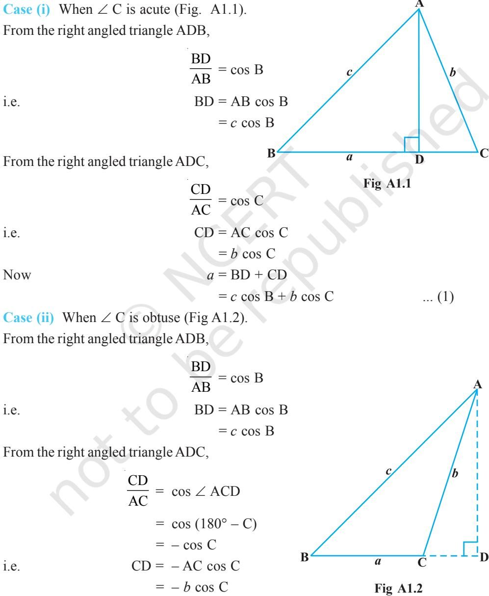
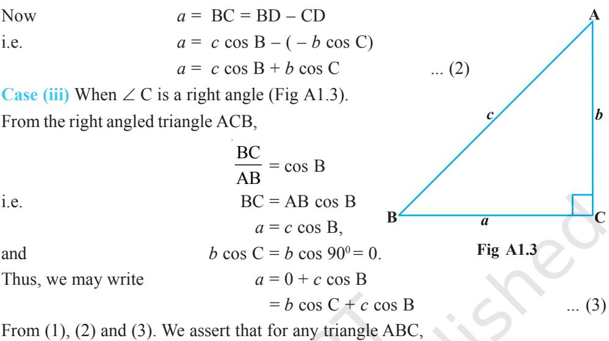

v*Proofs are to Mathematics what calligraphy is to poetry. Mathematical works do consist of proofs just as poems do consist of characters. — VLADIMIR ARNOLD* v

## **A.1.1 Introduction**

In Classes IX, X and XI, we have learnt about the concepts of a statement, compound statement, negation, converse and contrapositive of a statement; axioms, conjectures, theorems and deductive reasoning.

Here, we will discuss various methods of proving mathematical propositions.

## **A.1.2 What is a Proof?**

Proof of a mathematical statement consists of sequence of statements, each statement being justified with a definition or an axiom or a proposition that is previously established by the method of deduction using only the allowed logical rules.

Thus, each proof is a chain of deductive arguments each of which has its premises and conclusions. Many a times, we prove a proposition directly from what is given in the proposition. But some times it is easier to prove an equivalent proposition rather than proving the proposition itself. This leads to, two ways of proving a proposition directly or indirectly and the proofs obtained are called direct proof and indirect proof and further each has three different ways of proving which is discussed below.

**Direct Proof** It is the proof of a proposition in which we directly start the proof with what is given in the proposition.

- **(i) Straight forward approach** It is a chain of arguments which leads directly from what is given or assumed, with the help of axioms, definitions or already proved theorems, to what is to be proved using rules of logic.
Consider the following example:

**Example 1** Show that if *x* 2 – 5*x* + 6 = 0, then *x* = 3 or *x* = 2.

**Solution** *x* 2 – 5*x* + 6 = 0 (given)

- ⇒ (*x* 3) (*x* 2) = 0 (replacing an expression by an equal/equivalent expression)
- ⇒ *x* 3 = 0 or *x* 2 = 0 (from the established theorem *ab* = 0 ⇒ either *a* = 0 or *b* = 0, for *a*, *b* in **R**)
- ⇒ *x* 3 + 3 = 0 + 3 or *x* 2 + 2 = 0 + 2 (adding equal quantities on either side of the equation does not alter the nature of the equation)
- ⇒ *x* + 0 = 3 or *x* + 0 = 2 (using the identity property of integers under addition) ⇒ *x* = 3 or *x* = 2 (using the identity property of integers under addition) Hence, *x* 2 – 5*x* + 6 = 0 implies *x* = 3 or *x* = 2.

**Explanation** Let *p* be the given statement "*x* 2 – 5*x* + 6 = 0" and *q* be the conclusion statement "*x* = 3 or *x* = 2".

From the statement *p*, we deduced the statement *r*: "(*x* – 3) (*x* – 2) = 0" by replacing the expression *x* 2 – 5*x* + 6 in the statement *p* by another expression (*x* – 3) (*x* – 2) which is equal to *x* 2 – 5*x* + 6.

There arise two questions:

- (i) How does the expression (*x* 3) (*x* 2) is equal to the expression *x* 2 – 5*x* + 6?
- (ii) How can we replace an expression with another expression which is equal to the former?

The first one is proved in earlier classes by factorization, i.e.,

$x^{2}-5x+6=x^{2}-3x-2x+6=x\left(x-3\right)-2\left(x-3\right)=\left(x-3\right)\left(x-2\right)$.  
  

The second one is by valid form of argumentation (rules of logic)

Next this statement *r* becomes premises or given and deduce the statement *s* " *x* – 3 = 0 or *x* – 2 = 0" and the reasons are given in the brackets.

This process continues till we reach the conclusion.

The symbolic equivalent of the argument is to prove by deduction that *p* ⇒ *q* is true.

Starting with *p*, we deduce *p* ⇒ *r* ⇒ *s* ⇒ … ⇒ *q*. This implies that "*p* ⇒ *q*" is true.

## **Example 2** Prove that the function *f* : **R** → **R**

defined by *f*(*x*) = 2*x* + 5 is one-one.

**Solution** Note that a function *f* is one-one if

| ⇒ | 2x 1 | + 5 – 5 = |  | 2x |  |  |  |  | + 5 – 5 (adding the same quantity on both sides) |
| --- | --- | --- | --- | --- | --- | --- | --- | --- | --- |
| Now, given that |  | 1 f(x 1 |  |  |  |  |  |  |  |
|  |  |  | ) = ) = |  |  |  |  |  |  |
|  |  |  |  |  | 2 2 |  |  |  |  |
|  |  |  |  |  |  | ) ⇒ x 1 |  |  |  |
|  |  |  |  |  |  |  | = x 1 |  |  |
|  |  |  |  |  |  |  |  | 2 + 5 = 2x | + 5 2 |
|  |  | f (x |  | f (x f(x | 2 | ), i.e., 2x |  |  | (definition of one-one function) |

$$2x_{1}+0=2x_{2}+0$$
 
$$2x_{1}=2x_{2}\,(\text{using additive identity of real number})$$
 
$$\frac{2}{2}\,x_{1}=\frac{2}{2}\,x_{2}\,\,(\text{dividing by the same non zero quantity})$$
 
$$x_{1}=x_{2}$$
  
  
Hence, the given function is one one.  
  

Hence, the given function is one-one.

#### **(ii) Mathematical Induction**

Mathematical induction, is a strategy, of proving a proposition which is deductive in nature. The whole basis of proof of this method depends on the following axiom:

For a given subset S of **N**, if

- (i) the natural number 1 ∈ S and
- (ii) the natural number *k* + 1 ∈ S whenever *k* ∈ S, then S = **N**.

According to the principle of mathematical induction, if a statement "S(*n*) is true for *n* = 1" (or for some starting point *j*), and if "S(*n*) is true for *n* = *k*" implies that "S(*n*) is true for *n* = *k* + 1" (whatever integer *k* ≥ *j* may be), then the statement is true for any positive integer *n*, for all *n* ≥ *j*.

We now consider some examples.

**Example 3** Show that if

$\mathbf{A}=\begin{bmatrix}\cos\theta&\sin\theta\\ -\sin\theta&\cos\theta\end{bmatrix}$, then $\mathbf{A}^{n}=\begin{bmatrix}\cos n\ \theta&\sin n\ \theta\\ -\sin n\ \theta&\cos n\ \theta\end{bmatrix}$

**Solution** We have

$\begin{array}{c}\mbox{P}(n):\mbox{A}^{n}=\left[\begin{array}{cc}\cos n&\theta&\sin n&\theta\\ -\sin n&\theta&\cos n&\theta\end{array}\right]\end{array}$

We note that P(1) : A1

$$P(1):\mathrm{A}^{1}={\left[\begin{array}{l l}{\cos\,\theta}&{\sin\,\theta}\\ {-\sin\,\theta}&{\cos\,\theta}\end{array}\right]}$$

Therefore, P(1) is true.

Assume that P(*k*) is true, i.e.,

$$\mathrm{P}(k):\mathrm{A}^{k}={\left[\begin{array}{l l l}{\cos\,k\,\,\theta}&{\sin\,k\,\,\theta}\\ {-\sin k\,\,\theta}&{\cos\,k\,\,\theta}\end{array}\right]}$$

We want to prove that P(*k* + 1) is true whenever P(*k*) is true, i.e.,

$$\text{P}(k+1):\text{A}^{k+1}=\begin{bmatrix}\cos\,(\,k+1)\,\theta&\sin\,(\,k+1)\,\theta\\ -\sin(k+1)\theta&\cos\,(k+1)\,\theta\end{bmatrix}$$
  
  
Now  
  

$$\text{A}^{k+1}=\text{A}^{k}\,.\,\text{A}$$

Since P(*k*) is true, we have

$$\mathrm{A}^{k+1}=\left[\begin{array}{ccc}\cos k\ \theta&\sin k\ \theta\\ -\sin k\ \theta&\cos k\ \theta\end{array}\right]\ \left[\begin{array}{ccc}\cos\ \theta&\sin\ \theta\\ -\sin\theta&\cos\ \theta\end{array}\right]$$
  
  

$$=\left[\begin{array}{ccc}\cos k\ \theta\ \cos\ \theta-\sin k\ \theta\ \sin\ \theta&\cos k\ \theta\ \sin\ \theta+\sin k\ \theta\ \cos\ \theta\\ -\sin k\ \theta\ \cos\ \theta-\cos k\ \theta\ \sin\ \theta&-\sin k\ \theta\ \sin\ \theta+\cos k\ \theta\ \cos\ \theta\\ \end{array}\right]$$
  
  
(by matrix multiplication)

$$={\left[\begin{array}{l l}{\cos\,(\,k+1)\,\theta}&{\sin\,(\,k+1)\,\theta}\\ {-\sin(k+1)\,\theta}&{\cos\,\,(k+1)\,\theta}\end{array}\right]},$$

Thus, P(*k* + 1) is true whenever P(*k*) is true.

Hence, P(*n*) is true for all *n* ≥ 1 (by the principle of mathematical induction).

### **(iii) Proof by cases or by exhaustion**

This method of proving a statement *p* ⇒ *q* is possible only when *p* can be split into several cases, *r*, *s*, *t* (say) so that *p* = *r* ∨ *s* ∨ *t* (where "∨ " is the symbol for "OR").

If the conditionals *r* ⇒ *q*;

$$s\Rightarrow q;$$

and *t* ⇒ *q*

are proved, then (*r* ∨ *s* ∨ *t*) ⇒ *q*, is proved and so *p* ⇒ *q* is proved.

The method consists of examining every possible case of the hypothesis. It is practically convenient only when the number of possible cases are few.

**Example 4** Show that in any triangle ABC,

$$a=b\,\cos\,\mathrm{C}+c\,\cos\,\mathrm{B}$$

**Solution** Let *p* be the statement "ABC is any triangle" and *q* be the statement "*a* = *b* cos C + *c* cos B"

Let ABC be a triangle. From A draw AD a perpendicular to BC (BC produced if necessary).

As we know that any triangle has to be either acute or obtuse or right angled, we can split *p* into three statements *r*, *s* and *t*, where

*r* : ABC is an acute angled triangle with ∠ C is acute.

- *s* : ABC is an obtuse angled triangle with ∠ C is obtuse.
- *t* : ABC is a right angled triangle with ∠ C is right angle.

Hence, we prove the theorem by three cases.

*a* = *b* cos C + *c* cos B

By case (i), *r* ⇒ *q* is proved.

By case (ii), *s* ⇒ *q* is proved.

By case (iii), *t* ⇒ *q* is proved.

Hence, from the proof by cases, (*r* ∨ *s* ∨ *t*) ⇒ *q* is proved, i.e., *p* ⇒ *q* is proved. **Indirect Proof** Instead of proving the given proposition directly, we establish the proof of the proposition through proving a proposition which is equivalent to the given proposition.

- **(i) Proof by contradiction** (*Reductio Ad Absurdum*) : Here, we start with the assumption that the given statement is false. By rules of logic, we arrive at a conclusion contradicting the assumption and hence it is inferred that the assumption is wrong and hence the given statement is true.
Let us illustrate this method by an example.

**Example 5** Show that the set of all prime numbers is infinite.

**Solution** Let P be the set of all prime numbers. We take the negation of the statement "the set of all prime numbers is infinite", i.e., we assume the set of all prime numbers to be finite. Hence, we can list all the prime numbers as P1 , P2 , P3 ,..., P*k* (say). Note that we have assumed that there is no prime number other than P1 , P2 , P3 ,..., P*k* .

Now consider N = (P1 P2 P3…P*k* ) + 1 ... (1)

N is not in the list as N is larger than any of the numbers in the list.

N is either prime or composite.

If N is a prime, then by (1), there exists a prime number which is not listed.

On the other hand, if N is composite, it should have a prime divisor. But none of the numbers in the list can divide N, because they all leave the remainder 1. Hence, the prime divisor should be other than the one in the list.

Thus, in both the cases whether N is a prime or a composite, we ended up with contradiction to the fact that we have listed all the prime numbers.

Hence, our assumption that set of all prime numbers is finite is false.

Thus, the set of all prime numbers is infinite.

A**Note** Observe that the above proof also uses the method of proof by cases.

- **(ii) Proof by using contrapositive statement of the given statement**
Instead of proving the conditional *p* ⇒ *q*, we prove its equivalent, i.e., ~ *q* ⇒ ~ *p*. (students can verify).

The contrapositive of a conditional can be formed by interchanging the conclusion and the hypothesis and negating both.

**Example 6** Prove that the function *f* : **R** → **R** defined by *f* (*x*) = 2*x* + 5 is one-one.

**Solution** A function is one-one if *f*(*x* 1 ) = *f*(*x* 2 ) ⇒ *x* 1 = *x* 2 .

Using this we have to show that "2*x* 1 + 5 = 2*x* 2 + 5" ⇒ "*x* 1 = *x* 2 ". This is of the form *p* ⇒ *q*, where, *p* is 2*x*1 + 5 = 2*x*2 + 5 and *q* : *x*1 = *x*2 . We have proved this in Example 2 of "direct method".

We can also prove the same by using contrapositive of the statement. Now contrapositive of this statement is ~ *q* ⇒ ~ *p,* i.e., contrapositive of " if *f* (*x*1 ) = *f* (*x*2 ), then *x* 1 = *x*2 " is "if *x* 1 ≠*x* 2 , then *f*(*x* 1 ) ≠ *f* (*x* 2 )".

Now  
  
$\begin{array}{c}\includegraphics[height=56.905512pt]{Fig1}\neq x_{2}\\ \includegraphics[height=56.905512pt]{Fig2}\neq2x_{2}\\ \includegraphics[height=56.905512pt]{Fig3}\neq2x_{2}+5\\ \includegraphics[height=56.905512pt]{Fig4}\neq5(x_{1})\neq f(x_{2}).\end{array}$

Since "~ *q* ⇒ ~ *p*", is equivalent to "*p* ⇒ *q*" the proof is complete.

**Example 7** Show that "if a matrix A is invertible, then A is non singular".

**Solution** Writing the above statement in symbolic form, we have *p* ⇒ *q*, where, *p* is "matrix A is invertible" and *q* is "A is non singular"

Instead of proving the given statement, we prove its contrapositive statement, i.e., if A is not a non singular matrix, then the matrix A is not invertible.

If A is not a non singular matrix, then it means the matrix A is singular, i.e.,

$$|\mathbf{A}|=0$$

Then  
  

$$\mbox{A}^{-1}=\frac{\mbox{\it adjA}}{|\mbox{A}|}\mbox{does not exist as}|\mbox{A}|=0$$

Hence, A is not invertible.

Thus, we have proved that if A is not a non singular matrix, then A is not invertible. i.e., ~ *q* ⇒ ~ *p*.

Hence, if a matrix A is invertible, then A is non singular.

## **(iii) Proof by a counter example**

In the history of Mathematics, there are occasions when all attempts to find a valid proof of a statement fail and the uncertainty of the truth value of the statement remains unresolved.

In such a situation, it is beneficial, if we find an example to falsify the statement. The example to disprove the statement is called a *counter example*. Since the disproof of a proposition *p* ⇒ *q* is merely a proof of the proposition ~ (*p* ⇒ *q*). Hence, this is also a method of proof.

**Example 8** For each *n*, 2 2 1 *n* + is a prime (*n* ∈ **N**). This was once thought to be true on the basis that

> 1 2 2 1 + = 2 2 + 1 = 5 is a prime. 2 2 2 1 + = 2 4 + 1 = 17 is a prime. 3 2 2 1 + = 2 8 + 1 = 257 is a prime.

However, at first sight the generalisation looks to be correct. But, eventually it was shown that 5 2 2 1 + = 2 32 + 1 = 4294967297 which is not a prime since 4294967297 = 641 × 6700417 (a product of two numbers).

So the generalisation "For each *n*, 2 2 1 *n* + is a prime (*n* ∈ **N**)" is false.

Just this one example 5 2 2 1 + is sufficient to disprove the generalisation. This is the counter example.

Thus, we have proved that the generalisation "For each *n*, 2 2 1 *n* + is a prime (*n* ∈ **N**)" is not true in general.

**Example 9** Every continuous function is differentiable.

**Proof** We consider some functions given by

$${\mathrm{(i)}}\ \ f(x)=x^{2}$$

$${\mathrm{(ii)}}\quad g(x)=e^{x}$$

- (iii) *h*(*x*) = sin *x*
These functions are continuous for all values of *x*. If we check for their differentiability, we find that they are all differentiable for all the values of *x*. This makes us to believe that the generalisation "Every continuous function is differentiable" may be true. But if we check the differentiability of the function given by "φ(*x*) = | *x* |" which is continuous, we find that it is not differentiable at *x* = 0. This means that the statement **"**Every continuous function is differentiable" is false, in general. Just this one function *"*φ(*x*) = | *x* |" is sufficient to disprove the statement. Hence, "φ(*x*) = | *x* |" is called a counter example to disprove **"**Every continuous function is differentiable".

**—**v**—**

