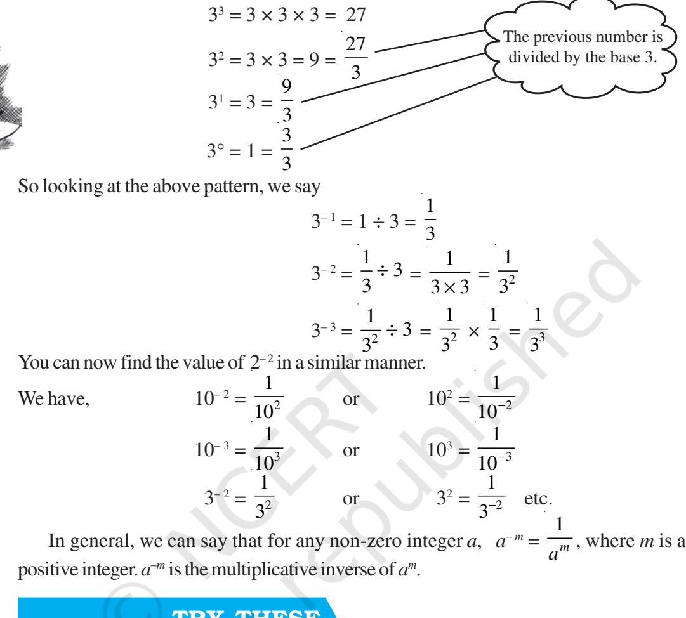
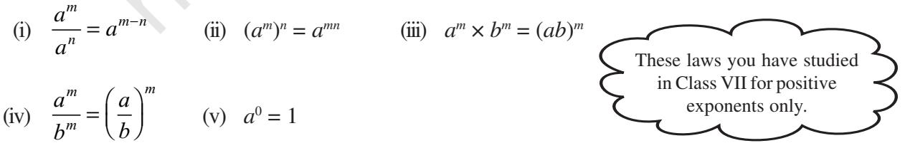
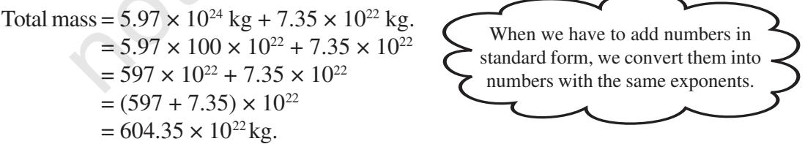
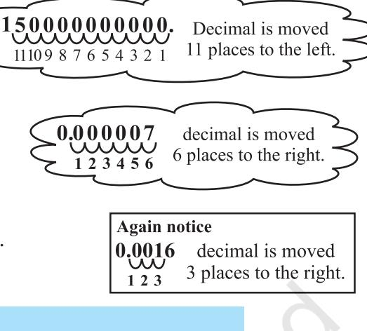

#### 10.1 Introduction **Do you know?** Mass of earth is 5,970,000,000,000, 000, 000, 000, 000 kg. We have already learnt in earlier class how to write such large numbers more conveniently using exponents, as, 5.97 × 1024 kg. We read 1024 as 10 raised to the power 24. We know 25 = 2 × 2 × 2 × 2 × 2 and 2*m* = 2 × 2 × 2 × 2 × ... × 2 × 2 ... (*m* times) Let us now find what is 2– 2 is equal to? 10.2 Powers with Negative Exponents You know that, 102 = 10 × 10 = 100 101 = 10 = 100 10 100 = 1 = 10 10 10– 1 = ? Continuing the above pattern we get,10– 1 = 1 10 Similarly 10– 2 = 2 1 11 1 1 10 10 10 10 100 10 ÷= × = = 10– 3 = 3 1 11 1 1 10 100 100 10 1000 10 ÷= × = = Exponent is a negative integer. As the exponent decreases by1, the value becomes one-tenth of the previous value.

What is 10– 10 equal to?

Now consider the following.

## TRY THESE

| Find the multiplicative inverse of the following. |  |  |  |  |  |  |  |  |  |
| --- | --- | --- | --- | --- | --- | --- | --- | --- | --- |
| (i) | 2– 4 | (ii) | 10– 5 | (iii) | 7– 2 | (iv) | 5– 3 | (v) | 10– 100 |

We learnt how to write numbers like 1425 in expanded form using exponents as 1 × 103 + 4 × 102 + 2 × 101 + 5 × 10°.

Let us see how to express 1425.36 in expanded form in a similar way.

TRY THESE We have 1425.36 = 1 × 1000 + 4 × 100 + 2 × 10 + 5 × 1 + 3 6 10 100 + = 1 × 103 + 4 × 102 + 2 × 10 + 5 × 1 + 3 × 10– 1 + 6 × 10– 2 Expand the following numbers using exponents. (i) 1025.63 (ii) 1256.249 10– 1 = 1 10 , 10– 2 = 2 1 1 10 100 =

## 10.3 Laws of Exponents

We have learnt that for any non-zero integer *a*, *am* × *an* = *am* + *n* , where *m* and *n* are natural numbers. Does this law also hold if the exponents are negative? Let us explore.

- (i) We know that 2 3 = 3 1 2 and 2 – 2 = 2 1 2 Therefore, 3 2 2 2 − − × = 3 2 3 2 32 11 1 1 22 22 2 + ×= = = × 2 – 5 (ii) Take (–3)– 4 × (–3)–3 (–3)– 4 ×(–3)–3 = 4 3 1 1 ( 3) ( 3) × − − = 4 3 43 1 1 ( 3) ( 3) ( 3) + = − ×− − = (–3)–7 (iii) Now consider 5–2 × 54 5–2 × 54 = 4 4 4 2 2 2 1 5 5 5 5 5 − ×= = = 5(2) (iv) Now consider (–5)– 4 × (–5)2 (–5)– 4 × (–5)2 = 2 2 4 4 4 2 1 ( 5) 1 ( 5) ( 5) ( 5) ( 5) ( 5)− − ×− = = − − − ×− = 4 2 1 ( 5) − − = (–5)– (2) *m* 1 *m a a* − = for any non-zero integer *a*. In Class VII, you have learnt that for any non-zero integer *a*, *m m n n a a a* − = , where *m* and *n* are natural numbers and *m* > *n*. –5 is the sum of two exponents – 3 and – 2 (– 4) + (–3) = – 7 (–2) + 4 = 2 (– 4) + 2 = –2
In general, we can say that for any non-zero integer *a*, *am* × *an* = *am* + *n* , where *m* and *n* are integers.

## TRY THESE

Simplify and write in exponential form. (i) (–2)–3 × (–2)– 4 (ii) *p*3 × *p*–10 (iii) 32

On the same lines you can verify the following laws of exponents, where *a* and *b* are non zero integers and *m*, *n* are any integers.

× 3–5 × 36

Let us solve some examples using the above Laws of Exponents.

Example 1: Find the value of

$$\begin{array}{l l l}{{\mathrm{(i)}}}&{{2^{-3}}}&{{}}&{{\mathrm{(ii)}}}\end{array}\begin{array}{l l}{{\frac{1}{3^{-2}}}}\end{array}$$

Solution:

$${\textbf{(i)}}\quad2^{-3}={\frac{1}{2^{3}}}={\frac{1}{8}}\qquad{\textbf{(ii)}}\quad{\frac{1}{3^{-2}}}=3^{2}=3\times3=9$$

#### Example 2: Simplify

- (i) (– 4)5 × (– 4)–10 (ii) 25 ÷ 2– 6
Solution:

(i) (– 4)5 × (– 4)–10 = (– 4) (5 – 10) = (– 4)–5 = 5 1 ( 4) − (*am* × *an*

(ii) $2^{5}\div2^{-6}=2^{5-(-6)}=2^{11}$ ($a^{m}\div a^{n}=a^{m-n}$)

Example 3: Express 4– 3 as a power with the base 2.

Solution: We have, 4 = 2 × 2 = 22

Therefore, (4)– 3 = (2 × 2)– 3 = (22 ) – 3 = 22 × (– 3) = 2– 6 [(*am*) *n* Example 4: Simplify and write the answer in the exponential form.

- (i) (25 ÷ 28 ) 5 × 2– 5 (ii) (– 4)– 3 × (5)– 3 × (–5)– 3 4
(iii) $\frac{1}{8}\times(3)^{-3}$ (iv) (-3)${}^{4}\times\left(\frac{5}{3}\right)^{4}$

Solution:

- (i) (25 ÷ 28 )5 × 2– 5 = (25 – 8)5 × 2– 5 = (2– 3)5 × 2– 5 = 2– 15 – 5 = 2–20 = 20 1 2 (ii) (– 4)– 3 × (5)– 3 × (–5)–3 = [(– 4) × 5 × (–5)]– 3 = [100]– 3 = 3 1 100
[using the law $a^{m}\times b^{m}=(ab)^{m}$, $a^{-m}=\frac{1}{a^{m}}$]

(iii) $\frac{1}{8}\times(3)^{-3}=\frac{1}{2^{3}}\times(3)^{-3}=2^{-3}\times3^{-3}=(2\times3)^{-3}=6^{-3}=\frac{1}{6^{3}}$. (iv) $\left(\frac{5}{3}\right)^{4}\times\left(\frac{5}{3}\right)^{4}=(-1\times3)^{4}\times\frac{5^{4}}{3^{4}}=(-1)^{4}\times3^{4}\times\frac{5^{4}}{3^{4}}$  
  

$$=(-1)^{4}\times5^{4}\ =5^{4}\qquad\left[(-1)^{4}=1\right]$$

Example 5: Find *m* so that (–3)*m* + 1 × (–3)5 = (–3)7 Solution: (–3)*m* + 1 × (–3)5 = (–3)7 (–3)*m* + 1+ 5 = (–3)7 (–3)*m* + 6 = (–3)7

On both the sides powers have the same base different from 1 and – 1, so their exponents must be equal.

$$(a^{m}\times a^{n}=a^{m+n},a^{-m}={\frac{1}{a^{m}}})$$

$$[(a^{m})^{n}=a^{m n}]$$

$${\mathrm{Report~}}2024{\mathrm{-}}25$$

=

Therefore, *m* + 6 = 7 or *m* = 7 – 6 = 1

Example 6: Find the value of

*an* = 1 only if *n* = 0. This will work for any *a*. For *a* = 1, 11 = 12 = 13 = 1– 2 = ... = 1 or (1)*n* 1 for infinitely many *n*. For *a* = –1, (–1)0 = (–1)2 = (–1)4 = (–1)–2 = ... = 1 or (–1) *p* = 1 for any even integer *p*.

  
  
**Solution:**: $\left(\frac{2}{3}\right)^{-2}=\frac{2^{-2}}{3^{-2}}=\frac{3^{2}}{2^{2}}=\frac{9}{4}$  
  
**Example 7:** Simplify (i) $\left\{\left(\frac{1}{3}\right)^{-2}-\left(\frac{1}{2}\right)^{-3}\right\}+\left(\frac{1}{4}\right)^{-2}\right.$  
  
In general, $\left(\frac{a}{b}\right)^{-m}=\left(\frac{b}{a}\right)^{m}$

Solution:

 (i) 1 3 1 2 1 4 23 2 − ÷ −− − **=**  1 3 1 2 1 4 2 2 3 3 2 2 − − − − − − − ÷ = 3 1 2 1 4 1 9 8 16 1 16 2 2 3 3 2 2 − ÷ =−÷ = { } (ii) 5 8 8 5 7 5 × − − = 7575 ( 7) – ( 5) ( 5) ( 7) 7557 5858 5 8 8558 −−−− − − − −− −−−− ×=×= × = 2 2 2 2 8 64 5 8 5 25 − ×= =

2 3 2

 − .

## EXERCISE 10.1

- **1.** Evaluate.
(i) 3–2 (ii) (– 4)– 2 (iii) 1 2 −

- 5

- **2.** Simplify and express the result in power notation with positive exponent.
(i) $(-4)^{5}\div(-4)^{8}$ (ii) $\left(\frac{1}{2^{3}}\right)^{2}$  
  
(iii) $(-3)^{4}\times\left(\frac{5}{3}\right)^{4}$ (iv) $(3^{-7}\div3^{-10})\times3^{-5}$ (v) $2^{-3}\times(-7)^{-3}$

- **3.** Find the value of.
(i) $(3^{\circ}+4^{-\,1})\times2^{2}$ (ii) $(2^{-\,1}\times4^{-\,1})\div2^{-\,2}$ (iii) $\left(\frac{1}{2}\right)^{-2}+\left(\frac{1}{3}\right)^{-2}+\left(\frac{1}{4}\right)^{-2}$

(iv) $(3^{-1}+4^{-1}+5^{-1})^{0}$ (v) $\left\{\left(\frac{-2}{3}\right)^{-2}\right\}^{2}$  
  
**4.** Evaluate (i) $\frac{8^{-1}\times5^{3}}{2^{-4}}$ (ii) $(5^{-1}\times2^{-1})\times6^{-1}$

- **5.** Find the value of *m* for which 5*m* ÷ 5– 3 = 55 .
  
  
**6.** Evaluate (i) $\left\{\left(\frac{1}{3}\right)^{-1}-\left(\frac{1}{4}\right)^{-1}\right\}^{-1}$ (ii)$\left(\frac{5}{8}\right)^{-7}\times\left(\frac{8}{5}\right)^{-4}$  
  
**7.** Simplify.  
  

- **7.** Simplify.
(i) $\frac{25\times t^{-4}}{5^{-3}\times10\times t^{-8}}$ ($t\neq0$) (ii) $\frac{3^{-5}\times10^{-5}\times125}{5^{-7}\times6^{-5}}$

### 10.4 Use of Exponents to Express Small Numbers in Standard Form

Observe the following facts.

- 1. The distance from the Earth to the Sun is 149,600,000,000 m.
- 2. The speed of light is 300,000,000 m/sec.
- 3. Thickness of Class VII Mathematics book is 20 mm.
- 4. The average diameter of a Red Blood Cell is 0.000007 mm.
- 5. The thickness of human hair is in the range of 0.005 cm to 0.01 cm.
- 6. The distance of moon from the Earth is 384, 467, 000 m (approx).
- 7. The size of a plant cell is 0.00001275 m.
- 8. Average radius of the Sun is 695000 km.
- 9. Mass of propellant in a space shuttle solid rocket booster is 503600 kg.
- 10. Thickness of a piece of paper is 0.0016 cm.
- 11. Diameter of a wire on a computer chip is 0.000003 m.
- 12. The height of Mount Everest is 8848 m.

Observe that there are few numbers which we can read like 2 cm, 8848 m,

6,95,000 km. There are some large numbers like 150,000,000,000 m and some very small numbers like 0.000007 m.

Identify very large and very small numbers from the above facts and write them in the adjacent table:

We have learnt how to express very large numbers in standard form in the previous class.

| Very large numbers | Very small numbers |
| --- | --- |
| 150,000,000,000 m | 0.000007 m |
| --------------- | --------------- |
| --------------- | --------------- |
| --------------- | --------------- |
| --------------- | --------------- |

For example: 150,000,000,000 = 1.5 × 1011 Now, let us try to express 0.000007 m in standard form.

$$0.000007={\frac{7}{1000000}}={\frac{7}{10^{6}}}=7\times10^{-6}$$

0.000007 m = 7 × 10– 6 m

Similarly, consider the thickness of a piece of paper which is 0.0016 cm.

$\begin{array}{l}0.0016=\frac{16}{10000}=\frac{1.6\times10}{10^{4}}=1.6\times10\times10^{-4}\\ =1.6\times10^{-3}\end{array}$

Therefore, we can say thickness of paper is 1.6 × 10– 3 cm.

## TRY THESE

- 1. Write the following numbers in standard form.
(i) 0.0000000564 (ii) 0.00000021 (iii) 216000000 (iv) 152400000

- 2. Write all the facts given in the standard form.
#### 10.4.1 Comparing very large and very small numbers

The diameter of the Sun is 1.4 × 109 m and the diameter of the Earth is 1.2756 × 107 m. Suppose you want to compare the diameter of the Earth, with the diameter of the Sun.

> Diameter of the Sun = 1.4 × 109 m Diameter of the earth = 1.2756 × 107 m

Therefore 9 7 1.4 10 1.2756 10 × × = 9–7 1.4 10 1.2756 × = 1.4 100 1.2756 × which is approximately 100

So, the diameter of the Sun is about 100 times the diameter of the earth. Let us compare the size of a Red Blood cell which is 0.000007 m to that of a plant cell which is 0.00001275 m.

> Size of Red Blood cell = 0.000007 m = 7 × 10– 6 m Size of plant cell = 0.00001275 = 1.275 × 10– 5 m

Therefore, $\frac{7\times10^{-6}}{1.275\times10^{-5}}=\frac{7\times10^{-6-(-5)}}{1.275}=\frac{7\times10^{-1}}{1.275}=\frac{0.7}{1.275}=\frac{0.7}{1.3}=\frac{1}{2}$ (approx.)

So a red blood cell is half of plant cell in size.

Mass of earth is 5.97 × 1024 kg and mass of moon is 7.35 × 1022 kg. What is the total mass?

The distance between Sun and Earth is 1.496 × 1011m and the distance between Earth and Moon is 3.84 × 108 m.

During solar eclipse moon comes in between Earth and Sun.

At that time what is the distance between Moon and Sun.

Distance between Sun and Earth = 1.496 × 1011m Distance between Earth and Moon = 3.84 × 108 m Distance between Sun and Moon = 1.496 × 1011 – 3.84 × 108 = 1.496 × 1000 × 108 – 3.84 × 108 = (1496 – 3.84) × 108 m = 1492.16 × 108 m Example 8: Express the following numbers in standard form. (i) 0.000035 (ii) 4050000 Solution: (i) 0.000035 = 3.5 × 10– 5 (ii) 4050000 = 4.05 × 106 Example 9: Express the following numbers in usual form. (i) 3.52 × 105 (ii) 7.54 × 10– 4 (iii) 3 × 10– 5 Solution: (i) 3.52 × 105 = 3.52 × 100000 = 352000 (ii) 7.54 × 10– 4 = 4 7.54 7.54 10 10000 = = 0.000754 (iii) 3 × 10– 5 = 5 3 3 10 100000 = = 0.00003 EXERCISE 10.2 **1.** Express the following numbers in standard form. (i) 0.0000000000085 (ii) 0.00000000000942 (iii) 6020000000000000 (iv) 0.00000000837 (v) 31860000000 **2.** Express the following numbers in usual form. (i) 3.02 × 10– 6 (ii) 4.5 × 104 (iii) 3 × 10– 8 (iv) 1.0001 × 109 (v) 5.8 × 1012 (vi) 3.61492 × 106 **3.** Express the number appearing in the following statements in standard form. (i) 1 micron is equal to 1 1000000 m. (ii) Charge of an electron is 0.000,000,000,000,000,000,16 coulomb. (iii) Size of a bacteria is 0.0000005 m (iv) Size of a plant cell is 0.00001275 m (v) Thickness of a thick paper is 0.07 mm Again we need to convert numbers in standard form into a numbers with the same exponents.

- **4.** In a stack there are 5 books each of thickness 20mm and 5 paper sheets each of thickness 0.016 mm. What is the total thickness of the stack.
# WHAT HAVE WE DISCUSSED?

- **1.** Numbers with negative exponents obey the following laws of exponents.
(a) $a^{m}\times a^{n}=a^{m+n}$ (b) $a^{m}\div a^{n}=a^{m-n}$ (c) $(a^{m})^{n}=a^{m}$ (d) $a^{m}\times b^{m}=(ab)^{m}$ (e) $a^{0}=1$ (f) $\frac{a^{m}}{b^{m}}=\Biggr{(}\frac{a}{b}\Biggr{)}^{m}$

- **2.** Very small numbers can be expressed in standard form using negative exponents.
