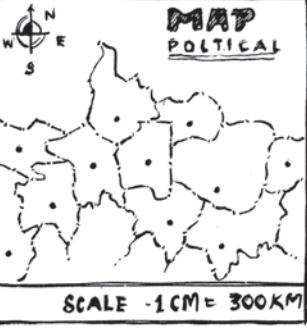

# 11.1 Introduction

Mohan prepares tea for himself and his sister. He uses 300 mL of water, 2 spoons of sugar, 1 spoon of tea leaves and 50 mL of milk. How much quantity of each item will he need, if he has to make tea for five persons?

If two students take 20 minutes to arrange chairs for an assembly, then how much time would five students take to do the same job?

We come across many such situations in our day-to-day life, where we need to see variation in one quantity bringing in variation in the other quantity.

- (i) If the number of articles purchased increases, the total cost also increases.
- (ii) More the money deposited in a bank, more is the interest earned.
- (iii) As the speed of a vehicle increases, the time taken to cover the same distance decreases.
- (iv) For a given job, more the number of workers, less will be the time taken to complete the work.

Observe that change in one quantity leads to change in the other quantity.

Write five more such situations where change in one quantity leads to change in another quantity.

How do we find out the quantity of each item needed by Mohan? Or, the time five students take to complete the job?

To answer such questions, we now study some concepts of variation.

### 11.2 Direct Proportion

If the cost of 1 kg of sugar is 36, then what would be the cost of 3 kg sugar? It is 108.

Similarly, we can find the cost of 5 kg or 8 kg of sugar. Study the following table.

Observe that as weight of sugar increases, cost also increases in such a manner that their ratio remains constant.

Take one more example. Suppose a car uses 4 litres of petrol to travel a distance of 60 km. How far will it travel using 12 litres? The answer is 180 km. How did we calculate it? Since petrol consumed in the second instance is 12 litres, i.e., three times of 4 litres, the distance travelled will also be three times of 60 km. In other words, when the petrol consumption becomes three-fold, the distance travelled is also three fold the previous one. Let the consumption of petrol be *x* litres and the corresponding distance travelled be *y* km . Now, complete the following table:

| Petrol in litres (x) | 4 | 8 | 12 | 15 | 20 | 25 |
| --- | --- | --- | --- | --- | --- | --- |
| Distance in km (y) | 60 | ... | 180 | ... | ... | ... |

We find that as the value of *x* increases, value of *y* also increases in such a way that the ratio *x y* does not change; it remains constant (say *k*). In this case, it is 1 15 (check it!).

We say that *x* **and** *y* **are in direct proportion**, **if =** *x k y*  **or** *x* **=** *ky***.**

In this example, 4 12 60 180 = , where 4 and 12 are the quantities of petrol consumed in litres (*x*) and 60 and 180 are the distances (*y*) in km. So when *x* and *y* are in **direct**

**proportion**, we can write 1 2 1 2 *x x y y* = . [*y*1 , *y*2 are values of *y* corresponding to the values *x*1 , *x*2 of *x* respectively]

The consumption of petrol and the distance travelled by a car is a case of direct proportion. Similarly, the total amount spent and the number of articles purchased is also an example of direct proportion.

Think of a few more examples for direct proportion. Check whether Mohan [in the initial example] will take 750 mL of water, 5 spoons of sugar, 1 2 2 spoons of tea leaves and 125 mL of milk to prepare tea for five persons! Let us try to understand further the concept of direct proportion through the following activities.

### DO THIS

- (i) Take a clock and fix its minute hand at 12.
	- Record the angle turned through by the minute hand from its original position and the time that has passed, in the following table:

| Time Passed (T) | (T1 | ) | (T2 | ) | (T3 | ) | (T4 | ) |
| --- | --- | --- | --- | --- | --- | --- | --- | --- |
|  | 15 |  | 30 |  | 45 |  | 60 |  |
| Angle turned (A) | (A 1 | ) | (A | ) 2 | (A 3 | ) | (A 4 | ) |
|  | 90 |  | ... |  | ... |  | ... |  |
|  | ... |  | ... |  | ... |  | ... |  |
| (in minutes) (in degree) T A |  |  |  |  |  |  |  |  |

What do you observe about T and A? Do they increase together?

Is T A same every time?

Is the angle turned through by the minute hand directly proportional to the time that has passed? Yes!

From the above table, you can also see

$\mathbf{T}_{1}:\mathbf{T}_{2}=\mathbf{A}_{1}:\mathbf{A}_{2}$, because  
  
$\mathbf{T}_{1}:\mathbf{T}_{2}=15:30=1:2$  
  
$\mathbf{A}_{1}:\mathbf{A}_{2}=90:180=1:2$  
  
$\mathbf{T}_{2}:\mathbf{T}_{3}=\mathbf{A}_{2}:\mathbf{A}_{3}$, and $\mathbf{T}_{3}:\mathbf{T}_{4}$

Check if T2

 = A3 You can repeat this activity by choosing your own time interval.

- (ii) Ask your friend to fill the following table and find the ratio of his age to the corresponding age of his mother.

|  | Age | Present | Age |
| --- | --- | --- | --- |
|  | five years ago | age | after five years |
| Friend's age (F) |  |  |  |
| Mother's age (M) |  |  |  |
| F |  |  |  |
| M |  |  |  |

What do you observe?

Do F and M increase (or decrease) together? Is F M same every time? No! You can repeat this activity with other friends and write down your observations.

: A4

Thus, variables increasing (or decreasing) together need not always be in direct proportion. For example:

- (i) physical changes in human beings occur with time but not necessarily in a predetermined ratio.
- (ii) changes in weight and height among individuals are not in any known proportion and
- (iii) there is no direct relationship or ratio between the height of a tree and the number of leaves growing on its branches. Think of some more similar examples.

### TRY THESE

- 1. Observe the following tables and find if *x* and *y* are directly proportional.

| (i) | x | 20 | 17 | 14 | 11 | 8 | 5 | 2 |
| --- | --- | --- | --- | --- | --- | --- | --- | --- |
|  | y | 40 | 34 | 28 | 22 | 16 | 10 | 4 |
| (ii) | x | 6 | 10 | 14 | 18 | 22 | 26 | 30 |
|  | y | 4 | 8 | 12 | 16 | 20 | 24 | 28 |
| (iii) | x | 5 | 8 | 12 | 15 | 18 | 20 |  |
|  | y | 15 | 24 | 36 | 60 | 72 | 100 |  |

- 2. Principal = 1000, Rate = 8% per annum. Fill in the following table and find which type of interest (simple or compound) changes in direct proportion with time period.

| Time period | 1 year | 2 years | 3 years |  |  |  |  |  |  |  |  |
| --- | --- | --- | --- | --- | --- | --- | --- | --- | --- | --- | --- |
| Simple Interest (in ) | t | r |  |  | P | 1 | + | − | P |  |  |
| Compound Interest (in ) |  |  |  |  |  |  |  |  |  |  |  |

# THINK, DISCUSS AND WRITE

If we fix time period and the rate of interest, simple interest changes proportionally with principal. Would there be a similar relationship for compound interest? Why?

Let us consider some solved examples where we would use the concept of direct proportion.

Example 1: The cost of 5 metres of a particular quality of cloth is 210. Tabulate the cost of 2, 4, 10 and 13 metres of cloth of the same type.

Solution: Suppose the length of cloth is *x* metres and its cost, in , is *y*.

| x | 2 | 4 | 5 | 10 | 13 |
| --- | --- | --- | --- | --- | --- |
| y | y 2 | y 3 | 210 | y 4 | y 5 |

100

As the length of cloth increases, cost of the cloth also increases in the same ratio. It is a case of direct proportion.

We make use of the relation of type 1 2 1 2 *x x y y* = (i) Here *x*1 = 5, *y*1 = 210 and *x*2 = 2 Therefore, 1 2 1 2 *x x y y* = gives 2 5 2 210 *y* = or 5*y*2 = 2 × 210 or 2 2 210 5 *y* × = = 84 (ii) If *x*3 = 4, then 3 5 4 210 *y* = or 5*y*3 = 4 × 210 or 3 4 210 5 *y* × = = 168 [Can we use 2 3 2 3 *x x y y* = here? Try!] (iii) If *x*4 = 10, then 4 5 10 210 *y* = or 4 10 210 5 *y* × = = 420 (iv) If *x*5 = 13, then 5 5 13 210 *y* = or 5 13 210 5 *y* × = = 546 Note that here we can also use or or in the place 2 84 4 168 10 420 of 5 210 

Example 2: An electric pole, 14 metres high, casts a shadow of 10 metres. Find the height of a tree that casts a shadow of 15 metres under similar conditions.

Solution: Let the height of the tree be *x* metres. We form a table as shown below:

| height of the object (in metres) | 14 | x |
| --- | --- | --- |
| length of the shadow (in metres) | 10 | 15 |

Note that more the height of an object, the more would be the length of its shadow.

Hence, this is a case of direct proportion. That is, 1 1 *x y* = 2 2 *x y*

(Why?)

We have

or

or

So 21 = *x*

Thus, height of the tree is 21 metres.

14 10 = 15 *x*

14 15 10

14 3 2 ×

× = *x*

= *x*

Alternately, we can write 1 2 1 2 *x x y y* = as 1 1 2 2 *x y x y* =

| so | x : x = y 1 2 | 1 | : y 2 |
| --- | --- | --- | --- |
| or | 14 : x = 10 : 15 |  |  |
| Therefore, | 10 | × x = 15 × 14 |  |
| or | 15 × x = 10 | 14 | = 21 |

Example 3: If the weight of 12 sheets of thick paper is 40 grams, how many sheets of the same paper would weigh 1 2 2 kilograms?

### Solution:

Let the number of sheets which weigh 1 2 2 kg be *x*. We put the above information in the form of a table as shown below:

| 12 x Number of sheets |  |  |  |
| --- | --- | --- | --- |
| Weight of sheets (in grams) 40 2500 |  |  |  |
| More the number of sheets, the more would their weight be. So, the number of sheets and their weights |  |  | 1 kilogram = 1000 grams |
| are directly proportional to each other. 1 |  |  |  |
| 2 12 x 2 | So, |  | kilograms = 2500 grams |
| 40 = 2500 |  |  |  |
| 12 × 2500 |  |  |  |
| = x 40 | or |  |  |
| 750 = x | or |  |  |
| Thus, the required number of sheets of paper = 750. |  |  |  |
| Alternate method: |  |  |  |
|  |  | x = k |  |
| Two quantities x and y which vary in direct proportion have the relation x = ky or number of sheets 12 3 |  | y |  |
| = k = = | Here, |  |  |
| weight of sheets in grams 40 10 |  |  |  |
| 1 2 Now x is the number of sheets of the paper which weigh |  |  |  |
| 2 kg [2500 g]. |  |  |  |
| 3 |  |  |  |
| Using the relation x = ky, x = 10 × 2500 = 750 |  |  |  |
| 1 2 Thus, 750 sheets of paper would weigh 2 kg. |  |  |  |
| Example 4: A train is moving at a uniform speed of 75 km/hour. |  |  |  |

(i) How far will it travel in 20 minutes?

- (ii) Find the time required to cover a distance of 250 km.
Solution: Let the distance travelled (in km) in 20 minutes be *x* and time taken (in minutes) to cover 250 km be *y*.

| 1 hour = 60 minutes | Distance travelled (in km) | 75 | x | 250 |
| --- | --- | --- | --- | --- |
|  | Time taken (in minutes) | 60 | 20 | y |

Since the speed is uniform, therefore, the distance covered would be directly proportional to time.

* We have $\frac{75}{60}=\frac{x}{20}$ or $\frac{75}{60}\times20\ =x$ or $x=25$ So, the train will cover a distance of 25 km in 20 minutes.  
* Also, $\frac{75}{60}=\frac{250}{y}$ or $y=\frac{250\times60}{75}=200$ minutes or 3 hours 20 minutes. Therefore, 3 hours 20 minutes will be required to cover a distance of 250 kilometres.  
  

Therefore, 3 hours 20 minutes will be required to cover a distance of 250 kilometres.

Alternatively, when *x* is known, then one can determine *y* from the relation 250 20 *x y* = .

You know that a map is a miniature representation of a very large region. A scale is usually given at the bottom of the map. The scale shows a relationship between actual length and the length represented on the map. The scale of the map is thus the ratio of the distance between two points on the map to the actual distance between two points on the large region.

For example, if 1 cm on the map represents 8 km of actual distance [i.e., the scale is 1 cm : 8 km or 1 : 800,000] then 2 cm on the same map will represent 16 km. Hence, we can say that scale of a map is based on the concept of direct proportion.

Example 5: The scale of a map is given as 1:30000000. Two cities are 4 cm apart on the map. Find the actual distance between them.

Solution: Let the map distance be *x* cm and actual distance be *y* cm, then

  
  
**or**  
  
**or**  
  
**or**  
  
**or**  
  
**or**  
  
**or**  
  
**or**  
  
**or**  
  
**or**  
  
**or**  
  
**or**  
  
**or**  
  
**or**  
  
**or**  
  
**or**  
  
**or**  
  
**or**  
  
**or**  
  
**or**  
  
**or**  
  
**or**  
  
**or**  
  
**or**  
  
**or**  
  
**or**  
  
**or**  
  
**or**  
  
**or**  
  
**or**  
  
**or**  
  
**or**  
  
**or**  
  
**or**  
  
**or**  
  
**or**  
  
**or**  
  
**or**  
  
**or**  
  
**or**  
  
**or**  
  
**or**  
  
**or**  
  
**or**  
  
**or**  
  
**or**  
  
**or**  
  
**or**  
  
**or**  
  
**or**  
  
**or**  
  
**or**  
  
**or**  
  
**or**  
  
**or**  
  
**or**  
  
**or**  
  
**or**  
  
**or**  
  
**or**  
  
**or**

Since $x=4$ so, $3\times10^{7}$

3 10 × *y* or *y* = 4 × 3 × 107 = 12 × 107 cm = 1200 km.

 = 4

 = *x y*

1:30000000 = *x* : *y*

1

Thus, two cities, which are 4 cm apart on the map, are actually 1200 km away from each other.

### DO THIS

Take a map of your State. Note the scale used there. Using a ruler, measure the "map distance" between any two cities. Calculate the actual distance between them.

# EXERCISE 11.1

- **1.** Following are the car parking charges near a railway station upto

| 4 hours |  60 |
| --- | --- |
| 8 hours |  100 |
| 12 hours |  140 |
| 24 hours |  180 |

Check if the parking charges are in direct proportion to the parking time.

- **2.** A mixture of paint is prepared by mixing 1 part of red pigments with 8 parts of base. In the following table, find the parts of base that need to be added.

| Parts of red pigment | 1 | 4 | 7 | 12 | 20 |
| --- | --- | --- | --- | --- | --- |
| Parts of base | 8 | ... | ... | ... | ... |

- **3.** In Question 2 above, if 1 part of a red pigment requires 75 mL of base, how much red pigment should we mix with 1800 mL of base?
- **4.** A machine in a soft drink factory fills 840 bottles in six hours. How many bottles will it fill in five hours?
- **5.** A photograph of a bacteria enlarged 50,000 times attains a length of 5 cm as shown in the diagram. What is the *actual* length of the bacteria? If the photograph is enlarged 20,000 times only, what would be its enlarged length?
- **6.** In a model of a ship, the mast is 9 cm high, while the mast of the actual ship is 12 m high. If the length of the ship is 28 m, how long is the model ship?

- **7.** Suppose 2 kg of sugar contains 9 × 106 crystals. How many sugar crystals are there in (i) 5 kg of sugar? (ii) 1.2 kg of sugar?
- **8.** Rashmi has a road map with a scale of 1 cm representing 18 km. She drives on a road for 72 km. What would be her distance covered in the map?
- **9.** A 5 m 60 cm high vertical pole casts a shadow 3 m 20 cm long. Find at the same time (i) the length of the shadow cast by another pole 10 m 50 cm high (ii) the height of a pole which casts a shadow 5m long.
- **10.** A loaded truck travels 14 km in 25 minutes. If the speed remains the same, how far can it travel in 5 hours?

- DO THIS 1. On a squared paper, draw five squares of different sides.

| Write the following information in a tabular form. |  |  |  |  |
| --- | --- | --- | --- | --- |
| Square-1 | Square-2 | Square-3 | Square-4 | Square-5 |

|  | Square-1 | Square-2 | Square-3 | Square-4 | Square-5 |
| --- | --- | --- | --- | --- | --- |
| Length of a side (L) |  |  |  |  |  |
| Perimeter (P) |  |  |  |  |  |
| L |  |  |  |  |  |
| P |  |  |  |  |  |

| Area (A) |
| --- |
| L |
| A |

Find whether the length of a side is in direct proportion to:

- (a) the perimeter of the square.
- (b) the area of the square.
- 2. The following ingredients are required to make halwa for 5 persons:

Suji/Rawa = 250 g, Sugar = 300 g,

Ghee = 200 g, Water = 500 mL.

Using the concept of proportion, estimate the changes in the quantity of ingredients, to prepare halwa for your class.

- 3. Choose a scale and make a map of your classroom, showing windows, doors, blackboard etc. (An example is given here).

# THINK, DISCUSS AND WRITE

Take a few problems discussed so far under 'direct variation'. Do you think that they can be solved by 'unitary method'?

### 11.3 Inverse Proportion

Two quantities may change in such a manner that if one quantity increases, the other quantity decreases and vice versa. For example, as the number of workers increases, time taken to finish the job decreases. Similarly, if we increase the speed, the time taken to cover a given distance decreases.

To understand this, let us look into the following situation.

Zaheeda can go to her school in four different ways. She can walk, run, cycle or go by car. Study the following table.

Observe that as the speed increases, time taken to cover the same distance decreases.

As Zaheeda doubles her speed by running, time reduces to half. As she increases her speed to three times by cycling, time decreases to one third. Similarly, as she increases her speed to 15 times, time decreases to one fifteenth. (Or, in other words the ratio by which time decreases is inverse of the ratio by which the corresponding speed increases). Can we say that speed and time change inversely in proportion?

| Multiplicative inverse of a number | 1 |  |  |  |  |  |  |  |  |  |
| --- | --- | --- | --- | --- | --- | --- | --- | --- | --- | --- |
| is its reciprocal. Thus, | 2 is the |  |  |  |  |  |  |  |  |  |
| inverse of 2 and vice versa. (Note | 1 | 1 |  |  |  |  |  |  |  |  |
| 2 | × | = | × | 2 | = | 1 | that | ). | 2 | 2 |

Let us consider another example. A school wants to spend 6000 on mathematics textbooks. How many books could be bought at 40 each? Clearly 150 books can be bought. If the price of a textbook is more than 40, then the number of books which could be purchased with the same amount of money would be less than 150. Observe the following table.

| Price of each book (in ) | 40 | 50 | 60 | 75 | 80 | 100 |
| --- | --- | --- | --- | --- | --- | --- |
| Number of books that | 150 | 120 | 100 | 80 | 75 | 60 |
| can be bought |  |  |  |  |  |  |

What do you observe? You will appreciate that as the price of the books increases, the number of books that can be bought, keeping the fund constant, will decrease.

Ratio by which the price of books increases when going from 40 to 50 is 4 : 5, and the ratio by which the corresponding number of books decreases from 150 to 120 is 5 : 4. This means that the two ratios are inverses of each other.

Notice that the product of the corresponding values of the two quantities is constant; that is, 40 × 150 = 50 × 120 = 6000.

 If we represent the price of one book as *x* and the number of books bought as *y*, then as *x* increases *y* decreases and vice-versa. It is important to note that the product *xy* remains constant. We say that *x* varies inversely with *y* and *y* varies inversely with *x*. *Thus two quantities x and y are said to vary in inverse proportion, if there exists a relation of the type xy* = *k between them, k being a constant. If y*1 , *y*2  *are the values of y*

*corresponding to the values x*1 , *x*2 *of x respectively then x*1 *y*1 = *x*2 *y*2 (= *k*), *or* 1 2 2 1 *x y x y* = .

We say that *x* and *y* are in **inverse proportion**.

Hence, in this example, cost of a book and number of books purchased in a fixed amount are inversely proportional. Similarly, speed of a vehicle and the time taken to cover a fixed distance changes in inverse proportion.

Think of more such examples of pairs of quantities that vary in inverse proportion. You may now have a look at the furniture – arranging problem, stated in the introductory part of this chapter.

Here is an activity for better understanding of the inverse proportion.

?

What do you observe? As R increases, C decreases.

(i) Is R1 : R2 = C2 : C1 ? (ii) Is R3 : R4 = C4 : C3

- (iii) Are R and C inversely proportional to each other?
Try this activity with 36 counters.

## TRY THESE

Observe the following tables and find which pair of variables (here *x* and *y*) are in inverse proportion.

| (i) | x | 50 | 40 | 30 | 20 |  | (ii) | x | 100 | 200 | 300 | 400 |
| --- | --- | --- | --- | --- | --- | --- | --- | --- | --- | --- | --- | --- |
|  | y | 5 | 6 | 7 | 8 |  |  | y | 60 | 30 | 20 | 15 |
| (iii) | x | 90 | 60 | 45 | 30 | 20 | 5 |  |  |  |  |  |
|  | y | 10 | 15 | 20 | 25 | 30 | 35 |  |  |  |  |  |

*y* .

Let us consider some examples where we use the concept of inverse proportion.

When two quantities *x* and *y* are in direct proportion (or vary directly) they are also written as *x*∝ *y*.

When two quantities *x* and *y* are in inverse proportion (or vary inversely) they are also written as *x*∝ 1

Example 7: 6 pipes are required to fill a tank in 1 hour 20 minutes. How long will it take if only 5 pipes of the same type are used?

### Solution:

Let the desired time to fill the tank be *x* minutes. Thus, we have the following table.

| Number of pipes | 6 | 5 |
| --- | --- | --- |
| Time (in minutes) | 80 | x |

Lesser the number of pipes, more will be the time required by it to fill the tank. So, this is a case of inverse proportion.

Hence, $80\times6=x\times5$ [$x_{1}\,y_{1}=x_{2}\,y_{2}$]

*x*

$$\frac{80\times6}{5}=$$

or

$$\mathrm{or}\qquad\qquad x=96$$

Thus, time taken to fill the tank by 5 pipes is 96 minutes or 1 hour 36 minutes. Example 8: There are 100 students in a hostel. Food provision for them is for 20

]

days. How long will these provisions last, if 25 more students join the group?

Solution: Suppose the provisions last for *y* days when the number of students is 125. We have the following table.

| Number of students | 100 | 125 |
| --- | --- | --- |
| Number of days | 20 | y |

Note that more the number of students, the sooner would the provisions exhaust. Therefore, this is a case of inverse proportion.

or

So, 100 × 20 = 125 × *y* 100 20 125 × = *y* or 16 = *y*

Thus, the provisions will last for 16 days, if 25 more students join the hostel.

Alternately, we can write $x_{1}\,y_{1}=x_{2}\,y_{2}$ as $\frac{x_{1}}{x_{2}}=\frac{y_{2}}{y_{1}}$. That is, $x_{1}:x_{2}=y_{2}:y_{1}$ or $100:125=y:20$ or $y=\frac{100\times20}{125}=16$

Example 9: If 15 workers can build a wall in 48 hours, how many workers will be required to do the same work in 30 hours?

### Solution:

Let the number of workers employed to build the wall in 30 hours be *y*.

We have the following table.

| Number of hours | 48 | 30 |
| --- | --- | --- |
| Number of workers | 15 | y |

Obviously more the number of workers, faster will they build the wall. So, the number of hours and number of workers vary in inverse proportion. So 48 × 15 = 30 × *y*

Therefore, 48 15 30 × = *y* or *y* = 24

i.e., to finish the work in 30 hours, 24 workers are required.

# EXERCISE 11.2

- **1.** Which of the following are in inverse proportion?
	- (i) The number of workers on a job and the time to complete the job.
	- (ii) The time taken for a journey and the distance travelled in a uniform speed.
	- (iii) Area of cultivated land and the crop harvested.
	- (iv) The time taken for a fixed journey and the speed of the vehicle.
	- (v) The population of a country and the area of land per person.
- **2.** In a Television game show, the prize money of 1,00,000 is to be divided equally amongst the winners. Complete the following table and find whether the prize money given to an individual winner is directly or inversely proportional to the number of winners?

| Number of winners | 1 | 2 | 4 | 5 | 8 | 10 | 20 |
| --- | --- | --- | --- | --- | --- | --- | --- |
| Prize for each winner (in ) | 1,00,000 | 50,000 | ... | ... | ... | ... | ... |

- **3.** Rehman is making a wheel using spokes. He wants to fix equal spokes in such a way that the angles between any pair of consecutive spokes are equal. Help him by completing the following table.

| Number of spokes | 4 | 6 | 8 | 10 | 12 |
| --- | --- | --- | --- | --- | --- |
| Angle between a pair of consecutive | 90° | 60° | ... | ... | ... |
| spokes |  |  |  |  |  |

- (i) Are the number of spokes and the angles formed between the pairs of consecutive spokes in inverse proportion?
- (ii) Calculate the angle between a pair of consecutive spokes on a wheel with 15 spokes.
- (iii) How many spokes would be needed, if the angle between a pair of consecutive spokes is 40°?
- **4.** If a box of sweets is divided among 24 children, they will get 5 sweets each. How many would each get, if the number of the children is reduced by 4?
- **5.** A farmer has enough food to feed 20 animals in his cattle for 6 days. How long would the food last if there were 10 more animals in his cattle?
- **6.** A contractor estimates that 3 persons could rewire Jasminder's house in 4 days. If, he uses 4 persons instead of three, how long should they take to complete the job?
- **7.** A batch of bottles were packed in 25 boxes with 12 bottles in each box. If the same batch is packed using 20 bottles in each box, how many boxes would be filled?

- **8.** A factory requires 42 machines to produce a given number of articles in 63 days. How many machines would be required to produce the same number of articles in 54 days?
- **9.** A car takes 2 hours to reach a destination by travelling at the speed of 60 km/h. How long will it take when the car travels at the speed of 80 km/h?
- **10.** Two persons could fit new windows in a house in 3 days.
	- (i) One of the persons fell ill before the work started. How long would the job take now?
	- (ii) How many persons would be needed to fit the windows in one day?
- **11.** A school has 8 periods a day each of 45 minutes duration. How long would each period be, if the school has 9 periods a day, assuming the number of school hours to be the same?

### DO THIS

- 1. Take a sheet of paper. Fold it as shown in the figure. Count the number of parts and the area of a part in each case.

Tabulate your observations and discuss with your friends. Is it a case of inverse proportion? Why?

| Number of parts | 1 | 2 | 4 | 8 | 16 |
| --- | --- | --- | --- | --- | --- |
| Area of each part | area of the paper | 1 2 the area of the paper | ... | ... | ... |

- 2. Take a few containers of different sizes with circular bases. Fill the same amount of water in each container. Note the diameter of each container and the respective height at which the water level stands. Tabulate your observations. Is it a case of inverse proportion?

# WHAT HAVE WE DISCUSSED?

- **1.** Two quantities *x* and *y* are said to be in **direct proportion** if they increase (decrease) together in such a manner that the ratio of their corresponding values remains constant. That is if *x k y* = [*k* is a positive number], then *x* and *y* are said to vary directly. In such a case if *y*1 , *y*2 are the values of *y* corresponding to the values *x*1 , *x*2 of *x* respectively then 1 2 1 2 *x x y y* = .
- **2.** Two quantities *x* and *y* are said to be in **inverse proportion** if an increase in *x* causes a proportional decrease in *y* (and vice-versa) in such a manner that the product of their corresponding values remains constant. That is, if *xy* = *k*, then *x* and *y* are said to vary inversely. In this case if *y*1 , *y*2 are
the values of *y* corresponding to the values *x*1 , *x*2 of *x* respectively then *x*1 *y*1 = *x*2 *y*2 or 1 2 2 1 *x y x y* = .

