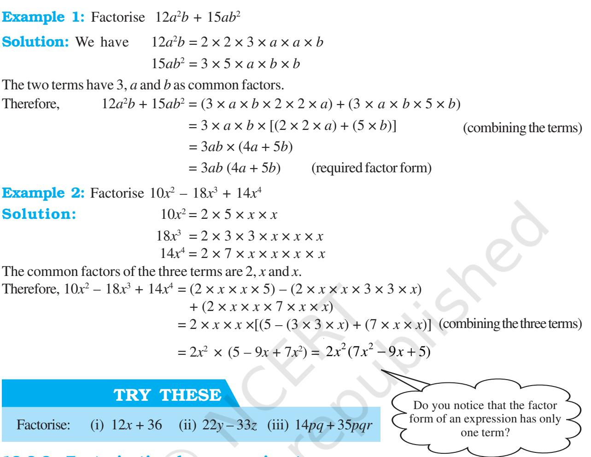

# Factorisation

### 12.1 Introduction

### 12.1.1 Factors of natural numbers

You will remember what you learnt about factors in Class VI. Let us take a natural number, say 30, and write it as a product of other natural numbers, say

| 30 = | 2 × 15 |
| --- | --- |
| = | 3 × 10 = 5 × 6 |

Thus, 1, 2, 3, 5, 6, 10, 15 and 30 are the factors of 30. Of these, 2, 3 and 5 are the prime factors of 30 (Why?)

A number written as a product of prime factors is said to be in the prime factor form; for example, 30 written as 2 × 3 × 5 is in the prime factor form.

The prime factor form of 70 is 2 × 5 × 7.

The prime factor form of 90 is 2 × 3 × 3 × 5, and so on.

Similarly, we can express algebraic expressions as products of their factors. This is what we shall learn to do in this chapter.

### 12.1.2 Factors of algebraic expressions

We have seen in Class VII that in algebraic expressions, terms are formed as products of factors. For example, in the algebraic expression 5*xy* + 3*x* the term 5*xy* has been formed by the factors 5, *x* and *y*, i.e.,

5*xy* = 5× × *yx*

Observe that the factors 5, *x* and *y* of 5*xy* cannot further be expressed as a product of factors. We may say that 5, *x* and *y* are 'prime' factors of 5*xy*. In algebraic expressions, we use the word 'irreducible' in place of 'prime'. We say that 5 × *x* × *y* is the irreducible form of 5*xy*. Note 5 × (*xy*) is not an irreducible form of 5*xy*, since the factor *xy* can be further expressed as a product of *x* and *y*, i.e., *xy* = *x* × *y*.

Note 1 is a factor of 5*xy*, since 5*xy* = ×51 × × *yx* In fact, 1 is a factor of every term. As in the case of natural numbers, unless it is specially required, we do not show 1 as a separate factor of any term.

We know that 30 can also be written as 30 = 1 × 30 Thus, 1 and 30 are also factors of 30. You will notice that 1 is a factor of any number. For example, 101 = 1 × 101. However, when we write a number as a product of factors, we shall not write 1 as a factor, unless it is specially required.

FACTORISATION 145

CHAPTER

12

Next consider the expression 3*x* (*x* + 2). It can be written as a product of factors. 3, *x* and (*x* + 2)

$$3x(x+2)=3\times x\times(x+2)$$

The factors 3, *x* and (*x* +2) are irreducible factors of 3*x* (*x* + 2). Similarly, the expression 10*x* (*x* + 2) (*y* + 3) is expressed in its irreducible factor form as 10*x* (*x* + 2) (*y* + 3) = 2 5 2 3 × × × + × + *x x y* ( ) ( ).

### 12.2 What is Factorisation?

When we factorise an algebraic expression, we write it as a product of factors. These factors may be numbers, algebraic variables or algebraic expressions.

Expressions like 3*xy*, *yx* 2 5 , 2*x* (*y* + 2), 5 (*y* + 1) (*x* + 2) are already in factor form. Their factors can be just read off from them, as we already know.

On the other hand consider expressions like 2*x* + 4, 3*x* + 3*y*, *x* 2 + 5*x, x*2 + 5*x* + 6. It is not obvious what their factors are. We need to develop systematic methods to factorise these expressions, i.e., to find their factors. This is what we shall do now.

### 12.2.1 Method of common factors

- We begin with a simple example: Factorise 2*x* + 4.
We shall write each term as a product of irreducible factors;

Hence  
  
$2x=2\times x$  
  
$4=2\times2$  
  
$2x+4=(2\times x)+(2\times2)$

Notice that factor 2 is common to both the terms. Observe, by distributive law

$$2\times(x+2)=(2\times x)+(2\times2)$$

Therefore, we can write

$$2x+4=2\times(x+2)=2\;(x+2)$$

Thus, the expression 2*x* + 4 is the same as 2 (*x* + 2). Now we can read off its factors: they are 2 and (*x* + 2). These factors are irreducible.

Next, factorise 5*xy* + 10*x*.

The irreducible factor forms of 5*xy* and 10*x* are respectively,

$$\begin{array}{l}{5x y=5\times x\times y}\\ {10x=2\times5\times x}\end{array}$$

Observe that the two terms have 5 and *x* as common factors. Now,

$$\begin{array}{r}{5x y+10x=(5\times x\times y)\ +(5\times x\times2)}\\ {=(5x\times y)\ +(5x\times2)}\end{array}$$

We combine the two terms using the distributive law,

$$(5x\times y)+(5x\times2)=5x\times(\ y+2)$$

Therefore, 5*xy* + 10*x* = 5 *x* (*y* + 2). (This is the desired factor form.)

### 12.2.2 Factorisation by regrouping terms

Look at the expression 2*xy* + 2*y* + 3*x* + 3. You will notice that the first two terms have common factors 2 and *y* and the last two terms have a common factor 3. But there is no single factor common to all the terms. How shall we proceed?

Let us write (2*xy* + 2*y*) in the factor form:

$$\begin{array}{l}\includegraphics[height=142.26375pt]{2x}\includegraphics[height=142.26375pt]{2y}=(2\times x\times y)+(2\times y)\\ =(2\times y\times x)+(2\times y\times1)\\ =(2\times x)+(2\times1)=2y\,(x+1)\\ 3x+3=(3\times x)+(3\times1)\\ =3\times(x+1)=3\,(x+1)\end{array}$$
  
  
Note, we need to show $1$ as a factor.  
  

Hence,  
  
$2xy+2y+3x+3=2y\left(x+1\right)+3\left(x+1\right)$

Observe, now we have a common factor (*x* + 1) in both the terms on the right hand side. Combining the two terms,

2*xy* + 2*y* + 3*x* + 3 = 2*y* (*x* + 1) + 3 (*x* + 1) = (*x* + 1) (2*y* + 3)

The expression 2*xy* + 2*y* + 3*x* + 3 is now in the form of a product of factors. Its factors are (*x* + 1) and (2*y* + 3). Note, these factors are irreducible.

### What is regrouping?

Suppose, the above expression was given as 2*xy* + 3 + 2*y* + 3*x*; then it will not be easy to see the factorisation. Rearranging the expression, as 2*xy* + 2*y* + 3*x* + 3, allows us to form groups (2*xy* + 2*y*) and (3*x* + 3) leading to factorisation. This is regrouping.

Regrouping may be possible in more than one ways. Suppose, we regroup the expression as: 2*xy* + 3*x* + 2*y* + 3. This will also lead to factors. Let us try:

$2xy+3x+2y+3=2\times x\times y+3\times x+2\times y+3$  
  
$=x\times(2y+3)+1\times(2y+3)$  
  
$=(2y+3)\;(x+1)$

The factors are the same (as they have to be), although they appear in different order. Example 3: Factorise 6*xy* – 4*y* + 6 – 9*x.*

### Solution:

**Step 1** Check if there is a common factor among all terms. There is none.

**Step 2** Think of grouping. Notice that first two terms have a common factor 2*y*;

$6xy-4y=2y\left(3x-2\right)$

What about the last two terms? Observe them. If you change their order to – 9*x* + 6, the factor ( 3*x* – 2) will come out;

$9x+6=-3\left(3x\right)+3\left(2\right)$  
  
$=-3\left(3x-2\right)$

**Step 3** Putting (a) and (b) together,

6*xy* – 4*y* + 6 – 9*x* = 6*xy* – 4*y* – 9*x* + 6

= 2*y* (3*x* – 2) – 3 (3*x* – 2) = (3*x* – 2) (2*y* – 3)

The factors of (6*xy* – 4*y* + 6 – 9 *x*) are (3*x* – 2) and (2*y* – 3).

### EXERCISE 12.1

- **1.** Find the common factors of the given terms.
	- (i) 12*x,* 36 (ii) 2*y*, 22*xy* (iii) 14 *pq*, 28*p* 2*q* 2
	- (iv) 2*x*, 3*x* 2 , 4 (v) 6 *abc*, 24*ab*2 , 12 *a* 2*b*
- (vi) 16 *x* 3 , – 4*x* 2 , 32*x* (vii) 10 *pq*, 20*qr*, 30*rp*
- (viii) 3*x* 2  *y*3 , 10*x* 3  *y2 ,*6 *x* 2  *y*2 *z*

**2.** Factorise the following expressions.

(i) $7x-42$ (ii) $6p-12q$ (iii) $7a^{2}+14a$

$$\mathrm{(iv)}\ -16\ z+20\ z^{3}\quad\mathrm{(v)}\ \ 20\ l^{2}\ m+30\ a\ l\ m$$

- (vi) 5 *x*2  *y* – 15 *xy*2 (vii) 10 *a* 2 – 15 *b*2 + 20 *c*2
- (viii) 4 *a*2 + 4 *ab* – 4 *ca* (ix) *x* 2  *y z* + *x y*2 *z* + *x y z*2 (x) *a x*2  *y* + *b x y*2 + *c x y z*
- **3.** Factorise.
	- (i) *x* 2 + *x y* + 8*x* + 8*y* (ii) 15 *xy* – 6*x* + 5*y* – 2

Observe here the given expression is of the form

– 2*ab* + *b*

Where *a* = 2*y*, and *b* = 3 with 2*ab* = 2 × 2*y* × 3 = 12*y*.

2 .

*a* 2

(iii) *ax + bx – ay – by* (iv) 15 *pq* + 15 + 9*q* + 25*p*

(v) *z* – 7 + 7 *x y – x y z*

### 12.2.3 Factorisation using identities

We know that  
  

$$(a+b)^{2}=a^{2}+2ab+b^{2}$$
 (I)  
  

$$(a-b)^{2}=a^{2}-2ab+b^{2}$$
 (II)

(*a – b*) 2 = *a* 2 – 2*ab* + *b* 2 (II)

$(a+b)\,(a-b)\,=a^{2}-b^{2}$ (III)

The following solved examples illustrate how to use these identities for factorisation. What we do is to observe the given expression. If it has a form that fits the right hand side of one of the identities, then the expression corresponding to the left hand side of the identity gives the desired factorisation.

Example 4: Factorise *x* 2 + 8*x* + 16

Solution: Observe the expression; it has three terms. Therefore, it does not fit Identity III. Also, it's first and third terms are perfect squares with a positive sign before the middle term. So, it is of the form *a* 2 + 2*ab* + *b* 2 where *a* = *x* and *b* = 4

such that *a*

$${}^{2}+2a b+b^{2}=\ x^{2}+2\ (x)\ (4)+4^{2}$$

Since *a*

$$=x^{2}+8x+16,$$
  

$$a^{2}+2a b+b^{2}=(a+b)^{2},$$

by comparison *x* 2 + 8*x* + 16 = ( *x* + 4)2 (the required factorisation)

2

Example 5: Factorise 4*y* 2 *–* 12*y* + 9

Solution: Observe 4*y* 2 = (2*y*) 2 , 9 = 32 and 12*y* = 2 × 3 × (2*y*) Therefore, 4*y* 2 *–* 12*y* + 9 = (2*y*) 2 – 2 × 3 × (2*y*) + (3)2

(required factorisation)

Example 6: Factorise 49*p* 2 *–* 36

Solution: There are two terms; both are squares and the second is negative. The expression is of the form (*a* 2  *– b*2 ). Identity III is applicable here;

= ( 2*y* – 3)2

$49p^{2}-36=(7p)^{2}-(6)^{2}$  
  
$=(7p-6)(7p+6)$ (required factorisation)

Example 7: Factorise *a* 2 – 2*ab* + *b* 2 – *c* 2

Solution: The first three terms of the given expression form (*a – b*) 2 . The fourth term is a square. So the expression can be reduced to a difference of two squares.

Thus, $a^{2}-2\overline{ab}+b^{2}-c^{2}=(a-b)^{2}-c^{2}$ (Applying Identity II) $=[(a-b)-c)\left((a-b)+c\right)]$ (Applying Identity III) $=(a-b-c)\left(a-b+c\right)$ (required factorisation)

Notice, how we applied two identities one after the other to obtain the required factorisation.

Example 8: Factorise *m*4 *–* 256

  
  
**Solution:** We note  
  

$$m^{4}=(m^{2})^{2}\ \mbox{and}\ 256=(16)^{2}$$

Thus, the given expression fits Identity III.

- Therefore, *m*4 *–* 256 = (*m*2 ) 2 *–* (16) 2
$=(m^{2}-16)$ ($m^{2}+16$) [(using Identity (III)]

Now, (*m*2 + 16) cannot be factorised further, but (*m*2 *–*16) is factorisable again as per Identity III.

$$m^{2}-16=m^{2}-4^{2}$$
 
$$=(m-4)\;(m+4)$$
  
  
Therefore,  
  

$$m^{4}-256=(m-4)\;(m+4)\;\;(m^{2}+16)$$

### 12.2.4 Factors of the form ( *x* + *a*) ( *x* + *b*)

Let us now discuss how we can factorise expressions in one variable, like *x* 2 + 5*x* + 6, *y* 2 – 7*y* + 12, *z* 2 – 4*z* – 12, 3*m*2 + 9*m* + 6, etc. Observe that these expressions are not of the type (*a + b*) 2 or (*a – b*) 2, i.e., they are not perfect squares. For example, in *x* 2 + 5*x* + 6, the term 6 is not a perfect square. These expressions obviously also do not fit the type (*a* 2  *– b*2 ) either.

They, however, seem to be of the type *x* 2 + (*a + b*) *x* + *a b*. We may therefore, try to use Identity IV studied in the last chapter to factorise these expressions:

$(x+a)\,(x+b)=x^{2}+(a+b)\,x+ab$ (IV)

For that we have to look at the coefficients of *x* and the constant term. Let us see how it is done in the following example.

Example 9: Factorise *x* 2 + 5*x* + 6

Solution: If we compare the R.H.S. of Identity (IV) with *x* 2 + 5*x* + 6, we find *ab* = 6, and *a* + *b* = 5. From this, we must obtain *a* and *b*. The factors then will be (*x* + *a*) and (*x* + *b*).

If *a b* = 6, it means that *a* and *b* are factors of 6. Let us try *a* = 6*, b* = 1. For these values *a* + *b* = 7, and not 5, So this choice is not right.

Let us try *a* = 2, *b* = 3. For this *a* + *b* = 5 exactly as required.

The factorised form of this given expression is then (*x* +2) (*x* + 3).

| 2 In general, for factorising an algebraic expression of the type x + px + q, we find two factors a and b of q (i.e., the constant term) such that |
| --- |
| ab = q and a + b = p |
| 2 Then, the expression becomes x + (a + b) x + ab |
| 2 or x + ax + bx + ab |
| or x(x + a) + b(x + a) |
| or (x + a) (x + b) which are the required factors. |

Example 10: Find the factors of *y* 2 –7*y* +12.

Solution: We note 12 = 3 × 4 and 3 + 4 = 7. Therefore,

$y^{2}-7y+12=y^{2}-3y-4y+12$  
  
$=y\;(y-3)-4\;(y-3)\;=(y-3)\;(y-4)$

Note, this time we did not compare the expression with that in Identity (IV) to identify *a* and *b*. After sufficient practice you may not need to compare the given expressions for their factorisation with the expressions in the identities; instead you can proceed directly as we did above.

#### Example 11: Obtain the factors of *z* 2 – 4*z* – 12.

Solution: Here *a b* = –12 ; this means one of *a* and *b* is negative. Further, *a + b* = – 4, this means the one with larger numerical value is negative. We try *a* = – 4, *b* = 3; but this will not work, since *a* + *b* = –1. Next possible values are *a* = – 6, *b* = 2, so that *a* + *b* = – 4 as required.

Hence, *z*

2 – 4*z* –12 = *z* 2 – 6z + 2*z* –12 = *z*(*z* – 6) + 2(*z* – 6 ) = (*z* – 6) (*z* + 2)

Example 12: Find the factors of 3*m*2 + 9*m* + 6.

Solution: We notice that 3 is a common factor of all the terms.

| Therefore, | 3m2 + 9m + 6 = | 3(m2 + 3m + 2) |  |
| --- | --- | --- | --- |
| Now, | m 2 + 3m + 2 = | m2 + m + 2m + 2 | (as 2 = 1 × 2) |
|  | = | m(m + 1)+ 2( m + 1) |  |
|  | = | (m + 1) (m + 2) |  |
| Therefore, | 3m2 + 9m + 6 = | 3(m + 1) (m + 2) |  |

# EXERCISE 12.2

- **1.** Factorise the following expressions.
	- (i) *a* 2 + 8*a* + 16 (ii) *p* 2 – 10 *p* + 25 (iii) 25*m*2 + 30*m* + 9
	- (iv) 49*y* 2 + 84*yz* + 36*z* 2 (v) 4*x* 2 – 8*x* + 4
	- (vi) 121*b* 2 – 88*bc* + 16*c* 2
	- (vii) (*l* + *m*) 2 – 4*lm* (Hint: Expand ( *l* + *m*) 2 first)
	- (viii) *a* 4 + 2*a* 2*b* 2 + *b* 4
- **2.** Factorise.

(i) $4p^{2}-9q^{2}$ (ii) $63a^{2}-112b^{2}$ (iii) $49x^{2}-36$

- (iv) 16*x* 5 – 144*x* 3 (v) (*l* + *m*) 2 – (*l* – *m*) 2
- (vi) 9*x* 2 *y* 2 – 16 (vii) (*x* 2 – 2*xy* + *y* 2 ) – *z*2
- (viii) 25*a* 2 – 4*b* 2 + 28*bc* – 49*c* 2
- **3.** Factorise the expressions.
	- (i) *ax*2 + *bx* (ii) 7*p* 2 + 21*q* 2 (iii) 2*x* 3 + 2*xy*2 + 2*xz*2 (iv) *am*2 + *bm*2 + *bn*2 + *an*2 (v) (*lm* + *l*) + *m* + 1
	- (vi) *y* (*y* + *z*) + 9 (*y* + *z*) (vii) 5*y*
	- (viii) 10*ab* + 4*a* + 5*b* + 2 (ix) 6*xy* 4*y* + 6 9*x*

- Reprint 2024-25
2

– 20*y* – 8*z* + 2*yz*

- **4.** Factorise.
(i) *a* 4 – *b* 4 (ii) *p* 4 – 81 (iii) *x* 4 – (*y* + *z*) (iv) *x* 4 – (*x* – *z*) 4 (v) *a* 4 – 2*a* 2*b* 2 + *b* 4

**5.** Factorise the following expressions.

(i) *p* 2 + 6*p* + 8 (ii) *q* 2 – 10*q* + 21 (iii) *p* 2 + 6*p* – 16

### 12.3 Division of Algebraic Expressions

We have learnt how to add and subtract algebraic expressions. We also know how to multiply two expressions. We have not however, looked at division of one algebraic expression by another. This is what we wish to do in this section.

We recall that division is the inverse operation of multiplication. Thus, 7 × 8 = 56 gives 56 ÷ 8 = 7 or 56 ÷ 7 = 8.

We may similarly follow the division of algebraic expressions. For example,

| (i) |  |  | 2 2x × 3x = | 3 6x |  |
| --- | --- | --- | --- | --- | --- |
|  | Therefore, |  | 6x 3 ÷ 2x = | 2 3x |  |
|  | and also, |  | 2 6x 3 ÷ 3x = | 2x. |  |
| (ii) |  |  | 5x (x + 4) = | 2 5x | + 20x |
|  | Therefore, |  | 2 (5x + 20x) ÷ 5x = | x + 4 |  |
|  | and also | (5x | 2 + 20x) ÷ (x + 4) = | 5x. |  |

We shall now look closely at how the division of one expression by another can be carried out. To begin with we shall consider the division of a monomial by another monomial.

### 12.3.1 Division of a monomial by another monomial

Consider 6*x* 3 ÷ 2*x*

We may write 2*x* and 6*x* 3 in irreducible factor forms,

2*x* = 2 × *x* 6*x* 3 = 2 × 3 × *x* × *x* × *x*

Now we group factors of 6*x* 3 to separate 2*x*,

$$6x^{3}=2\times x\times(3\times x\times x)=(2x)\times(3x^{2})$$

2

4

Therefore, 6*x* 3 ÷ 2*x* = 3*x* 2 .

A shorter way to depict cancellation of common factors is as we do in division of numbers:

$$77\div7=\frac{77}{7}=\frac{7\times11}{7}=11$$
  
  
Similarly,  
  

$$6x^{3}\div2x=\frac{6x^{3}}{2x}$$
 
$$=\frac{2\times3\times x\times x\times x}{2\times x}=3\times x\times x=3x$$

  
  
**Example 13:** Do the following divisions.  
  
(i) $-20x^{4}\div10x^{2}$ (ii) $7x^{2}y^{2}z^{2}\div14xyz$

Solution:

- (i) –20*x* 4 = –2 × 2 × 5 × *x* × *x* × *x* × *x* 10*x* 2 = 2 × 5 × *x* × *x*
Therefore, $(-20x^{4})\div10x^{2}=\frac{\cdot2\times2\times5\times x\times x\times x\times x}{2\times5\times x\times x}=-2\times x\times x=-2x^{2}$  
  
(ii) $7x^{2}y^{2}z^{2}\div14xyz$ $=\frac{7\times x\times x\times y\times z\times z}{2\times7\times x\times y\times z}$  
  
$=\frac{\cdot x\times y\times z}{2}=\frac{\cdot1}{2}xyz$

### TRY THESE

Divide.

(i) 24*xy*2 *z* 3 by 6*yz*2 (ii) 63*a* 2*b* 4 *c* 6 by 7*a* 2*b* 2 *c*

3

Here, we divide each term of the polynomial in the numerator by the monomial in the denominator.

### 12.3.2 Division of a polynomial by a monomial

Let us consider the division of the trinomial 4*y* 3 + 5*y* 2 + 6*y* by the monomial 2*y*.

> 4*y* 3 + 5*y* 2 + 6*y* = (2 × 2 × *y* × *y × y*) + (5 × *y* × *y*) + (2 × 3 × *y*)

(Here, we expressed each term of the polynomial in factor form) we find that 2 × *y* is common in each term. Therefore, separating 2 × *y* from each term. We get

$$4y^{3}+5y^{2}+6y=2\times y\times(2\times y\times y)+2\times y\times\left(\frac{5}{2}\times y\right)+2\times y\times3$$
 
$$=2y\left(2y^{2}\right)+2y\left(\frac{5}{2}y\right)+2y(3)$$
 
$$-2y\left(2y^{2}+\frac{5}{2}y+3\right)$$
 (The common factor 2y is shown)

= 2 2 5 2 3 *y y y* + + (The common factor 2*y* is shown separately.

Therefore, (4*y* 3 + 5*y* 2 + 6*y*) ÷ 2*y*

$\frac{4y^{3}+5y^{2}+6y}{2y}=\frac{2y(2y^{2}+\frac{5}{2}y+3)}{2y}=2y^{2}+\frac{5}{2}y+3$

Alternatively, we could divide each term of the trinomial by the

monomial using the cancellation method.  
  

$$(4y^{3}+5y^{2}+6y)\doteq2y=\frac{4y^{3}+5y^{2}+6y}{2y}$$
 
$$=\frac{4y^{3}}{2y}+\frac{5y^{2}}{2y}+\frac{6y}{2y}=2y^{2}+\frac{5}{2}y\ +3$$

Example 14: Divide 24(*x* 2 *yz* + *xy*2 *z* + *xy*z 2 ) by 8*xyz* using both the methods.

  
  
**Solution:**: 24 ($\overline{x^{3}y}+x\overline{y^{2}}+xyz^{2}$)  
  

$$=2\times2\times2\times3\times[(x\times x\times y\times z)+(x\times y\times y\times z)+(x\times y\times z\times z)]$$
 
$$=2\times2\times2\times3\times x\times y\times z\times(x+y+z)=8\times3\times y\overline{z}\times(x+y+z)$$
 (By taking out the common factor)  
  

$$=\frac{8\times3\times x\overline{y}\times(x+y+z)}{8\times x\overline{y}\overline{z}}=3\times(x+y+z)=3\ (x+y+z)$$

$$\frac{24x^{2}yz}{8xyz}+\frac{24xy^{2}z}{8xyz}+\frac{24xyz^{2}}{8xyz}$$
 
$$=3x+3y+3z=3(x+y+z)$$

### 12.4 Division of Algebraic Expressions Continued (Polynomial ÷ Polynomial)

- Consider (7*x* 2 + 14*x*) ÷ (*x* + 2)
7*x* 2

We shall factorise (7*x* 2 + 14*x*) first to check and match factors with the denominator: + 14*x* = (7 × *x* × *x*) + (2 × 7 × *x*)

Will it help here to divide each term of the numerator by the binomial in the denominator?

= 7 × *x* × (*x* + 2) = 7*x*(*x* + 2) Now (7*x* 2 + 14*x*) ÷ (*x* + 2) = 2 7 14 2 *x x x* + + = 7 ( 2) 2 *x x x* + + = 7*x* (Cancelling the factor (*x* + 2)) Example 15: Divide 44(*x* 4 – 5*x* 3 – 24*x* 2 ) by 11*x* (*x* – 8) Solution: Factorising 44(*x* 4 – 5*x* 3 – 24*x* 2 ), we get 44(*x* 4 – 5*x* 3 – 24*x* 2 ) = 2 × 2 × 11 × *x* 2 (*x* 2 – 5*x* – 24) (taking the common factor *x* 2 out of the bracket) = 2 × 2 × 11 × *x* 2 (*x* 2 – 8*x* + 3*x* – 24) = 2 × 2 × 11 × *x* 2 [*x* (*x* – 8) + 3(*x* – 8)] = 2 × 2 × 11 × *x* 2 (*x* + 3) (*x* – 8) Therefore, 44(*x* 4 – 5*x* 3 – 24*x* 2 ) ÷ 11*x*(*x* – 8) = 2 2 11 ( 3) ( – 8) 11 ( – 8) *x x x x x x* × × × × × + × × × = 2 × 2 × *x* (*x* + 3) = 4*x*(*x* + 3)

Example 16: Divide *z*(5*z* 2 – 80) by 5*z*(*z* + 4)

Solution: Dividend = *z*(5*z* 2 – 80)

$=z[(5\times z^{2})-(5\times16)]$  
  
$=z\times5\times(z^{2}-16)$  
  
$=5z\times(z+4)\,(z-4)$  
  
[using the identity]

We cancel the factors 11, *x* and (*x* – 8) common to both the numerator and denominator.

*a* 2 – *b* 2 = (*a* + *b*) (*a* – *b*)]

Thus,  
  

$$z(5z^{2}-80)\div5z(z+4)=\frac{5z(z-4)\left(z+4\right)}{5z(z+4)}=(z-4)$$

#### EXERCISE 12.3 **1.** Carry out the following divisions. (i) 28*x* 4 ÷ 56*x* (ii) –36*y* 3 ÷ 9*y* 2 (iii) 66*pq*2 *r* 3 ÷ 11*qr*2 (iv) 34*x* 3*y* 3 *z* 3 ÷ 51*xy*2 *z* 3 (v) 12*a* 8*b* 8 ÷ (– 6*a* 6*b* 4 ) **2.** Divide the given polynomial by the given monomial. (i) (5*x* 2 – 6*x*) ÷ 3*x* (ii) (3*y* 8 – 4*y* 6 + 5*y* 4 ) ÷ *y* 4 (iii) 8(*x* 3*y* 2 *z* 2 + *x* 2*y* 3 *z* 2 + *x* 2*y* 2 *z* 3 ) ÷ 4*x* 2*y* 2 *z* 2 (iv) (*x* 3 + 2*x* 2 +3*x*) ÷ 2*x* (v) (*p* 3*q* 6 – *p* 6*q* 3 ) ÷ *p* 3*q* 3 **3.** Work out the following divisions. (i) (10*x* – 25) ÷ 5 (ii) (10*x* – 25) ÷ (2*x* – 5) (iii) 10*y*(6*y* + 21) ÷ 5(2*y* + 7) (iv) 9*x* 2 *y* 2 (3*z* – 24) ÷ 27*xy*(*z* – 8) (v) 96*abc*(3*a* – 12) (5*b* – 30) ÷ 144(*a* – 4) (*b* – 6) **4.** Divide as directed. (i) 5(2*x* + 1) (3*x* + 5) ÷ (2*x* + 1) (ii) 26*xy*(*x* + 5)(*y* – 4) ÷ 13*x*(*y* – 4) (iii) 52*pqr* (*p* + *q*) (*q* + *r*) (*r* + *p*) ÷ 104*pq*(*q* + *r*) (*r* + *p*) (iv) 20(*y* + 4) (*y* 2 + 5*y* + 3) ÷ 5(*y* + 4) (v) *x*(*x* + 1) (*x* + 2) (*x* + 3) ÷ *x*(*x* + 1) **5.** Factorise the expressions and divide them as directed. (i) (*y* 2 + 7*y* + 10) ÷ (*y* + 5) (ii) (*m*2 – 14*m* – 32) ÷ (*m* + 2) (iii) (5*p* 2 – 25*p* + 20) ÷ (*p* – 1) (iv) 4*yz*(*z* 2 + 6*z* – 16) ÷ 2*y*(*z* + 8) (v) 5*pq*(*p* 2 – *q* 2 ) ÷ 2*p*(*p* + *q*) (vi) 12*xy*(9*x* 2 – 16*y* 2 ) ÷ 4*xy*(3*x* + 4*y*) (vii) 39*y* 3 (50*y* 2 – 98) ÷ 26*y* 2 (5*y* + 7)

## WHAT HAVE WE DISCUSSED?

- **1.** When we factorise an expression, we write it as a product of factors. These factors may be numbers, algebraic variables or algebraic expressions.
- **2.** An irreducible factor is a factor which cannot be expressed further as a product of factors.
- **3.** A systematic way of factorising an expression is the common factor method. It consists of three steps: (i) Write each term of the expression as a product of irreducible factors (ii) Look for and separate the common factors and (iii) Combine the remaining factors in each term in accordance with the distributive law.
- **4.** Sometimes, all the terms in a given expression do not have a common factor; but the terms can be grouped in such a way that all the terms in each group have a common factor. When we do this, there emerges a common factor across all the groups leading to the required factorisation of the expression. This is the method of regrouping.
- **5.** In factorisation by regrouping, we should remember that any regrouping (i.e., rearrangement) of the terms in the given expression may not lead to factorisation. We must observe the expression and come out with the desired regrouping by trial and error.

- **6.** A number of expressions to be factorised are of the form or can be put into the form : *a* 2 + 2 *ab* + *b* 2 , *a* 2 – 2*ab* + *b* 2 , *a* 2 – *b* 2 and *x* 2 + (*a* + *b*) + *ab*. These expressions can be easily factorised using Identities I, II, III and IV.
$a^{2}+2\;ab+b^{2}=(a+b)^{2}$  
  
$a^{2}-2ab+b^{2}=(a-b)^{2}$  
  
$a^{2}-b^{2}=(a+b)\;(a-b)^{2}$  
  
$a^{2}+(a+b)\;x+ab=(x+a)\;(x+b)$

- **7.** In expressions which have factors of the type (*x* + *a*) (*x* + *b*), remember the numerical term gives *ab*. Its factors, *a* and *b*, should be so chosen that their sum, with signs taken care of, is the coefficient of *x*.
- **8.** We know that in the case of numbers, division is the inverse of multiplication. This idea is applicable also to the division of algebraic expressions.
- **9.** In the case of division of a polynomial by a monomial, we may carry out the division either by dividing each term of the polynomial by the monomial or by the common factor method.
- **10.** In the case of division of a polynomial by a polynomial, we cannot proceed by dividing each term in the dividend polynomial by the divisor polynomial. Instead, we factorise both the polynomials and cancel their common factors.
- **11.** In the case of divisions of algebraic expressions that we studied in this chapter, we have Dividend = Divisor × Quotient.

In general, however, the relation is

*x*

Dividend = Divisor × Quotient + Remainder

Thus, we have considered in the present chapter only those divisions in which the remainder is zero.

