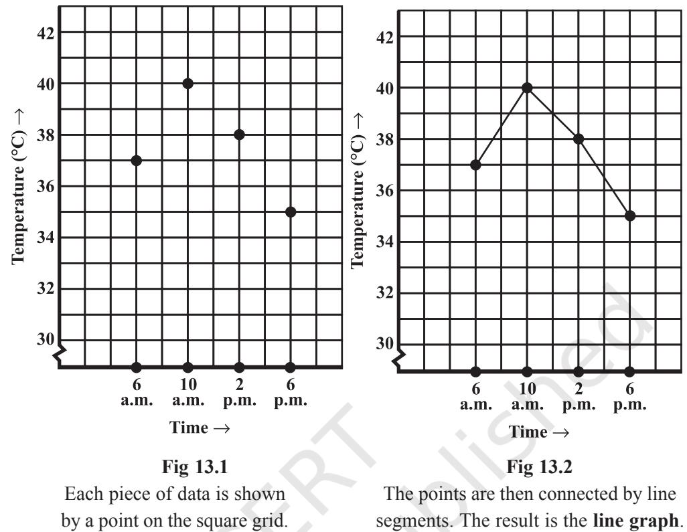
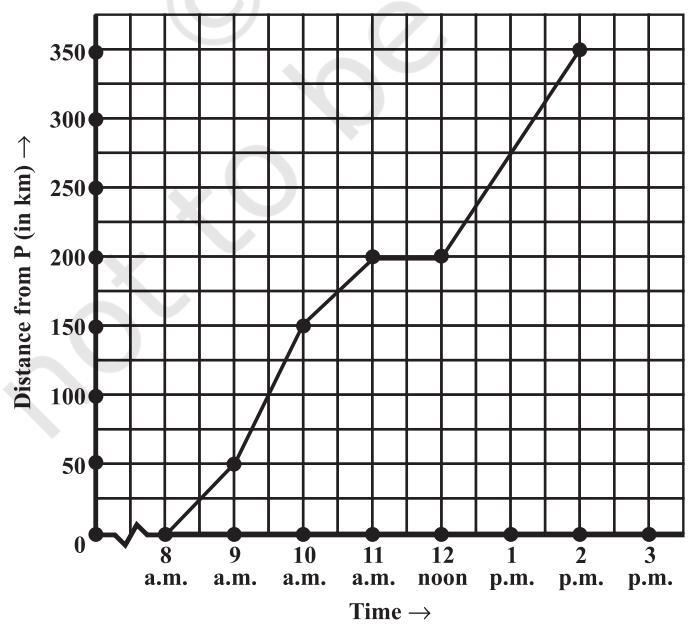
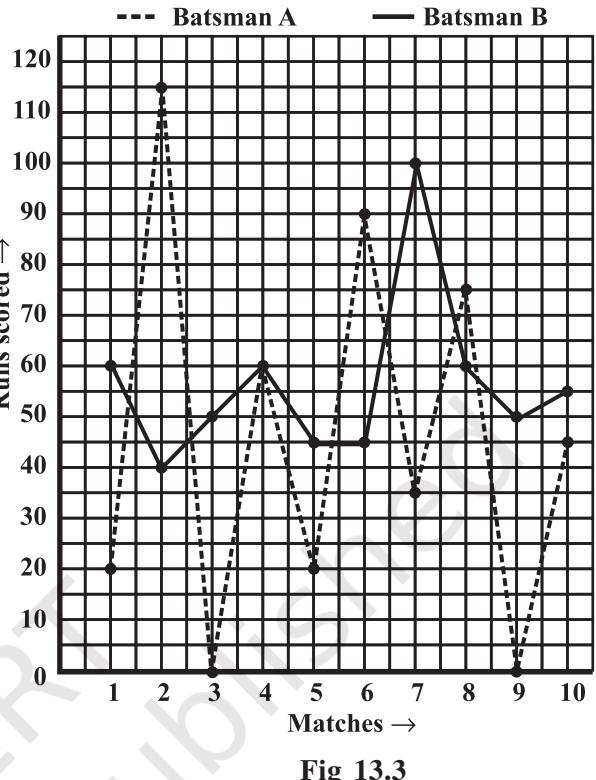
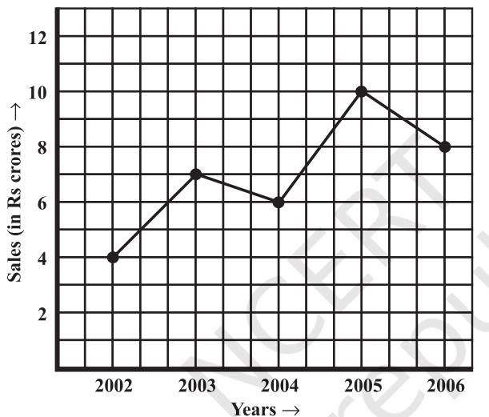
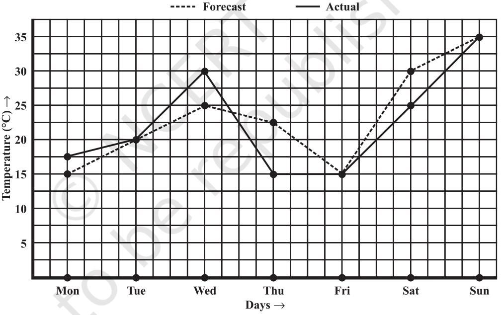
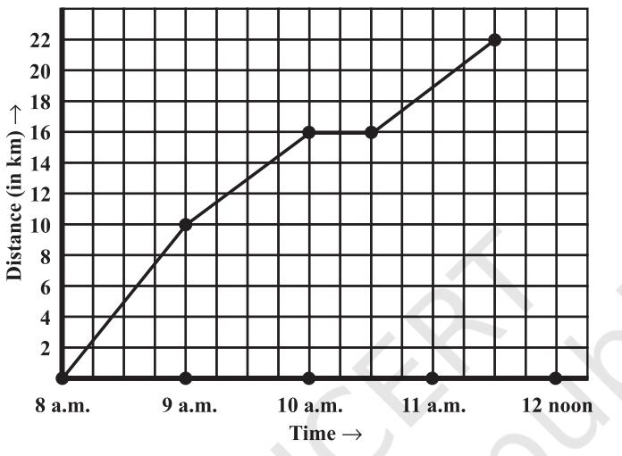
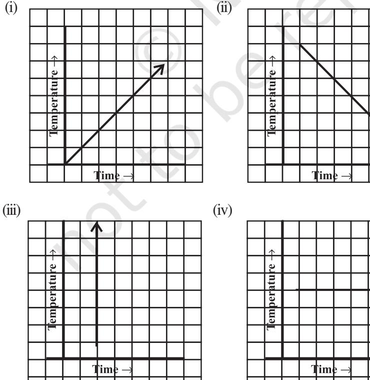
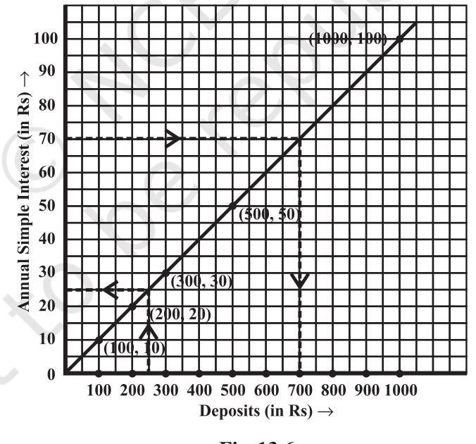
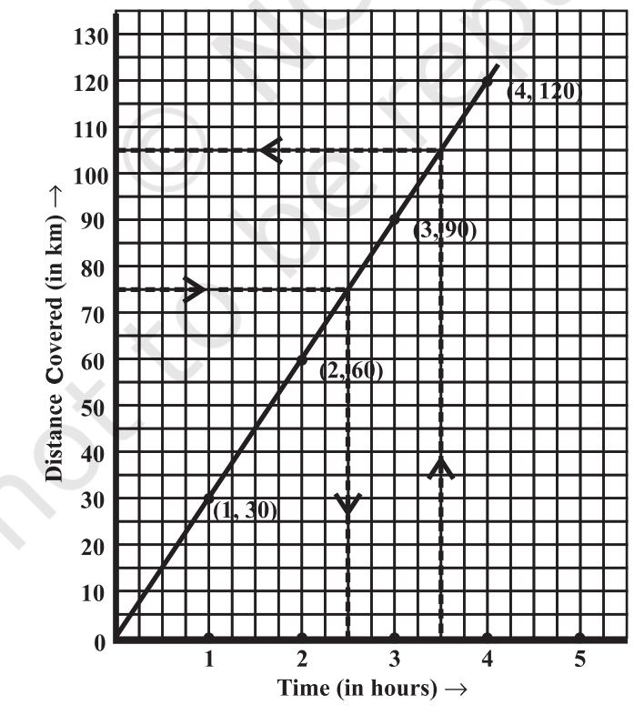

# Introduction to Graphs

CHAPTER

13

INTRODUCTION TO GRAPHS 157

## 13.1 Introduction

Have you seen graphs in the newspapers, television, magazines, books etc.? The purpose of the graph is to show numerical facts in visual form so that they can be understood quickly, easily and clearly. Thus graphs are visual representations of data collected. Data can also be presented in the form of a table; however a graphical presentation is easier to understand. This is true in particular when there is **a trend** or **comparison** to be shown.

We have already seen some types of graphs. Let us quickly recall them here.

## 13.1.1 A line graph

A **line graph** displays data that changes continuously over periods of time.

When Renu fell sick, her doctor maintained a record of her body temperature, taken every four hours. It was in the form of a graph (shown in Fig 13.1 and Fig 13.2). We may call this a "time-temperature graph".

It is a pictorial representation of the following data, given in tabular form.

| Time | 6 a.m. | 10 a.m. | 2 p.m. | 6 p.m. |
| --- | --- | --- | --- | --- |
| Temperature(°C) | 37 | 40 | 38 | 35 |

The horizontal line (usually called the *x*-axis) shows the timings at which the temperatures were recorded. What are labelled on the vertical line (usually called the *y*-axis)?

What all does this graph tell you? For example you can see the pattern of temperature; more at 10 a.m. (see Fig 13.3) and then decreasing till 6 p.m. Notice that the temperature increased by 3° C(= 40° C – 37° C) during the period 6 a.m. to 10 a.m.

There was no recording of temperature at 8 a.m., however the graph *suggests* that it was more than 37 °C (How?).

#### **Example 1: (A graph on "performance")**

The given graph (Fig 13.3) represents the total runs scored by two batsmen A and B, during each of the ten different matches in the year 2007. Study the graph and answer the following questions.

- (i) What information is given on the two axes?
- (ii) Which line shows the runs scored by batsman A?
- (iii) Were the run scored by them same in any match in 2007? If so, in which match?
- (iii) Among the two batsmen, who is steadier? How do you judge it?

#### **Solution:**

- (i) The horizontal axis (or the *x*-axis) indicates the matches played during the year 2007. The vertical axis (or the *y*-axis) shows the total runs scored in each match.
- (ii) The dotted line shows the runs scored by Batsman A. (This is already indicated at the top of the graph).
- (iii) During the 4th match, both have scored the same number of 60 runs. (This is indicated by the point at which both graphs meet).
- (iv) Batsman A has one great "peak" but many deep "valleys". He does not appear to be consistent. B, on the other hand has never scored below a total of 40 runs, even though his highest score is only 100 in comparison to 115 of A. Also A has scored a zero in two matches and in a total of 5 matches he has scored less than 40 runs. Since A has a lot of ups and downs, B is a more consistent and reliable batsman.

Example 2: The given graph (Fig 13.4) describes the distances of a car from a city P at different times when it is travelling from City P to City Q, which are 350 km apart. Study the graph and answer the following:

- (i) What information is given on the two axes?
- (ii) From where and when did the car begin its journey?
- (iii) How far did the car go in the first hour?
- (iv) How far did the car go during (i) the 2nd hour? (ii) the 3rd hour?
- (v) Was the speed same during the first three hours? How do you know it?
- (vi) Did the car stop for some duration at any place? Justify your answer.
- (vii) When did the car reach City Q?

**Fig 13.4**

**Fig 13.3**

## Solution:

- (i) The horizontal (*x*) axis shows the time. The vertical (*y*) axis shows the distance of the car from City P.
- (ii) The car started from City P at 8 a.m.
- (iii) The car travelled 50 km during the first hour. [This can be seen as follows. At 8 a.m. it just started from City P.At 9 a.m. it was at the 50th km (seen from graph). Hence during the one-hour time between 8 a.m. and 9 a.m. the car travelled 50 km].
- (iv) The distance covered by the car during
	- (a) the 2nd hour (i.e., from 9 am to 10 am) is 100 km, (150 50).
	- (b) the 3rd hour (i.e., from 10 am to 11 am) is 50 km (200 150).
- (v) From the answers to questions (iii) and (iv), we find that the speed of the car was not the same all the time. (In fact the graph illustrates how the speed varied).
- (vi) We find that the car was 200 km away from city P when the time was 11 a.m. and also at 12 noon. This shows that the car did not travel during the interval 11 a.m. to 12 noon. The horizontal line segment representing "travel" during this period is illustrative of this fact.
- (vii) The car reached City Q at 2 p.m.

## EXERCISE 13.1

- **1.** The following graph shows the temperature of a patient in a hospital, recorded every hour.
	- (a) What was the patient's temperature at 1 p.m. ?
	- (b) When was the patient's temperature 38.5° C?

- (c) The patient's temperature was the same two times during the period given. What were these two times?
- (d) What was the temperature at 1.30 p.m.? How did you arrive at your answer?
- (e) During which periods did the patients' temperature showed an upward trend?
- **2.** The following line graph shows the yearly sales figures for a manufacturing company.
	- (a) What were the sales in (i) 2002 (ii) 2006?
	- (b) What were the sales in (i) 2003 (ii) 2005?
	- (c) Compute the difference between the sales in 2002 and 2006.
	- (d) In which year was there the greatest difference between the sales as compared to its previous year?

- **3.** For an experiment in Botany, two different plants, plant A and plant B were grown under similar laboratory conditions. Their heights were measured at the end of each week for 3 weeks. The results are shown by the following graph.

- (a) How high was Plant A after (i) 2 weeks (ii) 3 weeks?
- (b) How high was Plant B after (i) 2 weeks (ii) 3 weeks?
- (c) How much did Plant A grow during the 3rd week?
- (d) How much did Plant B grow from the end of the 2nd week to the end of the 3rd week?
- (e) During which week did Plant A grow most?
- (f) During which week did Plant B grow least?
- (g) Were the two plants of the same height during any week shown here? Specify.
- **4.** The following graph shows the temperature forecast and the actual temperature for each day of a week.
	- (a) On which days was the forecast temperature the same as the actual temperature?
	- (b) What was the maximum forecast temperature during the week?
	- (c) What was the minimum actual temperature during the week?
	- (d) On which day did the actual temperature differ the most from the forecast temperature?

- **5.** Use the tables below to draw linear graphs.
	- (a) The number of days a hill side city received snow in different years.

| Year | 2003 | 2004 | 2005 | 2006 |
| --- | --- | --- | --- | --- |
| Days | 8 | 10 | 5 | 12 |

- (b) Population (in thousands) of men and women in a village in different years.

| Year | 2003 | 2004 | 2005 | 2006 | 2007 |
| --- | --- | --- | --- | --- | --- |
| Number of Men | 12 | 12.5 | 13 | 13.2 | 13.5 |
| Number of Women | 11.3 | 11.9 | 13 | 13.6 | 12.8 |

- **6.** A courier-person cycles from a town to a neighbouring suburban area to deliver a parcel to a merchant. His distance from the town at different times is shown by the following graph.
	- (a) What is the scale taken for the time axis?
	- (b) How much time did the person take for the travel?
	- (c) How far is the place of the merchant from the town?
	- (d) Did the person stop on his way? Explain.
	- (e) During which period did he ride fastest?

- **7.** Can there be a time-temperature graph as follows? Justify your answer.

## 13.2 Some Applications

In everyday life, you might have observed that the more you use a facility, the more you pay for it. If more electricity is consumed, the bill is bound to be high. If less electricity is used, then the bill will be easily manageable. This is an instance where one quantity affects another. Amount of electric bill depends on the quantity of electricity used. We say that the quantity of electricity is an **independent variable** (or sometimes **control variable**) and the amount of electric bill is **the dependent variable**. The relation between such variables can be shown through a graph.

## THINK, DISCUSS AND WRITE

The number of litres of petrol you buy to fill a car's petrol tank will decide the amount you have to pay. Which is the independent variable here? Think about it.

#### Example 3: **(Quantity and Cost)**

The following table gives the quantity of petrol and its cost.

| No. of Litres of petrol | 10 | 15 | 20 | 25 |
| --- | --- | --- | --- | --- |
| Cost of petrol in ` | 500 | 750 | 1000 | 1250 |

Plot a graph to show the data.

Solution: (i) Let us take a suitable scale on both the axes (Fig 13.5).

- (ii) Mark number of litres along the horizontal axis.
- (iii) Mark cost of petrol along the vertical axis.
- (iv) Plot the points: (10,500), (15,750), (20,1000), (25,1250).
- (v) Join the points.

We find that the graph is a line. (It is a linear graph). Why does this graph pass through the origin? Think about it.

This graph can help us to estimate a few things. Suppose we want to find the amount needed to buy 12 litres of petrol. Locate 12 on the horizontal axis.

Follow the vertical line through 12 till you meet the graph at P (say).

From P you take a horizontal line to meet the vertical axis. This meeting point provides the answer.

This is the graph of a situation in which two quantities, are in direct variation. (How ?). In such situations, the graphs will always be linear.

## TRY THESE

In the above example, use the graph to find how much petrol can be purchased for ` 800.

#### Example 4: **(Principal and Simple Interest)**

A bank gives 10% Simple Interest (S.I.) on deposits by senior citizens. Draw a graph to illustrate the relation between the sum deposited and simple interest earned. Find from your graph

- (a) the annual interest obtainable for an investment of ` 250.
- (b) the investment one has to make to get an annual simple interest of ` 70.

## Solution:

| Sum deposited | Simple interest for a year |  |
| --- | --- | --- |
| ` 100 | × × 100 1 10 ` | = ` 10 |
|  | 100 |  |
| ` 200 | × × 200 1 10 ` | = ` 20 |
|  | 100 |  |
| ` 300 | × × 300 1 10 ` | = ` 30 |
|  | 100 |  |
| ` 500 | × × 500 1 10 ` | = ` 50 |
|  | 100 |  |
| ` 1000 | ` 100 |  |

#### **Steps to follow:**

- 1. Find the quantities to be plotted as Deposit and SI.
- 2. Decide the quantities to be taken on *x*-axis and on *y*-axis.
- 3. Choose a scale.
- 4. Plot points.
- 5. Join the points.

We get a table of values.

| Deposit (in `) | 100 | 200 | 300 | 500 | 1000 |
| --- | --- | --- | --- | --- | --- |
| Annual S.I. (in `) | 10 | 20 | 30 | 50 | 100 |

- (i) Scale : 1 unit = ` 100 on horizontal axis; 1 unit = ` 10 on vertical axis.
- (ii) Mark Deposits along horizontal axis.
- (iii) Mark Simple Interest along vertical axis.
- (iv) Plot the points : (100,10), (200, 20), (300, 30), (500,50) etc.
- (v) Join the points. We get a graph that is a line (Fig 13.6).
	- (a) Corresponding to ` 250 on horizontal axis, we get the interest to be ` 25 on vertical axis.

## TRY THESE

Is Example 4, a case of direct variation?

- (b) Corresponding to ` 70 on the vertical axis, we get the sum to be ` 700 on the horizontal axis.

#### **Fig 13.6**

#### Example 5: **(Time and Distance)**

Ajit can ride a scooter constantly at a speed of 30 kms/hour. Draw a time-distance graph for this situation. Use it to find

- (i) the time taken by Ajit to ride 75 km. (ii) the distance covered by Ajit in 3 1 2 hours.
#### Solution:

| Hours of ride | Distance covered |
| --- | --- |
| 1 hour | 30 km |
| 2 hours | 2 × 30 km = 60 km |
| 3 hours | 3 × 30 km = 90 km |
| 4 hours | 4 × 30 km = 120 km and so on. |

We get a table of values.

| Time (in hours) | 1 | 2 | 3 | 4 |
| --- | --- | --- | --- | --- |
| Distance covered (in km) | 30 | 60 | 90 | 120 |

(i) Scale: (Fig 13.7)

Horizontal: 2 units = 1 hour

Vertical: 1 unit = 10 km

- (ii) Mark time on horizontal axis.
(iii) Mark distance on vertical axis.

- (iv) Plot the points: (1, 30), (2, 60), (3, 90), (4, 120).

**Fig 13.7**

- (v) Join the points. We get a linear graph.
	- (a) Corresponding to 75 km on the vertical axis, we get the time to be 2.5 hours on the horizontal axis. Thus 2.5 hours are needed to cover 75 km.
	- (b) Corresponding to 3 1 2 hours on the horizontal axis, the distance covered is 105 km on the vertical axis.

## EXERCISE 13.2

- **1.** Draw the graphs for the following tables of values, with suitable scales on the axes. (a) Cost of apples

| Number of apples | 1 | 2 | 3 | 4 | 5 |
| --- | --- | --- | --- | --- | --- |
| Cost (in `) | 5 | 10 | 15 | 20 | 25 |

- (b) Distance travelled by a car

| Time (in hours) | 6 a.m. | 7 a.m. | 8 a.m. | 9 a.m. |
| --- | --- | --- | --- | --- |
| Distances (in km) | 40 | 80 | 120 | 160 |

- (i) How much distance did the car cover during the period 7.30 a.m. to 8 a.m?
- (ii) What was the time when the car had covered a distance of 100 km since it's start?
- (c) Interest on deposits for a year.

| Deposit (in `) | 1000 | 2000 | 3000 | 4000 | 5000 |
| --- | --- | --- | --- | --- | --- |
| Simple Interest (in `) | 80 | 160 | 240 | 320 | 400 |

- (i) Does the graph pass through the origin?
- (ii) Use the graph to find the interest on ` 2500 for a year.
- (iii) To get an interest of ` 280 per year, how much money should be deposited?
- **2.** Draw a graph for the following.

| (i) | Side of square (in cm) | 2 | 3 | 3.5 | 5 | 6 |
| --- | --- | --- | --- | --- | --- | --- |
|  | Perimeter (in cm) | 8 | 12 | 14 | 20 | 24 |

Is it a linear graph?

|  | 1000 |
| --- | --- |
| . | . |

| (ii) | Side of square (in cm) | 2 | 3 | 4 | 5 | 6 |
| --- | --- | --- | --- | --- | --- | --- |
|  | Area (in cm2 ) | 4 | 9 | 16 | 25 | 36 |

Is it a linear graph?

## WHAT HAVE WE DISCUSSED?

- **1.** Graphical presentation of data is easier to understand.
- **2.** A **line graph** displays data that changes continuously over periods of time.
- **3.** A line graph which is a whole unbroken line is called a **linear graph**.
- **4.** For fixing a point on the graph sheet we need, *x***-coordinate** and *y***-coordinate**.
- **5.** The relation between **dependent variable** and **independent variable** is shown through a graph.

