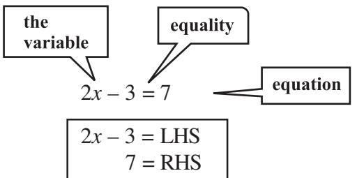
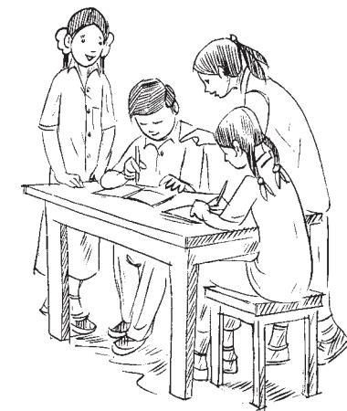

#### 2.1 Introduction

In the earlier classes, you have come across several **algebraic expressions** and **equations**. Some examples of expressions we have so far worked with are:

> 5*x*, 2*x* – 3, 3*x* + *y*, 2*xy* + 5, *xyz* + *x* + *y* + *z*, *x*2 + 1, *y* + *y*2

Some examples of equations are: 5*x* = 25, 2*x* – 3 = 9, 5 37 2 , 6 10 2 2 2 *y z* + = + =−

You would remember that equations use the *equality* (=) sign; it is missing in expressions.

Of these given expressions, many have more than one variable. For example, 2*xy* + 5 has two variables. We however, restrict to expressions with only one variable when we form equations. Moreover, the expressions we use to form equations are linear. This means that the highest power of the variable appearing in the expression is 1.

These are linear expressions:

2x, 2x + 1, 3y - 7, 12 - 5z, 5 (x - 4) + 10

These are **not** linear expressions:

*x*2

 + 1, *y* + *y*2 , 1 + *z* + *z*2 + *z*3 (since highest power of variable > 1)

Here we will deal with equations with linear expressions in one variable only. Such equations are known as **linear equations in one variable**. The simple equations which you studied in the earlier classes were all of this type.

Let us briefly revise what we know:

(a) *An algebraic equation is an equality involving variables*. It has an *equality sign*. The expression on the left of the equality sign is the *Left Hand Side* (LHS). The expression on the right of the equality sign is the *Right Hand Side* (RHS).

 

- (b) In an equation the *values of the expressions on the LHS and RHS are equal*. This happens to be *true* only for certain values of the variable. These values are the **solutions** of the equation.
*x* = 5 is the solution of the equation 2*x* – 3 = 7. For *x* = 5, LHS = 2 × 5 – 3 = 7 = RHS On the other hand *x* = 10 is not a solution of the equation. For *x* = 10, LHS = 2 × 10 –3 = 17. This is not equal to the RHS

- (c) *How to find the solution of an equation?* We assume that the two sides of the equation are balanced. We perform the same mathematical operations on both sides of the equation, so that the balance is not disturbed. A few such steps give the solution.

#### 2.2 Solving Equations having the Variable on both Sides

An equation is the equality of the values of two expressions. In the equation 2*x* – 3 = 7, the two expressions are 2*x* – 3 and 7. In most examples that we have come across so far, the RHS is just a number. But this need not always be so; both sides could have expressions with variables. For example, the equation 2*x* – 3 = *x* + 2 has expressions with a variable on both sides; the expression on the LHS is (2*x* – 3) and the expression on the RHS is (*x* + 2).

- We now discuss how to solve such equations which have expressions with the variable on both sides.
Example 1: Solve 2*x* – 3 = *x* + 2

Solution: We have

|  | 2x = | x + 2 + 3 |  |
| --- | --- | --- | --- |
| or | 2x = | x + 5 |  |
| or | 2x – x = | x + 5 – x | (subtracting x from both sides) |
| or | x = | 5 | (solution) |

Here we subtracted from both sides of the equation, not a number (constant), but a term involving the variable. We can do this as variables are also numbers. Also, note that subtracting *x* from both sides amounts to transposing *x* to LHS.

Example 2: Solve 5*x* + 7 3 14 2 2 = − *x*

Solution: Multiply both sides of the equation by 2. We get

$$2\times\left(5x+{\frac{7}{2}}\right)=2\times\left({\frac{3}{2}}\,x-14\right)$$

|  |  |  |  (2 × 5x) + 2 | × | 7  |  2 × | 3 |  x  | − ( | 2 | × | 14 ) |  |  |
| --- | --- | --- | --- | --- | --- | --- | --- | --- | --- | --- | --- | --- | --- | --- |
|  |  |  |   2 |  |  =  |   | 2 |  |  |  |  |  |  |  |
| or |  |  | 10x + 7 = |  |  | 3x – 28 |  |  |  |  |  |  |  |  |
| or |  |  | 10x – 3x + 7 = |  |  | – 28 |  |  |  |  |  |  | (transposing 3x to LHS) |  |
| or |  |  |  |  | 7x + 7 = | – 28 |  |  |  |  |  |  |  |  |
| or |  |  |  |  | 7x = | – 28 – 7 |  |  |  |  |  |  |  |  |
| or |  |  |  |  | 7x = | – 35 |  |  |  |  |  |  |  |  |
| or | x = | − 35 7 |  | or |  |  | x = | – 5 |  |  |  |  |  | (solution) |

#### EXERCISE 2.1

Solve the following equations and check your results.

| 1. | 3x = 2x + 18 | 2. | 5t – 3 = 3t – 5 | 3. | 5x + 9 = 5 + 3x | 4. | 4z + 3 = 6 + 2z | 5. | 2x – 1 = 14 – x | 6. | 8x + 4 = 3 (x – 1) + 7 |  |  |  |  |  |  |  |  |  |  |
| --- | --- | --- | --- | --- | --- | --- | --- | --- | --- | --- | --- | --- | --- | --- | --- | --- | --- | --- | --- | --- | --- |
| 4 | 2 | x | 7 | x | 5 | 26 | + | 3 | − | y | 7. | x = | 5 (x + 10) | 8. | 9. | 2y + | + 1 = | 3 = | 3 | 15 | 3 |
| 8 | 10. | 3m = 5 m – | 5 |  |  |  |  |  |  |  |  |  |  |  |  |  |  |  |  |  |  |

#### 2.3 Reducing Equations to Simpler Form

| Example 16: Solve | 6 x + 1 x − 3 + 1 = |  |
| --- | --- | --- |
|  | 3 6 | Why 6? Because it is the |
| Solution: | Multiplying both sides of the equation by 6, | smallest multiple (or LCM) of the given denominators. |
|  | 6 (6 x + 1) 6( x − 3) + 6 × 1 = |  |
|  | 3 6 |  |
| or | 2 (6x + 1) + 6 = x – 3 |  |
| or | 12x + 2 + 6 = x – 3 | (opening the brackets ) |
| or | 12x + 8 = x – 3 |  |
| or | 12x – x + 8 = – 3 |  |
| or | 11x + 8 = – 3 |  |
| or | 11x = –3 – 8 |  |
| or | 11x = –11 |  |
| or | x = – 1 | (required solution) |

**C***heck:* LHS = 6( 1) 1 6 1 1 1 3 3 − + −+ += + = 5 3 53 2 33 3 3 − −+ − += = RHS = ( 1) 3 4 2 6 63 −− − − = = LHS = RHS. (as required) Example 17: Solve 5*x* – 2 (2*x –* 7) = 2 (3*x –* 1) + 7 2 Solution: Let us open the brackets, LHS = 5*x –* 4*x* + 14 = *x* + 14 RHS = 6*x* – 2 + 7 2 = 47 3 6 6 22 2 *x x* −+= + The equation is *x* + 14 = 6*x* + 3 2 or 14 = 6*x* – *x* + 3 2 or 14 = 5*x* + 3 2 or 14 – 3 2 = 5*x* (transposing 3 2 ) or 28 3 2 − = 5*x* or 25 2 = 5*x* or *x* = 25 1 5 5 5 2 5 25 2 × ×= = × Therefore, required solution is *x* = 5 2 . *Check***:** LHS = = 25 25 25 2(5 7) 2( 2) 4 2 2 2 − − = −−= + = 25 8 33 2 2 + = RHS = = 26 7 33 2 2 + = = LHS. (as required) Did you observe how we simplified the form of the given equation? Here, we had to multiply both sides of the equation by the LCM of the denominators of the terms in the expressions of the equation. Note, in this example we brought the equation to a simpler form by opening brackets and combining like terms on both sides of the equation.

## EXERCISE 2.2

Solve the following linear equations.

- **1.** 1 1 2534 *x x* −=+ **2.** 3 5 21 24 6 *nnn* −+= **3.** 8 17 5 7 362 *x x x* +− = − **4.** 5 3 3 5 *x x* − − = **5.** 3 22 32 4 33 *t t t* − + − =− **6.** 1 2 1 2 3 *m m m* − − − =−
Simplify and solve the following linear equations.

- **7.** 3(*t* 3) = 5(2*t* + 1) **8.** 15(*y* 4) –2(*y* 9) + 5(*y* + 6) = 0
- **9.** 3(5*z* 7) 2(9*z* 11) = 4(8*z* 13) 17
- **10.** 0.25(4*f* 3) = 0.05(10*f* 9)

### WHAT HAVE WE DISCUSSED?

- **1.** An algebraic equation is an equality involving variables. It says that the value of the expression on one side of the equality sign is equal to the value of the expression on the other side.
- **2.** The equations we study in Classes VI, VII and VIII are linear equations in one variable. In such equations, the expressions which form the equation contain only one variable. Further, the equations are linear, i.e., the highest power of the variable appearing in the equation is 1.
- **3.** An equation may have linear expressions on both sides. Equations that we studied in Classes VI and VII had just a number on one side of the equation.
- **4.** Just as numbers, variables can, also, be transposed from one side of the equation to the other.
- **5.** Occasionally, the expressions forming equations have to be simplified before we can solve them by usual methods. Some equations may not even be linear to begin with, but they can be brought to a linear form by multiplying both sides of the equation by a suitable expression.
- **6.** The utility of linear equations is in their diverse applications; different problems on numbers, ages, perimeters, combination of currency notes, and so on can be solved using linear equations.

